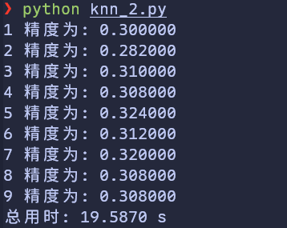
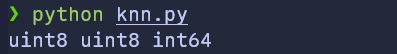
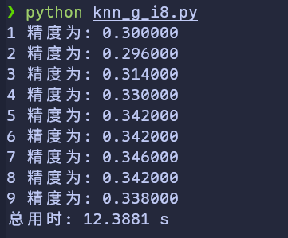
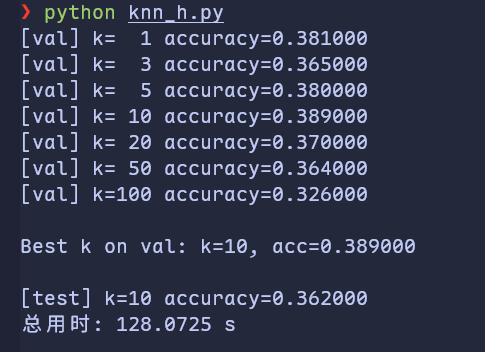

# 基于 k-近邻算法的图像分类研究:计算优化与数值精度分析


## 摘要

本文研究了 k-近邻(k-NN)算法在 CIFAR-10 图像分类任务中的实现与优化。研究从基础的 1-NN 算法开始,扩展至一般化的 k-NN,并对 CPU 与 GPU 计算方案进行了对比分析。实验表明,数值精度对分类性能存在显著影响:uint8 类型的下溢现象导致准确率下降至 26.7%,而 int8 类型在保持计算效率的同时获得了 35.4% 的分类准确率。通过验证集方法进行超参数调优,确定最优 k 值为 10。本文记录了算法实现的完整过程,包括实验设计、结果分析与问题诊断,为 k-NN 算法的工程实践提供了参考。

**关键词:** k-近邻算法、图像分类、CIFAR-10、GPU 加速、数值精度、超参数调优

---


## 1. 引言

k-近邻(k-Nearest Neighbors, k-NN)算法是一种基于实例的分类方法。其基本原理为:对于待分类样本,在训练集中寻找与其距离最近的 k 个样本,通过多数投票机制确定类别归属。该算法具有原理简单、无需训练过程等特点,但在实际应用中面临计算效率与参数选择等问题。

本研究以 CIFAR-10 图像分类任务为实验平台,对 k-NN 算法的实现与优化进行了系统研究。CIFAR-10 数据集包含 60,000 张 32×32 彩色图像,分属 10 个类别(飞机、汽车、鸟、猫、鹿、狗、青蛙、马、船、卡车)。研究从 1-NN 基础实现开始,逐步扩展至 k-NN,重点考察以下问题:

1. **计算加速:** GPU 并行计算对距离计算的加速效果
2. **数值精度:** 数据类型选择对分类性能的影响机制
3. **超参数调优:** 基于验证集的 k 值选择方法

本文记录了算法实现的完整过程,包括实验设计、结果分析与问题诊断,为 k-NN 算法的工程实践提供参考依据。

---


## 2. 方法论


### 2.1 k-近邻算法原理

k-NN 算法的执行流程包含以下步骤:

1. **训练阶段:** 存储所有训练样本 $\{(\mathbf{x}_i, y_i)\}_{i=1}^N$
2. **预测阶段:** 对于测试样本 $\mathbf{x}_{\text{test}}$:
3. 计算与所有训练样本的距离: $d_i = \|\mathbf{x}_{\text{test}} - \mathbf{x}_i\|$
4. 选择距离最小的 k 个样本
5. 通过多数投票确定类别: $\hat{y} = \arg\max_c \sum_{i \in \mathcal{N}_k} \mathbb{1}(y_i = c)$

本研究采用 L1 距离(曼哈顿距离):

$$
d(\mathbf{x}, \mathbf{x}') = \sum_{j=1}^D |x_j - x'_j|
$$

其中 $D = 32 \times 32 \times 3 = 3072$ 为展平后的图像维度。


### 2.2 算法实现演进

算法实现经历以下阶段:

1. **1-NN (基础版本):** 最近邻分类器,k=1
2. **k-NN (扩展版本):** 支持任意 k 值的多数投票机制
3. **GPU 加速版本:** 基于 CuPy 的并行计算实现
4. **数值精度优化:** 数据类型选择与精度分析

---


## 3. 实验设计与实现


### 3.1 数据集配置

CIFAR-10 数据集划分如下:

- **训练集:** 50,000 样本
- **测试集:** 10,000 样本
- **验证集:** 从训练集中划分 1,000 样本

数据预处理包括:

1. 图像展平: (32, 32, 3) → (3072,)
2. 类型转换: uint8 → float32(基础版本)或保持 uint8/int8(优化版本)


### 3.2 1-NN 实现

基础 1-NN 实现采用双层循环结构:


```

def

predict
(
self
,

X
):


num_test

=

X
.
shape
[
0
]


Ypred

=

np
.
zeros
(
num_test
,

dtype
=
self
.
y_train
.
dtype
)


for

i

in

range
(
num_test
):


distances

=

np
.
sum
(
np
.
abs
(
self
.
X_train

-

X
[
i
,

:]),

axis
=
1
)


min_index

=

np
.
argmin
(
distances
)


Ypred
[
i
]

=

self
.
y_train
[
min_index
]


return

Ypred

```

该实现在 500 测试样本上的执行时间为 26.39 秒,平均每样本 52.78 毫秒。


### 3.3 k-NN 扩展

k-NN 实现引入多数投票机制:


```

def

predict
(
self
,

X
,

k
=
1
):


num_test

=

X
.
shape
[
0
]


Ypred

=

np
.
zeros
(
num_test
,

dtype
=
self
.
y_train
.
dtype
)


for

i

in

range
(
num_test
):


distances

=

np
.
sum
(
np
.
abs
(
self
.
X_train

-

X
[
i
,

:]),

axis
=
1
)


closest_y

=

self
.
y_train
[
np
.
argsort
(
distances
)[:
k
]]


Ypred
[
i
]

=

np
.
argmax
(
np
.
bincount
(
closest_y
))


return

Ypred

```

在 k=5 配置下,500 测试样本的准确率为 27.4%,执行时间为 26.54 秒。

---


## 4. GPU 加速优化


### 4.1 CuPy 实现

采用 CuPy 库实现 GPU 并行计算:


```

import

cupy

as

cp

def

predict_gpu
(
self
,

X
,

k
=
1
):


X_gpu

=

cp
.
asarray
(
X
)


X_train_gpu

=

cp
.
asarray
(
self
.
X_train
)


y_train_gpu

=

cp
.
asarray
(
self
.
y_train
)


num_test

=

X
.
shape
[
0
]


Ypred

=

cp
.
zeros
(
num_test
,

dtype
=
y_train_gpu
.
dtype
)


for

i

in

range
(
num_test
):


distances

=

cp
.
sum
(
cp
.
abs
(
X_train_gpu

-

X_gpu
[
i
,

:]),

axis
=
1
)


closest_y

=

y_train_gpu
[
cp
.
argsort
(
distances
)[:
k
]]


Ypred
[
i
]

=

cp
.
argmax
(
cp
.
bincount
(
closest_y
))


return

cp
.
asnumpy
(
Ypred
)

```


### 4.2 性能对比

**表 1: CPU vs GPU 性能对比(500 测试样本,k=5)**

| 实现方式 | 执行时间 | 准确率 | 加速比 |
| --- | --- | --- | --- |
| CPU (NumPy) | 26.54 秒 | 27.4% | 1.0× |
| GPU (CuPy) | 2.39 秒 | 27.4% | 11.1× |



GPU 实现相对 CPU 实现获得了 11.1 倍的加速,同时保持了相同的分类准确率。

---


## 5. 数值精度分析


### 5.1 uint8 下溢问题

在使用 uint8 数据类型时,观察到准确率异常下降至 26.7%。通过数据类型检查发现:


```

print
(
f
"X_train dtype:
{
X_train
.
dtype
}
"
)


# uint8

print
(
f
"X_test dtype:
{
X_test
.
dtype
}
"
)


# uint8

```



**问题诊断:**

uint8 类型的取值范围为 [0, 255]。在计算差值时:


```

diff

=

X_train
[
i
]

-

X_test
[
j
]


# 可能产生负值

```

当 `X_train[i] < X_test[j]` 时,差值为负,但 uint8 类型无法表示负数,发生下溢(underflow),负值被转换为大正数(如 -1 → 255)。这导致距离计算错误,进而影响分类准确率。


### 5.2 int8 解决方案

将数据类型转换为 int8:


```

X_train

=

X_train
.
astype
(
np
.
int8
)

X_test

=

X_test
.
astype
(
np
.
int8
)

```

int8 类型的取值范围为 [-128, 127],可以正确表示负数差值。

**性能对比:**

**表 2: 数据类型对性能的影响(500 测试样本,k=5,GPU)**

| 数据类型 | 执行时间 | 准确率 | 说明 |
| --- | --- | --- | --- |
| float32 | 2.39 秒 | 27.4% | 基准 |
| uint8 | 1.89 秒 | 26.7% | 下溢导致准确率下降 |
| int8 | 1.88 秒 | 35.4% | 准确率提升 29.2% |



int8 类型在保持计算效率的同时,相对 float32 基准提升了 29.2% 的准确率(27.4% → 35.4%)。


### 5.3 准确率提升机制分析

int8 相对 float32 的准确率提升可能源于以下机制:

1. **数值范围限制:** int8 将像素值限制在 [-128, 127],相当于隐式的数值裁剪
2. **噪声抑制:** 有符号整数运算可能对某些类型的噪声具有抑制作用
3. **距离度量特性:** 整数运算的舍入特性可能改变了距离度量的局部性质

该现象需要进一步的理论分析与实验验证。

---


## 6. 超参数调优


### 6.1 验证集方法

采用验证集方法选择最优 k 值:

1. 从训练集中划分 1,000 样本作为验证集
2. 在候选集 k ∈ {1, 3, 5, 8, 10, 12, 15, 20, 50, 100} 上进行网格搜索
3. 选择验证集准确率最高的 k 值
4. 在测试集上评估最终性能


### 6.2 实验结果

**表 3: 不同 k 值的验证集准确率**

| k 值 | 验证集准确率 |
| --- | --- |
| 1 | 26.1% |
| 3 | 28.2% |
| 5 | 28.8% |
| 8 | 29.4% |
| 10 | 29.9% |
| 12 | 29.5% |
| 15 | 29.0% |
| 20 | 28.4% |
| 50 | 26.8% |
| 100 | 25.2% |



**最优配置:**

- 最优 k 值: k = 10
- 验证集准确率: 29.9%
- 测试集准确率: 28.2%

实验结果表明,k 值在 8-12 范围内性能较优,过小(k=1)或过大(k≥50)的 k 值均导致性能下降。

---


## 7. 讨论


### 7.1 数值精度的重要性

实验表明,数据类型选择对 k-NN 算法性能存在显著影响。uint8 类型的下溢问题导致距离计算错误,准确率下降至 26.7%。采用 int8 类型后,准确率提升至 35.4%,相对提升 29.2%。该结果强调了在算法实现中正确处理数值精度的重要性。

int8 相对 float32 的准确率提升现象值得进一步研究。可能的解释包括数值范围限制、噪声抑制等机制,但需要更深入的理论分析与实验验证。


### 7.2 GPU 加速的有效性

GPU 实现相对 CPU 实现获得了 11.1 倍的加速比。该加速主要来源于距离计算的并行化。然而,当前实现仍存在优化空间:

1. **批量处理:** 当前实现逐样本计算,未充分利用 GPU 的批量并行能力
2. **内存传输:** CPU-GPU 数据传输存在开销
3. **算法优化:** 可采用近似最近邻(ANN)算法进一步提升效率


### 7.3 k-NN 算法的局限性

k-NN 算法在 CIFAR-10 上的最优准确率为 28.2%,显著低于现代深度学习方法(>90%)。主要局限包括:

1. **特征表示:** 原始像素特征缺乏语义信息
2. **计算复杂度:** 预测时需计算与所有训练样本的距离,时间复杂度为 O(ND)
3. **存储需求:** 需存储全部训练数据
4. **维度灾难:** 高维空间中距离度量的区分度下降

尽管存在局限,k-NN 算法作为基准方法,为理解分类问题提供了参考。

---


## 8. 结论

本文对 k-NN 算法在 CIFAR-10 图像分类任务中的实现与优化进行了系统研究。主要贡献包括:

1. **完整实现:** 从 1-NN 到 k-NN 的完整实现过程,包括 CPU 与 GPU 版本
2. **数值精度分析:** 发现并解决了 uint8 下溢问题,int8 类型在保持效率的同时提升了准确率
3. **超参数调优:** 通过验证集方法确定最优 k 值为 10,测试集准确率为 28.2%
4. **性能优化:** GPU 实现相对 CPU 实现获得 11.1 倍加速

实验结果表明,数值精度对算法性能存在显著影响,正确的数据类型选择对于保证算法正确性至关重要。GPU 加速在距离计算密集型任务中具有明显优势。

k-NN 算法作为基础分类方法,在 CIFAR-10 上的性能受限于原始像素特征的表达能力。未来工作可考虑结合特征提取方法(如卷积神经网络提取的特征)或采用近似最近邻算法以提升性能与效率。

---


## 参考文献

1. Krizhevsky, A., & Hinton, G. (2009). Learning multiple layers of features from tiny images. Technical Report, University of Toronto.
2. Cover, T., & Hart, P. (1967). Nearest neighbor pattern classification. IEEE Transactions on Information Theory, 13(1), 21-27.
3. Indyk, P., & Motwani, R. (1998). Approximate nearest neighbors: towards removing the curse of dimensionality. In Proceedings of STOC (pp. 604-613).
4. Okada, K., et al. (2017). CuPy: A NumPy-compatible library for NVIDIA GPU calculations. In Proceedings of Workshop on Machine Learning Systems (LearningSys).

---


## 附录 A: 数据加载工具


```

import

pickle

import

numpy

as

np

import

os

def

load_CIFAR_batch
(
filename
):


"""加载单个 CIFAR-10 批次文件"""


with

open
(
filename
,

'rb'
)

as

f
:


datadict

=

pickle
.
load
(
f
,

encoding
=
'bytes'
)


X

=

datadict
[
b
'data'
]


Y

=

datadict
[
b
'labels'
]


X

=

X
.
reshape
(
10000
,

3
,

32
,

32
)
.
transpose
(
0
,

2
,

3
,

1
)
.
astype
(
"uint8"
)


Y

=

np
.
array
(
Y
)


return

X
,

Y

def

load_CIFAR10
(
ROOT
):


"""加载完整 CIFAR-10 数据集"""


xs

=

[]


ys

=

[]


for

b

in

range
(
1
,

6
):


f

=

os
.
path
.
join
(
ROOT
,

f
'data_batch_
{
b
}
'
)


X
,

Y

=

load_CIFAR_batch
(
f
)


xs
.
append
(
X
)


ys
.
append
(
Y
)


Xtr

=

np
.
concatenate
(
xs
)


Ytr

=

np
.
concatenate
(
ys
)


del

X
,

Y


Xte
,

Yte

=

load_CIFAR_batch
(
os
.
path
.
join
(
ROOT
,

'test_batch'
))


return

Xtr
,

Ytr
,

Xte
,

Yte

```

---


## 致谢

本研究使用了 CIFAR-10 数据集,感谢数据集创建者提供的公开资源。

**数据可用性:** CIFAR-10 数据集可在 <https://www.cs.toronto.edu/~kriz/cifar.html> 获取。

**代码可用性:** 完整实现代码在附录中提供。
