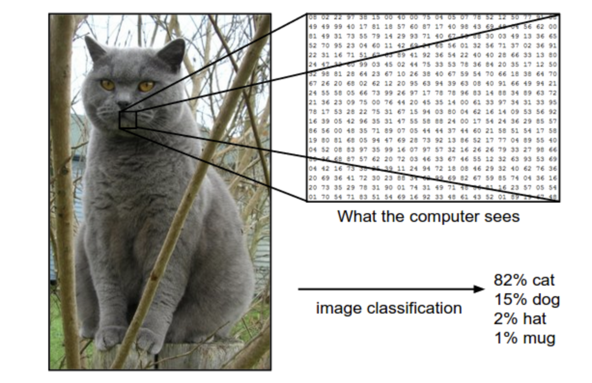
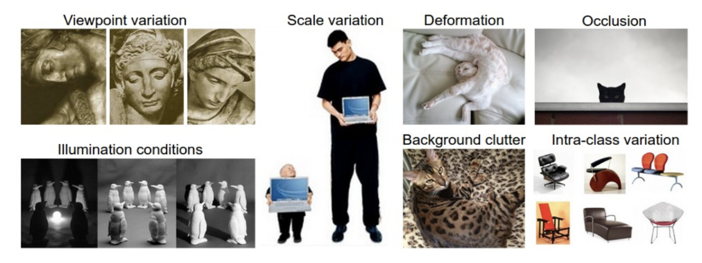
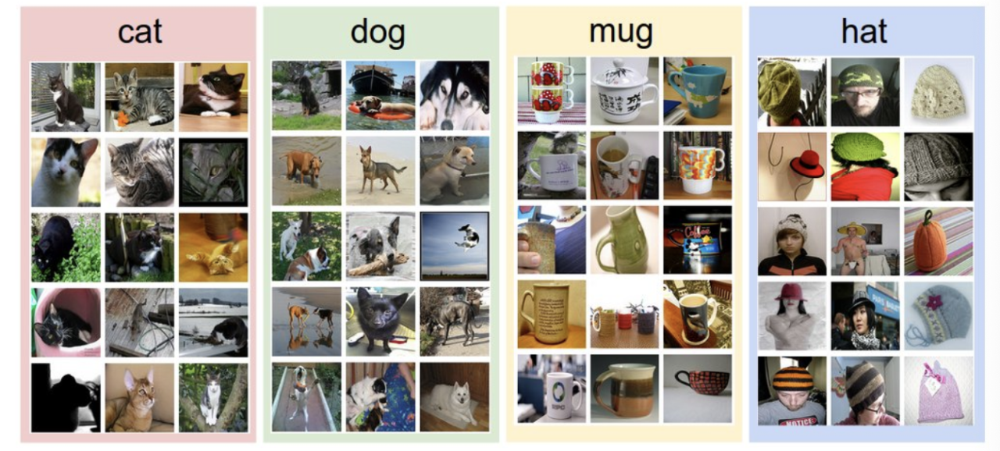
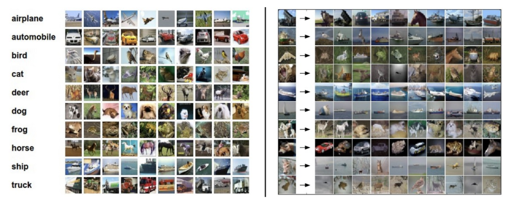
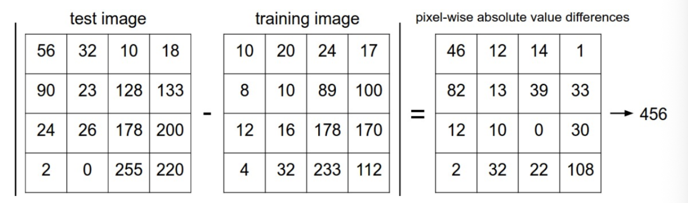
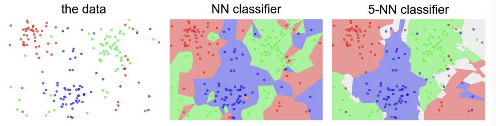
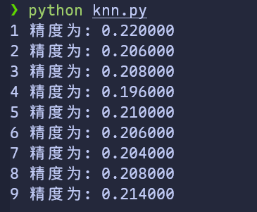

# 图像识别

这是一堂入门讲座，旨在向计算机视觉领域以外的人们介绍图像份额里问题以及数据驱动方法。目录：

- 图像分类
  - 最近邻分类器
  - k-最近邻分类器
  - 用于超参数调优的验证集
  - 摘要
  - 摘要：kNN的实际应用
    - 延伸阅读


## 图像分类

**动机**：这一节中我们将会介绍图像分类问题，这是一个将输入的图片分配到一个固定类别集合中的一个标签的任务。这是计算机视觉任务的核心问题之一，尽管简单，但依旧有各种各样的应用。此外，就像我们将在课程后面看到的，许多其它看似不同的计算机视觉任务(例如目标检测、分割)都可以简化为图像分类

**示例**：例如，在下图中，一个图像分类模型接受一个简单的任务，并生成该图片属于集合`{cat ,dog,hat,mug}`中各个标签的概率。需要注意的是，对于计算机来说，一张图片由一个巨大的3维数组构成。在这个示例中，这只猫猫图像的宽度为 248 像素，高度为 400 相似，并且有 3 个颜色通道红、绿、蓝（简称RGB）。因此，这个图像由 $248\times 400\times 3$ 个数字组成，总计 $297,600$ 个数字。每个数字是一个介于 0 (黑色)到 255 (白色)的整数。而我们的任务就是把这二十万个数字转换为一个标签，例如“cat”

---



图像分类任务就是为给定的图片预测一个标签(或者像这里给出一系列可能的标签的概率)。图像是0 ～ 255 范围的 3 维数组，尺寸为 $宽度\times 高度 \times 3$。其中 3 代表红绿蓝三个颜色通道

---

**困难**：尽管对人类来说，识别出一个像“猫”这样的视觉概念是一件相当简单的事，但是从计算机视觉算法的角度思考就是一个值得考虑的挑战了。在下面我们例举了一些计算机视觉遇到的挑战，请时刻记住，图像的原始表示形式是一个形式为亮度值的 3 维数组：

- **视角变化**：对于单个物体来说，可以有多个摄像角度
- **大小变化**：物体可视大小经常出现变化(这里同样指现实世界的大小，而不仅是图像中的)
- **形变 Deformatino**：很多物体的形状不是一成不变的，可以表现为多种形式
- **遮挡 Occlusion**：物体的形状可能被遮挡。有时只有物体的一小部分(甚至几个像素)可以被看到
- **光照条件 Illumination conditions**：在像素层面上，光照的影响非常大
- **背景杂乱 Background clutter**：物体可能混入背景之中，导致难以识别
- **类内差异 Intra-class variation**：一类物体的形状差异可能非常大，例如 *椅子*。这类物体有许多不同的对象，都有自己独特的形状

在上述条件交织下，一个好的图像识别模型必须能维持分类结论稳定的同时，保持对类间差异的敏感

---



---

**数据驱动方法**。如何写一个图像识别算法呢？这与写一个数字排序算法不同，我们是搞不清楚如何写一个从图片中认出一个猫的算法的。因此，与其在代码写明每一种物体的形状，不如像我们对待孩子那样：我们可以给计算机提供大量类别示例，然后开发一个学习算法去看这些例子，并学习每一个类别的视觉外形。这个方法就是 *数据驱动方法*。既然该方法的第一步是收集已经做好分类标注的图片来作为 *训练集*，那么我们来看一下数据集的样子：

---



一个用于 4 个视觉类别的训练集。事实上我们可能有数以千计的类别，每个类别还有成千上万的图片

---

**图片分类流程**。我们知道，图像识别就是输入一个元素为像素值的数组，然后给它分配一个分类标签。完整流程如下：

- **输入**：输入是包含了 N 个图像的几何，每个图片的标签是 K 个分类标签中的一种。我们称这些数据为 *训练集(training set)*
- **学习**：我们的任务是使用训练集去学习每一种分类长什么样。称这一步为 *训练分类器* 或 *学习模型*
- **评价**：最后，让分类器学习它之前从未见过的图像，并以此来评价分类器的质量。我们将这些图像的正确标签与分类器的预测标签做对比。毫无疑问，我们希望更多的预测可以符合正确答案(称为 *ground truth*)


## 最近邻分类

作为课程介绍的第一个方法，我们将尝试实现一个最近邻分类器。这个分类器和CNN（卷积神经网络）没有任何关系，实际中也很少使用。但通过实现它，我们可以理解图像识别问题的基本方法

**图像分类数据集：CIFAR-10**：一个常见的图像分类数据集是 [CIFAR-10 dataset](https://www.cs.toronto.edu/~kriz/cifar.html)。这个数据集有 60,000 张 32像素高、32像素宽的小图片。每个图片的标签是 10 个分类标签中的一种。这 6 万张图片分为包含 5 万张图片的训练集和包含 1 万张图片的测试集。下图中你可以看到 10 个类的10张随机图片

---



左：来自 [CIFAR-10 dataset](https://www.cs.toronto.edu/~kriz/cifar.html) 的样例。右：第一列是测试图像，然后第一列的每个测试图像右边是使用最近邻分类算法。根据像素差异，从训练集中选出 10 张最类似的图片

---

假设我们现在有CIFAR-10的 5 万张图片（每种分类 5000 张）作为训练集，我们希望将剩下的 1 万张打上标签。最近邻分类器将拿着测试图片去和每一个训练图像比较。并将它认为最接近的训练图片的标签赋给这张测试图片。可以注意到上面的 10 个测试中只有 3 个预测正确。比如第 8 行中，马头被分类为一个红色的跑车，可能是因为强烈的黑色背景，和马的图片接近，于是被错误地分类为汽车。

你可能注意到我们没有指明如何比较两个图片的细节，在本例中，我们比较的是两个 $32\times 32\times 3$ 的像素块。其中一个最简单的方法就是一个像素一个像素的比较，然后把差别加到一起。换句话说，就是把两张图片先转化为两个向量 $I_1、I_2$， 而比较合适的选择就是 **$L_1$ 距离**：

$$
d_1(I_1,I_2)=\sum_p|I_1^p-I_2^p|
$$

然后我们对所有像素点求和，下图是过程可视化：

---



以图片中的一个颜色通道作为示例。用 $L_1$ 距离计算两张图片之间的区别。逐个像素求差值，然后全部相加。如果两张图片完全相同，那么结果将会为0；同样的，如果两个图片非常不同，那么结果将非常的大

---

接下来让我们看一下这个分类器如何代码实现。首先，我们将 CIFAR-10 的数据加载到内存中，并分为 4 个数组：训练数据/标签和测试数据/标签。在下面的代码中,`Xtr` 包含了训练集的所有图片（大小为 $50,000\times 32\times 32\times 3$)，`Ytr` 是对应的长度为 50000 的 1 维数组，存有图像对应的分类标签（从0到9）


```

Xtr
,

Ytr
,

Xte
,

Yte

=

load_CIRFAR10
(
'data/cifar10/'
)


# a magic function provided


# flatten out all images to be one-dimensional

Xtr_rows

=

Xtr
.
reshape
(
Xtr
.
shape
[
0
],

32

*

32

*

3
)


# Xtr_rows becomes 50,000 * 3072

Xte_rows

=

Xte
.
reshape
(
Xte
.
shape
[
0
],

32

*

32

*

3
)


# Xte_rows becomes 10,000 * 3072

```

现在我们得到了所有图片的数据，并把它们拉长为行向量。接下来我们训练和评估分类器


```

nn

=

NearestNeighbor
()


# 创建一个最近邻分类器对象

nn
.
train
(
Xtr_rows
,

Ytr
)


# 根据训练图像和标签，训练分类器

Yte_predict

=

nn
.
predict
(
Xte_rows
)


# 根据测试图像预测标签


# 打印出来正确预测平均值作为分类准确性

print

"accuracy:
%f
"

%

(

np
.
mean
(
Yte_predict

==

Yte
)

)

```

使用准确率（accuracy）作为评估标准是很常见的，它描述了预测正确的得分。请注意以后我们实现的所有分类器必须使用这个常用API： `train(x,y)` 函数。这个函数使用训练集的数据和标签来进行训练。从内部来看，类应该实现一些关于标签和标签如何被预测的模型。同时有一个 `predict(X)` 函数，它的作用就是预测新输入数据的标签。当然，我们现在忽略了一些东西——分类器的实现。下面是使用 $L_1$ 距离的最近邻分类器的实现讨论：


```

import

numpy

as

np

class

NearestNeighbor
(
object
):


def

__init__
(
self
):


pass


def

train
(
self
,

X
,

y
):


"""

        X: (N, D) training data

        y: (N,) training labels

        """


self
.
Xtr

=

X


self
.
ytr

=

y


def

predict
(
self
,

X
):


"""

        X: (M, D) test data

        returns: (M,) predicted labels

        """


num_test

=

X
.
shape
[
0
]


Ypred

=

np
.
zeros
(
num_test
,

dtype
=
self
.
ytr
.
dtype
)


for

i

in

range
(
num_test
):


distances

=

np
.
sum
(
np
.
abs
(
self
.
Xtr

-

X
[
i
,

:]),

axis
=
1
)


# (N,)


min_index

=

np
.
argmin
(
distances
)


Ypred
[
i
]

=

self
.
ytr
[
min_index
]


return

Ypred

```

如果运行这个代码，会发现这个分类器在 CIFAR-10 的准确率只有 38.6%。比随机猜测的 10% 高了很多，但比人类的识别水平（[推测约为94%](https://karpathy.github.io/2011/04/27/manually-classifying-cifar10/)）或卷积神经网络的95% 差多了。（可以在这里看CIFAR-10的 [Kaggle 竞赛排行榜](https://www.kaggle.com/c/cifar-10/leaderboard))

**距离选择**：有许多方式计算两个向量之间的距离。另一种常见的替代方法是 $L_2$ 距离。从几何学的角度来看，它在计算两个向量之间的欧氏距离。距离计算公式如下：

$$
d_2(I_1,I_2)=\sqrt{\sum_p(I_1^p-I_2^p)^2}
$$

换句话说，我们依旧是计算像素点的差值，只是先求其平方，然后把这些平方全部加起来，最后对这个和开方。在numpy中，我们只需要简单替换一行即可：


```

distances

=

np
.
sqrt
(
np
.
sum
(
np
.
squqre
(
self
.
Xtr

-

X
[
i
,:]),
axis

=

1
))

```

这里虽然使用了 `np.sqrt` ，但是在实际中可能不用。因为求平方根是一个单调函数，它对不同距离的绝对值求平方根虽然改变了数值大小，但依然保持了不同距离大小的顺序。所以用不用都能对像素差异的大小进行正确比较。如果将这个模型用于 CIFAR-10 数据集，将可以得到 35.4% 的准确率（略低于 L1 距离的结果）

**L1 vs. L2**。比较这两个距离计算方式的区别挺有意思的。事实上，当面对两个不同向量的差异时，L2 距离比 L1 距离更不能容忍。也就是说，L2 距离更倾向于多个中等程度的差异而不是1个巨大差异。L1 和 L2 距离都是在 [p-norm](https://planetmath.org/vectorpnorm) 常用的特殊形式

效果展示

由于笔者没有什么算力支持，所以仅截取了前面的部分数据集进行训练和预测，得到了0.18的精度（）,下面是笔者的完整代码


```


# nn.py

import

numpy

as

np

from

data_utils

import

load_CIRFA10

class

NearestNeighbor
(
object
):

def

__init__
(
self
)

->

None
:


pass

def

train
(
self
,

X
,

y
):


self
.
Xtr

=

X


self
.
ytr

=

y

def

predict
(
self
,

X
):


num_test

=

X
.
shape
[
0
]


Ypred

=

np
.
zeros
(
num_test
,

dtype
=
self
.
ytr
.
dtype
)


for

i

in

range
(
num_test
):


distances

=

np
.
sum
(
np
.
abs
(
self
.
Xtr

-

X
[
i
,:]),

axis

=

1
)


min_index

=

np
.
argmin
(
distances
)


Ypred
[
i
]

=

self
.
ytr
[
min_index
]


return

Ypred

def

main
():


Xtr
,

Ytr
,

Xte
,

Yte

=

load_CIRFA10
(
'cifar-10-batches-py'
)


Xtr_rows

=

Xtr
.
reshape
(
Xtr
.
shape
[
0
],

32

*

32

*

3
)


Xte_rows

=

Xte
.
reshape
(
Xte
.
shape
[
0
],

32

*

32

*

3
)

nn

=

NearestNeighbor
()

nn
.
train
(
Xtr_rows
[:
2000
],

Ytr
[:
2000
])

Yte_predict

=

nn
.
predict
(
Xte_rows
[:
200
])

print

(
"accuracy:
%f
"

%

(
np
.
mean
(
Yte_predict

==

Yte
[:
200
])))

if

__name__

==

"__main__"
:


main
()

```


```


# data_utils.py

import

os

import

pickle

import

numpy

as

np

def

load_CIFAR_batch
(
filename
):


with

open
(
filename
,

"rb"
)

as

f
:


datadict

=

pickle
.
load
(
f
,

encoding
=
"bytes"
)


X

=

datadict
[
b
"data"
]


y

=

datadict
[
b
"labels"
]


X

=

X
.
reshape
(
10000
,

3
,

32
,

32
)
.
transpose
(
0
,

2
,

3
,

1
)


y

=

np
.
array
(
y
,

dtype
=
np
.
int64
)


return

X
,

y

def

load_CIRFA10
(
root
):


xs
,

ys

=

[],

[]


for

i

in

range
(
1
,

6
):


f

=

os
.
path
.
join
(
root
,

f
"data_batch_
{
i
}
"
)


X
,

y

=

load_CIFAR_batch
(
f
)


xs
.
append
(
X
)


ys
.
append
(
y
)


Xtr

=

np
.
concatenate
(
xs
,

axis
=
0
)


Ytr

=

np
.
concatenate
(
ys
,

axis
=
0
)


Xte
,

Yte

=

load_CIFAR_batch
(
os
.
path
.
join
(
root
,

"test_batch"
))


return

Xtr
,

Ytr
,

Xte
,

Yte

```


## k-最近邻分类器

你可能注意到，我们为什么只用最相似的1张图片的标签来预测测试图像的标签呢，这不是很奇怪吗？事实上，一般来说使用 **k-最近邻分类器** 可以做的更好。它的思想很简单：不在训练集里找单个最近的图像，而是找前 **k** 个最近的图片，并让它们对测试图像的标签进行投票。特别的，当 $k=1$ 的时候，我们又得到了最近邻分类器。只管来说， k值越大越有平滑效果，使得分类器更能抵抗异常(或者噪声)

---



这是一个最近邻分类器和 5-最近邻分类器的差异示例，使用了二维点和3个类（红、蓝、绿）。颜色区域表示使用L2距离的分类器的 **决策边界**。白色的区域则显示模糊分类的点（也就是至少有两类的类别投票相同）。在 NN 分类器中，异常数据点（例如一群蓝色点中的绿色点）会制造一个导致错误预测的孤岛。5-NN 分类器就平滑了这些不规则，使得测试数据得到了更好的 **泛化(generalization)** 。同时我们注意到 5-NN 图像也有灰色区域，这些区域是因为紧邻标签的最高票数相同（例如两个近邻是红色，另外两个是蓝色，还有一个是绿色）

---

事实上，你几乎总是用 k-NN 算法。但 *k* 的取值应该如何呢？我们接下来看看这个问题

查看knn代码

```

import

numpy

as

np

from

data_utils

import

load_CIRFA10

class

NearestNeighbor
(
object
):


def

__init__
(
self
,

k

=

5
):


self
.
k

=

k


def

train
(
self
,

X
,

y
):


self
.
Xtr

=

X


self
.
ytr

=

y


def

predict
(
self
,

X
):


num_test

=

X
.
shape
[
0
]


Ypred

=

np
.
zeros
(
num_test
,

dtype
=
self
.
ytr
.
dtype
)


k

=

int
(
self
.
k
)


if

k

<=

0
:


raise

ValueError
(
"k must be >= 1"
)


if

k

>

self
.
Xtr
.
shape
[
0
]:


raise

ValueError
(
"k cannot be larger than number of training smaples"
)


for

i

in

range
(
num_test
):


distances

=

np
.
sum
(
np
.
abs
(
self
.
Xtr

-

X
[
i
,

:]),

axis
=
1
)


knn_idx

=

np
.
argpartition
(
distances
,

k

-

1
)[:
k
]


knn_labels

=

self
.
ytr
[
knn_idx
]


Ypred
[
i
]

=

np
.
bincount
(
knn_labels
,

minlength

=

10
)
.
argmax
()


return

Ypred

def

main
():


Xtr
,

Ytr
,

Xte
,

Yte

=

load_CIRFA10
(
"cifar-10-batches-py"
)


Xtr_rows

=

Xtr
.
reshape
(
Xtr
.
shape
[
0
],

32

*

32

*

3
)


Xte_rows

=

Xte
.
reshape
(
Xte
.
shape
[
0
],

32

*

32

*

3
)


for

i

in

range
(
1
,

10
):


knn

=

NearestNeighbor
(
k
=
i
)


knn
.
train
(
Xtr_rows
[:
10000
],

Ytr
[:
10000
])


Yte_predict

=

knn
.
predict
(
Xte_rows
[:
500
])


print
(
"
%d
 精度为:
%f
"

%

(
knn
.
k
,

np
.
mean
(
Yte_predict

==

Yte
[:
500
])))

if

__name__

==

"__main__"
:


main
()

```




## 用于超参数调优的验证集

> Validation sets for Hyperparameter tuning

k-NN 分类器需要设置 *k* 值，但选哪个更合适呢？此外，我们可以选择不同的距离函数，如L1范数、L2范数。有太多的其他选择我们从未考虑过（如：点积）。所有这些选择被称为 **超参数（hyperparameters）** 。在许多基于数据进行学习的机器学习算法设计中，超参数很常见。一般来说，这些超参数如何取值或设置并不是那么显而易见。

你可能建议尝试不同的值去看看哪个效果最好。这是一个好主意，并且我们的确就是这么做的，但是这样做的时候必须小心。额外注意的是，**我们不能用测试集去调优超参数**。当你在设计机器学习算法时，应该把测试集看做非常珍贵的资源，不到最后一步永远不要去触碰。否则，你会发现你的参数在测试集中工作的很好，但将算法实际部署后，性能可能会远低于预期。这种情况称为对测试集 **过拟合(overfit)**。另一种角度来说，如果用测试集来调优，相当于把测试集当作训练集，由测试集训练出来的算法再跑测试集，当然可以得到优秀的结果。但如果你只在最后使用一次测试集，可以很好地近似度量你的分类器的泛化性能（后续章节中将有更多围绕泛化性能的讨论）

> 只在测试集上评估一次，在最后的最后

好在我们有不同的方法去调优超参数，并且不需要接触测试集。方式是将训练集分为两个部分：将一个稍小的训练集称为 **验证集(validation set)**。以 CIFAR-10 为例，我们可以选择 4.9 万张图片作为训练，留下 1 千张作为验证。验证集其实就是作为假的测试集来调优。代码如下


```


# assume we have Xtr_rows, Ytr, Xte_rows, Yte as before


# recall Xtr_rows is 50,000 x 3072 matrix

Xval_rows

=

Xtr_rows
[:
1000
,

:]


# take first 1000 for validation

Yval

=

Ytr
[:
1000
]

Xtr_rows

=

Xtr_rows
[
1000
:,

:]


# take last 49,000 for train

Ytr

=

Ytr
[
1000
:]


# find hyperparameters that work best on the validation set

validation_accuracies

=

[]

for

k

in

[
1
,

3
,

5
,

10
,

20
,

50
,

100
]:


# use a particual value of k and evaluation on validation data


nn

=

NearestNeighbot
()


nn
.
train
(
Xtr_rows
,

Ytr
)


# here we assume a modified NearestNeighbor class that can take a k as input


Yval_predict

=

nn
.
predict
(
Xval_rows
,

k

=

k
)


acc

=

np
.
mean
(
Yval_predict

==

Yval
)


print
(
"accuracy:
%f
"

%

(
acc
,))


# keep track of what works on the validation set


validation_accuracies
.
append
((
k
,

acc
))

```

程序的最后，我们可以做图分析哪个 k 效果最好。然后用这个 k 值来跑真正的测试集，并作出对算法的评价

> 将训练集分为训练集和验证集。使用验证集调优超参数。最后只在测试集上跑一次并报告结果

**交叉验证**：当我们的训练数据较小的时候（也包括验证数据），可以使用一种更加复杂的超参数调整技术，称为 **交叉验证**。依旧使用之前的例子，交叉验证集不是取前1000个数据点去验证剩下的作为训练集，而是迭代不同的验证集并取平均，最终得到一个更好、噪声更小的估计，进而了解某个 *k* 的效果如何。例如，在 5折交叉验证 中，我们将训练集平均分为 5 份，使用4份进行训练，另外 1 份用于验证。我们循环着取其中 4 份来训练，其中 1 份用来验证，最后取所有 5 次验证结果的平均值作为结果

---


这就是 5 折交叉验证对 **k** 值调优的例子。对于每一个 **k** 值，得到 5 个准确率结果，取其平均值，准确值作为纵轴，对每个结果描点，然后对不同 k 值的平均表现画线连接。误差线表示标准差。需要注意到，在这种情况下，交叉验证表明k=7在这个特定数据集表现最佳(即图中峰值)。如果我们使用超过 5折，直线会更加平滑（噪声更少）

---

**实际操作**。实际上，人们尽量避免交叉验证，因为他会消耗大量计算资源，而更喜欢单一验证分割。一般直接把训练集按照 50%-90% 的比例分成训练集和验证集。这取决于大量因素：例如如果超参数数量相当大，可能更倾向于使用更大的验证集。而验证集的数量不够，那么最好使用交叉验证。实际中一些比较典型的折数有3折、5折、10折

---


常见数据划分。训练和测试集被给出后，训练集被划分为多折（例如5折）。1～4折变为训练集。其中一折（图中黄色那个）被作为验证集，用于超参数调优。交叉验证则更进一步，迭代选择某个折作为验证集。最后模型训练完毕，超参数都确定之后，模型在测试数据上只评估一次

---

**最近邻分类器的优劣**

我们思考一下最近邻分类器的优点与缺点。很明显，最近邻分类器易于理解、实现简单。此外，这个分类器不需要花费时间去训练，因为其训练过程只是将训练集数据存储起来。不过我们需要花费大量的计算资源在测试阶段，因为每个测试图像需要和所有存储的训练图像进行比较。这显然是一个缺点。在实际应用中，相较于训练效率，我们更关注测试效率。而实际上，我们后续会介绍的深度神经网络走向了另一个极端：训练非常昂贵，但是一旦训练完毕，它对新数据测试速度非常快。这种模式更加符合实际使用需求

顺便一提，最近邻分类器的计算复杂度依旧是一个活跃的领域，并且几种 **近似最近邻(ANN)** 算法和库的使用可以提升最近邻分类器在数据计算上的速度(例如 [FLANN](https://github.com/mariusmuja/flann))。这些算法可以让最近邻在检索的过程中权衡准确率和时空复杂度，并且通常依赖一个预处理/索引过程，这个过程中一般包含 kd 树的创建和 k-means 算法的运用

在某些情况下，最近邻分类器也可以是一个很好的选择(尤其当数据是低维时)，但是它很少直接用于实际的图像分类工作。因为图像都是高维数据，并且在高维空间中的距离可以非常反直觉。下面的图片说明了基于像素的L2相似和基于感官的相似非常不同

---


在高维数据中(尤其是图像)，基于像素的距离和感官上的非常不同。上图中，对于第 1 张原始图像(左侧)和右边 3 张图片，它们从L2像素距离来看，都与原始图像等距。显然，像素距离与感知或语义相似性完全不符

---

这里还有个视觉化的例子可以证明使用像素差异来比较图像是不够的。我们可以使用叫做 [t-SNE](https://lvdmaaten.github.io/tsne/) 的视觉技术处理 CIFAR-10 图片。将CIFAR-10的图片按照二维的方式排布从而使得它们可以被更好的展示。在这个可视化中，排列相邻的图片 L2 距离就小

---


通过 t-SNE 在二维上加载 CIFAR-10图像。这里接近的图像就是像素间L2距离接近的。注意到背景的影响远大于图片语义内容本身。点[这里](https://cs231n.github.io/assets/pixels_embed_cifar10_big.jpg)看详细可视化

---

需要额外注意的是，彼此靠近的图片更多的取决于图像的整体颜色分布，或者背景类型，而不是它们的语义身份。例如：由于两者都恰好位于白色背景上，狗可能被分类到青蛙附近。理想情况下我们希望 10 个类别的图像都能形成自己的聚类，以便于同一类别的图像可以接近，且不在意不相关的特征和变化(比如说，背景)。然而，为了达到这个目的，我们不能止步于原始像素比较，得继续前进


## Summary

简单来说：

- 我们介绍了 **图像分类** 问题。在该问题中，我们给出一个由被标注了分类标签的图像组成的集合，要求算法能预测没有标签的图像的分类标签，并根据算法预测准确率进行评价
- 我们介绍了 **最近邻分类器**。我们可以看到存在大量不同的超参数(比如k值或距离类型的选取)与分类器强相关，但是没有有效的方法可以选择合适的数值
- 选取超参数的正确方法是：将原始训练集分为训练集和 **验证集**，我们在验证集上尝试不同的超参数，最后保留表现最好那个
- 如果训练数据不够，我们采用 **交叉验证** 方法，它能帮我们在选取最优超参数的时候减少噪音
- 一旦找到最佳超参数，我们就让算法以该参数在测试集上进行一次测试，并根据测试结果评价算法
- 我们可以看到最近邻算法在 CIFAR-10 数据集上可以达到大约 40% 的准确率。它的实现很简单但是需要我们存储所有的训练数据，并且在测试的时候过于消耗计算能力
- 最后，我们了解到只使用 L1 或 L2 范数来进行像素比较是不够的，图像更多的按照背景和颜色被分类，而不是语义主题本身

在接下来的课程中，我们将着手解决这些挑战，并最终找到能够达到：90% 准确率、在完成学习后完全丢弃训练集、并且能够以不到一毫秒的时间评估测试图像的解决方案。

> 原笔记中还有 kNN 在其它地方的应用，这里的话笔者的ML学习笔记中已经有所记载，不做赘述。
>
> 此外本文有两篇扩展阅读内容，分别为
>
> [A Few Useful Things to Know about Machine Learning](https://homes.cs.washington.edu/%7Epedrod/papers/cacm12.pdf) where especially section 6 is related but the whole paper is a warmly recommended reading.
>
> [Recognizing and Learning Object Categories](https://people.csail.mit.edu/torralba/shortCourseRLOC/index.html)a short course of object categorization at ICCV 2005.。
>
> 笔者看了下没有很值得说道的内容，那便如此罢
