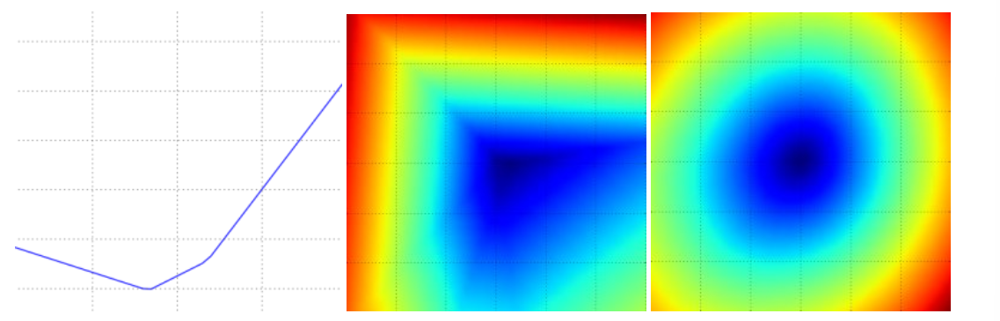

# 优化翻译

内容目录：

- 引言
- 可视化损失函数
- 优化
- 策略一：随机搜索
- 策略二：随机局部搜索
- 策略三：沿梯度方向
- 计算梯度
- 使用有限差分进行数值计算
- 使用微积分进行解析计算
- 梯度下降法
- 总结

## 引言

在上一节中，我们介绍了两个在图像分类任务中的关键参数：

- 评分函数：将原始图像像素映射到类别得分（例如线性函数）
- 损失函数：根据分类评分和训练集图像数据实际分类的匹配程度，衡量某个具体参数集的质量好坏。

具体来说，回想一下线性函数的形式 $f(x_i,W)=Wx_i$ ，我们设计的SVM形式是：

$$
L=\dfrac{1}{N}\sum\_{i}\sum\_{j\ne y\_i}[\max(0,f({x\_i};W)\_j-f(x\_i;W)\_j+1)]+\alpha R(W)
$$

我们注意到，若参数 $W$ 的设置能对样本 $x_i$ 产生与其真实标签 $y_i$ 一致的预测，则该设置对应的损失值 $L$ 也会非常低。现在我们引入第三个也就是最后一个关键组成部分：优化——寻找能够最小化损失函数的参数集 $W$ 的过程

**预告**：一旦我们理解了这三个核心组件的相互作用，我们将重新审视第一个组件（参数化函数映射），并将其扩展到远比线性映射更复杂的函数：首先是完整的神经网络，然后是卷积神经网络。损失函数和优化过程基本保持不变

## 可视化损失函数

本课程所讨论的损失函数通常定义在非常高维的空间中（例如CIFAR-10中，线性分类器的权重矩阵大小为 [10\*3073]，总共30730个参数），这会导致他们很难被可视化。然而，我们可以沿射线(1维)或平面(2维)切割高维空间来获得一些直观理解。例如，我们可以生成一个随机权重矩阵 $W$（对应空间中的一个点），然后沿着一条射线前进并记录沿途的损失函数值。也就是说，我们可以生成一个随机方向 $W_1$ 并通过计算不同 $a$ 值下的 $L(W+aW_1)$。这一过程会生成简单的图标，其中我们令 $a$ 的值作为 $x$ 轴，损失函数的值作为 $y$ 轴。我们还可以通过改变 $a,b$ 的值来评估损失 $L(W+aW_1+bW_2)$ 从而在二维空间中进行相同的操作。在图表中，$a,b$ 可以对应x轴和y轴，损失函数的值可以通过颜色来可视化

---

多分类SVM在CIFAR-10数据集上的损失函数图，分别展示单个样本（左、中）和百个样本（右）的情况左图：仅通过调整 $a$ 的值得到的一维损失；右图：二维损失截面。蓝色=低损失，红色=高损失。

注意到损失函数的分线段性结构。多个样本的损失通过取平均进行合并，因此有图的碗状结构是许多分段线性碗装结构的平均结果（如中图所示）

---
