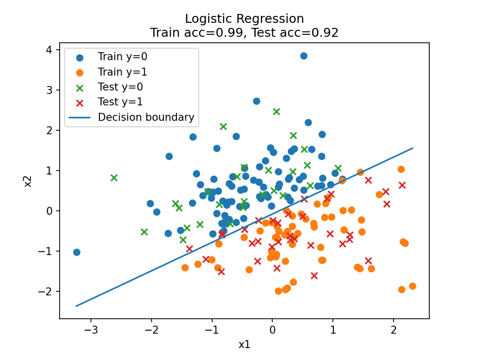

# 基本知识

笔者参看的是周志华老师的《机器学习》，也就是网上很热门的“西瓜书”。笔者必然比不过网上大量的经验，就不做拾人牙慧的事情了，这里主要是记录一些个人的思考，以及完善本书中的一些数学推导（本书中的数学推导确实有些简略了呢，实在不建议入门）


## 第一章 绪论

这一部分介绍了一些概念，包括基础术语、假设空间、归纳偏好，然后讲了讲机器学习的发展与历史，比较笼统的串联了一下后面的章节

NFL 定理：对于所有可能的问题和数据分布，任何学习算法的性能都不会在所有问题上普遍优于其他算法。

个人觉得本书这里的后续解释有些混乱，简单来说，NFL 定理证明了：不同的学习算法在不同的问题和数据集上表现不同，无法存在一个“万能的”学习算法，能够在所有任务中表现最佳。

假设样本空间 $\mathcal{X}$ 和假设空间 $\mathcal{H}$ 都是离散的，令 $P\!\left(h \mid X, \Sigma_a\right)$ 代表算法 $\Sigma_a$ 基于训练数据 $X$ 产生假设 $h$ 的概率，再令 $f$ 代表我们希望学习的真实目标函数。$\Sigma_a$ 的“训练集外误差”，即 $\Sigma_a$ 在训练集之外的所有样本上的误差为

$$
E_{ote}(\Sigma_a \mid X, f)
= \sum_{h} \sum_{x \in \mathcal{X}-X}
P(x)\,\mathbb{I}\!\bigl(h(x) \neq f(x)\bigr)\,P(h \mid X, \Sigma_a)
$$

> 这里做一下解释，这里本质上是一个算期望的过程。
>
> $E_{ote}(\Sigma_a \mid X, f)$ 表示当测试样本从样本空间中按分布随机抽取、算法输出的假设具有随机性时，算法在测试阶段会犯多大错误的比例
>
> $\displaystyle\sum_{x \in \mathcal{X}-X}P(x)$ 表示测试样本 $x$ 是从样本空间 $\mathcal{X}$ 中按分布 $P(x)$ 抽取的。也就是说，我们不是只关心某一个特定输入，而是对\*\*所有可能的输入点\*\*按其出现概率加权。
>
> $\displaystyle \sum_{h\in\mathcal{H}}P(h \mid X, \Sigma_a)$ 表示学习算法 $\Sigma_a$ 在给定的训练集 $X$ 的情况下，可能输出不同的假设，并且每个假设 $h$ 都有一个对应的概率
>
> $\mathbb{I}\!\bigl(h(x) \neq f(x)\bigr)$ 是损失函数，如果假设 $h$ 在输入 $x$ 上预测错误，那么记为 1，预测正确则记为 0
>
> 接下来将三个部分乘一起，表示：**测试点是 x，算法产生假设是 $h$，并且在这个点上预测错误的联合贡献**

然后对所有可能的 $f$ 进行求和，可以得到终式与学习算法无关，进而出现了 NFL 定理（这里原书的推导过程不加赘述）

之后就是经典的“机器学习的发展与历史”，不予赘述


## 第二章 模型评估与选择

模型总有优劣，倘若泛化性能过低，则称之为过拟合。本质原因是学习能力过于强大，把训练样本所包含的不太一般的特性给学会了

通过实验测试来对学习器的泛化误差进行评估，需要一定的测试集。而为了从数据集中分出测试集和训练集。提出了 **留出法**，**交叉验证法** 和 **自助法** 这样的分离方法。

- 留出法就是把测试集按比例划分
- 交叉验证法就是将数据集化成 k 个大小相似的互斥子集，每次用 k-1 个子集作为训练集，另一个作为测试集。称为 k 折交叉验证
- 自助法就是放回随机抽样，重复样本数量次抽样进行学习

学得模型在实际使用中遇到的数据称为 *测试数据*，模型评估与选择中用于评估测试的数据集称为 *验证即*

在研究对比不同算法的泛化性能时，我们用测试集上的判别效果来估计模型在实际使用时的泛化能力，而把训练数据另外划分为训练集和验证集

---

再接下来，我们有了可行的实验估计方法，还需要有衡量模型泛化能力的评价标准，这就是 **性能度量**

其中，回归任务 (输出具体数值是多少) 最常用的性能度量是“均方误差”

$$
E(f;D)=\int_{x\sim D}(f(x_i)-y_i)^2p(x)\mathrm{d}x
$$

而分类任务比较常用的性能度量是 **错误率** 和 **精度**

$$
\begin{align}
&E(f;D)=\dfrac{1}{m}\displaystyle\sum_{i=1}^{m}\mathbb{I}(f(x_i)\ne y_i) \\
&acc(f;D)=1-E(f;D)
\end{align}
$$

---

但是错误率和精度不能满足所有任务需求，于是提出了 **查准率（准确率）** 和 **查全率（召回率）**。

> 查准率意味着有多少数据被判别为错误，查全率意味着所有准确数据有多少被挑选了出来。

对于二分类问题，可以将样例根据其 **真实类别** 与 **学习器预测类别** 的组合划分为真正例 (TP)、假正例 (FP)、真反例 (TN)、假反例 (FN)，如下表，称为分类结果的“混淆矩阵”


我们如果根据学习器的预测结果对样例进行排序，排在前面的是 **学习器认为最可能是正例的样本**，按此顺序逐个把样本作为正例进行预测，则每次可以计算出当前的查全率、准确率。进而做出“P-R 曲线”，类似下图


如果一个曲线 A 包住了一个曲线 C，那么充分说明学习器 A 优于学习器 C。

但也可以用 BEP(平衡点) 作为一个量度，例如 A 点 BEP=0.8>B 点 BEP，所以可以认为学习器 A 优于学习器 B

> BEP 之所以能作为评判学习器优劣的量度，是因为它在不依赖主观阈值的前提下，公平、对称地衡量了模型在查准率与查全率之间的整体平衡能力，特别适用于样本不平衡且错误代价对称的任务。

不过 BEP 还是有些简略了，更常用的是 F1 度量，如下：

$$
F1=\dfrac{2\times P\times R}{P+R}=\dfrac{2\times TP}{样例总数+TP-TN}
$$

> 这里是对准确率和召回率的调和平均数，强烈惩罚了偏科的模型

再然后，我们实际的应用会对查准率 P 和查全率 R 的重视程度有所不同，所以又引入了新的变量，构成了 F1 度量的一般形式 $F_\beta$

$$
F_\beta=\dfrac{(1+\beta^2)\times P\times R}{(\beta^2\times P)+R}
$$

> 其实就是把乘法力度设置为了人为的定义

---

以上是评判模型的泛化能力，也就是评判 **模型作为一个分类器是否好用**；但我们缺乏一定的量化标准去评判 **学习器在不同判别阈值下区分政府样本的整体能力**，所以再接下来又提出了 **ROC** 和 **AUC** 以作为度量标准

ROC 全称为受试者工作特征，根据学习器的预测结果对样例进行排序，按此顺序逐个把样本作为正例进行预测，每次计算出两个重要量的值，分别是“真正例率 TPR”和“假正例率 FPR”

$$
\begin{align}
TPR=\dfrac{TP}{TP+FN}\\ \\
FPR=\dfrac{FP}{TN+FP}
\end{align}
$$

可做出类似下面的图


然后 AUC(Area Under ROC Curve) 就是 ROC 所包围的面积，用来评判 ROC 的好坏，进而评判学习器的性能

---

不过现实不是非黑即白的，通常有些预测错误会带来难以想象的代价，所以我们的模型评判要进一步一般化，**为错误赋予“非均等代价”**

我们可以根据任务的领域知识设定一个“代价矩阵”，如下表，$cost_{ij}$ 表示将第 $i$ 类样本预测为第 $j$ 类样本的代价


> 一般来说 $cost_{ij}=0$，若将第 0 类别为第 1 类所造成的损失更大，则 $cost_{01}>cost_{10}$；随时程度相差越大，$cost_{01}$ 与 $cost_{10}$ 值的差别越大

于是我们对性能度量扩展其定义，如下

“代价敏感”错误率为

$$
E(f; D; cost)
= \frac{1}{m}
\left(
\sum_{x_i \in D^{+}} \mathbb{I}\!\left(f(x_i) \neq y_i\right)\cdot cost_{01}
\;+\;
\sum_{x_i \in D^{-}} \mathbb{I}\!\left(f(x_i) \neq y_i\right)\cdot cost_{10}
\right)
$$

然后再次状态下，ROC 曲线是不可以直接反映出学习器的期望总体代价的，所以又加入了“代价曲线”作为评判。

代价曲线图的横轴是取值为 $[0,1]$ 的正例概率代价如下，其中 $p$ 是样例为正例的概率：

$$
P(+)_{\text{cost}}
=
\frac{p \times cost_{01}}
{p \times cost_{01} + (1 - p) \times cost_{10}}
$$

纵轴是取值为 $[0,1]$ 的归一化代价，如下，其中 FPR 是假正例率，FNR=1-TPR 是假反例率。

$$
cost_{\mathrm{norm}}
=
\frac{\mathrm{FNR}\times p \times cost_{01}
\;+\;
\mathrm{FPR}\times (1-p)\times cost_{10}}
{p \times cost_{01} + (1-p)\times cost_{10}}
$$

接下来我们绘制代价曲线：ROC 曲线上每一点对应代价平面上一条线段，设 ROC 曲线上点的坐标为 $(TPR,FPR)$，则可以相应地计算出 $FNR$，然后在代价平面上做一条从 $(0,FPR)$ 到 $(1,FNR)$ 的线段，线段下的面积即表示了该条件下的期望的总体代价，如下图


---

至此，我们有了完整的实验评估方法和性能度量，但是如今缺少了“比较”的方法。于是提出了 **统计假设检验** 来对学习器性能比较提供依据。本书以错误率为性能度量，用 $\epsilon$ 表示

> 也就是，若在测试集上观察到学习器 A 比 B 好，则 A 的泛化性能是否在统计意义上优于 B，以及这个结论的把握有多大

现实任务中我们并不知道学习器的泛化错误率，只能获知其测试错误率 $\hat\epsilon$ .泛化错误率与测试错误率未必相同，但直观上，二者接近的可能性应比较大，相差很远的可能性比较小。因此可以根据测试错误率估推处泛化错误率的分布

我们假设 $m$ 个测试样本，其中泛化错误率为 $\epsilon$ 的学习器将其中 $m'$ 个样本误分类、其余样本全都分类正确的概率为 $\epsilon^{m'}(1-\epsilon)^{m-m'}$，可以估算处其恰将 $\hat\epsilon\times m$ 个样本误分类的概率如下

$$
P(\hat{\epsilon}; \epsilon)
=
\binom{m}{\hat{\epsilon}\times m}
\epsilon^{\hat{\epsilon}\times m}
(1-\epsilon)^{m-\hat{\epsilon}\times m}
$$

给定测试错误率，则解 $\frac{\partial P(\hat{\epsilon};\epsilon)}{\partial \epsilon} = 0\Rightarrow P(\hat\epsilon ;\epsilon)_{max}\big|_{\epsilon=\hat\epsilon}$

后面就是一些检验的介绍了

---

再然后，学习算法除了实验估计其泛化性能，人们往往还希望了解它“为什么”有这样的性能。于是 **偏差 - 方差分解** 是解释学习算法泛化性能的重要工具

偏差 - 方差分解试图对学习算法的期望泛化错误率进行拆解。算法在不同训练集上学得的结果很可能不同，即便这些训练集是来自同一个分布

我们约定：对一个测试样本 $\vec x$，令 $y_D$ 为 $\vec x$ 在数据集中的标记，$y$ 为 $\vec x$ 的真实标记，$f(\vec x;D)$ 为训练集 D 上学得模型 $f$ 在 $\vec{x}$ 上的预测输出，则

学习算法的期望预测为 $\bar{f}(x) = \mathbb{E}_{D}\!\left[f(x;D)\right]$

使用样本数相同的不同训练集产生的方差为 $\mathrm{var}(x)=\mathbb{E}_{D}\!\left[\left(f(x;D)-\bar{f}(x)\right)^2\right]$

噪声为 $\epsilon^2=\mathbb{E}_{D}\!\left[(y_D - y)^2\right]$

期望输出与真实标记的差别称为偏差 (bias)，即 $\mathrm{bias}^2(x)=\left(\bar{f}(x)-y\right)^2$

然后就是一系列数学推导，这里书上的推导相当完善，可以直接看书，最终结论为

$$
E(f;D)
=
\mathrm{bias}^2(x)
+
\mathrm{var}(x)
+
\epsilon^2
$$

即，**泛化误差可以分解为偏差、方差和噪声之和**

> 偏差度量了学习算法的期望预测与真是结果的偏离程度，刻画了 **学习算法本身的拟合关系**
>
> 方差度量了同样大小的训练集的变动导致的学习性能的变化，刻画了 **数据扰动所造成的影响**
>
> 噪声则表达了当前任务上学习算法所能达到的期望泛化误差的下届，刻画了 **学习问题本身的难度**


## 第三章 线性模型

$$
f(x)=\vec w^T\vec x+b
$$

当 $\vec w$ 和 b 学得后，模型得以确定

---

对于回归任务，其试图学得

$$
f(x_i)=wx_i+b,使得f(x_i)\simeq y_i
$$

然后为了确定 $w$ 和 $b$ ,一般采用让均方误差最小化的方法，如下

$$
\begin{align}
(w*,b*)&=\arg_{(w,b)}\min \sum_{i=1}^{m}(f(x_i)-y_i)^2 \\
&=\arg_{(w,b)}\min \sum_{i=1}^{m}(y_i-wx_i-b)^2
\end{align}
\tag{3.4}
$$

然后是这个式子分别对 w 和 b 求偏导为零，得到 w 和 b。不过书上的推导过程不能说很少，只能说没有

$$
\begin{align}
\dfrac{\partial E_{(w,b)}}{\partial w}&=2\left(w\sum_{i=1}^{m}x_i^2-\sum_{i=1}^{m}(y_i-b)x_i\right)=0\tag{3.5} \\
\dfrac{\partial E_{(w,b)}}{\partial b}&=2\left(mb-\sum_{i=1}^{m}(y_i-wx_i)\right)=0\tag{3.6}
\end{align}
$$

推导如下

> 令式 $(3.5)$ 等于 0，有
>
>
$$
0=w\sum_{i=1}^mx_i^2-\sum_{i=1}^{m}(y_i-b)x_i\Rightarrow w\sum_{i=1}^mx_i^2=\sum_{i=1}^{m}(y_i-b)x_i
$$

>
> 再由 $(3.6)$ 等于 0 得到 $b=\displaystyle\dfrac{1}{m}\sum_{i=1}^{m}(y_i-wx_i)$,又因为 $\displaystyle\dfrac{1}{m}\sum_{i=1}^{m}y_i=\bar y$ 并且 $\displaystyle\dfrac{1}{m}\sum_{i=1}^{m}x_i=\bar x$ ,则 $b=\bar y-w\bar x$,代入上式，可得
>
>
$$
w\sum_{i=1}^{m}x_i^2=\sum_{i=1}^{m}y_ix_i-\bar y\sum_{i=1}^{m}x_i+w\bar x\sum_{i=1}^{m}x_i
$$

>
> 可以整理出
>
>
$$
w=\dfrac{\sum_{i=1}^my_ix_i-\bar y\sum_{i=1}^mx_i}{\sum_{i=1}^mx_i^2-\bar x\sum_{i=1}^mx_i}
$$

>
> 然后我们把 $\bar x$ 和 $\bar y$ 的计算代入到上式，得到
>
>
$$
w=\dfrac{\sum_{i=1}^{m}y_i(x_i-\bar x)}{\sum_{i=1}^{m}x^2_i-\dfrac{1}{m}\left(\sum_{i=1}^{m}x_i\right)^2}
$$

>
> 然后我们把 $\bar x$ 和 $\bar y$ 的计算代入到上式，得到
>
>
$$
w=\dfrac{\sum_{i=1}^{m}y_i(x_i-\bar x)}{\sum_{i=1}^{m}x^2_i-\dfrac{1}{m}\left(\sum_{i=1}^{m}x_i\right)^2}
$$

>
> 然后我们把 $\bar x$ 和 $\bar y$ 的计算代入到上式，得到
>
>
$$
w=\dfrac{\displaystyle\sum_{i=1}^{m}y_i(x_i-\bar x)}{\displaystyle\sum_{i=1}^{m}x^2_i-\dfrac{1}{m}\left(\displaystyle\sum_{i=1}^{m}x_i\right)^2}\tag{3.7}
$$

>
> 然后 b 的计算比较简单，不多赘述

但通常的属性并非单一的，此时的我们试图学得如下的式子，即 **多元线性回归**

$$
f(x_i)=w^Tx_i+b,使得f(x_i)\simeq y_i
$$

计算方法就是线性代数的相关内容了，最小二乘法估计 $\vec w$ 和 $b$，$\hat w=(w;b)$，把数据集 D 表示为一个 $m\times (d+1)$ 大小的矩阵 $\vec{A}$，每行对应于一个示例，该行前 d 个元素对应于示例的 d 个属性值，最后元素恒为 1，如下

$$
X = \begin{pmatrix}
x_{11} & x_{12} & \cdots & x_{1d} & 1\\
x_{21} & x_{22} & \cdots & x_{2d} & 1\\
\vdots & \vdots & \ddots & \vdots & \vdots\\
x_{n1} & x_{n2} & \cdots & x_{nd} & 1
\end{pmatrix}
=
\begin{pmatrix}
x_1^T & 1\\
x_2^T & 1\\
\vdots & \vdots\\
x_m^T & 1
\end{pmatrix}
$$

可以得到类似于 3.4 的式子

$$
\boldsymbol{w}^* = \arg\min_{\boldsymbol{w}} (\boldsymbol{y} - \mathbf{X}\boldsymbol{w})^T (\boldsymbol{y} - \mathbf{X}\boldsymbol{w})
$$

进而对 $E_{\boldsymbol{w}} = (\boldsymbol{y} - \mathbf{X}\boldsymbol{w})^T (\boldsymbol{y} - \mathbf{X}\boldsymbol{w})$ 求导，得到 $\bar w$ 最优解的闭式解

Note

本节的最后提出了广义线性模型，如下

$$
y=g^{-1}(w^T+b)
\tag{3.15}
$$

函数 $g(\cdot)$ 称为联系函数，单调可微

---

上一节讨论的是如何使用线性模型进行回归学习，但是如果对分类任务进行处理，我们可以通过 **找一个单调可微函数** 将分类任务的真实标记 y 与线形回归模型的预测值联系起来。

对于 $y\in\text{0,1}$ 的二分类任务，\*\*对数几率函数\*\*就是这样一个常用的替代函数，如下，其中 z 表示的是线性回归模型产生的预测值

$$
y=\dfrac{1}{1+e^{-z}}
\tag{3.18}
$$

将 $(3.18)$ 代入回 $(3.15)$，再经过一些简单变化，我们可以得到下式

$$
\ln\dfrac{y}{1-y}=w^Tx+b
\tag{3.19}
$$

接着将 y 视为 **类后验概率估计** 如下

$$
p(y=1|\boldsymbol{x}) = \frac{e^{\boldsymbol{w}^{\mathrm{T}}\boldsymbol{x}+b}}{1+e^{\boldsymbol{w}^{\mathrm{T}}\boldsymbol{x}+b}} = \frac{1}{1+e^{-(\boldsymbol{w}^{\mathrm{T}}\boldsymbol{x}+b)}}
$$

$$
p(y=0|\boldsymbol{x}) = \frac{1}{1+e^{\boldsymbol{w}^{\mathrm{T}}\boldsymbol{x}+b}}
$$

> 推导：设 $p_1 = p(y=1|\boldsymbol{x})$，由 $\frac{p_1}{1-p_1} = e^{\boldsymbol{w}^{\mathrm{T}}\boldsymbol{x}+b}$ 解得上式。

---

**极大似然估计**
记 $\boldsymbol{\beta} = (\boldsymbol{w};b)$，$\hat{\boldsymbol{x}} = (\boldsymbol{x};1)$，则最大化对数似然：

$$
\ell(\boldsymbol{\beta}) = \sum_{i=1}^{m} \ln p(y_i|\boldsymbol{x}_i;\boldsymbol{\beta})
$$

其中：

$$
p(y_i|\boldsymbol{x}_i) = y_i p_1(\hat{\boldsymbol{x}}_i;\boldsymbol{\beta}) + (1-y_i)p_0(\hat{\boldsymbol{x}}_i;\boldsymbol{\beta})
$$

展开得：

$$
\ell(\boldsymbol{\beta}) = \sum_{i=1}^{m}\left[-y_i\boldsymbol{\beta}^{\mathrm{T}}\hat{\boldsymbol{x}}_i + \ln(1+e^{\boldsymbol{\beta}^{\mathrm{T}}\hat{\boldsymbol{x}}_i})\right]
$$

---

然后用 **牛顿法** 求得最优解如下

梯度下降：

$$
\boldsymbol{\beta}^{t+1} = \boldsymbol{\beta}^t - \alpha \sum_{i=1}^{m}(p_1(\hat{\boldsymbol{x}}_i;\boldsymbol{\beta}^t) - y_i)\hat{\boldsymbol{x}}_i
$$

牛顿法：

$$
\boldsymbol{\beta}^{t+1} = \boldsymbol{\beta}^t - \left(\frac{\partial^2 \ell(\boldsymbol{\beta})}{\partial\boldsymbol{\beta}\partial\boldsymbol{\beta}^{\mathrm{T}}}\right)^{-1} \frac{\partial\ell(\boldsymbol{\beta})}{\partial\boldsymbol{\beta}}
$$

代码如下：


```

import

numpy

as

np

import

matplotlib.pyplot

as

plt


# =========================


# 1. 生成二维二分类数据


# =========================

np
.
random
.
seed
(
42
)

n_samples

=

200

X

=

np
.
random
.
randn
(
n_samples
,

2
)

true_w

=

np
.
array
([
2.0
,

-
3.0
])

y

=

(
X

@

true_w

>

0
)
.
astype
(
int
)


# =========================


# 2. 划分训练集 / 测试集


# =========================

idx

=

np
.
random
.
permutation
(
n_samples
)

train_idx

=

idx
[:
140
]

test_idx

=

idx
[
140
:]

X_train
,

y_train

=

X
[
train_idx
],

y
[
train_idx
]

X_test
,

y_test

=

X
[
test_idx
],

y
[
test_idx
]


# =========================


# 3. 逻辑回归


# =========================

def

sigmoid
(
z
):


return

1

/

(
1

+

np
.
exp
(
-
z
))


# 加偏置项

Xb_train

=

np
.
c_
[
np
.
ones
(
len
(
X_train
)),

X_train
]

Xb_test

=

np
.
c_
[
np
.
ones
(
len
(
X_test
)),

X_test
]

w

=

np
.
zeros
(
3
)

lr

=

0.2

n_iter

=

2000

for

_

in

range
(
n_iter
):


p

=

sigmoid
(
Xb_train

@

w
)


grad

=

Xb_train
.
T

@

(
p

-

y_train
)

/

len
(
y_train
)


w

-=

lr

*

grad


# =========================


# 4. 预测与评估


# =========================

def

predict
(
X
):


Xb

=

np
.
c_
[
np
.
ones
(
len
(
X
)),

X
]


return

(
sigmoid
(
Xb

@

w
)

>=

0.5
)
.
astype
(
int
)

train_acc

=

(
predict
(
X_train
)

==

y_train
)
.
mean
()

test_acc

=

(
predict
(
X_test
)

==

y_test
)
.
mean
()

print
(
"Train accuracy:"
,

train_acc
)

print
(
"Test accuracy :"
,

test_acc
)

print
(
"Model weights :"
,

w
)


# =========================


# 5. 可视化（数据 + 决策边界）


# =========================

plt
.
figure
()


# 训练集

plt
.
scatter
(
X_train
[
y_train
==
0
,

0
],

X_train
[
y_train
==
0
,

1
],

marker
=
'o'
,

label
=
'Train y=0'
)

plt
.
scatter
(
X_train
[
y_train
==
1
,

0
],

X_train
[
y_train
==
1
,

1
],

marker
=
'o'
,

label
=
'Train y=1'
)


# 测试集

plt
.
scatter
(
X_test
[
y_test
==
0
,

0
],

X_test
[
y_test
==
0
,

1
],

marker
=
'x'
,

label
=
'Test y=0'
)

plt
.
scatter
(
X_test
[
y_test
==
1
,

0
],

X_test
[
y_test
==
1
,

1
],

marker
=
'x'
,

label
=
'Test y=1'
)


# 决策边界 w0 + w1*x1 + w2*x2 = 0

x1

=

np
.
linspace
(
X
[:,
0
]
.
min
(),

X
[:,
0
]
.
max
(),

100
)

x2

=

-
(
w
[
0
]

+

w
[
1
]
*
x1
)

/

w
[
2
]

plt
.
plot
(
x1
,

x2
,

label
=
'Decision boundary'
)

plt
.
xlabel
(
"x1"
)

plt
.
ylabel
(
"x2"
)

plt
.
title
(
f
"Logistic Regression
\n
Train acc=
{
train_acc
:
.2f
}
, Test acc=
{
test_acc
:
.2f
}
"
)

plt
.
legend
()

plt
.
savefig
(
"logistic_regression.png"
,

dpi
=
150
,

bbox_inches
=
"tight"
)

print
(
"图已保存为 logistic_regression.png"
)

```

随机数种子为 42，生成 200 数据，真实边界 `[-3,2]`。

训练集为前 140 个数据，测试集为后 140 个数据。

学习率为 0.2，迭代轮次 2000 次。


圆圈为训练数据，×为预测数据



---

上述我们完成了一个二分类预测，而 LDA（线性判别分析）又是另一种经典的线性学习方法。

它的想法很简单：

- 给定训练样例集，设法将样例投影到一条直线上，使得同类样例的投影点尽可能接近、异类样例的投影点尽可能原理；
- 在对新样本进行分类时，将其投影到同样的这一条直线上，再根据投影点的位置来确定新样本的类别
- 如下图，其中 "+" 代表正例，"-" 代表反例，椭圆表示数据簇的外轮廓，虚线表示投影，红色是实心圆和实心三角形分别表示两类样本的投影后的中心点 
  同理 $w^T$ 是参数，$\mu_0,\mu_1$ 分别是 0,1 数据的均值
- 我们要做的是让类中心的距离尽可能大，即 $\left\| w^\top \mu_0 - w^\top \mu_1 \right\|_2^2$ 尽可能大（这个式子的意思是“把两类的均值 $\mu_0$​ 和 $\mu_1$​ 投影到方向 $w$ 上之后的距离的平方”）
- 同时还要让同类的尽可能接近，也就是同类样例协方差尽可能小 $w^T\sum_0w+w^T\sum_1w$ 尽可能小
- 于是可以得到式子如下

$$
J = \frac{\| w^\top \mu_0 - w^\top \mu_1 \|_2^2}{w^\top \Sigma_0 w + w^\top \Sigma_1 w}= \frac{w^\top (\mu_0 - \mu_1)(\mu_0 - \mu_1)^\top w}{w^\top (\Sigma_0 + \Sigma_1) w}\tag{3.32}
$$

> 这线性代数得学啊

接下来就是 $w$ 的计算，书上的推导挺完善了，不加赘述了


```


# Plot data clusters (covariance ellipses) and mean vector m = mu1 - mu0

import

numpy

as

np

import

matplotlib.pyplot

as

plt

from

matplotlib.patches

import

Ellipse

np
.
random
.
seed
(
1
)

X0

=

np
.
random
.
randn
(
50
,

2
)

+

np
.
array
([
0
,

0
])

X1

=

np
.
random
.
randn
(
50
,

2
)

+

np
.
array
([
3
,

2
])


# Means and covariances

mu0

=

X0
.
mean
(
axis
=
0
)

mu1

=

X1
.
mean
(
axis
=
0
)

Sigma0

=

np
.
cov
(
X0
,

rowvar
=
False
)

Sigma1

=

np
.
cov
(
X1
,

rowvar
=
False
)

m

=

mu1

-

mu0


# mean difference vector

def

draw_ellipse
(
mean
,

cov
,

n_std
=
2.0
):


vals
,

vecs

=

np
.
linalg
.
eigh
(
cov
)


order

=

vals
.
argsort
()[::
-
1
]


vals
,

vecs

=

vals
[
order
],

vecs
[:,

order
]


angle

=

np
.
degrees
(
np
.
arctan2
(
vecs
[
1
,
0
],

vecs
[
0
,
0
]))


width
,

height

=

2

*

n_std

*

np
.
sqrt
(
vals
)


return

Ellipse
(
mean
,

width
,

height
,

angle
=
angle
,

fill
=
False
)

plt
.
figure
()


# Data points

plt
.
scatter
(
X0
[:,
0
],

X0
[:,
1
],

label
=
"Class 0"
)

plt
.
scatter
(
X1
[:,
0
],

X1
[:,
1
],

label
=
"Class 1"
)


# Covariance ellipses (data clusters)

plt
.
gca
()
.
add_patch
(
draw_ellipse
(
mu0
,

Sigma0
))

plt
.
gca
()
.
add_patch
(
draw_ellipse
(
mu1
,

Sigma1
))


# Means

plt
.
scatter
(
mu0
[
0
],

mu0
[
1
],

marker
=
'x'
,

s
=
120
)

plt
.
scatter
(
mu1
[
0
],

mu1
[
1
],

marker
=
'x'
,

s
=
120
)

plt
.
text
(
mu0
[
0
],

mu0
[
1
],

r
'$\mu_0$'
,

fontsize
=
12
)

plt
.
text
(
mu1
[
0
],

mu1
[
1
],

r
'$\mu_1$'
,

fontsize
=
12
)


# Mean difference vector m

plt
.
quiver
(
mu0
[
0
],

mu0
[
1
],

m
[
0
],

m
[
1
],

angles
=
'xy'
,

scale_units
=
'xy'
,

scale
=
1
)

plt
.
text
(
mu0
[
0
]

+

m
[
0
]
/
2
,

mu0
[
1
]

+

m
[
1
]
/
2
,

r
'$m=\mu_1-\mu_0$'
,

fontsize
=
12
)

plt
.
xlabel
(
"x1"
)

plt
.
ylabel
(
"x2"
)

plt
.
title
(
"Data Clusters and Mean Vector m"
)

plt
.
axis
(
'equal'
)

plt
.
savefig
(
"LDA.png"
,

dpi
=
150
,

bbox_inches
=
"tight"
)

print
(
"图已保存为 LDA.png"
)

```


---

多分类任务有 OvO（一对一），OvR（一对其余），MvM（多对多）这几种拆分策略

**OvO** 与 **OvR**


---

类别不平衡问题：就是说当正例和反例的数量出现明显差别的时候，对学习过程产生较大困扰。

解决方法则是加入修正量进行 **再放缩**，如下，我们约定 $m^+$ 为正例数量，$m^-$ 为反例数量，$y$ 为预测的实数值，则有下式

$$
\dfrac{y}{1-y}\times\dfrac{m^-}{m^+}>0.5
$$

认为为正例，不过由于训练集为真实样本总体的无偏采样这个假设很难成立，所以这个方案一般性不同

现有技术大体上有三类做法

- 删除一些样例使得正例和反例数量差不多，“欠采样”，代表性算法是EasyEnsemble
- 增加一些样例使得正例和反例数量差不多，“过采样”，代表性算法是SMOTE
- 直接基于原有训练集学习，但在预测时候将上式加入决策过程中，“阈值偏移”
