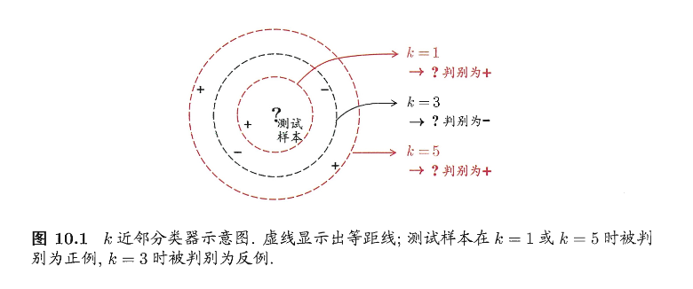
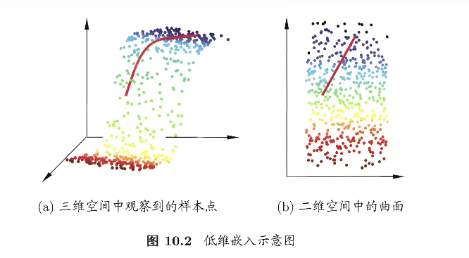
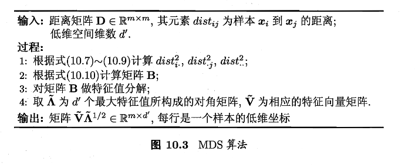
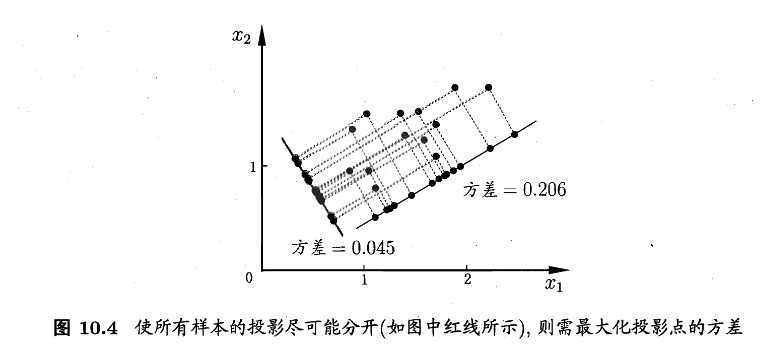
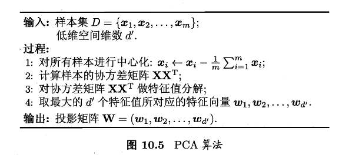
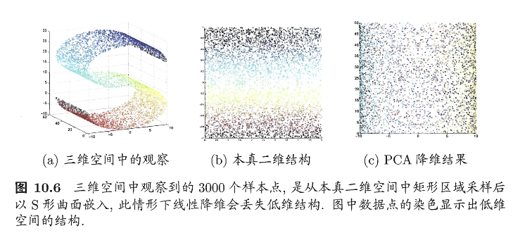
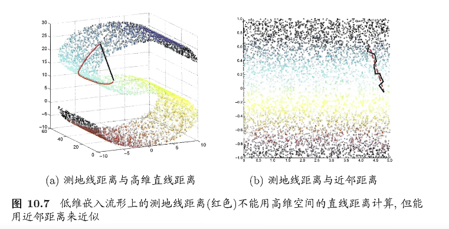
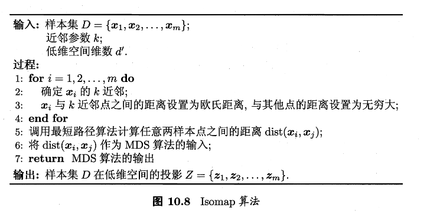
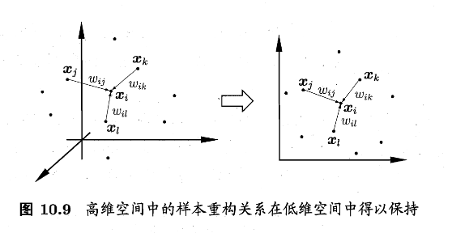
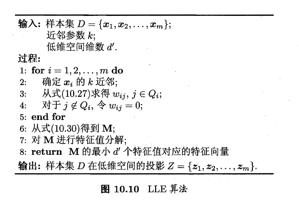

# 第十章 降维与度量学习


## 第十章 降维与度量学习

降维比较好解释，将高维数据（比较多的特征）映射到低维，同时尽量保留有用的结构。用数学语言描述就是：

降维是在学一个“表示/坐标系” $z=f(x)$

度量学习则是通过一定的算法，让该近的更近，该远的更远。比方说原本的距离度量用的是欧氏距离，即 $d(x,y)=||x-y||_2$ ,而度量学习会学得一个更适合任务的距离，比如 Mahalanobis 距离： $d_M(x,y)=\sqrt{(x-y)\top M (x-y)}，M\succeq0$，其中 $M$ 控制不同特征的不同权重，允许特征之间相关性影响距离


### $k$ 近邻学习

首先介绍一下 $k$ 近邻学习：$k$ 近邻(kNN)是一类典型的基于实例的监督学习方法：

- 给定测试样本，先选一个距离度量（欧氏距离/余弦距离/马氏距离等）
- 在训练集里找离 $x$ 最近的 $k$ 个样本

> 之前学的很多模型，如线性回归、SVM、神经网络等，都有一个明显的训练阶段，用于训练参数 $\theta$
>
> 但 kNN 几乎不训练，它的训练阶段基本就是把数据存储起来，所以 kNN 也被称为懒惰学习：训练开销低，预测时开销高

如下图所展示的，不同的 $k$ 会导致不同的分类



- 当 k=1 的时候，只看到最近的 1 个点，容易受到噪声的影响，但时边界比较灵活
- 当 k=3 的时候，看 3 个邻居，多数投票可能反转结果
- 当 k=5 的时候，更加平滑也更稳定，但是可能抹掉了局部细节

> 总的来说，kNN的基本过程就是：距离度量 + $k$ 选择 $\rightarrow$ 邻居集合 $\rightarrow$ 投票/平均 $\rightarrow$ 预测结果

---

接下来我们理论分析一下 1NN(最近邻分类器) 的泛化错误率如何：

设测试样本为 $x$ ,其最近邻训练样本为 $z$ 。当 $x$ 的真实类别和 $z$ 的类别不一致的时候，我们给出

$$
P(err)=1-\sum_{c\in\mathcal{Y}}P(c\mid x)P(c\mid z)\tag{10.1}
$$

> $\sum_cP(c\mid x)P(c\mid z)$ 表示“x和z在同一类别上的概率一致性”，一致性越大，出错越小

假设样本独立同分布，并且对任意 $x$ 和任意小的 $\delta$，在 $x$ 附近总能找到训练样本。于是最近邻 $z$ 会非常接近 $x$，那么从概率上就可以近似认为 $P(c\mid z)\approx P(c\mid x)$，那么我们把此式带回式(10.1)，可得

$$
P(err)\approx1-\sum_{c\in\mathcal{Y}}P^2(c\mid x)
$$

接下来我们令 $\displaystyle c^*=\arg\max_{c\in\mathcal{Y}}P(c\mid x)$ 来表示贝叶斯最优分类器在 $x$ 处选择的类别（也就是后验概率最大的类）。然后继续推导上式

$$
\begin{align}
P(err)&\approx1-\sum_{c\in\mathcal{Y}}P^2(c\mid x)\\
&\le 1-P^2(c^*\mid x)\\
&=(1+P(c^*\mid x))(1-P(c^*\mid x))\\
&\le2\times(1-P(c^*\mid x))\tag{10.2}
\end{align}
$$

> $1-P(c^*\mid x)$ 是 贝叶斯最优分类器在点 $x$ 处的错误概率
>
> 所以此式意味着：**1NN 的泛化错误率不超过贝叶斯最优错误率的 2 倍**


### 低维嵌入

上一节中我们发现 1NN 在可以接受的范围内，获得了巨大的效率提升，但这取决于我们的一个前提假设：我们假设在 $x$ 附近总能找到训练样本且最近邻 $z$ 和 $x$ 非常接近。这个假设在现实情况下是较难实现的，我们举个例子如下：

- 维度 $d=1$ 的时候，$\delta=0.001$ 这种邻域，采样 1000 个点均匀铺开，还算可以覆盖
- 但维度 $d=20$ 的时候， 要在每个维度达到 $\delta=0.001$ 的粒度，粗略需要 ${(10^3)}^{20}=10^{60}$ 的量级

这就是常见学习算法都会遇到的问题：样本在高维空间变稀疏，即便是最近邻也会很远；距离计算变得很困难，不可靠。即所谓的 **维数灾难**

---

解决

解决方案一般是降维或低维嵌入，让数据在更合适的子空间里变密集，如下图所示的过程



这里将一个比较经典的方法——MDS（多维缩放），其目标是低维里尽量保持原始距离。

> 它的设定简单来说为：原始先给出原空间的两两距离矩阵，再计算出一个低维坐标，使得低维欧式距离尽量复现原距离

我们假设有 $m$ 个样本，原始距离矩阵为 $D\in\mathbb{R}^{m\times m}$ 其中， $D_{ij}=dist_{ij}=样本 x_i 到 x_j 的距离$ 。我们的目标是寻找低维表示 $Z\in\mathbb{R}^{d’\times m},d’\le d$，并满足 $||z_i-z_j||=dist_{ij}$。下面是推导过程：

用内积矩阵把距离转换成坐标

我们令低维内积矩阵为 $B=Z^{T} Z\in \mathbb{R}^{m\times m},b_{ij}=z_i^T z_j$ ，然后欧式距离展开，可以得到

$$
\begin{align}
dist^2_{ij}=||z_i-z_j||^2&=||z_i||^2+||z_j||^2-2z_t^{T}z_j\\
&=b_{ii}+b_{jj}-2b_{ij}\tag{10.3}
\end{align}
$$

Note

这一步是将“两个点的欧式距离”改写为“点的长度+点之间的相似度”：

$b_{ii}=||z_i||^2$ 表示点 $i$ 离原点有多远；$b_{ij}=z_i^Tz_j$ 表示点 $i$ 和点 $j$ 在方向上有多对齐（相似度）

然后整理公式，令 $Z$ 中心化，即 $\sum_{i=1}^mz_i=0$，这会让 $B$ 的行/列和为 0 ，进而整理得到便于讨论的式子,其中 $\text{tr}(\cdot)$ 是迹，$\text{tr}(B)=\sum_{i=1}^m||z_i||^2$

$$
\begin{align}
\sum_{i=1}^mdist^2_{ij}=\text{tr}(B)+mb_{jj}\tag{10.4}\\
\sum_{j=1}^mdist^2_{ij}=\text{tr}(B)+mb_{ii}\tag{10.5}\\
\sum_{i=1}^m\sum_{j=1}^mdist_{ij}^2=2m\text{tr}(B)\tag{10.6}
\end{align}
$$

Note

刚刚式(10.3)中存在未知的 $b_{ii}$ 等内容，但是我们只有距离 $dist_{ij}$ 的预测值，那么怎么解呢？给出的办法是对 $i$ 和 $j$ 求和/全体求和，利用中心化带来的行列和为0，把未知项消去。

以式(10.4)为例，它意味着：固定 $j$ ，把所有点到 $j$ 的距离平方加起来，等价于 “总能量 $\text{tr}(B)$+$j$ 点的长度项$mb_{jj}$“。可以认为是：距离的列求和=你能推回每个点的 $||z_j||^2$

这三个式子合起来意味着：用求和把未知的自内积项和全局常数变成可由距离算到的量

接下来定义三个平均距离平方，如下

$$
\begin{align}
dist_{i\cdot}^2=\dfrac{1}{m}\sum_{j=1}^mdist_{ij}^2\tag{10.7}\\
dist_{\cdot j}^2=\dfrac{1}{m}\sum_{i=1}^mdist_{ij}^2\tag{10.8}\\
dist_{\cdot\cdot}^2=\dfrac{1}{m^2}\sum_{i=1}^m\sum_{j=1}^mdist_{ij}^2\tag{10.9}
\end{align}
$$

Note

这三个按顺序分别是行平均、列平均和全局平均

它们是为了把式(10.4)-(10.6)的求和结果写得更加紧凑，最终塞进(10.10)形成一个直接可算得闭式公式

然后把式（10.4）~（10.9）带入式（10.3），得到从距离直接回复内积矩阵元素的公式

$$
b_{ij}=-\dfrac{1}{2}(dist_{ij}^2-dist_{i\cdot}^2-dist_{\cdot j}^2+dist_{\cdot\cdot}^2)\tag{10.10}
$$

Note

这里在做双中心化操作：去掉行均值、列均值，再加回总体均值。效果为：

- 把距离平方矩阵里的”平移影响“去掉（因为你只知道距离，不知道坐标原点的位置）
- 得到一个与某组中心化坐标Z相一致的Gram矩阵 $B=Z^TZ$

直观上来说，距离告诉你相隔多远，这个式子把距离转化为了”在低维空间中有多相似“

将内积矩阵B进行特征分解，恢复坐标Z

对 $B$ 做特征分解： $B = V \Lambda V^{T}$ 取非零特征值的那一部分（即假设有 $d^*$ 个非零特征值），令 $\Lambda=\text{diag}(\lambda_1,\lambda_2,\dots,\lambda_d)$ 、$V_*$ 为对应特征向量矩阵，则

$$
Z=\Lambda_*^{1/2}V_*^{T}\in\mathbb{R}^{d^*\times m}\tag{10.11}
$$

Note

如果这些距离真的是某个欧式空间中产生的（噪声很小，没有冲突），那么：

- $B=V\Lambda V^T$ 的特征分解相当于找到了坐标轴（特征向量）
- 特征值 $\lambda$ 给出每个轴的“尺度/方差”($\sqrt{\lambda}$ 是长度尺度）
- 只取非零特征值那部分，就能恢复出一组坐标 $Z$，使得 $Z^T Z=B$

式(10.10)把距离变成内积，式(10.11)把内积变为坐标

不过实际中不必严格相等，取最大的 $d’$ 个特征值对应的部分降到更低维，可以得到

$$
Z=\hat \Lambda^{1/2}\hat V^{T}\in\mathbb{R}^{d'\times m}\tag{10.12}
$$

Note

实际距离往往不可能被低维完全满足（噪声、非欧式结构、维度不够），那就：

- 只取最大的 $d'$ 个特征值/特征向量
- 得到最能保留整体结构的低维表示

如下算法及其对应代码




```

import

numpy

as

np

def

classical_mds
(
D
,

d_prime
=
2
,

eps
=
1e-12
):


"""

    经典 MDS（Classical MDS）

    输入:

        D: (m, m) 距离矩阵，D[i, j] = dist(x_i, x_j)，要求对称、对角为0

        d_prime: 目标降维维度 d'

        eps: 数值稳定用的小阈值

    输出:

        Z: (m, d') 低维坐标矩阵，每一行是一个样本在低维空间的坐标

        eigvals: 选取的前 d' 个特征值（从大到小）

    """


D

=

np
.
asarray
(
D
,

dtype
=
float
)


m

=

D
.
shape
[
0
]


assert

D
.
shape

==

(
m
,

m
),

"D 必须是方阵 (m, m)"


# 1) 距离平方矩阵：D2[i,j] = dist_ij^2


D2

=

D

**

2


# 2) 双中心化（对应教材(10.10)的效果）


#    B = -1/2 * J * D2 * J


#    其中 J = I - (1/m) * 11^T 是中心化矩阵


I

=

np
.
eye
(
m
)


one

=

np
.
ones
((
m
,

1
))


J

=

I

-

(
one

@

one
.
T
)

/

m


B

=

-
0.5

*

J

@

D2

@

J


# 3) B 是对称矩阵，用 eigh（专门处理对称/厄米矩阵）更稳


#    eigvals 升序，eigvecs 列为特征向量


eigvals
,

eigvecs

=

np
.
linalg
.
eigh
(
B
)


# 4) 按特征值从大到小排序


idx

=

np
.
argsort
(
eigvals
)[::
-
1
]


eigvals

=

eigvals
[
idx
]


eigvecs

=

eigvecs
[:,

idx
]


# 5) 取前 d' 个“非负”特征值（理论上 B 半正定；数值误差可能出现微小负数）


#    Z = V_{d'} * sqrt(Lambda_{d'})，输出 shape (m, d')


eigvals_top

=

eigvals
[:
d_prime
]


eigvecs_top

=

eigvecs
[:,

:
d_prime
]


# 将小于 0 的特征值截断为 0（避免 sqrt 出现 nan）


eigvals_top_clipped

=

np
.
maximum
(
eigvals_top
,

0.0
)


# 低维坐标：每列缩放对应特征向量


Z

=

eigvecs_top

*

np
.
sqrt
(
eigvals_top_clipped

+

eps
)


return

Z
,

eigvals_top


# ========== 示例 ==========

if

__name__

==

"__main__"
:


# 构造 4 个点的距离矩阵（例子随便写的）


D

=

np
.
array
([


[
0
,

1
,

2
,

2
],


[
1
,

0
,

1
,

2
],


[
2
,

1
,

0
,

1
],


[
2
,

2
,

1
,

0
],


],

dtype
=
float
)


Z
,

lam

=

classical_mds
(
D
,

d_prime
=
2
)


print
(
"前两个特征值:"
,

lam
)


print
(
"二维坐标 Z:
\n
"
,

Z
)

```

---

接下来我们把得到低维子空间统一成线性形式，如下

$$
Z=W^TX\tag{10.13}
$$

其中 $X\in \mathbb{R}^{d\times m}$ 是原始样本矩阵，$W\in\mathbb{R}^{d\times d'}$ 是变换矩阵。若 $W$ 的列向量正交，就是正交变换；$Z$ 的每一列就是样本在新坐标系下的表示

而下一节的重点就在于变换矩阵 $W$ 上，研究对 $W$ 加不同目标/约束可以产生哪些线性降维方法的差异


### 主成分分析PCA

> 接下来我们将降维这个思想推进到一个更加常用、更加可计算的具体方法，即PCA。

先考虑这样一个问题：对于一个正交属性空间中的样本点，如何用一个超平面对所有样本进行恰当表达？

这个超平面应当满足这些性质：

- 最近重构性：样本点到这个超平面的距离都足够近
- 最大可分性：样本点在这个超平面上的投影能尽可能分开

接下来我们把这两个性质作为我们推导的目的，开始计算

---

从最近重构推到PCA目标

我们假定数据样本进行了中心化，即 $\sum_ix_i=0$，取一组标准正交基组成投影矩阵 $W=[w_1,w_2,\dots,w_d]$，满足 $W^TW=I$，我们令样本 $x_i$ 在低维空间的坐标是 $z_i=W^Tx_i$，重构回原空间是 $\hat x_i=Wz_i=WW^Tx_i$，也就是说

$$
\hat x_i=\sum_{j=1}^{d'}z_{ij}w_j\\
s.t. z_{ij}=w_j^Tx_i
$$

于是我们可以简单计算原样本点 $x_i$ 与基于投影重构的样本点 $\hat x_i$ 之间的距离为

$$
\begin{align}
\sum_{i=1}^{m} \left\| \sum_{j=1}^{d'} z_{ij} w_j - x_i \right\|_2^2
&= \sum_{i=1}^{m} z_i^{\top} z_i
- 2 \sum_{i=1}^{m} z_i^{\top} W^{\top} x_i
+ \mathrm{const}\\
&\propto
- \operatorname{tr}
\left(
W^{\top}
\left(
\sum_{i=1}^{m} x_i x_i^{\top}
\right)
W
\right).
\tag{10.14}
\end{align}
$$

Note

此式左边是 **所有样本的平方重构误差**。式(10.14)表明：在正交约束下，最小化重构误差等价于 **最大投影化后捕获到的能量**

数学直觉来说：你投影到某个子空间，能解释的数据能量越多，丢掉的能量越少，重构就越准

然后根据我们的目标，最近重构性，那么应该让式(10.14)最小，由于 $w_j$ 是标准正交基，$\sum_ix_ix_i^T$ 是协方差矩阵，那么有

$$
\min_W -\text{tr}(W^TXX^TW)\\
s.t. W^TW=I\tag{10.15}
$$

Note

在所有 $d’$ 维正交子空间中，找一个让投影能量中最大（也就是重构误差最小）的子空间

---

从最大可分性推到PCA目标

我们知道样本点 $x_i$ 在新空间中超平面上的投影是 $W^Tx_i$ ，若所有样本点的投影尽可能分开，那么应该让投影后样本点的方差最大化，如下图



由于投影后样本点的方差是 $\sum_iW^Tx_ix_i^TW$ ,那么我们的优化目标可以写为

$$
\begin{align}
\max_W \text{tr}(W^TXX^TW)\tag{10.16}\\
s.t. W^TW=I
\end{align}
$$

Note

投影后样本的方差（散布程度）由协方差决定，trace可以理解为“各投影轴上方差的总和”

式(10.16)就是在找投影后最分散的 $d’$ 维子空间——点拉得开，信息更集中在少数维里

---

解方程及算法

很容易知道，式(10.15)与式(10.16)等价，对这两个式子使用拉格朗日乘子法可得

$$
XX^TW=W\Lambda\tag{10.17}
$$

Note

最优的 $W$ 的列向量就是协方差矩阵（或 $XX^T$ ）的特征向量，$\Lambda$ 的对角元素是对应特征值

然后按照特征值从大到小取前 $d’$ 个特征向量（也就是选择维度，下面会介绍别的方法），就得到主成分方向

- 特征值 $\lambda_k$：第 $k$ 个主成分方向上“解释的方差/能量”
- 特征向量 $w_k$：那条方向



然后对于维度的选择，我们可以换个方式，可以从重构的角度设置一个重构阈值，例如 $t=95\%$ ,然后选取使下式成立的最小 $d’$ 值：

$$
\dfrac{
\sum_{i=1}^{d'}\lambda_i
}{
\sum_{i=1}^{d}\lambda_i
}\ge t\tag{10.18}
$$

Note

总方差看作信息总量，前 $d’$ 个主成分解释的比例至少要达到 $t$


```

import

numpy

as

np

def

pca
(
X
,

d_out
=
None
,

var_ratio
=
None
):


"""

    PCA（主成分分析）

    输入:

        X: (m, d) numpy数组，m个样本、d维特征（行=样本）

        d_out: 目标降到的维度 d'（二选一；优先使用d_out）

        var_ratio: 解释方差阈值t（如0.95），自动选最小d'

    输出:

        Z: (m, d') 降维后的表示（投影坐标）

        W: (d, d') 投影矩阵（列为主成分方向）

        mu: (d,) 均值向量（用于对新样本做同样中心化）

        eigvals: (d,) 按降序排列的特征值（方差大小）

    """


X

=

np
.
asarray
(
X
,

dtype
=
float
)


m
,

d

=

X
.
shape


# 1) 中心化


mu

=

X
.
mean
(
axis
=
0
)


Xc

=

X

-

mu


# 2) 协方差矩阵（对称）


C

=

(
Xc
.
T

@

Xc
)

/

max
(
m

-

1
,

1
)


# 3) 特征分解（对称矩阵用eigh更稳）


eigvals
,

eigvecs

=

np
.
linalg
.
eigh
(
C
)


# 升序


idx

=

np
.
argsort
(
eigvals
)[::
-
1
]


# 改为降序


eigvals
,

eigvecs

=

eigvals
[
idx
],

eigvecs
[:,

idx
]


# eigvecs列对应特征值


# 4) 选择降维维度 d'


if

d_out

is

None
:


if

var_ratio

is

None
:


d_out

=

d


# 不指定则不降维


else
:


total

=

eigvals
.
sum
()


if

total

<=

0
:


d_out

=

1


else
:


cum

=

np
.
cumsum
(
eigvals
)

/

total


d_out

=

int
(
np
.
searchsorted
(
cum
,

var_ratio
)

+

1
)


d_out

=

int
(
np
.
clip
(
d_out
,

1
,

d
))


# 5) 投影：W为前d'个主成分，Z为低维坐标


W

=

eigvecs
[:,

:
d_out
]


Z

=

Xc

@

W


return

Z
,

W
,

mu
,

eigvals


# ====== demo ======

if

__name__

==

"__main__"
:


X

=

np
.
array
([[
2
,

0
],

[
0
,

1
],

[
3
,

1
],

[
4
,

2
]],

dtype
=
float
)


Z
,

W
,

mu
,

eigvals

=

pca
(
X
,

d_out
=
1
)


# 降到1维


print
(
"Z=
\n
"
,

Z
)


print
(
"W=
\n
"
,

W
)


print
(
"mu="
,

mu
)


print
(
"eigvals="
,

eigvals
)

```

Tip

**梳理一下到此为止的思路：**

我们先是在 $k$ 近邻学习中讨论 1NN的上界，不过需要dense sample。

而高维情况下的densen sample是不现实的，距离和近邻并不可靠，于是我们要做低维嵌入/降维，让样本在低维中更密、距离更有意义；

然后我们介绍了MDS算法，即从距离矩阵出发保持距离，得到计算式用来映射；

但MDS的映射可能会在某种情况下强化噪声，于是有PCA的“从原始特征出发做线性投影”，并给出可计算、稳健的选子空间原则，也就是按照合理的方法删除一些比较小特征值的方向

**但是**：

现实里的数据常在“弯曲的低维结构上”，线性投影会把结构破坏（可以见图10.6）。那么我们该如何解决呢？


### 核化线性降维(KPCA)



从数学的角度来看，PCA假设高维到低维的映射是线性的，也就是又找了一个线性子空间。然是如果数据再高维里呈现 S 形曲面（这个本质叫做二维流形，下一节的内容），线性投影就会把折叠的结构压到一起，导致本来相近/相远的关系被破坏。于是提出了此方案，目的是：**用非线性映射把它展开，再做PCA**

假定我们将在高维特征空间中把数据投影到由 W 确定的超平面上，即 PCA 欲求解

$$
\left(\sum_{i=1}^mz_iz_i^T\right)W=\lambda W\tag{10.19}
$$

Note

这里 $z_i$ 不是指原始 $x_i$，是它在更高维特征空间中的表示，后续写为 $\phi(x_i)$

此式意味着：PCA的本质仍然是对“协方差做特征分解“，只不过把它搬到了一个可能是高维甚至无限维的空间里

那么最优方向 W 落在样本张成的子空间应该为

$$
\begin{align}
W&=\dfrac{1}{\lambda}\left(
\sum_{i=1}^mz_iz_i^T
\right)W=\sum_{i=1}^mz_i\dfrac{z_i^TW}{\lambda}\\
&=\sum_{i=1}^mz_i\alpha_i\tag{10.20}
\end{align}
$$

如果我们考虑把 $z_i$ 给替换为映射形式，那么可以写为

$$
W=\sum_{i=1}^m\phi(x_i)\alpha_i\tag{10.22}
$$

Note

最优投影方向W可以写成训练样本在特征空间表示的线性组合。这一步让我们后续只需要样本之间的内积，不需要显式写出W的坐标

接下来我们用映射 $\phi$ 把 $z_i$ 改写为 $\phi(x_i)$

$$
\left(
\sum_{i=1}^m\phi(x_i)\phi(x_i)^T
\right)W
=\lambda W\tag{10.21}
$$

Note

明确“非线性”的来源：先用 $\phi$ 把数据送去高维，再在高维空间做线性 PCA

**但是**，式(10.21)和式(10.22)存在一个问题：我们可能并不知道 $\phi$ 的显式表达，该怎么解决呢？

在第六章的支持向量机中我们介绍了核函数，一个用来绕过高维映射计算，转而算内积的方法。这里同样适用

先引入核函数

$$
\kappa(x_i,x_j)=\phi(x_i)^T\phi(x_j)\tag{10.23}
$$

Note

核技巧的核心内容，只要能计算 $\kappa$，就等价于在某个高维空间里做内积

基于式(10.23)带来的核函数，我们可以重构式(10.21)，也就是变为核矩阵的特征分解
$$
K A=\lambda A\tag{10.24}
$$

Note

这里的 $K$ 为 $\kappa$ 对应的核矩阵，$K_{ij}=\kappa(x_i,x_j)$，$A=(\alpha_1,\dots,\alpha_m)$

KPCA 的训练阶段就是：构造核矩阵 $K$ ，然后做特征分解，取最大的 $d’$ 个特征值对应的特征向量(PCA的取最大特征值方向一样)

那么我们通过核矩阵的特征分解，获得了新的样本 $x$ ,那么如何投影呢？我们只需要它与所有训练样本的核值就可以了

投影后第 $j$ 维坐标为：

$$
\begin{align}
z_j&=w_j^T\phi(x)=\sum_{i=1}^m\alpha_i^j\phi(x_i)^T\phi(x)\\
&=\sum_{i=1}^m\alpha_i^j\kappa(x_i,x)\tag{10.25}
\end{align}
$$

Note

$\alpha_i$ 已经过规范化，$\alpha_i^j$ 是 $\alpha_i$ 的第 $j$ 个分量

此式意味着：新点的第 $j$ 维低维坐标，等于“它和每个训练点的相似度”做加权加和

不过这也解释了计算代价：每多出一个新样本，就要算它与全部训练样本的核(m次)，所以KPCA在大样本下开销很大


```

import

numpy

as

np


# 之前的MDS

def

classical_mds
(
D
,

d_prime
=
2
,

eps
=
1e-12
):


"""

    经典 MDS（Classical MDS）

    输入:

        D: (m, m) 距离矩阵，D[i, j] = dist(x_i, x_j)，要求对称、对角为0

        d_prime: 目标降维维度 d'

        eps: 数值稳定用的小阈值

    输出:

        Z: (m, d') 低维坐标矩阵，每一行是一个样本在低维空间的坐标

        eigvals: 选取的前 d' 个特征值（从大到小）

    """


D

=

np
.
asarray
(
D
,

dtype
=
float
)


m

=

D
.
shape
[
0
]


assert

D
.
shape

==

(
m
,

m
),

"D 必须是方阵 (m, m)"


D2

=

D

**

2


I

=

np
.
eye
(
m
)


one

=

np
.
ones
((
m
,

1
))


J

=

I

-

(
one

@

one
.
T
)

/

m


B

=

-
0.5

*

J

@

D2

@

J


eigvals
,

eigvecs

=

np
.
linalg
.
eigh
(
B
)


idx

=

np
.
argsort
(
eigvals
)[::
-
1
]


eigvals

=

eigvals
[
idx
]


eigvecs

=

eigvecs
[:,

idx
]


eigvals_top

=

eigvals
[:
d_prime
]


eigvecs_top

=

eigvecs
[:,

:
d_prime
]


eigvals_top_clipped

=

np
.
maximum
(
eigvals_top
,

0.0
)


Z

=

eigvecs_top

*

np
.
sqrt
(
eigvals_top_clipped

+

eps
)


return

Z
,

eigvals_top


# =========================


# 工具：两两欧氏距离矩阵


# =========================

def

pairwise_dist
(
X
):


"""输入 X:(m,d)，输出 D:(m,m) 欧氏距离矩阵"""


X

=

np
.
asarray
(
X
,

dtype
=
float
)


G

=

X

@

X
.
T


sq

=

np
.
diag
(
G
)


D2

=

sq
[:,

None
]

+

sq
[
None
,

:]

-

2.0

*

G


D2

=

np
.
maximum
(
D2
,

0.0
)


return

np
.
sqrt
(
D2
)


# =========================


# 1) KPCA（核PCA）


# =========================

def

kpca
(
X
,

d_prime
=
2
,

kernel
=
"rbf"
,

gamma
=
None
,

degree
=
3
,

coef0
=
1.0
,

eps
=
1e-12
):


"""

    KPCA（Kernel PCA）

    输入:

        X: (m,d) 样本矩阵（行=样本）

        d_prime: 目标维度

        kernel: "rbf" | "poly" | "linear"

        gamma: RBF/poly 的系数；None 时默认 1/d

        degree, coef0: poly 核参数

        eps: 数值稳定

    输出:

        Z: (m,d') 训练样本的低维坐标

        model: dict，用于对新样本做投影（包含 X_train、alpha、eigvals、核参数等）

    """


X

=

np
.
asarray
(
X
,

dtype
=
float
)


m
,

d

=

X
.
shape


if

gamma

is

None
:


gamma

=

1.0

/

max
(
d
,

1
)


# 1) 构造核矩阵 K


if

kernel

==

"linear"
:


K

=

X

@

X
.
T


elif

kernel

==

"poly"
:


K

=

(
gamma

*

(
X

@

X
.
T
)

+

coef0
)

**

degree


elif

kernel

==

"rbf"
:


D

=

pairwise_dist
(
X
)


K

=

np
.
exp
(
-
(
gamma

*

(
D

**

2
)))


else
:


raise

ValueError
(
"kernel 仅支持: 'rbf' | 'poly' | 'linear'"
)


# 2) 中心化核矩阵：Kc = J K J


one

=

np
.
ones
((
m
,

1
))


J

=

np
.
eye
(
m
)

-

(
one

@

one
.
T
)

/

m


Kc

=

J

@

K

@

J


# 3) 特征分解（对称）


eigvals
,

eigvecs

=

np
.
linalg
.
eigh
(
Kc
)


idx

=

np
.
argsort
(
eigvals
)[::
-
1
]


eigvals
,

eigvecs

=

eigvals
[
idx
],

eigvecs
[:,

idx
]


# 4) 取前 d' 个（截断非正特征值）


eigvals_top

=

eigvals
[:
d_prime
]


eigvecs_top

=

eigvecs
[:,

:
d_prime
]


eigvals_top

=

np
.
maximum
(
eigvals_top
,

0.0
)


# 5) 归一化 alpha：alpha_j = v_j / sqrt(lambda_j)


#    这样新样本投影：z_j(x)=sum_i alpha_ij * k(x_i, x)（对应教材(10.25)）


denom

=

np
.
sqrt
(
eigvals_top

+

eps
)


alpha

=

eigvecs_top

/

denom
[
None
,

:]


# 6) 训练样本坐标：Z = Kc @ alpha


Z

=

Kc

@

alpha


model

=

{


"X_train"
:

X
,


"kernel"
:

kernel
,


"gamma"
:

gamma
,


"degree"
:

degree
,


"coef0"
:

coef0
,


"alpha"
:

alpha
,


# (m,d')


"eigvals"
:

eigvals_top
,


# (d',)


"K_row_mean"
:

K
.
mean
(
axis
=
1
),


# 用于中心化新样本核向量


"K_all_mean"
:

K
.
mean
(),


# 用于中心化新样本核向量


}


return

Z
,

model

def

kpca_transform
(
X_new
,

model
):


"""

    KPCA 对新样本投影

    输入:

        X_new: (n,d) 新样本

        model: kpca 返回的 model

    输出:

        Z_new: (n,d') 新样本低维坐标

    """


X_new

=

np
.
asarray
(
X_new
,

dtype
=
float
)


Xtr

=

model
[
"X_train"
]


kernel

=

model
[
"kernel"
]


gamma

=

model
[
"gamma"
]


degree

=

model
[
"degree"
]


coef0

=

model
[
"coef0"
]


alpha

=

model
[
"alpha"
]


# 1) 计算 K_new: (n,m)


if

kernel

==

"linear"
:


K_new

=

X_new

@

Xtr
.
T


elif

kernel

==

"poly"
:


K_new

=

(
gamma

*

(
X_new

@

Xtr
.
T
)

+

coef0
)

**

degree


elif

kernel

==

"rbf"
:


# 欧氏距离：||a-b||^2 = a^2 + b^2 -2ab


A2

=

np
.
sum
(
X_new
**
2
,

axis
=
1
)[:,

None
]


B2

=

np
.
sum
(
Xtr
**
2
,

axis
=
1
)[
None
,

:]


D2

=

np
.
maximum
(
A2

+

B2

-

2.0

*

(
X_new

@

Xtr
.
T
),

0.0
)


K_new

=

np
.
exp
(
-
gamma

*

D2
)


else
:


raise

ValueError
(
"bad kernel"
)


# 2) 中心化新样本核向量（与训练时 Kc=J K J 一致）


#    k_c(x,·) = k(x,·) - mean_row(·) - mean(k(x,·)) + mean_all


row_mean

=

model
[
"K_row_mean"
][
None
,

:]


# (1,m)


all_mean

=

model
[
"K_all_mean"
]


new_mean

=

K_new
.
mean
(
axis
=
1
,

keepdims
=
True
)


# (n,1)


K_new_c

=

K_new

-

row_mean

-

new_mean

+

all_mean


# 3) 投影：Z = K_new_c @ alpha


return

K_new_c

@

alpha

if

__name__

==

"__main__"
:


rng

=

np
.
random
.
default_rng
(
0
)


X

=

rng
.
normal
(
size
=
(
200
,

5
))


Z_kpca
,

model

=

kpca
(
X
,

d_prime
=
2
,

kernel
=
"rbf"
,

gamma
=
0.5
)


print
(
Z_kpca
.
shape
)

```


### 流形学习

流形学习同样是一种降维方法，这一节的核心假设是：数据落在一个低维“流形”上——**局部** 近似欧式空间，所以局部距离/线性关系可靠；但 **全局** 直线距离不可靠。本节主要就是解决此问题

Note

流形 **在局部看起来像欧式空间的空间**。或者说：当你站的足够近，它就像一个普通平面，但拉远看会发现很弯曲，带入地球想一下就行



这里先介绍 **等度量映射方法(Isomap)**,其核心思想就是用测地线距离代替直线距离，再用MDS

如上图所示，它的红线是曲面上的最短路径（测地线）。高维中的直线距离会低估它

> 换个说法，我们是无法做到直接穿过空间内部计算两点间的直线距离的，因为这个直线不存在于空间中，必须走红线测量

然后就是计算测地线距离了，Isomap的做法如下图



不过Isomap仅仅得到了训练样本子低维空间的坐标，对于新样本，目前采取的措施是：将训练样本的高维空间坐标作为输入、低维空间作为输出，训练一个回归学习器来对新样本的低维空间坐标做预测


```

import

numpy

as

np


# 之前的MDS

def

classical_mds
(
D
,

d_prime
=
2
,

eps
=
1e-12
):


"""

    经典 MDS（Classical MDS）

    输入:

        D: (m, m) 距离矩阵，D[i, j] = dist(x_i, x_j)，要求对称、对角为0

        d_prime: 目标降维维度 d'

        eps: 数值稳定用的小阈值

    输出:

        Z: (m, d') 低维坐标矩阵，每一行是一个样本在低维空间的坐标

        eigvals: 选取的前 d' 个特征值（从大到小）

    """


D

=

np
.
asarray
(
D
,

dtype
=
float
)


m

=

D
.
shape
[
0
]


assert

D
.
shape

==

(
m
,

m
),

"D 必须是方阵 (m, m)"


D2

=

D

**

2


I

=

np
.
eye
(
m
)


one

=

np
.
ones
((
m
,

1
))


J

=

I

-

(
one

@

one
.
T
)

/

m


B

=

-
0.5

*

J

@

D2

@

J


eigvals
,

eigvecs

=

np
.
linalg
.
eigh
(
B
)


idx

=

np
.
argsort
(
eigvals
)[::
-
1
]


eigvals

=

eigvals
[
idx
]


eigvecs

=

eigvecs
[:,

idx
]


eigvals_top

=

eigvals
[:
d_prime
]


eigvecs_top

=

eigvecs
[:,

:
d_prime
]


eigvals_top_clipped

=

np
.
maximum
(
eigvals_top
,

0.0
)


Z

=

eigvecs_top

*

np
.
sqrt
(
eigvals_top_clipped

+

eps
)


return

Z
,

eigvals_top


# =========================


# 工具：两两欧氏距离矩阵


# =========================

def

pairwise_dist
(
X
):


"""输入 X:(m,d)，输出 D:(m,m) 欧氏距离矩阵"""


X

=

np
.
asarray
(
X
,

dtype
=
float
)


G

=

X

@

X
.
T


sq

=

np
.
diag
(
G
)


D2

=

sq
[:,

None
]

+

sq
[
None
,

:]

-

2.0

*

G


D2

=

np
.
maximum
(
D2
,

0.0
)


return

np
.
sqrt
(
D2
)

def

isomap
(
X
,

k
=
10
,

d_prime
=
2
):


"""

    Isomap

    输入:

        X: (m,d) 样本矩阵

        k: 近邻数

        d_prime: 目标维度

    输出:

        Z: (m,d') 低维坐标（用 MDS 得到）

        D_geo: (m,m) 近似测地线距离（图最短路距离）

    """


X

=

np
.
asarray
(
X
,

dtype
=
float
)


m

=

X
.
shape
[
0
]


D

=

pairwise_dist
(
X
)


# 1) 构造 kNN 图的邻接矩阵（非邻居设为 inf）


G

=

np
.
full
((
m
,

m
),

np
.
inf
)


np
.
fill_diagonal
(
G
,

0.0
)


for

i

in

range
(
m
):


nn

=

np
.
argsort
(
D
[
i
])[
1
:
k
+
1
]


# 排除自己


G
[
i
,

nn
]

=

D
[
i
,

nn
]


# 无向化（常见做法：取 min）


G

=

np
.
minimum
(
G
,

G
.
T
)


# 2) Floyd-Warshall 求所有点对最短路（测地线近似）


D_geo

=

G
.
copy
()


for

t

in

range
(
m
):


# 利用广播加速：D[i,j] = min(D[i,j], D[i,t]+D[t,j])


D_geo

=

np
.
minimum
(
D_geo
,

D_geo
[:,

[
t
]]

+

D_geo
[[
t
],

:])


# 3) 用 MDS 将测地线距离嵌入到低维


Z
,

_

=

classical_mds
(
D_geo
,

d_prime
=
d_prime
)


return

Z
,

D_geo


# =========================


# 简短用法示例


# =========================

if

__name__

==

"__main__"
:


rng

=

np
.
random
.
default_rng
(
0
)


X

=

rng
.
normal
(
size
=
(
200
,

5
))


Z_iso
,

D_geo

=

isomap
(
X
,

k
=
10
,

d_prime
=
2
)


print
(

Z_iso
.
shape
)

```

---



接下来介绍 **局部线性嵌入（LLE）** 方法，它的核心思想是追求局部几何关系在低维也保持

如上图，假定样本点 $x_i$ 的坐标能通过它的邻域样本 $x_j,x_k,x_l$ 的坐标通过线性组合而重构出来，即

$$
x_i=w_{ij}x_j+w_{ik}x_k+w_{il}x_l\tag{10.26}
$$

LLE 希望式(10.26)的关系在低维空间中也可以保持

Note

点 $x_i$ 可以由它的邻居点线性组合重构，这符合流形的“在小邻近域里近似成立”

下面是计算过程，我们先为每个样本 $x_i$ 找到其近邻下标集合 $Q_i$ ，然后计算出基于 $Q_i$ 中的样本点对 $x_i$ 进行线性重构的系数 $w_i$，也就是在高维里求重构权重

$$
\begin{align}
\min_{w_1, w_2, \ldots, w_m}
&\sum_{i=1}^{m}
\left\| x_i - \sum_{j \in Q_i} w_{ij} x_j \right\|_2^2\tag{10.27}
\\
&\text{s.t.} \quad
\sum_{j \in Q_i} w_{ij} = 1
\end{align}
$$

接下来，由于 $x_i$ 和 $x_j$ 均为已知，令 $C_{jk}=(x_i-x_j)^T(x_i-x_k)$,则 $w_{ij}$ 有闭式解

$$
w_{ij}=\dfrac{\sum_{k\in Q_i}C_{jk}^{-1}}{\sum_{l,k\in Q_i}C_{ls}^{-1}}\tag{10.28}
$$

然后按照我们的想法，在低维种保持同样的重构权重，解答低维坐标 $z_i$

$$
\min_{z_1,\dots,z_m}\sum_{i=1}^{m}\left\|
z_i-\sum_{j\in Q_i}w_{ij}z_j
\right\|_2^2\tag{10.29}
$$

对比式(10.27)和式(10.29)，我们发现，式(10.27)中 $w_i$ 未知，式(10.29)中 $x_i$ 对应的低维空间坐标 $z_i$ 未知，我们尝试解答

令 $Z=(z_1,z_2,\dots,z_m)\in\mathbb{R}^{d'\times m}$ ，$W_{ij}=w_{ij}$，我们把所有点的局部重构误差组织成一个二次型，方便写为trace形式并用特征分解求解

$$
M=(I-W)^T(I-W)\tag{10.30}
$$

进而将式(10.29)通过trace形式+约束，重写为特征值问题

$$
\min_Z\text{tr}(ZMZ^T)\\
s.t.\quad ZZ^T=I\tag{10.31}
$$

Note

这里是标准的“在正交约束下最小化二次型”，解就是取 M 的最小的 d' 个特征值对应的特征向量




```

import

numpy

as

np


# =========================


# 工具：两两欧氏距离矩阵


# =========================

def

pairwise_dist
(
X
):


"""输入 X:(m,d)，输出 D:(m,m) 欧氏距离矩阵"""


X

=

np
.
asarray
(
X
,

dtype
=
float
)


G

=

X

@

X
.
T


sq

=

np
.
diag
(
G
)


D2

=

sq
[:,

None
]

+

sq
[
None
,

:]

-

2.0

*

G


D2

=

np
.
maximum
(
D2
,

0.0
)


return

np
.
sqrt
(
D2
)

def

lle
(
X
,

k
=
10
,

d_prime
=
2
,

reg
=
1e-3
,

eps
=
1e-12
):


"""

    LLE（Locally Linear Embedding）

    输入:

        X: (m,d) 样本矩阵

        k: 近邻数

        d_prime: 目标维度

        reg: 求逆稳定项（对局部协方差加 reg*trace）

    输出:

        Z: (m,d') 低维坐标（每行一个样本）

        W: (m,m) 权重矩阵（W[i,j]=w_ij；非邻居为0）

    """


X

=

np
.
asarray
(
X
,

dtype
=
float
)


m
,

d

=

X
.
shape


D

=

pairwise_dist
(
X
)


# 1) 找近邻并求权重（对应(10.27)(10.28)）


W

=

np
.
zeros
((
m
,

m
),

dtype
=
float
)


for

i

in

range
(
m
):


nn

=

np
.
argsort
(
D
[
i
])[
1
:
k
+
1
]


Xi

=

X
[
i
]


Xn

=

X
[
nn
]


# (k,d)


Zloc

=

Xn

-

Xi


# (k,d)


# 局部Gram矩阵 C = (x_i-x_j)^T (x_i-x_k) = Zloc Zloc^T


C

=

Zloc

@

Zloc
.
T


# (k,k)


# 正则化：避免奇异（reg * trace(C)）


tr

=

np
.
trace
(
C
)


C

=

C

+

np
.
eye
(
k
)

*

(
reg

*

(
tr

if

tr

>

eps

else

1.0
))


# 解 C w = 1，然后归一化使 sum(w)=1


ones

=

np
.
ones
(
k
)


w

=

np
.
linalg
.
solve
(
C
,

ones
)


w

=

w

/

(
w
.
sum
()

+

eps
)


W
[
i
,

nn
]

=

w


# 2) 构造 M = (I-W)^T(I-W)（对应(10.30)）


I

=

np
.
eye
(
m
)


M

=

(
I

-

W
)
.
T

@

(
I

-

W
)


# 3) 解最小特征值对应的特征向量（对应(10.31)）


eigvals
,

eigvecs

=

np
.
linalg
.
eigh
(
M
)


# 升序


# 跳过最小的一个（理论上为0，对应平移不变的常数向量）


Z

=

eigvecs
[:,

1
:
d_prime
+
1
]


return

Z
,

W

if

__name__

==

"__main__"
:


rng

=

np
.
random
.
default_rng
(
0
)


X

=

rng
.
normal
(
size
=
(
200
,

5
))


Z_lle
,

W

=

lle
(
X
,

k
=
10
,

d_prime
=
2
)


print
(
Z_lle
.
shape
)

```

Tip

PCA/KPCA都在找全局投影方向，也就是线性或核化后的线性，偏全局结构

Isomap是先把距离改为近似测地线，再用MDS全局保持距离

LLE则不管全局距离，只保留局部线性重构关系，再拼出全局坐标

总而言之，这些都在对抗我们提到的维数灾难，努力让数据在低维里结构更清晰、距离/邻域更靠谱，从而kNN等方法更能工作


### 度量学习

本节内容与之前的思路完全改变：与其选一个低维空间，不如直接学习一个好距离。

首先我们对欧氏距离进行改造，让它变为一个存在可调节参数，能够学习的式子

我们把欧式距离进行平方分解

$$
dist_{ed}^2(x_i,x_j)=\|x_i-x_j\|_2^2=dist_{ij,2}^2+dist_{ij,2}^2+\dots+dist_{ij,d}^2\tag{10.32}
$$

Note

欧氏距离默认把每个维度当成同等重要、互不相关的“正交坐标轴”，所以就是逐维差平方求和。

**但**：现实里不同特征的重要性不同，而且特征之间还会相关（比如“重量”和“体积”）。

我们引入对角权重，变化为加权欧式距离，得到 第一层泛化

$$
\begin{align}
\operatorname{dist}^2_{\mathrm{wed}}(x_i, x_j)
&= \lVert x_i - x_j \rVert_2^2
= w_1 \cdot \operatorname{dist}^2_{ij,1}
+ w_2 \cdot \operatorname{dist}^2_{ij,2}
+ \cdots
+ w_d \cdot \operatorname{dist}^2_{ij,d}\\
&= (x_i - x_j)^{\top} W (x_i - x_j),
\tag{10.33}
\end{align}
$$

Note

这里我们假设 $W$ 是对角矩阵，依旧意味着我们仍然假设各维度不相关，坐标轴存在正交。

因此这一步可以看作“可学习的特征缩放“，但还不够灵活

接下来我们允许特征相关，变化为马氏距离，得到 第二层泛化

$$
dist_{mah}^2(x_i,x_j)=(x_i-x_j)^TM(x_i,x_j)=\|x_i-x_j\|^2_M\tag{10.34}
$$

其中 $M$ 要求半正定对阵，并且可以写为 $M=PP^T$ ，$P$ 为正交基

Note

这样的话，M 的\*\*非对角项\*\*允许我们表达“特征相关/旋转坐标轴”：距离不再是逐维独立相加，而是在一个被旋转+拉伸的空间里测量。

---

揭示了“度量学习 ≈ 学一个线性变换 $P^\top x$”：

$$
(x_i-x_j)^\top PP^\top (x_i-x_j) = \|P^\top x_i - P^\top x_j\|_2^2
$$

所以度量学习和降维天然相连：如果 $P$ 是低秩（列数小），你同时学到了一个\*\*降维映射\*\*。

接下来我们要把M应用到目标函数中，书中介绍了用NCA（近邻成分分析）优化kNN的方法

NCA将投票改为可微的概率投票，即获得一个概率邻居：对任意样本 $x_j$,它对 $x_i$ 分类结果的影响概率为

$$
p_{ij}=\dfrac{
\exp(-\|x_i-x_j\|_M^2)
}{
\sum_l\exp(-\|x_i-x_l\|_M^2)
}
\tag{10.35}
$$

Note

这里的 分母是归一化，保证 $\sum_j p_{ij}=1$

然后验证一下，我们若以留一法（LOO）正确率的最大化为目标，则可以计算 $x_i$ 的留一法正确率，即它被自身之外的所有样本正确分类的概率为

$$
p_i=\sum_{j\in\Omega_i}p_{ij}\tag{10.36}
$$

$\Omega_i$ 表示与 $x_i$ 属于相同类别的样本的下标集合，进而得到全数据集中LOO的正确率为

$$
\sum_{i=1}^{m}p_i=\sum_{i=1}^{m}\sum_{j\in\Omega_i}p_{ij}.
\tag{10.37}
$$

接下来我们将刚刚的马氏距离应用进来，将式(10.35)代入(10.37)，同时令 $M=PP^T$，可以得到NCA的优化目标

$$
\min_{P}\ 1-\sum_{i=1}^{m}\sum_{j\in\Omega_i}
\frac{\exp\!\big(-\|P^{\top}x_i-P^{\top}x_j\|_2^{2}\big)}
{\sum_{l}\exp\!\big(-\|P^{\top}x_i-P^{\top}x_l\|_2^{2}\big)}.
\tag{10.38}
$$

Note

直接学习一个线性变换 $P^\top x$（相当于学一个嵌入空间）；在这个空间里，soft-kNN 的 LOO 正确率最大（损失最小）；这就是“把距离学习和分类性能绑定”的典型做法：不是在抽象地学几何，而是在为 kNN 的准确率服务。


```

import

numpy

as

np


# =========================


# 10.6 度量学习：NCA + 约束式(类似Xing) 的最小可用实现


# =========================

def

_pairwise_sqdist
(
A
,

B
):


"""返回 (n,m) 的平方欧氏距离矩阵 ||A_i - B_j||^2"""


A2

=

np
.
sum
(
A
*
A
,

axis
=
1
,

keepdims
=
True
)


B2

=

np
.
sum
(
B
*
B
,

axis
=
1
,

keepdims
=
True
)
.
T


D2

=

A2

+

B2

-

2.0

*

(
A

@

B
.
T
)


return

np
.
maximum
(
D2
,

0.0
)

def

_softmax_rows
(
S
):


"""对每行做 softmax（数值稳定）"""


S

=

S

-

np
.
max
(
S
,

axis
=
1
,

keepdims
=
True
)


E

=

np
.
exp
(
S
)


return

E

/

(
np
.
sum
(
E
,

axis
=
1
,

keepdims
=
True
)

+

1e-12
)


# ==========================================================


# (A) NCA：对应教材(10.35)-(10.38)，学习 P，使 soft-kNN 的 LOO 正确率最大


# ==========================================================

def

nca_fit
(
X
,

y
,

d_out
=
2
,

lr
=
1e-2
,

epochs
=
200
,

reg
=
1e-4
,

seed
=
0
):


"""

    NCA 训练（学习线性变换 P，M = P P^T）

    输入:

        X: (m,d) 样本矩阵（行=样本）

        y: (m,) 0..C-1 类别标签

        d_out: 低维维度 d'（P 的输出维）

        lr: 学习率

        epochs: 迭代轮数

        reg: L2 正则（防止发散）

    输出:

        P: (d,d') 线性变换矩阵；距离为 ||P^T x_i - P^T x_j||^2

        history: 每轮目标值列表（越小越好）

    """


X

=

np
.
asarray
(
X
,

float
)


y

=

np
.
asarray
(
y
)


m
,

d

=

X
.
shape


rng

=

np
.
random
.
default_rng
(
seed
)


P

=

0.01

*

rng
.
standard_normal
((
d
,

d_out
))


# 同类掩码：same[i,j]=True 表示 y_i==y_j，训练中用于(10.36)


same

=

(
y
[:,

None
]

==

y
[
None
,

:])
.
astype
(
float
)


np
.
fill_diagonal
(
same
,

0.0
)


# 留一法：不让自己投票


history

=

[]


for

_

in

range
(
epochs
):


Z

=

X

@

P


# (m,d')


D2

=

_pairwise_sqdist
(
Z
,

Z
)


# (m,m) 低维平方距离


np
.
fill_diagonal
(
D2
,

np
.
inf
)


# 排除自己（更接近LOO）


# (10.35) p_ij = softmax( -||zi-zj||^2 )


Pij

=

_softmax_rows
(
-
D2
)


# (10.36) p_i = sum_{j in same class} p_ij


pi

=

np
.
sum
(
Pij

*

same
,

axis
=
1
)


# (m,)


loss

=

1.0

-

np
.
mean
(
pi
)

+

reg

*

np
.
sum
(
P

*

P
)


# (10.38) 的平均版 + 正则


history
.
append
(
loss
)


# --------- 下面是对 P 的梯度（一个紧凑可用的推导实现）---------


# 记 A_ij = Pij_ij，S_ij = same_ij


A

=

Pij


S

=

same


# 对每个 i，构造权重矩阵 Wi:


# Wi[j] = A_ij * (pi_i - S_ij)


# 这是 NCA 常见梯度形式的核心权重


pi_col

=

pi
[:,

None
]


# (m,1)


W

=

A

*

(
pi_col

-

S
)


# (m,m)


# 梯度：dL/dP = 2 X^T (G) ，其中


# G_i = sum_j W_ij (z_i - z_j)   （按 i 聚合）


# 用矩阵方式实现：G = diag(row_sum(W)) Z - W Z


row_sum

=

np
.
sum
(
W
,

axis
=
1
)


# (m,)


G

=

(
row_sum
[:,

None
]

*

Z
)

-

(
W

@

Z
)


# (m,d')


grad

=

2.0

*

(
X
.
T

@

G
)

/

m

+

2.0

*

reg

*

P


# (d,d')


P

-=

lr

*

grad


return

P
,

history

def

nca_transform
(
X
,

P
):


"""用学到的 P 做嵌入：Z = X P"""


return

np
.
asarray
(
X
,

float
)

@

P


# =========================


# 用法示例（可删）


# =========================

if

__name__

==

"__main__"
:


rng

=

np
.
random
.
default_rng
(
0
)


X

=

rng
.
normal
(
size
=
(
100
,

10
))


y

=

rng
.
integers
(
0
,

3
,

size
=
100
)


# NCA


P
,

hist

=

nca_fit
(
X
,

y
,

d_out
=
2
,

lr
=
0.05
,

epochs
=
100
)


Z

=

nca_transform
(
X
,

P
)


print
(
"NCA:"
,

Z
.
shape
,

"last loss:"
,

hist
[
-
1
])

```
