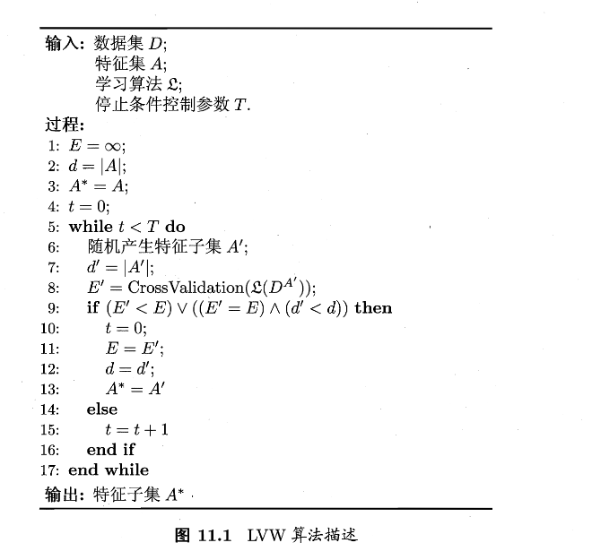
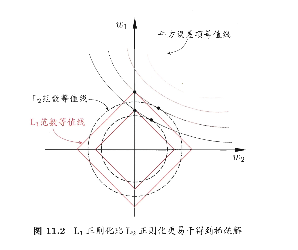
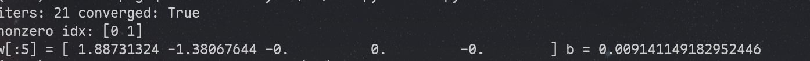

# 第十一章 特征选择与稀疏学习

> 本章讲两个部分，分别是数据集的优化、稀疏学习的原理


### 子集搜索与评价

现实任务中特征很多，但真正对当前学习任务有用的只有一部分。我们称对当前任务有帮助的为 **相关特征**，对当前任务无帮助甚至带来干扰的为 **无关特征**

于是我们的目标可以是：**从初始特征集合里选一个子集，尽量包含所有重要信息。**

但在没有强先验的情况下，暴力枚举所有子集会遇到组合爆炸：特征数一多，子集数量指数级增长，导致计算困难。这也就是我们要解决的问题

很容易想到，我们可以不断选出候选子集、评价、再生成更好的候选，层层筛选，直到无法改进。于是我们可以将这个难点转化为两个关键问题：

1. **子集搜索**：下一个候选子集怎么来？
2. **子集评价**：怎么判断一个子集足够好？

---

子集搜索问题

大概总结为这三种：

- 前向搜索：从空集开始，每轮加一个“最有用”的特征
- 后向搜索：从全集开始，每轮删一个“最没用”的特征
- 双向搜索：一边加“确认保留”的相关特征，一边删无关特征

这三种都采用了贪心的思路，只能保证本轮选定集最优，可能错过全局最优（这是目前尚未解决的问题）

---

子集评价问题

先引入 **信息熵** 的概念，这个其实之前介绍过，重新讲一下

$$
\mathrm{Ent}(D)=-\sum_{k=1}^{|Y|}p_k\log_2 p_k \tag{11.2}
$$

- $Y$：类别集合，$|Y|$ 是类别数。
- $p_k$：在整个数据集 $D$ 中，第 $k$ 类样本所占比例。

Note

熵越大 → 类别越混（不确定性高）；熵越小 → 类别越“纯”（更确定）。

- 极端情况：全是同一类 → 熵为 0（完全确定）。
- 各类均匀 → 熵最大（最混乱）。

然后采用 **信息增益** 解决进行量化评判：

给定数据集 $D$，假定 $D$ 中第 $i$ 类样本所占比例为 $p_i$ 。对属性子集 $A$ 假定根据其取值将 $D$ 分成了 $V$ 个子集 $\{D^1,D^2,\dots,D^V\}$。每个子集中的样本在 A 上取值相同，于是我们可以计算属性子集 $A$ 的信息增益为

$$
\mathrm{Gain}(A)=\mathrm{Ent}(D)-\sum_{v=1}^{V}\frac{|D^v|}{|D|}\mathrm{Ent}(D^v) \tag{11.1}
$$

- $|D|$：总样本数；$|D^v|$：第 $v$ 个分组里的样本数。
- $\mathrm{Ent}(D^v)$：分组 $D^v$ 内的类别熵。
- $\sum_{v=1}^{V}\frac{|D^v|}{|D|}\mathrm{Ent}(D^v)$：**划分后的“加权平均熵”**（各组按规模加权）。

Note

此式意味着：信息增益 = 划分前的混乱度 − 划分后的平均混乱度

- $\mathrm{Gain}(A)$ 越大 → 用 $A$ 分组后各组更“纯” → $A$ 对分类越有帮助。
- 直觉上就是：$A$ 让标签 $Y$ 更容易被预测了。

---

我们把子集搜索机制和子集评价机制结合起来，就可以得到各种特征选择算法。常见的特征选择方法大体分为三类：**过滤式**，**包裹式**，**嵌入式**，后文一一介绍


### 过滤式选择：先选特征，再训练模型

文中介绍了 Relief 算法，其核心是 **用近邻对比给每个特征打分**

即，对每个样本 $x_i$，Relief会找两个样本点，分别是：

- near-hit(猜中近邻) $x_{i,nh}$：同类中离 $x_i$ 最近的
- near-miss(猜错近邻) $x_{i,nm}$：异类里离 $x_i$ 最近的

那么我们直觉可知，一个好的特征应该让同类更像（距离小），异类更不像（距离大）。我们将其转化为数学语言，如下：

$$
\delta^j=\sum_i \Big(-\mathrm{diff}(x_i^j,x_{i,nh}^j)^2+\mathrm{diff}(x_i^j,x_{i,nm}^j)^2\Big)\tag{11.3}
$$

Note

解释下它在“奖励/惩罚”什么：

- $x_i^j$：样本 $x_i$ 在第 $j$ 个特征上的取值。
- $\mathrm{diff}(\cdot,\cdot)$：第 $j$ 个特征上的差异度：
- **离散特征**：相同为 0，不同为 1
- **连续特征**：$|x_a^j-x_b^j|$，且书里假设已归一化到 $[0,1]$
- 负号项 $-\mathrm{diff}(x_i^j,x_{i,nh}^j)^2$：**同类最近邻如果在特征 $j$ 上差得很大**，这个特征不“稳定”，要扣分；反之差得小，扣得少（相当于加分）。
- 正号项 $+\mathrm{diff}(x_i^j,x_{i,nm}^j)^2$：**异类最近邻如果在特征 $j$ 上差得很大**，说明这个特征能把类分开，要加分；反之差得小，加得少。

那么这个式子的意味着：给每个特征 $j$ 累计一个“区分力分数”，让同类更近、异类更远 的特征分数更大

---

由于Relief是基于二分类问题设计的，于是改进出了 Relief-F 算法，把 “near-miss” 从 “一个异类最近邻” 扩展为 “每个其它类各找一个最近邻”，再按类的先验比例加权，数学表达如下：

$$
\delta^j=\sum_i\Big(-\mathrm{diff}(x_i^j,x_{i,nh}^j)^2+\sum_{l\neq k} p_l\,\mathrm{diff}(x_i^j,x_{i,l,nm}^j)^2\Big)\tag{11.4}
$$


```

from

__future__

import

annotations

import

numpy

as

np

from

typing

import

List
,

Optional
,

Literal
,

Tuple

FeatureType

=

Literal
[
"continuous"
,

"discrete"
]

def

_minmax_scale_continuous
(
X
:

np
.
ndarray
,

eps
:

float

=

1e-12
)

->

np
.
ndarray
:


"""对连续特征做 min-max 到 [0,1]，离散特征不在这里处理。"""


X

=

X
.
astype
(
float
)


x_min

=

X
.
min
(
axis
=
0
)


x_max

=

X
.
max
(
axis
=
0
)


denom

=

np
.
maximum
(
x_max

-

x_min
,

eps
)


return

(
X

-

x_min
)

/

denom

def

_diff_per_feature
(
x
:

np
.
ndarray
,

z
:

np
.
ndarray
,

feature_types
:

List
[
FeatureType
])

->

np
.
ndarray
:


"""

    按书中 diff 定义计算每个特征的差异：

    - 离散：相同 0，不同 1

    - 连续：|x - z|（假设已归一化到[0,1]）

    返回 shape = (d,)

    """


d

=

x
.
shape
[
0
]


out

=

np
.
empty
(
d
,

dtype
=
float
)


for

j
,

t

in

enumerate
(
feature_types
):


if

t

==

"discrete"
:


out
[
j
]

=

0.0

if

x
[
j
]

==

z
[
j
]

else

1.0


else
:


out
[
j
]

=

abs
(
float
(
x
[
j
])

-

float
(
z
[
j
]))


return

out

def

_mixed_distance
(
x
:

np
.
ndarray
,

Z
:

np
.
ndarray
,

feature_types
:

List
[
FeatureType
])

->

np
.
ndarray
:


"""

    用“每维 diff 的 L1 和”做样本间距离（用于找 near-hit / near-miss）。

    返回 shape=(n,)

    """


# 逐样本算，保证清晰；n 不大时够用


n

=

Z
.
shape
[
0
]


dist

=

np
.
empty
(
n
,

dtype
=
float
)


for

i

in

range
(
n
):


dist
[
i
]

=

_diff_per_feature
(
x
,

Z
[
i
],

feature_types
)
.
sum
()


return

dist

def

relief
(


X
:

np
.
ndarray
,


y
:

np
.
ndarray
,


feature_types
:

Optional
[
List
[
FeatureType
]]

=

None
,


n_samples
:

Optional
[
int
]

=

None
,


random_state
:

Optional
[
int
]

=

None
,

)

->

np
.
ndarray
:


"""

    Relief（二分类）实现，对应书中式(11.3)：

      δ^j += -diff(x_i^j, x_{i,nh}^j)^2 + diff(x_i^j, x_{i,nm}^j)^2

    返回：weights = δ（每维越大越重要）

    参数：

      X: (m, d)

      y: (m,)

      feature_types: 长度 d，"continuous"/"discrete"

      n_samples: 采样多少个 i 来估计（None 表示用全部样本）

    """


X

=

np
.
asarray
(
X
)


y

=

np
.
asarray
(
y
)


m
,

d

=

X
.
shape


if

feature_types

is

None
:


feature_types

=

[
"continuous"
]

*

d


assert

len
(
feature_types
)

==

d


# 连续特征归一化到[0,1]（离散特征保持原样）


Xn

=

X
.
copy
()


cont_idx

=

[
j

for

j
,

t

in

enumerate
(
feature_types
)

if

t

==

"continuous"
]


if

cont_idx
:


Xn
[:,

cont_idx
]

=

_minmax_scale_continuous
(
Xn
[:,

cont_idx
])


# 检查二分类


classes

=

np
.
unique
(
y
)


if

classes
.
size

!=

2
:


raise

ValueError
(
"relief() 仅用于二分类；多分类请用 relief_f()."
)


rng

=

np
.
random
.
default_rng
(
random_state
)


if

n_samples

is

None

or

n_samples

>=

m
:


idxs

=

np
.
arange
(
m
)


else
:


idxs

=

rng
.
choice
(
m
,

size
=
n_samples
,

replace
=
False
)


delta

=

np
.
zeros
(
d
,

dtype
=
float
)


for

i

in

idxs
:


xi

=

Xn
[
i
]


yi

=

y
[
i
]


# 计算与所有点距离以找近邻（排除自己）


dist

=

_mixed_distance
(
xi
,

Xn
,

feature_types
)


dist
[
i
]

=

np
.
inf


same_mask

=

(
y

==

yi
)


diff_mask

=

(
y

!=

yi
)


# near-hit / near-miss


nh_idx

=

np
.
argmin
(
np
.
where
(
same_mask
,

dist
,

np
.
inf
))


nm_idx

=

np
.
argmin
(
np
.
where
(
diff_mask
,

dist
,

np
.
inf
))


diff_hit

=

_diff_per_feature
(
xi
,

Xn
[
nh_idx
],

feature_types
)


diff_miss

=

_diff_per_feature
(
xi
,

Xn
[
nm_idx
],

feature_types
)


# 对应(11.3)


delta

+=

-
(
diff_hit

**

2
)

+

(
diff_miss

**

2
)


return

delta

if

__name__

==

"__main__"
:


# 简单自测（随机数据）


rng

=

np
.
random
.
default_rng
(
0
)


X

=

rng
.
normal
(
size
=
(
50
,

6
))


y

=

(
X
[:,

0
]

+

0.5

*

X
[:,

1
]

>

0
)
.
astype
(
int
)


w

=

relief
(
X
,

y
,

n_samples
=
30
,

random_state
=
0
)


print
(
"Relief weights:"
,

w
)

```


### 包裹式选择：用学习器性能当评价

包裹式特征选择直接把最终将要使用的学习器的性能作为特征子集的评价准则，它会为给定学习器选择最有利用其性能、量身定做的特征子集

书中结合扫了LVW算法，其核心是：**随机搜索+交叉验证误差做准则**，本质还是碰运气




```

from

__future__

import

annotations

import

numpy

as

np

from

typing

import

Callable
,

Optional
,

Sequence
,

Tuple
,

List
,

Any

def

accuracy_score
(
y_true
:

np
.
ndarray
,

y_pred
:

np
.
ndarray
)

->

float
:


y_true

=

np
.
asarray
(
y_true
)


y_pred

=

np
.
asarray
(
y_pred
)


return

float
((
y_true

==

y_pred
)
.
mean
())

def

stratified_kfold_indices
(
y
:

np
.
ndarray
,

k
:

int
,

random_state
:

Optional
[
int
]

=

None
)

->

List
[
np
.
ndarray
]:


"""

    生成 k 折分层索引

    返回 folds: list，每个元素是该折 test_idx

    """


rng

=

np
.
random
.
default_rng
(
random_state
)


y

=

np
.
asarray
(
y
)


classes

=

np
.
unique
(
y
)


per_class

=

{}


for

c

in

classes
:


idx

=

np
.
where
(
y

==

c
)[
0
]


rng
.
shuffle
(
idx
)


per_class
[
c
]

=

idx


folds

=

[

[]

for

_

in

range
(
k
)

]


# round-robin 分配到各折


for

c

in

classes
:


idx

=

per_class
[
c
]


for

t
,

ii

in

enumerate
(
idx
):


folds
[
t

%

k
]
.
append
(
int
(
ii
))


return

[
np
.
array
(
f
,

dtype
=
int
)

for

f

in

folds
]

def

cross_validation_score
(


learner_factory
:

Callable
[[],

Any
],


X
:

np
.
ndarray
,


y
:

np
.
ndarray
,


k_folds
:

int

=

5
,


score_fn
:

Callable
[[
np
.
ndarray
,

np
.
ndarray
],

float
]

=

accuracy_score
,


random_state
:

Optional
[
int
]

=

None
,

)

->

float
:


"""

    对给定特征子集上的数据做 k 折交叉验证，返回平均得分。

    learner_factory(): 每次调用返回一个“新”的模型，模型需有 fit(X,y) 和 predict(X)。

    """


X

=

np
.
asarray
(
X
)


y

=

np
.
asarray
(
y
)


folds

=

stratified_kfold_indices
(
y
,

k_folds
,

random_state
=
random_state
)


scores

=

[]


all_idx

=

np
.
arange
(
len
(
y
))


for

test_idx

in

folds
:


train_idx

=

np
.
setdiff1d
(
all_idx
,

test_idx
,

assume_unique
=
False
)


model

=

learner_factory
()


model
.
fit
(
X
[
train_idx
],

y
[
train_idx
])


pred

=

model
.
predict
(
X
[
test_idx
])


scores
.
append
(
score_fn
(
y
[
test_idx
],

pred
))


return

float
(
np
.
mean
(
scores
))

def

random_subset
(


d
:

int
,


p_select
:

float
,


rng
:

np
.
random
.
Generator
,


allow_empty
:

bool

=

False
,

)

->

np
.
ndarray
:


mask

=

rng
.
random
(
d
)

<

p_select


idx

=

np
.
where
(
mask
)[
0
]


if

idx
.
size

==

0

and

not

allow_empty
:


idx

=

np
.
array
([
rng
.
integers
(
0
,

d
)],

dtype
=
int
)


return

idx

def

lvw
(


X
:

np
.
ndarray
,


y
:

np
.
ndarray
,


learner_factory
:

Callable
[[],

Any
],


T
:

int

=

50
,


k_folds
:

int

=

5
,


p_select
:

float

=

0.5
,


score_fn
:

Callable
[[
np
.
ndarray
,

np
.
ndarray
],

float
]

=

accuracy_score
,


random_state
:

Optional
[
int
]

=

None
,


tol
:

float

=

1e-12
,

)

->

Tuple
[
np
.
ndarray
,

float
]:


"""

    LVW (Las Vegas Wrapper) —— 与图11.1一致的“随机子集 + CV误差”版本。

    维护最优误差 E 和最优子集 A*；连续 T 次未改进则停止。

    返回:

      best_idx: 最优特征索引数组 A*

      best_err: 最优误差 E（err = 1 - score）

    """


X

=

np
.
asarray
(
X
)


y

=

np
.
asarray
(
y
)


m
,

d

=

X
.
shape


rng

=

np
.
random
.
default_rng
(
random_state
)


# 初始化：从全集开始（与图中 A*=A 对应）


best_idx

=

np
.
arange
(
d
,

dtype
=
int
)


best_score

=

cross_validation_score
(


learner_factory
,

X
[:,

best_idx
],

y
,


k_folds
=
k_folds
,

score_fn
=
score_fn
,

random_state
=
random_state


)


best_err

=

1.0

-

best_score


best_size

=

best_idx
.
size


t

=

0


while

t

<

T
:


cand_idx

=

random_subset
(
d
,

p_select
,

rng
,

allow_empty
=
False
)


cand_score

=

cross_validation_score
(


learner_factory
,

X
[:,

cand_idx
],

y
,


k_folds
=
k_folds
,

score_fn
=
score_fn
,

random_state
=
random_state


)


cand_err

=

1.0

-

cand_score


cand_size

=

cand_idx
.
size


# 图11.1：若 E' < E 或 (E'=E 且 d'<d) 则接受并 t=0


improved

=

(
cand_err

<

best_err

-

tol
)

or

(
abs
(
cand_err

-

best_err
)

<=

tol

and

cand_size

<

best_size
)


if

improved
:


best_err

=

cand_err


best_size

=

cand_size


best_idx

=

np
.
sort
(
cand_idx
)


t

=

0


else
:


t

+=

1


return

best_idx
,

best_err


# ===== 一个“无依赖”的示例学习器：最近类中心分类器（Nearest Centroid）=====

class

NearestCentroid
:


def

__init__
(
self
):


self
.
classes_

=

None


self
.
centroids_

=

None


def

fit
(
self
,

X
:

np
.
ndarray
,

y
:

np
.
ndarray
):


X

=

np
.
asarray
(
X
,

dtype
=
float
)


y

=

np
.
asarray
(
y
)


self
.
classes_

=

np
.
unique
(
y
)


self
.
centroids_

=

np
.
vstack
([
X
[
y

==

c
]
.
mean
(
axis
=
0
)

for

c

in

self
.
classes_
])


return

self


def

predict
(
self
,

X
:

np
.
ndarray
)

->

np
.
ndarray
:


X

=

np
.
asarray
(
X
,

dtype
=
float
)


# 欧氏距离到各类中心


# (n,1,d) - (1,C,d) -> (n,C,d) -> (n,C)


dist2

=

((
X
[:,

None
,

:]

-

self
.
centroids_
[
None
,

:,

:])

**

2
)
.
sum
(
axis
=
2
)


idx

=

dist2
.
argmin
(
axis
=
1
)


return

self
.
classes_
[
idx
]

if

__name__

==

"__main__"
:


rng

=

np
.
random
.
default_rng
(
0
)


X

=

rng
.
normal
(
size
=
(
120
,

12
))


y

=

(
X
[:,

0
]

+

0.8

*

X
[:,

3
]

-

0.4

*

X
[:,

7
]

>

0
)
.
astype
(
int
)


best_idx
,

best_err

=

lvw
(


X
,

y
,


learner_factory
=
lambda
:

NearestCentroid
(),


T
=
30
,

k_folds
=
5
,

p_select
=
0.4
,

random_state
=
0


)


print
(
"Best subset idx:"
,

best_idx
)


print
(
"Best CV error:"
,

best_err
)

```


### 嵌入式选择与 $L_1$ 正则化

嵌入式这个名字就很直白：将选择特征的过程直接塞进训练目标里一起优化

**特征多 + 样本少** → 纯最小化训练误差很容易过拟合

→ 给目标函数加“惩罚项”（正则化）来约束模型复杂度

→ 其中 **L1 正则** 会把很多参数压到 0

→ 参数为 0 的特征等价于“没被选中”

→ 因此 L1 正则 = 一种“训练过程中自动完成的特征选择”（嵌入式）

---

我们给定数据集 $D=\{(x_1,y_1),(x_2,y_2),\dots,(x_m,y_m)\}$，其中 $x\in\mathbb{R}^d，y\in\mathbb{R}$,我们以平方误差作为损失函数，则优化目标为

$$
\min_w\sum_{i=1}^m(y_i-w^Tx_i)^2\tag{11.5}
$$

Note

也就是：找一个线性模型 $\hat y=w^Tx$，让训练集上的平方误差最小

可以想到，当维度 $d$ 很大、样本 $m$ 相对少时，模型自由度太高，容易把噪声也拟合进去，导致过拟合

为了缓解过拟合问题，我们对式(11.5)引入正则化项，用 $L_2$ 范数正则化，则有

$$
\min_w\sum_{i=1}^m(y_i-w^Tx_i)^2+\lambda\|w\|_2^2\tag{11.6}
$$

Note

这个式子的实际意义是：在拟合数据之外额外乘法参数的平方和

这样会使得参数整体缩小，但是多数依然非零，会导致最终结果不够稀疏

为了更容易得到稀疏解，我们采用 $L_1$ 正则
$$
\min\_w\sum\_{i=1}m(y\_i-wTx\_i)^2+\lambda|w|\_1\tag{11.7}
$$

Note

用参数绝对值的和来惩罚复杂度，这样就可以把很多 $w_j$ 压倒精准0

也就是：$w_j=0\Rightarrow$ 第 $j$ 个特征对预测不起作用 $\Rightarrow$ 该特征等价于没被选



我们把平方误差的等值线想成一圈圈椭圆；把正则项约束区域想成：

- $L_2$:圆形 -> 最优点更可能落在一般位置 $\Rightarrow$ $w_1,w_2$ 多为非零
- $L_1$:菱形 -> 更容易在坐标轴方向的尖角相切 $\Rightarrow$ 常出现 $w_1=0$ 或 $w_2=0$

---

求解 $L_1$:近端梯度下降（PGD）把“梯度步 + 软阈值”拼起来

接下来我们从求解式(11.7)推广到一般形式

首先复合优化，得到光滑项和非光滑的 $L_1$

$$
\min_xf(x)+\lambda\|x\|_1\tag{11.8}
$$

这样的话我们就把平方误差等写入了一个可导的函数中，且把 $L_1$ 单独拿了出来

然后我们计算梯度 Lipschitz，进而保证二次上界成立

$$
\|\nabla f(x')-\nabla f(x)\|_2^2\le L\|x'-x\|_2^2\quad(\forall x,x')\tag{11.9}
$$

Note

这里其实是让 $f$ 的梯度变化不要太强烈，从而让我们可以用一个二次函数局部罩住 $f$

接下来利用泰勒展开，得到近似

$$
\begin{align}
\hat{f}(x) \simeq f(x_k) + \langle \nabla f(x_k), x - x_k \rangle + \frac{L}{2}\|x - x_k\|_2^2
\\
= \frac{L}{2}\left\| x - \left( x_k - \frac{1}{L}\nabla f(x_k) \right) \right\|_2^2 + \text{const},
\tag{11.10}
\end{align}
$$

Note

式(11.10)实现了：在 $x_k$ 附近，用一个容易最小化的二次函数替代/上界原函数。其中 $x_k - \frac{1}{L}\nabla f(x_k)$ 就是往负梯度方向走一步

const是一个常数，也就是课本中常用的 $C$

如果没有 $L_1$，也就是只优化光滑项的时候，可以得到标准梯度下降

$$
x_{k+1}=x_{k}-\dfrac{1}{L}\nabla f(x_k)\tag{11.11}
$$

接下来我们加上 $L_1$,每一步都做“带 $L_1$ 的二次最小化”

$$
x_{k+1}=\arg\min_x\dfrac{L}{2}\left\|x-\left(x_k-\dfrac{1}{L}\nabla f(x_k)\right)\right\|_2^2+\lambda\|x\|_1\tag{11.12}
$$

Note

**实际意义**：先按梯度信息确定一个“理想落点”，再用 L1 把它“往 0 拉”，从而产生稀疏。

接下来求解式(11.12)，我们可以先计算 $z=x_k-\dfrac{1}{L}\nabla f(x_k)$ ，然后求解

$$
x_{k+1}=\arg\min_x\dfrac{L}{2}\|x-z\|_2^2+\lambda\|x\|_1\tag{11.13}
$$

不妨令 $x^i$ 表示 $x$ 的第 $i$ 个分量，将式(11.13)按分量展开可以看出，其中不存在 $x^ix^j(i\ne j)$ 这样的项，也就是说 $x$ 的各分量互不影响，于是式(11.13)可以得到闭式解

$$
x_{k+1}^i
\begin{cases}
z^i-\lambda/L,\quad z^i>\lambda/L \\
0,\quad|z^i|\le \lambda/L\\
z^i+\lambda/L,z^i< -\lambda/L
\end{cases}
\tag{11.14}
$$


```

import

numpy

as

np

from

typing

import

Optional
,

Tuple
,

Dict
,

Any

def

soft_threshold
(
z
:

np
.
ndarray
,

tau
:

float
)

->

np
.
ndarray
:


"""

    软阈值算子 S_tau(z)，对应式(11.14)

    """


return

np
.
sign
(
z
)

*

np
.
maximum
(
np
.
abs
(
z
)

-

tau
,

0.0
)

def

estimate_lipschitz_L
(
X
:

np
.
ndarray
,

m
:

int
,

n_iter
:

int

=

50
,

random_state
:

Optional
[
int
]

=

None
)

->

float
:


"""

    估计 ∇f 的 Lipschitz 常数 L。

    若 f(w) = (1/(2m)) ||y - Xw||^2，则 ∇f(w) = (1/m) X^T(Xw - y)

    此时 L = λ_max( (1/m) X^T X ) = ||X||_2^2 / m

    用幂迭代估计最大特征值，避免显式构造 X^T X。

    """


rng

=

np
.
random
.
default_rng
(
random_state
)


d

=

X
.
shape
[
1
]


v

=

rng
.
normal
(
size
=
d
)


v

/=

(
np
.
linalg
.
norm
(
v
)

+

1e-12
)


eig

=

0.0


for

_

in

range
(
n_iter
):


Xv

=

X

@

v


# (m,)


XtXv

=

(
X
.
T

@

Xv
)

/

m


# (d,)


norm

=

np
.
linalg
.
norm
(
XtXv
)

+

1e-12


v

=

XtXv

/

norm


eig

=

float
(
v

@

((
X
.
T

@

(
X

@

v
))

/

m
))


return

max
(
eig
,

1e-12
)

def

lasso_pgd
(


X
:

np
.
ndarray
,


y
:

np
.
ndarray
,


lam
:

float
,


max_iter
:

int

=

5000
,


tol
:

float

=

1e-7
,


fit_intercept
:

bool

=

True
,


standardize
:

bool

=

True
,


L
:

Optional
[
float
]

=

None
,


random_state
:

Optional
[
int
]

=

None
,


return_history
:

bool

=

True
,

)

->

Tuple
[
np
.
ndarray
,

float
,

Dict
[
str
,

Any
]]:


"""

    用 PGD/ISTA 求解 LASSO（式(11.7)的一种常见归一化写法）：

        min_w  (1/(2m)) ||y - Xw||_2^2 + lam * ||w||_1

    - fit_intercept=True：不惩罚截距（常用做法），通过中心化 y 和 X 实现

    - standardize=True：每列除以标准差（强烈建议，否则 L1 选择会偏向尺度大的特征）

    返回：

      w: (d,) 系数

      b: 截距

      info: 收敛信息/历史

    """


X

=

np
.
asarray
(
X
,

dtype
=
float
)


y

=

np
.
asarray
(
y
,

dtype
=
float
)
.
reshape
(
-
1
)


m
,

d

=

X
.
shape


# —— 处理截距：中心化（等价于不惩罚 b）——


if

fit_intercept
:


X_mean

=

X
.
mean
(
axis
=
0
)


y_mean

=

y
.
mean
()


Xc

=

X

-

X_mean


yc

=

y

-

y_mean


else
:


X_mean

=

np
.
zeros
(
d
)


y_mean

=

0.0


Xc

=

X


yc

=

y


# —— 标准化（不改变稀疏模式的解释性，常规做法）——


if

standardize
:


X_std

=

Xc
.
std
(
axis
=
0
)


X_std

=

np
.
where
(
X_std

<

1e-12
,

1.0
,

X_std
)


Xs

=

Xc

/

X_std


else
:


X_std

=

np
.
ones
(
d
)


Xs

=

Xc


# —— Lipschitz 常数 L ——（若未给定则估计）


if

L

is

None
:


L

=

estimate_lipschitz_L
(
Xs
,

m
,

n_iter
=
60
,

random_state
=
random_state
)


step

=

1.0

/

L


# 初始化


w

=

np
.
zeros
(
d
)


history

=

{
"obj"
:

[],

"rel_change"
:

[]}


def

objective
(
w_
:

np
.
ndarray
)

->

float
:


r

=

yc

-

Xs

@

w_


return

0.5

/

m

*

(
r

@

r
)

+

lam

*

np
.
linalg
.
norm
(
w_
,

1
)


prev_obj

=

objective
(
w
)


if

return_history
:


history
[
"obj"
]
.
append
(
prev_obj
)


for

it

in

range
(
1
,

max_iter

+

1
):


# ∇f(w) = (1/m) X^T (Xw - y)


grad

=

(
Xs
.
T

@

(
Xs

@

w

-

yc
))

/

m


# (11.11)/(11.12)：梯度步得到 z


z

=

w

-

step

*

grad


# (11.14)：近端步 = 软阈值


w_new

=

soft_threshold
(
z
,

lam

*

step
)


# 收敛判据：相对变化


rel

=

np
.
linalg
.
norm
(
w_new

-

w
)

/

(
np
.
linalg
.
norm
(
w
)

+

1e-12
)


w

=

w_new


obj

=

objective
(
w
)


if

return_history
:


history
[
"obj"
]
.
append
(
obj
)


history
[
"rel_change"
]
.
append
(
rel
)


if

rel

<

tol
:


break


prev_obj

=

obj


# —— 还原到原始尺度 ——（如果标准化过，要把系数“缩回去”）


w_unscaled

=

w

/

X_std


# 截距还原：b = y_mean - X_mean·w


b

=

float
(
y_mean

-

X_mean

@

w_unscaled
)

if

fit_intercept

else

0.0


info

=

{


"iters"
:

it
,


"L"
:

L
,


"step"
:

step
,


"converged"
:

(
rel

<

tol
),


"history"
:

history

if

return_history

else

None


}


return

w_unscaled
,

b
,

info

if

__name__

==

"__main__"
:


# 简单 demo：前两维是有效特征，其余是噪声


rng

=

np
.
random
.
default_rng
(
0
)


m
,

d

=

200
,

20


X

=

rng
.
normal
(
size
=
(
m
,

d
))


true_w

=

np
.
zeros
(
d
)


true_w
[
0
]

=

2.0


true_w
[
1
]

=

-
1.5


y

=

X

@

true_w

+

0.3

*

rng
.
normal
(
size
=
m
)


w
,

b
,

info

=

lasso_pgd
(
X
,

y
,

lam
=
0.1
,

max_iter
=
5000
,

tol
=
1e-8
,

random_state
=
0
)


print
(
"iters:"
,

info
[
"iters"
],

"converged:"
,

info
[
"converged"
])


print
(
"nonzero idx:"
,

np
.
where
(
np
.
abs
(
w
)

>

1e-6
)[
0
])


print
(
"w[:5] ="
,

w
[:
5
],

"b ="
,

b
)

```



Tip

**过滤式/包裹式**：特征选择是训练前/训练外的一个步骤

**嵌入式（L1）**：特征选择被写进目标函数，通过优化过程自动完成

结果上：L1 给出稀疏 $w$ ⇒ 等价于输出一个被选择的特征子集


### 稀疏表示与字典学习

我们之前所讨论的内容主要集中在列稀疏的角度（也就是很多特征是没用的/可删的），然后我们通过特征选择删除某个列，从而让训练更加容易

本节中，我们换了一个稀疏性，即 **数据矩阵本身在元素层面很多是0**，这样的话每一行/列都很稀疏，从而让很多学习问题变得简单

> 例如文本的“词袋/词频”表示，维度很大，但是每篇文档只出现少量的词

我们将这个问题推向一般化：如果原始数据集 $D$ 不是天然稀疏，能否将其转化为稀疏表示？这便是字典学习的内容，即学习一个字典 $B$ ,让每个样本 $x_i$ 都能用少量字典原子线性组合表示

---

给定数据集 $\{x_1,x_2,\dots,x_m\}$,字典学习基本目标为：重构好+系数稀疏，用数学语言表达为：

$$
\min_{B,\alpha_i}\sum_{i=1}^m\|x_i-B\alpha_i\|_2^2+\lambda\sum_{i=1}^{m}\|\alpha_i\|_1\tag{11.15}
$$

Note

- $x_i\in\mathbb{R}^d$：第 $i$ 个样本
- $B\in\mathbb{R}^{d\times k}$：字典（$k$ 个“原子/基向量”，通常 $k   d$ 叫过完备）
- $\alpha_i\in\mathbb{R}^k$：样本 $x_i$ 在字典上的表示系数
- 第一项：**重构误差**（希望$B\alpha_i$ 能逼近 $x_i$）
- 第二项：**稀疏惩罚**（希望 $\alpha_i$ 里尽可能多的分量为 0）
- $\lambda$：控制“重构 vs 稀疏”的权衡（越大越稀疏但重构可能变差）

**我们可以采用变量交替优化的策略来解决式(11.15)**，首先固定字典 $B$，每个样本各自做一次稀疏编码，为每个样本 $x_i$ 找到对应的 $\alpha_i$

$$
\min_{\alpha_i}\|x_i-B\alpha_i\|_2^2+\lambda\|\alpha_i\|_1\tag{11.16}
$$

Note

即在字典B给定时，求最稀疏且重构好的 $\alpha_i$。由于按分量展开没有 $\alpha_i^u\alpha_i^v$ 这种耦合项，所以可以用近端梯度等高效解

接下来固定稀疏矩阵 $A$,更新字典是最小二乘。我们定义 $X=(x_1,\dots,x_m)\in\mathbb{R}^{d\times m};A=(\alpha_1,\dots,\alpha_m)\in\mathbb{R}^{k\times m}$

于是我们可以更新字典为

$$
\min_B\|X-BA\|_F^2\tag{11.17}
$$

Note

$\|\cdot\|_F$ 表示Frobenius范数，是把矩阵所有元素平方求和再开方。当我们在式(11.17)固定A时，这就是一个线性最小二乘问题。或者说，系数都定了，就把字典调到最能重构这些样本的那一套

然后我们对式(11.17)进行求解，书中采用了KSVD算法，把字典按列更新

我们记 $b_j$ 是字典 $B$ 的第 $j$ 列（第 $j$ 个原子），$\alpha^j$ 是 $A$ 的第 $j$ 行（这个原子在所有样本上的系数），然后带入 $BA=\sum_{j=1}^kb_j\alpha^j$,可以将式(11.17)写为对每一列的更新子问题：

$$
\begin{align}
\min_{B} \|X - BA\|_F^2
&= \min_{b_i} \left\| X - \sum_{j=1}^{k} b_j \alpha^{j} \right\|_F^2
\\
&= \min_{b_i} \left\|
\left( X - \sum_{j \ne i} b_j \alpha^{j} \right) - b_i \alpha^{i}
\right\|_F^2
\\
&= \min_{b_i} \|E_i - b_i \alpha^{i}\|_F^2,
\tag{11.18}
\end{align}
$$

Note

也就是，其它原子先固定，我们只更新第 $i$ 个原子，使残差下降最多，轮流让每个字典原子去解释它所负责的那部分残差

之后反复迭代上述两步，先固定 $B$ 再固定 $A$，最终得到结果

---

算法


```

import

numpy

as

np

from

typing

import

Optional
,

Tuple

def

soft_threshold
(
z
:

np
.
ndarray
,

tau
:

float
)

->

np
.
ndarray
:


return

np
.
sign
(
z
)

*

np
.
maximum
(
np
.
abs
(
z
)

-

tau
,

0.0
)

def

ista_lasso
(
B
:

np
.
ndarray
,

x
:

np
.
ndarray
,

lam
:

float
,

max_iter
:

int

=

200
,

tol
:

float

=

1e-6
)

->

np
.
ndarray
:


"""

    解 (11.16) 的一个常见归一化版本：

        min_a  0.5||x - B a||^2 + lam||a||_1

    用 ISTA：a <- S_{lam/L}(a - (1/L) * grad)

    """


d
,

k

=

B
.
shape


a

=

np
.
zeros
(
k
)


# L = ||B||_2^2（梯度 Lipschitz 常数）


# 用谱范数估计：np.linalg.norm(B, 2) 是 SVD，k不大时可接受


L

=

(
np
.
linalg
.
norm
(
B
,

2
)

**

2
)

+

1e-12


step

=

1.0

/

L


for

_

in

range
(
max_iter
):


grad

=

B
.
T

@

(
B

@

a

-

x
)


# ∇(0.5||x-Ba||^2)


z

=

a

-

step

*

grad


a_new

=

soft_threshold
(
z
,

lam

*

step
)


if

np
.
linalg
.
norm
(
a_new

-

a
)

/

(
np
.
linalg
.
norm
(
a
)

+

1e-12
)

<

tol
:


a

=

a_new


break


a

=

a_new


return

a

def

normalize_columns
(
B
:

np
.
ndarray
,

eps
:

float

=

1e-12
)

->

np
.
ndarray
:


norms

=

np
.
linalg
.
norm
(
B
,

axis
=
0
)


norms

=

np
.
maximum
(
norms
,

eps
)


return

B

/

norms

def

dictionary_learning_ksvd
(


X
:

np
.
ndarray
,


# (d, m) 每列一个样本


k
:

int
,


# 字典原子数


lam
:

float
,


# L1 系数


n_outer
:

int

=

20
,


# 外层交替次数


ista_iter
:

int

=

200
,


random_state
:

Optional
[
int
]

=

None

)

->

Tuple
[
np
.
ndarray
,

np
.
ndarray
]:


"""

    近似求解 (11.15)：交替优化

      1) 固定 B：逐样本解 LASSO 得 A（对应 11.16）

      2) 固定 A：按列更新字典 B（对应 11.17/11.18，K-SVD 思路）

    返回：

      B: (d, k)

      A: (k, m)

    """


X

=

np
.
asarray
(
X
,

dtype
=
float
)


d
,

m

=

X
.
shape


rng

=

np
.
random
.
default_rng
(
random_state
)


# --- 初始化字典：随机挑样本列 + 归一化 ---


idx

=

rng
.
choice
(
m
,

size
=
k
,

replace
=
(
k

>

m
))


B

=

normalize_columns
(
X
[:,

idx
]
.
copy
())


A

=

np
.
zeros
((
k
,

m
))


for

_

in

range
(
n_outer
):


# ===== Step 1: Sparse coding (11.16) =====


for

i

in

range
(
m
):


A
[:,

i
]

=

ista_lasso
(
B
,

X
[:,

i
],

lam
=
lam
,

max_iter
=
ista_iter
)


# ===== Step 2: Dictionary update (11.17/11.18) =====


# 逐原子更新（K-SVD：只在该原子激活的样本集合上做 rank-1 SVD）


for

j

in

range
(
k
):


omega

=

np
.
nonzero
(
A
[
j
,

:])[
0
]


# 该原子参与重构的样本索引（α_j,i != 0）


if

omega
.
size

==

0
:


# 如果这个原子“没人用”，重新初始化为某个残差最大的样本方向


residual

=

X

-

B

@

A


col_norms

=

np
.
linalg
.
norm
(
residual
,

axis
=
0
)


pick

=

int
(
np
.
argmax
(
col_norms
))


B
[:,

j
]

=

residual
[:,

pick
]


B
[:,

j
]

/=

(
np
.
linalg
.
norm
(
B
[:,

j
])

+

1e-12
)


continue


# 计算去掉第 j 个原子后的残差 E_j


# E = X - sum_{l!=j} b_l a_l = X - B A + b_j a_j


E

=

(
X

-

B

@

A
)

+

np
.
outer
(
B
[:,

j
],

A
[
j
,

:])


# 只在 omega 上更新，保持稀疏结构不变


E_omega

=

E
[:,

omega
]


# (d, |omega|)


# rank-1 SVD：E_omega ≈ u1 s1 v1^T


U
,

S
,

Vt

=

np
.
linalg
.
svd
(
E_omega
,

full_matrices
=
False
)


b_new

=

U
[:,

0
]


a_new

=

S
[
0
]

*

Vt
[
0
,

:]


# (|omega|,)


B
[:,

j
]

=

b_new


A
[
j
,

omega
]

=

a_new


# 列归一化（尺度不定性：B 变大 A 变小同样重构）


B

=

normalize_columns
(
B
)


return

B
,

A

if

__name__

==

"__main__"
:


# demo：用随机稀疏系数合成数据，再学回字典


rng

=

np
.
random
.
default_rng
(
0
)


d
,

k_true
,

m

=

30
,

40
,

200


B_true

=

rng
.
normal
(
size
=
(
d
,

k_true
))


B_true

=

normalize_columns
(
B_true
)


A_true

=

np
.
zeros
((
k_true
,

m
))


for

i

in

range
(
m
):


idx

=

rng
.
choice
(
k_true
,

size
=
3
,

replace
=
False
)


A_true
[
idx
,

i
]

=

rng
.
normal
(
size
=
3
)


X

=

B_true

@

A_true

+

0.05

*

rng
.
normal
(
size
=
(
d
,

m
))


B_hat
,

A_hat

=

dictionary_learning_ksvd
(
X
,

k
=
40
,

lam
=
0.1
,

n_outer
=
10
,

random_state
=
0
)


recon_err

=

np
.
linalg
.
norm
(
X

-

B_hat

@

A_hat
,

"fro"
)

/

np
.
linalg
.
norm
(
X
,

"fro"
)


print
(
"relative recon error:"
,

recon_err
)

```
