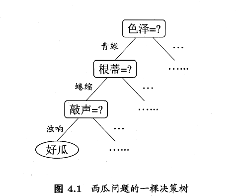

# 第四章 决策树


### 概述

决策树是一种机器学习方法。当我们希望从给定训练数据集学得一个模型来对新示例进行分类的时候，我们可以将 **“这个样本是正例吗”** 这个泛而广的抽象问题具化出一个决策的过程。如下 
决策树学习的目的是为了产生一棵泛化能力强（处理未见示例能力强）的决策树，基本流程遵循简单直观的“分而治之”的策略。

很显然决策树的生成是一种递归的过程，有三种边界条件，如下：

- 当前节点包含的样本都属于同一类别，不需要划分
- 当前属性集为空，或者说所有样本在所有属性上取值相同，无法划分
- 当前节点包含的样本集合为空，不能划分


### 算法


```
输入：训练集 D = {(x1, y1), (x2, y2), …, (xm, ym)};
      属性集 A = {a1, a2, …, ad}。

过程：函数 TreeGenerate(D, A)
1:  生成结点 node;
2:  if D 中样本全属于同一类别 C then
3:      将 node 标记为 C 类叶结点; return
4:  end if
5:  if A = ∅ OR D 中样本在 A 上取值相同 then
6:      将 node 标记为叶结点，其类别标记为 D 中样本数最多的类; return
7:  end if
8:  从 A 中选择最优划分属性 a*;
9:  for a* 的每一个值 a*ᵛ do
10:     为 node 生成一个分支; 令 D_v 表示 D 中在 a* 上取值为 a*ᵛ 的样本子集;
11:     if Dᵛ 为空 then
12:         将分支结点标记为叶结点，其类别标记为 D 中样本最多的类; return
13:     else
14:         以 TreeGenerate(D_v, A \ {a*}) 为分支结点
15:     end if
16: end for

输出：以 node 为根结点的一棵决策树
```

很容易知道，第 8 行对应的 **从 A 中选择最优划分属性 a** 是最关键的步骤。我们当然希望决策树的分支节点所包含的样本尽可能属于同一类别，也就是结点的“纯度”越来越高

于是我们设置“信息熵”来度量样本集合纯度。如下

!!! note
    假定当前样本集合 $D$ 中第 $k$ 类样本所占的比例为 $p_k(k=1,2,\dots,|\mathcal{Y}|)$，则 $D$ 的信息熵定义为

$$
\text{Ent}(D)=-\sum^{|\mathcal{Y}|}_{k=1}p_k\log_2p_k\tag{4.1}
$$

当 $\text{Ent}(D)$ 的值越小，则 $D$ 的纯度越高

书中没有介绍为什么信息熵长这样，这里解释一下：

在决策树中，信息熵想要回答的是：给你一个样本，它的类别有多难猜。

- 如果是同一类，那么肯定很好猜，所以类别集中时值应该小
- 如果类别很分散，那么就不好猜，所以类别分散时值应该大

---

我们先看一个事件：

假设这个事件的概率是 $p$，则它带来的信息量 $I(p)$ 应该满足

1. 越罕见信息越大。即 $p$ 越小，$I(p)$ 越大
2. 独立事件的信息量可加。即 $I(p_1p_2)=I(p_1)+I(p_2)$

那么什么函数在满足上式时尽可能简单呢：$I(p)=-\log p$

---

然后看整体：

类别 $y_k$ 出现的概率是 $p_k$，带来的信息量是 $-\log p_k$。那么 **平均信息量** 就是

$$
\sum_kp_k\cdot(-\log p_k)
$$

> 至于为什么越罕见信息越大，建议阅读香农的《通信的数学理论》Section2-3。或者联想霍夫曼编码

当有了度量衡之后，我们就可以评判划分前后混乱程度减少多少了，即 **信息增益**，如下：

!!! note
    假定离散属性 $a$ 有 $V$ 个可能的取值 $\{ a^1,a^2,\cdots,a^V\}$，若使用 $a$ 来对样本集 $D$ 进行划分，则会产生 $V$ 个分支节点，其中第 $v$ 个分支节点包含了 $D$ 中所有在属性 $a$ 上取值为 $a^v$ 的样本，记为 $D^v$。

根据式 $(4.1)$ 计算 $D^v$ 的信息熵，然后由于不同的分支结点包含的样本数不同，给分支结点赋予不同的权重 $\dfrac{|D^v|}{|D|}$（样本数越多的分支节点的影响越大），计算得到信息增益如下

$$
\text{Gain}(D,a)=\text{Ent}(D)-\sum_{v=1}^V\dfrac{|D^v|}{|D|}\text{Ent}(D^v)\tag{4.2}
$$

信息增益越大，意味着使用属性 $a$ 来进行划分所获得的纯度提升越大，那么上述第 8 行的选择属性就迎刃而解了。如下

$$
a_*=\arg_{a\in A}\max \text{Gain}(D,a)
$$

---

但是存在这样一个问题：信息增益准则对可取值数目较多的属性存在一定偏好。

> 这个其实很好理解，因为信息增益其实只看“熵减少了多少”，并不关心你为这个下降付出了多复杂的划分结构。
>
> 它不惩罚过多的分支数目，从而导致：如果出现过于细碎的数据分类，将偏好此分类

为了减少这种影响，**C4.5 决策树** 算法不直接使用信息增益，而是用“**增益率**”来选择最优的划分属性，目的就是为了惩罚属性自身的分裂能力，如下

$$
\text{Gain}\text _\text{ratio}(D,a)=\dfrac{\text{Dain}(D,a)}{\text{IV}(a)}\tag{4.3}
$$

其中

$$
\text{IV}(a)=-\sum_{v=1}^{V}\dfrac{|D^v|}{|D|}\log_2\dfrac{|D^v|}{|D|}\tag{4.4}
$$

称为属性 $a$ 的固有值，属性 $a$ 的可能取值数目越多，则 $\text{IV}(a)$ 就越大

!!! note
    同样，解释一下固有值的来源

IV 的目标为：度量使用属性 a 做一次划分，本身有多昂贵

假设 $p_v=\dfrac{|D^v|}{|D|}$ 来表示从当前数据集中随机抽取一个样本，它在属性 a 上取值为第 v 个取值的概率。我们要的函数 $C(p_1,\dots,p_k)$ 必须满足如下条件

- 分支越多，复杂度越大
- 分支越均匀，复杂度越大
- 如果所有样本在同一支，那么复杂度为 0
- 两次独立划分的复杂度应当可加

于是我们再次发现，$C(p)\propto -\log p$

又因为我们面对的是 **样本随机落入某个分支** 这个随机事件，那么我们要度量的就是 **平均需要多少信息才能说明它进入了哪一支**，那就是期望了

以及另一种 **CART 决策树** 使用了基尼指数来选择划分属性，比较好理解。数据集的纯度如下

$$
\mathrm{Gini}(D)
= \sum_{k=1}^{|\mathcal{Y}|} \sum_{k' \neq k} p_k p_{k'}
= 1 - \sum_{k=1}^{|\mathcal{Y}|} p_k^2 .
\tag{4.5}
$$

然后属性 a 的基尼指数定义如下

$$
\mathrm{Gini\_index}(D, a)
= \sum_{v=1}^{V} \frac{|D^{v}|}{|D|}\,\mathrm{Gini}(D^{v}) .
\tag{4.6}
$$


### 过拟合解决

一般采用剪枝，分为预剪枝和后剪枝方法。

首先说一下过拟合产生的原因：决策树的学习过程中，为了尽可能正确分类训练样本，结点划分过程将不断重复，有时会造成决策树的分支过多，这就是造成了过拟合

**预剪枝：** 决策树生成的过程中，对每个节点在划分前先进行估计，若当前节点的划分不能带来决策树泛化性能的提升，则停止划分，并将当前节点标记为叶节点

> 简单来说，如果发现这个树继续分裂的时候收益不明显或者风险过高，就提前停止分裂

**后剪枝**：先从训练集生成一棵完整的决策树，然后自底向上地对非叶节点进行考察，若该节点对应的子树替换为叶节点能带来决策树泛化性能提升，则将该子树替换为叶节点

> 先充分生长，再从底向上评估并删除对泛化没有益处的子树


### 离散扩展为连续

书中介绍了C4.5决策树算法中采用的机制 **二分法**。如下：

!!! note
    给定样本集 $D$ 和连续属性 $a$ ，假定 $a$ 在 $D$ 上出现了 $n$ 个不同的取值，将这些值从小到大进行排序，记为 $\{a^1,a^2,\dots,a^n\}$

然后基于划分点t可将 $D$ 分为子集 $D^-_t$ 和 $D^+_t$ ，其中 $D^-_t$ 包含那些在属性 $a$ 上取值不大于 $t$ 的样本。显然对于相邻的属性取值 $a^i$ 与 $a^{i+1}$ 来说，$t$ 在区间 $[a^i,a^{i+1})$ 中取任意值所产生的划分结果相同。

因此，对于连续属性 $a$ ，我们可以考察包含 $n-1$ 个元素的候选划分点集合如下：

$$
T\_a=\left{\dfrac{ai+a{i+1}}{2}|1\le i\le n-1\right}\tag{4.7}
$$

也就是把区间 $[a^i,a^{i+1})$ 的中位点 $\dfrac{a^i+a^{i+1}}{2}$ 作为候选划分点。然后我们就可以像离散属性值一样来考察这些划分点

于是我们可以改进式子(4.2)如下：

$$
\begin{align}
\operatorname{Gain}(D,a)
&= \max\_{t \in T\_a} \operatorname{Gain}(D,a,t)\
&= \max\_{t \in T\_a} \left(
\operatorname{Ent}(D)
- \sum\_{\lambda \in {-,+}}
\frac{\lvert D\_t^{\lambda} \rvert}{\lvert D \rvert}
\, \operatorname{Ent}(D\_t^{\lambda})
\right).
\tag{4.8}
\end{align}
$$

> $Gain(D,a,t)$ 是样本集 $D$ 基于划分点 $t$ 二分后的信息增益


### 缺失值处理

书中介绍的是C4.5决策树算法采用的方法，简单来说就是为不完全数据分配一个权重，利用权重进行学习。如下：

!!! note
    给定训练集 $D$ 和属性 $a$ ，令 $\tilde D$ 表示 $D$ 中在属性 $a$ 上 **没有** 缺失值的样本子集。

假定属性 $a$ 有 $V$ 个可取值 $\{a^1,a^2,\dots,a^V\}$ ，令 $\tilde D^v$ 来表示 $\tilde D$ 在属性 $a$ 上取值为 $a^v$ 的样本子集，$\tilde D_k$ 表示 $\tilde D$ 中属于第 $k$ 类的样本子集

那么显然有 $\tilde D=\displaystyle\sum_{k=1}^{|\mathcal{Y}|}\tilde D_k$ ，$\tilde D=\displaystyle \sum_{v=1}^V\tilde D^v$，那么我们可以为每个样本 $x$ 赋予一个权重 $w_x$，并定义如下

$$
\begin{align}
\rho
&=
\frac{\sum_{x\in\tilde{D}} w_x}{\sum_{x\in D} w_x},
\tag{4.9}
\\[6pt]
\tilde{p}_k
&=
\frac{\sum_{x\in\tilde{D}_k} w_x}{\sum_{x\in\tilde{D}} w_x},
\quad (1 \le k \le |\mathcal{Y}|),
\tag{4.10}
\\[6pt]
\tilde{r}_v
&=
\frac{\sum_{x\in\tilde{D}^v} w_x}{\sum_{x\in\tilde{D}} w_x},
\quad (1 \le v \le V).
\tag{4.11}
\end{align}
$$

其中，$\rho$ 表示无缺失值样本所占的比例，$\tilde p_k$ 表示无缺失值样本中第 $k$ 类所占的比例，$\tilde r_v$ 表示无缺失值样本中在属性 $a$ 上取值 $a^v$ 的样本所占的比例，于是我们推广(4.2)得

$$
\begin{align}
\mathrm{Gain}(D,a)
&=
\rho \times \mathrm{Gain}(\tilde{D},a)
\\
&=
\rho \times
\left(
\mathrm{Ent}(\tilde{D})
-
\sum_{v=1}^{V}
\bar{r}_v\, \mathrm{Ent}(\tilde{D}^{\,v})
\right),
\tag{4.12}
\end{align}
$$

且

$$
\mathrm{Ent}(\tilde{D})
=
-
\sum_{k=1}^{|\mathcal{Y}|}
\tilde{p}_k \log_2 \tilde{p}_k .
$$
