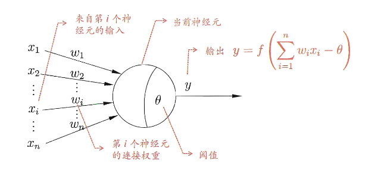
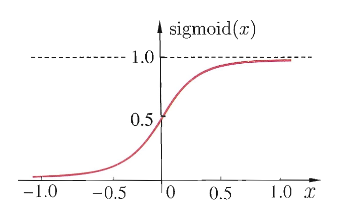
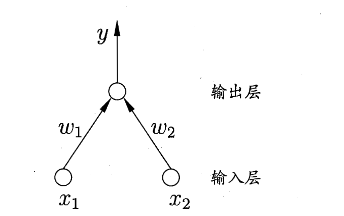
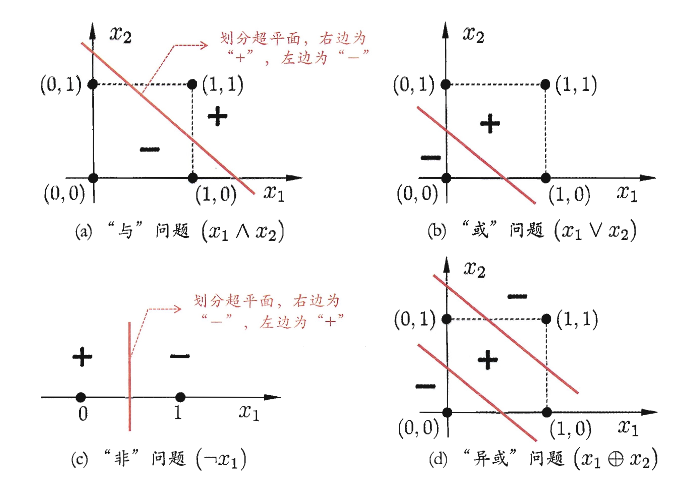
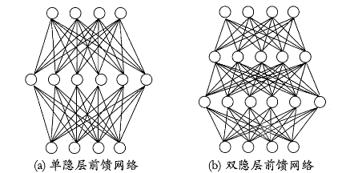
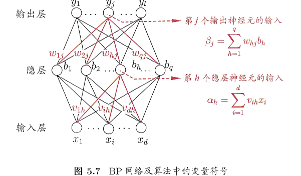
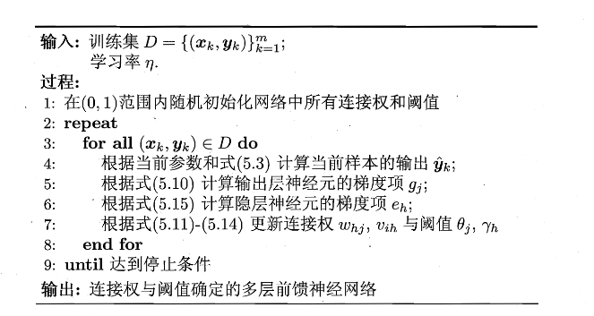
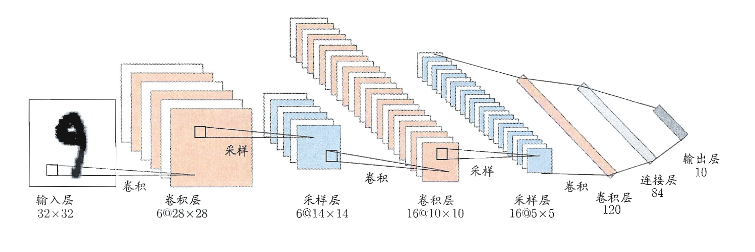

# 第五章 神经网络

神经网络是由具有适应性的简单单元组成的广泛并行互连的网络，它的组织能够模拟生物神经系统对真实世界物体所做出的交互反应

神经网络中最基本的成分是 **神经元模型**，也就是上述定义中的“简单单元”

> 在生物神经网络中，每个神经元与其它神经元相连，当它“兴奋”时，就会像相连的神经元发送化学物质，从而改变这些神经元内的点位。如果某个神经元的电位超过了“阈值“，那么它就会被激活。

我们可以抽象出如下图所示的简单模型，即”M-P神经元模型“。

在这个模型中，神经元接收到来自 $n$ 个其它神经元传递过来的输入信号，这些输入信号通过连带权重的连接进行传递，神经元接收到的总输入值与神经元的阈值及逆行比较，然后通过“激活函数”处理以产生神经元的输出。

!!! note
    激活函数常见的是 Sigmoid函数，$sigmoid(x)=\dfrac{1}{1+e^{-x}}$，图像如下

将许多这样的神经元按一定层次结构连接起来，就得到了神经网络

> 从数学的角度来看，神经网络其实就是包含了很多参数的数学模型进行相互嵌套

### 感知机与多层网络

**感知机** 由两层神经元组成，输入层接收外界输入信号后传递给输出层，输出层是阈值逻辑单元（M-P神经元），如下图，$y=f(\sum_iw_ix_i-\theta)$ ,假定 $f$ 是阶跃函数 $\mathrm{sgn}(x)=\begin{cases}1, & x \ge 0;\\0, & x < 0.\end{cases}$ 。

**当我们给定训练数据集时，权重 $w_i$ 以及阈值 $\theta$ 可通过学习得到。** 阈值 $\theta$ 可以看作一个固定输入为 -1.0 的“哑节点”所对应的连接权重 $w_{n+1}$ 。这样的话权重和阈值的学习就可以统一为权重的学习

> **哑节点**
>
> 标准感知机判别式为 $\displaystyle\sum_{i=1}^{n}w_ix_i\ge\theta$ 这里面由两个参数，形式上是分离的
>
> 然后我们可以新增一个虚拟的输入 $x_{n+1}=-1$ ，对应的权重设为 $w_{n+1}=\theta$，可以将原本的不等式换为
>
> $\displaystyle\sum_{i=1}^{n}w_ix_i+w_{n+1}(-1)\ge 0$，即 $\boxed{\displaystyle\sum_{i=1}^{n+1}w_ix_i\ge 0}$

感知机的学习规则比较简单：对于训练样例 $(x,y)$,若当前感知机的输出为 $\hat y$ ，那么感知机权重将按照如下方式调整：

$$
\begin{align}
w_i\leftarrow w_i+\Delta w_i\tag{5.1}\\
\Delta w_i=\eta(y-\hat y)x_i\tag{5.2}
\end{align}
$$

> $\eta\in(0,1)$ 称为学习率。

由上式可知，若 $\hat y=y$ 那么感知机不发生变化，否则将根据错误的程度进行权重调整

不过，感知机只有一层 **功能神经元**（进行激活函数处理的神经元），只能解决线性可分的问题而无法解决非线性可分（如下图所示）

所以提出多层功能神经元，其中输出层和输入层之间的一层神经元称为 **隐含层**，隐含层和输出层神经元都是拥有激活函数的功能神经元。

而若每层神经元与下一层神经元全互连，神经元之间不存在同层连接，也不存在跨层连接，这样的神经网络结构称为 “多层前馈神经网络”（如下图）

神经网络的学习过程，**就是根据训练数据来调整神经元之间的连接权以及每个功能神经元的阈值**

### 误差逆传播算法(BP)

BP算法(误差逆传播算法)是用来训练多层网络的算法，如下：

- 给定训练集 $D=\{(x_1,y_1),(x_2,y_2),\dots,(x_m,y_m)\},x_i\in\mathbb{R}^d,y_i\in\mathbb{R}^l$ （输入示例由 $d$ 个属性描述，输出 $l$ 维实值向量。
- 假定一个拥有 $d$ 个输入神经元， $l$ 个输出神经元、$q$ 个隐层神经元的多层前馈网络结构。
- 其中我们记：
  - 输出层第 $j$ 个神经元的阈值为 $\theta_j$
  - 隐层第 $h$ h神经元的阈值为 $\gamma _h$
  - 输入层第 $i$ 个神经元与隐层第 $h$ 个神经原之间的连接权为 $v_{ih}$
  - 隐层第 $h$ 个神经元与输出层第 $j$ 个神经元之间的连接权为 $w_{hj}$
  - 隐层第 $h$ 个神经元接收到的输入为 $\alpha_h=\sum_{i=1}^{d}v_{ih}x_i$
  - 输出层第 $j$ 个神经元接收到的输入为 $\beta_j=\sum_{h=1}^{q}w_{hj}b_h$ ($b_h$ 为隐层第 $h$ 个神经元的输出)

对训练样例 $(x_k,y_k)$ ，假定神经网络的输出为 $\boldsymbol{\hat{y}}_k = (\hat{y}_1^{\,k},\, \hat{y}_2^{\,k},\, \ldots,\, \hat{y}_\ell^{\,k})$ ,即

$$
\begin{equation}
\hat{y}_j^{\,k} = f(\beta_j - \theta_j),
\tag{5.3}
\end{equation}
$$

那么网络在 $(\boldsymbol{x}_k,\boldsymbol{y}_k)$ 上的均方误差为

$$
E_k=\dfrac{1}{2}\sum_{j=1}^{l}(\hat y_j^k-y_j^k)^2\tag{5.4}
$$

简单观察，我们可以发现图5.7的网络有 $(d+l+1)q+l$ 个参数需要确定，课本以 $w_{hj}$ 为例进行推导

!!! note
    1️⃣ 基本思想：梯度下降

BP 算法基于 **梯度下降（gradient descent）策略，沿着误差函数对参数的负梯度方向** 更新权重。

对于第 $k$ 个样本的误差 $E_k$ ，学习率为 $\eta$ ，权重 $w_{hj}$ 的更新规则为：

$$
\Delta w_{hj}=-\eta\dfrac{\partial E_k}{\partial w_{hj}}\tag{5.6}
$$

---

2️⃣ 链式法则

权重 $w_{hj}$ 的变化路径为：

$$
w_{hj}\rightarrow\beta_j\rightarrow\hat y^k_j\rightarrow E_k
$$

那么根据链式法则可以得到：

$$
\dfrac{\partial E_k}{\partial w_{hj}}=\dfrac{\partial E_k}{\partial \hat y_{jk}}
\cdot\dfrac{\partial \hat y_j^k}{\partial \beta_j}
\cdot\dfrac{\partial \beta_j}{\partial w_{hj}}
\tag{5.7}
$$

---

3️⃣ 各项偏导数计算

**(1) 加权输入项**

根据定义 $\beta_j=\displaystyle\sum_h w_{hj}b_h-\theta_j$，因此可得

$$
\dfrac{\partial \beta_j}{\partial w_{hj}}=b_h\tag{5.8}
$$

**(2) 激活函数性质**

Sigmoid 函数有性质如下

$$
f'(x)=f(x)(1-f(x))\tag{5.9}
$$

**(3) 输出误差项**

由误差函数(5.4)和输出定义(5.3)，我们可以定义输出层误差信号：

$$
g_j=-\dfrac{\partial E_k}{\partial \hat y_j^k}\dfrac{\partial \hat y_j^k}{\partial \beta_j}
$$

带入得到

$$
\begin{align}
g_j&=-(\hat y_j^k-y_j^k)f'(\beta_j-\theta_j)\\
&=\hat y_j^k(1-\hat y_j^k)(y_j^k-\hat y_j^k)
\tag{5.10}
\end{align}
$$

> 这里 $g_j$ 其实是将式子(5.7)链式法则提取出来前两项，没有特别含义

**(4) 输出层权重更新公式**

将式子(5.10)(5.8)带入(5.7)，再代入(5.6)，得到

$$
\boxed{\Delta w_{hj}=\eta g_jb_h}\tag{5.11}
$$

---

5️⃣ 其他参数的更新

**输出层阈值**：

$$
\Delta \theta_j=-\eta g_j\tag{5.12}
$$

**隐层权重**：

$$
\Delta v_{ih}=\eta e_hx_i\tag{5.13}
$$

**隐层阈值**:

$$
\Delta \gamma_h=-\eta e_h \tag{5.14}
$$

**$e_h$ 为隐层神经元的误差信号**，计算如下：

$$
\begin{align}
e_h
&=
-
\frac{\partial E_k}{\partial b_h}
\frac{\partial b_h}{\partial \alpha_h}
\\
&=
-
\sum_{j=1}^{\ell}
\frac{\partial E_k}{\partial \beta_j}
\frac{\partial \beta_j}{\partial b_h}
f'(\alpha_h-\gamma_h)
\\
&=
\sum_{j=1}^{\ell}
w_{hj}\, g_j \, f'(\alpha_h-\gamma_h)
\\
&=
b_h(1-b_h)
\sum_{j=1}^{\ell}
w_{hj}\, g_j .
\tag{5.15}
\end{align}
$$

> $e_h$ 表示对隐层神经元 $h$ 的加权输入 $\alpha_h$ 的负梯度，即 $e_h=\dfrac{\partial E_k}{\partial \alpha_h}$，然后链式法则展开
>
> 学习率 $\eta\in(0,1)$ 控制着算法每一轮迭代中的更新步长，若太大则容易振荡，太小则收敛速度过慢。

核心算法如下：

> 简单来说就是：输入示例提供给输入层神经元，然后信号直到传递到输出层，然后计算出输出层的误差逆向传播至隐层神经元，最后根据隐层神经元的误差来对连接权和阈值进行调整

### 全局最小与局部极小

这一部分主要是介绍了梯度下降的相关内容，没有涉及计算，三种“跳出”局部极小接近全局最小的方法：

- 随机梯度下降：在梯度计算中引入随机扰动
- “模拟退火”技术，即可以接受“次优解”
- 多次随机初始化：用不同的初始权值和阈值多次训练

### 深度学习

随着计算能力的升级，以“深度学习”为代表的复杂模型开始受到人们的关注。而典型的深度学习模型就是很深层的神经网络。

隐层多了，相应的神经元连接权、阈值等参数就会更多。模型复杂度页可通过单纯增加隐层神经元的数目更加有效，因为增加隐层数不仅增加了拥有激活函数的神经元数目，还增加了激活函数嵌套的层数。

然而，多隐层神经网络难以直接用经典算法进行训练，因为误差在多隐层内逆传播时，往往会发散而不能收敛到稳定状态

于是提出了 **无监督逐层训练** 作为多隐层网络训练的有效手段

!!! note
    无监督逐层训练的主要思想是：每次训练一层隐节点，训练时将上一层隐节点的输出作为输入，而本层隐节点的输出作为下一层隐节点的输入，这称为 **预训练**

在预训练全部完成后，对整个网络进行 **微调训练**

实际上，”预训练+微调“的做法可以视为将大量参数分组，对每组先找到局部看起来比较好的设置，然后再基于这些局部较优的结果联合起来进行全局寻优

另一种节省训练开销的策略是 **权共享**，即让一组神经元使用相同的连接权，在卷积神经网络(CNN)中用处发挥重大作用，如下，CNN符合多个“卷积层”和“采样层”对输入信号进行加工，然后在连接层实现与输出目标之间的映射

!!! tip
    从另一个角度来理解深度学习的话，很多算法均采用隐层堆叠、每层对上一层的输出进行处理的机制

可以看作是在对输入信号进行逐层加工，从而把初始的、与输出目标之间联系不太密切的输入表示，转化成与输出目标联系更加密切的表示、使得原来仅基于最后一层输出映射难以完成的任务成为可能

换句话说：通过多层处理，将初始的“低层”特征表示转化为“高层”特征表示后，用“简单模型”完成复杂的分类等学习任务

> 抽象层是计算机的伟大概念
