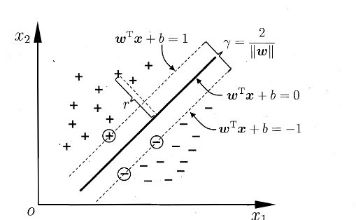
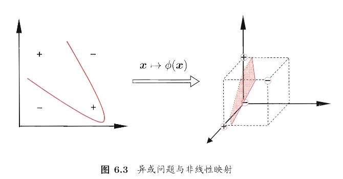
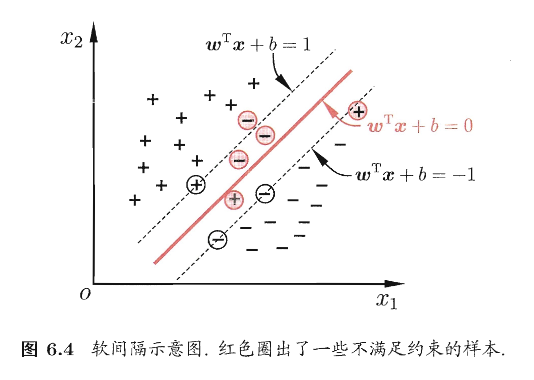
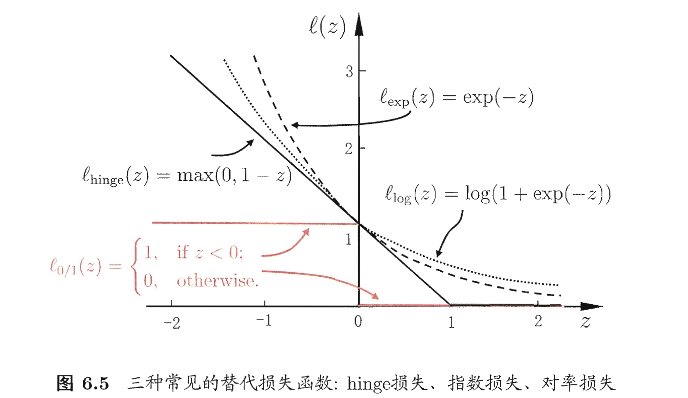
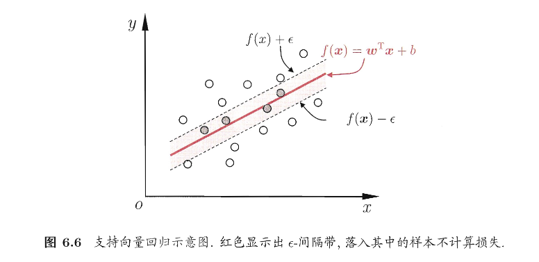
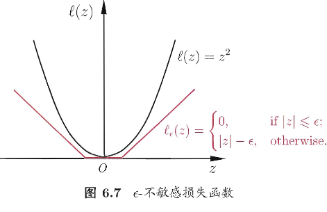

# 第六章 支持向量机

!!! note
    支持向量机(SVM)是一种常用的 **监督学习模型**，主要用于分类和回归问题。

> 之前介绍过，监督学习模型就是通过已有的标注数据来训练模型，以便在未来对未见过的数据进行预测或分类

它的基本目标是 **找到一个最佳的决策边界（或者说超平面）**，使得不同类别的数据点被尽可能清晰地区分开来。

具体来说，SVM可以通过以下几个方面来进行解释：

1. **分类问题**：SVM通常用于分类问题，尤其是当数据可以通过一个平面或超平面分隔成不同类别时。它的目标是寻找一个最佳超平面，最大化类别之间的间隔，确保不同类别的样本距离该超平面的距离尽可能远，从而提高分类的准确性和泛化能力
2. **回归问题**：SVM应用于回归问题称为支持向量回归（SVR）。在回归任务中，SVM通过寻找一个平面，使得大部分数据点都位于该平面附近，但对于噪声数据的敏感度比较低
3. **核函数的使用**：SVM能够通过使用核函数将数据映射到更高维的空间，从而使得原本线性不可分的数据变得线性可分。这使得SVM在处理复杂的、非线性可分的数据时也能取得很好的效果

在样本空间中，划分超平面可通过如下线性方程来描述：

$$
\boldsymbol{w}^T\boldsymbol{x}+b=0\tag{6.1}
$$

记为 $(\boldsymbol{w},b)$,则样本空间中任意点 $\boldsymbol{x}$ 到超平面 $(\boldsymbol{w},b)$ 的距离可以写为

$$
r = \frac{|\boldsymbol{w}^T \mathbf{x} + b|}{\|\boldsymbol{w}\|}\tag{6.2}
$$

> 平面直角坐标系下的 $\boldsymbol{a}x+b=0$

接下来添加分类的维度 $y_i$ ，假设超平面 $(\boldsymbol{w},b)$ 能将训练样本正确分类，即对于 $(\boldsymbol{x_i},y_i)\in D$，我们令：

$$
\begin{cases}
\boldsymbol{w}^T \boldsymbol{x}_i + b \geq 1, & y_i = +1; \\
\boldsymbol{w}^T \boldsymbol{x}_i + b \leq -1, & y_i = -1.
\end{cases}
\tag{6.3}
$$



如上图所示，距离超平面最近的几个训练样本点使得式(6.3)成立，他们被称为 **支持向量**，两个异类支持向量到超平面的距离之和为

$$
\gamma=\dfrac{2}{||\boldsymbol{w}||}\tag{6.4}
$$

被称为 **间隔**

那么为了维持更好的稳定性（鲁棒性），我们会倾向于找到最大间隔的划分超平面，即找到满足(6.3)中约束参数的 $\boldsymbol{w}$ 和 $b$ ，使得 $\gamma$ 最大，即

$$
\begin{aligned}
\max_{\boldsymbol{w}, b} \quad & \frac{2}{\|\boldsymbol{w}\|} \\
\text{s.t.} \quad & y_i (\boldsymbol{w}^T \boldsymbol{x}_i + b) \geq 1, \quad i = 1, 2, \dots, m.
\end{aligned}
\tag{6.5}
$$

求 $||\boldsymbol{w}||^{-1}$ 的最大等价于求 $||\boldsymbol{w}||^2$ 的最小，所以改进式（6.5）如下

$$
\begin{aligned}
\min_{\boldsymbol{w}, b} \quad & \frac{1}{2} \|\boldsymbol{w}\|^2 \\
\text{s.t.} \quad & y_i (\boldsymbol{w}^T \boldsymbol{x}_i + b) \geq 1, \quad i = 1, 2, \dots, m.
\end{aligned}
\tag{6.6}
$$

> 首先我们知道 $||\boldsymbol{w}||$ 是向量 $\boldsymbol{w}$ 的欧几里得范数，计算公式如下：
>
>

$$
\|\boldsymbol{w}\| = \sqrt{\sum_{i=1}^{n} w_i^2} \quad \text{或者} \quad \|\boldsymbol{w}\| = \sqrt{\boldsymbol{w}^T \boldsymbol{w}}.
$$

>
> 所以 $||\boldsymbol{w}||^2$ 是 $\boldsymbol{w}$ 的平方范数，表示如下
>
>

$$
\|\boldsymbol{w}\|^2 = \boldsymbol{w}^T \boldsymbol{w}
$$

>
> 进行代换即可得到上述等价关系

以上便是 支持向量机的基本型


### 对偶问题

!!! note
    **目的**：我们希望求解式(6.6)来得到大间隔划分超平面所对应的模型，如下

    $$
    f(\boldsymbol{x})=\boldsymbol{w}^T\boldsymbol{x}+b\tag{6.7}
    $$

书中介绍了利用拉格朗日乘子法得到对偶问题进而求解的方法，具体过程如下：

!!! note
    **求对偶问题**

对式(6.6)的每条约束添加拉格朗日乘子 $\alpha_i\ge 0$ ，则该问题的拉格朗日函数可以写为

$$
L(\boldsymbol{w}, b, \boldsymbol{\alpha}) = \frac{1}{2} \|\boldsymbol{w}\|^2 + \sum_{i=1}^{m} \alpha_i \left( 1 - y_i (\boldsymbol{w}^T \boldsymbol{x}_i + b) \right)\tag{6.8}
$$

其中，$\boldsymbol{\alpha}=(\alpha_1;\alpha_2;\dots;\alpha_m)$ 令 $L(\boldsymbol{w},b,\boldsymbol{\alpha})$ 对 $\boldsymbol{w}$ 和 b 的偏导为0可得

$$
\begin{align}
\boldsymbol{w}=\sum_{i=1}^{m}\alpha_iy_i\boldsymbol{x_i}\tag{6.9}\\
0=\sum_{i=1}^{m}\alpha_iy_i\tag{6.10}
\end{align}
$$

!!! tip
    偏导计算过程

**对 $\boldsymbol{w}$ 求偏导数：**

1. 目标函数部分：$\frac{1}{2} \|\boldsymbol{w}\|^2 = \frac{1}{2} \sum_{i=1}^n w_i^2$ 对 $\boldsymbol{w}$ 求偏导得到 $\boldsymbol{w}$。

$$
\frac{\partial}{\partial \boldsymbol{w}} \left( \frac{1}{2} \|\boldsymbol{w}\|^2 \right) = \boldsymbol{w}
$$

1. 第二项是约束项：$\sum_{i=1}^{m} \alpha_i \left( 1 - y_i  (\boldsymbol{w}^T \boldsymbol{x}_i + b) \right)$，对 $\boldsymbol{w}$ 求偏导：

$$
\frac{\partial}{\partial \boldsymbol{w}} \left( \sum_{i=1}^{m} \alpha_i \left( 1 - y_i (\boldsymbol{w}^T \boldsymbol{x}_i + b) \right) \right) = - \sum_{i=1}^{m} \alpha_i y_i \boldsymbol{x}_i
$$

将两部分相加，得到对 $\boldsymbol{w}$ 的总偏导数：

$$
\frac{\partial L}{\partial \boldsymbol{w}} = \boldsymbol{w} - \sum_{i=1}^{m} \alpha_i y_i \boldsymbol{x}_i
$$

为了找到极值点，我们将其设为零：

$$
\boldsymbol{w} = \sum_{i=1}^{m} \alpha_i y_i \boldsymbol{x}_i \tag{6.9}
$$

**对 $b$ 求偏导数：**

1. 目标函数部分：$frac{1}{2} \|\boldsymbol{w}\|^2$ 与 $b$ 无关，所以它的偏导数是 0。
2. 第二项：对 $\sum_{i=1}^{m} \alpha_i \left( 1 - y_i (\boldsymbol{w}^T \boldsymbol{x}_i + b) \right)$ 关于 $ b $ 求偏导：

$$
\frac{\partial}{\partial b} \left( \sum_{i=1}^{m} \alpha_i \left( 1 - y_i (\boldsymbol{w}^T \boldsymbol{x}_i + b) \right) \right) = - \sum_{i=1}^{m} \alpha_i y_i
$$

将结果设为零，得到：

$$
0 = \sum_{i=1}^{m} \alpha_i y_i \tag{6.10}
$$

然后将式(6.9)带入(6.8)，可以消去 $\boldsymbol{w}$ 和 $b$ ，再考虑式(6.10)的约束条件，就可以得到式(6.6)的对偶问题

$$
\begin{align}
\max_{\boldsymbol{\alpha}} \quad &\sum_{i=1}^{m} \alpha_i - \frac{1}{2} \sum_{i=1}^{m} \sum_{j=1}^{m} \alpha_i \alpha_j y_i y_j \boldsymbol{x}_i^T \boldsymbol{x}_j \tag{6.11}
\\
\text{s.t.} \quad &\sum_{i=1}^{m} \alpha_i y_i = 0, \quad
\\
&\alpha_i \geq 0, \quad i = 1, 2, \dots, m.
\end{align}
$$

解出 $\boldsymbol{\alpha}$ 后，求出 $\boldsymbol{w}$ 和 b 即可得到模型

$$
\begin{align}
f(\boldsymbol{x})&=\boldsymbol{w^T}+b\\
&=\sum_{i=1}^{m}\alpha_iy_i\boldsymbol{x^T}\boldsymbol{x}+b\tag{6.12}
\end{align}
$$

式(6.11)中解出的 $\alpha_i$ 就是式(6.8)中的拉格朗日乘子，它恰好对应着训练样本 $(\boldsymbol{x_i},y_i)$

由于式(6.6)有不等式约束，所以上述过程需要满足 KKT 条件，即要求如下

$$
\begin{cases}
\alpha_i\ge0\\
y_if(\boldsymbol x_i)-1\ge0\\
\alpha_i(y_if(\boldsymbol x_i)-1)=0
\end{cases}
\tag{6.13}
$$

可以轻松观察得：对任意训练样本 $(\boldsymbol{x}_i,y_i)$ ,总有 $\alpha_i=0$ 或 $y_if(\boldsymbol{x_i})=1$

!!! note
    **求解式(6.11)**

若采用二次规划算法来求解此问题，会产生非常大得开销。于是人们根据问题本身的特性开发一些高效算法，书中主要介绍的是SMO算法，其基本思路是逐步优化两个拉格朗日乘子来简化问题

SMO每次选择两个变量 $(\alpha_i,\alpha_j)$ 并固定其它参数，这样，在参数初始化后，SMO不断执行如下两个步骤直至收敛：

- 选取一对需要更新的变量 $(\alpha_i,\alpha_j)$
- 固定除了 $(\alpha_i,\alpha_j)$ 以外的参数，求解式(6.11)获得更新后的 $(\alpha_i,\alpha_j)$

由于只需选取的 $\alpha_i$ 和 $\alpha_j$ 中有一个不满足KKT条件，目标函数就会在迭代后减小。那么违反KKT条件程度越大，变量更新后可能导致的目标函数值减幅越大。

于是，SMO先选取违背KKT条件程度最大的变量；第二个变量应选择一个使目标函数值减小最快的变量，不过由于各个变量进行比较的复杂度比较高，因此SMO采用了一个启发式：使选取的两变量所对应样本之间的间隔最大。

那么，在仅考虑两个参数的时候，式(6.11)中的约束可以化为

$$
\alpha_i + \alpha_j y_i y_j \geq 0, \quad \alpha_i \geq 0, \quad \alpha_j \geq 0, \tag{6.14}
$$

其中

$$
c = \sum_{k \neq i,j} \alpha_k y_k, \tag{6.15}
$$

> 这是目标函数的优化方式，式(6.15)表示计算常数c，它是从剩余的所有 $\alpha_k$ 中加权得到的和，$k$ 的范围式除了 $i$ 和 $j$ 之外的所有拉格朗日乘子。具体来说：
>
> - 在SMO算法中，每次选择两个变量 $\alpha_i$ 和 $\alpha_j$ 来进行优化，常数 c 代表了剩余的所有其它拉格朗日乘子 $\alpha_k$ 的加权和
> - 通过计算c，我们能保持整体的平衡，确保优化过程中的目标函数可以正确调整
>
> 这个公式本质上是通过累计所有其它变量的影响，来帮助调整和优化目标函数

是让 $\displaystyle\sum_{i=1}^{m}\alpha_iy_i=0$ 成立的常数，用

$$
\alpha_iy_i+\alpha_jy_j=c\tag{6.16}
$$

消去式(6.11)中的变量 $\alpha_j$ ，则得到一个关于 $\alpha_i$ 的单变量二次规划问题，仅有的约束是 $\alpha_i\ge0$。不难发现,这样的二次规划问题具有闭式解,于是不必调用数值优化算法即可高效地计算出更新后的 $\alpha_i$ 和 $\alpha_j$

> 这个公式表示了SMO中两个拉格朗日乘子之间的约束关系。含义为：
>
> - 在每次优化过程中，SMO会选择两个乘子 $\alpha_i$ 和 $\alpha_j$ 来进行更新。这两个拉格朗日乘子的和必须满足某种关系，其中 $y_i$ 和 $y_j$ 是它们所对应的标签
> - 因为我们希望使目标函数变化最大化，所以要求这两个变量在更新时保持某种平衡。公式(6.16)保持了这个平衡

!!! note
    **求解偏置项**

对于任意支持向量 $(\boldsymbol{x_s},y_s)$ ，都有 $y_sf(\boldsymbol{x_s})=1$，也就是：

$$
y\_s\left(\sum\_{i \in S} \alpha\_i y\_i x\_i^T x\_s + b \right)= 1\tag{6.17}
$$

> 这个式子表示在SMO优化过程中，支持向量满足的条件，具体含义如下：
>
> - S 是支持向量的集合，即支持向量是哪些对SVM决策边界有影响的样本
> - $\alpha_i$ 是与支持向量 $\boldsymbol{x_i}$ 相关的拉格朗日乘子，$y_i$ 是支持向量的标签
> - $x_s$ 是当前选定的支持向量，而 $x_i$ 是所有支持向量中的一个
>
> 公式表示了在优化过程中，所有支持向量的加权和与偏置项 $b$ 的和 **一定** 为1。这个约束条件确保了决策函数处于正确的位置，且支持向量对决策边界的贡献是平衡的

现实中采用所有支持向量求解的平均值来获得b，以得到更好的鲁棒性

$$
b = \frac{1}{|S|} \sum\_{s \in S} \left( y\_s - \sum\_{i \in S} \alpha\_i y\_i x\_i^T x\_s \right)\tag{6.18}
$$


### 核函数

就像章节开头所说的，核函数的作用是将样本从原始空间映射到一个更高维的特征空间，使得原本线性不可分的样本变得线性可分，从而获得合适的超平面。如下图：



> 易得，如果原始空间是有限维（属性数量有限），那么一定存在一个高维特征空间使样本可分

**下面我们将SVM从线性可分问题到非线性可分问题进行转换**，合适的时候引出核函数

令 $\phi(\boldsymbol{x})$ 表示将 $\boldsymbol{x}$ 映射后的特征向量，那么在特征空间中划分超平面所对应的模型（线性可分的模型）可以表示为

$$
f(\boldsymbol x)=\boldsymbol{w}^T\phi(\boldsymbol{x})+b\tag{6.19}
$$

类似于刚刚的计算过程，我们有目标函数如下

$$
\begin{align}
&\min_{w,b} \frac{1}{2} \| w \|^2\\
&\quad \text{s.t.} \quad y_i \left( w^\top \phi(x_i) + b \right) \geq 1, \quad i = 1, 2, \dots, m.
\end{align}
\tag{6.20}
$$

对偶问题如下

$$
\begin{align}
&\max_{\alpha} \sum_{i=1}^{m} \alpha_i - \frac{1}{2} \sum_{i=1}^{m} \sum_{j=1}^{m} \alpha_i \alpha_j y_i y_j \phi(x_i)^\top \phi(x_j)
\tag{6.21}
\\
&\text{s.t.} \quad \sum_{i=1}^{m} \alpha_i y_i = 0
\\
&\quad \alpha_i \geq 0, \quad i = 1, 2, \dots, m.
\end{align}
$$

但是由于高维空间的计算复杂性，直接计算 $<\phi(x_i),\phi(x_j)>$ 是比较困难的。于是为了 **避免计算高维映射**， 使用核函数来计算内积

$$
\kappa(\boldsymbol x_i, \boldsymbol x_j) = \langle \phi(\boldsymbol x_i), \phi(\boldsymbol x_j) \rangle = \phi(\boldsymbol x_i)^\top \phi(\boldsymbol x_j)\tag{6.22}
$$

> 核函数将映射的操作嵌入到内积的计算中，从而避免了显式计算高维特征

然后优化对偶问题如下(约束条件不变)

$$
\max_{\alpha} \sum_{i=1}^{m} \alpha_i - \frac{1}{2} \sum_{i=1}^{m} \sum_{j=1}^{m} \alpha_i \alpha_j y_i y_j \kappa(\boldsymbol x_i,\boldsymbol x_j)\tag{6.23}
$$

再求解得到

$$
\begin{align}
f(x) &= \boldsymbol{w}^\top \phi(x) + b\\
&= \sum_{i=1}^{m} \alpha_i y_i \phi(x_i)^\top \phi(x) + b\\
&= \sum_{i=1}^{m} \alpha_i y_i \kappa(x, x_i) + b\tag{6.24}
\end{align}
$$

这里的函数 $\kappa(\cdot,\cdot)$ 核函数。显然，若已知合适映射 $\phi(\cdot)$ 的具体形式，那么可以写出核函数 $\kappa(\cdot,\cdot)$, 但在现实任务中我们通常不知道函数的形式，不知道合适的核函数是否存在，也不知道什么样的函数能做核函数。

于是有了如下定理

!!! note
    **定理 6.1** (核函数) 令 $\mathcal{X}$ 为输入空间，$\kappa(\cdot, \cdot)$ 是定义在 $\mathcal{X} \times \mathcal{X}$ 上的对称函数，则该核函数当且仅当对于任意数据 $D = \{x_1, x_2, \dots, x_m\}$，"核矩阵" (kernel matrix) $K$ 总是半正定的：

$$
K = \begin{bmatrix}
\kappa(x_1, x_1) & \cdots & \kappa(x_1, x_j) & \cdots & \kappa(x_1, x_m) \\
\vdots & \ddots & \vdots & \ddots & \vdots \\
\kappa(x_i, x_1) & \cdots & \kappa(x_i, x_j) & \cdots & \kappa(x_i, x_m) \\
\vdots & \ddots & \vdots & \ddots & \vdots \\
\kappa(x_m, x_1) & \cdots & \kappa(x_m, x_j) & \cdots & \kappa(x_m, x_m)
\end{bmatrix}
$$

定理表示：只要有一个对称函数所对应的核矩阵半正定，它就能作为核函数使用

实现代码


```python
import numpy as np

class SMO:
    def __init__(self, C=1.0, tolerance=0.001, max_iter=100):
        self.C = C  # 惩罚参数
        self.tolerance = tolerance  # 精度
        self.max_iter = max_iter  # 最大迭代次数

    def fit(self, X, y):
        # 样本数量和特征数
        m, n = X.shape
        self.X = X
        self.y = y
        self.alphas = np.zeros(m)  # 初始化拉格朗日乘子α
        self.b = 0  # 初始化偏置b
        self.errors = np.zeros(m)  # 误差缓存

        # 训练过程
        iteration = 0
        while iteration < self.max_iter:
            alpha_pairs_changed = 0
            for i in range(m):
                # 计算预测值
                Ei = self._calculate_error(i)
                if (self.y[i] * Ei < -self.tolerance and self.alphas[i] < self.C) or (self.y[i] * Ei      self.tolerance and self.alphas[i]      0):
                    j = self._select_j(i, m)
                    Ej = self._calculate_error(j)
                    alpha_i_old = self.alphas[i]
                    alpha_j_old = self.alphas[j]

                    # 计算边界
                    if self.y[i] != self.y[j]:
                        L = max(0, self.alphas[j] - self.alphas[i])
                        H = min(self.C, self.C + self.alphas[j] - self.alphas[i])
                    else:
                        L = max(0, self.alphas[i] + self.alphas[j] - self.C)
                        H = min(self.C, self.alphas[i] + self.alphas[j])

                    if L == H:
                        continue

                    # 计算内核函数部分
                    eta = 2.0 * self.kernel(X[i], X[j]) - self.kernel(X[i], X[i]) - self.kernel(X[j], X[j])
                    if eta     = 0:
                        continue

                    # 更新α值
                    self.alphas[j] -= self.y[j] * (Ei - Ej) / eta
                    self.alphas[j] = self._clip_alpha(self.alphas[j], H, L)
                    self._update_error_cache(j)

                    if abs(self.alphas[j] - alpha_j_old) < self.tolerance:
                        continue

                    self.alphas[i] += self.y[i] * self.y[j] * (alpha_j_old - self.alphas[j])
                    self._update_error_cache(i)

                    alpha_pairs_changed += 1

            if alpha_pairs_changed == 0:
                iteration += 1
            else:
                iteration = 0

        # 训练结束，计算偏置b
        self.b = self._calculate_b()

    def _calculate_error(self, i):
        """计算误差"""
        fXi = np.dot(self.alphas * self.y, self.kernel(self.X, self.X[i])) + self.b
        return fXi - self.y[i]

    def _select_j(self, i, m):
        """选择第二个违反KKT条件的α"""
        j = i
        while j == i:
            j = np.random.randint(0, m)
        return j

    def kernel(self, X1, X2):
        """核函数，使用线性核"""
        return np.dot(X1, X2)

    def _clip_alpha(self, alpha, H, L):
        """确保α值在[0, C]之间"""
        return max(L, min(alpha, H))

    def _update_error_cache(self, i):
        """更新误差缓存"""
        self.errors[i] = self._calculate_error(i)

    def _calculate_b(self):
        """计算偏置b"""
        b = 0
        for i in range(len(self.alphas)):
            if 0 < self.alphas[i] < self.C:
                b = self.y[i] - np.dot(self.alphas * self.y, self.kernel(self.X, self.X[i]))
                break
        return b

    def predict(self, X):
        """预测新样本"""
        result = np.dot(self.alphas * self.y, self.kernel(self.X, X.T)) + self.b
        return np.sign(result)

# 示例：加载数据并训练模型
if __name__ == "__main__":
    # 创建一个简单的二分类数据集
    X = np.array([[2, 3], [3, 3], [3, 4], [4, 5], [6, 7], [7, 8], [8, 9]])
    y = np.array([1, 1, 1, -1, -1, -1, -1])

    # 初始化SMO并训练
    smo = SMO(C=1.0, tolerance=0.001, max_iter=100)
    smo.fit(X, y)

    # 预测
    prediction = smo.predict(X)
    print("Predictions:", prediction)
```


### 软间隔与正则化（避免过拟合）

理想情况下，模型可以找到一个“硬间隔”超平面，把所有样本完全分开。但是现实情况下通常存在两个特征：

1. 数据有噪声
2. 类别本身可能线性不可分

如果强行要求“完全正确分类”，模型会：

- 对噪声样本过度拟合
- 间隔变得很小
- 泛化能力下降

所以需要 允许适度犯错，并控制模型复杂度，即“软间隔”



结合上图，软间隔是允许某些样本不满足约束

$$
y_i(\boldsymbol{w^Tx_i}+b)\ge 1\tag{6.28}
$$

当然我们希望最大化间隔的时候，不满足约束的样本尽可能少，于是优化目标如下：

$$
\min_{w,b}\ \frac{1}{2}\,\|w\|^{2}
\;+\;
C\sum_{i=1}^{m}\,\ell_{0/1}\!\left(y_i\bigl(\boldsymbol{w^\top x_i}+b\bigr)-1\right).\tag{6.29}
$$

> 这个式子第一项不必解释，主要解释第二项
>
> - 数据：$(\boldsymbol{x_i},y_i)$ 其中 $y_i\in\{+1,-1\}$
> - 量 $y_i\bigl(\boldsymbol{w^\top x_i}+b\bigr)$ 叫做 **函数间隔**。
>
>   - 若 $y_i\bigl(\boldsymbol{w^\top x_i}+b\bigr)\ge1$，则说明样本分对了，且满足至少离分界面有一定距离的间隔约束
>   - 若 $y_i\bigl(\boldsymbol{w^\top x_i}+b\bigr)<1$，则叫做 **间隔违背**（分对了但靠太近，或者就是分错了）
> - $\ell_{0/1}$ 是0/1损失函数，用来计数：多少个样本不满足约束。*不过这个函数的数学性质不好，一般用其它损失函数替代，如 hinge损失、指数损失、对率损失等*
>
>

$$
\ell_{0/1}(z)=
\begin{cases}
1,\text{if  z < 0}\\
0,\text{otherwise}
\end{cases}
\tag{6.30}
$$

> - C是一个常数，当C越大，则越重视训练集上少错误（也就是拟合数据的时候更“硬”）



然后我们约定一个 **松弛量** 来更好的统计数据，如下

$$
\begin{aligned}
\min_{w,b,\{\xi_i\}} \quad & \frac{1}{2}\|w\|^2 + C\sum_{i=1}^{m}\xi_i \\
\text{s.t.}\quad & y_i\bigl(w^\top x_i + b\bigr) \ge 1-\xi_i,\quad i=1,2,\ldots,m,\\
& \xi_i \ge 0,\quad i=1,2,\ldots,m.
\end{aligned}
\tag{6.35}
$$

然后我们就得到了最常用的“软间隔支持向量机”

接下来就是和上面计算基础向量机的计算方式差不多（下面的计算是用hinge损失来做替代）

!!! note
    **1) 拉格朗日函数**

对约束引入拉格朗日乘子：$\alpha_i\ge 0$、$\mu_i\ge 0$。

$$
\begin{aligned}
L(w,b,\alpha,\xi,\mu)
=&\ \frac{1}{2}|w|^2 + C\sum_{i=1}^{m}\xi_i \\
&+ \sum_{i=1}^{m}\alpha_i\Bigl(1-\xi_i-y_i\bigl(w^\top x_i+b\bigr)\Bigr)
- \sum_{i=1}^{m}\mu_i\xi_i .
  \end{aligned}\tag{6.36}
$$

---

**2) 驻点条件（对 $w,b,\xi_i$ 求偏导为 0）**

令 $\frac{\partial L}{\partial w}=0$、$\frac{\partial L}{\partial b}=0$、$\frac{\partial L}{\partial \xi_i}=0$，得到：

- 关于 $w$：

$$
w=\sum\_{i=1}^{m}\alpha\_i y\_i x\_i.\tag{6.37}
$$

- 关于 $b$：

$$
\sum\_{i=1}^{m}\alpha\_i y\_i=0.\tag{6.38}
$$

- 关于 $\xi_i$：

  $$
  C=\alpha\_i+\mu\_i.\tag{6.39}
  $$

由于 $\mu_i\ge 0$，推出

$$
0\le \alpha_i \le C.
$$

---

**3) 对偶问题（Dual）**

将上式代回可得对偶问题：

$$
\begin{aligned}
\max_{\alpha}\quad &
\sum_{i=1}^{m}\alpha_i
-\frac{1}{2}\sum_{i=1}^{m}\sum_{j=1}^{m}\alpha_i\alpha_j y_i y_j, x_i^\top x_j \\
\text{s.t.}\quad &
\sum_{i=1}^{m}\alpha_i y_i = 0,\\
&0\le \alpha_i \le C,\quad i=1,2,\ldots,m.
\end{aligned}
\tag{6.40}
$$

与硬间隔 SVM 的唯一区别：**硬间隔只有 $\alpha_i\ge 0$，软间隔多了上界 $\alpha_i\le C$**。

---

**4) KKT 条件与样本几何意义**

KKT 条件：

$$
\begin{cases}
\alpha_i \ge 0,\ \mu_i \ge 0,\\
y_i f(x_i) - 1 + \xi_i \ge 0,\\
\alpha_i\bigl(y_i f(x_i) - 1 + \xi_i\bigr)=0,\\
\xi_i \ge 0,\ \mu_i\xi_i=0,
\end{cases}
\quad i=1,2,\ldots,m.\tag{6.41}
$$

其中 $f(x)=w^\top x+b$。

由 KKT 可得：

- 若 $\alpha_i=0$：样本对 $f(x)$ 无影响（不是支持向量）。
- 若 $\alpha_i   0$：必有

$$
y\_i f(x\_i)=1-\xi\_i,
$$

该样本是支持向量。

进一步结合 $C=\alpha_i+\mu_i$：

- 若 $0<\alpha_i<C$：则 $\mu_i   0\Rightarrow \xi_i=0$，因此

$$
y\_i f(x\_i)=1,
$$

样本恰在最大间隔边界上。

- 若 $\alpha_i=C$：则 $\mu_i=0$，此时允许 $\xi_i\ge 0$：
  - $0<\xi_i\le 1$：样本在间隔内但仍分对；
  - $\xi_i>1$：样本被误分类。

更一般的，优化目标中的第一项用来描述划分超平面的“间隔”大小，另一项 $\sum_{i=1}^{m}\ell(f(\boldsymbol{x_i},y_i)$ 来表述训练集上的误差，于是我们可以得到一般式

$$
\min\_f\Omega(f)+C\sum\_{i=1}^{m}\ell(f(\boldsymbol{x\_i}),y\_i)\tag{6.42}
$$

- 第一项 $\Omega(f)$：**结构风险** 用来描述/约束模型 $f$ 的某些性质（例如希望模型更简单、复杂度更低、间隔更大等）。
- 第二项 $\sum_{i=1}^m \ell(f(x_i),y_i)$：**经验风险** 衡量模型在训练集上的拟合误差（损失的总和）。
- $C$：在“模型复杂度（结构风险）”与“训练误差（经验风险）”之间做权衡的系数，也常称为 **正则化常数**。

> 从经验风险最小化角度看，引入 $\Omega(f)$ 等价于：
>
> - 表达我们“希望得到什么样的模型”（例如更简单/更平滑/更稀疏）；
> - 缩小假设空间，降低过拟合风险，从而提升泛化能力。
>
> 常用的正则化项之一是对参数做范数约束（以线性模型参数 $w$ 为例）：
>
> - $L_2$ 范数：$|w|_2$（或 $|w|_2^2$）倾向于让 $w$ 的分量“更均匀、整体更小”，通常得到 **更稠密** 的解（非零分量多）。
> - $L_0$ “范数”：$|w|_0$（非零分量个数）倾向于让非零分量尽可能少，得到 **最稀疏** 的解（但优化通常很难）。
> - $L_1$ 范数：$|w|_1$ 也倾向于产生 **稀疏** 解（很多分量被压到 0），且比 $L_0$ 更易优化（常用作稀疏替代）。


### 支持向量回归

我们将支持向量的分类问题扩展到了一般的情况，现在回过头来看看如何用 支持向量 来解决回归问题

支持向量回归（SVR）假设我们能容忍 $f(\boldsymbol{x})$ 与 $y$ 之间最多有 $\epsilon$ 的偏差，即仅当 $f(\boldsymbol{x})$ 与 $y$ 之间的差别绝对值大于 $\epsilon$ 时才计算损失，如下图所示，只要训练样本落入此间隔带，就被认为预测正确



那么，SVR问题可形式化为

$$
\begin{equation}
\min_{w,b}\ \frac{1}{2}\lVert w\rVert^{2}
+ C\sum_{i=1}^{m}\ell_{\epsilon}\!\bigl(f(x_i)-y_i\bigr),
\tag{6.43}
\end{equation}
$$

其中 C 为正则化常数，$\ell_\epsilon$ 是图6.7所示的 $\epsilon-$ 不敏感损失函数

$$
\begin{equation}
\ell_{\epsilon}(z)=
\begin{cases}
0, & \text{if } |z|\le \epsilon,\\
|z|-\epsilon, & \text{otherwise.}
\end{cases}
\tag{6.44}
\end{equation}
$$

接着在引入松弛变量 $\xi_i$ 和 $\hat{\xi_i}$ ，可以将(6.43)转换为

$$
\begin{equation}
\min_{w,b,\xi_i,\hat{\xi}_i}\ \frac{1}{2}\lVert w\rVert^{2}
+ C\sum_{i=1}^{m}\bigl(\xi_i+\hat{\xi}_i\bigr)
\tag{6.45}
\end{equation}
$$



然后和之前的计算方式一样，用对偶问题继续计算得到SVR的解形如

$$
\begin{equation}
f(x)=\sum_{i=1}^{m}\left(\hat{\alpha}_i-\alpha_i\right)x_i^{\top}x+b.
\tag{6.53}
\end{equation}
$$

能使式(6.53)中的 $(\hat\alpha_i-\alpha_i)\ne0$ 的样本即为 SVR 的支持向量，它们一定在 $\epsilon-$ 隔离带之外

由 KKT 条件 (6.52) 可知，对每个样本 $(x_i,y_i)$ 满足

$$
(C-\alpha_i)\xi_i=0,\qquad \alpha_i\bigl(f(x_i)-y_i-\epsilon-\xi_i\bigr)=0.
$$

因此在求得 $\alpha_i$ 后，若 $0<\alpha_i<C$，则必有 $\xi_i=0$，并可由

$$
b = y_i+\epsilon-\sum_{i=1}^{m}(\hat{\alpha}_i-\alpha_i)x_i^{\top}x\tag{6.54}
$$

计算偏置项 $b$。理论上可任选一个满足 $0<\alpha_i<C$ 的样本来求 $b$，但实践中更稳健的做法是选取多个（或所有）满足条件的样本分别求出 $b$ 后取平均。

若考虑特征映射形式，则对应有

$$
w=\sum_{i=1}^{m}(\hat{\alpha}_i-\alpha_i)\phi(x_i),\tag{6.55}
$$

代入后 SVR 的预测函数可写为核形式

$$
f(x)=\sum_{i=1}^{m}(\hat{\alpha}_i-\alpha_i)\kappa(x,x_i)+b,\tag{6.56}
$$

其中核函数 $\kappa(x_i,x_j)=\phi(x_i)^{\top}\phi(x_j)$。


### 核方法

1）从 SVM / SVR 观察到的共性：解总是“核函数线性组合”

- 给定训练样本 ${(x_1,y_1),\dots,(x_m,y_m)}$，不考虑偏置项时，很多核学习模型（如 SVM、SVR）学到的函数都可以写成


$$
h(x)=\sum_{i=1}^m \alpha_i,\kappa(x,x_i)
$$

- 直觉：模型并不需要显式在高维（甚至无限维）特征空间里求解，只要能通过 $\kappa(x,x')$ 计算“相似度”，最优解就会落在由训练样本诱导出来的有限维子空间中。

---

2）表示定理（Representer Theorem）的形式与含义

**定理（表示定理）**
令 $\mathcal H$ 为核函数 $\kappa$ 对应的再生核希尔伯特空间（RKHS），$|h|_{\mathcal H}$ 为 RKHS 范数。对任意 **单调递增** 函数 $\Omega:[0,\infty)\to\mathbb R$，以及任意 **非负损失** 函数 $\ell:\mathbb R^m\to[0,\infty)$，优化问题

$$
\min_{h\in\mathcal H}; F(h)=\Omega\big(|h|_{\mathcal H}\big)+\ell\big(h(x_1),h(x_2),\dots,h(x_m)\big)
\tag{6.57}
$$

的最优解总能写成

$$
h^*(x)=\sum_{i=1}^m \alpha_i,\kappa(x,x_i)
\tag{6.58}
$$

**关键理解**

- 定理对损失 $\ell$ 几乎不设限制（只要求非负），对正则项 $\Omega$ 只要求单调递增（甚至不要求凸）。
- 结论非常强：只要目标函数长得像“正则项（依赖 $|h|_{\mathcal H}$） + 经验损失（只依赖训练点上的函数值）”，最优解必在


$$
\mathrm{span}\{\kappa(\cdot,x_1),\dots,\kappa(\cdot,x_m)\}
$$

  这个由训练样本生成的有限维空间里。
  - 这解释了“核方法”为何通用：把学习问题转化为求系数向量 $\alpha$，所有与高维特征映射 $\phi(\cdot)$ 有关的计算都用核函数替代（核技巧）。

---

3）核化思路：把线性算法搬到特征空间 $\mathcal F$

- 假设存在映射 $\phi:\mathcal X\to\mathcal F$，使得在特征空间里做线性模型：


$$
h(x)=w^\top \phi(x)
\tag{6.59}
$$

- 但通常 $\phi$ 不可知或维度极高，于是用核函数隐式表示：


$$
\kappa(x,x')=\phi(x)^\top\phi(x')
$$

- 表示定理保证：即使你在 $\mathcal F$ 里求 $w$，最终也能只用训练点的核展开来表示 $h(\cdot)$。

---

4）例子：核线性判别分析（KLDA）的推导骨架

这一部分是在用“核化”把 LDA 推广到非线性可分情形。

**（1）LDA 在特征空间里的目标函数**

- 二分类（类标 $i\in{0,1}$），在 $\mathcal F$ 中的 Fisher 准则写为


$$
\max_w J(w)=\frac{w^\top S_b^\phi w}{w^\top S_w^\phi w}
\tag{6.60}
$$

- 其中：

  - $S_b^\phi$：类间散度矩阵（between-class scatter）
  - $S_w^\phi$：类内散度矩阵（within-class scatter）

**（2）特征空间中的类均值**

- 令 $X_i$ 为第 $i$ 类样本集合，样本数 $m_i$，总样本数 $m=m_0+m_1$。
- 第 $i$ 类在 $\mathcal F$ 中的均值：


$$
\mu_i^\phi=\frac{1}{m_i}\sum_{x\in X_i}\phi(x)
\tag{6.61}
$$

**（3）特征空间中的散度矩阵**

- 类间散度（两类情形）：


$$
S_b^\phi=(\mu_1^\phi-\mu_0^\phi)(\mu_1^\phi-\mu_0^\phi)^\top
\tag{6.62}
$$

- 类内散度：


$$
S_w^\phi=\sum_{i=0}^1\sum_{x\in X_i}\big(\phi(x)-\mu_i^\phi\big)\big(\phi(x)-\mu_i^\phi\big)^\top
\tag{6.63}
$$

---

5）用表示定理把 $w$ 写成训练样本展开（关键一步）

- 因为 $\phi$ 通常未知，我们希望所有量最终都能用核矩阵表达。
- 由核展开（把 KLDA 的目标视作某种“损失”，并取 $\Omega=0$ 的情形）得到：


$$
h(x)=\sum_{i=1}^m \alpha_i,\kappa(x,x_i)
\tag{6.64}
$$

- 与 $h(x)=w^\top\phi(x)$ 对比，可得


$$
w=\sum_{i=1}^m \alpha_i,\phi(x_i)
\tag{6.65}
$$

- 解释：KLDA 的最优方向 $w$ 落在训练样本特征向量张成的子空间里，因此只需求 $\alpha$。

---

6）把所有东西改写成核矩阵形式（从 ($phi$ 到 $\kappa$）

**（1）核矩阵**

- 定义核矩阵 $K\in\mathbb R^{m\times m}$：


$$
K_{ij}=\kappa(x_i,x_j)
$$

**（2）类别指示向量**

- 定义 $1_i\in{0,1}^{m\times 1}$ 为第 $i$ 类样本指示向量：
  - $(1_i)_j=1\iff x_j\in X_i$，否则为 0。

**（3）用核矩阵表示“类均值在训练样本上的投影”**

- 文中定义（写成向量形式，落在 $\mathbb R^m$）：


$$
\hat\mu_0=\frac{1}{m_0}K,1_0
\tag{6.66}
$$


$$
\qquad
\hat\mu_1=\frac{1}{m_1}K,1_1
\tag{6.67}
$$

  这里 $\hat\mu_i$ 可以理解为：把特征空间里的类均值通过“与所有训练点做核相似度”的方式表达到样本索引空间中。

**（4）构造广义 Rayleigh 商的分子/分母矩阵**

- 分子矩阵：


$$
M=(\hat\mu_0-\hat\mu_1)(\hat\mu_0-\hat\mu_1)^\top
\tag{6.68}
$$

- 分母矩阵（对应类内散度的核化表达，文中给出）：


$$
N = KK^\top-\sum_{i=0}^1 m_i,\hat\mu_i\hat\mu_i^\top\tag{6.69}
$$

  直觉：$KK^\top$ 聚合了整体二阶信息，减去各类均值项后得到“类内变化”相关的量。

---

最终问题：转化为对 $\alpha$ 的广义特征值优化

- 原始的


$$
\max_w \frac{w^\top S_b^\phi w}{w^\top S_w^\phi w}
$$

  等价为


$$
\max_\alpha J(\alpha)=\frac{\alpha^\top M\alpha}{\alpha^\top N\alpha}
\tag{6.70}
$$

- 这是标准的广义 Rayleigh 商最大化问题，通常通过广义特征值分解求解：

  - 最大化解对应最大广义特征值的特征向量（在数值实现里常见形式是解 $M\alpha=\lambda N\alpha$，再取最大 $\lambda$ 对应的 $\alpha$)。
- 解出 $\alpha$ 后，分类/投影函数用核展开给出：


$$
h(x)=\sum_{i=1}^m \alpha_i,\kappa(x,x_i)
$$

  这就是 KLDA 的“核化输出形式”。
