# 第七章 贝叶斯分类器

> 贝叶斯分类器通常指用贝叶斯定理把分类问题写成后验概率最大化的一类方法。贝叶斯定理如下：
>
> 给定样本特征 $x$ ，要预测类别 $y$：
>
>

$$
\hat y=\arg\max_yP(y|x)
$$

>
> 用贝叶斯定理：
>
>

$$
P(y|x)=\dfrac{P(x|y)P(y)}{P(x)}
$$

>
> 因为对所有类别 $P(x)$ 相同，分类时等价于：
>
>

$$
\hat y=\arg\max_yP(x|y)P(y)
$$

>
> - $P(y)$ ：先验，类别本身出现的概率
> - $P(x|y)$：似然，在类别y下预测到特征x的概率
> - $P(y|x)$：后验，看到x后属于y的概率

### 贝叶斯决策论

这部分讲的是贝叶斯决策论在分类中的基本形式，从 **最小化风险** 推导出 **选后验概率最大的类**

1）用 损失+概率 定义分类的风险

- 假设有 $N$ 中可能的类别标记，即类别集合 $\mathcal{Y}=\{c_1,c_2,\dots,c_N\}$。
- $\lambda_{ij}$ 表示真实类别是 $c_j$ 却判成 $c_i$ 损失

那么对于给定样本 $x$，若把它判为 $c_i$ ，其 **条件风险（期望损失）** 为

$$
R(c_i|\boldsymbol{x})=\sum_{j=1}^N\lambda_{ij}P(c_j|\boldsymbol{x})\tag{7.1}
$$

总体目标是找分类规则 $h$ 使得 **总体风险** 最小：

$$
R(h)=\mathbb{E}_x[R(h(\boldsymbol{x})|\boldsymbol{x})]\tag{7.2}
$$

---

2）贝叶斯判定准则：逐点最小化条件风险

按照直觉，我们只要对每个 $\boldsymbol{x}$ 都选让 $R(c|\boldsymbol{x})$ 最小的类别，就可以在最小化总风险，即

$$
h^*(\boldsymbol{x})=\arg\min_{c\in\mathcal{Y}}R(c|\boldsymbol{x})\tag{7.3}
$$

- $h^*$ 称为 **贝叶斯最优分类器**
- $R(h^*)$ 称为 **贝叶斯风险**，表示理论最小可达的分类风险

---

3）0-1损失下，变成后验最大（MAP）

如果以 **最小分类错误率** 为目标，用0-1损失，即

$$
\lambda_{ij}=
\begin{cases}
0,i=j\\
1,i\ne j
\end{cases}
\tag{7.4}
$$

那么可以推出条件风险为：

$$
R(c|\boldsymbol{x})=1-P(c|\boldsymbol{x})\tag{7.5}
$$

因此最小化分类错误率的贝叶斯最优分类器就可以变为

$$
h^*(\boldsymbol{x})=\arg\max_{c\in\mathcal{Y}}P(c|\boldsymbol{x})\tag{7.6}
$$

> 其实就是选后验概率最大的类别

---

4）实际困难：后验 $P(c|\boldsymbol{x})$ 通常拿不到

所以机器学习中一般采用两种策略。

1. **判别式模型**：直接建模 $P(c|\boldsymbol{x})$ 来预测c，如前面介绍的决策树、BP神经网络、支持向量机
2. **生成式模型**：先建模联合分布 $P(\boldsymbol{x},c)$ 再算后验 $P(c|\boldsymbol{x})$，如下

$$
P(c|\boldsymbol{x})=\dfrac{P(\boldsymbol{x},c)}{P(\boldsymbol{x})}=\dfrac{P(c)P(\boldsymbol{x}|c)}{P(\boldsymbol{x})}\tag{7.8}
$$

其中

- $P(c)$ 是类先验概率
- $P(\boldsymbol{x}|c)$ 是类条件概率/似然
- $P(\boldsymbol{x})$ 是证据因子（归一化项，对比较类别时常可忽略）

---

5）估计难点：高维下的 $P(\boldsymbol{x}|c)$ 很难直接用频率进行估计

若 $\boldsymbol{x}$ 有很多属性，可能取值组合数非常之多，训练集中大量取值很难出现。

所以直接使用频率来估计 $P(\boldsymbol{x}|c)$ 就不可行了，因为 “未观测到≠出现概率为0”。这也是后来需要条件独立假设（朴素贝叶斯）的原因之一

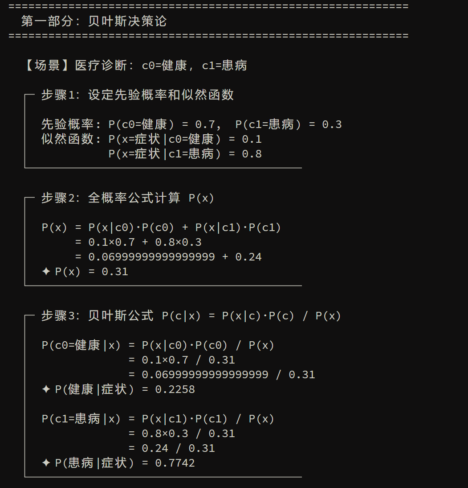 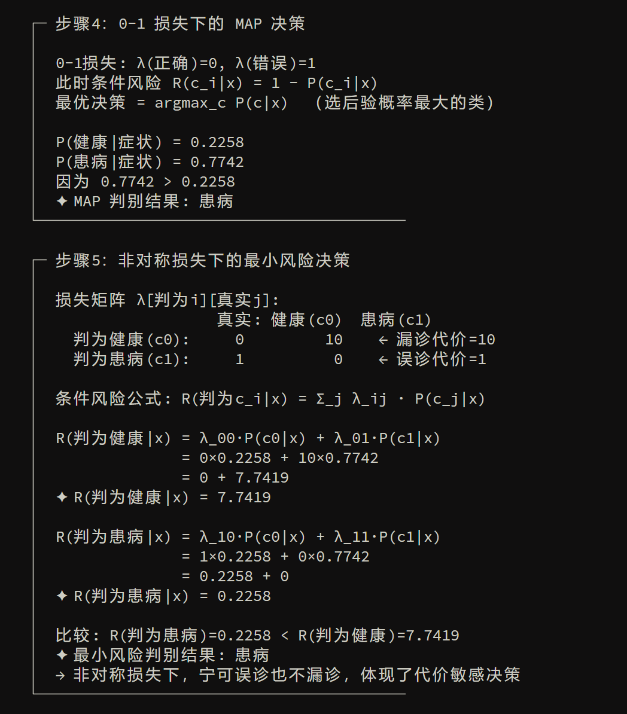

### 极大似然估计

接下来是如何估计类条件概率，极大似然估计是一种方法：先假设数据分布形式，再用训练数据把分布参数估出来，使“观测到这些数据”的概率最大

1）思路：参数估计=让数据出现的概率最大

对某一类 $c$ ,假设类条件分布有固定形式，并由参数 $\theta_c$ 决定，我们的任务就是利用训练集 D 估计参数 $\theta_c$，那么我们先将 $P(\boldsymbol{x}|c)$ 记为 $P(\boldsymbol{x}|\boldsymbol{\theta_c})$

把训练集中于类 $c$ 的样本集合记为 $D_c$。若样本独立同分布，那么似然如下：

$$
P(D_c|\theta_c)=\Pi_{\boldsymbol{x}\in{D_c}}P(\boldsymbol{x}|\theta_c)\tag{7.9}
$$

接下来MLE要做的事就是选择参数，让似然最大：

$$
\hat\theta_c=\arg\max_{\theta_c}P(D_c|\theta_c)
$$

---

2）用对数似然对算式进行优化

将式（7.9）进行对数似然

$$
LL(\theta_c)=\log P(D_c|\theta_c)=\sum_{x\in D_c}\log P(\boldsymbol{x}|\theta_c)\tag{7.10}
$$

于是此时参数 $\theta_c$ 的极大似然估计 $\hat \theta_c$ 为

$$
\hat\theta_c=\arg\max_{\theta_c}LL(\theta_c)\tag{7.11}
$$

---

3）典型结果：高斯类型下，MLE就是样本均值/方差

若连续特征下，假设概率密度函数 $p(\boldsymbol{x}|c)\sim\mathcal{N}(\boldsymbol{\mu_c},\boldsymbol{\sigma^2})$，那么极大似然估计给出

均值 $\boldsymbol{\mu_c}$：

$$
\hat\mu_c=\dfrac{1}{|D_c|}\sum_{x\in{D_c}}\boldsymbol{x}\tag{7.12}
$$

方差 $\boldsymbol{\sigma^2}$:

$$
\boldsymbol{\hat\sigma^2}=\dfrac{1}{|D_c|}\sum_{\boldsymbol{x}\in D_c}(\boldsymbol{x}-\hat\mu_c)(\boldsymbol{x}-\hat\mu_c)\top\tag{7.13}
$$

> 直观来说：**MLE 会把正态分布的均值估成样本均值，把方差/协方差估成样本方差/协方差**。

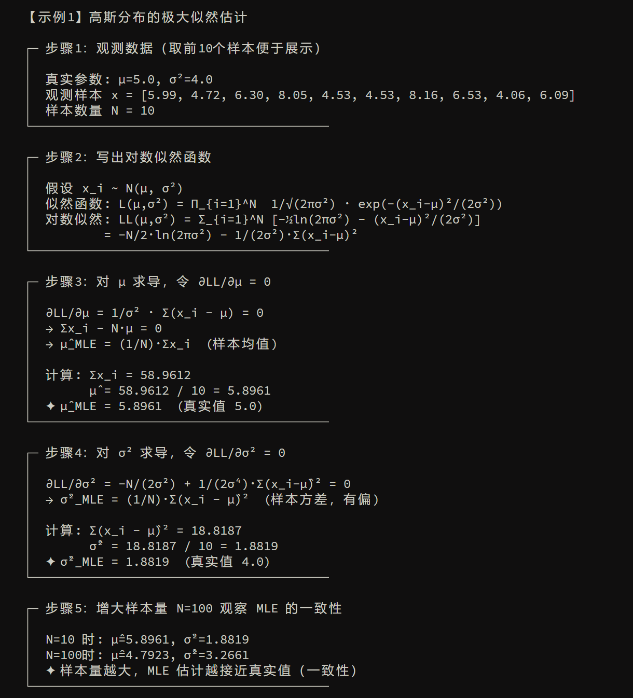 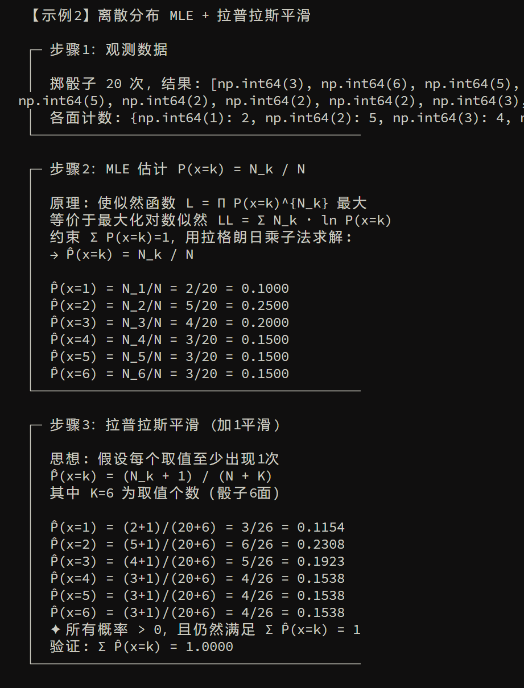

### 朴素贝叶斯分类器(NB)

回到刚刚的问题，当 $\boldsymbol{x}$ 维度过大时，直接用频率来估计的方法变得不现实，于是“朴素贝叶斯分类器”就是用 **条件独立假设** 把难以估计的联合概率拆开，从而能用有限数据做分类

1）给出假设：属性在给定类别下条件独立

朴素贝叶斯做的假设是：**给定类别 $c$ 后，各属性 $x_1,\dots,x_d$ 相互独立**，因此可以得到式(7.8)的写法

$$
P(c \mid x) = \frac{P(c)P(x \mid c)}{P(x)} = \frac{P(c)}{P(x)} \prod_{i=1}^{d} P(x_i \mid c)\tag{7.14}
$$

又因为对所有类别 $P(x)$ 相同，分类时可以忽略，得到 **贝叶斯分类器表达式** 如下

$$
h_{nb}(x) = \arg\max_{c \in \mathcal{Y}} P(c) \prod_{i=1}^{d} P(x_i \mid c)\tag{7.15}
$$

---

2）训练做法：估计先验和类条件概率

令 $D_c$ 表示训练集 $D$ 中第 $c$ 类样本组成的集合，若有充足的独立同分布样本，就可以容易地估计出类先验概率

$$
P(c)=\dfrac{|D_c|}{|D|}\tag{7.16}
$$

> 也就是某类在训练集中的占比

对于离散属性而言，取第 $i$ 个属性取值为 $x_i$，那么有

$$
P(x_i|c)=\dfrac{|D_{c,x_i}|}{|D_c|}\tag{7.17}
$$

> 也就是在类c的样本里，这个属性取值出现的频率

对于连续属性而言，假设

$$
p(x_i \mid c) \sim \mathcal{N}(\mu_{c,i}, \sigma_{c,i}^2)
$$

于是用该高斯密度值替代离散概率参与乘积，有

$$
p(x_i \mid c) = \frac{1}{\sqrt{2\pi}\sigma_{c,i}} \exp\left(-\frac{(x_i - \mu_{c,i})^2}{2\sigma_{c,i}^2}\right). \tag{7.18}
$$

---

3）避免0概率被直接否决，引入拉普拉斯平滑

如果某个属性取值在训练集中 **从未** 与某类一起出现过，那么频率估计会给 $P(x_i|c)=0$。一旦乘积里出现了0，那么整个评分系统就会直接变为0，导致分类不合理

于是提出了 **拉普拉斯修正（加一平滑）** 的方式来进行解决，如下：

若有 $N$ 个类别，第 $i$ 个属性可能取值为 $N_i$ ,那么有

$$
\begin{align}
\hat{P}(c) &= \frac{|D_c| + 1}{|D| + N} \tag{7.19}\\
\hat{P}(x_i \mid c) &= \frac{|D_{c,x_i}| + 1}{|D_c| + N_i}\tag{7.20}
\end{align}
$$

!!! note
    这边举一个垃圾邮件过滤的例子，利用朴素贝叶斯进行二分类

**场景**：给你一封邮件 $x$ ，要判断类别 $c\in\{垃圾,正常\}$

首先用贝叶斯判别：

$$
\hat{c} = \arg\max_{c} P(c \mid x) = \arg\max_{c} P(c) P(x \mid c)
$$

朴素贝叶斯假设“给定类别后，词之间条件独立”，那么把邮件表示成词的集合/词频

$$
P(x \mid c) = \prod_{w \in x} P(w \mid c)
$$

所以决策变为比较两边的分数，如下

$$
\log P(c) + \sum_{w \in x} \log P(w \mid c)
$$

---

如果训练中学到：

- “免费、中奖、点击、优惠”在垃圾邮件里 $P(w|垃圾)$ 很大
- “会议、项目、附件、日程”在正常邮件里 $P(w|正常)$ 更大
- 先验 $P(垃圾)、P(正常)$ 由历史比例得到

那么当一封邮件里出现大量“免费/中奖/点击”这类词的时候

$$
P(垃圾|x)   P(正常|x)
$$

模型就判定为垃圾邮件

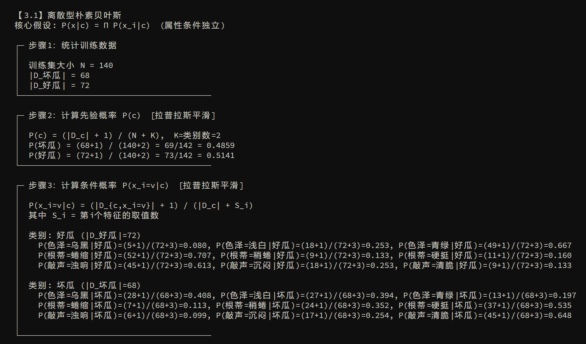 |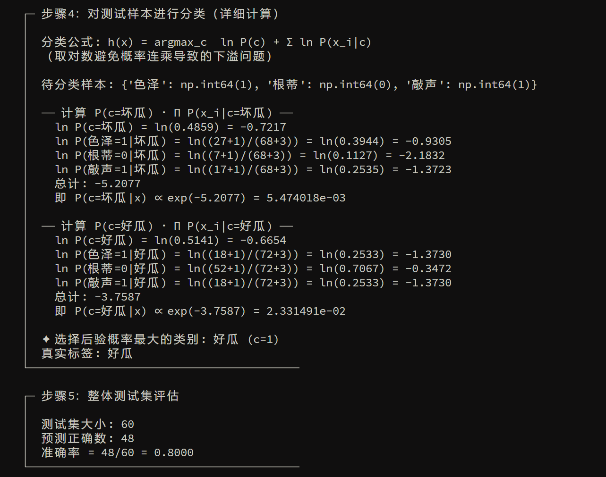

### 半朴素贝叶斯分类器

朴素贝叶斯同样存在一定问题，它“把属性全当做独立”的前提过于强，现实情况下很难发生。于是提出“半朴素贝叶斯”，**即允许属性之间保留一部分依赖关系**，在“能建模相关性”和“参数过大”之间折中

1）从NB到ODE：每个属性最多再依赖一个“父属性”

根据式（7.14）我们知道

$$
P(c \mid x) \propto P(c) \prod_{i=1}^{d} P(x_i \mid c)
$$

半朴素里常用的ODE放松为，（$pa_i$ 是属性 $x_i$ 的父属性）

$$
P(c \mid x) \propto P(c) \prod_{i=1}^{d} P(x_i \mid c, pa_i)\tag{7.21}
$$

> 这个式子的意味着：给定类别c后，每个属性最多额外依赖一个别的属性

于是关键问题就演变为了 $\rightarrow$ 怎么选每个属性的父属性

---

2）SPODE：选一个超父让所有属性都依赖它

假设所有属性都依赖同一属性 $x_s$；结构上 $y\rightarrow x_i$、且 $x_s\rightarrow x_i$

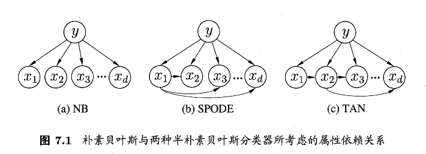

---

3）TAN：用”条件互信息+最大带权生成树“学一颗依赖树

TAN允许属性之间形成一棵树（每个属性仍然最多一个父属性），步骤如下

1、计算任意两属性在给定类别下的 **条件互信息**

$$
I(x_i, x_j \mid y) = \sum_{x_i, x_j, c} P(x_i, x_j, c) \log \frac{P(x_i, x_j \mid c)}{P(x_i \mid c)P(x_j \mid c)}\tag{7.22}
$$

2、用属性作节点建完全图，边权重为 $I(x_i,x_j|y)$

3、在该图上求 **最大带权生成树**，再选根变量，将边置为有向

4、加入类别节点 $y$ ，让 $y$ 指向每个属性

> TAN只保留了相关性最强的依赖边，避免建太复杂的依赖网络

---

4）AODE：不选一个超父，而是平均多个SPODE

AODE将“选哪个超父”的事情变化为：把每个属性都当一次超父，构造多个SPODE；然后对“样本数足够支持”的超父进行平均

形式如下，$m’$ 为阈值常数用来过滤不合格的超父：

$$
P(c \mid x) \propto \sum_{i: |D_{x_i}| \geq m'} P(c, x_i) \prod_{j=1}^{d} P(x_j \mid c, x_i)
\tag{7.23}
$$

参数估计仍然是“计数+拉普拉斯平滑”，如下

$$
\begin{align}
\hat{P}(c, x_i) = \frac{|D_{c,x_i}| + 1}{|D| + N_i}, \tag{7.24}\\
\hat{P}(x_j \mid c, x_i) = \frac{|D_{c,x_i,x_j}| + 1}{|D_{c,x_i}| + N_j}, \tag{7.25}
\end{align}
$$

> 总的来说，NB是最简单、最省数据的方法，但忽略了属性的相关性
>
> 半朴素算法保留了有限的依赖，通常比NB有更高的准确率，但是概率表更大、对数据量更加敏感
>
> 倘若继续提高依赖阶数，会让所需数据量指数级上升：表达能力更强、但是更容易“估不准”

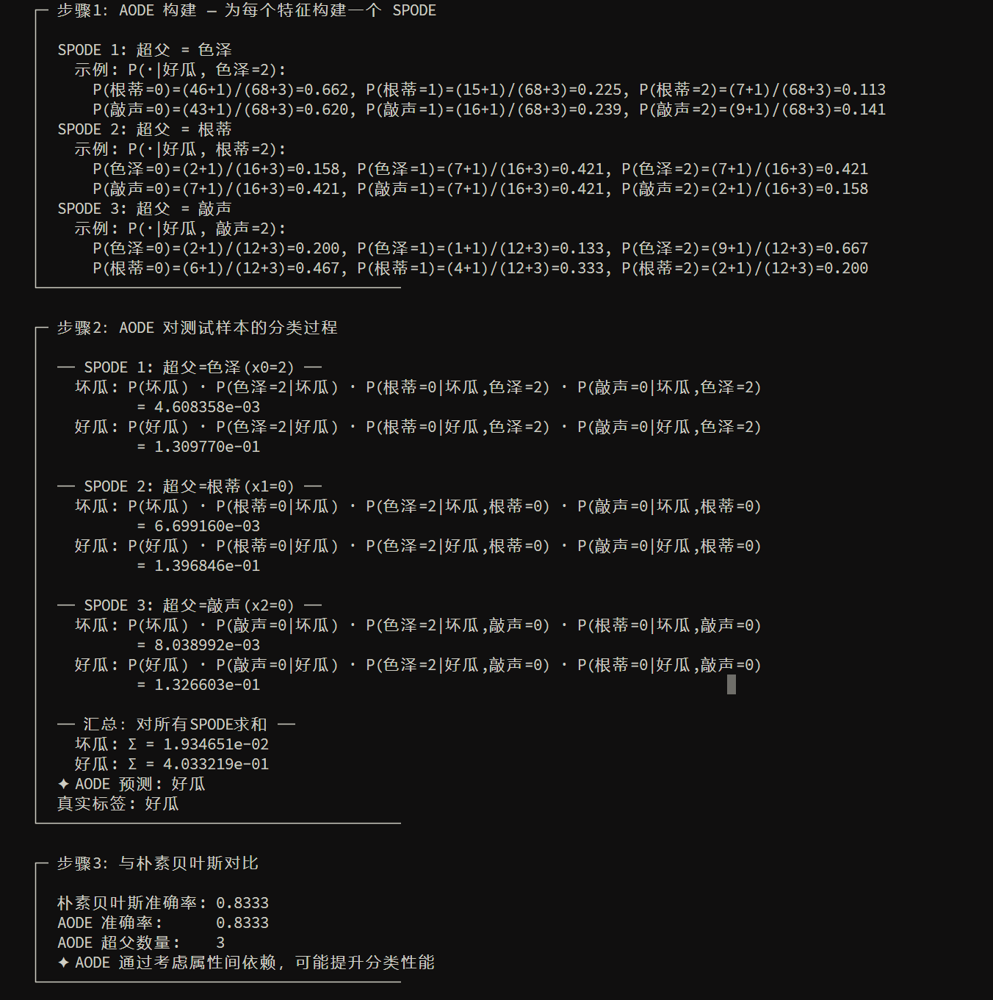

### 贝叶斯网

贝叶斯网借助有向无环图（DAG）来刻画属性之间的依赖关系，并通过条件概率表（CPT）来描述属性的联合概率分布。

即 贝叶斯网=DAG+CPT

- 图里每个节点就是一个随机变量 $\boldsymbol{x_i}$
- 边表示直接依赖关系
- 对于每个节点 $\boldsymbol{x_i}$ ，给定它的父节点集合 $\pi_i$ ，用CPT表示为 $P_B\{x_i|\pi_i\}$

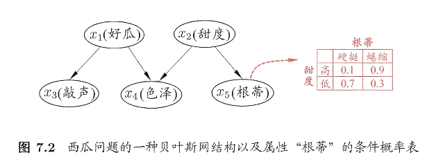

由于贝叶斯网结构有效的表达了属性间的条件独立性，给定父节点集，贝叶斯网假设每个属性与它的非后裔属性独立，于是可以得到 **联合分布分解** 如下

$$
\begin{equation}
P_B(x_1, x_2, \ldots, x_d)
= \prod_{i=1}^{d} P_B(x_i \mid \pi_i)
\tag{7.26}
\end{equation}
$$

可以发现，这样的话贝叶斯网就把 **全联合分布** 拆分成了很多的 **局部条件分布**：参数量大幅减少，并且把条件独立性编码到了图结构中

> 用图7.2为例可以看出，联合概率分布定义为
>
>

$$
P(x_1, x_2, x_3, x_4, x_5)
= P(x_1)\,P(x_2)\,P(x_3 \mid x_1)\,P(x_4 \mid x_1, x_2)\,P(x_5 \mid x_2).
$$

>
> 那么，在给定 $x_1$ 时，$x_3、x_4$ 取值独立；给定 $x_2$ 时，$x_4、x_5$ 取值独立；于是联合分布就按父节点关系展开成了若干项的乘积

---

2）三种典型结构与独立性直觉

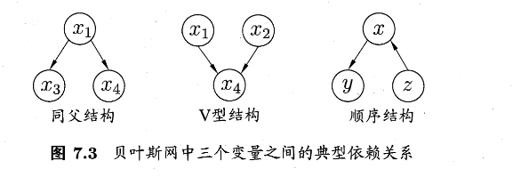

如上图，三种常见的三元结构

**同父**：$x_1\rightarrow x_3，x_1\rightarrow x_4$；给定父节点 $x_1$ 后，子节点条件独立 $x_3\perp x_4\mid x_1$

**顺序**：$x\rightarrow y\rightarrow z$；给定中间节点后，两端独立 $y\perp z\mid x$

**V结构**：$x_1\rightarrow x_4\leftarrow x_2$

- 不观察 $x_4$ 时：$x_1\perp x_2$
- 观察 $x_4$ 或其后代时， $x_1、x_2$ 相关

---

3）用 $D-$ 分离判断条件独立（道德图）

为了分析有向图中变量间的条件独立性，可以使用“有向分离”。我们先把有向图转变为一个无向图

- 找到所有的V结构，把两个父节点之间添加无向边
- 把所有的有向边改为无向边
- 在无向图里看：删除条件变量集合 $Z$ 之后，$x$ 和 $y$ 是否被分开，若被分开，则 $x\perp y\mid Z$

> 有点像割集

---

4）学习：结构已知、结构未知

**结构已知**：即属性间的依赖关系已知，那么只需要通过训练样本“计数“，估计出每个节点的条件概率即可

不过更常见的是结构未知的情况，于是学习的首要任务就是根据训练数据集找出结构最恰当的贝叶斯网。书中介绍的方法是 **评分搜索**

首先定义评分函数：

$$
\begin{equation}
s(B \mid D) = f(\theta)\,|B| - LL(B \mid D),
\tag{7.28}
\end{equation}
$$

- $\mid B\mid$：表示参数的个数（复杂度）
- $LL(B \mid D) = \sum_{i=1}^{m} \log P_B(x_i)\tag{7.29}$：表示贝叶斯网的对数似然（即拟合度）
- $f(\theta)$：描述每个参数 $\theta$ 所需的字节数
- $f(\theta)|B|$：是复杂度惩罚项，用于防止过拟合

然后一些比较典型的选择如下：

若 $f(\theta)=1$ 即每个参数用一个字节描述，就可以得到 AIC评分函数，如下

$$
\begin{equation}
\mathrm{AIC}(B \mid D) = |B| - LL(B \mid D).
\tag{7.30}
\end{equation}
$$

若 $f(\theta)=\dfrac{1}{2}\log m$，即每个参数用 $\dfrac{1}{2}\log m$ 字节描述，就可以得到 BIC 评分函数，如下

$$
\begin{equation}
\mathrm{BIC}(B \mid D)
= \frac{\log m}{2}\,|B| - LL(B \mid D).
\tag{7.31}
\end{equation}
$$

固定结构 $G$ 时，学习参数 $\theta$ 相对容易；难的是在结构空间里找最优 $G$。书里指出结构学习整体是 **NP 难**，所以常用启发式（贪心加/删/反转边）或加结构约束（比如树结构）来近似。

> NP 难（NP-hard）是计算复杂性里对“问题有多难算”的一种分类。
>
> - **NP**：指一类“给你一个候选答案，你能在多项式时间内快速验证它对不对”的判定问题集合。
> - **NP-hard（NP 难）**：一个问题如果“至少和 NP 里最难的问题一样难”，就叫 NP 难。更正式地说：
>   如果对任意 NP 问题 $L$，都能在多项式时间内把 $L$ 规约（reduction）到问题 $H$（记作 $L \le_p H$），那么 $H$ 是 **NP-hard**。

---

5）推断：查询变量在证据下的后验

训练好网络后，用它回答：

$$
P(Q=q\mid E=e)
$$

- $E$ 表示已观测的证据变量
- $Q$ 表示想求的查询变量

不过精准的推断一般比较难，于是用 **近似推断**，如下图所示的吉布斯采样算法

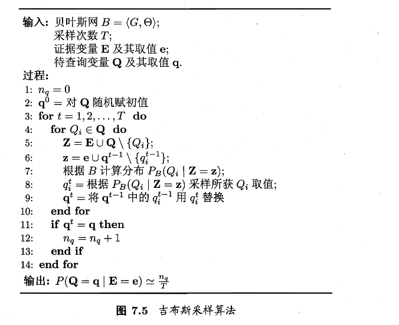

如上图所示，吉布斯采样的核心有下面几个

- 固定证据变量 $E=e$
- 反复对每个非证据变量按其条件分布采样更新（$Z$ 是除 $Q_i$ 外其它变量当前去取值+证据）：

$$
P\_B(Q\_i\mid Z=z)
$$

- 采样很多次后，用频率近似后验，$n_q$ 是采样 $Q=q$ 出现次数，$T$ 是采样次数

$$
\begin{equation}
P(Q = q \mid E = e) \simeq \frac{n\_q}{T}.
\tag{7.33}
\end{equation}
$$

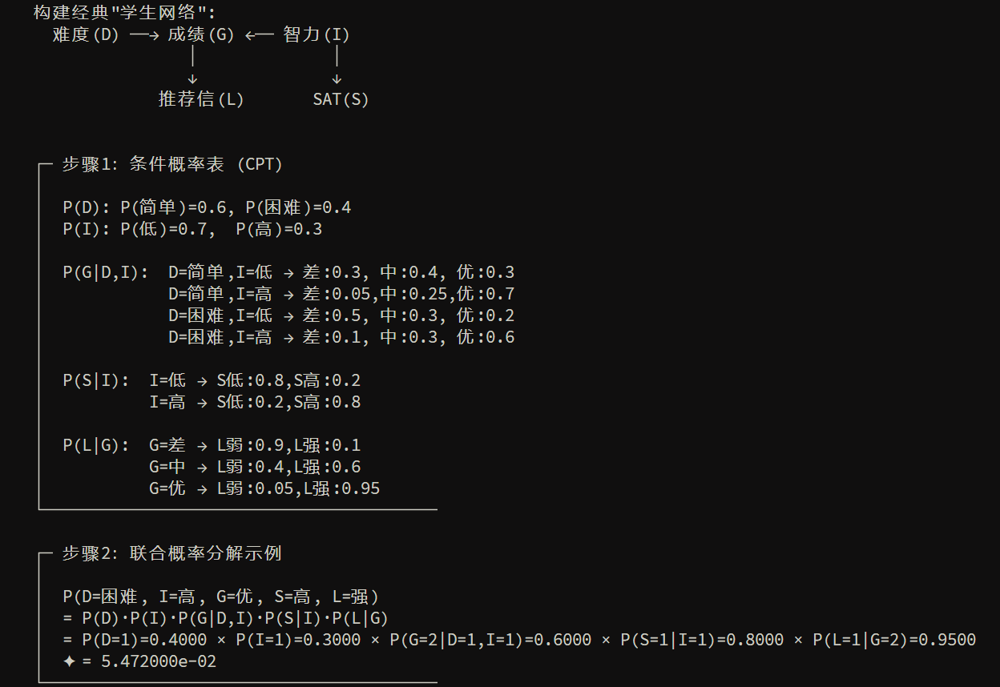 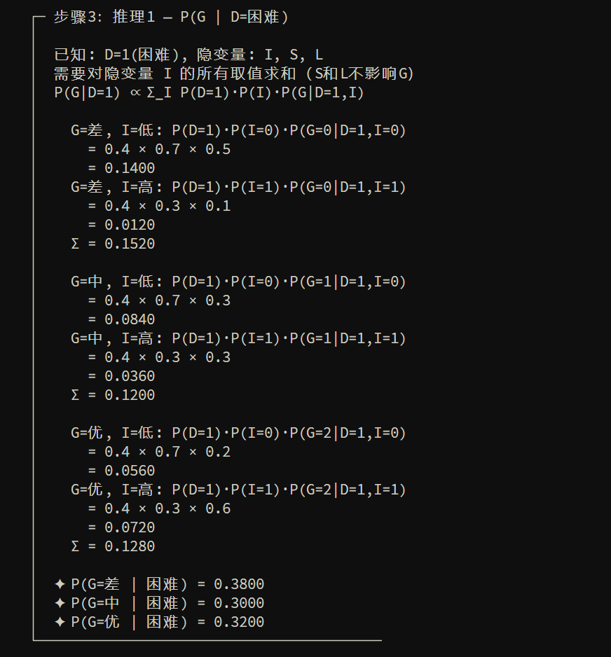 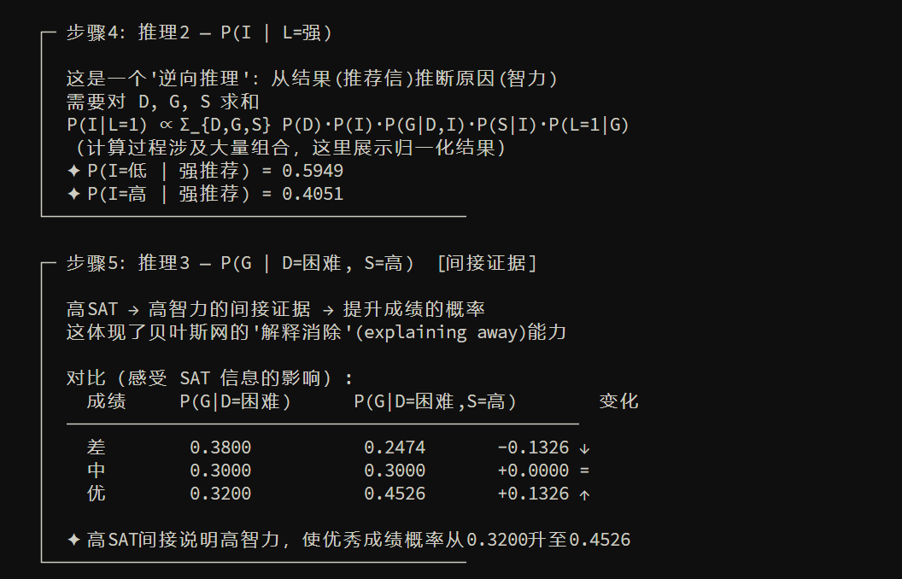

### EM算法（数据缺失量处理）

接下来是当数据中存在缺失量的时候，很难做极大似然估计，于是提出 EM算法，通过 **E步+M步** 交替优化来估参数

这两页在讲 **EM 算法（Expectation-Maximization）**：当数据里有\*\*隐变量/缺失变量\*\*时，直接做极大似然很难，EM 用“E 步 + M 步”交替优化来估参数。

---

1) 为什么需要 EM：有隐变量时似然不好直接最大化

设：

- $X$：可观测变量（你真正看到的数据）
- $Z$：隐变量（未观测/缺失/潜在变量）
- $\Theta$：模型参数

如果 $X,Z$ 都已知（“完整数据”），对数似然是：

$$
LL(\Theta\mid X,Z)=\ln P(X,Z\mid \Theta)
$$

但现实里 $Z$ 不可见，你只能最大化“边际对数似然”：

$$
LL(\Theta\mid X)=\ln P(X\mid \Theta)=\ln \sum_Z P(X,Z\mid \Theta)
$$

难点就在于 $\ln \sum_Z$ 这一项通常不好直接优化（求和/积分很麻烦）。

---

2) EM 的核心思想：交替“补全 Z”与“更新参数”

从一个初始参数 $\Theta^0$ 出发，迭代两步直到收敛：

**E 步（Expectation）**

用当前参数 $\Theta^t$ 计算隐变量的后验分布：

$$
P(Z\mid X,\Theta^t)
$$

并计算“完整数据对数似然”的期望（书里记为 $Q$ 函数）：

$$
Q(\Theta\mid \Theta^t)=\mathbb{E}_{Z\mid X,\Theta^t}LL(\Theta\mid X,Z)\tag{7.36}
$$

**M 步（Maximization）**

在 E 步得到的 $Q$ 上，对 $\Theta$ 做最大化：

$$
\Theta^{t+1}=\arg\max_\Theta Q(\Theta\mid \Theta^t)\tag{7.37}
$$

直观理解：

- **E 步**：在当前模型下，“估计/软补全”缺失的 $Z$
- **M 步**：把这个“补全后”的问题当成完整数据，再做一次参数的极大似然更新

---

3) 一个典型应用例子（帮助理解）

**高斯混合模型 GMM 聚类**：

- $X$：样本点
- $Z$：每个样本属于哪个高斯成分（簇标签），这是隐变量
- $\Theta$：各成分的均值、方差、混合权重；E 步算“每个点属于每个簇的概率”（责任度），M 步用这些概率加权更新均值/方差/权重。

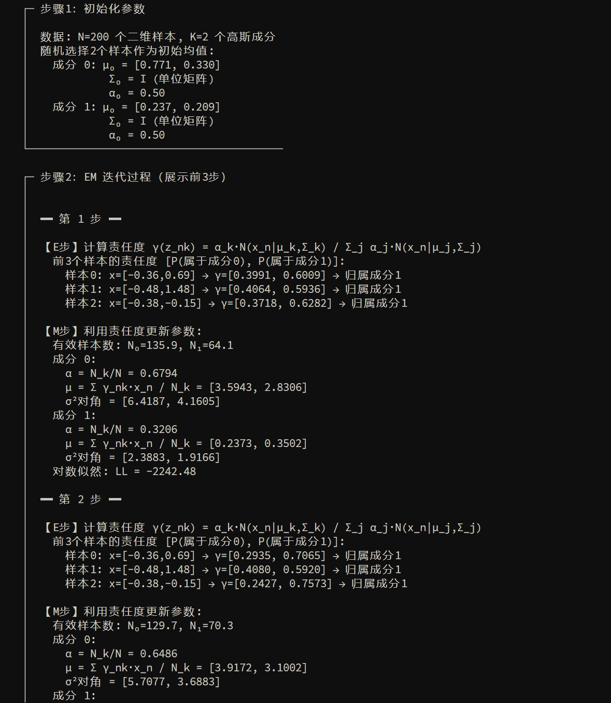 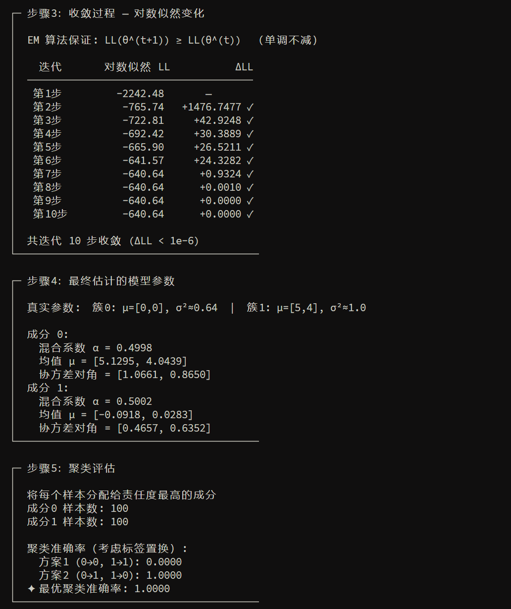

### 小结

**问题的起点：分类到底在优化什么？**

我们在不确定性下做决策。真实类别未知时，只能用概率描述 $P(c\mid x)$。但是预测会犯错，错有代价，于是我们的目的就是 最小化期望的损失

**如何给出最优决策规则？有概率+有损失 $\rightarrow$ 应该选什么类？**

贝叶斯决策论：对于每个 x，选择让条件风险最小的类

$$
R(c_i|\boldsymbol{x})=\sum_{j=1}^N\lambda_{ij}P(c_j|\boldsymbol{x})\tag{7.1}
$$

$$
h^*(\boldsymbol{x})=\arg\min_{c\in\mathcal{Y}}R(c|\boldsymbol{x})\tag{7.3}
$$

**问题变为：$P(c\mid x)$ 怎么估参数（建模难）？**

极大似然估计：要估计概率，就要先估计分布的参数。先假设 $P(x\mid\theta)$ 的形式，再用数据找最能解释数据的参数

$$
\hat\theta_c=\arg\max_{\theta_c}P(D_c|\theta_c)
$$

解决的问题是：给定分布形式、参数怎么从数据来

**问题变为：$P(c\mid x)$ 难算，如何解决（计算难）？**

朴素贝叶斯：由于贝叶斯是高维联合分布，直接估计会导致数据稀疏、组合爆炸。为了让估计可行，就假设“给定类别后属性条件独立”

分类变为：

$$
h_{nb}(x) = \arg\max_{c \in \mathcal{Y}} P(c) \prod_{i=1}^{d} P(x_i \mid c)\tag{7.15}
$$

**问题优化：独立假设这个条件过强，如何放松它又不至于让复杂度失控？**

半朴素贝叶斯：ODE、SPODE、TAN、AODE等方法

相关性更好地被建模 → 往往更准；但参数更多 → 更需要数据、估计更难。

**问题优化：半朴素依然是受限结构，如何系统化表示，并支持更一般的推断？**

贝叶斯网：用 DAG 表示依赖，用 CPT 表示局部条件分布。其带来三种能力

- 用结构表达条件独立（同父/链/V 结构；D-separation）
- 学习：结构已知就估 CPT；结构未知就做“评分 + 搜索”（AIC/BIC/MDL）
- 推断：算 $P(Q\mid E)$（查询变量在证据下的后验）

**问题深入：如果有隐变量/缺失值，不好直接最大化怎么办？**

EM算法

### 代码实操

代码内容比较多，我分散在了本文中，将文章从7改为7\_1即可见
