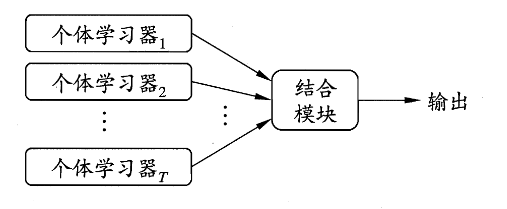
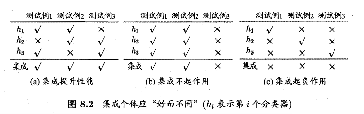
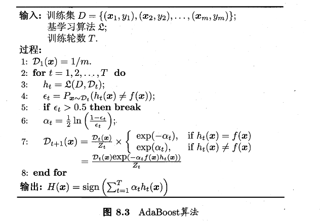
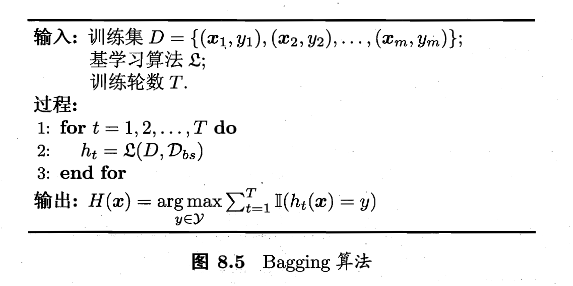
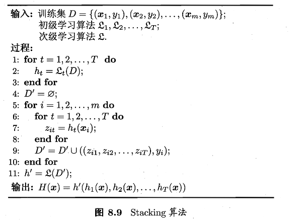
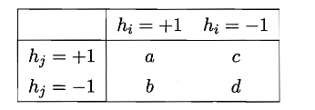
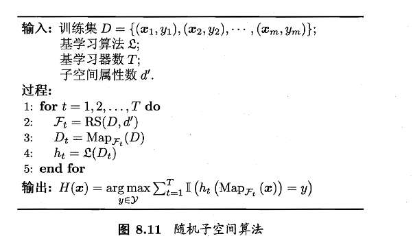

# 第八章 集成学习

> 集成学习是一种机器学习思想：把多个模型的预测结果进行组合，从而得到比单个模型更稳定、更准确的最终预测


### 个体与集成

集成学习是通过构建并结合多个个体学习器来完成学习任务，又称“多分类器系统”、“基于委员会的学习”

其基本流程为：多个个体学习器 $\rightarrow$ 结合模块 $\rightarrow$ 最终输出



个体学习器的类型

**同质集成**：

- 个体学习器通常由同一种现有的学习算法从训练数据产生，此时集成中只包含同种类型的个体学习器
- 同质集成中的个体学习器也称为“基学习器”，对应算法称为“基学习算法”

**异质集成**：

- 个体学习器使用不同的学习算法，类型也不同
- 此时个体学习器不称为“基学习器”，而是 **组件学习器**

好而不同：集成成功的关键条件

**准确性**：每个个体学习器不能太差；且至少要优于随机猜测

**多样性**：不同学习器犯错方式不同；且学习器之间存在差异



投票集成的理论分析（二分类）

**假设**：标签 $y\in\{-1,+1\}$；每个基分类错误率 $\epsilon$；错误相互独立

则对每个基分类器 $h_i$ 有：
$$
P(h\_i(\boldsymbol{x})\ne f(\boldsymbol{x}))=\epsilon\tag{8.1}
$$
我们假设集成通过简单投票法结合 $T$ 个基分类器，若有超过半数的基分类器正确，那么集成分类就正确。投票规则如下：
$$
H(\boldsymbol{x})=\text{sign}\left(\sum\_{i=1}^Th\_i(\boldsymbol{x})\right)\tag{8.2}
$$
由一般经验可得，当集成中个体分类数目 $T$ 增大，集成的错误率将以指数级下降。即 $T\rightarrow\infty$ 时，错误率趋近于 0

现实情况

刚刚的理论分析中，我们有一个很强的假设：各基学习器错误相互独立；不过由于个体学习器往往在同一数据上训练，错误高度相关。

因此可以得到如下的核心矛盾：**提高准确性** 和 **增加多样性** 两者通常互相制约

所以如何产生并结合“好而不同“的个体学习器就是集成学习研究的核心

集成方法的两大类别

根据个体学习器的生成方式，目前的集成学习方法大致可以分为两类，如下

**序列化方法**：个体学习器之间存在强依赖关系、必须串行生成，代表为 Boosting

**并行化方法**：个体学习器之间不存在强依赖关系、可同时生成，代表为 Bagging 和 随机森林


### Boosting

Boosting是将弱学习器逐步提升为强学习器的集成方法，核心机制如下：

1. 现在初始数据分布上训练一个基学习器
2. 根据该学习器的错误情况 **调整样本分布**
3. 让后续学习器 **更加关注之前分错的样本**
4. 重复上述过程，直到训练出 $T$ 个基学习器
5. 对所有基学期器进行 **加权组合**，形成最终模型

所以 Boosting 的学习器生成是序列化的

---

AdaBoost 的加性模型视角



AdaBoost的最终模型是一个 **加性模型**
$$
H(\boldsymbol{x})=\sum\_{t=1}^T\alpha\_th\_t(\boldsymbol{x})\tag{8.4}
$$
其中：

- $h_t(\boldsymbol{x})\in\{-1,+1\}$：第 t 个基分类器
- $\alpha_t$ 对应权重

而AdaBoost的优化目标是 **最小化指数损失函数**
$$
\ell\_{exp}(H\mid\mathcal{D})=\mathbb{E}\_{x\sim\mathcal{D}}\left[e^{-f(\boldsymbol x)H(\boldsymbol x)}\right]
\tag{8.5}
$$
其中：

- $f(\boldsymbol{x})$ 是真实分类函数，$f(\boldsymbol{x})\in\{-1,+1\}$
- $\mathcal{D}$ 为样本分布

指数损失最优解的贝叶斯解释

我们要求最小化指数损失函数，那么很容易想到让式(8.5)对式(8.4)也就是 $H(\boldsymbol{x})$ 求偏导，如下

$$
\frac{\partial \ell_{\exp}(H \mid \mathcal{D})}{\partial H(\boldsymbol{x})} = -e^{-H(\boldsymbol{x})} P(f(\boldsymbol{x}) = 1 \mid \boldsymbol{x}) + e^{H(\boldsymbol{x})} P(f(\boldsymbol{x}) = -1 \mid \boldsymbol{x}), \tag{8.6}
$$

再令其为0，解得

$$
\begin{align}
\tag{8.7} H(x) &= \frac{1}{2} \ln \frac{P(f(x)=1 \mid x)}{P(f(x)=-1 \mid x)}\\
\end{align}
$$

进而得到

$$
\text{sign}(H(x)) = \text{arg} \max_{y \in \{-1, +1\}} P(f(x) = y \mid x) \tag{8.8}
$$

到这里，式(8.8)证明了 $\text{sign}(H(\boldsymbol{x}))$ 达到了贝叶斯最优错误率。也就是说，如果指数损失函数最小化，那么分类错误率也将最小（取代了0/1损失函数的位置）

那么，我们可以将此函数作为0/1损失函数的替代，来进行优化，即式（8.5）处提到的AdaBoost优化目标

基学习器权重 $\alpha_t$ 的推导

AdaBoost中，第一个基分类器 $h_1$ 通过直接将基学习算法用于初始数据分布得到，此后迭代生成 $h_t$ 和 $\alpha_t$

结合上式（8.4）和（8.8），我们发现，当基分类器 $h_t$ 基于分布 $\mathcal{D_t}$ 生成后，该基分类器的权重 $\alpha_t$ 应该使得 $\alpha_t h_t$ 最小化指数损失函数

考虑单轮优化：

$$
\begin{align}
\ell_{\exp}(\alpha_t h_t \mid D_t)
&= \mathbb{E}_{x \sim D_t}
\left[
e^{-f(x)\alpha_t h_t(x)}
\right]
\\
&= e^{-\alpha_t} P(f(x) = h_t(x))+ e^{\alpha_t} P(f(x) \ne h_t(x))\tag{展开}
\end{align}
$$

我们记 $\epsilon_t= P_{x \sim D_t}\bigl(h_t(x) \ne f(x)\bigr)$(，可以将上式化为一般式：

> 这里的 $\epsilon_t$ 是算法第4行内容，误差率

$$
\begin{equation}
\ell_{\exp}
= e^{-\alpha_t}(1-\epsilon_t)
  + e^{\alpha_t}\epsilon_t
\tag{8.9}
\end{equation}
$$

由于是求权重 $\alpha_t$，那么将上式对 $\alpha_t$ 求导：

$$
\begin{equation}
\frac{\partial \ell_{\exp}}{\partial \alpha_t}
=
- e^{-\alpha_t}(1-\epsilon_t)
+ e^{\alpha_t}\epsilon_t
\tag{8.10}
\end{equation}
$$

令(8.10)为零，解得

$$
\alpha_t=\dfrac{1}{2}\ln\left(\dfrac{1-\epsilon_t}{\epsilon_t}\right)\tag{8.11}
$$

> 算法第6行，分类器权重更新公式

样本分布更新的理论来源

经过一次迭代后，整体模型会更新为

$$
H_t(x)=H_{t-1}(x)+\alpha_th_t(x)
$$

于是指数损失也会随之发生变化

$$
\begin{equation}
\ell_{\exp}(H_t \mid \mathcal{D})
=
\mathbb{E}_{x \sim \mathcal{D}}
\left[
e^{-f(x)H_{t-1}(x)}
e^{-f(x)h_t(x)}
\right]
\tag{8.12}
\end{equation}
$$

由于 $f^2(x)=h_t^2(x)=1$ ，所以对 $e^{-f(x)h_t(x)}$ 作泰勒展开近似，如下

$$
\begin{equation}
\ell_{\exp}(H_{t-1}+h_t \mid \mathcal{D})
\approx
\mathbb{E}_{x \sim \mathcal{D}}
\left[
e^{-f(x)H_{t-1}(x)}
\left(
1 - f(x)h_t(x) + \frac{1}{2}
\right)
\right]
\tag{8.13}
\end{equation}
$$

> AdaBoost中，真实函数与基分类器的输出都被编码为 $\{-1,+1\}$，因此有 $f^2(x)=h_t^2(x)=1$
>
> 将这个性质带入到(8.17)也可以进行解释，其中 $\mathbb{I}(\cdot)$ 为示性函数，内部条件成立时它的输出为1，否则为0

那么可以得到理想的基学习器为

$$
\begin{equation}
h_t
=
\arg\max_{h}
\mathbb{E}_{x \sim \mathcal{D}_t}
\left[
f(x)h(x)
\right]
\tag{8.16}
\end{equation}
$$

又由于

$$
\begin{equation}
f(x)h(x)
=
1 - 2\mathbb{I}(f(x) \ne h(x))
\tag{8.17}
\end{equation}
$$

所以可以得到

$$
\begin{equation}
h_t
=
\arg\min_{h}
\mathbb{E}_{x \sim \mathcal{D}_t}
\left[
\mathbb{I}(f(x) \ne h(x))
\right]
\tag{8.18}
\end{equation}
$$

即：**基学习器在分布 $\mathcal{D_t}$ 下最小化分类误差**

接下来就是更新 $\mathcal{D_t}$ 和 $\mathcal{D_{t+1}}$，

在 $t$ 轮种，我们已经固定 $H_{t-1}$，要选 $h$ 让指数损失下降，我们可以把目标整理为

$$
\begin{equation}
h_t
=
\arg\max_{h}
\mathbb{E}_{x \sim \mathcal{D}}
\left[
\frac{
e^{-f(x)H_{t-1}(x)}
}{
\mathbb{E}_{x \sim \mathcal{D}}
\left[
e^{-f(x)H_{t-1}(x)}
\right]
}
\, f(x)h(x)
\right].
\tag{8.14}
\end{equation}
$$

> 分母中 $\mathbb{E}_{x \sim \mathcal{D}}\left[e^{-f(x)H_{t-1}(x)}\right]$ 与 x 无关，对 $\arg\max_h$ 来说只是常数缩放

我们观察(8.14)里乘在 $f(x)h(x)$ 前面的权重函数

$$
w_t(x)
\triangleq
\frac{
e^{-f(x)H_{t-1}(x)}
}{
\mathbb{E}_{x \sim \mathcal{D}}
\left[
e^{-f(x)H_{t-1}(x)}
\right]
}
$$

如果原始数据分布记为 $\mathcal{D}(x)$，那么把它按 $w_t(x)$ 重新加权，就可以得到一个新的分布，如下

$$
\mathcal{D}_t(x)
\triangleq
\mathcal{D}(x)\, w_t(x).
$$

展开来就是

$$
\begin{equation}
\mathcal{D}_t(x)
=
\frac{
\mathcal{D}(x)\, e^{-f(x)H_{t-1}(x)}
}{
\mathbb{E}_{x \sim \mathcal{D}}
\left[
e^{-f(x)H_{t-1}(x)}
\right]
}.
\tag{8.15}
\end{equation}
$$

依次类推

$$
\begin{equation}
\mathcal{D}_{t+1}(x)
=
\mathcal{D}_t(x)\,
\frac{
e^{-f(x)\alpha_t h_t(x)}
}{
\mathbb{E}_{x \sim \mathcal{D}_t}
\left[
e^{-f(x)\alpha_t h_t(x)}
\right]
}.
\tag{8.19}
\end{equation}
$$

> 算法第7行，样本分布更新公式

---

分析算法

从偏差-方差分解的角度来看，Boosting主要关注降低偏差，因此可以将泛化能力较弱的学习器提升为强模型

---

示例


```

root@iZbp1gtqhrbrar9e0rt59yZ:~/rl/8#

python3

2
.py

=====

数据集

=====

i
=

0

x
=[
0
.1,

0
.2
]

y
=
1

i
=

1

x
=[
0
.2,

0
.1
]

y
=
1

i
=

2

x
=[
0
.35,

0
.8
]

y
=
1

i
=

3

x
=[
0
.4,

0
.7
]

y
=
-1

i
=

4

x
=[
0
.6,

0
.3
]

y
=
-1

i
=

5

x
=[
0
.7,

0
.4
]

y
=
-1

i
=

6

x
=[
0
.8,

0
.9
]

y
=
-1

i
=

7

x
=[
0
.9,

0
.85
]

y
=
1

=====

AdaBoost

迭代开始

=====

-----

Round

t
=
1

-----
D_t：

[
'0.125000'
,

'0.125000'
,

'0.125000'
,

'0.125000'
,

'0.125000'
,

'0.125000'
,

'0.125000'
,

'0.125000'
]

选择的基学习器

h_t：


feature
=
0
,

threshold
=
0
.375000,

polarity
=
1


h_t
(
x_i
)
：

[
1
,

1
,

1
,

-1,

-1,

-1,

-1,

-1
]

加权错误率

epsilon_t

=

P_
{
x~D
}(
h!
=
y
)

=

0
.125000

alpha_t

=

1
/2

ln
((
1
-eps
)
/eps
)

=

0
.972955

(
公式8.11
)

F_t
(
x_i
)

=

sum_
{
k<
=
t
}

alpha_k

h_k
(
x_i
)

(
公式8.4
)

[
'0.972955'
,

'0.972955'
,

'0.972955'
,

'-0.972955'
,

'-0.972955'
,

'-0.972955'
,

'-0.972955'
,

'-0.972955'
]

sign
(
F_t
)
：

[
1
,

1
,

1
,

-1,

-1,

-1,

-1,

-1
]

训练集0/1错误率：0.125000

指数损失

l_exp
(
H
|
D
)

=

E
[
exp
(
-f
(
x
)
H
(
x
))]

(
公式8.5
)


均匀经验平均：0.661438


按当前

D_t

加权：0.661438

D_
{
t+1
}(
i
)

=

D_t
(
i
)

*

exp
(
-alpha_t

f
(
x_i
)

h_t
(
x_i
))

/

Z_t

(
公式8.19
)

未归一化：

[
'0.047246'
,

'0.047246'
,

'0.047246'
,

'0.047246'
,

'0.047246'
,

'0.047246'
,

'0.047246'
,

'0.330719'
]

Z_t

=

sum_i

未归一化

=

0
.661438
D_
{
t+1
}
：

[
'0.071429'
,

'0.071429'
,

'0.071429'
,

'0.071429'
,

'0.071429'
,

'0.071429'
,

'0.071429'
,

'0.500000'
]

-----

Round

t
=
2

-----
D_t：

[
'0.071429'
,

'0.071429'
,

'0.071429'
,

'0.071429'
,

'0.071429'
,

'0.071429'
,

'0.071429'
,

'0.500000'
]

选择的基学习器

h_t：


feature
=
0
,

threshold
=
0
.850000,

polarity
=
-1


h_t
(
x_i
)
：

[
-1,

-1,

-1,

-1,

-1,

-1,

-1,

1
]

加权错误率

epsilon_t

=

P_
{
x~D
}(
h!
=
y
)

=

0
.214286

alpha_t

=

1
/2

ln
((
1
-eps
)
/eps
)

=

0
.649641

(
公式8.11
)

F_t
(
x_i
)

=

sum_
{
k<
=
t
}

alpha_k

h_k
(
x_i
)

(
公式8.4
)

[
'0.323314'
,

'0.323314'
,

'0.323314'
,

'-1.622597'
,

'-1.622597'
,

'-1.622597'
,

'-1.622597'
,

'-0.323314'
]

sign
(
F_t
)
：

[
1
,

1
,

1
,

-1,

-1,

-1,

-1,

-1
]

训练集0/1错误率：0.125000

指数损失

l_exp
(
H
|
D
)

=

E
[
exp
(
-f
(
x
)
H
(
x
))]

(
公式8.5
)


均匀经验平均：0.542810


按当前

D_t

加权：0.902334

D_
{
t+1
}(
i
)

=

D_t
(
i
)

*

exp
(
-alpha_t

f
(
x_i
)

h_t
(
x_i
))

/

Z_t

(
公式8.19
)

未归一化：

[
'0.136775'
,

'0.136775'
,

'0.136775'
,

'0.037302'
,

'0.037302'
,

'0.037302'
,

'0.037302'
,

'0.261116'
]

Z_t

=

sum_i

未归一化

=

0
.820652
D_
{
t+1
}
：

[
'0.166667'
,

'0.166667'
,

'0.166667'
,

'0.045455'
,

'0.045455'
,

'0.045455'
,

'0.045455'
,

'0.318182'
]

-----

Round

t
=
3

-----
D_t：

[
'0.166667'
,

'0.166667'
,

'0.166667'
,

'0.045455'
,

'0.045455'
,

'0.045455'
,

'0.045455'
,

'0.318182'
]

选择的基学习器

h_t：


feature
=
1
,

threshold
=
0
.875000,

polarity
=
1


h_t
(
x_i
)
：

[
1
,

1
,

1
,

1
,

1
,

1
,

-1,

1
]

加权错误率

epsilon_t

=

P_
{
x~D
}(
h!
=
y
)

=

0
.136364

alpha_t

=

1
/2

ln
((
1
-eps
)
/eps
)

=

0
.922913

(
公式8.11
)

F_t
(
x_i
)

=

sum_
{
k<
=
t
}

alpha_k

h_k
(
x_i
)

(
公式8.4
)

[
'1.246227'
,

'1.246227'
,

'1.246227'
,

'-0.699683'
,

'-0.699683'
,

'-0.699683'
,

'-2.545510'
,

'0.599600'
]

sign
(
F_t
)
：

[
1
,

1
,

1
,

-1,

-1,

-1,

-1,

1
]

训练集0/1错误率：0.000000

指数损失

l_exp
(
H
|
D
)

=

E
[
exp
(
-f
(
x
)
H
(
x
))]

(
公式8.5
)


均匀经验平均：0.372557


按当前

D_t

加权：0.389788

D_
{
t+1
}(
i
)

=

D_t
(
i
)

*

exp
(
-alpha_t

f
(
x_i
)

h_t
(
x_i
))

/

Z_t

(
公式8.19
)

未归一化：

[
'0.066227'
,

'0.066227'
,

'0.066227'
,

'0.114391'
,

'0.114391'
,

'0.114391'
,

'0.018062'
,

'0.126433'
]

Z_t

=

sum_i

未归一化

=

0
.686349
D_
{
t+1
}
：

[
'0.096491'
,

'0.096491'
,

'0.096491'
,

'0.166667'
,

'0.166667'
,

'0.166667'
,

'0.026316'
,

'0.184211'
]

-----

Round

t
=
4

-----
D_t：

[
'0.096491'
,

'0.096491'
,

'0.096491'
,

'0.166667'
,

'0.166667'
,

'0.166667'
,

'0.026316'
,

'0.184211'
]

选择的基学习器

h_t：


feature
=
0
,

threshold
=
0
.375000,

polarity
=
1


h_t
(
x_i
)
：

[
1
,

1
,

1
,

-1,

-1,

-1,

-1,

-1
]

加权错误率

epsilon_t

=

P_
{
x~D
}(
h!
=
y
)

=

0
.184211

alpha_t

=

1
/2

ln
((
1
-eps
)
/eps
)

=

0
.744039

(
公式8.11
)

F_t
(
x_i
)

=

sum_
{
k<
=
t
}

alpha_k

h_k
(
x_i
)

(
公式8.4
)

[
'1.990265'
,

'1.990265'
,

'1.990265'
,

'-1.443722'
,

'-1.443722'
,

'-1.443722'
,

'-3.289548'
,

'-0.144439'
]

sign
(
F_t
)
：

[
1
,

1
,

1
,

-1,

-1,

-1,

-1,

-1
]

训练集0/1错误率：0.125000

指数损失

l_exp
(
H
|
D
)

=

E
[
exp
(
-f
(
x
)
H
(
x
))]

(
公式8.5
)


均匀经验平均：0.288848


按当前

D_t

加权：0.371399

D_
{
t+1
}(
i
)

=

D_t
(
i
)

*

exp
(
-alpha_t

f
(
x_i
)

h_t
(
x_i
))

/

Z_t

(
公式8.19
)

未归一化：

[
'0.045852'
,

'0.045852'
,

'0.045852'
,

'0.079198'
,

'0.079198'
,

'0.079198'
,

'0.012505'
,

'0.387656'
]

Z_t

=

sum_i

未归一化

=

0
.775312
D_
{
t+1
}
：

[
'0.059140'
,

'0.059140'
,

'0.059140'
,

'0.102151'
,

'0.102151'
,

'0.102151'
,

'0.016129'
,

'0.500000'
]

-----

Round

t
=
5

-----
D_t：

[
'0.059140'
,

'0.059140'
,

'0.059140'
,

'0.102151'
,

'0.102151'
,

'0.102151'
,

'0.016129'
,

'0.500000'
]

选择的基学习器

h_t：


feature
=
1
,

threshold
=
0
.750000,

polarity
=
-1


h_t
(
x_i
)
：

[
-1,

-1,

1
,

-1,

-1,

-1,

1
,

1
]

加权错误率

epsilon_t

=

P_
{
x~D
}(
h!
=
y
)

=

0
.134409

alpha_t

=

1
/2

ln
((
1
-eps
)
/eps
)

=

0
.931264

(
公式8.11
)

F_t
(
x_i
)

=

sum_
{
k<
=
t
}

alpha_k

h_k
(
x_i
)

(
公式8.4
)

[
'1.059001'
,

'1.059001'
,

'2.921530'
,

'-2.374986'
,

'-2.374986'
,

'-2.374986'
,

'-2.358284'
,

'0.786826'
]

sign
(
F_t
)
：

[
1
,

1
,

1
,

-1,

-1,

-1,

-1,

1
]

训练集0/1错误率：0.000000

指数损失

l_exp
(
H
|
D
)

=

E
[
exp
(
-f
(
x
)
H
(
x
))]

(
公式8.5
)


均匀经验平均：0.197047


按当前

D_t

加权：0.301879

D_
{
t+1
}(
i
)

=

D_t
(
i
)

*

exp
(
-alpha_t

f
(
x_i
)

h_t
(
x_i
))

/

Z_t

(
公式8.19
)

未归一化：

[
'0.150080'
,

'0.150080'
,

'0.023304'
,

'0.040253'
,

'0.040253'
,

'0.040253'
,

'0.040931'
,

'0.197028'
]

Z_t

=

sum_i

未归一化

=

0
.682182
D_
{
t+1
}
：

[
'0.220000'
,

'0.220000'
,

'0.034161'
,

'0.059006'
,

'0.059006'
,

'0.059006'
,

'0.060000'
,

'0.288820'
]

=====

最终强分类器

=====

H
(
x
)

=

sign
(

sum_t

alpha_t

h_t
(
x
)

)

t
=
1
:

alpha
=
0
.972955,

stump
=(
feature
=
0
,

thr
=
0
.375000,

pol
=
1
)

t
=
2
:

alpha
=
0
.649641,

stump
=(
feature
=
0
,

thr
=
0
.850000,

pol
=
-1
)

t
=
3
:

alpha
=
0
.922913,

stump
=(
feature
=
1
,

thr
=
0
.875000,

pol
=
1
)

t
=
4
:

alpha
=
0
.744039,

stump
=(
feature
=
0
,

thr
=
0
.375000,

pol
=
1
)

t
=
5
:

alpha
=
0
.931264,

stump
=(
feature
=
1
,

thr
=
0
.750000,

pol
=
-1
)

```

这里算出来的最终模型如下；各个基分类器属性参考feature，阈值参考thr，大于thr则取pol值，负责取-pol：

$$
F(x)=0.972955h_1(x)+0.649641h_2(x)+0.922913h_3(x)+0.744039h_4(x)+0.931264h_5(x)
$$

然后我们假设样本 $x=[0.30,0.80]$ 带入计算可以得到

$$
(h_1,h_2,h_3​,h_4​,h_5​)=(+1,−1,+1,+1,+1)
$$

得到 $F(x)=2.921530>0\Rightarrow H(x)=sign(F(x))=+1$


### Bagging 和 随机森林

刚刚讲了序列化的生成方法，下面讲并行化生成方法

总体思路

为了得到泛化能力更强的集成模型，关键是让多个基学习器尽量“有差异”（降低相关性），但又不能差到学不到东西。

做法是：对训练集进行多次采样，得到多个相互有交叠的训练子集，在每个子集上训练一个基学习器，再把它们组合起来。

---

Bagging



核心做法基于自助采样法（第2章）：

- 对大小为 $m$ 的训练集做 自助采样，每次从原训练集中“有放回”抽取 $m$ 次，形成一个采样集
- 重复 $T$ 次，得到 $T$ 个采样集，训练 $T$ 个基学习器
- 集成输出：分类问题采用多数投票；回归问题采用平均

> 之前证明过，自助采样法的训练集中大约63.2% 的样本会至少出现一次进入采样集，其余36.8%没被抽到。

因为每个基学习器都有一部分没见过的样本，可以用这些样本来做该学习器的验证。把对每个样本“没用它训练过的那些学习器”的预测汇总起来，就可以得到 OOB 预测，进而估计泛化误差（相当于一种“自带的交叉验证”，不需要额外划分验证集

令 $H^{oob}(x)$ 表示对样本 $x$ 的包外预测，即仅考虑哪些未使用 $x$ 训练的基学习器在 $x$ 上的预测，有

$$
\begin{equation}
H^{\mathrm{oob}}(x)
=
\arg\max_{y \in \mathcal{Y}}
\sum_{t=1}^{T}
\mathbb{I}\!\left(h_t(x) = y\right)
\cdot
\mathbb{I}\!\left(x \notin \mathcal{D}_t\right).
\tag{8.20}
\end{equation}
$$

用 Bagging 泛化误差的包外估计为

$$
\begin{equation}
\epsilon^{\mathrm{oob}}
=
\frac{1}{|\mathcal{D}|}
\sum_{(x,y)\in \mathcal{D}}
\mathbb{I}\!\left(H^{\mathrm{oob}}(x) \ne y\right).
\tag{8.21}
\end{equation}
$$

---

随机森林RF

Bagging的扩展变体，可以看作：**Bagging+决策树+额外的属性随机性**

具体来说：对基决策树的每个节点，先从该节点的属性集合中随机选择一个包含 $k$ 个属性的子集，然后再从这个子集中选择一个最优属性用于划分。

> 这样的话就通过控制参数 $k$ 达到控制随机性的目的

虽然引入特征随机性会让单棵树变弱，但是树与树之间的相关性更低，整体集成变得更强，泛化误差往往更低


### 结合策略

截至目前，我们的基学习器相关的算法学得差不多了，接下来是如何结合的问题。

平均法：用于回归/数值输出

假设有 $T$ 个基学习器，输出数值为 $h_i(x)\in\mathbb{R}$

**简单平均**：

$$
H(x)=\dfrac{1}{T}\sum_{i=1}^Th_i(x)\tag{8.22}
$$

**加权平均**：

$$
H(x)=\dfrac{1}{T}\sum_{i=1}^Tw_ih_i(x)\tag{8.23}\\
w_i\ge0,\sum_{i=1}^Tw_i=1
$$

权重通常从数据中学习，但\*\*权重参数多\*\*、训练数据不足或噪声大时容易过拟合，所以实践里“学权重”不一定比简单平均强。

---

投票法：用于分类

设类别集合 $\{c_1,\dots,c_N\}$ 。书里把第 $i$ 个学习器在样本 $x$ 上对类别 $c_j$ 的输出写成 $h_i^j(x)$

**绝对多数投票**：

若某类得票超过总票数的一半时输出该类，否则可以拒绝预测

- 这个“拒绝”机制适合对可靠性要求高的场景
- 若任务必须输出结果、不允许拒绝，则会退化为下面的相对多数

**相对多数投票**：

$$
H(x)=c_{\arg\max_j\sum_{i=1}^Th_i^j(x)}\tag{8.25}
$$

也就是哪个类票最多就选哪个；若并列最高就随机选一个

**加权投票**：

$$
H(x)=c_{\arg\max_j\sum_{i=1}^Tw_ih_i^j(x)}\tag{8.26}\\
w_i\ge0,\sum_iw_i=1
$$

不过要注意：

- 不同学习器输出的“概率/得分”**不可直接混用**，需要先做概率校准（calibration），常见方法包括 **Platt scaling**、**isotonic regression** 等。
- 若学习器类型不同、概率尺度不可比，有时要先把概率转成硬标签再投票。

---

学习法：堆叠

核心思想就是再训练一个二级学习器/元学习器来做结合。

书中将个体学习器称为初级学习器，用于结合的学习器称为次级学习器或元学习器，算法如下



1. 先训练 $T$ 个初级学习器
2. 用它们在样本 $x_i$ 上的输出组成新特征向量 $z_i=(h_1(x_i),\dots,h_T(x_i))$,并配上原标签 $y_i$，得到二级训练集 $D’=\{(z_i,y_i)\}$
3. 在 $D’$ 上训练二级学习器 $h’$，最终得到 $H(x)=h’(h_1(x),\dots,h_T(x))$

如过直接用训练初级学习器的同一批数据来生成 $z_i$ ，二级学习器很容易过拟合。

标准做法一般是采用 **交叉验证/留一法**：对每个样本，用“没见过它”的初级模型输出作为它的二级特征（out-of-fold 预测），再训练二级学习器。


### 多样性

集成想要泛化强，个体学习器应“**好而不同**”：既要各自有一定准确性（好），又要彼此不一致/相关性低（不同）。本节给出一个回归任务下的理论分解，并介绍分类任务中常用的多样性度量与增强手段。

---

误差-分歧分解

假定有 $T$ 个个体学习器 $h_1,\dots,h_T$。用加权平均得到集成输出 $H(x)=\dfrac{1}{T}\sum_{i=1}^Tw_ih_i(x)$。任务是回归：目标函数 $f:\mathbb{R}^d\rightarrow\mathbb{R}$

对样本 $x$ ，定义学习器 $h_i$ 的分歧为：

$$
A(h_i\mid x)=\left(h_i(x)-H(x)\right)^2\tag{8.27}
$$

> **分歧** 表示个体预测集成离集成预测偏离多少，偏离越大，多样性越强

于是根据式(8.27)进行加权平均，可以得到集成的“分歧”为

$$
\bar A(h\mid x)=\sum_{i=1}^Tw_iA(h_i\mid x)=\sum_{i=1}^Tw_i(h_i(x)-H(x))^2\tag{8.28}
$$

又由于个体学习器在样本 $x$ 的平方误差则为

$$
E(h_i\mid x)=(f(x)-h_i(x))^2\tag{8.29}
$$

同理，集成在样本 $x$ 的平方误差为

$$
E(H\mid x)=(f(x)-H(x))^2\tag{8.30}
$$

于是我们可以参考式(8.28)，定义个体误差的加权均值为

$$
\bar E(h\mid x)=\sum_{i=1}^Tw_iE(h_i\mid x)
$$

根据式(8.28)-(8.30)，进而得到下式

$$
\begin{align}
\bar A(h\mid x)&=\sum_{i=1}^Tw_iE(h_i\mid x)-E(H\mid x)
\\
&=\bar E(h\mid x)-E(H\mid x)
\tag{8.31}
\end{align}
$$

再进行一下变形

$$
E(H\mid x)=\bar E(h\mid x)-\bar A(h\mid x)
$$

此式意味着：**集成误差=个体误差均值-分歧**。在个体误差均值固定时，分歧越大，集成误差越小

不过刚刚是离散态，通过权重 $w_i$ 进行的集成，接下来扩展到连续态：

令 $p(x)$ 为样本分布密度，对所有 $x$ 积分，根据式(8.31)可以得到

$$
\sum_{i=1}^Tw_i\int A(h_i\mid x)p(x)\mathrm{d}x=
\sum_{i=1}^Tw_i\int E(h_i\mid x)p(x)\mathrm{d}x-\int E(H\mid x)p(x)\mathrm{d}x
\tag{8.32}
$$

同样，定义第 $i$ 个学习器在全空间上的泛化误差与分歧项以及集成的泛化误差

$$
\begin{align}
E_i=\int E(h_i\mid x)p(x)\mathrm{d}x\tag{8.33个体泛化误差}\\
A_i=\int A(h_i\mid x)p(x)\mathrm{d}x\tag{8.34分歧项}\\
E=\int E(H\mid x)p(x)\mathrm{d}x\tag{8.35集成的泛化误差}
\end{align}
$$

然后定义加权均值

$$
\begin{align}
\bar E=\sum_{i=1}^Tw_iE_i\\
\bar A=\sum_{i=1}^Tw_iA_i
\end{align}
$$

接下来，把式(8.33)-(8.35)带入(8.32)，可以得到总公式为：

$$
E=\bar E-\bar A\tag{8.36}
$$

即：**个体越准确($\bar E$ 越小)、多样性越大($\bar A$ 越大)，集成越好**

---

多样性度量

书中用二分类进行举例 $y_i\in\{-1,+1\}$ 。常见的做法是度量两二分类器 $h_i、h_j$ 的”相似/不相似“

对数据集 $D=\{(x_1,y_1),\dots,(x_m,y_m)\}$ 统计 $h_i、h_j$ 的预测组合如下



基于这个列联表，下面给出一些常见的多样性度量

**不合度量**：

$$
dis_{ij}=\dfrac{b+c}{m}\tag{8.37}
$$

$dis_{ij}$ 的值域为 $[0,1]$,值越大则多样性越大

**相关系数**：

$$
\rho_{ij}=\dfrac{ad-bc}{\sqrt{(a+b)(a+c)(c+d)(b+d)}}\tag{8.38}
$$

值域为 $[-1,1]$,$\rho_{ij}=0$ 表示不相关，正值表示正相关，负值表示负相关

**$Q$ 统计量**

$$
Q_{ij}=\dfrac{ad-bc}{ad+bc}\tag{8.39}
$$

与 $\rho_{ij}$ 符号相同，$\mid Q_{ij}\mid\le\mid\rho_{ij}\mid$

**$\kappa-$ 统计量**

$$
\kappa=\dfrac{p_1-p_2}{1-p_2}\tag{8.40}
$$

其中

$$
\begin{align}
p_1&=\dfrac{a+d}{m}\tag{8.41}\\
p_2&=\dfrac{(a+b)(a+c)+(c+d)(b+d)}{m^2}\tag{8.42}
\end{align}
$$

- $p_1$：两分类器“实际一致”的概率（在数据上估计）
- $p_2$：按边际分布推算的“随机一致”的概率

因此 $\kappa$ 是“扣除偶然一致之后的一致性”。完全一致时 $\kappa=1$；若只相当于随机一致，$\kappa\approx 0$；在某些“比随机还不一致”的极端情况下可能为负。

---

多样性增强

- 数据样本扰动：从原始数据集产生不同训练子集，各子集训练不同个体。

> Bagging的自助采样；AdaBoost的序列式重采样

- 输入属性扰动：用不同特征子空间训练不同个体。例如随机子空间算法



- 输出表示扰动：通过“改造标签/输出空间”制造差异

> 翻转法：随机改动少量训练样本标签；
>
> ECOC：把多分类拆成一组二分类子任务训练多个分类器

- 算法参数扰动：对同一算法用不同随机参数/初始化/超参数训练得到差异个体

> 神经网络：不同初始化、网络结构、训练超参等
>
> 决策树：改变属性选择机制等
