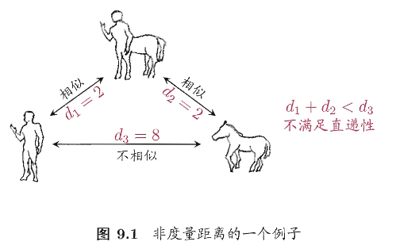
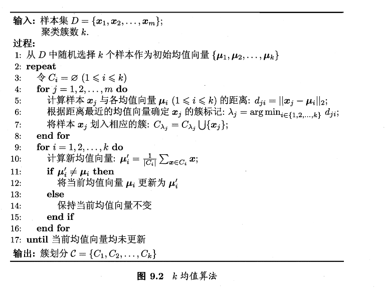
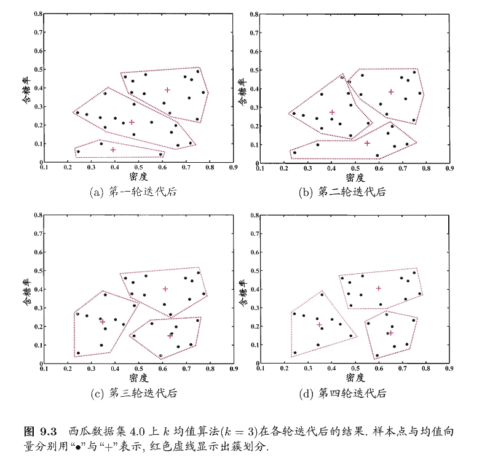
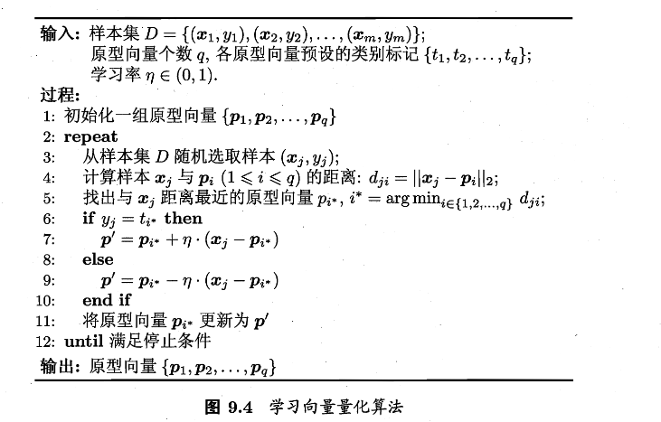
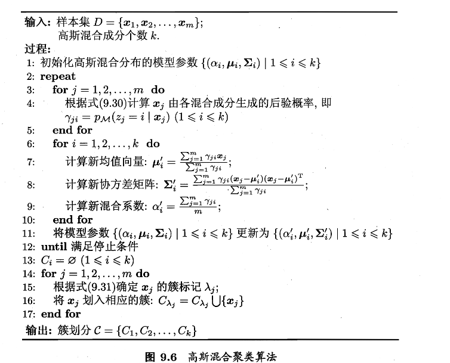
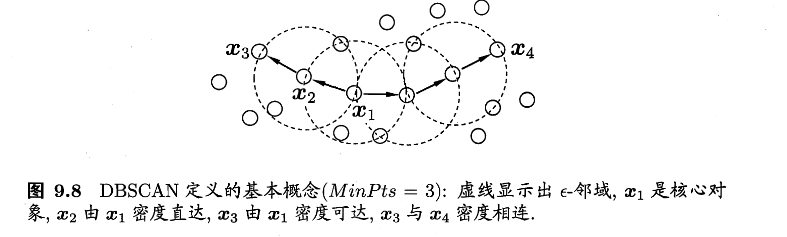
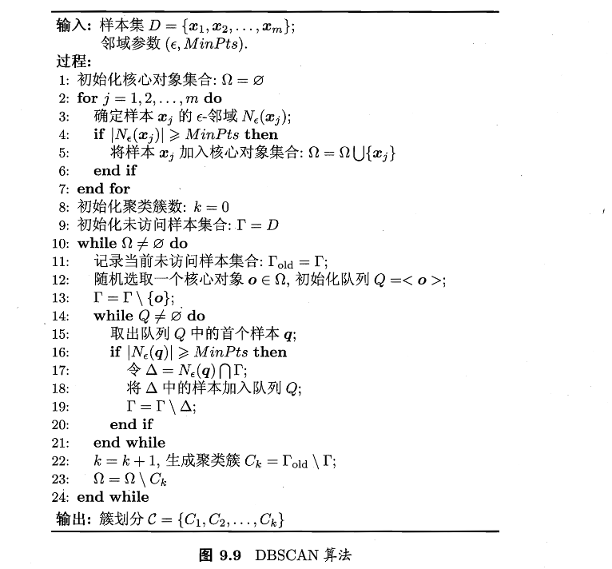
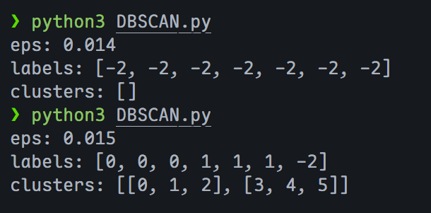
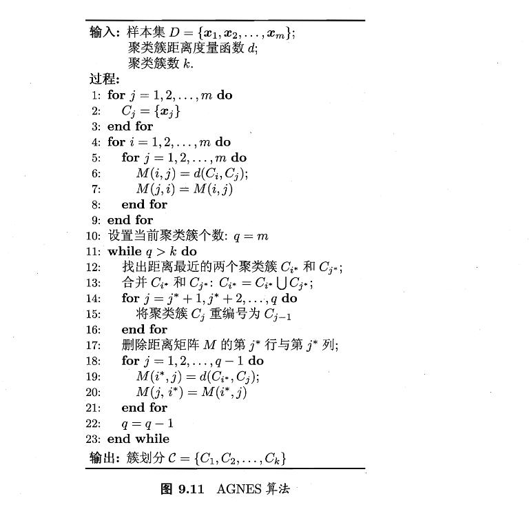

# 第九章 聚类

聚类是无监督学习中的一类方法，具体是指：把一堆“没有标签”的数据，按相似性自动分成若干组/簇。同一组/簇里的样本彼此相似，不同组/簇之间的差异更大


### 性能度量

> 首先介绍聚类算法涉及的性能度量方案。

聚类性能度量也成为聚类“有效性指标”，用于评估聚类结果的好坏；如果已经明确最终要使用的度量，也可以将其直接作为聚类过程的优化目标

好的聚类直观上应“物以类聚”：簇内相似度高、簇间相似度低。于是可以大致划分出两类性能：

1. **外部指标**：将聚类结果与某个“参考模型”比较
2. **内部指标**：不借助参考模型，直接考察聚类结果本身

---

外部指标：基于样本对的一致/不一致计数

给定数据集 $D=\{x_1,x_2,\dots,x_m\}$ 假定通过聚类给出的簇划分为 $\mathcal{C}=\{C_1,C_2,\dots,C_m\}$，而参考模型给出的簇划分为 $\mathcal{C}^*=\{C_1^*,C_2^*,\dots,C_m^*\}$。令 $\lambda$ 表示 $\mathcal{C}$ 的簇标记向量；$\lambda^*$ 表示 $\mathcal{C}^*$ 对应的簇标记向量。

我们将样本两两配对 (仅取 $i<j$)，可以定义四类样本对集合及其大小：

$$
\begin{align}
&a=|SS|,SS=\{(x_i,x_j)\mid\lambda_i=\lambda_j,\lambda_i^*=\lambda_j^*,i<j\}\tag{9.1}
\\
&b=|SD|,SD=\{(x_i,x_j)\mid\lambda_i=\lambda_j,\lambda_i^*\ne\lambda_j^*,i<j\}\tag{9.2}
\\
&c=|DS|,DS=\{(x_i,x_j)\mid\lambda_i\ne\lambda_j,\lambda_i^*=\lambda_j^*,i<j\}\tag{9.3}
\\
&d=|DD|,DD=\{(x_i,x_j)\mid\lambda_i\ne\lambda_j,\lambda_i^*\ne\lambda_j^*,i<j\}\tag{9.4}
\end{align}
$$

由于每个样本对 $(x_i,x_j)$ 只能落在四类之一，所以有 $a+b+c+d=\dfrac{m(m-1)}{2}$ 成立

接下来我们根据式(9.1)-(9.4)可以得到常用的外部指标，很好理解

**Jaccard系数（JC）**

$$
\text{JC}=\dfrac{a}{a+b+c}\tag{9.5}
$$

**FM指数**

$$
\text{FMI}=\sqrt{
\dfrac{a}{a+b}
\cdot
\dfrac{a}{a+c}
}
\tag{9.6}
$$

**Rand指数**

$$
\text{RI}=\dfrac{2(a+d)}{m(m-1)}\tag{9.7}
$$

> 上述外部指标的取值都在 $[0,1]$ ，越大越好

---

内部指标：基于簇内紧凑与簇间分离

考虑聚类划分 $\mathcal{C}=\{C_1,C_2,\dots,C_k\}$，我们定义

**簇 $C$ 的簇内平均距离**

$$
\text{avg{(C)}}=\dfrac{2}{|C|(|C|-1)}
\sum_{1\le i\le j\le|C|}\text{dist}(x_i,x_j)
\tag{9.8}
$$

> $\text{dist}(\cdot,\cdot)$ 表示两个样本之间的距离

**簇 $C$ 的簇内直径(最大距离)**

$$
\text{diam}(C)=\max_{1\le i\le j\le|C|}\text{dist}(x_i,x_j)\tag{9.9}
$$

**两簇样本最近样本距离**

$$
d_{min}(C_i,C_j)=\min_{x_i\in C_i,x_j\in C_j}\text{dist}(x_i,x_j)\tag{9.10}
$$

**两簇中心点距离**

$$
d_{cen}(C_i,C_j)=\text{dist}(\mu_i,\mu_j)\tag{9.11}
$$

> $\mu$ 表示簇 $C$ 的中心点（均值向量）为 $\mu=\dfrac{1}{|C|}\sum_{1\le i\le|C|}x_i$

接下来基于式 (9.8)-(9.11)，可以得到常用内部指标如下：

**DB指数**

$$
\begin{equation}
\mathrm{DBI}
=
\frac{1}{k}
\sum_{i=1}^{k}
\max_{j \ne i}
\left(
\frac{
\operatorname{avg}(C_i) + \operatorname{avg}(C_j)
}{
d_{\mathrm{cen}}(\mu_i, \mu_j)
}
\right).
\tag{9.12}
\end{equation}
$$

> 对每个簇 $i$，去找一个最糟糕的邻居簇，使得 $\dfrac{两簇的簇内样本到簇中心平均距离}{两簇中心距离}$ 最大；最后求平均
>
> 可见DBI越小，簇内越紧凑、簇间越分离

**Dunn指数**

$$
\begin{equation}
\mathrm{DI}
=
\min_{1 \le i \le k}
\left\{
\min_{j \ne i}
\left(
\frac{
d_{\min}(C_i, C_j)
}{
\max_{1 \le l \le k} \operatorname{diam}(C_l)
}
\right)
\right\}.
\tag{9.13}
\end{equation}
$$

> 分子：簇间最小距离，即最近的两簇之间最接近的有多近
>
> 分母：最大簇直径，即最松散的簇有多散
>
> 接下来再取全局最小，即只要存在一对簇特别近，或存在一个簇特别散，指标就会被拉低。可见DI越大，效果越好


### 距离计算

刚刚引入了一个函数 $\text{dist}(\cdot,\cdot)$ 表示两样本之间的距离，但是我们并没有解决这个函数的计算，接下来就是关于这个函数的推导

Note

函数 $\text{dist}(\cdot,\cdot)$ 应当满足以下基本性质

$$
\begin{align}
&\text{dist}(x_i,x_j)\ge0\tag{9.14非负性}\\
&\text{dist}(x_i,x_j)=0\text{当且仅当}x_i=x_j\tag{9.15同一性}\\
&\text{dist}(x_i,x_j)=\text{dist}(x_j,x_i)\tag{9.16对称性}\\
&\text{dist}(x_i,x_j)\le\text{dist}(x_i,x_k)+\text{dist}(x_k,x_j)\tag{9.17直递性}
\end{align}
$$

给定样本 $\boldsymbol{x_i}=(x_{i1};x_{i2};\dots;x_{in})$ ,$\boldsymbol{x_j}=(x_{j1};x_{j2};\dots;x_{jn})$

比较常用的是 **闵可夫斯基距离**

$$
\begin{equation}
\mathrm{dist}_{\mathrm{mk}}(x_i, x_j)
=
\left(
\sum_{u=1}^{n}
\left| x_{iu} - x_{ju} \right|^{p}
\right)^{\frac{1}{p}}.
\tag{9.18}
\end{equation}
$$

当 $p=2$ 时，可以得到 **欧氏距离**

$$
\begin{equation}
\mathrm{dist}_{\mathrm{ed}}(x_i, x_j)
=
\|x_i - x_j\|_2
=
\sqrt{
\sum_{u=1}^{n}
\left|x_{iu} - x_{ju}\right|^2
}.
\tag{9.19}
\end{equation}
$$

当 $p=1$ 时，可以得到 **曼哈顿距离**

$$
\begin{equation}
\mathrm{dist}_{\mathrm{man}}(x_i, x_j)
=
\|x_i - x_j\|_1
=
\sum_{u=1}^{n}
\left|x_{iu} - x_{ju}\right|.
\tag{9.20}
\end{equation}
$$

---

属性类型与距离

属性又一般分为连续属性和离散属性。前者在定义域上有无穷多个可能的取值，后者在定义域上取值有限。

很明显，连续属性可以简单的计算出距离；

而定义域为{1，2，3}这种的离散属性相对能直接计算属性值的距离，这种属性称为有序属性

但定义域为 $\{飞机，火车，轮船\}$，不太适合直接计算属性值的距离，这种属性称为无序属性

---

VDM

明显可知，闵可夫斯基距离只能适用于连续属性和有序属性。那么如何评估无序属性的距离呢，书中介绍了 VDM 方法，如下：

设：

- $m_{u,a}$ 表示在属性 $u$ 上取值为 $a$ 的样本数，
- $m_{u,a,i}$ 表示在第 $i$ 个样本簇中在属性 $u$ 上取值为 $a$ 的样本数，
- $k$ 为样本簇数

则属性 $u$ 上有两个离散值 $a$ 与 $b$ 之间的VDM距离为

$$
VDM_p(a,b)=\sum_{i=1}^k\left|\dfrac{m_{u,a,i}}{m_{u,a}}-\dfrac{m_{u,b,i}}{m_{u,b}}\right|^p\tag{9.21}
$$

> 意味着比较两个取值在各类别中的分布差异

---

多种距离变种

**混合属性距离**

于是我们可以将闵可夫斯基距离和VDM结合，处理混合属性。如下假定我们有

- $n_c$ 个有序属性
- $n-n_c$ 个无序属性

$$
\text{MinkovDM}_p(x_i,x_j)=
\left(
\sum_{u=1}^{n_c}
\left|
x_{iu}-x_{ju}
\right|^p
+
\sum_{u=1+n_c}^{n}
\text{VDM}_p(x_{iu},x_{ju})
\right)^{\dfrac{1}{p}}
\tag{9.22}
$$

**加权距离**

当属性的重要性不同的时候，我们可以为每个距离加上一定的权重

$$
\text{dist}_\text{wmk}=(w_1\cdot|x_{i1}-x_{j1}|^p+\dots w_n\cdot|x_{in}-x_{jn}|^p)^\dfrac{1}{p}
\tag{9.23}
$$

---

距离与相似

一般来说，属性之间距离越大，相似度就越小。但是用于相似度度量的距离未必一定满足距离度量的基本性质，尤其是式(9.17)直递性，如下例子



人与人马相似，马与人马相似，但是人与人马完全不相似；这样的距离称为“非度量距离”

此外，本节的距离计算式都是事先定义好的，但是不少的现实任务中，有必要基于数据样本来确定合适的距离计算式，于是有 **“距离度量学习”** 来实现这一步骤


### 原型聚类

用一组“原型”去刻画簇结构。其本质为：**把样本分组，让组内相似、组间不同**。其核心假设是：每个簇可以用一个（或几个）代表物来概括，这个代表物就叫做原型。

按照原型的表示方法，书中介绍了三种代表方法：

- 一个向量（例如簇均值）$\rightarrow$ k-means
- 一个带类别标签的向量 $\rightarrow$ LVQ
- 一套概率模型参数(均值/协方差/混合权重) $\rightarrow$ GMM

这样的话就把“找簇”变为了“找原型”，同时也将很多聚类算法统一为一种哲学：**初始化原型 $\rightarrow$ 反复：用原型解释数据、再用数据修正原型 $\rightarrow$ 直到不再变化**、

---

k-means

在k均值算法中，我们希望每个簇内部点都围着某个中心转，而且越紧凑越好。用数学语言表述如下

给定样本集 $D=\{x_1,x_2,\dots,x_m\}$ ,”k-均值“ 算法针对聚类所得簇划分 $\mathcal{C}=\{C_1,C_2,\dots,C_k\}$ ，$\mu_i=\dfrac{1}{|C_i|}\sum_{x\in C_i}x$ 表示簇 $C_i$ 的均值向量，于是有

$$
E=\sum_{i=1}^{k}\sum_{x\in C_i}||x-\mu_i||^2_2\tag{9.24}
$$

> 这个公式有两层：
>
> - 内层：一个簇里面每个点到中心的距离的平方
> - 外层：把所有簇的这种“离散程度“加起来

不过式(9.24)中有两个变量需要确定：

1. 每个点属于哪个簇（离散的组合问题）
2. 每个簇中心在哪（连续变量）

想要找到它的最优解需要考察样本集 $D$ 所有可能的簇划分，属于NP难问题。于是k-means采用了贪心的思路，如下

贪心迭代

k-means的经典思路为：把难问题拆成两步简单问题，交替做：

- 分配步（固定中心，优化划分）：每个点去离它最近的 $\mu_i$
- 更新步（固定划分，优化中心）：每个簇的最优中心就是均值

将这两步轮流操作，每次只优化一部分变量，直到目标停在一个局部最优/稳定点，如下算法



书中给出了一个训练过程图，如下



---

LVQ

k-means是无监督的，它不关心标签的好坏，只在意几何上的紧凑与否。这样可能导致分类出现错误，于是提出了LVQ想法，如下

**仍然用原型向量代表区域，但更新原型时利用标签**

- 若为同类：把原型拉向样本（强化这类的代表）
- 若为异类：把原型推离样本（避免混淆）

数学语言表达如下：给定样本 $D = \{(x_1, y_1), (x_2, y_2), \ldots, (x_m, y_m)\}$，每个样本 $x_j$ 是由 $n$ 个属性描述的特征向量 $(x_{j1}; x_{j2}; \ldots; x_{jn}),y_j \in \mathcal{Y}$ 是样本 $x_j$ 的类别标记。LVQ的目标是学得一组 $n$ 维原型向量 $\{p_1, p_2, \ldots, p_q\}$，每个原型向量代表一个聚类簇，簇标记 $t_i \in \mathcal{Y}$

$$
p'=p_{i^*}+\eta\cdot(x_j-p_{i^*})\tag{9.25同类相近}
$$

> 实际上就是向样本的方向走一段距离，由 $\eta$ 控制走多远

$$
||p'-x_j||_2=(1-\eta)||p_{i^*}-x_j||_2\tag{9.26}
$$

> 由于 $0<\eta<1$ ,所以 $1-\eta<1$，更新后距离缩小。这意味着同类样本会将原型吸引过来
>
> 同理，遇到异类情况，距离按照 $1+\eta$ 放大，让原型离开这类样本

算法：一次只看一个样本的在线学习

每轮：

1. 随机抽一个样本 $(x_i,y_i)$
2. 找到离它最近的原型 $p_i$
3. 如果 $y_i=t_{i^*}$ (标签一致）就靠近，否则远离



我们得到输出的原型向量后，就可以做一种”最近原型分类/聚类“，因为此时任意点 $x$ 都归到最近的原型对应的簇中。

这会将空间切成很多最近点区域，称之为 Voronoi 区域，数学表达如下

$$
R_i=\{
x\in X
\mid
||x-p_i||_2
\le
||x-p_{i'}||_2,
i'\ne i
\}
\tag{9.27}
$$

> 区域 $R_i$ 里的点到 $p_i$ 的距离不大于到任何其它原型的距离。如下图所示，每个颜色中的点都离他所属颜色的黑点最近
>
> 

---

GMM

继续回到k-means，它隐含了一个假设：簇大致是凸/球形的，用均值代表。

但现实中，可能有这些问题：簇的不同方向方差可能不同；簇之间可能会重叠；你不希望把点直接划分给某个簇，而是想要属于某簇的概率。

这时就映入了概率生成模型：**高斯混合模型**

单高斯分布

对 $n$ 维样本空间 $\mathcal{X}$ 中的随机向量 $x$，若 $x$ 服从高斯分布，$\mu$ 是 $n$ 维均值向量，$\sum$ 是 $n\times n$ 的协方差矩阵（形状与方向），其 **概率密度函数** 为

$$
p(x)=\dfrac{1}{
(2\pi)^{\dfrac{n}{2}}
|\Sigma_i|^{\dfrac{1}{2}}
}
\exp\left({
-\dfrac{1}{2}(x-\mu)^T
\Sigma_i^{-1}(x-\mu)
}
\right)
\tag{9.28}
$$

接下来，我们 **计算混合分布**：

取 $\alpha_i$ 为混合系数，它满足 $\alpha_i>0,\sum_i{\alpha_i}=1$。对于高斯分布 $x_i\sim N(\mu_i,\Sigma_i)$ ，我们先按 $\alpha$ 选一个成分 $i$ ,再从高斯分布 $N(\mu_i,\Sigma_i)$ 中采样出来 $x$ ，可以得到 **高斯混合分布** 为

$$
p\_{\mathcal{M}}(x)=\sum\_{i=1}^{k}\alpha\_i\cdot p(x\mid\mu\_i,\Sigma\_i)
\tag{9.29}
$$

于是我们可以来 **计算后验概率**，即这个点来自哪个成分的概率：

引入隐变量 $z_j$ 表示第 $j$ 个样本来自哪个成分，给定 $x_j$ ，它属于第 $i$ 个成分的后验概率如下式，记作 $\gamma_{ji}$

$$
\begin{align}
p_\mathcal{M}(z_j=i\mid x_j)&=\dfrac{
P(z_j=i)\cdot p_{\mathcal{M}(x_j\mid z_j=i)}
}{
p_{\mathcal{M}}(x_j)
}\\
&=\dfrac{
\alpha_i\cdot p(x_j\mid\mu_i,\Sigma_i)
}{
\sum_{l=1}^k\alpha_lp(x_j\mid\mu_l,\Sigma_l)
}
\end{align}
\tag{9.30}
$$

> 分子：该成分的先验概率 \* 在该成分下生成这个点的可能性
>
> 分母：对所有成分做归一化

接下来进一步扩展，我们加入簇标签：

当高斯混合分布(9.29)已知，高斯混合聚类把样本集 $D$ 划分成 $k$ 个簇 $\mathcal{C}=\{C_1,C_2,\dots,C_k\}$ ，每个样本 $x_j$ 的簇标记 $\lambda_i$ 按照下式确定：

$$
\lambda\_j=\arg\max\_{i\in{1,2,\dots,k}}\gamma\_{ji}\tag{9.31}
$$

计算

我们完成了一系列定义内容，接下来就是计算了，给定数据集 $D$ ，模型参数是 $\{(\alpha_i,\mu_i,\Sigma_i)\}$。我们希望“模型最能解释数据”，也就是最大化似然（等价最大化对数似然）

$$
\begin{align}
LL(D)
&= \ln \left( \prod\_{j=1}^{m} p\_{\mathcal{M}}(x\_j) \right) \
&= \sum\_{j=1}^{m} \ln \left( \sum\_{i=1}^{k} \alpha\_i \cdot p(x\_j \mid \mu\_i, \Sigma\_i) \right),
\tag{9.32}
\end{align}
$$

采用7.6中介绍的 EM 算法(E+M交替计算，迭代出优化值)，详细过程如下：

若参数 $\{(\alpha_i,\mu_i,\Sigma_i)\mid1\le i\le k\}$ 可以使式(9.32)最大化，则由 $\dfrac{\partial LL(D)}{\partial\mu_i}=0$ 有

$$
\sum\_{j=1}^{m}
\frac{
\alpha\_i \, p(x\_j \mid \mu\_i, \Sigma\_i)
}{
\sum\_{l=1}^{k} \alpha\_l \, p(x\_j \mid \mu\_l, \Sigma\_l)
}
(x\_j - \mu\_i)
= 0
\tag{9.33}
$$

接下来把 $\gamma_{ji}$ (9.30)带入进来，得到有

$$
\mu\_i
=
\frac{
\sum\_{j=1}^{m} \gamma\_{ji} x\_j
}{
\sum\_{j=1}^{m} \gamma\_{ji}
}\tag{9.34}
$$

> 每个点按“属于成分i的概率”当权重求平均，比较更柔和一些

同样的，对于协方差，我们让 $\dfrac{\partial LL(D)}{\partial \Sigma_i}=0$ 可得

$$
\Sigma\_i = \frac{\sum\_{j=1}^{m} \gamma\_{ji} (x\_j - \mu\_i)(x\_j - \mu\_i)^{\mathrm T}}{\sum\_{j=1}^{m} \gamma\_{ji}} \tag{9.35}
$$

> 也就是责任度加权的“离均值散布程度”

而对于混合系数 $\alpha_i$ ，除了要最大化 $LL(D)$ ，我们还需要满足一些条件：$\alpha_i\ge0,\sum_{i=1}^{k}\alpha_i=1$。于是引入拉格朗日：

$$
LL(D)+\lambda\left(\sum\_{i=1}^k\alpha\_i-1\right)\tag{9.36}
$$

接下来对 $\alpha_i$ 求导，得到条件如下

$$
\sum\_{j=1}^{m} \frac{p(x\_j \mid \mu\_i, \Sigma\_i)}{\sum\_{l=1}^{k} \alpha\_l\, p(x\_j \mid \mu\_l, \Sigma\_l)} + \lambda = 0\tag{9.37}
$$

整理后可以得到一个很优雅的式子

$$
\alpha\_i=\dfrac{1}{m}\sum\_{j=1}^{m}\gamma\_{ji}\tag{9.38}
$$

> 即成分 $i$ 的权重就是它对所有点“平均负责多少”




### 密度聚类

接下来是密度聚类，它提出的观点是：**簇不是围绕某个中心的一团，而是高密度区域**

因此它从“样本分布的稠密程度”出发，通过样本之间的可达/连通关系逐步扩展簇，最终得到聚类结果；同时将稀疏区域当作噪声/离群点。

书中主要介绍了 DBSCAN 这一密度聚类算法，它用一组 “邻域” 参数 $(\epsilon,MinPts)$ 来刻画”密度足够高“的区域

---

基础概念

- **$\epsilon-$ 邻域**：对任意样本 $x_j$,它的 $\epsilon-$ 邻域为

$$
N_{\epsilon}(x_j)=\{x_i\in D\mid \text{dist}(x_i,x_j)\le\epsilon\}
$$

> 距离 $x_j$ 不超过 $\epsilon$ 的所有点集合

- **核心对象**：如果 $x_j$ 的邻域中至少有 $MinPts$ 个样本，即 $|N_{\epsilon(x_j)}|\ge MinPts$，那么称 $x_j$ 为核心对象

> 以 $x_j$ 为中心的局部区域足够稠密，可以作为簇扩展的起点

- **密度直达**：若 $x_j\in N_\epsilon(x_i)$ 并且 $x_i$ 是核心对象，则称 $x_j$ 由 $x_i$ 密度直达。

> 这个定义有方向性，要求出发点 $x_i$ 必须是核心对象

- **密度可达**：若存在样本序列 $p_1,p_2,\dots,p_n$ 使得：$p_1=x_i,p_n=x_j$ 且 $p_{(t+1)}$ 由 $p_t$ 密度直达。那么称 $x_j$ 由 $x_i$ 密度可达

> 也就是说，从 $x_i$ 出发，沿着核心点能扩展到的邻域一步步走，能走到 $x_j$

- **密度相连**：若存在某个 $x_k$ ,使得 $x_i$ 与 $x_j$ 都由 $x_k$ 密度可达，则称 $x_i$ 与 $x_j$ 密度相连

> 即：两个点可能不是相互可达，但如果能从同一个密度源头扩展到它们，它们就属于同一片高密度连通区域

如下图所示，虚线圈是 $\epsilon-$邻域，核心对象能“带动”扩展，密度可达是链式传播，密度相连是“共同源头”。



对簇进行形式化定义

DBSCAN 通过刚刚介绍的“可达/相连”关系把簇定义出来。有一些性质如下：

给定邻域参数 $(\epsilon,MinPts)$ ，簇 $C\subseteq D$ 是满足以下性质的非空样本子集

$$
连接性：x\_i\in C,x\_j\in C\Rightarrow x\_i与x\_j密度相连\tag{9.39}
$$

> 簇内任意两点都密度相连。它保证“簇内部是一整块连通的高密度区域”

$$
最大性：x_i\in C,x_j 由 x_i 密度可达\Rightarrow x_j \in C\tag{9.40}
$$

> 如果 $x_i$ 能走到 $x_j$ ，那么 $x_j$ 要属于 $x_i$ 所在的簇。它保证“只要还能密度扩展，就不能停”，否则簇就不是最大块

---

计算

算法思想：先找所有核心对象，再用核心对象当种子做“密度可达”的广度扩展（BFS）




```

from

collections

import

deque

from

typing

import

List
,

Callable
,

Tuple
,

Optional

def

euclidean
(
a
:

List
[
float
],
b
:

List
[
float
])
->
float
:


"""欧式距离，sqrt(sum((a_i-b_i)^2))"""


s

=

0.0


for

a_i
,

b_i

in

zip
(
a
,

b
):


d

=

a_i

-

b_i


s

+=

d

*

d


return

s

**

0.5

def

dbscan
(


X
:

List
[
List
[
float
]],


# 样本列表，长度n，每个样本都是d维向量


eps
:

float
,


# 邻域半径


min_pts
:

int
,

#MinPts


dist
:

Optional
[
Callable
[[
List
[
float
],

List
[
float
]],

float
]]

=

None


# 欧氏距离函数

)

->

Tuple
[
List
[
int
],

List
[
List
[
int
]]]:


"""

    输出:

        labels: 长度n的簇标签,-1表示噪声

        clusters: 簇中点的索引列表（每个簇一个索引数组）

    """


if

dist

is

None
:


dist

=

euclidean


n

=

len
(
X
)


if

n

==

0
:


return

[],

[]


#======Step1:预计算ε-邻域 N_eps(xj)，2-7行=====


neighbors
:

List
[
List
[
int
]]

=

[[]

for

_

in

range
(
n
)]


for

i

in

range
(
n
):


x_i

=

X
[
i
]


for

j

in

range
(
n
):


# dist(x_i,x_j) <= eps ==> j 在 i 的邻域内


if

(
dist
(
x_i
,

X
[
j
]))

<=

eps
:


neighbors
[
i
]
.
append
(
j
)


#========Step2:找核心对象集合 Ω=====


core

=

[
False
]

*

n


core_set

=

set
()


for

i

in

range
(
n
):


if

len
(
neighbors
[
i
])

>=

min_pts
:


core
[
i
]

=

True


core_set
.
add
(
i
)


#=======Step3:初始化========


UNVISITED

=

-
2


# 尚未访问


NOISE

=

-
1


# 噪声


labels

=

[
UNVISITED
]

*

n


clusters
:

List
[
List
[
int
]]

=

[]


# 外层：while Ω != ∅：每次从 Ω 取一个核心对象当种子，生成一个簇


cluster_id

=

0


while

core_set
:


# 选一个核心对象当seed


seed

=

next
(
iter
(
core_set
))


# r_old记录本轮生成簇之前未访问的集合


queue

=

deque
([
seed
])


# 把 seed 先放进当前簇


labels
[
seed
]

=

cluster_id


current_cluster

=

[
seed
]


# BFS扩展


while

queue
:


q

=

queue
.
popleft
()


# 只有核心对象才会扩展邻域


if

core
[
q
]:


# Δ = N_eps(q) ∩ Γ ：q 的邻域里尚未访问的点


for

p

in

neighbors
[
q
]:


if

labels
[
p
]

==

UNVISITED
:


# 标记p归入当前簇，并加入队列继续扩展


labels
[
p
]

=

cluster_id


current_cluster
.
append
(
p
)


queue
.
append
(
p
)


elif

labels
[
p
]

==

NOISE
:


labels
[
p
]

=

cluster_id


current_cluster
.
append
(
p
)


# 一个簇扩展完成:记录簇


clusters
.
append
(
current_cluster
)


# 从 Ω 去掉已经归入该簇的核心对象（图 9.9 第 23 行 Ω = Ω \ Ck）


for

idx

in

current_cluster
:


if

idx

in

core_set
:


core_set
.
remove
(
idx
)


cluster_id

+=

1


#=====Step4:剩余未访问的标记为噪声====


for

i

in

range
(
n
):


if

labels
[
i
]

==

UNVISITED
:


labels
[
i
]

==

NOISE


return

labels
,
clusters


# demo演示

if

__name__

==

"__main__"
:


X

=

[


[
0.40
,

0.23
],

[
0.41
,

0.24
],

[
0.39
,

0.22
],


[
0.75
,

0.45
],

[
0.76
,

0.46
],

[
0.74
,

0.44
],


[
0.20
,

0.10
]


]


eps

=

0.03


min_pts

=

3


labels
,
clusters
=
dbscan
(
X
,
eps
,
min_pts
)


print
(
"eps:"
,
eps
)


print
(
"labels:"
,
labels
)


print
(
"clusters:"
,
clusters
)

```




### 层次聚类

层次聚类想要得到的是一种“树形”的聚类结构(从细到粗或从粗到细)，而不是一次性给出一个固定的划分。有两种划分路线，书中主要介绍了自底向上路线AGNES

1. **自底向上（凝聚/聚合）**：从每个样本格子成簇开始，不断合并最近的两簇，直到剩下目标簇数
2. **自顶向下（分裂）**：从所有样本一个簇开始，不断拆分

---

簇间距离的定义

由于每个簇 $C_i$ 本质上是一个样本集合，所以簇间距离就是集合到集合的距离。常见三种定义：

**最小距离**：由两簇中最近的两个样本决定：

$$
d_{min}(C_i,C_j)=\min_{x\in C_i,z\in C_j}\text{dist}(x,z)\tag{9.41}
$$

**最大距离**：由两簇中最远的两个样本决定：

$$
d_{max}(C_i,C_j)=\min_{x\in C_i,z\in C_j}\text{dist}(x,z)\tag{9.42}
$$

**平均距离**：考虑两簇之间所有成对样本的平均距离

$$
d_{avg}(C_i,C_j)=\dfrac{1}{|C_i||C_j|}\sum_{x\in C_i}\sum_{z\in C_j}\text{dist}(x,z)\tag{9.43}
$$

---

算法




```

from

typing

import

List
,

Callable
,

Tuple
,

Literal
,

Optional

import

math

Linkage

=

Literal
[
"single"
,

"complete"
,

"average"
]

def

euclidean
(
a
:

List
[
float
],

b
:

List
[
float
])

->

float
:


"""欧式距离"""


s

=

0.0


for

a_i
,

b_i

in

zip
(
a
,

b
):


d

=

a_i

-

b_i


s

+=

d

*

d


return

math
.
sqrt
(
s
)

def

agnes
(


X
:

List
[
List
[
float
]],


# 样本列表，n个样本，每个是d维向量


k
:

int
,


# 目标簇数


linkage
:

Linkage

=

"complete"
,


dist
:

Optional
[
Callable
[[
List
[
float
],

List
[
float
]],

float
]]

=

None
,

)

->

Tuple
[
List
[
List
[
int
]],

List
[
Tuple
[
int
,

int
,

float
,

int
]]]:


if

dist

is

None
:


dist

=

euclidean


n

=

len
(
X
)


if

not

(
1

<=

k

<=

n
):


raise

ValueError
(
f
"k must be in [1,
{
n
}
],got
{
k
}
"
)


# ========Step1:初始化，每个样本一个簇=====


# clusters:当前活跃簇


clusters
:

List
[
List
[
int
]]

=

[[
i
]

for

i

in

range
(
n
)]


# 为了记录合并历史，给每个簇一个稳定ID


active_ids
:

List
[
int
]

=

list
(
range
(
n
))


next_cluster_id

=

n


# =======Step2:预计算点间距离矩阵=======


# pdist[i][j] = dist(X[i],X[j])


pdist

=

[[
0.0
]

*

n

for

_

in

range
(
n
)]


for

i

in

range
(
n
):


for

j

in

range
(
i

+

1
,

n
):


d

=

dist
(
X
[
i
],

X
[
j
])


pdist
[
i
][
j
]

=

d


pdist
[
j
][
i
]

=

d


# =======Step3: 定义簇间距离d(C_i,C_j)


def

clusters_distance
(
ci
:

List
[
int
],

cj
:

List
[
int
])

->

float
:


"""

        计算簇c_i与簇c_j的距离

        """


if

linkage

==

"single"
:


best

=

float
(
"inf"
)


for

x

in

ci
:


row

=

pdist
[
x
]


for

z

in

cj
:


if

row
[
z
]

<

best
:


best

=

row
[
z
]


return

best


if

linkage

==

"complete"
:


best

=

0.0


for

x

in

ci
:


row

=

pdist
[
x
]


for

z

in

cj
:


if

row
[
z
]

>

best
:


best

=

row
[
z
]


return

best


if

linkage

==

"average"
:


s

=

0.0


for

x

in

ci
:


row

=

pdist
[
x
]


for

z

in

cj
:


s

+=

row
[
z
]


return

s

/

(
len
(
ci
)

*

len
(
cj
))


raise

ValueError
(
f
"Unknow linkage:
{
linkage
}
"
)


# -------Step4:初始化簇间距离矩阵-----


q

=

n


# 当前簇数


M

=

[[
float
(
"inf"
)]

*

q

for

_

in

range
(
q
)]


for

i

in

range
(
q
):


for

j

in

range
(
i

+

1
,

q
):


d

=

clusters_distance
(
clusters
[
i
],

clusters
[
j
])


M
[
i
][
j
]

=

d


M
[
j
][
i
]

=

d


merges
:

List
[
Tuple
[
int
,

int
,

float
,

int
]]

=

[]


# =======Step5:主循环，反复合并最近两簇========


while

q

>

k
:


# (a) 找距离最近的一对簇 (i*, j*)


best

=

float
(
"inf"
)


i_star

=

-
1


j_star

=

-
1


for

i

in

range
(
q
):


for

j

in

range
(
i

+

1
,

q
):


if

M
[
i
][
j
]

<

best
:


best

=

M
[
i
][
j
]


i_star
,

j_star

=

i
,

j


# (b) 记录合并历史（用于树状图）


id_a

=

active_ids
[
i_star
]


id_b

=

active_ids
[
j_star
]


new_size

=

len
(
clusters
[
i_star
])

+

len
(
clusters
[
j_star
])


merges
.
append
((
id_a
,

id_b
,

best
,

new_size
))


# (c) 合并簇：Ci* = Ci* ∪ Cj*


clusters
[
i_star
]
.
extend
(
clusters
[
j_star
])


# 合并后簇的ID 更新为新的内部节点ID


active_ids
[
i_star
]

=

next_cluster_id


next_cluster_id

+=

1


# (d) 删除簇 j_star（对应图 9.11 删除矩阵第 j* 行列）


clusters
.
pop
(
j_star
)


active_ids
.
pop
(
j_star
)


# 同步删除距离矩阵 M 的第 j_star 行与列


M
.
pop
(
j_star
)


for

row

in

M
:


row
.
pop
(
j_star
)


q

-=

1


# 当前簇数减少 1


# (e) 更新：重新计算合并后簇 i_star 与其他簇的距离


for

j

in

range
(
q
):


if

j

==

i_star
:


M
[
i_star
][
j
]

=

float
(
"inf"
)


else
:


d

=

clusters_distance
(
clusters
[
i_star
],

clusters
[
j
])


M
[
i_star
][
j
]

=

d


M
[
j
][
i_star
]

=

d


# 输出最终簇划分（样本索引列表） + 合并历史


return

clusters
,

merges


# ------------------- 小示例 -------------------

if

__name__

==

"__main__"
:


X

=

[


[
0.40
,

0.23
],


[
0.41
,

0.24
],


[
0.39
,

0.22
],


# 一团


[
0.75
,

0.45
],


[
0.76
,

0.46
],


[
0.74
,

0.44
],


# 另一团


[
0.20
,

0.10
],


# 远点


]


clusters
,

merges

=

agnes
(
X
,

k
=
2
,

linkage
=
"complete"
)


print
(
"clusters:"
,

clusters
)


print
(
"merges (first 5):"
,

merges
[:
5
])

```
