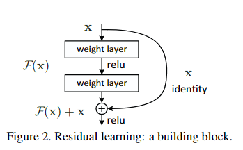
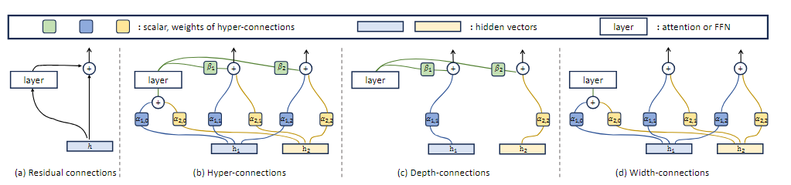
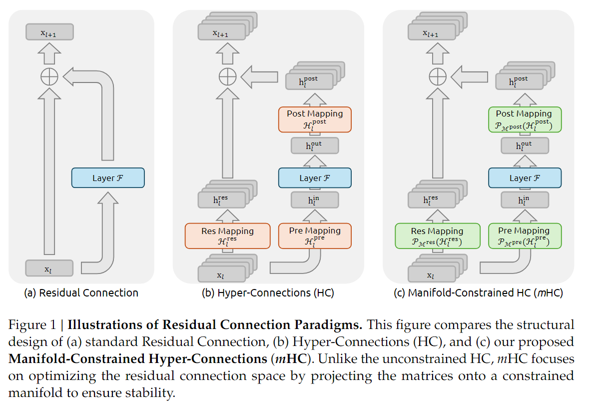

# 从 DNN 到 mHC

> 前一段时间 DeepSeek 发布了 mHC 架构，这边了解了一下，做一个阅读记录

想理解 mHC 就要先知道 HC(Hyper-Connections)；而想理解 HC，要先知道 Residuals(残差)；理解 Residuals，得先知道 DNN(深度神经元网络)，这些内容以后可能会单独写一些阅读记录，不过今天就速过一下


## 前置知识


### DNN

这个内容在 ML 学习记录的神经网络章节中有简单提及。

核心就是通过多层神经元进行信息传递和转换，每个神经元接受来自前一层神经元的输入，应用权重和偏置，然后通过激活函数输出结果，这些结果作为下一层神经元的输入。

> 简单来说，DNN 由很多层构成，每一层都表示为一个函数，如下图所示
>
> 

我们规定：

- 输入为 $x\in\mathbb{R}^d$；目标输出为 $y$；预期函数为 $y=F(x)$
- DNN 的目的是构造出来一个近似函数 $\hat{y}=G(x;\mathcal{W})$，其中 $\mathcal{W}$ 为所有可学习的参数，$G(\cdot)$ 由多层复合构成

令 $x_l$ 表示第 $l$ 层的中间表示（隐藏变量）；$f_l$ 表示第 $l$ 层的非线性映射；$\mathcal{W}$ 表示第 $l$ 层的参数。那么一个 $L$ 层的 DNN 可以写为

$$
\begin{align}
x_0&=x\\
x_{l+1}&=f_{l}(x_l;\mathcal{W}_l)\\
\hat y&=x_L
\end{align}
$$

**但是** 每一层都在试图重新构造 $x_{l+1}=f_{l}(x_l)$。这会导致效率低下，原因如下：

- 如果 $f_l$ 没有学好，信息会被覆盖
- 深度增加的时候，梯度容易消失或者爆炸
- 每层都必须学习完整的变化

一个多层感知机本质上就是在做函数逼近。我们有输入 $x$，想要逼近一个复杂函数 $F(x)$。网络一层层叠加非线性变换，最后得到输出。不过层层叠加的过程中，特征会逐渐衰减，导致结果出现误差。

Note

A给B消息 $x_A$，B给C自己理解的消息 $x_B$，C给D自己理解的消息 $x_C$，依此类推，最终的结果相比 $x_A$ 将出现误差

为了解决这些问题，引入了残差的思路


### 残差 (经典 ResNet 范式)

我们令 $x_l$ 表示当前状态，$F_l(x_l)$ 表示残差函数 (需要修正的量）；$x_{l+1}$ 表示修正后的状态；$H_{x+l}$ 表示从第 $l$ 层输入到下一层输出的目标映射。

目标依然是 $x_{l+1}\approx H(x_l)$；但是我们不直接学习 $H(x_l)$，而是学习

$$
F_l(x_l)=H(x_l)-x_l
$$

那么我们可以得到

$$
x_{l+1}=x_l+F_l(x_l)
$$

更标准一些的写法是

$$
x_{l+1}=x_l+\mathcal{F}(x_l,\mathcal{W}_l)
$$

如下图所示



Note

A 给 B 消息 $x_A$，B 给 C 自己理解的消息 $x_B$ 以及 A 给自己的消息 $x_A$；C 给 D 自己理解的消息 $x_C$ 以及 B 给自己的消息 $x_B$；依此类推，每一层都将得到上一层理解的消息和上上层理解的消息


### HC



> 图 b 就是 HC 结构，其目的是将残差流变宽。
>
> 不过个人觉得 DeepSeek 那篇论文中的 HC 更易懂一些（图 b）
>
> 

传统的残差结构也就是 ResNet 范式中 **只有一个 residual stream(单条跳线)** 且 **恒等映射是固定并同一的**

HC 则提出了一种比残差连接更广义可学习的连接机制，核心动机为 **让网络学习如何连接输入与输出，而不是单单加上恒等映射**

详细的数学推导略过不谈，HC 将残差流的特征维度从 C 扩展到了 $n\times C$,，让层与层之间由更加丰富的信息通道。公式扩展为

$$
x_{l+1}=\mathcal{H}_l^{res}x_l+\mathcal{H}_l^{post}\top\mathcal{F}(\mathcal{H}_l^{pre}x_l,\mathcal{W}_l)
$$

这里引入了三个可学习的矩阵

- $\mathcal{H}_l^{res}$：从宽残差流聚合信息输入到层
- $\mathcal{H}_l^{post}$：将层输入映射回宽残差流
- $\mathcal{H}_l^{pre}$：在残差流内部混合信息

Note

依旧消息传递的例子，不止越级传达消息，也传递更多消息类型。

A和B的聊天记录很有用，记为消息 $x_A$：里面包括了重要消息，朋友聊天，日常分享等内容

B把 “他和A的聊天记录” 转给C，记为消息 $x_B$，特别强调了重要消息，但是有意删除了朋友聊天、日常分享的内容

C把 ”他和B的聊天记录“ 转给D，记为消息 $x_C$，强调了C认为重要的消息，有意减少了认为不重要的内容

如果B觉得某消息非常重要，他甚至可以越级传给D

预期产生更加保证的信息传递，但是有一个问题：HC 会破环原本的恒等映射基础，当网络层数 L 变深的时候，信号经过多个 $\mathcal{H}^{res}$ 连乘，会导致数值爆炸或者消失


## mHC

> mHC 的核心思路比较直观：它认为只要 HC 中 $\mathcal{H}^{res}$ 最大特征值不恒为 1，就会在连乘过程中导致信号无边界的放大或衰减，进而导致大规模训练时的不稳定性。那么就把它限制在一个安全的流形上



网上很多在扯流型相关的内容，个人觉得其实没必要，况且 DS 也没给出来对应的模型，简单做下介绍。

回归思路：限制在一个安全的流型上，我们简单思考，其实有不少选择：

1. $\mathcal{H}^{res}$ 的奇异值（矩阵的放大倍率和缩小倍率）直接除，但这样的话就会导致某一条流特别强，其它流变的很弱，自然不合适
2. 做一个 SVD（奇异值分解，将任意一个矩阵分解为三个结构明确的矩阵的乘积），将奇异值都变为 1。看起来没什么问题，但是在大量的数据处理下，会变得很慢，同样不太合适
3. 双随机矩阵（每一行加起来等于 1，每一列加起来也等于 1，所有元素大于等于 0）：用 Sinkhorn 算法把原矩阵投影到双随机矩阵空间

> Sinkhorn 算法其实就是交替归一化，把一个矩阵先行归一化，再列归一化，交替计算，直到完成
>
> 例如
>
>

$$
K=
\begin{pmatrix}
1 & 2\\
3 & 4
\end{pmatrix}
$$

>
> 先行归一化
>
>

$$
K^{(1/2)}=
\begin{pmatrix}
\frac{1}{3} & \frac{2}{3}\\
\frac{3}{7} & \frac{4}{7}
\end{pmatrix}
$$

>
> 再列归一化
>
>

$$
K^{(1)}=
\begin{pmatrix}
\frac{1}{3}\cdot\frac{21}{16} & \frac{2}{3}\cdot\frac{21}{26}\\
\frac{3}{7}\cdot\frac{21}{16} & \frac{4}{7}\cdot\frac{21}{26}
\end{pmatrix}
=
\begin{pmatrix}
\frac{7}{16} & \frac{7}{13}\\
\frac{9}{16} & \frac{6}{13}
\end{pmatrix}
\approx
\begin{pmatrix}
0.4375 & 0.53846\\
0.5625 & 0.46154
\end{pmatrix}
$$

>
> 这是第一轮的结果，列因为刚做完归一化所以为 1，接下来对行再做归一化，依此类推

Sinkhorn 代码


```

def

sinkhorn_knopp
(
K
,

max_iters
=
1000
,

tol
=
1e-9
,

return_scalings
=
False
):


K

=

np
.
array
(
K
,

dtype
=
np
.
float64
)


if

K
.
ndim

!=

2

or

K
.
shape
[
0
]

!=

K
.
shape
[
1
]:


raise

ValueError
(
"K must be a square 2D array."
)


if

np
.
any
(
K

<

0
):


raise

ValueError
(
"K must be nonnegative."
)


n

=

K
.
shape
[
0
]


if

np
.
all
(
K

==

0
):


raise

ValueError
(
"K is all zeros; cannot scale to doubly-stochastic."
)


eps

=

1e-16


r

=

np
.
ones
(
n
,

dtype
=
np
.
float64
)


c

=

np
.
ones
(
n
,

dtype
=
np
.
float64
)


for

_

in

range
(
max_iters
):


# r <- 1 / (K c)


Kc

=

K

@

c


r

=

1.0

/

np
.
maximum
(
Kc
,

eps
)


# c <- 1 / (K^T r)


Ktr

=

K
.
T

@

r


c

=

1.0

/

np
.
maximum
(
Ktr
,

eps
)


P

=

(
r
[:,

None
]

*

K
)

*

c
[
None
,

:]


row_err

=

np
.
max
(
np
.
abs
(
P
.
sum
(
axis
=
1
)

-

1.0
))


col_err

=

np
.
max
(
np
.
abs
(
P
.
sum
(
axis
=
0
)

-

1.0
))


if

max
(
row_err
,

col_err
)

<

tol
:


break


P

=

(
r
[:,

None
]

*

K
)

*

c
[
None
,

:]


if

return_scalings
:


return

P
,

r
,

c


return

P

```

然后就是个包装过程了

- 双随机矩阵 $\rightarrow$ Birkhoff Polytope；
- 谱范数约束 $\rightarrow$ 流型约束；
- 交替投影算法 $\rightarrow$ Sinkhorn 算法

以上。

> 其实论文还挺好的，但也没想象那么神，自媒体学新闻学的


## 参考

参考文献

- [mHC: Manifold-Constrained Hyper-Connections](https://arxiv.org/abs/2512.24880)
- [Hyper-Connections](https://arxiv.org/abs/2409.19606)
- [Deep Residual Learning for Image Recognition](https://arxiv.org/abs/1512.03385)
- [深度神经网络(DNN)](https://zhuanlan.zhihu.com/p/29815081)
- [如何理解 DeepSeek 最新提出的 mHC 架构？](https://www.zhihu.com/question/1990084005744362243)
- [残差层的优化resnet -＞ HC -＞ mHC](https://blog.csdn.net/weixin_36378508/article/details/157293677)
