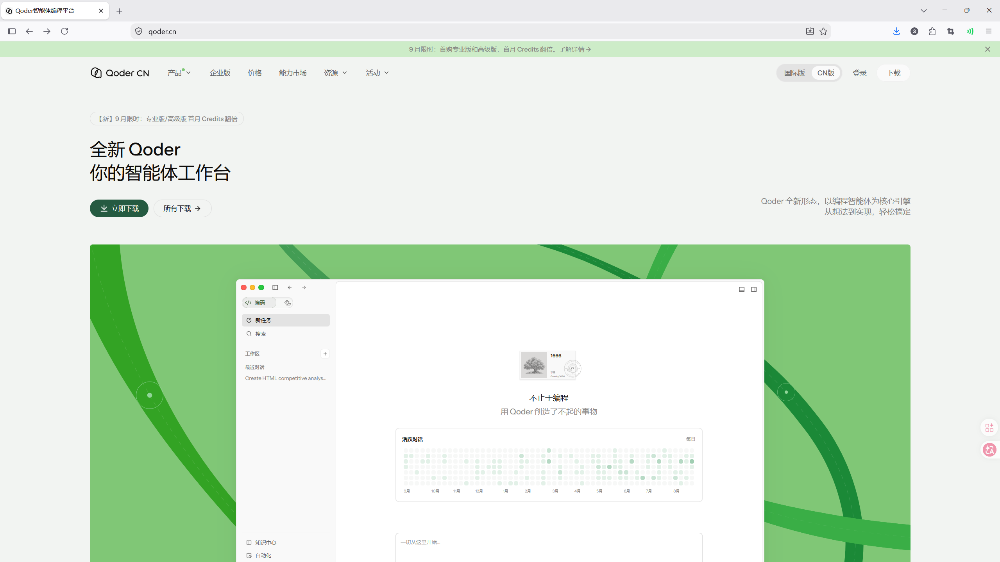
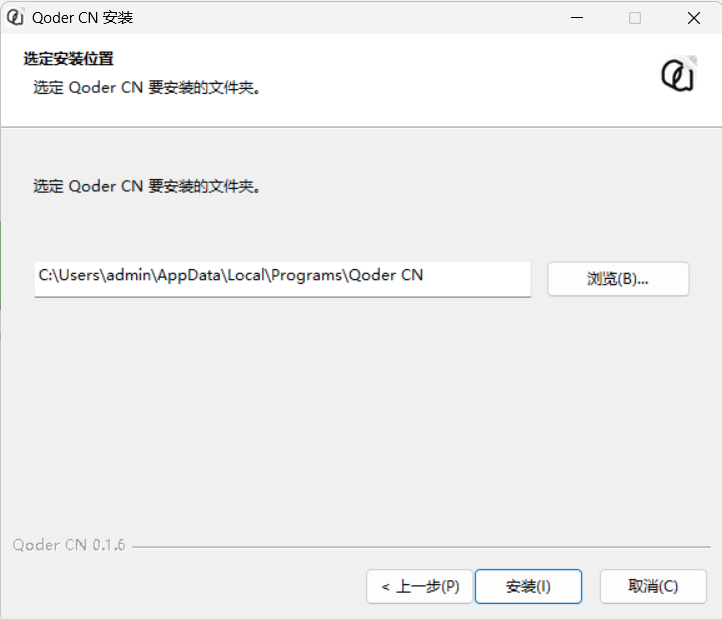
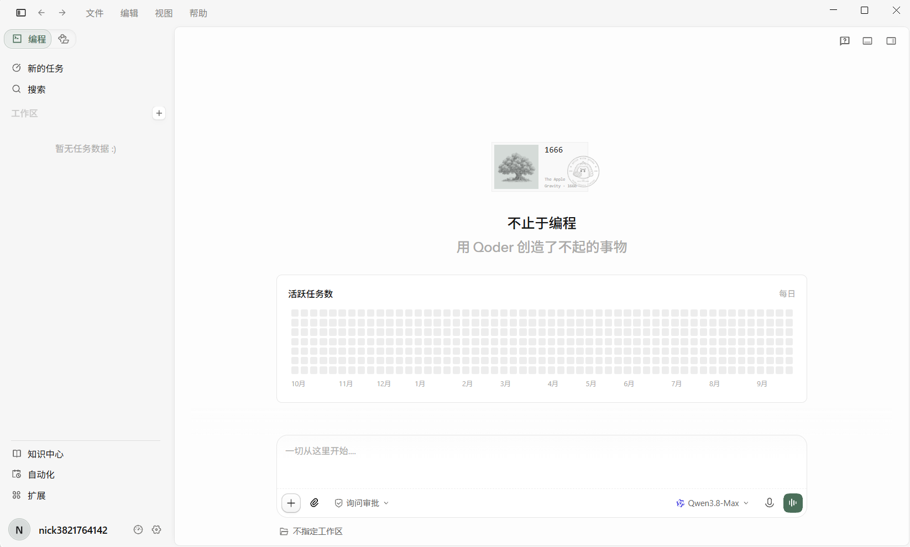
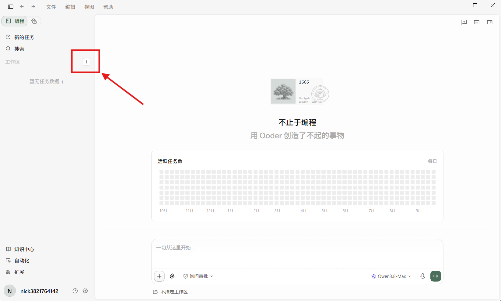
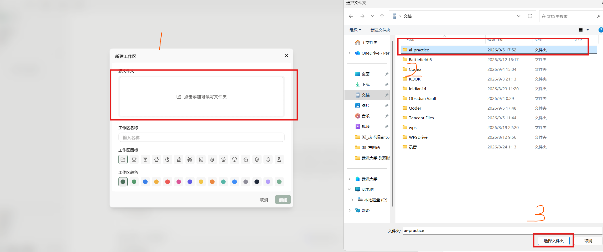

# 01：不用代理也能上手的 AI IDE

本章完成后，你会在 Windows 上装好一个 AI IDE，并能让它根据教程链接或报错一步步指导你。默认推荐 Qoder；WorkBuddy 只作为备选，二选一即可。

## 1. 安装 Qoder

1. 打开 [Qoder 下载页](https://qoder.cn)。

2. 下载 Windows 安装程序，双击下载的文件。

3. 按安装向导完成安装；完成后从开始菜单打开 Qoder。

4. 浏览器会打开登录网页。没有账号时，点击登录表单底部的“注册”，按页面填写信息并完成验证；已经有账号就直接登录。

6. 登录完成后切回 Qoder IDE。若浏览器询问是否打开 Qoder，确认来源是刚才的官方登录流程，再允许打开。

**检查成功：** Qoder 左下角显示你的账号，能看到新建/打开文件夹入口。

官方快速开始：[Qoder 快速入门](https://docs.qoder.com/zh/quick-start)。

## 2. 先检查免费额度与学生认证

1. 先打开 [Qoder 官方定价说明](https://docs.qoder.com/zh/account/pricing)，了解当前方案；在客户端右上角用户图标中查看账号相关入口。
2. 打开这里按照教程领取 [Qcoder CN 学生优惠](https://university.aliyun.com/action/qoder?spm=5176.28644950.0.0.30d079bb9gvmiN)；有就按页面要求完成认证。
3. 没有学生入口时，不要反复注册账号。直接使用当前账户提供的免费试用或基础额度。
4. 若账户页面有 Usage（用量）入口，点开查看已用量、剩余额度与重置时间；不要把试用额度当作永久额度。

**检查成功：** 你能看到自己的方案或额度状态。

学生认证可以作为领取优惠或免费额度的补充，但不是本章的必做步骤。本文尚未核实所有账号都能访问的学生认证固定入口，不承诺每位同学都能领取；资格、截止时间和额度以官方活动页面为准。没有入口就跳过，不要向第三方购买“学生认证”或交出证件、账号密码。[查看官方定价](https://docs.qoder.com/zh/account/pricing)。

## 3. 做第一次 AI 操作

1. 按 `Win+E` 打开 Windows 文件资源管理器，在左侧点击“文档”；右键右侧空白处 → “新建” → “文件夹”，输入 `ai-practice`，按回车。
2. 回到 Qoder IDE 主页，点击“打开”，在弹出的选择窗口进入“文档”，选中 `ai-practice` 并打开。

3. 按 `Ctrl+tab` 切换为通用模式，然后开始愉快的对话

~~~text
请在当前文件夹创建 README.md，内容只有一行：# 我的第一个 AI 项目。
先告诉我你准备创建哪个文件，等我确认后再修改。
~~~

4. 看清 AI 提议创建的文件名；确认无误后再同意执行。
5. 在软件左侧的项目文件列表中点击 `README.md`；正文应在中间编辑区打开，核对是否只有要求的那一行。文件没有出现时，先在聊天里问清它是否已经执行，不要只把 AI 的“完成了”当作文件已创建。

**检查成功：** 文件夹中出现 `README.md`，且内容正确。

如果 AI 打开了错误文件夹，先停止它的操作，重新选择正确文件夹，再重新提问。不要为了省事给 AI 不受限制的权限。

## 4. 后面教程怎样交给 AI 帮忙

之后每次看到不懂的步骤，在浏览器打开对应文章，、`Ctrl+C` 复制链接。切回 Qoder，打开新会话后，只需要在消息输入框粘贴下面的模板并补齐内容：

~~~text
我正在按这个教程操作：<粘贴教程链接>
我现在卡在第 X 步，完整报错是：<粘贴报错>
请不要跳步骤。只告诉我下一步要点哪里或输入什么，并说清成功标志。
~~~

如果 AI 说无法打开链接，返回文章，用鼠标选中当前小节的文字并复制，粘贴到同一会话，再附上完整报错。不要默认它已经读到了网页。

AI 的回答要自己检查：命令先读一遍，文件改动先看一遍；不要发送密码、私钥、订阅链接和验证码。

## 5. Qoder 无法使用时：WorkBuddy

1. 打开 [WorkBuddy 官网](https://www.workbuddy.ai/)。
2. 选择 Windows 下载，安装后启动客户端。
3. 本文的完整点击路径以 Qoder IDE 为主；WorkBuddy 作为备选，不能照搬 Qoder 的按钮或快捷键。登录后按客户端提示选择本地工作目录，选中“文档”中的 `ai-practice`。找不到目录选择入口时，先用它的任务输入框询问如何选择本地文件夹，不要让它直接修改整个“文档”目录。
4. 用与上面相同的提示词，让它只创建 `README.md`。

**检查成功：** 你能在一个 AI IDE 中打开文件夹、提出要求并检查改动。不要同时安装两个 IDE 来完成同一件事。

## 完成清单

- [ ] 已登录 Qoder，或已登录 WorkBuddy。
- [ ] 已查看 Qoder 账户的额度/活动入口。
- [ ] 已创建并检查 `README.md`。
- [ ] 知道怎样把教程链接和完整报错交给 AI。

下一篇：[02 网络工具：iKuuu + Clash Verge](02-network-clash-verge.md)。
