# 03.1：Windows 开发环境：中文 VS Code、C 语言、Python 虚拟环境

按顺序完成后，你会在 VS Code 中运行一个 C 程序和一个 Python 程序。本章不需要 GitHub 账号，Git 留到第四章再安装。

本页默认 Windows 11、Intel/AMD 的 x64 电脑。先打开“设置 → 系统 → 系统信息”，确认“系统类型”包含 x64；ARM 电脑请先看 [MSYS2 ARM64 说明](https://www.msys2.org/)，不要直接照搬这里的 x64 编译器路径。

## 1. 安装 VS Code，先切换中文

1. 打开 [VS Code 下载页](https://code.visualstudio.com/download)，选择 Windows 的 User Installer、x64。
2. 下载后双击安装程序，阅读并接受协议，保持默认安装目录。
3. 在“附加任务”页勾选 **添加到 PATH（重启后生效）**，完成安装并打开 VS Code。
4. 按 `Ctrl+Shift+X` 打开扩展页（也可点击窗口最左侧竖栏中四个小方块组成的“扩展”图标），在左侧扩展面板最上方的搜索框粘贴 `MS-CEINTL.vscode-language-pack-zh-hans`。
5. 核对扩展是 Microsoft 发布的 **Chinese (Simplified) Language Pack**，点击 Install。也可从 [中文扩展直达页](https://marketplace.visualstudio.com/items?itemName=MS-CEINTL.vscode-language-pack-zh-hans) 点击安装并允许打开 VS Code。
6. 右下角会弹出改变语言，点它
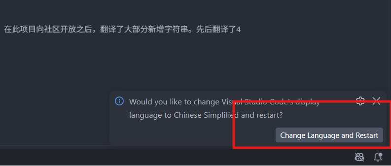

**检查成功：** 顶部菜单显示“文件、编辑、查看、终端”等中文文字。部分扩展命令仍然显示英文是正常的，后文会给出可搜索的英文名称。

## 2. 准备项目文件夹和终端

1. 按 `Win+E` 打开文件资源管理器，进入“文档”。
2. 右键空白处 → 新建 → 文件夹，命名为 `code`。
3. 进入 `code`，再新建 `hello-c` 文件夹。
4. 回到 VS Code，点击“文件 → 打开文件夹”，选择刚才的 `hello-c`，点击“选择文件夹”。如果询问是否信任作者，确认这是自己创建的文件夹后点击信任。
5. 点击“终端 → 新建终端”。下方会出现终端
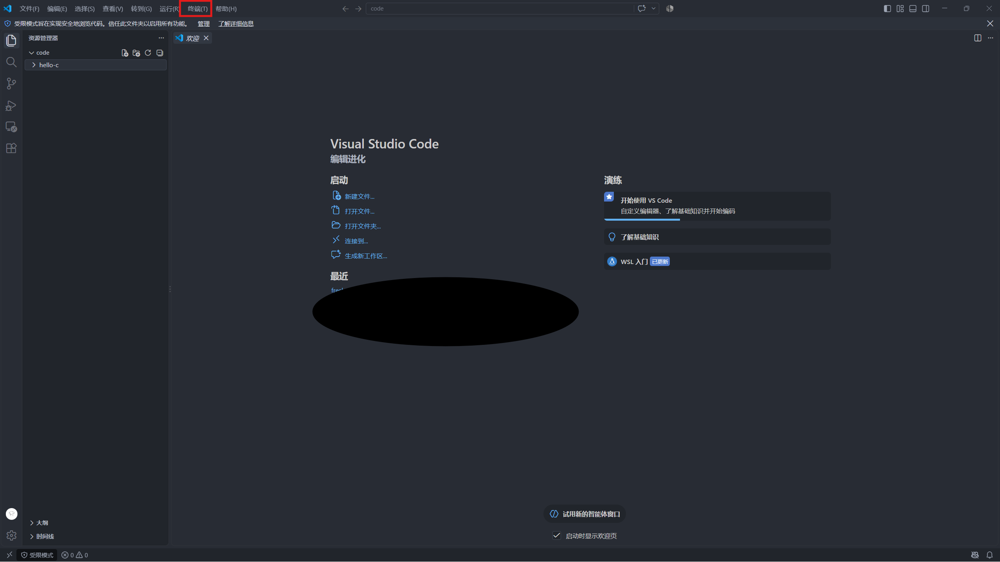
6. 输入 `pwd` 并回车。输出的路径末尾应是 `code\hello-c`。实际路径可能含 OneDrive，以你自己选择的目录为准。

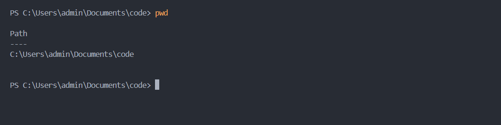

后文写“VS Code 终端”都指这个 PowerShell 窗口。代码块只复制其中内容，不复制围栏、行号或 `PS C:\...>` 提示符。每条命令按回车执行，报错就先停在当前步骤。

## 3. 安装 C/C++ 扩展

1. 按 `Ctrl+Shift+X`，搜索 `ms-vscode.cpptools`。
2. 安装 Microsoft 发布的 **C/C++**：[扩展直达页](https://marketplace.visualstudio.com/items?itemName=ms-vscode.cpptools)。
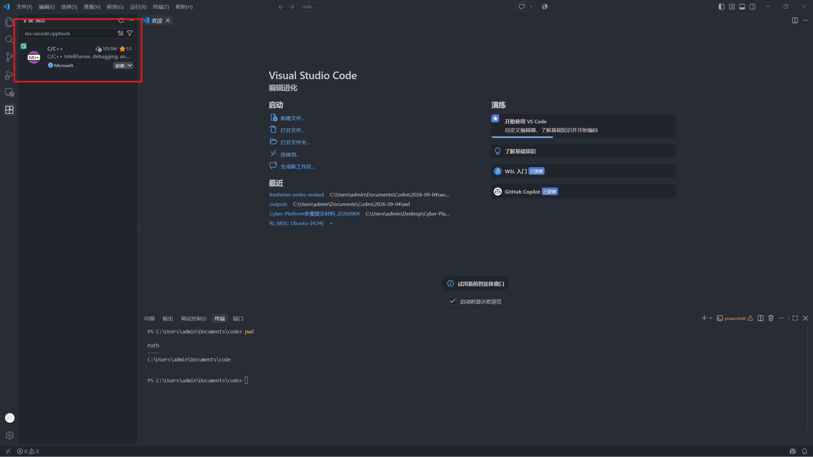
3. 等待安装完成。接下来还要安装编译器，仅安装这个扩展不能运行 C 程序。

## 4. 安装 C 编译器和调试器

1. 打开 [MSYS2 官网](https://www.msys2.org/)，下载 x86_64 安装程序。
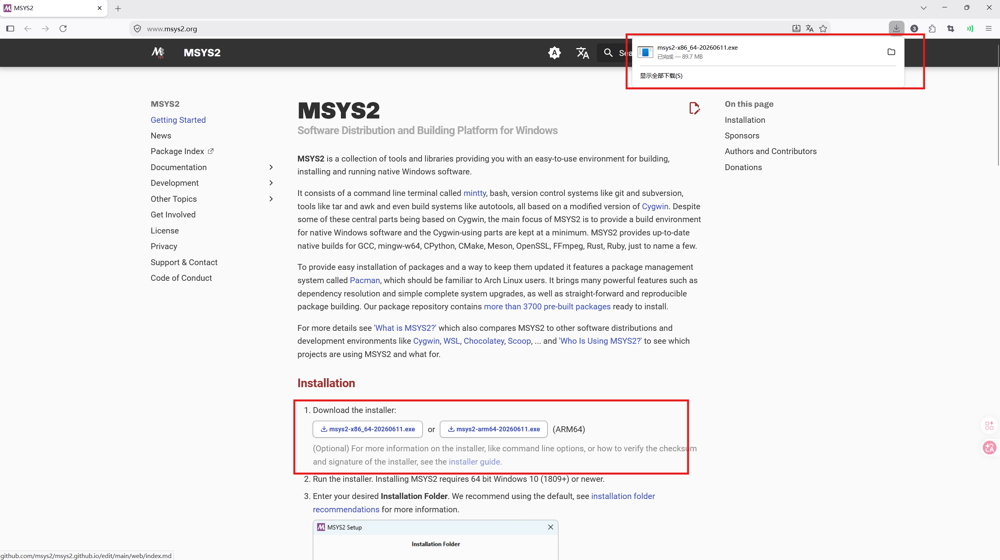
2. 双击安装程序，安装路径保持 `C:\msys64`，其余按默认选项完成。
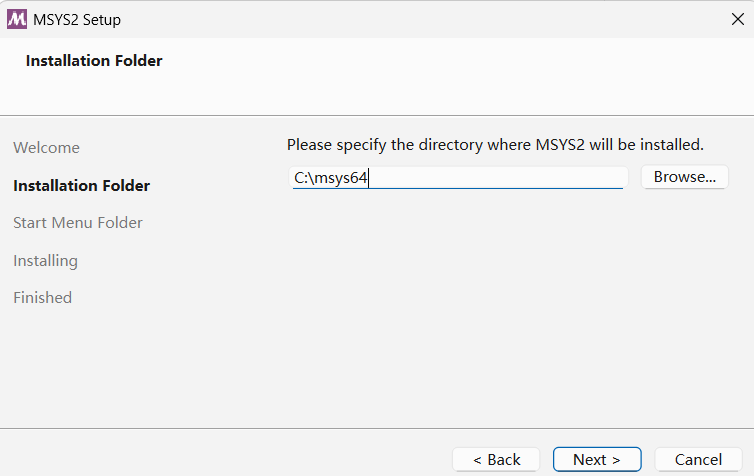
3. 从 Windows 开始菜单搜索并打开 **MSYS2 UCRT64**。以下命令在这个新窗口执行，不是在 PowerShell 执行。
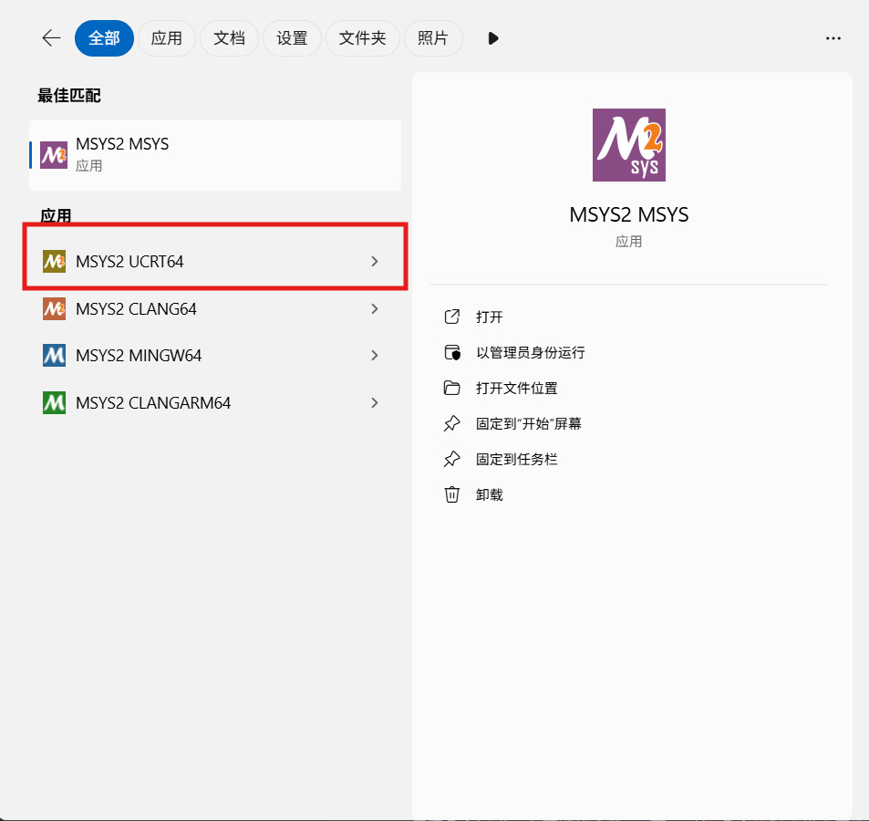
4. 输入下面命令并回车：

```bash
pacman -Syu
```

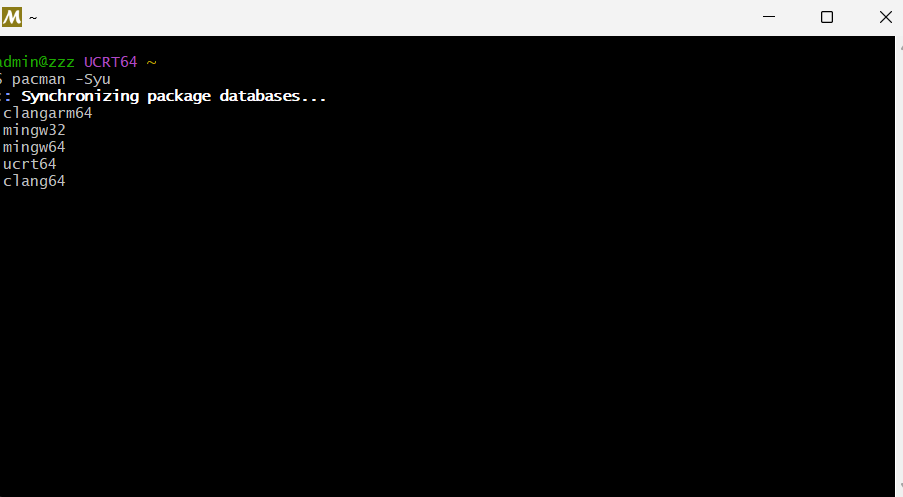

如果询问是否继续，输入 `Y` 并回车。如果提示必须关闭终端，按提示关闭，再从开始菜单打开 MSYS2 UCRT64，重新执行 `pacman -Syu`，直到更新完成。(一般来说会有一次的)

接着安装工具：

```bash
pacman -S --needed base-devel mingw-w64-ucrt-x86_64-toolchain
```

出现选择软件包编号的提示时直接回车，保留全部；询问是否继续时输入 `Y` 并回车。等待重新出现可输入命令的提示符。

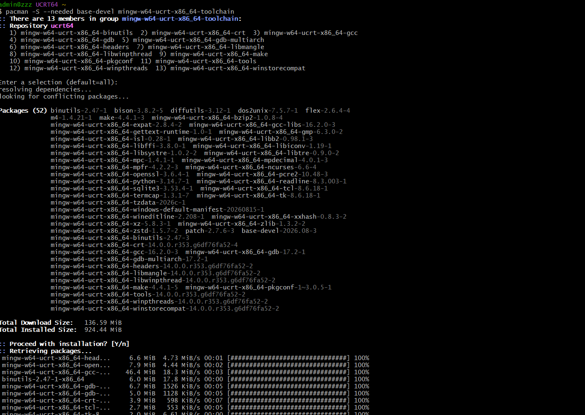

## 5. 添加编译器路径

1. 按 Win，搜索“编辑账户的环境变量”并打开。

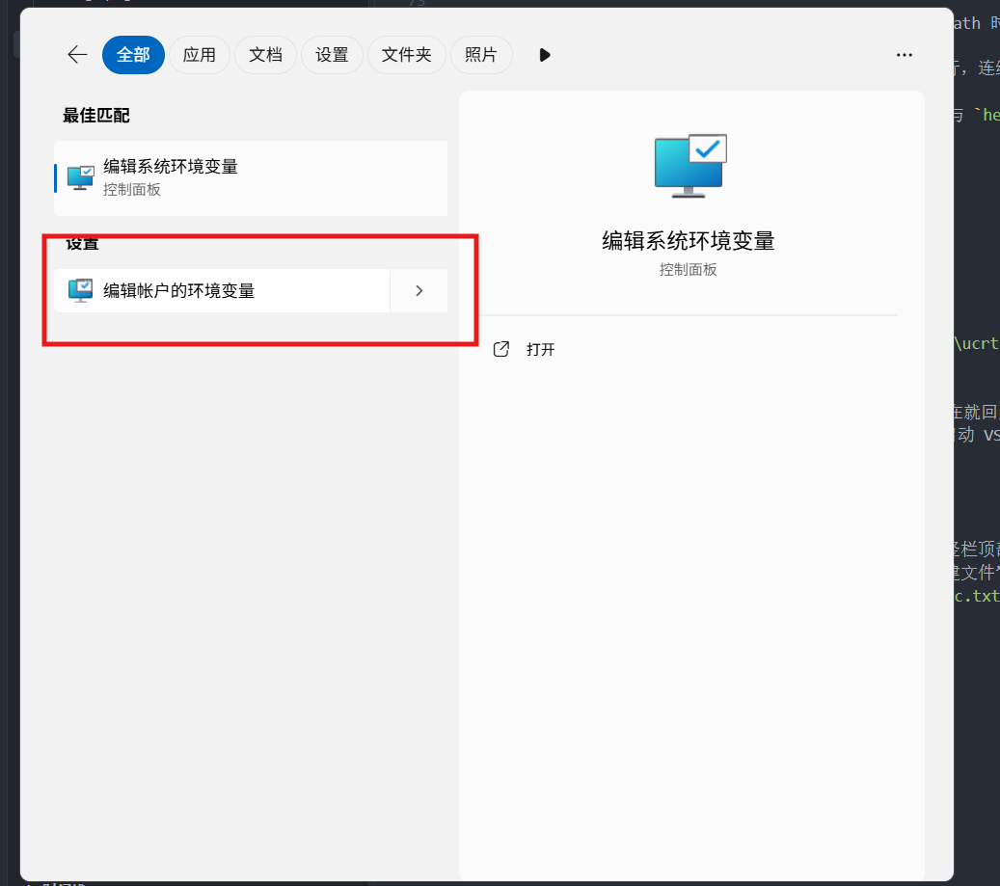

2. 在上半部分“用户变量”中选中 `Path`，点击“编辑”。没有 Path 时点击“新建”，变量名填 `Path`，值填下面的路径。

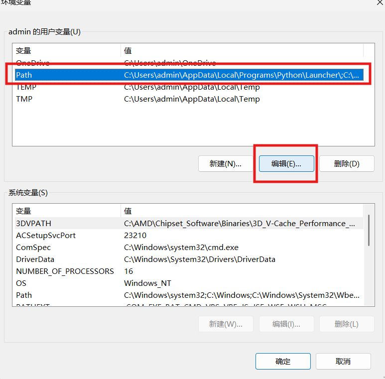

3. 点击“新建”，添加 `C:\msys64\ucrt64\bin`。保留原有各行，连续点击“确定”保存。（有两个确定需要点，注意）

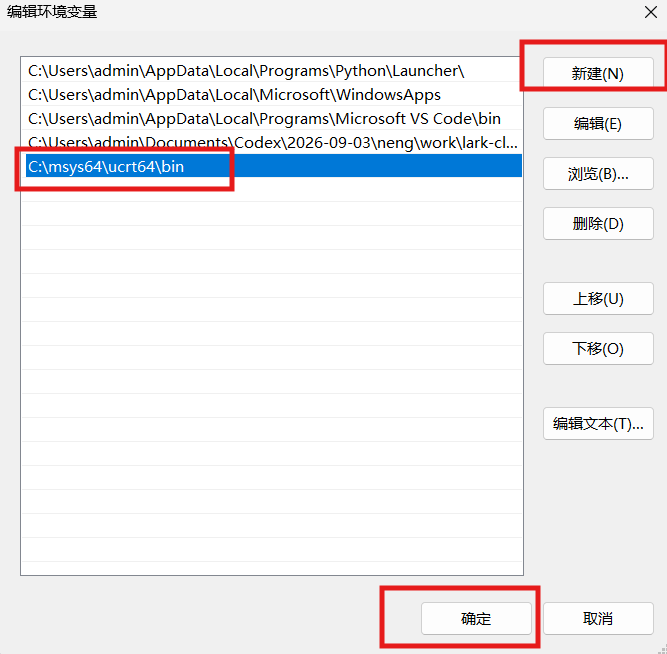

4. 完全退出所有 VS Code 窗口和终端，再重新打开 VS Code 与 `hello-c` 文件夹。
5. 点击“终端 → 新建终端”，逐条执行：

```powershell
gcc --version
gdb --version
where.exe gcc
```

**检查成功：** 前两条显示版本信息，第三条包含 `C:\msys64\ucrt64\bin\gcc.exe`。

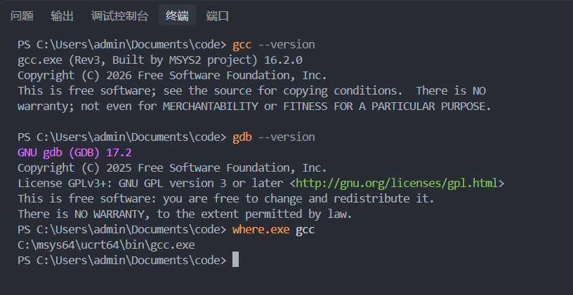

若找不到 gcc：在资源管理器中检查该文件是否存在。文件不存在就回到第 4 节检查安装是否完成；存在则检查第 5 节 Path 是否拼写正确并重新启动 VS Code。不要把整个 Path 替换为这一条。

> 或者把当前博客直接发给之前安装的Qoder这种AI IDE，然后问问它发生了什么，以及怎么做

## 6. 编译并运行第一个 C 程序

1. 按 `Ctrl+Shift+E` 打开 VS Code 的资源管理器（最左侧竖栏顶部的文件图标）。在展开的 `HELLO-C` 文件夹下面的空白处点右键 → “新建文件”，输入 `hello.c` 并回车。不要新建成文件夹，也不要保存成 `hello.c.txt`。

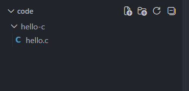

2. 粘贴以下完整内容，按 `Ctrl+S` 保存：

```c
#include <stdio.h>

int main(void) {
    printf("Hello, C!\n");
    return 0;
}
```

3. 在 VS Code 的 PowerShell 终端逐条执行：

```powershell
gcc -Wall -Wextra -g hello.c -o hello.exe
.\hello.exe
```

> 终端中可以直接粘贴的，不过要按 `Ctrl+Shift+V`

**检查成功：** 第一条命令没有报错，第二条输出 `Hello, C!`。

- 提示 `hello.c: No such file`：在左侧确认文件已保存为 `hello.c`，再输入 `pwd` 检查当前终端是否在 `hello-c` 中。可在左侧文件夹右键“在集成终端中打开”。
- 提示找不到 `hello.exe`：先看上一条编译命令是否报错，编译失败时不要继续运行。
- 修改代码后输出没变：先 `Ctrl+S`，重新执行编译命令，再运行。以后每次修改都按这个顺序。

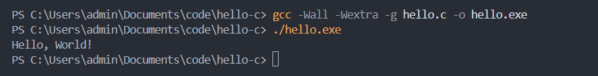


## 7. *让 VS Code 识别编译器，练习断点调试

1. 打开 `hello.c`，按 `Ctrl+Shift+P`，搜索 `C/C++: Edit Configurations (UI)`。

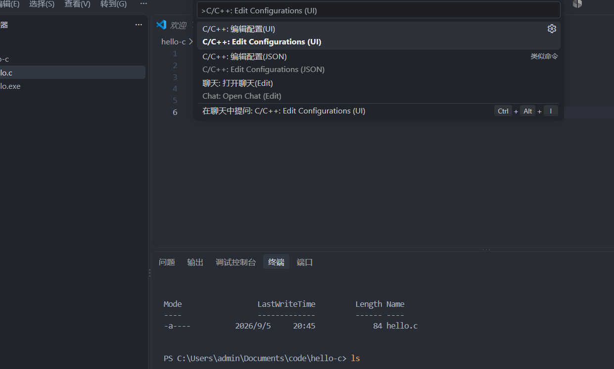

2. 中间编辑区会打开配置表单，向下滚动找到“编译器路径”（Compiler path）输入框，将它选为或填为 `C:\msys64\ucrt64\bin\gcc.exe`，IntelliSense 模式选择 `windows-gcc-x64`。
3. 返回 `hello.c`，点击 `printf` 那一行行号左边，看到红点。

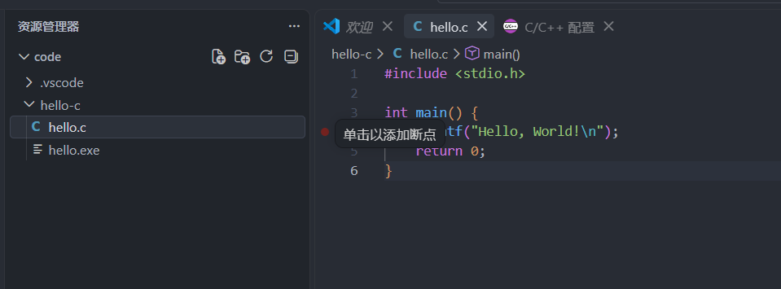

4. 点击编辑器右上角运行按钮旁的下拉箭头，选择“调试 C/C++ 文件”（Debug C/C++ File）。
5. 在编译器列表中选择 **gcc.exe 生成和调试活动文件**，核对其路径是上面的 UCRT64 路径。
6. 程序停在红点处后，按 F10 单步，按 F5 继续执行。

**检查成功：** 程序能停在断点，继续后终端出现 `Hello, C!`。若弹出选择环境，选择 `C++ (GDB/LLDB)`。若没有检测到 gcc，先回到第 5 节验证路径。

参考：[VS Code 官方 MinGW 配置与调试教程](https://code.visualstudio.com/docs/cpp/config-mingw)。

## 8. 安装 uv，再由 uv 安装 Python

下面步骤在 Windows 的 PowerShell 中执行。uv 会管理 Python 版本、项目虚拟环境和依赖，不需要先单独安装 Python。

1. 按 Win，搜索 PowerShell 并打开普通窗口。
2. 执行：

~~~powershell
winget install --id astral-sh.uv --exact --source winget
~~~

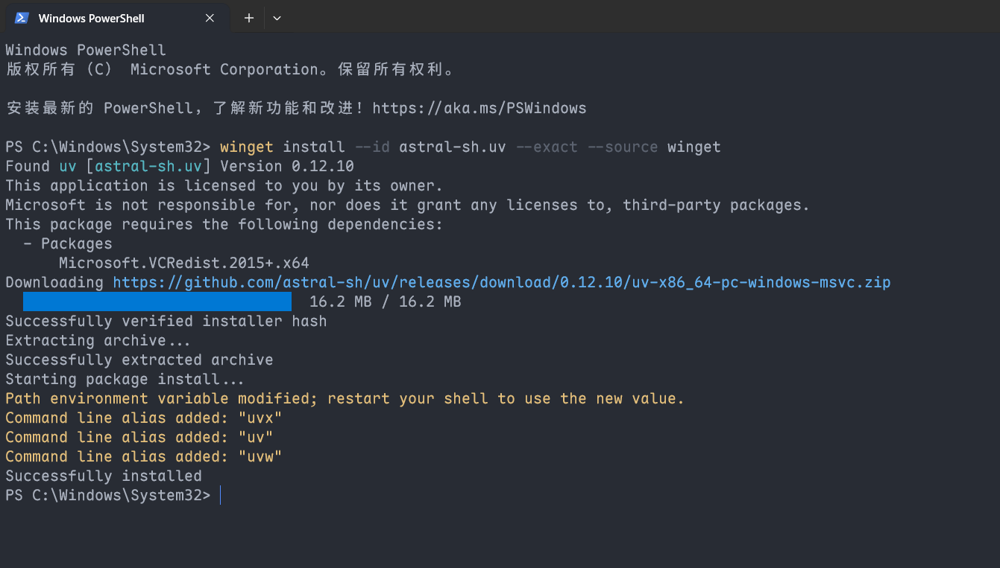

3. 完成后关闭所有 VS Code 与终端窗口，重新打开 VS Code，再新建 **PowerShell** 终端。
4. 检查：

~~~powershell
uv --version
~~~

**检查成功：** 输出以 uv 开头的版本号。

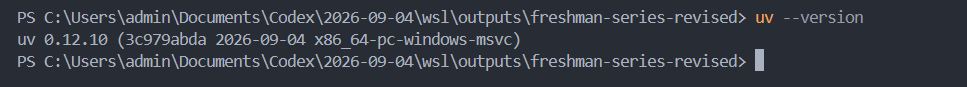

如果 winget 找不到，打开 Microsoft Store，安装或更新 [应用安装程序](https://apps.microsoft.com/detail/9nblggh4nns1)，重新打开 PowerShell 再试。如果安装成功后 uv 仍找不到，先重启 Windows，再检查；其他安装方式见 [uv 官方安装说明](https://docs.astral.sh/uv/getting-started/installation/)。

接着执行：

~~~powershell
uv python install 3.13
~~~

**检查成功：** 提示 Python 3.13 已安装或已存在。下载失败时保留完整报错，先检查网络再重试。同一台 Windows 安装一次 uv 即可；WSL 需要在 Ubuntu 中单独安装。

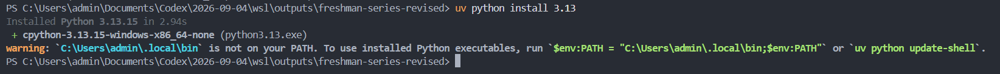

我们可以看到下面有一段提示，这个是把虚拟环境配置到path中

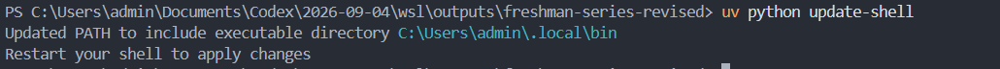

## 9. 创建 uv 项目与虚拟环境

1. 按 `Ctrl+Shift+X`，在左侧顶部的扩展搜索框输入 `ms-python.python`，点击 Microsoft 发布的 **Python** → “安装”。然后分别搜索 `ms-python.vscode-pylance` 和 `ms-python.debugpy`，确保 **Pylance** 与 **Python Debugger** 也已安装；详情页出现“禁用/卸载”而不是“安装”表示已经装好。官方直达页：[Python](https://marketplace.visualstudio.com/items?itemName=ms-python.python)、[Pylance](https://marketplace.visualstudio.com/items?itemName=ms-python.vscode-pylance)、[Python Debugger](https://marketplace.visualstudio.com/items?itemName=ms-python.debugpy)。
2. 在文件资源管理器“文档 → code”中新建一个空文件夹，命名为 hello-python-uv。
3. 在 VS Code 点击“文件 → 打开文件夹”，选择这个空文件夹。
4. 点击“终端 → 新建终端”，输入 pwd，确认路径末尾是 hello-python-uv。
5. 逐条执行：

~~~powershell
uv init --python 3.13 --vcs none
uv sync
uv run python --version
~~~

**检查成功：** 左侧出现 pyproject.toml、.python-version、uv.lock 和 .venv；最后一条显示 Python 3.13.x。uv init 生成的 main.py 与 README.md 可以保留。

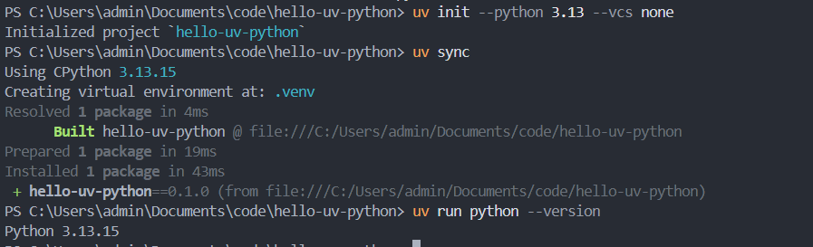

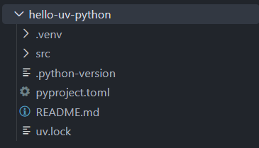

这里使用 --vcs none，Git 留到注册账号后再配置。如果提示项目已初始化，不要反复执行 uv init，检查当前文件夹的 pyproject.toml，再执行 uv sync。之前已经有项目或 .venv 的同学，先使用上述新的空目录练习，不要覆盖已有项目。

## 10. 选择 VS Code 解释器并运行

1. 按 `Ctrl+Shift+P`，在窗口顶部弹出的命令框中输入 `Python: Select Interpreter`，点击同名命令（中文可能显示“Python: 选择解释器”）。

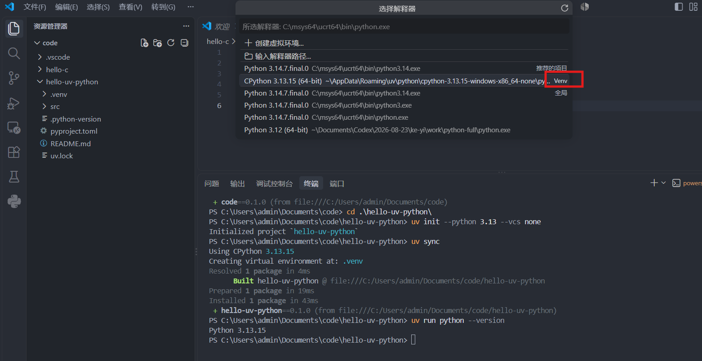

2. 选择当前项目中 .venv\Scripts\python.exe 对应的解释器。
3. 没有找到时，选择“输入解释器路径 → 查找”，在 hello-python-uv\.venv\Scripts 中选择 python.exe。
4. 按 `Ctrl+Shift+E` 返回左侧项目文件列表，在 `HELLO-PYTHON-UV` 文件夹下面的空白处右键 → “新建文件”，输入 `hello.py` 并回车。将下面内容粘贴到中间编辑区，按 `Ctrl+S` 保存：

~~~python
import sys

print("Hello, Python!")
print(sys.executable)
~~~

5. 在项目的 PowerShell 终端运行：

~~~powershell
uv run python hello.py
~~~

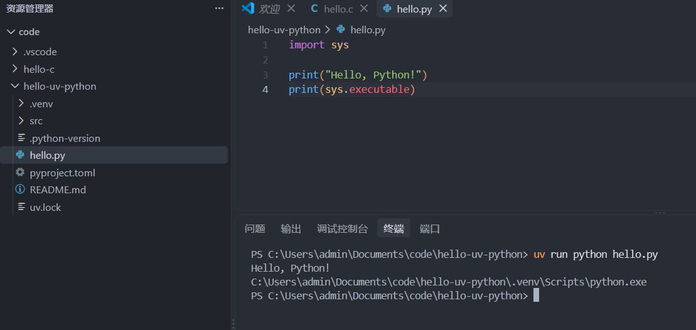

**检查成功：** 输出 Hello, Python!，下一行路径包含 hello-python-uv\.venv\Scripts\python.exe。

以后运行这个项目都用 uv run python 文件名。无需手动激活环境；如果 VS Code 自动激活时提示脚本被禁止，也可以直接使用 uv run，不必修改执行策略。

## 11. 添加、查看和删除依赖

在当前项目终端逐条执行：

~~~powershell
uv add requests
uv run python -c "import requests; print(requests.__version__)"
uv tree
~~~

**检查成功：** 第二条显示 requests 的版本号，第三条显示项目依赖树。打开 pyproject.toml，确认 dependencies 中出现 requests；uv.lock 也会随之更新。这两个文件由 uv 管理，无需手动维护 requirements.txt。

如果需要删除不再使用的依赖，执行以下命令；这一步为可选练习：

~~~powershell
uv remove requests
~~~

删除后再次需要它，就重新执行 uv add requests。不要直接删除 .venv 中的库文件。

**下载失败：** 保存错误原文；网络超时先检查连接再重试。出现 No solution found 时，记录你添加的包名和 Python 版本，让 AI 检查兼容性，不要直接更换整个环境。

## 12. 下次继续、调试与恢复环境

- 继续项目：用 VS Code 打开 hello-python-uv，终端运行 uv sync，再运行 uv run python hello.py。
- 调试：在 hello.py 的 print 行左侧点红点，确认 VS Code 选中了 .venv 解释器，按 F5，选择 Python Debugger → Python File；按 F10 单步，F5 继续。
- 新项目：新建空文件夹，重复第 9 节的初始化步骤，每个项目有自己的 .venv。
- 格式化：按需安装 Microsoft 的 [Black Formatter](https://marketplace.visualstudio.com/items?itemName=ms-python.black-formatter)，打开 .py 文件按 Shift+Alt+F，首次提示时选择 Black Formatter。
- 换电脑或 Windows/WSL 切换：保留源代码、pyproject.toml、uv.lock 和 .python-version。在另一台设备安装 uv，打开项目目录执行 uv sync --locked，再用 uv run python hello.py 运行。不要复制 .venv。
- 更新 uv：Windows 通过 WinGet 安装的版本用 winget upgrade --id astral-sh.uv --exact。
- C++ 课程：本章的工具链也包含 g++；Java、Node.js 等在课程需要时再单独安装。

**换电脑恢复失败：** 如果提示缺少锁文件或锁文件需要更新，先检查是否复制完整或拉取到最新代码。请原作者在项目中执行 uv sync 并保存更新后的 uv.lock，再重新同步，不要直接删掉锁文件。

参考：[uv 项目教程](https://docs.astral.sh/uv/guides/projects/)、[VS Code Python 环境说明](https://code.visualstudio.com/docs/python/environments)。

## 完成清单

- [ ] VS Code 菜单已切换中文。
- [ ] gcc 与 gdb 能显示版本，C 程序输出 `Hello, C!`。
- [ ] C 程序能在断点停下。
- [ ] Python 程序输出 `Hello, Python!`，解释器路径包含当前项目的 `.venv`。
- [ ] 已用 uv add 添加 requests，并成功导入验证（删除练习前）。
- [ ] 已保留 pyproject.toml、uv.lock 和 .python-version，知道用 uv sync 恢复环境。
- [ ] 知道下次如何打开项目、保存、运行和调试。

需要 Linux 时继续 [WSL + VS Code](wsl-vscode.md)；暂时不需要可直接阅读 [04 账号注册与 Git](../04-accounts-git-github.md)。
