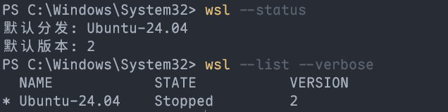
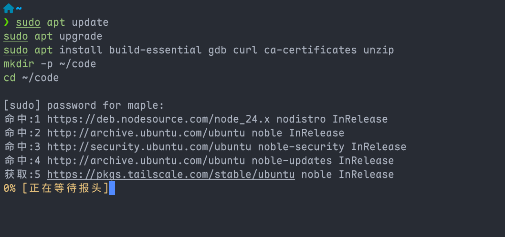
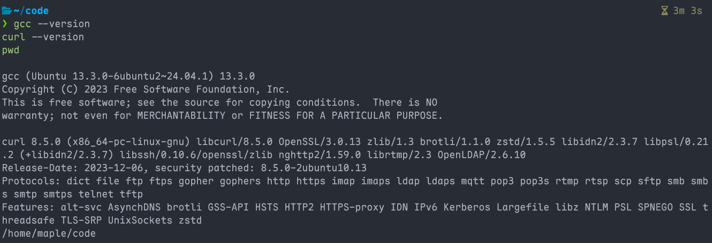
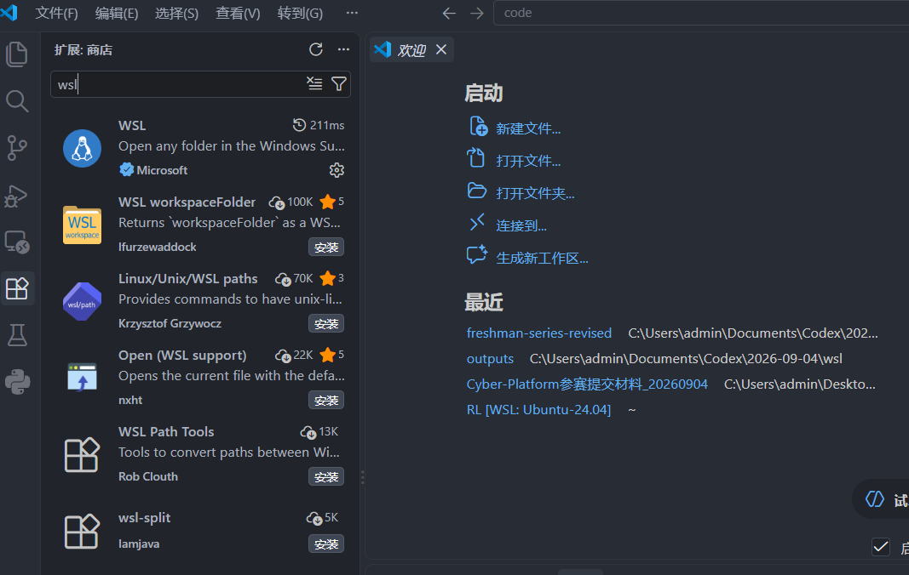
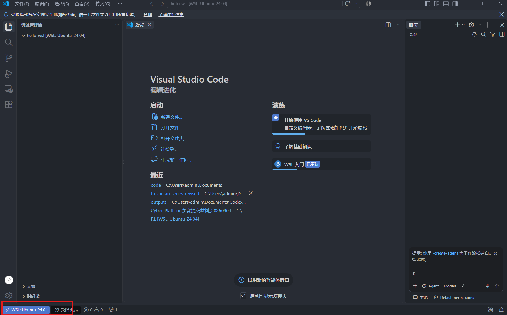

# 03.2：WSL + VS Code

本章完成后，Windows 上的 VS Code 可以打开 Ubuntu 中的项目。先完成 [Windows 下的 VS Code 生产环境](windows-vscode.md)。

## 1. 打开管理员 PowerShell

1. 按 <kbd>Win</kbd> 键，搜索 `PowerShell`。
2. 在“Windows PowerShell”右侧点击 **以管理员身份运行**。
3. Windows 询问是否允许更改时，点击“是”。

**检查成功：** 通过“以管理员身份运行”打开，并完成 Windows 权限确认；窗口标题通常含“管理员”或 Administrator。当前目录是 System32 并不能证明拥有管理员权限。

## 2. 安装 Ubuntu 24.04

在刚才的管理员 PowerShell 中执行：

~~~powershell
wsl --install -d Ubuntu-24.04
~~~

执行完成后按提示重启电脑。重启后从开始菜单打开 **Ubuntu 24.04 LTS**。

第一次启动时：

1. 等待安装完成。
2. 在 `Enter new UNIX username:` 后输入一个小写英文用户名（任意你喜欢的），例如 `alice`。
3. 在 `New password:` 后输入密码；**屏幕不显示字符是正常的**。
4. 再输入一次相同密码确认。

**检查成功：** 你看到类似 `alice@电脑名:~$` 的 Ubuntu 提示符。

## 3. 验证 WSL2

关闭 Ubuntu，打开普通 PowerShell，执行：

~~~powershell
wsl --status
wsl --list --verbose
~~~

**检查成功：** 列表中有 `Ubuntu-24.04`，且 `VERSION` 是 `2`。



如果版本不是 2，在管理员 PowerShell 执行：

~~~powershell
wsl --set-default-version 2
wsl --set-version Ubuntu-24.04 2
~~~

## 4. 安装 Ubuntu 基础工具

打开 Ubuntu，逐行执行：

~~~bash
sudo apt update
sudo apt upgrade
sudo apt install build-essential gdb curl ca-certificates unzip
mkdir -p ~/code
cd ~/code
~~~

第一次 `sudo` 会询问第 2 步设置的 Linux 密码；输入时没有显示是正常的。



检查：

~~~bash
gcc --version
curl --version
pwd
~~~



**检查成功：** 前两条显示版本号，最后一条是 `/home/你的用户名/code`。

## 5. 让 VS Code 连接 WSL

1. 在 Windows 中打开 VS Code。
2. 按 <kbd>Ctrl</kbd> + <kbd>Shift</kbd> + <kbd>X</kbd>。
3. 在左侧扩展面板顶部的搜索框输入 `ms-vscode-remote.remote-wsl`，点击发布者为 Microsoft 的 **WSL**，在详情页点击“安装”。这里是在 Windows 的 VS Code 安装，不是在 Ubuntu 中下载安装 Linux 版 VS Code。



4. 回到 Ubuntu，执行：

~~~bash
cd ~/code
mkdir hello-wsl
cd hello-wsl
code .
~~~

第一次运行会下载 WSL 侧组件，等待 VS Code 打开。

**检查成功：** VS Code 左下角显示 `WSL: Ubuntu-24.04` 或类似文字；新建终端后 `pwd` 显示 `/home/.../code/hello-wsl`。




官方入口：[安装 WSL](https://learn.microsoft.com/windows/wsl/install)、[WSL 基础命令](https://learn.microsoft.com/windows/wsl/basic-commands)、[在 WSL 中使用 VS Code](https://code.visualstudio.com/docs/remote/wsl)。

## 6. 在 WSL 中编译并运行 C

在已连接 WSL 的 VS Code 中，点击“终端 → 新建终端”。执行 `pwd`，确认路径为 `/home/你的用户名/code/hello-wsl`。后续命令在这个 Ubuntu 终端执行。

1. 先确认窗口左下角显示 WSL，再按 `Ctrl+Shift+X`，搜索 `ms-vscode.cpptools`，点击 Microsoft 的 [C/C++](https://marketplace.visualstudio.com/items?itemName=ms-vscode.cpptools)。在扩展详情中点击“安装到 WSL: Ubuntu-24.04”（后缀以实际发行版为准）；若扩展已列在“WSL: Ubuntu-24.04 - 已安装”分组中则跳过。只在“本地 - 已安装”分组中看到它还不够。
2. 按 `Ctrl+Shift+E`，在左侧 `HELLO-WSL` 文件夹下面的空白处右键 → “新建文件”，输入 `hello.c` 并回车。粘贴以下内容到中间编辑区，按 `Ctrl+S` 保存：

```c
#include <stdio.h>

int main(void) {
    printf("Hello, C!\n");
    return 0;
}
```

3. 在 Ubuntu 终端逐条运行：

```bash
gcc -Wall -Wextra -g hello.c -o hello
./hello
```

**检查成功：** 输出 `Hello, C!`。编译失败就先处理错误，不要继续运行。Windows 中的 `.exe` 编译步骤和编译器路径不用复制到这里。

## 7. 在 WSL 中用 uv 管理 Python

Windows 中安装过 uv 的同学，也要在 Ubuntu 中安装一次。以下命令全部在 Ubuntu 终端执行。

### 7.1 安装 uv 与 Python

使用 [uv 官方安装脚本](https://docs.astral.sh/uv/getting-started/installation/)：

~~~bash
curl -LsSf https://astral.sh/uv/install.sh | sh
~~~

安装成功后，关闭这个 Ubuntu 终端并重新打开，执行：

~~~bash
uv --version
uv python install 3.13
~~~

**检查成功：** uv 能显示版本，Python 3.13 安装成功。若 uv 提示找不到命令，按安装器末尾的 PATH 提示操作；默认安装位置可用 ~/.local/bin/uv --version 检查。若这个文件也不存在，先看安装脚本是否下载成功。

### 7.2 创建独立项目

逐条执行：

~~~bash
mkdir -p ~/code/hello-python-uv
cd ~/code/hello-python-uv
uv init --python 3.13 --vcs none
uv sync
code .
~~~

使用新的空目录。如果提示已有 pyproject.toml，确认是你之前建立的同一项目后只运行 uv sync，不要覆盖已有文件。

在新打开的窗口中先确认左下角仍显示 WSL，再按 `Ctrl+Shift+X`，搜索 `ms-python.python`，点击 Microsoft 的 [Python 扩展](https://marketplace.visualstudio.com/items?itemName=ms-python.python) → “安装到 WSL: Ubuntu-24.04”。同样检查 `ms-python.vscode-pylance` 与 `ms-python.debugpy` 在 WSL 的已安装分组中。

按 Ctrl+Shift+P，运行 Python: Select Interpreter，选择当前项目的 .venv/bin/python。找不到时，选择“输入解释器路径”，填写 /home/你的Linux用户名/code/hello-python-uv/.venv/bin/python。

### 7.3 运行与添加依赖

按 `Ctrl+Shift+E` 回到左侧项目文件列表，在 `HELLO-PYTHON-UV` 文件夹下面的空白处右键 → “新建文件”，输入 `hello.py` 并回车。在中间编辑区粘贴以下内容，按 `Ctrl+S` 保存：

~~~python
import sys
print("Hello, Python!")
print(sys.executable)
~~~

在这个 VS Code 窗口的 Ubuntu 终端逐条执行：

~~~bash
uv run python hello.py
uv add requests
uv run python -c "import requests; print(requests.__version__)"
uv tree
~~~

**检查成功：** 输出问候语、当前项目的 .venv/bin/python 路径、requests 版本和依赖树。

下次继续时打开这个项目，执行 uv sync，再用 uv run python hello.py 运行。移除不再需要的依赖用 uv remove requests；重新添加用 uv add requests。

保留 pyproject.toml、uv.lock、.python-version 和源代码。换电脑先安装 uv，再进入复制或克隆的项目目录执行 uv sync --locked。每个系统重新生成自己的 .venv，不复制 Windows 的虚拟环境；运行前不用手动激活环境。

通过官方独立安装器安装的 uv 可用 uv self update 更新。项目操作参考 [uv 官方项目教程](https://docs.astral.sh/uv/guides/projects/)。

## 8. 卡住时这样做

- `wsl --install` 只显示帮助：先执行 `wsl --list --online`，再执行 `wsl --install -d Ubuntu-24.04`。
- 下载停在 `0.0%`：在管理员 PowerShell 执行 `wsl --install --web-download -d Ubuntu-24.04`。
- `code .` 找不到：先关闭并重新打开 Ubuntu 后重试。仍失败时回到 Windows 的 VS Code，按 `Ctrl+Shift+P`，输入 `WSL: Connect to WSL using Distro`，选择 Ubuntu-24.04。连接后点击“文件 → 打开文件夹”，输入 `/home/你的Linux用户名/code/hello-wsl` 并确认。以后仍需要修复 `code .` 时，重新运行 03.1 的 Windows VS Code 安装程序，核对“添加到 PATH”已勾选。
- BIOS 虚拟化错误：进入 BIOS/UEFI，开启 Virtualization、Intel VT-x 或 AMD-V；学校设备被锁定时联系管理员。(这一步比较危险，建议先问问Qoder这种AI IDE)

## 完成清单

- [ ] Ubuntu-24.04 的 `VERSION` 为 2。
- [ ] Ubuntu 中的 gcc、curl 可用，C 程序运行成功。
- [ ] WSL 自己的 Python 虚拟环境已建立，程序运行与依赖导入成功。
- [ ] 已建立 `~/code/hello-wsl`。
- [ ] VS Code 左下角显示 WSL。

下一篇：[04 账号与代码同步](../04-accounts-git-github.md)。
