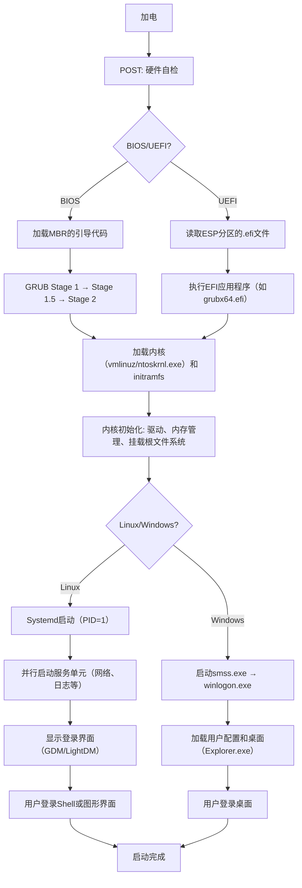
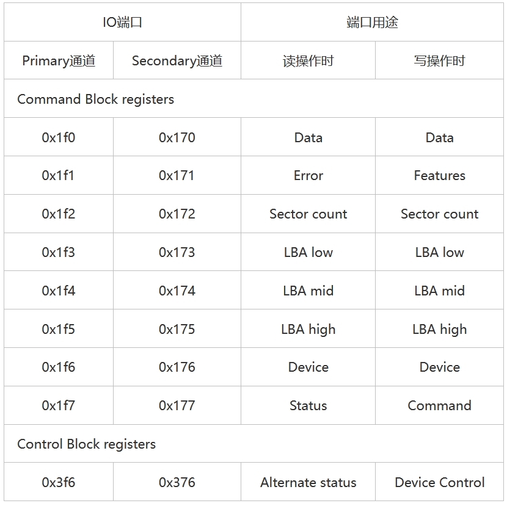
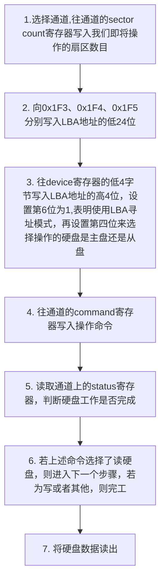

# 实模式


## 0x01 BIOS以及MBR


### 0x01 00 操作系统的启动

从我们按下电源键到最终启动的完成，大致是下图的一个流程，而这一小节主要是编写`BIOS`以及`MBR`，其作用是引导操作系统的启动





### 0x01 01 BIOS

全称为`Base Input & Output System`，也就是`基本输入输出系统`

但是我们知道，开机的时候并不存在页表，也就没有页映射这一说，所以只能通过物理地址来进行编程，这一利用物理地址的模式我们叫做\*\*实模式\*\*

!!! tip
    \*\*页表\*\*是操作系统维护的一种数据结构，用于存储虚拟页号到物理页号帧号的映射关系，每个进程都有自己的页表，由内存管理单元（MMU)在地址转换时使用

\*\*页映射\*\*就是指页表将虚拟地址空间中的页面映射到物理内存中的页帧的过程

大概是这样一个过程（有点像\*\*哈希表\*\*）


```
虚拟地址 -> [虚拟页号 | 页内偏移]
              |
              | 通过页表查找
              ↓
物理地址 -> [物理页帧号 | 页内偏移]
```

关于实模式，以8086为例，列举一些

- BIOS入口在0xFFFF0-0xFFFFF,执行了一个jmp指令，跳转到真正的BIOS地址
- 中断向量表在0x00000到0x003FF
- MBR加载地址在0x7C00到0x7DFF


### 0x01 02 BIOS

BIOS的功能是检测初始化硬件，存放在`内存ROM`区，但现在存储在主板上的一个或多个芯片中

我们可以在上面的流程图中看到某个叫做`POST（Power-On Self-Test`的过程，主要是检查CPU、内存、主板、硬盘、显卡等设备。POST结束后系统BIOS调用其它设备的BIOS对各个设备进行检测和初始化。如果没有什么问题，就将执行启动程序

!!! tip
    **ROM和RAM**

- ROM(只读存储器)：断电后数据不会丢失，通常不可写入（现代类型允许有限次擦写），读取速度快但写入速度慢
- RAM（随机存取存储器）：断电后数据丢失，支持高速频繁读写，比ROM和硬盘快的多

一般情况下，CPU从ROM加载固件（例如BIOS），再加载操作系统到RAM


### 0x01 03 MBR 主引导记录

BIOS最后的工作就是检验0盘0道1扇区的内容（就是第一个磁盘扇区）。检验时若BIOS检验处该磁盘末尾两个字节是0x55和0xaa,则认为其是活动区，便加载到物理地址0x7c00,然后跳转过去，执行MBR

!!! tip
    **磁盘扇区**

存储设备中的最小物理存储单元，也是操作系统和文件系统读写数据的基本单位，可以理解为书架的每一个格子

通过磁头（HDD）或控制器（SSD)定位到目标扇区，读取数据到内存

**为什么是0x55 0xaa**

这是MBR的引导签名，用于告诉BIOS该磁盘有效的引导代码。属于是早期签名的遗留

MBR为我们第一个在编写操作系统中自行构造出来的程序，但是要遵循下面一些规定：

- MBR的大小为512字节
- 第511和512字节必须要是0xaa,0x55（由于模拟的是x86平台，所以采用小端序）
- 凑行

那么接下来就可以编写`mbr.S`程序，主要思路如下：

> 1. 清屏。利用BIOS所建立的中断向量表，用0x06号功能（也就是int 0x10),我们实现系统调用的操作只需要我们将功能号送入ah（也就是向ax中传入0x600)寄存器，然后执行int 0x10
> 2. 在编写的section后面加上vstart=0x7c00表示，告诉编译器将起始地址编译为0x7c00
> 3. 通过中断3号功能来获取光标位置
> 4. 利用中断向量来实现打印字符串
> 5. 填充到511字节
> 6. 填充0xaa, 0x55


## 0x02 MBR支持显卡

在之前的MBR中，我们用BIOS的中断实现打印字符擦到屏幕，然后用jmp自身这个指令来实现类似while的功能，但打印字符串之后就结束了，接下来完善MBR的功能


### 0x02 0x00

首先先解释几个重要的标志位

| CF进位标志 | 用于反应运算是否产生进位或借位，如果运算结果的最高位产生一个进位或借位，则CF置1.运算结果的最高位包括字操作的第15位和字节操作的第7位 |
| --- | --- |
| PF奇偶标志 | 用于反映运算结果低8位中“1”的个数 |
| AF辅助进位标志 | 在字节操作时低半字节向高半字节进位或借位，字操作时低字节向高字节进位或借位，AF置1 |
| ZF零标志 | 用于判断结果是否为0，运算结果为0时置1 |
| SF符号标志 | 反应运算结果的符号，运算结果为负，SF为1 |
| OF溢出标志 | 反映有符号数加减运算是否溢出，溢出时置1 |
| TF陷阱标志 | 当TF被置1时，CPU进入单步模式（每执行一步指令后都产生一个单步中断） |
| IF中断标志 | 决定CPU是否响应外部可屏蔽中断请求，IF为1时，允许响应外部的可屏蔽中断请求 |
| DF方向表示 | 决定串操作指令执行时有关指针寄存器调整方向。DF为1时，串操作指令按递减的方式改变有关存储器指针值，每次操作后使SI、DI递减 |


### 0x02 0x01 IO接口

**什么是IO接口**

可以理解为一系列端口与控制逻辑的结合，它所实现的功能就是让计算机与外设可以通信，就是在CPU和外设之间，又加了一层逻辑

**如何使得CPU访问到IO接口**

一种方法是统一编址，在统一编址之下，我们会将主存分开一部分来供IO接口来使用，比如说0x000~0x7ff为咱们正常使用的物理地址，剩下的0x800-0xfff就全部作为IO接口地址来进行访问，只要访问的地址落于后一段，CPU就认为在使用某一个IO接口

还有一种方法是选择独立编址，访问主存的地址与IO接口的地址无关，COU区分你是访问主存还是IO接口的因素是指令操作码，也就是类似于ADD、SUB等这类的汇编语句，不需要从主存专门划分出一段区域供IO接口使用。下面是关于这一种访问方式的语法

!!! tip
    - in指令用来从端口中读取数据，一般形式为
    - in al,dx
    - in ax,dx

  这里的al，ax是指从端口读取数据所存放的寄存器，而dx是指IO端口号
- out指令用来向端口输入数据，一般形式为
- out dx\立即数,al
- out dx\立即数,ax

  同in指令


### 0x02 02 显示器、显卡、显存

上一次我们是通过BIOS所建立的中断向量表实现向显示器输送一段数据。但是BIOS的中断向量表示在实模式之后的保护模式将不存在，所以接下来要试着利用IO进行输出字符到显示器上

下面是显存分布

| 起始 | 结束 | 大小 | 用途 |
| --- | --- | --- | --- |
| C0000 | C7FFF | 32KB | 显示适配器BIOS |
| B8000 | BFFFF | 32KB | 用于文本模式显示适配器 |
| B0000 | B7FFF | 32KB | 用于黑白显示适配器 |
| A0000 | AFFFF | 64KB | 用于彩色显示适配器 |

由上表可知，当地址处于0xB8000-0xBFFFF时，在此的输出的数据会直接落在显存中，接下来显示器就可以直接拿到CPU所输出的数据（又是加了一层抽象）


### 0x02 03 升级MBR

接下来我们就需要利用IO功能来时实现打印功能了

其实原理看着很繁琐，但是代码是很简单的，例如


```asm
  mov byte [gs:0x00], 'M'
  mov byte [gs:0x01], 0x94
  mov byte [gs:0x02], 'a'
  mov byte [gs:0x03], 0x94
  mov byte [gs:0x04], 'p'
  mov byte [gs:0x05], 0x94
  mov byte [gs:0x06], 'l'
  mov byte [gs:0x07], 0x94
  mov byte [gs:0x08], 'e'
  mov byte [gs:0x09], 0x94
```


## 0x03 MBR操作硬盘以及Loader

继续升级MBR,这次如题所示，了解磁盘相关内容


### 0x03 00 基础知识

**磁盘**

| 介绍 | 图片 |
| --- | --- |
| 一个磁盘由多个`盘片`叠加而成；盘片的表面涂有磁性物质，用来记录二进制数据，因此一个盘片可能有两个盘面 | 0846c23a4e0786db2c6085ae8dec17db-1 |
| 每个盘片被划分为一个个`磁道`，每个磁道又被划分为一个个`扇区`。其中，最内侧磁道上的扇区面积最小，因此数据密度最大 | 67c3a1b7f05af1469fa3cfa698b8a97f |
| 每个盘面对应一个磁头。所有的磁头都是在一个磁臂上的。所有盘面中相对位置相同的磁道组成`柱面` | abb5dd4920a0223770452cf809cdb9ad |
| 因此，可以用`（柱面号、盘面号、扇区号）`来定位任意一个磁盘块。这也可以称为\*\*物理磁盘地址\*\* |  |

而根据物理磁盘地址，可以实现读取一个“块”

根据“柱面号”移动磁臂，让磁头指向指定柱面 **->** 激活指定盘面对应的磁头 **->** 磁盘旋转的过程中，指定的扇区会从磁头下面划过，完成了对指定扇区的读/写

**硬盘控制端口**

硬盘同样是一种外设，需要指定的IO接口和CPU通信，这个IO接口就叫做\*\*硬盘控制器\*\*

其IO模式与显卡不同，使用显卡时我们使用的是`统一编址`，但是硬盘控制器使用`独立编址`

**主盘、从盘、通道**

电脑中通常安装多个硬盘，因此需要分出主从关系，也就衍生出了硬盘中的Master和Slave，即主盘和从盘（~~你就是老娘的master吗~~）。很久以前系统一般安装在主盘上，但随着计算机的发展，这两种盘区别变得不是那么大了

一般主板上会给出两个叫做通道的插槽，这是一种比DMA更加高级的存在，负责IO的数据直接传到内存，不需要CPU控制

**端口寄存器**



实际上端口可以简单的被分为两组，即`Command Block registers`和`Control Block registers`。其中前者用于向硬盘驱动器写入命令或者从硬盘控制器获得硬盘状态；后者用于控制硬盘工作状态

接下来介绍一下各个端口的用途

- **Data寄存器**：用来管理数据，是唯一的16位。一般来说，读磁盘时，不断读此寄存器相当于读出硬盘控制器中的缓冲数据；写磁盘时，将数据写入该磁盘相当于向硬盘控制器写入数据
- **Error寄存器**:只有在读取硬盘失败的时候，端口为0x171/0x1f1的寄存器中才记录失败的信息，尚未读取的扇区数放在Sector count寄存器中
- **Feature寄存器**：只有在写硬盘，并且需要额外指定参数时，将参数写入该寄存器
- **LBA寄存器**：这里需要详细说一下LBA的相关信息

> 前面分析的时候，我们都是按照”柱面-磁头-扇区“来进行定位，这种方法称为CHS，但是这种方法略显复杂，我们更希望使用逻辑上的地址进行定位，而不需要考虑物理结构，因此诞生了LBA寄存器
>
> 目前的LBA共有两种，LBA28和LBA48，即28bit/48bit描述扇区的地址，而因为每个扇区都是512字节，则其支持的最大硬盘容量为128GB/128PB。
>
> LBA low、mid、high分别对应地址0-7位、8-15位和16-32位。仅靠这些寄存器无法唯一标识LBA，因此还需要使用Device寄存器，其低4位白哦是LBA28的24-27位，从而与上面可以共同完成LBA28的表示；第4位标识通道中的主盘或从盘；第5、7位为固定的1，称为MBS位；第6位标识是否启用LBA模式

- **Status寄存器**：其在读硬盘时，用来给出硬盘的状态信息，
- 第0位是ERR位，如果为1，表示命令出错，可以查看Error位；
- 第3位是data request位，如果为1，表示硬盘数据已经准备完毕，可以读取数据；
- 第6位是DRDY，如果为1，表示硬盘检测正常；
- 第7位是BSY位，如果为1，表示硬盘正忙，其余所有位都无效。写硬盘时，该端口充当command寄存器，存放需要硬盘执行的命令。主要包括三个命令


```
identify: 0xEC  ;硬盘识别
read sector：0x20    ；读扇区
write sector：0x30   ；写扇区
```

**硬盘操作方法**

硬盘中可用的指令有很多，主要介绍数据的传送方式，大致顺序如下




数据传输方式一般为两种;

1. **查询传送方式**：也称为程序I/O、PIO，指传输之前，先获取硬盘控制器的Status控制器，如果为数据可用，则获取数据即可
2. **中断传送方式**：也称为中断驱动I/O，当硬盘设备准备号数据后，通过发送中断通知来通知COU，然后CPU直接获取数据


### 0x03 01 使用MBR来操作硬盘

我们知道MBR的本职工作是加载Loader，然后Loader加载我们的操作系统。Loader也是存放在硬盘上的，所以就需要改进MBR来实现读取硬盘上的程序操作，依此加载Loader

**Loader的位置**

按照上文的介绍，MBR加载在第一个扇区，但是由于是LBA寻址，所以MBR存放在0扇区。因此理论来说1扇区之后的所有地点都可以存放Loader，但是为了保险起见，设置一个空扇区作为缓冲，将之放入2扇区。

之后的操作就是:MBR将Loader从2扇区读出来，然后将之存入内存

存入内存哪里呢？请看下面内存布局图，标记为可用的其实都可以使用

| 开始地址 | 结束地址 | 大小 | 用途 |
| --- | --- | --- | --- |
| FFFF0 | FFFFF | 16B | BIOS入口，这么小的一个位置实际上仅仅是一个跳转指令 |
| F0000 | FFFEF | 64KB-16B | 系统BIOS |
| C8000 | EFFFF | 160KB | 映射硬件适配器的ROM或内存映射式I/O |
| C0000 | C7FFF | 32KB | 显示适配器BIOS |
| B8000 | BFFFF | 32KB | 文本显示适配器 |
| B0000 | B7FFF | 32KB | 黑白显示适配器 |
| A0000 | AFFFF | 64KB | 彩色显示适配器 |
| 9FC00 | 9FFFF | 1KB | EBDA |
| 7E00 | 9FBFF | 约608KB | 可用 |
| 7C00 | 7DFF | 512B | MBR加载地址 |
| 500 | 7BFF | 约30KB | 可用 |
| 400 | 4ff | 256B | BIOS数据区域 |
| 000 | 3FF | 1KB | 中断向量表 |

**功能实现**

跟着博客教程来就好了，这边不加叙述
