# 保护模式


## 0x04 进入保护模式


### 0x04 00 基础知识

**保护模式**

前面介绍过实模式，就是程序编址都在物理地址下进行。但是这种编址模式必然不会适合如今的计算机，因此产生了保护模式。

寻址位数扩展的32位，按字节编地址，则寻址范围大小就有2^32，即为4GB。但有个例外，段基地址寄存器仍然是16位，就是上述S结尾的寄存器们，这是因为：那就是此时的段基址寄存器里面所保存的已经不再是基地址了，而是\*\*选择子\*\*，这里我们只需要知道段基址还是16位寄存器，而且寻址方式还是段基址加上偏移就够了。

在保护模式中，我们在访问段的时候必须添加一定约束，比如说访问控制等，这些控制条件不可能在一个寄存器中放下，因此设计了一种新的数据结构——**全局描述表（GDT）**。这个表里每一个表项称为\*\*段描述符\*\*，其大小为64字节，这个描述符就用来描述自己所对应的哪个内存段的其实地址、大小、权限等信息。而这个全局描述表由于表示内存所有段信息，所以十分大，因此存在一个叫做\*\*GDTR寄存器\*\*专门指向\*\*表地址\*\*。

这样之后，段基址寄存器所保存的就是寻址段在全集描述表下的某一段描述符的索引（简单来说，就是段基址寄存器保存的是索引，而真正的数据写在了一个数据结构中）。此外有一些内容需要指出：

1. 段描述符位于内存当中，这对于CPU来说很慢
2. 段描述符格式比较奇怪，一个数据需要分三个地方存储，对CPU来说很麻烦

而为了解决这个问题，80286的保护模式给出了解决方案：**缓存技术**，将段信息用一个寄存器来保存，这就是\*\*段描述符寄存器\*\*

Note

**CPU分级**

首先看CPU分级。如下图所示，在这个图中，**`ring的数值越小，权限就越大`**。如果低权限访问高权限的东西，就会导致失败（例如ring3访问ring0的内容，就会被拒绝）。其中，kernel使用了`ring0`,windows只用了`ring3`

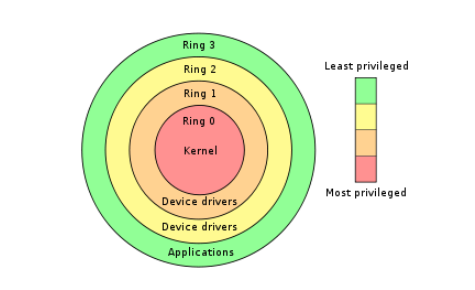

**GDT和LDT**

和一个段有关的信息需要8个字节来描述，这就是段描述符，每个段都需要一个描述符。为了存放这些描述符，需要在内存内中开辟出一段空间。在这段空间里，所有的描述符都是挨在一起，集中存放，这就构成了一个描述符表。有GDT和LDT两种，结构如下

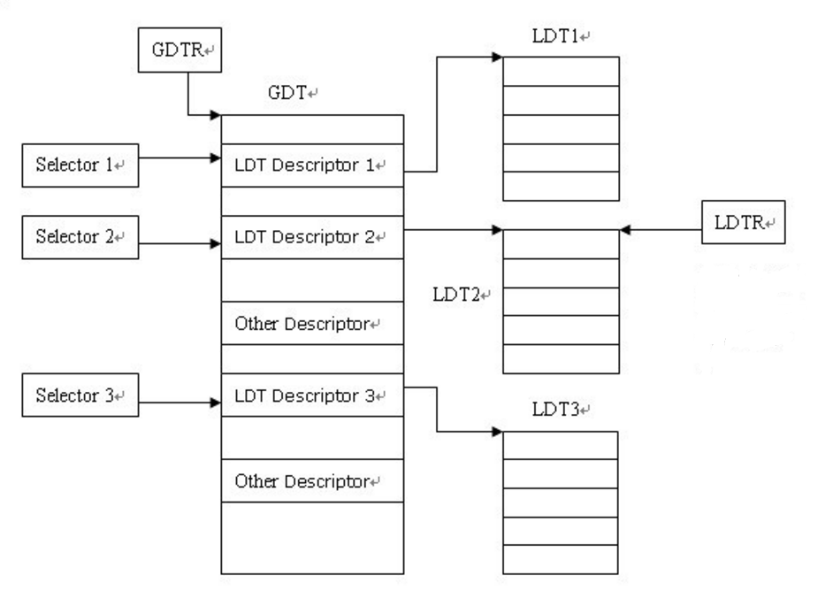

当我们执行类似`mov ds, ax`指令时，CPU会查表，根据`ax`的值来决定查找`GDT`还是`LDT`，并找到对应的段描述符。

`GDT`存放在内存中，因此CPU想要找到它，就需要知道它的位置，于是有一个叫做`GDTR`的寄存器专门存放GDT表的位置和大小，是一个特殊的48位寄存器，C语言表示如下


```

struct

GDTR

{


DWORD

GDTBase
;

//GDT表的地址（32位）


SHORT

limit
;

//GDT表的大小（16位）

}

```

**段选择子**

段选择子结构简单，它是一个16位的描述符，指向了定义该段的段描述符。结构如下所示

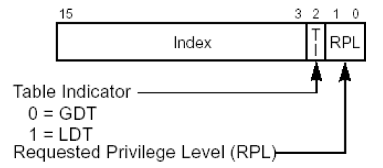

成员解释如下：

| 成员 | 功能 |
| --- | --- |
| RPL | 请求特权级别，即用什么权限来请求 |
| TI | TI=0的时候，查GDT；否则查LDT |
| Index | 处理器将索引值乘以8再加上GDT或者LDT的基地址，就是要加载的段描述符 |

**段描述符**

段描述符的结构如下所示

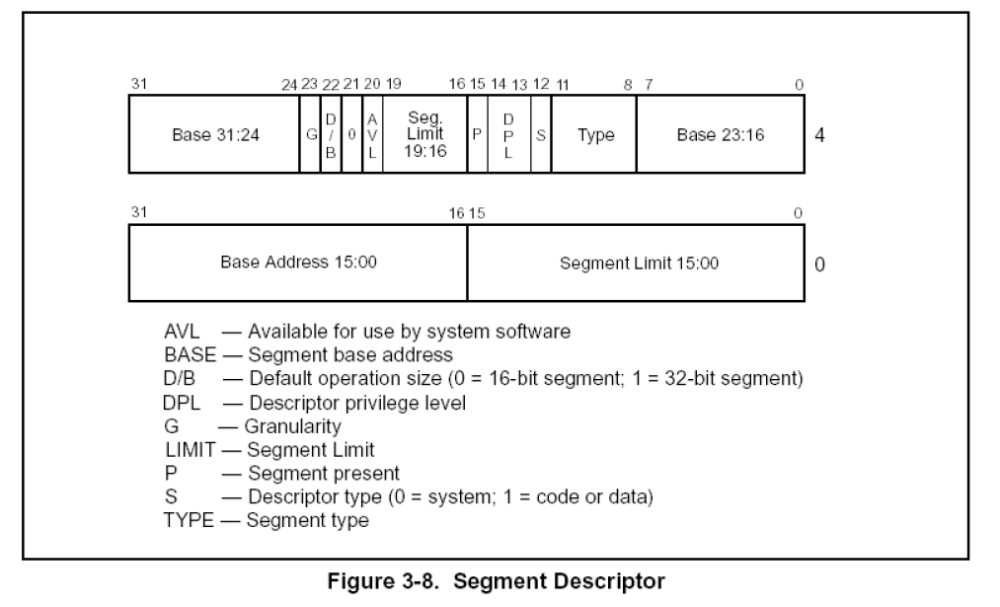

成员解释如下

| 成员 | 功能 |
| --- | --- |
| P位 | P=1时段描述符有效；否则无效 |
| Base | Base的低16位被放到了段描述符的低4个字节；高16位被均分到段描述符的高四个字节的头和尾。最后使用时需要拼接起来 |
| Limit | 由图可知，把段描述符中所有的Limit拼接起来就只有20位。上一节教程说它有32位的Limit。那就是要看`G位`了 |
| G位 | 如果G=0，说明Limit的单位是字节，段长度`Limit`的范围可从1B ~ 1MB（即在20位前面补3个0）；G=1，Limit的单位是字节为4KB，段长度Limit的范围可从4KB ~ 4GB（在20位的后面补充FFF)。*例如：如果Litmit拼接后位FFFFF，如果G=0，则为000FFFFF，否则为FFFFFFF* |
| S位 | s=1则为代码段或者数据段描述符。否则为系统段描述符；*在CPU眼中，凡是硬件运行所需要的东西都可称之为系统，凡是软件运行所需要的东西都可以称之为数据，无论是代码、还是数据，包括栈都是作为硬件的输入，都只是给硬件提供数据而已* |
| TYPE域 | 这个内容较为复杂，不做过多介绍，可自行搜索 |
| DPL | 描述符特权级别，规定了访问该段所需要的特权级别是什么。如果通俗的理解，就是：如果你想访问我，那么你应该具备什么权限。 |
| DB段 | 用来指示有效地址（段内偏移地址）及操作数大小。 **对于代码段来说**，此位为D位，若D为0,则表示有效地址和操作数为16,指令有效地址用IP寄存器。若D为1,表示指令有效地址及操作数为32位，指令有效地址用EIP寄存器。**对于栈段来说**，此位为B位，用来指定操作数大小，若B为0则使用个SP寄存器，若B为1使用esp寄存器。 |

**打开A20地址线**

首先了解一下`地址回绕`:在处于实模式下时，只有20位地址线，即A0～A19,20位地址线能表示2^20字节，即为1MB大小，0x0～0xFFFFF，若内存超过1MB，则需要21条地址线支持。因此若地址进位到1MB以上，由于没有21位地址线，则会丢弃多余位数。

随着CPU的发展，地址线更加多了，但是为了兼容性的问题，实模式下应该和之前的8086一模一样，即只使用20条地址线。但是，A20地址线是存在的，若访问0x100000 ~ 0x10FFEF之间的内存，系统会直接访问这块物理内存，而不会回绕

为了解决这个问题，IBM在键盘控制器上的一些输出线来控制第21根地址线的有效性，称为A20Gate

- A20打开，则不回绕
- A20关闭，则回绕

这就兼容了实模式和保护模式。所以我们在进入保护模式前需要打开A20地址线，操作就如同读取硬盘控制器类似，将端口0x92的第一位置为1即可


```

in al, 0x92
or al, 0000_0010B
out 0x92, al

```


### 0x04 01 实现

代码中有很多东西值得去记一记

**首先就是控制寄存器CR0.**

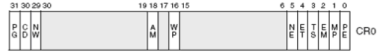

比较重要的是`PE`位，它是启用保护模式的控制标志;而`PG`位是分页机制的开启控制，后面会谈


```

mov eax, cr0
or eax, 0x00000001
mov cr0, eax

```

**loader.S的编写**

1. 首先肯定是规定好需要的栈指针地址，这一点我们其实在0x03中的`boot.inc`中已经完成，这里引用就行了


```

;LOADER_BASE_ADDR = 0x900
section loader vstart = LOADER_BASE_ADDR    ;起始地址设置
LOADER_STACK_TOP equ LOADER_BASE_ADDER      ;loader在实模式下的栈指针地址
jmp loader_start

```

> equ是一个伪指令，用于定义\*\*符号常量\*\*，它的作用是将一个标识符与一个具体的域或表达式永久绑定；可以理解为C中的#define

1. 接着在loader开始前，我们应该手搓一个gdt和它的内部描述符，让后面gdtr有地方可以寻址，让我们再看一眼gdt的结构

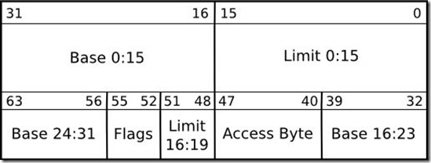

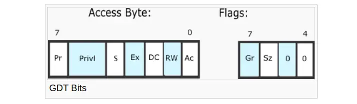

大概照此定义gdt以及内部描述符、然后是选择子、gdt的指针

1. 编写loader\_start,做一个实模式的测试
2. 接着进入保护模式
3. 打开A20
4. 加载GDT
5. cr0第0位置设置为1，保护模式开启
6. 刷新流水线（后面解释，别急）
7. 对保护模式操作

**处理器微架构（刷新流水线）**

**流水线**

即不同指令的不同阶段可以并行执行，以提高CPU处理效率的方式

例如：顺序执行vs流水线执行


```

指令1：| 取指 | 译码 | 执行 | 访存 | 写回 |
指令2：                     | 取指 | 译码 | 执行 | 访存 | 写回 |
指令3：                                           | 取指 | 译码 | 执行 | 访存 | 写回 |

```


```

时钟周期 | 1   | 2   | 3   | 4   | 5   | 6   | 7   |
---------------------------------------------------
指令1    | 取指 | 译码 | 执行 | 访存 | 写回 |     |     |
指令2    |     | 取指 | 译码 | 执行 | 访存 | 写回 |     |
指令3    |     |     | 取指 | 译码 | 执行 | 访存 | 写回 |

```

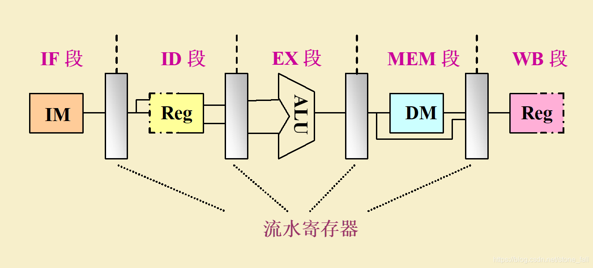

这样子到操作可以极快的提高CPU的运算速度，但是在遇到if、for、switch等语言结构的时候，就需要进行\*\*分支预测\*\*，依此来判断哪边代码出现的概率大，然后就将其加入流水线。

但是这可能会出现预测错误，于是清空流水线产生了，结合我们写在`loader.S`中的代码进行解释


```

jmp dword SELECTOR_CODE:p_mode_start    ;刷新流水线

```

- 首先，段描述符缓冲区寄存器还没有更新，他还是实模式下的值，而进入保护模式需要填充正确的信息
- 其次，在默认情况下，若未使用bits伪指令来设置运行环境，编译器将一直以16位实模式来作为指令编译格式，我们都知道CPU为了提高流水线效率而采用了流水线，这样指令间就是重叠执行的，我们在执行`jmp dword SELECTOR_CODE:p_mode_start`指令时他仍是被编译为16位，因此咱们添加了dword为指令，因此其机器码会添加0x66模式反转前缀，而在这条指令之后由于添加了bits 32 伪指令，所以之后全是32位指令

那么这段代码干了什么呢：

> 在我们即将要吧cr0的pe位置1时，它之后的部分指令已经被送上流水线，但是段描述符缓冲寄存器在实模式下以及使用了，其中低20位为段基址，但其他位默认为0,因此描述符中的D位为0,表示16位，这就出了点问题了，也就是说现在流水线上的指令都是按照16位操作数来译码的，所以我们现在所做的工作是既要改变代码段描述符缓冲寄存器的值，又要清空流水线
>
> 代码段寄存器cs只有用 过程调用指令call，远转移指令jmp、远返回指令retf等指令间接改变，没有直接改变cs的方法。而CPU遇到jmp指令时，会将已经送上流水线的指令清空，所以jmp有着清空流水线的功效。


## 0x05 内存容量检查及内存分页


### 0x05 00 基础知识

在进入内核知识之前，先简单了解一下如何获取物理内存容量。因为我们要在后期做好内存管理工作，应该先知道自己有多少物理内存不是嘛

**Linux获取内存的基本方法**

在linux的2.6内核中，使用detect\_memory函数获取内存容量，但是查看函数源码，我们可以发现这个函数的本质上是通过调用BIOS中断0x15的三个子功能实现的，源码可见[这里](https://elixir.bootlin.com/linux/v2.6.39.4/source/arch/x86/boot/memory.c#L122)

- eax = 0xe820:遍历主机上全部内存
- ax = 0xe801:分别检测低15MB和16MB~4GB内存，最大支持4GB
- AH= 0x88:最多检测64MB内存，实际内存超过此容量也按照64MB返回

下面介绍一下第一种方式

**利用BIOS中断0x15子功能0xe820获取内存**

这个方式获取的返回信息最多，但因为信息过多，所以我们需要一种方式来组织这些数据，这种结构称之为ARDS（地址范围描述符），汇编伪代码如下


```

ARDS_struct:
    BaseAddrLow   dd 0    ; 低 32 位基地址
    BaseAddrHigh  dd 0    ; 高 32 位基地址
    LengthLow     dd 0    ; 低 32 位长度
    LengthHigh    dd 0    ; 高 32 位长度
    Type          dd 0    ; 内存类型

```

BIOS按照上述类型来返回内存信息是因为这段内存可能有下面几种情况

- 系统的ROM
- ROM用到了这部分内存
- 设备内存映射到了这部分内存
- 某种原因导致这部分内存不适合标准设备使用

相关的寄存器如下

| 寄存器 | 输入参数（调用前） | 输出参数（返回后） |
| --- | --- | --- |
| EAX | `0xE820`（功能号） | 可能被修改（某些 BIOS 实现会保留）。 |
| EBX | 连续调用索引（首次调用设为 `0`） | 下一个索引（若 `EBX=0` 表示遍历完成）。 |
| ECX | ARDS 结构大小（通常 `20` 字节） | 实际写入的字节数（通常 `20`）。 |
| EDX | `'SMAP'`（签名 `0x534D4150`） | 保持不变。 |
| ES:DI | ARDS 缓冲区指针（存放返回的内存描述符） | 填充后的 ARDS 结构。 |

**虚拟地址**

这里拿物理地址做一个对比。物理内存可以认为是一个物理字节数组，每个物理地址指向这个物理字节数组中的一项；而虚拟内存也可以理解为一个物理字节数组，但是这个字节数组是存储在磁盘上的。

综上呢，物理地址空间中的每个物理地址都是实打实地指向了具体的存储单元，虚拟地址空间中每个虚拟地址指向哪里有3种情况：

- 未分配：这个虚拟地址仅仅只是数字，没有任何指向
- 未缓冲：这个虚拟地址指向了磁盘的某个字节存储单元，里面存储了指令或者数据
- 已缓冲，这个虚拟地址指向了物理内存的某个字节存储单元，里面存储了指令或者数据

回到我们自己的操作系统，这里只有512MB的物理内存，但是32位操作系统的最大寻址空间是4GB。但对于程序来说它不知道，它只知道它在一个32位系统上，应该有4GB的内存空间供它加载，那么怎么加载的问题就是由链接器决定，也就是由程序员自行决定。但是问题依旧在，512MB的内存怎么够4GB活动呢？于是我们将整片程序中的一部分称为页，然后我们按照自己的需要映射到真实的物理内存当中，此时我们并不需要一次性全部放到物理内存当中

这样就可以给程序一个假象，它认为自己在一个4GB的连续空间中加载，但实际上，它早就被切片成一个个小小的部分，分配到一定的地址里，不再连续。操作系统的作用就是映射，将虚拟内存映射到真正的内存里。

接下来分析一下这个\*\*切片\*\*————页。一般页被分为4KB（对应12位地址），而我们是32位系统，所以高20位为页地址，低12位是页内的地址，在我们本来的程序中是进行了分段的操作，但是载入物理内存的过程中就会进行分页而打乱顺序，此时就需要用到页表，而表中保存的就是一个个映射，保证你按照顺序访问虚拟地址。然后，根据页地址的划分，我们又可以分为一层页表、二层页表等等

先介绍一下一层页表，后面其实就很好理解了

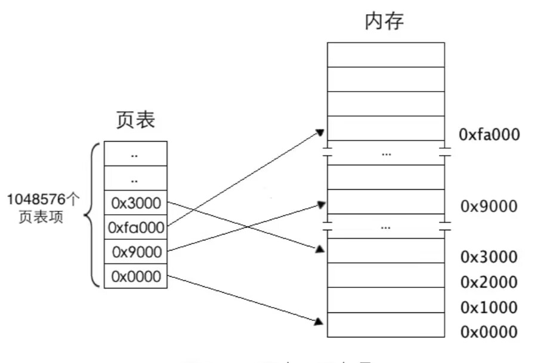

任意地址最终会落在某个物理页上，那么定位到某个具体物理页，然后给出物理页内的偏移量就可以访问到任意1字节的内存。**所以用20位2进制就可以表示全部的物理页，12位二进制就可以表达4KB之内的任意地址**

接下来有了另一个问题， 我们该怎么在线性地址中找到页表中对应的页表项？

> 1. 分页机制打开前要将也表地址加载到寄存器cr3中，这是启用分页机制的先决条件之一。所以在打开分页机制前加载到寄存器cr3中的是页表的物理地址，页表中页表项的地址自然就是物理地址了
> 2. 内存分页机制的作用是将虚拟地址转化为物理地址，但其转化过程相当于在关闭分页机制下进行，过程所涉及到的页表以及页表项的寻址，他们的地址都被CPU当作最终的物理地址直接送上地址总线，不会被分页机制再次转换
>
> 那么想要访问其中任意页表项的成员，只要知道该页表项的索引（下标）就可以了：
>
> 一个页表项对应一个页，所以用线性地址高20位作为页表项的索引，每个页表项要占用4字节大小，所以这高20位的索引乘以4后才是该页表项的物理地址，从该页表项中得到映射的物理页地址，然后用线性地址的低12位与该物理页地址相加，所得到的地址之和就是最终要访问的物理地址

下面是一个二层页表结构的图

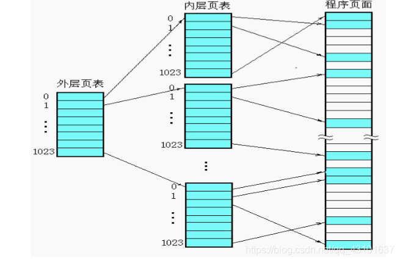

> 其实有一个很关键的问题，都已经有一级表了，要二级表干嘛？
>
> 1. 一级页表中最多可容纳1M(1048576)个页表项，每个页表项是4字节，如果页表项全满，就是4MB
> 2. 一级页表中所有页表项必须要提前建好，原因是操作系统要占用4GB虚拟地址空间的高1GB，用户进程要占用3GB
> 3. 每个进程都有自己的页表，进程一多，页表占用的空间就会很大
>
> 总而言之，我们要解决的问题就是：我们怎么样动态的创建页表项呢？

每个页都是4KB是不变的（大页除外）。所以4GB线性空间最多有1M个标准页也是不变的。以及标准也是将这1M个标准页放置到一张页表中，二级页表是将这1M个标注你也表平均放置1K个页表中。每个页表中包含1K个表项。页表项是4字节大小，页表包含1K个页表项，故页表大小为4KB,合适得很

> 二级页表地址转换原理是将32位虚拟地址拆分成高10位，中10位，低12位。高10位作为页表的索引，用于在页目录表中定位一个页目录项PDE，页目录项中有页表物理地址，也就是定位到了某个页表。中间10位作为物理页的索引，用于在页表内定位到某个页表项PTE，页表项有分配的物理页地址，也即是定位到了某个物理页。低12位作为页内偏移量用于在已经定位到的物理页内寻值

之后的四层甚至更多，其实也是按照这种样子，将寻址做的一层层，就不多说了

**使用虚拟地址访问页表**

我们在程序进行的过程中，免不了会进行类似于malloc等的内存申请，或者说因为管理内存而许纳泽释放块，所以页表应该是一个动态的概念（跟上面二级页表的优点一致），应该随着我们的要求来增加或者说删减。

要实现这个功能我们首先就得使用虚拟地址访问到页表，我们可以将页目录的最后一项保存为页目录的首地址


```

mov [PAGE_DIR_TABLE_POS + 4092], eax    ;使得最后一个目录项地址指向页目录表自己的地址

```

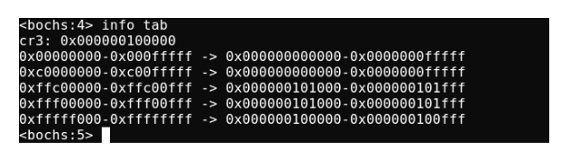

这里根据这个分析一下虚拟地址与物理地址的映射关系（左边是32位虚拟地址的范围，右边是虚拟地址对应的物理地址，不过用48位表示。分析各行的映射结果

> > 第一行，虚拟地址0x00000000~0x000fffff,这是虚拟空间低端1M内存，其对应的物理地址是0x000000000000～0x0000000fffff。这是第0个页表起的作用，ecx=256就是为256个页表项分配物理页
> >
> > 第二行，虚拟地址0xc0000000~0xc00fffff，这是第768个页表起的作用。由于第0个页目录项和第768个页目录项指向的是同一个页表，所以其映射的物理地址依然是0x000000000000-0x0000000fffff
>
> 接下来就出现了三个比较奇怪的页项
>
>

```

0xffc00000～0xffc00fff -> 0x000000101000～0x000000101fff
0xfff00000～0xfff00fff -> 0x000000101000～0x000000101fff
0xfffff000～0xffffffff -> 0x000000100000～0x000000100fff

```

> > 首先第一个，`0xffc00000～0xffc00fff -> 0x000000101000～0x000000101fff`
> >
> > 虚拟地址的高10位用来访问页目录表中的目录项，如果高10全为1，这就说明我们访问此虚拟地址的时候访问的是最后一个页目录项，而最后一个页目录项保存的不是页表地址，而是页目录的地址，这样我们的及其就会将页目录看成一个页表来理解，此时我们页目录最后一项保存的是0x101000,所以我们也会映射到0x101000-0x101fff
> >
> > `0xfff00000～0xfff00fff -> 0x000000101000～0x000000101fff`
> >
> > 首地址0xfff00000来分析，高10位全是1表示该虚拟地址在页目录中对应的是最后一个页目录项，目前为止同上面是一致的，然后我们取中间10位发现其为0x300，对应的是页目录项中第0x300表项也就是偏移为0xc00的地方，这里我们之前将其的地址也改为了第0个页表地址，所以此时这段映射会映射到0x101000-0x101fff
> >
> > `0xfffff000～0xffffffff -> 0x000000100000～0x000000100fff`
> >
> > 首地址分析可知，高10位和中10位都是1，所以我们呢首先会查看页目录最后一页，然后将页目录表当作页表看待，然后我们再次访问页目录最后一项，我们认为它是页表最后一项，这里保存的仍然是0x100000，所以我们这里的映射是0x100000-0x100fff


### 0x05 01 实践代码

这一部分还是直接看他人的吧，这里不加赘述了


## 02 总结

这次我们从实模式寻址走向了页表。走过了过程如下：

**直接访问 -> 段基址+段偏移地址 -> 段选择子+段偏移地址 -> 虚拟地址**

让我们重新串联一次


### 直接访问

直接访问是\*\*实模式\*\*最为核心的特征和设计目标，可以说，实模式就是为了实现程序对物理内存的\*\*无限制、直接访问\*\*而存在的，如下图所示

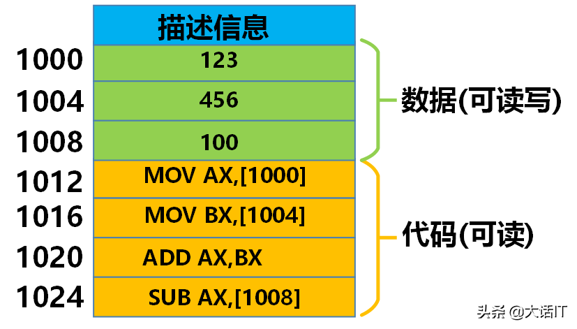

上图可执行文件中1000~1024之间的地址加载到内存的后内存的地址也是1000 ~ 1024，在可执行文件中分配的唯一地址就是内存中的物理地址

> 问题随之而来：同一个可执行文件不可以同时执行，因为他们的物理地址是一样的，这会导致冲突。还有就是这个可执行文件的物理地址已经固定了，如果想在其它物理地址上运行，必须重新编译


### 段基址+段偏移地址

随着多任务需求的来临，直接定位的方法必然被淘汰，于是开发者们发明了段基址+段偏移地址。

实模式通过段寄存器（CS，DS，ES，SS)和偏移地址（IP，SI，DI，BX，SP，BP）来计算物理地址
$$
物理地址=(段寄存器 \* 16) + 偏移地址
$$
如下图所示的定位偏移

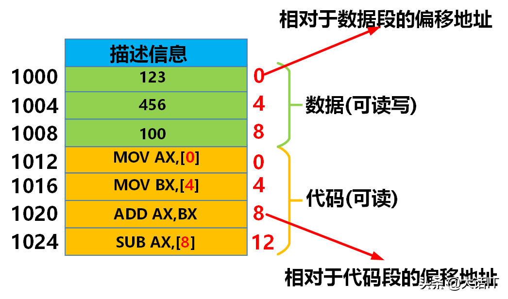

右边红色就是存储的偏移，`0 4 8`是相对于数据段的偏移地址，`0 4 8 12`是相对于代码段的偏移地址。

当可执行文件加载到内存时，现在内存中分配一个数据段和代码段（这两个段理论上可以分开存储）

当CPU开始执行代码段的第一条指令的时候，会将代码段的其实地址放入到段寄存器中，此时CS代码段寄存器中存储的就是0x00600000 -> 开始从起始地址处开始执行第一条代码指令，此时把代码指令的偏移地址放入到IP寄存器中，IP寄存器存储的就是0，所以CPU要定位一条代码指令时通过`CS：IP`的方式定位，正如下图所示

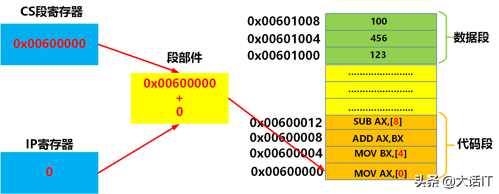

> 这种定位方式不再固定程序的执行位置，而是靠相对偏移来或许对应数据，较于直接访问更加灵活，也允许同一程序的同时运行了。
>
> 但依旧存在问题：程序之间没有内存隔离，是一块完整的程序，一个程序就可以轻易的破坏另一个程序或者操作系统的内存，过于危险。


### 段选择子+段偏移地址

`段选择子+段偏移地址`和`段基址+段偏移地址`形式相似，发明他的意义就是为了安全

\*\*段选择子+段偏移地址\*\*中的\*\*段选择子\*\*可以认为是一个索引，这个索引指向了那两个全局段描述符表中的一项，全局段描述表存储在内存中，它的起始地址存储在全局段描述符寄存器中

- \*\*段选择子\*\*是一个16位的值，存储在段寄存器中，`本身不包含任何内存地址信息`，高13位就是全局段描述表的索引
- \*\*段偏移地址\*\*是由指令指针（EIP）、通用寄存器（EAX、EBX、ECX、EDX、ESI、EDI、EBP、ESP）或其它寻址方式产生的32位或64位地址。它制定了\*\*段内\*\*具体位置
- \*\*段描述符\*\*是保护模式的关键数据结构，它是一个8字节（64位）的表项，存储在全局描述表GDT或局部描述符表LDT中
- **段基址**：该段在物理内存中的起始地址（32位）
- **段界限**：该段的最大有效偏移（20位，配合粒度决定单位是字节还是4KB页）
- **访问权限/属性**，包括：
  - 是否存在于内存
  - 描述符特权级：访问该段所需的最低CPU特权级
  - 类型（Type）:代码段、数据段、堆栈段；可读、可写、可执行等
  - 其它标志

计算过程：

将代码段的选择子放入到CS段寄存器中 -> CPU从段寄存器中获取段选择子 -> 截取选择子的高13位获取索引 -> 根据全局描述符表寄存器的地址找到全局描述符表的起始地址 -> 根据 `起始地址 + 索引 * 8`获取段的地址 -> 段的基址加上ip寄存器中的偏移地址得到指令的物理地址

如下图1~6

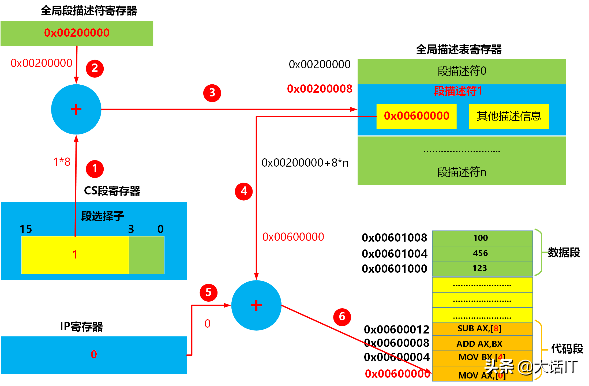

> 截止目前，段选择子 + 段偏移地址通过索引GDT（全局描述符表），成功将逻辑地址转换为线性地址（其实是在逻辑地址和线性地址间添加了一层GDT抽象，用于解析段基址）。成功的将各个内存隔离开来，保护模式确实安全了很多
>
> 但同样的，问题依旧存在：纯分段机制导致内存被划分成大小不一的段，当程序结束时，内存会留下一个个空洞，这样导致内存使用效率越来越低，连续的大内存越来越难找。并且，这里映射出来的还是物理地址，受硬件制约过大。


### 虚拟地址

为了解决这个问题，分页机制产生了，当打开分页机制时，\*\*段选择子+段偏移地址\*\*得到的地址就不再是物理地址了，而是虚拟地址，默认打开分页

其核心思想是将物理内存和程序的线性地址空间都划分为固定大小的块，称为\*\*页帧\*\*，操作系统维护一个\*\*页表\*\*，负责将程序只用的\*\*虚拟/线性地址空间中的页面\*\*映射到物理内存中的页帧或者磁盘上的交换空间。

当操作系统加载一个可执行文件后，创建了一个进程，这个进程就有了自己的虚拟地址空间，每个进程的虚拟地址空间都是一样的

| 0b6a5cd9f7f9d8aafabcbdc271f06a7d |
| --- |
| *进程虚拟地址空间* |

如上图所示，进程的虚拟地址空间被统一划分成了多个固定区域。其中内核区域是操作系统自己的代码，内核在物理内存中只存储一份，每个进程将这个区域的虚拟地址映射到同一份内核物理内存上，如下图所示

| 63ebf0eefc696fd971d295bc442d4e68 |
| --- |
| *内核和共享库的映射* |

虚拟页存储在磁盘上，物理页则存储在DRARM上

通常操作系统加载可执行文件后，创建了一个进程，这个进程就有了虚拟地址空间，这并不意味着可执行文件已经从磁盘加载到内存中了，操作系统只是为了进程虚拟地址空间的每个区域分配了虚拟页。

代码和数据区域的虚拟页被分配到了可执行文件的适当位置，此时虚拟页状态为未缓冲，虚拟页指向了磁盘地址。之后通过翻译，可以成功映射到应有的物理地址中。而多级页的存在是为了加快这个速度（这个很好理解，可以看作从线性搜索变成了2分搜索这样子）

综上，我们走完了从实模式开始到现代虚拟地址的内存管理模式，这篇文章告一段落，内容很长。
