# 内核


## 0x06 载入初始内核


### 0x06 00 基础知识

**ELF文件**

每个文件都存在一个文件头，这个文件头里存放着包含这个文件的各种信息。

目标文件既会参与程序连接又会参与程序执行。处于方便性和效率考虑，根据过程的不同，目标文件格式提供了有其内容的两种并行视图


首先是\*\*ELF heafer\*\*部分


```
#define EI_NIDENT   16 typedef struct{
unsigned char e_ident[EI_NIDENT
];
//Magic number（前4字节）；ELF文件内容如何解码等信息
ELF32_Half e_type;
//描述了ELF文件的类型
ELF32_Half e_machine;
//描述了文件面向的架构
ELF32_Word e_version;
//描述了ELF文件的版本号
ELF32_Addr e_entry;
//执行入口点，如果文件没有入口点，这个域保持0（4字节）
ELF32_Off e_phoff;
//*program header table*的offset，如果没有PH,则这个值是0
ELF32_Off e_shoff;
//section header table的offset,如果没有SH，则这个值是0
ELF32_Word e_flags;
//特定于处理器的标志，Intel架构一般都是0
ELF32_Half e_ehsize;
//ELF header的大小，32位的ELF是52字节，64位是64字节
ELF32_Half e_phentsize;
//program header table中每个入口的大小
ELF32_Half e_phnum;
//e_phentsize*e_phnum得到整个program header table的大小
ELF32_Half e_shentsize;
//section header table中entry的大小，即每个section header占多少字节
ELF32_Half e_shnum;
//同e_phnum
ELF32_Half e_shstrndx;
//section header string table index. 包含了section header table中section name string table。如果没有section name string table,e_shstrndx的值是SHN_UNDEF} Elf32_Ehdr;
```

这里可以用`readelf -h <elffile>`来读取文件头，例如下图

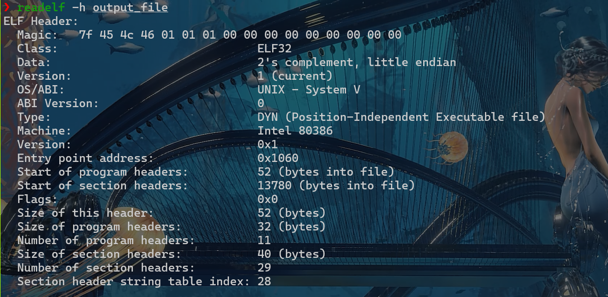

接下来是\*\*程序头表（Program Header Table)\*\*部分


```c
typedef struct{
ELF32_Word p_type;
//表示该段的类型
ELF32_Off p_offset;
//表示本段在文件中的偏移地址
ELF32_Addr p_vaddr;
//表示本段正在虚拟内存中的起始地址
ELF32_Addr p_paddr;
//仅用于与物理地址相关的系统中，因为System V忽略用户程序中所有的物理地址
ELF32_Word p_filesz;
//表示本段在文件中的大小
ELF32_Word p_memsz;
//表示本段子内存中的大小
ELF32_Word p_flags;
//指明本段的标志类型
ELF32_Word p_align;
//对齐方式} Elf32_Phdr;
```

同样的可以使用`readelf -l <file>`来读取程序头，如下

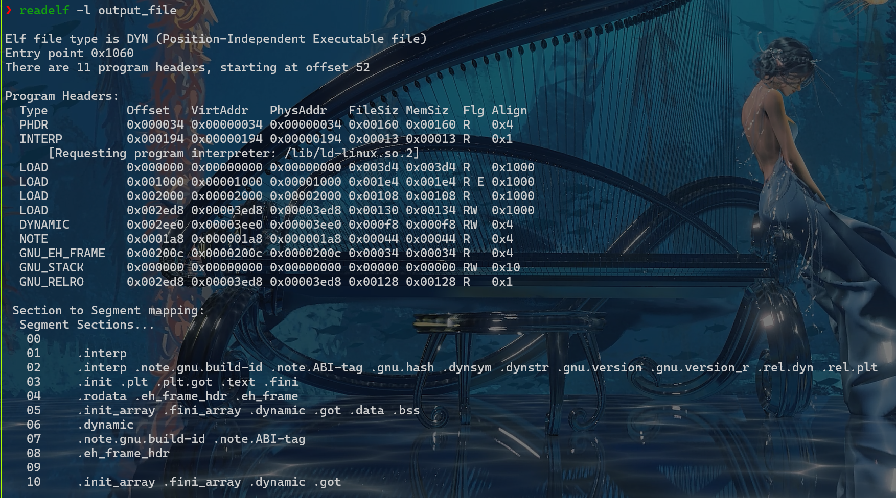


### 0x06 01 实现初始内核

略去了就


## 0x07 特权级

计算机里的一系列指令执行等操作都可以被认为是某个访问者来访问受访者。这里房屋内者和受访者都有属于自己的\*\*特权级\*\*，而特权级较低的访问者是不允许访问特权级较高的受访者。如下图，数字越小，特权级越高

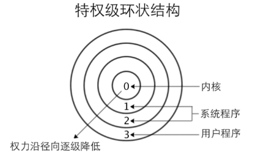

其中，\*\*操作系统\*\*位于最内环的0级特权，他控制硬件，掌控各种核心数据。\*\*系统程序\*\*分别位于1级特权和2级特权，运行在这两层的程序一般是虚拟机、驱动程序等系统服务。\*\*用户程序\*\*在最外层，为3级特权


#### TSS

即Task State Segment：任务状态段，它是每个任务都有的结构。其功能是\*\*任务切换和任务管理\*\*。结构如下：

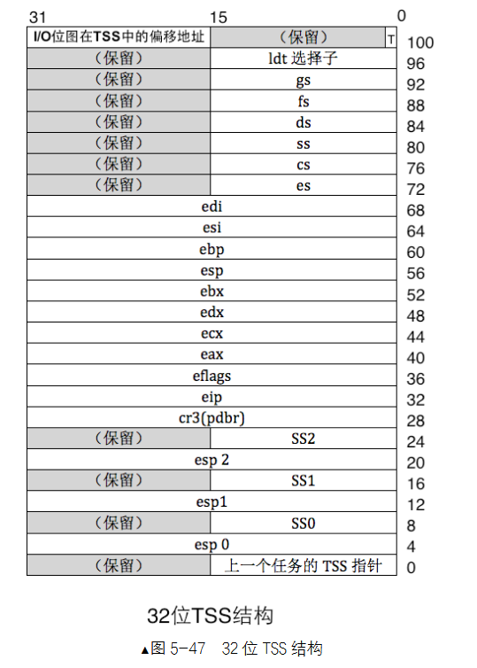


```c
struct TSS{
uint32_t prev_tss; // 前一个任务的 TSS 链接（用于嵌套任务）
uint32_t esp0; // Ring 0 的堆栈指针（用户态切换到内核态时用）
uint32_t ss0; // Ring 0 的堆栈段选择子
uint32_t esp1, ss1; // Ring 1（不常用）
uint32_t esp2, ss2; // Ring 2（不常用）
uint32_t cr3; // 页目录基址（页表）
uint32_t eip; // 程序计数器
uint32_t eflags; // 状态寄存器
uint32_t eax, ecx, edx, ebx;
uint32_t esp, ebp, esi, edi; // 通用寄存器
uint32_t es, cs, ss, ds, fs, gs; // 段寄存器
uint32_t ldt; // LDT 段选择子
uint16_t trap;
uint16_t iomap_base; // IO 权限位图起始偏移 };
```

上面的结构图告诉我们有三个栈顶`esp0、esp1、esp2`，分别对应3个特权级，用来保存相关的内容。而3号特权级栈，也即用户栈，它的切换是通过保存上下文来进行的

!!! note
    \*\*进程\*\*是程序的一次执行实例，是操作系统进行资源分配和调度的基本单位

- 拥有独立的地址空间
- 拥有自己的代码段、数据段、堆、栈
- 有用系统资源（文件描述符、内存、信号量等）
- 每个进程都有一个唯一的PID

\*\*任务\*\*是一个更加广义的术语，在不同上下文中含义不太一样

| 上下文 | 含义 |
| --- | --- |
| Linux内核 | 任务 ≈ 一个执行单元，可能是进程或者线程 |
| x86架构 | 指的是一个TSS表示的活动实体 |
| 一般语境 | 抽象的工作单元，比如某个需要执行的功能 |

**任务vs进程（Linux角度）**

| 比较项 | 任务（Task） | 进程（Process） |
| --- | --- | --- |
| 定义 | 内核中的调度单元，使用 `task_struct` 表示 | 程序的执行实例，使用 PID 区分 |
| 范围 | 包含进程和线程 | 严格指拥有独立资源的执行体 |
| 地址空间 | 可共享（线程）或不共享（进程） | 拥有独立地址空间 |
| 资源管理单位 | 否（线程间共享资源） | 是（进程独立拥有资源） |
| 调度单位 | 是 | 是（本质上由 `task_struct` 支持） |

特权级在变化的时候，需要用到不同特权级下的栈，当处理器进入不同特权级时，他会自动在TSS中找同特权级的栈

!!! note "举个例子（从用户态中断进入内核态）"


    假设现在的情况是：Ring3遭遇触发中断,则变化过程如下：


    ```mermaid
    flowchart
      A[CPU检测特权级变化R3->0]:::step1
      B[从当前 GDT 中 TSS 描述符找到 TSS 地址]:::step2
      C[加载 TSS 中的 ESP0 和 SS0]:::step3
      D[切换堆栈为内核栈，并在其上压入旧的用户态 SS、ESP、EFLAGS、CS、EIP]:::step4
      E[跳转到中断处理程序执行]:::step5
      F[内核结束后通过 IRET 返回用户态]:::step6

      A --> B
      B --> C
      C --> D
      D --> E
      E --> F

      classDef step1 fill:#FF6347,stroke:#D32F2F,stroke-width:2px,color:white;
      classDef step2 fill:#FFD700,stroke:#F57C00,stroke-width:2px,color:white;
      classDef step3 fill:#1E90FF,stroke:#1976D2,stroke-width:2px,color:white;
      classDef step4 fill:#8A2BE2,stroke:#6A1B9A,stroke-width:2px,color:white;
      classDef step5 fill:#FF4500,stroke:#FF8C00,stroke-width:2px,color:white;
      classDef step6 fill:#228B22,stroke:#388E3C,stroke-width:2px,color:white;


当然了，TSS和GDT一样是个数据结构，也自然如GDT一样需要相关的找到他的数据结构，GDT有GDTR，TSS有TR寄存器


#### CPL和DPL

PL（Privilege Level）也就是CPU用来记录特权级高低的标识

RPL(Requestor Privilege Level)也就是\*\*请求特权级\*\*。它表示请求该段的程序的特权级，通常由段选择符中的特权级指定的

CPL(Current Privilege Level)也就是\*\*当前特权级\*\*。CPL的值由当前执行代码段的段选择符的特权级决定，通常会影响CPU如何执行指令和响应外部事件

DPL(Descriptor Privilege Level)也就是\*\*描述符特权级\*\*。每个段都有一个描述符，这些描述符包含了访问该段时所需的特权级要求。DPL的值决定了该段能否被具有相应CPL的程序访问。

> 例如：某个段的DPL值为1，那么只有CPL<=1的程序才可以访问该段

总而言之，CPL 代表当前正在执行的代码的特权级，而 DPL 代表段的特权级。通过这两个机制，操作系统可以有效地隔离不同权限级别的代码和数据，确保系统的安全性

!!! note "三者的访问规则&&例子"


    ```

    - **有效访问**：当程序要访问一个段时，必须满足以下两个条件：

      1. **CPL <= DPL**：即程序的当前特权级（CPL）不能高于段描述符的特权级（DPL），否则会导致特权级错误。

      2. **RPL <= DPL**：即请求特权级（RPL）也不能高于段的描述符要求的特权级（DPL），否则也会触发错误。

    - **限制访问**：如果 **CPL > DPL** 或 **RPL > DPL**，则访问该段会失败，触发特权错误（如 #GP 异常）。

    --------------

    **举个例子**

    假设有一个段描述符，其 **DPL** 为 0（内核模式）。有两个程序，它们的 **CPL** 和 **RPL** 如下：

    1. 程序 A 的 **CPL** 为 0（内核模式），**RPL** 为 3（用户模式），请求访问该段。

    2. 程序 B 的 **CPL** 为 3（用户模式），**RPL** 为 2（中间权限），请求访问该段。

       在这种情况下：

       - 程序 A 可以访问该段，因为 **CPL (0)** <= **DPL (0)** 且 **RPL (3)** <= **DPL (0)**。
       - 程序 B 无法访问该段，因为 **CPL (3)** > **DPL (0)**，即它的当前特权级低于该段描述符所要求的特权级。

    ```

但是这样存在一个问题：某一特权级的代码段，低它一级的没法运行，高它一级的不让运行。**因此受访者为代码段的时候，一般情况下，只能平级访问**

但这样会导致另一个问题，我们低特权级下的指令真的想要用高特权级的指令，怎么办呢？于是给出了\*\*一致性代码\*\*这一东西

!!! note
    一致性代码段也称为依从代码段。用来实现从低特权级的代码向高特权级的代码转移。

一致性代码段是指如果自己是转移后的目标段，自己的特权级（DLR）一定要大于等于转移前的CPL,即\*\*数值上CPL>=DPL\*\* / **一致性代码段的DPL是权限的上限**，任何在此权限之下的特权级都可以转到此代码段上执行

一致性代码段的一大特点是转移后的特权级不与自己的特权级（DPL）为主，而是与转移前的低特权级一致，听从、依从转移前的低特权级。也就是说，处理器遇到目标端为一致性代码段的时候，并不会将CPL用该目标段的DPL替换

因此这一代码的转移并没有提升特权级，只是在特权级更高的地方执行指令，并未产生因特权级升高而产生潜在危险

但我们总不能一直这样运行，因为有的代码他不会标识为一致性代码，所以我们就需要其它机制来使得我们向高特权级转化


#### 门、调用门、RPL序

首先了解一下\*\*门结构\*\*：它是记录一段程序起始地址的描述符，用来描述一段程序，**进入这个门结构之后，处理器就可以转移到更高的特权上**

| 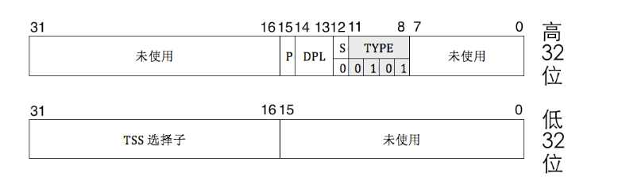 |
| --- |
| 任务门描述符 |
| 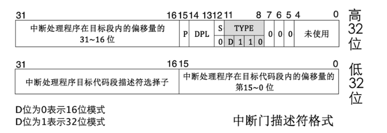 |
| 中断门描述符 |
| 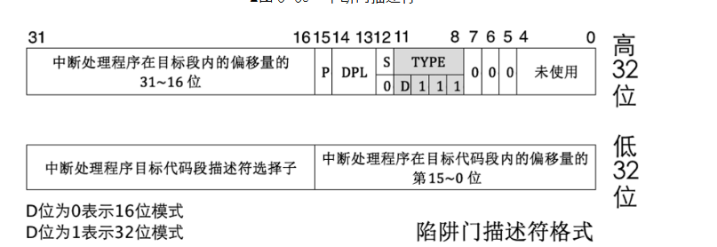 |
| 陷阱门描述符 |
| 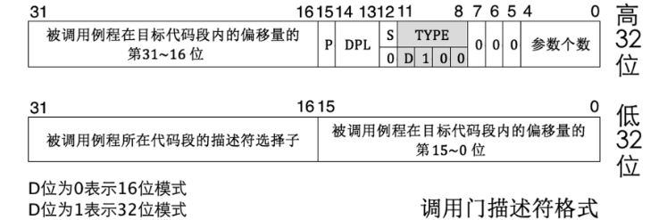 |
| 调用门描述符 |

除任务门之外，他们与段描述符最大的不同在于：这些门都是对应到一段例程之中，即对应一段函数，而不是像段描述符一样对应的是一片内存区域。由于任何程序都属于某个内存段，所以程序确切的地址必须用“代码段选择子+段内偏移量”来描述。可见门描述符基于段描述符，所以门描述符中记录的是选择子和偏移量的原因

任务门描述符可以放在GDT、LDT和IDT（中断描述表）中，调用门可以位于GDT、LDT中，中断门和陷阱门仅位于IDT中

此外，由于任务门、调用门都直接位于描述符表中，所以这两个门都可以直接用call、jmp指令直接使用；陷阱门和中断门位于IDT中，所以这两个门只能由中断信号触发

下面分别说下每个门的适用范围：

- **调用门**：call和jmp指令后接调用门选择子为参数实现系统调用，call指令使用调用门可以实现向高特权级代码转移，jmp使用调用门只能实现平级代码转移
- **中断门**：以int指令主动发中断的形式实现从低特权级到高特权级转移
- **陷阱门**：以int3指令主动发中的的形式实现低特权级向高特权级转移，这一般是编译器在调式时用
- **任务门**：任务以状态段TSS为单位，用来实现任务切换，它可以借助中断或指令发起。当中断发生时，如果对应的中断向量号是任务门，则会发起任务切换。也可以像调用门那样，用call或jmp指令后接任务门的选择子或任务TSS的选择子

| 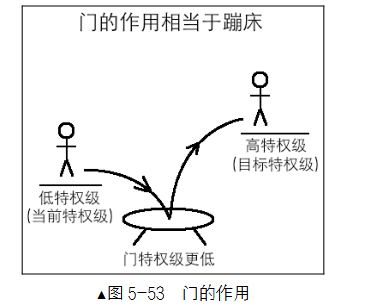 |
| --- |
| 为什么可以使用门的结构进入高特权级，这个图太形象了 |

门的特权级是一定要低于我们访问者的特权级的，这样才能保证我们能过调用门，而受访者的特权级一定得高于访问者者，不然没有意义了

!!! note "调用门的内部执行结构：点击查看更多"


    ```

    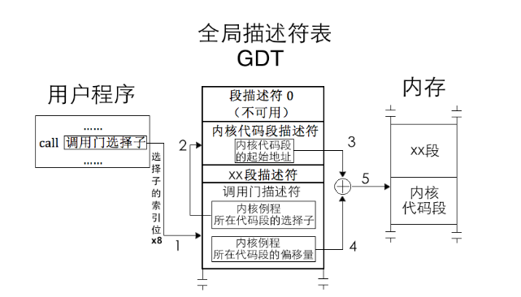

    从调用门选择子到或许到内核代码的地址，共经历了5个步骤。

    **用户程序调用调用门选择子**

    在用户程序中有一句代码`call 调用门选择子`,call指令可以使用调用门，参数就是调用门的选择子，该选择子指向GDT或LDT中的某个门描述符。

    **处理器查找门描述符地址**

    处理器用门描述符选择子的高13位（索引位）乘以8作为该描述符在GDT中的偏移量，再加上寄存器GDTR中的GDT基地址，最终找到了门描述符的地址，它位于GDT中从0起的第3个描述符位置。

**获取内核例程地址**

在该描述符中记录的是内核例程的地址。我们知道，在保护模式下描述某个内存地址是离不开选择子和偏移量的，所以，门描述符中记录的是内核例程所在代码段的选择子及偏移量

**处理器查找内核代码段描述符地址**

处理器用代码段选择子的高13位索引值乘以8，加上GDT基址，得到内核代码段描述符地址

**最终获取内核例程起始地址**

用已经得到的内核代码段描述符地址，我们就可以最终得到内核例程的起始地址


#### 调用门的过程保护

调用门涉及两个特权级，先是转移前的低特权级，这是程序调用“调用门”时的CPL；再就是转移后的目标特权级，这是由门描述符中选择子对应的目标代码段的DPL决定的。

接下来，假设用户进程要调用某个调用门，该门描述符中的参数个数是2，也就是说用户进程需要为该调用门提供2个参数才行。调用前的当前特权级为3，调用后的新特权级为0，所以调用门转移前用的是3特权级栈，调用后用的是0特权级栈

现在为此特权门提供2个参数，这是在使用调用门前完成的，目前是在3特权级，所以要在特权级栈中压入参数，分别是参数1和参数2

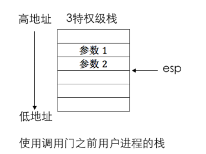

接下来确定新栈，这一步中我们根据门描述符中所寻找到的选择子来确定目的代码段的DPL值，这将作为我们日后的CPL值存在，同时我们会通过TSS来确定相对应的DPL站地址，也就是栈段选择子SS和栈指针ESP，这里记作SS_NEW、ESP_NEW

如果转移后的代码段特权提升，我们就需要换到新栈，此时旧段选择子我们记为SS_OLD、ESP_OLD,由于我们这俩值需要保存到新栈中，这是为了方便日后使用retf等指令进行返回旧栈，此时我们需要将SS_OLD、ESP_OLD放到某个地方进行保存，例如其他的一些寄存器，然后当我们将SS_NEW和ESP_NEW载入到SS和ESP寄存器后，咱们再将他俩压入新栈就行了

然后再将用户栈中保存的参数压入新栈

由于调用门描述符中记录的是某个段选择子和偏移，所以此时我们的cs寄存器需要用这个选择子重新加载，所以我们需要将旧的CS和EIP保存到栈上，然后重新加载两个寄存器

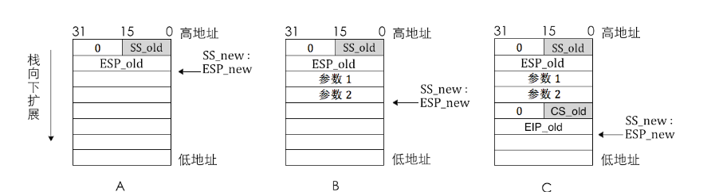

之后就是按照CS：EIP指示来运行内核例程从而实现特权级从3到0.

**但是总归是要回到原本的特权级，这里就是高特权级到低特权级了——retf指令：**

1. 首先进行检查，检查之前栈中保存的旧CS选择子，判断其中的RPL，来决定是否需要进行权限变换
2. 然后弹出CS_OLD和EIP_OLD,目前为止ESP就会指向最后压的那个参数
3. 此时我们需要跳过参数，所以得到将ESP_NEW的值加上一定偏移，使得他刚好指向ESP_OLD
4. 若第一步中确定需要进行权限变换，此时再次pop两次，这样就恢复了之前的SS和ESP了

> 书中作者举了一个相当生动形象的例子：
>
> 不知道大伙儿学车了没有，报考驾校也要有个年龄限制，即使考 C本B本也要分年龄的。假如某个
> 小学生A（用户进程）特别喜欢开车，他就是想考个驾照，可驾校的门卫（调用门〉一看他年龄太小都不让他进门，连填写报名登记表的机会都没有，怎么办？于是他就求他的长辈B（内核〉帮他去报名，长辈的年龄肯定够了，门卫对他放行，他来到驾校招生办公室后，对招生人员说要帮别人报名。人家招生人员对B说，好吧，帮别人代报名需要出示对方的身份证（RPL)，于是长辈B就把小学生A的身份证（现在小孩子就可以申请身份证，只是年龄越小有效期越短，因为小孩子长得快嘛）拿出来了，招生人员一看，年纪这么小啊，不到法制学车年纪呢，拒绝接收。这时候驾校招生人员的安全意识开始泛滥了，以纵容小孩子危险驾驶为名把长辈B批评了一顿（引发异常）

```


## 0x08 实现打印函数

这一段更多的是实操相关，没什么值得记录的知识点


## 0x09 实现中断机制


### 基础知识

\*\*中断\*\*是计算机系统中的一种机制，用于打断正在执行的程序流程，以便处理更紧急或更高优先级的事件。和特权模式的切换息息相关

中断按照来源一般分为两种类型：**外部中断\*\*和\*\*内部中断**


#### **外部中断**

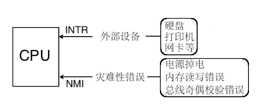

CPU为了接受外部设备的中断信号请求，设置了两条信号线INTR、NMI。

其中INTR收到的信号都是不影响系统运行的，可以随时处理，甚至可以不处理，因为它不影响CPU的运行；而只要从NMI引脚收到的中断，那必须要处理，因为这个是\*\*灾难性错误\*\*

**可屏蔽中断**

这指的是可以通过软件设置来屏蔽或允许的外部中断请求。在中断控制器中，CPU可以选择暂时忽略被这类中断，直至它准备好接受。

在x86架构中，是否响应可屏蔽中断由\*\*eflags寄存器的IF位\*\*将所有这些外部设备的中断屏蔽

**不可屏蔽中断**

他是由NMI线传递的中断信号，只要这里传递了中断，计算机就说明遭到了严重的问题，必须立刻处理。此时上述eflags寄存器的IF位对他也毫无影响


#### 内部中断

内部中断又可划分为\*\*软中断\*\*和\*\*异常\*\*

**软中断**

也就是软件发起的中断，它是操作系统或应用程序通过指令或者系统调用发出的中断信号，通常用于请求操作系统执行某些特权操作，如文件操作、进程调度、内存管理等。

**异常**

异常是程序运行时出现的错误，他同样不受eflags寄存器中的标志位影响（不可屏蔽）。大致分为下面3种

- Fault：故障，可修复，如缺页异常
- Trap：陷阱，自己想陷入中断，所以中断返回后执行下一条指令
- Abort：终止，无法修复，操作系统为了自保，只能把该程序从进程表移除


#### 中断描述表

是操作系统用于处理和管理中断的一种数据结构，它存储了中断服务例程地址，以及中断处理的相关信息。

其中不止有中断描述符，还有任务门描述符和陷阱门描述符，且这些描述符均指向了一段程序

- 任务门：配合TSS使用实现特权级切换，可以存放在GDT、LDT、IDT中，描述符中任务门的tyoe字段二进制为0101
- 中断门：包含中断处理程序所在段的段选择子以及偏移，当通过此方式进入中断之后，eflags寄存器的IF位自动置0，也就是关中断，防止中断嵌套
- 陷阱门：类似于中断门，区别就是IF位不会置0，只允许放在IDT中.
- 调用门：提供用户进程进入特权0级，其DPL为3，只能用call和jmp指令调用，可以安装在GDT和LDT中。

同理于GDT，我们需要一个寄存器来存放IDT的物理地址，这个寄存器就是IDTR


```

typedef

struct

{


uint16_t

limit
;

// IDT 的大小（16 位）


uint32_t

base
;

// IDT 的基址（32 位）

}

IDTR
;

// 64 位模式下表示 IDTR 的结构体

typedef

struct

{


uint16_t

limit
;

// IDT 的大小（16 位）


uint32_t

base_low
;

// 基址的低 32 位


uint32_t

base_high
;

// 基址的高 32 位

}

IDTR
;

```


#### 中断处理过程及保护

中断过程分为CPU外和CPU内两个部分。

- CPU外：外部设备的1中断由中断代理芯片接收，处理后将该中断的中断向量号发送到CPU
- CPU内：CPU执行该中断向量号对应的中断处理程序

先讨论处理器内部的内容

1. 处理器根据中断向量号定位中断门描述符
2. 处理器进行特权级检查

由于中断是通过中断向量号通知到处理器的，中断向量号只是个整数，其中并不包含RPL，所以在对由中断引起的特权级转移做特权级检查中不会涉及RPL。中断门的特权级检查同调用门类似，对于软件主动发起的软中断，当前特权级CPL必须在门描述符和目标代码段DPL之间

- 若是由软中断int n,int3, into引发的中断，这些是由用户自主发起的，所以处理器要检查当前特权级和门描述符DPL，这是检查进门的特权下限，乳山市检查通过，也就是CPL特权级是高于门DPL的，那么将进入下一步“门框”的检查，否则处理器将会报出异常
- 这一步检查特权级的上限“门框”，处理器要检查当前特权级CPL和门描述符中所记录选择子对应的目标代码段DPL，若CPL特权级小于目标代码段的DPL，则检查通过哦，否则处理器引发异常
- 若中断是由外部设备和异常引起的，则只检查CPL和目标代码段的DPL，若CPL小于目标代码段特权，则检查通过，否则处理器引发异常
- 执行中断处理程序

特权级检查通过后，将门描述符目标代码段选择子加载到代码段寄存器cs中，把嗯描述符中的偏移地址加载到EIP中，然后执行中断处理程序

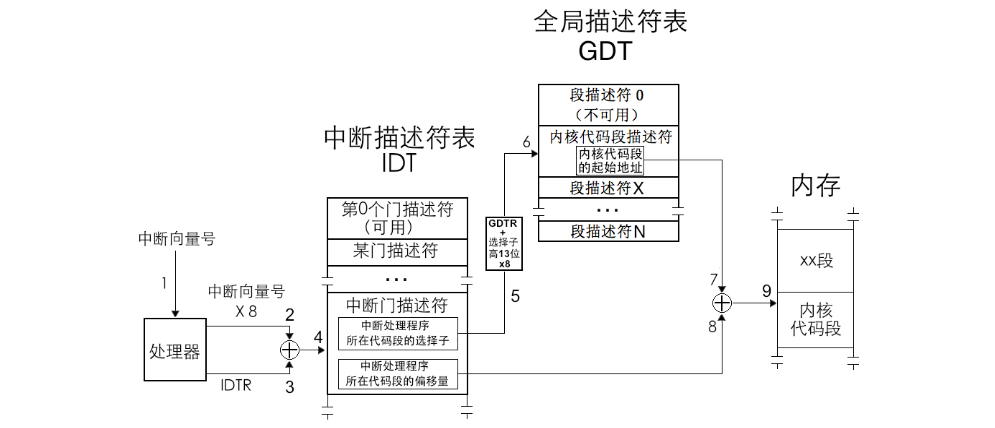

中断发生后，eflags中的NT位和TF位会被置零，若中断对应的是中断门，则在进入中断门后eflags的IF会自动置0以此来防止中断嵌套。

处理器提供了一个修改IF位的指令：cli和sti。其中cli指令使得IF位为0，sti指令使得IF为1。分别称之为关中断和开中断

IF位只能限制外部设备中断，而对其它影响系统正常运行的中断都无效。

TF（Trap Flag），陷阱标志位，这用在调式环境中，当TF为0表示禁止单步执行

NT(Nest Task Flag),任务嵌套位，用来标记任务嵌套调用情况。

!!! note
    任务嵌套调用就是指CPU挂起当前的任务转而去执行另一个任务，待到该任务执行完再回去执行之前的任务。

CPU之所以可以如此运行是因为他会执行以下操作：

1. 将旧任务的TSS段选择子写到新任务TSS中的“上一个任务TSS的指针”字段中
2. 将新任务eflags寄存器中NT置为1，表示新任务之所以能够执行是因为有别的任务调用了他

而CPU从新任务返回到旧任务是通过iret指令，他又两个功能，一个是中断返回，一个是返回旧任务，所以这里就需要用到NT位，因为执行iret的时候会去检查NT位的值，若为1则说明当前任务是嵌套执行的，若为0则说明是在中断处理环境下，于是执行正常的中断退出流程


#### 中断压栈

当中断发生时，处理器收到一个中断向量，根据改中断向量号在IDT中的偏移，然后找到对应的门然后通过其中的选择子，然后将该选择子移入CS中，再将门描述符中的偏移字段移入EIP。这时由于CS和EIP会被刷新，所以处理器会将被中断的程序的CS和EIP保存到当前中断处理程序使用的栈当中。但由于中断在任何特权级下都有可能发生，所以中断处理程序使用的栈不确定，这就导致我们除了保存CS、EIP外还需要保存EFLAGS；如果涉及到特权级变化，还要压入SS和ESP寄存器。

**寄存器入栈情况及其顺序**

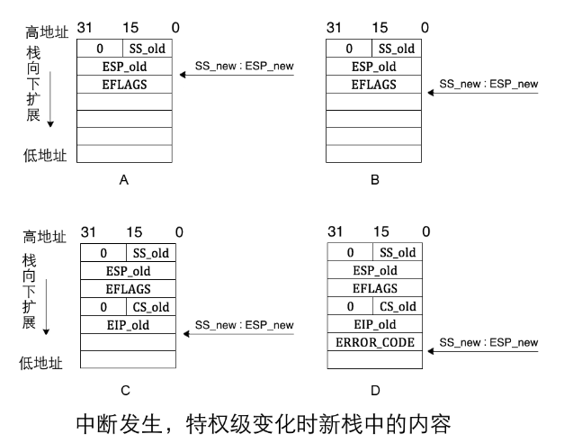

1. 当处理器通过中断向量找到对应的中断描述符后，比较CPL和中断门描述符中选择子对应目标代码段的DPL对比，若发现向高特权级转移，则需要切换到高特权级的栈，这也意味着当我们执行完中断处理程序后需要恢复旧栈才行。因此处理器先临时保存旧SS和ESP值，记作SS\_old和ESP\_old，然后在TSS中寻找到对应目标代码段同特权级的栈加载到寄存器SS和ESP中，记作SS\_new和ESP\_new，再将临时保存的SS\_old和ESP\_old压栈备份
2. 在新栈中压入EFLAGS寄存器
3. 因为要切换到目标代码段，对于这种段间转移，要将CS和EIP保存到当前栈中备份，记作CS\_old和EIP\_old，用于在中断结束后恢复被中断的进程
4. 某些异常会爆出错误码，这个错误是用于报告异常是在哪个段上发生的，也就是发生异常的位置，所以错误码中包含选择子等信息，他一般紧跟EIP后入栈，记为ERROR\_CODE

处理器执行完中断处理程序后需要返回到被中断进程，也就是使用iret指令进行弹栈，这里需要保证上述顺序，如果说有中断错误码且处理器并不知道，这就需要我们手动将其跳过，也就是说当我们准备用iret指令返回时，当前栈指针必须得指向栈中备份的EIP\_old所在的位置


#### 可编程中断控制器8259A

这个控制器比较古老了，现代中断控制器基本都是APIC类了,这里简单看一下工作流程就行


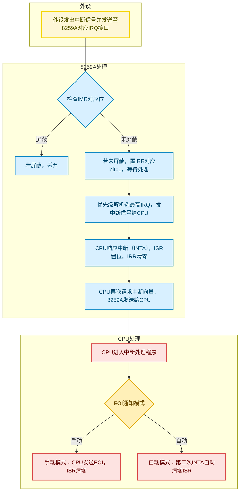


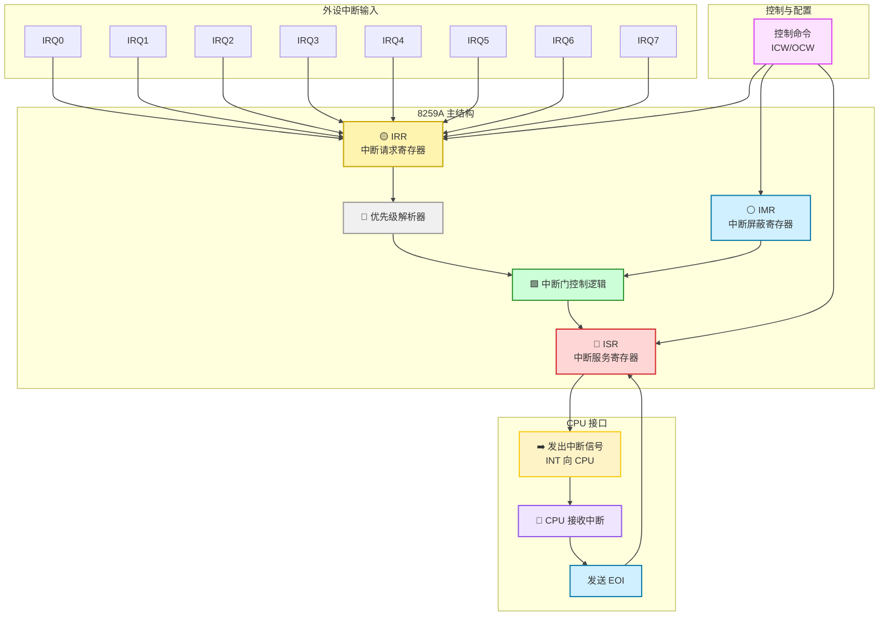


## 总结


#### **1. ELF文件格式**

ELF（Executable and Linkable Format）是Unix/Linux系统的标准可执行文件格式，包含程序加载和执行所需的所有信息。

**ELF文件结构：**


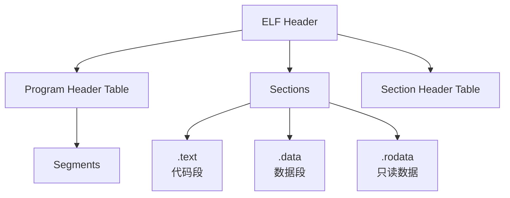

**关键数据结构：**
1. **ELF Header（`Elf32_Ehdr`）**：
- 魔数（`e_ident`）
- 入口地址（`e_entry`）
- 程序头表偏移（`e_phoff`）
- 节头表偏移（`e_shoff`）
- 使用命令：`readelf -h <file>`

1. **Program Header（`Elf32_Phdr`）**：
2. 段类型（`p_type`）
3. 文件偏移（`p_offset`）
4. 虚拟地址（`p_vaddr`）
5. 文件大小（`p_filesz`）
6. 内存大小（`p_memsz`）
7. 使用命令：`readelf -l <file>`

---


#### **2. 特权级机制**

x86架构通过特权级（0-3级）实现硬件级安全隔离：


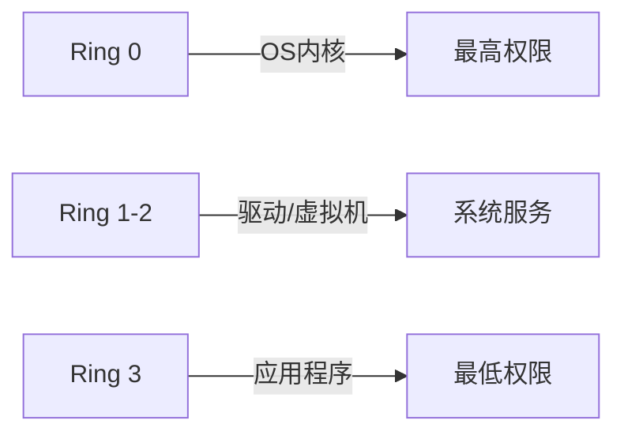
**关键机制：**
1. **TSS（任务状态段）**：
- 存储任务上下文（寄存器/栈指针）
- 特权级切换时自动更新`esp0/ss0`
```

struct

TSS

{


uint32_t

esp0
;

// Ring 0栈指针


uint32_t

ss0
;

// Ring 0栈段


uint32_t

cr3
;

// 页目录基址


//... 其他寄存器

};

```

1. **特权级检查规则**：
2. **数据访问**：CPL ≤ DPL 且 RPL ≤ DPL
3. **代码跳转**：

   - 非一致代码：CPL == DPL
   - 一致代码：CPL ≥ DPL（特权级不变）
4. **门描述符**：
   | 类型 | 安装位置 | 触发方式 |
   | ------ | ----------- | ---------------- |
   | 调用门 | GDT/LDT | CALL/JMP |
   | 中断门 | IDT | INT指令/硬件中断 |
   | 陷阱门 | IDT | INT3调试 |
   | 任务门 | GDT/LDT/IDT | CALL/JMP/中断 |

---


#### **3. 中断机制**

中断是CPU响应外部事件的核心机制，分为：
- **外部中断**：INTR（可屏蔽）、NMI（不可屏蔽）
- **内部中断**：异常（Fault/Trap/Abort）、软中断（INT n）

**中断处理流程：**


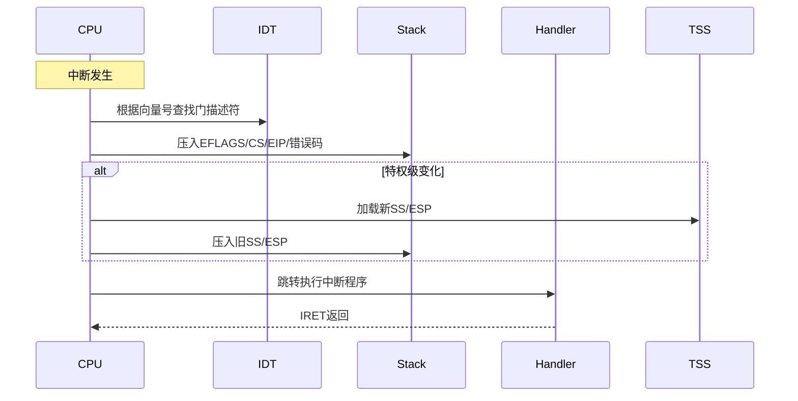
**关键组件：**
1. **IDT（中断描述表）**：
- 通过`LIDT`指令加载
- 包含256个门描述符 1. **8259A中断控制器**：


2. **中断上下文保存**：


```

High Address
| ...          |
| 旧SS         | ← 特权级变化时
| 旧ESP        |
| EFLAGS       |
| 旧CS         |
| 旧EIP        |
| 错误码       | ← 部分异常
Low Address

```

---


### **关键结论**

1. **系统启动流程**：BIOS → Bootloader → 加载ELF内核 → 跳转到`e_entry`
2. **特权级隔离**：通过CPL/DPL/RPL实现硬件级安全控制
3. **中断核心作用**：
4. 处理硬件事件
5. 实现系统调用（如INT 0x80）
6. 处理程序异常
7. **现代演进**：
8. 8259A → APIC（多核支持）
9. 硬件虚拟化扩展（VT-x）优化特权切换

> 完整实现需结合：页表管理（CR3）、任务调度（TSS）、系统调用门（调用门/中断门）
