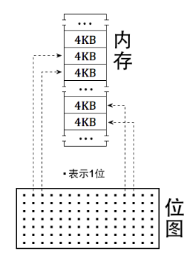
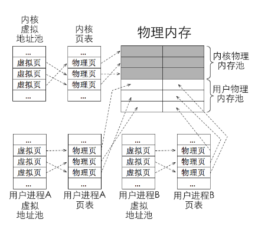
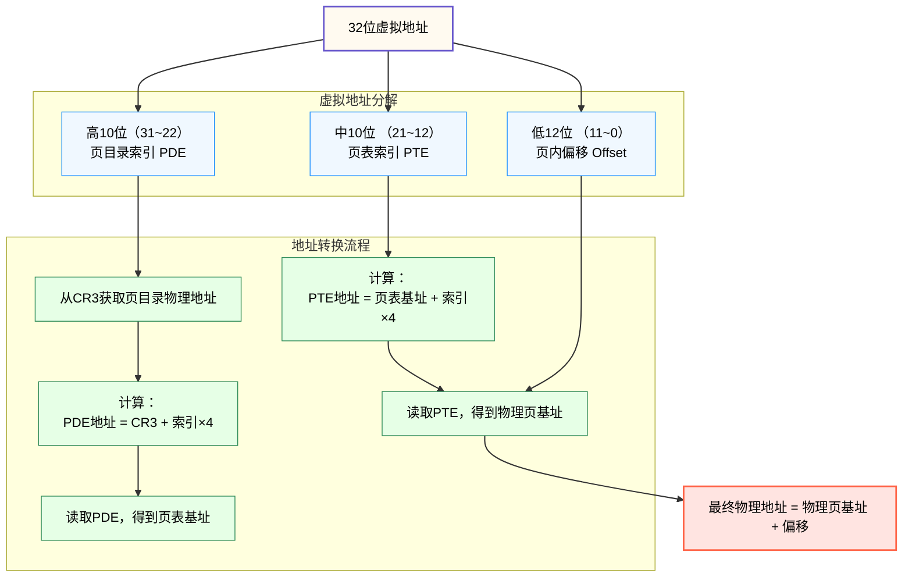
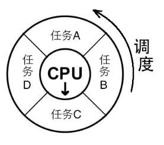
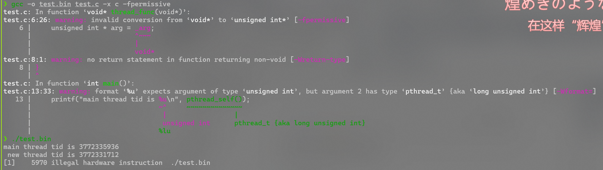
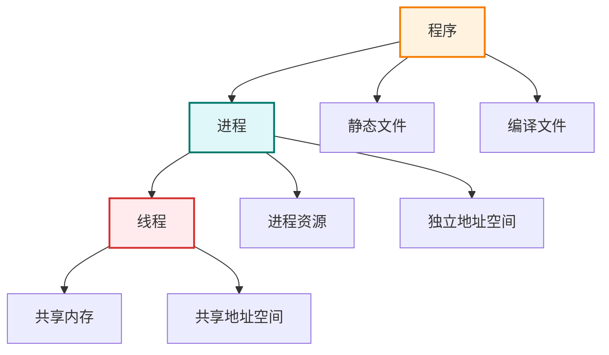
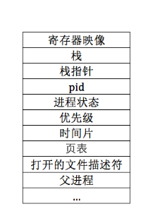
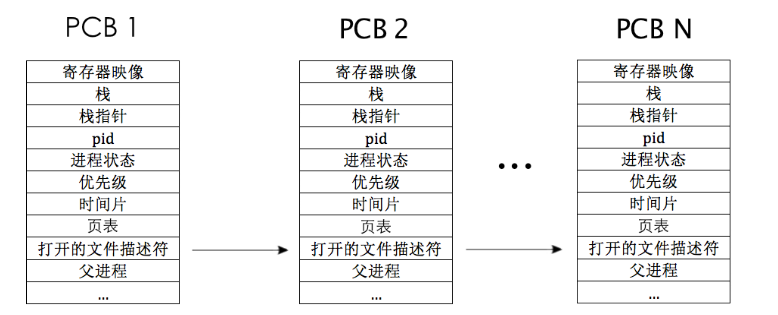

# 内存管理


## 0x0a 内存管理


### 基础知识

**断言**，是一种用于调试的工具，用于在运行的时候检查某个条件是否为真

而这里实现的主要是\*\*内核级断言\*\*ASSERT，他是一种运行时自检工具，用于在开发或调试阶段强制验证内核状态是否正确，一旦失败可能引发系统崩溃（kernel panic)

实现也很简单，如下


```c
/*
 * debug.h
 */
#ifndef __KERNEL_DEBUG_H
#define __KERNEL_DEBUG_H
void panic_spin(char* filename, int line, const char* func, const char* condition);

#define PANIC(...) panic_spin(__FILE__, __LINE__, __func__, __VA_ARGS__)   

#ifdef NDEBUG
  #define ASSERT(CONDITION) ((void)0)   
#else                                  
#define ASSERT(CONDITION) \
if(CONDITION){}else{    \               
  /* 符号#让编译器将宏的参数转化为字符串面量 */ \       
  PANIC(#CONDITION); \                 
}

#endif /*__NDEBUG*/
#endif /*__KERNEL_DEBUG_H*/
```


```c
/* 
 * debug.c
 */
#include "debug.h"
#include "print.h"
#include "interrupt.h"

/* 打印文件名、行号、函数名、条件并使程序悬停 */
void panic_spin(char* filename, int line, const char* func, const char* condition){
  intr_disable();                   //这里先关中断，免得别的中断打扰
  put_str("\n\n\n!!! error !!!\n");
  put_str("filename:");
  put_str(filename);
  put_str("\n");
  put_str("line:0x");
  put_int(line);
  put_str("\n");
  put_str("condition:");
  put_str(condition);
  put_str("\n");
  while(1);
}
```


#### 位图

位是指bit，即字节中的位，一个字节有8位，图是指map，本质上就是映射的意思。也就是说，**位图就是用字节中的1位来映射其它单位大小的资源**，按位与资源之间是一对一的关系

这里实现的位图比较简单，一个bit代表一个页，若这个页被分配处去，那我们就将该bit置为1，否则为0，如下图所示




#### 内存管理系统

在保护模式下，程序地址编程了虚拟地址，虚拟地址对应的物理地址是由分页机制做的映射。因此，在分页机制下有了虚拟、物理这两种地址，操作系统有责任把这两种地址分别管理。并通过页表将这两类地址关联。接下来讨论的就是有关这两类地址的\*\*内存池\*\*规划问题

!!! note
    可以认为是一个内存仓库，我们将可用的内存地址集中放到一起，需要的时候直接从里面取出，用完再放回去。由于在分页机制下有了虚拟地址和物理地址，为了有效地管理它们，我们需要创建虚拟内存地址池和物理内存地址池

**物理内存池**

无论如何，内核和用户进程肯定都要运行在物理内存之中，那么哪些物理内存用来运行内核，哪些物理内存用来运行用户进程就成了物理内存池的关键优化问题

一种可行的方式是将物理内存划分为两部分，一部分只用来运行内核，另一部分只用来运行用户进程。两者互不打扰

**虚拟内存池**

系统运行在分页机制下，不管是内核还是用户程序都是用的虚拟地址。当它们需要申请内存的时候，内存管理系统先是从他们各自的虚拟内存池中分配出一块空闲的虚拟地址，然后再转去物理内存池找到块空闲的物理内存，然后再将这两种地址建立好映射关系



**分配页内存**

!!! note
    1. 高10位是页目录项pde的索引，用于在页目录表中定位pde，细节是处理获取高10位后自动将其乘以4，再加上页目录表的物理地址，这样就得到了ped索引对应的ped所在的物理地址，然后自动在该物理地址中获取保存的页表物理地址
    2. 中间10位是页表项pte的索引，用于在页表中定位pte。细节是处理器获取中间10位后自动将其乘以4，再加上第一步中得到的页表的物理地址，这样就得到了pte索引对应的pte所在的物理地址，然后自动在该物理地址中获取保存的普通物理页的物理地址
    3. 低12位是物理页内的偏移量，页大小是4KB，12位可寻址的范围正好是4KB，因此处理器便直接把低12位作为第二步中获取的物理页的偏移量，无需乘以4。用物理页的物理地址加上这低12位的和便是这32位虚拟地址最终落向的物理地址




分配页表中，我们需要做的事有三件：

1. 首先在虚拟内存中申请虚拟地址，然后在虚拟内存池的位图中将他们置为1
2. 然后我们在物理内存池中申请一定量的物理页框，同样的也要在对应的物理内存池的位图中将其置为1
3. 然后我们再访问到对应页目录项页目录表，然后修改其中的值依次来实现虚拟地址与物理地址的映射

以下是映射部分的代码


```
/* 页表中添加虚拟地址_vaddr与物理地址_page_phyaddr的映射 */
static void page_table_add(void* _vaddr, void* _page_phyaddr){
  uint32_t vaddr = (uint32_t)_vaddr,page_phyaddr = (uint32_t)_page_phyaddr;
  uint32_t* pde = pde_ptr(vaddr);
  uint32_t* pte = pte_ptr(vaddr);

/******************************** 注意 **********************************
 * 执行*pte会访问到空的pde，所以确保pde创建完成后才能执行*pte,
 * 否则会引发page_fault。因此在*pde为0的时候，*pte只能出现在下面else语句块中的*pde后面
 * **********************************************************************/
  /* 先在页目录内判断目录项的P位，若为1则表示该表已经存在 */
  if(*pde & 0x00000001){
    //页目录项和页表项的第0位为p，这里是判断页目录项是否存在
    ASSERT(!(*pte & 0x00000001));   //这里若是说以前有已经装载的物理页框，则会报错
    if(!(*pte & 0x00000001)){
      *pte = (page_phyaddr | PG_US_U | PG_RW_W | PG_P_1);
    }else{
      PANIC("pte repeat");      //ASSERT的内置函数
      *pte = (page_phyaddr | PG_US_U | PG_RW_W | PG_P_1);
    }
  }else{
    //页目录项不存在，所以需要先创建页目录再创建页表项
    /* 页表中的页框一律从内核空间分配 */
    uint32_t pde_phyaddr = (uint32_t)palloc(&kernel_pool);
    *pde = (pde_phyaddr | PG_US_U | PG_RW_W | PG_P_1);
    /* 分配到的物理页地址pde_phyaddr对应的物理内存清0,
     * 避免里面的旧数据变成页表项，从而让页表混乱
     * 访问到pde对应的物理地址，用pte取高20位即可
     * 因为pte基于该pde对应的物理地址内再寻址，
     * 把低12位置0便是该pde对应的物理页的起始 */
    memset((void*)((int)pte & 0xfffff000), 0, PG_SIZE);
    ASSERT(!(*pte & 0x00000001));
    *pte = (page_phyaddr | PG_US_U | PG_RW_W | PG_P_1);
  }
}
```


## 0x0b 内核多线程机制


### 基础知识

> 为了充分利用计算机硬件资源，要让计算机尽可能“同时”多做一些工作。“工作”是由处理器执行某段程序代码来完成的，这段程序代码就称为\*\*进程\*\*，一个进程可以完成一项工作。
>
> 有的时候，工作往往并不简单，它由多个“子工作”组成，因此，我们需要让进程尽可能“同时”多做一些子工作，这些子工作也得由程序代码完成，完成这些子工作的程序就是\*\*线程\*\*

**执行流**

假设任务A需要一天时间，任务B需要2分钟，那么在串行的任务执行下，用户想要任务B的结果需要等上一整天，这是极其低效的。

于是在处理器数量不变的情况下，多任务操作系统出现了，它采用一种称为\*\*多道程序设计\*\*的方式，使处理器在所有任务之间来回切换，这样就给用户一种所有任务都并行运行的错觉，称之为“伪并行”。

如下图所示，处理器固定在圆心，任务就像轮盘一样，由任务调度器把任务转动到处理器的箭头处，表示CPU运行



一个处理器任意时刻只能执行一个任务，真正的并行是指多个处理器同时工作，一台计算机的并行能力取决于其物理处理器的数量。也就是说，目前本来只有1个处理器，但现在一定要兼顾所有任务，唯一的做法就是让每个任务都在处理器上执行一小会。

以上的任务轮转工作就是由\*\*任务调度器\*\*完成的

!!! note
    就是操作系统中用于把任务轮流调度上处理器运行的一个软件模块，它是操作系统的一部分。调度器在内核中维护一个任务表（也称为进程表、线程表或调度表），然后按照一定的算法，从任务表中选择一个任务，然后把该任务放到处理器上运行，当任务运行的实践片到期后，再从任务表中找另一个任务放到处理器上运行

回归主题，我们的处理器只知道加电后按照程序计数器中的地址不断地进行执行下去，在不断执行地过程中，我们把程序计数器中地下一条指令地址所组成地执行轨迹称为程序的\*\*控制执行流\*\*。换句话说，\*\*执行流\*\*就是一段逻辑上独立的指令区域，是人为给处理器安排的处理单元。

其实，软件中所作的任务切换，本质上就是改变了处理中程序计数器的指向，即改变了处理器的“执行流”

而所谓的\*\*独立的执行流\*\*，其实就是线程和进程

**线程到底是什么**

!!! note
    ```c
    //thread.c
    #include<stdio.h>
    #include<pthread.h>
    void* thread_func(void* _arg) {
        unsigned int * arg = _arg;
        printf(" new thread tid is %u\n", *arg);
    }

    void main() {
        pthread_t new_thread_id;
        pthread_create(&new_thread_id, NULL, thread_func, &new_thread_id);
        printf("main thread tid is %u\n", pthread_self());
        usleep(100);    //不清楚新线程是否是在主线程结束之前被调用，所以在主线程最后加一个100ms的阻塞
    }
```

编译并运行



可以发现，线程其实就是运行一段函数的载体

在高级语言中，线程是运行函数的另一种方式，也就是说，构建一套线程方法。例如POSIX线程库，让函数在此线程中调用，然后处理器去执行这个函数，因此线程的实际功能就是相当于调用了这个函数，从而让函数执行。

那么它和普通的函数调用区别在哪里呢？

一般情况下，函数是在调用它的线程的上下文中执行的。操作系统不会单独为某个函数创建新的调度实体，它只是作为线程执行流程的一部分被顺序执行。即，**处理器并不是单独地执行它**

与普通函数调用不同，线程具有独立的执行上下文（如栈空间、寄存器状态等），这使得我们可以将某段函数作为线程的执行入口，并由调度器将该线程独立调度到处理器上执行，**从而实现真正的并发执行。**

在支持多线程的操作系统中，线程通常是CPU调度的最小单位，而进程则是资源分配的基本单位。线程共享其所属进程的大部分资源，如地址空间、堆和打开的文件等，但每个线程拥有独立的执行栈、寄存器上下文等，用以维持自己的运行状态。通过这种机制，线程实现了轻量级并发，能够在不复制整个进程资源的情况下进行独立调度和执行。

这里进程、线程、资源之间的关系可以这样表达`进程 = 线程 + 资源`

**程序、进程、线程**

**程序** 是指静态的、存储在文件系统上、尚未运行的指令代码，它是实际运行时程序的映像

**进程** 是指正在运行的程序，即进行中的程序，程序必须在获得运行所需要的各类资源后才能成为进程，资源包括进程所使用的栈，使用的寄存器等

对于处理器来说，进程是一种控制流集合，集合中至少包含一条执行流，执行流之间是相互独立的，但它们共享进程的所有资源，它们是处理器的执行单元，或者称为调度单元，它们就是 **线程**

可以认为，线程是在进程基础之上的二次并发




**PCB——进程的身份证**

PCB(Process Control Block),程序控制块。用来记录与此进程相关的信息，比如进程状态、PID、优先级等，一般结构如下图



每个金册灰姑娘都有自己的PCB，所有的PCB放在一个表格中维护，就是进程表，调度器可以根据这张表选择上处理器运行的进程，如下图



- **进程状态**：是指运行、就绪、阻塞等，这样调度器就知道他是否可以进行调度

!!! note
    - **运行**：进程处于运行状态时，它正被CPU调度并正在执行指令
    - **就绪**：进程处于就绪状态时，它已经加载到内存并准备好执行，只是等等待操作系统将CPU分配给他。
    - **阻塞**：进程处于阻塞状态时，它因为等待某些事件或资源（如I/O操作、锁、信号量等）而无法继续执行

- **时间片**：时间为0的时候说明这个进程在处理器上的时间已经到了，这时候需要调度器进行调度
- **页表**：表示进程的地址空间，这个是进程独享的
- **寄存器映像**：用来保存进程的现场，进程在处理器上运行的时候，所有寄存器的值都将并保存在这里
- 0级内核特权栈位于PCB中，而寄存器映像一般保存在这里


### 实现

!!! note
    标题中提到了\*\*内核线程\*\*，那么与之对应的，有一种\*\*用户进程\*\*，下面做一下解释

先说结论：

1. 内核线程：调度器由操作系统实现，但是切换线程需要压栈出栈来保护现场恢复现场
2. 用户线程：调度器由用户实现，若一个线程阻塞，整个进程跟着阻塞

详细可见下表：

| 维度 | 内核进程 | 用户进程 |
| --- | --- | --- |
| 所在空间 | 内核态（内核空间） | 用户态（用户空间） |
| 权限 | 高权限，能直接操作硬件与内存 | 低权限，需通过系统调用访问资源 |
| 创建方式 | 系统启动时由内核创建 | 用户运行程序时由内核创建 |
| 功能 | 管理资源，如调度、驱动、文件系统等 | 执行用户任务，如浏览器、编辑器等 |
| 出错影响 | 系统级崩溃或死机 | 进程崩溃，不影响系统 |


```c
//thread/thread.c
/*...*/
struct thread_stack{
    uint32_t ebp;
    uint32_t ebx;
    uint32_t edi;
    uint32_t esi;
    /* 线程第一次执行的时候，eip指向带调用的函数kernel_thread
     * 其它时候，eip指向的switch_to的返回地址*/
    void (*eip) (thread_func* func, void* func_arg);    //表示一个地址变量

    /******以下仅供第一次被调度上CPU使用*******/
    void(*unused_retaddr);
    thread_func* function;  //由kernel_thread所调用的函数名
    void* func_arg;         //由kernel_thread所调用的函数所需要的参数
};
/*...*/
```

这里定义的struct thread\_stack有两个作用：

1. 线程首次运行的时候，线程栈用于存储创建线程所需要的相关数据。和线程有关的数据应该都在该PCB中，这样便于管理线程，避免为他们再单独维护数据空间。创建线程之初，要指定在线程中运行的函数以及参数，因此将他存放在我们的内核栈当中，而其中eip便保存的就是需要执行的函数
2. 任务切换函数 switch\_to中，这是线程已经处于正常运行后，线程所体现出来的作用，由于 switch\_to 函数是汇编程序，从其返回时，必然要用到ret指令，因此为了同时满足这两个作用，我们最初现在线程栈中装入合适的返回地址以及参数，使得作用2中的switch\_to的ret指令也满足创建线程时的作用1

同时，这里虽然说是通过ret调用kernel\_thread的，但是程序自身不知道，它认为自己时正常调用call指令过来的，所以它访问参数还是会从栈顶地址 $esp+4$开始访问第一个参数，所以我们需要填充一个4字节的无意义数据，这里充当他的返回地址，但实际上并不会返回

> 这里很好的解释了为什么pwn题中，我们需要填充一个无效返回地址

**多线程调度**

在thread.h中的PCB结构中新加几个数据，更新task\_struct如下：


```c
/* 进程或线程的PCB */
struct task_struct{
  uint32_t* self_kstack;        //各内核线程都用自己的内核栈
  enum task_status status;
  char name[16];
  uint8_t priority;             //线程优先级
  uint8_t ticks;                //每次在处理器上执行的时间滴答数

  /* 此任务自从上cpu运行后至今占用了多少cpu滴答数，
   * 也就是此任务执行了多久 */
  uint32_t elapsed_ticks;

  /* general_tag的作用是用于线程在一般的队列中的结点 */
  struct list_elem general_tag;

  /* all_list_tag的作用是用于线程队列thread_all_list中的节点 */
  struct list_elem all_list_tag;

  uint32_t* pgdir;              //进程自己页表的虚拟地址
  uint32_t stack_magic;         //栈的边界标记，用于检测栈的溢出
};
```

这里我们的`ticks`元素与`priority`配合使用，优先级越高，则处理器上执行该任务的时间片就越长，每次时钟中断都会将当前任务的`ticks`减1

以及`pgdir`，这里是指向的该进程任务自己的页表（虚拟地址，需要转换为物理地址），但如果是线程的话那么这里就是NULL

---

**线程调度**

调度原理比较简单：当我们线程的PCB中ticks降为0的时候就进行任务调度，时钟每发生一次中断，那么他就会将ticks减1,然后时钟的中断处理程序调用调度器schedule，由他来将切换下一个线程，而调度器的主要任务就是读写就绪队列（也就是上面的thread\_ready\_list），增删其中的节点，修改其中的状态。*注意这里我们采取队列的先进先出(FIFO).*

调度器按照队列先进先出的顺序，把就绪队列中的第1个节点作为下一个要运行的新线程，将该线程的状态设置为`TASK_RUNNING`,之后通过函数`switch_to`将新线程的寄存器环境恢复，这样新线程就开始执行

完整的调度过程需要三部分的配合：

1. 时钟中断处理函数
2. 调度器`schedule`
3. 任务切换函数`switch_to`


## 总结


### 🔧 **0x0a 内存管理模块总结**

**✅ 内核断言机制（调试基础）**

- `ASSERT(CONDITION)` 是一种\*\*运行时断言\*\*，用于调试阶段检测内核内部状态是否正确。
- 一旦断言失败，调用 `PANIC(...)` 打印错误信息后\*\*中断系统运行\*\*（通过死循环保持错误现场）。

✅ 位图与内存池

- \*\*位图\*\*是最小单位为 bit 的资源分配方案，通常用于标记内存页是否被占用。
- \*\*物理内存池\*\*用于管理实际内存资源，划分内核态和用户态两部分。
- \*\*虚拟内存池\*\*用于为内核或进程申请虚拟地址空间，后续再与物理地址建立映射。

**✅ 虚拟地址转换机制（分页机制）**

> 虚拟地址（32 位）按 10-10-12 分为页目录索引、页表索引和页内偏移。

- 页目录项 PDE → 页表地址
- 页表项 PTE → 页框物理地址
- 偏移量 Offset → 最终物理地址内偏移

**✅ 页表映射实现流程**


```
text复制编辑1. 虚拟地址申请（虚拟内存池打标记）
2. 物理页分配（物理内存池打标记）
3. 建立页表映射（修改 PDE / PTE）
```

- 注意：先判断 PDE 是否存在再写入 PTE，否则会触发 `page_fault`
- 典型函数：`page_table_add`


### 🧵 **0x0b 内核多线程机制总结**

**✅ 概念梳理：程序、进程、线程**

| 概念 | 定义 | 特点 |
| --- | --- | --- |
| 程序 | 静态代码，尚未运行 | 是进程的代码模板 |
| 进程 | 程序 + 资源，操作系统调度的\*\*资源单位\*\* | 拥有独立地址空间与资源 |
| 线程 | CPU 调度的最小单位，进程中的执行路径 | 多线程共享同一地址空 |

> **进程 = 资源 + 线程**

**✅ 线程的本质**

- **线程是一个执行流 + 栈空间 + 寄存器上下文**
- 本质上就是 CPU 执行某个函数的\*\*调度实体\*\*
- 与函数调用区别：
- 函数运行在调用者的上下文中
- 线程拥有自己的上下文（栈、寄存器）可并发执行

**✅ 线程控制块 PCB（task\_struct）**

- 存储线程调度所需的信息：
- 状态（就绪/阻塞/运行）
- 时间片 `ticks` 与总运行时间 `elapsed_ticks`
- 内核栈指针、页表指针 `pgdir`
- 链表节点用于双向挂载在队列中

**✅ 线程的创建过程（thread\_stack）**

- 首次执行：
- 手动将 `kernel_thread` 和其参数压入线程栈
- 构造出能通过 `ret` 执行 `kernel_thread(func, arg)` 的栈帧
- 正常切换：
- 由汇编实现的 `switch_to` 利用 `ret` 恢复 eip、esp 实现切换

**✅ 内核线程调度机制**

三个核心模块协作：

| 角色 | 描述 |
| --- | --- |
| ⏰ **时钟中断处理器** | 每次中断时 `ticks--`，若为 0 则调度 |
| 📋 **调度器 schedule()** | 从就绪队列中取出下一个任务 |
| 🔄 **上下文切换 switch\_to()** | 保存/恢复寄存器状态，完成线程切换 |

- 采用\*\*时间片轮转 + FIFO\*\*调度策略
- 使用链表（如 `thread_ready_list`）管理任务队列
