# IO机制


## 0x0d 实现包含锁的IO机制

首先回顾一下上一节的结果，会发现出现了很多奇怪的空格，并且上面出现报错`#GP General Protection Exception`（一般保护性异常）

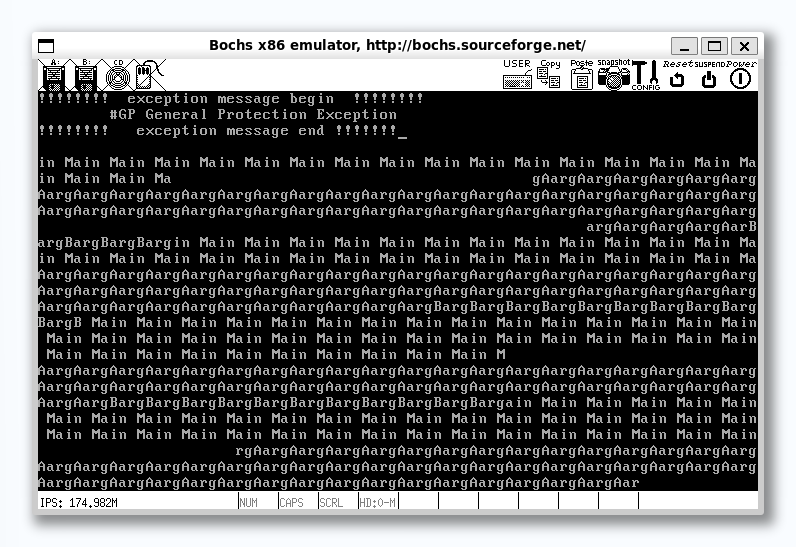

这里的根本原因是由于临界区代码的资源竞争，这需要一些互斥的方法来保证操作的原子性（也就是互不影响）


### 0x01 基础知识


#### 介绍一些术语

- `公共资源`：可以是公共内存、公共文件、公共硬件等，总之是被所有任务共享的一套资源
- `临界区`：程序要想使用某些资源，必然通过一些指令去访问这些资源，若多个任务都访问同一公共资源，那么各任务中访问公共资源的指令代码组成的区域就称为临界区。**使用公共资源的代码程序**
- `互斥`：指某一个时刻公共资源只能被1个任务独享，也就是只能由一个任务在自己的临界区执行
- `竞争条件`：多个任务以非互斥的方式同时进入临界区，大家对公共资源的访问以竞争的方式并行进行

> 如果将上面的东西和我们之前的内容进行一个对应的话：
>
> 公共资源就是显卡的光标寄存器；
>
> 同时因为每个线程都会使用put\_char函数，这个函数是操作光标寄存器的，所以这段代码就是每个线程的临界区

所以我们可以通过暴力的关、开中断来实现互斥，但是每次执行的时候都要关、开中断有些不太优雅，也太麻烦。

此外，如果我们关中断的操作距离临界区太远，就会造成多任务调度的低效，这就违背了当时设计多线程的初衷。

于是便有了“**锁**”这个概念

---

锁是由\*\*信号量\*\*实现的，所以先解释一下\*\*信号量\*\*


#### 信号量

在计算机当中，信号量就是个0以上的整数值，当为0时表示已无可用信号，是一种\*\*同步机制\*\*

Note

同步一般是指合作单位之间为协作完成某项工作而共同遵守的工作步调，强调的是配合时序，就像十字路口的红绿灯，只有在绿灯亮起的情况下司机才能前进，这就是一种同步。

简单来说，同步是指不能随时随意工作，工作必须在某种条件具备的情况下才能开始，工作条件具备的时间顺序就是时序。

线程同步的目的是不管线程如何混杂、穿插地执行，都不会影响结果地正确性。线程不像人那样有判断“配合时序”的意识，它的执行会很随意，这就使得合作出错成为必然。因此，当多个线程访问同一公共资源时，为了保证结果正确，必然要使用一套额外的机制来控制它们的工作步调

信号量是计数值，P、V操作表示信号量的减、增。

信号量的处置代表是信号资源的累积量，也就是剩余量，而P操作就是减少信号量来获取资源，V操作就是释放资源增加信号量，见下面微操作：

**V操作**：

- 将信号量的值加1
- 唤醒在此信号量上等待的操作

**P操作**：

- 判断信号量是否大于$0$
- 若信号量大于$0$，则信号量减$1$
- 若信号量等于$0$，当前线程将自己阻塞，以在此信号量上等待

---

信号量的初值若为1的话，它的取值就只能为 0 和 1 ，这便称为二元信号量，我们可以利用二元信号量来实现\*\*锁\*\*

那么 P 操作就是获得锁， V 操作就是释放锁。我们可以让线程通过锁进入临界区，可以借此保证只有一个线程可以进入临界区，从而做到互斥。大致流程如下：

1. 线程A进入临界区前先通过 P 操作获得锁，此时信号量的值便为 0
2. 后续线程 B 再进入临界区时也通过 P 操作获得锁，由于信号量是 0 ，线程 B 便在此信号量上等待，也就是相当于线程 B 进入了睡眠态
3. 当线程 A 从临界区出来后执行 V 操作释放锁，此时信号量的值重新变为 1 ，之后线程 A 将线程 B 唤醒
4. 线程 B 醒来后获得了锁，进入临界区

Note

**阻塞**

调度器并不决定线程是否可以运行，只是决定了运行的时机，线程可否运行是由线程自己把控的。当线程被换上处理器运行后，在其时间片内，线程将主宰自己的命运。

阻塞是一种意愿，表达的是线程运行中发生了一些事情，这些事情通常是由于缺乏了某种运行条件造成的，以至于线程不得不暂时停下来，必须等到运行的条件再次具备时才能上处理器继续运行

因此，**阻塞发生的时间是在线程自己的运行过程中，是线程自己阻塞自己，并不是被谁阻塞**

**唤醒**

已被阻塞的线程是无法运行的，需要锁的持有者将其唤醒。锁的持有者释放了锁之后便去唤醒在它后面因获取该锁而阻塞的线程。因此唤醒已阻塞的线程是由别的线程（通常是锁的持有者）来做的


### 0x02 用锁实现终端输出

> 终端也称为控制台，这是计算机历史中遗留下来的概念。过去计算机还是奢侈品的时候，为了充分利用计算机资源，允许多个用户连接到机器上（类似于 Windows 多用户的概念，为的是让更多的用户能够控制计算机，因此终端便称为控制台）
>
> 而为了能够在同一个显示器下实现多用户，也就是分别为每个用户虚拟出一个“显示器”，因此出现了虚拟终端
>
> 每个控制台都是一个虚拟终端，用户看到的屏幕是由软件虚拟出来的

但虚拟终端的实现还是要依赖硬件本身的功能：

我们知道屏幕在不同模式下显示的字符数是有限的，因此屏幕不能一次性把显存中的全部数据显示出来，为此，显卡提供了两个寄存器“Start Address High Register” 和 ”Start Address Low Register” 来设置数据在显存中的起始地址。起始地址是用16位来表示的，它们分别设置显存地址的 15~8 位和 7~0 位。因此，我们可以把不同的 16 位地址分别写入这两个寄存器，从而实现将显存分块显示的目的，也就是实现了虚拟终端。由此可见，虽然多个虚拟终端共同用一个显示器，也就是共享同一片显存，但用户之间能够互不干扰，就是因为每个虚拟终端显示的是显存中的不同区域，如下图所示

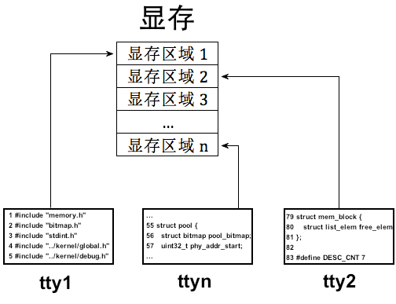

在我们的系统中没有复杂的显卡寄存器操作，我们只有一个终端，因此所有的输出都往这一个屏幕上挤，这就容易让输出凌乱不堪。为了让这一个屏幕上的内容井然有序，既然我们已经实现了锁，我们可以通过锁实现输出互斥，这样屏幕上的字符就会井然有序

虽然我们没有真正的多控制台，但是我们把终端当成设备来对待，终端就是我们的标准输出设备，因此我们本节要构造一个终端设备，通过它实现以后的打印输出

Note


```

//console.c

#include

"console.h"

#include

"print.h"

#include

"stdint.h"

#include

"sync.h"

#include

"thread.h"

static

struct

lock

console_lock
;

//控制台锁

/* 初始化终端 */

void

console_init
(){


lock_init
(
console_lock
);

}

/* 获取终端 */

void

console_acquire
(){


lock_acquire
(
&
console_lock
);

}

/* 释放终端 */

void

console_release
(){


lock_release
(
&
console_lock
);

}

/* 终端输出字符串 */

void

console_put_str
(
char
*

str
){


console_acquire
();


put_str
(
str
);


console_release
();

}

/* 终端输出字符 */

void

console_put_char
(
uint8_t

char_asci
){


console_acquire
();


put_char
(
char_asci
);


console_release
();

}

/* 终端输出十六进制整数 */

void

console_put_int
(
uint32_t

num
){


console_acquire
();


put_int
(
num
);


console_release
();

}

```

其实就是封装了锁处理，此后用main输出的时候用console\_put\_str等函数即可，内部实现互斥机制


### 0x03 从键盘获取输入

接下来是输入任务，即从键盘获取键入的字符。这里实现的是PS/2键盘

---


##### **键盘输入的原理**

> 计算机是一个系统，系统是指由各个功能独立的模块组成的整体，相当于正在内部按功能分层，一个模块就像个功能独立的黑盒子，上下游模块之间可依赖，相互提供数据。在所有模块的配合下，使这个系统作为整体对外提供服务（也就是计算机领域的\*\*抽象\*\*）
>
> 键盘同理，也是由一个个独立的模块分层实现的，但是并不是简单地由键盘把数据塞到主机里，这涉及两个功能独立的芯片配合

键盘内部有个叫做\*\*键盘编码器\*\*的芯片，通常是$Intel 8048$或者兼容芯片，它的作用是：**当键盘上发生案件操作时，它就像键盘控制器报告哪个键被按下，按键是否弹起**

而\*\*键盘控制器\*\*一般在主机内部的主板上，通常是$Intel8042$或者兼容芯片，它的作用是：接受来自键盘编码器的按键信息，将其解码后保存，然后向中断代理发中断，之后处理器执行相应的中断处理程序读入8042处理保存过的按键信息

他们的关系如下图所示

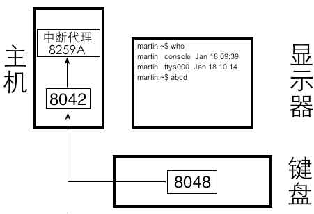

当我们键盘按键的时候，8048会维护一个\*\*键值对的表\*\*，我们所按的键对应的\*\*扫描码\*\*会传给8042芯片，然后8042向8259A发送中断信号，这样处理器就会去执行键盘中断处理程序（中断处理程序需要我们自己实现）

这里的\*\*扫描码\*\*又分为两类，一个叫做\*\*通码\*\*，指的是按下按键产生的扫描码；另一个是\*\*断码\*\*，指的是松开按键产生的扫描码

Note

注意我们只能得到键的扫描码，并不会得到键的ASCII码，扫描码是硬件提供的编码集，ASCII是软件中约定的编码集，这两个是不同的编码方案。

假如我们在键盘上按下了空格键，我们在键盘中断处理程序中只能得到空格键的扫描码，该扫描码是 0x39 而不是空格键的 ASCII 码 0x20

键盘的中断处理程序便充当了字符处理程序，将对应字符的扫描码转换为ASCII码输出

Note

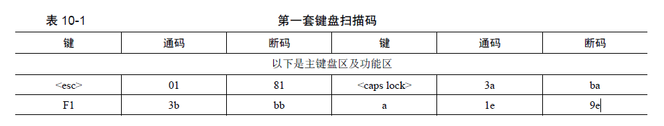

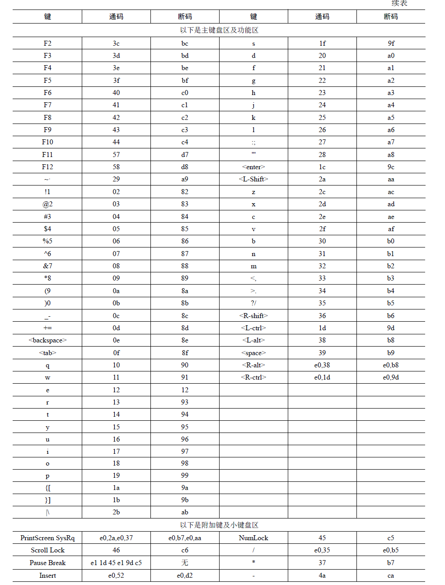

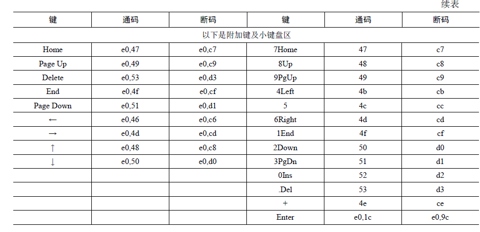

可以注意到扫描码中的通码和断码都是1字节大小，且断码=通码+0x80，这是因为一般扫描码的最高1位用来标识通码还是断码，若是0则表示通码，为1则表示断码

为了让我们可以获取击键的过程，我们将每一次击键过程分为“按下”，“按下保持”，“弹起”三个阶段，其中每次8048向8042发送扫描码的时候，8042都会向8059A发起中断并且将扫描码保存在自己的缓冲区中，此时再调用我们准备好的键盘中断处理程序，从8042缓冲区获得传递来的扫描码。


### 0x04 环形输入缓冲区

到目前为止，虽然顺利接受了键盘按键，但其实除了输出这些字符并没有出现什么特别的功能，而我们实现键盘输入很大的一部分就是可以实现shell功能，这样就可以键入指令然后实现需求了。
缓冲区是多个线程共用的共享内存，线程并行访问的时候它难免会出问题，所以我们需要解决这个对于缓冲区的访问操作产生的问题。这里我稍微介绍一下我们即将要设计的环形缓冲区：

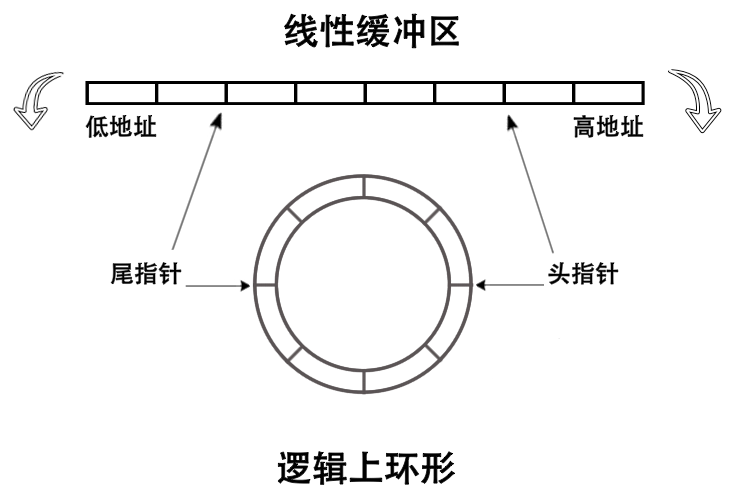

这里我们定义两个指针来指向其中的头和尾，但注意我们这里的环形是指逻辑上的环形，在物理内存上我们仍然是线性的，不过我们用以下方式来使得其从逻辑上来看是环形队列，那就是头指针用来写数据，尾指针用来读数据，这里当我们指针位置加1导致越过了缓冲区范围的时候会进行取余来重新指向缓冲区的开头，这样就形成了环形的错觉。

Note

我们知道，在计算机中可以并行多个线程，当它们之间相互合作时，必然会存在共享资源的问题，这是通过“线程同步”来实现的

诠释“线程同步”最典型的例子就是“生产者与消费者问题”

- “同步”是指多个线程相互协作，共同完成一个任务，属于线程间工作步调相互制约。
- ”互斥“是指多个线程”分时“访问共享资源

生产者与消费者问题是描述多个线程协同工作的模型，如下图

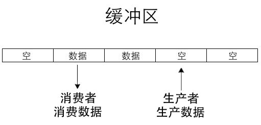

有一个或多个生产者、一个或多个消费者和一个固定大小的缓冲区，所欲生产者和消费者共享这同一个缓冲区。生产者生产某种类型的数据，每次放到一个缓冲区中，消费者消费这种数据，每次从缓冲区中消费一个。同一时刻，缓冲区只能被一个生产者或消费者使用。当缓冲区已满时，生产者不能继续往缓冲区中添加数据，当缓冲区为空时，消费者不能在缓冲区中消费数据

*作者给了个很有意思的例子*

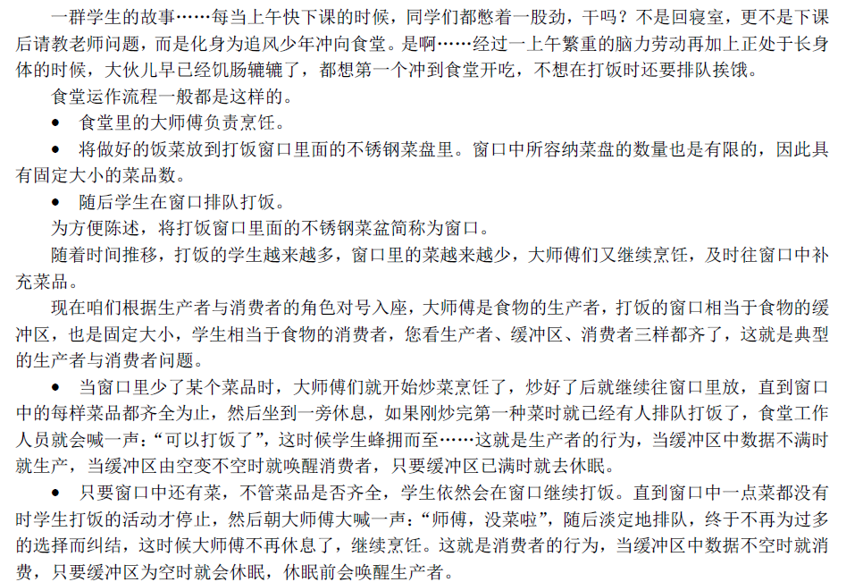

总结一下：生产者与消费者问题描述的是：

对于有限大小的公共缓冲区，如何同步生产者和消费者的运行，以达到对共享缓冲区的互斥访问，并保证生产者不会过度生产，消费者不会过度消费，缓冲区不会破环

对于这种缓冲区的破坏，要么是对缓冲区访问溢出，要么是缓冲区中的数据被破坏


## 0x0e 用户进程

> 自始至终，我们的程序都在 ring 0 级工作，这意味着任何程序都和操作系统平起平坐，可以改动任何系统资源，这是极度危险的。所以需要一个权限更低的进程


### LDT & TSS

---

LDT（本地描述符表）和 TSS（任务状态段）起源于 1980 年代 Intel 为 80286 和 80386 处理器引入保护模式时提出的设计，旨在通过硬件机制支持多任务管理和内存隔离，是早期基于分段的多任务操作系统（如 OS/2 和 Windows 3.x）运行的关键基础,以下就是对LDT和TSS的介绍


##### LDT

程序是一堆数据和指令的集合，它们只有被加载到内存并让 CPU 的寄存器中指向它们后， CPU 才能执行该程序。程序从文件系统上被加载到内存后，位于内存中的程序便称为映像，也称为\*\*任务\*\*

在 IA32 架构的 CPU 上，内存被设计为需要按照分段的方式来访问，所以要想在这种CPU上开发程序就也需要遵守内存分段的规定。

而为了便于管理和好看，我们一般会将数据分类存储：数据集中放在一起，指令集中放在一起等等。

而 CPU 只把 CS：[E]IP 指向的内存当成指令，把 DS 指向的内存当作普通数据，因此必须人为保证填充到这些段寄存器中的值是正确的。*咱们只要往对应的寄存器中写入合适的值就成了，其他的咱们不用管，由处理器内部的处理框架自动完成。这就像咱们在软件开发过程中用到的框架一样，只不过这次的框架是由硬件CPU 提供的。*

按照内存分段的方式，内存中的程序映像自然被分成了代码段、数据段等资源，这些资源属于程序私有的部分，因此 Intel 建议\*\*为每个程序单独赋予一个结构来存储其私有的资源\*\*，也就是\*\*LDT\*\*

---

LDT（Local Descriptor Table），即局部描述符表。描述符的功能就是描述一段内存区域的作用及属性，它只是对应内存区域的身份证

LDT属于任务私有的结构，它是每个人物都有的，其位置也不固定。而为了找到它，就需要通过在GDT中注册，通过选择子找到它

*计算机就是一层套一层，再套一层说是*

下图为LDT描述符格式

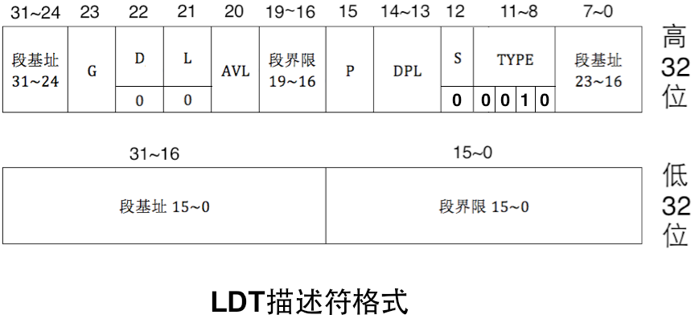

在 LDT 中，描述符的 D 位和 L 位固定为 0

LDT描述符属于系统段描述符，因此 S 为0。在 S 为 0 的前提下，若 TYPE 的值为 0010，这表示此描述符是 LDT 描述符。

**现在可以找到 LDT 了，如何使用它呢**

CPU 使用某个表，肯定不只是找到一个描述符就行了，描述符的目的是为了告诉 CPU 描述符所对应区域的起始地址及偏移大小。CPU 为 LDT 准备了寄存器 LDTR 来存储其位置及偏移量

LDTR 结构如下图所示：

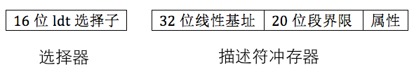

- 选择器是中 16 位的 LDT 选择子
- 描述符缓冲器是LDT的起始地址及偏移大小等属性

**LDT 中的描述符全部用于指向任务自己的内存段，该如何引用它们呢？**

选择子是 16 位的，其高 13 位是索引值，用来在 GDT 或 LDT 中索引段描述符，用来在 GDT 或 LDT 中索引段描述符，第 0~1 位 RPL，表示请求特权级，第 2 位是 TI 位，此位用来指定选择子中的高 13 位是在 GDT中索引段描述符，还是在 LDT 中索引段描述符。

> TI 位也就是 Table Indicator，当此位为 1 时，表示从 LDT 中检索，反之当此位为 0 时，表示从 GDT中检索选择子

当前运行的任务，其 LDT 位于 LDTR 指向的地址，这样 CPU 才能从中拿到任务运行所需要的资源（指令和数据）。因此，每切换一个任务时，需要用 lldt 指令重新加载任务的 LDT 到 LDTR

---


#### TSS

TSS 是为了使得 CPU 支持多任务来实现的，这里有点像线程中的 PCB，不过TSS基于进程，而PCB是线程自己也有拥有一个，所以这里切换进程也就是需要使用 TSS 来标记上下文，而 CPU 也用不同的 TSS 来区分不同的任务

TSS 和其它段一样，本质上是一片存储数据的内存区域，Intel 打算用这片内存区域保存任务的最新状态（也就是任务运行时占用的寄存器组等），因此它也和其它段一样，需要某个描述符结构来“描述”它，这就是 TSS 描述符，TSS描述符也要在 GDT 中注册，结构如下图

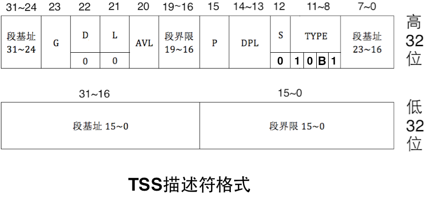

\*\*TSS 描述符\*\*属于系统段描述符，因此S 为0，在S 为0 的情况下，TYPE 的值为10B1。我们这里关注一下B 位，B 表示busy 位，B 位为0 时，表示任务不繁忙，B 位为1 时，表示任务繁忙。

Note

任务繁忙有两方面的含义：

- 一方面就是指此任务是否为当前正在CPU 上运行的任务。
- 另一方面是指此任务嵌套调用了新的任务，CPU 正在执行新任务，此任务暂时挂起，等新任务执行完成后CPU 会回到此任务继续执行，所以此任务马上就会被调度执行了。
- 这种有嵌套调用关系的任务数不只两个，可以很多，比如任务A 调用了任务A.1，任务A.1 又调用了任务A.1.1 等，为维护这种嵌套调用的关联，CPU 把新任务TSS 中的 B 位置为1，并且在新任务的TSS 中保存了上一级旧任务的TSS 指针（还要把新任务标志寄存器eflags 中NT 位的值置为1），新老任务的调用关系形成了调用关系链

B位的作用是任务不会自己调用自己，因为若正在执行的任务所调用的函数段的B位为 1，则说明它在调用自己，或者调用自己的调用者们。

---

TSS 描述符是用来描述 TSS 的，接下来介绍一下 TSS。

TSS 同其他普通段一样，是位于内存中的区域，因此可以把TSS 理解为TSS 段，只不过TSS 中的数据并不像其他普通段那样散乱，TSS 中的数据是按照固定格式来存储的，如下图

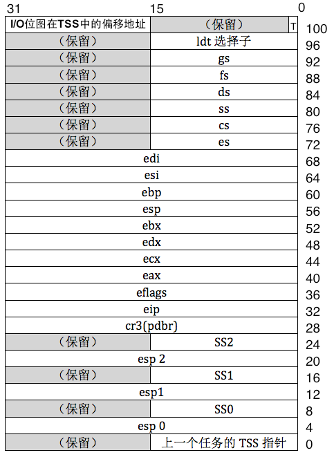

这里可以看出TSS本身自己就完全上下文的信息，其中包含了许多寄存器的备份，并且这里也包含了该任务所需要的栈地址

关于这三个栈，可以看[之前的文章](https://maple-pwn.github.io/2025/07/14/%E6%93%8D%E4%BD%9C%E7%B3%BB%E7%BB%9F%E5%AD%A6%E4%B9%A0%E7%AC%94%E8%AE%B003-%E4%BB%8E%E5%88%9D%E5%A7%8B%E5%86%85%E6%A0%B8%E5%88%B0%E4%B8%AD%E6%96%AD/#0x07-%E7%89%B9%E6%9D%83%E7%BA%A7)中对TSS的介绍。

此外，除了从中断和调用门返回之外，CPU不允许从高特权级转向为低特权级。所以这三组栈仅仅是CPU用来从低特权级跳到高特权级使用的，注意这三组栈地址在TSS中是不会改变的，也就是说不论你在哪个特权级进行了怎么样的压栈，当你从别的特权级返回到这个特权级的时候，他还是会从TSS中获取原始栈基址，而不管你曾经是否压过许多值。

---

CPU本身是支持TSS的，这说明访问TSS以及识别他的结构过程并不是咱们需要做的工作。当任务被换下CPU的时候，CPU会自动将一些寄存器的值存入TSS相应位置，当任务上CPU运行的时候同样如此。
而我们本身是需要访问TSS的，所以说这里存在一个专门帮助我们寻找到TSS地址的寄存器TR，注意这里是帮助咱们寻找到TSS，而不是像GDTR那样专门有一部分位用来存放GDT首地址，前面咱们说过TSS是存在描述符的且存放在GDT中，所以我们访问他是跟访问其他普通段描述符一样，都是使用选择子，通过这个选择子我们就能够找到在GDT中的TSS段描述符，然后通过该描述符来找到咱们的TSS结构，下面给出TR结构和描述符缓冲器：

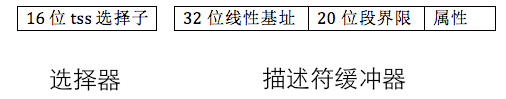

---

TSS 和 LDT 一样，必须要在 GDT 中注册才行，*这也是为了在引用描述符的阶段做安全检查*

因此 TSS 是通过选择子来访问的，将 TSS 加载到寄存器 TR 的指令为 `ltr`,其指令格式为


```

ltr "16位通用寄存器" 或 "16位内存单元"

```

第一个任务的 TSS 手工加载之后，CPU会自动地把当前任务地资源状态保存到该任务对应的 TSS 中（由寄存器TR指定）

---

**总之，**

**TSS 由用户提供，由 CPU 自动维护**

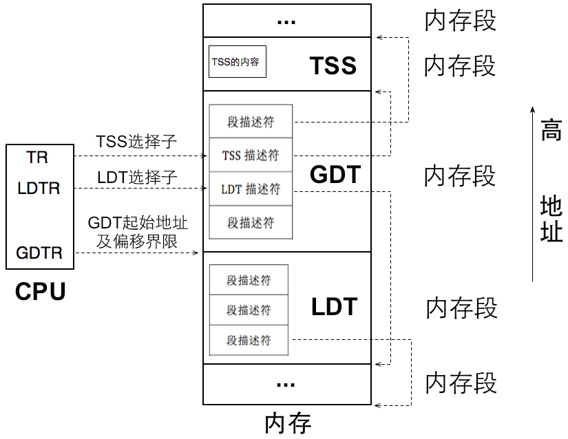

寄存器 TR 始终指向当前任务的 TSS，**任务切换就是改变 TR的指向**，CPU 自动将当前寄存器组的值（快照）写入 TR 指向的 TSS，同时将新任务 TSS 中的各寄存器的值载入 CPU 中对应的寄存器，从而实现了任务切换

---


## 0x0f 系统调用


### 基本知识

> 所谓系统调用就是让用户进程申请操作系统的帮助，让操作系统帮其完成某项工作，也就相当于是用户进程调用了操作系统的功能

Linux 系统调用是用中断门来实现的，通过软中断指令 int 来主动发起中断信号。Linux 只占用一个中断向量号，即 `0x80` ，处理器执行指令 `int 0x80` 时便出发了系统调用，而在系统调用之前，Linux 在寄存器 eax 写入子功能号，当用户通过 `int 0x80` 进行系统调用时，对应的中断处理例程会根据 eax 的值来判断用户进程申请哪种系统调用

我们来梳理一下系统调用的实现思路

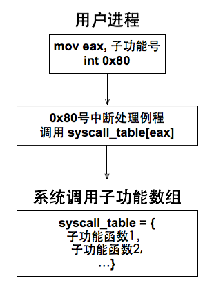
如左图：
1. 用中断门实现系统调用,效仿Linux 用0x80号中断作为系统调用的入口
2. 在 IDT 中安装 0x80 号中断对应的描述符，在该描述符种注册系统调用对应的中断处理例程
3. 建立系统调用子功能函数表 syscall\_table,利用 eax 寄存器中的子功能号在该表中索引相应的处理函数
4. 用宏实现用户空间系统调用接口\_syscall


### 堆内存管理知识

我们之前实现的内存管理形式过于粗糙，分配的内存是以4KB大小的页框为单位，所以我们需要实现一种小内存快的管理，可以满足任意内存大小的分配。

Note

**`arena`**，一种内存管理概念，将大块内存划分为多个小块，每个小块之间互不干涉，可以分别管理，就叫做`arena`

我们可以认为`arena`是由“一大块内存”被划分成无数“小内存块”的内存仓库。`arena`的这一大块内存就是通过`malloc_page`获得以 4KB 为粒度的内存，根据请求的内存量的大小， `arena`的大小也许是一个页框，也可能是多个页框，随后再平均拆分成多个小内存块。

根据内存块的大小，可以划分出不同规格的`arena`，例如一个`arena`中全是16字节大小的内存块，所以它\*\*只响应 16 字节以内的内存分配\*\*；另一种`arena`中全是32字节大小的内存块，故它\*\*只响应 32 字节以内的内存分配\*\*。

我们平时调用`malloc`申请内存的时候，操作系统返回的地址其实就是魔偶个内存块的起始地址，操作系统会根据`malloc`申请的内存大小来选择不同的内存块。

---

同时，`arena`是一个提供内存分配的数据结构，它分为两部分：

1. 一部分是\*\*元信息\*\*，用来描述自己内存池中空闲内存块的数量，这其中包括内存块描述符指针，可以通过它间接获知本 `arena` 所包含内存块的规格大小。则一部分占用的空间约为 12 字节
2. 另一部分是\*\*内存池区域\*\*，这里面由无数的内存块，此部分占用 `arena` 大量空间，我们把每个内存块命名为 `mem_block`,它们是内存分配粒度更细的资源，最终为用户分配的就是这其中的一个内存块

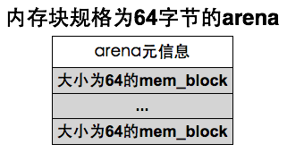

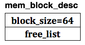
但是`arena`逐渐变多，我们需要一个新的结构来统一描述`arena`，于是为每一种规格的内存块建立一个**内存块描述符**，即 `mem_block_desc`,在其中记录内存块规格大小，以及位于所有同类`arena`中的空闲内存块链表，**内存块描述符**简图如左图

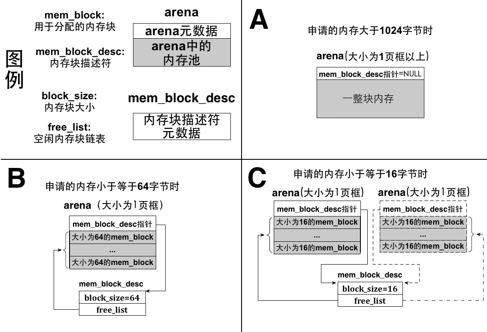

`arena`以2为底，设计了 $2、4、8、16、32、64、128、256、512、1024$ 类别的小空间，适配各种类型的内存大小申请，以此完成了内存的获取

---

而对于\*\*内存的释放\*\*：

我们知道，内存的使用情况通过\*\*位图\*\*来管理，所以其实当回收内存时，我们只需要将位图响应的位清0就好了


## 总结

**🧩 模块一：IO互斥机制与锁的引入（0x0d）**

🛠 背景问题

- 多个线程输出字符时访问了同一光标寄存器，造成屏幕显示混乱、触发 `#GP` 错误。
- put\_char() 是\*\*访问公共资源\*\*（VGA 寄存器）的\*\*临界区\*\*。

✅ 技术要点

- 引入\*\*信号量 semaphore\*\*的 P/V 操作。
- 实现了二元信号量的封装：`lock_acquire / lock_release`
- 通过 `console_put_str/char/int` 封装原始打印函数，加锁输出，确保原子性。

✅ 设计优点

- 替代 `cli/sti` 粗暴关中断的方式，更优雅、效率高。
- 提前为后续所有 IO 引入同步机制奠定基础。

---

**🧩 模块二：键盘输入驱动与环形缓冲区（0x0e）**

🔌 键盘输入原理

- 键盘编码器（8048）产生\*\*扫描码\*\*，通过控制器（8042）传给主板，触发\*\*中断\*\*。
- 分为\*\*通码\*\*（按下）与\*\*断码\*\*（松开），通过中断例程处理。

🔁 环形缓冲区设计

- 输入是\*\*生产者-消费者模型\*\*的典型代表。
- \*\*环形结构\*\*通过逻辑循环（mod 操作）维护头尾指针。
- 支持并发读写：生产者（键盘中断）写入，消费者（Shell、read）读取。

🔐 同步机制

- 共享内存访问需加锁，避免 race condition。
- 支持输入阻塞等待唤醒。

---

**🧩 模块三：用户进程支持 —— LDT 和 TSS 的引入（0x0e）**

🧱 LDT（Local Descriptor Table）

- 每个任务拥有独立的段描述符集合（代码段、数据段等）
- 每次进程切换需重新加载 LDT 选择子至 `LDTR`，实现段访问隔离。

🧠 TSS（Task State Segment）

- 存储进程的\*\*寄存器快照\*\*与栈指针。
- 由 CPU 自动读写（硬件支持上下文切换）
- 每个进程一个 TSS，挂载在 GDT 中，通过 `ltr` 加载至 `TR`。

🧵 任务切换逻辑

1. `TR` 始终指向当前任务的 TSS。
2. 切换任务时：
3. 旧任务寄存器值写入当前 TSS
4. 新任务 TSS 中值恢复进寄存器
5. 可实现 ring0 <-> ring3 特权级栈切换

---

**🧩 模块四：系统调用机制（0x0f）**

📥 基本原理

- 用户进程不能直接访问内核，需要通过中断机制转入 ring0。
- 模拟 Linux，使用 `int 0x80` 发起软中断。

🧩 实现流程

1. 内核 IDT 中注册 0x80 中断描述符，绑定系统调用处理例程。
2. 用户层调用 `_syscallX(...)` 宏，将功能号装入 eax，参数入 ebx/ecx/edx 等。
3. 中断后内核通过 eax 查找 `syscall_table[]`，调用对应函数。

🔑 系统调用的核心意义

- 用户态安全调用内核服务（如 write、malloc、exit）
- 建立用户态与内核态的通信桥梁

---

**🧩 模块五：精细堆内存管理 —— Arena机制**

📦 问题动因

- 原先基于页框（4KB）为单位分配内存，浪费严重。
- 需引入\*\*小块内存分配器\*\*来管理堆空间。

🧰 Arena 内存池机制

- Arena 是多个小内存块 mem\_block 的集合。
- 每种内存块规格（2^n 字节）拥有专属 Arena 管理。
- mem\_block 通过双向链表组织，支持高效分配与回收。

🔄 释放机制

- 回收时只需将块归还至空闲链表。
- 若 arena 所有块都空闲，释放整页。

---
