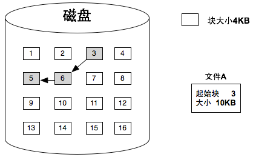
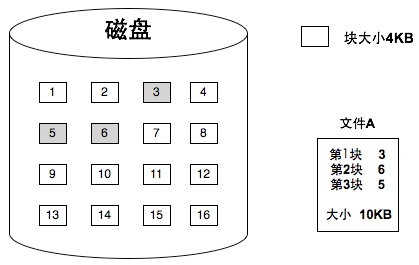
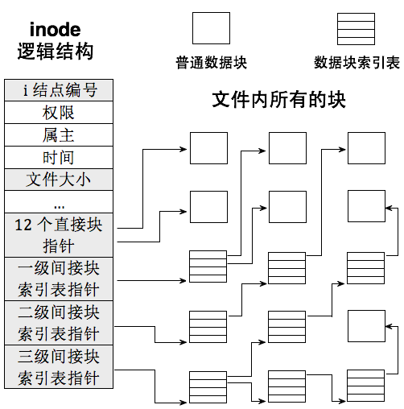
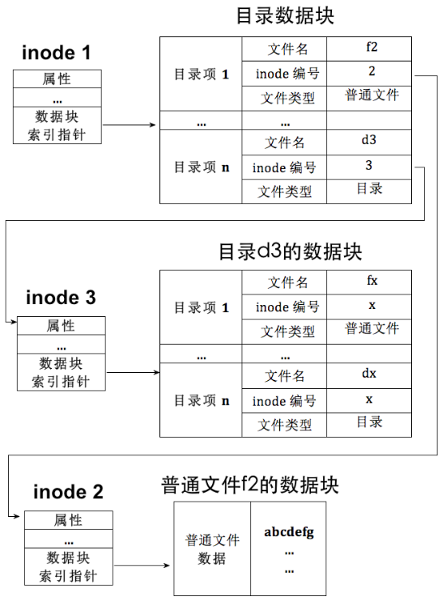
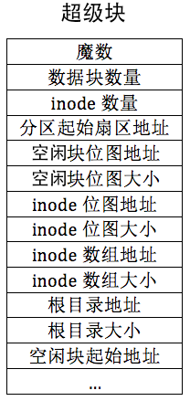
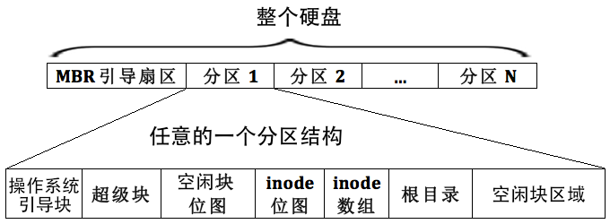
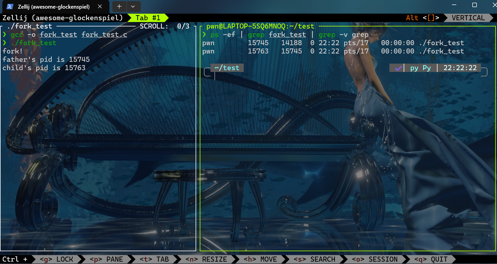
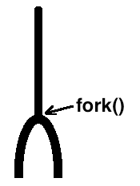

# 扩展文件系统


## 0x0f 实现硬盘分区

Tip

这一节中关于硬盘分区是比较老的知识，现代磁盘分区已经不这么做了，等以后写现代操作系统的时候再补充罢（挖个坑）

> 之前有简单介绍过磁盘的物理分区方式，可以看[这里](https://maple-pwn.github.io/2025/06/22/%E6%93%8D%E4%BD%9C%E7%B3%BB%E7%BB%9F%E5%AD%A6%E4%B9%A0%E7%AC%94%E8%AE%B001-%E4%BB%8EPOST%E5%88%B0Loader/#0x03-MBR%E6%93%8D%E4%BD%9C%E7%A1%AC%E7%9B%98%E4%BB%A5%E5%8F%8ALoader)，但当时的操作只是简单的启动，并不成体系。为了实现文件系统，我们必须建立一套完整的方法，也即是\*\*磁盘驱动程序\*\*

有关于磁盘物理构成的知识之前介绍过了，简单说一下

- 盘片：布满磁性介质的小光盘
- 扇区：硬盘读写的基本单位，在磁道上均匀分布。通常一个扇区为512字节大小
- 磁道：盘片上的一个个同心园环就是一个个磁道
- 磁头：一个读取磁盘的机械臂，每个盘面都存在一个磁头，用来读取该盘面上的磁盘信息
- 柱面：由不同盘面的相同磁道构成的一个圆柱面就叫住面，这里也是为了提升咱们的IO读写速度
- 分区：由多个编号连续的柱面组成的，这里注意一个柱面不能包含多个分区

可以得出如下公式
$$
硬盘容量 = 单片容量×磁头数 \
单片容量 = 每磁道扇区数×磁道数×512字节
$$

---

这里介绍\*\*磁盘分区表(DPT)\*\*

同样，这个表是由多个分区元信息汇成的表，表中每一项都对应一个分区，主要记录各个分区的起始扇区地址，大小界限等

最初的磁盘分区表位于 MBR 引导扇区中，该扇区位于 0 盘 1 道 1 扇区（物理扇区编号从 1 开始，逻辑扇区地址 LBA 从 0 开始），也就是硬盘最开始的扇区，扇区大小为 512 字节，这 512 字节内容包括以下内容


```

[0x000 ~ 0x1BD]

主引导程序（
Bootloader

第
1
阶段）

[0x1BE ~ 0x1FD]

分区表（共
4
项，每项
16
字节）

[0x1FE ~ 0x1FF]

结束标志

0x55AA

```

在早期的硬盘分区管理中，**MBR（Master Boot Record）** 分区表只能记录 **最多 4 个主分区**。这在上世纪硬盘容量还不大的时候是足够的，但随着存储空间不断增长，4 个分区已经无法满足需求，于是便引入了 **扩展分区（Extended Partition）** 的概念。

- **为什么需要扩展分区**

扩展分区的设计初衷很简单：在不破坏原有 MBR 结构的前提下，突破 4 个主分区的限制。它本身并不直接存放数据，而是一个 **“容器分区”**，用于容纳更多的 **逻辑分区（Logical Partition）**。

在 MBR 分区表中，最多只能有一个分区项用于扩展分区，其余分区项依然可以是普通主分区。扩展分区内部的结构与普通分区不同，它需要额外的分区记录机制——**EBR（Extended Boot Record，扩展引导记录）**。

- **EBR 与逻辑分区的组织方式**

**EBR** 的作用类似于 MBR 中的分区表，但它专门用来记录扩展分区内的逻辑分区信息。

每个 EBR 包含两条分区表项：

1. 当前逻辑分区的起始地址与大小
2. **下一个逻辑分区的 EBR 地址**（如果还有下一个逻辑分区）

这种结构形成了一条 **链表**：

- 第一逻辑分区的 EBR 位于扩展分区的起始位置。
- 通过 EBR 中的“下一分区”指针，可以依次找到后续的逻辑分区。
- 最后一个逻辑分区的 EBR 中，第二条分区表项为空（0），表示链表结束。


```

graph TD
    MBR[MBR 分区表]:::mbr --- P1[主分区1]:::primary
    MBR --- P2[主分区2]:::primary
    MBR --- P3[主分区3]:::primary
    MBR --- EXT[扩展分区]:::extended

    EXT --- OBR[OBR<br/>记录逻辑分区1信息]:::obr --- L1[逻辑分区1]:::logical
    L1 --- EBR2[EBR2<br/>记录逻辑分区2信息]:::ebr --- L2[逻辑分区2]:::logical
    L2 --- EBR3[EBR3<br/>记录逻辑分区3信息]:::ebr --- L3[逻辑分区3]:::logical

    classDef mbr fill:#FFD700,stroke:#333,stroke-width:1px;
    classDef primary fill:#87CEFA,stroke:#333,stroke-width:1px;
    classDef extended fill:#FFA07A,stroke:#333,stroke-width:1px;
    classDef obr fill:#90EE90,stroke:#333,stroke-width:1px;
    classDef ebr fill:#98FB98,stroke:#333,stroke-width:1px;
    classDef logical fill:#D8BFD8,stroke:#333,stroke-width:1px;

```

---

关于磁盘部分不想记录很多，毕竟目前的用途已经不大了，暂时放在这里罢

---


## 0x10 文件系统


### inode、简介块索引表、文件控制块FCB

在磁盘的领域中，**块（block）\*\*是文件系统管理数据的基本单位：虽然硬盘的物理读写单位是\*\*扇区**，但为了减少频繁的访问，操作系统通常会将多个扇区组合位一个更大的\*\*块\*\*。在Linux或Unix中，块是文件系统的读写单位，这意味着`即便文件只有1B，也将占用一个完整的块`

Tip

Windows中，我们一般称为\*\*簇\*\*

但是当文件大于一个块的时候，多个块该如何组织在一起呢？

---

FAT链式结构

早期的FAT(File Allocation Table)文件系统中，文件的多个块采用\*\*链式结构\*\*来组织。在每个块的末尾保存下一个块的地址，这样块与块之间可以像链表一样串联。好处显而易见：文件的块可以分散在磁盘的任意位置，不必连续存放，这样可以有效利用磁盘零散的空间，提高空间利用率

但缺点也显而易见：当你要访问文件的第N个块时，必须从第一个块开始，一路顺着地址链找到目标块，这中访问模式在逻辑上很低效，并且硬盘速度本身就不快，更会增加寻道次数，效率极其低下



---

inode索引结构

相对而言，Unix采用\*\*索引结构\*\*来管理文件，也就是为文件的所有数据块建立一张索引表，表中每一项直接记录对应数据块的物理地址。这样要访问第N个块，只需要查表即可，随机访问性能大大提升

而在 Unix/Linux 文件系统中，这个索引结构的具体实现就是 **inode(index node)**。每个文件都对应一个 inode，里面保存了文件的元信息（权限、属主、时间戳、文件大小等）以及数据块的位置。inode 本质上时文件系统中的一种\*\*文件控制块（FCB）\*\*，只不过FCB是一个泛称



---

直接块与间接块

inode 中并不是直接存下文的所有块地址，因为索引表也要占空间。为了平衡性能与存储开销，Unix采取了分级设计\*（世界的尽头是分级）\*

- inode 前 12 个指针称为\*\*直接块\*\*，直接指向文件数据块
- 第 13 个指针指向\*\*一级间接块索引表\*\*，它本身是一个存放块地址的表，一个表可以记录 256 个数据块
- 第 14 个指针指向\*\*二级间接块索引表\*\*，它的每个表项记录的是一个一级间接块的地址，可以记录 $256*256$ 个数据块
- 第 15个指针指向\*\*三级间接块索引表\*\*，能索引$256*256*256$个数据块

通过这种方式，文件既能在小尺寸下快速访问，又能在需要时支持极大的容量，理论上可以轻松容纳超大文件。当然，如果真有超过三级间接索引能力的文件，那只能分割成多个文件来处理。




### 目录项与目录简介

> 刚刚有说过，inode记录了文件大部分元信息——权限、属主、大小、时间戳，以及数据块的地址。但是这里缺没有存放\*\*文件名\*\*，用户最关心的属性
>
> 既然我们通过文件名访问文件，为什么不直接把文件名放到inode里呢？
>
> 对于现代文件系统来说没有必要：文件系统使用inode来标识和管理文件的，只要有了inode，就能定位到文件的实际数据块。而文件名对于文件系统来说并不重要
>
> 但对于人类用户来说，记inode有点神经病了，还是习惯用文件名去找文件。这就引出了一个新问题：**文件系统是如何把文件名和 inode 联系起来的呢**？

**目录也是文件**

回想一下，我们平时访问文件，不论是执行一个程序，还是打开一个文档，都是通过路径来的。而路径的每一层，其实都是一个\*\*目录\*\*。在 Linux 中，目录和普通文件一样，也是用 inode 来表示的，所以目录本质上也是一种文件，只不过它的内容不是数据，而是\*\*目录项（directory entry）\*\*。

这里有个关键点：

- 如果一个 inode 表示的是普通文件，那么它指向的数据块里存的是这个文件的内容。
- 如果一个 inode 表示的是目录文件，那么它指向的数据块里存的就是一组目录项。

---

**什么是目录项**

目录项是一个“文件列表”的条目，每个条目至少包含三个信息：

1. 文件名
2. 文件类型（目录/普通文件等）
3. 文件对应的 inode 编号

它的作用有两个：

- **绑定文件名和 inode**，让用户可以通过文件名找到 inode
- **标识文件类型**，告诉系统该 inode 对应的是目录还是普通文件

你在 Linux 里执行 `ls -i` 时，看到的就是目录项中的文件名和 inode 编号的对应关系；执行 `ls -l` 时，额外看到的权限、属主等信息来自 inode 本身。

| image-20250810161713565 | image-20250810161722940 |
| --- | --- |
| 目录中的目录项 | 目录项信息及 inode 信息 |

有了目录项，文件系统查找文件的过程就很清晰了：

1. 在当前目录中找到匹配文件名的目录项
2. 从目录项中获取该文件的 inode 编号
3. 根据 inode 编号去 inode 表（inode 数组）里找到对应的 inode
4. 读取 inode 中记录的各个数据块地址，进而获取文件内容

---

**小小总结一下**

1. 每个文件都有自己单独的inode，inode 是文件实体数据块在文件系统上的元信息。
2. 所有文件的inode 集中管理，形成inode 数组，每个inode 的编号就是在该inode 数组中的下标。
3. inode 中的前12 个直接数据块指针和后3 个间接块索引表用于指向文件的数据块实体。
4. 文件系统中并不存在具体称为“目录”的数据结构，同样也没有称为“普通文件”的数据结构，统一用同一种inode 表示。inode 表示的文件是普通文件，还是目录文件，取决于inode 所指向数据块中的实际内容是什么，即数据块中的内容要么是普通文件本身的数据，要么是目录中的目录项。
5. 目录项仅存在于inode 指向的数据块中，有目录项的数据块就是目录，目录项所属的inode 指向的所有数据块便是目录。
6. 目录项中记录的是文件名、文件inode 的编号和文件类型，目录项起到的作用有两个，一是粘合文件名及inode，使文件名和inode 关联绑定，二是标识此inode 所指向的数据块中的数据类型（比如是普通文件，还是目录，当然还有更多的类型）。
7. inode 是文件的“实质”，但它并不能直接引用，必须通过文件名找到文件名所在的目录项，然后从该目录项中获得inode 的编号，然后用此编号到inode 数组中去找相关的inode，最终找到文件的数据块。

目录项和inode的关系如下图：



!!!note “死循环”的错觉与根目录的作用


```

有人可能会想：要找到文件的数据块，需要 inode；要找到 inode，需要目录项；而目录项又存在于目录文件的数据块中，这数据块又需要 inode 来找——这不是陷入死循环了吗？

其实不会。文件系统总得有个“起点”，这个起点就是**根目录 `/`**。每个分区都有自己的根目录，而且在文件系统格式化时，根目录所在数据块的地址是固定写死的。查找文件时，从根目录开始递归进入子目录，就能最终找到任何文件。

```


### 超级块与文件系统布局

在前面已经介绍了 **inode、目录项\*\*以及\*\*根目录**，这些是构建文件系统的基础。而此处将要介绍\*\*超级块\*\*的概念。它是文件系统运行的“总指挥”

---

\*\*超级块\*\*可以认为是保存文件系统元信息的元信息，类似于文件系统的配置文件。作用如下：

- 记录文件系统的整体结构和配置信息
- 让系统能够快速定位重要数据结构（如 inode 数组、根目录、位图等）
- 用来识别文件系统的类型（通过魔数）

> 而我们实现最简文件系统，超级块中存储可以如下：
>
> 1. inode数组地址以及大小
> 2. 每个文件有一个inode
> 3. inode数组长度 = 分区最大文件数（格式化时确定）
> 4. inode位图地址及大小
> 5. 用位图管理inode的使用情况
> 6. 根目录地址及大小
> 7. 每个分区根目录位置不统一，所以必须记录
> 8. 空闲块位图地址及大小
> 9. 用位图管理空闲数据块的使用情况
> 10. 魔数
> 11. 用来区分文件系统类型（ext2，ext4，FAT32）
>
> 

---

我们参考ext2文件系统，可以做出如下文件系统布局，不过少了一些块组和块组描述符



---

文件系统的主要工作就是资源管理，而跟踪资源状态最常用的方法就是位图

创建文件系统的时候，现在内存中生成这些位图，再把它们写入硬盘中，这个过程就叫做\*\*持久化\*\*。

而这样做的原因是：分区真正使用是在挂载的时候，而挂载之前内存里是没有位图的，所以必须实现把它们存到磁盘上，将来挂载分区时再从磁盘读回来放到内存中。

由于内存是易失的，断电就会丢失数据，所以哪怕位图只改动了一个位，也要立刻同步回磁盘。位图的大小按扇区对齐，最后一个扇区往往会有多余的位，这些位并不对应真实资源，如果不处理，可能会被误分配导致破坏数据，所以在持久化前要把这些多余位初始化为1，标识已经占用，避免后续使用

而挂载分区的本质，就是把该分区的文件系统元信息（包括超级块，位图等）从磁盘加载到内存，用内存的数据结构来跟踪资源状态，写操作再及时同步到硬盘。

---


### 文件描述符

在 Linux 中，几乎所有文件操作都绕不开一个概念——文件描述符（File Descriptor，FD）

简单来说，文件描述符就是一个整数，它是当前进程 **文件描述符数组** 的下标。Linux 会在每个进程的 PCB（进程控制块）中预先分配一个文件描述符数组，用于记录当前进程打开的文件

其中，前三个文件描述符是固定保留的：

- `0` -> 标准输入(stdin)
- `1` -> 标准输出(stdout)
- `2` -> 标准报错(stderr)

---

Linux通过三层跳转从文件描述符找到磁盘数据块

| 层级 | 位置 | 作用 |
| --- | --- | --- |
| 文件描述符数组 | 每个进程 PCB | 存放“文件表下标” |
| 文件表（全局） | 内核共享 | 保存 `struct file`，指向 inode |
| inode 队列（缓存） | 内核共享 | 保存文件存储信息，指向磁盘数据块 |


```

flowchart LR
    fd["文件描述符 (int)"] --> fd_array["进程文件描述符数组"]
    fd_array --> file_table["文件表 (struct file[])"]
    file_table --> inode["inode 队列"]
    inode --> disk["磁盘数据块"]

```

1. 用 fd 在 **文件描述符数组** 找到文件表下标
2. 用下标找到 **文件表** 中的 `struct file`
3. 通过 `struct file` 的 `f_inode` 指针找到 **inode**
4. inode 中有文件数据块的位置，最终访问磁盘


## 0x11 系统交互


### fork介绍

`fork`函数原型为`pid_t fork(void)`，返回值为数字，可能是\*\*子进程的pid\*\*，可能是\*\*0\*\*，也可能是\*\*-1\*\*。

> 之所以会有 3 种返回值，是因为 Linux 中没有获取子进程 pid 的方法，因此为了让父进程获知自己的孩子是谁，`fork`会给父进程返回子进程的 pid。子进程可以通过系统调用`getpid`来获知自己的父亲是谁，并且没有pid=0的进程，因此 `fork` 给子进程返回 0 ，从返回值上和父进程区别开来。如果 `fork` 失败，则返回 -1 ，没有子进程产生

这里有个很神秘的现象：**`fork`执行一次会返回两次pid**，可以看看下面这个例子


```

#include

<unistd.h>

#include

<stdio.h>

int

main
()

{


printf
(
"fork!
\n
"
);


sleep
(
5
);


int

pid

=

fork
();


if

(
pid

==

-1
)

{


return

1
;


}


if

(
pid
)

{


printf
(
"father's pid is %d
\n
"
,
getpid
());


sleep
(
5
);


return

0
;


}

else

{


printf
(
"child's pid is %d
\n
"
,
getpid
());


sleep
(
5
);


return

0
;


}

}

```

运行情况如下

*`ps -ef | grep fork_test | grep -v grep`指令在运行test时执行*



可以得出这样一个结论：`fork`后，由之前的一个进程变成了两个进程，也就是说，**`fork`的作用是克隆进程。克隆出来的进程拥有独立的地址空间**，两个地址执行的是独立且相同的代码，各自的指令中都包含第6行的`fork`调用，只是子进程是在`fork`函数返回之后才开始执行的，因此执行的是`fork`之后的代码

大致就像下面这张图，`fork`的中文意思“叉子”是很形象了




### 实现

这部分内容太多了，又大多是代码，不是很想介绍了~（懒狗）~

---

其实后面还有一部分关于管道的内容，但是这个有些太少了，通信可以单独拿出来学习一下的，以后完整的写一写罢
