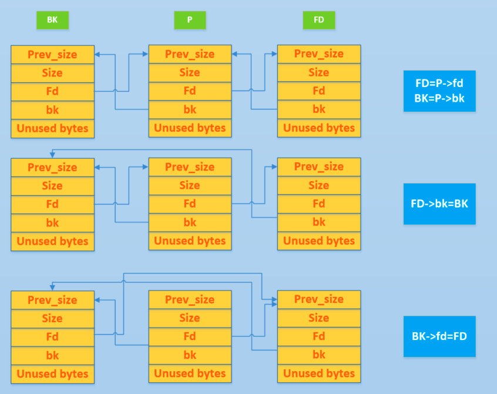

## 什么是堆

在程序运行过程中，堆可以提供动态分配的内存，允许程序申请大小未知的内存。堆其实就是程序虚拟地址空间的一块连续的线性区域，它由低地址向高地址方向增长。我们一般称管理堆的那部分程序为堆管理器。

堆管理器处于用户程序与内核中间，主要做以下工作

1. **响应用户的申请内存请求，向操作系统申请内存，然后将其返回给用户程序**。同时，为了保持内存管理的高效性，内核一般都会预先分配很大的一块连续的内存，然后让堆管理器通过某种算法管理这块内存。只有当出现了堆空间不足的情况，堆管理器才会再次与操作系统进行交互。
2. **管理用户所释放的内存**。一般来说，用户释放的内存并不是直接返还给操作系统的，而是由堆管理器进行管理。这些释放的内存可以来响应用户新申请的内存的请求。

目前 Linux 标准发行版中使用的堆分配器是 glibc 中的堆分配器：`ptmalloc2`。`ptmalloc2` 主要是通过 `malloc/free` 函数来分配和释放内存块。

> 过去的堆分配器是 `dlmalloc` ，不能分配多线程

需要注意的是，在内存分配与使用的过程中，Linux 有这样的一个基本内存管理思想，**只有当真正访问一个地址的时候，系统才会建立虚拟页面与物理页面的映射关系**。


## 堆的基本操作

- 基本的堆操作，包括堆的分配，回收，堆分配背后的系统调用
- 介绍堆目前的多线程支持


### [**malloc**](https://github.com/iromise/glibc/blob/master/malloc/malloc.c#L448)


```

/*

  malloc(size_t n)

  Returns a pointer to a newly allocated chunk of at least n bytes, or null

  if no space is available. Additionally, on failure, errno is

  set to ENOMEM on ANSI C systems.

  If n is zero, malloc returns a minumum-sized chunk. (The minimum

  size is 16 bytes on most 32bit systems, and 24 or 32 bytes on 64bit

  systems.)  On most systems, size_t is an unsigned type, so calls

  with negative arguments are interpreted as requests for huge amounts

  of space, which will often fail. The maximum supported value of n

  differs across systems, but is in all cases less than the maximum

  representable value of a size_t.

*/

```

malloc 函数返回对应大小字节的内存块的指针。此外，该函数还对一些异常情况做了处理

- 当n等于0的时候，返回当前系统允许的堆的最小内存块
- 当n为负数时，**size\_t是无符号数**，所以程序就会申请很大的内存空间，但通常来说会失败


### [**free**](https://github.com/iromise/glibc/blob/master/malloc/malloc.c#L465)


```

/*

      free(void* p)

      Releases the chunk of memory pointed to by p, that had been previously

      allocated using malloc or a related routine such as realloc.

      It has no effect if p is null. It can have arbitrary (i.e., bad!)

      effects if p has already been freed.

      Unless disabled (using mallopt), freeing very large spaces will

      when possible, automatically trigger operations that give

      back unused memory to the system, thus reducing program footprint.

    */

```

free函数会释放由p所指向的内存块，这个内存块有可能是通过malloc函数得到的，也有可能是通过相关的函数realloc得到的。该函数也对异常情况做了处理

- 当p为空指针的时候，函数不执行任何操作
- 当p已经被释放之后，再次释放会出现乱七八糟的效果，也就是`double free`
- 除了被禁用(mallopt)的情况下，当释放很大的内存空间时，程序会将这些内存空间返还给系统，以便减小程序所使用的内存空间


### 内存分配背后的系统调用

在前面提到的函数中，无论是`malloc`还是`free`，并不是真正的与系统交互的函数。这些函数背后的系统调用主要是 [(s)brk](https://man7.org/linux/man-pages/man2/sbrk.2.html)函数和 [mmap, munmap](http://man7.org/linux/man-pages/man2/mmap.2.html)函数。
如下图所示


#### (s)brk

对于堆的操作，操作系统提供了 `brk` 函数，glibc库提供了 `sbrk` 函数，我们可以通过增加 `brk` 的大小来向操作系统申请内存

初始时，堆的起始地址 `start_brk` 以及堆的当前末尾 `brk` 指向同一地址

- 不开启ASLR保护的时候，`start_brk` 以及 `brk` 会指向 `data/bss` 的结尾
- 开启ASLR保护的时候， `start_brk` 以及`brk` 会指向同一位置，只是这个位置是在 `data/bss` 段结尾后的随机偏移处

具体效果如下图


我们举个例子看一下


```

/* sbrk and brk example */

#include

<stdio.h>

#include

<unistd.h>

#include

<sys/types.h>

int

main
()

{


void

*
curr_brk
,

*
tmp_brk

=

NULL
;


printf
(
"Welcome to sbrk example:%d
\n
"
,

getpid
());


/* sbrk(0) gives current program break location */


tmp_brk

=

curr_brk

=

sbrk
(
0
);


printf
(
"Program Break Location1:%p
\n
"
,

curr_brk
);


getchar
();


/* brk(addr) increments/decrements program break location */


brk
(
curr_brk
+
4096
);


curr_brk

=

sbrk
(
0
);


printf
(
"Program break Location2:%p
\n
"
,

curr_brk
);


getchar
();


brk
(
tmp_brk
);


curr_brk

=

sbrk
(
0
);


printf
(
"Program Break Location3:%p
\n
"
,

curr_brk
);


getchar
();


return

0
;

}

```

运行后会看到这些

- 第一次调用brk之前还没有出现堆
  - start\_brk = brk = end\_data = 0x4260000
- 第一次增加brk之后
  - start\_brk = end\_data = 0x4260000
  - brk = 0x4270000


#### mmap

malloc 会使用 mmap 来创建独立的匿名映射段。匿名映射的目的主要是可以申请以 0 填充的内存，并且这块内存仅被调用进程所使用


### 多线程支持

在原来的`dlmalloc`[[#^1]]实现中，当两个线程同时要申请内存时，只有一个线程可以进入临界区申请内存，而另外一个线程则必须等待直到临界区中不再有线程。这是因为所有的线程共享一个堆。在 glibc 的 `ptmalloc` 实现中，比较好的一点就是支持了多线程的快速访问

例子如下：


```

/* Per thread arena example. */

#include

<stdio.h>

#include

<stdlib.h>

#include

<pthread.h>

#include

<unistd.h>

#include

<sys/types.h>

void
*

threadFunc
(
void
*

arg
)

{


printf
(
"Before malloc in thread 1
\n
"
);


getchar
();


char
*

addr

=

(
char
*
)

malloc
(
1000
);


printf
(
"After malloc and before free in thread 1
\n
"
);


getchar
();


free
(
addr
);


printf
(
"After free in thread 1
\n
"
);


getchar
();

}

int

main
()

{


pthread_t

t1
;


void
*

s
;


int

ret
;


char
*

addr
;


printf
(
"Welcome to per thread arena example::%d
\n
"
,
getpid
());


printf
(
"Before malloc in main thread
\n
"
);


getchar
();


addr

=

(
char
*
)

malloc
(
1000
);


printf
(
"After malloc and before free in main thread
\n
"
);


getchar
();


free
(
addr
);


printf
(
"After free in main thread
\n
"
);


getchar
();


ret

=

pthread_create
(
&
t1
,

NULL
,

threadFunc
,

NULL
);


if
(
ret
)


{


printf
(
"Thread creation error
\n
"
);


return

-1
;


}


ret

=

pthread_join
(
t1
,

&
s
);


if
(
ret
)


{


printf
(
"Thread join error
\n
"
);


return

-1
;


}


return

0
;

}

```

可以看到，在第一次申请后，堆段被建立了，并且它就紧邻着数据段，这说明malloc的背后是用 brk 函数来实现的。同时我们得到了一个21000字节的堆。


这是因为\*\*为了方便，操作系统会把很大的内存分配给程序。这样的话，就避免了多次内核态与用户态的切换，提高了程序的效率\*\*。我们称这一块连续的内存区域为 arena。此外，我们称由主线程申请的内存为 main\_arena。后续申请的内存会一直从这个 arena 中获取，直到空间不足。

> 当 arena 空间不足时，它可以通过增加 brk 的方式来增加堆的空间。类似地，arena也可以通过减小 brk 来缩小自己的空间

在主线程释放内存后，我们从下面的输出可以看出，其对应的 arena 并没有进行回收，而是交由 glibc 来进行管理。当后面程序再次申请内存时，在 glibc 中管理的内存充足的情况下， glibc 就会根据堆分配的算法来给程序分配相应的内存


## 堆相关数据结构

与堆相应的数据结构主要分为
- 宏观结构，包含堆的宏观信息，可以通过这些数据结构索引堆的基本信息
- 微观结构，用于具体处理堆的分配与回收中的内存块


### 微观结构


#### malloc\_chunk

**概述**

在程序的执行过程中，我们称由 malloc 申请的内存为 `chunk` 。这块内存在 `ptmalloc` 内部用 `malloc_chunk` 结构体来表示。当程序申请的 `chunk` 被释放后，会被加入到相应的空闲管理列表中 #chunk

其中，无论一个 `chunk` 的大小如何，处分配状态还是释放状态，它们都使用一个统一的结构。虽然它们使用了同一个数据结构，但是根据是否被释放，它们的表现形式会有所不同

结构如下


```

/*

  This struct declaration is misleading (but accurate and necessary).

  It declares a "view" into memory allowing access to necessary

  fields at known offsets from a given base. See explanation below.

*/

struct

malloc_chunk

{


INTERNAL_SIZE_T

prev_size
;

/* Size of previous chunk (if free).  */


INTERNAL_SIZE_T

size
;

/* Size in bytes, including overhead. */


struct

malloc_chunk
*

fd
;

/* double links -- used only if free. */


struct

malloc_chunk
*

bk
;


/* Only used for large blocks: pointer to next larger size.  */


struct

malloc_chunk
*

fd_nextsize
;

/* double links -- used only if free. */


struct

malloc_chunk
*

bk_nextsize
;

};

```

> [!note] 补充一些宏定义
>
>

```

#ifndef INTERNAL_SIZE_T

# define INTERNAL_SIZE_T size_t  //一般是64/32位无符号整数
#endif
#define SIZE_SZ (sizeof (INTERNAL_SIZE_T)
#define MALLOC_ALIGN_MASK (MALLOC_ALIGNMENT - 1)
#define MALLOC_ALIGNMENT (2 * SIZE_SZ < _ _ alignof_ _ (long double)) \
                   ? _ _ alignof _ _ (long double) : 2 * SIZE_SZ)

```

> - **prev\_size**，取决于该`chunk`的\*\*物理相邻的前一地址 chunk （两个指针的地址差值为前一 chunk 大小）\*\*
> - 如果是空闲的话，那么该字段记录的是前一个 `chunk` 的大小（包括 `chunk` 头）
> - 如果不空闲，该字段可以用来存储物理相邻的前一个 `chunk` 的数据。\*\*这里的前一 `chunk` 指的是较低地址的 `chunk`

- **size**，该 `chunk` 的大小，大小必须是 `MALLOC_ALIGNMENT` 的整数倍。如果不是整数倍，会被转换成满足大小的最小的 `MALLOC_ALIGNMENT` 的倍数，通过 [`request2size()`](https://github.com/iromise/glibc/blob/master/malloc/malloc.c#L1174) 宏完成。该字段的低三个比特位对 `chunk` 的大小没有影响，它们从高到低分别表示

  - NON\_MAIN\_ARENA，记录当前 `chunk` 是否不属于主线程，1表示不属于
  - IS\_MAPPED，记录当前的 `chunk` 是否是由 mmap 分配的
  - PREV\_INUSE，记录前一个 `chunk` 块是否被分配。一般来说，堆中第一个被分配的内存块的 size 字段的P位都被设置为1，以便于防止访问前面的非法内存。当 `chunk` 的 size 的P位为0时，我们能通过 `prev_size` 字段来获取上一个 `chunk` 的大小以及地址。这也方便进行空闲 `chunk` 之间的合并
- **fd，bk** `chunk` 处于分配状态时，从 fd 字段开始是用户的数据。 `chunk` 空闲时，会被添加到对应的空闲管理链表中，其字段的含义如下

  - fd 指向下一个（非物理相邻）空闲的 `chunk`
  - bk 指向上一个（非物理相邻）空闲的`chunk`
  - 通过 fd 和 bk 可以将空闲的 `chunk` 块加入到空闲的 `chunk` 块链表进行统一管理。
- **fd\_nextsize,bk\_nextsize** 只有`chunk` 空闲的时候才使用，不过其用于较大的 chunk

  - fd\_nextsize 指向前一个与当前 `chunk` 大小不同的第一个空闲块，不包含 bin 的头指针
  - bk\_nextsize 指向后一个与当前 `chunk` 大小不同的第一个空闲块，不包含 bin 的头指针
  - 一般空闲的 large chunk 在 fd 的遍历顺序中，按照由大到小的顺序排列。**这样做可以避免在寻找合适 `chunk` 时挨个遍历**

> 2.26版本起始的 32 位 glibc ，其 `MALLOC_ALIGNMENT` 并非基于 `SIZE_SZ` 计算的 8 ，而是和64 位 glibc 所用值相同 16

一个已经分配的 `chunk` 样子如下，**我们称前两个字段为 `chunk header` ，后面的部分称为 `user data` 。每次 malloc 申请得到的内存指针，起始指向 `user data` 的起始处**

当一个 `chunk` 处于使用状态时，它的下一个 `chunk` 的 prev\_size 域无效，所以下一个 `chunk` 的该部分也可以被当前 `chunk` 使用。**这就是 chunk 中的空间复用**


```

chunk-> +-+-+-+-+-+-+-+-+-+-+-+-+-+-+-+-+-+-+-+-+-+-+-+-+-+-+-+-+-+-+-+-+
        |             Size of previous chunk, if unallocated (P clear)  |
        +-+-+-+-+-+-+-+-+-+-+-+-+-+-+-+-+-+-+-+-+-+-+-+-+-+-+-+-+-+-+-+-+
        |             Size of chunk, in bytes                     |A|M|P|
  mem-> +-+-+-+-+-+-+-+-+-+-+-+-+-+-+-+-+-+-+-+-+-+-+-+-+-+-+-+-+-+-+-+-+
        |             User data starts here...                          .
        .                                                               .
        .             (malloc_usable_size() bytes)                      .
next    .                                                               |
chunk-> +-+-+-+-+-+-+-+-+-+-+-+-+-+-+-+-+-+-+-+-+-+-+-+-+-+-+-+-+-+-+-+-+
        |             (size of chunk, but used for application data)    |
        +-+-+-+-+-+-+-+-+-+-+-+-+-+-+-+-+-+-+-+-+-+-+-+-+-+-+-+-+-+-+-+-+
        |             Size of next chunk, in bytes                |A|0|1|
        +-+-+-+-+-+-+-+-+-+-+-+-+-+-+-+-+-+-+-+-+-+-+-+-+-+-+-+-+-+-+-+-+

```

被释放的 `chunk` 被记录在链表中 （可能时循环双向链表，也可能时单向链表）。具体结构如下


```

chunk-> +-+-+-+-+-+-+-+-+-+-+-+-+-+-+-+-+-+-+-+-+-+-+-+-+-+-+-+-+-+-+-+-+
        |             Size of previous chunk, if unallocated (P clear)  |
        +-+-+-+-+-+-+-+-+-+-+-+-+-+-+-+-+-+-+-+-+-+-+-+-+-+-+-+-+-+-+-+-+
`head:' |             Size of chunk, in bytes                     |A|0|P|
  mem-> +-+-+-+-+-+-+-+-+-+-+-+-+-+-+-+-+-+-+-+-+-+-+-+-+-+-+-+-+-+-+-+-+
        |             Forward pointer to next `chunk` in list             |
        +-+-+-+-+-+-+-+-+-+-+-+-+-+-+-+-+-+-+-+-+-+-+-+-+-+-+-+-+-+-+-+-+
        |             Back pointer to previous `chunk` in list            |
        +-+-+-+-+-+-+-+-+-+-+-+-+-+-+-+-+-+-+-+-+-+-+-+-+-+-+-+-+-+-+-+-+
        |             Unused space (may be 0 bytes long)                .
        .                                                               .
 next   .                                                               |
chunk-> +-+-+-+-+-+-+-+-+-+-+-+-+-+-+-+-+-+-+-+-+-+-+-+-+-+-+-+-+-+-+-+-+
`foot:' |             Size of chunk, in bytes                           |
        +-+-+-+-+-+-+-+-+-+-+-+-+-+-+-+-+-+-+-+-+-+-+-+-+-+-+-+-+-+-+-+-+
        |             Size of next chunk, in bytes                |A|0|0|
        +-+-+-+-+-+-+-+-+-+-+-+-+-+-+-+-+-+-+-+-+-+-+-+-+-+-+-+-+-+-+-+-+

```

可以发现，如果一个 `chunk` 处于释放状态，那么会有两个位置记录其相应大小
1. 本身的 size 字段
2. 它后面的 `chunk`

**一般情况下**，`物理相邻`的两个空闲 `chunk` 会被合并为一个 `chunk` 。堆管理器会通过 prev\_size 字段以及 size 字段合并两个物理相邻的空闲 `chunk` 块。


#### bin


##### 概述

用户释放掉的 `chunk` 不会马上归还给系统，ptmalloc 会统一管理 heap 和 mmap 映射区域中的空闲chunk 。当用户再一次请求分配内存时，ptmalloc 分配器会试图在空闲的 chunk 中挑选一块合适的给用户。这样可以避免频繁的系统调用，降低内存分配的开销

在具体的实现中，ptmalloc 采用分箱方式堆空闲的 `chunk` 进行管理。首先，它会根据空闲的 `chunk` 的大小以及使用状态将`chunk` 初步分为4类：fast bins， small bins，large bins，unsorted bins。相似大小的 `chunk` 会用双向链表链接起来。也就是说，在每类 bin 的内部仍然会有多个互不相关的链表来保存不同大小的 chunk

对于 small bins，large bins，unsorted bin 来说，ptmalloc 将它们维护在同一个数组中。这些 bin 对应的数据结构在 malloc\_state 中，如下


```

#define NBINS 128

/* Normal bins packed as described above */

mchunkptr

bins
[

NBINS

*

2

-

2

];

```

`bins` 主要用于索引不同 bin 的 fd 和 bk

以32为系统为例，bins的前4项的含义如下

| 含义 | bin1的 fd，bin2 的prev\_size | bin1 的 bk，bin2 的 size | bin2 的 bk/bin3 的prev\_size | bin2 的 bk/bin3 的 size |
| --- | --- | --- | --- | --- |
| bin 下标 | 0 | 1 | 2 | 3 |
| 可以看到，bin2 的 prev\_size、size 和 bin1 的 fd、bk 是重合的。由于我们只会使用 fd 和 bk 来索引链表，所以该重合部分的数据其实记录的是 bin1 的 fd、bk。 也就是说，虽然后一个 bin 和前一个 bin 共用部分数据，但是其实记录的仍然是前一个 bin 的链表数据。通过这样的复用，可以节省空间。 |  |  |  |  |

数组中的 bin 依次如下

1. 第一个为 unsorted bin，字如其面，这里面的 `chunk` 没有进行排序，存储的 `chunk` 比较杂。
2. 索引从 2 到 63 的 bin 称为 small bin，同一个 small bin 链表中的 `chunk` 的大小相同。两个相邻索引的 small bin 链表中的 `chunk` 大小相差的字节数为 **2 个机器字长**，即 32 位相差 8 字节，64 位相差 16 字节。
3. small bins 后面的 bin 被称作 large bins。large bins 中的每一个 bin 都包含一定范围内的 chunk，其中的 chunk 按 fd 指针的顺序从大到小排列。相同大小的 chunk 同样按照最近使用顺序排列。 #large\_bin

此外，上述这些 bin 的排布都会遵循一个原则：**任意两个物理相邻的空闲 chunk 不能在一起**。

需要注意的是，并不是所有的 `chunk` 被释放后就立即被放到 bin 中。ptmalloc 为了提高分配的速度，会把一些小的 `chunk` **先\*\*放到 fast bins 的容器内。\*\*而且，fastbin 容器中的 `chunk` 的使用标记总是被置位的，所以不满足上面的原则。**

通用宏如下：


```

typedef

struct

malloc_chunk

*
mbinptr
;

/* addressing -- note that bin_at(0) does not exist */

#define bin_at(m, i)                                                           \

    (mbinptr)(((char *) &((m)->bins[ ((i) -1) * 2 ])) -                        \

              offsetof(struct malloc_chunk, fd))

/* analog of ++bin */

//获取下一个bin的地址

#define next_bin(b) ((mbinptr)((char *) (b) + (sizeof(mchunkptr) << 1)))

/* Reminders about list directionality within bins */

// 这两个宏可以用来遍历bin

// 获取 bin 的位于链表头的 chunk

#define first(b) ((b)->fd)

// 获取 bin 的位于链表尾的 chunk

#define last(b) ((b)->bk)

```


##### fast bin

大多数程序经常会申请以及释放一些比较小的内存块。如果将一些较小的 `chunk` 释放之后发现存在与之相邻的空闲的 `chunk` 并将它们进行合并，那么当下一次再次申请相应大小的 `chunk` 时，就需要对 `chunk` 进行分割，这样就大大降低了堆的利用效率。**因为我们把大部分时间花在了合并、分割以及中间检查的过程中。** 因此，ptmalloc 中专门设计了 fast bin，对应的变量就是 malloc state 中的 fastbinsY


```

/*

   Fastbins

    An array of lists holding recently freed small chunks.  Fastbins

    are not doubly linked.  It is faster to single-link them, and

    since chunks are never removed from the middles of these lists,

    double linking is not necessary. Also, unlike regular bins, they

    are not even processed in FIFO order (they use faster LIFO) since

    ordering doesn't much matter in the transient contexts in which

    fastbins are normally used.

    Chunks in fastbins keep their inuse bit set, so they cannot

    be consolidated with other free chunks. malloc_consolidate

    releases all chunks in fastbins and consolidates them with

    other free chunks.

 */

typedef

struct

malloc_chunk

*
mfastbinptr
;

/*

    This is in malloc_state.

    /* Fastbins */


mfastbinptr

fastbinsY
[

NFASTBINS

];

*/

```

为了更加高效地利用 fast bin，glibc 采用单向链表对其中的每个 bin 进行组织，并且\*\*每个 bin 采取 LIFO 策略\*\*，最近释放的 `chunk` 会更早地被分配，所以会更加适合于局部性。也就是说，当用户需要的 `chunk` 的大小小于 fastbin 的最大大小时， ptmalloc 会首先判断 fastbin 中相应的 bin 中是否有对应大小的空闲块，如果有的话，就会直接从这个 bin 中获取 chunk。如果没有的话，ptmalloc 才会做接下来的一系列操作。

默认情况下（**32 位系统为例**）， fastbin 中默认支持最大的 `chunk` 的数据空间大小为 64 字节。但是其可以支持的 chunk 的数据空间最大为 80 字节。除此之外， fastbin 最多可以支持的 bin 的个数为 10 个，从数据空间为 8 字节开始一直到 80 字节（注意这里说的是数据空间大小，也即除去 prev\_size 和 size 字段部分的大小）如下

[[各个函数原型#fast bin#定义]]

ptmalloc 默认情况下会调用 set\_max\_fast(s) 将全局变量 global\_max\_fast 设置为DEFAULT\_MXFAST，也就是设置 fast bins 中 `chunk` 的最大值。当 MAX\_FAST\_SIZE 被设置为 0 时，系统就不会支持 fastbin 。

**fastbin的索引**

[各个函数原型#fastbin的索引](../各个函数原型/index.md)

**需要特别注意的是，fastbin 范围的 `chunk` 的 inuse 始终被置为 1。因此它们不会和其它被释放的 `chunk` 合并。**

但是当释放的 `chunk` 与该 `chunk` 相邻的空闲 `chunk` 合并后的大小大于 FASTBIN\_CONSOLIDATION\_THRESHOLD 时，内存碎片可能比较多了，我们就需要把 fast bins 中的 chunk 都进行合并，以减少内存碎片对系统的影响。

**malloc\_consolidate 函数可以将 fastbin 中所有能和其它 `chunk` 合并的 `chunk` 合并在一起。具体地参见后续的详细函数的分析。**


##### small bin

small bins 中每个 `chunk` 的大小与其所在的 bin 的 index 的关系为：chunk\_size = 2 \* SIZE\_SZ \* index，具体如下

| 下标 | SIZE\_SZ = 4（32位） | SIZE\_SZ = 8(64位) |
| --- | --- | --- |
| 2 | 16 | 32 |
| 3 | 24 | 48 |
| 4 | 32 | 64 |
| 5 | 40 | 80 |
| x | 2 × 4 × x | 2 × 8 × x |
| 63 | 504 | 1008 |
| small bins 中一共有 62 个循环双向链表，每个链表中存储的 `chunk` 大小都一致。比如对于 32 位系统来说，下标 2 对应的双向链表中存储的 `chunk` 大小为均为 16 字节。每个链表都有链表头结点，这样可以方便对于链表内部结点的管理。此外，**small bins 中每个 bin 对应的链表采用 FIFO 的规则**，所以同一个链表中先被释放的 `chunk` 会先被分配出去。 |  |  |

small bin相关宏

[各个函数原型#small bin#相关宏](../各个函数原型/index.md)


##### large bin

large bins 中一共包括 63 个 bin，每个 bin 中的 `chunk` 的大小不一致，而是处于一定区间范围内。此外，这 63 个 bin 被分成了 6 组，每组 bin 中的 `chunk` 大小之间的公差一致，具体如下：

| 组 | 数量 | 公差 |
| --- | --- | --- |
| 1 | 32 | 64B |
| 2 | 16 | 512B |
| 3 | 8 | 4096B |
| 4 | 4 | 32768B |
| 5 | 2 | 262144B |
| 6 | 1 | 不限制 |
| ##### unsorted bin |  |  |

unsorted bin 可以视为空闲 `chunk` 回归其所属 bin 之前的缓冲区。

其在 glibc 中具体的说明如下

[各个函数原型#unsorted bin#glibc说明](../各个函数原型/index.md)

从下面的宏我们可以看出


```

/* The otherwise unindexable 1-bin is used to hold unsorted chunks. */

#define unsorted_chunks(M) (bin_at(M, 1))

```

unsorted bin 处于我们之前所说的 bin 数组下标 1 处。故而 unsorted bin 只有一个链表。unsorted bin 中的空闲 `chunk` 处于乱序状态，主要有两个来源

- 当一个较大的 `chunk` 被分割成两半后，如果剩下的部分大于 MINSIZE，就会被放到 unsorted bin 中。
- 释放一个不属于 fast bin 的 chunk，并且该 `chunk` 不和 `top chunk` 紧邻时，该 `chunk` 会被首先放到 unsorted bin 中。关于 `top chunk` 的解释，请参考下面的介绍。

此外，Unsorted Bin 在使用的过程中，采用的遍历顺序是 FIFO 。


##### top chunk

[各个函数原型#Top Chunk#glibc描述](../各个函数原型/index.md)

程序第一次进行 malloc 的时候，heap 会被分为两块，一块给用户，剩下的那块就是 top chunk。其实，所谓的 `top chunk` 就是处于当前堆的物理地址最高的 chunk。这个 `chunk` 不属于任何一个 bin，它的作用在于当所有的 bin 都无法满足用户请求的大小时，如果其大小不小于指定的大小，就进行分配，并将剩下的部分作为新的 top chunk。否则，就对 heap 进行扩展后再进行分配。在 main arena 中通过 sbrk 扩展 heap，而在 thread arena 中通过 mmap 分配新的 heap。

需要注意的是，`top chunk` 的 prev\_inuse 比特位始终为 1，否则其前面的 chunk 就会被合并到 top chunk 中。

**初始情况下，我们可以将 unsorted `chunk` 作为 top chunk。**


##### last remainder

在用户使用 malloc 请求分配内存时，ptmalloc2 找到的 `chunk` 可能并不和申请的内存大小一致，这时候就将分割之后的剩余部分称之为 last remainder `chunk` ，unsort bin 也会存这一块。top `chunk` 分割剩下的部分不会作为 last remainder.


## 深入理解堆的实现

任何堆的实现都要从以下两个角度考虑相应问题：
- 宏观角度：
- 创建堆
- 堆初始化
- 删除堆
- 微观角度：
- 申请内存块
- 释放内存块


### 基础操作


#### **unlink**

unlink 用来将一个双向量表(只存储空闲的 `chunk`) 中的一个元素取出来，可能在以下地方使用

- `malloc`
  - 从恰好大小合适的 `large bin` 中获取 `chunk`。
    - **这里需要注意的是 fastbin 与 small bin 就没有使用 unlink，这就是为什么漏洞会经常出现在它们这里的原因。**
    - 依次遍历处理 unsorted bin 时也没有使用 unlink 。
  - 从比请求的 chunk 所在的 bin 大的 bin 中取 chunk。
- `free`
  - 后向合并，合并物理相邻低地址空闲 chunk。
  - 前向合并，合并物理相邻高地址空闲 chunk（除了 top chunk）。
- `malloc\_consolidate
  - 后向合并，合并物理相邻低地址空闲 chunk。
  - 前向合并，合并物理相邻高地址空闲 chunk（除了 top chunk）。
- `realloc` *重新调整一块已有内存的大小（expand 或 shrink），同时尽可能保留原内容。*

  - 前向扩展，合并物理相邻高地址空闲 chunk（除了 top chunk）。
    
    small bin 的 unlink 为例子，**P最后的 fd 和 bk 指针并没有发生变化**，但我们去遍历整个双向链表的时候，已经遍历不到对应的链表了。有时可以利用这一点泄露地址
    *fd是下一个未用chunk、bk是上一个未用chunk*
- **libc 地址**(unlink外面)

  - P 位于双向链表头部，bk 泄漏
  - P 位于双向链表尾部，fd 泄漏
  - 双向链表只包含一个空闲 chunk 时，P 位于双向链表中，fd 和 bk 均可以泄漏
- **泄漏堆地址，双向链表包含多个空闲 chunk**(unlink里面)
  - P 位于双向链表头部，fd 泄漏
  - P 位于双向链表中，fd 和 bk 均可以泄漏
  - P 位于双向链表尾部，bk 泄漏

> 头部是指新加入的chunk，尾部是指最先加入的chunk
> **堆的第一个 chunk 所记录的 prev\_inuse 位默认为1**


# 申请内存块


## \_\_ libc\_malloc

一般我们会使用 malloc 函数来申请内存块，可是当仔细看 glibc 的源码实现时，其实并没有 malloc 函数。其实该函数真正调用的是 `__libc_malloc` 函数。为什么不直接写个 malloc 函数呢，因为有时候我们可能需要不同的名称。此外，`__libc_malloc` 函数只是用来简单封装 `_int_malloc` 函数。`_int_malloc` 才是申请内存块的核心。下面我们来仔细分析一下具体的实现。

该函数会首先检查是否有内存分配函数的钩子函数（`__malloc_hook`），这个主要用于用户自定义的堆分配函数，方便用户快速修改堆分配函数并进行测试。这里需要注意的是，**用户申请的字节一旦进入申请内存函数中就变成了无符号整数**。


```

// wapper for int_malloc

void

*
__libc_malloc
(
size_t

bytes
)

{


mstate

ar_ptr
;


void

*

victim
;


// 检查是否有内存分配钩子，如果有，调用钩子并返回.


void

*
(
*
hook
)(
size_t
,

const

void

*
)

=

atomic_forced_read
(
__malloc_hook
);


if

(
__builtin_expect
(
hook

!=

NULL
,

0
))


return

(
*
hook
)(
bytes
,

RETURN_ADDRESS
(
0
));

```

接着会寻找一个 arena 来试图分配内存。


```

arena_get
(
ar_ptr
,

bytes
);

```

然后调用 `_int_malloc` 函数去申请对应的内存。


```

victim

=

_int_malloc
(
ar_ptr
,

bytes
);

```

如果分配失败的话，ptmalloc 会尝试再去寻找一个可用的 arena，并分配内存。


```

/* Retry with another arena only if we were able to find a usable arena

       before.  */


if

(
!
victim

&&

ar_ptr

!=

NULL
)

{


LIBC_PROBE
(
memory_malloc_retry
,

1
,

bytes
);


ar_ptr

=

arena_get_retry
(
ar_ptr
,

bytes
);


victim

=

_int_malloc
(
ar_ptr
,

bytes
);


}

```

如果申请到了 arena，那么在退出之前还得解锁。


```

if

(
ar_ptr

!=

NULL
)

__libc_lock_unlock
(
ar_ptr
->
mutex
);

```

判断目前的状态是否满足以下条件

- 要么没有申请到内存
- 要么是 mmap 的内存
- **要么申请到的内存必须在其所分配的 arena 中**


```

assert
(
!
victim

||

chunk_is_mmapped
(
mem2chunk
(
victim
))

||


ar_ptr

==

arena_for_chunk
(
mem2chunk
(
victim
)));

```

最后返回内存。


```

return

victim
;

}

```


## \_ int\_malloc

\_ int\_malloc 是内存分配的核心函数，其核心思路有如下

1. 它根据用户申请的\*\*内存块大小\*\*以及\*\*相应大小 chunk 通常使用的频度\*\*（fastbin chunk, small chunk, large chunk），依次实现了不同的分配方法。
2. 它由小到大依次检查不同的 bin 中是否有相应的空闲块可以满足用户请求的内存。
3. 当所有的空闲 chunk 都无法满足时，它会考虑 top chunk。
4. 当 top chunk 也无法满足时，堆分配器才会进行内存块申请。


### fast bin

如果申请的 chunk 的大小位于 fastbin 范围内，**需要注意的是这里比较的是无符号整数**。**此外，是从 fastbin 的头结点开始取 chunk**。


### large bin

当 fast bin、small bin 中的 chunk 都不能满足用户请求 chunk 大小时，就会考虑是不是 large bin。但是，其实在 large bin 中并没有直接去扫描对应 bin 中的 chunk，而是先利用 malloc\_consolidate（参见 malloc\_state 相关函数） 函数处理 fast bin 中的 chunk，将有可能能够合并的 chunk 先进行合并后放到 unsorted bin 中，不能够合并的就直接放到 unsorted bin 中，然后再在下面的大循环中进行相应的处理。**为什么不直接从相应的 bin 中取出 large chunk 呢？这是 ptmalloc 的机制，它会在分配 large chunk 之前对堆中碎片 chunk 进行合并，以便减少堆中的碎片。**


### 大循环 - 遍历 unsorted bin

**如果程序执行到了这里，那么说明 与 chunk 大小正好一致的 bin (fast bin， small bin) 中没有 chunk 可以直接满足需求 ，但是 large chunk 则是在这个大循环中处理**。

在接下来的这个循环中，主要做了以下的操作

- 按照 FIFO 的方式逐个将 unsorted bin 中的 chunk 取出来
  - 如果是 small request，则考虑是不是恰好满足，是的话，直接返回。
  - 如果不是的话，放到对应的 bin 中。
- 尝试从 large bin 中分配用户所需的内存

该部分是一个大循环，这是为了尝试重新分配 small bin chunk，这是因为我们虽然会首先使用 large bin，top chunk 来尝试满足用户的请求，但是如果没有满足的话，由于我们在上面没有分配成功 small bin，我们并没有对 fast bin 中的 chunk 进行合并，所以这里会进行 fast bin chunk 的合并，进而使用一个大循环来尝试再次分配 small bin chunk。


### 使用 top chunk

如果所有的 bin 中的 chunk 都没有办法直接满足要求（即不合并），或者说都没有空闲的 chunk。那么我们就只能使用 top chunk 了。


### 堆内存不够

如果堆内存不够，我们就需要使用 `sysmalloc` 来申请内存了。


# tcache

tcache 是 glibc 2.26 (ubuntu 17.10) 之后引入的一种技术（see [commit](https://sourceware.org/git/?p=glibc.git;a=commitdiff;h=d5c3fafc4307c9b7a4c7d5cb381fcdbfad340bcc)），目的是提升堆管理的性能。但提升性能的同时舍弃了很多安全检查，也因此有了很多新的利用方式。

> 主要参考了 glibc 源码，angelboy 的 slide 以及 tukan.farm，链接都放在最后了。


## 相关结构体

tcache 引入了两个新的结构体，`tcache_entry` 和 `tcache_perthread_struct`。

这其实和 fastbin 很像，但又不一样。


### tcache\_entry

[source code](https://code.woboq.org/userspace/glibc/malloc/malloc.c.html#tcache_entry)


```

/* We overlay this structure on the user-data portion of a chunk when

   the chunk is stored in the per-thread cache.  */

typedef

struct

tcache_entry

{


struct

tcache_entry

*
next
;

}

tcache_entry
;

```

`tcache_entry` 用于链接空闲的 chunk 结构体，其中的 `next` 指针指向下一个大小相同的 chunk。

需要注意的是这里的 next 指向 chunk 的 user data，而 fastbin 的 fd 指向 chunk 开头的地址。

而且，tcache\_entry 会复用空闲 chunk 的 user data 部分。


### tcache\_perthread\_struct

[source code](https://code.woboq.org/userspace/glibc/malloc/malloc.c.html#tcache_perthread_struct)


```

/* There is one of these for each thread, which contains the

   per-thread cache (hence "tcache_perthread_struct").  Keeping

   overall size low is mildly important.  Note that COUNTS and ENTRIES

   are redundant (we could have just counted the linked list each

   time), this is for performance reasons.  */

typedef

struct

tcache_perthread_struct

{


char

counts
[
TCACHE_MAX_BINS
];


tcache_entry

*
entries
[
TCACHE_MAX_BINS
];

}

tcache_perthread_struct
;


# define TCACHE_MAX_BINS                64

static

__thread

tcache_perthread_struct

*
tcache

=

NULL
;

```

每个 thread 都会维护一个 `tcache_perthread_struct`，它是整个 tcache 的管理结构，一共有 `TCACHE_MAX_BINS` 个计数器和 `TCACHE_MAX_BINS`项 tcache\_entry，其中

- `tcache_entry` 用单向链表的方式链接了相同大小的处于空闲状态（free 后）的 chunk，这一点上和 fastbin 很像。
- `counts` 记录了 `tcache_entry` 链上空闲 chunk 的数目，每条链上最多可以有 7 个 chunk。

用图表示大概是：


## 基本工作方式

- 第一次 malloc 时，会先 malloc 一块内存用来存放 `tcache_perthread_struct` 。
- free 内存，且 size 小于 small bin size 时
- tcache 之前会放到 fastbin 或者 unsorted bin 中
- tcache 后：
  - 先放到对应的 tcache 中，直到 tcache 被填满（默认是 7 个）
  - tcache 被填满之后，再次 free 的内存和之前一样被放到 fastbin 或者 unsorted bin 中
  - tcache 中的 chunk 不会合并（不取消 inuse bit）
- malloc 内存，且 size 在 tcache 范围内
- 先从 tcache 取 chunk，直到 tcache 为空
- tcache 为空后，从 bin 中找
- tcache 为空时，如果 `fastbin/smallbin/unsorted bin` 中有 size 符合的 chunk，会先把 `fastbin/smallbin/unsorted bin` 中的 chunk 放到 tcache 中，直到填满。之后再从 tcache 中取；因此 chunk 在 bin 中和 tcache 中的顺序会反过来
