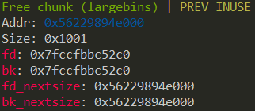

# Off-by-one

严格来说 off-by-one 漏洞是一种特殊的溢出漏洞，off-by-one 指程序向缓冲区中写入时，写入的字节数超过了这个缓冲区本身所申请的字节数并且只越界了一个字节。


## off-by-one 漏洞原理

off-by-one 是指单字节缓冲区溢出，这种漏洞的产生往往与边界验证不严和字符串操作有关，当然也不排除写入的 size 正好就只多了一个字节的情况。其中边界验证不严通常包括

- 使用循环语句向堆块中写入数据时，循环的次数设置错误（这在 C 语言初学者中很常见）导致多写入了一个字节。
- 字符串操作不合适

一般来说，单字节溢出被认为是难以利用的，但是因为 Linux 的堆管理机制 ptmalloc 验证的松散性，基于 Linux 堆的 off-by-one 漏洞利用起来并不复杂，并且威力强大。 此外，需要说明的一点是 off-by-one 是可以基于各种缓冲区的，比如栈、bss 段等等，但是堆上（heap based） 的 off-by-one 是 CTF 中比较常见的。我们这里仅讨论堆上的 off-by-one 情况。


## off-by-one 利用思路 [¶](https://ctf-wiki.org/pwn/linux/user-mode/heap/ptmalloc2/off-by-one/#off-by-one_2 "Permanent link")

1. 溢出字节为可控制任意字节：通过修改大小造成块结构之间出现重叠，从而泄露其他块数据，或是覆盖其他块数据。也可使用 NULL 字节溢出的方法
2. 溢出字节为 NULL 字节：在 size 为 0x100 的时候，溢出 NULL 字节可以使得 `prev_in_use` 位被清，这样前块会被认为是 free 块。（1） 这时可以选择使用 unlink 方法（见 unlink 部分）进行处理。（2） 另外，这时 `prev_size` 域就会启用，就可以伪造 `prev_size` ，从而造成块之间发生重叠。此方法的关键在于 unlink 的时候没有检查按照 `prev_size` 找到的块的大小与`prev_size` 是否一致。

**最新版本代码中，已加入针对 2 中后一种方法的 check ，但是在 2.28 及之前版本并没有该 check 。**


#### 示例情况

1. 我们自己编写的 my\_gets 函数导致了一个 off-by-one 漏洞，原因是 for 循环的边界没有控制好导致写入多执行了一次，这也被称为栅栏错误


```

int

my_gets
(
char

*
ptr
,
int

size
)

{


int

i
;


for
(
i
=
0
;
i
<=
size
;
i
++
)


{


ptr
[
i
]
=
getchar
();


}


return

i
;

}

int

main
()

{


void

*
chunk1
,
*
chunk2
;


chunk1
=
malloc
(
16
);


chunk2
=
malloc
(
16
);


puts
(
"Get Input:"
);


my_gets
(
chunk1
,
16
);


return

0
;

}

```

2. 第二种常见的导致 off-by-one 的场景就是字符串操作了，常见的原因是字符串的结束符计算有误


```

int

main
(
void
)

{


char

buffer
[
40
]
=
""
;


void

*
chunk1
;


chunk1
=
malloc
(
24
);


puts
(
"Get Input"
);


gets
(
buffer
);


if
(
strlen
(
buffer
)
==
24
)


{


strcpy
(
chunk1
,
buffer
);


}


return

0
;

}

```

   程序乍看上去没有任何问题（不考虑栈溢出），可能很多人在实际的代码中也是这样写的。 但是 strlen 和 strcpy 的行为不一致却导致了 off-by-one 的发生。 strlen 是我们很熟悉的计算 ascii 字符串长度的函数，这个函数在计算字符串长度时是不把结束符 `'\x00'` 计算在内的，但是 strcpy 在复制字符串时会拷贝结束符 `'\x00'` 。这就导致了我们向 chunk1 中写入了 25 个字节


```

0x602000
:

0x0000000000000000

0x0000000000000021

<===

chunk1

0x602010
:

0x0000000000000000

0x0000000000000000

0x602020
:

0x0000000000000000

0x0000000000000411

<===

next

chunk

```

   在我们输入'A'×24 后执行 strcpy


```

0x602000
:

0x0000000000000000

0x0000000000000021

0x602010
:

0x4141414141414141

0x4141414141414141

0x602020
:

0x4141414141414141

0x0000000000000400

```

   可以看到 next chunk 的 size 域低字节被结束符 `'\x00'` 覆盖，这种又属于 off-by-one 的一个分支称为 NULL byte off-by-one，我们在后面会看到 off-by-one 与 NULL byte off-by-one 在利用上的区别。 还是有一点就是为什么是低字节被覆盖呢，因为我们通常使用的 CPU 的字节序都是小端法的，比如一个 DWORD 值在使用小端法的内存中是这样储存的


```

DWORD

0x41424344

内存

0x44
,
0x43
,
0x42
,
0x41

```


### 在 libc-2.29 之后 [¶](https://ctf-wiki.org/pwn/linux/user-mode/heap/ptmalloc2/off-by-one/#libc-229 "Permanent link")

由于这两行代码的加入


```

if

(
__glibc_unlikely

(
chunksize
(
p
)

!=

prevsize
))


malloc_printerr

(
"corrupted size vs. prev_size while consolidating"
);

```

由于我们难以控制一个真实 chunk 的 size 字段，所以传统的 off-by-null 方法失效。但是，只需要\*\*满足被 unlink 的 chunk 和下一个 chunk 相连，所以仍然可以伪造 fake\_chunk\*\*。

伪造的方式就是使用 large bin 遗留的 `fd_nextsize` 和 `bk_nextsize` 指针。以 fd\_nextsize 为 fake\_chunk 的 fd，bk\_nextsize 为 fake\_chunk 的 bk，这样我们可以完全控制该 fake\_chunk 的 size 字段（这个过程会破坏原 large bin chunk 的 fd 指针，但是没有关系），同时还可以控制其 fd（通过部分覆写 fd\_nextsize）。通过在后面使用其他的 chunk 辅助伪造，可以通过该检测


```

  
if

(
__glibc_unlikely

(
chunksize
(
p
)

!=

prevsize
))

    
malloc_printerr

(
"corrupted size vs. prev_size while consolidating"
);

```

然后只需要通过 unlink 的检测就可以了，也就是 `fd->bk == p && bk->fd == p`

如果 large bin 中仅有一个 chunk，那么该 chunk 的两个 nextsize 指针都会指向自己，如下

由于 bk\_nextsize 我们无法修改，所以 bk->fd 必然在原先的 large bin chunk 的 fd 指针处（这个 fd 被我们破坏了）。通过 fastbin 的链表特性可以做到修改这个指针且不影响其他的数据，再部分覆写之就可以通过 `bk->fd==p` 的检测了。

然后通过 off-by-one 向低地址合并就可以实现 chunk overlapping 了，之后可以 leak libc\_base 和 堆地址，tcache 打 \_\_free\_hook 即可。
