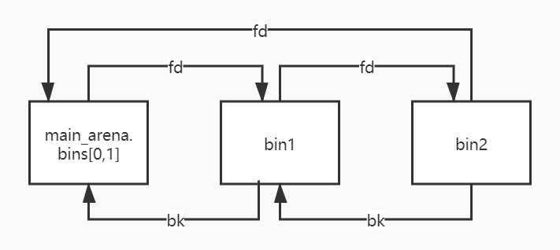
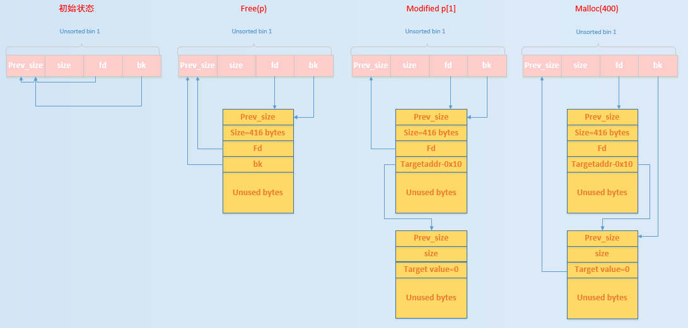

## chunk overlapping


# overlapping\_heap\_chunk


## uaf


# uaf

个人理解：uaf就是当此程序的结构体中有指针，然后虽然被free了，但是指针没有被清空，导致这个指针可以复用，因此可以修改为自己想执行的内容，然后执行
- **任意内存读写**
- 如果 UAF 的位置被用于保存指针（如函数指针、对象 vtable 指针、结构体 fd/bk 指针），攻击者能把它改成任意地址。
- 结果是：在随后的访问中，程序会对攻击者指定的任意地址进行读写。
- **任意代码执行**
- 如果 UAF 的对象里有函数指针或虚函数表（C++ 对象常见），攻击者可以把它改写为指向任意函数地址或 ROP 链。
- 这样在调用的时候，等同于“任意地址执行”。
- **信息泄露**
- UAF 也经常被用来泄露内存布局（ASLR/堆地址/ libc 地址），为后续利用做准备。


## fastbin attack


# fastbin #任意地址写 #任意地址读

是指所有基于fastbin机制的漏洞利用方法，这类利用的前提是：
- 存在堆溢出、uaf等能够控制chunk内容的漏洞
- 漏洞发生于fastbin类型的chunk中
细分可分为
- fastbin double free
- houst of spirit
- alloc to stack
- arbitrary alloc
前两种侧重利用`free`函数释放\*\*真的chunk或伪造的chunk\*\*，然后再次申请chunk进行攻击
后两种侧重于故意修改fd指针，直接利用`malloc`申请指定位置chunk进行攻击
**fastbin管理的chunk即使被释放，其next\_chunk的prev\_inuse位也不会被清空**


### double free


# double\_free

本质其实就是利用了：当前 chunk 的 fd 指针指向下一个 chunk。
就是通过double free实现多个指针指向一个堆块，因此可以实现指定堆块写，可以用来应对没有`edit`的菜单
因为我们可以通过double获得某个堆的二次写机会，因此可以改写fd为需要的地址，从而让下一个chunk被分配到栈上、bss上等等等等地址
这里的可以通过写的时候修改fd实现堆地址的迁移
注意保证size的大小是一致的


```
new(0x70,b'a')
new(0x70,b'a')
free(0)
free(1)
new(0x70,p64(target))
new(0x70,b'a')
new(0x70,b'a')
```

- 可以尝试把got表写进去，这样子可以通过 堆打印 来把libc泄露出来


### House of Spirit


# house\_of\_spirit

在目标位置处伪造fastbin chunk，并将其释放，从而达到分配指定地址的\*\*chunk\*\*的目的


### Alloc to Stack


# alloc\_to\_stack

劫持fastbin链表中的chunk的fd指针，把fd指针指向我们想要分配的栈上，从而实现控制栈中的一些关键数据，比如返回地址等

通过该技术可以把fastbin chunk分配到栈中，从而控制返回地址等关键数据。要实现这一点需要劫持fastbin 中 chunk 的 fd 域，把它指到栈上，当然同时\*\*需要栈上存在有满足条件的 size 值\*\*


### Arbitrary Alloc


# arbitrary\_alloc

分配的地址从栈上变成其它地方，bss、heap、data、stack等，通过字节错位等方法绕过size域的检验，实现任意地址分配 chunk，最后的效果相当于\*\*任意地址写任意值\*\*


## unsortedbin attack


# unosrtedbin\_attack #任意地址大数据写

**基本来源**
1. 当一个较大的 chunk 被分割为两半后，如果剩下的部分大于`MINSIZE`，就会被放到unsorted bin中
2. 释放一个不属于fastbin的chunk，并且该chunk不和top chunk紧邻时，该chunk会被首先放到unsorted bin中
3. 当进行malloc\_consolidate中时，可能会把合并后的chunk放到unsorted bin中

**基本使用情况**
1. unsorted bin在使用的过程中采用的遍历顺序是FIFO，**即插入的时候插入到unsorted bin的头部，取出的时候从链表尾获取**
2. 在程序malloc的时候，如果在fastbin，smallbin中找不到对应大小的chunk，就会尝试从unsortedbin中寻找chunk。如果取出的chunk大小刚好满足，就会直接返回给用户，否则就会把这些chunk分别插入到对应的bin中


##### 如何使用unsortedbin进行leak

unsorted bin在管理时为双向链表，若ub中有两个`bin`，那么链表结构如下：

我们可以看到链表必定有一个节点的`fd`指针会指向`main_arena`内部

如果我们可以把正确的`fd`指针leak出来，就可以获得一个与`main_arena`有固定偏移的地址
而`main_arena`是一个`struct malloc_state`类型的全局变量，是`ptmalloc`管理主分配去的唯一实例
而全局变量会被分配到`.data`或者`.bss`等段上，那么如果我们有进程所使用的`libc`的`.so`文件的话，我们就可以获得`main_arena`与`libc`基地址的偏移，实现对$ASLR$的绕过

`main_arena`和`__malloc_hook`的地址差是0x10，大多数libc都可以直接查出来`__malloc_hook`的地址，所以很容易得到：


```
libc = ELF('libc.so.6')
main_arena_offset = libc.sym['__malloc_hook']+0x10
```

**实现leak的方法**

要实现leak，需要有`UAF`，将一个`chunk`放入`ub`后再打出其`fd`。然后通过题目给的`show`函数，将链表尾的节点`show`出来就可以leak libc了


##### unsorted bin attack原理

在[glibc/malloc/mlloc.c](https://codebrowser.dev/glibc/glibc/malloc/malloc.c.html)中的`_int_malloc`中有一段代码，将一个`ub`取出的时候，会将`bck->fd`的位置写入本`ub`的位置


```python
          /* remove from unsorted list */
          if (__glibc_unlikely (bck->fd != victim))
            malloc_printerr ("malloc(): corrupted unsorted chunks 3");
          unsorted_chunks (av)->bk = bck;
          bck->fd = unsorted_chunks (av);
```

也就是说，只要可以控制bk的值，就可以将`unsorted_chunks(av)`写到任意地址


- **初始状态时**：ub的fd和bk均指向ub自身
- **执行free(p)**：释放的chunk大小不属于fastbin，放入到ub中
- **修改$p[1]$**：原本在ub中的p的bk指针指向target\_addr-0x10处伪造的chunk，即target value处于伪造chunk的fd中
- **申请400大小的chunk**：此时，所申请的chunk处于smallbin所在的范围，其对应的bin中暂时没有chunk，所以会去ub中找，发现ub不空，于是把ub中的最后一个chunk拿出来

应用：
- 修改循环次数
- 修改heap中的global\_max\_fast来使得更大chunk可以被视为fastbin，可以打fastbin attack


## Tcache attack


# tcache\_attack


### 源码

tache中新增了两个结构体`tache_entry`和`tache_perthread_struct`


```c
/* We overlay this structure on the user-data portion of a chunk when the chunk is stored in the per-thread cache.  */
typedef struct tcache_entry
{
  struct tcache_entry *next;
} tcache_entry;

/* There is one of these for each thread, which contains the per-thread cache (hence "tcache_perthread_struct").  Keeping overall size low is mildly important.  Note that COUNTS and ENTRIES are redundant (we could have just counted the linked list each time), this is for performance reasons.  */
typedef struct tcache_perthread_struct
{
  char counts[TCACHE_MAX_BINS];
  tcache_entry *entries[TCACHE_MAX_BINS];
} tcache_perthread_struct;

static __thread tcache_perthread_struct *tcache = NULL;
```

有两个重要函数`tacche_get()`和`tcache_put()`


```c
// 将一个 chunk 放入对应的 tcache bin 中
static void
tcache_put (mchunkptr chunk, size_t tc_idx)
{
  // 将 chunk 转换为用户数据区指针，再强制转为 tcache_entry 类型
  tcache_entry *e = (tcache_entry *) chunk2mem (chunk);
  // 确认 tc_idx 在允许的范围内 (防止越界)
  assert (tc_idx < TCACHE_MAX_BINS);
  // 将当前 tcache bin 的头插法链表操作：新节点的 next 指向原来的头
  e->next = tcache->entries[tc_idx];
  // 更新该 bin 的头指针为新插入的 e
  tcache->entries[tc_idx] = e;
  // 计数器加 1，表示该 bin 中 chunk 数量增加
  ++(tcache->counts[tc_idx]);
}

// 从指定 tcache bin 中取出一个 chunk
static void *
tcache_get (size_t tc_idx)
{
  // 获取该 bin 的链表头，即最近一次插入的 chunk
  tcache_entry *e = tcache->entries[tc_idx];
  // 检查下标合法性
  assert (tc_idx < TCACHE_MAX_BINS);
  // 确保该 bin 不为空 (否则就是逻辑错误)
  assert (tcache->entries[tc_idx] > 0);
  // 更新链表头为下一个节点 (相当于弹出栈顶元素)
  tcache->entries[tc_idx] = e->next;
  // 计数器减 1，表示该 bin 中 chunk 数量减少
  --(tcache->counts[tc_idx]);
  // 返回取出的节点地址 (即用户可用的内存区域)
  return (void *) e;
}
```

这两个函数会在`_int_free`和`__libc_malloc`的开头被调用
其中`tcache_put`当所请求的分配大小不大于$0x408$并且给定大小的`tcachebin`未满时调用
\*\*一个`tcachebin`中最大的块数`mp_.tcache_count`是 7

在`tcache_get`中，仅仅检查了\*\*tc\_idx\*\*
此外，我们可以将tcache当作一个类似于fastbin的单独链表，只是它的check没有fastbin那么复杂，仅仅检查了`tcache->entries[tc_idx] = e->next`
