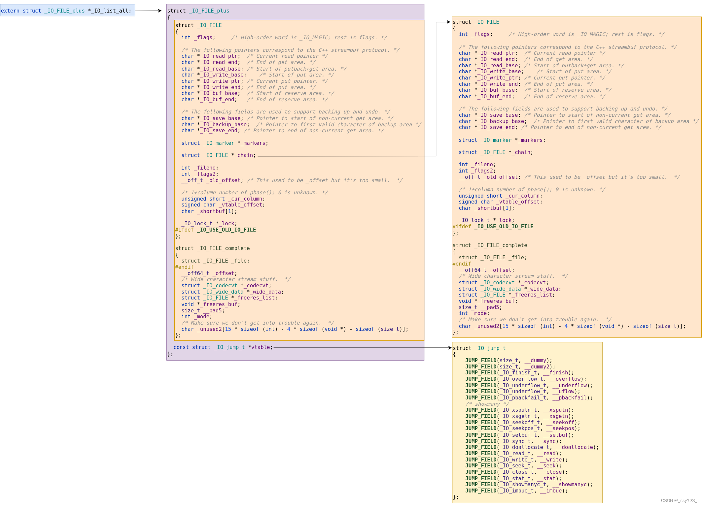
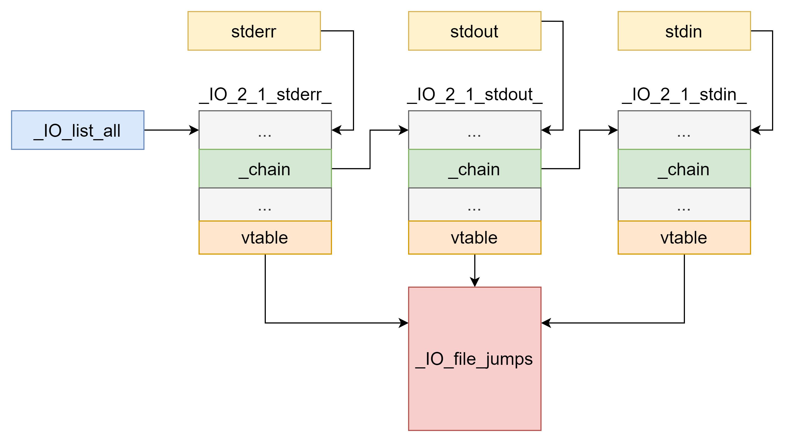

# 基础知识


## 结构

`_IO_FILE`结构体定义为`struct _IO_FILE`:


```

/* The tag name of this struct is _IO_FILE to preserve historic

   C++ mangled names for functions taking FILE* arguments.

   That name should not be used in new code.  */


//glibc2.36

struct

_IO_FILE


{


int

_flags
;

/* High-order word is _IO_MAGIC; rest is flags. */


/* The following pointers correspond to the C++ streambuf protocol. */


char

*
_IO_read_ptr
;

/* Current read pointer */


char

*
_IO_read_end
;

/* End of get area. */


char

*
_IO_read_base
;

/* Start of putback+get area. */


char

*
_IO_write_base
;

/* Start of put area. */


char

*
_IO_write_ptr
;

/* Current put pointer. */


char

*
_IO_write_end
;

/* End of put area. */


char

*
_IO_buf_base
;

/* Start of reserve area. */


char

*
_IO_buf_end
;

/* End of reserve area. */


/* The following fields are used to support backing up and undo. */


char

*
_IO_save_base
;

/* Pointer to start of non-current get area. */


char

*
_IO_backup_base
;

/* Pointer to first valid character of backup area */


char

*
_IO_save_end
;

/* Pointer to end of non-current get area. */


struct

_IO_marker

*
_markers
;


struct

_IO_FILE

*
_chain
;


int

_fileno
;


int

_flags2
;


__off_t

_old_offset
;

/* This used to be _offset but it's too small.  */


/* 1+column number of pbase(); 0 is unknown. */


unsigned

short

_cur_column
;


signed

char

_vtable_offset
;


char

_shortbuf
[
1
];


_IO_lock_t

*
_lock
;


#ifdef _IO_USE_OLD_IO_FILE

};


struct

_IO_FILE_complete


{


struct

_IO_FILE

_file
;


#endif


__off64_t

_offset
;


/* Wide character stream stuff.  */


struct

_IO_codecvt

*
_codecvt
;


struct

_IO_wide_data

*
_wide_data
;


struct

_IO_FILE

*
_freeres_list
;


void

*
_freeres_buf
;


size_t

__pad5
;


int

_mode
;


/* Make sure we don't get into trouble again.  */


char

_unused2
[
15

*

sizeof

(
int
)

-

4

*

sizeof

(
void

*
)

-

sizeof

(
size_t
)];


};

```

接下来依次解释相关的结构体成员：


### `_flags`

`_flags`大小为4字节，高位字为`_IO_MAGIC`(0xFBAD0000)，用于检查`_IO_FILE`的合法性


```

#define _IO_MAGIC 0xFBAD0000

#define _IO_MAGIC_MASK 0xFFFF0000

/*glibc中一个用于检查的宏如下*/

#define CHECK_FILE(FILE, RET) do {


if

((
FILE
)

==

NULL

||


((
FILE
)
->
_flags

&

_IO_MAGIC_MASK
)

!=

_IO_MAGIC
)

{


__set_errno

(
EINVAL
);


return

RET
;


}

}

while

(
0
)

/*glibc 在遍历 _IO_list_all （全局 FILE 链表）进行 flush/unbuffer 操作时，通常使用如下方式过滤不合法的文件*/

for

(
fp

=

(
FILE

*
)

_IO_list_all
;

fp
;

fp

=

fp
->
_chain
)

{


if

(((
fp
->
_flags

&

_IO_MAGIC_MASK
)

!=

_IO_MAGIC
)

…
)


continue
;


…

}

```

低位字节是状态码，用于控制 FILE 的读写状态、缓存等模式


```

#define _IO_MAGIC 0xFBAD0000
/* Magic number 文件结构体的魔数，用于标识文件结构体的有效性 */

#define _OLD_STDIO_MAGIC 0xFABC0000
/* Emulate old stdio 模拟旧的标准输入输出库（stdio）行为的魔数 */

#define _IO_MAGIC_MASK 0xFFFF0000
/* Magic mask 魔数掩码，用于从 _flags 变量中提取魔数部分 */

#define _IO_USER_BUF 1
/* User owns buffer; don't delete it on close. 用户拥有缓冲区，不在关闭时删除缓冲区 */

#define _IO_UNBUFFERED 2
/* Unbuffered 无缓冲模式，直接进行I/O操作，不使用缓冲区 */

#define _IO_NO_READS 4
/* Reading not allowed 不允许读取操作 */

#define _IO_NO_WRITES 8
/* Writing not allowed 不允许写入操作 */

#define _IO_EOF_SEEN 0x10
/* EOF seen 已经到达文件结尾（EOF） */

#define _IO_ERR_SEEN 0x20
/* Error seen 已经发生错误 */

#define _IO_DELETE_DONT_CLOSE 0x40
/* Don't call close(_fileno) on cleanup. 不关闭文件描述符 _fileno，在清理时不调用 close 函数 */

#define _IO_LINKED 0x80
/* Set if linked (using _chain) to streambuf::_list_all. 链接到一个链表（使用 _chain 指针），用于 streambuf::_list_all */

#define _IO_IN_BACKUP 0x100
/* In backup 处于备份模式 */

#define _IO_LINE_BUF 0x200
/* Line buffered 行缓冲模式，在输出新行时刷新缓冲区 */

#define _IO_TIED_PUT_GET 0x400
/* Set if put and get pointer logically tied. 在输出和输入指针逻辑上绑定时设置 */

#define _IO_CURRENTLY_PUTTING 0x800
/* Currently putting 当前正在执行 put 操作 */

#define _IO_IS_APPENDING 0x1000
/* Is appending 处于附加模式（在文件末尾追加内容） */

#define _IO_IS_FILEBUF 0x2000
/* Is file buffer 是一个文件缓冲区 */

#define _IO_BAD_SEEN 0x4000
/* Bad seen 遇到错误（bad flag set） */

#define _IO_USER_LOCK 0x8000
/* User lock 用户锁定，防止其他线程访问 */

```


### IO\_read\_xx


```

char

*
_IO_read_ptr
;

/* Current read pointer */


char

*
_IO_read_end
;

/* End of get area. */


char

*
_IO_read_base
;

/* Start of putback+get area. */


```

- `_IO_read_ptr`：正在使用的input缓冲区的input地址
- `_IO_read_end`：input缓冲区的结束地址
- `_IO_read_base`：input缓冲区的基地址，地址固定

`_IO_read_ptr - _IO_read_base` 就是\*\*缓冲区里已经消耗掉的数据长度\*\*


```

缓冲区内存布局

+---+---+---+---+---+---+

|

H

|

e

|

l

|

l

|

o

|

\
n
|

+---+---+---+---+---+---+


^

^


|

|


_IO_read_base

_IO_read_end


|


+-->

_IO_read_ptr

(
初始时等于

_IO_read_base
)

调用

fgetc

一次后
:

+---+---+---+---+---+---+

|

H

|

e

|

l

|

l

|

o

|

\
n
|

+---+---+---+---+---+---+


^

^


|

|


_IO_read_ptr

_IO_read_end

```


### IO\_write\_xx


```

char

*
_IO_write_base
;

/* Start of put area. */


char

*
_IO_write_ptr
;

/* Current put pointer. */


char

*
_IO_write_end
;

/* End of put area. */


```

- `_IO_write_base`：output缓冲区的基地址
- `_IO_write_ptr`：指向还未输出的字节
- `_IO_write_end`：output缓冲去结束的地址


### IO\_buf\_xx


```

char

*
_IO_buf_base
;

/* Start of reserve area. */


char

*
_IO_buf_end
;

/* End of reserve area. */


```

- `_IO_buf_base`：input和output缓冲区的基址
- `_IO_buf_end`：input和output缓冲区的结束地址

```

_IO_buf_base

_IO_buf_end


|

|


v

v

+----+----+----+----+----+----+----+----+

|

|

|

|

|

|

|

|

|

+----+----+----+----+----+----+----+----+

^

^----^

|

|

|

|

|

+--

_IO_read_end

或

_IO_write_end

|

+-------

_IO_read_ptr

或

_IO_write_ptr

+----------------

_IO_read_base

或

_IO_write_base

```

- `_IO_buf_base ~ _IO_buf_end`：实际 buffer 的范围。
- `_IO_read_base ~ _IO_read_end`：当前读数据的“窗口”。
- `_IO_write_base ~ _IO_write_end`：当前写数据的“窗口”。
两个窗口一般不会同时活跃（取决于`_flag`为读模式还是写模式）


### chain

为`_IO_FILE *`类型，存放着一个单链表，用于\*\*串联所有的file stream\*\*（其实就是`_IO_FILE`结构体），表头通过`_IO_list_all`指针访问，注意`_IO_list_all`便是`_IO_FILE_plus *`类型的。结构如下所示




### fileno


```

int

_fileno
;


```

即当前`FILE *`流所对应的内核文件描述符(fd)
- 0：stdin
- 1：stdout
- 2：stderr


### vtable\_offset


```

signed

char

_vtable_offset
;


```

表示从`struct _IO_FILE`到其 vtable(虚函数表) 指针的偏移/索引调整


```

glibc 的 IO 体系把 vtable(函数指针表) 放在结构体末尾或经由偏移引用，_vtable_offset 用于定位正确的 vtable

```


### vtable

存在于另一结构体中


```

struct

_IO_FILE_plus
//_IO_FILE_plus就是_IO_FILE

{


_IO_FILE

file
;


const

struct

_IO_jump_t

*
vtable
;

};

```

结构体在某处或通过偏移关联到一组函数指针（jump table），这些指针决定不同流对象的具体 I/O 行为（例如 putc/underflow/overflow/xsputn/sync 等）。当执行高层 I/O 操作时，glibc 会间接通过这张表调用实现细节。

简单来说，就是一张\*\*存放函数指针的跳转表\*\*，当 libc 要对 `FILE *`做具体操作的时候，它部直接调用某个固定函数，而是通过这张表的对应槽间接跳转到实现函数

可以看`_IO_jump_t`结构体定义:


```

struct

_IO_jump_t


{


JUMP_FIELD
(
size_t
,

__dummy
);


JUMP_FIELD
(
size_t
,

__dummy2
);


JUMP_FIELD
(
_IO_finish_t
,

__finish
);


JUMP_FIELD
(
_IO_overflow_t
,

__overflow
);


JUMP_FIELD
(
_IO_underflow_t
,

__underflow
);


JUMP_FIELD
(
_IO_underflow_t
,

__uflow
);


JUMP_FIELD
(
_IO_pbackfail_t
,

__pbackfail
);


/* showmany */


JUMP_FIELD
(
_IO_xsputn_t
,

__xsputn
);


JUMP_FIELD
(
_IO_xsgetn_t
,

__xsgetn
);


JUMP_FIELD
(
_IO_seekoff_t
,

__seekoff
);


JUMP_FIELD
(
_IO_seekpos_t
,

__seekpos
);


JUMP_FIELD
(
_IO_setbuf_t
,

__setbuf
);


JUMP_FIELD
(
_IO_sync_t
,

__sync
);


JUMP_FIELD
(
_IO_doallocate_t
,

__doallocate
);


JUMP_FIELD
(
_IO_read_t
,

__read
);


JUMP_FIELD
(
_IO_write_t
,

__write
);


JUMP_FIELD
(
_IO_seek_t
,

__seek
);


JUMP_FIELD
(
_IO_close_t
,

__close
);


JUMP_FIELD
(
_IO_stat_t
,

__stat
);


JUMP_FIELD
(
_IO_showmanyc_t
,

__showmanyc
);


JUMP_FIELD
(
_IO_imbue_t
,

__imbue
);


};

```


### 整体结构

各个文件结构采用 单链表 的形式连接起来（可见上面的[[\_IO\_FILE基础知识#chain]])

`vtable`为函数指针结构体，存放着各种 IO 相关的函数的指针

初始情况下 `_IO_FILE` 结构有 `_IO_2_1_stderr`，`_IO_2_1_stdout_`，`_IO_2_1_stdin_`三个，通过`_IO_list_all`将这三个结构统一


```


# define DEF_STDFILE(NAME, FD, CHAIN, FLAGS) \

  static _IO_lock_t _IO_stdfile_##FD##_lock = _IO_lock_initializer; \

  static struct _IO_wide_data _IO_wide_data_##FD \

    = { ._wide_vtable = &_IO_wfile_jumps }; \

  struct _IO_FILE_plus NAME \

    = {FILEBUF_LITERAL(CHAIN, FLAGS, FD, &_IO_wide_data_##FD), \

       &_IO_file_jumps}

DEF_STDFILE
(
_IO_2_1_stdin_
,

0
,

0
,

_IO_NO_WRITES
);

DEF_STDFILE
(
_IO_2_1_stdout_
,

1
,

&
_IO_2_1_stdin_
,

_IO_NO_READS
);

DEF_STDFILE
(
_IO_2_1_stderr_
,

2
,

&
_IO_2_1_stdout_
,

_IO_NO_READS
+
_IO_UNBUFFERED
);

struct

_IO_FILE_plus

*
_IO_list_all

=

&
_IO_2_1_stderr_
;

libc_hidden_data_def

(
_IO_list_all
)

```

并设置 `stdin`、`stdout`、`stderr` 分别指向`_IO_2_1_stdin_`、`_IO_2_1_stdout_` 三个结构体


```

FILE

*
stdin

=

(
FILE

*
)

&
_IO_2_1_stdin_
;

FILE

*
stdout

=

(
FILE

*
)

&
_IO_2_1_stdout_
;

FILE

*
stderr

=

(
FILE

*
)

&
_IO_2_1_stderr_
;

```

整体结构如下：



**如果存在读写操作，则会为对应文件创建一个`_IO_FILE`结构体，并且链接到`_IO_list_all`链表上**


```

void

_IO_link_in

(
struct

_IO_FILE_plus

*
fp
)

{


if

((
fp
->
file
.
_flags

&

_IO_LINKED
)

==

0
)


{


fp
->
file
.
_flags

|=

_IO_LINKED
;

#ifdef _IO_MTSAFE_IO


_IO_cleanup_region_start_noarg

(
flush_cleanup
);


_IO_lock_lock

(
list_all_lock
);


run_fp

=

(
FILE

*
)

fp
;


_IO_flockfile

((
FILE

*
)

fp
);

#endif


fp
->
file
.
_chain

=

(
FILE

*
)

_IO_list_all
;


_IO_list_all

=

fp
;

#ifdef _IO_MTSAFE_IO


_IO_funlockfile

((
FILE

*
)

fp
);


run_fp

=

NULL
;


_IO_lock_unlock

(
list_all_lock
);


_IO_cleanup_region_end

(
0
);

#endif


}

}

```


### 偏移情况


```

amd64
：

0x0
:
'
_flags
'
,

0x8
:
'
_IO_read_ptr
'
,

0x10
:
'
_IO_read_end
'
,

0x18
:
'
_IO_read_base
'
,

0x20
:
'
_IO_write_base
'
,

0x28
:
'
_IO_write_ptr
'
,

0x30
:
'
_IO_write_end
'
,

0x38
:
'
_IO_buf_base
'
,

0x40
:
'
_IO_buf_end
'
,

0x48
:
'
_IO_save_base
'
,

0x50
:
'
_IO_backup_base
'
,

0x58
:
'
_IO_save_end
'
,

0x60
:
'
_markers
'
,

0x68
:
'
_chain
'
,

0x70
:
'
_fileno
'
,

0x74
:
'
_flags2
'
,

0x78
:
'
_old_offset
'
,

0x80
:
'
_cur_column
'
,

0x82
:
'
_vtable_offset
'
,

0x83
:
'
_shortbuf
'
,

0x88
:
'
_lock
'
,

0x90
:
'
_offset
'
,

0x98
:
'
_codecvt
'
,

0xa0
:
'
_wide_data
'
,

0xa8
:
'
_freeres_list
'
,

0xb0
:
'
_freeres_buf
'
,

0xb8
:
'
__pad5
'
,

0xc0
:
'
_mode
'
,

0xc4
:
'
_unused2
'
,

0xd8
:
'
vtable
'

```


## 各函数介绍


### fopen函数

[fopen](../fopen/index.md)


### fread函数
