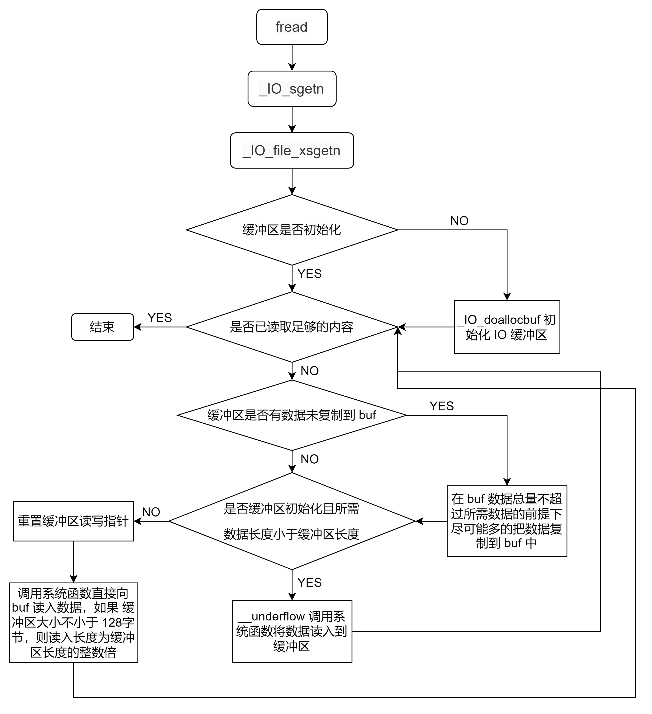

# fread




## demo


```asm
#include<stdio.h>
int main() {
    FILE *fp = fopen("test.txt","rb");
    char *ptr = malloc(0x20);
    fread(prt, 1, 20, fp);
    return 0;
}
```

**汇编如下**


```
pwndbg> disass
Dump of assembler code for function __GI__IO_fread:
Address range 0x7ffff7e11b30 to 0x7ffff7e11c2e:
=> 0x00007ffff7e11b30 <+0>:     endbr64
   0x00007ffff7e11b34 <+4>:     push   r15
   0x00007ffff7e11b36 <+6>:     push   r14
   0x00007ffff7e11b38 <+8>:     push   r13
   0x00007ffff7e11b3a <+10>:    push   r12
   0x00007ffff7e11b3c <+12>:    mov    r12,rsi
   0x00007ffff7e11b3f <+15>:    push   rbp
   0x00007ffff7e11b40 <+16>:    imul   r12,rdx
   0x00007ffff7e11b44 <+20>:    push   rbx
   0x00007ffff7e11b45 <+21>:    sub    rsp,0x18
   0x00007ffff7e11b49 <+25>:    test   r12,r12
   0x00007ffff7e11b4c <+28>:    je     0x7ffff7e11be1 <__GI__IO_fread+177>
   0x00007ffff7e11b52 <+34>:    mov    eax,DWORD PTR [rcx]
   0x00007ffff7e11b54 <+36>:    mov    r14,rdi
   0x00007ffff7e11b57 <+39>:    mov    rbp,rsi
   0x00007ffff7e11b5a <+42>:    mov    r13,rdx
   0x00007ffff7e11b5d <+45>:    mov    rbx,rcx
   0x00007ffff7e11b60 <+48>:    and    eax,0x8000
   0x00007ffff7e11b65 <+53>:    jne    0x7ffff7e11b9b <__GI__IO_fread+107>
   0x00007ffff7e11b67 <+55>:    mov    r15,QWORD PTR fs:0x10
   0x00007ffff7e11b70 <+64>:    mov    rdi,QWORD PTR [rcx+0x88]
   0x00007ffff7e11b77 <+71>:    cmp    QWORD PTR [rdi+0x8],r15
   0x00007ffff7e11b7b <+75>:    je     0x7ffff7e11b97 <__GI__IO_fread+103>
   0x00007ffff7e11b7d <+77>:    mov    edx,0x1
   0x00007ffff7e11b82 <+82>:    lock cmpxchg DWORD PTR [rdi],edx
   0x00007ffff7e11b86 <+86>:    jne    0x7ffff7e11c18 <__GI__IO_fread+232>
   0x00007ffff7e11b8c <+92>:    mov    rdi,QWORD PTR [rbx+0x88]
   0x00007ffff7e11b93 <+99>:    mov    QWORD PTR [rdi+0x8],r15
   0x00007ffff7e11b97 <+103>:   add    DWORD PTR [rdi+0x4],0x1
   0x00007ffff7e11b9b <+107>:   mov    rdx,r12
   0x00007ffff7e11b9e <+110>:   mov    rsi,r14
   0x00007ffff7e11ba1 <+113>:   mov    rdi,rbx
   0x00007ffff7e11ba4 <+116>:   call   0x7ffff7e1ffd0 <__GI__IO_sgetn>
   0x00007ffff7e11ba9 <+121>:   test   DWORD PTR [rbx],0x8000
   0x00007ffff7e11baf <+127>:   jne    0x7ffff7e11bd4 <__GI__IO_fread+164>
   0x00007ffff7e11bb1 <+129>:   mov    rdi,QWORD PTR [rbx+0x88]
   0x00007ffff7e11bb8 <+136>:   mov    ecx,DWORD PTR [rdi+0x4]
   0x00007ffff7e11bbb <+139>:   lea    edx,[rcx-0x1]
   0x00007ffff7e11bbe <+142>:   mov    DWORD PTR [rdi+0x4],edx
   0x00007ffff7e11bc1 <+145>:   test   edx,edx
   0x00007ffff7e11bc3 <+147>:   jne    0x7ffff7e11bd4 <__GI__IO_fread+164>
   0x00007ffff7e11bc5 <+149>:   mov    QWORD PTR [rdi+0x8],0x0
   0x00007ffff7e11bcd <+157>:   xchg   DWORD PTR [rdi],edx
   0x00007ffff7e11bcf <+159>:   cmp    edx,0x1
   0x00007ffff7e11bd2 <+162>:   jg     0x7ffff7e11c00 <__GI__IO_fread+208>
   0x00007ffff7e11bd4 <+164>:   cmp    r12,rax
   0x00007ffff7e11bd7 <+167>:   je     0x7ffff7e11bf8 <__GI__IO_fread+200>
   0x00007ffff7e11bd9 <+169>:   xor    edx,edx
   0x00007ffff7e11bdb <+171>:   div    rbp
   0x00007ffff7e11bde <+174>:   mov    r12,rax
   0x00007ffff7e11be1 <+177>:   add    rsp,0x18
   0x00007ffff7e11be5 <+181>:   mov    rax,r12
   0x00007ffff7e11be8 <+184>:   pop    rbx
   0x00007ffff7e11be9 <+185>:   pop    rbp
   0x00007ffff7e11bea <+186>:   pop    r12
   0x00007ffff7e11bec <+188>:   pop    r13
   0x00007ffff7e11bee <+190>:   pop    r14
   0x00007ffff7e11bf0 <+192>:   pop    r15
   0x00007ffff7e11bf2 <+194>:   ret
   0x00007ffff7e11bf3 <+195>:   nop    DWORD PTR [rax+rax*1+0x0]
   0x00007ffff7e11bf8 <+200>:   mov    r12,r13
   0x00007ffff7e11bfb <+203>:   jmp    0x7ffff7e11be1 <__GI__IO_fread+177>
   0x00007ffff7e11bfd <+205>:   nop    DWORD PTR [rax]
   0x00007ffff7e11c00 <+208>:   mov    QWORD PTR [rsp+0x8],rax
   0x00007ffff7e11c05 <+213>:   call   0x7ffff7e23300 <__GI___lll_lock_wake_private>
   0x00007ffff7e11c0a <+218>:   mov    rax,QWORD PTR [rsp+0x8]
   0x00007ffff7e11c0f <+223>:   jmp    0x7ffff7e11bd4 <__GI__IO_fread+164>
   0x00007ffff7e11c11 <+225>:   nop    DWORD PTR [rax+0x0]
   0x00007ffff7e11c18 <+232>:   call   0x7ffff7e23230 <__GI___lll_lock_wait_private>
   0x00007ffff7e11c1d <+237>:   jmp    0x7ffff7e11b8c <__GI__IO_fread+92>
   0x00007ffff7e11c22 <+242>:   endbr64
   0x00007ffff7e11c26 <+246>:   mov    rbp,rax
   0x00007ffff7e11c29 <+249>:   jmp    0x7ffff7dbb10f <__GI__IO_fread.cold>
Address range 0x7ffff7dbb10f to 0x7ffff7dbb145:
   0x00007ffff7dbb10f <-354849>:        test   DWORD PTR [rbx],0x8000
   0x00007ffff7dbb115 <-354843>:        jne    0x7ffff7dbb13d <__GI__IO_fread-354803>
   0x00007ffff7dbb117 <-354841>:        mov    rdi,QWORD PTR [rbx+0x88]
   0x00007ffff7dbb11e <-354834>:        mov    eax,DWORD PTR [rdi+0x4]
   0x00007ffff7dbb121 <-354831>:        sub    eax,0x1
   0x00007ffff7dbb124 <-354828>:        mov    DWORD PTR [rdi+0x4],eax
   0x00007ffff7dbb127 <-354825>:        jne    0x7ffff7dbb13d <__GI__IO_fread-354803>
   0x00007ffff7dbb129 <-354823>:        mov    QWORD PTR [rdi+0x8],0x0
   0x00007ffff7dbb131 <-354815>:        xchg   DWORD PTR [rdi],eax
   0x00007ffff7dbb133 <-354813>:        sub    eax,0x1
   0x00007ffff7dbb136 <-354810>:        jle    0x7ffff7dbb13d <__GI__IO_fread-354803>
   0x00007ffff7dbb138 <-354808>:        call   0x7ffff7e23300 <__GI___lll_lock_wake_private>
   0x00007ffff7dbb13d <-354803>:        mov    rdi,rbp
   0x00007ffff7dbb140 <-354800>:        call   0x7ffff7dbc120 <_Unwind_Resume>
End of assembler dump.
```


## 流程


### `_IO_fread`函数，计算需要读取的字节数


```
   0x7ffff7e11b30 <fread>       endbr64
   0x7ffff7e11b34 <fread+4>     push   r15
   0x7ffff7e11b36 <fread+6>     push   r14
   0x7ffff7e11b38 <fread+8>     push   r13
   0x7ffff7e11b3a <fread+10>    push   r12
   0x7ffff7e11b3c <fread+12>    mov    r12, rsi      R12 => 1
   0x7ffff7e11b3f <fread+15>    push   rbp
   0x7ffff7e11b40 <fread+16>    imul   r12, rdx
   0x7ffff7e11b44 <fread+20>    push   rbx
   0x7ffff7e11b45 <fread+21>    sub    rsp, 0x18     RSP => 0x7fffffffd8f0 (0x7fffffffd908 - 0x18)
   0x7ffff7e11b49 <fread+25>    test   r12, r12      0x14 & 0x14     EFLAGS => 0x206 [ cf PF af zf sf IF df of ]
   0x7ffff7e11b4c <fread+28>    je     fread+177                   <fread+177>
```

`imul r12, rdx`计算得到需要读取的字节数
通过`test r12, r12`检测，如果为$0$的话直接跳出，不需要再读取了
跳过一些锁相关的内容，来到`_IO_sgetn`函数


### `_IO_sgetn`函数


```
   0x7ffff7e11b8c <fread+92>     mov    rdi, qword ptr [rbx + 0x88]     RDI, [0x55555555b328] => 0x55555555b380 ◂— 1
   0x7ffff7e11b93 <fread+99>     mov    qword ptr [rdi + 8], r15        [0x55555555b388] <= 0x7ffff7d8f740 ◂— 0x7ffff7d8f740
 ► 0x7ffff7e11b97 <fread+103>    add    dword ptr [rdi + 4], 1          [0x55555555b384] <= 1 (0 + 1)
   0x7ffff7e11b9b <fread+107>    mov    rdx, r12                        RDX => 0x14
   0x7ffff7e11b9e <fread+110>    mov    rsi, r14                        RSI => 0x55555555b480 ◂— 0
   0x7ffff7e11ba1 <fread+113>    mov    rdi, rbx                        RDI => 0x55555555b2a0 ◂— 0xfbad2488
   0x7ffff7e11ba4 <fread+116>    call   _IO_sgetn                   <_IO_sgetn>
```


```
pwndbg> disass
Dump of assembler code for function __GI__IO_sgetn:
=> 0x00007ffff7e1ffd0 <+0>:     endbr64
   0x00007ffff7e1ffd4 <+4>:     push   rbx
   0x00007ffff7e1ffd5 <+5>:     lea    rcx,[rip+0x188a24]        # 0x7ffff7fa8a00 <_IO_helper_jumps>
   0x00007ffff7e1ffdc <+12>:    lea    rax,[rip+0x189785]        # 0x7ffff7fa9768
   0x00007ffff7e1ffe3 <+19>:    sub    rax,rcx
   0x00007ffff7e1ffe6 <+22>:    sub    rsp,0x20
   0x00007ffff7e1ffea <+26>:    mov    rbx,QWORD PTR [rdi+0xd8]
   0x00007ffff7e1fff1 <+33>:    mov    r8,rbx
   0x00007ffff7e1fff4 <+36>:    sub    r8,rcx
   0x00007ffff7e1fff7 <+39>:    cmp    rax,r8
   0x00007ffff7e1fffa <+42>:    jbe    0x7ffff7e20010 <__GI__IO_sgetn+64>
   0x00007ffff7e1fffc <+44>:    mov    rax,QWORD PTR [rbx+0x40]
   0x00007ffff7e20000 <+48>:    add    rsp,0x20
   0x00007ffff7e20004 <+52>:    pop    rbx
   0x00007ffff7e20005 <+53>:    jmp    rax
   0x00007ffff7e20007 <+55>:    nop    WORD PTR [rax+rax*1+0x0]
   0x00007ffff7e20010 <+64>:    mov    QWORD PTR [rsp+0x18],rdx
   0x00007ffff7e20015 <+69>:    mov    QWORD PTR [rsp+0x10],rsi
   0x00007ffff7e2001a <+74>:    mov    QWORD PTR [rsp+0x8],rdi
   0x00007ffff7e2001f <+79>:    call   0x7ffff7e1bef0 <_IO_vtable_check>
   0x00007ffff7e20024 <+84>:    mov    rax,QWORD PTR [rbx+0x40]
   0x00007ffff7e20028 <+88>:    mov    rdx,QWORD PTR [rsp+0x18]
   0x00007ffff7e2002d <+93>:    mov    rsi,QWORD PTR [rsp+0x10]
   0x00007ffff7e20032 <+98>:    mov    rdi,QWORD PTR [rsp+0x8]
   0x00007ffff7e20037 <+103>:   add    rsp,0x20
   0x00007ffff7e2003b <+107>:   pop    rbx
   0x00007ffff7e2003c <+108>:   jmp    rax
End of assembler dump.
```

对应的c语言代码


```c
// https://elixir.bootlin.com/glibc/latest/source/libio/genops.c#L408  
size_t  
_IO_sgetn (FILE *fp, void *data, size_t n)  
{  
  /* FIXME handle putback buffer here! */  
  return _IO_XSGETN (fp, data, n);  
}  
libc_hidden_def (_IO_sgetn)  

// https://elixir.bootlin.com/glibc/latest/source/libio/libioP.h#L182  
typedef size_t (*_IO_xsgetn_t) (FILE *FP, void *DATA, size_t N);  
#define _IO_XSGETN(FP, DATA, N) JUMP2 (__xsgetn, FP, DATA, N)  
#define _IO_WXSGETN(FP, DATA, N) WJUMP2 (__xsgetn, FP, DATA, N)
```

**分段分析一下，首先是 jbe 之前的部分**


```
   0x7ffff7e1ffd0 <_IO_sgetn>       endbr64
   0x7ffff7e1ffd4 <_IO_sgetn+4>     push   rbx
   0x7ffff7e1ffd5 <_IO_sgetn+5>     lea    rcx, [rip + 0x188a24]           RCX => 0x7ffff7fa8a00 (_IO_helper_jumps) ◂— 0
   0x7ffff7e1ffdc <_IO_sgetn+12>    lea    rax, [rip + 0x189785]           RAX => 0x7ffff7fa9768 ◂— 0
   0x7ffff7e1ffe3 <_IO_sgetn+19>    sub    rax, rcx                        RAX => 0xd68 (0x7ffff7fa9768 - 0x7ffff7fa8a00)
 ► 0x7ffff7e1ffe6 <_IO_sgetn+22>    sub    rsp, 0x20                       RSP => 0x7fffffffd8c0 (0x7fffffffd8e0 - 0x20)
   0x7ffff7e1ffea <_IO_sgetn+26>    mov    rbx, qword ptr [rdi + 0xd8]     RBX, [0x55555555b378] => 0x7ffff7fa9600 (_IO_file_jumps) ◂— 0
   0x7ffff7e1fff1 <_IO_sgetn+33>    mov    r8, rbx                         R8 => 0x7ffff7fa9600 (_IO_file_jumps) ◂— 0
   0x7ffff7e1fff4 <_IO_sgetn+36>    sub    r8, rcx                         R8 => 0xc00 (0x7ffff7fa9600 - 0x7ffff7fa8a00)
   0x7ffff7e1fff7 <_IO_sgetn+39>    cmp    rax, r8                         0xd68 - 0xc00     EFLAGS => 0x202 [ cf pf af zf sf IF df of ]
   0x7ffff7e1fffa <_IO_sgetn+42>    jbe    _IO_sgetn+64                <_IO_sgetn+64>
```

**rdi** 指向的就是`_IO_FILE`结构体的开头，所以 **rbx=[rdi+0xd8]** 就是`vtable`指向的值，这里就是判断\*\*rax\*\*是否小于等于`vtable`，然后决定是否跳转
- 如果此时不跳转，也就是`vtable > rax`，那么将跳转到`rbx + 0x40`的地方


```
   0x7ffff7e1fffc <_IO_sgetn+44>            mov    rax, qword ptr [rbx + 0x40]     RAX, [_IO_file_jumps+64] => 0x7ffff7e1d2b0 (__GI__IO_file_xsgetn) ◂— endbr64
   0x7ffff7e20000 <_IO_sgetn+48>            add    rsp, 0x20                       RSP => 0x7fffffffd8e0 (0x7fffffffd8c0 + 0x20)
   0x7ffff7e20004 <_IO_sgetn+52>            pop    rbx                             RBX => 0x55555555b2a0
   0x7ffff7e20005 <_IO_sgetn+53>            jmp    rax                         <__GI__IO_file_xsgetn>
```

- 如果此时跳转，即`vtable <= rax`，同样跳转，不过先对`vtable`进行了一次check


```
0x7ffff7e0d090 <__GI__IO_sgetn+64>:  mov    QWORD PTR [rsp+0x18],rdx  
0x7ffff7e0d095 <__GI__IO_sgetn+69>:  mov    QWORD PTR [rsp+0x10],rsi  
0x7ffff7e0d09a <__GI__IO_sgetn+74>:  mov    QWORD PTR [rsp+0x8],rdi  
0x7ffff7e0d09f <__GI__IO_sgetn+79>:  call   0x7ffff7e08f70 <_IO_vtable_check>  
0x7ffff7e0d0a4 <__GI__IO_sgetn+84>:  mov    rax,QWORD PTR [rbx+0x40]  
0x7ffff7e0d0a8 <__GI__IO_sgetn+88>:  mov    rdx,QWORD PTR [rsp+0x18]  
0x7ffff7e0d0ad <__GI__IO_sgetn+93>:  mov    rsi,QWORD PTR [rsp+0x10]  
0x7ffff7e0d0b2 <__GI__IO_sgetn+98>:  mov    rdi,QWORD PTR [rsp+0x8]  
0x7ffff7e0d0b7 <__GI__IO_sgetn+103>: add    rsp,0x20  
0x7ffff7e0d0bb <__GI__IO_sgetn+107>: pop    rbx  
0x7ffff7e0d0bc <__GI__IO_sgetn+108>: jmp    rax
```


### `_IO_file_xsgetn`函数调用


```
pwndbg> disass
Dump of assembler code for function __GI__IO_file_xsgetn:
=> 0x00007ffff7e1d2b0 <+0>:     endbr64
   0x00007ffff7e1d2b4 <+4>:     push   r15
   0x00007ffff7e1d2b6 <+6>:     push   r14
   0x00007ffff7e1d2b8 <+8>:     push   r13
   0x00007ffff7e1d2ba <+10>:    mov    r13,rsi
   0x00007ffff7e1d2bd <+13>:    push   r12
   0x00007ffff7e1d2bf <+15>:    push   rbp
   0x00007ffff7e1d2c0 <+16>:    push   rbx
   0x00007ffff7e1d2c1 <+17>:    mov    rbx,rdi
   0x00007ffff7e1d2c4 <+20>:    sub    rsp,0x18
   0x00007ffff7e1d2c8 <+24>:    cmp    QWORD PTR [rdi+0x38],0x0
   0x00007ffff7e1d2cd <+29>:    mov    QWORD PTR [rsp],rdx
   0x00007ffff7e1d2d1 <+33>:    je     0x7ffff7e1d4a8 <__GI__IO_file_xsgetn+504>
   0x00007ffff7e1d2d7 <+39>:    mov    rax,QWORD PTR [rsp]
   0x00007ffff7e1d2db <+43>:    lea    r15,[rip+0x18b71e]        # 0x7ffff7fa8a00 <_IO_helper_jumps>
   0x00007ffff7e1d2e2 <+50>:    lea    r14,[rip+0x18c47f]        # 0x7ffff7fa9768
   0x00007ffff7e1d2e9 <+57>:    sub    r14,r15
   0x00007ffff7e1d2ec <+60>:    mov    r12,rax
   0x00007ffff7e1d2ef <+63>:    test   rax,rax
   0x00007ffff7e1d2f2 <+66>:    je     0x7ffff7e1d3c4 <__GI__IO_file_xsgetn+276>
   0x00007ffff7e1d2f8 <+72>:    nop    DWORD PTR [rax+rax*1+0x0]
   0x00007ffff7e1d300 <+80>:    mov    rsi,QWORD PTR [rbx+0x8]
   0x00007ffff7e1d304 <+84>:    mov    rbp,QWORD PTR [rbx+0x10]
   0x00007ffff7e1d308 <+88>:    sub    rbp,rsi
   0x00007ffff7e1d30b <+91>:    cmp    rbp,r12
   0x00007ffff7e1d30e <+94>:    jae    0x7ffff7e1d418 <__GI__IO_file_xsgetn+360>
   0x00007ffff7e1d314 <+100>:   test   rbp,rbp
   0x00007ffff7e1d317 <+103>:   jne    0x7ffff7e1d3d8 <__GI__IO_file_xsgetn+296>
   0x00007ffff7e1d31d <+109>:   test   DWORD PTR [rbx],0x100
   0x00007ffff7e1d323 <+115>:   jne    0x7ffff7e1d3f9 <__GI__IO_file_xsgetn+329>
   0x00007ffff7e1d329 <+121>:   mov    rcx,QWORD PTR [rbx+0x38]
   0x00007ffff7e1d32d <+125>:   test   rcx,rcx
   0x00007ffff7e1d330 <+128>:   je     0x7ffff7e1d3d0 <__GI__IO_file_xsgetn+288>
   0x00007ffff7e1d336 <+134>:   mov    rsi,QWORD PTR [rbx+0x40]
   0x00007ffff7e1d33a <+138>:   sub    rsi,rcx
   0x00007ffff7e1d33d <+141>:   cmp    rsi,r12
   0x00007ffff7e1d340 <+144>:   ja     0x7ffff7e1d430 <__GI__IO_file_xsgetn+384>
   0x00007ffff7e1d346 <+150>:   cmp    rsi,0x7f
   0x00007ffff7e1d34a <+154>:   jbe    0x7ffff7e1d3d0 <__GI__IO_file_xsgetn+288>
   0x00007ffff7e1d350 <+160>:   mov    rax,r12
   0x00007ffff7e1d353 <+163>:   xor    edx,edx
   0x00007ffff7e1d355 <+165>:   div    rsi
   0x00007ffff7e1d358 <+168>:   mov    rdi,rdx
   0x00007ffff7e1d35b <+171>:   mov    rdx,r12
   0x00007ffff7e1d35e <+174>:   sub    rdx,rdi
   0x00007ffff7e1d361 <+177>:   mov    rbp,QWORD PTR [rbx+0xd8]
   0x00007ffff7e1d368 <+184>:   movq   xmm0,rcx
   0x00007ffff7e1d36d <+189>:   punpcklqdq xmm0,xmm0
   0x00007ffff7e1d371 <+193>:   mov    rax,rbp
   0x00007ffff7e1d374 <+196>:   movups XMMWORD PTR [rbx+0x8],xmm0
   0x00007ffff7e1d378 <+200>:   sub    rax,r15
   0x00007ffff7e1d37b <+203>:   movups XMMWORD PTR [rbx+0x18],xmm0
   0x00007ffff7e1d37f <+207>:   movups XMMWORD PTR [rbx+0x28],xmm0
   0x00007ffff7e1d383 <+211>:   cmp    r14,rax
   0x00007ffff7e1d386 <+214>:   jbe    0x7ffff7e1d460 <__GI__IO_file_xsgetn+432>
   0x00007ffff7e1d38c <+220>:   mov    rsi,r13
   0x00007ffff7e1d38f <+223>:   mov    rdi,rbx
   0x00007ffff7e1d392 <+226>:   call   QWORD PTR [rbp+0x70]
   0x00007ffff7e1d395 <+229>:   test   rax,rax
   0x00007ffff7e1d398 <+232>:   jle    0x7ffff7e1d488 <__GI__IO_file_xsgetn+472>
   0x00007ffff7e1d39e <+238>:   mov    rdx,QWORD PTR [rbx+0x90]
   0x00007ffff7e1d3a5 <+245>:   add    r13,rax
   0x00007ffff7e1d3a8 <+248>:   sub    r12,rax
   0x00007ffff7e1d3ab <+251>:   cmp    rdx,0xffffffffffffffff
   0x00007ffff7e1d3af <+255>:   je     0x7ffff7e1d3bb <__GI__IO_file_xsgetn+267>
   0x00007ffff7e1d3b1 <+257>:   add    rdx,rax
   0x00007ffff7e1d3b4 <+260>:   mov    QWORD PTR [rbx+0x90],rdx
   0x00007ffff7e1d3bb <+267>:   test   r12,r12
   0x00007ffff7e1d3be <+270>:   jne    0x7ffff7e1d300 <__GI__IO_file_xsgetn+80>
   0x00007ffff7e1d3c4 <+276>:   mov    r13,QWORD PTR [rsp]
   0x00007ffff7e1d3c8 <+280>:   jmp    0x7ffff7e1d448 <__GI__IO_file_xsgetn+408>
   0x00007ffff7e1d3ca <+282>:   nop    WORD PTR [rax+rax*1+0x0]
   0x00007ffff7e1d3d0 <+288>:   mov    rdx,r12
   0x00007ffff7e1d3d3 <+291>:   jmp    0x7ffff7e1d361 <__GI__IO_file_xsgetn+177>
   0x00007ffff7e1d3d5 <+293>:   nop    DWORD PTR [rax]
   0x00007ffff7e1d3d8 <+296>:   mov    rdi,r13
   0x00007ffff7e1d3db <+299>:   mov    rdx,rbp
   0x00007ffff7e1d3de <+302>:   sub    r12,rbp
   0x00007ffff7e1d3e1 <+305>:   call   0x7ffff7dba3e0 <*ABS*+0xa97d0@plt>
   0x00007ffff7e1d3e6 <+310>:   add    QWORD PTR [rbx+0x8],rbp
   0x00007ffff7e1d3ea <+314>:   mov    r13,rax
   0x00007ffff7e1d3ed <+317>:   test   DWORD PTR [rbx],0x100
   0x00007ffff7e1d3f3 <+323>:   je     0x7ffff7e1d329 <__GI__IO_file_xsgetn+121>
   0x00007ffff7e1d3f9 <+329>:   mov    rdi,rbx
   0x00007ffff7e1d3fc <+332>:   call   0x7ffff7e1f6b0 <_IO_switch_to_main_get_area>
   0x00007ffff7e1d401 <+337>:   mov    rsi,QWORD PTR [rbx+0x8]
   0x00007ffff7e1d405 <+341>:   mov    rbp,QWORD PTR [rbx+0x10]
   0x00007ffff7e1d409 <+345>:   sub    rbp,rsi
   0x00007ffff7e1d40c <+348>:   cmp    rbp,r12
   0x00007ffff7e1d40f <+351>:   jb     0x7ffff7e1d314 <__GI__IO_file_xsgetn+100>
   0x00007ffff7e1d415 <+357>:   nop    DWORD PTR [rax]
   0x00007ffff7e1d418 <+360>:   mov    rdi,r13
   0x00007ffff7e1d41b <+363>:   mov    rdx,r12
   0x00007ffff7e1d41e <+366>:   call   0x7ffff7dba620 <*ABS*+0xa9c10@plt>
   0x00007ffff7e1d423 <+371>:   add    QWORD PTR [rbx+0x8],r12
   0x00007ffff7e1d427 <+375>:   mov    r13,QWORD PTR [rsp]
   0x00007ffff7e1d42b <+379>:   jmp    0x7ffff7e1d448 <__GI__IO_file_xsgetn+408>
   0x00007ffff7e1d42d <+381>:   nop    DWORD PTR [rax]
   0x00007ffff7e1d430 <+384>:   mov    rdi,rbx
   0x00007ffff7e1d433 <+387>:   call   0x7ffff7e1f870 <__GI___underflow>
   0x00007ffff7e1d438 <+392>:   cmp    eax,0xffffffff
   0x00007ffff7e1d43b <+395>:   jne    0x7ffff7e1d300 <__GI__IO_file_xsgetn+80>
   0x00007ffff7e1d441 <+401>:   mov    r13,QWORD PTR [rsp]
   0x00007ffff7e1d445 <+405>:   sub    r13,r12
   0x00007ffff7e1d448 <+408>:   add    rsp,0x18
   0x00007ffff7e1d44c <+412>:   mov    rax,r13
   0x00007ffff7e1d44f <+415>:   pop    rbx
   0x00007ffff7e1d450 <+416>:   pop    rbp
   0x00007ffff7e1d451 <+417>:   pop    r12
   0x00007ffff7e1d453 <+419>:   pop    r13
   0x00007ffff7e1d455 <+421>:   pop    r14
   0x00007ffff7e1d457 <+423>:   pop    r15
   0x00007ffff7e1d459 <+425>:   ret
   0x00007ffff7e1d45a <+426>:   nop    WORD PTR [rax+rax*1+0x0]
   0x00007ffff7e1d460 <+432>:   mov    QWORD PTR [rsp+0x8],rdx
   0x00007ffff7e1d465 <+437>:   call   0x7ffff7e1bef0 <_IO_vtable_check>
   0x00007ffff7e1d46a <+442>:   mov    rdx,QWORD PTR [rsp+0x8]
   0x00007ffff7e1d46f <+447>:   mov    rsi,r13
   0x00007ffff7e1d472 <+450>:   mov    rdi,rbx
   0x00007ffff7e1d475 <+453>:   call   QWORD PTR [rbp+0x70]
   0x00007ffff7e1d478 <+456>:   test   rax,rax
   0x00007ffff7e1d47b <+459>:   jg     0x7ffff7e1d39e <__GI__IO_file_xsgetn+238>
   0x00007ffff7e1d481 <+465>:   nop    DWORD PTR [rax+0x0]
   0x00007ffff7e1d488 <+472>:   mov    edx,DWORD PTR [rbx]
   0x00007ffff7e1d48a <+474>:   mov    r13,QWORD PTR [rsp]
   0x00007ffff7e1d48e <+478>:   mov    ecx,edx
   0x00007ffff7e1d490 <+480>:   sub    r13,r12
   0x00007ffff7e1d493 <+483>:   or     edx,0x10
   0x00007ffff7e1d496 <+486>:   or     ecx,0x20
   0x00007ffff7e1d499 <+489>:   test   rax,rax
   0x00007ffff7e1d49c <+492>:   cmovne edx,ecx
   0x00007ffff7e1d49f <+495>:   mov    DWORD PTR [rbx],edx
   0x00007ffff7e1d4a1 <+497>:   jmp    0x7ffff7e1d448 <__GI__IO_file_xsgetn+408>
   0x00007ffff7e1d4a3 <+499>:   nop    DWORD PTR [rax+rax*1+0x0]
   0x00007ffff7e1d4a8 <+504>:   mov    rdi,QWORD PTR [rdi+0x48]
   0x00007ffff7e1d4ac <+508>:   test   rdi,rdi
   0x00007ffff7e1d4af <+511>:   je     0x7ffff7e1d4bc <__GI__IO_file_xsgetn+524>
   0x00007ffff7e1d4b1 <+513>:   call   0x7ffff7dba370 <free@plt>
   0x00007ffff7e1d4b6 <+518>:   and    DWORD PTR [rbx],0xfffffeff
   0x00007ffff7e1d4bc <+524>:   mov    rdi,rbx
   0x00007ffff7e1d4bf <+527>:   call   0x7ffff7e1fc90 <__GI__IO_doallocbuf>
   0x00007ffff7e1d4c4 <+532>:   jmp    0x7ffff7e1d2d7 <__GI__IO_file_xsgetn+39>
End of assembler dump.
```

对应源码如下


```python
// https://elixir.bootlin.com/glibc/latest/source/libio/fileops.c#L1271  
size_t  
_IO_file_xsgetn (FILE *fp, void *data, size_t n)  
{  
  size_t want, have;  
  ssize_t count;  
  char *s = data;  

  want = n;  

  if (fp->_IO_buf_base == NULL)  
    {  
      /* Maybe we already have a push back pointer.  */  
      if (fp->_IO_save_base != NULL)  
    {  
      free (fp->_IO_save_base);  
      fp->_flags &= ~_IO_IN_BACKUP;  
    }  
      _IO_doallocbuf (fp);  
    }  

  while (want > 0)  
    {  
      have = fp->_IO_read_end - fp->_IO_read_ptr;  
      if (want <= have)  
    {  
      memcpy (s, fp->_IO_read_ptr, want);  
      fp->_IO_read_ptr += want;  
      want = 0;  
    }  
      else  
    {  
      if (have > 0)  
        {  
          s = __mempcpy (s, fp->_IO_read_ptr, have);  
          want -= have;  
          fp->_IO_read_ptr += have;  
        }  

      /* Check for backup and repeat */  
      if (_IO_in_backup (fp))  
        {  
          _IO_switch_to_main_get_area (fp);  
          continue;  
        }  

      /* If we now want less than a buffer, underflow and repeat  
         the copy.  Otherwise, _IO_SYSREAD directly to  
         the user buffer. */  
      if (fp->_IO_buf_base  
          && want < (size_t) (fp->_IO_buf_end - fp->_IO_buf_base))  
        {  
          if (__underflow (fp) == EOF)  
        break;  

          continue;  
        }  

      /* These must be set before the sysread as we might longjmp out  
         waiting for input. */  
      _IO_setg (fp, fp->_IO_buf_base, fp->_IO_buf_base, fp->_IO_buf_base);  
      _IO_setp (fp, fp->_IO_buf_base, fp->_IO_buf_base);  

      /* Try to maintain alignment: read a whole number of blocks.  */  
      count = want;  
      if (fp->_IO_buf_base)  
        {  
          size_t block_size = fp->_IO_buf_end - fp->_IO_buf_base;  
          if (block_size >= 128)  
        count -= want % block_size;  
        }  

      count = _IO_SYSREAD (fp, s, count);  
      if (count <= 0)  
        {  
          if (count == 0)  
        fp->_flags |= _IO_EOF_SEEN;  
          else  
        fp->_flags |= _IO_ERR_SEEN;  

          break;  
        }  

      s += count;  
      want -= count;  
      if (fp->_offset != _IO_pos_BAD)  
        _IO_pos_adjust (fp->_offset, count);  
    }  
    }  

  return n - want;  
}  
libc_hidden_def (_IO_file_xsgetn)
```

大致流程为一个循环：
先检查读缓冲区状态`fp->_IO_read_end - fp->_IO_read_ptr`
- 如果大于零，则从`fp->_IO_read_ptr`读取数据到目标中；并更新读指针
- 如果小于等于零（缓冲区为空），则调用`__underflow`函数再次读取；其中第一次读写前`_IO_file_xsgetn`会先调用`_IO_doallocbuf`来分配缓冲区


##### 检查读缓冲区状态


```
   0x00007ffff7e1d2c1 <+17>:    mov    rbx,rdi
   0x00007ffff7e1d2c4 <+20>:    sub    rsp,0x18
   0x00007ffff7e1d2c8 <+24>:    cmp    QWORD PTR [rdi+0x38],0x0
   0x00007ffff7e1d2cd <+29>:    mov    QWORD PTR [rsp],rdx
   0x00007ffff7e1d2d1 <+33>:    je     0x7ffff7e1d4a8 <__GI__IO_file_xsgetn+504>

   0x00007ffff7e1d4a8 <+504>:   mov    rdi,QWORD PTR [rdi+0x48]
   0x00007ffff7e1d4ac <+508>:   test   rdi,rdi
   0x00007ffff7e1d4af <+511>:   je     0x7ffff7e1d4bc <__GI__IO_file_xsgetn+524>

   0x00007ffff7e1d4bc <+524>:   mov    rdi,rbx
   0x00007ffff7e1d4bf <+527>:   call   0x7ffff7e1fc90 <__GI__IO_doallocbuf>
```

**对应c代码**


```
if (fp->_IO_buf_base == NULL)  
    {  
      /* Maybe we already have a push back pointer.  */  
      if (fp->_IO_save_base != NULL)  
    {  
      free (fp->_IO_save_base);  
      fp->_flags &= ~_IO_IN_BACKUP;  
    }  
      _IO_doallocbuf (fp);  
    }
```

在结束寄存器保存和读取字节数保存后，检查`_IO_buf_base`处是否为零（也就是检查`rdi+0x38`是否为零），若为零则代表输入缓冲区未建立
如果相同就跳转到`__GI__IO_file_xsgetn+504`处，判断`rdi`是否为零，若为零则表明没有活动的备份区，可走快速路径
而快速路径即为直接调用`_IO_doallocbuf`函数来初始化IO缓冲区


##### 分配缓冲区


```
   0x00007ffff7e1fc94 <+4>:     cmp    QWORD PTR [rdi+0x38],0x0
   0x00007ffff7e1fc99 <+9>:     je     0x7ffff7e1fca0 <__GI__IO_doallocbuf+16>

   0x00007ffff7e1fca0 <+16>:    push   r12
   0x00007ffff7e1fca2 <+18>:    push   rbp
   0x00007ffff7e1fca3 <+19>:    push   rbx
   0x00007ffff7e1fca4 <+20>:    mov    eax,DWORD PTR [rdi]
   0x00007ffff7e1fca6 <+22>:    mov    rbx,rdi
   0x00007ffff7e1fca9 <+25>:    test   al,0x2
   0x00007ffff7e1fcab <+27>:    je     0x7ffff7e1fcb7 <__GI__IO_doallocbuf+39>

   0x00007ffff7e1fcb7 <+39>:    mov    rbp,QWORD PTR [rbx+0xd8]
   0x00007ffff7e1fcbe <+46>:    lea    rdx,[rip+0x188d3b]        # 0x7ffff7fa8a00 <_IO_helper_jumps>
   0x00007ffff7e1fcc5 <+53>:    lea    rax,[rip+0x189a9c]        # 0x7ffff7fa9768
   0x00007ffff7e1fccc <+60>:    sub    rax,rdx
   0x00007ffff7e1fccf <+63>:    mov    rcx,rbp
   0x00007ffff7e1fcd2 <+66>:    sub    rcx,rdx
   0x00007ffff7e1fcd5 <+69>:    cmp    rax,rcx
   0x00007ffff7e1fcd8 <+72>:    jbe    0x7ffff7e1fd40 <__GI__IO_doallocbuf+176>
```

**对应源码**


```python
// https://elixir.bootlin.com/glibc/latest/source/libio/genops.c#L342
void
_IO_doallocbuf (FILE *fp)
{
    if (fp->_IO_buf_base)
        return;
    if (!(fp->_flags & _IO_UNBUFFERED) || fp->_mode > 0)
    if (_IO_DOALLOCATE (fp) != EOF)
        return;
    _IO_setb (fp, fp->_shortbuf, fp->_shortbuf+1, 0);
}
libc_hidden_def (_IO_doallocbuf)
```

如果`rdi+0x38`不为零，即`fp->_IO_buf_base`非空，则表明初始化已经完成了，直接返回就可以了
如果为零，说明初始化还未完成，那么检测`rdi`，也就是`flag`位，然后调用`_IO_DOALLOCATE`函数


```python
// https://elixir.bootlin.com/glibc/latest/source/libio/filedoalloc.c#L77
int
_IO_file_doallocate (FILE *fp)
{
    size_t size;
    char *p;
    struct __stat64_t64 st;

    size = BUFSIZ;
    if (fp->_fileno >= 0 && __builtin_expect (_IO_SYSSTAT (fp, &st), 0) >= 0)
    {
        if (S_ISCHR (st.st_mode))
    {
    /* Possibly a tty. */
    if (
#ifdef DEV_TTY_P
    DEV_TTY_P (&st) ||
#endif
    local_isatty (fp->_fileno))
    fp->_flags |= _IO_LINE_BUF;
}
#if defined _STATBUF_ST_BLKSIZE
    if (st.st_blksize > 0 && st.st_blksize < BUFSIZ)
    size = st.st_blksize;
#endif
}
    p = malloc (size);
    if (__glibc_unlikely (p == NULL))
        return EOF;
    _IO_setb (fp, p, p + size, 1);
    return 1;
}
libc_hidden_def (_IO_file_doallocate)
```

经过安全检测等，最终实现`_IO_buf_base` ~ `_IO_buf_end` 缓冲区的分配
其中`_IO_setb`函数用来设置`fp->_IO_buf_base`、`fp->_IO_buf_end`，并将`_IO_save_base`、`_IO_backup_base`、`fp->_IO_save_end`置零。
此时结构体状态如下


```
pwndbg> p *(struct _IO_FILE_plus*) 0x55555555b2a0
$3 = {
  file = {
    _flags = -72539000,  //0xfbad2488
    _IO_read_ptr = 0x0,
    _IO_read_end = 0x0,
    _IO_read_base = 0x0,
    _IO_write_base = 0x0,
    _IO_write_ptr = 0x0,
    _IO_write_end = 0x0,
    _IO_buf_base = 0x55555555b4b0 "",
    _IO_buf_end = 0x55555555c4b0 "",
    _IO_save_base = 0x0,
    _IO_backup_base = 0x0,
    _IO_save_end = 0x0,
    _markers = 0x0,
    _chain = 0x7ffff7fad6a0 <_IO_2_1_stderr_>,
    _fileno = 3,
    _flags2 = 0,
    _old_offset = 0,
    _cur_column = 0,
    _vtable_offset = 0 '\000',
    _shortbuf = "",
    _lock = 0x55555555b380,
    _offset = -1,
    _codecvt = 0x0,
    _wide_data = 0x55555555b390,
    _freeres_list = 0x0,
    _freeres_buf = 0x0,
    __pad5 = 0,
    _mode = 0,
    _unused2 = '\000' <repeats 19 times>
  },
  vtable = 0x7ffff7fa9600 <_IO_file_jumps>
}
```

可以看到`_IO_buf_base`、`_IO_buf_end`已被设置，且分配了0x1000大小的缓冲区
