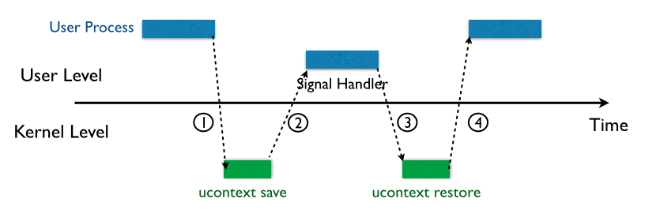
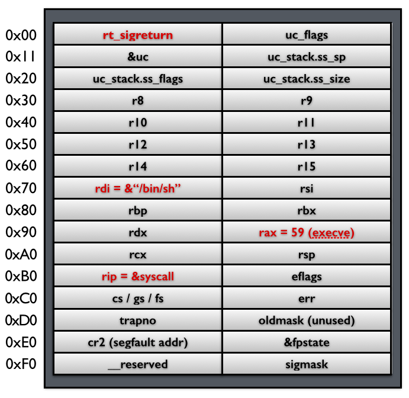
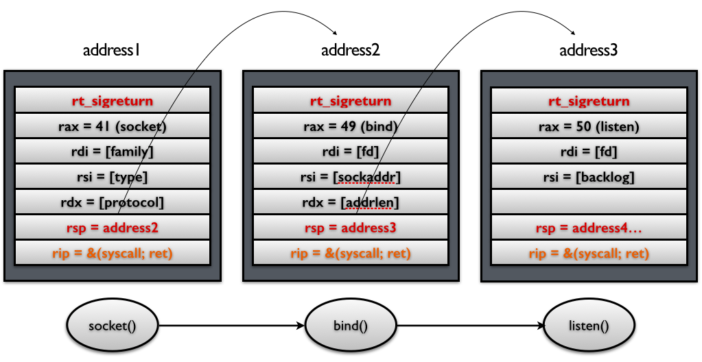

# SROP

`sigreturn`是发生signal时的间接调用


## signal机制


1. 内核向某个进程发送signal机制，该进程暂时挂起，尽入内核态
2. 内核为该进程保存上下文（主要是将所有寄存器压入栈中，然后压入signal的信息，以及指向sigreturn的系统调用地址，如下图所示栈内容）然后这一部分在用户进程的地址空间，之后会跳转到注册过的signal handler中处理相应的signal。所以当signal handler执行完之后，就会执行sigreturn代码
3. signal handler返回之后，内核为执行sigreturn系统调用，为该进程恢复之前保存的上下文，其中包括所有压入的寄存器，重新pop回对应的寄存器，最后恢复进程的执行。32位sigreturn的调用号时0x77;64位的是0xf


## 攻击原理

从上面的流程可以知道，完全可以劫持保存的上下文，从而实现指定代码执行

如上，可直接执行到shell
也可执行其它函数，获得必要内容，替换rsp的内容，和rip的内容即可



## 利用工具

pwntools可以直接梭srop了


```asm
section .text
global _start

_start:
    lea     rdi, [rel identity]
    call    boot_sequence

    call    decode_world
    call    rewrite_self
    call    sync_with_others

.next:
    call    iterate_future
    call    embrace_fault
    call    commit_vision

    call    fallback_path
    mov     rax, -1
    test    rax, rax
    js      .next

    jmp     .next
```
