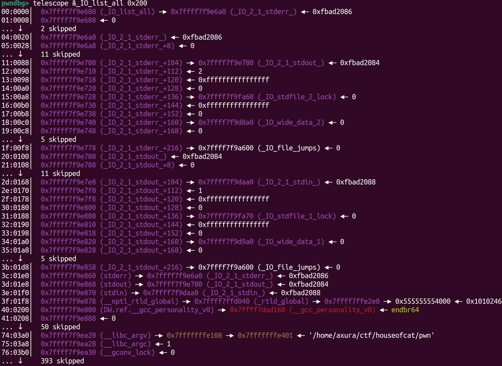

# House of Kiwi


## 0xff 背景

> 目前高版本glibc中，由于hook的移除，`house of kiwi`已经不再适用

在`glibc-2.24-0ubuntu3_amd64`及之前的版本中，我们可以修改`vatable`为任意地址，以便于轻松控制其中的函数指针

但是在`glibc-2.24-0ubuntu3_amd64`之后会有对`vtable`的安全检查，将其限制在`__libc_IO_vatables`中，导致无法实现任意改写

如下：


```

static

inline

const

struct

_IO_jump_t

*

IO_validate_vtable

(
const

struct

_IO_jump_t

*
vtable
)

{


/* 快速路径：检查 vtable 指针是否位于 __libc_IO_vtables 段内。*/


uintptr_t

section_length

=

__stop___libc_IO_vtables

-

__start___libc_IO_vtables
;


uintptr_t

ptr

=

(
uintptr_t
)

vtable
;


uintptr_t

offset

=

ptr

-

(
uintptr_t
)

__start___libc_IO_vtables
;


if

(
__glibc_unlikely

(
offset

>=

section_length
))


/* 如果 vtable 指针不在预期的段内，就走慢路径。 慢路径会在必要时终止进程。*/


_IO_vtable_check

();


return

vtable
;

}

/* 只有当 vtable 指针位于 __io_vtables 段内时，才算“合法”，否则进入慢路径进一步检查或 abort() */

void

_IO_vtable_check
(
void
)

{


/* Shared glibc 中，如果 accept flag 被设置为 __IO_vtable_check 本身，则跳过 */


if

(
flag

==

&
_IO_vtable_check
)

return
;


/* 或者跨 namespace 使用动态加载，也可能绕过 */


if

(
within

dlopen

context
)

return
;


__libc_fatal
(
"Fatal error: glibc detected an invalid stdio handle
\n
"
);

}

```

自此，我们再也无法轻易通过写入/伪造`vtable`来劫持程序执行流。

于是`house of kiwi`通过劫持`vtable`指向的全局`_IO_file_jumps_`表来实现执行流的劫持。不过某些特定版本的glibc中`_IO_file_jumps_`不可写，可能出现问题


## 0x00 攻击条件

- 能够触发`__malloc_assert`，通常是修改top chunk大小/清空`prev_inuse`位
- 可以覆盖`stderr`指针，使其指向我们可以控制的内存区域


## 0x01 原理


#### `FSOP`

> FSOP和本攻击无关，只是为了引出接下来的内容，详细可以看@r3t2的这篇[博客](https://r3t2.top/2025/07/27/%E5%8A%AB%E6%8C%81vtable%E4%BB%A5%E5%8F%8AFSOP/)

FSOP全称为`File Stream Oriented Programming`，即利用函数触发IO操作，主要是这样的攻击方式：

1. 在堆上伪造一个 `_IO_FILE_plus` 结构，里面的 `vtable` 指向攻击者布置的 **fake vtable**（也在堆或可写内存）
2. 然后修改全局链表指针 `_IO_list_all`，让它指向伪造的 `FILE`
3. 再然后，程序退出时 `exit()` → `_IO_flush_all_lockp()` 遍历 `FILE` → 调用 fake vtable → 跳到 `system("/bin/sh")`。

例如，`exit`激活链顺序如下：


```

exit


└───►
fcloseall


└───►
_IO_cleanup


└───►
_IO_flush_all_lockp


└───►
_IO_OVERFLOW

```

**利用原理如下**：

- 在 `exit()` 时，glibc 会遍历全局链表 `_IO_list_all` 里挂的所有 `FILE` 结构。
- 对每个 `FILE`，会根据其 vtable 调用虚函数，比如 `_IO_OVERFLOW`。
- 如果攻击者能控制一个 **伪造的 `_IO_FILE_plus` 结构**，就能在这个链条最后一步把控制流劫持到自己想要的函数。

**但有很多情况会导致此方法失效**

- 当题目使用系统调用的退出——`_exit`来结束程序的时候，我们没有机会去调用`_IO_cleanup`之前的基本函数
- 题目根本不退出，直接`while(1)`循环
- 二进制文件中没有明显的\*\*IO\*\*操作

那么此时，我们该怎么办呢


### `__malloc_assert`

在`malloc.c`中始终存在这样一个函数，大家在程序出错的时候可能见过：


```

// malloc.c ( #include <assert.h> )


# define __assert_fail(assertion, file, line, function)            \

     __malloc_assert(assertion, file, line, function)

static

void

__malloc_assert

(
const

char

*
assertion
,

const

char

*
file
,

unsigned

int

line
,

const

char

*
function
)

{


(
void
)

__fxprintf

(
NULL
,

"%s%s%s:%u: %s%sAssertion `%s' failed.
\n
"
,


__progname
,

__progname
[
0
]

?

": "

:

""
,


file
,

line
,


function

?

function

:

""
,

function

?

": "

:

""
,


assertion
);


fflush

(
stderr
);


abort

();

}

```

该函数调用了`fflush`并接受了IO结构体`stderr`作为参数。我们知道`stderr`有如下性质

- 一个标准`file`结构体
- 与`_IO_FILE`有着相同的结构体结构
- 指向`_IO_2_1_stderr_`——位于`_IO_list_all`指向的链表的顶部



当函数进入这个结构体后，会通过其虚函数表指针（`_IO_file_jumps`）调用 `_IO_file_sync`（偏移量 `+0x60`）。在特定运行环境下，如果触发了相应错误条件，对 `malloc` 系列函数（如 `malloc`、`calloc`、`realloc`）的调用将会进入 `_int_malloc` 的处理流程，如下：


```

_int_malloc


└───►
sysmalloc


└───►

__malloc_assert


└───►

fflush
(
stderr
)


└───►

_IO_file_sync

(
_IO_new_file_sync
)

```

> **此时寄存器 `rdx` 的值将始终为 `_IO_helper_jumps`。**
>
> **并且`setcontext`是通过`rdx`寄存器来传递数值的**
>
>

```

...


0x77d08a450c0d

<setcontext+61>

mov

rsp,

qword

ptr

[
rdx

+

0xa0
]


0x77d08a450c14

<setcontext+68>

mov

rbx,

qword

ptr

[
rdx

+

0x80
]


0x77d08a450c1b

<setcontext+75>

mov

rbp,

qword

ptr

[
rdx

+

0x78
]


0x77d08a450c1f

<setcontext+79>

mov

r12,

qword

ptr

[
rdx

+

0x48
]


0x77d08a450c23

<setcontext+83>

mov

r13,

qword

ptr

[
rdx

+

0x50
]


0x77d08a450c27

<setcontext+87>

mov

r14,

qword

ptr

[
rdx

+

0x58
]


0x77d08a450c2b

<setcontext+91>

mov

r15,

qword

ptr

[
rdx

+

0x60
]


0x77d08a450c2f

<setcontext+95>

test

dword

ptr

fs:
[
0x48
]
,

2


0x77d08a450c3b

<setcontext+107>

je

setcontext+294

<setcontext+294>


...

```

此外，`IO_file_sync`函数是一个全局跳转表，有\*\*写\*\*的权限，可以任意地址写来劫持

*当`__malloc_assert`打印报错信息的时候，会走另一条调用链：*


```

_int_malloc


└───►

sysmalloc


└───►

__malloc_assert


└───►

__fxprintf


└───►

__vfxprintf


└───►

__vfxprintf_internal


└───►

_IO_file_xsputn

```

这条链比前一条链更早触发，因此我们想攻击`setcontext`的时候需要合理安排`sigreturnFrame`数据为合法指针

**总而言之**，当我们可以控制`stderr`的文件结构时，我们就可以劫持执行流


## 0x02 攻击手段

**触发`__malloc_assert`**

在`_int_malloc`中，存在`assert`宏检查，如下：


```

for

(
bin

=

bin_at
(
av
,

idx
);

(
victim

=

last
(
bin
))

!=

bin
;

)

{


bck

=

victim
->
bk
;


assert
(
chunk_main_arena
(
bck
->
bk
));

// 断言


unlink
(
victim
,

bck
,

fwd
);

}

```

或者通过修改`top chunk`使得其不合法，从而在`sysmalloc`中触发assert：


```

assert

((
old_top

==

initial_top

(
av
)

&&

old_size

==

0
)

||


((
unsigned

long
)

(
old_size
)

>=

MINSIZE

&&


prev_inuse

(
old_top
)

&&


((
unsigned

long
)

old_end

&

(
pagesize

-

1
))

==

0
));

```

这个触发比较好实现，如下任意条件满足即可：

- top chunk大小<0x20
- top chunk的`prev_inuse`为0
- `old_top`未按照页对齐

**攻击**

如果可以存在任意写，通过修改`IO_file_jumps+0x60`的`_IO_file_sync`指针为`setcontext+61`；修改`IO_helper_jumps+0xA0`和`IO_helper_jumps+0xA8`分别为可以迁移的存放有ROP的位置和ret指令的gadget位置，则可以进行栈迁移

**执行链**

- `fflush(stderr)` → 调用伪造 vtable → 跳转到 `setcontext+61`。
- `setcontext+61` 会根据 `[rdx+0xa0]` 等位置布置寄存器，完成栈迁移。
- 进入我们准备好的 ROP chain（如 ORW 链，最终读取 flag）。


## 0x03 PoC & 总结

这个house过于古老了，就不贴PoC了。

`House of Kiwi`借助 `__malloc_assert` 中的 `fflush(stderr)` 强行进入 FSOP 链，通过伪造 IO 结构和 `setcontext+61` 实现栈迁移与 ROP，绕过传统 exit/IO 限制。

*在 glibc 2.34 新版安全检查后，该手法被废，但其思路延伸到后续的 **House of Emma**。*

**参考文章**

- <https://www.anquanke.com/post/id/235598>
- <https://4xura.com/binex/heap/house-of-kiwi/>
- <https://blog.csdn.net/Mr_Fmnwon/article/details/145956398>
