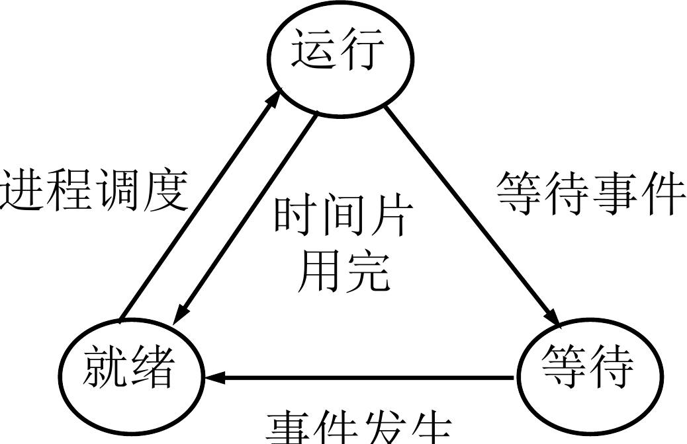
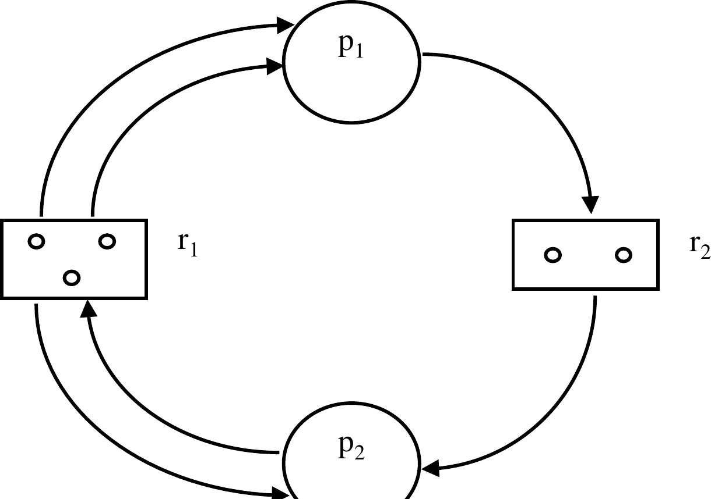
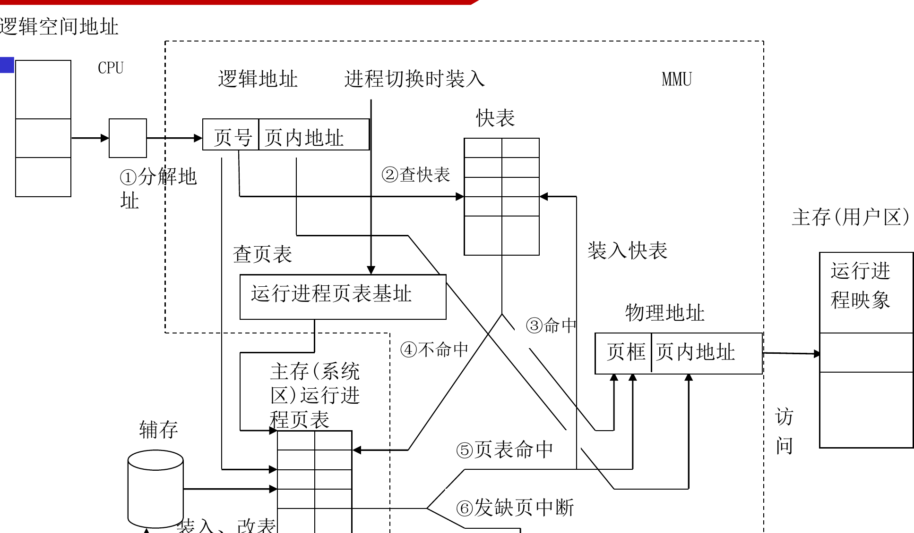
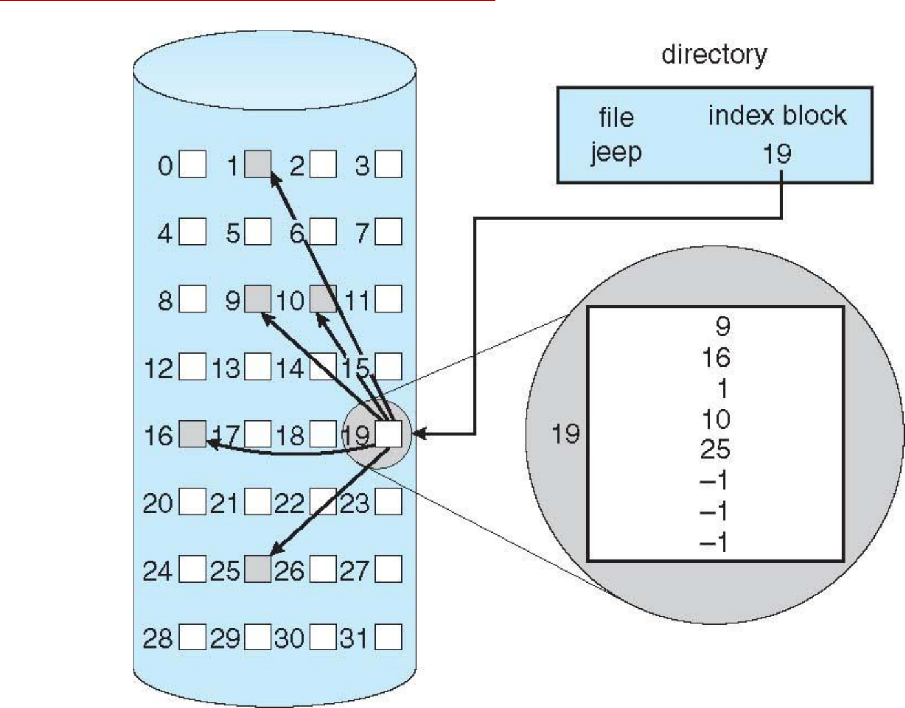
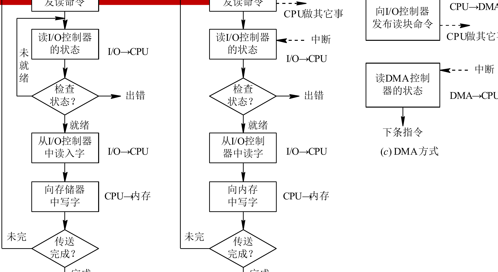

# 操作系统概论

Note

本笔记按《操作系统概念（第 9 版）》前 13 章顺序整理。课程里的“相关硬件基础”分散落在中断、双模式、地址变换和 I/O 控制几处位置，因此正文把这些内容并入相应章节。课程材料的主线收在第 13 章 I/O 系统，这份笔记也沿着这个边界展开。

> 阅读时可以始终沿着 问题场景 -> 核心机制 -> 关键结构 -> 运行过程 -> 结果与代价 这条线推进。操作系统里很多概念单独背会显得零散，放回这条链以后，前后关系会清楚很多。


## 第1章 导论

> 这一章先把 操作系统解决的问题、向上提供的抽象、课程后续模块的落点 连成一条线。


### 1.1 操作系统要处理什么问题

这一章先把整门课的对象摆正。用户面对的是程序、文件、窗口和网络服务，硬件真正能直接理解的对象却是指令、寄存器、总线、内存单元和设备控制器。操作系统夹在这两层之间，它把零散而复杂的硬件组织成一套可持续运行的系统，并向上提供稳定接口。

从用户角度看，操作系统首先提供了一个可使用的计算环境。程序装入、输入输出、文件读写、进程切换、设备共享，都由操作系统统一安排。从系统角度看，操作系统承担的是资源组织工作。处理器时间、主存空间、外存块、网络接口和外设通道都属于全局共享资源，谁先获得、使用多久、何时释放、出现冲突时怎样协调，都要由操作系统给出规则。

教材和课件都反复强调三个关键词：资源复用、资源虚化、资源抽象。

- 资源复用回答“多个程序怎样共享同一份硬件”
- 资源虚化回答“用户看到的计算机为何比物理机器更大、更稳定”；
- 资源抽象回答“上层程序为何可以围绕进程、文件、套接字这类对象编程，而无须直接操纵磁道、寄存器和中断线”。

三者连起来，操作系统的定义就清楚了：**它是一组控制和管理软硬件资源、组织作业执行流程、向用户提供运行环境的系统软件。**

把这三个词放回一个最普通的程序启动过程里，会更容易看清楚。用户双击一个应用图标时，看到的是一个窗口被打开；操作系统实际完成的事情却很多：找到可执行文件、分配地址空间、建立页表、创建进程或线程、装入代码页、打开图形设备、把这个执行主体挂入调度队列。用户面对的是“程序启动”这一抽象动作，内核实际处理的是一长串资源组织操作。课程后面的每一章，都可以沿着这条链再往下一层继续拆开。

Tip

- 用户视角先看到服务与接口。
- 系统视角先看到资源与调度。
- 课程后面的进程、内存、文件和 I/O，都是这两条视角在不同资源上的展开。


### 1.2 操作系统的发展脉络

发展过程之所以值得单独讲，是因为后面很多机制都来自早期矛盾的积累。最早的计算机依赖人工装载程序、手工控制设备，CPU 很快，人机交互很慢，于是机器的大量时间消耗在等待。简单批处理系统先把作业成批送入机器，减少人工切换造成的空转。接着，多道程序设计把多个作业同时放入内存，让某个作业等待 I/O 时，CPU 立刻转去执行另一个作业，系统吞吐量因此明显提高。

随着用户希望“边输入边得到响应”，分时系统出现了。它通过时间片轮转让多个用户共享同一台机器，目标从“让机器忙起来”推进到“让人感觉到及时响应”。实时系统进一步把问题推进到截止期。此时评价标准里多出“任务要在规定时间内完成”这一层约束，调度和中断处理的要求随之变得更严格。

等到多核、网络和移动设备普及，操作系统又扩展出分布式支持、并行支持、虚拟化支持和移动端能耗管理等目标。发展脉络表面上像是“系统类型越来越多”，主线始终稳定：硬件能力持续增长，应用目标持续扩大，操作系统负责把新增能力组织成可控、可编程、可共享的运行环境。

按时间顺序复习这段历史时，可以抓住一条稳定线索：先解决“机器闲着”的问题，于是有批处理；再解决“多个作业如何一起推进”的问题，于是有多道程序；再解决“人机交互等待过长”的问题，于是有分时；再解决“任务必须按时完成”的问题，于是有实时；最后再解决“多核、网络、虚拟化和移动端资源怎样统一管理”的问题。这样一来，很多机制的出现就都带着清楚的问题背景。


### 1.3 操作系统的基本特征

这一节要解决“为何操作系统里的很多现象和顺序程序直觉不同”。教材通常把基本特征概括为并发、共享、虚拟和异步。

`并发` 表示多个程序在一段时间内交替推进。单核处理器在任一时刻只执行一条指令流，调度器通过高速切换制造出多个程序同时向前推进的效果；多核处理器则在部分场景下同时提供并发与并行。

`共享` 表示系统资源要在多个执行主体之间协调使用。共享里至少有两种常见关系。一类是互斥共享，例如打印机、临界区中的共享变量，同一时刻只允许一个执行流进入。另一类是同时共享，例如只读代码段、公共库和部分缓存页，多个执行流可以同时读取。

`虚拟` 表示操作系统向上提供了“经过重组后的资源”。例如，时间片复用让每个进程都像拥有一台专用 CPU，虚拟内存让每个进程都像拥有一整段连续地址空间，文件系统让用户看到的是按名字组织的数据集合。

`异步` 表示并发实体的推进速度由调度、I/O 完成时刻和中断事件共同决定。程序之间的相对先后顺序只在部分关键点上受约束，很多中间步骤的交错顺序会随运行时环境变化。这一特征直接引出同步、互斥、死锁和调度等后续主题。

课程里很多初学时觉得“反直觉”的结论，都能追溯到这四个特征。结果不可直接复现，来自异步；同一时刻有人跑、有人等，来自并发；同一份代码页能被多个进程映射，来自共享；每个进程都像独占一整台机器，来自虚拟。把 并发、共享、虚拟、异步 和后面章节一一对应起来，会比单记定义更有效。


### 1.4 操作系统的作用与功能

操作系统的功能分类在后面会反复出现，因此这里先搭一个框架。最直接的分法是按被管理的对象来分。

- `处理机管理`：建立执行实体、分配 CPU、保存与恢复现场、处理中断和异常。
- `存储器管理`：分配与回收主存、完成地址转换、实施保护与共享、扩充逻辑地址空间。
- `文件管理`：组织持久数据、维护目录、支持访问方法和权限控制。
- `I/O 管理`：驱动设备、安排缓冲、处理设备请求、协调中断和 DMA。
- `保护与控制`：管理权限边界、隔离故障传播路径、审计关键行为。

这些功能彼此相连。进程调度依赖中断和时钟；虚拟内存依赖地址转换硬件与外存；文件系统依赖缓存、磁盘布局和 I/O 调度；设备管理依赖中断机制和驱动层。复习时把这些模块串成一条链，比单记概念更有效。

若把操作系统当作一个真正运行中的系统来观察，这几类功能几乎总是交织出现。浏览器下载一个文件时，线程先被调度运行，再通过系统调用发起网络 I/O，请求的数据进入缓冲区后写入页缓存，页缓存继续回写到文件系统，底层块 I/O 又被磁盘调度器排到合适顺序上。一个用户动作会同时穿过调度、内存、文件系统和 I/O 四层。


### 1.5 典型系统类型与系统环境

教材在导论末尾会把系统环境放回真实世界。批处理系统重视吞吐量，分时系统重视交互响应，实时系统重视截止期，服务器系统重视并发服务能力，移动与嵌入式系统重视功耗、可靠性和特定场景下的资源控制。

进一步看系统部署环境，单机系统、客户机/服务器系统、对等系统、集群系统、虚拟机系统和云计算环境都属于常见组织方式。部署环境变化后，进程、线程、内存和文件的基本机制依旧成立，规模、隔离边界和资源调度目标会随之变化。


## 第2章 操作系统结构

> 这一章先看 程序怎样进入内核，再看 内核怎样把这些服务组织起来。


### 2.1 操作系统通过哪些服务把硬件变成系统

第 1 章解决了“操作系统是什么”，这一章开始回答“它具体怎样向上提供服务”。教材把服务概括为程序执行、I/O 操作、文件系统操作、通信、错误检测、资源分配、审计和保护。把这些服务连成一个过程，更容易理解。

一个应用从启动到结束，先要由操作系统装入内存并建立执行上下文；运行中需要读取文件、申请内存、访问设备、等待网络或用户输入；结束时又要回收资源并更新系统状态。操作系统贯穿在整个生命周期里。

这也是“系统服务”这四个字真正的含义。它描述的是一套持续运行的支持关系：程序执行服务把代码放进可运行状态，I/O 服务把设备访问统一收口到内核，文件服务把长期数据组织成路径名空间，通信服务把执行主体之间的数据交换变成受控通道，错误检测与保护服务负责把故障约束在边界内。


### 2.2 用户接口与系统调用

用户与操作系统的接触面可以分成两层。第一层是命令解释器、图形界面或终端环境，它解决“人怎样把需求表达给系统”；第二层是系统调用（system call）接口，它解决“程序怎样把需求表达给内核”。

系统调用是用户程序进入内核服务的正规入口。以 `read(fd, buf, n)` 为例，应用程序先在用户态准备参数，随后执行陷入指令，处理器切到内核态，内核根据调用号找到服务例程，检查参数与权限，定位打开文件表和缓冲区，完成数据传输，再把返回值交还给用户程序。整个过程可以压成一条链：用户态 -> 陷入内核 -> 内核服务例程 -> 返回用户态。

这个过程里最关键的动作是“从用户态进入内核态”。用户程序平时看不到页表、控制寄存器和设备队列，也不能直接改动它们；一旦执行系统调用，处理器会沿着预先设置好的入口进入内核，内核再根据系统调用号把请求分发给对应服务例程。也正因为路径统一，内核才能对参数合法性、访问权限和资源状态做集中检查。

系统调用通常按功能分为几类：

- `进程控制`：创建、结束、等待、装入新程序映像。
- `文件管理`：创建、打开、读写、定位、关闭、删除。
- `设备管理`：请求设备、释放设备、读写控制寄存器、获取设备状态。
- `信息维护`：查询时间、系统信息、属性、资源使用情况。
- `通信`：共享内存、消息传递、套接字、远程过程调用。
- `保护`：设置权限、切换身份、检查访问能力。

`insight：` 系统调用的关键点在于“接口收敛”。应用程序看到的是少量稳定调用号和参数约定，硬件侧的中断线、页表、DMA 控制器和缓存细节都被收进内核。正因为有这层收敛，应用才能跨越硬件差异稳定运行。

> 看到系统调用题时，可以先问一个很稳的问题：当前这一步还在用户态，还是已经进入内核态。很多权限判断和执行路径，都是从这里分开。


### 2.3 操作系统结构怎样组织

服务确定以后，下一步是问“这些代码怎样组织”。教材里常见的结构有简单结构、分层结构、微内核结构、模块化结构和混合结构。

简单结构历史最早，功能组件集中放在一个较大的内核映像里，调用路径短，性能高，工程复杂度也高。分层结构把系统切成若干层，上层只依赖下层提供的抽象，逻辑更清楚，跨层通信会带来额外开销。微内核把线程管理、地址空间管理和基本通信留在内核，文件系统、网络协议栈、设备驱动等移到用户空间服务进程中，隔离性更好，消息传递开销更明显。模块化结构则把内核保留在一个核心框架内，再通过可装卸模块扩展驱动、文件系统或网络组件，工程弹性更强。

理解结构问题时，最重要的判断标准是：每一层究竟持有哪类状态、提供哪类接口、把故障隔离在哪个边界之内。这个判断在文件系统层次和 I/O 软件层次里还会再次出现。

若把常见系统放进这些结构里看，Linux 和 Windows 都属于“核心较大、模块化能力较强、局部带有分层思想”的混合结构；Mach 一类系统更贴近微内核路线。教材把这些结构并列出来，是为了说明操作系统内部同样需要架构设计，很多性能、可维护性和可靠性问题都在架构层先做了一轮取舍。


### 2.4 设计目标、实现方法与系统生成

操作系统设计始终围绕两组目标推进。面向用户的一组目标是方便、响应快、可靠；面向系统的一组目标是资源利用率高、可扩展、便于维护。很多实现方案都在这两组目标之间折中，例如分层结构让维护更清楚，单体内核让执行路径更短。

实现层面上，教材强调“机制”和“策略”应尽量分开。机制负责提供能力，例如时钟中断、队列、锁、页表和上下文切换；策略负责决定如何使用这些能力，例如时间片长度、调度优先级、页面置换算法和磁盘调度算法。分开之后，系统可以在保留底层支撑的前提下替换上层决策逻辑。

这条原则在课程里会反复出现。时间片中断属于机制，RR、MLFQ 和实时优先级属于策略；页表和缺页异常属于机制，FIFO、LRU 和时钟置换属于策略；设备队列属于机制，FCFS 与 SCAN 属于策略。把两者拆开，很多章节之间的联系会立刻变清楚。

系统生成（system generation）与启动（booting）则把设计落到具体机器上。系统生成根据硬件配置和用途装配内核参数、驱动和默认策略；启动过程把固件、引导程序和内核串起来，使机器从上电状态进入可调度、可响应中断、可加载用户程序的运行状态。


### 2.5 硬件支持与系统启动

课程里的“相关硬件基础”在这里最合适，因为它回答的是“内核凭什么掌握控制权”。关键硬件支撑有四个。

第一，`双模式运行`。处理器通过模式位区分用户态与内核态，特权指令只允许在内核态执行。这样一来，修改页表、屏蔽中断、启动设备控制器等敏感操作都有统一入口。

第二，`中断与异常`。中断让外设可以在事件完成时打断 CPU，请求内核处理；异常让越界访问、非法指令、缺页这类事件能够立刻转入内核控制流。中断提供设备到内核的主动通知路径，异常提供保护边界与故障转移入口。

第三，`定时器`。定时器周期性产生中断，内核借此夺回处理器控制权，实现时间片调度和超时控制。若缺少这一步，某个用户程序一旦长期占住 CPU，系统就很难维持公平运行。

第四，`启动链`。上电后，固件先完成最小硬件初始化，再把控制权交给引导程序；引导程序把内核映像装入内存，建立中断向量和初始页表，最后跳转到内核入口。此时系统才真正进入“操作系统掌控硬件”的阶段。

课件里的“特权指令、模式位、程序状态字寄存器、时钟中断、中断向量”这些硬件概念，都服务于这一件事：保证控制权能在用户程序、内核和设备之间有序转移。只要把“谁当前握着控制权”这个问题抓牢，硬件支持这部分就不会散。


## 第3章 进程

> 这一章要抓住 程序是静态文件，进程是动态执行实体，再去看 PCB、状态流转和通信。


### 3.1 为什么要引入进程

进程概念的引入，是为了解释并发程序在运行期表现出的动态特征。单看程序文本，只能看到指令序列；一旦把程序放进内存、分配资源、参与调度，就出现了创建、运行、阻塞、唤醒和撤销这些运行期状态，课程需要一个对象把这些现象收拢起来，这个对象就是进程。

课件在这里先讲前趋图和顺序执行，再讲并发执行。原因很直接：顺序程序的执行结果只由输入和代码决定，并发程序的执行结果还受调度时机、资源竞争和事件次序影响。两个共享变量的读改写序列一旦交错，就会出现“时间有关的错误”。后面的同步与死锁，正是在修复这一层问题。


### 3.2 进程的定义、组成与上下文

教材通常把进程定义为“程序的一次执行”或“资源分配与调度的基本单位”。更完整的理解方式是：进程是一个正在推进的程序实例，它同时包含了代码、数据、运行位置和资源占有关系。

一个进程的典型组成包括：

- `代码段`：将要执行的指令。
- `数据段`：全局变量、静态对象等进程级数据。
- `堆`：运行期动态申请的对象区域。
- `栈`：函数调用现场、返回地址、局部变量。
- `进程控制块（process control block, PCB）`：内核用来描述和管理该进程的数据结构。

PCB 是本章最重要的对象。它会记录进程标识、当前状态、程序计数器、寄存器现场、调度参数、打开文件、内存映射和资源清单。调度器之所以能把一个进程停下，再把另一个进程接上，靠的就是把当前 CPU 现场写入旧进程 PCB，再从新进程 PCB 恢复相应现场。

教材里常把 PCB 内容再拆成三类：标识信息、现场信息、控制信息。标识信息回答“它是谁”；现场信息回答“它停在何处，之后从哪条指令继续”；控制信息回答“它当前状态如何、优先级如何、资源占用如何、下一步该挂到哪个队列上”。只要这三类信息齐全，内核就能在任意时刻重新掌握这个进程。

> 只要能回答“它是谁、它停在哪、它现在归谁管”，PCB 的核心就已经抓住了。

这里还要把“进程”和“程序”彻底区分开。程序是静态文件，长期躺在磁盘上；进程是动态执行实体，会被创建、调度、阻塞、恢复和撤销。同一个程序可以对应多个进程实例，例如同时打开两个相同应用窗口；一个进程在执行过程中也可能装入新的程序映像，例如 `fork()` 之后再 `exec()`。


### 3.3 进程状态与转换

一旦把 PCB 放进调度队列，进程就会在不同状态之间流动。最基础的三态模型是 `就绪`、`运行` 和 `等待`。有些教材还会补上 `新建`、`终止`、`挂起就绪`、`挂起等待` 等扩展状态。



这张图把三态模型压缩成一条很清楚的链。调度器从就绪队列中挑出一个进程进入运行态；时间片耗尽后，运行态回到就绪态；运行中的进程若等待 I/O 或其他事件，就转入等待态；事件到达后，再回到就绪态。对单处理器系统来说，任一时刻至多存在一个运行态进程，就绪态和等待态进程数量则由系统负载决定。

`insight：` 很多人会把“等待”和“就绪”混在一起。区分它们时，只看一件事：CPU 一旦空出来，这个进程能否立刻执行。答案为“能”，它在就绪队列；答案为“还要等某个事件”，它在等待队列。


### 3.4 进程控制与上下文切换

进程控制围绕几个高频操作展开：创建、结束、阻塞、唤醒、挂起、恢复。创建进程时，内核要分配 PCB、建立地址空间、初始化寄存器和栈、把它挂到合适队列上。结束进程时，内核要回收内存、关闭文件、归还设备和更新父子关系。

上下文切换（context switch）是处理机管理的核心动作。切换时，内核保存旧进程的寄存器、程序计数器、栈指针和内核态执行位置，再装入新进程对应的现场。如果地址空间也发生变化，TLB 和缓存局部性还会受到影响，因此上下文切换开销远高于一次普通函数调用。

在类 UNIX 系统里，`fork()` 和 `exec()` 常被放在一起讲。`fork()` 负责复制一个子进程控制结构，`exec()` 负责把该进程的用户态映像替换成一个新程序。两者串起来，就得到“创建新执行主体，再装入另一段程序”的常见流程。

进程结束的原因也值得单独记一下。最常见的是正常结束，其次是异常结束，例如越界访问、非法指令或主动调用终止接口；还有一种情形来自外部控制，例如父进程回收子进程、用户终止某个任务、系统在资源紧张时撤销部分作业。课程里的进程图和调度图，都是围绕这几类状态转换展开的。


### 3.5 进程通信

并发进程之间既可能竞争资源，也可能合作完成任务。只要存在合作，就需要通信机制来传递数据和同步事件。教材把进程通信分成两大类：共享内存和消息传递。

`共享内存` 让两个进程映射到同一段物理页，数据交换速度高，控制逻辑由应用自己维护，因此通常要配合同步原语使用。`消息传递` 由内核代管发送与接收路径，通信双方通过 `send`/`receive`、邮箱或端口交换消息，边界更清晰，也更适合分布式环境。

进一步细分，消息传递还可分为直接通信与间接通信、阻塞通信与非阻塞通信。直接通信把发送者和接收者写死在接口里，间接通信通过邮箱或端口解耦；阻塞通信会在条件未满足时把进程挂起，非阻塞通信则立即返回状态。

共享内存与消息传递的差异，正好对应“谁负责同步”。共享内存把数据放到双方都能看到的位置，传递成本低，同步责任主要留给应用；消息传递把数据复制、排队和同步关系收进内核，接口更统一，复制与切换代价会更明显。后面的线程同步、套接字通信和管道通信，很多都在这两条主路上展开。


## 第4章 多线程编程

> 线程这一章的主线是 资源拥有者与调度单位分离。


### 4.1 线程解决了哪一层问题

进程把资源和执行流捆绑在一起后，并发能力已经建立起来了，但代价也显露出来：创建进程要分配地址空间，切换进程要切换更多内核状态，同一进程内部若存在多个相互协作的子任务，全部拆成独立进程会变得笨重。线程就在这一点上切入。

线程把“资源拥有者”和“执行流”两层职责拆开。进程继续持有地址空间、打开文件和大部分资源，线程承担 CPU 调度对象的职责。这样一来，一个应用内部就可以同时存在多个执行流，它们共享进程资源，同时保留各自的程序计数器、寄存器集合和栈。

浏览器是最容易理解的例子。一个线程负责界面事件与绘制，另一个线程负责网络收包，第三个线程负责脚本执行或后台资源整理。若这些任务全靠多个进程协调，地址空间隔离和通信开销都会更重；放在线程层组织，协作路径会短很多。


### 4.2 线程的定义与优势

教材常把线程定义为“CPU 使用的基本单位”或“进程内可调度的执行单元”。这一定义里有两个重点。第一，线程有自己独立的执行现场，因此它可以单独被切换；第二，线程共享进程的地址空间和大部分资源，因此同一进程内的线程协作成本通常低于进程间协作成本。

线程优势主要落在四个方向。响应性更好，因为一个线程等待 I/O 时，另一个线程仍可推进；资源共享更自然，因为多个线程天然位于同一地址空间；经济性更高，因为线程创建与切换涉及的状态更少；可伸缩性更强，因为多核处理器可以把不同线程并行放到不同核心上。

这里还有一组常见考点中的对应关系：进程是资源拥有单位，线程是调度单位。一个线程切换到另一个线程时，若它们属于同一进程，地址空间和打开文件大多沿用原状态；若切换跨越两个进程，系统还要继续切地址空间、页表和更多内核元数据，开销自然更大。


### 4.3 线程实现模型

线程实现最常见的三个模型是 多对一、一对一和多对多。

`多对一` 模型把多个用户线程映射到一个内核线程。线程管理成本低，线程切换也快，但一旦某个线程执行阻塞系统调用，整个进程的推进都会受影响，而且系统很难把这些线程分散到多个核心上。

`一对一` 模型把每个用户线程映射到一个内核线程。阻塞系统调用只影响当前线程，多核并行也更直接，代价是线程数量增长后内核对象和调度开销随之增长。现代通用操作系统大多采用这一模型。

`多对多` 模型在两者之间折中。用户可以创建大量用户线程，内核维护较少或相等数量的内核线程，线程库再把用户线程复用到内核线程上。这样既保留较强的并行性，也给运行时库留下了调度空间。

这三种模型需要抓住的，是阻塞传播路径和并行能力。多对一里，一个用户线程卡住系统调用，整个进程的用户线程推进都会受影响；一对一里，阻塞大多局限在当前线程；多对多则把“运行时调度”与“内核调度”叠在一起，设计最灵活，实现也最复杂。


### 4.4 线程库与并发编程中的细节

课程里常见的线程库包括 Pthreads、Windows 线程库和 Java 线程接口。它们在接口风格上各有差异，核心能力却高度一致：创建线程、等待线程结束、加锁、条件等待、线程私有数据管理。

线程真正难的地方不在于“如何创建”，而在于“共享状态怎样被有序更新”。多个线程共享堆、全局变量和打开文件，只要更新顺序失控，就会回到第 3 章提到的时间有关错误。因此，线程一旦引入，调度与同步会立刻成为同一条主线上的问题。

教材在这里还会补几个运行时细节。`fork()` 之后，子进程究竟复制一个线程还是复制全部线程；某个信号应交给哪个线程处理；线程私有存储如何给每个线程保留独立副本；线程池怎样提前维持一批可复用工作线程。这些问题都说明，线程需要作为独立抽象来理解，它会把运行时系统的很多边界重新细化一遍。


## 第5章 CPU 调度

> 调度题最稳的切入顺序是 先看指标，再看算法选择依据，最后看切换代价。


### 5.1 调度问题从哪里产生

这一章真正要解决的是“当很多进程都想用 CPU 时，谁先上、谁后上、上多久”。只要系统里同时驻留多个就绪执行主体，CPU 调度问题就已经出现了。教材把相关队列分为作业队列、就绪队列和设备队列，把调度层次分为高级调度、中级调度和低级调度。

高级调度决定哪些作业从外存进入内存；中级调度负责对换和挂起，缓解主存压力；低级调度直接在就绪队列中挑选下一个获得 CPU 的进程或线程。真正高频发生、对用户体验最敏感的，是低级调度，因为它在几十毫秒量级持续作出决策。

理解调度之前，要先抓住 `CPU burst` 和 `I/O burst` 这两个对象。一个进程在执行时，通常会在占用 CPU 与等待 I/O 之间交替切换。它先计算一段时间，再发出 I/O 请求去读磁盘、等网络或等终端输入，随后又回到 CPU 上继续推进。于是，一个进程的生命周期就会呈现“CPU 段、I/O 段、CPU 段、I/O 段”的交替结构。I/O 密集型作业拥有很多短 CPU 段，CPU 密集型作业拥有较长 CPU 段。调度器需要在吞吐量、响应时间、公平性和实现代价之间给出平衡。

这里还要提前区分 `抢占式调度` 和 `非抢占式调度`。非抢占式调度下，进程一旦拿到 CPU，就会一直运行到主动阻塞或主动结束；抢占式调度下，时间片用完、高优先级任务到来或实时任务被唤醒时，内核可以强行收回 CPU。现代分时系统几乎都采用抢占，缺少抢占时，交互式响应时间很难稳定压住。


### 5.2 调度指标怎样定义

调度算法的优劣要靠指标说话。设进程 $P_i$ 的到达时刻为 $a_i$，第一次获得 CPU 的时刻为 $s_i$，完成时刻为 $c_i$，全部 CPU 执行时间之和为 $b_i$。这组定义围绕的是 周转时间、等待时间、响应时间 三个观察角度。则有：

$$
\begin{aligned}
T_i &= c_i - a_i \quad \text{周转时间} \\
W_i &= T_i - b_i \quad \text{等待时间} \\
R_i &= s_i - a_i \quad \text{响应时间}
\end{aligned}
$$

其中，周转时间衡量一个作业从进入系统到完成经历了多久，等待时间衡量它在就绪队列中累计停留多久，响应时间衡量用户从提交请求到第一次看到 CPU 响应花了多久。

`insight：` 响应时间和周转时间服务于两类感受。交互系统更敏感的是“多久开始响应”，因此响应时间尤其重要；批处理系统更敏感的是“多久全部做完”，因此周转时间和吞吐量更关键。

> 交互系统先盯响应时间，批处理系统先盯吞吐量和周转时间。很多调度题的判断方向，就是从这里分开。

很多教材还会引入 `带权周转时间`，写作：

$$
\text{Weighted Turnaround}_i = \frac{T_i}{b_i}
$$

这个指标回答的是“一个作业完成所花的总时间，是它自身服务时间的多少倍”。对于短作业来说，它很容易被长时间排队放大，因此这个指标能更敏感地反映系统对短任务是否友好。

评价调度器时，常见目标至少有五类：提高 CPU 利用率、提高吞吐量、降低平均周转时间、降低平均响应时间、维持公平性。真实系统里这几个目标往往拉扯在一起。时间片过短时，响应时间会下降，但上下文切换增多后，吞吐量和 CPU 利用率会受影响；优先短作业时，平均等待时间会下降，长作业等待时间却可能被拉长。


### 5.3 典型调度算法

下面把课程里最核心的几类算法压到一张表里，再逐个展开。

| 算法 | 选择依据 | 适合的目标 | 典型代价 |
| --- | --- | --- | --- |
| FCFS | 到达先后顺序 | 实现简单，次序直观 | 长作业容易拉长平均等待时间 |
| SJF / SRTF | 下一次 CPU 段最短 | 降低平均等待时间 | 需要估计 CPU 段长度 |
| 优先级调度 | 优先级数值 | 区分任务重要性 | 低优先级任务等待时间可能过长 |
| RR | 固定时间片轮转 | 交互响应 | 时间片过小会放大切换开销 |
| MLFQ | 多级队列动态迁移 | 兼顾交互与吞吐 | 策略参数较多 |

`FCFS`（先来先服务）最容易实现，但 convoy effect 很明显：一个长作业排在前面时，后面一串短作业都会被拖慢。

`SJF`（最短作业优先）和抢占版本 `SRTF`（最短剩余时间优先）在理论上能把平均等待时间压得很低。问题在于，调度器通常看不到未来 CPU 段长度，只能依据历史进行预测。

`优先级调度` 把重要性直接编码到调度决策里。为了让低优先级任务也能持续推进，系统常加入 aging 机制，让等待时间越长的任务优先级逐步抬升。

`RR`（时间片轮转）是分时系统的典型算法。时间片一到，当前任务回到就绪队列尾部。时间片取值很关键：太长时，系统行为会接近 FCFS；太短时，CPU 时间被上下文切换切碎。

`MLFQ`（多级反馈队列）把“短任务优先”和“交互优先”的经验固化成规则：新任务先进入高优先级队列，若持续占用 CPU，则逐级下移；若长期等待，也可重新上调。现代通用系统的大量调度器都能看到这种思想的影子。

**例**

为了把这些算法真正学会，最好顺着一个小例子走一遍。设三个进程在时刻 0 一起到达，CPU 服务时间分别为 24、3、3。若采用 FCFS，执行次序会是 24、3、3，两个短作业都要等长作业跑完；若采用 SJF，执行次序会是 3、3、24，平均等待时间会立刻下降。这个例子说明，调度器一旦知道任务长度信息，优先照顾短任务往往能显著改善整体等待表现。

再看时间片轮转。若时间片取 4，服务时间为 10 的任务不会一次跑完，而会分成 4、4、2 三次获得 CPU。用户在终端上看到的效果，通常会比 FCFS 更平滑，因为每个就绪任务都能在较短时间内重新获得执行机会。这里也能看出时间片的两面性：时间片继续减小，响应会更及时，切换次数也会更多。

教材里还常把 `静态优先级` 和 `动态优先级` 放在一起。静态优先级在进程创建时基本确定，实时任务和系统任务常采用这一类；动态优先级会根据等待时间、最近行为或交互特征变化，目的是让调度器把“最近经常阻塞、CPU 段很短”的任务识别成更需要快速响应的对象。

> **例题：时间片轮转怎样一步步算周转时间**
>
> 课件里的一个典型算例是：五个进程 $A,B,C,D,E$ 的到达时间分别为 $0,1,2,3,4$，运行时间分别为 $3,6,4,5,2$，采用 RR 调度，时间片取 4。这个题适合练三件事：就绪队列如何排、谁在时间片结束后回队尾、完成时刻怎样落到周转时间上。
>
> 按时间顺序展开，执行链可以写成：$0\sim3$ 运行 $A$；此时 $A$ 结束，$B,C,D$ 已经到达，接着 $3\sim7$ 运行 $B$；然后 $7\sim11$ 运行 $C$；$11\sim15$ 运行 $D$；$15\sim17$ 运行 $E$；$17\sim19$ 再运行 $B$；最后 $19\sim20$ 运行 $D$。因此五个进程的完成时刻分别是：
>
> | 进程 | 到达时刻 | 运行时间 | 完成时刻 | 周转时间 $T$ | 带权周转时间 $T/b$ |
> | --- | --- | --- | --- | --- | --- |
> | $A$ | 0 | 3 | 3 | 3 | 1 |
> | $B$ | 1 | 6 | 19 | 18 | 3 |
> | $C$ | 2 | 4 | 11 | 9 | 2.25 |
> | $D$ | 3 | 5 | 20 | 17 | 3.4 |
> | $E$ | 4 | 2 | 17 | 13 | 6.5 |
>
> 于是平均周转时间为：
>
>
$$
\bar T=\frac{3+18+9+17+13}{5}=12
$$

>
> 平均带权周转时间为：
>
>
$$
\bar W=\frac{1+3+2.25+3.4+6.5}{5}=3.23
$$

>
> 这个例题里最容易错的地方，是新到达进程与“时间片刚用完回到就绪队列的进程”之间的入队次序。只要队列次序错一位，后面的完成时刻就会连锁变化。


### 5.4 多处理器与实时调度

进入多核环境后，调度器多了一层任务：既要挑“谁先运行”，也要挑“放到哪个核心上运行”。这就引出 `负载均衡` 和 `处理器亲和性` 两个概念。负载均衡负责让各核心工作量保持接近，处理器亲和性负责让任务尽量留在最近使用过的核心上，以便延续缓存局部性。

多处理器调度还会继续分成两种常见思路。`非对称多处理` 下，某个主处理器负责核心调度与系统控制，其余处理器主要执行用户任务；`对称多处理` 下，多个处理器在调度地位上接近，内核通常维护每核就绪队列或全局就绪队列，再通过负载均衡周期性迁移任务。现代通用系统大多以对称多处理为主，因为它更适合多核平台的规模扩展。

实时调度则把截止期纳入约束。软实时任务关心较低的延迟和稳定的响应节奏，硬实时任务关心截止期满足率。此时“平均值”已经不足以描述系统表现，最坏情况执行时间、抖动和优先级抢占路径都需要纳入分析。课程中常见的实时思想包括“周期任务优先级固定”和“越接近截止期优先级越高”，核心都在于把时间约束直接写进调度决策。


### 5.5 分派程序与切换代价

调度算法选出一个任务后，还要由分派程序（dispatcher）真正完成切换。它需要保存旧上下文、恢复新上下文、切换地址空间、跳转到新程序计数器。这个过程的耗时称为 dispatch latency。

分派程序的具体工作至少包括四步：保存当前执行流的寄存器现场；更新 PCB 中的状态位和队列指针；装入下一个执行流的内核态上下文与地址空间信息；把控制权交回被选中的线程或进程。若系统采用分页，地址空间切换还会影响 TLB；若任务被迁移到另一核心，缓存局部性也会受到干扰。

理解调度效果时，切换代价绝不能漏掉。算法层面看似收益很高的策略，若需要过于频繁地抢占和迁移，真实系统中的收益会被切换代价吃掉一部分。这也是操作系统在“理论最优”和“工程可用”之间持续折中的典型位置。


## 第6章 同步

> 同步这一章始终围绕 共享状态怎样有序变化 展开。


### 6.1 同步问题的结构

同步章节的起点，是多个执行流对共享状态的并发访问。只要若干执行流同时读写同一组数据，并且至少存在一个写操作，执行结果就会依赖交错顺序。课程里常把这类问题叫作竞态条件（race condition）。

**例**

例如，余票变量 `x` 当前为 1，两个售票线程都执行“先读 x，再判断是否大于 0，再把 x 减 1，再写回”。若两个线程都在写回之前读到了相同的旧值，它们都可能判断“还有票”，最后却只把余票减成 0，同时卖出两张票。这个错误来自几条语句在时间上的交错次序。

更进一步，很多共享数据还具有“关键片段”特征。所谓临界区（critical section），就是访问这份共享数据并可能改变其一致性的那一段代码。同步问题真正要做的，是围绕临界区建立一套进入和退出规则。


### 6.2 临界区问题的三个要求

教材把临界区问题的要求概括为三条，也就是 互斥、进度、有限等待。

第一，`互斥`。任一时刻至多允许一个执行流进入同一临界区。

第二，`进度`。当临界区空闲时，系统应当在那些有意进入的执行流之间作出推进决策，决策过程应由相关执行流参与，不能长期停滞。

第三，`有限等待`。某个执行流提出进入请求后，系统应当保证它在有限次让出机会之后获得进入资格。这样才能抑制某一类执行流长期占住入口。

这三条要求合起来，才构成一个可用的同步解。只有互斥，系统仍可能长期停住；只有进度，系统仍可能让某些线程饿死；只有有限等待，系统仍可能在同一时刻放进多个执行流。

这三条要求各自对应一种常见故障。互斥失效会导致共享数据被破坏；进度失效会导致临界区空着却没人推进；有限等待失效会导致某个线程长期饥饿。做同步题时，最好把出错原因对应回这三项，再看当前解法究竟缺了哪一环。


### 6.3 硬件原语与自旋锁

教材在这里通常会从软件算法一路推进到硬件支撑。软件层面最经典的例子是 Peterson 算法。它针对两个并发执行流，使用 `flag[2]` 和 `turn` 两个共享变量控制进入次序。其核心思想是：先声明“我想进入”，再把优先权让给对方，最后在循环中检查“对方是否也想进入，以及现在是否轮到对方”。这个算法能同时满足互斥、进度和有限等待，因此经常被当作临界区问题的教学原型。

把软件算法再往下压，就会接到硬件原语。典型硬件原语包括 test-and-set、compare-and-swap、fetch-and-add 等。它们在总线层或缓存一致性协议层面保证“读出旧值并写入新值”作为一个不可分割动作完成。

基于原子指令可以构造自旋锁。自旋锁在锁已被占用时持续轮询，直到锁释放。它适合临界区很短、持锁时间很小、上下文切换代价高于等待代价的场景，因此内核态短临界区经常会用到它。若临界区很长，自旋就会持续烧掉 CPU 时间，这时更合适的做法往往是让等待线程阻塞并让出处理器。


### 6.4 信号量

信号量（semaphore）把“资源计数”和“阻塞唤醒”结合在一起。设信号量值为 $S$。`P(S)` 表示申请资源，`V(S)` 表示释放资源。若 $S$ 对应可用资源数量，则 `P` 会把计数减一，`V` 会把计数加一，并在必要时唤醒等待队列中的执行流。

若把等待线程直接阻塞，信号量的抽象行为可以写成：


```

wait(S):
    S.value--
    if S.value < 0:
        将当前线程加入 S.wait_queue
        block()

signal(S):
    S.value++
    if S.value <= 0:
        从 S.wait_queue 取出一个线程
        wakeup()

```

这段伪代码的关键在结构关系。`wait` 先减少资源计数，再决定当前线程是否需要睡眠；`signal` 先归还资源，再决定是否要唤醒等待者。若把这两步拆散执行，或者把修改计数与队列操作分开到非原子路径里，同步结构就会被破坏。

二元信号量常用于互斥，计数信号量常用于管理一组同类资源。生产者-消费者问题是最典型的例子。设缓冲区大小为 $n$，`empty` 记录空槽数量，`full` 记录已装入数据的槽数量，`mutex` 保护缓冲区结构，则有：


```

semaphore empty = n
semaphore full = 0
semaphore mutex = 1

producer:
    produce_item()
    P(empty)
    P(mutex)
    insert_item()
    V(mutex)
    V(full)

consumer:
    P(full)
    P(mutex)
    remove_item()
    V(mutex)
    V(empty)
    consume_item()

```

这个顺序里最关键的是先后关系：进入临界区前先确认资源条件满足，离开临界区后再通知对方状态已变化。若顺序打乱，很容易把系统推进到死锁或丢唤醒。

> 做同步题时，可以先把“谁保护共享结构”“谁表示资源数量”“谁表示状态条件”这三层分别标出来，再看操作顺序是否会把线程卡在持锁睡眠的位置。

例如，生产者若先 `P(mutex)` 再 `P(empty)`，当缓冲区已满时，它会在持有互斥锁的情况下睡眠。此时消费者即使准备取出数据，也会因为拿不到 `mutex` 而无法进入临界区，于是系统被自己卡住。同步题里很多错误都来自这种“持锁等待另一个条件”的顺序失误。

> **例题：计算进程与打印进程共享单缓冲区**
>
> 课件里还有一个很典型的同步场景：计算进程 $C$ 把数据写进单缓冲区，打印进程 $P$ 从单缓冲区取数据并输出。这里缓冲区容量只有 1，因此问题比一般生产者-消费者更容易看清。
>
> 设 `empty=1` 表示缓冲区最初为空，`full=0` 表示当前无可打印数据，`mutex=1` 表示对缓冲区的互斥访问。则两端代码可以写成：
>
>

```

process C:
    计算得到一条输出
    P(empty)
    P(mutex)
    把结果写入缓冲区
    V(mutex)
    V(full)

process P:
    P(full)
    P(mutex)
    从缓冲区取出一条输出
    V(mutex)
    V(empty)
    执行打印

```

>
> 这个例题适合用来区分“合作同步”和“互斥”两层关系。`mutex` 保证的是同一时刻只有一个进程真正碰缓冲区；`empty/full` 保证的是计算进程不会覆盖尚未打印的数据，打印进程也不会去读取空缓冲区。很多初学时的混乱，来自把这两层关系压成了一把锁。


### 6.5 经典同步问题

课程通常围绕三个经典问题训练同步思路。

`有界缓冲区问题` 关注生产与消费的配合，核心是“空槽数量”和“已有数据数量”两个计数同步。

`读者-写者问题` 关注共享读取与独占写入的平衡。多个读者可以并发进入，写者进入时需要独占。不同变体分别强调读者优先、写者优先或公平次序。

`哲学家进餐问题` 关注资源申请顺序。五个哲学家围绕五支筷子，当每个人都先拿左手边筷子，再等待右手边筷子时，系统就会形成一个环状等待结构。这一问题和死锁章节的联系极紧。

做这三类题时，最好先问清楚三个问题：共享对象是什么；互斥边界落在哪一段代码里；等待条件究竟对应“资源数量”还是“状态谓词”。生产者-消费者偏向资源计数，读者-写者偏向访问策略，哲学家进餐偏向资源申请顺序。三类题表面不同，底层都在处理“共享状态怎样有序变化”。


### 6.6 管程与条件变量

信号量已经足够表达很多同步关系，管程（monitor）进一步把共享数据、互斥进入和条件等待封装到一个更高层的抽象里。任一时刻只有一个执行流在管程内部执行；若某个条件尚未成立，线程可以在条件变量上 `wait`，等到其他线程更新了共享状态，再通过 `signal` 唤醒。

`insight：` 信号量直接围绕资源数量工作，条件变量直接围绕状态谓词工作。前者适合表达“当前还剩几个名额”，后者适合表达“共享状态是否满足继续推进的条件”。把这两个抽象区分清楚，很多同步题会更顺。

条件变量和信号量还有一个常见混淆点。线程在条件变量上 `wait` 时，通常会暂时释放与之关联的互斥锁；等到被唤醒后，再重新拿回锁，继续检查条件是否成立。这里之所以要“醒来后再次检查”，是因为别的线程可能已经在当前线程重新获得锁之前修改了共享状态。很多语言和库里都因此推荐把条件等待写成 `while 条件不满足: wait()` 的形式。


## 第7章 死锁

> 死锁问题先看 闭环怎样形成，再看 系统选择在哪个时间点介入。


### 7.1 死锁是怎样形成的

多个进程并发推进时，只要资源数量有限、申请次序交错、释放时机相互牵制，就可能出现僵局。教材把死锁定义为：一组进程中的每个进程都在等待某个事件，而这些事件只能由该组中的其他进程触发。

这里最好先分清资源类型。`可剥夺资源` 例如处理器时间和某些内存页，系统能在特定条件下把它们收回；`不可剥夺资源` 例如打印机、磁带机、已开始的某些 I/O 设备使用权，系统往往只能等占有者主动释放。死锁最常见的舞台，就是若干进程围绕不可剥夺资源形成等待闭环。

这个定义里最重要的是“循环等待链”。若 P1 等待 P2 手里的资源，P2 等待 P3 手里的资源，最终某个进程又回过头等待 P1 已持有的资源，系统就形成了闭环。


### 7.2 产生死锁的必要条件

教材沿用 Coffman 给出的四个必要条件，也就是 互斥、占有并等待、保持直到主动释放、循环等待：

- `互斥`：一类资源在某一时刻只分配给一个进程。
- `占有并等待`：进程已经持有部分资源，同时继续申请新资源。
- `保持直到主动释放`：进程持有的资源会一直保留到使用结束。
- `循环等待`：存在一条进程与资源交替连接的闭环。

四个条件同时成立时，系统具备形成死锁的结构。只要主动破坏其中任意一条，死锁链就难以闭合。

这四个条件可以各自配上一个很短的现实画面。互斥对应“一把筷子同一时刻只能由一个哲学家拿着”；占有并等待对应“左手已经拿到筷子，右手继续申请另一支”；保持直到主动释放对应“筷子不会被系统强行抽走”；循环等待对应“五个人围成一圈都在等右边那支”。把这个结构关系看清楚之后，后面的预防和规避方法就都变成了“主动打掉闭环的一条边”。


### 7.3 资源分配图

资源分配图（resource-allocation graph, RAG）把进程与资源关系画成一个有向图。圆圈表示进程，方框表示资源类型，方框中的多个点表示该类资源的多个实例。进程指向资源的边表示请求，资源指向进程的边表示分配。



这张图适合说明“环从何而来”。图中的两个进程分别占有一部分资源，同时都在等待对方已经拿到的资源实例，于是形成闭环。对单实例资源系统而言，图中一旦出现环，死锁就已经发生；对多实例资源系统而言，出现环意味着系统进入了高风险结构，还需继续结合可用资源数量判断。

若系统中每类资源都只有一个实例，资源分配图的判定会很直接：有环就有死锁，无环时可判定当前不存在死锁。多实例资源系统要多走一步，因为某个资源虽然处于被占用状态，但同类资源的其他实例可能仍然能打通后续推进路径。此时图结构仍然重要，但还要配合“当前可用数量”一起看。


### 7.4 处理死锁的四条路线

教材把死锁处理分成四条路线：忽略、预防、规避、检测与解除。

`忽略` 的思路最直接，系统将主要精力放在常态性能和常态功能上，出现死锁时交由运维或上层软件介入。很多通用操作系统在用户态程序资源申请上会采用这种立场。

`预防` 的思路是主动破坏四个必要条件之一。例如，一次性申请全部资源可以打散“占有并等待”，按固定序号申请资源可以打散“循环等待”。代价在于系统并发度和资源利用率常会下降。

`规避` 的思路更细。系统允许动态申请资源，但每次分配前都先判断新状态是否仍然安全。银行家算法就是这一类方法的代表。

`检测与解除` 的思路则允许系统进入死锁态，再周期性检测等待图或资源分配矩阵，一旦确认死锁，就通过终止进程、回滚或强制回收资源解除闭环。

这四条路线可以按“介入时机”理解。忽略几乎不提前介入；预防在资源申请规则上提前约束；规避在每次分配动作发生时检查未来安全性；检测与解除在问题已经形成后再识别并处理。课程题目经常让你判断某种做法属于哪一类，抓住“系统在哪个时间点动手”通常就够了。

预防的代价也要一起看到。例如要求进程一次性申请全部资源，确实能打掉占有并等待条件，但会让资源在很长时间里闲置；按编号顺序申请资源，确实能打掉循环等待，但会让程序设计更僵硬。死锁处理总要在安全与利用率之间做取舍。


### 7.5 安全状态与银行家算法

理解银行家算法之前，需要先建立“安全状态”概念。设系统中有 $n$ 个进程、$m$ 类资源。若系统当前存在一个进程序列 $\langle P_1, P_2, \dots, P_n \rangle$，使得系统能按此顺序依次满足每个进程的剩余资源需求，并在前面进程完成后回收资源供后面进程使用，则该状态称为安全状态。

银行家算法维护四个核心数据结构：

$$
\text{Need}[i][j] = \text{Max}[i][j] - \text{Allocation}[i][j]
$$

其中，`Max[i][j]` 表示进程 $P_i$ 对资源 $R_j$ 的最大需求，`Allocation[i][j]` 表示当前已经分配的数量，`Need[i][j]` 表示剩余需求，`Available[j]` 表示系统当前可直接分配的资源数量。

安全性检查的主循环可以写成：


```

Work = Available
Finish[i] = false

while 存在某个 i 满足 Finish[i] == false 且 Need[i] <= Work:
    Work = Work + Allocation[i]
    Finish[i] = true

若所有 Finish[i] 都为 true，则当前状态安全

```

`insight：` 安全状态和“眼前资源够用”属于两个层次。眼前资源够用，只能说明某个请求当下可以被满足；安全状态要求的是，满足这一请求之后，系统仍能为全部进程排出一条完成路径。银行家算法真正检查的就是这条后续路径是否仍然存在。

> 银行家算法检查的是一次分配动作对后续完成序列的影响，也就是给完这一次以后，后面的完成路径是否仍然存在。

把这个过程放进一个小例子里会更清楚。假设当前 `Available` 足以满足 $P_2$ 的全部剩余需求，那么安全性检查会先让 $P_2$ “想象中运行结束”，随后把 $P_2$ 已占有的资源归还给 `Work`。若更新后的 `Work` 又能满足 $P_1$，算法就继续让 $P_1$ 结束，再归还其占有资源。只要最后全部进程都能按某个顺序走完，系统就是安全的。

这里还要区分三个状态：安全状态、不安全状态、死锁状态。安全状态下，一定存在完成序列；不安全状态下，系统已经无法保证未来一定能排出完成序列；死锁状态则表示闭环等待已经真正形成。关系是“死锁状态一定不安全，不安全状态还未必已经死锁”。这个顺序不要颠倒。

> **例题：课件里的银行家算法安全性检查**
>
> 课件给出的一个完整例子里，系统有 5 个进程 $P_0\sim P_4$，三类资源 $A,B,C$ 的总量分别是 $12,5,9$。在 $T_0$ 时刻，系统的可用资源为：
>
>
$$
Available=(3,3,2)
$$

>
> 五个进程的剩余需求为：
>
>
$$
\begin{aligned}
Need_0&=(7,4,3) \\
Need_1&=(1,2,2) \\
Need_2&=(6,0,0) \\
Need_3&=(0,1,1) \\
Need_4&=(4,3,1)
\end{aligned}
$$

>
> 先用 $Work=(3,3,2)$ 去试探。此时 $P_1$ 和 $P_3$ 都可以先完成，因为它们的 `Need` 不超过 `Work`。若先选 $P_1$，它完成后归还自己已占有的资源 $(2,0,1)$，得到：
>
>
$$
Work=(3,3,2)+(2,0,1)=(5,3,3)
$$

>
> 此时 $P_3$ 可以完成，归还 $(2,1,1)$，得到：
>
>
$$
Work=(5,3,3)+(2,1,1)=(7,4,4)
$$

>
> 接下来 $P_4$ 可以完成，归还 $(1,0,2)$，得到 $Work=(8,4,6)$；然后 $P_0$ 可以完成，归还 $(1,1,0)$，得到 $Work=(9,5,6)$；最后 $P_2$ 的需求 $(6,0,0)$ 也能满足。于是系统存在一条安全序列：
>
>
$$
\langle P_1,P_3,P_4,P_0,P_2\rangle
$$

>
> 这个例题适合用来体会安全性检查的目标：算法要找的是任意一条能让所有进程依次完成的顺序。找到这样一条序列之后，当前状态就可以判定为安全。


## 第8章 内存管理策略

> 这一章先分清 逻辑地址、物理地址、碎片类型，后面的分页和分段才会顺。


### 8.1 存储管理在解决什么矛盾

主存管理的核心矛盾来自三点：程序希望看到连续、私有、足够大的地址空间；物理内存实际容量有限、布局离散，而且要由多个进程共享；处理器访问速度远高于外设访问速度，因此系统得尽量让活跃数据留在主存。

围绕这三点，存储管理承担四类任务：分配与回收存储空间、完成逻辑地址到物理地址的映射、实施保护与共享、在逻辑上扩充可用空间。后面的分页、分段和虚拟内存，都是这四类任务的具体实现。

这一章里有两组概念需要先分清。第一组是 `逻辑地址空间` 和 `物理地址空间`。逻辑地址空间是进程运行时看到的地址集合，物理地址空间是主存芯片真实存在的地址集合。第二组是 `内部碎片` 和 `外部碎片`。内部碎片表示分配出去的块内部未被真正用满，外部碎片表示空闲空间分散在很多小孔里，总量看起来够，用起来却不连续。


### 8.2 地址绑定与动态重定位

程序里的地址会经历符号地址、可重定位地址和物理地址三个阶段。编译阶段生成符号或相对地址；装入阶段可把相对地址绑定到某个实际起始位置；运行阶段若允许进程被搬移，则每次访存都要通过硬件完成动态映射。

教材在这里会把地址绑定时机分成三类。`编译时绑定` 适用于程序未来一定装入某个确定位置的场景；`装入时绑定` 允许程序在进入内存时选定起始位置；`运行时绑定` 则把映射动作推迟到每次访存发生时完成。多道程序环境里，真正灵活且工程上可持续的方式通常是运行时绑定。

最直接的动态重定位模型使用基址寄存器和界限寄存器。设逻辑地址为 $LA$，进程起始物理地址为 $base$，合法逻辑地址上界为 $limit$。当 $0 \le LA < limit$ 时：

$$
PA = base + LA
$$

其中 $PA$ 为物理地址。若 $LA$ 超出界限寄存器给出的范围，MMU 会触发越界异常，由内核接管处理。

这个模型的好处在于简单，坏处在于它只适合一整段连续空间。只要进程被要求分散装入，或者希望不同进程共享部分页和代码段，仅靠单个基址寄存器就不够了。分页和分段正是在这个位置接手。


### 8.3 连续分配、分区管理与伙伴系统

最早期的内存管理采用连续分配：一个进程占用一整块连续物理区间。单一连续分配实现极简，系统通常把内存切成系统区和用户区。继续向前发展，就出现了固定分区与动态分区。

固定分区把主存切成若干固定大小区域，装入简单，却容易出现内部碎片；动态分区按进程实际大小切块，内部碎片压力较小，长期运行后容易积累外部碎片，因此系统需要配合首次适应、最佳适应、最坏适应等分配策略，以及必要时的紧凑整理。

**例**

例如，某进程需要 18KB，若系统采用固定 32KB 分区，就会直接产生 14KB 的内部碎片；若系统采用动态分区，只给它分 18KB 左右的连续空间，则内部浪费减小，但后续若不断有作业装入和撤离，空闲空间会裂成许多不连续的小块。

> **例题：首次适应与最佳适应哪一个能装下整个作业序列**
>
> 课件给出的可变分区算例里，系统当前空闲分区表为：
>
> | 分区号 | 大小 | 起始地址 |
> | --- | --- | --- |
> | 1 | 32KB | 100KB |
> | 2 | 10KB | 150KB |
> | 3 | 5KB | 200KB |
> | 4 | 218KB | 220KB |
> | 5 | 96KB | 530KB |
>
> 现有作业序列依次申请 $96KB$、$20KB$、$200KB$，分别考察首次适应和最佳适应。
>
> 若采用首次适应，扫描到第一个足够大的空闲块时就分配。第一个作业 $96KB$ 会占用 4 号分区，4 号分区剩下 $122KB$；第二个作业 $20KB$ 会占用 1 号分区，1 号分区剩下 $12KB$；此时剩余空闲块大小为 $12,10,5,122,96$，第三个作业 $200KB$ 无法装入。
>
> 若采用最佳适应，每次选择“最接近申请大小但仍能放下”的分区。第一个作业 $96KB$ 会直接占用 5 号分区；第二个作业 $20KB$ 会占用 1 号分区，留下 $12KB$；第三个作业 $200KB$ 再占用 4 号分区，留下 $18KB$。于是整个作业序列都能被安置。
>
> 这个例题说明，可变分区算法的判断要放到整条申请序列里。分析时应先看后续能否继续装入，再看局部空间浪费会怎样积累。

伙伴系统把一大块 $2^k$ 大小的空间不断对半分裂，直到得到足够容纳请求的最小块。释放时，若相邻伙伴块都处于空闲状态，系统再把它们向上合并。伙伴系统在分裂与合并效率上表现较好，因此常见于内核页框分配器。它牺牲了一部分精确贴合申请大小的能力，换来了更容易管理的合并结构。


### 8.4 分页

分页把逻辑地址空间切成固定大小的页（page），把物理内存切成同样大小的页框（frame）。逻辑地址可写成二元组 $\langle p, d \rangle$，其中 $p$ 表示页号，$d$ 表示页内偏移。若页表给出的第 $p$ 页对应页框号为 $f(p)$，页大小为 $L$，则：

$$
PA = f(p) \times L + d
$$

分页的收益在于：逻辑页可以装入任意空闲页框，因此外部碎片几乎消失，主存利用率更稳定。代价在于页表体积变大，地址转换路径更长，因此系统常用快表（TLB）缓存近期访问过的页表项。

页表项里通常不会只放页框号。它还会带上存在位、修改位、访问位、保护位等控制信息。存在位告诉硬件该页是否已经装入主存；修改位帮助系统判断淘汰时是否要写回外存；访问位帮助置换算法估计近期活跃程度；保护位决定该页是否允许读、写或执行。

分页还带来一个页大小选择问题。页太小，内部碎片下降，页表规模会上升，TLB 命中率也可能下降；页太大，页表规模下降，内部碎片和一次缺页的传输代价又会上升。实际系统选页大小时，始终在这几项之间做折中。

> **例题：分页地址变换怎样落到一个具体地址上**
>
> 设页大小为 $1KB=1024B$，某逻辑地址为 $2500$。先做地址拆分：
>
>
$$
2500=2\times 1024+452
$$

>
> 因此页号为 $p=2$，页内偏移为 $d=452$。若页表给出第 2 页对应的页框号是 7，那么物理地址为：
>
>
$$
PA=7\times 1024+452=7620
$$

>
> 这个算例的目的很明确，就是把“页号查表、页内偏移原样带下去”这两个动作固定住。做分页题时，页号和偏移一旦拆对，后面的计算通常就会稳定下来。


### 8.5 分段

分段从程序逻辑结构出发，把地址空间分成代码段、数据段、栈段、共享库段等不同语义单元。逻辑地址写成 $\langle s, d \rangle$，其中 $s$ 表示段号，$d$ 表示段内位移。若段表中第 $s$ 段的基址为 $base_s$，长度为 $limit_s$，且 $0 \le d < limit_s$，则：

$$
PA = base_s + d
$$

分段更贴近程序员视角，段级共享和段级保护也更自然。例如共享代码段、只读数据段和可执行权限控制，都更适合在段语义上表达。代价在于，各段长度不固定，因此外部碎片与紧凑整理问题再次出现。

分段的一个教学重点，是它把“程序的逻辑单位”直接搬到了地址空间里。函数库可以作为共享代码段，进程栈可以作为独立栈段，静态数据区可以作为独立数据段。这样一来，共享、保护和扩展都更贴近程序语义。课程常把这一点和分页对照讲，因为分页关心的是固定大小页框，分段关心的是逻辑边界。


### 8.6 段页式管理

段页式把上面两种思想合在一起。系统先按程序逻辑切段，再把每个段切成固定大小的页。这样一来，程序仍保留段的语义结构，物理分配仍享受分页带来的离散装入能力。

此时地址转换会分两级走：先由段号查段表，确定该段对应的页表基址和段长；再由页号查该段自己的页表，得到页框号；最后再加上页内偏移。结构更复杂，表达能力也更强。

复习时可以抓住一个清楚的层次：分段回答“程序逻辑如何划分”，分页回答“物理主存如何高效装入”。二者结合之后，逻辑表达和物理分配都更灵活。


## 第9章 虚拟内存管理

> 虚拟内存的主线是 局部性 -> 请求调页 -> 页面置换 -> 性能指标。


### 9.1 虚拟内存为何成立

虚拟内存的出发点是：程序运行时通常只访问一部分代码和数据。程序通常围绕少量循环、局部函数调用链和当前活跃数据块反复推进，因此访问会集中在较小区域内。这就是局部性原理。

局部性分为三种常见形式，也就是 时间局部性、空间局部性、顺序局部性。时间局部性表示某个位置近期被访问过，短时间内再次被访问的概率较高；空间局部性表示当前访问位置附近的单元也较容易被访问；顺序局部性表示很多程序沿着相邻指令连续推进。虚拟内存正是建立在这三类局部性之上。

从系统设计角度看，虚拟内存是在做“以时间换空间”的交易。系统不再要求整个程序一次性装满主存，只要求当前活跃的工作部分在主存里。暂时不用的页放在外存，需要时再调入。这样即便物理内存小于程序总大小，程序仍然能继续执行。


### 9.2 请求分页与缺页处理

请求分页系统允许进程只装入当前活跃页就开始运行。当 CPU 访问某个逻辑页时，MMU 先查页表。若页表项显示该页已经驻留主存，则直接完成地址转换；若页表项显示该页当前位于外存，硬件发出缺页异常，内核接手处理。

请求分页的页表项会比普通分页更丰富。除页框号外，通常至少还会维护存在位、访问位、修改位和外存地址。存在位决定本次访存走普通映射路径还是缺页路径；访问位和修改位为置换算法与写回策略服务；外存地址告诉内核该去交换区或后备文件的哪里取回这页。

缺页处理的大致过程是：保存当前陷入现场，定位缺页在外存中的位置，寻找空闲页框；若主存中暂无空闲页框，则先依据页面置换算法选出牺牲页，必要时把脏页写回外存；随后把目标页读入主存、更新页表和 TLB，最后让触发缺页的指令重新执行。


### 9.3 地址变换链条



这张图把请求分页的完整链条画得很清楚。CPU 先把逻辑地址拆成页号和页内偏移，MMU 先查快表；快表命中时，直接得到页框号并拼出物理地址；快表未命中时，再去查页表；若页表项表明目标页已经驻留主存，就把对应项装入快表；若页表项表明目标页当前位于外存，系统发出缺页异常并执行调页流程。

这个过程说明了一个关键事实：虚拟内存系统里的“访存”常常会触发额外的控制路径。一次普通内存访问在快表命中时成本很低，一次缺页却要跨过中断、磁盘 I/O、页表更新和指令重启，代价差距悬殊。

`insight：` 这也是 TLB 为什么重要。若每次访存都先去主存查页表，再去主存取真正数据，那么一次逻辑访存会被拆成至少两次物理访存；把最近使用的页表项放进快表之后，命中路径就能把其中一次访存折叠掉。CPU 访问主存很快，访问磁盘极慢，因此“TLB 命中”和“发生缺页”在时间尺度上属于截然不同的量级。


### 9.4 页面置换算法

当主存页框已满而又发生缺页时，系统要选择一页换出。课程里最重要的几类算法如下。

`FIFO` 依据调入先后顺序换出最早进入内存的页，实现简单，却可能出现 Belady 异常，即分配更多页框后缺页次数反而上升。

`OPT` 选择“未来最久才会再被访问”的页，理论上最优，实际系统用它作为评价基准，因为真实系统无法直接看到未来访问序列。

`LRU` 依据“最近最久未使用”原则换页，它紧扣局部性原理，因此通常效果较好。真正精确实现 LRU 成本较高，工程里常用近似算法，如时钟算法（clock）。

`时钟算法` 给每一页一个访问位，指针沿环形队列扫描。访问位为 1 的页先清零并跳过，访问位为 0 的页优先换出。这样既保留了“近期常用页优先保留”的思想，又把实现成本压了下来。

页面置换算法还可以分成 `栈算法` 和 `非栈算法` 两类。栈算法满足“分配更多页框时，原有页框中的页集合是前一配置的超集”，LRU 和 OPT 属于这一类；FIFO 不属于这一类，因此会出现 Belady 异常。这个分类的意义在于，它解释了为何某些算法在页框数增加时缺页次数单调下降，某些算法却不具备这一性质。

实际系统里，选择牺牲页时还会参考脏页状态。若两个候选页近期活跃程度接近，优先淘汰未修改过的页，写回代价会更低。于是，访问位和修改位常常会一起进入替换决策。

> **例题：同一串访问在 FIFO 和 LRU 下为什么会换出不同页面**
>
> 设页框数为 3，页面访问串为：
>
>
$$
1,2,3,4,1,2,5
$$

>
> 若采用 FIFO，前三次访问先把 1、2、3 装满。访问 4 时，最早进入内存的 1 被换出，页框变成 $(4,2,3)$；随后访问 1，又会换出 2，页框变成 $(4,1,3)$；继续访问 2，再换出 3，页框变成 $(4,1,2)$；最后访问 5，再换出最早进入的 4，页框变成 $(5,1,2)$。FIFO 记录的是进入内存的先后次序，不跟踪最近访问情况。
>
> 若采用 LRU，前三次访问后同样装入 1、2、3。访问 4 时，会换出最近最久未访问的 1；接着访问 1，会换出最近最久未访问的 2；再访问 2，会换出最近最久未访问的 3。到这里为止，FIFO 和 LRU 的动作看起来类似，但判断依据已经不同。访问串一旦再拉长，LRU 会更倾向于保留刚刚访问过的页，这正是它与局部性原理更贴近的地方。


### 9.5 帧分配、抖动与性能指标

页面置换只解决“换谁”，还要继续回答“给每个进程分多少页框”。常见分法有平均分配、按比例分配、局部分配和全局分配。局部分配把进程限制在各自页框集合内，稳定性更强；全局分配允许进程从系统级空闲页框池竞争资源，吞吐量常更高。

抖动（thrashing）指系统大部分时间耗在频繁换页上，CPU 反而长期等待磁盘 I/O。它通常意味着：分给某些进程的页框数低于它们当前工作集需要，页刚被调入不久就再次被换出。工作集模型和缺页频率控制都是为了解释并抑制这一现象。工作集模型试图估计某一时间窗内的活跃页集合，缺页频率控制则直接根据缺页率调节页框数量。

若把一次普通内存访问时间记为 $t_m$，缺页服务总时间记为 $t_{pf}$，缺页率记为 $p$，则平均有效访问时间可写成：

$$
EAT = (1-p)t_m + p t_{pf}
$$

由于 $t_{pf}$ 远大于 $t_m$，即使 $p$ 只上升很小一截，$EAT$ 也会迅速恶化。虚拟内存系统的性能关键，往往就落在“让活跃工作集稳定驻留主存”这一点上。

> 看虚拟内存性能时，先分清“快表未命中”“页表命中”“真正缺页”这三条路径。三条路径的时间尺度差得很大。

课程里若碰到“为什么缺页率只多了一点，系统却突然变得很慢”这类问题，直接回到这条公式即可。普通访存和缺页服务之间差着多个数量级，因此缺页率对整体性能极其敏感。


## 第10章 文件系统

> 文件系统先看 用户如何按名字访问数据，再看 这些名字怎样落成目录和控制信息。


### 10.1 文件的基本概念

文件是操作系统管理持久数据的基本单位。它有名字、有内容、有属性，还处在一套目录结构之中。从用户视角看，文件就是一段有逻辑意义、能长期保存、可按名字访问的信息集合；从系统视角看，文件最终要被映射成外存上的一组数据块和若干元数据结构。

教材通常还会把文件分成源文件、目标文件、可执行文件、普通数据文件、目录文件等不同类型。之所以要区分类型，是因为系统对它们的解释方式不同。文本编辑器把字节流解释为字符；加载器把可执行文件解释为程序映像；文件系统则主要关心这些字节最终落在哪些数据块上。

文件属性通常包括 文件名、唯一标识符、类型、位置、长度、权限、时间戳和拥有者信息。属性之所以重要，是因为系统很多操作都围绕它展开：目录查询依赖名字和标识符，访问控制依赖权限位，缓存刷新和恢复依赖时间戳与修改标记。


### 10.2 文件操作与打开文件表

教材把文件看成一种抽象数据类型，因此围绕它定义了一组标准操作：创建、打开、读、写、定位、关闭、删除和截断。真正运行时，`open` 的地位尤其关键，因为它把“按名字查找”转换成“按句柄操作”。

内核在打开文件时，会先沿目录结构找到相应目录项和控制块，再把相关元数据放入内存中的打开文件表。此后，`read` 和 `write` 就可以直接沿句柄定位到内核表项，更新读写位置指针，减少重复查找目录的代价。

实际系统里常同时维护两层打开文件表。每个进程有一张局部打开文件表，记录本进程持有的文件描述符与访问位置；系统还会有一张全局打开文件表，记录 inode、引用计数、共享状态和缓存关联。这样既能支持不同进程共享同一个打开文件对象，也能让每个进程保留各自独立的读写偏移。


### 10.3 文件访问方法

顺序访问最贴近磁带或日志类工作负载，文件按前后次序依次读取；直接访问允许程序按照逻辑块号随机读取任意位置，数据库和索引类系统常依赖这种能力；索引访问则额外建立关键字到记录位置的查找路径，适合记录型文件和高频检索场景。

访问方法的差异最终会传导到文件实现层。顺序访问强调连续吞吐，随机访问强调定位效率，索引访问强调额外元数据结构的组织方式。

课程里把“文件的逻辑结构”和“文件的物理结构”放在一起讲，也是在对应这件事。逻辑结构回答“用户如何组织内容”，例如流式文件、定长记录文件、变长记录文件；物理结构回答“这些内容如何真正落盘”。二者的联系点，就是访问方法。


### 10.4 目录结构

目录的任务是把文件名映射到文件控制信息。单级目录结构简单，却很快会在多用户环境下出现命名冲突；二级目录把每个用户的文件分开管理；树形目录进一步支持层次化组织；无环图目录允许共享子目录或共享文件；一般图目录表达能力更强，同时也把垃圾回收和遍历复杂度推高。

复习目录结构时，重点放在三件事：名字空间如何组织，共享关系怎样表达，删除与回收逻辑如何闭合。

树形目录之所以成为通用系统中的主流形式，是因为它把层次组织和路径解析统一了起来。用户可以通过绝对路径或相对路径定位文件；系统则从根目录或当前目录出发，逐层查找目录项。硬链接和符号链接进一步让目录图从严格的树扩展到更灵活的共享结构。


### 10.5 挂载、共享与保护

一个文件系统创建完成后，还要被挂载到现有目录树的某个位置，用户程序才能通过统一路径名访问它。挂载动作把“设备上的独立文件系统”接入“系统中的全局命名空间”。

共享机制通常包括硬链接、符号链接和共享目录项。保护机制则围绕权限位、访问控制表和用户身份展开。文件系统在这里承担两项职责：一项是把共享路径组织清楚，另一项是把修改权、读取权和执行权边界维护清楚。

保护问题之所以在文件系统里占很重位置，是因为文件天然具有持久性。进程和线程结束后，文件仍然留在系统里，访问控制状态也会继续存在。因此，文件系统不仅要回答“数据怎样存”，还要回答“谁能看、谁能改、谁能执行”。


## 第11章 文件系统实现

> 实现层的抓手是 路径名 -> 控制块 -> 逻辑块 -> 物理块 这条翻译链。


### 11.1 文件系统如何把用户视图落到磁盘块

上一章讲的是“用户如何看待文件”，这一章转到“内核怎样真正实现文件”。最有效的理解方式是沿着一次文件读写往下走：用户拿着路径名发出系统调用，目录结构把路径翻译成控制块，控制块再把文件偏移翻译成逻辑块号，逻辑块号继续翻译成物理块号，最后由块 I/O 把数据搬入缓存。

这一条链说明，文件系统里真正的基本操作单位是数据块。哪怕用户只读写一个字节，系统通常也会把对应数据块装入缓存后再修改或返回结果。

教材还会把文件系统拆成几层：逻辑文件系统层、文件组织模块层、基本文件系统层和 I/O 控制层。逻辑文件系统负责名字、目录、保护和 FCB；文件组织模块负责把逻辑块映射为物理块，并管理空闲空间；基本文件系统负责面向块设备发出通用读写请求；I/O 控制层再把这些请求翻译成具体设备命令。这个分层和操作系统总体结构的思想完全一致。


### 11.2 盘上结构与内存结构

盘上结构一般包括引导控制块、卷控制块、目录结构和文件控制块（FCB）。在类 UNIX 文件系统中，inode 承担的就是文件控制块角色，它记录文件类型、权限、大小、时间戳以及指向数据块的索引指针。

inode 的重要性在于，它把“文件名”和“文件实体”拆开了。目录项主要保存名字到 inode 号的映射，inode 负责保存真正的控制信息和数据块地址。因此，一个 inode 可以被多个目录项引用，这正是硬链接成立的基础。

内存结构则围绕“当前活跃状态”展开，例如挂载表、打开文件表、目录缓存、页缓存和缓冲区缓存。磁盘上的结构负责长期保存一致状态，内存中的结构负责把高频访问路径压短。


### 11.3 文件分配方法

文件分配方法直接决定“一个文件的数据块在磁盘上如何排布”。最经典的三类方法是连续分配、链接分配和索引分配。

连续分配把同一文件的数据块放在一串连续物理块中，顺序访问性能极高，外部碎片和文件扩展问题随之出现。链接分配让每个数据块指向下一个块，扩展灵活，顺序访问自然，随机访问效率较低。索引分配则专门给每个文件安排一个索引块，把“文件逻辑块号到物理块号”的映射集中存放。



这张图适合抓住索引分配的本质。目录项先指向索引块，索引块中每个表项再指向一个真实数据块。于是，文件的逻辑顺序由索引表维护，物理块位置可以分散在磁盘各处。大文件场景下，单级索引容量会很快用尽，因此实际文件系统常继续扩展成一级间接、二级间接甚至三级间接索引。

三种分配方式各自对应一类典型优缺点。连续分配适合顺序大文件，访问路径最短；链接分配适合经常增长的文件，分配最灵活；索引分配在随机访问与灵活扩展之间取了较平衡的位置。实际文件系统经常会在一种主结构上继续叠加层次扩展和缓存优化。


### 11.4 空闲空间管理

文件写入之前，系统先要知道“哪些磁盘块当前空闲”。典型做法有位图、空闲链表、分组法和计数法。位图查询与批量扫描较方便，链表实现直接，分组法和计数法更适合连续空闲区间较多的场景。

这一步和内存空闲块管理很像：系统始终在做“记录空闲资源”和“把资源分出去以后维持结构可继续更新”的工作，对象从主存块换成了磁盘块。

位图之所以常见，是因为它既容易判断某一块是否空闲，也容易批量搜索连续空闲区间。若磁盘很大，位图本身也会占空间，这时系统往往会把位图按块缓存到内存中，减少频繁回盘带来的代价。


### 11.5 一致性与性能

文件系统性能高度依赖缓存。目录项、inode、数据块和空闲块信息都会进入缓存层，从而减少真实磁盘访问次数。与性能相伴而来的，是一致性问题：若系统在写回前突然掉电，缓存中的更新顺序和磁盘中的落盘顺序可能失配。

日志式文件系统（journaling file system）先把即将执行的元数据更新写入日志，再提交正式修改，从而让崩溃恢复过程更可控。日志可以只覆盖元数据，也可以覆盖元数据和数据，二者在性能与恢复强度上各有取舍。

网络文件系统则要继续处理缓存一致性、远端失效和协议幂等性等问题。文件系统一旦越过本机磁盘边界，目录、缓存和恢复这些看似本地的问题都会带上网络时延和远端状态同步这一层复杂性。


## 第12章 大容量存储结构

> 这一章可以一直盯着 一次磁盘访问究竟把时间花在了哪里。


### 12.1 磁盘结构与访问时间

大容量存储章节的核心，在于把“文件最终落在哪些物理介质上”讲清楚。传统磁盘由盘片、磁道、扇区、磁头和柱面组成。操作系统通常把磁盘抽象成按逻辑块编号的一维数组，控制器负责把逻辑块号翻译成真实物理位置。

磁盘访问时间可以写成：

$$
T_{io} = T_{seek} + T_{rot} + T_{trans} + T_{ctrl}
$$

其中，$T_{seek}$ 是寻道时间，$T_{rot}$ 是旋转延迟，$T_{trans}$ 是数据传输时间，$T_{ctrl}$ 是控制器处理时间。机械磁盘的大头通常落在寻道和旋转等待上，因此大量算法都围绕“让磁头少走路”展开。

**例**

例如，磁盘转速为 7200RPM 时，一圈转动时间约为 $\frac{60}{7200}$ 秒，也就是 8.33ms，平均旋转等待时间约为半圈，即 4.17ms。若平均寻道时间是 5ms，那么在不考虑数据量很大的情况下，定位部分就已经接近 9ms。这个数量级能帮助你直观看出：机械移动和等待旋转才是磁盘慢的主因。


### 12.2 磁盘调度算法

磁盘调度和 CPU 调度相似，都在解决“多个请求怎样排顺序”这一问题。常见算法包括 FCFS、SSTF、SCAN、C-SCAN 和 LOOK。

`FCFS` 次序直观，实现代价低，磁头移动路径可能很长。`SSTF` 总是优先服务离当前磁头最近的请求，平均寻道时间通常更短，队列边缘请求等待时间可能被拉长。`SCAN` 让磁头像电梯一样沿一个方向扫过所有请求，再反向扫描，因此等待时间更均衡。`C-SCAN` 让磁头始终保持单向服务，扫到一端后快速回到起点，更适合强调均匀等待时间的场景。`LOOK` 则在最后一个请求处就掉头，省去扫到物理尽头的额外位移。

若当前磁头在 100 号磁道，请求队列里有 55、58、39、18、90、160、150、38、184。FCFS 会照队列顺序来回折返；SSTF 会优先去 90，再去 58、55；SCAN 若当前方向朝更大磁道走，就会先扫向 150、160、184，再掉头回来。把这组数字在纸上标成点，再连出磁头路径，不同算法的机械移动差异会很直观。

> **例题：同一组磁道请求在四种算法下的平均寻道长度**
>
> 课件里反复使用同一组请求来比较算法。设磁头初始位于 100 号磁道，请求序列为：
>
>
$$
55,58,39,18,90,160,150,38,184
$$

>
> 此时四种常见算法的服务路径可以写成：
>
> - FCFS：$100\to55\to58\to39\to18\to90\to160\to150\to38\to184$
> - SSTF：$100\to90\to58\to55\to39\to38\to18\to150\to160\to184$
> - SCAN：$100\to150\to160\to184\to90\to58\to55\to39\to38\to18$
> - CSCAN：$100\to150\to160\to184\to18\to38\to39\to55\to58\to90$
>
> 按照课件给出的计算结果，平均寻道长度分别约为：
>
> | 算法 | 平均寻道长度 |
> | --- | --- |
> | FCFS | 55.3 |
> | SSTF | 27.6 |
> | SCAN | 27.8 |
> | CSCAN | 35.8 |
>
> 这个例题很适合拿来体会四种算法的真正差异。FCFS 保持了请求到达次序，但机械移动最折返；SSTF 在这组数据上把平均寻道长度压得很低，却可能让远端请求长期等待；SCAN 通过“先沿一个方向扫完再回头”把等待分布拉得更均匀；CSCAN 进一步把服务方向固定成单向，从而减轻了两端请求的不公平。


### 12.3 磁盘管理、分区与启动块

真正投入使用前，磁盘要经历低级格式化、分区、建立文件系统等步骤。分区把一块物理磁盘切成若干逻辑区域，每个区域都可以建立自己的卷控制信息和文件系统。启动块通常位于特定分区起始处，用来协助系统装入引导程序。

坏块处理也属于磁盘管理的重要一环。控制器和文件系统会通过重映射、保留扇区或坏块表把不可再用区域隔离出去，确保上层继续看到连续的逻辑块空间。

这里可以顺着“从裸盘到可用卷”的流程记忆：先低级格式化建立扇区和逻辑块，再做分区划出卷边界，然后在卷上建立文件系统，最后把引导信息写到启动相关区域。这样主引导记录、分区表、超级块和目录结构之间的先后关系就更清楚。


### 12.4 交换空间与 RAID

交换空间（swap space）为虚拟内存提供后备存储。它的访问模式与普通文件不同，因此很多系统会单独划出交换分区，或在文件系统内部维护专门交换文件。

RAID 把多块磁盘组织成一个更可靠或更高吞吐的逻辑阵列。RAID 0 强调条带化带来的并行吞吐，RAID 1 强调镜像带来的冗余，RAID 5 和 RAID 6 通过分布式奇偶校验在容量利用率和容错之间取得平衡。理解 RAID 时，抓住“条带化、冗余、重建”三件事就够了。

顺着课程的发展再往前看，SSD 的出现让寻道时间和旋转延迟几乎退出主角位置，写放大、擦除块和寿命均衡成了新的关键约束。介质变化了，操作系统继续承担“把物理设备组织成稳定抽象”的职责。


## 第13章 I/O 系统

> I/O 系统先看 谁搬数据、谁发中断、谁维持统一接口。


### 13.1 I/O 硬件与控制器

I/O 系统的基础对象包括设备、控制器、端口、总线和中断线。外设本身负责采集、输出或存储数据，控制器负责把设备命令翻译成总线和寄存器层面的具体动作，CPU 通过数据寄存器、控制寄存器和状态寄存器与控制器交互。

从共享属性看，设备可分为独占设备、共享设备和虚拟设备；从数据交换单位看，可分为块设备和字符设备。磁盘更像块设备，因为它按块传输；键盘和串口更像字符设备，因为它们围绕字节流推进。

控制器之所以要单独拿出来讲，是因为 CPU 面对的是控制器暴露出的寄存器集合，外设内部机械部件由控制器驱动。数据寄存器负责传递数据，状态寄存器告诉 CPU 当前设备是否就绪、是否出错，控制寄存器负责接收命令。设备控制器站在 CPU 与外设之间，把软件命令翻译成外设可执行的电信号与时序。


### 13.2 I/O 控制方式

I/O 控制方式的发展方向可以概括为一条线：持续减少 CPU 对传输细节的介入，把处理器时间留给更有价值的计算。



图中的三条路径分别对应 程序直接控制、中断驱动和 DMA。程序直接控制需要 CPU 反复轮询设备状态，直到数据就绪；中断驱动让设备在完成一个数据项后主动通知 CPU，CPU 可以在等待期间去执行别的任务；DMA 则由 DMA 控制器直接在设备和主存之间成批搬运数据，整批传输结束后再向 CPU 发出中断。课程继续向上推进时，还会引入通道控制方式，把 I/O 控制进一步交给专门的 I/O 处理部件。

理解这张图时，可以只看“谁在搬数据、CPU 何时被打断、一次中断覆盖多少数据”。这三个问题答清楚了，几类控制方式的差异也就清楚了。

三种方式的性能差异也可以这样概括。程序直接控制里，CPU 既要问设备“好了吗”，又要亲手搬每个字；中断驱动里，CPU 不再持续轮询，但数据搬运往往仍要由 CPU 在中断处理里完成；DMA 里，CPU 只负责发起整块传输，真正的大批量数据交换由 DMA 控制器完成，因此 CPU 被打断的次数最少。


### 13.3 I/O 软件层次

I/O 软件通常分成 用户层 I/O 库、设备无关软件、设备驱动程序和中断处理程序。用户层负责格式化接口与缓冲 API；设备无关软件负责命名、保护、逻辑块抽象和统一请求排队；设备驱动程序理解某一类设备的控制寄存器、命令格式和状态机；中断处理程序在 I/O 完成后接手收尾工作并唤醒等待进程。

这套层次和文件系统、网络协议栈的设计思想一致：把共性功能放到上层，把硬件相关细节压到驱动层，把事件收口点放到中断处理程序。

设备无关软件在课程里经常被忽略，这一层却很关键。设备命名、访问保护、逻辑块抽象、缓冲管理、独占设备分配，很多都不该散在每个驱动程序里各写一遍。正因为有这层抽象，用户程序面对的是统一的 `read`、`write` 和文件描述符，每块设备的差异则被收在驱动层内部。


### 13.4 缓冲、缓存与 Spooling

缓冲的作用首先是协调速度差。CPU、主存和外设速度相差很大，若缺少缓冲区，处理器就会频繁卡在慢设备上。其次，缓冲还能协调逻辑记录与物理传输单位大小不一致的问题，并支持“系统调用返回后，内核仍按原始数据继续输出”这类复制语义。

缓存和缓冲服务的对象也要分清。缓冲更多围绕数据传输过程，缓存更多围绕重用高频数据。块设备的页缓存、目录缓存、文件系统元数据缓存都属于后者。

Spooling 则把独占设备改造为可排队共享的逻辑设备。打印系统是最经典的例子：用户进程把输出先写入磁盘假脱机区，再由后台守护进程按队列顺序真正驱动打印机。这样一来，前台作业提交后就可以继续推进，打印设备也得到了统一调度。

缓冲技术本身还会继续分成单缓冲、双缓冲和循环缓冲。单缓冲下，设备与进程共用一个中间区；双缓冲允许“一边传输、一边处理”；循环缓冲适合流式持续输入输出。它们的共同目标都很明确：让慢设备和快处理器尽量重叠工作。


### 13.5 I/O 性能与可靠性

I/O 性能分析最终仍会回到队列、并发和局部性。请求合并、写回批量化、异步 I/O、预读和多队列设备调度，都是为了让设备在较长一段时间里保持高效吞吐。可靠性则围绕错误处理、重试机制、超时控制和设备状态恢复展开。

走到这里，整门课的主线已经闭合起来了：进程和线程描述执行主体，调度安排 CPU，同步和死锁维护并发秩序，内存管理与虚拟内存组织地址空间，文件系统与大容量存储组织持久数据，I/O 系统把外设纳入统一控制。操作系统课程真正训练的，是把这些模块当作一个互相依赖、层层支撑的整体来理解。

Note

- 先抓住“执行主体是谁”，对应进程与线程。
- 再抓住“CPU、内存、外存和设备怎样分配”，对应调度、主存管理、虚拟内存、文件系统和 I/O。
- 最后抓住“并发下怎样维持秩序”，对应同步、死锁、保护边界和错误恢复。
