# 作业


## 第一次作业


### P55(2)

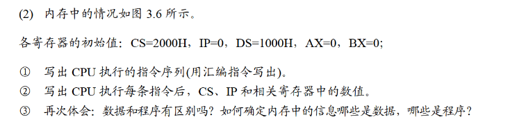

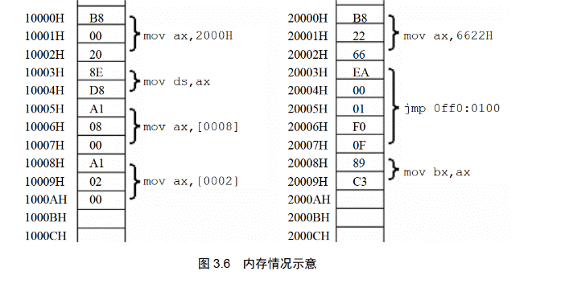

1）


```asm
mov ax, 6622H
jmp 0FF0: 0100
mov ax, 2000H
mov ds, ax
mov ax, [0008]
mov ax, [0002]
```

2）


```asm
mov ax, 6622H       # AX=6622,IP=0003,CS=2000
jmp 0FF0: 0100      # CS=0FF0,IP=0100,AX=6622
mov ax, 2000H       # AX=2000,IP=0103,CS=0FF0
mov ds, ax          # DS=2000,IP=0105
mov ax, [0008]      # AX=C389,IP=0108
mov ax, [0002]      # AX=EA66,IP=010B,CS=0FF0，DS=2000
```

3）

- 数据和程序没有区别，取决于CPU对它的解释方式
- 程序员决定的，代码段为CS访问、数据段为DS访问


### P70(1)（2）

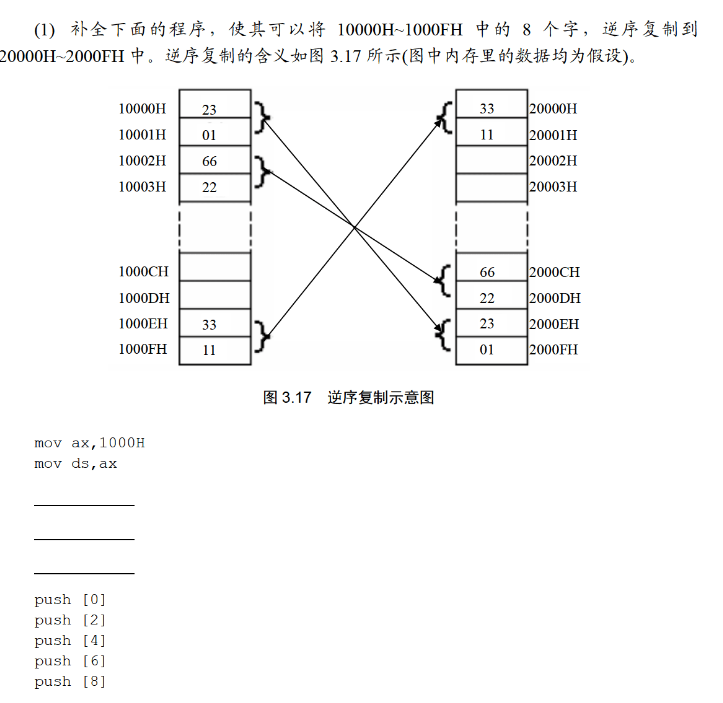

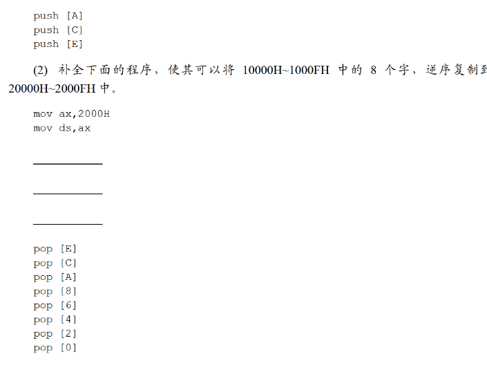

1）


```asm
mov ax,1000H
mov ds,ax

mov ax,2000H
mov ss,ax
mov sp,10H

push [0]
push [2]
push [4]
push [6]
push [8]
push [A]
push [C]
push [E]
```

2）


```asm
mov ax,2000H
mov ds,ax

mov ax,1000H
mov ss,ax
mov sp,10H

pop [E]
pop [C]
pop [A]
pop [8]
pop [6]
pop [4]
pop [2]
pop [0]
```


### P45实验

1）

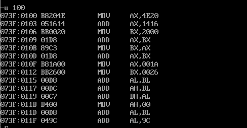

2）

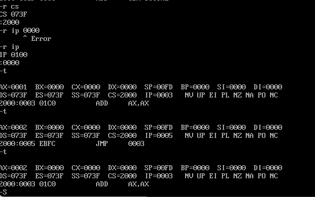

3）

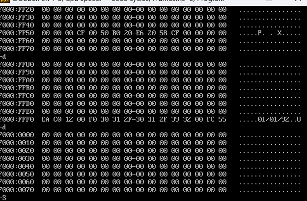

由于是ROM，所以无法修改

4）

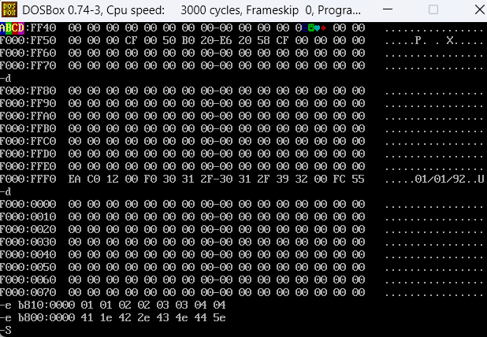

屏幕上方偏右为 `b81000` 的改变，屏幕左上角为 `b80000` 的改变


### P74 实验

1）

**初始状态**

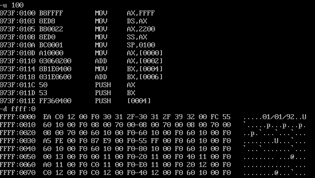

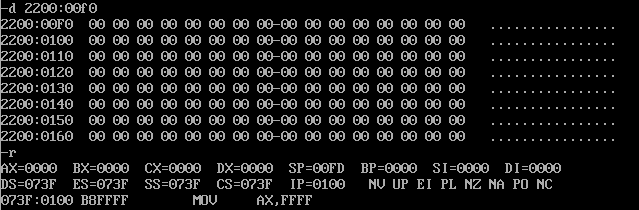

**运行**

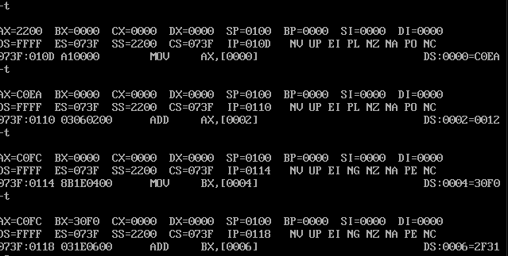


```asm
mov ax,[0]  #ax=C0EA
mov ax,[2]  #ax=C0FC
mov bx,[4]  #bx=30F0
mov bx,[6]  #bx=6021
```

**栈部分**

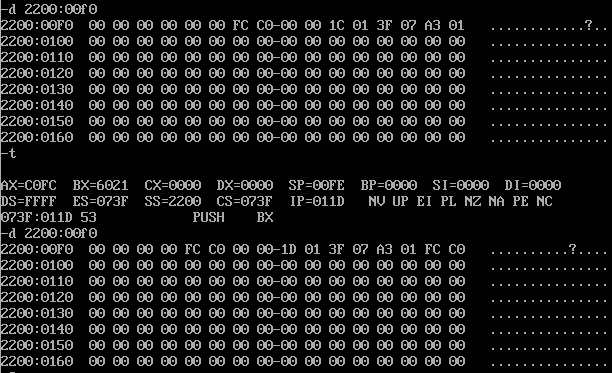

依次类推


```asm
push ax        ; sp=00FE ; 修改的内存单元地址是2200:00FE~00FF 内容为AX
push bx        ; sp=00FC ; 修改的内存单元地址是2200:00FC~00FD 内容为BX
pop ax         ; sp=00FE ; ax=原BX
pop bx         ; sp=0100 ; bx=原AX

push [4]       ; sp=00FE ; 修改的内存单元地址是2200:00FE~00FF 内容为[4]
push [6]       ; sp=00FC ; 修改的内存单元地址是2200:00FC~00FD 内容为[6]
```

2）

因为 `push` 指令会把数据写入栈顶，而栈段由 `SS` 指定、栈顶偏移由 `SP` 指定。本题中 `SS=2200H，SP=0100H`，执行 `push` 时，CPU 先将 `SP` 减 2，再把一个字写入 `2200:00FE`、`2200:00FC` 等单元，因此这些内存内容发生变化。`pop` 只从这些单元取数据并修改 `SP`，一般不清除原内存内容。


## 第二次作业


### P94 实验三

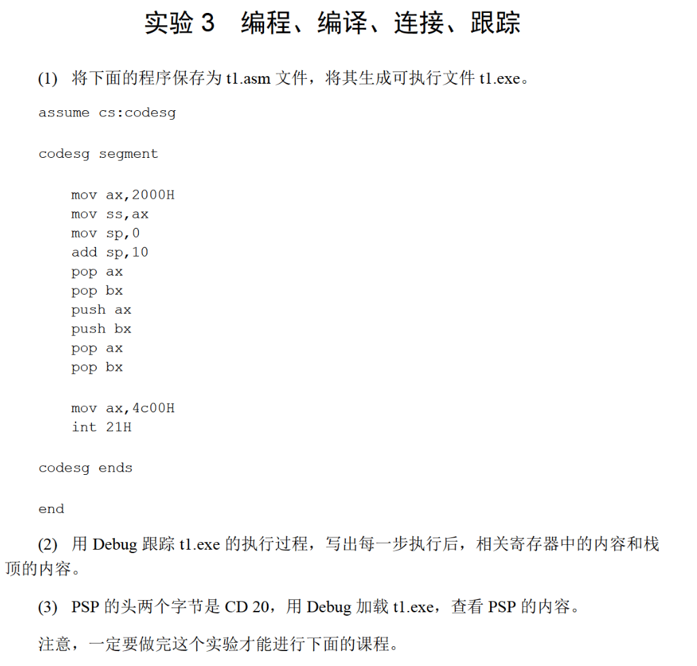

（1）

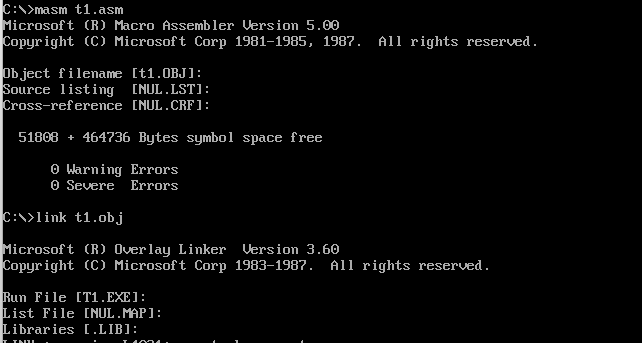

（2）

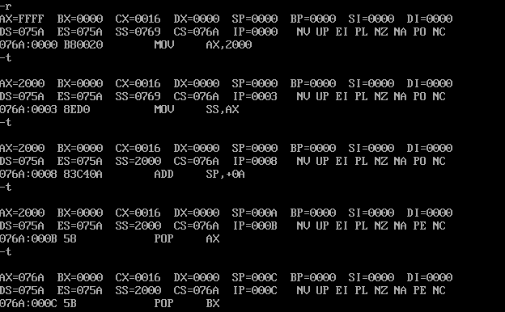

等等等，具体答案见下：

| 步骤 | 执行后的指令 | AX | BX | SS | SP | 栈顶内容 |
| --- | --- | --- | --- | --- | --- | --- |
| 1 | `mov ax,2000H` | 2000H | 0000H | 0769H | 0000H | 原值 |
| 2 | `mov ss,ax`、`mov sp,0` | 2000H | 0000H | 2000H | 0000H | `[2000:0000]` |
| 3 | `add sp,10` | 2000H | 0000H | 2000H | 000AH | 076AH |
| 4 | `pop ax` | 076AH | 0000H | 2000H | 000CH | `Y` |
| 5 | `pop bx` | 076AH | `Y` | 2000H | 000EH | `Z` |
| 6 | `push ax` | 076AH | `Y` | 2000H | 000CH | 076AH |
| 7 | `push bx` | 076AH | `Y` | 2000H | 000AH | `Y` |
| 8 | `pop ax` | `Y` | `Y` | 2000H | 000CH | 076AH |
| 9 | `pop bx` | `Y` | 076AH | 2000H | 000EH | `Z` |
| 10 | `mov ax,4C00H` | 4C00H | 076AH | 2000H | 000EH | `Z` |
| 11 | `int 21H` | 4C00H | 076AH | 2000H | 000EH | `Z` |

（3）

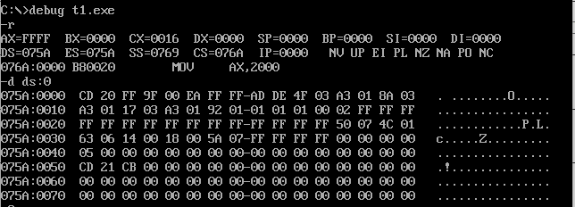


### P121 实验四

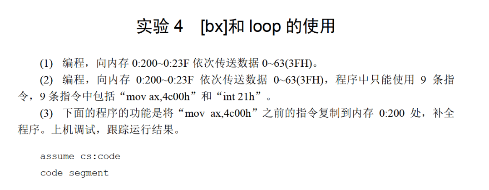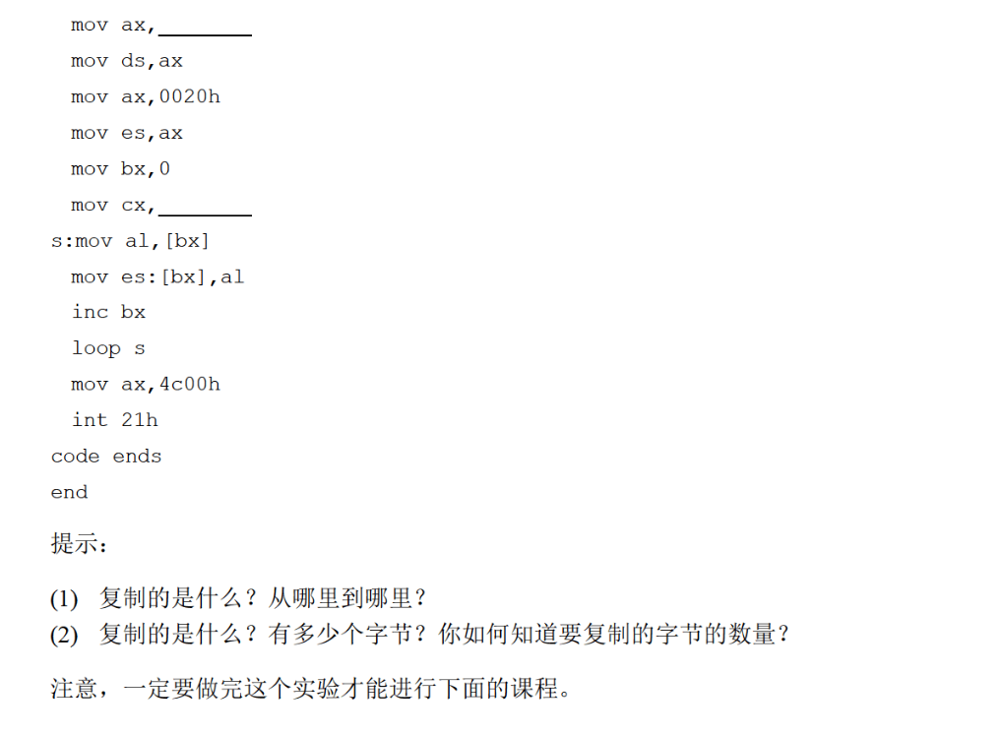

（1）（2）


```asm
assume cs:code
code segment

    mov ax,0020h
    mov ds,ax
    mov bx,0
    mov cx,40h

s:  mov [bx],bl
    inc bx
    loop s

    mov ax,4c00h
    int 21h

code ends
end
```

(3)

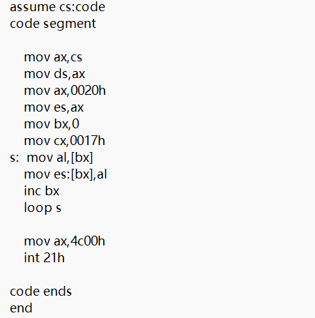

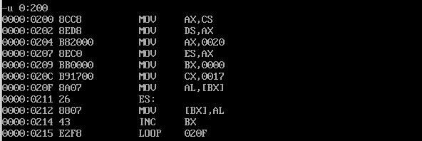


### P133 实验五

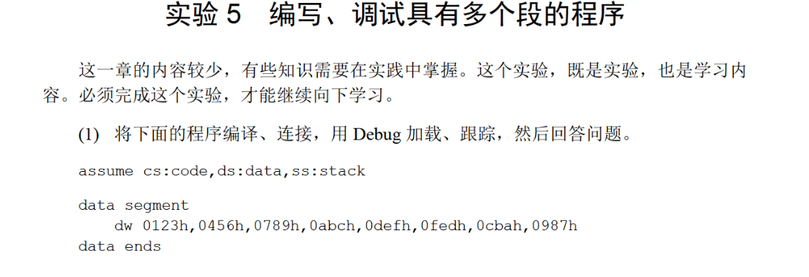

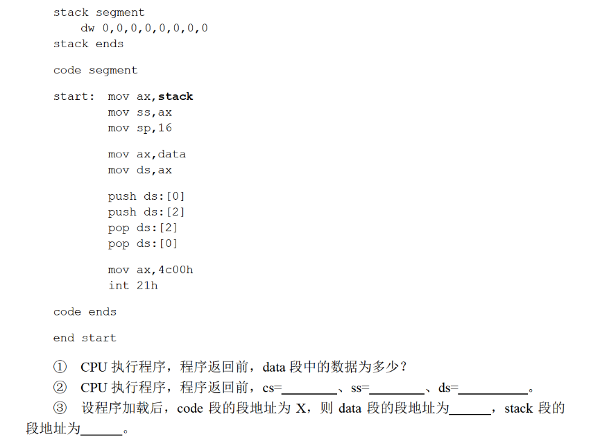

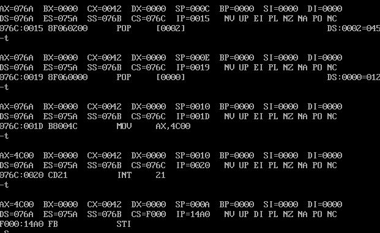

1. `0123H，0456H，0789H，0ABCH，0DEFH，0FEDH，0CBAH，0987H`
2. `cs=076Ch、ss=076Bh、ds=076Ah`
3. `data` 的段地址 `076Ah` ；`stack` 的段地址 `076Bh`

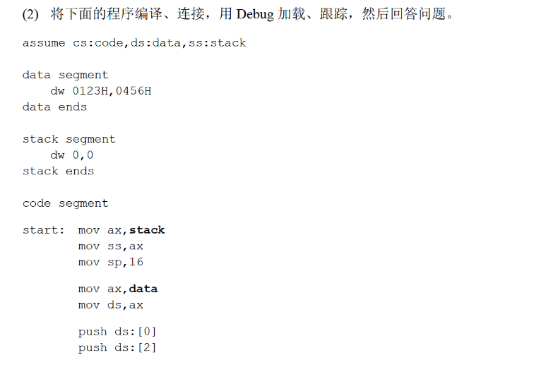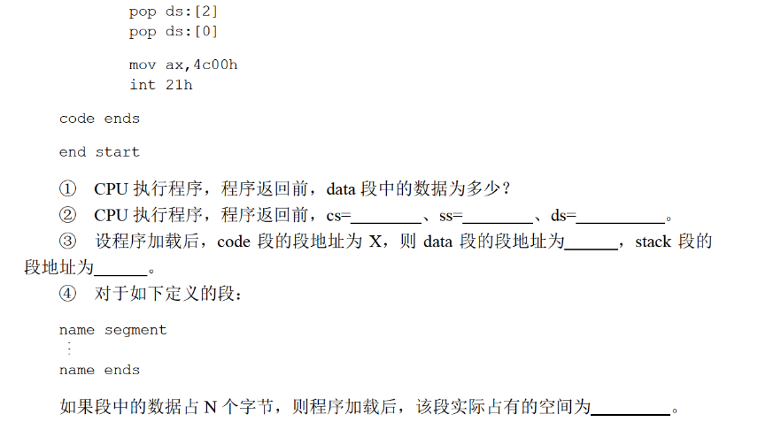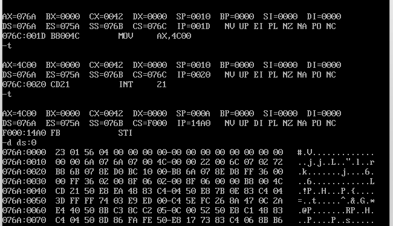

1. `0123h, 0456h`
2. `asm
   cs = 076Ch
   ss = 076Bh
   ds = 076Ah`
3. `data 段地址 = 076Ah
   stack 段地址 = 076Bh`
4. `asm
   ((N + 15) / 16) × 16 字节`

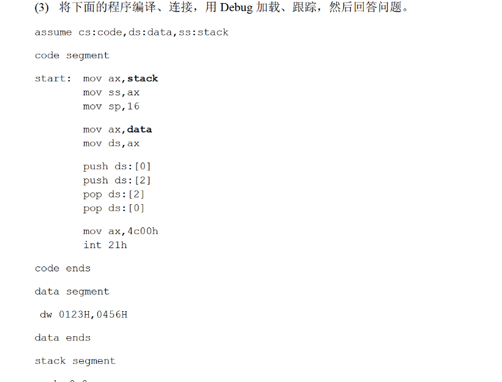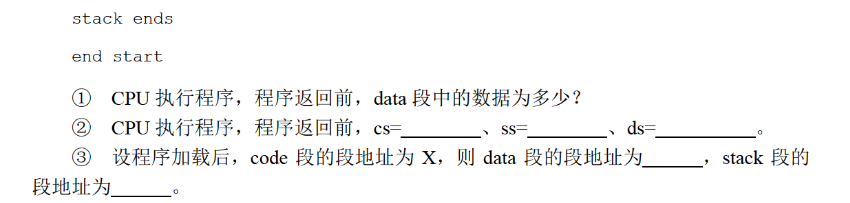

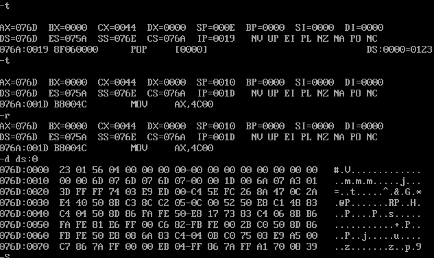

1. `0123h, 0456h`
2. `cs=076Ah，ss=076Eh，ds=076Dh`
3. `data` 段地址为 `076Dh`，`stack` 段地址为 `076Eh`

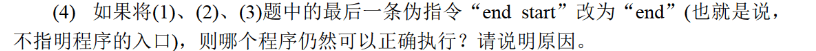

只有第(3)个程序仍然可以正确执行。因为去掉 `start` 以后，程序入口不再被显式指定，只有当程序最前面就是代码段，并且段首正好是应执行的指令时，CPU 才能正确从那里开始执行。第(1)、第(2)个程序的最前面都是数据段，CPU 会把数据当作指令执行，所以不能正确运行。

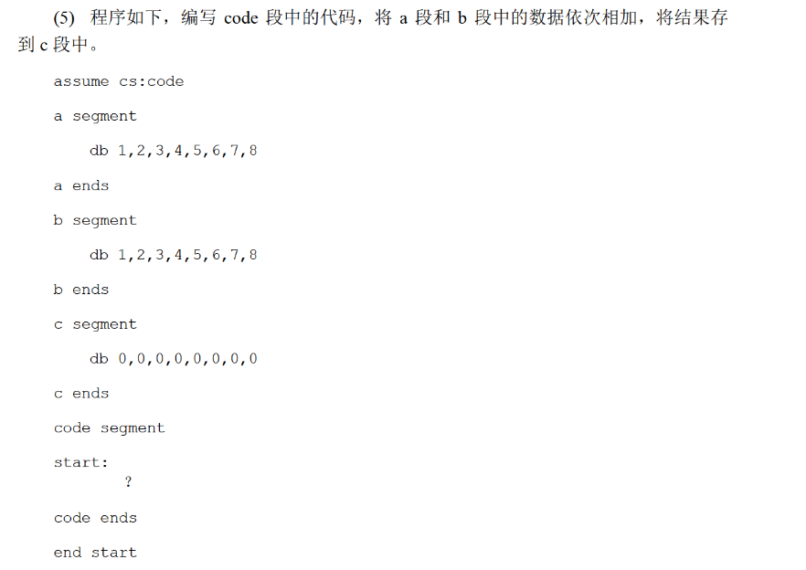


```asm
code segment
start:
    mov ax,c
    mov es,ax
    mov di,0

    mov cx,8
    mov bx,0

s:
    mov ax,a
    mov ds,ax
    mov al,[bx]

    mov ax,b
    mov ds,ax
    add al,[bx]

    mov es:[di],al

    inc bx
    inc di
    loop s

    mov ax,4c00h
    int 21h
code ends

end start
```

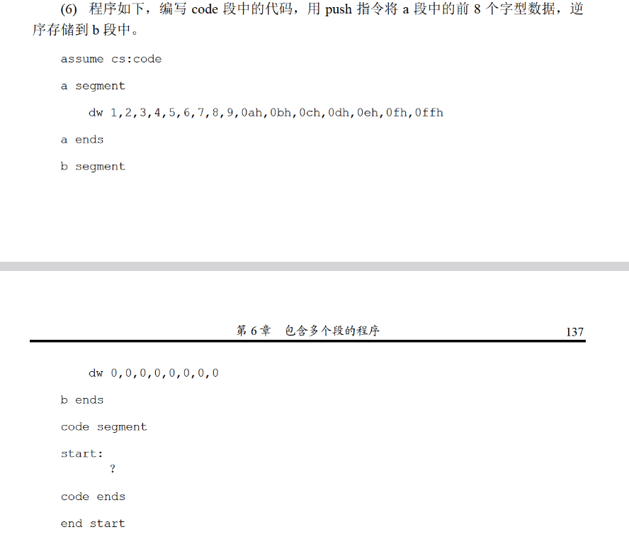


```asm
code segment
start:
    mov ax,stack
    mov ss,ax
    mov sp,32

    mov ax,a
    mov ds,ax

    mov bx,0
    mov cx,8

s1:
    push word ptr [bx]
    add bx,2
    loop s1

    mov ax,b
    mov ds,ax

    mov bx,0
    mov cx,8

s2:
    pop word ptr [bx]
    add bx,2
    loop s2

    mov ax,4c00h
    int 21h
code ends

end start
```


### P160 实验六

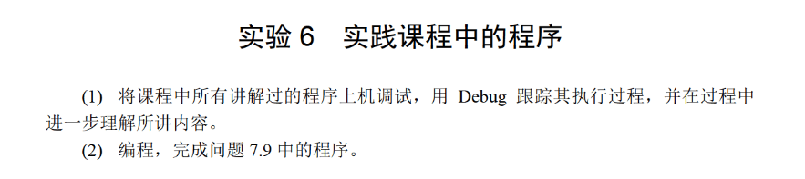

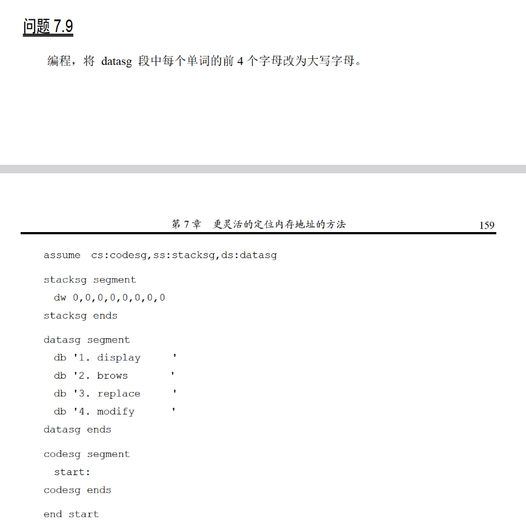


```asm
assume cs:codesg,ss:stacksg,ds:datasg

stacksg segment
    dw 0,0,0,0,0,0,0,0
stacksg ends

datasg segment
    db '1. display      '
    db '2. brows        '
    db '3. replace      '
    db '4. modify       '
datasg ends

codesg segment
start:
    mov ax,stacksg
    mov ss,ax
    mov sp,16

    mov ax,datasg
    mov ds,ax

    mov bx,3          ; 每行单词的起始偏移
    mov cx,4          ; 共 4 行

s1:
    mov si,0
    mov di,4          ; 每行处理 4 个字母

s2:
    and byte ptr [bx+si],11011111b
    inc si
    dec di
    jnz s2

    add bx,16         ; 跳到下一行
    loop s1

    mov ax,4c00h
    int 21h
codesg ends

end start
```


## 第三次作业


### 实验七

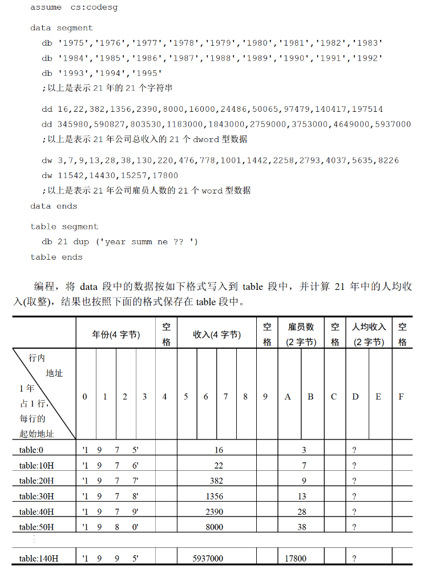


```asm
assume cs:codesg,ds:data,es:table

data segment
    db '1975','1976','1977','1978','1979','1980','1981','1982','1983'
    db '1984','1985','1986','1987','1988','1989','1990','1991','1992'
    db '1993','1994','1995'

    dd 16,22,382,1356,2390,8000,16000,24486,50065,97479,140417,197514
    dd 345980,590827,803530,1183000,1843000,2759000,3753000,4649000,5937000

    dw 3,7,9,13,28,38,130,220,476,778,1001,1442,2258,2793,4037,5635,8226
    dw 11542,14430,15257,17800
data ends

table segment
    db 21 dup ('year summ ne ?? ')
table ends

codesg segment
start:
    mov ax,data
    mov ds,ax

    mov ax,table
    mov es,ax

    mov bx,0
    mov si,0
    mov di,0
    mov cx,21

s:
    mov ax,[si]
    mov es:[bx],ax
    mov ax,[si+2]
    mov es:[bx+2],ax

    mov ax,[si+54h]
    mov es:[bx+5],ax
    mov ax,[si+56h]
    mov es:[bx+7],ax

    mov ax,[di+0a8h]
    mov es:[bx+0ah],ax

    mov ax,[si+54h]
    mov dx,[si+56h]
    div word ptr [di+0a8h]
    mov es:[bx+0dh],ax

    add bx,10h
    add si,4
    add di,2
    loop s

    mov ax,4c00h
    int 21h
codesg ends

end start
```


### 实验八

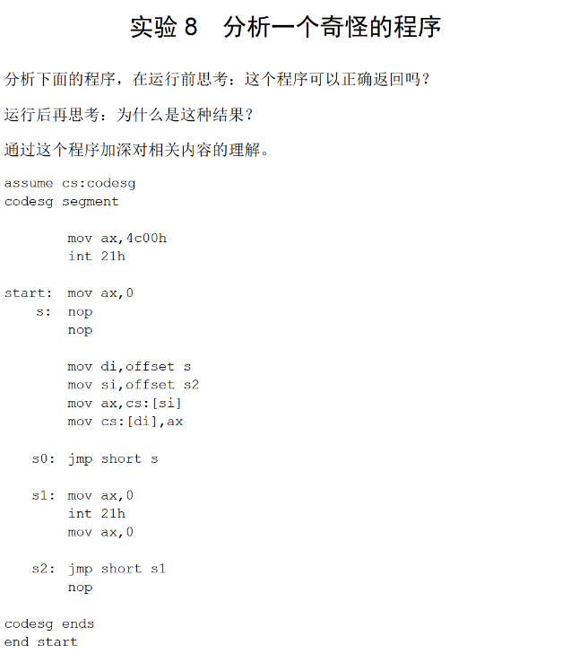

程序能够正确返回。程序从 `start` 开始执行，先将 `s2` 处 `jmp short s1` 的机器码复制到 `s` 处，把 `s` 处原来的两条 `nop` 改写成一条短跳转指令。`s2` 处这条跳转的机器码为 `EB F6`，其位移是相对于当前指令下一地址计算的。该机器码放在 `0020H` 时，跳转目标是 `0018H`，也就是 `s1`；该机器码被复制到 `0008H` 后，下一地址变为 `000AH`，按同样位移计算，跳转目标变成 `0000H`。因此程序执行 `s0: jmp short s` 后，会先跳到 `s`，再由改写后的 `s` 跳到 `0000H`，从而执行最前面的 `mov ax,4c00h` 和 `int 21h`，程序正常返回。

这个程序说明：复制带相对位移的转移指令时，复制后的实际跳转目标由新位置决定。


### 实验九

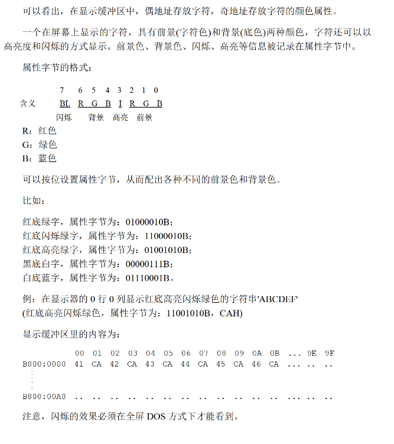

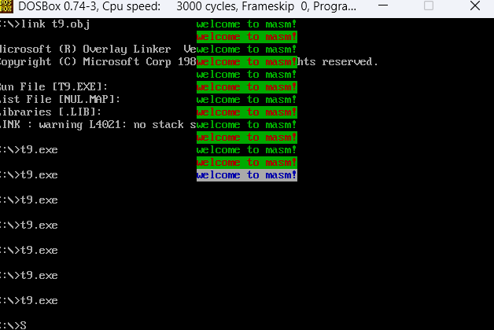


### 检测点10.5

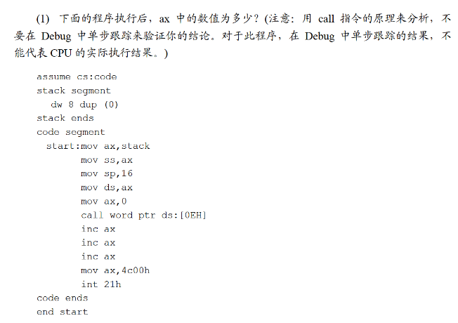

第一问中，`call word ptr ds:[0EH]` 执行时，由于 `DS=SS` 且 `SP=0010H`，返回偏移被压入 `SS:000EH`，从而使 `ds:[0EH]` 变成该返回偏移。于是调用转到 `call` 后第一条 `inc ax`，三次自增后得到 `AX=0003H`。

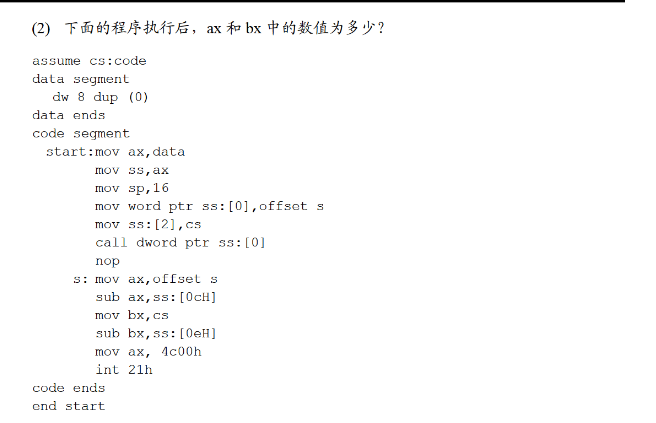

第二问中，`call dword ptr ss:[0]` 先保存返回 `CS` 和返回 `IP`，再转到 `s`。其中 `ss:[0CH]` 为返回偏移，它比 `offset s` 小 1，所以 `AX=0001H`；`ss:[0EH]` 为返回段地址，它与当前 `CS` 相同，所以 `BX=0000H`。


### 实验十


#### show-str


```asm
show_str:
    push ax
    push bx
    push cx
    push dx
    push si
    push di
    push es

    mov ax,0b800h
    mov es,ax

    mov al,dh
    mov ah,0
    mov bx,160
    mul bx
    mov di,ax

    mov al,dl
    mov ah,0
    add ax,ax
    add di,ax

s_show:
    mov al,[si]
    cmp al,0
    je show_ok
    mov es:[di],al
    mov es:[di+1],cl
    inc si
    add di,2
    jmp short s_show

show_ok:
    pop es
    pop di
    pop si
    pop dx
    pop cx
    pop bx
    pop ax
    ret
```


#### divdw


```asm
divdw:
    push bx

    mov bx,ax
    mov ax,dx
    mov dx,0
    div cx
    push ax

    mov ax,bx
    div cx
    mov cx,dx
    pop dx

    pop bx
    ret
```


#### dtoc


```asm
dtoc:
    push ax
    push bx
    push cx
    push dx
    push di

    mov di,si
    mov bx,10
    mov cx,0

    cmp ax,0
    jne dtoc_loop
    mov byte ptr [di],'0'
    mov byte ptr [di+1],0
    jmp short dtoc_done

dtoc_loop:
    mov dx,0
    div bx
    add dl,30h
    push dx
    inc cx
    cmp ax,0
    jne dtoc_loop

dtoc_out:
    pop dx
    mov [di],dl
    inc di
    loop dtoc_out

    mov byte ptr [di],0

dtoc_done:
    pop di
    pop dx
    pop cx
    pop bx
    pop ax
    ret
```


#### 总

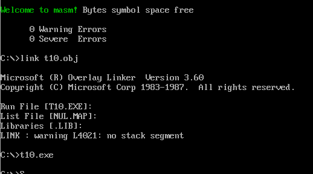


```asm
assume cs:code,ds:data

data segment
    db 'Welcome to masm!',0
data ends

code segment
start:
    mov dh,8
    mov dl,3
    mov cl,2
    mov ax,data
    mov ds,ax
    mov si,0
    call show_str

    mov ax,4c00h
    int 21h

show_str:
    push ax
    push bx
    push cx
    push dx
    push si
    push di
    push es

    mov ax,0b800h
    mov es,ax

    mov al,dh
    mov ah,0
    mov bx,160
    mul bx
    mov di,ax

    mov al,dl
    mov ah,0
    add ax,ax
    add di,ax

s_show:
    mov al,[si]
    cmp al,0
    je show_ok
    mov es:[di],al
    mov es:[di+1],cl
    inc si
    add di,2
    jmp short s_show

show_ok:
    pop es
    pop di
    pop si
    pop dx
    pop cx
    pop bx
    pop ax
    ret

code ends
end start
```
