# 编译原理

!!! note
    本笔记按《编译原理》教材 12 章顺序整理。正文沿着同一条顺序推进，章内也尽量保持教材原有的知识依赖关系，同时用教学PPT作为补充

> 第一次学编译原理时，可以始终沿着 源程序先被看成什么对象 -> 当前阶段接收什么输入 -> 这一阶段输出什么结构 -> 下一阶段为何需要这个结果 -> 理论正确性与工程实现各自承担什么职责 这条线往前走。把定义、文法、自动机、属性、三地址代码、控制流图和数据流方程都放回这条线以后，整门课会连成一件事。

## 第一章 引论

### 前置知识

**计算机语言的发展**：

- 机器语言：0，1序列表示机器指令
- 汇编语言：在机器语言的基础上增加了助记符
- 高级语言：定义了数据、描述算法
- 命令语言：控制系统的工作，以功能封装为特征

**高级语言的分类**：

- 命令（强制）式语言：FORTRAN、BASIC、Pascal
- 函数式语言：LISP、ML
- 逻辑式语言：Prolog
- 面向对象语言：Smalltalk、C++、Java

而计算机上执行一个高级程序一般分为两步：

- **编译** 程序将高级语言翻译成机器语言
- **运行** 所得到的机器语言程序得到计算结果

---

### 1.1 语言处理器

==编译程序(Compiler)==

**编译器** 本质上是一个程序，用来将 `高级程序设计语言编写的程序代码` 翻译成 `另一种语言所表达的等价的程序代码`

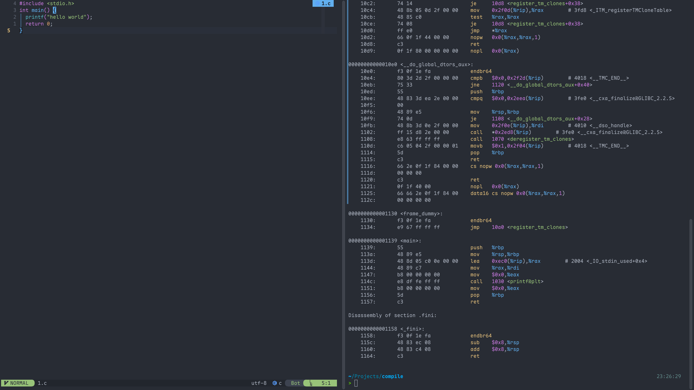

> 如图所示，左边为 `高级程序设计语言编写的程序代码`; 右边为 `另一种语言所表达的等价的程序代码`.
>
> 左边到右边就是一个叫做 `gcc` 的编译器的程序运行的结果

==解释程序==

以语言写的源程序作为输入，但不产生目标程序，而是边解释边执行源代码本身

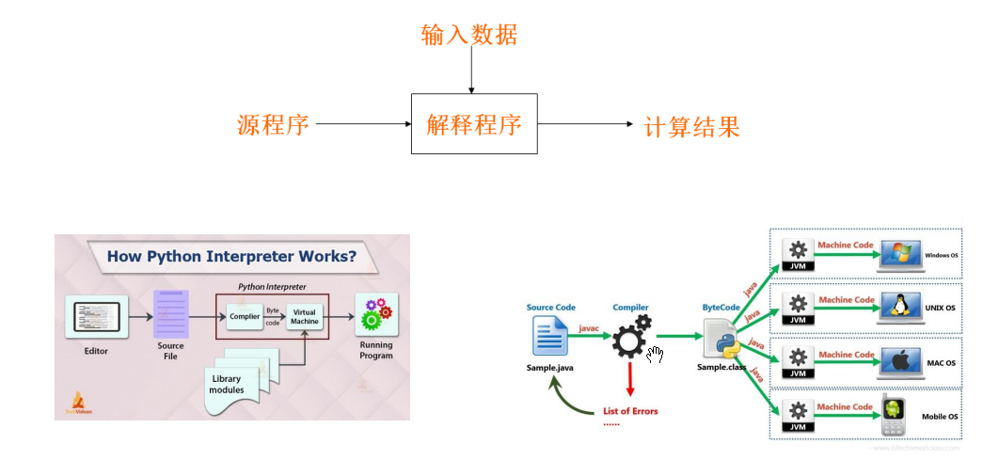

> 简单理解的话，解释程序就是内置了一个虚拟机，然后虚拟机里面构建一个解释器、即时编译器，以此提供一个实时运行环境

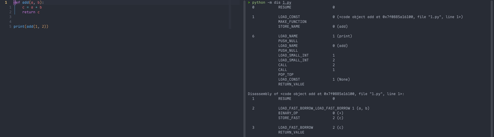

> 如上图，左边是python的源码，右边是字节码。
>
> 输出里出现 `LOAD_FAST`、`BINARY_OP`、`STORE_FAST`、`RETURN_VALUE` 这类指令。它们就是 `CPython` 虚拟机真正读取的内部指令序列。`LOAD_FAST a` 表示从当前调用帧的局部变量槽读取 `a`，`BINARY_OP +` 表示执行加法语义，`RETURN_VALUE` 表示从当前帧返回结果。这里观察到的是“虚拟机指令层”，它介于源代码和机器码之间。

---

### 1.2 一个编译器的结构

编译器可以看作一个把 **源程序** 映射为 **语义等价的目标程序** 的语言处理系统。这个映射过程通常分为两大部分：

- **分析部分**：把源程序分解成多个组成要素，检查它们是否符合语言规则，并建立源程序的中间表示

- **综合部分**：根据中间表示和符号表信息，生成用户期望的目标程序

> 分析部分通常称为编译器的 **前端**，综合部分通常称为编译器的 **后端**。

**分析部分的主要任务** 是理解源程序。它会检查源程序是否符合词法、语法和语义规则。如果发现错误，需要给出有用的错误信息，帮助用户修改程序。同时，分析部分还会收集源程序中的标识符、类型、作用域等信息，并把这些信息保存在 **符号表** 中。符号表会和中间表示一起传递给后续阶段使用。

**综合部分的主要任务** 是生成目标程序。它根据前端产生的中间表示和符号表信息，构造目标代码。目标代码可以是汇编语言、机器语言，也可以是另一种高级语言。综合部分通常还会进行代码优化，使目标程序运行得更快、占用空间更少或执行效率更高。

一个典型编译器可以分成多个 **步骤或阶段**，每个阶段把源程序的一种表示形式转换成另一种表示形式。常见阶段如下图所示，这些阶段在实际编译器中不一定严格分开，某些阶段可以合并执行，也可以省略某些优化步骤。

| 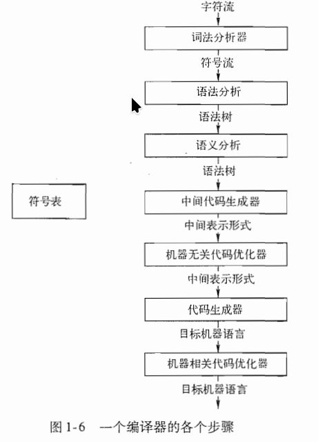 | 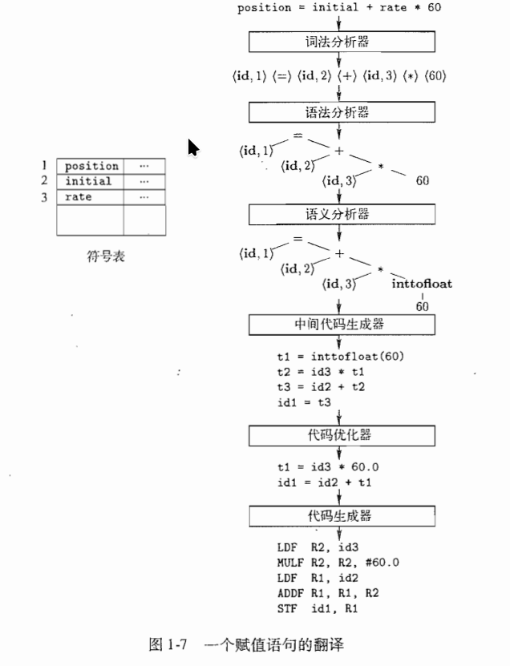 |
| ------------------------------------------------------------ | ------------------------------------------------------------ |

---

==词法分析==

**词法分析**是编译器的第一个阶段，也叫扫描。它读取源程序的字符流，并把字符序列组织成有意义的词素，然后生成词法单元。词法单元通常表示为：

$$
<token-name, attribute-value>
$$

其中，

- `token-name` 表示词法类别，例如标识符、运算符、常量等；
- `attribute-value` 通常指向符号表中的相关条目。

!!! tip

	例如：
	
	$$
	position = initial + rate * 60\tag{1.1}
	$$
	
	经过词法分析后，可以得到类似下面的词法单元序列：
	
	$$
	<id, 1> <=> <id, 2> <+> <id, 3> <*> <60>
	$$
	
	其中,词法分析阶段通常会忽略空格、换行和注释等无实际语义作用的内容。
	
	- `position`、`initial`、`rate` 是标识符，会在符号表中建立条目 `<id, 1>` 、 `<id, 2>` 、 `<id, 3>`
	
	- `=`、`+`、`*` 是运算符；
	
	- `60` 是常量

---

==语法分析==

**语法分析** 也叫解析。它接收词法分析器产生的词法单元序列，并根据语言的语法规则构造树形结构，常见形式是 **语法树**。语法树反映程序结构，例如表达式中运算符的优先级和结合关系。

功能上，它可以实现：

1. 实现组词成句
2. 构造分析树
3. 检查并指出语法错误
4. 指导翻译

它的输入和输出为：

1. 输入：Token序列
2. 输出：语法成分及其结构

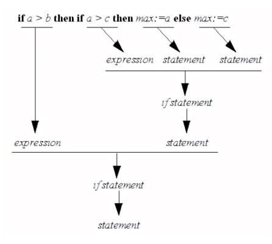

!!!Tip

	在 `position = initial + rate * 60` 中，乘法优先于加法，因此语法树会先表示 `rate * 60`，再表示 `initial + (...)`，最后表示赋值给 `position`。
	
	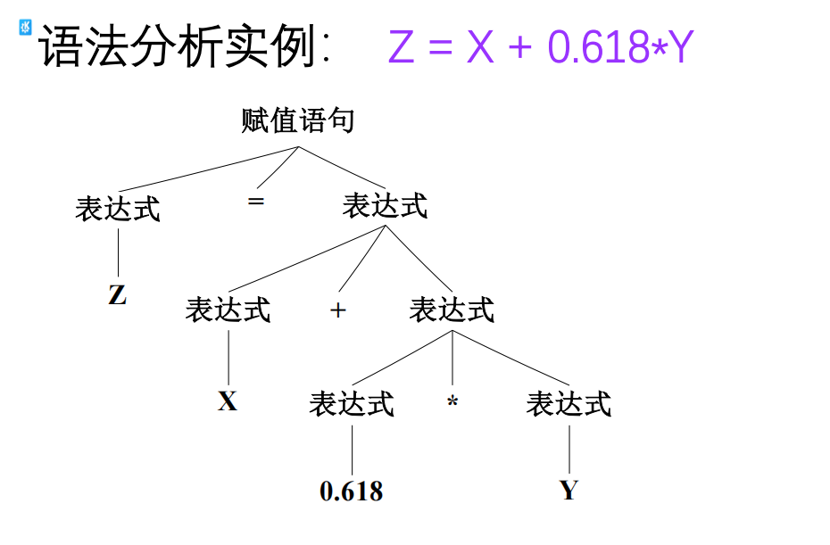

---

==语义分析==

**语义分析** 使用语法树和符号表中的信息，检查源程序是否符合语言的语义规则。

它的一个重要任务是 **类型检查**。例如，如果 `rate` 是浮点数，而 `60` 是整数，那么在计算 `rate * 60` 时，语义分析器可能会插入一个从整数到浮点数的类型转换操作，即把 `60` 转换为 `60.0`。这种由编译器自动完成的类型转换称为 **自动类型转换** 或 **强制类型转换**。

---

==中间代码生成==

**中间代码生成** 是在语法分析和语义分析之后进行的。编译器通常不会直接从语法树生成最终机器代码，而是先生成一种较低级、较接近机器语言但又与具体机器无关的中间表示。常见形式是 **三地址代码**，每个指令具有三个运算分量，每个运算分量都像一个寄存器。例如：

```text
t1 = inttofloat(60)
t2 = id3 * t1
t3 = id2 + t2
id1 = t3
```

三地址代码的特点是每条指令通常只包含一个主要运算，便于后续优化和目标代码生成。这里的 `t1`、`t2`、`t3` 是编译器生成的临时变量，用来保存中间计算结果。

!!! important

	需要注意的是:
	
	1. 每个三地址赋值指令的右部最多只有一个运算符，因此这些指令确定了运算完成的顺序。
	
	2. 编译器应该生成一个临时名字以存放一个三地址指令计算得到的值
	
	3. 有些三地址指令的运算分量少于三个

---

==代码优化==

**代码优化** 用于改进中间代码，使生成的目标代码质量更高。优化的目标通常包括提高运行速度、减少存储空间、减少不必要的计算等。例如，上面的中间代码中，`inttofloat(60)` 可以在编译时直接完成，把整数常量 `60` 转换为浮点常量 `60.0`，从而得到更简洁的代码：

```text
t1 = id3 * 60.0
id1 = id2 + t1
```

这种优化属于 **机器无关优化**，因为它不依赖具体处理器的寄存器、指令集或存储结构。

**与机器无关优化**：

- 局部优化：
    - 常量合并：常数运算在编译期间完成
    - 提取公共子表达式
- 循环优化：
    - 强度削减
    - 代码外提

**与机器有关的优化**

- 寄存器的利用：变量放入寄存器，减少访问内存的次数
- 体系结构：SIMD、MIMD、向量机
- 存储策略：根据算法访存的要求安排Cache、并行存储体系
- 任务规划：按照运行的算法，划分子任务

---

==代码生成==

**代码生成** 阶段把中间表示翻译成目标语言。

如果目标语言是机器代码，代码生成器需要为变量和临时值分配寄存器或内存位置，并把中间代码转换成具体机器指令。

例如：

```text
LDF  R2, id3
MULF R2, R2, #60.0
LDF  R1, id2
ADDF R1, R1, R2
STF  id1, R1
```

这段代码表示：把 `id3` 的值加载到寄存器 `R2`，与浮点常量 `60.0` 相乘；再把 `id2` 加载到寄存器 `R1`，与 `R2` 相加；最后把结果存入 `id1`。这里的 `F` 表示浮点运算，`#60.0` 表示立即数常量。

---

==符号表管理==

**符号表管理** 贯穿编译过程。符号表用于保存源程序中名字的各种属性，例如变量名、类型、作用域、存储位置、函数参数数量、函数参数类型和返回类型等。词法分析、语法分析、语义分析、中间代码生成和代码生成等阶段都可能访问或更新符号表。一个高效的符号表结构应当支持快速插入、查找和修改。

---

==将多个步骤组合成趟==

**多个步骤组合成趟**。一趟表示编译器完整读入一次输入文件并产生一次输出文件。某些编译器可能把词法分析、语法分析、语义分析和中间代码生成组合成一趟；代码优化可以作为单独一趟；代码生成也可以作为单独一趟。实际实现中，阶段划分取决于编译器设计目标、语言复杂度和目标机器特性。

**前端和后端可以相对独立设计**。前端主要负责源语言相关的工作，例如词法、语法、语义和中间表示生成；后端主要负责目标机器相关的工作，例如指令选择、寄存器分配和目标代码生成。如果多个源语言前端使用同一种中间表示，就可以共享同一个后端；如果一个前端连接多个不同后端，就可以把同一种源语言编译到不同目标机器上。

---

==编译器构造工具==

**编译器构造工具**可以帮助自动生成编译器的某些组成部分。常见工具包括：

- 语法分析器生成器：根据一个程序设计语言的语法描述自动生成语法分析器
- 扫描器生成器：可以根据一个语言的语法单元的正则表达式描述生成词法分析器
- 语法制导的翻译引擎：可以生成一组用于遍历分析树并生成中间代码的例程
- 代码生成器生成器：依据一组关于如何把中间语言的每个运算翻译成为目标机上的机器语言的规则，生成一个代码生成器
- 数据流分析引擎：可以帮助收集数据流信息，即程序中的值如何从程序的一个部分传递到另一部分。数据流分析是代码优化的一个重要部分
- 编译器构造工具集：提供了可用于构造编译器的不同阶段的例程的完整集合

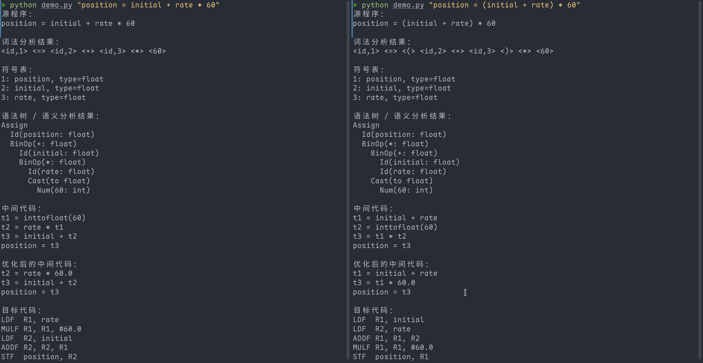

> 上图为模拟的编译过程，左边没有加括号，右边加了括号，可以看看一些细小的区别。python代码如下

??? 点击查看简单编译代码

	```python
	from __future__ import annotations
	from dataclasses import dataclass
	import re
	import sys
	
	@dataclass
	class Token:
	    kind: str
	    value: object
	    text: str
	
	    def show(self) -> str:
	        if self.kind == "ID":
	            return f"<id,{self.value}>"
	        if self.kind == "NUM":
	            return f"<{self.text}>"
	        return f"<{self.text}>"
	
	@dataclass
	class Id:
	    name: str
	    typ: str | None = None
	
	@dataclass
	class Num:
	    value: str
	    typ: str | None = None
	
	@dataclass
	class BinOp:
	    op: str
	    left: object
	    right: object
	    typ: str | None = None
	
	@dataclass
	class Cast:
	    to_type: str
	    expr: object
	    typ: str | None = None
	
	@dataclass
	class Assign:
	    target: Id
	    expr: object
	
	class Lexer:
	    token_re = re.compile(r"\s*(?:(?P<ID>[A-Za-z_]\w*)|(?P<NUM>\d+(?:\.\d+)?)|(?P<OP>[=+*()]))")
	
	    def __init__(self, symbols: dict[str, dict]):
	        self.symbols = symbols
	        self.symbol_order: list[str] = list(symbols.keys())
	
	    def symbol_index(self, name: str) -> int:
	        if name not in self.symbols:
	            self.symbols[name] = {"type": "int"}
	            self.symbol_order.append(name)
	        return self.symbol_order.index(name) + 1
	
	    def tokenize(self, text: str) -> list[Token]:
	        pos = 0
	        tokens: list[Token] = []
	        while pos < len(text):
	            m = self.token_re.match(text, pos)
	            if not m:
	                raise SyntaxError(f"无法识别的字符：{text[pos]!r}")
	            pos = m.end()
	
	            if m.group("ID"):
	                name = m.group("ID")
	                tokens.append(Token("ID", self.symbol_index(name), name))
	            elif m.group("NUM"):
	                n = m.group("NUM")
	                tokens.append(Token("NUM", n, n))
	            else:
	                op = m.group("OP")
	                tokens.append(Token(op, op, op))
	
	        tokens.append(Token("EOF", None, "EOF"))
	        return tokens
	
	class Parser:
	    def __init__(self, tokens: list[Token], symbols: dict[str, dict], symbol_order: list[str]):
	        self.tokens = tokens
	        self.i = 0
	        self.symbols = symbols
	        self.symbol_order = symbol_order
	
	    def peek(self) -> Token:
	        return self.tokens[self.i]
	
	    def eat(self, kind: str) -> Token:
	        tok = self.peek()
	        if tok.kind != kind:
	            raise SyntaxError(f"期望 {kind}，实际得到 {tok.text}")
	        self.i += 1
	        return tok
	
	    def id_name(self, index: int) -> str:
	        return self.symbol_order[index - 1]
	
	    def parse(self) -> Assign:
	        left = self.eat("ID")
	        self.eat("=")
	        expr = self.expr()
	        self.eat("EOF")
	        return Assign(Id(self.id_name(left.value)), expr)
	
	    def expr(self):
	        node = self.term()
	        while self.peek().kind == "+":
	            op = self.eat("+").text
	            node = BinOp(op, node, self.term())
	        return node
	
	    def term(self):
	        node = self.factor()
	        while self.peek().kind == "*":
	            op = self.eat("*").text
	            node = BinOp(op, node, self.factor())
	        return node
	
	    def factor(self):
	        tok = self.peek()
	
	        if tok.kind == "ID":
	            self.eat("ID")
	            return Id(self.id_name(tok.value))
	
	        if tok.kind == "NUM":
	            self.eat("NUM")
	            return Num(tok.value)
	
	        if tok.kind == "(":
	            self.eat("(")
	            node = self.expr()
	            self.eat(")")
	            return node
	
	        raise SyntaxError(f"不合法的表达式起点：{tok.text}")
	
	def infer_type(node, symbols: dict[str, dict]):
	    if isinstance(node, Id):
	        node.typ = symbols[node.name]["type"]
	        return node.typ
	
	    if isinstance(node, Num):
	        node.typ = "float" if "." in node.value else "int"
	        return node.typ
	
	    if isinstance(node, Cast):
	        infer_type(node.expr, symbols)
	        node.typ = node.to_type
	        return node.typ
	
	    if isinstance(node, BinOp):
	        lt = infer_type(node.left, symbols)
	        rt = infer_type(node.right, symbols)
	
	        if lt != rt:
	            if lt == "int" and rt == "float":
	                node.left = Cast("float", node.left, "float")
	                lt = "float"
	            elif lt == "float" and rt == "int":
	                node.right = Cast("float", node.right, "float")
	                rt = "float"
	            else:
	                raise TypeError(f"不支持的类型组合：{lt} {node.op} {rt}")
	
	        node.typ = "float" if lt == "float" or rt == "float" else "int"
	        return node.typ
	
	    raise TypeError(f"未知节点：{node}")
	
	def analyze(assign: Assign, symbols: dict[str, dict]) -> Assign:
	    assign.target.typ = symbols[assign.target.name]["type"]
	    rt = infer_type(assign.expr, symbols)
	
	    if assign.target.typ != rt:
	        if assign.target.typ == "float" and rt == "int":
	            assign.expr = Cast("float", assign.expr, "float")
	        else:
	            raise TypeError(f"不能把 {rt} 赋值给 {assign.target.typ}")
	
	    return assign
	
	@dataclass
	class Instr:
	    result: str
	    op: str
	    args: list[str]
	
	    def show(self) -> str:
	        if self.op == "assign":
	            return f"{self.result} = {self.args[0]}"
	        if self.op == "inttofloat":
	            return f"{self.result} = inttofloat({self.args[0]})"
	        return f"{self.result} = {self.args[0]} {self.op} {self.args[1]}"
	
	class TACGen:
	    def __init__(self):
	        self.code: list[Instr] = []
	        self.n = 0
	
	    def temp(self) -> str:
	        self.n += 1
	        return f"t{self.n}"
	
	    def emit_expr(self, node) -> str:
	        if isinstance(node, Id):
	            return node.name
	
	        if isinstance(node, Num):
	            return node.value
	
	        if isinstance(node, Cast):
	            src = self.emit_expr(node.expr)
	            t = self.temp()
	            self.code.append(Instr(t, "inttofloat", [src]))
	            return t
	
	        if isinstance(node, BinOp):
	            a = self.emit_expr(node.left)
	            b = self.emit_expr(node.right)
	            t = self.temp()
	            self.code.append(Instr(t, node.op, [a, b]))
	            return t
	
	        raise TypeError(node)
	
	    def generate(self, assign: Assign) -> list[Instr]:
	        rhs = self.emit_expr(assign.expr)
	        self.code.append(Instr(assign.target.name, "assign", [rhs]))
	        return self.code
	
	def optimize(code: list[Instr]) -> list[Instr]:
	    subst: dict[str, str] = {}
	    out: list[Instr] = []
	
	    for ins in code:
	        ins.args = [subst.get(a, a) for a in ins.args]
	
	        if ins.op == "inttofloat" and re.fullmatch(r"\d+", ins.args[0]):
	            subst[ins.result] = ins.args[0] + ".0"
	            continue
	
	        out.append(ins)
	
	    for ins in out:
	        ins.args = [subst.get(a, a) for a in ins.args]
	
	    return out
	
	def is_number(x: str) -> bool:
	    return bool(re.fullmatch(r"\d+(?:\.\d+)?", x))
	
	def codegen(code: list[Instr]) -> list[str]:
	    asm: list[str] = []
	    temp_reg: dict[str, str] = {}
	    reg_no = 1
	
	    def new_reg():
	        nonlocal reg_no
	        r = f"R{reg_no}"
	        reg_no += 1
	        return r
	
	    def load(x: str) -> str:
	        if x in temp_reg:
	            return temp_reg[x]
	
	        r = new_reg()
	
	        if is_number(x):
	            asm.append(f"LDF  {r}, #{x}")
	        else:
	            asm.append(f"LDF  {r}, {x}")
	
	        return r
	
	    for ins in code:
	        if ins.op in {"+", "*"}:
	            r = load(ins.args[0])
	            right = ins.args[1]
	            op = "ADDF" if ins.op == "+" else "MULF"
	
	            if is_number(right):
	                asm.append(f"{op} {r}, {r}, #{right}")
	            else:
	                rr = load(right)
	                asm.append(f"{op} {r}, {r}, {rr}")
	
	            temp_reg[ins.result] = r
	
	        elif ins.op == "assign":
	            r = load(ins.args[0])
	            asm.append(f"STF  {ins.result}, {r}")
	
	        else:
	            raise NotImplementedError(ins.op)
	
	    return asm
	
	def ast_show(node, indent=0) -> str:
	    pad = "  " * indent
	
	    if isinstance(node, Assign):
	        return f"{pad}Assign\n{ast_show(node.target, indent + 1)}\n{ast_show(node.expr, indent + 1)}"
	
	    if isinstance(node, Id):
	        return f"{pad}Id({node.name}: {node.typ})"
	
	    if isinstance(node, Num):
	        return f"{pad}Num({node.value}: {node.typ})"
	
	    if isinstance(node, Cast):
	        return f"{pad}Cast(to {node.to_type})\n{ast_show(node.expr, indent + 1)}"
	
	    if isinstance(node, BinOp):
	        return f"{pad}BinOp({node.op}: {node.typ})\n{ast_show(node.left, indent + 1)}\n{ast_show(node.right, indent + 1)}"
	
	    return repr(node)
	
	def main():
	    source = sys.argv[1] if len(sys.argv) > 1 else "position = initial + rate * 60"
	
	    symbols = {
	        "position": {"type": "float"},
	        "initial": {"type": "float"},
	        "rate": {"type": "float"},
	    }
	
	    print("源程序：")
	    print(source)
	
	    lexer = Lexer(symbols)
	    tokens = lexer.tokenize(source)
	
	    print("\n词法分析结果：")
	    print(" ".join(t.show() for t in tokens if t.kind != "EOF"))
	
	    print("\n符号表：")
	    for i, name in enumerate(lexer.symbol_order, 1):
	        print(f"{i}: {name}, type={symbols[name]['type']}")
	
	    parser = Parser(tokens, symbols, lexer.symbol_order)
	    tree = parser.parse()
	    analyze(tree, symbols)
	
	    print("\n语法树 / 语义分析结果：")
	    print(ast_show(tree))
	
	    tac = TACGen().generate(tree)
	
	    print("\n中间代码：")
	    for ins in tac:
	        print(ins.show())
	
	    opt = optimize(tac)
	
	    print("\n优化后的中间代码：")
	    for ins in opt:
	        print(ins.show())
	
	    print("\n目标代码：")
	    for line in codegen(opt):
	        print(line)
	
	if __name__ == "__main__":
	    main()
	```

---

### 第一章练习

==1.1节练习==

**1. 编译器和解释器之间的区别是什么？**

??? note

	编译器的主要输出是目标程序，解释器的主要输出是程序执行结果。

**2. 编译器相对于解释器的优点是什么？解释器相对于编译器的优点是什么？**

??? note

	编译器的主要优点来自提前翻译。源程序在运行前已经转换成较接近机器执行形式的目标代码，运行阶段可以减少分析源程序带来的开销。因此，编译后的程序通常执行速度较快。编译器还可以在翻译阶段进行较系统的优化，例如寄存器分配、公共子表达式消除、循环优化和指令选择，从而提高目标程序效率。
	
	解释器的主要优点来自运行时控制。程序可以较快开始执行，调试时也更容易观察当前语句、变量值、调用栈和异常位置。对于交互式环境、脚本语言、教学语言和快速实验，解释器能提供更灵活的开发体验。解释器还便于实现动态特性，例如运行时类型检查、动态加载和交互式求值。

**3. 在一个语言处理系统中，编译器把汇编语言作为输出目标有什么好处？**

??? note

	汇编语言是机器指令的符号化表示，保留了寄存器、操作码、地址和跳转标签等底层信息，同时又比二进制机器码更便于阅读和处理。编译器把汇编语言作为输出，可以把机器指令编码、地址修正、目标文件格式和重定位信息的一部分工作交给汇编器完成。
	
	这样做有几个实际好处。第一，编译器后端实现会更简洁，因为它可以输出文本形式的汇编指令。第二，生成结果便于人工检查，有利于调试编译器和分析程序性能。第三，汇编器通常已经处理了具体机器平台的指令编码和目标文件细节，编译器可以复用这些成熟能力。第四，汇编语言文件还能和手写汇编代码一起参与后续汇编、链接流程。

**4. 把一种高级语言翻译成为另一种高级语言的编译器称为源到源翻译器。编译器使用 C 语言作为目标语言有什么好处？**

??? note

	C 语言接近底层机器模型，又具有较强的可移植性。许多平台都提供成熟的 C 编译器，因此源到源翻译器只要生成标准 C 代码，就可以借助已有 C 编译器把程序带到不同硬件和操作系统上运行。
	
	把 C 作为目标语言还有工程上的好处。C 编译器通常具有成熟的优化能力、诊断能力、目标代码生成能力和链接工具链。源语言实现者可以把主要精力放在源语言的语法、语义和运行时设计上，把寄存器分配、指令选择、目标文件生成等底层任务交给 C 编译器。同时，生成的 C 代码便于和现有 C 库、系统调用接口以及外部工具链集成。

**5. 描述一下汇编器所要完成的一些任务。**

??? note

	汇编器的核心任务是把汇编语言程序翻译成机器能够执行或链接器能够处理的目标代码。它首先读取汇编指令和伪指令，解析助记符、寄存器名、常量、标签和操作数。随后，它会建立符号表，把标签和变量名关联到地址或偏移量。
	
	在生成代码时，汇编器需要把每条汇编指令编码成对应的机器指令，选择正确的操作码、寻址方式和操作数字段。对于跳转、函数调用、全局变量访问等涉及地址的位置，汇编器还要生成重定位信息，供链接器在最终地址确定后修正。汇编器还会处理数据定义、段划分、对齐要求、宏展开和错误报告。最终输出通常是目标文件，其中包含机器代码、数据、符号表和重定位记录。

### 

==1.3节练习==

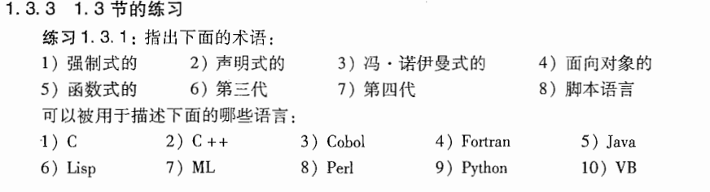

| 术语          | 可描述的语言                                             | 解释                                                         |
| ------------- | -------------------------------------------------------- | ------------------------------------------------------------ |
| 强制式的      | C、C++、Cobol、Fortran、Java、Perl、Python、VB           | 这些语言的程序通常通过赋值语句、顺序执行、分支和循环来改变程序状态。 |
| 声明式的      | Lisp、ML                                                 | 函数式语言常列入声明式范畴，因为程序重点在表达计算关系和表达式求值。 |
| 冯·诺伊曼式的 | C、C++、Cobol、Fortran、Java、Perl、Python、VB           | 这类语言围绕变量、内存状态、赋值和顺序控制组织程序，符合冯·诺伊曼计算模型的语言特征。 |
| 面向对象的    | C++、Java、Python、VB、Perl                              | C++、Java、Python、VB 都以类和对象作为重要组织方式；Perl 也支持对象系统。 |
| 函数式的      | Lisp、ML                                                 | Lisp 和 ML 都以函数、表达式求值、函数组合作为重要程序组织方式，其中 ML 是典型函数式语言。 |
| 第三代        | C、C++、Cobol、Fortran、Java、Lisp、ML、Perl、Python、VB | 第三代通常指高级通用程序设计语言。本题所列语言大多都能按这个口径归入这一类。 |
| 第四代        | VB（按可视化快速应用开发口径）                           | 第四代通常和数据库查询、报表生成、快速应用开发工具相关。题目清单中，VB 最容易按可视化快速应用开发传统归入这一项。 |
| 脚本语言      | Perl、Python、VB                                         | Perl 和 Python 是典型脚本语言；VB 在 VBScript、Office 宏、自动化脚本语境下也能归入这一类。 |

---

==1.6练习==

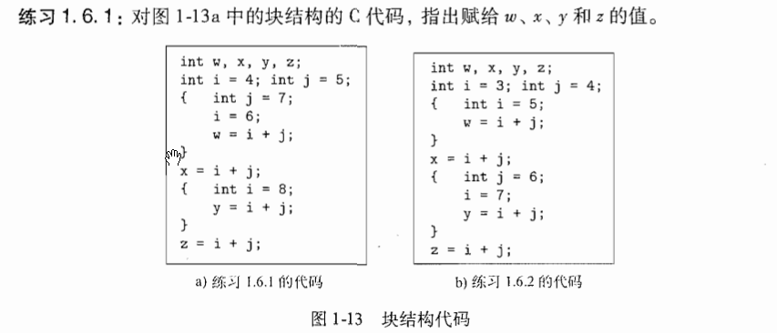

??? 答案

	最外层先声明 `i = 4`、`j = 5`。进入第一个块后，块内声明了新的 `j = 7`，这个 `j` 只在该块内优先使用；该块里写的 `i = 6` 指向外层的 `i`，所以外层 `i` 改为 6。于是 `w = i + j = 6 + 7 = 13`。
	
	离开第一个块后，块内的 `j = 7` 结束使用，外层的 `j = 5` 继续可见，此时外层 `i = 6`，所以 `x = i + j = 6 + 5 = 11`。
	
	进入第二个块后，块内声明新的 `i = 8`，该块里表达式中的 `i` 使用这个局部 `i`，`j` 仍然是外层的 `j = 5`，所以 `y = i + j = 8 + 5 = 13`。
	
	离开第二个块后，外层 `i = 6`、外层 `j = 5` 继续可见，所以 `z = i + j = 6 + 5 = 11`。
	
	因此图 1-13a 的结果是：
	
	| 变量 | 值   |
	| ---- | ---- |
	| `w`  | 13   |
	| `x`  | 11   |
	| `y`  | 13   |
	| `z`  | 11   |

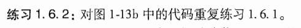

??? 答案

	图 1-13b 中，最外层先有 `i = 3`、`j = 4`。
	
	进入第一个块后，块内声明新的 `i = 5`，这个 `i` 在该块内优先使用；`j` 仍然来自外层，值为 4。因此 `w = i + j = 5 + 4 = 9`。离开这个块后，外层 `i` 仍为 3。
	
	接着执行 `x = i + j`，这里使用外层 `i = 3` 和外层 `j = 4`，所以 `x = 7`。
	
	进入第二个块后，块内声明新的 `j = 6`。语句 `i = 7` 指向外层 `i`，于是外层 `i` 变为 7。随后 `y = i + j` 使用外层 `i = 7` 和块内 `j = 6`，所以 `y = 13`。
	
	离开第二个块后，块内 `j = 6` 结束使用，外层 `j = 4` 继续可见；外层 `i` 已经变为 7，所以 `z = i + j = 7 + 4 = 11`。
	
	因此图 1-13b 的结果是：
	
	| 变量  |  值 |
	| --- | -: |
	| `w` |  9 |
	| `x` |  7 |
	| `y` | 13 |
	| `z` | 11 |

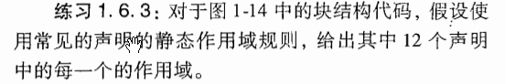

```c
{
    int w, x, y, z;	//块B1
    {
        int x, z;	//块B2
        {
            int w, x;	//块B3
        }
    }
    {
        int w, x;	//块B4
        {
            int y, z;	//块B5
        }
    }
}
```

??? 答案

	这里先约定一个说法：某块的“直接区域”指该块内部、各内层块边界外侧的位置。内层块一旦声明同名变量，该内层块内就按内层声明解析该名字。
	
	图 1-14 中各声明的可见范围如下。
	
	| 声明位置 | 声明变量 | 作用域                   |
	| ---- | ---- | --------------------- |
	| B1   | `w`  | B1 直接区域；B2 直接区域       |
	| B1   | `x`  | B1 直接区域               |
	| B1   | `y`  | B1 直接区域；B2 全块；B4 直接区域 |
	| B1   | `z`  | B1 直接区域；B4 直接区域       |
	| B2   | `x`  | B2 直接区域               |
	| B2   | `z`  | B2 直接区域；B3 全块         |
	| B3   | `w`  | B3 全块                 |
	| B3   | `x`  | B3 全块                 |
	| B4   | `w`  | B4 直接区域；B5 全块         |
	| B4   | `x`  | B4 直接区域；B5 全块         |
	| B5   | `y`  | B5 全块                 |
	| B5   | `z`  | B5 全块                 |

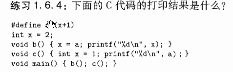

??? 答案

	代码中的宏定义是：
	
	```
	#define a (x+1)
	```
	
	宏 `a` 在使用位置展开成文本 `(x+1)`，然后再按照该使用位置的作用域解析 `x`。
	
	程序开始时，全局变量 `x = 2`。
	
	调用 `b()` 时，函数体中的语句
	
	```
	x = a;
	```
	
	会展开为
	
	```
	x = (x + 1);
	```
	
	这里的 `x` 是全局变量。原来全局 `x = 2`，执行后全局 `x = 3`，所以 `b()` 打印：
	
	```
	3
	```
	
	随后调用 `c()`，函数内部声明了局部变量：
	
	```
	int x = 1;
	```
	
	这里的 `a` 展开为 `(x+1)`，其中 `x` 使用 `c()` 内部的局部变量，值为 1，所以打印 `1 + 1 = 2`。
	
	整个程序的输出为：
	
	```
	3
	2
	```

## 第二章 一个简单的语法制导翻译器

本章内容是对接下来的3-6章介绍的编译技术的总体介绍。课本通过开发一个可运行的Java程序来演示这些编译技术，不过笔者不太会java，所以打算采用`C++` 来实现。本章重点是编译器的前端，即 `词法分析、语法分析和中间代码生成` 部分。

我们当前阶段的目标是将下面左图代码可以被转换为下面右图的代码

| 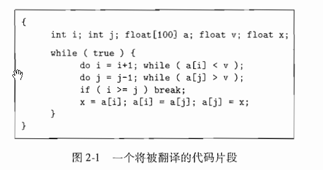 | 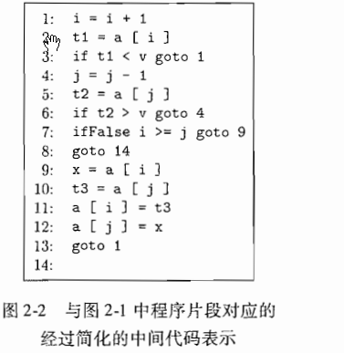 |
| ------------------------------------------------------------ | ------------------------------------------------------------ |

### 2.1 引言

分析阶段的工作是围绕着待编译语言的“语法”展开的，

- 一个程序设计语言的 `语法` 描述了该语言的程序的正确形式
- 而该语言的 `语义` 则定义了程序的含义

2.2节中将介绍语法定义，给出BNF范式(或者说上下文无关法)来描述语法

2.3节中，将介绍一种面向文法的编译技术，即 `语法制导翻译技术`。我们会知道BNF范式不仅可以描述一个语言的语法，还可以指导程序的翻译过程。

2.4节会介绍语法扫描，或者说语法分析

2.5节会介绍翻译器的全部程序

> 例如，表达式 `9 - 5 + 2` 从中缀表达式翻译为后缀表达式 `9 5 - 2 +`

2.6节会介绍词法分析器，它允许表达式中出现数值、标识符和空白字符。

> 词法分析器使得翻译器可以处理由多个字符组成的构造，比如标识符。标识符由多个字符组成，但是在语法分析阶段被当作一个单元进行处理。这样的单元叫做 `词法单元(token)`

再接下来就是中间代码的生成。如下，左图为 `抽象语法树`，右图为 `三地址指令序列`；两者为常见的中间表示形式

| 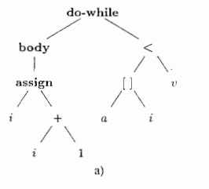 | 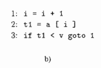 |
| ------------------------------------------------------------ | ------------------------------------------------------------ |

### 2.2 语法定义

==本节主要介绍“上下文无关文法”，简称“文法”==

文法可以将程序设计语言构造的层次化语法结构进行自然地描述，如下示例：

```java
if (expression) statement else statement
```

> 一个 `if-else` 语句由关键字 `if` 、左括号、表达式、右括号、一个语句、关键字 `else` 和 另一个语句连接而成。

我们如果用变量 *expr* 来表达表达式，用 *stmt* 表示语句，那么这个构造规则可以表示为

```
stmt -> if (expr) stmt else stmt
```

> 其中箭头读作 “可以具有如下形式”。

- 这样的规则我们称为 **产生式**。

- 在一个产生式中，类似关键字 `if` 和 括号 这样的词法元素称为 **终结符号**；

- 在一个产生式中，类似 *expr* 和 *stmt* 这样的变量表示终结符号的序列，它们称为 **非终结符号**

---

==文法定义==

一个文法由四个元素组成：

1. 一个 **终结符号** 集合，有时候也称为“词法单元”。终结符号是该文法所定义的语言的基本符号的集合
2. 一个 **非终结符号** 集合，有时也称为“语法变量”。每个非终结符号表示一个终结符号串的集合
3. 一个 **产生式** 集合，其中每个产生式包括一个称为 *产生式左部* 的非终结符号，一个箭头，一个称为 *产生式右部* 的由终结符号和非终结符号组成的序列

4. 指定一个非终结符号为 **开始** 符号

!!! note

	为表示方便，以同一个非终结符号为头部的多个产生式的体可以放在一起表示，不同体之间用符号 `|` 分隔，见下例中的式2.4

!!! example

	**例2.1**
	
	如 `9 - 5 + 2`, `3 - 1` 这种，两个数位之间必须出现 `+` 或 `-`，我们可以称这样的表达式为“由+、-号分隔的数位序列”
	
	下面的文法描述了这种表达式的语法。此文法的产生式包括：
	
	$$
	\begin{align}
	list\rightarrow list+digit\tag{2.1}\\
	list\rightarrow list - digit\tag{2.2}\\
	list\rightarrow digit\tag{2.3}\\
	list\rightarrow 0\;|1\;|2\;|3\;|4\;|5\;|6\;\tag{2.4}
	\end{align}
	$$
	
	以非终结符号 $list$ 为头部的三个产生式可以等价地组合为
	
	$$
	list\rightarrow list + digit\;|\;list-digit\;|\;digit
	$$
	
	同时，根据我们的习惯，该文法的终结符号应该包括如下符号：
	
	$$
	+\;-\;0\;1\;2\;3\;4\;5\;6\;7\;8\;9
	$$

---

==推导==

> 刚刚我们学习了文法的定义，了解了一个文法应该是什么样的，接下来我们尝试将根据文法推到符号串。

我们首先从开始符号出发，不断将某个非终结符号替换为该非终结符号的某个产生式的体。

可以从开始符号推导得到的所有终结符号串的集合称为该文法定义的 **语言**

!!!example

	根据产生式(2.3)，单个数位本身就是一个 $list$。
	
	产生式(2.1)和(2.2)表达了如下规则：任何列表后跟一个符号 + 或 - 以及另一个数位可以构成一个新的列表。
	
	产生式(2.1)~(2.4)就是我们定义所期望的语言时需要的全部产生式。例如，我们可以按照如下方法推到出 `9 - 5 + 2` 是一个 $list$
	
	1. 因为 `9` 是 $digit$ ，根据产生式(2.3)可知，9 是 $list$
	2. 因为 `5` 是 $digit$，且 `9` 是 $list$，由产生式(2.2)可知，`9-5` 是 $list$
	3. 因为 `2` 是 $digit$，`9-5` 是 $list$ ，由产生式(2.1)可知，`9-5+2` 是 $list$

**语法分析的任务是：** 接受一个终结符号串作为输入，找出从文法的开始符号推导出这个串的方法。

- 如果不能成功推导，那么说明这个终结符号串包含语法错误

---

==语法分析树==

语法分析树用图形化的方法展现了从文法的开始符号推到出相应语言中的符号串的过程。

如果非终结符号A有一个产生式 $A\rightarrow XYZ$ ，那么在语法分析树中就可能有一个标号为 $A$ 的内部节点，该节点有三个子节点，从左向右的标号分别为 $X、Y、Z$

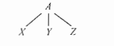

**正式地说**，给定一个上下文无关文法，该文法的一颗 *语法分析树* 是具有如下性质的树：

1. 根节点的标号为文法的开始符号
2. 每个叶子节点的标号是一个终结符号或 *任意字母表上的零个符号组成的串* （后续记为 $\epsilon$）
3. 每个内部节点的标号为一个非终结符号
4. 如果非终结符号 $A$ 是某个内部节点的标号，并且它的子节点的标号从左到右分别为 $X_1,\dots,X_2,\dots,X_n$ ，那么必然存在产生式 $A\rightarrow X_1X_2\dots X_n$，其中 $X_1,\dots,X_2,\dots,X_n$ 既可以是终结符号，也可以是非终结符号

!!!example

	1

我们继续用 `9 -5 + 2` 的推导来做演示。树中每个结点的标号都是一个文法符号。每个内部结点和它的子结点都对应于一个产生式。其中，内部结点对应于产生式的头，它的子节点对应于产生式的体。

如下图所示，根结点的标号为 $list$ ，即文法的开始符号。根结点的子结点的标号从左向右分别为 $list、+$ 和 $digit$。

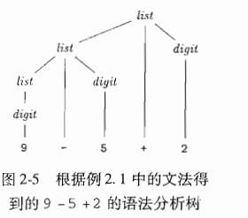

