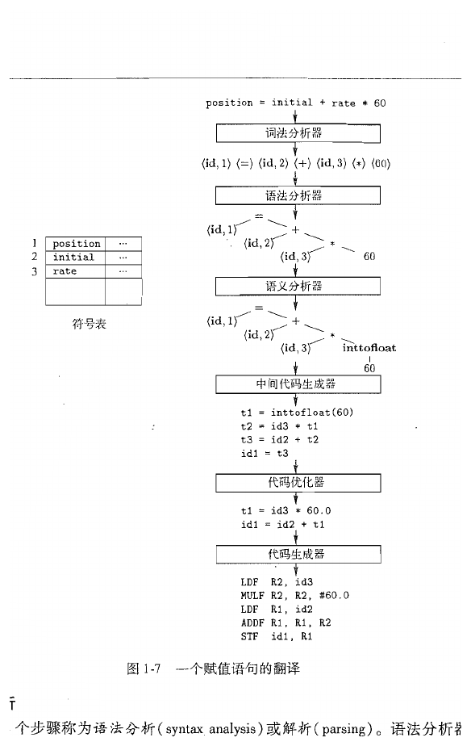
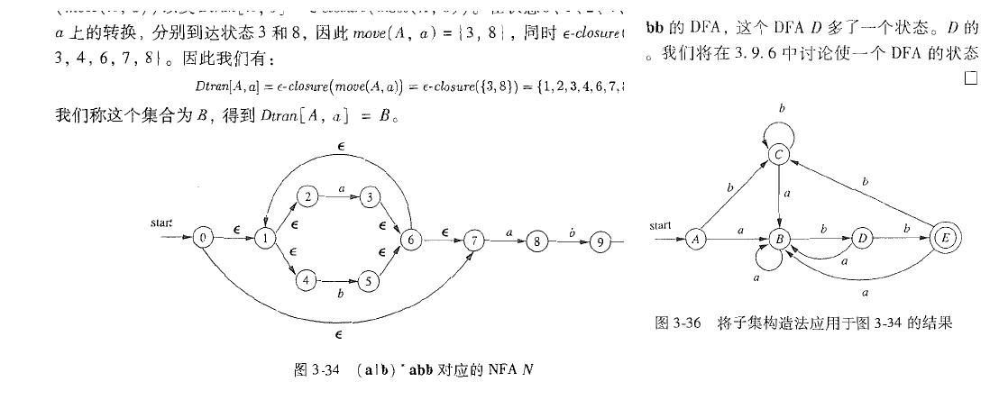
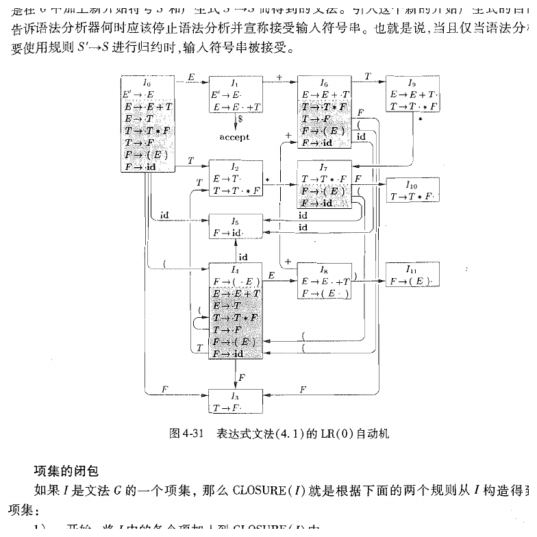
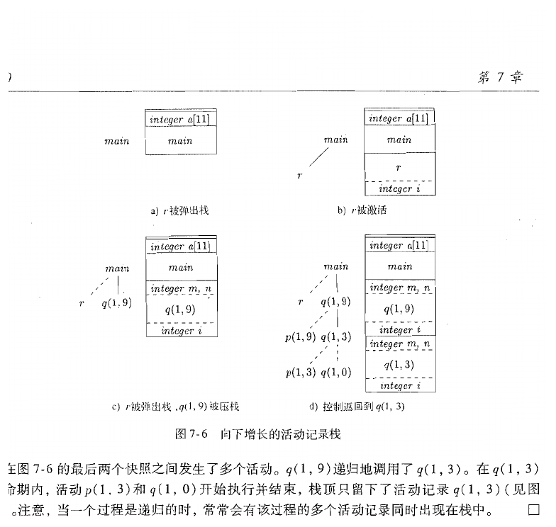
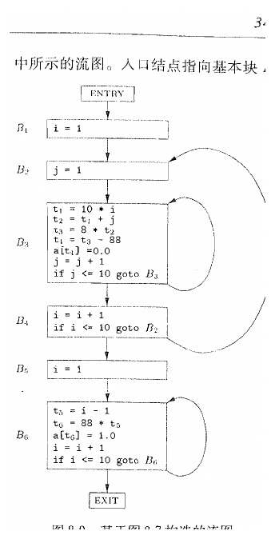

# 编译原理

Note

本笔记按《编译原理》教材 12 章顺序整理。教材先用一个完整但足够小的翻译器把编译器的工作链条摆出来，随后依次展开词法分析、语法分析、语法制导翻译、中间代码生成、运行时环境、代码生成和优化，再进入并行化与程序分析这些更偏进阶的话题。正文沿着同一条顺序推进，章内也尽量保持教材原有的知识依赖关系。

> 第一次学编译原理时，可以始终沿着 源程序先被看成什么对象 -> 当前阶段接收什么输入 -> 这一阶段输出什么结构 -> 下一阶段为何需要这个结果 -> 理论正确性与工程实现各自承担什么职责 这条线往前走。把定义、文法、自动机、属性、三地址代码、控制流图和数据流方程都放回这条线以后，整门课会连成一件事。

Tip

- 第一次通读时，先抓住每一章在处理什么对象，以及它把结果交给下一章时，接口长成什么样。
- 第二次回看时，再把重点放到公式、项目集、数据流方程、活动记录和寄存器分配这些形式对象上。
- 若中途感觉概念很多，优先回到 字符流 -> 词法单元 -> 语法结构 -> 中间表示 -> 目标代码 这条主线，判断当前内容位于哪一层。


## 第1章 引论

> 这一章先把课程的对象摆正。教材在这里要建立的，是一条从源程序到目标程序的分阶段加工链，以及支撑这条链的语言学、算法、体系结构和运行环境背景。


### 1.1 语言处理器

当我们把一段程序交给计算机时，真正面对的对象是一串字符。字符本身只携带符号信息，处理器面对它们时只会按照硬件定义的方式响应输入。语言处理器的职责，就是把这串字符加工成机器能够执行、运行时系统能够支撑、程序员又愿意书写和维护的形式。

教材把几类语言处理器放在一起讲，是为了先把它们的分工讲清楚。`编译器（compiler）` 负责把一个源语言程序整体翻译成目标语言程序；`解释器（interpreter）` 在运行时直接执行源程序所表示的动作；`汇编器（assembler）` 把汇编语言翻译成机器语言；`链接器（linker）` 把多个目标文件和库文件组合成一个可执行映像；`装入器（loader）` 再把这个映像放入内存并建立运行所需的环境。

| 处理器 | 主要输入 | 主要输出 | 课程中最相关的关注点 |
| --- | --- | --- | --- |
| **编译器** | 源程序 | 目标程序或中间代码 | 结构恢复、语义检查、优化、代码生成 |
| **解释器** | 源程序或中间表示 | 运行时动作 | 执行时语义、运行时环境、调度执行顺序 |
| **汇编器** | 汇编代码 | 机器代码 | 指令格式、地址绑定、符号替换 |
| **链接器** | 目标文件、库文件 | 可执行映像 | 外部符号解析、重定位、模块组合 |
| **装入器** | 可执行映像 | 进程初始内存状态 | 内存映射、入口点、运行现场建立 |

这一串处理器之所以要分开，是因为每一层面对的对象都不同。编译器关注的是语言结构、类型、控制流和可优化表示；链接器关注的是符号解析和地址重定位；装入器关注的是进程初始状态、内存映射和入口点。把这些工作压到同一个阶段里，理论表述会混乱，工程实现也会变得笨重。

教材在开头还特别安排了编译器、解释器和混合方式的比较。这里最值得抓住的点，是“翻译”和“执行”可以在时间上拆开，也可以交叉进行。Java 的字节码和虚拟机、Python 的字节码解释执行、JIT 即时编译，都落在这条连续谱上。读编译原理时，视线可以放在“把程序变成更适合后续处理的表示”这件事上。


### 1.2 编译器的结构

教材把编译器分成词法分析、语法分析、语义分析、中间代码生成、代码优化和代码生成几个阶段，并把符号表管理和出错处理看作贯穿整个过程的支撑机制。这样分阶段，原因在于各阶段处理的对象层次本来就不同。

词法分析面对的是字符流，它要把字符组织成记号序列；语法分析面对的是记号序列，它要恢复出层次结构；语义分析接着在结构上附加类型、作用域和声明约束；中间代码生成把高层结构翻译成更适合分析和优化的表示；代码优化在保持语义不变的前提下改写程序表示；代码生成最终把程序表示映射到具体机器的指令和资源约束上。

Important

编译器阶段的连接关系可以先记成 字符流 -> 词法单元序列 -> 语法结构 -> 带语义信息的中间表示 -> 目标代码。
后面每一章的困难，大多都落在“如何让这一层结果足够适合下一层继续处理”。



这张图很适合作为整门课的第一个抓手。它用同一个赋值语句穿过多个阶段，读者可以清楚看到：词法分析把字符流切成词法单元，语法分析恢复出树形结构，语义分析补上类型转换，中间代码生成得到三地址形式，优化器再把其中的冗余计算压缩掉，代码生成才开始关心寄存器和指令。编译原理真正研究的，就是这种“同一个程序在不同抽象层上的表示变化”。

`insight：` 初学者很容易把“语法树”和“目标代码”直接连在一起，以为编译器的核心只有前端和后端两步。教材特意把中间代码、优化和运行时环境独立出来，目的正是提醒我们：从语言结构走到机器执行，中间还隔着一整层适合分析、改写和权衡工程代价的中间世界。

符号表和错误处理之所以被放在旁路位置，也值得单独说明。符号表把名字和它所代表的对象关联起来，它会被词法分析、语义分析、中间代码生成乃至后端阶段共同访问。错误处理则要求各阶段在发现问题时尽量报告有价值的信息，并尽量恢复到可继续分析的状态。一个能通过大部分测试但出错信息糟糕、局部错误会拖垮后续阶段的编译器，在工程上仍然难以使用。


### 1.3 程序设计语言的发展历程

教材在编译器结构之后回头讲语言的发展历程，是因为编译器面对的问题，从来都由语言本身提出。机器语言和汇编语言离硬件很近，语法结构简单，翻译负担主要落在符号替换和地址计算上。高级语言逐渐引入表达式、控制结构、过程抽象、递归、类型系统、对象系统和泛型机制之后，编译器才开始承担更复杂的结构恢复和语义检查任务。

这个发展过程里有一条很稳定的主线：程序员希望把更多细节从显式书写中抽走，编译器就要把更多隐含信息在翻译期恢复出来。过程调用把跳转细节抽象掉，于是运行时环境需要建立活动记录；数组与记录把地址计算隐藏起来，于是编译器要生成寻址代码；多态与重载把具体函数选择推迟到更晚的时刻，于是类型检查和调用解析会更复杂。

从教材的视角看，语言演进对编译器有三层影响。第一层是语法层，语言构造越丰富，文法和分析器设计就越重要。第二层是语义层，作用域、类型和绑定规则越精细，属性、符号表和静态检查的角色就越突出。第三层是运行时层，递归、动态分配、异常、虚函数、垃圾回收这些特性一旦出现，后端和运行时系统就必须配合。


### 1.4 构建编译器的相关科学

编译器属于一个天然跨学科的系统。教材把形式语言、自动机、算法、图论、体系结构和操作系统一起拉进来，原因很直接：编译器里的很多“术语”其实分别来自这些领域。

词法分析依赖正规语言和有穷自动机，因为词法模式天然适合用字符级的状态机来识别。语法分析依赖上下文无关文法和分析算法，因为程序结构需要树形关系，而树形关系无法靠有限状态直接表达。数据流分析依赖图论和不动点计算，因为优化讨论的是控制流图上信息如何传播。寄存器分配依赖图着色，因为冲突关系可以建成无向图。代码调度依赖处理器结构，因为同一条中间代码在不同指令流水线上的代价完全不同。

这一章安排这一节，还有一层更重要的意思。学习编译原理时，读者常会觉得“课上突然多出很多陌生数学对象”。教材在这里把这些对象提前亮出来，等于先给整门课准备一套工具表。这些数学对象正好用来精确描述编译器所处理的问题空间。


### 1.5 编译技术的应用

编译技术的应用范围远大于“把 C 程序变成可执行文件”。查询优化器会把 SQL 转换成关系代数表达式并做代价驱动优化；静态分析器会在抽象语法树和控制流图上发现缺陷；IDE 的代码补全和重构功能会实时构建语法树与符号表；JIT 会根据运行时热点代码重新生成更高质量的机器指令；领域专用语言的实现也常常直接复用词法、语法和中间表示这套思路。

把这一点先看清楚，后面的很多章节就会更容易理解。比如数据流分析既服务于传统优化器，也服务于安全分析与程序验证；过程间分析既出现在高级研究中，也出现在现代 IDE、漏洞检测和大规模代码检索里。编译原理的重要性，落在它提供了一整套把程序当作结构化对象来处理的方法。


### 1.6 程序设计语言基础

教材在引论最后一节引入环境、状态、作用域、参数传递和别名，是为了给后面的语义分析和运行时环境打底。很多初学者会在这里感到跳跃，这一步其实很自然，因为编译器处理的对象除了“语法正确的句子”，还有名字在何处可见、表达式求值会改变什么、过程调用怎样影响后续计算。

先看环境和状态。`环境（environment）` 描述名字到存储位置的绑定关系，`状态（state）` 描述这些存储位置当前保存的值。若用记号表示，可以写成

$$
Env: Name \rightarrow Location,\qquad
State: Location \rightarrow Value
$$

这两个映射分开写的意义很大。名字先通过环境找到存储位置，再由状态给出当前位置上的值。这样一来，“名字解析”和“值更新”就成为两件不同的事。语义分析主要处理前者，运行时执行主要处理后者。

接着看作用域和绑定。静态作用域根据程序文本结构决定名字在何处可见，动态作用域根据运行时调用链决定名字解析结果。现代主流语言大多采用静态作用域，因为它让程序含义主要由源代码结构决定，更利于推理、优化和模块化。参数传递也类似，值传递、引用传递、复制恢复等机制会直接影响过程体内部对名字的解释方式。

最后看别名。若两个不同名字最终指向同一存储位置，它们之间就构成别名关系。别名一旦存在，赋值语句的影响范围就会扩大，优化器和程序分析器都要更加保守。教材把别名放在引论里，正是在为后面“为什么有些看起来安全的改写其实需要额外条件”埋下伏笔。


## 第2章 一个简单的语法制导翻译器

> 这一章是整本书的第一个完整样机。教材直接用一个能处理算术表达式的小翻译器，把文法、推导、语法制导定义、词法分析、符号表和中间表示这些对象连接成一条完整链。


### 2.1 引言

编译器的各个阶段如果分开学习，很容易变成一堆彼此孤立的术语。教材在这里先构造一个足够小的翻译器，目的是让读者先看到“一个前端系统到底怎样连起来工作”。这个翻译器规模很小，只处理表达式和赋值语句，正因为对象小，很多关键步骤反而更容易看清。

小翻译器的价值，在于它把抽象概念放回了真正的工作流。字符先被组织成词法单元，词法单元再被文法约束成树形结构，树上的结点又携带属性和值，最后这些值被翻译成后缀表示、抽象语法树或三地址代码。于是读者看到的是一条逐层加工链。


### 2.2 语法定义

编译器想要恢复源程序的结构，首先得有一套结构规则。教材在这里引入文法，是为了回答“哪些记号串属于这门语言，它们的层次结构如何形成”。

一个上下文无关文法可以写成四元组

$$
G=(V,T,P,S)
$$

其中 $V$ 表示非终结符集合，$T$ 表示终结符集合，$P$ 表示产生式集合，$S$ 表示开始符号。非终结符代表尚待展开的语法成分，终结符代表已经落到输入串层面的基本符号。

Note

这一节里至少有四层对象需要分清：**字母表** 提供基本符号集合，**串** 是符号序列，**语言** 是串的集合，**文法** 是生成语言的规则系统。
读后面词法分析和语法分析时，若感觉对象混在一起，通常说明这四层对象还停留在同一视野里。

以算术表达式为例，教材最常使用的文法写成

$$
\begin{aligned}
E &\rightarrow E + T \mid T \\
T &\rightarrow T * F \mid F \\
F &\rightarrow (E) \mid id
\end{aligned}
$$

这个文法里，$E$ 表示表达式，$T$ 表示项，$F$ 表示因子。它把加法放在表达式层、乘法放在项层、括号和标识符放在因子层，于是乘法优先级高于加法这一事实就被文法结构直接编码了进去。

推导是文法真正“生成句子”的过程。若某一步总是选择当前句型里最左边的非终结符展开，就得到左most 推导；总是选择最右边的非终结符展开，就得到右most 推导。语法分析树则把整个推导过程压缩成一棵树，内部结点对应非终结符，叶子结点对应终结符。

`insight：` 推导描述的是“按照什么次序展开”，语法分析树描述的是“最终形成了什么层次结构”。同一棵分析树可以对应不同的展开次序，因此在讨论语言结构时，树往往比某一种特定推导更稳定。

这一节里还必须处理二义性。若一个句子能对应两棵不同的分析树，或者等价地说，能对应两种不同的最左推导，那么文法就是二义的。二义性之所以重要，是因为编译器需要一个稳定的结构解释。表达式文法里常见的优先级和结合性问题，讨论的正是多种结构解释同时成立时怎样选定唯一结构。


### 2.3 语法制导翻译

只有结构还不够，编译器还要在结构上附加含义。语法制导翻译的核心思想，是在文法符号和产生式上附加语义规则，让结构构造和语义计算同步推进。

最简单的例子是把中缀表达式翻译成后缀表示。若我们为每个非终结符引入一个综合属性 `post`，表示该子树对应的后缀串，就可以写出类似规则：

$$
\begin{aligned}
E &\rightarrow E_1 + T \quad &\{E.post = E_1.post \mathbin{\|} T.post \mathbin{\|} + \}\\
E &\rightarrow T \quad &\{E.post = T.post\}
\end{aligned}
$$

这里的关键点在于，属性值沿着语法树边传播。综合属性依赖子结点，继承属性依赖父结点或兄弟结点。教材在这一章先大量使用综合属性，就是因为它们最容易和自底向上的结构构造一起理解。

语法制导翻译的价值，在于它把“结构”和“处理动作”绑定到了一起。这样一来，翻译器每次归约出一个语法成分，就能立刻为这个成分产生对应的语义结果。这种思想会一路延伸到后面的类型检查、中间代码生成和回填技术。


### 2.4 语法分析

语法分析的输入是词法单元序列，输出是某种结构化结果，最典型的就是语法分析树或抽象语法树。教材先在这个小翻译器里使用自顶向下分析，是因为这种方法最直观：从开始符号出发，尝试一步步预测输入串的结构。

若文法适合预测分析，就可以构造一个不回溯的递归下降分析器。分析器在每个非终结符处，根据当前向前看符号选择一条产生式，然后继续展开。预测分析只适用于一类文法。左递归会导致无限展开，公共左因子会让分析器在看见足够多输入之前无法决定该走哪条产生式。

这就是教材在这一章里提前引入“消除左递归”和“提取左公因子”的原因。方法本身很明确，难点在于看清对象。以表达式文法为例，直接左递归形式

$$
E \rightarrow E + T \mid T
$$

可以改写为

$$
\begin{aligned}
E &\rightarrow T E' \\
E' &\rightarrow + T E' \mid \varepsilon
\end{aligned}
$$

改写后的文法把“一个表达式由一个项开头，后面跟零个或多个 `+T` 后缀”明确拆开了。对预测分析器来说，这种形状就更容易处理。


### 2.5 简单表达式的翻译器

这一节的重要性在于，它第一次把“具体语法”和“抽象语法”分开。具体语法保留了很多只服务于书写形式的细节，例如括号、分隔符和若干中间层非终结符；抽象语法只保留真正影响含义的结构对象，例如二元运算、标识符、字面量和赋值。

这一步很关键，因为后续阶段真正关心的是“程序做了什么”。书写细节更多留在前端处理，抽象语法树于是成为前端和后端之间更自然的桥梁。词法单元在这里开始脱离原始字符序列，变成带类别和值的结构对象；表达式也从线性串变成树。

教材在这里还借翻译器强调了一点：删除具体语法中的冗余中间层后，结构信息仍然完整保留。抽象语法往往让真正重要的结构更清楚。例如 `a+b*c` 中最值得抓住的结构，是“加法的右侧是一棵乘法子树”，抽象语法树会比包含大量文法中间结点的分析树更容易看出这一点。


### 2.6 词法分析

第 3 章会系统讲词法分析，这一章先把它放进小翻译器里使用。原因很直接：词法单元先建立起来，语法分析器才有可读取的输入对象。

以教材中的赋值语句


```

position := initial + rate * 60

```

为例，词法分析器会把它组织成大致如下的词法单元序列：


```

(id, 1)  (assign, :=)  (id, 2)  (+)  (id, 3)  (*)  (num, 60)

```

这里的关键是把三个层次分清。字符序列是原始输入；词素（lexeme）是字符流里与某个模式匹配的具体片段，例如 `position`；词法单元（token）是词素所属的类别，例如 `id`；属性值则给出这个具体词素对应的附加信息，例如符号表入口编号或数值本身。

很多初学者会在这里把“词法单元就是字符串”混在一起。更稳妥的理解方式，是把词法单元看成一种分类后的抽象结果。语法分析器几乎只关心“这里出现了一个标识符”和“这个标识符在符号表里的入口是什么”。


### 2.7 符号表

只要程序中出现名字，编译器就需要一张表把名字和它所代表的对象联系起来。符号表记录的通常有名字、种类、类型、作用域、存储位置以及其他和后续翻译相关的信息。

教材在这一章里先给出最朴素的使用方式：词法分析器遇到标识符时为它建立或查找条目，语义分析阶段再往条目里补充类型、偏移和作用域信息。等读到后面的嵌套过程和块结构时，符号表会进一步发展成一组随作用域层次组织起来的表。


### 2.8 抽象中间表示

这一章最后把语法树、静态检查和三地址代码先做一个预告，是为了让读者提前看到“语法分析之后还会发生什么”。编译器在这一点上开始摆脱“只看表面结构”的阶段，转而构造更适合优化和代码生成的表示。

语法树适合表达层次结构，DAG 适合合并公共子表达式，三地址代码适合顺序化表达式求值和控制流。静态检查则开始验证结构之外的性质，例如名字是否已声明、运算对象类型是否相容、赋值语句左右两侧是否可兼容。到了这一步，编译器前端的轮廓就已经完整出现了。


## 第3章 词法分析

> 第 2 章里，词法分析只是小翻译器的入口；这一章开始，教材把这个入口本身拆开。真正需要理解的主线是：字符流怎样变成词法单元，正规表达式怎样描述词法模式，有穷自动机怎样执行这些模式，词法分析器生成工具又怎样把模式说明自动变成可运行程序。


### 3.1 词法分析器的作用

词法分析器处在编译器最前端，直接面对源程序字符流。它的输出是一串词法单元，因此它做的第一件事，就是把连续字符按照语言定义切分成一个个有类别的片段。关键字、标识符、常量、运算符、分隔符，都会在这里第一次被识别出来。

这一阶段的目标看似简单，实则承担了两个重要任务。第一个任务是收缩输入规模。语法分析器若直接面对逐字符输入，会被大量低层细节拖住；词法分析器先把字符打包成记号，后续阶段的对象就会清晰很多。第二个任务是隔离局部模式。保留字和标识符的区分、数字常量的识别、空白和注释的删除，都属于局部字符模式问题，放在词法层处理最自然。

词法分析和语法分析之间也有清楚边界。词法分析负责“看到哪些基本单位”，语法分析负责“这些单位怎样组成层次结构”。例如 `if` 会在词法层被识别成关键字，`if (x) y; else z;` 的悬空 `else` 归属则属于语法层问题。


### 3.2 输入缓冲

真实编译器面对的是长文件，逐字符调用输入接口会带来明显开销。教材在这一节引入缓冲区对和哨兵标记，就是为了说明：编译器理论里的“读下一个字符”在工程上也需要数据结构支撑。

双缓冲的做法是准备两个输入块，指针在块中前进，当一个块快读完时装入另一个块。哨兵标记则在块尾放一个特殊字符，让扫描循环在大多数时候只需做一次判断。这个设计看起来偏工程细节，实际上和词法分析的正确性直接相关，因为向前看与回退常常依赖这套缓冲机制。


### 3.3 正规表达式与词法单元规约

要让编译器识别词法单元，先得有一种形式化工具来描述模式。教材在这里引入正规表达式（regular expression），因为词法模式的本质就是字符集合上的局部组合关系。

先约定几个对象。设字母表为 $\Sigma$，它是一组有限字符的集合；串是 $\Sigma$ 上字符的有限序列；语言是串的集合。正规表达式描述的，就是某个语言。最基本的递归定义可以写成：

1. $\emptyset$ 表示空语言。
2. $\varepsilon$ 表示只包含空串的语言。
3. 对任意 $a\in\Sigma$，符号 $a$ 表示语言 $\{a\}$。
4. 若 $r$ 和 $s$ 是正规表达式，则 $r|s$、$rs$、$r^*$ 也是正规表达式。

这三个运算分别对应并、连接和 Kleene 闭包。于是标识符模式可以写成“字母开头，后面跟零个或多个字母数字下划线”；整数常量可以写成“一个或多个数字”；空白字符可以写成空格、制表和换行字符构成的并。

把正规表达式、词素和词法单元放到一条链上看，会更稳。正规表达式给出模式定义，词法分析器用这些模式去匹配输入中的具体词素，再把匹配结果归入某个词法单元类别。模式属于语言说明，词素属于源程序文本，词法单元属于编译器内部接口。

Note

- **正规表达式** 负责描述模式。
- **词素** 是输入文本里真正被匹配出来的那一段字符。
- **词法单元** 是编译器内部使用的分类结果，语法分析器通常直接读取这一层。


### 3.4 词法单元的识别

有了模式之后，还需要一个可执行机制来判断输入是否匹配这些模式。教材先用状态转换图描述识别过程，再在后面把它系统化为 NFA 和 DFA。

状态转换图里的结点代表识别过程所处的状态，边上的标号代表可接受的输入字符。扫描从开始状态出发，沿着输入字符对应的边前进；若最终到达接受状态，就说明某个词素被识别出来了。保留字和标识符共享前缀模式时，常见做法是先按标识符模式识别，再查关键字表决定最终类别。

这一节里有两个工程规则尤其重要。第一条是最长前缀匹配，也就是总是尽量取能够构成合法词素的最长字符段。第二条是规则优先级，当多个模式能匹配同一段最长前缀时，按规则出现顺序或显式优先级选定词法单元类别。若缺少这两条规则，`<=` 和 `<`、关键字和标识符之间的边界就会混乱。

`insight：` 词法分析器“看得比当前词法单元多一点”几乎是常态。之所以需要向前看，是因为当前是否接受一个词素，常常取决于下一个字符是否还能让它延长成更长的合法匹配。


### 3.5 词法分析器生成工具 Lex

手写词法分析器当然可以工作，但正规表达式天然适合自动生成。Lex 这一类工具的输入是“模式 + 动作”规则，输出是一个按最长匹配和规则优先级执行的扫描程序。

教材在这里讲 Lex，有两层目的。第一层是工程化：读者会看到正规表达式如何真正落到可执行程序。第二层是概念巩固：Lex 的内部实现正是把模式转成自动机，再把自动机代码化。工具和理论落在同一条链上，工具把理论固化成了软件。


### 3.6 有穷自动机

正规表达式要变成可执行识别器，就需要自动机模型。教材先讲不确定的有穷自动机（NFA），再讲确定的有穷自动机（DFA），顺序非常自然，因为 NFA 更接近“把正规表达式直接翻译成图”的样子，DFA 更接近“线性扫描输入并在任一时刻处于唯一状态”的执行模型。

一个 DFA 可以形式化写成五元组

$$
M=(Q,\Sigma,\delta,q_0,F)
$$

其中 $Q$ 是状态集合，$\Sigma$ 是输入字母表，$\delta:Q\times\Sigma\rightarrow Q$ 是转移函数，$q_0$ 是开始状态，$F\subseteq Q$ 是接受状态集合。给定输入串后，自动机从 $q_0$ 出发，按字符逐步应用 $\delta$。若最终停在接受状态中，这个串就属于自动机识别的语言。

NFA 的区别在于，转移函数可以把同一状态和输入字符映射到多个后继状态，还允许 $\varepsilon$ 边。它更像一种“可能性并存”的描述。DFA 则把这些可能性预先合并起来，把运行时的分支选择提前消化掉。

| 模型 | 状态迁移特征 | 与正规表达式的关系 | 运行时实现特点 |
| --- | --- | --- | --- |
| **NFA** | 同一输入可对应多个后继状态，允许 `ε` 边 | 更贴近表达式结构展开 | 直接执行时要同时维护多种可能状态 |
| **DFA** | 同一状态和输入对应唯一后继状态 | 更贴近实际扫描执行 | 逐字符推进时状态唯一，执行代价稳定 |


### 3.7 从正规表达式到自动机

教材在这一节真正把“模式说明”和“识别过程”打通。常见路径是：正规表达式先用 Thompson 构造法变成 NFA，再用子集构造法把 NFA 变成 DFA，最后在需要时继续做最小化。

Thompson 构造法的重要之处，在于它按正规表达式的结构递归地搭图。单字符、并、连接和闭包都有固定拼装模板，因此任何正规表达式都能机械地转成一个等价 NFA。子集构造法则把“当前可能位于哪些 NFA 状态”这个集合当作一个 DFA 状态，于是 NFA 的并行可能性被编码进了 DFA 的单一状态中。



这张图正好把两个关键阶段放到一起。左侧的 NFA 更贴近正规表达式的结构展开，右侧的 DFA 更贴近扫描器真正运行时的状态迁移。读图时可以抓住一个核心点：DFA 的每个状态，对应一组 NFA 状态的闭包结果。

若用教材中的例子 `(a|b)*abb` 来看，最终自动机之所以能识别“以任意个 `a` 和 `b` 开头，并以 `abb` 结尾”的串，是因为闭包与 move 计算把“当前已经匹配到模式的哪一部分”编码进了状态迁移关系里。


### 3.8 词法分析器生成工具的设计

自动生成词法分析器时，真正要解决的问题是“怎样把一组模式合并成一个统一的识别器”。若对每条正规表达式单独建一个自动机，运行时就要同时模拟很多个识别过程；生成工具的设计目标，是把这些模式并进一个共享状态机里，再统一执行最长匹配与规则优先级。

教材在这里介绍了生成器的内部结构：模式先转成自动机，再做状态组织和压缩，最后生成驱动代码。这样设计的好处是，语言说明改了，开发者只需改词法规则，状态机和扫描代码由工具重新生成。


### 3.9 DFA 的优化

理论上可用的 DFA 还可以继续优化。状态最小化会合并行为完全等价的状态，直接从正规表达式构造 DFA 的方法则试图绕开显式 NFA 阶段。教材在后半节引入 `firstpos`、`lastpos` 和 `followpos`，正是为了说明：可以直接从正规表达式语法树推导出 DFA 所需的状态信息。

这里的对象一定要先分清。`firstpos` 和 `lastpos` 讨论的是一棵正规表达式语法树中，哪些叶子可能出现在某个子表达式所生成串的首位和末位；`followpos` 讨论的是某个位置之后可能紧跟哪些位置。把这套位置关系算出来，DFA 的状态就能被描述为“位置集合”，从而直接构造。

教材还讨论了回退和输入缓冲的实现问题。这一部分说明了一个很重要的工程事实：理论上的自动机模型给出了识别边界，真正高质量的扫描器还需要为缓存、回退和错误恢复做额外设计。


## 第4章 语法分析

> 词法分析把字符流组织成词法单元序列，语法分析则要从这条线性序列中恢复出层次结构。教材在这一章里同时讲自顶向下和自底向上方法，目的是让读者理解：文法、推导、分析树、冲突和分析策略其实是同一问题的不同表述面。


### 4.1 语法分析器的作用与错误处理

语法分析器接收词法分析器输出的 token 序列，并判断它是否能由给定文法生成。若能生成，分析器就构造出某种结构化结果；若生成失败，分析器还要尽量定位错误并恢复，以便继续发现后续问题。

教材在这一章开头先讲错误处理，原因很重要。语法分析面对的往往是带有局部错误的源程序。分析器若在第一个错误处立刻停机，用户体验会很差；若错误恢复策略太冒进，又会制造大量连锁假错。于是同步记号、短语层恢复、错误产生式等方法都需要在分析算法之外单独设计。


### 4.2 上下文无关文法

上下文无关文法（context-free grammar, CFG）是这一章的基础对象。词法模式可以靠有限状态描述，程序的层次结构则需要 CFG。函数调用嵌套、括号匹配、语句块嵌套，这些都依赖树形结构；有限状态描述覆盖的对象是线性局部模式。

CFG 的形式定义在上一章已经出现过，这一章的重点转向它的性质。推导说明句子如何从开始符号生成，分析树说明结构如何组织，二义性说明结构解释是否唯一。二义文法之所以会给编译器带来困难，是因为后续语义动作和代码生成都需要依附于一棵确定的结构树。

教材还专门比较了 CFG 和正规表达式。这个安排是为了把词法层与语法层的分工再明确一次。正规表达式擅长描述局部线性模式，CFG 擅长描述递归嵌套结构。二者属于服务不同阶段的两套形式工具。


### 4.3 设计文法

文法既要能生成正确的语言，又要便于分析器构造，这两点在工程上同样重要。教材把消除二义性、消除左递归、提取左公因子集中放在这一节，就是为了说明：一个文法“能定义语言”和“适合某种分析算法”属于两个层次。

消除左递归时，先要看清对象。若有

$$
A \rightarrow A\alpha \mid \beta
$$

其中 $\beta$ 不以 $A$ 开头，就可以改写为

$$
\begin{aligned}
A &\rightarrow \beta A' \\
A' &\rightarrow \alpha A' \mid \varepsilon
\end{aligned}
$$

这一步的意义，在于把“若干次重复的前缀扩展”改写成“一个基本部分后面跟一个可重复尾部”。自顶向下分析器遇到后者时，才有机会先读入一个确定的开头。

提取左公因子也是同一类思路。若两条产生式前缀相同，分析器在只看少量输入时就无法决定该选哪一条，于是把公共前缀提出来，等待更多输入再分支。教材在这里不断强调结构改写，是为了让读者形成一种稳定直觉：分析算法对文法的形状有要求，文法设计因此成为编译器前端的一部分。


### 4.4 自顶向下的语法分析

自顶向下分析从开始符号出发，一边选择产生式，一边尝试匹配输入。递归下降分析器是最直观的形式，每个非终结符对应一个过程，过程体的分支结构对应产生式选择。

为了让这种选择在读入时刻可判定，教材引入 FIRST 和 FOLLOW 集。设 $\alpha$ 是一个文法符号串，`FIRST(\alpha)` 表示从 $\alpha$ 推导出的串可能以哪些终结符开头；对非终结符 $A$，`FOLLOW(A)` 表示在某个句型中可能紧跟在 $A$ 后面的终结符集合。

以常用的表达式文法

$$
\begin{aligned}
E &\rightarrow T E' \\
E' &\rightarrow + T E' \mid \varepsilon \\
T &\rightarrow F T' \\
T' &\rightarrow * F T' \mid \varepsilon \\
F &\rightarrow (E) \mid id
\end{aligned}
$$

为例，可以逐步算出：

$$
\begin{aligned}
FIRST(E)&=FIRST(T)=FIRST(F)=\{(, id\}\\
FIRST(E')&=\{+, \varepsilon\}\\
FIRST(T')&=\{*, \varepsilon\}
\end{aligned}
$$

而 FOLLOW 集则有

$$
\begin{aligned}
FOLLOW(E)&=\{), \$\}\\
FOLLOW(E')&=\{), \$\}\\
FOLLOW(T)&=\{+, ), \$\}\\
FOLLOW(T')&=\{+, ), \$\}\\
FOLLOW(F)&=\{*, +, ), \$\}
\end{aligned}
$$

有了这些集合，就能构造 LL(1) 分析表。比如对非终结符 $E'$，看到向前看符号是 `+` 时选择 `E' -> + T E'`，看到的是 `)` 或输入结束符时选择 `E' -> ε`。分析表回答的是“在当前非终结符与当前向前看符号这对上下文里，唯一采用哪一条产生式”。

| 非终结符 | `id` | `(` | `+` | `*` | `)` | `$` |
| --- | --- | --- | --- | --- | --- | --- |
| `E` | `E -> T E'` | `E -> T E'` |  |  |  |  |
| `E'` |  |  | `E' -> + T E'` |  | `E' -> ε` | `E' -> ε` |
| `T` | `T -> F T'` | `T -> F T'` |  |  |  |  |
| `T'` |  |  | `T' -> ε` | `T' -> * F T'` | `T' -> ε` | `T' -> ε` |
| `F` | `F -> id` | `F -> (E)` |  |  |  |  |

`insight：` FIRST/FOLLOW 计算的真正价值，落在它把预测分析所需的信息提前算出来了。分析器能够在读到当前向前看符号时作决定，依赖的正是这些首符号和后继符号信息。

!!! important LL(1) 的判断口径
FIRST 决定一个候选产生式能从什么输入符号开始，FOLLOW 决定某个非终结符在什么位置可以收住。
构造分析表时，读者若总把这两件事混在一起，后面判断文法能否预测分析时就会持续打结。


### 4.5 自底向上的语法分析

自底向上分析走的是相反方向。它从输入串出发，不断把一个个局部片段归约成更高层的非终结符，直到得到开始符号。这里的核心对象是句柄，也就是当前右句型中应当被归约的那个子串。

移入-归约分析器的运行过程由两类动作组成：读入一个新 token 放入分析栈，或者把栈顶某段符号串按某条产生式右部归约为左部。冲突则在“当前该移入还是归约”“该按哪条产生式归约”这些时刻出现。于是移入-归约冲突和归约-归约冲突，成为自底向上分析器设计里最核心的两个问题。

句柄这个概念第一次接触时往往不够稳，因为它看起来像“某个可以归约的子串”，读者很容易把它误解成“栈顶任何像某条产生式右部的片段”。教材真正想说明的是，句柄对应最右推导逆过程里的下一步，它指向当前应当回退的那个局部结构。也就是说，如果我们把某个句子看成由开始符号一步步推导出来的结果，那么自底向上分析正是在把这条推导反过来走，句柄就是当前这一步应当回退的那个局部结构。

可以用表达式 `id * id + id` 做一个小例子。若使用文法

$$
\begin{aligned}
E &\rightarrow E + T \mid T \\
T &\rightarrow T * F \mid F \\
F &\rightarrow id
\end{aligned}
$$

输入从左到右到来时，分析栈可能经历这样的变化：


```

$                id * id + id $
$ id             * id + id $
$ F              * id + id $
$ T              * id + id $
$ T *            id + id $
$ T * id         + id $
$ T * F          + id $
$ T              + id $
$ E              + id $
$ E +            id $
$ E + id         $
$ E + F          $
$ E + T          $
$ E              $

```

这里每一步归约都受结构约束。比如在看到第二个 `id` 后，栈顶既能先把 `id` 归约成 `F`，也能继续等待后续输入，但若语言结构要求当前乘法尚未闭合，真正正确的下一步只能是逐层把 `id` 归约为 `F`，再结合前面的 `T * F` 归约成 `T`。句柄体现的正是这种“哪一步归约才对应正确结构”的约束。

教材在这一节把“句柄”和“可行前缀”放到一起讲，有很强的教学动机。分析器在运行过程中，栈里保存的是某个右句型的前缀，这个前缀也不会越过句柄右端。这样的前缀称为 `可行前缀（viable prefix）`。当栈内容始终保持为可行前缀时，分析器就知道自己仍处在某条正确结构路径上，归约方向也保持正确。

`insight：` 自底向上分析讨论的是“当前栈内容是否仍然可能来自某个合法右句型的前缀”。句柄、可行前缀和后面的 LR 项，讨论的都是同一件事在不同抽象层上的写法。


### 4.6 LR 分析技术

教材在这一节引入 LR，是为了给“如何系统地构造一个强大的自底向上分析器”一个统一答案。LR 的名字来自三个关键词：从左到右扫描输入、构造最右推导的逆过程、在读入时使用有限向前看符号。

项（item）是 LR 的基本对象。对产生式 $A\rightarrow XYZ$，在右部某个位置插入一个点，就得到一个项。例如

$$
A\rightarrow X\cdot YZ
$$

表示“已经识别了 $X$，接下来希望看到 $Y$”。一组项构成一个状态，`CLOSURE` 运算补全当前状态中可能需要展开的候选项，`GOTO` 运算描述读入某个符号之后状态如何迁移。



这张图看起来很密，真正该抓的是状态含义。每个方框代表一组“识别进度说明书”；边上的语法符号表示“若当前已经到达这组进度，继续读到这个符号，就转入另一组进度”。于是 LR 自动机处理的对象，就是“当前栈内容可能对应哪些可行前缀”。

从 LR(0) 到 SLR、规范 LR(1)、LALR，增强之处主要落在“用更多上下文信息消除冲突”。SLR 用 FOLLOW 集限制归约时机，规范 LR(1) 给项附加一个向前看符号，LALR 则在尽量保持 LR(1) 能力的同时合并核心相同的状态，以减少表规模。

这一节最容易卡住的地方，是 `CLOSURE` 和 `GOTO` 究竟在做什么。若当前状态里出现项

$$
E \rightarrow E + \cdot T
$$

点后面是非终结符 `T`，这表示分析器接下来希望识别一个 `T`。可 `T` 本身还能由多条产生式展开，于是当前状态中必须把“`T` 可能从哪里开始”也一并列出来，这就是闭包操作的意义。若文法中有 `T \rightarrow T * F \mid F`，闭包就会把

$$
T \rightarrow \cdot T * F,\qquad T \rightarrow \cdot F
$$

补进当前状态。若又看到点后是 `F`，闭包还会继续引入 `F` 的候选项。这样一来，一个状态就完整表达了“在当前识别进度下，后续可能出现哪些局部结构”。

`GOTO(I, X)` 讨论的则是另一件事。设当前项集为 $I$，若其中若干项的点前面都能越过符号 $X$，那么读到 $X$ 之后，所有这些项的点都右移一格，再对新集合做闭包，就得到下一个状态。于是 LR 自动机里的边，实际上是“识别进度随输入推进”的状态更新关系。

可以继续用表达式文法做一个局部状态例子。增广文法写成

$$
E' \rightarrow E
$$

开始状态为 `CLOSURE({E' -> ·E})`。闭包展开之后，状态里会同时出现

$$
\begin{aligned}
E' &\rightarrow \cdot E \\
E &\rightarrow \cdot E + T \\
E &\rightarrow \cdot T \\
T &\rightarrow \cdot T * F \\
T &\rightarrow \cdot F \\
F &\rightarrow \cdot (E) \\
F &\rightarrow \cdot id
\end{aligned}
$$

这组项表达的是：在输入刚开始时，分析器尚处于完整表达式、某个项或某个因子的开头候选位置。若此时读到 `id`，就会沿 `id` 边进入另一个状态，那个状态中会包含 `F -> id·`，表示一个因子已经识别完成，于是接下来就可能触发归约。

LR 分析表通常由 `ACTION` 和 `GOTO` 两部分组成。`ACTION[s,a]` 说明在状态 $s$ 看到终结符 $a$ 时是移入、归约、接受还是报错；`GOTO[s,A]` 说明在状态 $s$ 归约出非终结符 $A$ 后转向哪个状态。表驱动分析器维护的栈里既存放文法符号，也存放状态编号，因此每一步动作都能由“当前栈顶状态 + 当前输入符号”这一对信息唯一决定。

教材随后区分 LR(0)、SLR、LR(1) 和 LALR，顺序很有针对性。LR(0) 的状态里缺少向前看信息，因此一旦某个状态同时含有“可以归约”的项和“还可能继续移入”的项，冲突就会出现。SLR 用 FOLLOW 集去限制归约时机，等于说“虽然当前状态里出现了归约项，但只有在某些后继终结符下才真的允许归约”。规范 LR(1) 把这种上下文信息直接绑到项上，状态区分会更细，表规模也更大。LALR 再把核心相同的 LR(1) 状态合并，于是在工程上取得一个常见平衡点。

这几种方法之间的关系，可以从“状态里保留了多少上下文”来理解。保留的信息越少，状态数越小，冲突越容易出现；保留的信息越多，分析能力越强，表就越大。教材把这条连续谱完整摆出来，是为了让读者知道：语法分析器的能力和代价始终在一起增长。

Tip

读一个 LR 状态时，可以按这个顺序看：
先看点在什么位置，再看点后面是什么符号，再看当前状态里哪些项属于闭包补进来的候选项。
用这个顺序去读图，项目集自动机就会从“很多方框”变成“很多局部识别进度说明书”。


### 4.7 使用二义文法与语法分析器生成工具

教材在讲完 LR 之后再回头谈二义文法，是为了说明一个工程现实：某些语法结构用带优先级和结合性声明的二义文法书写起来更自然，而分析器生成工具也支持通过额外信息消解冲突。

悬空 `else` 就是典型例子。程序员真正想表达的是“`else` 归属于最近的尚未配对的 `if`”，这一偏好可以通过文法改写表达，也可以通过分析器生成器的冲突解决规则表达。运算符优先级和结合性也类似，Yacc 允许开发者通过声明直接给分析表冲突设定解决策略。

这一节里最值得形成的判断是：文法本身、附加的优先级声明、分析器生成器的冲突规则，最终都在服务同一件事，也就是为输入程序确定一个稳定结构解释。


## 第5章 语法制导的翻译

> 前一章解决了“怎样恢复结构”，这一章开始系统处理“怎样在结构上计算含义”。教材把属性文法放在这里，位置非常自然，因为语法分析树一旦建立，语义信息就需要依附着这棵树向上传播或向下传递。


### 5.1 语法制导定义

语法制导定义（syntax-directed definition, SDD）是在文法基础上附加属性和语义规则。属性可以挂在终结符和非终结符上，语义规则说明每个属性值如何由相邻结点的属性计算得到。

综合属性从子结点向父结点汇总信息，最适合描述表达式求值结果、后缀表示、子树类型和中间代码片段。继承属性从父结点或兄弟结点引入上下文，适合描述声明环境、目标类型、偏移量和作用域信息。

只看这两个定义时，读者常常会觉得属性文法像是“给树上再贴一些注释”。教材在这里真正引入的是一种组织语义计算的方法。语法分析树负责说明“结构怎样形成”，属性负责说明“结构一旦形成，哪些附加信息要沿着树传播，怎样传播”。这正是前端从纯语法走向语义处理的第一步。

可以先看一个只含综合属性的小例子。对表达式文法

$$
\begin{aligned}
E &\rightarrow E_1 + T \\
E &\rightarrow T \\
T &\rightarrow num
\end{aligned}
$$

若我们给每个非终结符都加上属性 `val`，表示该子树对应表达式的数值，就可以写出规则

$$
\begin{aligned}
E &\rightarrow E_1 + T \quad &\{E.val = E_1.val + T.val\}\\
E &\rightarrow T \quad &\{E.val = T.val\}\\
T &\rightarrow num \quad &\{T.val = num.lexval\}
\end{aligned}
$$

这里 `num.lexval` 表示词法分析阶段已经附到记号上的数值属性。整个计算方向完全沿语法树自底向上进行，因此它是一个标准的综合属性定义。若输入是 `3+4`，叶子结点 `num` 先拿到词法值 `3` 和 `4`，再向上计算 `T.val`、`E_1.val` 和最顶层 `E.val`，最后得到结果 `7`。

继承属性出现时，语义信息就会从“已经构造好的子树”走向“尚未完全展开的部分”。例如声明序列里常要把上文计算出的基类型传给后面多个标识符；数组维数的元素宽度、记录字段偏移、布尔表达式的真假出口标签，也常由外层上下文决定。继承属性的价值就在于，它允许这些上下文条件在语法树上显式流动。


### 5.2 SDD 的求值顺序

属性一旦有了依赖关系，就必须讨论求值顺序。教材在这里引入依赖图，正是为了让“哪个属性先算、哪个属性后算”成为可见对象。若依赖图无环，就存在一种拓扑序使所有属性都能被计算。

S 属性定义只含综合属性，因此最适合自底向上分析；L 属性定义允许某些受限的继承属性，因此既适合递归下降，也可以在适当安排动作位置后适配更一般的分析过程。教材在这里先建立这两个类别，是为了给后面“哪种语义规则适合哪种分析器”一个稳定依据。

依赖图可以把这件事讲得很具体。图中的结点表示某个语法树结点上的某个属性实例，边表示“这个属性值要先算出来，另一个属性才能继续计算”。只要沿着边看一遍，就能知道求值顺序受哪些约束。若图中出现环，含义也很直接：某些属性互相依赖，当前这套语义规则无法在一次遍历中顺利求出值。

例如对产生式

$$
A \rightarrow B\ C
$$

若语义规则写成

$$
\begin{aligned}
B.in &= A.in \\
C.in &= f(B.syn) \\
A.syn &= g(B.syn, C.syn)
\end{aligned}
$$

则依赖顺序是先求 `A.in`，再求 `B.in`，接着求出 `B.syn`，再由它得到 `C.in`，最后得到 `C.syn` 与 `A.syn`。这组依赖从左到右推进，不会回头依赖右兄弟或后代尚未就绪的属性，因此它属于 L 属性定义允许的范围。

教材在这一节坚持区分 S 属性与 L 属性，是因为实现方式从这里开始分流。纯综合属性可以直接配合归约动作，自底向上地放在分析栈上计算。L 属性虽然带有继承信息，但继承方向受限，因此仍然能和自顶向下展开的顺序保持一致。若继承关系跨得更远，求值就往往需要额外遍历或显式调度。

Tip

先找\*\*谁依赖谁\*\*，再找\*\*能否按树遍历顺序求值\*\*，最后再看\*\*这一套规则更适合自顶向下还是自底向上实现\*\*。
依赖图一旦读顺，属性文法就会从“很多符号上的公式”变成“树上信息怎样流动”的问题。


### 5.3 语法制导翻译的应用

这一节开始把属性文法用于真正有价值的对象。最典型的应用之一，是构造抽象语法树。表达式结点、赋值结点、条件结点和循环结点都可以在归约时创建，再由属性把它们连接成更大的结构。

另一类重要应用是类型表达式和声明处理。数组、指针、函数和记录的类型往往带有嵌套结构，属性文法很适合在语法分析过程中把这些类型对象构造出来，并把它们写回符号表。

抽象语法树的构造尤其适合用属性来看。若对产生式

$$
E \rightarrow E_1 + T
$$

给出动作

$$
E.node = new\ Node(+, E_1.node, T.node)
$$

那么每次归约出一个表达式结点，就等于在树上新建一个以 `+` 为根、左右子树分别来自两个操作数的内部结点。叶子 `id` 或 `num` 则在词法分析之后就已经拥有自己的词法值和符号表入口，于是可以直接创建叶子结点。这样组织以后，后续类型检查和代码生成都可以围绕 `node` 继续进行。

声明处理的例子同样值得展开。设文法片段为

$$
\begin{aligned}
D &\rightarrow T\ L \\
T &\rightarrow int \mid float \\
L &\rightarrow L , id \mid id
\end{aligned}
$$

若希望声明 `int a, b, c` 时把基类型 `int` 传给整个标识符列表，就可以把 `T.type` 继承给 `L.in`，再在每次见到 `id` 时把 `L.in` 写入符号表条目。这一过程中，类型对象沿着树从左到右传播，声明名字则在到达叶子时被逐个处理。属性文法在这里承担的是“把声明上下文稳定地传到每一个名字”。


### 5.4 翻译方案

若把语义动作直接嵌入产生式右部，就得到语法制导翻译方案（syntax-directed translation scheme, SDT）。SDT 更贴近实际编译器实现，因为语法分析器在读到某个位置时就能立刻执行对应动作。

后缀翻译方案是这里最容易理解的例子。把输出运算符的动作放在产生式右部末尾，就能在自底向上的归约过程中自然得到后缀串。若动作出现在产生式内部，则要额外小心动作的执行顺序是否满足属性依赖关系。

例如对表达式文法

$$
\begin{aligned}
E &\rightarrow E + T \\
E &\rightarrow T \\
T &\rightarrow T * F \\
T &\rightarrow F \\
F &\rightarrow (E) \\
F &\rightarrow id
\end{aligned}
$$

若希望输出后缀表达式，可以把动作写成


```

E -> E + T   { print('+') }
E -> T
T -> T * F   { print('*') }
T -> F
F -> (E)
F -> id      { print(id.lexeme) }

```

输入 `a+b*c` 时，分析器在识别 `a` 后先输出 `a`，识别 `b` 和 `c` 时分别输出 `b`、`c`，乘法归约时输出 `*`，最后加法归约时输出 `+`，于是得到 `abc*+`。这里输出动作被放在产生式右部末尾，含义是“等该结构的所有组成部分都识别完成之后，再输出当前运算符”，这正对应后缀表示的形成顺序。

若动作放在产生式中间，例如为了在看见某个符号时就分配标签、记录偏移或创建临时变量，就要检查它前面依赖的属性是否已经存在。教材在这里反复区分 SDD 和 SDT，正是为了让读者知道：一套树上定义的语义规则，落地到实际分析器执行流程时，还要被安排成具体动作位置。


### 5.5 实现 L 属性定义

教材最后把 L 属性定义与递归下降、LL 分析、自底向上翻译联系起来，是为了说明：属性文法停留在树上的抽象装饰这一层还远远不够，它最终要落地到分析器执行过程里。

对递归下降分析器而言，继承属性可以作为过程参数传入，综合属性可以作为返回值带回；对自底向上分析器而言，则要通过栈上记录和动作位置设计来模拟这种信息传递。只要把“属性值沿着树边传播”这件事牢牢抓住，实现细节就会变成不同执行框架下的同一件事。

递归下降中的实现方式可以写得很直白。若非终结符 `T` 需要一个继承属性 `in`，并返回一个综合属性 `syn`，那么对应过程完全可以写成


```

Node T(Type in) {
    ...
    return syn;
}

```

调用方在展开产生式时把当前上下文作为实参传给 `T`，`T` 完成局部语义处理后再把结果带回。这样写出来以后，继承属性与综合属性就分别对应普通程序设计语言里的参数和返回值。教材安排这一节的直接目标，就是让属性文法从“树上的数学对象”变成“编译器中可执行的过程接口”。

对自底向上实现而言，难点会集中在继承属性上，因为归约发生时右部已经完全位于栈顶，而某些继承信息原本应该由父结点或左兄弟提供。常见做法是在适当位置插入标记非终结符或中间语义动作，把需要的上下文提前压栈保存。这样到归约发生时，动作所需信息就已经摆在栈顶附近，可直接读取。

这一节之所以重要，还因为它把前端实现中的一个基本判断讲清楚了：语义规则写出来之后，还要能够与某种分析过程对齐。只要一套语义设计无法匹配分析器的工作顺序，编译器实现就会变得拧巴，后续维护和扩展也会受影响。


## 第6章 中间代码生成

> 到这里，教材开始从“理解源程序”走向“重写源程序的表示”。中间代码这一章真正要解决的问题是：怎样把语言结构变成一种更适合类型检查、控制流处理、优化和目标代码生成的中间表示。


### 6.1 语法树的变体

语法分析树保留了文法层的很多细节，中间代码生成更常使用抽象语法树和有向无环图（DAG）。抽象语法树删去了只服务于文法组织的中间层结点，DAG 则在此基础上进一步共享公共子表达式。

DAG 的价值在于揭示“多个计算实际上引用同一个值构造过程”。若表达式里出现 `b * -c` 两次，语法树会建出两棵相同子树，DAG 则会让这两个位置指向同一个内部结点。后面的局部优化正是借这种共享关系发现冗余计算。


### 6.2 三地址代码

三地址代码（three-address code, TAC）是教材里最重要的中间表示之一。它把复杂表达式拆成一系列简单指令，每条指令通常至多含三个地址：两个源操作数和一个结果位置。

例如表达式


```

a := b * -c + b * -c

```

可以先翻译成


```

t1 = minus c
t2 = b * t1
t3 = b * t1
t4 = t2 + t3
a  = t4

```

若结合 DAG 或公共子表达式分析，两个乘法就可以合并。三地址代码之所以重要，就在于它把复杂树形结构线性化成了便于后续处理的指令序列。

教材还给出了四元式、三元式和间接三元式这些表示方式。四元式把 `op, arg1, arg2, result` 显式记录下来，最直观也最方便重排；三元式把结果位置隐含为指令编号，更节省空间；静态单赋值形式（SSA）则进一步要求每个名字只被定义一次，方便做数据流分析与优化。

第一次接触三地址代码时，最容易忽略的是“临时变量为什么这么多”。这些临时变量属于编译器为了把一棵表达式树拆成可顺序执行步骤而引入的中间名字。每个临时变量大多只活在很短的一段代码范围内，因此后续寄存器分配、活跃变量分析和死代码消除都会紧紧围绕它们展开。

若把表达式树写开，这一点会更清楚。设源表达式为


```

x = (a - b) + (c * d)

```

抽象语法树有一个加法根结点，左子树是减法，右子树是乘法。翻译成三地址代码之后会变成


```

t1 = a - b
t2 = c * d
t3 = t1 + t2
x  = t3

```

此时语法树的层次结构仍然完整，只是被编码进了这些临时变量之间的定义使用关系里。编译器后面的很多分析算法都会沿着这条定义使用链继续工作。

Note

- 它把树形结构拆成了\*\*顺序指令\*\*，更便于做局部和全局分析。
- 它显式引入了\*\*临时变量\*\*，后面的活跃变量、寄存器分配和死代码消除都围绕这些名字展开。
- 它让控制流、数据流和目标代码生成第一次落到同一套中间接口上。


### 6.3 类型和声明

中间代码生成负责表达式翻译，也负责处理声明带来的存储布局与类型信息。类型表达式是这一节的核心对象。基本类型、数组类型、指针类型、函数类型和记录类型都可以递归定义成类型表达式，后续的类型等价与类型检查便建立在这些对象上。

声明处理需要解决两个问题。第一个问题是“名字拥有什么类型”；第二个问题是“这个对象在运行时怎样布局”。数组要记录基类型和维数信息，记录要记录字段偏移，局部变量要分配相对活动记录基址的偏移量。于是类型系统和运行时布局在这里第一次真正接上。

这一步之所以不能拖到后端再做，是因为很多源语言结构在进入中间代码阶段时就已经需要确切的布局信息。例如记录字段访问 `a.b`，若不知道字段 `b` 在记录中的偏移量，就无法生成地址计算；二维数组访问 `A[i][j]`，若不知道每一维的宽度和行跨度，也无法把下标式翻译成线性地址。

教材里常把类型表达式写成递归结构。若 `integer` 宽度为 4 字节，则

$$
array(10, integer)
$$

表示一个含 10 个整型元素的一维数组，总宽度为 $10 \times 4 = 40$。若继续嵌套成

$$
array(5, array(10, integer))
$$

则表示一个 $5 \times 10$ 的二维数组，其总宽度为 $5 \times 10 \times 4 = 200$。读者若把这种类型表达式和存储宽度、偏移量计算连起来看，后面的数组寻址与记录布局就会顺很多。


### 6.4 表达式的翻译

表达式翻译要回答的问题是：一棵表达式树如何被展开为一串有求值顺序的中间指令。对简单标量表达式来说，方法往往是后序遍历语法树，先生成子表达式代码，再生成当前结点的运算指令。

数组和地址计算会把问题推进一步。若数组 $A$ 的基地址为 `base(A)`，元素宽度为 $w$，一维下标表达式 `A[i]` 的地址可写成

$$
addr(A[i]) = base(A) + i \times w
$$

多维数组则要把每一维的跨度都编码进寻址公式。教材把这些寻址细节放在这一节，是为了说明：源程序里的“下标访问”到了中间代码层，已经变成了显式的地址运算。

可以把一维数组访问完整写一遍。设 `A` 是整型数组，每个元素宽度为 4，源程序中出现


```

x = A[i] + 1

```

则中间代码可以组织成


```

t1 = i * 4
t2 = base(A) + t1
t3 = *t2
t4 = t3 + 1
x  = t4

```

其中 `base(A)` 表示数组首地址，`*t2` 表示取地址 `t2` 处存放的值。若语言采用行优先方式存放二维数组 `A[i][j]`，且每行有 `n` 个元素、每个元素宽度为 `w`，则地址公式可写成

$$
addr(A[i][j]) = base(A) + ((i \times n) + j) \times w
$$

教材在这里给出寻址公式，同时也在提醒读者：很多高级语言结构在中间层都要被还原成地址和偏移。编译器做的是把抽象结构一步步解开为可执行步骤。


### 6.5 类型检查

语法正确只说明结构成立，语义合理还要继续检查。类型检查的任务，就是确认运算的参与对象与目标位置是否满足语言定义的相容规则。赋值、算术运算、数组下标、函数调用和返回语句，都要在这里接受检查。

若某种组合在语言里允许通过隐式转换完成，编译器还要生成相应的强制类型转换节点或指令。例如整型和浮点型混合运算时，常见做法是把整型提升为浮点型，再执行浮点运算。这里真正要分开的，是“语言规则是否允许”与“后端如何实现转换”两个层次。

重载与多态会进一步增加复杂度。函数名对应的具体目标可能依赖参数类型，类型变量则可能在不同调用环境里被实例化为不同具体类型。教材在这一节给出一个简单的类型推导算法，目的在于让读者看到：类型系统完全可以被当成一套结构化约束求解问题来处理。

类型检查之所以放在中间代码生成附近，是因为检查结果会直接影响翻译动作。若表达式 `a + b` 中 `a` 为 `int`、`b` 为 `float`，分析器在确认这类组合合法之后，通常会显式生成一个类型转换结点或临时变量。例如：


```

t1 = inttofloat(a)
t2 = t1 + b

```

这说明类型检查和代码生成紧密相连。前者确定语言规则是否允许，后者根据这条规则把转换步骤插入程序表示。

函数调用也是一个很好的例子。若函数声明为


```

float f(int, float)

```

而调用写成 `f(x, y)`，则编译器至少要检查三件事：参数个数是否匹配、对应位置的实参类型是否相容、调用结果是否出现在允许使用该返回类型的上下文里。若 `x` 是 `short`，`y` 是 `int`，语言又允许数值提升，则中间代码层通常会把这些提升动作显式化。


### 6.6 控制流

表达式翻译主要处理“值如何计算”，控制流翻译则开始处理“程序接下来往哪里走”。布尔表达式在这里变得特别重要，因为很多控制结构都由布尔条件决定。

教材强调短路求值，是因为 `&&` 和 `||` 的含义带有控制转移语义。比如 `B1 && B2` 中，若 `B1` 为假，`B2` 连求值都不会发生。于是布尔表达式的翻译常常采用“跳转式”，先组织控制流，再在需要的位置给出真假结果。

例如，对条件语句


```

if (a < b && c < d) x = y + z;

```

可以先为 `a < b` 生成条件跳转，真出口再继续测试 `c < d`，只有两个条件都成立时才跳到赋值代码块。这样生成的中间代码会更贴近真正的控制流结构。

把这个例子写成跳转式三地址代码，会更容易看见结构：


```

if a < b goto L1
goto Lfalse
L1: if c < d goto Ltrue
goto Lfalse
Ltrue: t1 = y + z
x = t1
Lfalse:

```

这里布尔表达式会直接被翻译成真假出口的跳转目标，短路求值的行为也随之保留下来。若 `a < b` 为假，程序就会立刻转到 `Lfalse`，对 `c < d` 的求值随即停止。

循环翻译同理。对


```

while (i < n) i = i + 1;

```

可以组织成


```

Lbegin: if i < n goto Lbody
goto Lnext
Lbody:  t1 = i + 1
i = t1
goto Lbegin
Lnext:

```

教材在这里安排控制流翻译，是为了把“树上的条件与循环结构”变成“图上的跳转关系”。程序一旦进入这种表示，后续基本块划分、流图构造和数据流分析就自然接上了。


### 6.7 回填

回填（backpatching）是在一趟翻译里处理前向跳转目标的关键技术。问题背景很直接：生成条件跳转时，目标基本块的入口地址往往尚未出现，于是先留下一个待定位置，等目标块代码生成出来之后再统一补上。

教材用三个表来组织这个过程最清楚：`truelist` 记录条件为真时应跳往的指令位置集合，`falselist` 记录条件为假时的跳转位置集合，`nextlist` 记录顺序控制流中尚待确定后继位置的跳转集合。`makelist`、`merge` 和 `backpatch` 三个操作则分别负责新建列表、合并列表和统一回填。

若把对象先摆清楚，回填就会清楚很多。它处理的事情很具体：先生成一条结构正确但目标地址待定的跳转指令，再在足够多上下文出现以后补齐目标。

可以用 `if-else` 语句把回填过程完整走一遍。设源程序为


```

if (a < b) x = 1; else x = 2;

```

在看到条件 `a < b` 时，编译器先生成


```

100: if a < b goto _
101: goto _

```

于是 `truelist = {100}`，`falselist = {101}`。当 then 分支 `x = 1` 的入口地址确定为 `102` 时，先把 `truelist` 回填到 `102`。then 分支结束后还需要跳过 else 分支，于是再生成一条待定跳转：


```

102: x = 1
103: goto _
104: x = 2

```

此时把原来的 `falselist` 回填到 `104`，再把 `103` 放入整个语句的 `nextlist`。若后续顺序执行位置是 `105`，最后把 `nextlist` 回填到 `105`。整个过程的重点在于：翻译器先记录“哪些位置将来应当补成同一个目标”，等目标位置出现后再统一填写。

`insight：` 回填技术真正解决的是单趟翻译时的信息时序问题。跳转指令生成得早，目标位置出现得晚。列表把这两段时间断开的信息重新接起来，于是控制流翻译就可以在一次自左向右处理中完成。

Important

待回填的对象是“某些跳转指令里尚未写上的目标地址槽位”。
一旦把对象盯准，`truelist`、`falselist` 和 `nextlist` 的含义就会稳定很多。


### 6.8 switch 语句与过程调用

`switch` 语句的翻译要处理多分支控制流。分支数量较少时，顺序比较即可；分支值密集时，跳转表更有效；分支值稀疏时，平衡搜索结构或散列结构可能更合适。教材把这一节放在条件和循环之后，是因为 `switch` 同样属于控制流翻译，只是分支形态更复杂。

过程调用的中间代码则进一步引出参数传递、返回值、调用前准备和调用后恢复这些问题。调用语句看似只是一个表达式级构造，真正落到中间代码时，却必须和运行时环境设计连在一起。于是第 6 章在这里自然过渡到第 7 章。

过程调用的翻译可以写成一段十分清楚的模板。若源程序中有


```

y = f(a, b + c)

```

一种典型的中间代码形式是


```

t1 = b + c
param a
param t1
t2 = call f, 2
y  = t2

```

这里 `param` 指令把实参按约定方式送到调用现场，`call f, 2` 表示调用带 2 个参数的过程 `f`，返回值临时放到 `t2`。再往后一步，编译器必须决定参数究竟压栈、进寄存器还是经由其他调用约定传递；返回值又放在寄存器还是调用者预留位置。教材在第 6 章这里只先把接口样式摆出来，第 7 章再讨论这些约定怎样和活动记录、控制链、访问链连起来。


## 第7章 运行时环境

> 前 6 章主要在翻译期处理程序结构，第 7 章开始补上“程序被翻译出来以后怎样真正运行”。教材把运行时环境单独成章，是因为作用域、参数传递、递归、堆分配和垃圾回收这些问题，都会直接影响编译器生成代码的方式。


### 7.1 存储组织

一个可执行程序启动之后，内存通常会被划分为代码区、静态数据区、栈区和堆区。代码区保存指令，静态数据区保存全局对象和静态对象，栈区保存活动记录，堆区负责动态分配的对象。

这个划分背后的原则很清楚。生命周期在编译期就能确定的对象，可以固定放在静态区；遵循过程调用嵌套关系的对象，适合按后进先出的方式放进栈；生命周期与调用顺序脱钩的对象，则需要由堆管理器动态组织。

教材在这一节先讲整体布局，是为了回答一个很实际的问题：前面几章不断构造类型、偏移、调用和返回，中间代码里也已经出现了局部变量、参数和临时量，那么这些对象到了运行阶段究竟住在哪里。只要这个问题不先落地，后面活动记录、非局部访问和堆管理都会悬在空中。

把对象按生命周期和分配时机分开看，会更稳。代码区在装入时就固定下来；全局变量和静态变量的大小与位置大多在编译期已知，因此适合放在静态数据区；局部变量和过程调用上下文随调用进入、随返回释放，很自然地放到栈上；链表结点、对象实例、闭包环境等动态对象的个数和生存期往往要到运行时才知道，于是进入堆。

这四类区域的存在，也直接影响编译器能做多少静态决策。静态区对象的地址多半可以在链接后确定，栈上对象可以通过“活动记录基址 + 固定偏移”定位，堆对象通常只能在运行时经由指针访问。前端与中间代码生成阶段记录的类型和偏移信息，到了这里才真正变成“怎样找到一个对象”的机器级约束。


### 7.2 活动树与活动记录

教材在这一章里先讲活动树，再讲活动记录，是因为过程调用本来就有树形结构。一个过程调用会在执行期间激活该过程的一次实例，这次实例称为一个活动。若一个活动在执行过程中调用另一个过程，就会产生子活动，于是所有活动之间自然形成一棵活动树。

与活动树对应的具体实现，是控制栈和活动记录（activation record）。每次过程调用发生时，运行时系统就在栈顶压入一个活动记录，其中通常包含实在参数、返回值位置、控制链、访问链、保存的机器状态、局部数据和临时变量等信息。



这张图有助于把“一个活动记录长什么样”和“多个活动记录怎样堆叠”同时看清。递归调用一旦发生，同一个过程会在栈中出现多个活动记录实例，编译器生成的访问代码则依赖这些记录中的偏移和链指针定位对象。

`insight：` 很多人会把“函数名”直接等同于“栈帧”。更准确的对象其实是活动。函数是程序文本里的定义，活动是这一定义在某次运行中的具体实例，因此递归会让同一个函数同时对应多个活动记录。

活动树和栈之间的关系也值得单独解释。活动树描述的是调用结构的父子关系，控制栈描述的是当前尚未结束的活动链。树中的任意一条从根到当前活动的路径，正好对应此时控制栈里的内容。若某个子活动结束，它会从栈顶弹出，但在活动树中它仍然是已经发生过的一次调用实例。于是树更适合描述全局调用关系，栈更适合描述当前执行现场。

活动记录里的字段安排有明确目的。常见字段包括返回地址、旧机器状态、控制链、访问链、参数区、局部数据区和临时工作区。把这些字段放在一起，是为了让一次过程调用的所有上下文都能被成组保存和恢复。调用发生时，调用者和被调者合作建立这份记录；返回发生时，再按约定顺序恢复寄存器、返回地址和栈顶位置。

可以用一个递归过程 `fact(n)` 帮助形成直觉。若执行 `fact(3)`，则在运行期间会依次产生 `fact(3)`、`fact(2)`、`fact(1)`、`fact(0)` 四个活动。它们都对应同一份源代码定义，但每个活动记录里的参数 `n`、局部变量、返回地址和中间结果都不同。编译器在翻译 `n-1` 这一递归调用时，无须为每一层递归写出不同代码；真正区分它们的是运行时为每次活动分配的独立记录。


### 7.3 非局部名字的访问

一旦语言支持嵌套过程或块结构，访问局部变量之外的名字就成了问题。静态作用域要求名字解析结果由程序文本中的嵌套关系决定，于是活动记录之间需要保存足够信息，使运行时能够沿着静态嵌套关系找到外层对象。

教材主要介绍了两种机制。`访问链（access link）` 让每个活动记录指向其静态外层过程当前对应的活动记录；`显示表（display）` 则把各静态层的活动记录入口集中存放到一个小表里。访问链实现简单，显示表在深层嵌套访问时更快。二者解决的都是同一个问题：如何从“当前过程的运行实例”回到“词法外层声明所在的运行实例”。

这里必须把静态嵌套和动态调用分开。动态调用链描述的是“谁调用了谁”，由控制链维护；静态嵌套关系描述的是“谁在谁的程序文本内部定义”，由访问链或显示表服务。二者在很多时候会重合，动态调用路径也可能绕很多层，名字解析仍然要沿静态嵌套关系回到原来的声明环境。

设有如下嵌套结构：


```

procedure outer;
    var x;
    procedure inner;
        begin
            x := x + 1;
        end;
begin
    ...
end;

```

`inner` 中出现的 `x` 位于静态外层 `outer` 中。若 `inner` 被激活，访问链就让 `inner` 的活动记录能够直接找到当前那次 `outer` 活动记录，再用预先分配好的偏移访问其中的 `x`。显示表则会把每个静态层最近的活动记录入口放在一张数组里，访问时按层次索引直接取到目标记录。

教材在这里安排这两种方案，是为了把“词法作用域在运行时怎样实现”讲透。读者在前面的语义分析里已经接受了静态作用域规则，这一节则把同一条规则放回运行现场，说明它需要怎样的记录结构和指针关系支撑。


### 7.4 参数传递与调用序列

过程调用在中间代码里看起来只有 `param`、`call` 和 `return` 这些动作，真正落到运行时环境时，还需要明确调用者和被调者分别完成什么工作。调用序列通常负责压入实参、保存必要寄存器、建立控制链与访问链、分配局部数据空间；返回序列负责恢复现场、传回结果并弹出活动记录。

参数传递方式会直接改变这些动作的含义。值传递把实参值复制给形参，引用传递让形参直接绑定到实参位置，复制恢复则在进入时复制、退出时写回。编译器生成代码时，必须与语言定义的参数语义保持一致。

| 传递方式 | 活动记录里保存的核心内容 | 过程体内赋值影响谁 | 读者最容易混淆的位置 |
| --- | --- | --- | --- |
| **值传递** | 实参当前值 | 形参副本 | 形参变化不会回写到外部变量 |
| **引用传递** | 实参位置或地址 | 外部对象本身 | 形参与实参可能共享同一存储位置 |
| **复制恢复** | 进入时复制的值，退出时写回规则 | 先改副本，再按规则回写 | 进入和退出两个时刻都要看 |

教学上最容易混淆的是“参数传递的是值还是位置”与“代码里压入了什么”之间的关系。值传递时，活动记录中的形参槽位保存的是实参求值结果；引用传递时，槽位里保存的往往是一个地址或可间接访问的位置描述。于是同样写作 `p(x)`，过程体内部对形参的赋值，在这两种机制下会产生完全不同的外部效果。

例如过程


```

procedure inc(a) { a := a + 1; }

```

若调用 `inc(x)` 采用值传递，调用时先把 `x` 当前值复制到形参 `a`，过程体改的是副本，返回后外部 `x` 不变。若采用引用传递，形参 `a` 实际绑定到 `x` 所在位置，过程体中的赋值会直接修改外部变量。教材在运行时环境章节处理参数传递，原因正是在这里：是否能从形参回到实参位置，取决于活动记录中的具体组织方式。

调用序列也经常以“调用者保存”和“被调者保存”的划分出现。某些寄存器若由调用者负责保存，意味着调用发生前，调用者要先把之后仍会使用的寄存器值存起来；某些寄存器若由被调者负责保存，则在过程入口保存、出口恢复。调用约定把这些职责分配清楚以后，编译器才能稳定地跨过程生成代码。


### 7.5 堆管理与垃圾回收

栈适合管理生命周期服从调用嵌套的对象，堆则用来容纳那些跨越调用边界持续存在、或者释放时机无法由静态结构直接决定的对象。对象一旦进入堆，编译器和运行时系统就需要共同回答两个问题：怎样分配空间，怎样回收不再可达的空间。

教材先讲引用计数、再讲标记-清扫、复制回收、标记-压缩和分代回收，顺序本身非常有教学意义。引用计数最容易理解，因为每个对象只需记住有多少引用指向自己；它的问题也很直接，环状结构会让计数持续大于零。跟踪式回收则从根集合出发遍历可达对象，把剩余对象视为垃圾，因此能够处理环，但需要暂停并遍历对象图。

分代回收的核心经验是“多数对象生存时间很短”。把新对象先放入年轻代，频繁地用低成本算法回收年轻代，再较少频率地处理老年代，整体代价会更低。教材在这一章花大量篇幅讲垃圾回收，正是因为运行时系统设计已经成为现代语言实现的重要组成部分。

这里“垃圾”的定义也要说得准确。一个对象之所以能被回收，是因为从根集合出发已经无法再到达它。根集合通常包括寄存器中的引用、活动记录中的引用、全局变量中的引用以及运行时系统显式保存的其他入口。对象仍然可达时，回收器就必须保留它。

引用计数与跟踪式回收的差别，也可以从对象图角度理解。引用计数只看“当前有多少边指向我”，因此局部更新成本低，但面对环时会失效；跟踪式回收则周期性地从根出发遍历整张可达子图，收集遍历不到的对象，因此能够正确处理环状结构。复制回收还会把存活对象搬到另一块连续区域，从而顺带完成碎片整理；标记-压缩则在同一区域内重新压实对象布局。

编译器在垃圾回收中的角色，常常体现在“帮助运行时识别哪里可能存放引用”。精确回收器需要知道某个寄存器和某个栈槽里放的是整数还是指针，于是编译器必须在适当位置生成或维护元信息。教材把这一层安排在运行时环境章节，也是在提醒读者：编译器与运行时系统在现代语言实现中始终是协同关系。


## 第8章 代码生成

> 中间代码已经把源程序转换成了更适合处理的形式，代码生成这一章要解决的，是怎样把这些中间表示映射到具体机器上。教材在这里不断强调目标机模型、地址形式、寄存器、基本块和指令代价，因为后端从这一刻开始必须真正面对机器资源约束。


### 8.1 代码生成中的基本问题

代码生成器的输入通常是中间代码和符号表信息，输出则是目标机指令序列或汇编代码。问题的难点，落在它要同时决定使用哪些寄存器、以什么顺序求值、何时访存、何时跳转，以及如何在这些决策之间权衡代价。

教材把指令选择、寄存器分配和求值顺序列为最核心的问题，非常准确。指令选择关注“同一个中间操作可以落到哪一种机器指令序列上”；寄存器分配关注“哪些值应当留在寄存器里”；求值顺序关注“在寄存器有限时，先算哪个子表达式更划算”。三者互相牵连，很难完全分开处理。

这一节在课程里的位置也很值得注意。前面的中间代码章节一直在构造“与机器相对松耦合”的表示，第 8 章则开始把这些表示压回具体目标机。于是之前很多看似抽象的对象，例如临时变量、基本块、控制流边和活跃范围，现在都要面对寄存器个数有限、指令格式固定、访存代价较高这些现实约束。

可以把问题看成一个多目标决策过程。若优先减少指令条数，可能会用更复杂的寻址模式；若优先减少寄存器压力，可能会改变求值顺序；若优先减少访存，可能要让更多值长期占据寄存器。教材把这些决策拆成指令选择、求值顺序和寄存器分配逐层展开，读者也更容易看清各自负责的变量。


### 8.2 目标机模型与地址

为了讲清这些问题，教材先引入一个简化目标机模型。这个模型通常包含若干通用寄存器、内存、加载与存储指令、算术逻辑指令以及条件跳转指令。简化模型的价值在于让读者先看清约束，再把约束推广到真实机器。

目标代码里的地址也分多种来源。静态对象可能有固定地址，局部对象通过活动记录基址加偏移定位，数组元素通过基地址和下标计算定位，临时变量有时分配到寄存器，有时溢出到栈槽。编译器后端真正做的，就是在这些地址形式之间切换。

若把一条简单赋值 `x = y + z` 放到目标机模型里，可能就已经有很多种落地方式。若 `y`、`z` 都在寄存器里，只需一条加法指令；若其中一个在内存里，可能先要装载；若目标机支持内存到寄存器的复合操作，又可能省掉中间装载步骤。代码生成器的选择空间，就是由目标机提供的寻址方式和指令形式共同决定的。

教材使用简化目标机模型，还有一个教学目的：把“地址”从纯数字扩展成更一般的位置概念。一个地址可以是立即数、寄存器名、内存位置、基址加偏移、索引寻址结果，也可以是标签。只要把目标代码看成“在这些位置之间搬运和变换值”，后面的描述符、寄存器分配和指令模板就会容易很多。


### 8.3 基本块和流图

代码优化与代码生成都很依赖控制流结构，因此教材先把线性中间代码划分成基本块，再把块之间的跳转关系组织成流图。一个基本块是满足“只有一个入口、只有一个出口，中间顺序执行”的最大指令序列。

划分基本块时，通常先把以下位置看作首指令：程序第一条指令、任何跳转目标、任何跳转指令的后继指令。把这些首指令之间的连续区段切开，就得到基本块。随后把块看成结点，把可能的控制转移看成边，便得到控制流图（control-flow graph, CFG）。



这张图的作用，在于把“线性的三地址代码”重新组织成“图上的程序表示”。从这一刻起，很多优化会围绕块与块之间的信息传播和路径关系展开。

可以用一个短程序片段把划分过程写得更具体。设三地址代码为


```

1: i = 0
2: if i >= n goto 7
3: t1 = a[i]
4: sum = sum + t1
5: i = i + 1
6: goto 2
7: return sum

```

首指令集合包含 `1`、`2`、`3`、`7`。其中 `1` 是程序入口，`2` 和 `7` 是跳转目标，`3` 是条件跳转 `2` 的顺序后继。于是基本块可划成：


```

B1: 1
B2: 2
B3: 3,4,5,6
B4: 7

```

流图边为 `B1 -> B2`，`B2 -> B3`，`B2 -> B4`，`B3 -> B2`。这个例子非常典型，因为它直接展示了循环在控制流图中的形态：回边 `B3 -> B2` 形成了一个循环骨架，后面的活跃变量分析、代码外提和寄存器分配都会围绕这张图工作。

Tip

- 先找\*\*入口块\*\*和\*\*回边\*\*，这样循环骨架会先出来。
- 再看每个块的前驱和后继，这一步直接决定后面数据流方程怎样传播。
- 最后再回到块内代码，判断局部优化和寄存器压力发生在什么位置。


### 8.4 基本块内优化

局部优化只看一个基本块内部，因此分析范围收在块内。教材在这里首先使用 DAG 来消除局部公共子表达式和死代码，这个顺序很自然，因为 DAG 擅长暴露值的共享关系。

例如块内先算 `x = a + b`，后面又出现 `y = a + b`，在中途未改写 `a` 和 `b` 的情况下，两次加法对应同一个 DAG 结点，于是第二次计算可以复用第一次结果。代数恒等式、强度削减和局部死代码消除也都可以在这个层面完成。

这里需要把“块内优化为何只看一个块就足够”说清楚。基本块内部不存在中途跳转，因此只要知道指令先后顺序，就能精确判断某个值在后续是否仍然有效。块外路径选择带来的不确定性还未进入问题，于是局部 DAG 可以把同一块中的值计算关系完整表示出来。

若基本块中有


```

t1 = a - b
t2 = a - b
t3 = t2 + c

```

构造 DAG 时，`a - b` 只需一个内部结点，`t1` 与 `t2` 都可以挂到这个结点上。若 `t1` 之后从未再被使用，最终重新生成代码时，编译器甚至可以直接省掉 `t1` 这次赋值，只保留一次减法结果供 `t2` 使用。块内死代码消除于是和公共子表达式消除自然结合起来。


### 8.5 简单代码生成器与窥孔优化

教材接着构造一个简单代码生成器，目的是让读者看到最基本的寄存器与地址描述符如何工作。地址描述符记录某个名字当前可能位于哪些位置，寄存器描述符记录寄存器中当前保存哪些值。代码生成器依据这些描述符决定何时加载、何时存回、何时可直接复用寄存器中的值。

窥孔优化则是在目标代码已经生成之后，对一小段相邻指令窗口做局部改写。删除冗余装载、合并跳转、把乘以 2 的幂改写成移位、消除不可达代码，都属于典型的窥孔优化。它的特点是局部、轻量、与目标机高度相关。

描述符的作用，可以用一条三地址语句 `x = y + z` 来看。若寄存器描述符显示 `R1` 中已有 `y`，`R2` 中已有 `z`，代码生成器就可能直接发出 `ADD R1, R2`，再把结果记作同时对应 `x` 和 `R1`。若 `y` 只在内存里，则要先生成 `LD R1, y`。每发出一条指令，编译器都要同步更新“某个名字现在可能在哪些地方”和“某个寄存器现在装着谁”的记录。

这套机制听起来像琐碎 bookkeeping，实际价值很大。缺少描述符时，代码生成器会频繁重复装载和存回，也难以知道当前寄存器内容还能否复用。教材在这里先讲简单代码生成器，是为了让读者看到后端最基础的局部状态维护方式，后面的寄存器分配与全局优化都建立在这种信息管理之上。


### 8.6 寄存器分配与指令选择

寄存器是处理器里最宝贵的通用资源之一。若某个值长时间活跃却一直驻留在内存里，后端代码质量通常会很差；若过多值同时争用寄存器，又会触发溢出，把部分值写回内存。于是寄存器分配的目标，就是让真正高频使用的值尽量驻留在寄存器中。

教材在这里介绍了使用计数、循环权重和图着色分配等方法。冲突图里的结点代表暂时变量，边代表两个值在某时刻同时活跃，因此不能占用同一寄存器。若冲突图可以用 $k$ 种颜色着色，就表示在 $k$ 个寄存器下存在无溢出分配方案。

指令选择的核心则是“从中间表示树上挑出一组机器模式覆盖整棵树，并让总代价尽量小”。树重写和动态规划之所以被放在教材后半部分，是因为它们展示了一种更系统的方法：把目标机指令视作树模式，再用最优覆盖去生成代码，零散规则逐条翻译则属于更局部的处理方式。

活跃区间与冲突图之间的关系，是这一节最需要形成的图像。若两个临时变量在某段程序点上同时活跃，它们就不能使用同一个寄存器，于是冲突图中二者之间连一条边。图着色的含义因此非常直观：每种颜色对应一个寄存器，相邻结点颜色不能相同，正好等价于“同时活跃的值不能放在同一寄存器里”。

若寄存器数量不足，分配器就要选择某些值溢出到内存。教材介绍的简化图着色算法通常会先尝试删去度数小于寄存器数的结点，把它们压入栈中；若图中剩余结点度数都较高，再挑一个代价较低的候选结点溢出。完成简化后再反向弹栈着色。这里的思想很清楚，它把“先处理容易安排的值，困难值最后决策”用图结构表达出来。

指令选择里的树覆盖也有相似的结构味道。设目标机支持“内存取值并加立即数”的复合指令，那么中间树上的某个子树就可以一次匹配成一条指令；若目标机功能较弱，同一子树可能要拆成多条装载、运算和存储。教材使用动态规划求最优覆盖，目的正是在多种可行匹配之间找到总代价较低的一组组合。


## 第9章 机器无关优化

> 第 8 章中的优化大多围绕基本块和具体机器，第 9 章开始进入更抽象也更核心的一层：在控制流图上分析程序信息，并在保持语义不变的前提下做跨基本块的改写。教材在这里引入数据流分析，是因为很多优化其实共享同一套信息传播框架。


### 9.1 优化的主要来源

教材开头先列出公共子表达式消除、复制传播、死代码消除、代码外提、归纳变量和强度削减等优化来源，目的在于让读者看到一个共性：这些优化都在消除冗余。冗余可能是重复计算、恒可预知的值、不会被使用的定义、循环中重复发生而可提前的计算，也可能是高代价操作的等价低代价重写。

这一节还反复强调“保持语义不变”。编译器改写程序时，真正需要保持的是在语言语义层面可观察到的行为一致，字面代码形态可以发生变化。优化讨论的就是语义保持下的程序重写问题。

教材把“机器无关优化”放在代码生成之后讲，目的是强调这一类优化主要依赖程序语义和控制流信息，不依赖某个具体指令集。换一台机器，公共子表达式仍然是公共子表达式，活跃变量仍然表示未来是否会被使用，循环不变式仍然可以被识别。

语义保持也需要落在更细的位置上理解。若一段程序含有数组越界、异常、浮点舍入、别名写入或函数副作用，那么一些看似显然的改写就未必安全。教材在优化章节不断铺陈数据流、别名和控制依赖，原因就在这里：优化合法性取决于编译器究竟知道多少程序事实。


### 9.2 数据流分析的基本模式

数据流分析研究的是：程序某一点上的信息，怎样由其他程序点的信息推导出来。控制流图给出信息传播路径，基本块上的传递函数给出单步传播规则，不动点迭代则负责在整个图上传播直到稳定。

若以到达定值分析为例，可以为每个基本块 $B$ 定义 `GEN[B]` 和 `KILL[B]`，再写出方程

$$
\begin{aligned}
IN[B] &= \bigcup_{P \in pred(B)} OUT[P] \\
OUT[B] &= GEN[B] \cup (IN[B] - KILL[B])
\end{aligned}
$$

这里 `IN[B]` 表示进入块前已经到达的定义集合，`OUT[B]` 表示执行块后能够到达后继的定义集合。活跃变量分析则换成反向传播：

$$
\begin{aligned}
OUT[B] &= \bigcup_{S \in succ(B)} IN[S] \\
IN[B] &= USE[B] \cup (OUT[B] - DEF[B])
\end{aligned}
$$

这两组方程值得放在一起看。形式看似不同，骨架却高度相似：先定义信息域，再定义块内传递，再通过前驱或后继把信息沿 CFG 传播。教材真正想让读者掌握的，是这种统一框架。

若第一次接触数据流分析，这里最好把“程序点信息”想成一种在图上流动的逻辑事实。例如到达定值关注“某个赋值是否可能在这里仍然有效”，活跃变量关注“某个当前值未来是否还会被读到”。这些事实附着在控制流图的边和结点入口出口上。

可以用一个小流图做例子。设有三个基本块：


```

B1: a = 1
    b = 2
    goto B2

B2: if p goto B3
    goto B4

B3: a = 3
    goto B4

B4: c = a + b

```

对变量 `a` 而言，到达 `B4` 的定义有两种可能：来自 `B1` 中的 `a = 1`，或来自 `B3` 中的 `a = 3`。因此 `IN[B4]` 中关于 `a` 的信息必须同时保留这两个候选定义。数据流分析做的，就是把这种“沿不同控制流路径传播而来的事实集合”稳定地算出来。

Note

后面不同分析看起来公式很多，真正稳定的骨架只有四件事：信息对象、传播方向、合流运算、块内传递函数。
先把这四件事写清楚，再去推 `IN/OUT` 方程，整章内容会顺很多。


### 9.3 到达定值、活跃变量与可用表达式

到达定值告诉我们“某个变量当前的值可能来自哪些定义点”，因此它服务于复制传播、常量传播和部分冗余消除。活跃变量告诉我们“某个变量的当前值未来是否还会被使用”，因此它服务于死代码消除和寄存器分配。可用表达式则告诉我们“某个表达式的值在这里是否已经被算出且之后相关操作数未被改写”，因此它服务于公共子表达式消除。

`insight：` 这三类分析的差别，看上去来自公式，其实更深的差别在于“信息对象是什么”和“信息朝哪个方向流动”。一旦这两点清楚，方程写法和迭代求解就会自然跟出来。

活跃变量的直觉尤其值得单独固定下来。若语句 `x = y + z` 执行之后，`x` 的值今后从未再被读取，那么这次赋值就有可能是死的。形式化地说，变量 `v` 在某程序点活跃，当且仅当从该点出发存在一条路径，在 `v` 被重新定义之前会先使用到 `v` 当前的值。这个定义听起来绕，落到程序上其实很朴素：未来还要不要这个值。

可用表达式分析则换了一个信息对象。它追踪的是“某个表达式的值现在是否已经算好，并且期间相关操作数保持原值”。因此它常用交集作为合流运算，因为只有沿所有前驱路径都已经可用，表达式才真的在当前点可复用。


### 9.4 单调框架与迭代求解

教材在数据流基础一节里把问题进一步抽象为格、交汇运算和单调传递函数。这样做的目的，是把“不同分析各有一套公式”的局面提升为统一理论。只要信息域形成有限高度的半格，传递函数单调，反复迭代就会在有限步内收敛到一个不动点。

这一步很重要，因为它解释了编译器为何可以“先给所有点一个初值，再在图上来回传播直到稳定”。这套做法建立在格结构和单调性的数学性质之上。

把这些术语先翻回普通语言，会容易很多。格描述的是“信息精度如何比较”，交汇运算描述的是“多条路径的信息怎样合并”，单调性描述的是“输入信息变得更精确时，输出不会反而变得更离谱”。有了这三件事，反复更新程序点信息的过程就不再是经验技巧，而成为一套可证明会终止、会稳定下来的算法。

例如到达定值分析的信息域可以看成“所有定义点集合的幂集”，偏序用集合包含关系表示，交汇运算用并集表示。每做一次迭代，某些块的 `IN/OUT` 集可能增大，但最多只会增到全集，因此有限步之后必然稳定。教材把数学抽象放在这一步，是为了让读者看到：数据流分析的很多具体算法，其实只是同一个单调框架在不同信息对象上的实例。


### 9.5 常量传播与部分冗余消除

常量传播关心的是变量在某点是否恒等于某个常量。若某个变量在所有到达路径上都绑定到同一个常量值，就可以把后续使用点直接替换为常量，再触发更多折叠和死代码删除。这里的难点在于合流点：来自不同前驱的信息一旦不一致，就只能退回到“非常量”。

部分冗余消除（partial redundancy elimination, PRE）处理的是一种更微妙的冗余：某个表达式在一部分路径上已经冗余，在另一部分路径上仍需保留。算法的目标，是通过在适当位置插入计算和删除原有计算，让这类“部分冗余”转化为“完全冗余”，再将其消除。教材在这里讲懒惰代码移动，正是在寻找一个既能消除冗余、又能控制额外计算的位置方案。

例如：


```

if p then
    t1 = a + b
else
    skip
x = a + b

```

末尾的 `a + b` 在 then 路径上已经算过，在 else 路径上尚未计算。这就是典型的部分冗余。若直接把末尾那次计算删掉，else 路径会出错；若在分支前统一提前计算一次，又可能让原本某些路径不必执行的表达式被额外计算。PRE 要找的，就是一个既能保证语义正确、又能尽量少引入额外求值的位置。

常量传播与复制传播常常联动发生。若已知 `x = 3`，后面 `y = x`，再后面 `z = y + 1`，传播链可以先把 `y` 替成 `3`，再把 `z` 变成 `4`。这类联动正说明了为什么教材会把多种优化放在统一的数据流框架下讨论：它们共享的是对“程序点事实上知道了什么”的系统传播。


### 9.6 循环、支配关系与归纳变量

循环是优化最值得投入的区域，因为循环体中的代码会被重复执行很多次。教材先引入支配结点和自然循环，是为了给“代码外提”“循环不变式移动”“归纳变量优化”这些技术一个稳定定义基础。

若结点 $d$ 位于从入口到结点 $n$ 的每条路径上，就称 $d$ 支配 $n$。回边指向某个支配其源端的结点，由回边与可达结点集合就能界定自然循环。循环结构一旦被识别出来，循环不变式就可以尝试外提到前置块，归纳变量也可以用更低代价形式维护。

循环不变式的意思，是某个表达式在整个循环执行期间其值都不随迭代变化。若在循环体里反复计算 `m = n * 4`，而 `n` 在循环内部始终不变，那么这次乘法就适合移动到循环外。教材在支配关系之后讲代码外提，是因为只有先知道循环入口、循环体和前置块，才能安全地决定“搬到哪里仍能保证所有进入循环的路径都先执行这次计算”。

归纳变量优化则讨论另一类规律。设循环中有


```

i = i + 1
t = 4 * i

```

若每轮迭代 `i` 都按固定步长变化，那么 `t` 也呈线性变化，可以改写成


```

i = i + 1
t = t + 4

```

这样乘法就被加法替代，代价更低。教材在这里讲基本归纳变量和派生归纳变量，正是在捕捉这种“随迭代线性演化”的值关系。


### 9.7 区域分析与符号分析

教材在后半节继续把优化推进到区域与符号层。区域是控制流图上的一个子图，它允许分析在块级与整图级之间取得平衡。符号分析则进一步把变量值看成关于循环次数和程序参数的符号表达式，从而支持更深入的归纳变量变换和强度削减。

这一部分读起来往往比前面的数据流方程更抽象，原因在于它已经进入“如何让优化器理解程序规律”的层次。最稳的阅读顺序，是先抓控制流结构，再抓表达式在结构中的变化模式，最后再看符号公式如何描述这些变化。

区域这个对象的价值，在于很多程序结构天然具有局部整体性。一个 if-then-else 子图、一个自然循环、一个单入口单出口子图，都可以作为区域来分析。若每次都只看基本块，信息会过碎；若每次都看整个过程，代价又过高。区域分析提供了介于两者之间的组织层次。

符号分析继续往前走一步，它会尝试把变量值表示成关于循环计数器和参数的符号函数。例如数组访问下标 `base + 4*i`、循环迭代次数 `n-k` 这类结构，一旦被符号形式稳定描述出来，优化器就能更系统地做强度削减、依赖分析和边界推断。


## 第10章 语句级并行性

> 从这一章开始，教材把优化目标从“减少顺序执行时间”推进到“挖掘硬件可以并行执行的机会”。语句级并行性讨论的是单个线程内部能并行推进多少指令，以及编译器怎样重排指令来配合流水线和多发射处理器。


### 10.1 处理器结构与依赖约束

指令流水线、多发射和乱序执行让同一时刻可以有多条指令在不同阶段推进。编译器若想利用这些能力，首先必须知道哪些指令之间存在数据依赖、控制依赖和资源冲突。读取一个寄存器的指令必须等待写入它的指令完成，这属于真依赖；复用同一寄存器名带来的输出依赖和反依赖，则有时可以通过重命名缓解。

教材在这里从处理器结构讲起，是因为语句级并行性取决于硬件是否允许多条指令重叠执行。若处理器只有严格的顺序单发射能力，编译器可做的调度空间很小；若处理器具备深流水线、多功能部件和乱序执行支持，编译器就有更多机会通过重新安排指令顺序来减少停顿。

依赖关系可以先用两条语句看清。若有


```

t1 = a + b
t2 = t1 * c

```

第二条语句读取第一条语句定义的 `t1`，这就是读后写依赖。若改成


```

t1 = a + b
t1 = c + d

```

则两条语句在名字层面出现写后写依赖。若处理器支持寄存器重命名，后者有时可以被化解，因为第二个 `t1` 可以放进另一物理寄存器。教材引入这些依赖类别，是为了说明调度器何时能自由交换指令，何时必须保持次序。


### 10.2 基本块调度与全局调度

基本块调度通常从依赖图出发，按优先级选取当前可发射的指令，力求减少停顿并填满流水线。全局调度则进一步允许指令跨基本块移动，于是需要同时维护数据依赖、控制依赖和补偿代码问题。教材在这里讲向上移动、向下移动和软件流水线，目的都是让机器执行部件尽量持续忙碌。

基本块调度的局部性使问题相对纯净。块内不存在分支岔开，调度器只需考虑同一块里指令的依赖边和执行延迟。若一条乘法需要多个周期，调度器就会尽量在这段等待期间插入与其无关的装载或整数运算，让流水线持续工作。于是“先写谁后写谁”从语法顺序问题变成了资源与依赖共同约束下的时序安排问题。

全局调度更复杂，因为跨块移动会改变一条指令所经过的控制路径。若把某条原本只在某个分支里执行的指令提前到分支之前，就可能让另一条路径也执行到它，此时必须确认这条额外执行不会改变程序可观察行为，或者通过补偿代码把局部语义补回来。教材在这里把调度问题和控制流图重新结合，正说明并行调度从来离不开前面建立的 CFG 与数据流信息。


### 10.3 软件流水线

软件流水线把不同循环迭代中的指令交叠执行，让处理器在稳态下每个周期都能发射有价值的操作。其核心对象转成了多个迭代之间的依赖距离和重叠方式。到了这里，编译器已经在非常直接地和硬件流水线结构对话。

普通循环调度常把一次迭代完整排完，再进入下一次迭代；软件流水线则尝试把第 $k$ 次迭代的后段、第 $k+1$ 次迭代的中段和第 $k+2$ 次迭代的前段交叠起来。这样处理以后，单次迭代的启动和收尾成本被均摊，处理器在大部分时间里都处于稳定吞吐状态。

这种方法的难点在于迭代间依赖。若某条指令在第 $i$ 次迭代中生成的值，会被第 $i+1$ 次迭代立即读取，那么重叠安排就必须保留这段距离约束。教材在这里引入启动间隔和保留表，讨论的正是“每隔多少周期启动一次新迭代，仍然能够满足依赖和资源限制”。


## 第11章 并行化和向量化优化

> 第 10 章讨论单线程内部的并行性，第 11 章则把视线转向循环级与数据级并行性。教材在这里大量使用迭代空间、仿射下标和依赖测试，是因为自动并行化真正要解决的是“不同迭代之间能否交换顺序、能否同时执行”。


### 11.1 迭代空间与仿射访问

嵌套循环中的每一次循环体执行，都可以看作迭代空间中的一个点。数组访问若能写成循环变量的仿射函数，编译器就能用线性代数和约束求解来分析不同迭代之间是否会访问同一存储位置。

例如两重循环中的访问 `A[i][j]`、`A[i][j+1]`、`A[i+1][j]`，其依赖关系就可以通过下标方程与循环边界一起分析。教材在这里引入 GCD 测试、整数线性规划和其他依赖测试方法，都是为了回答“哪些循环交换、融合、分块和向量化是合法的”。

把“迭代空间”先画成坐标系会很有帮助。若有双重循环


```

for i = 0..N-1
    for j = 0..M-1
        S(i,j)

```

那么每个执行实例 `S(i,j)` 都对应平面上的一个点。程序的执行顺序给出这些点的原始遍历路径，依赖分析则回答其中哪些点之间必须保持先后关系。只要两点之间不存在妨碍重排的依赖，编译器就有机会改变迭代顺序、分块方式甚至并行执行策略。

仿射访问的重要性在于它让地址关系可计算。若访问函数写成 `A[i][j]`、`A[i][j+1]`、`A[2*i+j]` 这类线性形式，两个不同迭代是否命中同一元素，就能转化为整数方程组是否有解的问题。教材把 GCD 测试和线性规划放在这里，是为了把“循环能否重排”从经验判断变成可证明的约束求解。

Important

先判 **是否合法**，再判 **是否划算**。
合法性主要由依赖关系决定，划算与否还要继续看缓存局部性、同步代价、向量宽度和目标机支持。


### 11.2 数据局部性、同步与向量化

并行化从来不只看“能否同时执行”，还要看数据局部性和同步成本。矩阵乘法为什么常作为教材示例，原因就在于它同时包含并行性与局部性两层问题。循环分块既能提高缓存命中率，也能为向量寄存器和多核并行创造更适合的访问模式。

向量化的目标则是把一组形状相同、数据独立的标量操作合并成一次 SIMD 指令。编译器需要保证迭代之间不存在妨碍并行执行的数据依赖，还要把内存访问整理成适合向量装载与存储的形式。

局部性这一层很容易在并行化讨论中被忽略。即使两个循环版本拥有相同的算术操作数，只要内存访问顺序不同，缓存命中率和带宽占用就可能完全不同。矩阵乘法里按行访问与按列访问的差异，就是最典型的教材例子。循环分块之所以重要，正是因为它把原本跨度很大的访问改成了更集中、更适合缓存和向量装载的小块访问。

向量化也可以用一个简单循环来理解：


```

for i = 0..n-1
    c[i] = a[i] + b[i]

```

若 `a[i]`、`b[i]` 和 `c[i]` 之间不存在跨迭代依赖，且数据在内存中按连续地址排布，那么 4 个或 8 个元素就可以打包成一次 SIMD 加法。编译器需要确认的内容覆盖地址对齐、剩余元素处理、循环边界和潜在别名关系。教材在这里同时讲依赖、局部性和同步，就是为了说明自动并行化从来是一项综合工程。


## 第12章 程序分析

> 这一章站在整本书后段的位置非常合理。前面我们已经看过控制流图、数据流分析和优化器，现在教材把分析范围继续扩大到过程之间，并把指针、调用图和逻辑规则这些对象纳入视野。这里的重点已经从“生成更快代码”扩展为“系统地理解程序行为”。


### 12.1 过程间分析为何重要

只看单个过程时，很多信息会被调用边界截断。函数返回的对象可能别名同一块堆内存，虚方法调用的实际目标取决于运行时类型，库函数的效果会沿着调用图继续传播。于是更深入的优化、缺陷检测和安全分析，都需要过程间分析。

教材在这一章里把虚方法、指针别名、SQL 注入和缓冲区溢出都列进动机，就是为了说明：过程间分析既服务于学术上的高级优化，也服务于现代静态分析、IDE 和安全工具。

把“为什么单过程不够”说得再具体一点，会更容易理解这一章的位置。设过程 `g` 调用 `f`，而 `f` 在内部修改了某个通过指针传入的对象字段。若只看 `g` 自己的代码，编译器很难知道 `f` 会改什么，于是很多值都只能被保守地视作“调用后可能失效”。这种保守性一旦沿调用图扩散，就会直接限制优化能力，也会让缺陷检测漏掉跨过程传播的问题来源。

过程间分析因此要回答三类基本问题：谁会调用谁，哪些对象可能别名到一起，某个过程对外部状态可能产生哪些效果。教材把这些问题集中到最后一章，是因为它们会同时用到前面已经建立的控制流、数据流、类型、运行时对象和符号关系。

Note

过程间分析会同时调用前面几乎所有结构对象：调用图、控制流图、数据流事实、堆对象、别名关系、运行时绑定和类型信息。
这也是教材把它压在最后展开的原因：前面的结构对象先稳定下来，这一章的传播关系才有坚实的落点。


### 12.2 指针分析与 Datalog

指针分析要回答的问题是“一个指针变量在程序某点可能指向哪些对象”。这件事一旦不清楚，别名关系、堆对象修改和调用目标解析都会变得保守。教材先给出一个简单的指针模型，再用 Datalog 这样的逻辑规则语言表达传播关系，教学安排非常巧妙，因为它把过程间分析中的复杂传播写成了一套显式规则系统。

用逻辑规则表达分析还有一个优点：调用图发现、上下文传播和关系闭包都能统一写成关系推导问题。于是程序分析看起来更像数据库查询和逻辑推理的结合，手工写遍历算法只是其中一种实现路径。

可以把最基本的指针赋值规则先写成关系传播。若有语句 `p = &x`，则可推出 `pointsTo(p, x)`；若有 `p = q`，则对任何对象 `o`，只要 `pointsTo(q, o)` 成立，就可推出 `pointsTo(p, o)`；若有 `p = *q`，则先要知道 `q` 可能指向哪些位置，再读取这些位置中保存的对象引用。教材把这些传播写成 Datalog 规则，等于把别名分析组织成一套关系闭包求解问题。

这样的写法非常适合大规模程序分析，因为规则本身表达的是“若某些事实已成立，则还可推出哪些新事实”。调用图构造、对象流向传播、字段敏感分析都能在这一框架里继续扩展。读者若把它和前面数据流分析里的方程框架对应起来，会发现它们都在做同一件事：让程序事实按某种单调规律持续传播直到稳定。


### 12.3 上下文相关性与 BDD

上下文无关分析把同一个过程的所有调用点混在一起，会更快，但信息更粗；上下文相关分析把不同调用环境区分开来，信息更精细，但代价更高。教材通过调用串等方法说明了这种权衡。

BDD 等压缩结构则服务于更大规模的关系表示与操作。它们的意义在于：程序分析常常要处理巨大的关系集合，若每一步都按朴素集合显式枚举，代价会很高。高效数据结构因此成为分析器规模化的关键条件。

上下文相关性可以用一个极小例子说明。若过程 `id(p)` 只是把参数原样返回，而它分别在 `x = id(a)` 与 `y = id(b)` 两处被调用，上下文无关分析往往会把这两次调用的效果混在一起，得出返回值可能来自 `a` 或 `b` 的并集结果；上下文相关分析则会区分两次调用环境，从而保持更精细的对象流向信息。代价自然也随之增加，因为同一个过程要在多个上下文副本上分别传播事实。

BDD 在教材中的出现，则说明程序分析的难点同时落在理论规则与数据规模上。关系集合一旦非常大，单靠朴素的集合并、查找和连接操作很快就会成为瓶颈。BDD 通过共享布尔决策结构压缩表示空间，使某些大规模关系运算能够以更紧凑的形式完成。放在整本教材的收尾位置看，这一节等于提醒读者：现代编译与静态分析已经深入到“大规模程序事实管理”的层面。


## 整门课读到这里应当留下什么

编译原理这门课真正建立起来的，是一套处理程序的统一视角。源程序先被看成串，再被看成树，再被看成带属性的结构对象，再被看成控制流图、数据流方程和目标机上的资源占用问题。不同章节使用的形式工具各不相同，背后处理的始终是同一个对象，只是抽象层次不断变化。

若把整门课连成一条主线，可以这样理解：词法分析把字符流整理成词法单元，语法分析把线性 token 恢复成层次结构，语义分析与语法制导翻译在结构上补全含义，中间代码把程序改写成适合继续处理的表示，运行时环境说明这些表示将怎样被执行，代码生成把表示落到机器，优化与程序分析再围绕控制流、数据流、依赖关系和资源约束不断改写程序表示。读者一旦真正掌握这条链，后续再面对具体语言实现、静态分析器、JIT、查询优化器或并行化编译器时，都会更容易找到它们在整条链上的位置。

第一次系统学完这门课之后，最重要的收获通常是一种稳定的程序观。程序可以被当成语言对象来描述，可以被当成树和图来分析，也可以被当成受机器资源约束的执行过程来改写。前端、优化器、后端和运行时系统于是连成了一条完整链条。沿着“当前处理的对象是什么、当前阶段要恢复或维护什么信息、这些信息怎样继续服务于下一阶段”这条线反复回看，整本教材里的定义、算法和图示就会持续变得清楚。
