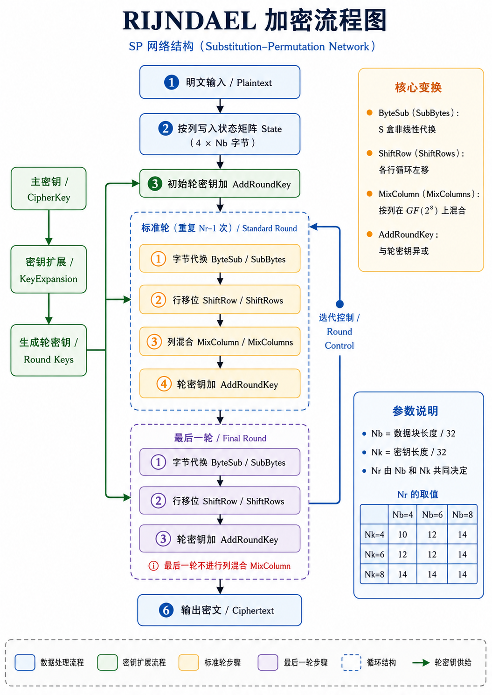
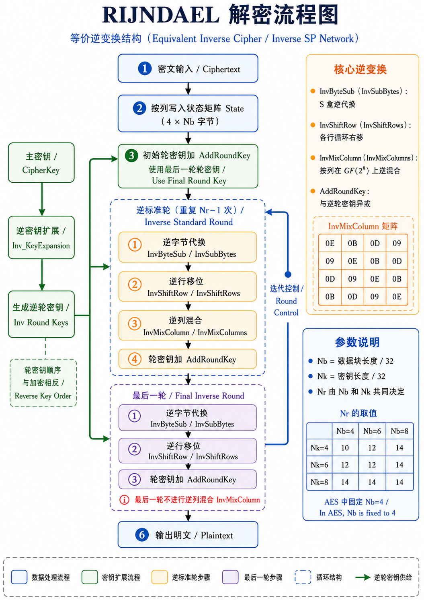

# AES(RIJNDAEL)算法介绍



AES 的数据块长度固定为 128 位，也就是 16 个字节，图中参数 $Nb$ 在 AES 中恒等于 4。密钥长度可以取 128、192、256 位，对应 $Nk=4,6,8$，轮数 $Nr$ 分别为 10、12、14。

### 1. 明文输入与状态矩阵 State

AES 处理的基本单位是 128 位明文分组。128 位等于 16 字节，设明文字节序列为：

$$
p_0,p_1,p_2,\ldots,p_{15}
$$

AES 会把这 16 个字节按列写入一个 $4\times 4$ 的状态矩阵 State：

$$
State=
\begin{bmatrix}
p_0 & p_4 & p_8 & p_{12}\\
p_1 & p_5 & p_9 & p_{13}\\
p_2 & p_6 & p_{10} & p_{14}\\
p_3 & p_7 & p_{11} & p_{15}
\end{bmatrix}
$$

这一点对应图片中的“按列写入状态矩阵 State（$4\times Nb$ 字节）”。由于 AES 中 $Nb=4$，所以状态矩阵就是 $4\times 4$ 字节。之后每一轮加密操作都作用在这个矩阵上。

AES 中，状态矩阵就是算法内部的中间状态；明文进入矩阵，经过多轮变换，矩阵中的字节逐步变成密文字节。

### 2. 初始轮密钥加 AddRoundKey

明文写入状态矩阵之后，马上进入初始轮密钥加。图中绿色箭头从左侧“生成轮密钥 / Round Keys”指向这个步骤，表示第 0 轮轮密钥参与运算。

AddRoundKey 的运算就是把当前状态矩阵和轮密钥逐字节异或。

设状态矩阵中的某个字节为 $s_{i,j}$，第 0 轮轮密钥中对应位置的字节为 $k^{(0)}_{i,j}$，那么初始轮密钥加之后得到：

$$
s_{i,j}\leftarrow s_{i,j}\oplus k^{(0)}_{i,j}
$$

AddRoundKey 的意义在于把主密钥派生出来的轮密钥注入状态矩阵，使后面的代换、移位和列混合都建立在密钥参与后的状态之上。

对于 AES-128，总共有 10 轮加密，但轮密钥共有 11 组。第 0 组轮密钥用于初始 AddRoundKey，第 1 到第 9 组用于标准轮，第 10 组用于最后一轮。

### 3. 左侧密钥扩展流程：CipherKey 到 Round Keys

图片左侧的绿色分支是密钥调度过程。它从“主密钥 / CipherKey”开始，经过“密钥扩展 / KeyExpansion”，生成“轮密钥 / Round Keys”，再把轮密钥送入初始轮、标准轮和最后一轮。

以 AES-128 为例，主密钥长度为 128 位，也就是 16 字节。AES 每一组轮密钥也需要 16 字节。由于 AES-128 需要第 0 到第 10 组轮密钥，所以总扩展密钥长度为：

$$
16\times(10+1)=176\text{ 字节}
$$

AES 密钥扩展通常按“字”来描述。一个字等于 4 字节。AES-128 的主密钥提供最开始的 4 个字：

$$
W_0,W_1,W_2,W_3
$$

之后递推生成：

$$
W_4,W_5,\ldots,W_{43}
$$

每 4 个 word 组成一组 128 位轮密钥：

$$
RoundKey_0=(W_0,W_1,W_2,W_3)
$$

依次类推，直到：

$$
RoundKey_{10}=(W_{40},W_{41},W_{42},W_{43})
$$

密钥扩展的基本递推关系可以写成：

$$
W_i=W_{i-Nk}\oplus Temp
$$

> 其中 $Nk$ 表示主密钥包含多少个字。AES-128 中 $Nk=4$，AES-192 中 $Nk=6$，AES-256 中 $Nk=8$。通常情况下：

$$
Temp=W_{i-1}
$$

**注意** 当 $i$ 是 $Nk$ 的整数倍时，需要对 $Temp$ 做三个处理：

$$
Temp=SubWord(RotWord(W_{i-1}))\oplus Rcon[i/Nk]
$$

这里，

- `RotWord` 把一个 4 字节字循环左移一个字节，例如：

$$
(a_0,a_1,a_2,a_3)\rightarrow(a_1,a_2,a_3,a_0)
$$

- `SubWord` 对 4 个字节分别查 S 盒。

- `Rcon` 是轮常量，用来让各轮轮密钥之间产生明确区分。

AES-256 还会在特定位置额外使用一次 `SubWord`，用于增强扩展密钥中非线性成分的密度。

- $i\mod Nk = 4$ 时，会对 $W_{i-1}$ 先进行一次 `SubWord` 变换

### 4. 标准轮：重复 $Nr-1$ 次的核心加密结构

图片中间蓝色虚线框标注为“标准轮（重复 $Nr-1$ 次）”。这一部分是 AES 加密的主体。

- 对于 AES-128，$Nr=10$，因此标准轮执行 9 次；
- 对于 AES-192，标准轮执行 11 次；
- 对于 AES-256，标准轮执行 13 次。

每一个标准轮包含四个顺序固定的步骤：

$$
SubBytes\rightarrow ShiftRows\rightarrow MixColumns\rightarrow AddRoundKey
$$

这一顺序体现了 AES 的 SP 网络结构。S 盒代换提供非线性，行移位改变字节位置，列混合实现扩散，轮密钥加把密钥材料注入当前状态。下面按图片中的四个小框逐一展开。

#### 4.1 字节代换 ByteSub / SubBytes

SubBytes 是作用在单个字节上的代换。状态矩阵中共有 16 个字节，每个字节都会独立查 S 盒，得到一个新的字节。设输入字节为 $x$，S 盒输出为：

$$
y=S(x)
$$

**AES 的 S 盒由两个阶段构造。**

第一阶段是在有限域 $GF(2^8)$ 中求乘法逆元。对输入字节 $x$，先得到 $x^{-1}$。当输入为 0 时，按照 AES 规定取 0。

第二阶段对逆元做仿射变换，得到最终输出字节。

用教材中的矩阵形式描述，设逆元写成 8 位向量：

$$
(x_0,x_1,\ldots,x_7)
$$

输出写成：

$$
(y_0,y_1,\ldots,y_7)
$$

则：

$$
\begin{bmatrix}
y_0\\y_1\\y_2\\y_3\\y_4\\y_5\\y_6\\y_7
\end{bmatrix}
=
A
\begin{bmatrix}
x_0\\x_1\\x_2\\x_3\\x_4\\x_5\\x_6\\x_7
\end{bmatrix}
\oplus
\begin{bmatrix}
1\\1\\0\\0\\0\\1\\1\\0
\end{bmatrix}
$$

其中 $A$ 是固定的 $8\times 8$ 二进制矩阵。这个步骤让输入字节和输出字节之间形成复杂的非线性关系。由于 S 盒逐字节作用，所以它本身负责“混淆”：攻击者即使观察到密文，也很难建立明文字节、密钥字节和输出字节之间的简单线性关系。

#### 4.2 行移位 ShiftRow / ShiftRows

SubBytes 完成后，AES 对状态矩阵按行做循环左移。设 SubBytes 后的状态矩阵为

$$
\begin{bmatrix}
a_{0,0} & a_{0,1} & a_{0,2} & a_{0,3}\\
a_{1,0} & a_{1,1} & a_{1,2} & a_{1,3}\\
a_{2,0} & a_{2,1} & a_{2,2} & a_{2,3}\\
a_{3,0} & a_{3,1} & a_{3,2} & a_{3,3}
\end{bmatrix}
$$

ShiftRows 后变为：

$$
\begin{bmatrix}
a_{0,0} & a_{0,1} & a_{0,2} & a_{0,3}\\
a_{1,1} & a_{1,2} & a_{1,3} & a_{1,0}\\
a_{2,2} & a_{2,3} & a_{2,0} & a_{2,1}\\
a_{3,3} & a_{3,0} & a_{3,1} & a_{3,2}
\end{bmatrix}
$$

也就是第 0 行左移 0 字节，第 1 行左移 1 字节，第 2 行左移 2 字节，第 3 行左移 3 字节。（AES-256的移动是1、3、4）

这一操作本身只改变字节位置。它的作用要和下一步 MixColumns 连起来看。MixColumns 是按列处理的，ShiftRows 把原来同一列中的字节分散到多个列中，再交给 MixColumns 处理。经过多轮之后，一个输入字节的影响会扩散到状态矩阵的多个位置。

#### 4.3 列混合 MixColumn / MixColumns

MixColumns 以列为单位处理状态矩阵。AES 把每一列看成 $GF(2^8)$ 上的四维向量，然后乘以一个固定矩阵：

$$
\begin{bmatrix}
02 & 03 & 01 & 01\\
01 & 02 & 03 & 01\\
01 & 01 & 02 & 03\\
03 & 01 & 01 & 02
\end{bmatrix}
$$

设某一列为：

$$
\begin{bmatrix}
s_0\\s_1\\s_2\\s_3
\end{bmatrix}
$$

经过 MixColumns 后得到：

$$
\begin{bmatrix}
s'_0\\s'_1\\s'_2\\s'_3
\end{bmatrix}
=
\begin{bmatrix}
02 & 03 & 01 & 01\\
01 & 02 & 03 & 01\\
01 & 01 & 02 & 03\\
03 & 01 & 01 & 02
\end{bmatrix}
\begin{bmatrix}
s_0\\s_1\\s_2\\s_3
\end{bmatrix}
$$

展开后是：

$$
s'_0=(02\cdot s_0)\oplus(03\cdot s_1)\oplus s_2\oplus s_3
$$

这里的加法是异或，乘法是在 $GF(2^8)$ 上完成。AES 中字节可以看成次数小于 8 的二进制多项式。例如字节 `0x57` 的二进制是 `01010111`，可以表示为：

$$
x^6+x^4+x^2+x+1
$$

在这个域中，乘以 `02` 相当于乘以 $x$。当结果超出 8 位时，要用 AES 规定的模多项式：

$$
m(x)=x^8+x^4+x^3+x+1
$$

进行化简。工程实现中常见规则是：字节左移一位，若移出最高位，则再异或 `0x1B`。乘以 `03` 可以写成：

$$
03\cdot s=(02\cdot s)\oplus s
$$

所以 MixColumns 可以用移位和异或高效实现。

MixColumns 的作用是扩散。一列中的 4 个输入字节共同决定 4 个输出字节。经过 ShiftRows 和 MixColumns 配合，字节之间的影响范围会从局部列扩展到整个状态矩阵。

#### 4.4 轮密钥加 AddRoundKey

标准轮的最后一步仍然是 AddRoundKey。第 $r$ 轮使用第 $r$ 组轮密钥：

$$
State\leftarrow State\oplus RoundKey_r
$$

这个步骤把密钥材料持续注入状态。AES 中只有 AddRoundKey 直接使用密钥，SubBytes、ShiftRows、MixColumns 都是固定变换。由于每轮轮密钥由主密钥扩展得到，每一轮状态都受到主密钥控制。

### 5. 右侧迭代控制 Round Control

图片中标准轮右侧有“迭代控制 / Round Control”的回环箭头。这个回环表示标准轮会重复执行 $Nr-1$ 次。循环变量可以写成：

$$
r=1,2,\ldots,Nr-1
$$

每一轮都执行：

$$
State\leftarrow AddRoundKey(MixColumns(ShiftRows(SubBytes(State))),RoundKey_r)
$$

以 AES-128 为例：

$$
r=1,2,\ldots,9
$$

因此前 9 轮都包含 MixColumns。每一轮处理之后，状态矩阵继续进入下一轮，直到标准轮循环完成，再进入图片下方的最后一轮。

### 6. 最后一轮 Final Round

图片中紫色虚线框标注为“最后一轮 / Final Round”。这一轮包含三个步骤：

$$
SubBytes\rightarrow ShiftRows\rightarrow AddRoundKey
$$

图中红字提示“最后一轮省去列混合 MixColumn”。因此最后一轮的形式为：

$$
State\leftarrow AddRoundKey(ShiftRows(SubBytes(State)),RoundKey_{Nr})
$$

以 AES-128 为例，最后一轮是第 10 轮，使用 $RoundKey_{10}$。这一步完成后，状态矩阵中的 16 个字节按列读出，得到最终密文。

从结构上看，最后一轮保留了 S 盒代换、行移位和轮密钥加。这样密文输出前仍经过非线性代换和密钥注入，同时加密流程与解密流程可以形成更清晰的逆向对应关系。

### 7. 输出密文 Ciphertext

最后一轮结束后，状态矩阵就是密文状态。AES 按列把状态矩阵读出，恢复成 16 字节密文序列。若最后状态矩阵为：

$$
\begin{bmatrix}
c_0 & c_4 & c_8 & c_{12}\\
c_1 & c_5 & c_9 & c_{13}\\
c_2 & c_6 & c_{10} & c_{14}\\
c_3 & c_7 & c_{11} & c_{15}
\end{bmatrix}
$$

那么输出密文为：

$$
c_0,c_1,c_2,\ldots,c_{15}
$$

这和明文写入状态矩阵时的列优先顺序相对应。


### 8.  AES-128 的完整流程

以最常见的 AES-128 为例

第一步，输入 128 位明文，按列写入 $4\times 4$ 状态矩阵。

第二步，主密钥经过 KeyExpansion 生成 11 组轮密钥：

$$
RoundKey_0,RoundKey_1,\ldots,RoundKey_{10}
$$

第三步，状态矩阵先与 $RoundKey_0$ 异或，完成初始 AddRoundKey。

第四步，执行第 1 到第 9 轮标准轮。每一轮依次执行：

$$
SubBytes\rightarrow ShiftRows\rightarrow MixColumns\rightarrow AddRoundKey
$$

其中第 $r$ 轮使用 $RoundKey_r$。

第五步，执行第 10 轮最后轮。最后轮依次执行：

$$
SubBytes\rightarrow ShiftRows\rightarrow AddRoundKey
$$

并使用 $RoundKey_{10}$。

第六步，将最终状态矩阵按列读出，得到 128 位密文。

用紧凑公式表示，AES-128 加密可以写成：

$$
State_0=Plaintext
$$

### 9. 算法实现

```python
from __future__ import annotations

# ============================================================
# 1. GF(2^8) 有限域运算
# AES 的 SubBytes 和 MixColumns 都建立在 GF(2^8) 上。
# 一个字节可以看成次数小于 8 的二进制多项式。
# AES 使用的模多项式为：
# m(x) = x^8 + x^4 + x^3 + x + 1
# 工程实现中，对应的化简常量是 0x1B。
# ============================================================
def gmul(a: int, b: int) -> int:
    """
    GF(2^8) 上的字节乘法。
    参数：
        a, b: 0~255 的整数，表示两个字节。
    返回：
        a * b 在 AES 有限域中的乘积。
    实现思路：
        逐位检查 b。
        当 b 的最低位为 1 时，把当前 a 加入结果。
        GF(2^8) 中的加法就是异或。
        每轮把 a 乘以 x，相当于左移一位。
        若左移前最高位为 1，则左移后需要用 0x1B 做模化简。
    """
    result = 0

    for _ in range(8):
        if b & 1:
            result ^= a

        carry = a & 0x80
        a = (a << 1) & 0xFF

        if carry:
            a ^= 0x1B

        b >>= 1

    return result


def gf_pow(a: int, n: int) -> int:
    """
    GF(2^8) 上的快速幂。
    AES S 盒构造中需要求乘法逆元。
    对非零元素 a，有 a^255 = 1，所以 a 的逆元为 a^254。
    """
    result = 1

    while n > 0:
        if n & 1:
            result = gmul(result, a)

        a = gmul(a, a)
        n >>= 1

    return result


def gf_inv(a: int) -> int:
    """
    GF(2^8) 上的乘法逆元。
    AES 规定输入 0 时，逆元阶段输出 0。
    其他字节通过 a^254 得到逆元。
    """
    if a == 0:
        return 0

    return gf_pow(a, 254)


# ============================================================
# 2. S 盒生成：SubBytes 的核心
# AES S 盒由两部分组成：
# 先在 GF(2^8) 中求逆元，再做仿射变换。
# ============================================================
def affine_transform(x: int) -> int:
    """
    AES S 盒中的仿射变换。
    参数：
        x: 求逆元后的 8 位输入。
    返回：
        经过固定仿射变换后的 8 位输出。
    位级公式：
        y_i = x_i ⊕ x_{i+4} ⊕ x_{i+5} ⊕ x_{i+6} ⊕ x_{i+7} ⊕ c_i
        下标按 mod 8 处理。
        常量 c = 0x63。
    """
    c = 0x63
    y = 0

    for i in range(8):
        bit = (
            ((x >> i) & 1)
            ^ ((x >> ((i + 4) & 7)) & 1)
            ^ ((x >> ((i + 5) & 7)) & 1)
            ^ ((x >> ((i + 6) & 7)) & 1)
            ^ ((x >> ((i + 7) & 7)) & 1)
            ^ ((c >> i) & 1)
        )
        y |= bit << i

    return y


# 正向 S 盒：用于加密中的 SubBytes
S_BOX = [affine_transform(gf_inv(i)) for i in range(256)]

# 逆向 S 盒：用于解密中的 InvSubBytes
INV_S_BOX = [0] * 256
for i, value in enumerate(S_BOX):
    INV_S_BOX[value] = i


# ============================================================
# 3. 状态矩阵 State 与字 Word
# AES 每个明文分组为 16 字节。
# 内部状态按列组织为 4 个 word，每个 word 为 4 字节。
#
# 明文字节：
# p0 p1 p2 ... p15
#
# 状态矩阵逻辑形态：
# [ p0   p4   p8   p12 ]
# [ p1   p5   p9   p13 ]
# [ p2   p6   p10  p14 ]
# [ p3   p7   p11  p15 ]
#
# 代码中 state[c][r] 表示第 c 列第 r 行。
# ============================================================
def bytes_to_matrix(block: bytes) -> list[list[int]]:
    """
    16 字节分组转为 AES 状态结构。
    返回结构为 4 个列向量：
        [
            [p0, p1, p2, p3],
            [p4, p5, p6, p7],
            [p8, p9, p10, p11],
            [p12, p13, p14, p15],
        ]
    这种存储方式和 AES 按列处理的逻辑一致。
    """
    return [list(block[i:i + 4]) for i in range(0, len(block), 4)]


def matrix_to_bytes(matrix: list[list[int]]) -> bytes:
    """
    AES 状态结构转回字节序列。
    由于状态按列保存，所以直接按列拼接即可恢复 AES 输出顺序。
    """
    return bytes(sum(matrix, []))


def xor_words(a: list[int], b: list[int]) -> list[int]:
    """
    两个 word 做逐字节异或。
    word 在 AES 中表示 4 字节。
    """
    return [x ^ y for x, y in zip(a, b)]


def rot_word(word: list[int]) -> list[int]:
    """
    KeyExpansion 中的 RotWord。
    例如：
        [a0, a1, a2, a3] -> [a1, a2, a3, a0]
    """
    return word[1:] + word[:1]


def sub_word(word: list[int]) -> list[int]:
    """
    KeyExpansion 中的 SubWord。
    对 word 中的 4 个字节分别查 S 盒。
    """
    return [S_BOX[b] for b in word]


def make_rcon(count: int = 15) -> list[int]:
    """
    生成密钥扩展需要的轮常量 Rcon。
    Rcon[i] 的第一个字节是 GF(2^8) 中的 2^(i-1)，
    后三个字节在使用时取 0。
    """
    rcon = [0x00]
    value = 0x01

    for _ in range(1, count):
        rcon.append(value)
        value = gmul(value, 0x02)

    return rcon


RCON = make_rcon()


# ============================================================
# 4. 密钥扩展 KeyExpansion
# 图中左侧流程：
# 主密钥 CipherKey -> 密钥扩展 KeyExpansion -> 轮密钥 Round Keys
#
# AES-128: Nk = 4, Nr = 10
# AES-192: Nk = 6, Nr = 12
# AES-256: Nk = 8, Nr = 14
# 其中 Nk 表示主密钥包含多少个 word。
# ============================================================
def expand_key(master_key: bytes) -> tuple[list[list[list[int]]], int]:
    """
    根据主密钥生成所有轮密钥。
    参数：
        master_key:
            16 字节 -> AES-128
            24 字节 -> AES-192
            32 字节 -> AES-256
    返回：
        round_keys:
            每个元素是一组轮密钥。
            每组轮密钥包含 4 个 word，也就是 16 字节。
        nr:
            AES 轮数。
    """
    key_len = len(master_key)

    if key_len not in (16, 24, 32):
        raise ValueError("AES key length must be 16, 24, or 32 bytes")

    nk = key_len // 4
    nr = nk + 6

    # 主密钥先切分成若干 word
    words = bytes_to_matrix(master_key)

    # AES 需要 nr + 1 组轮密钥，每组 4 个 word
    target_words = 4 * (nr + 1)

    while len(words) < target_words:
        i = len(words)
        temp = words[-1].copy()

        # 每隔 nk 个 word 触发一次核心变换：
        # RotWord -> SubWord -> XOR Rcon
        if i % nk == 0:
            temp = xor_words(
                sub_word(rot_word(temp)),
                [RCON[i // nk], 0x00, 0x00, 0x00],
            )

        # AES-256 的额外 SubWord 规则
        elif nk > 6 and i % nk == 4:
            temp = sub_word(temp)

        # 新 word 由前 nk 个 word 与 temp 异或得到
        words.append(xor_words(words[i - nk], temp))

    # 每 4 个 word 组成一组轮密钥
    round_keys = [
        words[4 * i: 4 * (i + 1)]
        for i in range(nr + 1)
    ]

    return round_keys, nr


# ============================================================
# 5. AddRoundKey：轮密钥加
# 图中对应：
# 初始轮密钥加 AddRoundKey
# 标准轮中的 AddRoundKey
# 最后一轮中的 AddRoundKey
# ============================================================
def add_round_key(state: list[list[int]], round_key: list[list[int]]) -> None:
    """
    状态矩阵与轮密钥逐字节异或。
    state[c][r] 表示第 c 列第 r 行。
    round_key 使用同样的列式结构。
    """
    for c in range(4):
        for r in range(4):
            state[c][r] ^= round_key[c][r]


# ============================================================
# 6. SubBytes：字节代换
# 图中标准轮和最后一轮的第一个步骤。
# ============================================================


def sub_bytes(state: list[list[int]]) -> None:
    """
    对状态矩阵中的每个字节执行 S 盒代换。
    """
    for c in range(4):
        for r in range(4):
            state[c][r] = S_BOX[state[c][r]]


def inv_sub_bytes(state: list[list[int]]) -> None:
    """
    解密时使用的逆字节代换。
    """
    for c in range(4):
        for r in range(4):
            state[c][r] = INV_S_BOX[state[c][r]]


# ============================================================
# 7. ShiftRows：行移位
# 图中标准轮和最后一轮的第二个步骤。
#
# 第 0 行左移 0 字节
# 第 1 行左移 1 字节
# 第 2 行左移 2 字节
# 第 3 行左移 3 字节
# ============================================================
def shift_rows(state: list[list[int]]) -> None:
    """
    对状态矩阵的每一行做循环左移。

    由于代码中 state 按列存储，所以先取出某一行，
    完成循环左移后再写回对应位置。
    """
    for r in range(1, 4):
        row = [state[c][r] for c in range(4)]
        row = row[r:] + row[:r]

        for c in range(4):
            state[c][r] = row[c]


def inv_shift_rows(state: list[list[int]]) -> None:
    """
    解密时使用的逆行移位。
    第 r 行循环右移 r 个字节。
    """
    for r in range(1, 4):
        row = [state[c][r] for c in range(4)]
        row = row[-r:] + row[:-r]

        for c in range(4):
            state[c][r] = row[c]


# ============================================================
# 8. MixColumns：列混合
# 图中标准轮的第三个步骤。
#
# 对每一列乘以固定矩阵：
# [02 03 01 01]
# [01 02 03 01]
# [01 01 02 03]
# [03 01 01 02]
# ============================================================
def mix_single_column(col: list[int]) -> None:
    """
    对状态矩阵的一列执行 MixColumns。
    输入列：
        [s0, s1, s2, s3]
    输出列：
        s0' = 02*s0 ⊕ 03*s1 ⊕ 01*s2 ⊕ 01*s3
        s1' = 01*s0 ⊕ 02*s1 ⊕ 03*s2 ⊕ 01*s3
        s2' = 01*s0 ⊕ 01*s1 ⊕ 02*s2 ⊕ 03*s3
        s3' = 03*s0 ⊕ 01*s1 ⊕ 01*s2 ⊕ 02*s3
    """
    a0, a1, a2, a3 = col

    col[0] = gmul(a0, 0x02) ^ gmul(a1, 0x03) ^ a2 ^ a3
    col[1] = a0 ^ gmul(a1, 0x02) ^ gmul(a2, 0x03) ^ a3
    col[2] = a0 ^ a1 ^ gmul(a2, 0x02) ^ gmul(a3, 0x03)
    col[3] = gmul(a0, 0x03) ^ a1 ^ a2 ^ gmul(a3, 0x02)


def mix_columns(state: list[list[int]]) -> None:
    """
    对状态矩阵的 4 列分别执行 MixColumns。
    """
    for c in range(4):
        mix_single_column(state[c])
        
        
def inv_mix_single_column(col: list[int]) -> None:
    """
    解密时使用的逆列混合。
    逆矩阵为：
        [0E 0B 0D 09]
        [09 0E 0B 0D]
        [0D 09 0E 0B]
        [0B 0D 09 0E]
    """
    a0, a1, a2, a3 = col

    col[0] = (
        gmul(a0, 0x0E)
        ^ gmul(a1, 0x0B)
        ^ gmul(a2, 0x0D)
        ^ gmul(a3, 0x09)
    )

    col[1] = (
        gmul(a0, 0x09)
        ^ gmul(a1, 0x0E)
        ^ gmul(a2, 0x0B)
        ^ gmul(a3, 0x0D)
    )

    col[2] = (
        gmul(a0, 0x0D)
        ^ gmul(a1, 0x09)
        ^ gmul(a2, 0x0E)
        ^ gmul(a3, 0x0B)
    )

    col[3] = (
        gmul(a0, 0x0B)
        ^ gmul(a1, 0x0D)
        ^ gmul(a2, 0x09)
        ^ gmul(a3, 0x0E)
    )


def inv_mix_columns(state: list[list[int]]) -> None:
    """
    对状态矩阵的 4 列分别执行 InvMixColumns。
    """
    for c in range(4):
        inv_mix_single_column(state[c])


# ============================================================
# 9. AES 单分组加密
# 图中间主流程：
# 明文输入
# -> 状态矩阵
# -> 初始 AddRoundKey
# -> 标准轮重复 Nr-1 次
# -> 最后一轮
# -> 密文输出
# ============================================================
def encrypt_block(block: bytes, master_key: bytes) -> bytes:
    """
    加密一个 16 字节分组。
    标准轮：
        SubBytes -> ShiftRows -> MixColumns -> AddRoundKey
    最后一轮：
        SubBytes -> ShiftRows -> AddRoundKey
    参数：
        block:
            16 字节明文分组。
        master_key:
            16、24 或 32 字节主密钥。
    返回：
        16 字节密文分组。
    """
    if len(block) != 16:
        raise ValueError("AES block length must be 16 bytes")

    round_keys, nr = expand_key(master_key)
    state = bytes_to_matrix(block)

    # 初始轮密钥加：使用 RoundKey_0
    add_round_key(state, round_keys[0])

    # 标准轮：第 1 轮到第 Nr-1 轮
    for round_index in range(1, nr):
        sub_bytes(state)
        shift_rows(state)
        mix_columns(state)
        add_round_key(state, round_keys[round_index])

    # 最后一轮：省略 MixColumns
    sub_bytes(state)
    shift_rows(state)
    add_round_key(state, round_keys[nr])

    return matrix_to_bytes(state)


# ============================================================
# 10. AES 单分组解密
# 加密流程的逆过程：
# AddRoundKey
# -> InvShiftRows
# -> InvSubBytes
# -> AddRoundKey
# -> InvMixColumns
# ============================================================
def decrypt_block(block: bytes, master_key: bytes) -> bytes:
    """
    解密一个 16 字节分组。
    参数：
        block:
            16 字节密文分组。
        master_key:
            16、24 或 32 字节主密钥。
    返回：
        16 字节明文分组。
    """
    if len(block) != 16:
        raise ValueError("AES block length must be 16 bytes")

    round_keys, nr = expand_key(master_key)
    state = bytes_to_matrix(block)

    # 解密从最后一组轮密钥开始
    add_round_key(state, round_keys[nr])

    # 中间逆轮：第 Nr-1 轮回到第 1 轮
    for round_index in range(nr - 1, 0, -1):
        inv_shift_rows(state)
        inv_sub_bytes(state)
        add_round_key(state, round_keys[round_index])
        inv_mix_columns(state)

    # 逆向收尾：对应加密开始处的初始 AddRoundKey
    inv_shift_rows(state)
    inv_sub_bytes(state)
    add_round_key(state, round_keys[0])

    return matrix_to_bytes(state)


# ============================================================
# 11. PKCS#7 填充
# AES 的单分组长度固定为 16 字节。
# 多字节消息进入 AES 前，需要补齐到 16 字节整数倍。
# ============================================================
def pkcs7_pad(data: bytes, block_size: int = 16) -> bytes:
    """
    PKCS#7 填充。

    若原始数据长度已经是 16 的整数倍，
    仍会补上一整块 0x10。
    这样解密后才能准确识别填充长度。
    """
    pad_len = block_size - len(data) % block_size
    return data + bytes([pad_len]) * pad_len


def pkcs7_unpad(data: bytes, block_size: int = 16) -> bytes:
    """
    移除 PKCS#7 填充。
    """
    if len(data) == 0 or len(data) % block_size != 0:
        raise ValueError("invalid PKCS#7 data length")

    pad_len = data[-1]

    if pad_len < 1 or pad_len > block_size:
        raise ValueError("invalid PKCS#7 padding")

    if data[-pad_len:] != bytes([pad_len]) * pad_len:
        raise ValueError("invalid PKCS#7 padding")

    return data[:-pad_len]


# ============================================================
# 12. ECB 模式演示
# 这里用于展示多个分组如何调用 encrypt_block。
# 工程项目中通常采用带认证能力的模式，例如 AES-GCM。
# ============================================================
def encrypt_ecb(data: bytes, master_key: bytes) -> bytes:
    """
    ECB 模式加密演示。
    过程：
        1. 对数据做 PKCS#7 填充。
        2. 每 16 字节切成一个分组。
        3. 分别调用 encrypt_block。
    """
    data = pkcs7_pad(data)

    result = bytearray()

    for i in range(0, len(data), 16):
        result.extend(encrypt_block(data[i:i + 16], master_key))

    return bytes(result)


def decrypt_ecb(ciphertext: bytes, master_key: bytes) -> bytes:
    """
    ECB 模式解密演示。
    过程：
        1. 每 16 字节切成一个密文分组。
        2. 分别调用 decrypt_block。
        3. 合并后移除 PKCS#7 填充。
    """
    if len(ciphertext) % 16 != 0:
        raise ValueError("ciphertext length must be a multiple of 16 bytes")

    result = bytearray()

    for i in range(0, len(ciphertext), 16):
        result.extend(decrypt_block(ciphertext[i:i + 16], master_key))

    return pkcs7_unpad(bytes(result))


# ============================================================
# 13. 测试与演示
# demo_block 使用 AES 常见测试向量：
# key       = 000102030405060708090a0b0c0d0e0f
# plaintext = 00112233445566778899aabbccddeeff
# ciphertext= 69c4e0d86a7b0430d8cdb78070b4c55a
# ============================================================
def demo_block() -> None:
    """
    单分组 AES-128 测试。
    """
    key = bytes.fromhex("000102030405060708090a0b0c0d0e0f")
    plaintext = bytes.fromhex("00112233445566778899aabbccddeeff")

    ciphertext = encrypt_block(plaintext, key)
    recovered = decrypt_block(ciphertext, key)

    print("AES-128 single block test")
    print("key       =", key.hex())
    print("plaintext =", plaintext.hex())
    print("ciphertext=", ciphertext.hex())
    print("recovered =", recovered.hex())

    expected = "69c4e0d86a7b0430d8cdb78070b4c55a"
    print("expected  =", expected)
    print("pass      =", ciphertext.hex() == expected and recovered == plaintext)


def demo_ecb() -> None:
    """
    多分组文本加解密演示。
    """
    key = b"this_is_16_bytes"
    data = "RIJNDAEL / AES 加密流程演示".encode("utf-8")

    ciphertext = encrypt_ecb(data, key)
    recovered = decrypt_ecb(ciphertext, key)

    print()
    print("ECB demo")
    print("plaintext =", data.decode("utf-8"))
    print("ciphertext=", ciphertext.hex())
    print("recovered =", recovered.decode("utf-8"))


if __name__ == "__main__":
    demo_block()
    demo_ecb()
```

### 解密算法


