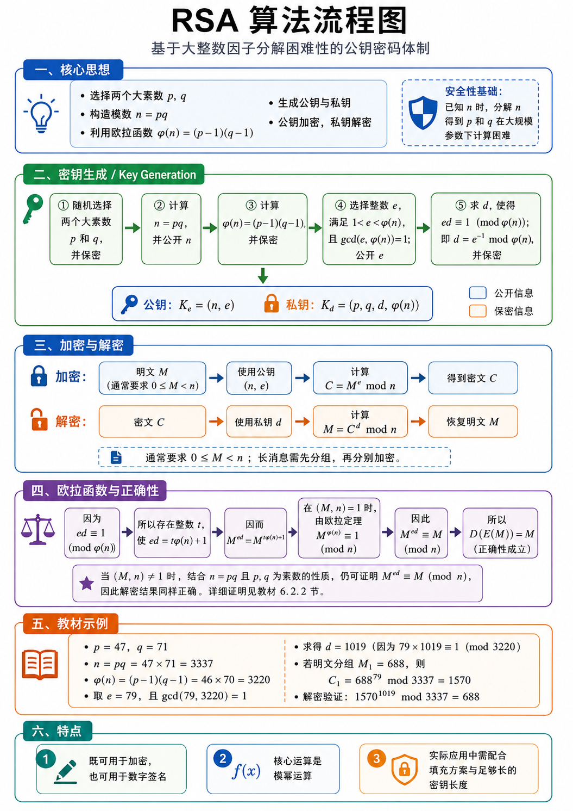
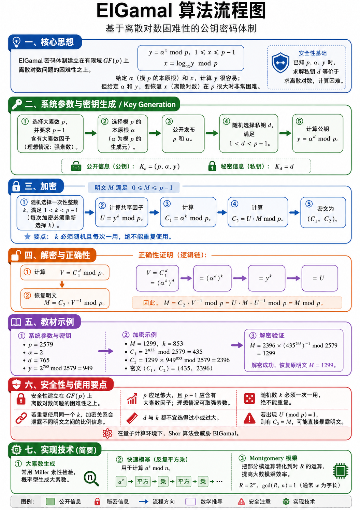

## RSA算法介绍



### 核心思想：RSA 先把“加密问题”转成“模幂运算问题”

RSA 属于公钥密码体制，它和对称加密算法的思路有明显差异：通信双方使用两类密钥，一类可以公开，另一类需要保密。公开密钥用于加密，保密密钥用于解密。

整个算法从两个大素数开始，记为 $p$ 和 $q$。这两个数选出来之后，要计算

$$
n=pq
$$

这里的 $n$ 称为模数。RSA 后面的加密和解密都围绕“对 $n$ 取模”展开。也就是说，明文会被转成一个小于 $n$ 的整数 $M$，然后通过模幂运算得到密文；密文再通过另一个模幂运算还原为明文。

然后介绍一下欧拉函数：

$$
\varphi(n)=(p-1)(q-1)
$$

这个公式成立的前提是 $p$ 和 $q$ 都是素数，且 $n=pq$。**$\varphi(n)$ 表示从 $1$ 到 $n-1$ 中与 $n$ 互素的整数个数**。RSA 后面选择加密指数 $e$、计算解密指数 $d$，都要依赖 $\varphi(n)$。

这一块的安全性基础来自一个计算困难问题：外部人员可以看到 $n$，从 $n$ 反推出 $p$ 和 $q$ 的过程需要做大整数因子分解。在实际参数足够大的情况下，这个分解过程需要极高计算成本。掌握 $p,q$ 的人可以计算 $\varphi(n)$，再计算私钥；只看到 $n$ 的人很难走完这一链条。

### 密钥生成：先构造公开计算规则，再构造保密反向指数

RSA 的关键就在这一部分，因为后面的加密和解密公式很短，真正决定算法结构的是 $p,q,n,\varphi(n),e,d$ 之间的关系。

第一步随机选择两个大素数 $p$ 和 $q$，并把它们保密。

这里强调“大素数”，是因为 $p$ 和 $q$ 太小会让因子分解变得容易。

> 教材示例为了方便手算使用 $47$ 和 $71$，真实系统会使用远大于这个规模的素数。

第二步计算

$$
n=pq
$$

并公开 $n$。$n$ 是后续模运算的公共模数。加密和解密的末尾都会对 $n$ 取模。公钥里会包含 $n$，所以任何发送者都能使用同一个模数完成加密。

第三步计算

$$
\varphi(n)=(p-1)(q-1)
$$

并保密。$\varphi(n)$ 的作用是连接 $e$ 与 $d$。知道 $p$ 和 $q$ 之后，即可直接算出 $\varphi(n)$。外部人员只知道 $n$，则需要先分解 $n$ 才能得到 $p,q$，进而得到 $\varphi(n)$。

第四步选择整数 $e$，使它满足

$$
1<e<\varphi(n),\qquad \gcd(e,\varphi(n))=1
$$

这里的 $\gcd(e,\varphi(n))=1$ 表示 $e$ 与 $\varphi(n)$ 互素。这样做的意义是保证 $e$ 在模 $\varphi(n)$ 意义下存在乘法逆元。这意味着后面才能找到一个 $d$，使 $e$ 和 $d$ 相乘后对 $\varphi(n)$ 取模余 $1$。

第五步求 $d$，使得

$$
ed\equiv 1\pmod{\varphi(n)}
$$

这表示 $d$ 是 $e$ 关于模 $\varphi(n)$ 的乘法逆元，常写成

$$
d=e^{-1}\bmod \varphi(n)
$$

$d$ 是私钥中最核心的部分。图中给出最终密钥形式：

$$
K_e=(n,e)
$$

这是公钥，可以公开给发送者。发送者拿到 $n$ 和 $e$，就可以完成加密。

$$
K_d=(p,q,d,\varphi(n))
$$

这是私钥相关信息，需要保密。实际系统中通常重点保存 $d$，同时也会保存 $p,q$ 以便利用中国剩余定理提升解密效率。教材写成 $p,q,d,\varphi(n)$，是为了把理论推导中用到的量完整展示出来。

### 加密与解密：同一个模数下的两次指数运算

加密时，先把明文转成整数 $M$，通常要求

$$
0\le M<n
$$

然后使用公钥 $(n,e)$ 计算：

$$
C=M^e\bmod n
$$

这里的 $C$ 就是密文。公式含义是：先计算 $M^e$，再除以 $n$ 取余数。实际计算中直接计算 $M^e$ 会非常大，所以程序会使用快速模幂算法，在乘法过程中持续取模，使数值始终保持在可处理范围内。

解密时，接收者拿到密文 $C$，使用私钥指数 $d$ 计算：

$$
M=C^d\bmod n
$$

这个结果会回到原来的明文整数 $M$。从形式上看，加密和解密都是模幂运算，区别在于加密使用公开指数 $e$，解密使用保密指数 $d$。

图中补充了“长消息需先分组”。这是因为单个明文整数必须落在 $0\le M$ 的范围内。实际文本、文件或网络数据会先被编码成字节串，再按照密钥长度和填充方案切分为多个块，每个块分别进入 RSA 运算。实际工程中还会使用 OAEP 等填充方案，使同一明文在多次加密时产生更安全的密文形式。

### 欧拉函数与正确性：为什么解密能还原明文

这里要说明的是：加密得到

$$
C=M^e\bmod n
$$

再解密

$$
C^d\bmod n
$$

最终为何会回到 $M$。

---

由于 $d$ 是 $e$ 在模 $\varphi(n)$ 意义下的乘法逆元，所以有

$$
ed\equiv 1\pmod{\varphi(n)}
$$

这个同余式等价于存在某个整数 $t$，使得

$$
ed=t\varphi(n)+1
$$

把这个关系代入解密表达式：

$$
C^d\equiv (M^e)^d=M^{ed}\pmod n
$$

再用 $ed=t\varphi(n)+1$，得到

$$
M^{ed}=M^{t\varphi(n)+1}=M\cdot (M^{\varphi(n)})^t
$$

当 $M$ 与 $n$ 互素时，根据欧拉定理：

$$
M^{\varphi(n)}\equiv 1\pmod n
$$

于是

$$
M^{ed}\equiv M\cdot 1^t\equiv M\pmod n
$$

所以解密结果就是原明文。

教材中还进一步讨论了 $M$ 与 $n$ 含有公共因子的情形。由于 $n=pq$，且 $p,q$ 都是素数，公共因子只能落在 $p$ 或 $q$ 相关的情况中。教材通过分别考察模 $p$ 和模 $q$ 下的同余关系，再合并到模 $n$ 下，说明解密结果仍然会回到 $M$。这一部分保证了 RSA 正确性覆盖更完整的明文范围。

这块内容的核心链条可以整理为：

$$
ed\equiv1\pmod{\varphi(n)}
\Rightarrow
ed=t\varphi(n)+1
\Rightarrow
M^{ed}=M^{t\varphi(n)+1}
\Rightarrow
M^{ed}\equiv M\pmod n
$$

它说明了 $e$ 和 $d$ 的选择方式具有明确目标：让两次指数运算在模 $n$ 意义下互相抵消。

### 算法实现

```python
import secrets
from dataclasses import dataclass
from math import gcd


@dataclass(frozen=True)
class PublicKey:
    n: int
    e: int


@dataclass(frozen=True)
class PrivateKey:
    n: int
    d: int
    p: int
    q: int
    phi: int


def extended_gcd(a: int, b: int) -> tuple[int, int, int]:
    """
    扩展欧几里得算法。
    返回 g, x, y，使得 ax + by = g，其中 g = gcd(a, b)。
    """
    if b == 0:
        return a, 1, 0

    g, x1, y1 = extended_gcd(b, a % b)
    x = y1
    y = x1 - (a // b) * y1
    return g, x, y


def mod_inverse(a: int, m: int) -> int:
    """
    求 a 在模 m 意义下的乘法逆元。
    也就是求 x，使得 ax ≡ 1 (mod m)。
    """
    g, x, _ = extended_gcd(a, m)

    if g != 1:
        raise ValueError("a 与 m 互素时才存在模逆元")

    return x % m


def is_probable_prime(n: int, rounds: int = 40) -> bool:
    """
    Miller-Rabin 素性测试。
    返回 True 表示 n 具有极高概率为素数。
    """
    if n < 2:
        return False

    small_primes = [
        2, 3, 5, 7, 11, 13, 17, 19, 23, 29,
        31, 37, 41, 43, 47
    ]

    for p in small_primes:
        if n == p:
            return True
        if n % p == 0:
            return False

    # 将 n - 1 写成 2^s * d，其中 d 为奇数
    d = n - 1
    s = 0

    while d % 2 == 0:
        s += 1
        d //= 2

    for _ in range(rounds):
        a = secrets.randbelow(n - 3) + 2
        x = pow(a, d, n)

        if x == 1 or x == n - 1:
            continue

        for _ in range(s - 1):
            x = pow(x, 2, n)

            if x == n - 1:
                break
        else:
            return False

    return True


def generate_prime(bits: int) -> int:
    """
    生成指定 bit 长度的大素数。
    """
    if bits < 16:
        raise ValueError("bit 长度过小，课堂演示建议至少 16 bit")

    while True:
        candidate = secrets.randbits(bits)

        # 保证最高位为 1，使其达到指定 bit 长度
        candidate |= (1 << (bits - 1))

        # 保证为奇数
        candidate |= 1

        if is_probable_prime(candidate):
            return candidate


def generate_keypair(bits: int = 1024, e: int = 65537) -> tuple[PublicKey, PrivateKey]:
    """
    生成 RSA 公钥与私钥。

    bits 表示 n 的 bit 长度。
    e 通常取 65537，这是常用公开指数。
    """
    if bits < 64:
        raise ValueError("bit 长度过小，建议课堂演示至少使用 64 bit")

    half_bits = bits // 2

    while True:
        p = generate_prime(half_bits)
        q = generate_prime(half_bits)

        if p == q:
            continue

        n = p * q
        phi = (p - 1) * (q - 1)

        if gcd(e, phi) == 1:
            d = mod_inverse(e, phi)
            public_key = PublicKey(n=n, e=e)
            private_key = PrivateKey(n=n, d=d, p=p, q=q, phi=phi)
            return public_key, private_key


def encrypt_int(m: int, public_key: PublicKey) -> int:
    """
    加密单个整数明文 M。
    对应教材公式：C = M^e mod n。
    """
    if not (0 <= m < public_key.n):
        raise ValueError("明文整数 M 需要满足 0 <= M < n")

    return pow(m, public_key.e, public_key.n)


def decrypt_int(c: int, private_key: PrivateKey) -> int:
    """
    解密单个整数密文 C。
    对应教材公式：M = C^d mod n。
    """
    if not (0 <= c < private_key.n):
        raise ValueError("密文整数 C 需要满足 0 <= C < n")

    return pow(c, private_key.d, private_key.n)


def encrypt_bytes(data: bytes, public_key: PublicKey) -> bytes:
    """
    加密字节串。

    做法：
    1. 先在开头写入原文长度；
    2. 将数据切成多个整数块；
    3. 每个整数块分别执行 RSA 加密；
    4. 输出拼接后的密文字节串。
    """
    plain_block_size = (public_key.n.bit_length() - 1) // 8
    cipher_block_size = (public_key.n.bit_length() + 7) // 8

    if plain_block_size <= 8:
        raise ValueError("n 过小，无法用于字节串分组演示")

    payload = len(data).to_bytes(8, "big") + data
    encrypted_blocks = []

    for i in range(0, len(payload), plain_block_size):
        block = payload[i:i + plain_block_size]
        block = block.ljust(plain_block_size, b"\x00")

        m = int.from_bytes(block, "big")
        c = encrypt_int(m, public_key)

        encrypted_blocks.append(c.to_bytes(cipher_block_size, "big"))

    return b"".join(encrypted_blocks)


def decrypt_bytes(ciphertext: bytes, private_key: PrivateKey) -> bytes:
    """
    解密字节串。

    做法：
    1. 按密文块长度切分；
    2. 每个密文块分别执行 RSA 解密；
    3. 还原出原始 payload；
    4. 根据开头保存的长度截取原文。
    """
    plain_block_size = (private_key.n.bit_length() - 1) // 8
    cipher_block_size = (private_key.n.bit_length() + 7) // 8

    if len(ciphertext) % cipher_block_size != 0:
        raise ValueError("密文长度与密文块长度未对齐")

    plain_blocks = []

    for i in range(0, len(ciphertext), cipher_block_size):
        block = ciphertext[i:i + cipher_block_size]

        c = int.from_bytes(block, "big")
        m = decrypt_int(c, private_key)

        plain_blocks.append(m.to_bytes(plain_block_size, "big"))

    payload = b"".join(plain_blocks)
    original_length = int.from_bytes(payload[:8], "big")

    return payload[8:8 + original_length]


def textbook_demo() -> None:
    """
    使用教材中的小参数验证 RSA。
    p = 47, q = 71, n = 3337, phi(n) = 3220, e = 79。
    """
    p = 47
    q = 71
    e = 79

    n = p * q
    phi = (p - 1) * (q - 1)
    d = mod_inverse(e, phi)

    public_key = PublicKey(n=n, e=e)
    private_key = PrivateKey(n=n, d=d, p=p, q=q, phi=phi)

    m = 688
    c = encrypt_int(m, public_key)
    recovered_m = decrypt_int(c, private_key)

    print("===== 教材参数验证 =====")
    print(f"p = {p}")
    print(f"q = {q}")
    print(f"n = {n}")
    print(f"phi = {phi}")
    print(f"e = {e}")
    print(f"d = {d}")
    print(f"明文 M = {m}")
    print(f"密文 C = {c}")
    print(f"解密恢复 M = {recovered_m}")


def message_demo() -> None:
    """
    生成较大的 RSA 密钥，并加密一段字符串。
    """
    public_key, private_key = generate_keypair(bits=1024)

    message = "RSA 算法实现：公钥加密，私钥解密。".encode("utf-8")

    ciphertext = encrypt_bytes(message, public_key)
    plaintext = decrypt_bytes(ciphertext, private_key)

    print("\n===== 字符串加解密验证 =====")
    print(f"公钥 n = {public_key.n}")
    print(f"公钥 e = {public_key.e}")
    print(f"私钥 d = {private_key.d}")
    print(f"原文 = {message.decode('utf-8')}")
    print(f"密文十六进制 = {ciphertext.hex()}")
    print(f"解密结果 = {plaintext.decode('utf-8')}")


if __name__ == "__main__":
    textbook_demo()
    message_demo()
```

## EIGamal算法介绍



###  核心思想

 ElGamal 工作在有限域 $GF(p)$ 上，其中 $p$ 是大素数，$\alpha$ 是模 $p$ 的本原根。

所谓本原根，指的是从

$$
\alpha^1,\alpha^2,\alpha^3,\ldots,\alpha^{p-1}\pmod p
$$

这一组幂出发，恰好可以覆盖 $1$ 到 $p-1$ 的全部剩余类。

这样一来，任意一个取值在 $1$ 到 $p-1$ 之间的 $y$，都可以写成

$$
y=\alpha^x \bmod p
$$

其中 $x$ 称为以 $\alpha$ 为底、模 $p$ 意义下的离散对数，记作

$$
x=\log_\alpha y \bmod p
$$

从 $x$ 算 $y$，执行模幂运算即可。用快速模幂算法时，计算量大致随着指数位数增长，工程上可以高效完成。反过来，已知 $p,\alpha,y$，要求出满足 $y=\alpha^x\bmod p$ 的 $x$，就进入离散对数问题。对于足够大的 $p$，经典计算环境下求解成本极高。

ElGamal 的安全性主要就是在这里。系统会公开 $p,\alpha,y$，其中

$$
y=\alpha^d\bmod p
$$

而 $d$ 是私钥。攻击者若想从公开信息推出 $d$，本质上要解

$$
d=\log_\alpha y \bmod p
$$

这正是离散对数问题。

### 系统参数与密钥生成：先定公共环境，再生成个人密钥

ElGamal 先选定一个大素数 $p$，并要求 $p-1$ 含有大素数因子。教材中提到理想情况可取强素数，这样可以削弱针对 $p-1$ 因子结构的攻击。

接着选择模 $p$ 的本原根 $\alpha$。$\alpha$ 的作用是生成有限域中的乘法群元素。系统把 $p$ 和 $\alpha$ 公开，所有使用同一组参数的用户都可以基于它们生成密钥。

用户随后随机选择私钥

$$
1<d<p-1
$$

然后计算公钥分量

$$
y=\alpha^d\bmod p
$$

于是密钥形式为

$$
K_e=(p,\alpha,y)
$$

这是公开加密钥。任何发送者拿到这三个量，都能对消息进行加密。

私钥为

$$
K_d=d
$$

它由接收者保管。因为 $y$ 是通过 $d$ 做模幂得到的，所以从 $d$ 到 $y$ 是正向模幂计算；从 $y$ 回推 $d$ 则是离散对数计算。密钥生成部分的核心意义就在于把一个可公开的正向计算结果 $y$ 和一个受保护的私钥指数 $d$ 绑定起来。

### 加密：每次加密都引入一次性随机数 $k$

第三块进入加密流程。明文先表示成整数 $M$，并满足

$$
0\le M\le p-1
$$

发送者使用接收者的公钥 $(p,\alpha,y)$。加密的第一步是随机选择一次性整数

$$
1<k<p-1
$$

这个 $k$ 每次加密都要重新选取。它会参与本次密文生成，使同一个明文在多次加密时可以得到各自的密文对。

随后计算共享因子

$$
U=y^k\bmod p
$$

由于 $y=\alpha^d\bmod p$，所以

$$
U=(\alpha^d)^k\bmod p
$$

它和接收者私钥 $d$、本次随机数 $k$ 同时相关。发送者掌握本次随机数 $k$，接收者掌握私钥 $d$。两边通过公开值 $C_1$ 可以算出同一个 $U$，这正是解密能够恢复明文的基础。

接着计算

$$
C_1=\alpha^k\bmod p
$$

这个量会作为密文的一部分发送给接收者。它的作用是让接收者利用私钥 $d$ 重新构造出同一个共享因子。

然后计算

$$
C_2=U\cdot M\bmod p
$$

这里的 $C_2$ 是把明文 $M$ 乘上 $U$ 后得到的结果。最终密文由两个部分组成：

$$
(C_1,C_2)
$$

所以 ElGamal 的密文长度会比原明文块更长，因为它输出一对数值。

### 解密与正确性：接收者用 $d$ 重新得到同一个 $U$

第四块把解密和正确性放在一起。接收者拿到密文

$$
(C_1,C_2)
$$

并使用自己的私钥 $d$。第一步计算

$$
V=C_1^d\bmod p
$$

把 $C_1=\alpha^k\bmod p$ 代入，有

$$
V=(\alpha^k)^d\bmod p
$$

根据指数运算规则，

$$
(\alpha^k)^d=(\alpha^d)^k
$$

又因为

$$
y=\alpha^d\bmod p
$$

所以

$$
V=y^k\bmod p
$$

!!! note

	而加密阶段定义过
	
	$$
	U=y^k\bmod p
	$$
	
	因此得到
	
	$$
	V=U
	$$

**第二步恢复明文。** 加密阶段有

$$
C_2=U\cdot M\bmod p
$$

解密阶段已经算出 $V=U$，于是计算

$$
M=C_2\cdot V^{-1}\bmod p
$$

其中 $V^{-1}$ 表示 $V$ 在模 $p$ 意义下的乘法逆元。因为 $p$ 是素数，且 $V$ 来自 $1$ 到 $p-1$ 中的群元素，所以逆元存在。代入可得

$$
C_2\cdot V^{-1}
\equiv
U\cdot M\cdot U^{-1}
\equiv
M
\pmod p
$$

于是解密输出回到原明文 $M$。

这一块可以按三个层次理解。第一层，发送者通过 $y^k$ 算出 $U$。第二层，接收者通过 $C_1^d$ 算出 $V$。第三层，由 $C_1=\alpha^k$ 和 $y=\alpha^d$ 推出 $V=U$，再用乘法逆元把 $C_2$ 中的 $U$ 消掉。

### 示例

设系统参数为

$$
p=2579,\qquad \alpha=2
$$

用户选择私钥

$$
d=765
$$

计算公钥：

$$
y=2^{765}\bmod 2579=949
$$

所以公开加密钥为

$$
K_e=(2579,2,949)
$$

私钥为

$$
K_d=765
$$

现在加密明文

$$
M=1299
$$

随机选择一次性数

$$
k=853
$$

先计算密文第一部分：

$$
C_1=\alpha^k\bmod p=2^{853}\bmod 2579=435
$$

再计算共享因子对应的乘法项：

$$
y^k\bmod p=949^{853}\bmod 2579
$$

随后得到密文第二部分：

$$
C_2=1299\times 949^{853}\bmod 2579=2396
$$

所以密文为

$$
(C_1,C_2)=(435,2396)
$$

解密时，接收者先通过 $C_1$ 和 $d$ 得到

$$
V=C_1^d\bmod p=435^{765}\bmod 2579
$$

然后计算

$$
M=2396\times (435^{765})^{-1}\bmod 2579=1299
$$

结果回到原明文 $1299$。这个例子把图中的流程完整串起来：先由 $d$ 生成 $y$，再由 $k$ 生成 $C_1$ 和 $C_2$，最后由 $d$ 结合 $C_1$ 还原出加密阶段的共享因子，进而恢复明文。

### 安全性

ElGamal 的安全性建立在 $GF(p)$ 上离散对数问题的计算困难性之上。

公开信息包括 $p,\alpha,y$，私钥是 $d$。攻击者要从 $y=\alpha^d\bmod p$ 推出 $d$，需要求离散对数。$(p)$ 的规模足够大，并且参数结构经得起审查时，直接求解会消耗极高计算成本。

教材强调 $p$ 需要足够大，同时 $p-1$ 应包含大素数因子。原因在于某些离散对数算法会利用群阶的因子结构。若 $p-1$ 分解后主要由小因子组成，攻击者可以把问题拆成若干规模较小的子问题，再合并结果。让 $p-1$ 含有大素数因子，可以提升这类攻击的成本。

随机数 $k$ 是 ElGamal 的安全重点。每次加密都要新取 $k$，复用风险需要彻底控制。若两次加密使用同一个 $k$，那么两次密文会拥有相同的

$$
C_1=\alpha^k\bmod p
$$

以及相同的共享因子

$$
U=y^k\bmod p
$$

对于两条明文 $M_1,M_2$，对应有

$$
C_{2,1}=U\cdot M_1\bmod p
$$

两式相除可得

$$
C_{2,1}\cdot C_{2,2}^{-1}
\equiv
M_1\cdot M_2^{-1}
\pmod p
$$

这会泄露两条明文之间的比例关系。若攻击者掌握其中一条明文，就可以进一步推出另一条明文。

图中还提到 $d$ 和 $k$ 的取值范围。它们都应远离极小值和边界值。过小的私钥或随机数会降低枚举攻击成本，接近边界的取值也会带来额外结构风险。随机数 $k$ 还要保证产生的 $U\bmod p$ 具有实际掩蔽作用。若出现

$$
U\bmod p=1
$$

则

$$
C_2=U\cdot M\bmod p=M
$$

明文会直接暴露在密文第二部分中。

### 实现技术（加速方案）

**第一部分是大素数生成**。算法需要大素数 $p$，实际生成时常用概率型素性检验，例如 Miller 检验或 Miller-Rabin 检验。做法是随机生成候选奇数，再用若干轮测试筛选。轮数越多，合数被误判为素数的概率越低。

**第二部分是快速模幂**。ElGamal 中多处都要计算

$$
a^e\bmod p
$$

例如 $y=\alpha^d\bmod p$、$U=y^k\bmod p$、$C_1=\alpha^k\bmod p$、$V=C_1^d\bmod p$。

教材中的反复平方乘算法把指数 $e$ 写成二进制，从高位到低位扫描。每处理一位，当前结果先平方；若该位为 $1$，再乘一次底数；每一步都对模数取余。这样可以把指数运算转化为数量可控的平方和乘法。

**第三部分是 Montgomery 模乘**。普通模乘需要频繁计算对 $p$ 的取余，大整数除法成本较高。Montgomery 方法先选择一个与 $p$ 互素的基数 $R$，通常取

$$
R=2^w
$$

这样对 $R$ 的取模可以通过位运算完成。它把部分模乘转化到 
Montgomery 形式中进行，再通过调整运算回到普通表示。对于大量重复模乘的场景，例如 RSA 和 ElGamal 的模幂计算，这种方法可以显著提高实现效率。

### 算法实现

```python
import secrets
from dataclasses import dataclass


@dataclass(frozen=True)
class PublicKey:
    p: int
    alpha: int
    y: int


@dataclass(frozen=True)
class PrivateKey:
    p: int
    alpha: int
    d: int
    y: int


def extended_gcd(a: int, b: int) -> tuple[int, int, int]:
    """
    扩展欧几里得算法。
    返回 g, x, y，满足 ax + by = g。
    """
    if b == 0:
        return a, 1, 0

    g, x1, y1 = extended_gcd(b, a % b)
    x = y1
    y = x1 - (a // b) * y1
    return g, x, y


def mod_inverse(a: int, m: int) -> int:
    """
    求 a 在模 m 意义下的乘法逆元。
    也就是求 x，使 ax ≡ 1 (mod m)。
    """
    g, x, _ = extended_gcd(a, m)

    if g != 1:
        raise ValueError("a 与 m 需要互素")

    return x % m


def is_probable_prime(n: int, rounds: int = 40) -> bool:
    """
    Miller-Rabin 概率素性检验。
    返回 True 表示 n 具有极高概率为素数。
    """
    if n < 2:
        return False

    small_primes = [
        2, 3, 5, 7, 11, 13, 17, 19, 23, 29,
        31, 37, 41, 43, 47
    ]

    for p0 in small_primes:
        if n == p0:
            return True
        if n % p0 == 0:
            return False

    # 将 n - 1 写成 2^s * d，其中 d 为奇数
    d = n - 1
    s = 0

    while d % 2 == 0:
        s += 1
        d //= 2

    for _ in range(rounds):
        a = secrets.randbelow(n - 3) + 2
        x = pow(a, d, n)

        if x == 1 or x == n - 1:
            continue

        witness_found = True

        for _ in range(s - 1):
            x = pow(x, 2, n)

            if x == n - 1:
                witness_found = False
                break

        if witness_found:
            return False

    return True


def generate_prime(bits: int) -> int:
    """
    生成指定 bit 长度的概率素数。
    """
    if bits < 16:
        raise ValueError("bit 长度过小，教学演示建议至少使用 16 bit")

    while True:
        candidate = secrets.randbits(bits)

        # 保证最高位为 1，使候选数达到指定 bit 长度
        candidate |= 1 << (bits - 1)

        # 保证候选数为奇数
        candidate |= 1

        if is_probable_prime(candidate):
            return candidate


def generate_safe_prime(bits: int) -> tuple[int, int]:
    """
    生成安全素数 p = 2q + 1。
    这样 p - 1 = 2q，其中 q 是大素数。
    """
    if bits < 64:
        raise ValueError("bit 长度过小，教学演示建议至少使用 64 bit")

    while True:
        q = generate_prime(bits - 1)
        p = 2 * q + 1

        if p.bit_length() == bits and is_probable_prime(p):
            return p, q


def find_primitive_root_for_safe_prime(p: int, q: int) -> int:
    """
    当 p = 2q + 1 且 q 为素数时，p - 1 的素因子为 2 和 q。
    alpha 是模 p 本原根的条件为：
    alpha^2 mod p != 1
    alpha^q mod p != 1
    """
    while True:
        alpha = secrets.randbelow(p - 3) + 2

        if pow(alpha, 2, p) != 1 and pow(alpha, q, p) != 1:
            return alpha


def generate_keypair(bits: int = 256) -> tuple[PublicKey, PrivateKey]:
    """
    生成 ElGamal 公钥和私钥。

    公钥：K_e = (p, alpha, y)
    私钥：K_d = d
    """
    p, q = generate_safe_prime(bits)
    alpha = find_primitive_root_for_safe_prime(p, q)

    d = secrets.randbelow(p - 3) + 2
    y = pow(alpha, d, p)

    public_key = PublicKey(p=p, alpha=alpha, y=y)
    private_key = PrivateKey(p=p, alpha=alpha, d=d, y=y)

    return public_key, private_key


def random_k(p: int) -> int:
    """
    为每次加密生成一次性随机数 k。
    教材范围：1 < k < p - 1。
    """
    return secrets.randbelow(p - 3) + 2


def encrypt_int(m: int, public_key: PublicKey, k: int | None = None) -> tuple[int, int]:
    """
    加密单个整数明文 M。

    输入：
        M 满足 0 <= M <= p - 1

    计算：
        U  = y^k mod p
        C1 = alpha^k mod p
        C2 = U * M mod p

    输出：
        (C1, C2)
    """
    p = public_key.p
    alpha = public_key.alpha
    y = public_key.y

    if m < 0 or m > p - 1:
        raise ValueError("明文整数 M 需要满足 0 <= M <= p - 1")

    if k is None:
        k = random_k(p)

    if k <= 1 or k >= p - 1:
        raise ValueError("随机数 k 需要满足 1 < k < p - 1")

    u = pow(y, k, p)
    c1 = pow(alpha, k, p)
    c2 = (u * m) % p

    return c1, c2


def decrypt_int(ciphertext: tuple[int, int], private_key: PrivateKey) -> int:
    """
    解密单个整数密文。

    输入：
        ciphertext = (C1, C2)

    计算：
        V = C1^d mod p
        M = C2 * V^(-1) mod p

    输出：
        M
    """
    c1, c2 = ciphertext

    p = private_key.p
    d = private_key.d

    if c1 <= 0 or c1 >= p:
        raise ValueError("C1 需要处在 1 到 p - 1 之间")

    if c2 < 0 or c2 >= p:
        raise ValueError("C2 需要处在 0 到 p - 1 之间")

    v = pow(c1, d, p)
    v_inv = mod_inverse(v, p)

    m = (c2 * v_inv) % p
    return m


def encrypt_bytes(data: bytes, public_key: PublicKey) -> bytes:
    """
    加密字节串。

    处理流程：
    1. 在明文前写入 8 字节长度；
    2. 按照 p 的长度拆分为整数块；
    3. 每个明文块单独执行 ElGamal 加密；
    4. 每个密文块输出 C1 || C2。
    """
    p = public_key.p

    plain_block_size = (p.bit_length() - 1) // 8
    cipher_number_size = (p.bit_length() + 7) // 8

    if plain_block_size <= 8:
        raise ValueError("p 过小，字节串分组演示需要更大的 p")

    payload = len(data).to_bytes(8, "big") + data
    encrypted_blocks = []

    for i in range(0, len(payload), plain_block_size):
        block = payload[i:i + plain_block_size]
        block = block.ljust(plain_block_size, b"\x00")

        m = int.from_bytes(block, "big")
        c1, c2 = encrypt_int(m, public_key)

        encrypted_blocks.append(c1.to_bytes(cipher_number_size, "big"))
        encrypted_blocks.append(c2.to_bytes(cipher_number_size, "big"))

    return b"".join(encrypted_blocks)


def decrypt_bytes(ciphertext: bytes, private_key: PrivateKey) -> bytes:
    """
    解密字节串。

    密文按 C1 || C2 结构读取，每两个整数恢复一个明文块。
    """
    p = private_key.p

    plain_block_size = (p.bit_length() - 1) // 8
    cipher_number_size = (p.bit_length() + 7) // 8
    cipher_pair_size = 2 * cipher_number_size

    if len(ciphertext) % cipher_pair_size != 0:
        raise ValueError("密文长度需要与 ElGamal 密文块结构对齐")

    plain_blocks = []

    for i in range(0, len(ciphertext), cipher_pair_size):
        c1_bytes = ciphertext[i:i + cipher_number_size]
        c2_bytes = ciphertext[i + cipher_number_size:i + cipher_pair_size]

        c1 = int.from_bytes(c1_bytes, "big")
        c2 = int.from_bytes(c2_bytes, "big")

        m = decrypt_int((c1, c2), private_key)
        plain_blocks.append(m.to_bytes(plain_block_size, "big"))

    payload = b"".join(plain_blocks)
    original_length = int.from_bytes(payload[:8], "big")

    return payload[8:8 + original_length]


def textbook_demo() -> None:
    """
    使用教材例 6-3 验证 ElGamal。
    p = 2579
    alpha = 2
    d = 765
    y = 2^765 mod 2579 = 949

    M = 1299
    k = 853
    C1 = 435
    C2 = 2396
    """
    p = 2579
    alpha = 2
    d = 765
    y = pow(alpha, d, p)

    public_key = PublicKey(p=p, alpha=alpha, y=y)
    private_key = PrivateKey(p=p, alpha=alpha, d=d, y=y)

    m = 1299
    k = 853

    ciphertext = encrypt_int(m, public_key, k=k)
    recovered_m = decrypt_int(ciphertext, private_key)

    print("===== 教材例 6-3 验证 =====")
    print(f"p = {p}")
    print(f"alpha = {alpha}")
    print(f"d = {d}")
    print(f"y = alpha^d mod p = {y}")
    print(f"M = {m}")
    print(f"k = {k}")
    print(f"C1 = {ciphertext[0]}")
    print(f"C2 = {ciphertext[1]}")
    print(f"密文 = {ciphertext}")
    print(f"解密恢复 M = {recovered_m}")


def message_demo() -> None:
    """
    随机生成一组 ElGamal 密钥，并加密一段字符串。
    """
    public_key, private_key = generate_keypair(bits=256)

    message = "ElGamal 算法实现：离散对数、公钥加密、私钥解密。".encode("utf-8")

    ciphertext = encrypt_bytes(message, public_key)
    plaintext = decrypt_bytes(ciphertext, private_key)

    print("\n===== 字符串加解密验证 =====")
    print(f"p = {public_key.p}")
    print(f"alpha = {public_key.alpha}")
    print(f"y = {public_key.y}")
    print(f"d = {private_key.d}")
    print(f"原文 = {message.decode('utf-8')}")
    print(f"密文十六进制 = {ciphertext.hex()}")
    print(f"解密结果 = {plaintext.decode('utf-8')}")


if __name__ == "__main__":
    textbook_demo()
    message_demo()
```

