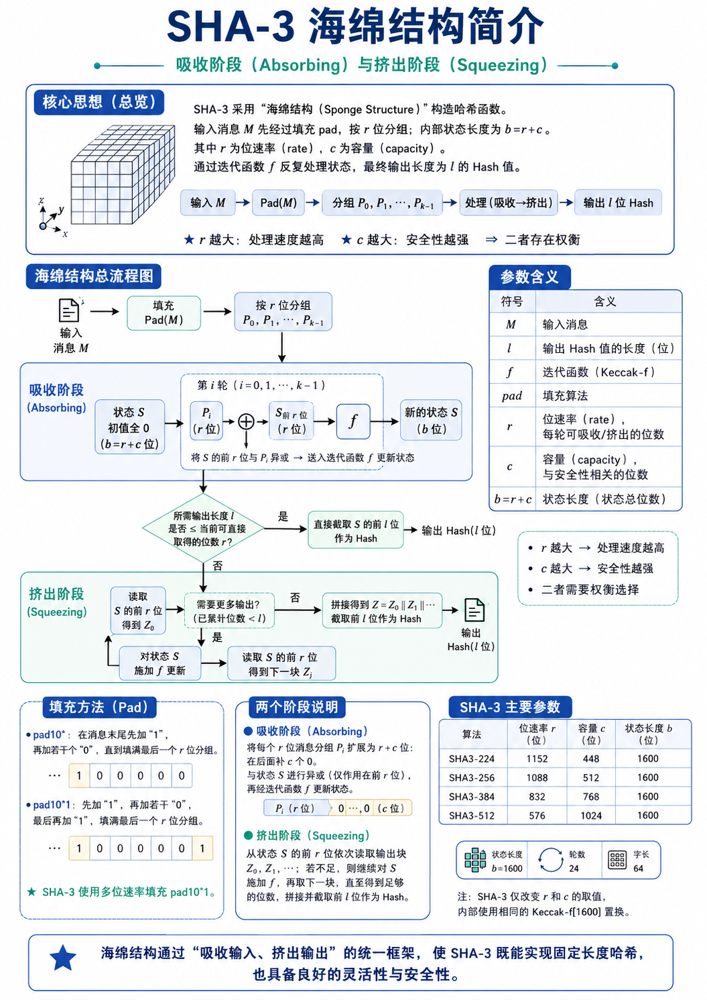
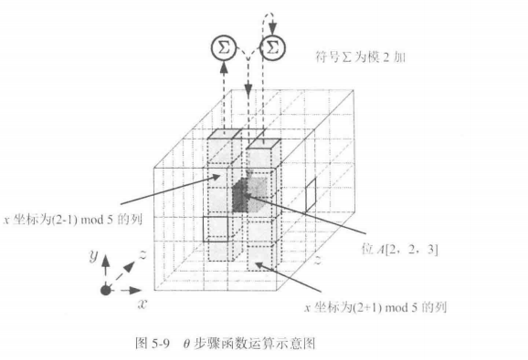
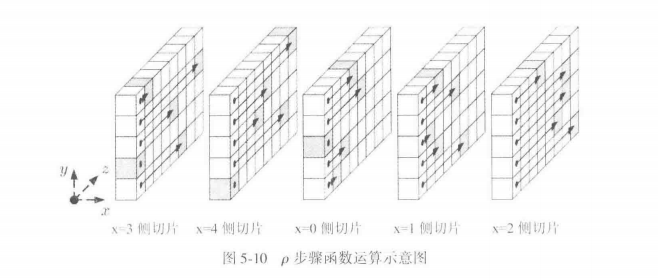
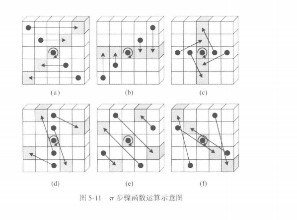
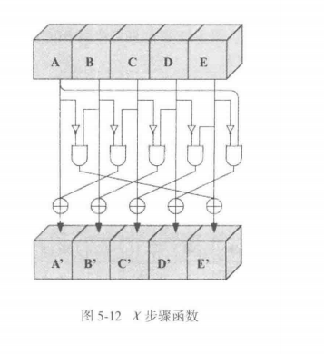

## 海绵结构介绍



海绵结构处理的是一串比特。输入消息记为 $M$，消息长度记为 $n=|M|$，目标输出长度记为 $l$。整个结构内部维护一个 **状态变量 $S$**，**状态长度** 为 $b$ 位。

!!! note

	SHA-3 标准哈希使用 Keccak-f[1600]，所以状态长度固定为
	
	$$
	b=1600
	$$

这个 $b$ 位状态被分成前后两段：

$$
b=r+c
$$

其中，

- 前 $r$ 位叫位速率，负责每一轮和外部数据发生交互；
- 后 $c$ 位叫容量，主要提供安全余量。

我们可以把状态变量写成

$$
S=S_{0:r}\Vert S_{r:b}
$$

其中，

-  $S_{0:r}$ 是前 $r$ 位，
- $S_{r:b}$ 是后 $c$ 位。

海绵结构的全部流程都围绕这个状态展开：先把消息分组写入状态，再从状态前部读出结果。

#### Pad(M)：把任意长度消息整理成 r 位分组

吸收阶段每次处理 $r$ 位消息块。原始消息 $M$ 的长度 $n$ 通常难以刚好被 $r$ 整除，因此需要在消息末尾追加填充串。图中使用的多重位速率填充写作

$$
pad10^*1
$$

> 这个符号按顺序表示三部分：先追加一个 1，中间追加若干个 0，最后追加一个 1。

于是填充后的消息可以写成

$$
P=M\Vert 1\Vert 0^j\Vert 1
$$

> 这里 $j$ 是中间 0 的个数。

这里 $j$ 的值由一个条件决定：填充后的总长度要成为 $r$ 的整数倍。因此需要

$$
n+2+j\equiv 0\pmod r
$$

> 其中的 $2$ 来自首尾两个 1。

把这个条件整理成可直接计算的形式，就是

$$
j=(r-((n+2)\bmod r))\bmod r
$$

算出 $j$ 后，Pad(M) 就已经确定。教材图里的 $Pad(M)$ 指的就是追加

$$
1\Vert 0^j\Vert 1
$$

这一串填充比特。实际 SHA-3 工程编码还带有用途区分后缀；在海绵结构的学习层面，先按图中的 $pad10^*1$ 走完整体流程。

!!! example

	举一个小尺寸例子，令 $r=8$，原消息为
	
	$$
	M=101100
	$$
	
	此时
	
	$$
	n=6
	$$
	
	代入公式：
	
	$$
	j=(8-((6+2)\bmod 8))\bmod 8=(8-0)\bmod 8=0
	$$
	
	所以填充串为
	
	$$
	1\Vert 0^0\Vert 1=11
	$$
	
	填充后的消息为
	
	$$
	P=10110011
	$$
	
	它刚好形成一个 8 位分组：
	
	$$
	P_0=10110011
	$$
	
	---
	
	再有 $M=10110010$，仍取 $r=8$。这时 $n=8$，计算得到
	
	$$
	j=(8-((8+2)\bmod 8))\bmod 8=(8-2)\bmod 8=6
	$$
	
	填充串为
	
	$$
	10000001
	$$
	
	填充后消息为
	
	$$
	P=10110010\ 10000001
	$$
	
	于是切成两个分组：
	
	$$
	P_0=10110010,\quad P_1=10000001
	$$


这一步说明，Pad(M) 的任务是保证分组边界清楚，同时让每个输入分组长度都等于 $r$。

#### 分组：把填充后的 P 切成 P0 到 Pk-1

完成填充后，得到

$$
P=M\Vert Pad(M)
$$

由于 $|P|$ 已经是 $r$ 的整数倍，可以直接切分：

$$
P=P_0\Vert P_1\Vert\cdots\Vert P_{k-1}
$$

每个分组满足

$$
|P_i|=r
$$

分组数量为

$$
k=\frac{|P|}{r}
$$

从这里开始，算法进入吸收阶段。

#### 吸收阶段：每个 Pi 改写一次状态 S

吸收阶段开始时，内部状态初始化为全 0：

$$
S=0^b
$$

每个消息分组 $P_i$ 长度为 $r$ 位，状态 $S$ 长度为 $b=r+c$ 位。**为了把 $P_i$ 放到和 $S$ 相同长度的比特串中**，需要在 $P_i$ 后面接 $c$ 个 0：

$$
P_i\Vert 0^c
$$

这样它就从 $r$ 位扩展成了 $b$ 位。第 $i$ 轮吸收分两步进行。

**第一步，把扩展后的分组和当前状态异或：**

$$
S\leftarrow S\oplus(P_i\Vert 0^c)
$$

- 这一步只会让消息块进入状态的前 $r$ 位；
- 容量部分对应的是 $0^c$，它在这一轮异或中作为对齐补位。

**第二步，把整个状态送入迭代函数：**

$$
S\leftarrow f(S)
$$

> 在 SHA-3 中，$f$ 就是 Keccak-f[1600] 置换。它处理完整的 1600 位状态，使刚吸收的消息块经过置换后影响状态各个位置。

因此，一轮吸收可以合并写成：

$$
S_i=f(S_{i-1}\oplus(P_i\Vert 0^c))
$$

其中 $S_{i-1}$ 是上一轮状态，$S_i$ 是当前分组处理后的状态。所有分组按顺序执行同样的计算：

$$
P_0\rightarrow S_0,
\quad
P_1\rightarrow S_1,
\quad
\cdots,
\quad
P_{k-1}\rightarrow S_{k-1}
$$

最后得到的状态 $S_{k-1}$ 就是整条消息经过吸收后的内部状态。

#### 挤出阶段：从状态 S 读出 Hash

吸收完成后，消息已经全部进入状态。接下来要产生 $l$ 位输出。海绵结构每次从状态 **前 $r$ 位** 读出一个输出块，记为

$$
Z_0=S_{0:r}
$$

当已经读出的长度达到目标长度 $l$ 时，直接截取前 $l$ 位作为 Hash：

$$
Hash=Z_{0:l}
$$

当目标输出长度超过当前已经读出的长度时，需要继续生成下一块输出。做法是如下：

一、先更新状态：

$$
S\leftarrow f(S)
$$

二、再读取新的状态前 $r$ 位：

$$
Z_1=S_{0:r}
$$

如此反复，得到

$$
Z=Z_0\Vert Z_1\Vert\cdots\Vert Z_{t-1}
$$

当 $|Z|\ge l$ 时，最终返回

$$
Hash=Z_{0:l}
$$

教材图中把短输出写成从 $S$ 前 $l$ 位截取。海绵函数通用描述常采用每轮从前 $r$ 位读出。由于 SHA3-224、SHA3-256、SHA3-384、SHA3-512 均满足 $l\le r$，这些固定长度算法在流程上都会走到同一个动作：吸收结束后直接截取前 $l$ 位。

#### 完整算法

按图中的符号，海绵函数可以写成下面的流程。这里把 $f$ 看作已经给定的置换函数。

```python
Input : M, l, f, pad, r, c
Output: l-bit Hash

b = r + c

# 1. padding
n = |M|
j = (r - ((n + 2) mod r)) mod r
P = M || 1 || 0^j || 1

# 2. split
k = |P| / r
split P into P_0, P_1, ..., P_{k-1}, each with r bits

# 3. absorbing
S = 0^b
for i = 0 to k-1:
    X = P_i || 0^c
    S = S xor X
    S = f(S)

# 4. squeezing
Z = empty bit string
while |Z| < l:
    Z = Z || first r bits of S
    if |Z| >= l:
        break
    S = f(S)

return first l bits of Z
```

这段伪代码对应图中的每个板块：Pad(M) 对应填充框，$P_0$ 到 $P_{k-1}$ 对应分组框，for 循环对应吸收阶段，while 循环对应挤出阶段，最后的截取对应输出 Hash。

## SHA-3算法介绍


先把图中的对象固定下来。SHA-3 处理的是比特串，输入消息记为 $M$，输出长度记为 $l$。当选择 SHA3-224、SHA3-256、SHA3-384 或 SHA3-512 中的某一个版本时，三个核心参数随之确定：位速率 $r$、容量 $c$、状态长度 $b$。它们满足

$$
b=r+c
$$

SHA-3 中 $b=1600$。所以算法始终维护一个 1600 位状态 $S$，其中前 $r$ 位用于吸收输入和挤出输出，后 $c$ 位留在状态内部参与 Keccak-f 置换。整条计算链从 $M$ 出发，经过填充、分组、吸收、Keccak-f 迭代、挤出、截取，最后得到固定长度的 Hash 值。

### 版本参数

下表为四个标准 SHA-3 哈希版本的参数。

| 算法     | 输出长度 $l$ | 位速率 $r$ | 容量 $c$ | 状态长度 $b$ |
| -------- | ------------ | ---------- | -------- | ------------ |
| SHA3-224 | 224          | 1152       | 448      | 1600         |
| SHA3-256 | 256          | 1088       | 512      | 1600         |
| SHA3-384 | 384          | 832        | 768      | 1600         |
| SHA3-512 | 512          | 576        | 1024     | 1600         |

以 SHA3-256 为例，后续计算使用

$$
l=256,\quad r=1088,\quad c=512,\quad b=1600
$$

这意味着每次吸收 1088 位消息块，每次最多能从状态前部读出 1088 位输出，状态尾部 512 位作为容量参与内部置换。

### 输入消息先进入 Pad(M)，然后分组

这一部分就不详细说明了，和刚刚介绍的一样

#### 状态 $S$ 的 1600 位如何组织

把状态画成 $5\times5\times64$ 的三维结构。令

$$
A[x,y,z]\\
x=0,\ldots,4,\quad y=0,\ldots,4,\quad z=0,\ldots,63
$$

表示状态中的一个比特，那么总比特数为

$$
5\times5\times64=1600
$$

- 固定 $(x,y)$ 后，沿 $z$ 方向的 64 位称为一个 lane。
- 固定 $z$ 后，得到一个 $5\times5$ 的 plane（也就是一个平面）。
- 固定 $y$ 和 $z$，令 $x$ 变化，得到 row。
- 固定 $x$ 和 $z$，令 $y$ 变化，得到 column。

常见实现会把每个 lane 看成一个 64 位无符号整数。状态共有 25 个 lane：

$$
25\times64=1600
$$

从比特串映射到三维状态时，可按

$$
A[x,y,z]=S[64(5y+x)+z]
$$

理解，即类似于 $A[1,0,61]=S[64\times(5\times 0+1)+61]=S[125]$

> 这个映射说明，$A[0,0]$ 是最前面的 64 位 lane，接着是 $A[1,0]$、$A[2,0]$，一直到 $A[4,4]$。按字节实现时，每个 64 位 lane 通常按小端序解释。

### 吸收阶段：消息块进入状态

吸收阶段开始时，状态全置为 0：

$$
S=0^{1600}
$$

第 $i$ 个输入块 $P_i$ 长度为 $r$ 位。状态长度为 $b=r+c$。为了把 $P_i$ 放入状态，需要在 $P_i$ 后面拼接 $c$ 个 0：

$$
P_i\Vert0^c
$$

这样得到一个 1600 位比特串。然后先执行异或：

$$
S\leftarrow S\oplus(P_i\Vert0^c)
$$

这一步把 $P_i$ 混入状态前 $r$ 位。随后执行 Keccak-f[1600]：

$$
S\leftarrow Keccak\text{-}f[1600](S)
$$

于是第 $i$ 轮吸收可以写成

$$
S_i=Keccak\text{-}f[1600](S_{i-1}\oplus(P_i\Vert0^c))
$$

从 $P_0$ 到 $P_{m-1}$ 都按这个公式处理。每处理一个分组，就完成一次“异或输入块”和一次“24 轮 Keccak-f 置换”。

### Keccak-f[1600] 的外层结构

Keccak-f[1600] 是一个 1600 位到 1600 位的置换函数。输入是一个状态 $A$，输出仍是一个 1600 位状态。它执行 24 轮，每轮顺序固定：

$$
\theta\rightarrow\rho\rightarrow\pi\rightarrow\chi\rightarrow\iota
$$

轮号记为

$$
ir=0,1,\ldots,23
$$

这五步分别负责列混合、lane 内循环移位、lane 位置重排、逐行非线性替代、轮常数注入。

#### $\theta$：按列求校验并扩散到全列

$\theta$ 的输入是当前状态 $A[x,y,z]$。它先对每个 $x,z$ 计算一列的异或值：

$$
C[x,z]=A[x,0,z]\oplus A[x,1,z]\oplus A[x,2,z]\oplus A[x,3,z]\oplus A[x,4,z]
$$

这里固定了 $x$ 和 $z$，让 $y$ 从 0 到 4 变化，所以它是同一 column 上 5 个比特的校验值。

接着计算

$$
D[x,z]=C[x-1,z]\oplus C[x+1,z-1]
$$

下标 $x-1$、$x+1$ 按模 5 计算，$z-1$ 按模 64 计算。用 lane 记法可写作

$$
D[x]=C[x-1]\oplus ROT(C[x+1],1)
$$

> 其中 $ROT$ 表示 64 位循环左移。

最后更新每个比特：

$$
A[x,y,z]\leftarrow A[x,y,z]\oplus D[x,z]
$$

这一步的作用是让相邻列的校验值影响当前列。一个比特变化会改变所在列的 $C$，进而通过 $D$ 影响邻近列，再进入后续轮传播到更多位置。



####  $\rho$：每个 lane 按固定偏移循环移位

$\rho$ 处理每个 64 位 lane。对固定的 $(x,y)$，有一个偏移量 $r[x,y]$，然后执行

$$
A[x,y]\leftarrow ROT(A[x,y],r[x,y])
$$

其中 $ROT$ 表示 64 位循环左移。偏移量表可以写成如下形式，行表示 $x$，列表示 $y$：

| $r[x,y]$ | $y=0$ | $y=1$ | $y=2$ | $y=3$ | $y=4$ |
| -------- | ----- | ----- | ----- | ----- | ----- |
| $x=0$    | 0     | 36    | 3     | 41    | 18    |
| $x=1$    | 1     | 44    | 10    | 45    | 2     |
| $x=2$    | 62    | 6     | 43    | 15    | 61    |
| $x=3$    | 28    | 55    | 25    | 21    | 56    |
| $x=4$    | 27    | 20    | 39    | 8     | 14    |

$\rho$ 改变 lane 内部每个比特的 $z$ 坐标。它本身仍是置换操作，后续配合 $\pi$ 和 $\chi$ 后，会让状态中的比特关系更加充分地展开。



####  $\pi$：把 lane 放到新的平面位置

$\pi$ 负责重排 25 个 lane 的 $(x,y)$ 位置。公式为

$$
B[y,(2x+3y)\bmod5]=A[x,y]
$$

这里 $A[x,y]$ 表示一个 64 位 lane。经过 $\pi$ 后，lane 内的 64 位作为整体移动到新的平面坐标中。

$\rho$ 改变 lane 内部的 $z$ 位置，$\pi$ 改变 lane 在 $5\times5$ 平面中的位置。两者连续执行后，信息在 lane 内部和 lane 之间都完成重新排列。



####  $\chi$：逐行非线性替代

$\chi$ 在每一行上执行。它的公式是

$$
A[x,y,z]\leftarrow B[x,y,z]\oplus((\sim B[x+1,y,z])\land B[x+2,y,z])
$$

> 其中 $x+1$ 和 $x+2$ 按模 5 计算，$\sim$ 是按位取反，$\land$ 是按位与。

这一式子说明，当前位置的新值同时受本位置、右侧第一个位置、右侧第二个位置影响。由于它包含取反和与运算，状态变化从线性异或关系进入非线性关系。图中标注“唯一非线性步骤”，指的就是 $\chi$。SHA-3 抗线性分析、差分分析等性质，很大程度依赖这一步和其他扩散步骤的配合。



#### $\iota$：把轮常数注入 $A[0,0]$

最后一步 $\iota$ 将当前轮的轮常数 $RC[ir]$ 异或到 lane $A[0,0]$：

$$
A[0,0]\leftarrow A[0,0]\oplus RC[ir]
$$

轮常数是 64 位常量。24 轮对应 24 个常量：

$\iota$ 给每一轮加入轮号相关成分，使每轮置换带有轮次差异。执行完 $\iota$ 后，当前轮结束，进入下一轮。24 轮结束后，Keccak-f[1600] 输出新的状态 $S$。

### 挤出阶段：从状态读出输出

所有消息块吸收完后，状态 $S$ 已经由完整输入消息决定。接下来生成输出。先从状态前 $r$ 位读出第一块：

$$
Z_0=S[0:r]
$$

将其拼到输出串 $Z$ 中：

$$
Z=Z_0
$$

当 $|Z|$ 已经达到输出长度 $l$，取前 $l$ 位作为最终 Hash：

$$
Hash=Z[0:l]
$$

当还要更多输出时，继续执行一次 Keccak-f[1600]：

$$
S\leftarrow Keccak\text{-}f[1600](S)
$$

然后读出下一块：

$$
Z_1=S[0:r]
$$

持续拼接：

$$
Z=Z_0\Vert Z_1\Vert Z_2\Vert\cdots
$$

直到 $|Z|\ge l$，再截取前 $l$ 位。对于 SHA3-224、SHA3-256、SHA3-384、SHA3-512，输出长度 $l$ 均小于各自的 $r$，所以固定长度 SHA-3 在吸收完后通常读取一次状态前部并截取即可。

### 伪代码

```text
Input : message M, selected SHA-3 version
Output: hash value H

根据版本确定 l, r, c
b = 1600
S = 0^b

N = M || 01
j = (r - ((|N| + 2) mod r)) mod r
P = N || 1 || 0^j || 1

把 P 按 r 位切分为 P_0, P_1, ..., P_{m-1}

for i = 0 to m-1:
    S = S xor (P_i || 0^c)
    S = Keccak_f_1600(S)

Z = empty
while |Z| < l:
    Z = Z || S[0:r]
    if |Z| >= l:
        break
    S = Keccak_f_1600(S)

H = Z[0:l]
return H
```

然后Keccak_f_1600内部如下：
```text
Input : 1600-bit state S
Output: 1600-bit state S

把 S 映射为 A[x,y,z]

for ir = 0 to 23:
    θ: 计算每列校验 C[x]，生成 D[x]，A[x,y] ^= D[x]
    ρ: 每个 lane 按 r[x,y] 循环左移
    π: 按 B[y, (2x+3y) mod 5] = A[x,y] 重排 lane
    χ: 按 A[x,y] = B[x,y] ^ ((~B[x+1,y]) & B[x+2,y]) 更新每行
    ι: A[0,0] ^= RC[ir]

把 A[x,y,z] 重新展开为 1600-bit state
return S
```

### 算法实现

```python
from __future__ import annotations

MASK64 = (1 << 64) - 1

# Keccak-f[1600] 的 24 个轮常数 RC[ir]
ROUND_CONSTANTS = [
    0x0000000000000001, 0x0000000000008082,
    0x800000000000808A, 0x8000000080008000,
    0x000000000000808B, 0x0000000080000001,
    0x8000000080008081, 0x8000000000008009,
    0x000000000000008A, 0x0000000000000088,
    0x0000000080008009, 0x000000008000000A,
    0x000000008000808B, 0x800000000000008B,
    0x8000000000008089, 0x8000000000008003,
    0x8000000000008002, 0x8000000000000080,
    0x000000000000800A, 0x800000008000000A,
    0x8000000080008081, 0x8000000000008080,
    0x0000000080000001, 0x8000000080008008,
]

# ρ 步骤使用的循环左移偏移量
ROTATION_OFFSETS = [
    1, 3, 6, 10, 15, 21,
    28, 36, 45, 55, 2, 14,
    27, 41, 56, 8, 25, 43,
    62, 18, 39, 61, 20, 44,
]

# ρ + π 合并实现时使用的 lane 访问顺序
PI_LANE = [
    10, 7, 11, 17, 18, 3,
    5, 16, 8, 21, 24, 4,
    15, 23, 19, 13, 12, 2,
    20, 14, 22, 9, 6, 1,
]


def rotl64(x: int, n: int) -> int:
    """64 位循环左移。"""
    n %= 64
    return ((x << n) | (x >> (64 - n))) & MASK64


def keccak_f1600(state: list[int]) -> list[int]:
    """
    Keccak-f[1600] 置换函数。

    state 有 25 个 64 位 lane：
        state[x + 5*y] 对应 A[x, y]
    总长度为：
        25 * 64 = 1600 bit
    """
    st = state[:]

    for rc in ROUND_CONSTANTS:
        # ------------------------------------------------------------
        # 1. θ step：按列混合
        # C[x] = A[x,0] ^ A[x,1] ^ A[x,2] ^ A[x,3] ^ A[x,4]
        # D[x] = C[x-1] ^ ROT(C[x+1], 1)
        # A[x,y] = A[x,y] ^ D[x]
        # ------------------------------------------------------------
        c = [
            st[x] ^ st[x + 5] ^ st[x + 10] ^ st[x + 15] ^ st[x + 20]
            for x in range(5)
        ]

        d = [
            c[(x - 1) % 5] ^ rotl64(c[(x + 1) % 5], 1)
            for x in range(5)
        ]

        for x in range(5):
            for y in range(5):
                st[x + 5 * y] = (st[x + 5 * y] ^ d[x]) & MASK64

        # ------------------------------------------------------------
        # 2. ρ step + 3. π step：lane 内循环移位，然后重排 lane 位置
        # 这里采用 Keccak 常见的合并写法。
        # ------------------------------------------------------------
        t = st[1]
        for i in range(24):
            j = PI_LANE[i]
            temp = st[j]
            st[j] = rotl64(t, ROTATION_OFFSETS[i])
            t = temp

        # ------------------------------------------------------------
        # 4. χ step：逐行非线性替代
        # A[x,y] = A[x,y] ^ ((~A[x+1,y]) & A[x+2,y])
        # ------------------------------------------------------------
        for y in range(5):
            row = [st[x + 5 * y] for x in range(5)]
            for x in range(5):
                st[x + 5 * y] = (
                    row[x] ^ ((~row[(x + 1) % 5]) & row[(x + 2) % 5])
                ) & MASK64

        # ------------------------------------------------------------
        # 5. ι step：注入轮常数
        # A[0,0] = A[0,0] ^ RC[ir]
        # ------------------------------------------------------------
        st[0] = (st[0] ^ rc) & MASK64

    return st


def absorb_block(state: list[int], block: bytes, rate_bytes: int) -> list[int]:
    """
    吸收一个 rate 大小的数据块。

    block 长度为 rate_bytes。
    每 8 个字节按小端序转成一个 64 位 lane，
    然后异或进 state 的前 rate_bytes 区域。
    """
    st = state[:]

    for offset in range(0, rate_bytes, 8):
        lane_index = offset // 8
        lane_value = int.from_bytes(block[offset:offset + 8], "little")
        st[lane_index] = (st[lane_index] ^ lane_value) & MASK64

    return keccak_f1600(st)


def sha3(data: bytes, digest_bits: int) -> bytes:
    """
    计算 SHA3-224 / SHA3-256 / SHA3-384 / SHA3-512。

    参数：
        data        : 输入消息，字节串形式
        digest_bits : 输出长度，可取 224、256、384、512

    返回：
        Hash 结果，字节串形式
    """
    params = {
        224: (144, 28),  # rate = 1152 bit = 144 byte, output = 28 byte
        256: (136, 32),  # rate = 1088 bit = 136 byte, output = 32 byte
        384: (104, 48),  # rate = 832  bit = 104 byte, output = 48 byte
        512: (72, 64),   # rate = 576  bit = 72  byte, output = 64 byte
    }

    if digest_bits not in params:
        raise ValueError("digest_bits must be one of 224, 256, 384, 512")

    rate_bytes, digest_bytes = params[digest_bits]

    # 状态长度 b = 1600 bit = 25 个 64 位 lane
    state = [0] * 25

    # ------------------------------------------------------------
    # 一、吸收完整 rate 块
    # ------------------------------------------------------------
    pos = 0
    while pos + rate_bytes <= len(data):
        block = data[pos:pos + rate_bytes]
        state = absorb_block(state, block, rate_bytes)
        pos += rate_bytes

    # ------------------------------------------------------------
    # 二、处理最后一个块，并完成 SHA-3 填充
    #
    # SHA-3 固定长度哈希的领域分离后缀为 0x06。
    # 最后一个 rate 块末尾异或 0x80，对应 pad10*1 的末尾 1。
    # ------------------------------------------------------------
    block = bytearray(rate_bytes)

    remain = data[pos:]
    block[:len(remain)] = remain

    # 0x06 = SHA-3 后缀 01 + pad10*1 起始位
    block[len(remain)] ^= 0x06

    # 0x80 = 当前 rate 块最高位写入 pad10*1 末尾位
    block[rate_bytes - 1] ^= 0x80

    state = absorb_block(state, bytes(block), rate_bytes)

    # ------------------------------------------------------------
    # 三、挤出输出
    #
    # 从 state 前 rate_bytes 个字节读取输出；
    # 输出长度达到 digest_bytes 后截取。
    # ------------------------------------------------------------
    output = bytearray()

    while len(output) < digest_bytes:
        for offset in range(0, rate_bytes, 8):
            lane_index = offset // 8
            output.extend(state[lane_index].to_bytes(8, "little"))

            if len(output) >= digest_bytes:
                break

        if len(output) < digest_bytes:
            state = keccak_f1600(state)

    return bytes(output[:digest_bytes])


def sha3_224(data: bytes) -> bytes:
    return sha3(data, 224)


def sha3_256(data: bytes) -> bytes:
    return sha3(data, 256)


def sha3_384(data: bytes) -> bytes:
    return sha3(data, 384)


def sha3_512(data: bytes) -> bytes:
    return sha3(data, 512)


if __name__ == "__main__":
    msg = input("请输入消息：").encode("utf-8")

    print("SHA3-224:", sha3_224(msg).hex())
    print("SHA3-256:", sha3_256(msg).hex())
    print("SHA3-384:", sha3_384(msg).hex())
    print("SHA3-512:", sha3_512(msg).hex())
```

