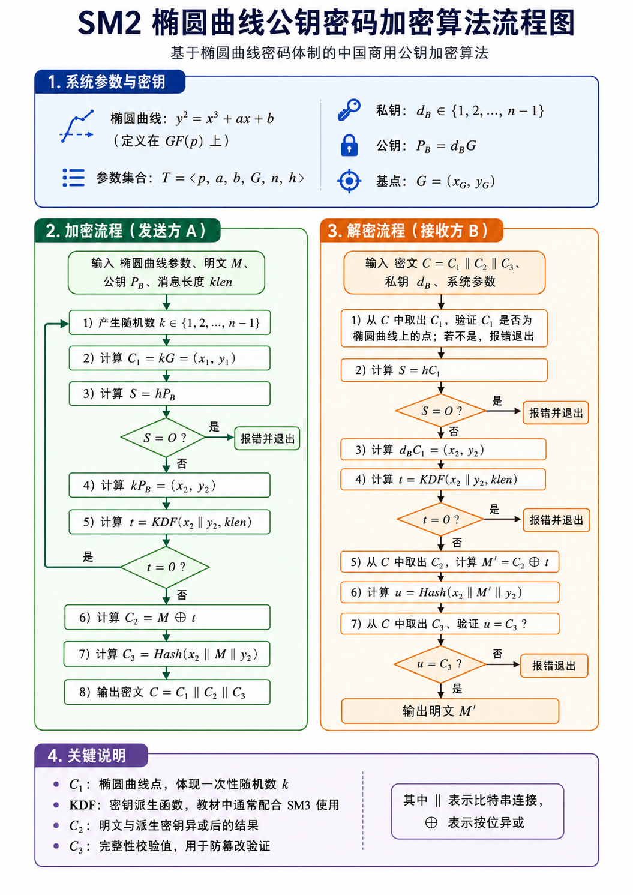

## SM2 算法介绍



> SM2流程比较简单，这边简单介绍一下

SM2 的加密流程建立在椭圆曲线点群上。系统先公开一组曲线参数，接收方再用私钥生成公钥。发送方加密时，使用一次性随机数和接收方公钥构造共享点；接收方解密时，使用自己的私钥和密文中的曲线点得到同一个共享点。两边拿到同一个共享点后，就可以派生出同一段密钥比特串，从而完成明文的隐藏与恢复。

### 1. 系统参数与密钥

流程图最上方的系统参数可以写成

$$
T=\langle p,a,b,G,n,h\rangle.
$$

其中，$p$ 确定素域 $GF(p)$，也就是所有运算都在模 $p$ 的有限域中完成。$a,b$ 确定椭圆曲线

$$
y^2=x^3+ax+b.
$$

$G$ 是曲线上的基点，写作

$$
G=(x_G,y_G).
$$

$n$ 是基点 $G$ 的阶，也就是满足

$$
nG=O
$$

的最小正整数。$O$ 表示无穷远点，是椭圆曲线点加法中的单位元。$h$ 是余因子，用来描述整条曲线点群与基点生成子群之间的规模关系。

接收方 B 先生成自己的私钥。私钥是一个随机整数：

$$
d_B\in\{1,2,\ldots,n-1\}.
$$

然后计算公钥：

$$
P_B=d_BG.
$$

这里的 $d_BG$ 表示把基点 $G$ 做 $d_B$ 次点加，也称标量乘。外部人员可以看到 $P_B$，但从 $G$ 和 $P_B$ 反推出 $d_B$ 会遇到椭圆曲线离散对数问题。这正是 SM2 公钥加密的安全基础。

### 2. 加密流程：发送方 A 的计算

发送方 A 手中有系统参数、明文 $M$、接收方公钥 $P_B$，还知道明文的比特长度 $klen$。这里的 $M$ 可以理解为一段比特串，$klen$ 表示后续密钥派生函数要生成多少比特。

**第一步，A 产生一次性随机数：**

$$
k\in\{1,2,\ldots,n-1\}.
$$

这个 $k$ 只服务于本次加密。它决定本次密文中的随机性，也决定后续派生密钥的内容。

**第二步，A 计算**

$$
C_1=kG=(x_1,y_1).
$$

$C_1$ 是椭圆曲线上的一个点，可以理解为本次加密生成的临时公钥。它会放入最终密文中发送给 B。B 后面正是通过 $C_1$ 和自己的私钥恢复本次共享点。

**第三步，A 计算**

$$
S=hP_B.
$$

这一检查用于确认接收方公钥 $P_B$ 在当前参数下可用于加密计算。当

$$
S=O
$$

时，流程报错并退出。这里的含义是：该公钥经过余因子处理后落到无穷远点，说明它在加密计算中会引发异常情形。流程图中把这一分支直接导向“报错并退出”。

**第四步，A 计算**

$$
kP_B=(x_2,y_2).
$$

这是整个加密过程的关键共享点。由于接收方公钥满足

$$
P_B=d_BG,
$$

所以有

$$
kP_B=k(d_BG).
$$

这个点的坐标 $(x_2,y_2)$ 会作为后续 KDF 和 Hash 的输入。

**第五步，A 计算密钥派生结果：**

$$
t=KDF(x_2\parallel y_2,klen).
$$

其中，$\parallel$ 表示比特串连接。KDF 接收 $x_2\parallel y_2$，输出长度为 $klen$ 的比特串 $t$。由于 $t$ 的长度与明文 $M$ 相同，所以后面可以逐位异或。

当 $t$ 为全 0 比特串时，流程回到第一步，重新选择随机数 $k$。原因在于

$$
C_2=M\oplus t
$$

在 $t$ 全 0 时会退化为 $C_2=M$，明文会直接出现在密文主体中。

**第六步，A 计算密文主体：**

$$
C_2=M\oplus t.
$$

这里的 $\oplus$ 表示按位异或。$t$ 起到掩蔽明文的作用。接收方只要能重新算出同一个 $t$，就能通过异或恢复明文。

**第七步，A 计算完整性校验值：**

$$
C_3=Hash(x_2\parallel M\parallel y_2).
$$

教材中通常配合中国商用密码 Hash 函数 SM3 使用。$C_3$ 把共享点坐标和明文绑定起来。接收方解密后会重新计算对应的 Hash 值，与密文中的 $C_3$ 比较，用来发现密文或明文恢复结果的异常。

**第八步，A 输出最终密文：**

$$
C=C_1\parallel C_2\parallel C_3.
$$

所以 SM2 加密密文由三部分组成：$C_1$ 是椭圆曲线点，$C_2$ 是异或后的密文主体，$C_3$ 是完整性校验值。

### 3. 解密流程：接收方 B 的计算

接收方 B 收到密文

$$
C=C_1\parallel C_2\parallel C_3
$$

后，先按格式取出三部分。B 掌握自己的私钥 $d_B$，这正是他可以解密的根本原因。

**第一步，B 从密文中取出 $C_1$，并检查 $C_1$ 是否为当前椭圆曲线上的点**。检查方法是把 $C_1=(x_1,y_1)$ 代入曲线方程，验证坐标是否满足

$$
y_1^2=x_1^3+ax_1+b.
$$

若验证未通过，说明密文中的曲线点格式或数学关系异常，流程报错并退出。

**第二步，B 计算**

$$
S=hC_1.
$$

当

$$
S=O
$$

时，流程报错并退出。这一步与加密端对 $P_B$ 的检查相对应，用来处理密文点 $C_1$ 可能引发的异常情形。

**第三步，B 用私钥计算**

$$
d_BC_1=(x_2,y_2).
$$

由于加密端生成的

$$
C_1=kG,
$$

所以解密端实际得到

$$
d_BC_1=d_B(kG).
$$

根据椭圆曲线点群中标量乘的结合关系，有

$$
d_B(kG)=k(d_BG).
$$

又由于

$$
P_B=d_BG,
$$

于是

$$
d_BC_1=kP_B=(x_2,y_2).
$$

这说明 B 通过私钥 $d_B$ 和密文点 $C_1$，得到了与发送方 A 完全相同的共享点。

**第四步，B 计算**

$$
t=KDF(x_2\parallel y_2,klen).
$$

由于输入的 $(x_2,y_2)$ 与加密端相同，KDF 输出的 $t$ 也相同。当 $t$ 为全 0 比特串时，流程报错并退出。

第五步，B 从密文中取出 $C_2$，计算

$$
M'=C_2\oplus t.
$$

结合加密端的

$$
C_2=M\oplus t,
$$

可以得到

$$
M'=(M\oplus t)\oplus t.
$$

异或满足同一比特连续异或两次会抵消，因此

$$
M'=M.
$$

这一步完成明文恢复。

**第六步，B 计算**

$$
u=Hash(x_2\parallel M'\parallel y_2).
$$

这个值是解密端根据共享点坐标和恢复出的明文重新计算出的校验值。

**第七步，B 从密文中取出 $C_3$，比较**

$$
u=C_3
$$

是否成立。成立时，说明恢复出的明文与加密端计算校验值时使用的明文一致，流程输出

$$
M'.
$$

当比较未通过时，说明密文被篡改、格式异常，或解密恢复出的内容未通过校验，流程报错退出。

### 4. 正确解密的原因

正确性来自一个核心等式。加密端计算共享点：

$$
kP_B.
$$

解密端计算共享点：

$$
d_BC_1.
$$

把公钥和 $C_1$ 的定义代入：

$$
P_B=d_BG,
\qquad
C_1=kG.
$$

于是加密端得到

$$
kP_B=k(d_BG),
$$

解密端得到

$$
d_BC_1=d_B(kG).
$$

椭圆曲线点群上的标量乘满足结合关系，所以

$$
k(d_BG)=d_B(kG).
$$

两端得到同一个点 $(x_2,y_2)$，后续 KDF 输出同一个 $t$。加密端用

$$
C_2=M\oplus t
$$

隐藏明文，解密端用

$$
M'=C_2\oplus t
$$

恢复明文。异或运算满足

$$
(a\oplus b)\oplus b=a,
$$

所以

$$
M'=(M\oplus t)\oplus t=M.
$$

最后，Hash 校验值 $C_3$ 用于确认恢复出的 $M'$ 与加密时参与校验的 $M$ 一致。

### 5. 各个密文分量的作用

$C_1$ 是临时曲线点，由随机数 $k$ 和基点 $G$ 计算得到。它本身会公开发送，但单独看到 $C_1=kG$，难以反推出 $k$。

$C_2$ 是真正承载明文内容的部分。它由

$$
M\oplus t
$$

得到，其中 $t$ 来自共享点坐标的 KDF 输出。

$C_3$ 是校验部分。它把 $x_2$、明文和 $y_2$ 组合后做 Hash，用于检测密文修改和解密结果异常。

因此，密文结构

$$
C=C_1\parallel C_2\parallel C_3
$$

可以理解为“临时曲线点 + 被掩蔽的明文 + 完整性校验”。

### 6. 算法实现

```python
from __future__ import annotations

import secrets
from dataclasses import dataclass
from typing import Optional, Tuple

# ============================================================
# 1. 类型约定
# ============================================================

# 椭圆曲线点用 (x, y) 表示。
# None 表示无穷远点 O，即点加法中的单位元。
Point = Optional[Tuple[int, int]]


# ============================================================
# 2. SM2 推荐曲线参数
# ============================================================
# SM2 使用 256 位素域 GF(p) 上的椭圆曲线：
#
#   y^2 = x^3 + ax + b  mod p
#
# 下面这些参数来自 SM2 推荐参数。
# p：有限域模数
# a, b：椭圆曲线方程参数
# n：基点 G 的阶
# h：余因子，SM2 推荐曲线中 h = 1
# G = (GX, GY)：基点

P = int("FFFFFFFEFFFFFFFFFFFFFFFFFFFFFFFFFFFFFFFF00000000FFFFFFFFFFFFFFFF", 16)

A = int("FFFFFFFEFFFFFFFFFFFFFFFFFFFFFFFFFFFFFFFF00000000FFFFFFFFFFFFFFFC", 16)

B = int("28E9FA9E9D9F5E344D5A9E4BCF6509A7F39789F515AB8F92DDBCBD414D940E93", 16)

N = int("FFFFFFFEFFFFFFFFFFFFFFFFFFFFFFFF7203DF6B21C6052B53BBF40939D54123", 16)

H = 1

GX = int("32C4AE2C1F1981195F9904466A39C9948FE30BBFF2660BE1715A4589334C74C7", 16)

GY = int("BC3736A2F4F6779C59BDCEE36B692153D0A9877CC62A474002DF32E52139F0A0", 16)

G = (GX, GY)


# ============================================================
# 3. 有限域 GF(p) 基础运算
# ============================================================

def inv_mod(x: int, p: int) -> int:
    """
    计算 x 在模 p 意义下的乘法逆元。

    数学含义：
        返回 x^{-1}，满足：
            x * x^{-1} ≡ 1 (mod p)

    在椭圆曲线点加公式中，分式本质上都要转换成乘以模逆元。
    例如：
        (y2 - y1) / (x2 - x1)
    在 GF(p) 中表示：
        (y2 - y1) * (x2 - x1)^{-1} mod p
    """
    x %= p

    if x == 0:
        raise ZeroDivisionError("inverse of zero")

    # p 是素数，可以用费马小定理：
    # x^(p-1) ≡ 1 (mod p)
    # 所以：
    # x^(p-2) ≡ x^(-1) (mod p)
    return pow(x, p - 2, p)


def int_to_bytes(x: int, length: int = 32) -> bytes:
    """
    把整数转换为固定长度的大端字节串。

    SM2 推荐曲线是 256 位曲线，所以坐标通常用 32 字节表示。
    """
    return x.to_bytes(length, "big")


def xor_bytes(a: bytes, b: bytes) -> bytes:
    """
    对两个等长字节串做按位异或。

    在加密流程中：
        C2 = M xor t

    在解密流程中：
        M' = C2 xor t
    """
    return bytes(x ^ y for x, y in zip(a, b))


# ============================================================
# 4. 椭圆曲线点运算
# ============================================================

def is_on_curve(Pt: Point) -> bool:
    """
    判断点 Pt 是否在 SM2 椭圆曲线上。

    对普通点 Pt = (x, y)，检查：
        y^2 ≡ x^3 + ax + b (mod p)

    无穷远点 O 记为 None，作为群单位元处理。
    """
    if Pt is None:
        return True

    x, y = Pt

    left = (y * y) % P
    right = (x * x * x + A * x + B) % P

    return left == right


def point_add(P1: Point, P2: Point) -> Point:
    """
    椭圆曲线点加法。

    输入：
        P1, P2：曲线上的两个点

    输出：
        P1 + P2

    处理四类情况：

    1. P1 是无穷远点 O：
        O + P2 = P2

    2. P2 是无穷远点 O：
        P1 + O = P1

    3. P1 和 P2 互为逆元：
        P1 + P2 = O

    4. 普通点加或倍点：
        使用椭圆曲线点加公式计算。
    """
    # O + P2 = P2
    if P1 is None:
        return P2

    # P1 + O = P1
    if P2 is None:
        return P1

    x1, y1 = P1
    x2, y2 = P2

    # 当 x1 == x2 且 y1 + y2 == 0 mod p 时，
    # 两个点关于 x 轴对称，它们相加得到无穷远点 O。
    if x1 == x2 and (y1 + y2) % P == 0:
        return None

    if P1 == P2:
        # 倍点公式：
        #
        #   lambda = (3x1^2 + a) / (2y1)
        #
        # 在 GF(p) 中写成：
        #
        #   lambda = (3x1^2 + a) * (2y1)^(-1) mod p
        numerator = (3 * x1 * x1 + A) % P
        denominator = inv_mod(2 * y1, P)
        lam = (numerator * denominator) % P
    else:
        # 普通点加公式：
        #
        #   lambda = (y2 - y1) / (x2 - x1)
        #
        # 在 GF(p) 中写成：
        #
        #   lambda = (y2 - y1) * (x2 - x1)^(-1) mod p
        numerator = (y2 - y1) % P
        denominator = inv_mod(x2 - x1, P)
        lam = (numerator * denominator) % P

    # 点加结果 R = (x3, y3)
    #
    #   x3 = lambda^2 - x1 - x2
    #   y3 = lambda * (x1 - x3) - y1
    #
    # 所有运算都在模 p 意义下完成。
    x3 = (lam * lam - x1 - x2) % P
    y3 = (lam * (x1 - x3) - y1) % P

    return (x3, y3)


def scalar_mult(k: int, Pt: Point) -> Point:
    """
    椭圆曲线标量乘。

    数学含义：
        k * Pt = Pt + Pt + ... + Pt
                 共 k 次

    在 SM2 中大量使用标量乘：

        私钥生成公钥：
            P_B = d_B G

        加密端：
            C1 = kG
            kP_B = (x2, y2)

        解密端：
            d_B C1 = (x2, y2)

    这里使用 double-and-add 方法：
        逐位扫描 k 的二进制表示。
    """
    if k == 0 or Pt is None:
        return None

    if k < 0:
        raise ValueError("negative scalar")

    result: Point = None
    addend: Point = Pt

    while k:
        # 当前二进制位为 1 时，把 addend 加入结果。
        if k & 1:
            result = point_add(result, addend)

        # 每轮把 addend 翻倍：
        # G, 2G, 4G, 8G, ...
        addend = point_add(addend, addend)

        # 处理下一位二进制位。
        k >>= 1

    return result


# ============================================================
# 5. 点编码与解码
# ============================================================

def point_to_bytes(Pt: Tuple[int, int]) -> bytes:
    """
    把椭圆曲线点编码成字节串。

    这里采用：
        04 || x || y

    其中：
        04 表示普通点的完整坐标表示；
        x 占 32 字节；
        y 占 32 字节。

    所以 C1 总长度为：
        1 + 32 + 32 = 65 字节
    """
    x, y = Pt
    return b"\x04" + int_to_bytes(x) + int_to_bytes(y)


def bytes_to_point(data: bytes) -> Tuple[int, int]:
    """
    从字节串中解析椭圆曲线点。

    解析完成后，还要检查该点是否位于当前曲线上。
    这一步对应 SM2 解密流程中的：
        验证 C1 是否为椭圆曲线上的点
    """
    if len(data) != 65 or data[0] != 0x04:
        raise ValueError("bad point encoding")

    x = int.from_bytes(data[1:33], "big")
    y = int.from_bytes(data[33:65], "big")

    Pt = (x, y)

    if not is_on_curve(Pt):
        raise ValueError("point check failed")

    return Pt


# ============================================================
# 6. SM3 Hash 实现
# ============================================================
# SM2 的 KDF 与 C3 校验通常使用 SM3。
# 下面是一个教学版 SM3 实现。

IV = [
    0x7380166F, 0x4914B2B9, 0x172442D7, 0xDA8A0600,
    0xA96F30BC, 0x163138AA, 0xE38DEE4D, 0xB0FB0E4E,
]


def _rotl(x: int, n: int) -> int:
    """
    32 位循环左移。

    例如：
        ROTL(x, 9)
    表示把 x 的 32 位二进制表示循环左移 9 位。
    """
    n %= 32
    return ((x << n) & 0xFFFFFFFF) | (x >> (32 - n))


def _p0(x: int) -> int:
    """
    SM3 置换函数 P0。

    P0(X) = X xor (X <<< 9) xor (X <<< 17)
    """
    return x ^ _rotl(x, 9) ^ _rotl(x, 17)


def _p1(x: int) -> int:
    """
    SM3 置换函数 P1。

    P1(X) = X xor (X <<< 15) xor (X <<< 23)
    """
    return x ^ _rotl(x, 15) ^ _rotl(x, 23)


def _ff(x: int, y: int, z: int, j: int) -> int:
    """
    SM3 布尔函数 FF_j。
    """
    if j <= 15:
        return x ^ y ^ z

    return (x & y) | (x & z) | (y & z)


def _gg(x: int, y: int, z: int, j: int) -> int:
    """
    SM3 布尔函数 GG_j。
    """
    if j <= 15:
        return x ^ y ^ z

    return (x & y) | ((~x) & z)


def sm3(data: bytes) -> bytes:
    """
    计算 SM3 摘要。

    输入：
        data：任意字节串

    输出：
        32 字节摘要

    整体流程：
        1. 填充消息
        2. 按 512 位分组
        3. 对每组执行消息扩展
        4. 执行压缩函数
        5. 输出 256 位摘要
    """
    msg = bytearray(data)
    bit_len = len(msg) * 8

    # 填充规则：
    # 先追加一个比特 1，即字节 0x80。
    msg.append(0x80)

    # 再追加若干 0，使长度模 512 等于 448。
    while (len(msg) * 8) % 512 != 448:
        msg.append(0)

    # 最后追加原消息长度，长度字段为 64 位大端整数。
    msg += bit_len.to_bytes(8, "big")

    # 初始化 8 个 32 位寄存器。
    v = IV[:]

    # 每次处理 512 位，即 64 字节。
    for block_start in range(0, len(msg), 64):
        block = msg[block_start:block_start + 64]

        # W[0..15]：直接由当前分组拆成 16 个 32 位整数。
        w = [
            int.from_bytes(block[i:i + 4], "big")
            for i in range(0, 64, 4)
        ]

        # W[16..67]：根据 SM3 消息扩展公式生成。
        for j in range(16, 68):
            value = (
                _p1(w[j - 16] ^ w[j - 9] ^ _rotl(w[j - 3], 15))
                ^ _rotl(w[j - 13], 7)
                ^ w[j - 6]
            )
            w.append(value & 0xFFFFFFFF)

        # W'[0..63] = W[j] xor W[j+4]
        w1 = [
            (w[j] ^ w[j + 4]) & 0xFFFFFFFF
            for j in range(64)
        ]

        # 当前分组的 8 个工作变量。
        a, b, c, d, e, f, g, h = v

        # 64 轮压缩。
        for j in range(64):
            tj = 0x79CC4519 if j <= 15 else 0x7A879D8A

            ss1 = _rotl(
                (_rotl(a, 12) + e + _rotl(tj, j)) & 0xFFFFFFFF,
                7,
            )

            ss2 = ss1 ^ _rotl(a, 12)

            tt1 = (
                _ff(a, b, c, j)
                + d
                + ss2
                + w1[j]
            ) & 0xFFFFFFFF

            tt2 = (
                _gg(e, f, g, j)
                + h
                + ss1
                + w[j]
            ) & 0xFFFFFFFF

            d = c
            c = _rotl(b, 9)
            b = a
            a = tt1

            h = g
            g = _rotl(f, 19)
            f = e
            e = _p0(tt2)

        # 当前分组的压缩结果与上一轮向量异或。
        v = [
            old ^ new
            for old, new in zip(v, [a, b, c, d, e, f, g, h])
        ]

    # 8 个 32 位整数拼接成 32 字节摘要。
    return b"".join(x.to_bytes(4, "big") for x in v)


# ============================================================
# 7. SM2 KDF 密钥派生函数
# ============================================================

def kdf(z: bytes, klen: int) -> bytes:
    """
    SM2 密钥派生函数。

    输入：
        z：通常为 x2 || y2
        klen：需要生成的字节数

    输出：
        长度为 klen 的密钥流 t

    教材中 KDF 的长度单位是比特。
    代码中以字节为单位，便于和 Python 的 bytes 类型配合。
    """
    ct = 1
    out = bytearray()

    while len(out) < klen:
        # 每轮输入：
        #   z || ct
        #
        # 其中 ct 是 32 位计数器，大端表示。
        out += sm3(z + ct.to_bytes(4, "big"))
        ct += 1

    return bytes(out[:klen])


# ============================================================
# 8. 密钥生成
# ============================================================

@dataclass(frozen=True)
class SM2KeyPair:
    """
    SM2 密钥对。

    private_key：
        私钥 d_B

    public_key：
        公钥 P_B = d_B G
    """
    private_key: int
    public_key: Tuple[int, int]


def generate_keypair() -> SM2KeyPair:
    """
    生成 SM2 密钥对。

    步骤：
        1. 随机选择私钥 d_B ∈ {1, 2, ..., n-1}
        2. 计算公钥 P_B = d_B G
    """
    d = secrets.randbelow(N - 1) + 1
    pub = scalar_mult(d, G)

    if pub is None:
        raise RuntimeError("bad generated key")

    return SM2KeyPair(d, pub)


# ============================================================
# 9. SM2 加密
# ============================================================

def sm2_encrypt(message: bytes, public_key: Tuple[int, int]) -> bytes:
    """
    SM2 加密。

    输入：
        message：
            明文字节串 M

        public_key：
            接收方公钥 P_B

    输出：
        密文 C = C1 || C2 || C3

    对应教材流程：

        1. 产生随机数 k
        2. 计算 C1 = kG
        3. 计算 S = hP_B，并检查 S
        4. 计算 kP_B = (x2, y2)
        5. 计算 t = KDF(x2 || y2, klen)
        6. 计算 C2 = M xor t
        7. 计算 C3 = Hash(x2 || M || y2)
        8. 输出 C = C1 || C2 || C3
    """
    if len(message) == 0:
        raise ValueError("empty message")

    # 检查接收方公钥是否位于当前曲线上。
    if not is_on_curve(public_key):
        raise ValueError("public key check failed")

    # 教材中的 S = hP_B 检查。
    # SM2 推荐曲线中 h = 1，这一步保留是为了对应教材流程。
    if scalar_mult(H, public_key) is None:
        raise ValueError("public key subgroup check failed")

    klen = len(message)

    while True:
        # 1. 产生一次性随机数 k。
        # k 决定本次加密的随机性。
        k = secrets.randbelow(N - 1) + 1

        # 2. 计算 C1 = kG。
        c1_point = scalar_mult(k, G)

        # 4. 计算共享点 kP_B = (x2, y2)。
        shared = scalar_mult(k, public_key)

        if c1_point is None or shared is None:
            continue

        x2, y2 = shared

        # 5. 计算 t = KDF(x2 || y2, klen)。
        z = int_to_bytes(x2) + int_to_bytes(y2)
        t = kdf(z, klen)

        # t 为全 0 字节串时，C2 = M xor t 会失去掩蔽效果。
        # 此时重新选择 k。
        if any(t):
            break

    # C1 是椭圆曲线点，编码为 04 || x1 || y1。
    c1 = point_to_bytes(c1_point)

    # 6. C2 = M xor t。
    c2 = xor_bytes(message, t)

    # 7. C3 = SM3(x2 || M || y2)。
    # C3 用于解密端校验恢复出的明文。
    c3 = sm3(int_to_bytes(x2) + message + int_to_bytes(y2))

    # 8. 输出密文 C = C1 || C2 || C3。
    return c1 + c2 + c3


# ============================================================
# 10. SM2 解密
# ============================================================

def sm2_decrypt(ciphertext: bytes, private_key: int) -> bytes:
    """
    SM2 解密。

    输入：
        ciphertext：
            密文 C = C1 || C2 || C3

        private_key：
            接收方私钥 d_B

    输出：
        明文 M'

    对应教材流程：

        1. 从 C 中取出 C1，并验证 C1 是曲线上的点
        2. 计算 S = hC1，并检查 S
        3. 计算 d_B C1 = (x2, y2)
        4. 计算 t = KDF(x2 || y2, klen)
        5. 计算 M' = C2 xor t
        6. 计算 u = Hash(x2 || M' || y2)
        7. 验证 u 与 C3 是否相等
        8. 输出 M'
    """
    # 私钥 d_B 的范围为：
    #   1 <= d_B <= n - 1
    if not (1 <= private_key <= N - 1):
        raise ValueError("bad private key")

    # C1 长度为 65 字节，C3 长度为 32 字节。
    # 所以密文长度至少要包含这两部分。
    if len(ciphertext) < 65 + 32:
        raise ValueError("bad ciphertext length")

    # 1. 从 C 中拆出 C1、C2、C3。
    c1_bytes = ciphertext[:65]
    c2 = ciphertext[65:-32]
    c3 = ciphertext[-32:]

    # 解析 C1，并验证 C1 是否为曲线上的点。
    c1_point = bytes_to_point(c1_bytes)

    # 2. 计算 S = hC1。
    # SM2 推荐曲线 h = 1，该检查仍保留以对应教材流程。
    if scalar_mult(H, c1_point) is None:
        raise ValueError("cipher point subgroup check failed")

    # 3. 计算共享点 d_B C1 = (x2, y2)。
    #
    # 加密端：
    #   C1 = kG
    #   P_B = d_B G
    #   shared = kP_B = k(d_B G)
    #
    # 解密端：
    #   shared = d_B C1 = d_B(kG)
    #
    # 由于标量乘满足结合关系：
    #   k(d_B G) = d_B(kG)
    #
    # 所以两端得到同一个共享点。
    shared = scalar_mult(private_key, c1_point)

    if shared is None:
        raise ValueError("shared point failed")

    x2, y2 = shared

    # 4. 计算 t = KDF(x2 || y2, klen)。
    z = int_to_bytes(x2) + int_to_bytes(y2)
    t = kdf(z, len(c2))

    # t 为全 0 字节串时，密钥派生结果异常。
    if not any(t):
        raise ValueError("bad kdf output")

    # 5. M' = C2 xor t。
    #
    # 加密端：
    #   C2 = M xor t
    #
    # 解密端：
    #   M' = C2 xor t = (M xor t) xor t = M
    message = xor_bytes(c2, t)

    # 6. u = SM3(x2 || M' || y2)。
    u = sm3(int_to_bytes(x2) + message + int_to_bytes(y2))

    # 7. 验证 u 是否等于 C3。
    # 相等时，说明明文恢复结果与加密端计算 C3 时使用的明文一致。
    if u != c3:
        raise ValueError("digest check failed")

    # 8. 输出明文 M'。
    return message


# ============================================================
# 11. 示例运行
# ============================================================

if __name__ == "__main__":
    # 生成接收方 B 的密钥对。
    keypair = generate_keypair()

    # 待加密明文。
    msg = "SM2 加密算法实现示例".encode("utf-8")

    # 发送方 A 使用接收方 B 的公钥加密。
    ct = sm2_encrypt(msg, keypair.public_key)

    # 接收方 B 使用自己的私钥解密。
    pt = sm2_decrypt(ct, keypair.private_key)

    print("private key:")
    print(hex(keypair.private_key))

    print("\npublic key:")
    print(point_to_bytes(keypair.public_key).hex())

    print("\nciphertext:")
    print(ct.hex())

    print("\nplaintext:")
    print(pt.decode("utf-8"))
```


### 