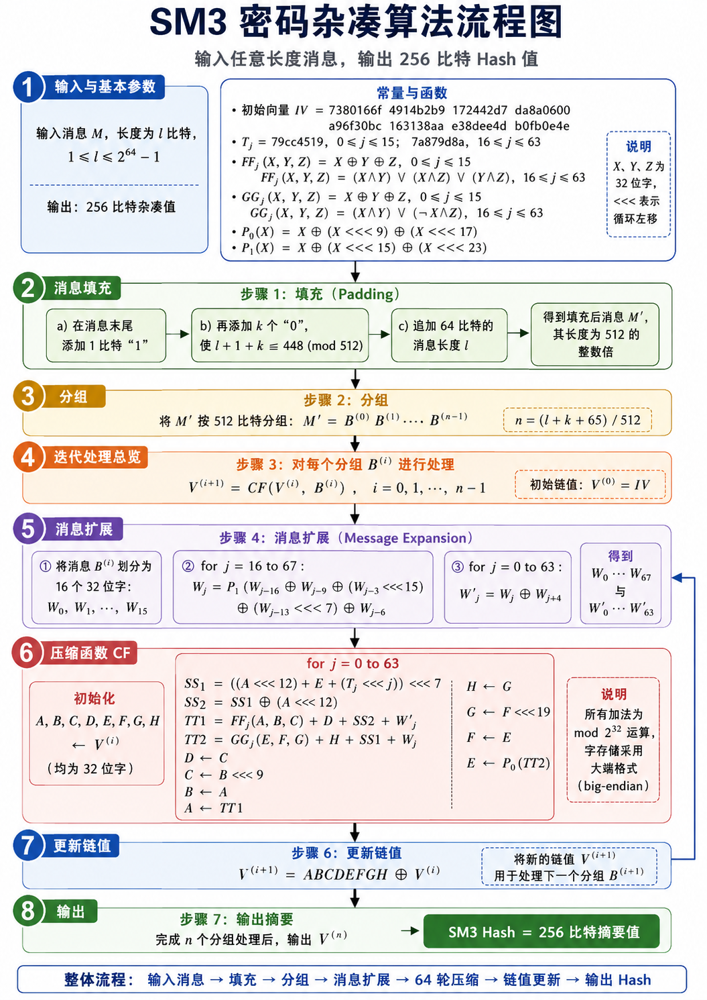

## SM3 算法介绍



SM3 是一个迭代型 Hash 算法：它先把任意长度消息整理成若干个 512 比特分组，然后每次取一个分组，与当前 256 比特链值一起送入压缩函数。压缩函数内部会先做消息扩展，再进行 64 轮寄存器更新，最后把本轮结果和输入链值异或，得到新的链值。所有分组处理完成后，最后一个链值就是 256 比特杂凑值。

### 1. 输入与基本参数

SM3 的输入是一段消息 $M$，消息长度记为 $l$ 比特，要求满足：

$$
1 \le l \le 2^{64}-1
$$

算法最终输出固定长度的 Hash 值，长度为 256 比特。也就是说，无论原始消息有多长，最终摘要长度都固定为 256 比特。

SM3 的初始状态由初始向量 $IV$ 给出：

$$
IV =
\text{7380166f 4914b2b9 172442d7 da8a0600}\\
\text{a96f30bc 163138aa e38dee4d b0fb0e4e}
$$

可以看到，初始向量一共有 8 个 32 位字，总长度正好是：

$$
8 \times 32 = 256 \text{ bit}
$$

所以在算法里，链值 $V^{(i)}$ 始终是 256 比特。它可以拆成 8 个 32 位寄存器：

$$
A,B,C,D,E,F,G,H
$$

图中还列出了常量 $T_j$。SM3 一共有 64 轮压缩，每一轮使用一个常量：

$$
T_j =
\begin{cases}
\text{79cc4519}, & 0 \le j \le 15 \\
\text{7a879d8a}, & 16 \le j \le 63
\end{cases}
$$

这里的 $j$ 表示轮数编号。前 16 轮使用一个常量，后 48 轮使用另一个常量。这样做的作用是让不同轮次的计算具有不同扰动，减少轮函数结构过于重复带来的风险。

SM3 还定义了两个布尔函数 $FF_j$ 和 $GG_j$。它们的输入都是三个 32 位字 $X,Y,Z$，输出也是一个 32 位字。

前 16 轮中：

$$
FF_j(X,Y,Z)=X\oplus Y\oplus Z\\
GG_j(X,Y,Z)=X\oplus Y\oplus Z
$$

这里用的是按位异或，结构相对直接，主要用于初始扩散。

从第 16 轮到第 63 轮，函数变成：

$$
FF_j(X,Y,Z)=(X\wedge Y)\vee(X\wedge Z)\vee(Y\wedge Z)\\
GG_j(X,Y,Z)=(X∧Y)∨(¬X∧Z)
$$

第一个函数常被称为多数函数。对每一位来说，它会看 $X,Y,Z$ 这一位中有多少个 1，只要多数为 1，输出就是 1。第二个函数带有条件选择性质：当 $X$ 的某一位为 1 时，更倾向于选择 $Y$ 对应位；当 $X$ 的某一位为 0 时，更倾向于选择 $Z$ 对应位。

图中还有两个置换函数：

$$
P_0(X)=X\oplus(X\lll 9)\oplus(X\lll 17)\\
P_1(X)=X\oplus(X\lll15)\oplus(X\lll23)
$$

其中 $\lll$ 表示循环左移。它和普通左移不同，移出去的高位会从低位补回来。置换函数的作用是把一个 32 位字内部的比特位置打散，让输入中的局部变化传播到更多位置。

### 2. 消息填充

SM3 的压缩函数每次只能处理 512 比特数据。原始消息长度通常不会刚好是 512 的整数倍，所以在进入压缩之前，需要先进行填充。

假设原始消息长度为 $l$ 比特。填充分三步进行。

第一步，在消息末尾添加一个比特 $1$。

第二步，继续添加 $k$ 个比特 $0$，使得：

$$
l+1+k \equiv 448 \pmod{512}
$$

> 这一步的意思是，填充完 $1$ 和若干个 $0$ 后，消息长度在模 512 意义下等于 448。

第三步，再追加 64 比特长度字段，用二进制表示原始消息长度 $l$。

于是最终长度满足：

$$
448+64=512
$$

> 就是说，填充后的消息长度一定是 512 的整数倍。

这里需要注意，最后追加的 64 比特表示的是原始消息长度 $l$，不是填充后消息长度。这个长度字段参与后续压缩，可以让不同长度、不同内容的消息在结构上区分开来。

举个简化例子。若原始消息长度为 24 比特，先添加一个 $1$，此时长度变成 25 比特。接着添加 $k$ 个 $0$，使长度达到模 512 等于 448。最后再追加 64 比特长度字段，整个消息就变成 512 比特。

### 3. 分组

填充完成后，得到新的消息 $M'$。由于它的长度已经是 512 的整数倍，所以可以按 512 比特划分为若干组：

$$
M'=B^{(0)}B^{(1)}\cdots B^{(n-1)}
$$

其中每个 $B^{(i)}$ 都是一个 512 比特分组。

分组数为：

$$
n=\frac{l+k+65}{512}
$$

这里的 $65$ 来自两部分：前面添加的 1 比特，再加上最后的 64 比特长度字段。因此填充后总长度是：

$$
l+1+k+64=l+k+65
$$

分组这一步本身只是格式整理，但它决定了后面迭代压缩的次数。每一个 512 比特分组都会被送入压缩函数处理一次。

### 4. 迭代处理总览

SM3 使用 Merkle-Damgård 类型的迭代结构。它不是一次性处理完整消息，而是逐组处理。

初始链值为：

$$
V^{(0)}=IV
$$

对于每一个消息分组 $B^{(i)}$，计算：

$$
V^{(i+1)}=CF(V^{(i)},B^{(i)})
$$

> 其中 $CF$ 是压缩函数，下面会单独介绍

这个式子说明，每一轮分组处理都依赖两个输入：一个是当前链值 $V^{(i)}$，另一个是当前消息分组 $B^{(i)}$。输出的新链值 $V^{(i+1)}$ 会继续参与下一个分组的压缩。

因此，消息分组之间不是孤立处理的。前一个分组的压缩结果会影响后一个分组的计算过程。这种链式结构使得最终 Hash 值和所有消息分组都有关。

### 5. 消息扩展

在压缩函数正式开始 64 轮运算前，SM3 会先对当前 512 比特分组 $B^{(i)}$ 做消息扩展。

一个 512 比特分组可以划分成 16 个 32 位字：

$$
W_0,W_1,\cdots,W_{15}
$$

因为：

$$
16\times 32=512
$$

但压缩函数有 64 轮，如果每轮都只直接使用原始 16 个字，输入消息参与计算的方式会相对有限。所以 SM3 会把这 16 个字扩展为 68 个字：

$$
W_0,W_1,\cdots,W_{67}
$$

扩展规则为：

$$
W_j=P_1(W_{j-16}\oplus W_{j-9}\oplus(W_{j-3}\lll 15))
\oplus(W_{j-13}\lll 7)\oplus W_{j-6}
$$

其中：

$$
16\le j\le 67
$$

这个公式的含义是：新的 $W_j$ 由多个历史位置的字经过异或、循环左移和置换函数 $P_1$ 混合得到。这样可以把原始分组中的比特传播到更多轮次中。

随后，算法继续生成 64 个字（这也就是为什么刚刚要扩展到68字）：

$$
W'_j=W_j\oplus W_{j+4}
$$

其中：

$$
0\le j\le 63
$$

最终压缩函数会用到两组扩展消息：

$$
W_0,\cdots,W_{67}\\
W_0′,\cdots,W_{63}′
$$

其中 $W_j$ 和 $W'_j$ 会分别进入压缩函数中的 $TT2$ 和 $TT1$ 计算。这样做使每一轮压缩都能获得不同的消息输入，并且这些输入已经包含了原始消息分组中多个位置的信息。

### 6. 压缩函数 CF

压缩函数是 SM3 的核心。它接收当前链值 $V^{(i)}$ 和当前消息分组 $B^{(i)}$，输出新的链值 $V^{(i+1)}$。

首先，把 256 比特链值拆成 8 个 32 位寄存器：

$$
A,B,C,D,E,F,G,H \leftarrow V^{(i)}
$$

然后执行 64 轮循环。每一轮编号为 $j$，范围是：

$$
0\le j\le 63
$$

每一轮先计算两个中间量 $SS1$ 和 $SS2$：

$$
SS1=((A\lll 12)+E+(T_j\lll j))\lll 7\\
SS2=SS1\oplus(A\lll12)
$$

这里的 $SS1$ 把当前寄存器 $A$、寄存器 $E$、轮常量 $T_j$ 结合起来，再做循环左移。由于 $T_j$ 还会按照轮数 $j$ 左移，所以每一轮引入的常量影响位置也会发生变化。

接着计算两个更重要的中间变量 $TT1$ 和 $TT2$：

$$
TT1=FF_j(A,B,C)+D+SS2+W'_j\\
TT2=GG_j(E,F,G)+H+SS1+W_j
$$

这里可以看到，SM3 的压缩状态实际上分成了两条相互关联的计算线索。

- 第一条线索以 $A,B,C,D$ 为主要寄存器，经过 $FF_j$、$D$、$SS2$、$W'_j$ 得到 $TT1$。

- 第二条线索以 $E,F,G,H$ 为主要寄存器，经过 $GG_j$、$H$、$SS1$、$W_j$ 得到 $TT2$。

这两条线索又通过 $SS1$、$SS2$、消息字和后续寄存器更新产生交叉影响。

然后更新 8 个寄存器：

$$
\begin{align}
&D\leftarrow C\\
&C\leftarrow B\lll9\\
&B\leftarrow A\\
&A\leftarrow TT1\\
&H\leftarrow G\\
&G\leftarrow F\lll19\\
&F\leftarrow E\\
&E\leftarrow P_0(TT2)
\end{align}
$$

这组更新有两个特点。

- 首先，寄存器不是简单平移，其中 $C$ 来自 $B\lll 9$，$G$ 来自 $F\lll 19$，$E$ 来自 $P_0(TT2)$。这些循环左移和置换会改变比特位置，让上一轮状态在下一轮中重新分布。

- 其次，$A$ 和 $E$ 分别由 $TT1$ 和 $P_0(TT2)$ 更新。也就是说，每一轮真正引入新计算结果的位置主要是 $A$ 和 $E$，然后在后续轮次中逐渐传播到其他寄存器。

### 7. 更新链值

64 轮压缩完成后，寄存器 $A,B,C,D,E,F,G,H$ 合起来形成一个 256 比特结果：

$$
ABCDEFGH
$$

SM3 把它和输入链值 $V^{(i)}$ 做异或：

$$
V^{(i+1)}=ABCDEFGH\oplus V^{(i)}
$$

这个操作也叫前馈结构。它让压缩输出和压缩前的链值再次结合，使当前分组的输出同时保留对输入链值的依赖。

之后，新的链值 $V^{(i+1)}$ 会继续参与下一个消息分组 $B^{(i+1)}$ 的处理。图中右侧的回箭头表达的就是这一点：每处理完一个分组，就更新链值，然后进入下一组。

如果当前已经是最后一个分组，那么更新后的链值就进入最终输出阶段。

### 8. 输出

当所有 $n$ 个分组都处理完成后，算法得到最后的链值：

$$
V^{(n)}
$$

这个 $V^{(n)}$ 就是 SM3 的 Hash 结果。

由于每个链值始终是 8 个 32 位字，所以输出长度为：

$$
8\times 32=256 \text{ bit}
$$

最终可以写成：

$$
SM3(M)=V^{(n)}
$$

图中底部的整体流程可以串起来理解：

$$
\text{输入消息}
\rightarrow
\text{填充}
\rightarrow
\text{分组}
\rightarrow
\text{消息扩展}
\rightarrow
\text{64 轮压缩}
\rightarrow
\text{链值更新}
\rightarrow
\text{输出 Hash}
$$

### 9. 算法实现

```python
# -*- coding: utf-8 -*-

"""
SM3 密码杂凑算法 Python 实现

输入：bytes 类型消息
输出：64 位十六进制字符串，即 256 比特 Hash 值
"""


# 初始向量 IV，8 个 32 位字
IV = [
    0x7380166F,
    0x4914B2B9,
    0x172442D7,
    0xDA8A0600,
    0xA96F30BC,
    0x163138AA,
    0xE38DEE4D,
    0xB0FB0E4E,
]


def rotate_left(x: int, n: int) -> int:
    """
    32 位循环左移

    x：待移位的 32 位整数
    n：循环左移位数
    """
    n = n % 32
    return ((x << n) & 0xFFFFFFFF) | (x >> (32 - n))


def p0(x: int) -> int:
    """
    置换函数 P0

    P0(X) = X ⊕ (X <<< 9) ⊕ (X <<< 17)
    """
    return x ^ rotate_left(x, 9) ^ rotate_left(x, 17)


def p1(x: int) -> int:
    """
    置换函数 P1

    P1(X) = X ⊕ (X <<< 15) ⊕ (X <<< 23)
    """
    return x ^ rotate_left(x, 15) ^ rotate_left(x, 23)


def ff(x: int, y: int, z: int, j: int) -> int:
    """
    布尔函数 FF_j

    0 <= j <= 15:
        FF_j(X,Y,Z) = X ⊕ Y ⊕ Z

    16 <= j <= 63:
        FF_j(X,Y,Z) = (X∧Y) ∨ (X∧Z) ∨ (Y∧Z)
    """
    if 0 <= j <= 15:
        return x ^ y ^ z

    return (x & y) | (x & z) | (y & z)


def gg(x: int, y: int, z: int, j: int) -> int:
    """
    布尔函数 GG_j

    0 <= j <= 15:
        GG_j(X,Y,Z) = X ⊕ Y ⊕ Z

    16 <= j <= 63:
        GG_j(X,Y,Z) = (X∧Y) ∨ ((¬X)∧Z)
    """
    if 0 <= j <= 15:
        return x ^ y ^ z

    return (x & y) | ((~x & 0xFFFFFFFF) & z)


def t(j: int) -> int:
    """
    常量 T_j

    0 <= j <= 15:
        T_j = 0x79CC4519

    16 <= j <= 63:
        T_j = 0x7A879D8A
    """
    if 0 <= j <= 15:
        return 0x79CC4519

    return 0x7A879D8A


def padding(message: bytes) -> bytes:
    """
    消息填充

    原始消息长度为 l 比特。
    填充步骤：
    1. 在消息末尾添加 1 比特；
    2. 添加 k 个 0，使 l + 1 + k ≡ 448 (mod 512)；
    3. 追加 64 比特的原始消息长度 l。
    """
    bit_len = len(message) * 8

    # 添加 1 比特。按字节表示时，就是追加 10000000，即 0x80
    padded = message + b"\x80"

    # 继续追加 0x00，直到当前长度模 64 字节等于 56 字节
    # 56 字节 = 448 比特，剩下 8 字节用于保存原始长度
    while (len(padded) % 64) != 56:
        padded += b"\x00"

    # 追加 64 比特原始消息长度，大端格式
    padded += bit_len.to_bytes(8, byteorder="big")

    return padded


def message_extension(block: bytes):
    """
    消息扩展

    输入：
        block：512 比特分组，即 64 字节

    输出：
        W ：W_0 到 W_67，共 68 个 32 位字
        W1：W'_0 到 W'_63，共 64 个 32 位字
    """
    W = []

    # 将 512 比特分组划分为 16 个 32 位字
    for i in range(16):
        word = int.from_bytes(block[i * 4:(i + 1) * 4], byteorder="big")
        W.append(word)

    # 由 W_0...W_15 扩展出 W_16...W_67
    for j in range(16, 68):
        value = (
            p1(W[j - 16] ^ W[j - 9] ^ rotate_left(W[j - 3], 15))
            ^ rotate_left(W[j - 13], 7)
            ^ W[j - 6]
        )
        W.append(value & 0xFFFFFFFF)

    # 生成 W'_0...W'_63
    W1 = []
    for j in range(64):
        W1.append((W[j] ^ W[j + 4]) & 0xFFFFFFFF)

    return W, W1


def compression(v_i, block: bytes):
    """
    压缩函数 CF

    输入：
        v_i：当前链值 V^(i)，包含 8 个 32 位字
        block：当前 512 比特消息分组 B^(i)

    输出：
        新链值 V^(i+1)
    """
    W, W1 = message_extension(block)

    A, B, C, D, E, F, G, H = v_i

    for j in range(64):
        SS1 = rotate_left(
            (rotate_left(A, 12) + E + rotate_left(t(j), j)) & 0xFFFFFFFF,
            7
        )

        SS2 = SS1 ^ rotate_left(A, 12)

        TT1 = (ff(A, B, C, j) + D + SS2 + W1[j]) & 0xFFFFFFFF
        TT2 = (gg(E, F, G, j) + H + SS1 + W[j]) & 0xFFFFFFFF

        D = C
        C = rotate_left(B, 9)
        B = A
        A = TT1

        H = G
        G = rotate_left(F, 19)
        F = E
        E = p0(TT2)

        A &= 0xFFFFFFFF
        B &= 0xFFFFFFFF
        C &= 0xFFFFFFFF
        D &= 0xFFFFFFFF
        E &= 0xFFFFFFFF
        F &= 0xFFFFFFFF
        G &= 0xFFFFFFFF
        H &= 0xFFFFFFFF

    result = [
        A ^ v_i[0],
        B ^ v_i[1],
        C ^ v_i[2],
        D ^ v_i[3],
        E ^ v_i[4],
        F ^ v_i[5],
        G ^ v_i[6],
        H ^ v_i[7],
    ]

    return [x & 0xFFFFFFFF for x in result]


def sm3_hash(message: bytes) -> str:
    """
    SM3 主函数

    输入：
        message：bytes 类型消息

    输出：
        64 个十六进制字符组成的字符串
    """
    padded_message = padding(message)

    # 初始链值 V^(0) = IV
    v = IV[:]

    # 按 512 比特，也就是 64 字节分组处理
    for i in range(0, len(padded_message), 64):
        block = padded_message[i:i + 64]
        v = compression(v, block)

    # 8 个 32 位字拼接成 256 比特摘要
    return "".join(f"{word:08x}" for word in v)


if __name__ == "__main__":
    # 测试样例 1
    msg1 = b"abc"
    digest1 = sm3_hash(msg1)
    print("message:", msg1)
    print("SM3:", digest1)

    # 标准测试结果应为：
    # 66c7f0f462eeedd9d1f2d46bdc10e4e2
    # 4167c4875cf2f7a2297da02b8f4ba8e0

    # 测试样例 2
    msg2 = b"abcd" * 16
    digest2 = sm3_hash(msg2)
    print("message:", msg2)
    print("SM3:", digest2)

    # 标准测试结果应为：
    # debe9ff92275b8a138604889c18e5a4d
    # 6fdb70e5387e5765293dcba39c0c5732
```

