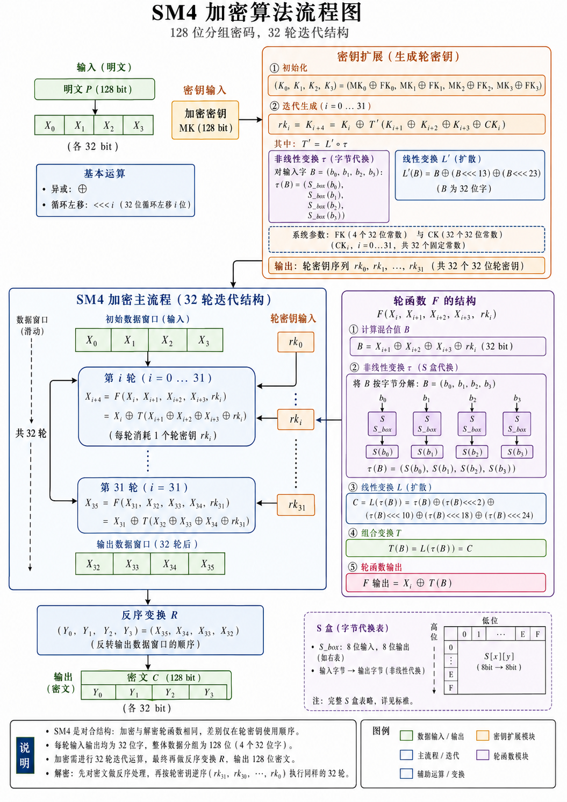
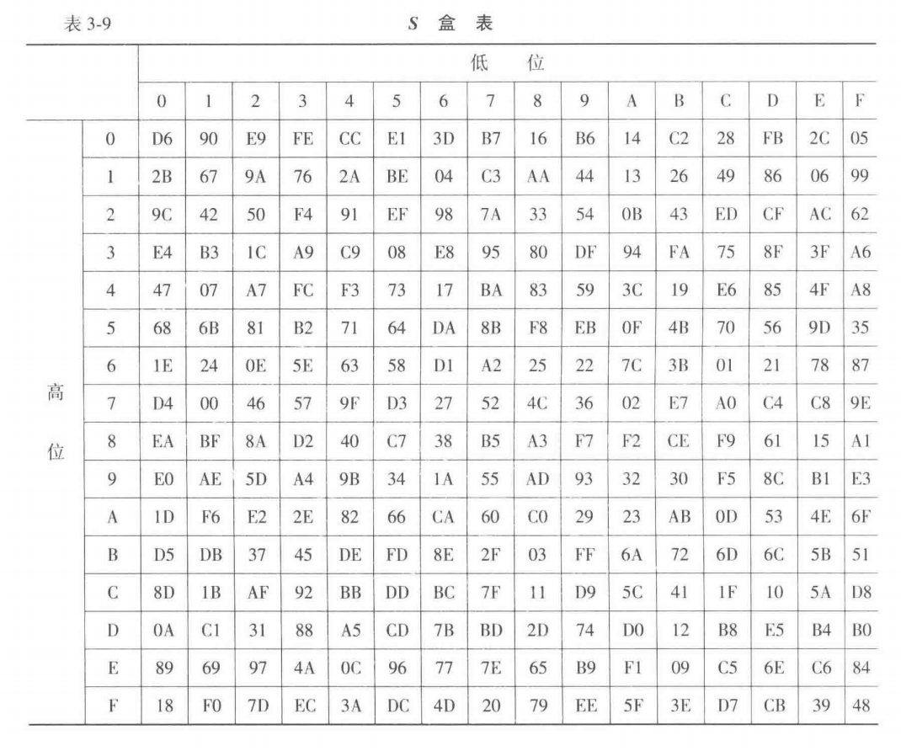

# SM4 算法介绍

## 加密



从左上角的明文输入和密钥输入开始，有两条线：

- 一条线负责把 128 位明文变成 4 个 32 位字，并送入 32 轮加密迭代；
- 另一条线负责把 128 位加密密钥扩展成 32 个轮密钥。

两条线在每一轮加密中汇合，每轮使用一个轮密钥，经过轮函数 $F$ 产生一个新的 32 位字。32 轮结束后，内部状态经过反序变换 $R$，得到最终 128 位密文。

### 1. 输入明文与数据分组

图中左上角的输入是：

$$
P = 128\text{ bit}
$$

SM4 是分组密码，每次处理一个 128 位数据分组。图中把这个 128 位明文分成 4 个 32 位字：

$$
P=(X_0,X_1,X_2,X_3)
$$

这里的 $X_0,X_1,X_2,X_3$ 都是 32 位数据字。SM4 后续计算的基本单位是“字”，也就是 32 位。字内部又可以按 4 个字节拆开，因为 S 盒代换以字节为单位进行。

所以左上角这块图的含义是：明文从一个 128 位整体进入算法后，先被整理成 4 个 32 位字，作为 32 轮迭代的初始数据窗口。

这个“数据窗口”在后面的主流程里会不断移动。初始窗口是：

$$
(X_0,X_1,X_2,X_3)
$$

经过第 0 轮后产生 $X_4$，窗口推进为：

$$
(X_1,X_2,X_3,X_4)
$$

经过第 1 轮后产生 $X_5$，窗口推进为：

$$
(X_2,X_3,X_4,X_5)
$$

这个过程一直持续到第 31 轮，最终得到：

$$
(X_{32},X_{33},X_{34},X_{35})
$$

### 2. 密钥扩展

SM4 输入的加密密钥也是 128 位，记为：

$$
MK=(MK_0,MK_1,MK_2,MK_3)
$$

每个 $MK_i$ 是 32 位字。加密主流程一共有 32 轮，每轮需要一个 32 位轮密钥：

$$
rk_0,rk_1,\ldots,rk_{31}
$$

**所以“密钥扩展”板块的任务，是把 4 个 32 位的初始密钥字，扩展成 32 个 32 位轮密钥。**

密钥扩展第一步使用系统参数 $FK_0,FK_1,FK_2,FK_3$，生成初始中间密钥字：

$$
(K_0,K_1,K_2,K_3)
=
(MK_0\oplus FK_0,\; MK_1\oplus FK_1,\; MK_2\oplus FK_2,\; MK_3\oplus FK_3)
$$

其中 $FK$ 是 SM4 标准规定的固定参数。它参与初始密钥混合，使用户输入的密钥先进入算法规定的初始状态。

接着进入 32 次迭代。第 $i$ 次密钥扩展计算为：

$$
rk_i=K_{i+4}
=
K_i\oplus T'(K_{i+1}\oplus K_{i+2}\oplus K_{i+3}\oplus CK_i)
$$

这里的 $CK_i$ 是第 $i$ 个固定参数，一共有 32 个。它让每一轮密钥扩展时注入固定但轮次相关的数值，使各轮生成的轮密钥在结构上分开。

这个公式可以拆成几步理解。

第一步，把相邻三个中间密钥字与固定参数异或：

$$
A=K_{i+1}\oplus K_{i+2}\oplus K_{i+3}\oplus CK_i
$$

第二步，对 $A$ 做合成变换 $T'$：

$$
T'(A)=L'(\tau(A))
$$

> 其中 $\tau$ 是 S 盒代换，$L'$ 是密钥扩展专用的线性变换。下面会介绍

第三步，把结果与 $K_i$ 异或，得到新的中间密钥字：

$$
K_{i+4}=K_i\oplus T'(A)
$$

这个新字同时作为第 $i$ 个轮密钥：

$$
rk_i=K_{i+4}
$$

因此密钥扩展本身也像一个滑动窗口，从 $(K_0,K_1,K_2,K_3)$ 开始，每轮生成一个新的 $K$，并输出一个 $rk_i$。连续 32 次后，得到 $rk_0$ 到 $rk_{31}$。

### 3. 密钥扩展中的 $T'$：S 盒代换与 $L'$ 线性变换

右上角密钥扩展板块中有一个小结构：

$$
T'=L'\circ \tau
$$

这里的 $\tau$ 和加密轮函数中的 $\tau$ 相同，都表示字节级 S 盒代换。

设输入 32 位字为：

$$
A=(a_0,a_1,a_2,a_3)
$$

其中 $a_0,a_1,a_2,a_3$ 是 4 个 8 位字节。经过 S 盒代换后得到：

$$
\tau(A)=
(S_{box}(a_0),S_{box}(a_1),S_{box}(a_2),S_{box}(a_3))
$$

S 盒是固定查表映射，输入 8 位，输出 8 位。由于它是非线性代换，密钥扩展生成的轮密钥会带有非线性变化，从而提升轮密钥序列的复杂性。

之后进入 $L'$：

$$
L'(B)=B\oplus(B<<<13)\oplus(B<<<23)
$$

其中 $B=\tau(A)$。$L'$ 通过两种循环左移，把 S 盒代换后的 32 位结果扩散。密钥扩展使用 $L'$，加密轮函数使用 $L$，两者结构相近，移位参数有所区分。

### 4. SM4 加密主流程

图中间的大框是加密主体。它说明 SM4 加密由 32 轮迭代组成，每一轮处理当前窗口中的 4 个 32 位字，并生成一个新的 32 位字。

在第 $i$ 轮中，算法取当前窗口里的后 3 个字：

$$
X_{i+1},X_{i+2},X_{i+3}
$$

再取当前轮密钥：

$$
rk_i
$$

先做异或混合：

$$
B=X_{i+1}\oplus X_{i+2}\oplus X_{i+3}\oplus rk_i
$$

随后 $B$ 进入合成变换 $T$，得到：

$$
T(B)
$$

> 下一节中介绍 $T(\cdot)$

然后将 $T(B)$ 与窗口中的第一个字 $X_i$ 异或，生成新的字：

$$
X_{i+4}=X_i\oplus T(B)
$$

这个新生成的 $X_{i+4}$ 会放到数据窗口末尾，后续轮次继续使用。

!!! example

	以最开始两轮为例：
	
	第 0 轮：
	
	$$
	X_4
	=
	X_0\oplus T(X_1\oplus X_2\oplus X_3\oplus rk_0)
	$$

	窗口从：
	
	$$
	(X_0,X_1,X_2,X_3)
	$$

	推进为：
	
	$$
	(X_1,X_2,X_3,X_4)
	$$

	第 1 轮：
	
	$$
	X_5
	=
	X_1\oplus T(X_2\oplus X_3\oplus X_4\oplus rk_1)
	$$

	窗口推进为：
	
	$$
	(X_2,X_3,X_4,X_5)
	$$

	持续迭代到第 31 轮：
	
	$$
	X_{35}
	=
	X_{31}\oplus T(X_{32}\oplus X_{33}\oplus X_{34}\oplus rk_{31})
	$$

32 轮完成后，算法得到 36 个内部字中的后 4 个：

$$
X_{32},X_{33},X_{34},X_{35}
$$

它们是最终输出前的内部状态。

### 5. 轮函数 $F$ 的结构

轮函数 $F$ 的结构 把每一轮的计算拆成了 5 个步骤。

**第一步，计算混合值 $B$：**

$$
B=X_{i+1}\oplus X_{i+2}\oplus X_{i+3}\oplus rk_i
$$

这里的 $B$ 是一个 32 位字。它把当前窗口的 3 个数据字和当前轮密钥混合到一起。此时 $X_i$ 还保留在外侧，准备用于轮函数最后一步异或。

**第二步，进行非线性变换 $\tau$。** 先把 $B$ 拆成 4 个字节：

$$
B=(b_0,b_1,b_2,b_3)
$$

然后 4 个字节并行查 S 盒：

$$
\tau(B)=
(S_{box}(b_0),S_{box}(b_1),S_{box}(b_2),S_{box}(b_3))
$$

每个字节独立通过 S 盒。S 盒的作用是把线性的异或关系打乱，使输入和输出之间呈现非线性映射。分组密码安全性很大程度依赖这种非线性代换，因为单靠异或和循环移位都属于线性运算。

**第三步，进行线性变换 $L$**。设：

$$
A=\tau(B)
$$

则：

$$
L(A)=A\oplus(A<<<2)\oplus(A<<<10)\oplus(A<<<18)\oplus(A<<<24)
$$

这个 $L$ 会把 S 盒输出的 32 位字进行多次循环移位，并与原值异或。经过这种处理后，一个输入位的影响会被扩展到多个位置。S 盒提供非线性，$L$ 提供扩散，两者组合后形成 SM4 轮函数中的主要混淆和扩散机制。

**第四步，得到合成变换**：

$$
T(B)=L(\tau(B))
$$

所以 $T$ 表示先进行 S 盒代换，再进行线性扩散。

> 图中把 $T$ 单独画出来，是为了说明轮函数内部包含字节级非线性层和字级线性层，整体已经超出简单异或运算。

**第五步，生成轮函数输出**：

$$
F(X_i,X_{i+1},X_{i+2},X_{i+3},rk_i)
=
X_i\oplus T(B)
$$

这就是本轮新生成的字：

$$
X_{i+4}=X_i\oplus T(B)
$$

在结构上，$X_i$ 保留到最后一步，与 $T(B)$ 做异或；进入 $T$ 的对象，是后 3 个数据字和当前轮密钥的混合结果。

### 6. 右下角：S 盒说明

图右下角的 S 盒板块说明了 $S_{box}$ 的查表方式。S 盒输入是一个 8 位字节，可以写成两个 4 位部分：

$$
a = (\text{高 4 位},\text{低 4 位})
$$

高 4 位决定行，低 4 位决定列。比如输入字节为十六进制 $EF$，高 4 位是 $E$，低 4 位是 $F$，就在 S 盒表中查第 $E$ 行、第 $F$ 列，得到对应的 8 位输出。



S 盒在 SM4 中出现两处：

一处在加密轮函数的 $T=L\circ\tau$ 中，用于处理数据；

一处在密钥扩展的 $T'=L'\circ\tau$ 中，用于处理密钥中间值。

> SM4 的数据路径和密钥路径都引入了同一套非线性字节替换，从而让明文变化和密钥变化都能影响后续复杂运算。

### 7. 中下部：反序变换 $R$

32 轮迭代结束后，主流程得到内部状态：

$$
(X_{32},X_{33},X_{34},X_{35})
$$

接着执行反序变换 $R$：

$$
(Y_0,Y_1,Y_2,Y_3)=(X_{35},X_{34},X_{33},X_{32})
$$

> 也就是说，最终输出时把后 4 个字的顺序反过来。

经过反序后，得到密文：

$$
C=(Y_0,Y_1,Y_2,Y_3)
$$

也就是：

$$
C=(X_{35},X_{34},X_{33},X_{32})
$$

这一步是 SM4 标准加密流程的一部分。它让加密流程和解密流程在轮函数结构上保持统一，解密时只需把轮密钥使用顺序改为：

$$
rk_{31},rk_{30},\ldots,rk_0
$$

就可以沿同一类轮函数恢复明文。

### 8. 加密流程整体串起来

SM4 加密可以写成完整流程：

输入明文：

$$
P=(X_0,X_1,X_2,X_3)
$$

输入加密密钥：

$$
MK=(MK_0,MK_1,MK_2,MK_3)
$$

密钥扩展生成 32 个轮密钥：

$$
rk_0,rk_1,\ldots,rk_{31}
$$

然后从 $i=0$ 到 $31$ 依次执行：

$$
B_i=X_{i+1}\oplus X_{i+2}\oplus X_{i+3}\oplus rk_i
$$

32 轮后得到：

$$
(X_{32},X_{33},X_{34},X_{35})
$$

最后执行反序变换：

$$
(Y_0,Y_1,Y_2,Y_3)=(X_{35},X_{34},X_{33},X_{32})
$$

输出密文：

$$
C=(Y_0,Y_1,Y_2,Y_3)
$$

### 算法实现

```python
"""
SM4 加密与解密实现

数据单位：
- 1 个分组 = 128 bit = 16 byte
- 1 个字 = 32 bit = 4 byte
- 加密主流程：32 轮迭代
- 解密主流程：轮函数相同，轮密钥按 rk31 -> rk0 使用

测试向量：
key       = 0123456789abcdeffedcba9876543210
plaintext = 0123456789abcdeffedcba9876543210
cipher    = 681edf34d206965e86b3e94f536e4246
"""

from typing import List


# ============================================================
# 1. S 盒：8 bit 输入，8 bit 输出
# ============================================================

SBOX = [
    0xD6, 0x90, 0xE9, 0xFE, 0xCC, 0xE1, 0x3D, 0xB7, 0x16, 0xB6, 0x14, 0xC2, 0x28, 0xFB, 0x2C, 0x05,
    0x2B, 0x67, 0x9A, 0x76, 0x2A, 0xBE, 0x04, 0xC3, 0xAA, 0x44, 0x13, 0x26, 0x49, 0x86, 0x06, 0x99,
    0x9C, 0x42, 0x50, 0xF4, 0x91, 0xEF, 0x98, 0x7A, 0x33, 0x54, 0x0B, 0x43, 0xED, 0xCF, 0xAC, 0x62,
    0xE4, 0xB3, 0x1C, 0xA9, 0xC9, 0x08, 0xE8, 0x95, 0x80, 0xDF, 0x94, 0xFA, 0x75, 0x8F, 0x3F, 0xA6,
    0x47, 0x07, 0xA7, 0xFC, 0xF3, 0x73, 0x17, 0xBA, 0x83, 0x59, 0x3C, 0x19, 0xE6, 0x85, 0x4F, 0xA8,
    0x68, 0x6B, 0x81, 0xB2, 0x71, 0x64, 0xDA, 0x8B, 0xF8, 0xEB, 0x0F, 0x4B, 0x70, 0x56, 0x9D, 0x35,
    0x1E, 0x24, 0x0E, 0x5E, 0x63, 0x58, 0xD1, 0xA2, 0x25, 0x22, 0x7C, 0x3B, 0x01, 0x21, 0x78, 0x87,
    0xD4, 0x00, 0x46, 0x57, 0x9F, 0xD3, 0x27, 0x52, 0x4C, 0x36, 0x02, 0xE7, 0xA0, 0xC4, 0xC8, 0x9E,
    0xEA, 0xBF, 0x8A, 0xD2, 0x40, 0xC7, 0x38, 0xB5, 0xA3, 0xF7, 0xF2, 0xCE, 0xF9, 0x61, 0x15, 0xA1,
    0xE0, 0xAE, 0x5D, 0xA4, 0x9B, 0x34, 0x1A, 0x55, 0xAD, 0x93, 0x32, 0x30, 0xF5, 0x8C, 0xB1, 0xE3,
    0x1D, 0xF6, 0xE2, 0x2E, 0x82, 0x66, 0xCA, 0x60, 0xC0, 0x29, 0x23, 0xAB, 0x0D, 0x53, 0x4E, 0x6F,
    0xD5, 0xDB, 0x37, 0x45, 0xDE, 0xFD, 0x8E, 0x2F, 0x03, 0xFF, 0x6A, 0x72, 0x6D, 0x6C, 0x5B, 0x51,
    0x8D, 0x1B, 0xAF, 0x92, 0xBB, 0xDD, 0xBC, 0x7F, 0x11, 0xD9, 0x5C, 0x41, 0x1F, 0x10, 0x5A, 0xD8,
    0x0A, 0xC1, 0x31, 0x88, 0xA5, 0xCD, 0x7B, 0xBD, 0x2D, 0x74, 0xD0, 0x12, 0xB8, 0xE5, 0xB4, 0xB0,
    0x89, 0x69, 0x97, 0x4A, 0x0C, 0x96, 0x77, 0x7E, 0x65, 0xB9, 0xF1, 0x09, 0xC5, 0x6E, 0xC6, 0x84,
    0x18, 0xF0, 0x7D, 0xEC, 0x3A, 0xDC, 0x4D, 0x20, 0x79, 0xEE, 0x5F, 0x3E, 0xD7, 0xCB, 0x39, 0x48,
]


# ============================================================
# 2. 系统参数：FK 与 CK
# ============================================================

FK = [0xA3B1BAC6, 0x56AA3350, 0x677D9197, 0xB27022DC]

CK = [
    0x00070E15, 0x1C232A31, 0x383F464D, 0x545B6269,
    0x70777E85, 0x8C939AA1, 0xA8AFB6BD, 0xC4CBD2D9,
    0xE0E7EEF5, 0xFC030A11, 0x181F262D, 0x343B4249,
    0x50575E65, 0x6C737A81, 0x888F969D, 0xA4ABB2B9,
    0xC0C7CED5, 0xDCE3EAF1, 0xF8FF060D, 0x141B2229,
    0x30373E45, 0x4C535A61, 0x686F767D, 0x848B9299,
    0xA0A7AEB5, 0xBCC3CAD1, 0xD8DFE6ED, 0xF4FB0209,
    0x10171E25, 0x2C333A41, 0x484F565D, 0x646B7279,
]


# ============================================================
# 3. 基本运算：32 位循环左移、字节转换
# ============================================================

def rotl32(x: int, n: int) -> int:
    """32 位循环左移 n 位。"""
    x &= 0xFFFFFFFF
    return ((x << n) & 0xFFFFFFFF) | (x >> (32 - n))


def bytes_to_u32(b: bytes) -> int:
    """4 字节按大端序转成 32 位整数。"""
    return int.from_bytes(b, byteorder="big")


def u32_to_bytes(x: int) -> bytes:
    """32 位整数按大端序转成 4 字节。"""
    return (x & 0xFFFFFFFF).to_bytes(4, byteorder="big")


# ============================================================
# 4. 非线性变换 tau：对 32 位字的 4 个字节分别查 S 盒
# ============================================================

def tau(x: int) -> int:
    """
    非线性字节代换 tau。

    输入 x 是 32 位字，可拆成 4 个字节：
        x = b0 || b1 || b2 || b3
    对每个字节查 S 盒后重新拼接：
        tau(x) = SBOX[b0] || SBOX[b1] || SBOX[b2] || SBOX[b3]
    """
    b0 = (x >> 24) & 0xFF
    b1 = (x >> 16) & 0xFF
    b2 = (x >> 8) & 0xFF
    b3 = x & 0xFF

    return (
        (SBOX[b0] << 24)
        | (SBOX[b1] << 16)
        | (SBOX[b2] << 8)
        | SBOX[b3]
    )


# ============================================================
# 5. 合成变换 T 与 T'
# ============================================================

def L(b: int) -> int:
    """
    加密轮函数中的线性变换 L。

    L(B) = B ⊕ (B <<< 2) ⊕ (B <<< 10) ⊕ (B <<< 18) ⊕ (B <<< 24)
    """
    return b ^ rotl32(b, 2) ^ rotl32(b, 10) ^ rotl32(b, 18) ^ rotl32(b, 24)


def L_prime(b: int) -> int:
    """
    密钥扩展中的线性变换 L'。

    L'(B) = B ⊕ (B <<< 13) ⊕ (B <<< 23)
    """
    return b ^ rotl32(b, 13) ^ rotl32(b, 23)


def T(x: int) -> int:
    """加密轮函数使用的合成变换 T = L ∘ tau。"""
    return L(tau(x))


def T_prime(x: int) -> int:
    """密钥扩展使用的合成变换 T' = L' ∘ tau。"""
    return L_prime(tau(x))


# ============================================================
# 6. 密钥扩展：由 128 位主密钥生成 32 个轮密钥
# ============================================================

def key_schedule(key: bytes) -> List[int]:
    """
    生成 32 个 32 位轮密钥。

    输入：
        key: 16 字节主密钥 MK

    输出：
        rks: [rk0, rk1, ..., rk31]
    """
    if len(key) != 16:
        raise ValueError("SM4 密钥长度必须为 16 字节")

    # 将 128 位主密钥拆成 4 个 32 位字：MK0, MK1, MK2, MK3
    MK = [bytes_to_u32(key[i * 4:(i + 1) * 4]) for i in range(4)]

    # 初始中间密钥字：K0..K3 = MK0..MK3 与 FK0..FK3 异或
    K = [MK[i] ^ FK[i] for i in range(4)]

    rks = []
    for i in range(32):
        # 密钥扩展公式：
        # rk_i = K_{i+4}
        #      = K_i ⊕ T'(K_{i+1} ⊕ K_{i+2} ⊕ K_{i+3} ⊕ CK_i)
        new_k = K[i] ^ T_prime(K[i + 1] ^ K[i + 2] ^ K[i + 3] ^ CK[i])
        new_k &= 0xFFFFFFFF
        K.append(new_k)
        rks.append(new_k)

    return rks


# ============================================================
# 7. 单轮函数 F
# ============================================================

def round_f(x0: int, x1: int, x2: int, x3: int, rk: int) -> int:
    """
    轮函数 F。

    F(X_i, X_{i+1}, X_{i+2}, X_{i+3}, rk_i)
      = X_i ⊕ T(X_{i+1} ⊕ X_{i+2} ⊕ X_{i+3} ⊕ rk_i)
    """
    return (x0 ^ T(x1 ^ x2 ^ x3 ^ rk)) & 0xFFFFFFFF


# ============================================================
# 8. 单分组加密：16 字节明文 -> 16 字节密文
# ============================================================

def encrypt_block(block: bytes, key: bytes) -> bytes:
    """
    加密单个 16 字节分组。

    输入：
        block: 16 字节明文分组
        key:   16 字节主密钥

    输出：
        16 字节密文分组
    """
    if len(block) != 16:
        raise ValueError("SM4 单分组长度必须为 16 字节")

    rks = key_schedule(key)

    # 明文分组拆成 X0, X1, X2, X3
    X = [bytes_to_u32(block[i * 4:(i + 1) * 4]) for i in range(4)]

    # 32 轮迭代，每轮生成一个新字 X_{i+4}
    for i in range(32):
        X.append(round_f(X[i], X[i + 1], X[i + 2], X[i + 3], rks[i]))

    # 反序变换 R：密文为 X35, X34, X33, X32
    return b"".join(u32_to_bytes(x) for x in [X[35], X[34], X[33], X[32]])


# ============================================================
# 9. 单分组解密：16 字节密文 -> 16 字节明文
# ============================================================

def decrypt_block(block: bytes, key: bytes) -> bytes:
    """
    解密单个 16 字节分组。

    SM4 解密使用同一个轮函数 F，轮密钥顺序改为：
        rk31, rk30, ..., rk0
    """
    if len(block) != 16:
        raise ValueError("SM4 单分组长度必须为 16 字节")

    rks = key_schedule(key)
    rks.reverse()

    # 密文分组拆成 4 个 32 位字；后续仍按同一轮结构处理
    X = [bytes_to_u32(block[i * 4:(i + 1) * 4]) for i in range(4)]

    # 使用逆序轮密钥执行 32 轮
    for i in range(32):
        X.append(round_f(X[i], X[i + 1], X[i + 2], X[i + 3], rks[i]))

    # 反序变换 R：明文为 X35, X34, X33, X32
    return b"".join(u32_to_bytes(x) for x in [X[35], X[34], X[33], X[32]])


# ============================================================
# 10. PKCS#7 填充：支持任意长度数据加解密
# ============================================================

def pkcs7_pad(data: bytes, block_size: int = 16) -> bytes:
    """PKCS#7 填充，使数据长度成为 block_size 的整数倍。"""
    pad_len = block_size - (len(data) % block_size)
    return data + bytes([pad_len] * pad_len)


def pkcs7_unpad(data: bytes, block_size: int = 16) -> bytes:
    """去除 PKCS#7 填充。"""
    if len(data) == 0 or len(data) % block_size != 0:
        raise ValueError("填充数据长度异常")

    pad_len = data[-1]
    if pad_len < 1 or pad_len > block_size:
        raise ValueError("填充值异常")

    if data[-pad_len:] != bytes([pad_len] * pad_len):
        raise ValueError("填充格式异常")

    return data[:-pad_len]


def encrypt_ecb(data: bytes, key: bytes) -> bytes:
    """
    ECB 模式加密任意长度数据。

    说明：此处用于学习 SM4 主算法流程。工程场景通常选择带随机 IV 的工作模式，
    例如 CBC、CTR、GCM 类模式，按实际协议要求确定。
    """
    padded = pkcs7_pad(data, 16)
    out = []
    for i in range(0, len(padded), 16):
        out.append(encrypt_block(padded[i:i + 16], key))
    return b"".join(out)


def decrypt_ecb(ciphertext: bytes, key: bytes) -> bytes:
    """ECB 模式解密任意长度数据，并去除 PKCS#7 填充。"""
    if len(ciphertext) == 0 or len(ciphertext) % 16 != 0:
        raise ValueError("密文长度必须为 16 字节的整数倍")

    out = []
    for i in range(0, len(ciphertext), 16):
        out.append(decrypt_block(ciphertext[i:i + 16], key))
    return pkcs7_unpad(b"".join(out), 16)


# ============================================================
# 11. 测试入口
# ============================================================

if __name__ == "__main__":
    # 标准测试向量
    key = bytes.fromhex("0123456789abcdeffedcba9876543210")
    plaintext = bytes.fromhex("0123456789abcdeffedcba9876543210")

    ciphertext = encrypt_block(plaintext, key)
    recovered = decrypt_block(ciphertext, key)

    print("单分组加密测试")
    print("key       =", key.hex())
    print("plaintext =", plaintext.hex())
    print("cipher    =", ciphertext.hex())
    print("recovered =", recovered.hex())

    # 任意长度数据测试
    msg = "SM4 算法测试：这是一段任意长度的明文。".encode("utf-8")
    enc = encrypt_ecb(msg, key)
    dec = decrypt_ecb(enc, key)

    print("\n多分组 ECB + PKCS#7 测试")
    print("msg       =", msg.decode("utf-8"))
    print("enc       =", enc.hex())
    print("dec       =", dec.decode("utf-8"))
```

