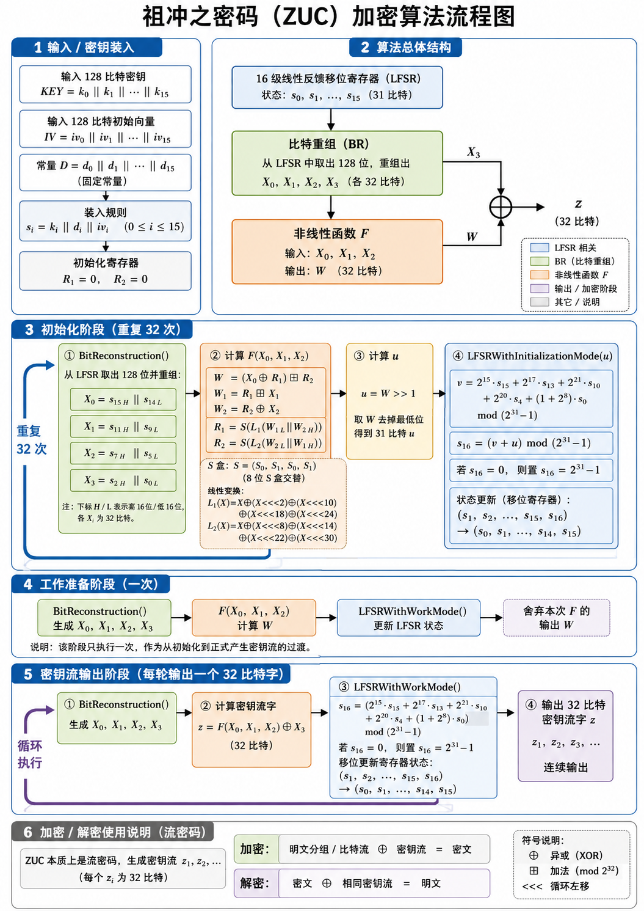
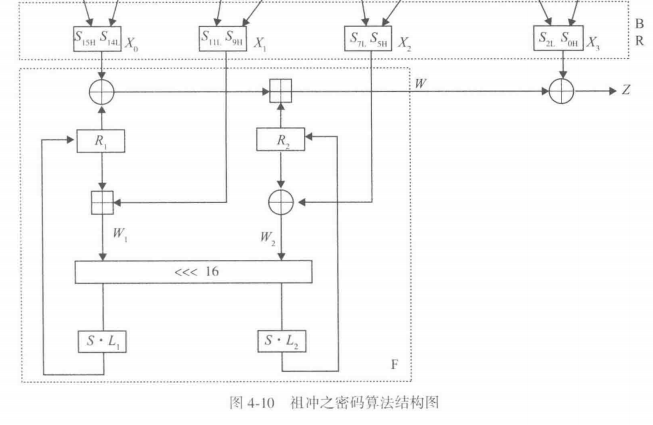
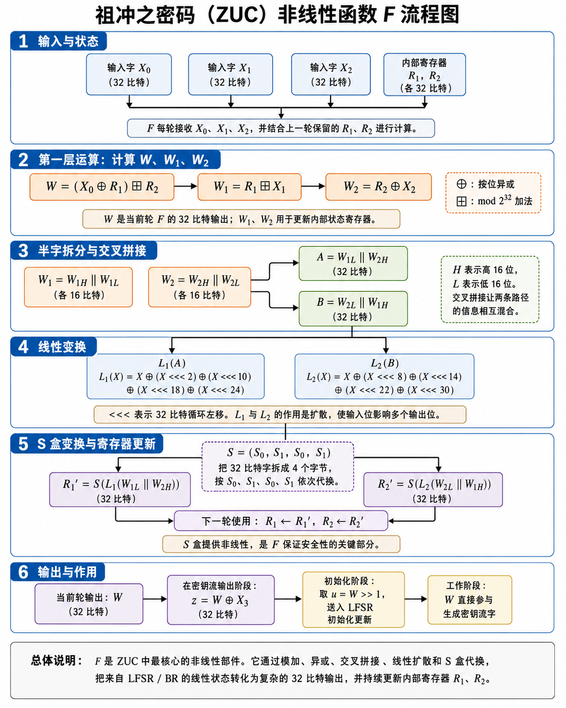

## 祖冲之密码算法介绍



### 1. 输入 / 密钥装入

祖冲之密码属于流密码。它加密时首先接收两个 128 比特输入：一个是密钥 `KEY`，一个是初始向量 `IV`。

密钥写成：

$$
KEY = k_0 \parallel k_1 \parallel \cdots \parallel k_{15}
$$

初始向量写成：

$$
IV = iv_0 \parallel iv_1 \parallel \cdots \parallel iv_{15}
$$

> 其中中每个 $k_i$ 是 8 比特字节、每个 $iv_i$ 也是 8 比特字节。

ZUC 内部还固定保存一组常量：

$$
D = d_0 \parallel d_1 \parallel \cdots \parallel d_{15}
$$

> 每个 $d_i$ 是 15 比特常量。

密钥装入时，算法把三部分拼接成 16 个 31 比特寄存器单元：

$$
s_i = k_i \parallel d_i \parallel iv_i,\quad 0 \le i \le 15
$$

也就是说，每个 LFSR 状态单元 $s_i$ 由三段组成：

$$
8\text{ bit }k_i + 15\text{ bit }d_i + 8\text{ bit }iv_i = 31\text{ bit}
$$

这样，128 比特密钥和 128 比特初始向量就被扩展进 16 个 31 比特的 LFSR 状态中。与此同时，非线性函数 $F$ 内部的两个 32 比特寄存器初始化为：

$$
R_1 = 0,\quad R_2 = 0
$$

到这里，ZUC 的内部初始状态已经形成，但这些状态还没有经过充分混合，所以接下来要进入初始化阶段。

### 2. 算法总体结构

ZUC 的主体结构可以分成三层。

**最上层是 16 级线性反馈移位寄存器**，也就是 LFSR。它保存 16 个 31 比特状态：

$$
s_0,s_1,\cdots,s_{15}
$$

LFSR 的作用是持续更新内部状态，提供一个长周期、随机性较好的基础状态序列。

**中间层是比特重组 BR**。它从 LFSR 的若干寄存器单元中抽取高 16 位或低 16 位，然后拼接成 4 个 32 比特字：

$$
X_0,X_1,X_2,X_3
$$

这一步把 LFSR 中分散的状态重新组合成非线性函数能够处理的输入。

> 按照课本的写法，$X_0=S_{15H}S_{14L}$，$X_1=S_{11L}S_{9H}$，$X_2=S_{7L}S_{5H}$，$X_3=S_{2L}S_{0H}$

**下层是非线性函数 $F$**。它接收：

$$
X_0,X_1,X_2
$$

并结合内部寄存器 $R_1,R_2$，计算出一个 32 比特输出：

$$
W
$$

在密钥流输出阶段，最终密钥流字由 $F$ 的输出 $W$ 与比特重组得到的 $X_3$ 异或得到：

$$
z = W \oplus X_3
$$

所以，从整体结构看，ZUC 的一轮输出可以理解为：

$$
LFSR \rightarrow BR \rightarrow F \rightarrow z
$$

其中 LFSR 提供状态，BR 负责抽取与拼接，$F$ 负责引入非线性，最后通过 $X_3$ 与 $W$ 异或形成密钥流字。

### 3. 初始化阶段：重复 32 次

密钥和初始向量装入 LFSR 后，内部状态仍然直接带有输入结构。为了让密钥、初始向量和常量充分混合，ZUC 会先执行 32 轮初始化。

==每一轮初始化由四步组成。==

#### 第一步是比特重组：

$$
\begin{align}
X_0 = s_{15H} \parallel s_{14L}\\
X_1 = s_{11L} \parallel s_{9H}\\
X_2 = s_{7L} \parallel s_{5H}\\
X_3 = s_{2L} \parallel s_{0L}
\end{align}
$$

这里的 $H$ 表示高 16 位，$L$ 表示低 16 位。通过这种抽取方式，算法把 LFSR 中不同位置的状态组合起来，使后续函数 $F$ 同时受到多个寄存器状态的影响。

##### 第二步是计算非线性函数 $F$



> 图片有些抽象，这一块我讲解的详细一些

**非线性函数 $F$ 位于 ZUC 的下层，接收比特重组模块给出的 $X_0,X_1,X_2$，同时维护两个内部 32 比特寄存器 $R_1,R_2$。它每轮完成两件事：一方面计算当前轮输出 $W$，另一方面更新 $R_1,R_2$，让下一轮计算带有上一轮的状态记忆。**

设 $X_0,X_1,X_2$ 来自比特重组，均为 32 比特字；$R_1,R_2$ 是 $F$ 内部保存的 32 比特状态寄存器；$\oplus$ 表示按位异或；$\boxplus$ 表示模 $2^{32}$ 加法；$<<<$ 表示 32 比特循环左移 $n$ 位；$\parallel$ 表示拼接。每一轮进入 $F$ 时，算法先计算三个中间量：

$$
\begin{align}
W=(X_0\oplus R_1)\boxplus R_2\\
W_1=R_1\boxplus X_1\\
W_2=R_2\oplus X_2
\end{align}
$$

这三条式子承担的角色存在差异。

- $W$  是当前轮对外给出的 32 比特结果，后续在密钥流输出阶段会和 $X_3$ 异或形成密钥流字 $z$。
- $W_1$ 使用模加法，把 $R_1$ 与 $X_1$ 组合，服务于 $R_1$ 的更新
- $W_2$ 使用异或，把 $R_2$ 与 $X_2$ 组合，服务于 $R_2$ 的更新

模加法会产生进位传播，进位使高位受到低位影响；异或提供按位混合。二者共同进入后续变换后，寄存器状态会持续吸收 LFSR 的新信息。

**接下来，算法把 $W_1$ 和 $W_2$ 拆成高 16 位与低 16 位**。记 $W_{1H}$ 为 $W_1$ 的高 16 位，$W_{1L}$ 为 $W_1$ 的低 16 位；$W_{2H}$ 和 $W_{2L}$ 同理。然后重新交叉拼接：

$$
\begin{align}
A=W_{1L}\parallel W_{2H}\\
B=W_{2L}\parallel W_{1H}
\end{align}
$$

这里的交叉拼接值得注意：$A$ 同时包含 $W_1$ 的低半字和 $W_2$ 的高半字，$B$ 同时包含 $W_2$ 的低半字和 $W_1$ 的高半字。也就是说，两个待更新寄存器所接收的输入都来自两条中间路径的混合结果。这样处理后，$R_1$ 的更新会受到 $W_1,W_2$ 的共同影响，$R_2$ 的更新也会受到 $W_1,W_2$ 的共同影响。

**随后，$A$ 进入线性变换 $L_1$，$B$ 进入线性变换 $L_2$：**

$$
\begin{align}
L_1(X)=X\oplus(X<<<2)\oplus(X<<<10)\oplus(X<<<18)\oplus(X<<<24)\\
L_2(X)=X\oplus(X<<<8)\oplus(X<<<14)\oplus(X<<<22)\oplus(X<<<30)
\end{align}
$$

$L_1$ 和 $L_2$ 的作用是扩散。以 $L_1$ 为例，输入 $X$ 会被循环左移到多个位置，再与原值异或。这样，一个输入位会进入多个输出位置，多个输入位置的信息也会合成到同一输出位中。$L_2$ 的结构类似，只是采用另一组循环左移距离。两组距离分开设置，使 $R_1$ 和 $R_2$ 的状态更新路径具有差异化扩散方式。

**线性变换之后，结果进入 S 盒变换**。ZUC 的 $S$ 变换把一个 32 比特字拆成 4 个字节：

$$
Y=y_0\parallel y_1\parallel y_2\parallel y_3
$$

然后按 4 个字节依次查表：

$$
S(Y)=S_0(y_0)\parallel S_1(y_1)\parallel S_0(y_2)\parallel S_1(y_3)
$$

流程图中写作：

$$
S=(S_0,S_1,S_0,S_1)
$$

S 盒是 $F$ 中最直接的非线性来源。输入字节经过查表替换后，输出与输入之间形成复杂映射关系。前面的模加法也带有非线性特征，原因在于进位传播会让某一位的结果受低位组合影响；S 盒进一步增强了这种复杂性。

**把线性变换和 S 盒合在一起，$R_1,R_2$ 的更新公式为：**

$$
R_1=S(L_1(W_{1L}\parallel W_{2H}))
$$

这两条式子说明，$F$ 的内部寄存器更新来源于当前轮的 $X_1,X_2$、上一轮遗留下来的 $R_1,R_2$，以及模加、异或、半字交叉拼接、循环移位扩散和 S 盒替换的共同作用。经过这一轮更新后，新的 $R_1,R_2$ 会保存到下一轮，形成跨轮状态传递。

从一轮 $F$ 的完整过程看，数据流可以整理为：

$$
(X_0,X_1,X_2,R_1,R_2)
\rightarrow (W,W_1,W_2)
\rightarrow (W_{1L}\parallel W_{2H},\;W_{2L}\parallel W_{1H})
\rightarrow (L_1,L_2)
\rightarrow S
\rightarrow (R_1',R_2')
$$

其中 $W$ 是当前轮输出，$R_1',R_2'$ 是下一轮内部状态。ZUC 通过这种结构，把 LFSR 提供的线性状态转化为带有跨轮记忆、模加进位、S 盒替换和扩散效应的输出序列。最终加密时，算法持续输出 $z_1,z_2,z_3,\cdots$，再与明文比特流异或得到密文。



#### 第三步是计算初始化反馈量 $u$。

初始化阶段会取 $F$ 的输出 $W$，去掉最低位，得到一个 31 比特数：

$$
u = W >> 1
$$

这个 $u$ 会参与 LFSR 的反馈更新，使非线性函数 $F$ 的结果反过来影响 LFSR 状态。

#### 第四步是执行初始化模式下的 LFSR 更新。

先根据 LFSR 的若干状态计算：

$$
v = 2^{15}s_{15}+2^{17}s_{13}+2^{21}s_{10}+2^{20}s_4+(1+2^8)s_0 \pmod{2^{31}-1}
$$

然后加入刚才得到的 $u$：

$$
s_{16} = (v+u)\pmod{2^{31}-1}
$$

如果计算结果为 0，则规定：

$$
s_{16}=2^{31}-1
$$

最后执行寄存器移位更新，把旧状态整体向前移动，新生成的 $s_{16}$ 放入末端：

$$
(s_1,s_2,\cdots,s_{15},s_{16}) \rightarrow (s_0,s_1,\cdots,s_{14},s_{15})
$$

这 32 轮初始化的核心作用是让密钥、初始向量、LFSR 状态和非线性函数状态互相影响。经过 32 轮后，算法内部状态已经完成较充分扩散，随后进入正式输出密钥流之前的工作准备阶段。

### 4. 工作准备阶段：执行一次

初始化 32 轮结束后，ZUC 还会执行一次工作准备过程。

这一轮流程是：

$$
BitReconstruction()
$$

它和正式密钥流输出阶段很接近，区别在于这一轮 $F$ 的输出 $W$ 会被舍弃。也就是说，这一步只用于进一步推动内部状态进入工作状态，暂时还不产生供加密使用的密钥流字。

工作模式下的 LFSR 更新公式为：

$$
s_{16}=2^{15}s_{15}+2^{17}s_{13}+2^{21}s_{10}+2^{20}s_4+(1+2^8)s_0 \pmod{2^{31}-1}
$$

与初始化模式相比，这里少了 $u$ 的参与。原因在于初始化阶段需要让 $F$ 的输出反向影响 LFSR，而工作阶段的 LFSR 按自身反馈规则持续推进。

### 5. 密钥流输出阶段：每轮输出一个 32 比特字

进入正式工作阶段后，ZUC 每执行一轮，就输出一个 32 比特密钥流字 $z$。

每轮仍然从比特重组开始:

$$
\begin{align}
X_0 = s_{15H} \parallel s_{14L}\\
X_1 = s_{11L} \parallel s_{9H}\\
X_2 = s_{7L} \parallel s_{5H}\\
X_3 = s_{2L} \parallel s_{0L}
\end{align}
$$

随后计算非线性函数：

$$
W = F(X_0,X_1,X_2)
$$

接着把 $W$ 与 $X_3$ 异或，得到当前轮的密钥流字：

$$
z = W \oplus X_3
$$

这里的 $z$ 是 32 比特。连续执行多轮后，会得到：

$$
z_1,z_2,z_3,\cdots
$$

每输出一个 $z$ 后，LFSR 进入工作模式更新：

$$
s_{16}=(2^{15}s_{15}+2^{17}s_{13}+2^{21}s_{10}+2^{20}s_4+(1+2^8)s_0)\pmod{2^{31}-1}
$$

如果 $s_{16}=0$，则置为：

$$
s_{16}=2^{31}-1
$$

然后状态移位：

$$
(s_1,s_2,\cdots,s_{15},s_{16}) \rightarrow (s_0,s_1,\cdots,s_{14},s_{15})
$$

这样，每一轮都会用新的 LFSR 状态生成新的 $X_0,X_1,X_2,X_3$，再经过 $F$ 产生新的密钥流字。

### 6. 加密 / 解密使用说明

ZUC 本身负责生成密钥流。真正对明文进行加密时，只需把明文比特流与 ZUC 输出的密钥流逐位异或。

设明文为：

$$
P=P_1 \parallel P_2 \parallel P_3 \parallel \cdots
$$

ZUC 生成的密钥流为：

$$
Z=z_1 \parallel z_2 \parallel z_3 \parallel \cdots
$$

加密公式是：

$$
C=P\oplus Z
$$

也就是：

$$
密文 = 明文 \oplus 密钥流
$$

解密时使用相同的密钥 `KEY` 和相同的初始向量 `IV`，算法会生成完全相同的密钥流 $Z$。然后用密文再次异或：

$$
P=C\oplus Z
$$

因为异或满足：

$$
(P\oplus Z)\oplus Z=P
$$

所以密文异或同一段密钥流后即可恢复明文。

## 128-EEA3 算法实现

```python
# 128-EEA3 / ZUC-128 Python 实现
# 输入输出均按规范的大端比特序处理

MASK32 = 0xFFFFFFFF
MOD31 = 0x7FFFFFFF

S0 = [
    0x3E,0x72,0x5B,0x47,0xCA,0xE0,0x00,0x33,0x04,0xD1,0x54,0x98,0x09,0xB9,0x6D,0xCB,
    0x7B,0x1B,0xF9,0x32,0xAF,0x9D,0x6A,0xA5,0xB8,0x2D,0xFC,0x1D,0x08,0x53,0x03,0x90,
    0x4D,0x4E,0x84,0x99,0xE4,0xCE,0xD9,0x91,0xDD,0xB6,0x85,0x48,0x8D,0x29,0x6E,0xAC,
    0xCD,0xC1,0xF8,0x1E,0x73,0x43,0x69,0xC6,0xB5,0xBD,0xFD,0x39,0x63,0x20,0xD4,0x38,
    0x76,0x7D,0xB2,0xA7,0xCF,0xED,0x57,0xC5,0xF3,0x2C,0xBB,0x14,0x21,0x06,0x55,0x9B,
    0xE3,0xEF,0x5E,0x31,0x4F,0x7F,0x5A,0xA4,0x0D,0x82,0x51,0x49,0x5F,0xBA,0x58,0x1C,
    0x4A,0x16,0xD5,0x17,0xA8,0x92,0x24,0x1F,0x8C,0xFF,0xD8,0xAE,0x2E,0x01,0xD3,0xAD,
    0x3B,0x4B,0xDA,0x46,0xEB,0xC9,0xDE,0x9A,0x8F,0x87,0xD7,0x3A,0x80,0x6F,0x2F,0xC8,
    0xB1,0xB4,0x37,0xF7,0x0A,0x22,0x13,0x28,0x7C,0xCC,0x3C,0x89,0xC7,0xC3,0x96,0x56,
    0x07,0xBF,0x7E,0xF0,0x0B,0x2B,0x97,0x52,0x35,0x41,0x79,0x61,0xA6,0x4C,0x10,0xFE,
    0xBC,0x26,0x95,0x88,0x8A,0xB0,0xA3,0xFB,0xC0,0x18,0x94,0xF2,0xE1,0xE5,0xE9,0x5D,
    0xD0,0xDC,0x11,0x66,0x64,0x5C,0xEC,0x59,0x42,0x75,0x12,0xF5,0x74,0x9C,0xAA,0x23,
    0x0E,0x86,0xAB,0xBE,0x2A,0x02,0xE7,0x67,0xE6,0x44,0xA2,0x6C,0xC2,0x93,0x9F,0xF1,
    0xF6,0xFA,0x36,0xD2,0x50,0x68,0x9E,0x62,0x71,0x15,0x3D,0xD6,0x40,0xC4,0xE2,0x0F,
    0x8E,0x83,0x77,0x6B,0x25,0x05,0x3F,0x0C,0x30,0xEA,0x70,0xB7,0xA1,0xE8,0xA9,0x65,
    0x8D,0x27,0x1A,0xDB,0x81,0xB3,0xA0,0xF4,0x45,0x7A,0x19,0xDF,0xEE,0x78,0x34,0x60,
]

S1 = [
    0x55,0xC2,0x63,0x71,0x3B,0xC8,0x47,0x86,0x9F,0x3C,0xDA,0x5B,0x29,0xAA,0xFD,0x77,
    0x8C,0xC5,0x94,0x0C,0xA6,0x1A,0x13,0x00,0xE3,0xA8,0x16,0x72,0x40,0xF9,0xF8,0x42,
    0x44,0x26,0x68,0x96,0x81,0xD9,0x45,0x3E,0x10,0x76,0xC6,0xA7,0x8B,0x39,0x43,0xE1,
    0x3A,0xB5,0x56,0x2A,0xC0,0x6D,0xB3,0x05,0x22,0x66,0xBF,0xDC,0x0B,0xFA,0x62,0x48,
    0xDD,0x20,0x11,0x06,0x36,0xC9,0xC1,0xCF,0xF6,0x27,0x52,0xBB,0x69,0xF5,0xD4,0x87,
    0x7F,0x84,0x4C,0xD2,0x9C,0x57,0xA4,0xBC,0x4F,0x9A,0xDF,0xFE,0xD6,0x8D,0x7A,0xEB,
    0x2B,0x53,0xD8,0x5C,0xA1,0x14,0x17,0xFB,0x23,0xD5,0x7D,0x30,0x67,0x73,0x08,0x09,
    0xEE,0xB7,0x70,0x3F,0x61,0xB2,0x19,0x8E,0x4E,0xE5,0x4B,0x93,0x8F,0x5D,0xDB,0xA9,
    0xAD,0xF1,0xAE,0x2E,0xCB,0x0D,0xFC,0xF4,0x2D,0x46,0x6E,0x1D,0x97,0xE8,0xD1,0xE9,
    0x4D,0x37,0xA5,0x75,0x5E,0x83,0x9E,0xAB,0x82,0x9D,0xB9,0x1C,0xE0,0xCD,0x49,0x89,
    0x01,0xB6,0xBD,0x58,0x24,0xA2,0x5F,0x38,0x78,0x99,0x15,0x90,0x50,0xB8,0x95,0xE4,
    0xD0,0x91,0xC7,0xCE,0xED,0x0F,0xB4,0x6F,0xA0,0xCC,0xF0,0x02,0x4A,0x79,0xC3,0xDE,
    0xA3,0xEF,0xEA,0x51,0xE6,0x6B,0x18,0xEC,0x1B,0x2C,0x80,0xF7,0x74,0xE7,0xFF,0x21,
    0x5A,0x6A,0x54,0x1E,0x41,0x31,0x92,0x35,0xC4,0x33,0x07,0x0A,0xBA,0x7E,0x0E,0x34,
    0x88,0xB1,0x98,0x7C,0xF3,0x3D,0x60,0x6C,0x7B,0xCA,0xD3,0x1F,0x32,0x65,0x04,0x28,
    0x64,0xBE,0x85,0x9B,0x2F,0x59,0x8A,0xD7,0xB0,0x25,0xAC,0xAF,0x12,0x03,0xE2,0xF2,
]

D = [
    0x44D7, 0x26BC, 0x626B, 0x135E,
    0x5789, 0x35E2, 0x7135, 0x09AF,
    0x4D78, 0x2F13, 0x6BC4, 0x1AF1,
    0x5E26, 0x3C4D, 0x789A, 0x47AC,
]


def rol32(x: int, n: int) -> int:
    return ((x << n) | (x >> (32 - n))) & MASK32


def l1(x: int) -> int:
    return x ^ rol32(x, 2) ^ rol32(x, 10) ^ rol32(x, 18) ^ rol32(x, 24)


def l2(x: int) -> int:
    return x ^ rol32(x, 8) ^ rol32(x, 14) ^ rol32(x, 22) ^ rol32(x, 30)


def sbox_word(x: int) -> int:
    """
    S = (S0, S1, S0, S1)
    32 比特输入拆成 4 个字节后依次查表。
    """
    x0 = (x >> 24) & 0xFF
    x1 = (x >> 16) & 0xFF
    x2 = (x >> 8) & 0xFF
    x3 = x & 0xFF
    return (S0[x0] << 24) | (S1[x1] << 16) | (S0[x2] << 8) | S1[x3]


def add31(*vals: int) -> int:
    """
    GF(2^31 - 1) 上的加法。
    返回值处于 0..2^31-1，调用方再处理 0 值规则。
    """
    s = sum(vals)
    s = (s & MOD31) + (s >> 31)
    s = (s & MOD31) + (s >> 31)
    return s & MOD31


def rot31(x: int, n: int) -> int:
    """
    31 比特循环左移，用来实现乘 2^n mod (2^31 - 1)。
    """
    return ((x << n) | (x >> (31 - n))) & MOD31


class ZUC:
    def __init__(self, key: bytes, iv: bytes):
        if len(key) != 16 or len(iv) != 16:
            raise ValueError("key 和 iv 都必须为 16 字节")

        self.s = [
            ((key[i] << 23) | (D[i] << 8) | iv[i]) & MOD31
            for i in range(16)
        ]

        self.r1 = 0
        self.r2 = 0
        self._initialize()

    def _bit_reorganization(self):
        """
        X0 = s15H || s14L
        X1 = s11L || s9H
        X2 = s7L  || s5H
        X3 = s2L  || s0H
        """
        s = self.s
        x0 = ((s[15] >> 15) << 16) | (s[14] & 0xFFFF)
        x1 = ((s[11] & 0xFFFF) << 16) | (s[9] >> 15)
        x2 = ((s[7] & 0xFFFF) << 16) | (s[5] >> 15)
        x3 = ((s[2] & 0xFFFF) << 16) | (s[0] >> 15)
        return x0 & MASK32, x1 & MASK32, x2 & MASK32, x3 & MASK32

    def _f(self, x0: int, x1: int, x2: int) -> int:
        """
        W  = (X0 ⊕ R1) ⊞ R2
        W1 = R1 ⊞ X1
        W2 = R2 ⊕ X2
        R1 = S(L1(W1L || W2H))
        R2 = S(L2(W2L || W1H))
        """
        w = ((x0 ^ self.r1) + self.r2) & MASK32
        w1 = (self.r1 + x1) & MASK32
        w2 = self.r2 ^ x2

        a = ((w1 & 0xFFFF) << 16) | (w2 >> 16)
        b = ((w2 & 0xFFFF) << 16) | (w1 >> 16)

        self.r1 = sbox_word(l1(a))
        self.r2 = sbox_word(l2(b))
        return w

    def _lfsr_v(self) -> int:
        s = self.s
        return add31(
            rot31(s[15], 15),
            rot31(s[13], 17),
            rot31(s[10], 21),
            rot31(s[4], 20),
            rot31(s[0], 8),
            s[0],
        )

    def _lfsr_init_mode(self, u: int):
        s16 = add31(self._lfsr_v(), u)
        if s16 == 0:
            s16 = MOD31
        self.s = self.s[1:] + [s16]

    def _lfsr_work_mode(self):
        s16 = self._lfsr_v()
        if s16 == 0:
            s16 = MOD31
        self.s = self.s[1:] + [s16]

    def _initialize(self):
        """
        初始化阶段：32 轮。
        之后执行一次工作模式并舍弃本轮 F 输出。
        """
        for _ in range(32):
            x0, x1, x2, _ = self._bit_reorganization()
            w = self._f(x0, x1, x2)
            self._lfsr_init_mode(w >> 1)

        x0, x1, x2, _ = self._bit_reorganization()
        self._f(x0, x1, x2)
        self._lfsr_work_mode()

    def generate_words(self, n_words: int):
        """
        生成 n_words 个 32 比特密钥流字。
        """
        out = []
        for _ in range(n_words):
            x0, x1, x2, x3 = self._bit_reorganization()
            z = self._f(x0, x1, x2) ^ x3
            out.append(z & MASK32)
            self._lfsr_work_mode()
        return out


def make_eea3_iv(count: int, bearer: int, direction: int) -> bytes:
    """
    128-EEA3 的 IV 构造：
    COUNT 占 32 比特；
    BEARER 占 5 比特；
    DIRECTION 占 1 比特。
    """
    if not (0 <= count <= 0xFFFFFFFF):
        raise ValueError("COUNT 必须是 32 比特整数")
    if not (0 <= bearer <= 0x1F):
        raise ValueError("BEARER 必须是 5 比特整数")
    if direction not in (0, 1):
        raise ValueError("DIRECTION 必须是 0 或 1")

    iv = bytearray(16)

    iv[0] = (count >> 24) & 0xFF
    iv[1] = (count >> 16) & 0xFF
    iv[2] = (count >> 8) & 0xFF
    iv[3] = count & 0xFF

    iv[4] = ((bearer << 3) | ((direction & 1) << 2)) & 0xFC
    iv[5] = 0
    iv[6] = 0
    iv[7] = 0

    iv[8] = iv[0]
    iv[9] = iv[1]
    iv[10] = iv[2]
    iv[11] = iv[3]

    iv[12] = iv[4]
    iv[13] = iv[5]
    iv[14] = iv[6]
    iv[15] = iv[7]

    return bytes(iv)


def eea3_encrypt(
    ck: bytes,
    count: int,
    bearer: int,
    direction: int,
    length_bits: int,
    data: bytes,
) -> bytes:
    """
    128-EEA3 加密函数。

    ck          : 16 字节机密性密钥 CK
    count       : 32 比特计数器
    bearer      : 5 比特承载标识
    direction   : 0 或 1
    length_bits : 需要加密的比特长度
    data        : 明文字节串，按最高有效位优先解释

    返回密文字节串。
    """
    if len(ck) != 16:
        raise ValueError("CK 必须是 16 字节")
    if length_bits < 0:
        raise ValueError("LENGTH 必须大于等于 0")
    if length_bits > len(data) * 8:
        raise ValueError("data 包含的比特数少于 LENGTH")

    n_words = (length_bits + 31) // 32
    n_bytes = (length_bits + 7) // 8

    iv = make_eea3_iv(count, bearer, direction)
    zuc = ZUC(ck, iv)
    keystream = b"".join(
        word.to_bytes(4, "big")
        for word in zuc.generate_words(n_words)
    )

    out = bytearray(data[:n_bytes])
    for i in range(n_bytes):
        out[i] ^= keystream[i]

    rest = length_bits % 8
    if rest:
        out[-1] &= (0xFF << (8 - rest)) & 0xFF

    return bytes(out)


# 流密码异或结构下，解密与加密调用同一个函数
eea3_decrypt = eea3_encrypt


if __name__ == "__main__":
    ck = bytes.fromhex("000102030405060708090a0b0c0d0e0f")
    msg = bytes.fromhex("112233445566778899")

    c = eea3_encrypt(
        ck=ck,
        count=0x398A59B4,
        bearer=0x15,
        direction=1,
        length_bits=len(msg) * 8,
        data=msg,
    )

    p = eea3_decrypt(
        ck=ck,
        count=0x398A59B4,
        bearer=0x15,
        direction=1,
        length_bits=len(msg) * 8,
        data=c,
    )

    print("cipher =", c.hex())
    print("plain  =", p.hex())
    assert p == msg
```

