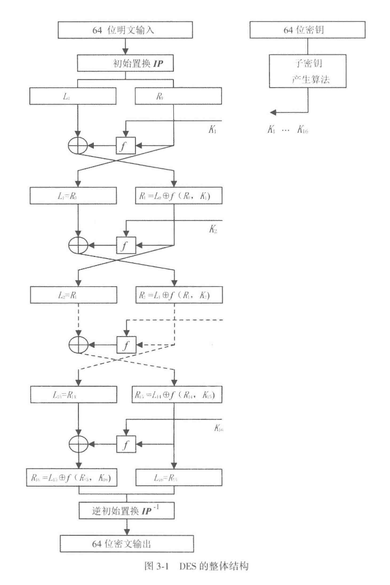
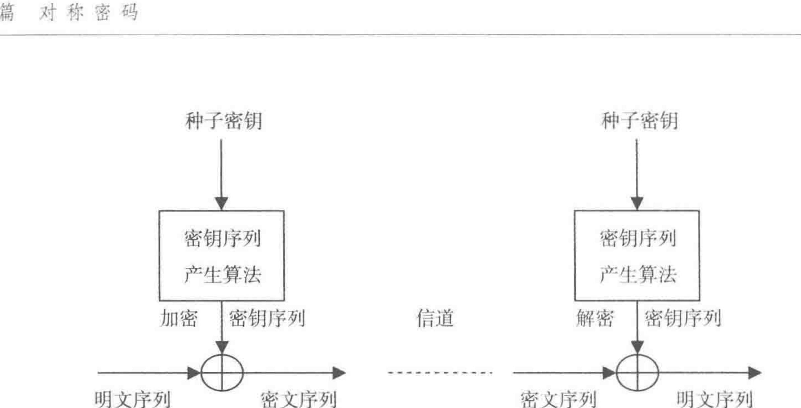
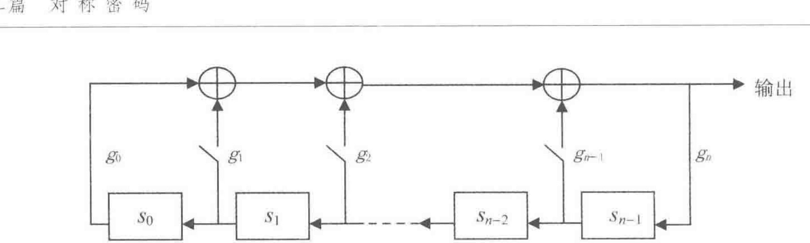
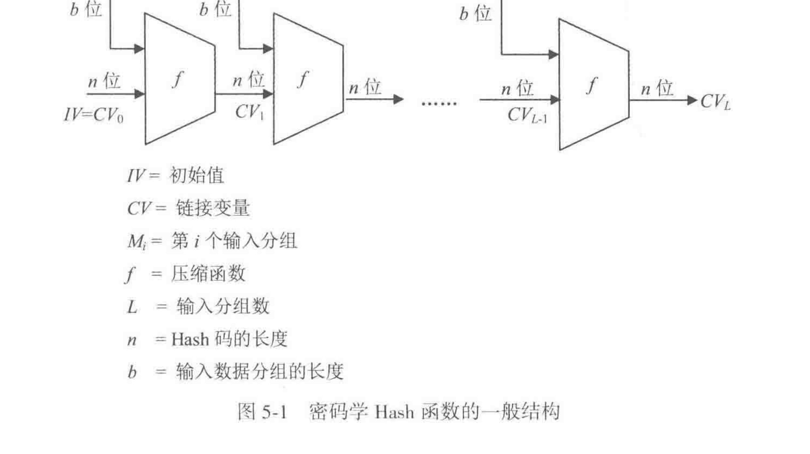
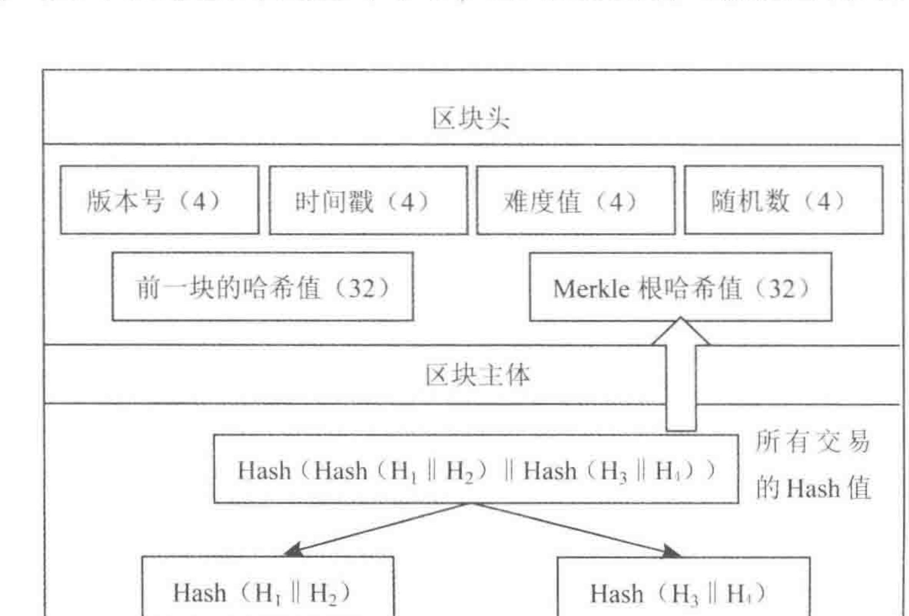
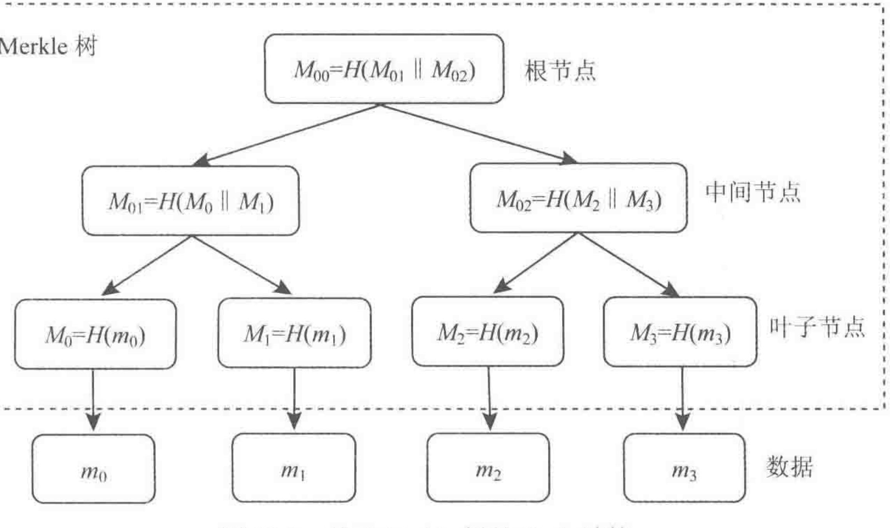

# 笔记

Note

本笔记按《密码学引论（第 4 版）》14 章顺序整理。教材先从信息安全背景和密码体制的基本概念起步，再依次进入对称密码、公开密钥密码、数字签名、抗量子计算密码、密码分析以及密钥管理、协议、认证、区块链、可信计算等主题。正文尽量保持教材原有的知识依赖关系，同时把初学者最容易卡住的前提、例子、攻击视角和章节承接补齐。

关于加密/解密的算法介绍比较繁琐，笔者将之放到了“算法介绍”中，其中“算法介绍-表”是对课本的转义，“算法介绍-里”是对算法本质的介绍，更容易理解

> 阅读时可以始终沿着 安全需求 -> 形式模型 -> 算法结构 -> 正确性 -> 安全性 -> 攻击与改进 这条线推进。每遇到一个方案，都先问清：谁知道什么，谁控制什么，攻击者能拿到什么，以及某个方案在多大代价下才算安全。


## 第1章 信息安全概论

> 这一章先建立整门课的观察视角。教材先把信息安全放进真实的信息系统里，再说明为什么密码技术会在这些问题中占据关键位置。


### 1.1 信息安全是信息时代永恒的需求

课本把这一节放在最前面，是要先把密码学所面对的时代背景讲清楚。人类社会经历机械化、电气化之后，进入信息化时代。电子信息产业成为世界第一大产业，信息像水、电、石油一样，成为与所有行业、所有人都相关的基础资源。离开计算机、网络、电视和手机等电子信息设备，人们已经很难正常工作和生活。

教材在这里进一步指出，信息化时代的人们实际上同时生活在物理世界、人类社会和信息空间共同构成的三元世界中。正因为信息空间已经成为真实生活的一部分，信息安全已经成为国家安全、社会稳定和经济发展的基础问题。

课本接着把现实威胁摆出来：敌对势力破坏、网络战、信息战、黑客攻击、病毒入侵、利用计算机犯罪、网络有害内容泛滥、隐私泄露等事件不断发生。对于我国来说，信息安全形势的严峻性还叠加了信息核心技术方面的差距。CPU 芯片、操作系统、数据库和 EDA 等关键基础软硬件长期大量依赖国外产品，使我国面临更复杂的信息安全压力。

这一节最后又把量子计算威胁提前点出。教材指出，量子计算机一旦继续扩大规模，现有许多公钥密码如 RSA、ElGamal、ECC 都会面临根本性挑战。这样安排的用意很明确：信息安全问题不会因为技术发展而消失，技术越发展，安全问题反而会以新的形式继续出现。因此，信息安全始终是信息时代的基本需求。


### 1.2 信息安全的一些基本原则

这一节在课本里是连续展开的五组判断原则。

**第一组是信息安全三大定律。** 课本把长期信息安全实践中总结出的共同规律概括为三条。

- 第一条是普遍性定律：哪里有信息，哪里就有信息安全问题。
- 第二条是折中性定律：安全与方便是一对矛盾，越安全的系统往往越难用，越方便的系统往往安全措施越少。
- 第三条是就低性定律，也就是木桶原理：信息系统的安全性取决于最薄弱部分的安全性。

**第二组是从信息系统安全的角度看待和处理信息安全问题。** 信息不能脱离系统而孤立存在，因此信息安全也必须放回信息系统中讨论。课本把信息系统安全分成设备安全、数据安全、行为安全和内容安全四个方面。

- 设备安全包括稳定性、可靠性和可用性，是系统安全的物质基础。
- 数据安全包括保密性、完整性和可用性。
- 行为安全强调行为过程和结果对数据保密性、完整性和可控性的影响。
- 内容安全则属于政治、法律、道德层次上的语义安全。

课本还特别提醒，这四个方面处在不同层次上，其中设备安全、数据安全和行为安全属于系统层次，内容安全属于语义层次。

**第三组是从硬件、软件和数据三个方面确保系统安全。** 任何信息系统都由硬件、软件和数据构成，因此安全工作也必须同时覆盖这三个对象。课本在这里还引入一个很重要的区分：数据只有传输、存储和处理三种状态。对于传输和存储状态，密码和纠错编码是最有效的措施；对于处理状态，现有密码和纠错编码的作用范围和成熟程度都明显更受限制。这一判断直接解释了为什么密码技术在传输和存储中作用突出，而处理态风险还需要更多其他技术共同处理。

**第四组是基础技术和关键技术的区分。** 硬件安全和操作系统安全是信息系统安全的基础，密码、网络安全等技术是关键技术。原因很直接：硬件处在最底层，操作系统是软件的最底层且负责资源管理，基础一旦失守，上层安全措施很难真正发挥作用。课本同时指出，密码技术虽然是信息安全领域的共性关键技术，但许多网络安全问题依然涉及协议安全、软件安全和硬件安全，不能只靠密码单独解决。

**第五组是系统工程观点。** 确保信息系统安全是一个系统工程，必须从软硬件低层做起，从整体上采用措施，进行综合治理。其一，要从底层做起，因为底层容易管住上层，而上层难以反过来管住底层。其二，要综合使用多种技术，同时结合管理、法律和教育手段。


### 1.3 密码技术是信息安全的关键技术

这一节讲了两件事。第一件事是说明密码为什么是关键技术。第二件事是把整部教材后面要讲的主要发展线索提前交代出来。

课本先从定义层面说明 **密码技术的基本思想**：

对数据进行编码，以确保数据的保密和保真，也就是确保数据的秘密性、真实性和完整性。

> 编码前的数据叫明文，编码后的数据叫密文，编码过程叫加密，恢复过程叫解密，加解密都在密钥控制下进行。

只要数据以密文形式在网络中传输或在计算机中存储，而且只把密钥分配给合法用户，那么未授权者即使窃取到密文，也无法理解其真实含义；同样，未授权者手中缺少密钥，伪造合理的明密文会变得十分困难，篡改也更容易被发现。数字签名和 Hash 函数等技术也承担着“保真”任务，这为后面的第 5 章、第 7 章和第 12 章做了铺垫。

在发展线索上，课本按历史顺序把若干里程碑串了起来。1946 年电子计算机进入密码破译，使密码进入电子时代；1949 年 Shannon 的《保密系统的通信理论》把密码置于坚实的数学基础之上；1976 年 Diffie 和 Hellman 提出公开密钥密码，解决了传统密码在密钥分配上的根本困难；1977 年 DES 作为公开算法标准出现，开创了公开算法标准化的重要路线；1994 年美国又颁布 EES 和 DSS；此后又有 AES、NESSIE、ECRYPT、SM2、SM3、SM4、ZUC、SHA-3 以及 NIST 对抗量子计算密码征集等一系列事件。

传统密码通信双方必须预先共享同一把密钥，在计算机网络中，用户数量一大，密钥产生、分配和更换都会变得极其困难，因此公开密钥密码才会在网络环境中显得尤其重要。教材顺着这条线一直往后推，又把量子计算对现有公钥密码的挑战提前点出来，并把量子密码、DNA 密码和基于数学的抗量子计算密码作为新的发展方向提出。这样安排以后，整本书后半段的公钥密码、数字签名和抗量子计算密码就都有了明确来历。


### 1.4 我国的密码法和商用密码标准

教材把密码法和商用密码标准放在导论里，是因为课本一开始就要把“密码技术的制度环境”讲出来。课本明确指出，《中华人民共和国密码法》和一系列商用密码标准共同阐明了我国的密码政策，构成我国密码工作的基本依据。


#### 1.4.1 中华人民共和国密码法

课本先给出我国密码工作的总原则：统一领导、分级负责，依法管理、保障安全。随后分别解释统一领导和分级负责的含义，并指出我国把密码划分为核心密码、普通密码和商用密码三类。核心密码和普通密码用于保护国家秘密信息，属于国家秘密，实行严格统一管理；商用密码用于保护不属于国家秘密的信息，公民、法人和其他组织可以依法使用商用密码保护网络与信息安全。

教材在这一小节里还专门把商用密码政策展开。国家鼓励商用密码技术研究开发、学术交流、成果转化和推广应用，建立和完善商用密码标准体系，推动参与国际标准化活动，推进商用密码检测认证体系建设。课本最后又强调依法管理：任何组织和个人都不得窃取他人加密保护的信息，不得非法侵入他人的密码保障系统，也不得利用密码从事危害国家安全和社会公共利益的违法犯罪活动。


#### 1.4.2 我国的商用密码标准

课本先解释什么是标准，以及标准化为什么是现代社会科技进步和社会文明的重要标志。放到密码领域，这一点更关键。统一标准一旦缺位，各单位各自设计密码，就会出现算法、协议和实现不统一、质量参差不齐、无法互联互通的问题，网络与信息安全也就难以真正保障。

教材接着回到我国的密码分类，说明对大多数读者而言，研究和应用最多的是商用密码。正因为商用密码是高科技成果，具有深入的数学基础和复杂细致的应用技术，所以更需要由国家组织专业力量设计、分析、测试并标准化发布。课本在这里列出了我国已经形成的商用密码标准体系中的代表算法，如 SM2、SM3、SM4、SM9 和 ZUC，并指出这些标准的建立极大促进了我国信息安全产业的发展。

这一小节最后又把国际化进展列了出来。ZUC 被 3GPP LTE 采纳为第 4 代移动通信国际标准，TPM 2.0 标准支持 SM2、SM3、SM4，随后 SM2、SM9、SM3、ZUC、SM4 也陆续被 ISO/IEC 接受为国际标准。教材把这些事件放在这里，是为了明确告诉读者：我国商用密码算法已经形成体系，并且进入了国际标准化舞台。


## 第2章 密码学的基本概念

> 第 2 章系统地把“密码学在研究什么”讲清楚。先有密码体制和攻击模型，后面才谈得上具体算法。先有古典密码与统计分析的历史经验，后面才会自然过渡到现代密码设计为什么强调混淆、扩散和安全模型。


### 2.1 密码学的基本概念

课本在这一节先把密码学的发展背景、当前处境和研究方式完整铺开。教材先按时间顺序回顾若干里程碑：1946 年电子计算机进入密码破译，1949 年 Shannon 的论文把密码学置于数学基础之上，1976 年公开密钥密码提出，1977 年 DES 成为标准，1994 年 EES 和 DSS 出现，随后有 AES、NESSIE、ECRYPT、中国商用密码算法、ZUC、SHA-3 和 NIST 对抗量子计算密码征集等一系列重要事件。课本用这一长串事件说明，密码学已经形成一条持续演进的技术与标准发展线。

传统密码在密钥分配上的困难限制了它在计算机网络中的应用，于是公开密钥密码应运而生，并与传统密码结合成为网络密码应用的主要形式。随后课本又把云计算、物联网、大数据、量子信息和生物信息技术带进来，说明密码学面对的外部环境还在继续变化。尤其是量子和生物计算的出现，使现有公钥密码面临新的挑战，因此教材才会把抗量子计算密码提到整章开头。

在研究方式上，密码学从过去主要在军事、政治、外交等保密机关中秘密研究，逐步转向公开研究和秘密研究并行发展的过程。正是这种局面，促成了今天密码学的公开分析、标准化评测和快速发展。

密码学基本学科划分：

- 研究密码编制的叫密码编制学
- 研究密码破译的叫密码分析学


#### 2.1.1 密码体制

一个密码体制（cryptosystem）至少要解释五个对象：

- 明文空间 $M$：全体明文的集合
- 密文空间 $C$：全体密文的集合
- 密钥空间 $K$：全体密钥的集合，其中每个密钥 $K$ 由加密密钥 $K_e$ 和解密密钥 $K_d$ 组成
- 加密算法 $E$ ：一族由 $M$ 到 $C$ 的加密变化（理解为一个函数）
- 解密算法 $D$：一族由 $C$ 到 $M$ 的解密变化（理解为另函数）

若把某个具体密钥记为 $K=(K_e,K_d)$，那么最基础的形式化关系是

$$
C=E_{K_e}(M),\qquad M=D_{K_d}(C).
$$

明文和密文的对象是什么，决定系统处理的是字符、比特串还是群元素；密钥如何进入算法，决定密钥管理会不会困难；$D$ 是否真的是 $E$ 的逆，决定正确性能否成立；攻击者能否从 $K_e$ 推出 $K_d$，则直接决定单密钥还是双密钥体制。


这张图最适合在这里建立第一层直觉。它把明文、加密算法、信道、解密算法和攻击者放到了同一条通信链上。密码学关心的是整条链上的信息如何流动、攻击者能够接触到哪一段、密钥如何通过安全信道分发。

若 $K_e$ 和 $K_d$ 相同，或者能由其中一个轻易推出另一个，就得到对称密码体制。若 $K_e$ 可以公开，同时在计算上难以暴露 $K_d$，就得到公开密钥密码体制。若按处理单位划分，分组密码一次处理一个固定长度的数据块，序列密码则逐位或逐字符产生密钥流并参与加密。

教材还在这里引入演化密码。对初学者而言，更适合先看它试图解决的问题：固定算法一旦部署，就会长期暴露在分析之下；如果算法结构能够在安全约束下变化，攻击者面对的对象就会从静止目标变成持续变化的目标。

Important

读任何密码体制时，都先把下面五个对象写清：
**明文空间、密文空间、密钥空间、加密算法、解密算法**。


#### 2.1.2 密码分析

课本把密码分析首先界定为“根据密文系统地确定出明文或密钥，或者根据明文-密文对系统地确定出密钥”的研究。随后教材把 攻击方法 分成三类：**穷举攻击、数学攻击和物理攻击**

穷举攻击是对任何密码都适用的最基本攻击。只要密钥空间有限，理论上总可以通过逐一尝试密钥来破译，因此能抵抗穷举攻击是近代密码的基本要求。课本这里还特别用 DES 被互联网协同穷举破译的事件作例子，并提醒读者：当攻击者不得不穷举时，往往会优先尝试最有可能的密钥，例如用户常选的短口令、姓名、生日、电话号码等。

数学攻击针对的是密码算法的数学基础和密码学特性。课本把统计攻击视为最早的一类数学攻击，并指出许多古典密码都可以通过分析字母和字母组的频率来破译。对于近代密码，教材继续列出差分攻击、线性攻击、代数攻击、相关攻击等方法。课本在这里想让读者看到：设计密码本质上是在设计一个数学函数，破译密码本质上是在求解一个数学难题。

物理攻击则把视角推进到实现层。教材指出，任何密码算法在硬件中工作时都必然与环境发生物理交互，从而泄露侧信道信息。能量消耗、时间消耗、声音、电磁辐射和故障都可能成为攻击入口。课本在这里特别强调，许多理论上安全的密码，恰恰因为物理实现方面的不足而被攻破，这说明密码系统的安全始终也是一个系统安全问题。

在 攻击模型 上，教材又按 **攻击者可利用的数据资源** 区分出仅知密文攻击、已知明文攻击、选择明文攻击和选择密文攻击。注意判断标准：一个近代密码至少应当经得起已知明文攻击；而当攻击者能够选择明文或选择密文时，安全结论就必须在更强的模型下重新判断。

教材最后把“绝对不可破译”和“计算上不可破译”分开。一次一密属于理论上绝对不可破译的密码；绝大多数实际密码追求的则是计算上不可破译。课本在这里还提醒，互联网把全球计算资源联合起来以后，原先看似足够安全的密码也会被重新审视，因此真正有意义的，是在现实资源乃至更强计算环境下仍能站住的安全性。


#### 2.1.3 密码学的理论基础

Shannon 的信息论奠定了密码学的重要理论基础。信息论之后，密码学在发展中又逐渐形成了自己的新理论，例如单向陷门函数理论、公钥密码理论、零知识证明理论，以及部分密码设计与分析理论。教材在这里的核心意思是：密码学以信息论为基础，同时在发展中已经形成超出传统信息论的一批专门理论。

从安全性角度看，课本反复出现的一个基本区分，就是理论安全与计算安全。一次一密是典型的理论安全密码，只要密钥真随机、与明文等长且一次一用，攻击者无论拥有多强算力也无法从密文中获得额外信息。除此之外，绝大多数现代密码只能追求计算安全，也就是在现实可利用资源下不可破译。

这一节的学习重点，是先把课本所用的理论层次感建立起来。信息论解释了保密与信息泄露的基本界限，单向陷门函数解释了为什么会出现公开密钥密码，零知识证明又解释了“证明知道某个秘密，同时继续保护该秘密本身”这种更强的认证思想。这样往后读时，后面的公钥密码、数字签名、认证协议和抗量子计算密码就都能找到自己的理论落点。


### 2.2 古典密码

古典密码很适合作为入门，因为它们把密码体制的基本对象都暴露得很清楚：明文空间是什么，密钥如何起作用，统计结构如何泄露，攻击者到底抓住了什么规律。


#### 2.2.1 置换密码

置换密码的思想是打乱明文符号的位置，同时保留各符号本身。它主要隐藏明文的排列结构。比如把 `attack` 重新排列成按某个轨道读出的形式，字符种类不变，变化落在位置次序上。

这类方案的优点是直观，实现简单；缺点也同样明显。由于字母本身保持不变，单字母频率、多字母组合和语言结构仍会在密文中留下痕迹。一旦置换规则过于机械，攻击者就能通过分组长度、重复片段和常见词模式逐步还原。

可以用一个很小的例子体会这一点。若明文是 `attack at dawn`，发送方按固定栏宽写成矩阵，再按列读出密文，那么空格位置、重复字母数量和常见双字母组合都还在。攻击者即使一开始不知道栏宽，也能从消息长度和片段重复关系反推几种可能，再逐个尝试恢复排列。这说明置换只打乱了位置，语言自身的统计骨架仍然保留下来。


#### 2.2.2 代替密码

代替密码让明文字母映射到别的字母或符号。

单表映射

Note

可以把它看成有限字母表上的单表映射

最典型的入门例子是 Caesar 加法密码。若把英文字母表编码为 $0,1,\dots,25$，取密钥 $k=3$，就可以写成

$$
c \equiv m+k \pmod{26}.
$$

例如明文 `HELLO` 对应数值 `7,4,11,11,14`，加 3 以后得到 `10,7,14,14,17`，也就是 `KHOOR`。这个例子很适合看清“加密规则”和“密钥”的区别。规则对应“模 26 加法”，密钥对应“具体加几”。规则公开通常不会直接破坏安全，保密对象落在密钥上。

**乘法密码**、**仿射密码** 和 **密钥词组** 代替密码，都是在这个思路上的变化。它们试图增大密钥空间，减弱简单平移带来的明显痕迹，但仍然无法摆脱自然语言统计特征会透过密文泄露这一根本问题。

Note

乘法密码：$f(a_i)=b_i=a_j$,其中 $j=ik \mod n$,且 $(k,n)$ 互质

仿射密码：$f(a_i)=b_i=a_j$，其中 $j=ik_1+k_0\mod n$ ,且 $(k_1, n)=1,0\le k_0 < n$

密钥词组：


Caesar 密码尤其适合拿来做第一个完整攻击例子。攻击者只要枚举 26 种位移，就能很快看到哪一种结果更像自然语言；即使不枚举，直接统计高频字母，也能判断密文里最常出现的字母很可能对应 `E` 或 `T`。这就是古典密码里最早的“结构泄露压倒密钥空间”的例子：密钥再短，暴露也很快；密钥稍长，统计规律照样会接着工作。

Example

下面这个例子适合第一次自己手推一遍：


```

字母编号:  A B C D E F G H I J K L M N O P Q R S T U V W X Y Z
          0 1 2 3 4 5 6 7 8 9 10 ...

明文:  H  E  L  L  O
       7  4 11 11 14

密钥:  k = 3

密文:  K  H  O  O  R
      10  7 14 14 17

```

多表代替密码

介绍了 [Vigenre密码(维吉尼亚密码)](https://www.metools.info/code/c71.html)：

它将凯撒密码的所有26种排列放到一个表中，形成26行26列的加密字母表。维吉尼亚密码必须有一个由字母组成的密钥，至少有一个字母，最长与明文字母有相同数量的字母。

要生成密码，需要使用表格方法，此表(如图所示)包含26行字母表，每一行从上一行到左行被一位偏移。加密时使用哪一行字母表是基于密钥的，在加密过程中密钥会不断变化。

> 加密时由明文字母所在列和密钥字母所在行共同决定密文字母


多名代替密码

为了解决明文字母的频率痕迹，设法将密文字母的频率分布拉平

设置一个对应表，用的少的字母可以有多个数字对应它，用的多的字母只有单个数字对应它


#### 2.2.3 代数密码

Vernam 密码是从古典密码过渡到现代序列密码的重要桥梁。若 **明文、密钥和密文都写成比特串，则加密和解密都通过按位异或完成**：

$$
c_i = m_i \oplus k_i,\qquad m_i = c_i \oplus k_i.
$$

它的教学价值极高，因为它第一次把“简单的加密运算”和“困难的密钥产生”明确拆开。异或本身复杂度极低，安全性几乎全部落在密钥序列上。这正是后面序列密码章节的核心思路。

如果密钥序列是真随机、长度不少于明文且每次只用一次，就得到一次一密。教材借这个极端例子说明：理论上最安全的方案，往往在密钥管理上最难落地。现代密码设计大量工作，都在试图用现实可管理的方式逼近一次一密的效果。


### 2.3 古典密码的统计分析

古典密码的失败，往往来自密文里保留了太多明文统计痕迹。教材在这里先讲语言统计特性，再讲具体破译过程，顺序很合理，因为攻击总要抓住可利用的规律。


#### 2.3.1 语言的统计特性

自然语言有明显的统计偏向。英文字母里 `E`、`T`、`A`、`O` 的出现频率明显高于其他字母，双字母和三字母组合也有稳定模式，例如 `TH`、`HE`、`THE`、`ING`。只要密文中保留了这些分布结构，攻击者就能把“高频密文字母”与“高频明文字母”逐步对齐。

这里更该把频率表当成例子，用来理解统计规律为何会成为攻击入口。密码若采用固定替换，明文里的高频字母会变成密文里的另一个高频字母。字母换了，分布形状仍会保留下来。


#### 2.3.2 古典密码分析

教材给出的简单代替密码破译过程，本质上就是把“频率信息”“语言常识”和“局部猜测”反复交叉验证。先统计单字母频率，猜测高频字母；再利用双字母、三字母组合验证；最后把已知映射不断扩展，直到整段密文恢复。

这一步对后面现代密码的影响非常深。现代密码设计强调混淆与扩散，目标之一就是让这种统计痕迹在密文里尽量消散。Shannon 的设计原则正是对古典密码破译经验的系统总结。


### 2.4 SuperBase 密码的破译

教材专门安排 SuperBase 这个案例，是为了把“算法太弱”和“系统保护看起来很多”之间的反差摆出来。SuperBase 同时用了密码保护和编辑保护，看起来像是双层防护，但只要密码本身结构太弱，攻击者完全可以绕开系统表象，直接做选择明文分析。

这个例子更值得记住的是其中的判断方法。攻击者观察明文和密文的对应关系，发现加密是局部的、与位置无关、某些字节不加密，于是逐步把规律抽象出来，最终还原出加解密算法。这里暴露出来的是结构泄露。

从学习路径看，SuperBase 案例的价值在于把“攻击者如何思考”具象化了。攻击未必总是从大规模数学定理开始，很多时候它先从输入输出行为开始：哪些字节会变，哪些字节不变，变化是否依赖位置，局部修改会不会只引起局部密文变化。只要这些现象稳定可测，攻击者就能直接逼近密码结构本身。

`insight：` “系统有加密功能”很难直接推出“系统具备足够安全性”。如果算法过弱、模式固定、实现可预测，那么安全功能本身就会变成攻击入口。这也是为什么现代密码学会把攻击模型和安全证明放在定义附近，并在应用前就交代清楚。


## 第3章 分组密码

> 古典密码让我们看到了统计痕迹为什么危险。第 3 章开始进入现代对称密码，通过多轮结构、非线性部件和扩散机制，把明文与密钥的影响在整个分组里打散。


### 3.1 数据加密标准（DES）


#### 3.1.1 DES 的加密过程

DES 是典型的分组密码。它一次处理 64 位明文，在 56 位有效密钥控制下进行 16 轮迭代。教材把 DES 放在分组密码的开头，是因为它几乎把现代分组密码的基本思想都展示出来了：分组、轮函数、子密钥、置换、代替、可逆结构和安全分析。

DES 使用的是 Feistel 结构。把 64 位输入分成左右两半 $L_i,R_i$ 后，每一轮执行

$$
L_{i+1}=R_i,\qquad R_{i+1}=L_i\oplus f(R_i,K_i).
$$

这里 $K_i$ 是第 $i$ 轮子密钥，$f$ 是轮函数。

> 1. 64位密钥经子密钥产生算法产生出16个子密钥：$K_1，K_2，…，K_{16}$，分别供第一次、第二次、…、第十六次加密迭代使用。
> 2. 64位明文首先经过初始置换 IP（Initial Permutation），将数据打乱重新排列并分成左右两半。左边32位构成 $L_0$，右边32位构成 $R_0$。
> 3. 由加密函数 f 实现子密钥 $K_1$ 对 $R_0$ 的加密，结果为32位的数据组 $f(R_0, K_1)$。$f(R_0, K_1)$ 再与 $L_0$ 模2相加，又得到一个32位的数据组 $L_0 \oplus f(R_0, K_1)$。以 $L_0 \oplus f(R_0, K_1)$ 作为第二次加密迭代的 $R_1$，以 $R_0$ 作为第二次加密迭代的 $L_1$。至此，第一次加密迭代结束。
> 4. 第二次加密迭代至第十六次加密迭代分别用子密钥 $K_2,\dots,K_{16}$ 进行，其过程与第一次加密迭代相同。
> 5. 第十六次加密迭代结束后，产生一个64位的数据组。以其左边32位作为 $R_{16}$，以其右边32位作为 $L_{16}$，两者合并再经过逆初始置换 $IP^{-1}$，将数据重新排列，便得到64位密文。至此加密过程全部结束。



这张图最适合配合上面的递推式一起看。它告诉我们，Feistel 结构的关键在于把一半数据送入轮函数，再用异或把结果回灌到另一半。正因为这种结构天生可逆，解密时只需把子密钥顺序倒过来，整个流程就能反向恢复。

`insight：` Feistel 结构的一个深刻之处在于，轮函数 $f$ 本身不必可逆，整个密码依然可逆。可逆性落在“交换 + 异或回灌”的轮结构整体上。这一点对后面理解 SM4 和许多现代分组结构都很关键。

Example

可以先把轮函数当成黑盒，不去管它里面有什么，只看两轮数据怎样流动：


```

初始输入: (L0, R0)

第1轮:
L1 = R0
R1 = L0 xor f(R0, K1)

第2轮:
L2 = R1
R2 = L1 xor f(R1, K2)
   = R0 xor f(R1, K2)

```

只看这两轮就能发现一个趋势：最初只落在半个分组里的影响，会在轮次推进中逐步扩散到整个分组。


#### 3.1.2 DES 的算法细节

DES 的轮函数包含扩展置换 $E$、与子密钥异或、8 个 S 盒代替和置换 $P$。其中承担主要安全压力的是 S 盒提供的非线性。若缺少 S 盒，整个结构几乎会退化为线性系统，攻击者就能把许多复杂步骤合并成可解的代数关系。

子密钥的产生


64位的密钥分为8个字节。每个字节的前7位是真正的密钥位，第8位是奇偶校验位，可以通过前7位计算出来。因此DES真正的密钥只有56位

图中置换选择1的作用就是去掉8个奇偶校验位，以及打乱其余56位密钥位

将 $C_i$ 和 $D_i$ 合成为一个56位的中间数据，置换选择2从中选择出一个48位的子密钥 $K_i$ ，如下，对于这个矩阵，子密钥 $K_i$ 中的第 $1,2,\cdots,48$ 位一次是这个 56 位中间数据中的第 $14,17,\cdots,5,3,\cdots,29,32$ 位


初始置换IP

初始置换的作用在于将64位明文打乱重排，并分成左右两半。左边32位作为 $L_0$,右边 32 位作为 $R_0$,供后面的加密迭代使用。

如下，对于这个置换矩阵，置换后64位数据的第 $1,2,\cdots,64$ 位依次是原明文数据的第 $58,50,\cdots,2,60,15,7$ 位


加密函数

它的作用是在第 $i$ 次加密迭代中用子密钥 $K_i$ 对 $R_{i-1}$ 进行加密


第 $i$ 次迭代加密中选择运算 $E$ 对 $32$ 位的 $R_{i-1}$ 的各位进行选择和排列，产生一个 48 位的结果。此结果与子密钥 $K_i$ 模2相加，然后送入代替函数组 $S$ 。代替函数组由8个代替函数组成，每个 $S$ 盒子有 6 位输入，产生 4 位输出。8个 $S$ 盒子的输出合并，结果得到一个 32 位的数据组。此数据组再次经过置换运算 $P$ ,将其各位打乱重拍。置换运算 $P$ 的输出便是加密函数的输出 $f(R_{i-1},K_i)$

**选择运算E**:

如下图，通过重复选择某些数据位来达到数据扩展的目的，从而将32位数组扩展到48位，以满足代替函数组 $S$ 对数据长度的要求


**代替函数族S**：

代替函数组由8个代替函数($S$ 盒子）组成，每个 $S$ 盒有一个代替矩阵。代替矩阵有4行16列，每行为0-15，但数字排列都不同。每个 $S$ 盒有6位输入，产生 4 位输出。由于 $S$ 盒运算结果是用输出数据代替了输入数据，所以称为代替函数

S盒的代替规则

S盒的代替规则是：S盒的6位输入 $b_1 b_2 b_3 b_4 b_5 b_6$ 中的第1位 $b_1$ 和第6位 $b_6$ 组成的二进制数 $b_1 b_6$ 代表选中的行号，其余4位数字 $b_2 b_3 b_4 b_5$ 所组成的二进制数代表选中的列号，而处在被选中的行号和列号交点处的数字便是 S 盒的输出（以二进制形式输出）。

以 $S_1$ 为例，设输入 $b_1 b_2 b_3 b_4 b_5 b_6 = 101011$，第1位和第6位数字组成的二进制数 $b_1 b_6 = 11 = (3)*{10}$，表示选中 $S_1$ 的行号为3的那一行，其余4位数字所组成的二进制数为 $b_2 b_3 b_4 b_5 = 0101 = (5)*{10}$，表示选中 $S_1$ 的列号为5的那一列。交点处的数字是9，则 $S_1$ 的输出为 $1001$

S盒满足的准则

1. 输出不属于输入的线性函数或仿射函数
2. 任意改变输入中的1位，输出至少有两位发生变化
3. 对于任何S盒和任何输入x，$S(x)$ 和 $S(\oplus 001100)$ 至少两位不同，这里 $x$ 是一个6位的二进制串
4. 对于任何 $S$ 盒和任何输入 $x$，以及 $y,z\in GF(2)，S(x)\ne S(x\oplus 11yz 00)$,这里 $x$ 是一个 6 位的二进制串
5. 保持输入中的1位不变，其余5位变化，输出中的0和1的个数接近相等

**逆初始置换 $IP^{-1}$**

逆初始置换 $IP^{-1}$ 是初始置换 $IP$ 的逆置换。它把第十六次加密迭代的结果打乱重排，形成64位密文。至此完成加密过程


#### 3.1.3 DES 的解密过程

因为 Feistel 结构可逆，DES 的解密和加密共享同一套主体结构，只需把子密钥使用顺序反过来。这个设计在工程上非常重要。它降低了硬件和软件实现成本，也说明“加密算法的正确性”和“实现是否经济”在现代密码设计里始终要同时考虑。
$$
\begin{cases}
R\_{i-1}=L\_i\
L\_{i-1}=R\_i\oplus f(L\_i,K\_i)\
i=16,15,14,\cdots,1
\end{cases}
$$
这一点还可以配合轮结构再看一遍。假设第 16 轮输出是 $(L_{16},R_{16})$，若此时拿到相同的轮函数并按相反顺序使用子密钥，那么上一轮输入会一层层被恢复出来。也就是说，DES 的解密从工程视角看更像“同一台机器按相反的密钥时序再跑一遍”。这种结构统一性，是早期硬件标准能够大规模落地的重要原因。


#### 3.1.4 DES 的安全性

教材对 DES 的评价是分层次的。对它当年的设计目标来说，DES 是成功的：结构精巧，S 盒设计强，长期未出现比穷举明显更实用的普适攻击。致命短板落在只有 56 位的密钥长度上，这在并行计算条件下逐渐变得不够。

此外，DES 还有 **弱密钥、半弱密钥和互补性质** 等弱点。这里更该学到安全分析的方法：即使主体结构正确，也要检查参数空间里是否存在异常点、特殊对称性或工程上容易被利用的捷径。


#### 3.1.5 3DES

3DES 的思路很直接：DES 的主体结构已经成熟，短板集中在密钥太短，于是就把 DES 多次串联，用多个密钥把穷举成本抬高。它说明了一种常见改进方式：旧算法的主体结构仍然可靠时，可以通过组合提升安全性。

3DES 也清楚地展示了数学可行与工程合适之间常有距离。三次 DES 带来了更高的运算成本，软件速度明显下降，因此它更像过渡方案，较少被视为长期终点。


#### 3.1.6 DES的历史回顾

DES 的历史价值不只在于它曾经被广泛使用，更在于它把公开算法、公开分析和标准化应用这条路线明确固定了下来。后来的 AES 评选、SHA-3 征集，都延续了“公开征集、公开评测、长期分析”的方法论。


### 3.2 高级数据加密标准（AES）⭐⭐⭐

由于内容过多，这里放到了AES文章中进行详细介绍


#### 3.2.2 RIJNDAEL 加密算法


#### 3.2.3 RIJNDAEL 解密算法


#### 3.2.4 算法的实现


#### 3.2.5 RIJNDAEL 的安全性

它在结构上吸收了现代密码设计经验，轮函数简单清晰，分析时间长，至今仍是主流标准之一。学习时更该知道它为什么被认为安全：当前未见能明显优于穷举的实用普适攻击，并且其部件设计、轮数和密钥长度都有较充分的分析支撑。


### 3.3 中国商用密码算法 SM4 ⭐⭐⭐

算法介绍板块


#### 3.3.1 SM4 算法描述


#### 3.3.2 SM4 的可逆性和对合性


#### 3.3.3 SM4 的安全性

SM4 的 S 盒和密钥扩展都经过了专门设计，公开后也接受了国内外分析。教材的态度很清楚：它在现阶段仍被广泛支持和使用，同时也持续面临新的分析。差分故障攻击之类的研究说明，实现层安全同样重要。


#### 3.3.4 示例

SM4 示例主要服务于实现调试。读者在学这一节时，更该抓住的是：一个标准算法除了概念定义和结构图，还需要可重复的测试向量来验证实现是否正确。


### 3.4 分组密码的应用技术

> 所以这里说的“分组密码的应用技术”，处理的是怎样把已经学过的分组密码放进真实系统里。真实消息往往是一段长文本、一个文件、一条数据库记录，长度通常超过一个分组，而且最后一段还经常凑不满一个完整分组。只会单块加密还不够，必须继续回答三个问题：相同明文块会不会暴露结构，很多个块怎样连起来加密，最后一个短块怎么处理。

前面学到的 DES、AES、SM4 都有一个共同边界：它们每次只能处理一个固定长度的数据块。设分组长度为 $n$ 位，加密算法记为 $E_K(\cdot)$，解密算法记为 $D_K(\cdot)$，密钥为 $K$。若明文消息被切成

$$
M=(m_1,m_2,\dots,m_t),
$$

其中前 $t-1$ 块都是 $n$ 位标准块，最后一块 $m_t$ 可能只有 $u$ 位，满足 $1\le u\le n$，那么真实系统会遇到三个问题。

第一，相同的明文块如果独立加密，会不会把数据模式直接暴露出来。第二，块与块之间要不要建立联系，建立怎样的联系才适合当前应用。第三，最后一个短块怎样进入分组密码，否则算法根本无法直接处理它。教材把这些问题集中放到“分组密码的应用技术”里讨论，意思就是：分组密码的安全性不只取决于底层算法，还取决于我们怎样组织这些算法。

这一节里会频繁出现几个记号：

- $m_i$：第 $i$ 个明文块。
- $c_i$：第 $i$ 个密文块。
- $Z$：初始化向量，也就是加密开始前给系统的一块初始数据。
- $\oplus$：按位异或。
- $\|$：比特串首尾拼接。
- $MSB_u(x)$：取比特串 $x$ 的高 $u$ 位。
- $LSB_s(x)$：取比特串 $x$ 的低 $s$ 位。

有了这些记号，再去看每一种工作模式，公式就会清楚很多。


#### 3.4.1 分组密码的工作模式

分组密码可以按不同模式工作，应用环境不同，工作模式也应不同。工作模式真正处理的是“怎样把一个只能处理单块的密码算法，组织成适合长消息、文件、数据库和通信流的系统”。这里有两个基础概念

- 一个是 **预处理**：若在加密前先用随机序列与明文做异或，就能把明文原有模式打散。
- 另一个是 **链接**。所谓链接，就是让当前块的加密结果不仅依赖当前输入和密钥，还依赖前面块的明文或密文。这样一来，即便两个明文块相同，只要前面环境不同，得到的密文也可能不同。（链接的代价则是错误传播：某一块出了错，后面的块可能被连带影响。）

`insight：` 工作模式处理的是同一个分组密码在长消息中的组织方式、反馈方式和错误传播方式

在接下来的叙述中，我们约定 $E_k(\cdot)$ 为加密函数，$D_k(\cdot)$ 为解密函数

**1. 电码本模式 ECB**

> 给数据分成指定大小的块，每一块独立加密、独立解密

这是分组密码最直接的工作方式。每一块明文独立进入分组密码：

$$
c_i=E_K(m_i),\qquad i=1,2,\dots,t.
$$

解密也同样独立：

$$
m_i=D_K(c_i),\qquad i=1,2,\dots,t.
$$

这里每个符号都很直白。第 $i$ 块明文 $m_i$ 只和密钥 $K$ 一起进入分组密码，得到第 $i$ 块密文 $c_i$。各块彼此独立。


```

ECB 加密
for i = 1..t:
    c_i = E_K(m_i)

```

ECB 的优点是结构最简单，实现也最直接。它的缺点也同样直接。若两块明文相同，也就是 $m_i=m_j$，那么在同一把密钥下必然有 $c_i=c_j$。于是明文里的重复模式会原封不动地投射到密文里。教材特意强调，计算机程序、数据库记录、通信协议往往都带有固定格式和大量重复字段，所以 ECB 很容易暴露数据模式。

教材还指出，ECB 还要求数据长度是分组长度的整数倍。最后一块若是短块，ECB 自身无法处理，必须靠后面的短块技术补上。

**2. 明密文链接模式**

明密文链接模式：当前块的加密同时依赖前一块明文和前一块密文。把初始化向量记成 $Z$，则可以写成

$$
c_1=E_K(m_1\oplus Z),
$$

$$
c_i=E_K(m_i\oplus m_{i-1}\oplus c_{i-1}),\qquad i=2,3,\dots,t.
$$

解密时对应为

$$
m_1=D_K(c_1)\oplus Z,
$$

$$
m_i=D_K(c_i)\oplus m_{i-1}\oplus c_{i-1},\qquad i=2,3,\dots,t.
$$

这组公式里，最重要的是第 $i$ 块在进入加密之前先和前一块明文 $m_{i-1}$、前一块密文 $c_{i-1}$ 一起异或。于是即便 $m_i$ 自身重复，只要前面链条不同，进入分组密码的输入也会不同，数据模式就被掩盖了。

教材同时强调，这种模式的错误传播是无界的。加密时只要某一块明文或某一块密文出错，后面所有块都会受影响；解密时也有同样问题。它在认证和完整性检验方面有价值，但不适合磁盘文件一类希望局部出错、局部受影响的场景。

**3. 密文链接模式 CBC**

为了让解密时的错误传播控制在更小范围内，接着从明密文链接模式里拿掉“前一块明文”，只保留“前一块密文”参与链接，这就得到密文链接模式 CBC。令 $c_0=Z$，则加密公式是

$$
c_i=E_K(m_i\oplus c_{i-1}),\qquad i=1,2,\dots,t.
$$

解密公式是

$$
m_i=D_K(c_i)\oplus c_{i-1},\qquad i=1,2,\dots,t.
$$

加密前，先把当前明文块和前一块密文异或；解密后，再把结果与前一块密文异或回来。于是前一块密文起到“把链条接起来”的作用。


```

CBC 加密
c_0 = Z
for i = 1..t:
    x_i = m_i XOR c_{i-1}
    c_i = E_K(x_i)

```


```

CBC 解密
c_0 = Z
for i = 1..t:
    x_i = D_K(c_i)
    m_i = x_i XOR c_{i-1}

```

CBC 的直接好处是：**相同明文块由于前一块密文不同，通常会得到不同密文，从而掩盖模式**。

> 初始化向量 $Z$ 应当随机化，并且每次加密都换新的 $Z$，这样相同报文也会得到不同密文。

错误传播方面，CBC 的加密仍是无界传播，因为前一块密文参与了后一块加密。解密则是有界传播：若 $c_i$ 某一位出错，那么 $m_i$ 整块都会被破坏，而 $m_{i+1}$ 中与这一位对应的位置也会出错，之后的块恢复正常。这就是教材所说“解密错误传播有界”。

**4. 输出反馈模式 OFB**

接下来把视角从“链接明文或密文”转到“用分组密码产生密钥流”。


设 $R$ 是一个 $n$ 位移位寄存器，初始状态为 $R_0=Z$，$s$ 是每次输出的位数，满足 $1\le s\le n$。第 $i$ 轮先计算
$$
o\_i=E\_K(R\_{i-1}),
$$

再取 $o_i$ 的最低 $s$ 位作为密钥流

$$
z_i=LSB_s(o_i),
$$

并用它去加密当前 $s$ 位明文段 $m_i$：

$$
c_i=m_i\oplus z_i.
$$

随后把寄存器左移 $s$ 位，并把 $z_i$ 反馈回寄存器右端，得到新的状态 $R_i$,即
$$
R\_i=(R\_{i-1}左移s位)|z\_i
$$
解密时，寄存器和分组密码按完全相同方式运行，重新产生同样的密钥流，再与密文异或就能恢复明文。


```

OFB 一轮
o_i = E_K(R_{i-1})
z_i = LSB_s(o_i)
c_i = m_i XOR z_i
R_i = (R_{i-1} 左移 s 位) || z_i

```

OFB 本质上是把分组密码变成一个密钥序列产生器，也就是把分组密码当作序列密码来用。它的优点是无错误传播。某一位明文错了，只影响对应密文位；某一位密文错了，也只影响对应明文位。正因为如此，OFB 适合语音、图像这类冗余度较大的数据。它的短板同样来自“无错误传播”：密文若被篡改，系统不容易仅凭模式变化发现问题。

**5. 密文反馈模式 CFB**

CFB 和 OFB 的差别只落在“反馈回寄存器的到底是什么”。OFB 反馈的是 $E_K(R_{i-1})$ 的输出片段，CFB 反馈的是刚刚生成的密文片段。前半步仍然一样：

$$
o_i=E_K(R_{i-1}),\qquad z_i=LSB_s(o_i),
$$

然后用

$$
c_i=m_i\oplus z_i
$$

得到当前密文段，但寄存器更新改成

$$
R_i=(R_{i-1}\text{ 左移 }s\text{ 位})\|c_i.
$$

解密时仍然先算 $E_K(R_{i-1})$ 得到密钥流，再与当前密文段异或恢复明文，同时把当前密文段反馈回寄存器。


```

CFB 一轮
o_i = E_K(R_{i-1})
z_i = LSB_s(o_i)
c_i = m_i XOR z_i
R_i = (R_{i-1} 左移 s 位) || c_i

```

CFB 和 OFB 在错误传播上的表现完全不同。若加密时某一位明文出错，这个错误会先影响当前密文，再通过反馈影响后续密钥流，导致后面的密文继续出错；解密时某一位密文出错，也会先影响当前明文，再通过反馈继续影响后续明文。

CFB 的加解密都为错误传播无界。正因为错误会沿链条扩散，CFB 更适合放在数据完整性认证这类需要“改一处就牵动后续”的场景。

**6. XCBC 模式**

CBC 有一个明显限制：它要求最后一个数据块必须是标准块。XCBC 正是围绕这个限制提出的扩展。XCBC 使用三个密钥 $K_1,K_2,K_3$，前面的标准块按链接方式处理，最后一个块则单独处理：若最后一块本来就是标准块，就走一种终结方式；若最后一块是短块，就先通过 $Pad(X)$ 填充成标准块，再用另一种终结方式处理。

它想让“最后一块既可以是标准块，也可以是短块”，从而支持任意长度的数据。它的主要优点有两个：一是可以处理任意长数据，二是适合用来计算消息认证码 $MAC$。它的主要缺点也有两个：一是短块填充仍然需要让收发双方知道填充长度，二是要同时管理三个密钥，控制起来更复杂。

若明文总长度与分组长度不整除，那么填充位数为
$$
\text{pad\_len}=n-(|M|\bmod n).
$$

其中 $|M|$ 表示明文总长度。这个式子非常朴素：总差多少位到下一个整块，就补多少位。

**7. CTR 模式**

它和 OFB、CFB 一样，也把分组密码变成序列密码来用，不过它改为依赖一个事先给定的计数序列 $T_1,T_2,\dots,T_t$。对标准块，加密公式是
$$
c\_i=m\_i\oplus E\_K(T\_i).
$$

若最后一块是 $u$ 位短块，则只取 $E_K(T_t)$ 的高 $u$ 位参与异或：

$$
c_t=m_t\oplus MSB_u(E_K(T_t)).
$$

解密公式完全一样，因为异或是对合运算：

$$
m_i=c_i\oplus E_K(T_i).
$$


```

CTR 加密/解密
for i = 1..t:
    keystream_i = E_K(T_i)
    若 m_i 是标准块:
        c_i = m_i XOR keystream_i
    若 m_i 是 u 位短块:
        c_i = m_i XOR MSB_u(keystream_i)

```

这里最关键的条件，是同一把密钥 $K$ 下绝不能复用同一计数序列。教材专门强调，计数序列必须时变。原因很简单：若两段消息在同一密钥下用了同一个 $T_i$ 序列，那么它们实际上就用了同一条密钥流，保密性会立刻下降。

CTR 的优点：

- 可并行
- 效率高
- 密钥流可预处理
- 适合任意长度数据。适合随机存取数据的加解密随机文件和数据库加密尤其喜欢这一点，因为它们要求“想取哪一块就能直接处理哪一块”。
- 无错误传播；相应地，它也不适合单独承担数据完整性认证任务。

把这一节所有模式放在一起：

| 模式 | 当前块依赖什么 | 错误传播 | 教材强调的适用点 |
| --- | --- | --- | --- |
| $ECB$ | 只依赖当前明文块和密钥 | 无链式传播 | 结构最简单，适于对密钥加密 |
| 明密文链接 | 当前明文、前一明文、前一密文 | 加解密都无界 | 真实性、完整性分析 |
| $CBC$ | 当前明文、前一密文 | 加密无界，解密有界 | 字符文件加密 |
| $OFB$ | 寄存器状态和分组密码输出反馈 | 无错误传播 | 语音、图像等冗余数据 |
| $CFB$ | 寄存器状态和密文反馈 | 加解密都无界 | 数据完整性认证 |
| $XCBC$ | 前面链接处理 + 最后一块特殊处理 | 依赖底层链接方式 | 任意长数据、$MAC$ |
| $CTR$ | 计数器序列 | 无错误传播 | 并行处理、随机存取、数据库 |


#### 3.4.2 分组密码的短块加密

分组密码一次只能处理一个固定长度的标准块。长度小于分组长度的数据块，就称为短块。若明文长度大于分组长度但与分组长度不整除，短块总出现在最后一块；若明文本身就短于一个分组，那么整个明文本身就是短块。网络通信、文件加密、数据库加密都会遇到它，所以短块处理属于实际系统里的常见问题。

**1. 填充法**

最直接的办法，是先往短块里补数据，把它补成一个标准块，然后再用普通分组密码加密。若最后一块长度是 $u$ 位，则需要补上 $n-u$ 位。教材给出的长度计算仍然用

$$
\text{pad\_len}=n-(|M|\bmod n).
$$

收方解密以后，还得知道哪些位是后来补上的。课本给出两种做法：一种是在密文中附加填充指示信息，常见做法是用最后几位或最后一个字节记录补了多少位；另一种是收发双方事先知道原始明文总长度，由此反推出填充长度。

填充法的优点是概念最简单。它的缺点也很容易理解：一旦补位，数据长度就扩张了。这种扩张对通信加密通常问题不大，但对文件加密和数据库加密就可能带来麻烦，因为文件长度、记录长度、字段长度一旦被改写，存储结构就可能被破坏。

> 举一个最小例子。若分组长度是 16 字节，最后一块只有 5 字节，那么还差 11 字节。填充法就是先补满这 11 字节，再把整个 16 字节块送进分组密码。收方解密后，依据填充指示或原始长度，再把这 11 字节去掉。

**2. 序列密码加密法**

教材接着提出第二种办法：对前面的标准块仍然用分组密码处理，只对最后短块改用“分组密码产生密钥流，再与短块异或”的方式。设前一标准块对应的数据为 $x$，最后短块为 $m_t$，长度为 $u$ 位，则可以取

$$
z_t=MSB_u(E_K(x)),
$$

再计算

$$
c_t=m_t\oplus z_t.
$$

这里的 $x$ 在不同场景里含义略有不同。若前面已经有标准块，$x$ 可以取最后一个相关标准块的密文；若整条消息本身就是短块，教材指出可以用初始化向量 $Z$ 代替 $x$。这条公式表达的是：先让分组密码输出一整块数据，再从中截出够长的 $u$ 位，拿去保护短块。

这项技术的优点，是不会带来数据扩张。短块有多长，密文就有多长。缺点是安全性相对弱一些。若短块很短，攻击者可能更容易通过穷举去猜测它。


**3. 密文挪用技术**

它的核心想法，是从前一块密文里“借”出恰好够填充的若干位，先把短块补成标准块，再重新组织最后两块密文。这样做的结果是：最后两块密文的总长度，恰好等于最后两块明文的总长度，因此不会产生数据扩张。

设倒数第二块是标准块 $m_{t-1}$，最后一块是 $u$ 位短块 $m_t$。

1. 先按原来的链接模式计算出与 $m_{t-1}$ 对应的一块密文。
2. 从这块密文里挪出刚好 $n-u$ 位，填到 $m_t$ 后面，把 $m_t$ 补成一个标准块。
3. 对补成标准块后的最后一块再做一次分组加密，得到新的完整密文块。
4. 前一块则因为“借出”了若干位，长度缩成 $u$ 位短块。

于是，最后得到的是“一块短密文 + 一块标准密文”，但两者总长度和原来的“一块标准明文 + 一块短明文”完全相同。解密时要反过来先解开最后一块，恢复出被挪用的数据，再把这些位放回去，最后继续还原前一块。


```

密文挪用的核心动作
1. 倒数第二块先正常加密
2. 从这块密文中挪出 n-u 位
3. 把这 n-u 位补到最后短块后面
4. 再加密补齐后的最后一块
5. 重新组织最后两块密文，总长度保持不变

```

密文挪用和填充法一样，也需要让接收方知道挪用了多少位，否则无法正确还原。这个位数仍然可以用前面的填充长度公式算出来。

它的优点是不引起数据扩张，安全性也高于序列密码加密短块的方法；它的缺点是控制过程更复杂，解密时要先解最后一块、还原挪用数据，再继续解前一块。

- 填充法概念最简单，适于通信加密；
- 序列密码加密短块不扩张数据，但安全性偏弱；
- 密文挪用不扩张数据，而且安全性更高，所以在实际系统中更常用


## 第4章 序列密码

> 如果说分组密码试图把一个数据块彻底搅乱，序列密码则更像在逼近“一次一密”的工作方式：先生成高质量密钥流，再逐位与明文组合。这里从随机序列讲起，是因为序列密码的核心始终落在密钥流质量上。


### 4.1 序列密码的概念

序列密码通常使用一个较短的种子密钥，驱动密钥序列产生算法，得到一个足够长的伪随机密钥流，再按位与明文异或：

$$
c_i=m_i\oplus z_i.
$$

这里更重要的是 $z_i$ 如何产生。若密钥流可预测、周期太短或统计特性不好，那么异或再简单也无法阻止攻击。教材之所以先讲“为什么想模仿一次一密”，正是为了让读者明白：序列密码追求的是把一次一密的随机性和不可预测性搬到可实现的环境中。



这张图把序列密码的工作方式压缩得非常清楚。两端只要持有同样的种子密钥和同样的状态更新规则，就能产生一致的密钥流。也正因为如此，同步是序列密码能否正确工作的前提之一。


### 4.2 随机序列的安全性

教材把随机序列的要求概括为长周期、非线性、统计预期性、可伸缩性和不可预测性。这些要求分别回答不同问题。长周期防止密钥流过早重复，非线性防止被线性方程恢复，统计预期性用来压低明显偏差，可伸缩性保证局部抽取后仍像随机，不可预测性则直接面向攻击者。

这里还要分清真随机与伪随机。真随机适合生成密钥、口令、时变量和种子，但不能直接拿来做通信双方同步的长密钥流，因为它本来就不可重复。序列密码所需要的，是在攻击者看来不可预测、在合法双方看来可重复生成的伪随机序列。

这组区别也解释了为什么序列密码总是包含“种子”或“初始状态”这类对象。发送方和接收方共享的是足以生成长密钥流的短状态。于是安全性的焦点也就转移了：攻击者能否从已经观察到的输出，预测后续输出，或者反推出内部状态。只要这个问题答不稳，序列密码就算看起来随机，安全性也会很快坍塌。

Note

序列密码真正想逼近的是 一次一密的使用效果，同时保持可重复生成、可同步部署和可工程实现。
因此读这一章时，注意力要始终放在 **密钥流能否预测、会不会重复、状态能否回推** 这三个问题上。


### 4.3 线性移位寄存器序列

线性移位寄存器（LFSR）是序列密码历史上最经典的密钥流发生器模型。它由若干寄存器单元和线性反馈关系组成，下一时刻状态由当前状态线性组合得到。若连接多项式是本原多项式，就能产生周期达到最大值的 m 序列。



这张图值得在读定义时一起看。所谓“反馈”，就是把若干抽头位置的值经过异或送回输入端。连接多项式决定哪些抽头参与反馈，也因此决定整个序列的周期和性质。

LFSR 的优点是结构极其规整，周期和统计性质可以用成熟数学工具分析；缺点也同样直接，因为它是线性的，所以一旦攻击者拿到足够长的明密文对，就能把问题写成线性方程组，从而恢复寄存器结构和状态。教材在这里安排矩阵推导，就是为了让读者看到“线性好分析”同时也意味着“线性好攻击”。


### 4.4 非线性序列

既然线性是 LFSR 的根本弱点，改进方向自然就是非线性化。教材列出了三条常见路线：使用非线性移位寄存器、对一个或多个 LFSR 输出做非线性组合、以及借助强分组密码生成密钥流。

这三条路线背后的思想是一致的：保留“长周期、易实现”的优点，同时用非线性打断攻击者建立线性方程组的能力。现代序列密码设计基本都离不开这一思路。

这里可以把“非线性”理解成对攻击者建立简单方程模型的一次阻断。若多个寄存器输出先经过非线性组合函数，再进入最终密钥流，攻击者即使知道大量明密文，也很难直接列出可求解的线性方程组。教材后面讲 ZUC 时，实际上就是把这种思路工业化：哪些部件负责周期，哪些部件负责非线性，哪些参数负责把不同会话隔离开，都分工得很清楚。


### 4.5 祖冲之密码


#### 4.5.1 祖冲之密码的算法结构

ZUC 是我国商用序列密码，也是 4G 移动通信国际标准之一。教材把它放在序列密码章的后半，是因为前面关于随机序列、LFSR 和非线性组合的理论，都会在它身上重新出现。ZUC 的逻辑结构分成三层：上层 16 级 LFSR 提供长周期驱动序列，中层比特重组从状态中抽取若干字，下层非线性函数 $F$ 完成核心非线性混合。

这种设计非常有代表性。LFSR 负责“把状态空间做大并维持长周期”，非线性函数负责“让输出难以反推内部状态”。把这两层职责分开，既便于分析，也便于实现。


#### 4.5.2 基于祖冲之密码的机密性算法 128-EEA3

在移动通信里，ZUC 本身常作为密钥流发生器使用。128-EEA3 先根据计数器、承载标识、方向位等参数构造初始向量，再让 ZUC 产生足够长的密钥流，最后把密钥流与输入比特流逐位异或完成加解密。

这一节最该留意的是“上下文参数进入初始向量”的做法。因为移动通信有明确的链路方向、会话计数器和承载通道，这些量都会影响安全。把它们写入 IV，等价于把“同一把长期密钥在不同会话、不同方向下的使用”隔离开。


#### 4.5.3 基于祖冲之密码的完整性算法 128-EIA3

完整性算法会让消息比特控制若干密钥字的组合和累加，最后输出消息认证码（MAC）。它处理的是篡改和冒充问题。

这里要特别分清机密性和完整性。EEA3 用于加密，EIA3 用于生成认证码。两者都依赖 ZUC，但安全目标完全不同。不能因为都用到同一个底层算法，就把它们看成同一件事。


#### 4.5.4 示例

教材在这里给出的是工程实现用的标准示例数据，覆盖祖冲之密码算法本身、基于祖冲之密码的机密性算法 128-EEA3，以及基于祖冲之密码的完整性算法 128-EIA3。它的直接作用，是帮助实现者检查初始输入、密钥流输出和认证结果是否与标准一致。

这一小节更适合从“调试基准”的角度去读。前面几小节已经把结构、输入参数和算法目标讲清楚了，到这里则要把它们压成可重复核对的样本。只要实现结果和示例不一致，问题通常就落在初始化、字节序、寄存器更新、消息拼接或认证计算这些具体环节上。


## 第5章 密码学 Hash 函数

> 前面几章主要解决机密性问题，第 5 章开始把视线转向完整性、认证和摘要。Hash 函数不负责解密，它负责把任意长输入压缩成固定长度摘要，并让这种压缩尽可能难以被反向伪造。


### 5.1 密码学 Hash 函数的概念

密码学 Hash 函数把任意长消息 $M$ 映射成定长摘要 $h$：

$$
h = H(M).
$$

教材把 Hash 码也称为数据指纹和数据摘要，这个说法很形象。初学时还要补一层理解：Hash 的输出空间有限，碰撞在数学上必然存在。密码学关心的是，攻击者难以在现实代价内构造出对他有用的碰撞。

Important

这一点必须先立住：
**Hash 的输出长度固定，输入空间通常远大于输出空间，因此碰撞一定存在。**
密码学要求的是，攻击者很难把这种“数学上一定存在”转成“工程上可利用”。

Hash 函数最先要解决的是完整性检测：只要消息哪怕改动一位，摘要就会显著变化。后面数字签名、消息认证码、口令存储、区块链 Merkle 树，都会把这个性质拿去做更复杂的构件。


### 5.2 密码学 Hash 函数的安全性

教材强调四个性质：单向性、抗弱碰撞性、抗强碰撞性和随机性。单向性要求给定摘要难以反推出原像；抗弱碰撞要求给定一个消息后，难以再找出不同消息拥有同样摘要；抗强碰撞则要求攻击者难以自由构造任意一对碰撞消息。

这里要拆开一个常见混淆。抗弱碰撞和抗强碰撞面向的攻击能力不同。前者给攻击者固定一个目标消息，后者允许攻击者同时挑选两边，因此后者更强，也通常更难满足。

生日攻击是理解碰撞难度的关键例子。若摘要长度是 $n$ 位，平均只需大约 $2^{n/2}$ 次尝试就可能出现碰撞，因此摘要长度不能太短。这也是为什么现代 Hash 标准普遍使用 256 位及以上输出。

可以用常见参数做一个直观比较。若摘要只有 64 位，那么生日攻击的工作量大约在 $2^{32}$ 量级，今天已经远远不够；若摘要是 128 位，碰撞搜索代价提升到 $2^{64}$，仍然只适合某些受限场景；到了 256 位，生日攻击的代价大约是 $2^{128}$，才进入现代密码学可接受的安全区间。这个例子能帮助读者把“摘要长度”直接和“碰撞代价”连起来。


### 5.3 密码学 Hash 函数的一般结构


#### 5.3.1 密码学 Hash函数的一般结构

教材先讲 Merkle 型迭代压缩结构，是因为多数经典 Hash 函数都建立在“压缩函数 + 迭代”的框架上。消息先被分块，每块与前一轮链接变量一起送入压缩函数，逐轮压缩，最后得到定长摘要。



图里最重要的对象是链接变量 $CV_i$。它表示“前面所有数据块压缩到当前时刻后留下的中间状态”。因此，Hash 会在逐轮迭代中不断累计先前信息。

`insight：` 初学者常会以为 Hash 是“把整段消息一次性塞进某个大黑箱”。图 5-1 告诉我们，经典 Hash 更像一台迭代压缩机。消息分块顺序、填充方式、初始值和压缩函数都直接影响最终安全性。


```

M1, M2, M3  --消息分块

IV --f--> CV1
CV1 + M1 --f--> CV2
CV2 + M2 --f--> CV3
CV3 + M3 --f--> H(M)

```

把这条链条自己顺一遍以后，“为什么长度扩展类攻击会和迭代结构有关”这类问题会更容易理解。


#### 5.3.2 密码学Hash 函数的类型

教材把常见 Hash 函数分成压缩函数迭代型、基于对称密码型和基于数学困难问题型。这个分类的价值在于帮助读者看见不同设计路线的权衡。第一类往往更高效，第二类借成熟分组密码构造，第三类更强调从困难问题出发获得安全保证，但效率通常较低。


### 5.4 中国商用密码杂凑算法 SM3


#### 5.4.1 SM3 密码杂凑算法

SM3 属于基本压缩函数迭代型 Hash。它的教学重点有三个。第一，消息要先填充到 512 位分组边界，这决定了最后一块如何处理。第二，消息扩展会把原分组进一步展开，打散原始比特之间的简单关系。第三，压缩函数通过布尔函数、循环移位和模加不断迭代，最终输出 256 位摘要。

教材特别强调消息扩展，这是 SM3 相较于一些旧结构的一个有代表性的安全措施。它的作用在于削弱原始消息位之间的直接对应关系，从而提高分析难度。


#### 5.4.2 SM3 示例

示例的作用主要是实现验证。学习时更该抓住的是：Hash 算法看起来只有“压缩”，可落地的标准仍要明确给出填充规则、字节序、常量、布尔函数、扩展步骤和标准测试向量，否则不同实现之间就无法互通。

这一点在工程里非常重要。若两个实现对填充位顺序、消息长度编码或字节序的理解略有差异，输出摘要就会完全不同，而这种差异往往很难靠表面观察发现。标准测试向量的作用，正是把实现是否严格遵守规范这件事压成一组可重复比较的输入输出样本。


### 5.5 美国密码 Hash 函数算法 SHA-3


#### 5.5.1 海绵结构

课本把 SHA-3 的最大创新概括为“采用海绵结构”。海绵结构又称海绵函数，它先把输入数据分成固定长度的数据分组，再让每个分组依次进入迭代处理，同时把上一轮迭代的输出反馈到下一轮，最后产生 Hash 码。教材先讲这一结构，是因为 SHA-3 后面的填充方式、参数设置和 `Keccak-f` 置换，都建立在这个框架之上。

海绵函数允许输入长度和输出长度都可变，因此它既可以用来构造固定输出长度的密码学 Hash 函数，也可以用来构造伪随机数发生器等其他密码函数。课本接着给出数据处理过程。第一步是填充。设输入数据长度为 $n$ 位，填充后被分成 $k$ 个长度为 $r$ 位的数据块。教材特别强调，任何消息都要填充，即使原消息长度已经是 $r$ 的整数倍，也要再补一个完整分组。课本给出两种填充方式：`pad10*` 和 `pad10*1`，其中 SHA-3 采用的是多重位速率填充 `pad10*1`。

第二步是迭代处理。教材把状态变量记为 $S$，其长度为 $b=r+c$ 位，初值全为 0。这里的 $r$ 称为位速率，表示每轮进入处理的数据位数；$c$ 称为容量，反映海绵结构的复杂度和安全度。课本明确指出，$r$ 越大，处理速度越快；$c$ 越大，安全度越高。于是海绵结构把效率和安全的折中直接写进了参数里。SHA-3 的默认参数是 $r=576$ 位、$c=1024$ 位，因此 $b=1600$ 位。

海绵结构的迭代处理分成吸水阶段和挤水阶段。吸水阶段中，每个 $r$ 位数据块都先补上 $c$ 个 0 扩展成 $b$ 位，再与当前状态变量 $S$ 异或，送入迭代函数 $f$。全部 $k$ 个数据块处理完成后，若所需 Hash 码长度 $l\le b$，就直接取状态变量前 $l$ 位输出；若 $l>b$，则进入挤水阶段。挤水阶段中，每轮保留状态变量前 $r$ 位作为输出分组，再对整个状态执行一次 $f$，直到凑够所需长度 $l$。

教材在这一节最后特别指出，海绵结构的一大特点，是吸水和挤水阶段的迭代处理都保持等长数据变换，压缩动作体现在最终截取 Hash 码和舍弃剩余数据上。这一点与 Merkle 迭代压缩结构不同，也正是海绵结构被视为 SHA-3 新路线的原因。

Tip

`r` 决定速率，`c` 决定容量。
前者更靠近性能，后者更靠近安全裕度。只要先把这两个量的角色分开，海绵结构就不会显得抽象。


#### 5.5.2 SHA-3

这一小节在课本里的展开顺序很清楚。教材先回顾美国 SHA 系列的发展：1993 年公布 SHA-0，1995 年公布 SHA-1，2002 年公布 SHA-2，随后由于 SHA-1 暴露出安全缺陷，NIST 在 2007 年公开征集新一代 Hash 标准，并最终在 2015 年将 Keccak 正式定为 SHA-3。教材在这里还列出征集时提出的几项要求：能够直接替代 SHA-2、保持在线处理能力、具备较强安全性、在软硬件上实现高效，并且在参数上具有灵活性。

进入算法本身以后，课本先给出 SHA-3 的主要参数。SHA-3 支持 224、256、384、512 位四种输出长度，迭代轮数统一为 24 轮，字长度统一为 64 位，只是位速率 $r$ 和容量 $c$ 随输出长度变化。把教材中的核心参数压成表格，回读时会更清楚：

| Hash 码长度 | 位速率 $r$ | 容量 $c$ | 迭代轮数 |
| --- | --- | --- | --- |
| 224 | 1152 | 448 | 24 |
| 256 | 1088 | 512 | 24 |
| 384 | 832 | 768 | 24 |
| 512 | 576 | 1024 | 24 |

课本随后说明，SHA-3 采用多重位速率填充 `pad10*1`，迭代函数记为 `Keccak-f`。在吸水阶段，`Keccak-f` 处理“状态变量与数据分组异或后的结果”；在挤水阶段，`Keccak-f` 直接处理状态变量本身。教材接着把 1600 位状态变量排列成 $5\times 5\times 64$ 的长方体，并进一步引入纵、水平切面、行和列等表示法，目的就是为后面的五个步骤函数建立统一的坐标系统。

按照课本的写法，`Keccak-f` 每轮都由五个步骤函数组成：$\theta$、$\rho$、$\pi$、$\chi$ 和 $\iota$。其中 $\theta$ 负责按列异或，$\rho$ 负责纵内循环移位，$\pi$ 负责纵之间的位置置换，$\chi$ 负责非线性代替，$\iota$ 负责异或轮常数。教材在这里反复强调，这五个步骤都比较简单，因此 SHA-3 的算法描述十分紧凑，软硬件实现也较方便。读这一节时，先把“五步结构 + 状态坐标 + 参数表”连起来，再去看每个步骤函数的具体算法，会更容易跟住课本的推导。


## 第6章 公开密钥密码

> 前面对称密码已经足够擅长保护数据本身，但它始终绕不过一个老问题：双方怎样先安全地共享密钥。第 6 章正是在这个矛盾点上进入公开密钥密码。


### 6.1 公开密钥密码的基本概念


#### 6.1.1 公开密钥密码的基本思想

课本先从传统密码在网络环境中的困难讲起。传统密码要求通信双方预先共享同一把密钥，用户数一旦增大，密钥的产生、存储、分配、管理和频繁更换都会变得极其复杂。教材正是在这个背景下引出公开密钥密码：把传统密码的密钥 $K$ 一分为二，分成公开的加密钥 $K_e$ 和保密的解密钥 $K_d$，用 $K_e$ 控制加密，用 $K_d$ 控制解密，并且依靠计算复杂性保证由 $K_e$ 在计算上难以推出 $K_d$。这样一来，$K_e$ 可以公开，$K_d$ 只由用户自己掌握，传统密码在密钥分配上的主要障碍就被显著缓解了。

按照课本的写法，一个公开密钥密码至少要满足三个条件。第一，解密算法 $D$ 与加密算法 $E$ 互逆，也就是对任意明文 $M$ 都有

$$
D(E(M,K_e),K_d)=M.
$$

第二，在计算上难以由公开的 $K_e$ 推出保密的 $K_d$。第三，$E$ 和 $D$ 都应当是高效算法。教材随后分别解释这三个条件的地位：第一个条件保证密码体制成立，第二个条件提供安全基础，第三个条件保证密码能够实际使用。

课本接着又加入第四个条件，用来处理数据真实性。若对任意明文 $M$ 都有

$$
E(D(M,K_d),K_e)=M,
$$

那么公开密钥密码还可以确保数据真实性。若前面三个条件和这一条件同时成立，就能够同时确保数据的秘密性和真实性。教材在这里的推进顺序很重要，因为后面第 6 章的工作方式、第 7 章的数字签名，都是从这个第四条件继续展开的。

教材在这一小节末尾又把实际应用环境补上。利用公开密钥密码进行保密通信，需要建立密钥管理中心 KMC（Key Management Center），并把各用户的姓名、地址和公开加密钥登记到共享的公钥数据库 PKDB（Public Key Database）中。KMC 负责密钥管理，并且对用户可信。这样一来，用户查询他人公钥就像查询电话号码一样方便，公开密钥密码也因此特别适合计算机网络应用。


#### 6.1.2 公开密钥密码的基本工作方式

课本在这一节先固定符号：$M$ 为明文，$C$ 为密文，$E$ 为加密算法，$D$ 为解密算法，$K_e$ 为公开加密钥，$K_d$ 为保密解密钥，每个用户都拥有一对密钥，所有用户的公开加密钥都存入共享的 PKDB。随后教材围绕“A 把消息安全传给 B”给出三种基本通信协议。

第一种协议只处理秘密性。A 先查 PKDB 得到 B 的公开加密钥，再计算

$$
C=E(M,K_{eB}),
$$

然后把密文 $C$ 发给 B。B 收到后，用自己的保密解密钥恢复明文：

$$
M=D(C,K_{dB}).
$$

按照课本的解释，这个协议能保证秘密性，因为只有 B 掌握 $K_{dB}$。不过，任何人都能查到 $K_{eB}$ 并构造一段密文发给 B，因此这一协议还不能保证数据真实性。

第二种协议只处理真实性。A 用自己的保密解密钥对消息作变换，得到密文

$$
C=D(M,K_{dA}),
$$

再把 $C$ 发给 B。B 查到 A 的公开加密钥以后，计算

$$
M=E(C,K_{eA}).
$$

教材在这里的判断非常直接：只有 A 掌握 $K_{dA}$，因此只有 A 才能正确完成发方操作，B 据此可以确认消息确实出自 A。不过，由于 A 的公开加密钥同样存放在共享的 PKDB 中，其他人也能恢复消息，所以这个协议只保证真实性。

第三种协议把前两种协议结合起来，同时处理秘密性和真实性。A 先用自己的保密解密钥处理明文，得到中间密文

$$
S=D(M,K_{dA}),
$$

再查到 B 的公开加密钥，计算最终密文

$$
C=E(S,K_{eB}).
$$

B 收到 $C$ 后，先用自己的保密解密钥求出中间密文

$$
S=D(C,K_{dB}),
$$

再用 A 的公开加密钥恢复明文

$$
M=E(S,K_{eA}).
$$

课本把这一协议视为前两种协议的组合结果。真实性来自 A 对 $S$ 的生成，秘密性来自 B 对 $C$ 的解开。只要把每一步所依赖的密钥归属分清，这三种工作方式就会非常清楚。

Example


```

1. 只保证秘密性
   A: C = E(M, K_eB)
   B: M = D(C, K_dB)

2. 只保证真实性
   A: C = D(M, K_dA)
   B: M = E(C, K_eA)

3. 同时保证秘密性和真实性
   A: S = D(M, K_dA)
      C = E(S, K_eB)
   B: S = D(C, K_dB)
      M = E(S, K_eA)

```

读这一段时，先把 **哪把密钥归谁所有** 和 **每一步想保证什么安全目标** 对上号，课本后面关于签名和混合应用的写法就更容易跟上。


### 6.2 RSA 密码


#### 6.2.1 RSA 加解密算法

课本把 RSA 的密钥产生和加解密过程写成七个步骤。第一步随机选取两个大素数 $p,q$ 并保密。第二步计算 $n=pq$ 并公开。第三步计算

$$
\varphi(n)=(p-1)(q-1),
$$

并将其保密。第四步选取满足 $1<e<\varphi(n)$ 且 $(e,\varphi(n))=1$ 的整数 $e$，并把 $e$ 公开。第五步根据

$$
ed \equiv 1 \pmod{\varphi(n)}
$$

求出 $d$ 并保密。第六步和第七步分别执行加密与解密：

$$
C \equiv M^e \pmod n,\qquad M \equiv C^d \pmod n.
$$

由此，RSA 的公开加密钥是 $\langle n,e\rangle$，保密解密钥则包括 $\langle p,q,d,\varphi(n)\rangle$。教材在这里还顺带解释了欧拉函数：$\varphi(n)$ 表示比 $n$ 小且与 $n$ 互素的正整数个数。若 $n=pq$ 且 $p,q$ 为素数，就有 $\varphi(n)=(p-1)(q-1)$。

课本给出的例 6-1 采用一组具体参数：$p=47$，$q=71$，于是 $n=3337$，$\varphi(n)=3220$。再选取 $e=79$，求得 $d=1019$。这样公开参数就是 $e=79,n=3337$。教材进一步把十进制消息 `6882326879666683` 按照模数大小分组，逐组做模幂运算，得到密文 `1570 2756 2091 2276 2423 158`。这一示例在课本中的作用，是帮助读者把“选素数、求欧拉函数、求逆元、分组加密”几步连成一个完整流程。


#### 6.2.2 RSA密码的安全性

课本把 RSA 的安全性直接压回到大整数因子分解困难性上。攻击者若截获密文 $C$，并想从

$$
C \equiv M^e \pmod n
$$

求出明文 $M$，就需要先得到私钥指数 $d$。而为了求 $d$，又要先知道 $\varphi(n)$，因为

$$
ed \equiv 1 \pmod{\varphi(n)}.
$$

接着，若想得到 $\varphi(n)$，又必须先求出 $p$ 和 $q$，因为

$$
\varphi(n)=(p-1)(q-1),\qquad n=pq.
$$

这样一来，攻击路径就被教材明确写成一条链：


```

截获密文 C
-> 想求明文 M
-> 先要求私钥指数 d
-> 先要求 φ(n)
-> 先要求 p, q
-> 先分解 n

```

课本据此得出一个非常重要的判断：只要能够对 $n$ 做因子分解，就可以攻破 RSA，因此破译 RSA 的困难性小于或等于对 $n$ 进行因子分解的困难性。教材同时也保持了严格表述：目前还不能证明这两者精确相等，因为现有知识无法排除其他更简捷的破译途径。

课本随后用大整数分解进展提醒读者，RSA 的安全裕度会随着计算能力和分解算法进展而变化。教材列举了 RSA-129、RSA-140、RSA-240 和 RSA-250 等一系列被成功分解的实例，并据此给出参数建议：一般应用中 $n$ 至少取 1024 位，重要应用中最好取 2048 位。教材把这一段放在安全性分析后面，是为了让读者真正意识到，RSA 的安全讨论始终和世界范围内的大整数分解能力绑定在一起。

`insight：` 这一小节最核心的学习动作，是把“公式正确”与“参数足够大”同时放在眼前。RSA 的数论结构解释了算法为何可逆，大整数分解的现实进展则决定这套结构还能支撑多高的安全等级。


#### 6.2.3 RSA 的应用

RSA 广泛用于传输会话密钥、数字签名和证书体系。教材还特意讲了硬件实现，是为了说明公钥密码一旦进入真实系统，瓶颈往往不在公式定义，而在大数运算速度、随机素数产生和抗侧信道实现。

现实系统里，RSA 更常见的角色是“保护短秘密”，例如会话密钥、证书请求或签名摘要，而很少直接承担大文件加密。原因很直接：模幂运算代价高，且对消息格式有严格约束。于是教材后面把它和证书、签名、混合加密一起讲，顺序就很自然了。


### 6.3 ElGamal 密码


#### 6.3.1 离散对数问题

ElGamal 建立在有限域离散对数困难性上。若给定素数 $p$、本原元 $\alpha$ 和 $y\equiv \alpha^x\pmod p$，从 $x$ 算 $y$ 很容易，但从 $y$ 反推 $x$ 很难。这种“正向易算、逆向困难”的单向性，正是公钥密码最需要的资源。


#### 6.3.2 ElGamal 密码

ElGamal 的密钥生成很清楚：用户选私钥 $d$，公开

$$
y \equiv \alpha^d \pmod p.
$$

加密时再随机选一个一次性随机数 $k$，输出两部分密文

$$
c_1=\alpha^k \bmod p,\qquad c_2=M\cdot y^k \bmod p.
$$

解密者利用自己的私钥把随机掩码去掉，恢复明文。这里最该注意的是随机数 $k$。若它复用或泄露，系统会迅速失去安全性。教材反复提这一点，是因为很多公开密钥方案的安全都依赖“一次性随机量”。


#### 6.3.3 实现技术

ElGamal 的实现难点和 RSA 很像，都集中在大数模乘、模幂以及高质量随机数产生上。对学习者而言，这一节的作用是提醒：公开密钥密码真正落地时，最花资源的部分往往落在支撑公式高效可靠执行的基础运算上。


#### 6.3.4 ElGamal 密码的应用

ElGamal 除了能做加密，也自然导向了后面的数字签名体制。许多签名算法都围绕已有公开密钥结构展开，通过改造让私钥在消息上留下可验证痕迹。


### 6.4 椭圆曲线密码


#### 6.4.1 椭圆曲线

教材先讲椭圆曲线本身，是因为后面的密码直接工作在椭圆曲线点构成的群里。最核心的对象是基点 $G$、私钥标量 $d$ 和公钥点

$$
Q=dG.
$$

这里的“乘法”指的是点加法反复迭代形成的标量乘。攻击者看到 $G$ 和 $Q$ 后，若想求 $d$，就遇到了椭圆曲线离散对数问题。

ECC 的一个主要工程优势，是在相同安全级别下可以使用更短密钥，从而减轻存储、传输和计算压力。这也是它后来大量替代部分 RSA 场景的根本原因。


#### 6.4.2 椭圆曲线密码

一旦理解了 $Q=dG$ 的含义，就能把很多离散对数型方案搬到椭圆曲线群上实现。椭圆曲线提供的是一类底层平台。加密、签名、密钥交换都可以在这个平台上重新实现。

从学习方法上看，这里最值得建立的是“平台”和“协议”之间的区分。椭圆曲线群本身只给出一套运算环境和困难问题，真正进入应用时，还要再决定消息如何编码到点、随机数如何选取、摘要怎样参与签名、双方怎样做密钥协商。后面 SM2 的不同子算法，其实就是在同一个平台上分别解决加密、签名和密钥协商。


#### 6.4.3 中国商用密码 SM2 椭圆曲线公钥密码加密算法

SM2 是中国商用公钥密码标准，教材把它安排在 ECC 后面，逻辑非常顺。先理解椭圆曲线群与公私钥关系，再看 SM2 如何在这个基础上设计中国标准化方案。SM2 的学习重点在于：随机数参与加密、KDF 参与密钥派生、密文结构需要同时兼顾机密性和可验证性。

若从流程对象的角度看，SM2 加密至少包含三类量：一类是接收方长期公钥，用来建立只对接收方可恢复的共享秘密；一类是发送方临时随机数，用来保证同一条明文每次加密结果都不同；一类是由共享秘密派生出来的掩码和校验值，用来同时照顾保密和篡改检测。把这三类量分开以后，公式就更容易跟上。


#### 6.4.4 示例

SM2 示例的意义和前面 SM4 类似，主要服务于实现验证。面对这类大参数示例时，学习者不必逐项手算，更应利用它确认自己已经看懂“哪一步依赖私钥、哪一步依赖公钥、哪一步依赖随机数”。

更具体地说，读示例时可以沿着“临时点如何生成、共享点如何计算、KDF 如何展开、校验值如何形成”这几步做勾连。这样即使不手算每个大整数，也能确认自己已经看懂算法的依赖关系，变量名之间的连接也会清楚很多。


## 第7章 数字签名

> 到这里教材开始系统处理“真实性”和“不可否认性”。前面第 6 章已经表明，公钥密码不只会加密，还能让私钥对消息留下公开可验证的痕迹。数字签名正是把这件事发展成正式机制。


### 7.1 数字签名的概念

课本先把“完善的签名”应满足的三个条件明确写出：签名者事后不能抵赖自己的签名，任何其他人不能伪造签名，当双方就签名真伪发生争执时，能够在公正仲裁者面前通过验证来确认真伪。教材随后用手签、印章和手印说明这些条件为何在现实中可以成立，因为笔迹、印章风格和指纹都带有较稳定的唯一性特征，能够支持司法鉴别。

数字签名把这种“唯一性特征”转移到了密码机制中。教材明确指出，数字签名的安全性取决于密码体制及其协议的安全性，因此可以获得比书面签名更高的安全性。课本接着列举了通用数字签名、仲裁数字签名、代理签名、盲签名、群签名、门限签名等多种形式，说明数字签名已经能够适应不同类型的应用。

这一节还有一个很重要的课程判断。虽然传统密码和公开密钥密码都能实现数字签名，但前者实现麻烦且不实用，后者实现方便而且安全，因此现实中广泛采用的是公开密钥数字签名。教材还顺带把应用边界点明：公开密钥密码加密速度较低，所以目前更多用于数字签名，或用于保护对称密码的密钥，而大量数据加密仍主要交给传统密码完成。

课本把数字签名问题进一步拆成四个具体问题：A 如何对文件 $M$ 签名，B 如何验证签名真伪，B 如何阻止 A 事后抵赖，以及当 A、B 发生纠纷时如何公开解决。为了解决这些问题，教材引入产生签名的算法 `SIG` 和验证签名的算法 `VER`。技术上，产生签名应使用签名者保密的解密钥，因为它只掌握在签名者手中；验证签名则应使用公开的加密钥，因为验证往往需要公开进行。

教材最后把“在纸上签名”和“在计算机里签名”的差别讲得很细。纸张本身是一种较安全的存储介质，而在计算机里，若只是把签名信息简单附在文件后面，就需要签名算法满足更强条件。课本因此自然引入一个关键步骤：先对较长数据做安全压缩，再对压缩结果签名。第 5 章介绍的密码学 Hash 函数，正是在这里进入数字签名系统的。


### 7.2 利用公开密钥密码实现数字签名


#### 7.2.1 利用 RSA 密码实现数字签名

教材先从第 6 章已经得到的结论出发。RSA 的加密与解密满足可交换关系，因此它既可以用于保密，也可以用于真实性保护。再结合上一小节把解密算法视为 `SIG`、把加密算法视为 `VER` 的写法，RSA 就自然构成了数字签名方案。课本因此称 RSA 为“风格优雅的密码”，这里的“优雅”主要就落在同一套数论结构既能做加密又能做签名。

设 $M$ 为明文，A 的公钥为 $\langle n,e\rangle$，私钥为 $\langle p,q,d,\varphi(n)\rangle$。按照教材的写法，A 对 $M$ 的签名是

$$
\sigma \equiv M^d \pmod n,
$$

验证过程则是

$$
M \equiv \sigma^e \pmod n.
$$

如果验证后能够恢复出正确的明文 $M$，就认为签名真实。课本紧接着又把“先签名后加密”的组合方式写出来，用于同时确保秘密性和真实性。A 先对 $M$ 签名得到 $\sigma$，再用 B 的公钥对签名结果加密形成密文发给 B；B 收到后先解密得到 $\sigma$，再用 A 的公钥验证签名并恢复 $M$。

教材在这里还专门提出一个判断难点：B 是收方，事先手中缺少正确明文 $M$，那他怎样知道自己验证得到的 $M$ 是否正确。课本给出的回答是，应当合理设计数据结构并结合消息认证码，这一问题会在第 12 章继续展开。因此，RSA 数字签名这一节在教材里的位置，既是签名算法的例子，也是后面报文认证内容的铺垫。


#### 7.2.2 利用 ElGamal 密码实现数字签名

课本在这一小节先固定系统参数。取大素数 $p$，要求 $p-1$ 含有大素因子；取 $\alpha$ 为模 $p$ 的本原元；用户随机选取整数 $x$ 作为私钥，并计算

$$
y \equiv \alpha^x \pmod p
$$

作为公开钥。这样就得到 ElGamal 数字签名的基础参数。

对消息 $m$ 进行签名时，签名者先随机选取整数 $k$，要求 $1<k<p-1$ 且 $(k,p-1)=1$；接着计算

$$
r \equiv \alpha^k \pmod p,
$$

再求

$$
s \equiv k^{-1}(m-xr)\pmod{p-1},
$$

最后把 $(r,s)$ 作为消息 $m$ 的签名发送给验证者。验证方检查下面的关系是否成立：

$$
y^r r^s \equiv \alpha^m \pmod p.
$$

若成立，则判定签名为真。

教材在这一节里非常强调随机数 $k$ 的一次性。若 $k$ 泄露，或在两个不同消息上重复使用，就可能进一步推出私钥 $x$。课本还提醒读者，ElGamal 数字签名的长度是明文的两倍，而且实现时需要高质量随机数发生器，这些都会增加工程实现的工作量。因此，实际应用通常先对数据的 Hash 值签名，再由验证方把签名和摘要对应起来检查。


#### 7.2.3 利用椭圆曲线密码实现数字签名

教材把 ElGamal 数字签名搬到椭圆曲线环境中来讲。系统参数写成六元组

$$
T=\langle p,a,b,G,n,h\rangle,
$$

其中 $p,a,b$ 确定有限域和椭圆曲线，$G$ 为循环子群的生成元，$n$ 为生成元的阶。用户私钥为随机数 $d$，公钥为点

$$
Q=dG.
$$

待签名消息记为 $m$，其摘要记为 $\mathrm{Hash}(m)$。签名时，先选择随机数 $k$，计算点 $kG$，再从点坐标中导出签名分量，并利用私钥 $d$ 与消息摘要计算另一分量 $s$；验证时，再由消息摘要、签名分量和公钥 $Q$ 做椭圆曲线点运算，并检查是否满足教材给出的判定关系。课本在这一节最想说明的是：ElGamal 签名的整体思想可以平移到椭圆曲线群上，而且这种实现由于密钥短、资源消耗小，后来得到了越来越多应用。


### 7.3 中国商用密码 SM2 椭圆曲线公钥密码数字签名算法


#### 7.3.1 数字签名的生成算法

课本在这一小节先给出系统参数。SM2 推荐使用椭圆曲线基础参数

$$
T=\langle p,a,b,G,n,h\rangle,
$$

并在国家密码管理局推荐的 256 位素数域曲线上工作。用户私钥是随机数 $d$，公钥是点 $P=dG$。在正式签名前，签名者和验证者都需要先根据用户标识、系统参数和公钥计算用户杂凑值 $Z_A$，然后再与消息一起进入后续摘要。

教材给出的生成流程是：先置消息与用户相关的摘要输入，计算整数形式的 $e$；再由随机数发生器产生随机数 $k$；计算椭圆曲线点 $kG$ 并从点坐标中导出中间量；然后依次计算签名分量 $r$ 和 $s$，若出现课本规定的异常情况，就重新生成随机数继续执行。最后把 $(r,s)$ 输出为签名。课本把这部分流程讲得比较细，目的就是说明 SM2 在传统椭圆曲线签名基础上，把系统参数、用户标识和消息绑定在了一起。


#### 7.3.2 数字签名的验证算法

教材给出的验证流程同样是按步骤检查。收方先检验 $r'$ 和 $s'$ 是否落在合理区间内；再重新计算与消息和用户标识有关的摘要值；把收到的签名分量转成整数并求中间量 $t$，若 $t=0$，则验证失败；随后计算相应的椭圆曲线点，并检查最终判定关系是否成立。若成立，则验证通过，否则不通过。

课本在这一节后面专门讨论这些检查为什么合理。其重点有两层。第一，$r$、$s$ 的范围检查和 $t$ 的检查能够发现签名被篡改、传输出错或数据异常的情况。第二，SM2 的签名计算里把系统参数、用户标识和数据本身一起绑定，又让私钥在计算中产生更强关联，因此相应地，验证算法也变得比一般椭圆曲线签名更复杂，但安全性更强。教材还明确指出，SM2 验证算法里加入较多检错功能，是为了提高签名验证系统的数据完整性、系统可靠性和安全性。


#### 7.3.3 示例

SM2 示例涉及大规模参数，初学时更适合把关注点放在流程上。读完这一节后，应能回答：哪个值由身份和系统参数生成，哪个值来自随机数，哪个值体现私钥作用，验证时哪些量需要重新计算。


### 7.4 美国数字签名标准（DSS）


#### 7.4.1 算法描述

教材把 DSS 放在 SM2 之后，是为了把“国际标准中的数字签名路线”接回来。课本明确指出，DSS 中采用的 DSA 本质上是 ElGamal 数字签名的一种变形，它在原方案基础上引入模参数 $q$，并把参数选择、随机数使用和验证方程标准化。这样处理以后，数字签名就从“某个可行算法”推进到“可以大规模部署的标准方案”。


#### 7.4.2 算法证明

教材给出 DSA 型签名的验证推导，目的是帮助读者体会签名验证式来自群运算和模逆关系的严格推导。理解这类证明时，重点应放在变量角色上：哪些是公开参数，哪些是私钥，哪些是一轮一次性随机量，验证式中哪一步把它们重新拼回来了。


### 7.5 俄罗斯数字签名标准（GOST）

GOST 与 ElGamal/DSA 同属离散对数路线，但在参数选择和签名公式上形成了自己的标准体系。教材把它放在第 7 章末尾，主要是为了让读者看到：围绕同一类数学基础，可以形成不同国家和标准组织自己的数字签名标准。


## 第8章 抗量子计算密码（选修）

> 前面的大多数公开密钥体系都依赖整数分解或离散对数。第 8 章的进入点很明确：如果量子计算机足够强，Shor 算法会把这些基础问题从“难”改写成“易”，那么公钥密码就必须换地基。


### 8.1 量子计算对现有公钥密码的挑战

量子计算机技术已经取得了重要进展。教材在这一节先从量子计算复杂性讲起，用 `QP` 表示量子计算机下的易解问题，用 `QNP` 表示量子计算机下的困难问题。电子计算环境中的一部分困难问题，在量子计算环境里会进入 `QP`，这正是现有公钥密码安全基础受到冲击的理论背景。教材同时强调，仍有一部分问题在量子环境下依然困难，这为抗量子计算密码提供了理论立足点。

课本随后把两类与密码破译直接相关的量子算法摆了出来。Grover 算法的复杂度约为平方根量级，它会削弱穷举搜索的强度，因此对现有密码构成压力，但通过加长密钥仍可缓解。Shor 算法则会直接改变公钥密码的地基，它能够在多项式时间内求解整数分解、离散对数和椭圆曲线离散对数。教材给出的量级判断很具体：1448 量子位的量子计算机可以破译 256 位椭圆曲线密码，2048 量子位的量子计算机可以破译 1024 位 RSA 密码。顺着这条线看下去，量子计算环境首先冲击的是 RSA、ElGamal、ECC 这一批以数论困难问题为基础的公钥密码。

在此基础上，教材自然引出抗量子计算密码的研究方向。只要依据量子计算机难以有效求解的数学问题来设计密码，就有可能抵抗量子攻击。课本举出的代表包括 McEliece 密码、MQ 密码、格密码以及基于 Hash 函数的签名方案。第 8 章后面重点讲的 Kyber 和 Dilithium，正是沿着这条路线展开。


### 8.2 与格密码相关的几个问题


#### 8.2.1 格和格密码的概念

教材先给出格的定义。若一组线性无关向量的整系数线性组合构成一个向量集合，那么这个集合就称为格。把这些基向量排成基底矩阵以后，格也可以改写成矩阵与整数向量乘积的形式。课本接着又引入模 `q` 格，因为多数实际格密码都工作在模 `q` 格上，而且通常选 `q` 为素数，这样做可以让运算更简单，效率也更高。

格密码之所以成立，关键在于格上存在一些目前已知算法都难以有效求解的问题。教材在这里列出三个最常用的代表：最短向量问题 `SVP`、最近向量问题 `CVP` 和最短独立向量问题 `SIVP`。在电子计算环境和量子计算环境下，这些问题都还缺少有效算法，因此格密码能够把安全基础建立在它们之上。

课本还专门总结了格密码的两个突出优点。第一，格上的很多运算是线性运算，计算效率较高。第二，某些格上困难问题在最坏情形与平均情形之间存在良好的联系，这会提高基于这些问题构造密码时的安全把握。Kyber 和 Dilithium 正是建立在这类基础之上。


#### 8.2.2 快速数论变换 NTT

在基于格的抗量子计算密码里，数据经常表示为多项式商环中的多项式，而最基本也最耗时的运算之一就是多项式乘法。教材先从这一点出发，说明多项式系数乘法本质上对应卷积，因此如果直接在系数表示下计算，复杂度会较高。

课本接着把多项式的两种表示分开。系数表示直接把多项式写成系数向量；点值表示则是在若干特殊自变量上取值，用这一组函数值来表示同一个多项式。一旦切换到点值表示，两个多项式相乘就会转化为对应点值逐点相乘，再通过逆变换恢复结果。

数论变换 `NTT` 的作用，就是把这种“从系数表示转到特殊点值表示，再转回去”的过程搬到有限域中实现。教材在这里强调两个结论。第一，`NTT` 和逆变换具有同样的架构，这有利于软硬件实现。第二，通过递归分治，多项式乘法的复杂度可以从较高的直接卷积计算降到 `O(n\log n)`。正因为如此，`NTT` 才会成为 Kyber 和 Dilithium 这类格密码里的关键加速技术。


#### 8.2.3 LWE 和 SIS 问题

教材把 `LWE` 和 `SIS` 放在一起，是为了说明格密码常用的两个理论基础。`LWE` 把“带噪声的线性方程组求解”抽象成密码模型，典型形式是

$$
b = As + e \pmod q,
$$

其中 `A` 是公开矩阵，`s` 是秘密向量，`e` 是噪声向量。课本强调，若每个方程都是严格相等，那么用高斯消元就能在多项式时间内求出 `s`；一旦每个方程都只满足“近似相等”，噪声叠加就会淹没正确结构，这个问题就变得困难了。教材随后把这一模型直接解释成公钥密码框架：把 `s` 看成私钥，把 `b` 看成公钥，于是“由私钥推出公钥容易，由公钥恢复私钥困难”这件事就具备了单向性基础。

课本还指出，当 `LWE` 的元素改成环上的元素时，就得到 `RLWE`。Kyber 就建立在这条线上。`SIS` 则是 Dilithium 一类签名方案的重要理论基础。教材之所以把 `LWE` 和 `SIS` 并列介绍，就是为了把后面的加密与签名两条抗量子计算主线提前铺平。


### 8.3 Kyber密码

Kyber 是教材重点介绍的抗量子计算公钥加密与密钥封装方案。教材在这一节先把辅助运算、参数和数据表示讲清楚，再进入加密与封装流程。这种顺序很重要，因为 Kyber 处理的对象已经转到多项式环、向量、噪声分布和 NTT 域表示。


#### 8.3.1 辅助运算及符号说明

这一小节在课本里非常长，因为 Kyber 的主体算法高度依赖前置的数据表示和辅助函数。教材先给出 `Parse`。它把输入字节流确定性地转换为一个 `NTT` 形式的多项式。若输入字节流本身是随机的，那么 `Parse` 的输出就可以看成 `R_q` 中的随机多项式。接着教材给出 `CBD_η`，它从伪随机函数输出的字节流中确定性地采样噪声多项式，用来服务 `LWE` 结构中的误差项。

随后课本引入编码与译码函数，用来在字节数组和多项式之间切换；又给出 `mod*`、`mod+`、近似值表示、环与向量记号、元素大小、压缩与解压等定义。压缩与解压之所以重要，是因为 Kyber 会在密文中丢弃一部分对解密正确性影响较小的低阶位，以减小密文尺寸。教材还把 `XOF`、`H`、`G`、`PRF`、`KDF` 的具体实例列出来，并说明它们分别采用 `SHAKE-128`、`SHA3-256`、`SHA3-512`、`SHAKE-256` 等标准函数。

最后，课本把 Kyber 的形式快速数论变换 `NTT` 单独展开，说明它和前面严格意义上的数论变换之间的关系，以及它为什么能够把多项式乘法转化为更方便的计算。读完这一小节以后，后面的密钥产生、加密、解密和封装机制中的所有符号才会稳定下来。


#### 8.3.2 Kyber密码的推荐参数

教材在这一小节列出 `Kyber512`、`Kyber768`、`Kyber1024` 三组推荐参数，并逐项解释这些量是怎样影响方案行为的。课本明确指出，取 `N=256`，是为了让 `IND-CPA` 公钥加密时明文长度为 256 位，也让 `CCA-KEM` 封装时能够封装 256 位密钥；取 `q=3329`，是因为它较小且满足 `N|(q-1)`，便于快速实现 `NTT`。

参数 `k` 决定格的维数，因为格的维数等于 `kN`，它直接影响安全级别。其余几个参数则与密文长度、噪声大小、失效概率和压缩精度有关。教材强调，推荐参数是在安全性、密文长度和失效概率之间综合平衡得到的，表中的参数让密码失效概率保持在足够低的范围内，并留有安全余量。


#### 8.3.3 Kyber 密码INDCPA公钥加密方案

教材把 `IND-CPA` 公钥加密方案拆成三个算法。第一步是 `Parse`、`CBD_η`、编码译码等数据处理函数；第二步是算法 4，即 `Kyber.CPAPKE.KeyGen()`；第三步是算法 5 与算法 6，即加密和解密。这样的铺排顺序很严格，因为 Kyber 的公私钥、明文和密文都建立在多项式、向量和 `NTT` 域表示之上。

密钥产生算法直接建立在 `LWE` 关系 `b=As+e` 上。教材明确指出，矩阵 `A` 由公钥种子经 `XOF` 和 `Parse` 生成，向量 `s` 和 `e` 由 `PRF` 与 `CBD_η` 采样产生，再通过 `NTT` 加快乘法计算。由此得到的公钥和私钥都比传统 RSA、ElGamal 更长，这是格密码的一个明显工程特征。

加密算法中，课本先从公钥中恢复出多项式和公钥种子，再用伪随机函数采样新的随机向量和噪声，之后计算 `u` 和 `v` 两部分密文。直接作用到明文上的运算出现在 `v` 的构造中，教材特别说明这里的明文处理是简单加法，和 RSA、ElGamal 这一类公钥密码的做法差别很大。解密算法则先把密文做译码和解压，再用私钥恢复所需量，最后通过压缩判决恢复明文。

课本还反复强调压缩函数的作用。压缩会丢掉一部分对解密正确性影响较小的低阶位，从而缩短密文长度；解压和后续判决则依赖事先留下的容错间隙完成恢复。Kyber 的 `IND-CPA` 公钥加密结构，正是在 `LWE`、压缩、噪声控制和 `NTT` 加速这几部分配合下建立起来的。


#### 8.3.4 Kyber密码CCAKEM密钥封装机制（KEM）

教材先给出密钥封装机制的理论模型。设密钥空间为固定长度比特串集合，则 `Gen()` 产生封装公钥和解封私钥，`Enc()` 用封装公钥产生共享密钥及其封装密文，`Dec()` 用解封私钥从封装密文中恢复共享密钥。课本特别提醒，封装密文属于通过公钥体制封装出来、可被解封的结构，它和对密钥直接加密所得密文属于两类对象。

随后教材介绍 Kyber 的 `CCA-KEM` 三个算法。算法 7 以 `CPAPKE.KeyGen()` 为核心产生封装公钥 `epk` 和解封私钥 `esk`；算法 8 先生成随机数据，再调用 `CPAPKE.Enc()` 产生封装密文和共享密钥；算法 9 则利用 `CPAPKE.Dec()` 和重新加密检查，对解封结果进行确认，再通过 `KDF` 输出共享密钥。课本在这里反复说明，`CCA-KEM` 的核心运算仍然建立在前一小节的 `CPAPKE` 之上。

这一节在教材中的作用非常明确。它把格上的公钥加密进一步推进到“安全封装短密钥”的现代用法上。无论是密钥存储、密钥交换还是密钥协商，都更适合通过 `KEM + 对称密码` 的组合来完成。


### 8.4 Dilithium 密码

教材先给出 Dilithium 的整体定位。它是一类基于格的数字签名算法，课本突出强调了三个优点：实现安全，公钥与签名尺寸较小，安全性便于通过参数和哈希函数进行调整。把它放在 Kyber 后面，就是为了让读者看到抗量子计算密码同时覆盖加密与签名。


#### 8.4.1 基本运算与辅助函数

课本先说明 Dilithium 建立在两个多项式环之上，并统一了向量、矩阵和转置的记号。接着教材说明，它的 `mod*` 与 `mod+` 运算沿用 Kyber 的定义，元素大小也继续用范数来度量。随后课本进入 `NTT` 域表示，说明在当前参数下存在合适的单位根，可以把多项式乘法转化到更适合快速实现的形式上。

教材还列出多类 `Hash` 与辅助函数。`SampleInBall` 用来产生具有固定个数 `±1` 的稀疏向量，`ExpandA` 用于把种子扩展成矩阵 `A`，`ExpandMask` 用于确定性地产生签名所需随机性，`CRH` 则负责抗碰撞哈希处理。课本把这些函数逐个展开，是因为签名算法中每一步都离不开它们。

这一小节真正的核心，是高阶位、低阶位与提示位。教材把 `Decompose`、`HighBits`、`LowBits`、`MakeHint`、`UseHint`、`Power2Round` 这一组算法集中介绍，目的是说明 Dilithium 如何在压缩公钥和签名信息的同时，仍然保留验证所需的恢复关系。课本明确指出，这是 Dilithium 缩小公钥尺寸的一个特色关键技术。


#### 8.4.2 Dilithium签名方案推荐参数

课本把 `NIST` 安全级别 2、3、5 三组参数并列列出，并给出模数 `q`、删去位数 `d`、挑战熵、矩阵维数 `(k,l)`、提示位中 `1` 的最大个数 `ω` 等参数。教材借这张表说明 Dilithium 的安全级别、签名长度、公钥长度和验证约束是一起变化的。

顺着课本的讲法看，这些参数共同定义了签名方案的工作边界。矩阵维数关系到环上对象的规模，挑战熵关系到挑战向量的强度，提示位上界关系到签名可接受范围，删除位数则直接和公钥压缩有关。Dilithium 的安全性和实现成本，就是在这些参数共同作用下确定下来的。


#### 8.4.3 签名算法

教材明确说明，Dilithium 由密钥生成、签名和验证三个算法组成。签名阶段使用 `SHAKE-256` 这样的随机性函数，还引入计数器 `k`，使同一消息每次签名时用到的随机输出都不同。课本同时指出，考虑到直接对长消息签名会带来额外代价，系统会先对消息求摘要，再对摘要进行签名。

在密钥生成算法里，教材按语句顺序解释了 `ρ`、`K`、向量 `s_1`、`s_2`、矩阵 `A`、中间量 `t`、以及 `Power2Round` 分解出的高阶位和低阶位各自起什么作用。课本特别强调，公钥中只保留分解后的高阶位，这样可以缩短公钥尺寸。签名算法则围绕 `ExpandMask`、高阶位提取、`SampleInBall`、提示位生成和多轮条件检查展开。只要某些范数或提示位数量超出允许范围，签名就要重新采样继续执行。

验证算法的逻辑也与前面严格对应。教材说明，验证时先由公钥恢复矩阵，再对签名分量做一致性检查，最后同时检查若干大小约束和提示位个数约束。课本在最后强调，这些约束是基于 `SIS` 困难问题防止伪造签名、增强安全性的必要措施。


### 8.5 小结

课本在小结里把抗量子计算密码与传统公钥密码直接作了对照。Kyber 和 Dilithium 的辅助计算、支撑算法、密钥产生、加密、解密、签名和验证都明显比 RSA、ElGamal 复杂，密钥尺寸也更大。教材给出的解释很明确：这类方案要抵抗量子计算攻击，复杂度与结构设计都必须明显加强。

教材随后指出，Kyber 和 Dilithium 通过了 `NIST` 三轮评审并被选为标准，这说明它们在安全性、效率、实现和应用上都达到了较高水平。紧接着，课本又专门提醒读者，标准化之后仍需接受实践检验。只有经过长期实际应用检验的密码，才真正经得住考验。教材还举出我国学者对 Kyber 做侧信道攻击分析的研究，借此提醒读者继续保持攻击视角。


## 第9章 密码分析（选修）

> 第 9 章把前面零散出现的攻击视角收束起来。教材把它放在算法体系之后，是为了让读者先知道方案长什么样，再系统讨论攻击者会抓住哪些结构。


### 9.1 统计式分析方法


#### 9.1.1 分组密码分析方法

教材在这一节先讲差分密码分析，再讲线性密码分析，并都以 `DES` 为主要例子。差分密码分析通过研究明文对差分对密文对差分的影响规律来恢复子密钥。课本把其中最关键的对象定义为轮特征、正确对和错误对，并给出面向迭代密码的一般分析过程：先寻找高概率差分特征，再通过大量选择明文对和统计计数器去猜测最后一轮或部分轮的子密钥。

教材随后转入线性密码分析。它属于已知明文攻击，核心是寻找把明文、密文和密钥若干比特联系起来的有效线性逼近，并利用逼近成立的偏差去恢复密钥。课本在这里把 `DES` 的 `S` 盒线性逼近、轮逼近组合和最大似然猜测方法串在一起讲，目的是让读者看到：现代分组密码的统计式分析已经从古典密码的字母频率，发展成对轮函数结构偏差的精细利用。


#### 9.1.2 公钥密码分析方法

教材先回顾公钥密码的安全基础。RSA 建立在大整数分解困难性上，ElGamal 建立在离散对数困难性上，ECC 建立在椭圆曲线离散对数困难性上。课本指出，若要直接攻击这类公钥密码，最自然的办法就是针对这些底层困难问题本身寻找更快算法。

随后教材把 RSA 和 ECC 的典型攻击分开介绍。对 RSA，课本列出了小私钥攻击、部分信息泄露攻击以及量子计算机攻击，并特别引用 Wiener、Boneh-Durfee、Coppersmith、Shor 等结果说明参数选择为何必须谨慎。对 ECC，教材介绍了 `MOV` 攻击、`Tate` 配对攻击、异常曲线攻击、`GHS` 攻击以及量子计算攻击，并指出这些研究对曲线选取和系统部署都有直接指导意义。

这一节的重点在于把“安全基础”和“具体攻击”连起来。公钥密码的安全既取决于困难问题本身是否仍然困难，也取决于参数是否合理、曲线或群是否选得恰当，以及未来计算模型是否发生变化。


### 9.2 侧信道分析方法


#### 9.2.1 能量侧信道分析

教材把能量分析分成简单能量分析和差分能量分析两类。简单能量分析直接根据功耗轨迹去判断设备在某一时刻执行了什么指令、使用了什么操作数。课本以 `AES` 密钥扩展为例，说明只要攻击者能从功耗轨迹中分辨出某些中间量的汉明重量，就可以不断缩小候选密钥空间。

差分能量分析则进一步引入统计处理。教材以 `DES` 为例，先测量大量加密轨迹，再对某个中间比特构造分割函数，把轨迹分成两组求平均，最后观察差分功耗曲线是否逼近真实功耗差值。课本强调，差分能量分析比简单能量分析更强，因为它对攻击者掌握实现细节的要求更低。

这一节在教材中的作用很清楚。只要实现过程中功耗与密钥相关，攻击者就可以借助功耗轨迹恢复密钥。于是密码算法即使数学上成立，实现层仍然可能成为突破口。


#### 9.2.2 时间侧信道分析

课本把时间攻击解释为：通过分析密码系统执行加密过程中的时间信息来恢复密钥。教材指出，时间差异的来源通常包括跳过某些操作、走入不同分支、内存命中率不同，或者乘法、除法这类指令本身耗时不稳定。只要执行路径或执行次数受秘密数据影响，时间就会泄露信息。

教材随后以 RSA 的平方乘算法为例说明时间泄露点。遍历指数比特时，若当前比特为 `1`，算法会在平方之外多执行一次乘法；若当前比特为 `0`，就只做平方。课本据此指出，可以通过统计每轮执行时间的差异来判断指数位是 `1` 还是 `0`。后面的时间分析流程又继续展开为三个步骤：先找出时间泄露点，再采集时间数据，最后结合实现原理分析数据并恢复密钥。

教材还把 `Cache` 时间攻击专门拎出来，说明即使代码层面的条件分支痕迹很少，只要查表访问和缓存命中状态与密钥相关，攻击者也能通过计时推断秘密数据。这一节最终强调的是同一件事：实现中的时间差，会直接变成攻击者手中的观察量。


#### 9.2.3 故障侧信道分析

故障攻击主动注入异常，例如电压、时钟或激光扰动，让设备在错误状态下输出不该出现的信息。错误输出和正常输出的差异，往往足以帮助恢复密钥。这类攻击进一步说明，实现安全既要主动对抗，也要控制泄露面。

教材把能量、时间、故障三类攻击放在一起，其实是在建立一个共同结论：攻击者未必需要直接求解数学难题，他也可以逼迫实现暴露中间状态。于是对策也不能只停在“换更难的算法”上，还要继续考虑常数时间实现、掩码、冗余校验、故障检测和安全芯片封装。


## 第10章 密钥管理

> 到这里教材从“算法”转向“系统”。算法再强，也要先回答密钥从哪来、放在哪、如何分发、多久更换、出了事故怎么恢复。密钥管理处理的正是这些工程上无法回避的问题。


### 10.1 密钥管理的原则

密钥管理要同时满足安全性和可用性。密钥要能被合法方及时、安全地生成、分发、存储、更新和销毁；又要让攻击者在这些环节中的每一步都难以插手。教材把它单独成章，就是因为现实系统里的大量事故都出在密钥环节。

若把这一章压成一个总问题，它讨论的其实是“密钥生命周期”。密钥从产生那一刻起，就会经历发放、使用、备份、轮换、失效和销毁等阶段。任何一个阶段出问题，前面再强的算法也会被拖下来。把生命周期意识建立起来以后，读者就能更自然地理解为什么教材把许多看似运维细节的内容也纳入密码课程。


### 10.2 传统密码体制的密钥管理


#### 10.2.1 密钥组织

教材在这一节先把传统密码体制中的密钥按层次组织起来，后文反复出现的高级密钥、中级密钥和初级密钥，就是在这里先建立起来的。这样安排以后，存储、备份、更新和销毁都可以沿着同一套层次展开。


#### 10.2.2 随机数和随机序列的产生

这一节处理的是传统密码密钥产生的基础条件。传统密码的密钥本质上是随机数或随机序列，因此随机源质量会直接影响后面的密钥产生和使用安全。


#### 10.2.3 密钥产生

教材在这里进入传统密码体制的密钥产生。顺着后文的分层结构去看，密钥产生已经超出单纯生成一个比特串的范围，后续安排会分别面向高级密钥、中级密钥和初级密钥的使用范围展开。


#### 10.2.4 密钥分配

教材把传统密码体制的密钥分配单列出来，是因为这一环节正是对称密码在网络环境中的主要困难之一。后面的公开密钥密码体制，正是围绕这一困难提出的新方案。


#### 10.2.5 密钥的存储与备份

教材先把密钥安全存储定义为：确保密钥在存储状态下的秘密性、完整性和可用性。安全可靠的存储介质是物质条件，严密的访问控制是管理条件，两者同时具备，才能真正保证密钥安全存储。课本随后把密钥存储形态分成明文形态、密文形态和分量形态三类，并强调不同级别的密钥应采用不同形态和不同存储方式。

按教材的层级划分，高级密钥是系统中最高级的密钥，主要保护中级密钥和初级密钥，因此它只能以明文形态存储，而且存储器在物理和逻辑上都必须高度安全，通常放在专用密码装置中；中级密钥既可以明文存储，也可以以高级密钥加密后的密文形态存储；初级文件密钥生命周期较长，一般采用密文形态存储，而初级会话密钥生命周期很短，通常在工作存储器中动态产生并使用后销毁。

在备份方面，教材把密钥备份视为一种有备无患的措施，目的在于密钥损坏时能够恢复原密钥和被加密数据。课本列出几项很具体的原则：备份应当异设备，重要数据甚至要异地备份；备份密钥应受到与原密钥相同的物理和逻辑保护；为了减少明文密钥数量，应当尽量采用高等级密钥保护低等级密钥的密文备份；高级密钥不宜用密文形态备份，而更适合采用密钥分量、密钥托管或门限分享的方式分散备份；此外，备份与恢复都应当记录日志并接受审计。


#### 10.2.6 密钥更新

课本把密钥更新称为密钥管理中非常麻烦的一个环节，并明确指出：当密钥使用期限到期，或者怀疑密钥泄露时，密钥必须更新。教材同时强调，密钥更新越频繁就越安全，但也越麻烦，因此必须周密计划、谨慎实施。

教材按层次分别讨论了更新。高级密钥一旦更新，会连带其保护的中级密钥和初级密钥都要更新，因此代价最高；中级密钥更新时，也会进一步牵连其保护的初级密钥；初级会话密钥因为本来就按一次一密方式工作，更新相对容易，而初级文件密钥一旦更新，就要把原密文文件解密，再用新密钥重新加密，这正是文件密钥更新麻烦的原因。


#### 10.2.7 密钥的终止和销毁

课本指出，密钥的终止和销毁同样是密钥管理中的重要环节，但这一环节在实践中又很容易被忽视。教材先说明，密钥到期后必须终止使用并更换新密钥，终止使用的密钥通常会再保留一段时间，以便妥善处理其所保护的其他密钥和数据。只要密钥仍处在保留阶段，就必须继续严格保护。

真正的密钥销毁，要求彻底清除密钥的一切存储形态和相关信息，包括产生、分配、存储、工作状态以及备份状态下的全部相关信息。课本还特别提醒，对磁记录存储器来说，简单删除、清 0 或写 1 都不安全，因此必须采用更妥善的清除方法。


#### 10.2.8 专用密码装置

教材把专用密码装置定义为一种专用的高安全性、高可靠性的密码硬件设备。其主要功能包括产生密钥、存储密钥、加密、解密、数字签名、验证签名和产生随机数等。课本强调，如果网络系统各站点都配置了专用密码装置，那么密钥产生、分配、存储以及各类密码操作都会变得更加方便和安全。

教材随后把专用密码装置应具备的特征逐条写开。它本质上是一台专门用于密码处理的高安全性计算机系统，因此 CPU、各类存储器、I/O 接口、操作系统和控制软件都是基本资源；它必须内置传统密码和公钥密码能力，而且一般采用硬件密码系统以保证速度和安全；支持从外部注入密钥，但密钥只能输入、不能明文输出；内部应配置真随机序列产生器；操作命令要经过认真设计和形式化验证；装置还必须能抵御硬件攻击、软件攻击、逻辑攻击，并具备周密的自我安全防护机制，必要时甚至支持自毁。


### 10.3 公开密钥密码体制的密钥管理


#### 10.3.1 公开密钥密码的密钥产生

教材先把传统密码和公开密钥密码的差别重新讲清楚。传统密码的密钥本质上是随机数或随机序列，因此密钥产生的核心，是得到具有良好密码学特性的随机数。公开密钥密码则建立在单向陷门函数和某种数学难题之上，因此密钥产生已经从“取一个随机数”扩展成根据具体密码体制生成一组满足安全性和效率要求的数学参数。

课本随后举了两个典型例子。对 RSA 来说，秘密钥是 $\langle p,q,\varphi(n),d\rangle$，公开钥是 $\langle n,e\rangle$，因此密钥产生要围绕这些参数展开：$p$ 和 $q$ 要足够大、随机产生、差值要大、$(p-1)$ 和 $(q-1)$ 的最大公因子要小，$e$ 和 $d$ 也不能太小。对椭圆曲线密码来说，用户私钥 $d$ 和公钥 $Q=dG$ 的生成本身不困难，真正困难的是系统参数 $\langle p,a,b,G,n,h\rangle$ 的选取，因为椭圆曲线参数既要满足安全要求，也要兼顾效率。教材把这一节安排在这里，是为了让读者接受一个事实：公开密钥的“密钥产生”本质上是一套参数生成问题。


#### 10.3.2 公开密钥的分配

课本在这一节里把最关键的一点写得很明确：公开密钥可以公开，因此在分配时无须保护其秘密性；但是，公开密钥的完整性必须严格保护，绝对不允许攻击者替换或篡改用户的公钥。也正因为这一点，公开密钥的分配和传统密码的密钥分配有本质差别。

教材随后给出攻击者篡改 PKDB 的例子。若攻击者 C 把公钥库中 A 的公钥换成自己的公钥，那么他就可以用自己的私钥签名消息冒充 A 发给 B，而 B 在验证时会误以为签名真实；此后 B 若再用“以为属于 A 的公钥”去加密消息，实际上加密的就是 C 的公钥，结果只有 C 能解开。课本借这个例子说明两件事：其一，公钥分配绝不像在电话簿上公布电话号码那样简单；其二，真正需要保护的是“公钥本身不被替换”和“公钥与所有者标识之间的绑定关系不被破坏”。

正因为如此，教材才把公钥证书和 PKI 引出来。数字签名能够保护公钥库中的数据真实性和完整性，于是围绕“用数字签名保护公钥分配”的一整套技术，就构成了公开密钥基础设施 PKI。


#### 10.3.3 公开密钥基础设施 PKI

教材对 PKI 的定义是：公钥证书、证书管理机构、证书管理系统、围绕证书服务的各种软硬件设备以及相应的法律基础，共同组成公开密钥基础设施 PKI。它为公钥密码应用提供支持加密、解密、签名和验证签名的密钥基础服务，本质上是一种标准的公钥密码密钥管理平台。

课本先从证书讲起。公钥证书是一种包含持证主体标识、公钥等信息，并由可信签证机构 CA 签名的信息集合。任何知道 CA 公钥的用户，都可以验证证书上的签名，从而确认其中携带的公钥是真实的，而且它确实属于证书标识的那个主体。教材用驾驶执照类比公钥证书，就是为了说明“权威机构签发 + 主体标识绑定”这两件事为什么要同时具备。

随后教材把 PKI 的几个关键角色依次写开。CA 负责签发、管理和撤销证书，并且自身也会给自己签发证书；RA 负责受理注册申请、审核申请人合法性、决定是否批准申请；证书目录负责集中存储和发布证书。课本还把证书签发过程、密钥由谁产生、密钥备份与恢复、证书有效期和密钥更新这些问题都纳入 PKI 讨论，目的是说明 PKI 指向的是一整套围绕公钥证书运行的制度化基础设施，单个证书文件只是其中一个组成部分。


## 第11章 密码协议

> 算法告诉我们“单个盒子怎么工作”，协议则处理“多个主体如何按步骤交互”。只要安全目标涉及多方通信，例如密钥协商、认证和电子商务，问题就会从算法结构上升到消息流程。


### 11.1 密码协议的基本概念

课本先给出协议的定义：协议是两个或两个以上参与者为了完成某一特定任务而采取的一系列执行步骤。教材随后把这个定义拆成三层含义。第一，协议是一个有序执行过程，每一步都必须依序进行，随意增删步骤或改变顺序都属于对协议的篡改或攻击。第二，协议至少要有两个参与者。第三，协议执行之后必须能够完成某种任务。

教材紧接着把协议和算法比较。算法是求解问题的一组有穷运算规则，强调有穷性、确定性、输入、输出和能行性。协议与算法相似之处在于两者都要求有穷、确定、可行；不同之处在于协议强调多方参与和通信交互，强调完成某种处理任务，而算法更多强调单方完成某种计算。课本甚至明确指出：算法属于较低层次概念，协议属于较高层次概念，协议建立在算法基础之上。

在这个基础上，教材再把“安全协议”和“密码协议”接进来。安全协议是具有安全功能的协议，而密码技术是确保通信安全最有效的技术，所以安全协议通常又称为密码协议。课本给出的典型功能包括数据保密传输、密钥交换、身份认证、站点认证、报文认证以及电子商务交易等。

教材还按功能把密码协议分成四类：密钥建立协议、认证协议、身份认证和密钥建立协议、电子商务协议。随后又补充了多方安全计算、门限密码、属性加密、代理签名和零知识证明等新类型，目的是让读者看到密码协议已经从传统网络认证继续扩展到更广泛的多方协作环境中。


### 11.2 密码协议的设计与分析

教材先从协议可能存在安全缺陷讲起。第 6 章中只加密、不签名的通信方式，在仅从原理层面观察时可以保证秘密性，但无法保证真实性；即使是“先签名后加密”或“先加密后签名”，如果消息中缺少主体标识和时间信息，协议仍可能被重播或被转发到其他主体。课本用例 11-2、例 11-3 和例 11-4 连续说明：协议的安全缺陷很多时候来自消息结构和协议流程本身，底层密码算法此时仍保持数学正确性。

在攻击分类上，教材把协议面临的攻击分成四类：对协议中密码算法的攻击、对密码算法技术实现的攻击、对协议本身的攻击，以及对协议技术实现的攻击。课本随后又把这些攻击进一步分成被动攻击和主动攻击。被动攻击主要是窃听和分析消息，主动攻击则会篡改、插入、重播消息，甚至改变协议执行过程。教材还特意用 OpenSSL “心脏滴血”事件提醒读者：协议标准本身和协议实现的安全性属于两个层面，二者都可能成为攻击入口。

在设计原则部分，课本采用了 Abadi 和 Needham 的一组原则。教材逐条解释了消息独立完整性原则、消息前提准确原则、主体身份标识原则、加密目的原则、签名原则、随机数使用原则、时间戳使用原则、编码原则以及最少安全假设原则。把这些原则压成更直接的理解，就是：每条消息应当只靠自身内容表达含义，和身份、时间、用途有关的关键条件都要显式写入并受到保护，而且协议一开始所依赖的安全假设越少越好。

在分析方法上，教材又把协议安全分析分成攻击检测和形式化分析两大方向。攻击检测依靠已知攻击方式来穿透性检测协议，优点是直观，缺点是只能发现已知漏洞；形式化分析则把协议描述形式化，再借助逻辑推理、模型检测或定理证明判断协议是否安全。课本进一步列出三类常见形式化分析方法：BAN 逻辑一类的形式逻辑方法、模型检测方法和定理证明方法。教材在这里的核心态度很清楚：协议设计本来就很困难，只有把设计原则和分析方法一起引入，才能尽量在设计阶段发现缺陷。


### 11.3 密码协议分析举例

教材把 Diffie-Hellman 密钥协商协议作为例子，是因为它原理正确、历史重要，而且安全缺陷也很具有代表性。课本先给出公共参数：选择大素数 $p$ 和有限域 $\mathrm{GF}(p)$ 的本原元 $\alpha$，供系统所有用户共享。随后 A、B 分别选择随机整数作为私钥，计算各自公钥并交换，然后双方分别计算共享值，最终得到同一个共享密钥。

教材对其理论安全性的说明分成两层。第一层是离散对数问题的困难性：攻击者从公钥反推私钥在计算上很困难。第二层是 Diffie-Hellman 假设：攻击者即使截获双方公钥，也难以直接求出共享密钥。在这两个前提下，协议在理论上是安全的。

但是，课本接着马上指出，这只是原理层面的安全。一旦考虑协议攻击，Diffie-Hellman 协议就存在明显缺陷。教材给出的经典攻击是中间人攻击：攻击者 T 分别与 A、B 建立两把不同的共享密钥，并让 A 误以为自己在和 B 协商，让 B 误以为自己在和 A 协商。这样一来，A 与 T 共享一把密钥，B 与 T 共享另一把密钥，A 和 B 的后续保密通信对 T 来说就完全可以解开和篡改。


```

中间人攻击的教材骨架
A -> T(B): A 的公钥
T -> B   : T 伪造的公钥

B -> T(A): B 的公钥
T -> A   : T 伪造的另一公钥

结果:
A 与 T 共享密钥
B 与 T 共享另一把密钥

```

课本对攻击成功原因的分析非常直接：原始协议里缺少对通信人的身份认证，也缺少时间标识，因此既容易遭受中间人攻击，也容易遭受重播攻击。教材因此得出一个重要结论：Diffie-Hellman 协议的原理是正确的，但它缺少严格协议设计，不能直接用于实际系统；只有在结合身份认证和协议设计原则改进以后，才适合真实应用。

Example


```

A -> M(B): g^a
M(A) -> B: g^m1

B -> M(A): g^b
M(B) -> A: g^m2

A 计算: K_AM = (g^m2)^a
B 计算: K_MB = (g^m1)^b
M 同时知道两把共享密钥

```

一旦协议缺少 **临时公钥和主体身份** 的绑定，攻击者就能把一场协商拆成两场独立协商。


## 第12章 认证

> 到这一章，教材把“真实性”问题拆得更细：谁在证明自己是谁，谁在证明站点是真的，谁在证明消息内容保持原状，哪些目标只需要认证，哪些目标会上升到数字签名。


### 12.1 认证的概念

课本先给出定义：认证（authentication）又称鉴别、确认，它是证实某人或某事是否名副其实、是否有效的一个过程。教材紧接着就把认证和加密区分开。加密用来确保数据的保密性，抵抗的是窃取、窃听等被动攻击；认证用来确保数据发送者和接收者的真实性，以及数据内容的真实性与完整性，抵抗的是冒充、篡改、重播等主动攻击。课本把认证称为信息系统安全保护的第一道设防，正是因为系统一开始就要先回答“对方是谁、东西是真是假”。


这张图对应的就是教材给出的基本思想：通过验证被认证对象一个或多个特征数据的真实性和有效性，来判断该对象是否名副其实。于是，特征数据与被认证对象之间就必须存在严格的对应关系，理想情况下这种对应关系还应当是唯一的。课本随后列出的典型特征参数包括口令、标识符、密钥、信物、智能卡、USB-Key、指纹、声纹、视网膜纹和人脸等。对于长时间保持稳定的非时变参数，可以预先产生并保存认证位模式；对于经常变化的参数，则要在认证时适时产生。

教材还特别把认证系统的前提条件点明：认证者与被认证者双方需要共享某种保密的认证数据，很多场合里这种保密数据就是密钥。后面无论是口令认证、挑战响应，还是消息认证码，本质上都围绕这类共享秘密展开。

课本在这一节最后把认证与数字签名并排比较。认证依赖的是当事双方共享的保密数据，用于验证的数据不能公开给第三方，因此第三方也就无法验证；数字签名中用于验证签名的数据是公开的，因此双方和第三方都可以验证。进一步说，数字签名能够支持“签名者不能抵赖、他人不能伪造、发生争议时第三方可以仲裁”，而认证通常缺少这些性质。教材甚至把原因说得很直接：若收发双方共享同一份保密认证数据，一旦其中一方不诚实，他就有能力伪造或抵赖，第三方也很难裁决。

因此，课本最后自然引出一个结论：认证总要涉及认证方与被认证方的有序通信过程，所以认证一定依照认证协议进行。第 11 章的密码协议知识，到这里就和认证真正接上了。

Note

继续往下读之前，先把四个问题写出来：
**谁在证明自己、向谁证明、证明的对象是什么、验证结果由谁接受。**
这四个问题一旦混在一起，身份认证、站点认证、报文认证和数字签名就会很容易串线。


### 12.2 身份认证


#### 12.2.1 口令

口令认证验证的是“用户知道什么”。最朴素的做法是服务器存明文口令并比较输入，这当然风险极高。更合理的做法是只存经过单向函数处理后的结果，例如存储 $H(\text{password})$。这样即使数据库泄露，攻击者也难以直接读出明文口令。

不过，Hash 存储也无法消灭风险，风险会转成字典攻击和穷举攻击。于是教材继续引入盐值、双向验证和一次性口令。这里的学习重点是，口令安全对应一整套从存储、传输、重放防护到用户行为约束的体系。


#### 12.2.2 智能卡和 USB-Key

这类方案验证的是“用户拥有什么”。它们把密钥和认证逻辑放进便携硬件中，减少秘密暴露到普通终端环境的机会。为了防止“捡到设备就能冒充”，实际部署中通常还要叠加 PIN，形成双因素认证。

这类机制的教学价值，在于把“秘密存放位置”显式变成认证设计的一部分。若秘密长期待在通用终端内存里，恶意软件更容易直接窃取；若秘密被限制在智能卡或 USB-Key 的受控边界中，攻击者就必须继续突破硬件接口、PIN 保护和设备管理策略。于是身份认证会和密钥托管方式紧密联动。


#### 12.2.3 生理特征识别

生物识别验证的是“用户是什么”。它利用指纹、人脸、声纹等长期稳定特征进行比对。这里还要提醒读者：生物特征识别更适合用来在便利性和安全性之间建立新的平衡。模板泄露、误识率和活体检测都是现实问题。


#### 12.2.4 零知识证明

零知识证明解决的是一个很深的问题：证明者如何让验证者相信“我知道某个秘密”，同时又不把秘密本身交出去。教材用洞穴故事引入这个概念，目的是先建立交互证明的直观结构。读这一节时，要抓住它如何把“会证明”与“会泄露”拆开。


### 12.3 站点认证

教材把站点认证定义为：在正式传送报文之前，先确认通信确实发生在意定站点之间。它处理的是通信对端是否就是预期中的那个站点，因此它先于后面的报文认证出现。


#### 12.3.1 单向认证

单向认证只要求通信一方认证另一方。教材先给出传统密码体制下的做法：A 产生随机数，发给 B；B 用双方共享的会话密钥对其处理后返回；A 再检查返回结果是否与自己预期一致。这里真正承担认证作用的是“只有意定站点才能对随机挑战作出正确响应”。


```

传统密码下的单向认证:
A -> B : Enc_K(R_A)
B -> A : Enc_K(f(R_A))
A      : 解密并比较 f(R_A)

```

教材随后给出公钥密码体制下的对应思路。A 把随机数发给 B，B 用自己的私钥对该随机数进行签名后返回，A 再用 B 的公钥验证签名是否成立。两种写法虽然所用密码不同，但教材希望读者抓住同一个核心：**认证成立的依据是对端掌握了只有意定站点才掌握的秘密能力。**


#### 12.3.2 双向认证

双向认证要求通信双方互相确认对方身份。教材在传统密码体制下给出的流程，是 A 先发出自己的随机数，B 返回“对 A 的随机数作出的响应”和“B 自己的新随机数”，A 再对 B 的随机数作出响应。这样双方都能确认对方确实掌握共享密钥。


```

传统密码下的双向认证:
A -> B : Enc_K(R_A)
B -> A : Enc_K(R_A || R_B)
A -> B : Enc_K(R_B)

```

在公钥密码体制下，教材仍沿用这一挑战-应答骨架，只是把“共享密钥上的加解密”换成“私钥签名、公钥验证”。因此双向认证的重点不在多了一条消息，而在于双方都各自发出挑战、各自检查响应，最终把“对方是谁”这件事在当前会话里双向确认下来。


### 12.4 报文认证


#### 12.4.1 报文源的认证

这一步关注的是“消息是谁发的”。如果无法确认消息来源，后面讨论消息是否被改、时间是否新鲜都失去意义。

在协议里，这个问题通常会具体成“这条消息是 A 发来的，还是攻击者冒充 A 发来的”。因此源认证不仅关心内容，也关心发送者是否掌握某个共享秘密、私钥或一次性挑战值。只要来源不稳，后续的完整性检查也会失去基础。


#### 12.4.2 报文宿的认证

这一小节讨论接收方身份的确认。它的核心意义在于防止把消息送给错误对象，或者被中间人诱导到伪造接收方。

这在双向认证和支付、控制类协议里尤其重要。若发送方确认不了接收方是谁，就可能把敏感数据、控制指令或会话密钥交给错误对象。于是“报文发给谁”本身也成为需要认证的安全属性。


#### 12.4.3 报文内容的认证与消息认证码

课本在这一小节里要解决的问题很明确：接收方拿到报文以后，怎样确认报文内容在传输途中保持真实和完整。最常见的办法，就是给报文附加一个认证码。消息认证码（message authentication code, MAC）就是在共享密钥 $K$ 的条件下，为消息 $M$ 计算出的认证标签：

$$
\mathrm{tag}=\mathrm{MAC}_K(M).
$$

接收方收到消息后，用同一密钥重新计算标签并比较。若两者一致，就可以确认内容未被篡改，同时也可以相信发送方掌握共享密钥。课本在这里依然保持前面那条界线：MAC 适用于共享秘密场景下的内容认证，它对应的是对称认证机制，验证能力停留在共享密钥的当事双方之间。

教材随后专门介绍 HMAC。原因很直接，若只传送 $M$ 和 $H(M)$，攻击者完全可以同时替换消息和摘要，接收方无法分辨。HMAC 把密钥真正引入 Hash 过程。课本先给出参数：消息输入 $M$、分组长度 $b$、Hash 码长度 $n$、密钥 $K$、补零后的标准块 $K^+$、内填充 `ipad` 和外填充 `opad`。随后按七个步骤组织计算：先把密钥扩展成标准块，再与 `ipad` 异或；把消息分组附在后面做第一次 Hash；再把结果与 `opad` 路线结合，完成第二次 Hash，最终得到 `HMAC(K,M)`。


```

HMAC 的课本流程
1. 由 K 形成标准块 K+
2. K+ XOR ipad
3. 拼接消息 M
4. 做第一次 Hash
5. K+ XOR opad
6. 拼接第一次 Hash 的结果
7. 做第二次 Hash，输出 HMAC(K, M)

```

教材对 HMAC 的评价有两点。第一，密钥在整个计算中参与两次，因此只要密钥安全，伪造 HMAC 就很困难。第二，虽然执行了两次 Hash，HMAC 的计算速度仍然很快，而且还可以通过预计算方式继续提高效率。课本进一步把 HMAC 的安全性与底层 Hash 函数的强度联系起来，并指出在更重视速度时，128 位 Hash 用于 HMAC 在许多场景下也具有可接受的安全性；若希望安全裕度更高，则应选用更长的 SM3 或 SHA-3。

这节内容在课本里还继续推进到 HMAC 之外的报文加密。教材进一步讨论“以整个报文的密文作为认证码”的做法，也就是报文加密。若 A 和 B 共享密钥 $K$，A 可以直接发送

$$
A\to B:E(M,K).
$$

课本指出，这样的报文加密同时带来报文秘密性、报文源认证、报文宿认证和一定程度的报文内容认证。不过，接收方还需要有能力判断解密所得明文是否合法。于是教材继续给出更稳妥的办法：把报文的 Hash 码附在报文之后，再整体加密发送

$$
A\to B:E(M\Vert H(M),K).
$$

B 解密后重新计算 $H(M)$ 并比较，两者一致时，就能确认报文真实且完整。课本还进一步写出公钥体制下的对应做法：先对 `M || H(M)` 做签名，再对结果加密发送，这样可以同时得到保密性和认证性。于是，这一小节的重点落在沿着“共享密钥认证码 -> HMAC -> 整体报文加密 -> 结合签名的公钥方案”这条线，把报文内容认证的主要技术路线完整串起来。


#### 12.4.4 报文时间性的认证

如果系统只验证“消息内容没变”，同时又缺少对“消息是否属于当前会话”的确认，那么重放攻击就会成功。时间戳、随机数、计数器和挑战-应答，都是在解决消息新鲜性问题。它们是认证协议的重要组成部分。

可以把新鲜性想成“这条消息和当前这次交互是否同属于一个时间窗口”。时间戳依赖双方时钟，随机数依赖交互挑战，计数器依赖状态同步，挑战-应答则把“先出题、再回答”写进流程。教材把这些机制单列出来，是为了说明完整性和新鲜性是两层不同属性：消息没被改过，也未必代表它就是现在这次会话新产生的。


## 第13章 密码在区块链中的应用（选修）

> 这一章把前面学过的 Hash、公钥密码、签名、认证和密钥管理重新放进一个新的系统场景里。读到这里时，重点落在看清密码技术在区块链里到底承担了哪些角色。


### 13.1 区块链的概念


#### 13.1.1 区块链的基本概念

教材先从《中国区块链技术和应用发展白皮书》的表述进入。狭义地看，区块链是一种按照时间顺序把数据区块顺序连接起来的链式数据结构，并用密码学方式保证分布式账本的不可篡改和不可伪造；广义地看，区块链技术则是利用链式数据结构来验证和存储数据，并结合智能合约去编辑和操作数据的一种基础架构与计算模式。

课本随后说明，区块链中的每个区块都保存相应数据，并按产生时间顺序连接成链。整条链由多个节点共同保存，只要系统中还有节点正常工作，这条链就仍然可靠、可用。若想修改链上信息，就必须同时改变大量节点中的记录，这正是“数据难以篡改”这一特征成立的根基。

教材最后把区块链的突出特点集中写成四点：去中心化、信息公开透明、数据难以篡改和匿名性。并在此基础上继续区分公有区块链、行业区块链和私有区块链。这样一来，区块链的基本对象、基本特征和基本类型就先在这一小节里被建立起来了。


#### 13.1.2 区块链的起源、发展和应用

教材把区块链的起源直接放在比特币里讲。2008 年 11 月，中本聪发表《比特币：一种点对点的电子现金系统》，2009 年 1 月创世纪区块和后续区块连接起来，区块链由此形成。课本在这里强调，区块链首先是比特币的公共账本，并通过点对点网络、分布式存储、时间戳和密码技术来保证交易记录的可靠性。

接着，教材围绕比特币系统写了几个关键问题。其一是钱包文件。用户需要建立钱包文件来保存账户、公私钥以及比特币，账户本质上就是公钥，支付则依赖私钥数字签名，因此钱包文件的安全可靠极其重要。其二是防伪造。交易记录保存在各节点上，若篡改某一笔交易，就必须连同后续区块一起改写。其三是防重复支付。教材通过全网广播、链分叉和最长链获胜的过程，解释比特币如何让重复支付中的无效交易最终被废弃。

课本随后引入矿工和挖矿，并把挖矿明确解释为争夺记账权。矿工通过算力竞争去确认交易、打包数据、生成新区块，并获得区块奖励与交易手续费。这样一来，区块链就从静态的数据结构推进到了动态的运行机制。

在应用部分，教材依次列出金融、物联网与物流、公共服务、数字版权、保险、公益和司法等场景，并补入我国对白皮书、管理规定和政策推动的介绍。整节内容始终沿着“比特币起源 -> 运行机制 -> 行业应用”这条线展开。


#### 13.1.3 区块链面临的挑战

教材在这一小节把挑战分成两个层面。第一个层面是观念、制度和法律的约束。区块链去中心化、自我管理、集体维护的特点，会直接冲击现有监管方式和法律安排，因此从监管认可到市场接受都还存在长路径。

第二个层面是技术本身仍待完善。教材指出，区块链应用仍处在实验和测试阶段，成熟产品和应用程序还不充分；区块容量持续增长会带来存储、验证、通信和时间开销问题；区块链始终要运行在具体计算机系统上，若载体系统不安全、不可信，区块链本身也难以真正可信；此外，区块链中大量采用椭圆曲线公钥密码，在量子计算环境下会面临新的安全压力。


### 13.2 区块链技术


#### 13.2.1 区块的结构

区块由区块头和区块体构成。区块头放版本号、前一区块 Hash、Merkle 根、时间戳、难度和随机数等元数据，区块体则承载实际交易记录。



这张图能帮助读者迅速抓住一个关键事实：区块链由区块头和区块体共同组成。区块头负责链接和验证，区块体负责承载具体交易。两者分工不同，但都要受密码机制保护。


#### 13.2.2 区块的链式结构

主链通过前一区块 Hash 串起历史，时间戳链和区块高度链则提供辅助定位。这里最值得抓住的是，只要某个区块被改，后续区块里的父区块 Hash 就会失配，篡改必须沿链条继续重做。

不过，这种“难以篡改”依然有前提。攻击者若想改写历史，不只要改掉某一块本身，还要追着后面所有区块一起重算，并在共识竞争中重新追上诚实链。于是区块链的抗篡改性会和算力、出块速度、网络分布、确认深度这些条件一起成立。

Tip

Hash 负责绑定历史，签名负责授权交易，共识负责把篡改成本抬高。
把这三件事分开以后，区块链里的密码分工就会很清楚。


#### 13.2.3 Merkle 树

Merkle 树把大量交易压缩成一个根 Hash。这样既能保证区块体完整性，又能支持高效验证和定位错误。



这张图最适合用来理解“为什么 Hash 能支撑大规模完整性验证”。任何叶子节点一旦变化，变化都会沿父节点一路上传到根节点。于是只验证根值，就能代表验证整棵树的完整性。


#### 13.2.4 比特币区块链系统中的共识机制

工作量证明（PoW）要求矿工通过大量计算找到满足难度条件的随机数。它解决的是如何把篡改历史和伪造记账权的成本抬到极高水平。

从机制上看，PoW 把“谁来记账”变成了一场概率竞争。谁先找到满足条件的随机数，谁就先获得出块机会。攻击者若想长期控制链上历史，就必须持续投入与全网相当的计算资源。教材在这里引入 PoW，重点不在挖矿流程本身，而在于让读者看清：区块链共识最终也是在用代价结构约束攻击者。


#### 13.2.5 密码在区块链中的应用

课本在这一节一开始就把判断说得很重：密码是区块链的关键技术，是区块链的重要基础支撑之一。教材随后按四部分展开。

第一部分是 Hash 函数的应用。课本先回顾密码学 Hash 函数的单向性、抗弱碰撞性和抗强碰撞性，然后把它们放回区块链中解释。本区块的 Merkle 根 Hash 值负责保护本区块交易数据的完整性和真实性；本区块 Hash 值是区块头两次 Hash 之后得到的数字指纹，用来唯一标识区块；前一区块 Hash 值则把新区块按顺序接到旧区块之后，构成区块链的主链条。教材在这一部分的表述非常明确，Hash 函数构成了区块链成立的基础支撑。

第二部分是公钥密码的应用。比特币系统里，用户的账户或地址就是椭圆曲线公钥密码的公钥，因此账户可以公开，而私钥必须严格保密。用户支付时，用自己的私钥进行数字签名，收方再用支付方公钥验证签名。课本还把钱包文件的重要性单独提出来：账户、公私钥以及比特币都保存在钱包文件中，一旦钱包文件丢失或损坏，比特币就可能彻底无法找回。

第三部分是对称密码的应用。教材指出，比特币属于公有区块链，交易数据通常以公开方式保存，少量保密通信用公钥密码尚可接受；但在私有区块链中，若有大量数据需要保密，再用公钥密码直接加密就不合适了，因为效率过低，这时更适合使用对称密码。

第四部分是中国区块链必须使用中国密码。课本把这一点和我国商用密码体系、国际标准化进展以及《中华人民共和国密码法》联系起来，最后得出教材自己的判断：为了确保我国的信息安全，中国的区块链必须使用中国的密码。


## 第14章 密码在可信计算中的应用（选修）

> 第 14 章把视角从“数据和通信”进一步推到“运行这些算法的计算平台本身”。如果平台不可信，很多上层安全假设都会被掏空，于是密码技术开始进入系统启动、度量、证明和平台绑定这些更底层的位置。


### 14.1 可信计算的概念

教材先从信息系统安全的底层问题出发。许多信息安全事件，本源都在于计算机系统自身不安全，因此若想确保信息安全，就必须从芯片、主板、硬件结构、BIOS、操作系统这些软硬件底层做起，再把数据库、网络、应用等层面的措施综合起来。课本指出，可信计算正是依据这样的思路发展起来的。

随后教材给出定义：可信计算是一种旨在增强计算机系统可信性和安全性的综合性信息安全技术，其终极目标是构建安全可信的计算环境。它的基本思想，是在计算机系统中建立一个信任根，从信任根开始进行可信度量，并综合采取多种安全防护措施，最终构成安全可信的计算环境。

教材进一步说明，一个可信计算机系统由信任根、可信硬件平台、可信操作系统和可信应用系统组成。课本把“信任根”和“信任链”作为这一概念的核心抓手，后面第 14.3 节的各项关键技术，都是围绕这一点逐步展开的。


### 14.2 可信计算的发展历程

教材在这里把可信计算的发展分成国外和中国两条线来讲，这样安排是为了让读者看清：可信计算既有国际上较早形成的评价准则和产业路线，也有中国自己的标准、产品和产业推进路径。


#### 14.2.1 国外可信计算的发展

课本把国外可信计算的发展分成几个阶段。第一阶段是可信计算的出现。1985 年，美国国防部制定《可信计算机系统评价准则》 `TCSEC`，第一次提出可信计算机和可信计算基 `TCB` 的概念，并把 `TCB` 作为系统安全基础。随后又推出《可信网络解释》和《可信数据库解释》，把可信计算从单一平台扩展到网络和数据库。教材同时指出，这一时期更强调秘密性，对完整性考虑较少，而且偏重安全评价，对系统结构和技术路线的支持还不够充分。

第二阶段是可信计算的高潮。1999 年 `TCPA` 成立，2003 年改组为 `TCG`，标志着可信计算开始系统进入工业标准和产业化应用阶段。课本列出 `TCG` 的一系列规范，包括可信 `PC`、`TPM`、`TSS`、可信服务器、可信网络连接和可信手机模块等，并指出 `TPM` 已成为应用极广的可信计算产品。

教材还补入两条国外路线。其一是欧洲的开放式可信计算计划，围绕需求、规范、底层接口、操作系统内核、安全服务和标准化等方向展开。其二是容错流派的 `Dependable Computing`，它更强调系统的可靠性、可用性、可维护性以及可信性的可论证性。这样安排以后，国外可信计算的发展线索就比较完整了。


#### 14.2.2 中国可信计算的发展

教材在中国可信计算的发展部分采用连续时间线。2000 年，武汉瑞达公司与武汉大学开始合作研制安全计算机；2003 年研制出我国第一款可信计算平台 `SQY14` 嵌入密码型计算机和嵌入式安全模块，并通过国家密码管理局安全审查；2004 年第一届中国可信计算与信息安全学术会议召开；2005 年国产 `TPM` 芯片研制成功；2006 年我国发布《可信计算平台密码方案》，把 `TPM` 称为可信密码模块 `TCM`，并规定采用中国密码算法。

教材随后继续写到可信软件重大研究计划启动、可信云计算社区成立、可信云服务器和可信路由器产业化、多个可信计算国家标准发布，以及《网络安全法》和关键信息基础设施保护条例等制度推动。课本把这些节点串在一起，是为了说明中国可信计算的发展始终沿着“产品研制 -> 技术规范 -> 国家标准 -> 产业组织 -> 应用推广”这条线推进。

最后，教材还专门强调中国可信计算的特色和创新，包括嵌入式安全模块、可信平台控制模块 `TPCM`、主动免疫可信计算和可信计算 `3.0` 等。这些内容直接服务于后面关于中国信任根、中国密码和可信平台模块的讨论。


### 14.3 可信计算的关键技术


#### 14.3.1 信任根

课本把信任根定义为可信计算机的可信基点，也是实施安全控制的基点。功能上它包含三个信任根：可信度量根 RTM（Root of Trust for Measurement）、可信存储根 RTS（Root of Trust for Storage）和可信报告根 RTR（Root of Trust for Report）。

教材随后分别说明它们的职责。RTM 是对平台进行可信度量的基点，在 TCG 平台中由启动时首先执行的一段软件承担，也称可信度量根核 CRTM；RTS 负责安全存储可信度量值，由 TPM 中的平台配置寄存器 PCR 和存储根密钥 SRK 共同组成；RTR 则负责向访问客体提供平台可信状态报告，由 PCR 和背书密钥 EK 的派生密钥 AIK 共同组成。课本据此指出，可信计算平台实际上是以 TPM 芯片、密钥以及相应软件作为信任根的。


#### 14.3.2 度量存储报告机制

教材把这一机制完整写成“度量、存储、报告”三步。所谓度量，是基于信任根对计算平台的可信性进行度量。由于目前还缺少更直接的可信度量方法，TCG 采用的是对系统资源数据完整性做度量，具体手段就是密码学 Hash 函数：事先计算系统资源的 Hash 值并安全存储，运行时再重新计算并比较，若两者不等，就说明资源完整性已经被破坏。

课本接着介绍存储。为了节省空间，TCG 对平台配置寄存器 PCR 采用 Hash 扩展计算方式，把现有值和新值连接后再次做 Hash，再把结果写回 PCR。这样既能保持存储空间固定，又能记录可信度量的历史过程。除了 PCR，系统还可以把资源配置和操作历史作为日志存储到磁盘中，并让磁盘日志和 PCR 取值相互印证。

报告则是向访问客体提供平台可信状态。教材指出，当访问客体询问时，平台应当提供 PCR 值和日志等信息，供对方判断平台是否可信。为了确保这些报告内容本身的安全，还必须结合加密、数字签名和认证技术。课本随后把这种对外证明平台可信性的功能称为平台远程证明。


#### 14.3.3 可信平台模块

教材把 TPM 描述为一种 SOC 芯片，它既是可信计算平台的信任根，也是实施安全控制的基点。其内部由执行引擎、存储器、I/O 部件、密码协处理器、随机数产生器等部分组成。课本进一步指出，密码协处理器负责公钥密码加速，随机数产生器提供随机源，Hash 和 HMAC 引擎提供完整性和认证计算能力，非易失存储器保存密钥和标识，易失存储器承担工作存储。

课本还专门回答了一个问题：为什么可信计算平台必须配置 TPM 这样的硬件芯片。原因在于，仅靠软件对抗恶意代码往往会被绕过，而有了硬件支持，就可以显著增强检测和控制能力。教材随后把我国的 TCM、TPCM 也放进来，说明中国在可信平台模块设计上提出了自己的方案，并强调其密码配置更加适合中国商用密码体系。


#### 14.3.4 可信计算平台

教材指出，`TCG` 提出了可信服务器、可信 `PC`、可信 `PDA` 和可信手机等概念，并给出了相应系统结构和技术路线。课本以可信 `PC` 为例说明，主板上嵌入的 `TBB`（Trusted Building Block）就是平台的信任根，它把 `CRTM`、`TPM` 以及和主板之间的连接组织到一起，从而支撑度量存储报告机制。

课本进一步讲到可信服务器。由于服务器结构更复杂、功能更强，而且通常承担虚拟化、多用户、多任务场景，因此可信服务器还需要 `BMC`、`vTPM`、可信迁移以及静态和动态度量等额外能力。教材用这些例子说明，可信平台是一个完整的平台能力集合，单独增加一块安全芯片还不足以形成完整可信平台。

因此，课本最后给出判断：只有具备信任根、度量存储报告机制、`TSS` 支撑软件，以及资源完整性、数据安全存储和平台远程证明等可信功能，并能向用户提供可信服务的平台，才能称为可信计算平台。


#### 14.3.5 可信软件栈

课本把 TSS 解释为 TPM 的支撑软件，是把可信平台模块与操作系统、应用软件联系起来的软件中间件。它主要由设备驱动、TCG 核心服务和服务提供者三部分组成，用来为上层软件提供使用 TPM 的接口。教材在这里的重点，是说明硬件信任根只有和软件栈配合，才能真正变成可用的可信平台能力。


#### 14.3.6 远程证明

课本把远程证明定义为：在开放网络中，使用户能够判断与其交互的平台是否可信的过程。它建立在度量存储报告机制和密码技术基础之上。平台需要进行远程证明时，由可信报告根向用户提供平台可信性报告，例如 PCR 值等；在存储和网络传输过程中，再通过密码加密和数字签名保护这些报告内容，从而实现平台可信性的远程证明。


#### 14.3.7 可信网络连接

教材把可信网络连接 TNC（Trusted Network Connect）解释为：从平台可信进一步扩展到网络可信的技术。其主要思想是，在传统身份认证基础上，再验证访问网络请求者的完整性，并按照安全策略进行评估，以决定是否允许其接入网络。课本还指出，TNC 在总体上是成功的，但也存在不足，例如只有服务器对终端认证，而缺少终端对服务器的认证；我国制定的 TCA 标准，则是在此基础上作出的改进。


#### 14.3.8 密码技术

教材把这一节单独拎出来，是为了把前面所有关键技术重新落回密码上。可信计算的度量存储报告机制建立在 Hash、加密、数字签名和认证之上；TPM、TCM、TPCM 这些模块本质上也是以密码功能为主的 SOC 芯片。课本还特别强调 TPM 的密封存储和密封加密功能，它能够把密钥、数据和软件与 PCR 值绑定起来，使它们只能在指定平台和指定环境中使用，这也是可信计算能够支持数字产权保护等应用的技术基础。


### 14.4 TCG可信计算中的密码发展


#### 14.4.1 TCG TPM 1.2在密码方面的不足

教材先肯定 `TPM 1.2` 在总体上是成功的，它体现了以硬件芯片增强平台安全的基本思想，并用密码技术支撑了可信度量、存储和报告机制。随后课本转入它在密码方面的不足。

第一类不足是密码配置不合理。`TPM 1.2` 只明确配置了公钥密码，主要依赖 `RSA` 和 `SHA-1`，缺少对称密码支持。教材指出，这会拖低加解密效率，也让密码算法配置显得单薄。第二类不足是密钥和证书种类过多，管理复杂。第三类不足是授权数据和授权协议都比较复杂。第四类不足是密钥在 `TPM` 内外可能出现不同步问题。

课本把这一节写得很具体，是为了给后面的 `TPM 2.0` 改进做铺垫。只有先把 `TPM 1.2` 的问题逐条展开，后面那些改进才有明确对象。


#### 14.4.2 TCG TPM 2.0在密码方面的改进

课本说明，`TCG` 在认识到 `TPM 1.2` 的不足之后，于 2012 年公开发布 `TPM 2.0` 规范，随后又被 `ISO/IEC` 接受为国际标准。教材把改进重点归纳为五类。

第一类是密码配置更合理。`TPM 2.0` 同时支持公钥密码、对称密码和多种 `Hash` 函数，还支持密码算法更换与密码算法本地化，并特别强调全面支持中国商用密码 `SM2`、`SM3`、`SM4`。第二类是密码性能提高，对称密码与非对称密码的分工更清楚。第三类是密钥管理更合理，包括密钥层次重新组织、密钥与证书种类减少，以及普通密钥和主密钥的产生方案更清晰。第四类是支持虚拟化。第五类是提高了密钥使用安全性，例如改进授权数据、统一授权框架，并利用 `HMAC` 等方式加强安全控制。

教材在这一节最后仍然保留了审慎态度。`TPM 2.0` 在安全性和可用性上有明显提升，但多算法环境下的兼容性与安全性仍需继续分析，真实安全性也要靠实践检验。
