# 笔记

!!! note
    本笔记按《密码学引论（第 4 版）》14 章顺序整理。教材先从信息安全背景和密码体制的基本概念起步，再依次进入对称密码、公开密钥密码、数字签名、抗量子计算密码、密码分析以及密钥管理、协议、认证、区块链、可信计算等主题。正文尽量保持教材原有的知识依赖关系


## 第1章 信息安全概论

> 这一章先建立整门课的观察视角。教材先把信息安全放进真实的信息系统里，再说明为什么密码技术会在这些问题中占据关键位置。


### 1.1 信息安全是信息时代永恒的需求

课本把这一节放在最前面，是要先把密码学所面对的时代背景讲清楚。人类社会经历机械化、电气化之后，进入信息化时代。电子信息产业成为世界第一大产业，信息像水、电、石油一样，成为与所有行业、所有人都相关的基础资源。离开计算机、网络、电视和手机等电子信息设备，人们已经很难正常工作和生活。

教材在这里进一步指出，信息化时代的人们实际上同时生活在物理世界、人类社会和信息空间共同构成的三元世界中。正因为信息空间已经成为真实生活的一部分，信息安全已经成为国家安全、社会稳定和经济发展的基础问题。

课本接着把现实威胁摆出来：敌对势力破坏、网络战、信息战、黑客攻击、病毒入侵、利用计算机犯罪、网络有害内容泛滥、隐私泄露等事件不断发生。对于我国来说，信息安全形势的严峻性还叠加了信息核心技术方面的差距。CPU 芯片、操作系统、数据库和 EDA 等关键基础软硬件长期大量依赖国外产品，使我国面临更复杂的信息安全压力。

这一节最后又把量子计算威胁提前点出。教材指出，量子计算机一旦继续扩大规模，现有许多公钥密码如 RSA、ElGamal、ECC 都会面临根本性挑战。这样安排的用意很明确：信息安全问题不会因为技术发展而消失，技术越发展，安全问题反而会以新的形式继续出现。因此，信息安全始终是信息时代的基本需求。


### 1.2 信息安全的一些基本原则

这一节在课本里是连续展开的五组判断原则。

**第一组是信息安全三大定律。** 课本把长期信息安全实践中总结出的共同规律概括为三条。

- 第一条是普遍性定律：哪里有信息，哪里就有信息安全问题。
- 第二条是折中性定律：安全与方便是一对矛盾，越安全的系统往往越难用，越方便的系统往往安全措施越少。
- 第三条是就低性定律，也就是木桶原理：信息系统的安全性取决于最薄弱部分的安全性。

**第二组是从信息系统安全的角度看待和处理信息安全问题。** 信息不能脱离系统而孤立存在，因此信息安全也必须放回信息系统中讨论。课本把信息系统安全分成设备安全、数据安全、行为安全和内容安全四个方面。

- 设备安全包括稳定性、可靠性和可用性，是系统安全的物质基础。
- 数据安全包括保密性、完整性和可用性。
- 行为安全强调行为过程和结果对数据保密性、完整性和可控性的影响。
- 内容安全则属于政治、法律、道德层次上的语义安全。

课本还特别提醒，这四个方面处在不同层次上，其中设备安全、数据安全和行为安全属于系统层次，内容安全属于语义层次。

**第三组是从硬件、软件和数据三个方面确保系统安全。** 任何信息系统都由硬件、软件和数据构成，因此安全工作也必须同时覆盖这三个对象。课本在这里还引入一个很重要的区分：数据只有传输、存储和处理三种状态。对于传输和存储状态，密码和纠错编码是最有效的措施；对于处理状态，现有密码和纠错编码的作用范围和成熟程度都明显更受限制。这一判断直接解释了为什么密码技术在传输和存储中作用突出，而处理态风险还需要更多其他技术共同处理。

**第四组是基础技术和关键技术的区分。** 硬件安全和操作系统安全是信息系统安全的基础，密码、网络安全等技术是关键技术。原因很直接：硬件处在最底层，操作系统是软件的最底层且负责资源管理，基础一旦失守，上层安全措施很难真正发挥作用。课本同时指出，密码技术虽然是信息安全领域的共性关键技术，但许多网络安全问题依然涉及协议安全、软件安全和硬件安全，不能只靠密码单独解决。

**第五组是系统工程观点。** 确保信息系统安全是一个系统工程，必须从软硬件低层做起，从整体上采用措施，进行综合治理。其一，要从底层做起，因为底层容易管住上层，而上层难以反过来管住底层。其二，要综合使用多种技术，同时结合管理、法律和教育手段。


### 1.3 密码技术是信息安全的关键技术

这一节讲了两件事。第一件事是说明密码为什么是关键技术。第二件事是把整部教材后面要讲的主要发展线索提前交代出来。

课本先从定义层面说明 **密码技术的基本思想**：

对数据进行编码，以确保数据的保密和保真，也就是确保数据的秘密性、真实性和完整性。

> 编码前的数据叫明文，编码后的数据叫密文，编码过程叫加密，恢复过程叫解密，加解密都在密钥控制下进行。

只要数据以密文形式在网络中传输或在计算机中存储，而且只把密钥分配给合法用户，那么未授权者即使窃取到密文，也无法理解其真实含义；同样，未授权者手中缺少密钥，伪造合理的明密文会变得十分困难，篡改也更容易被发现。数字签名和 Hash 函数等技术也承担着“保真”任务，这为后面的第 5 章、第 7 章和第 12 章做了铺垫。

在发展线索上，课本按历史顺序把若干里程碑串了起来。1946 年电子计算机进入密码破译，使密码进入电子时代；1949 年 Shannon 的《保密系统的通信理论》把密码置于坚实的数学基础之上；1976 年 Diffie 和 Hellman 提出公开密钥密码，解决了传统密码在密钥分配上的根本困难；1977 年 DES 作为公开算法标准出现，开创了公开算法标准化的重要路线；1994 年美国又颁布 EES 和 DSS；此后又有 AES、NESSIE、ECRYPT、SM2、SM3、SM4、ZUC、SHA-3 以及 NIST 对抗量子计算密码征集等一系列事件。

传统密码通信双方必须预先共享同一把密钥，在计算机网络中，用户数量一大，密钥产生、分配和更换都会变得极其困难，因此公开密钥密码才会在网络环境中显得尤其重要。教材顺着这条线一直往后推，又把量子计算对现有公钥密码的挑战提前点出来，并把量子密码、DNA 密码和基于数学的抗量子计算密码作为新的发展方向提出。这样安排以后，整本书后半段的公钥密码、数字签名和抗量子计算密码就都有了明确来历。


### 1.4 我国的密码法和商用密码标准

教材把密码法和商用密码标准放在导论里，是因为课本一开始就要把“密码技术的制度环境”讲出来。课本明确指出，《中华人民共和国密码法》和一系列商用密码标准共同阐明了我国的密码政策，构成我国密码工作的基本依据。


#### 1.4.1 中华人民共和国密码法

我国密码工作的总原则：统一领导、分级负责，依法管理、保障安全。随后分别解释统一领导和分级负责的含义，并指出我国把密码划分为核心密码、普通密码和商用密码三类。核心密码和普通密码用于保护国家秘密信息，属于国家秘密，实行严格统一管理；商用密码用于保护不属于国家秘密的信息，公民、法人和其他组织可以依法使用商用密码保护网络与信息安全。

国家鼓励商用密码技术研究开发、学术交流、成果转化和推广应用，建立和完善商用密码标准体系，推动参与国际标准化活动，推进商用密码检测认证体系建设。课本最后又强调依法管理：任何组织和个人都不得窃取他人加密保护的信息，不得非法侵入他人的密码保障系统，也不得利用密码从事危害国家安全和社会公共利益的违法犯罪活动。


#### 1.4.2 我国的商用密码标准

课本先解释什么是标准，以及标准化为什么是现代社会科技进步和社会文明的重要标志。放到密码领域，这一点更关键。统一标准一旦缺位，各单位各自设计密码，就会出现算法、协议和实现不统一、质量参差不齐、无法互联互通的问题，网络与信息安全也就难以真正保障。

我国的密码分类，说明对大多数读者而言，研究和应用最多的是商用密码。正因为商用密码是高科技成果，具有深入的数学基础和复杂细致的应用技术，所以更需要由国家组织专业力量设计、分析、测试并标准化发布。课本在这里列出了我国已经形成的商用密码标准体系中的代表算法，如 SM2、SM3、SM4、SM9 和 ZUC，并指出这些标准的建立极大促进了我国信息安全产业的发展。

这一小节最后又把国际化进展列了出来。ZUC 被 3GPP LTE 采纳为第 4 代移动通信国际标准，TPM 2.0 标准支持 SM2、SM3、SM4，随后 SM2、SM9、SM3、ZUC、SM4 也陆续被 ISO/IEC 接受为国际标准。教材把这些事件放在这里，是为了明确告诉读者：我国商用密码算法已经形成体系，并且进入了国际标准化舞台。


## 第2章 密码学的基本概念

> 第 2 章系统地把“密码学在研究什么”讲清楚。先有密码体制和攻击模型，后面才谈得上具体算法。先有古典密码与统计分析的历史经验，后面才会自然过渡到现代密码设计为什么强调混淆、扩散和安全模型。


### 2.1 密码学的基本概念

密码学基本学科划分：

- 研究密码编制的叫密码编制学
- 研究密码破译的叫密码分析学


#### 2.1.1 密码体制

一个密码体制（cryptosystem）至少要解释五个对象：

- 明文空间 $M$：全体明文的集合
- 密文空间 $C$：全体密文的集合
- 密钥空间 $K$：全体密钥的集合，其中每个密钥 $K$ 由加密密钥 $K_e$ 和解密密钥 $K_d$ 组成
- 加密算法 $E$ ：一族由 $M$ 到 $C$ 的加密变化（理解为一个函数）
- 解密算法 $D$：一族由 $C$ 到 $M$ 的解密变化（理解为另函数）

若把某个具体密钥记为 $K=(K_e,K_d)$，那么最基础的形式化关系是

$$
C=E_{K_e}(M),\qquad M=D_{K_d}(C).
$$

明文和密文的对象是什么，决定系统处理的是字符、比特串还是群元素；密钥如何进入算法，决定密钥管理会不会困难；$D$ 是否真的是 $E$ 的逆，决定正确性能否成立；攻击者能否从 $K_e$ 推出 $K_d$，则直接决定单密钥还是双密钥体制。

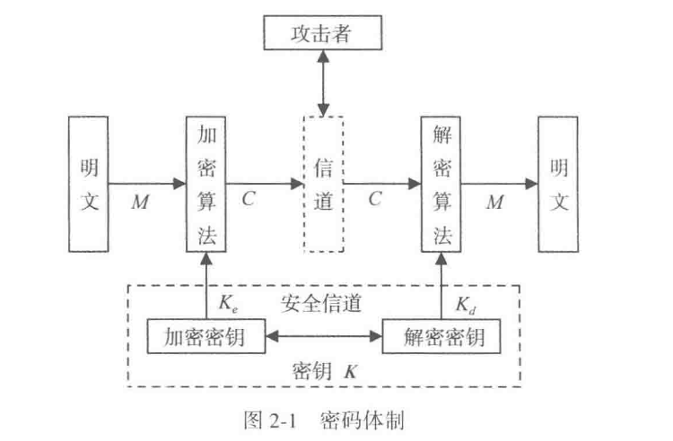

这张图最适合在这里建立第一层直觉。它把明文、加密算法、信道、解密算法和攻击者放到了同一条通信链上。密码学关心的是整条链上的信息如何流动、攻击者能够接触到哪一段、密钥如何通过安全信道分发。

若 $K_e$ 和 $K_d$ 相同，或者能由其中一个轻易推出另一个，就得到对称密码体制。若 $K_e$ 可以公开，同时在计算上难以暴露 $K_d$，就得到公开密钥密码体制。若按处理单位划分，分组密码一次处理一个固定长度的数据块，序列密码则逐位或逐字符产生密钥流并参与加密。

教材还在这里引入演化密码。对初学者而言，更适合先看它试图解决的问题：固定算法一旦部署，就会长期暴露在分析之下；如果算法结构能够在安全约束下变化，攻击者面对的对象就会从静止目标变成持续变化的目标。

!!! important

	读任何密码体制时，都先把下面五个对象写清：
	
	**明文空间、密文空间、密钥空间、加密算法、解密算法**。


#### 2.1.2 密码分析

课本把密码分析首先界定为“根据密文系统地确定出明文或密钥，或者根据明文-密文对系统地确定出密钥”的研究。随后教材把 攻击方法 分成三类：**穷举攻击、数学攻击和物理攻击**

- 穷举攻击是对任何密码都适用的最基本攻击。只要密钥空间有限，理论上总可以通过逐一尝试密钥来破译，因此能抵抗穷举攻击是近代密码的基本要求。
- 数学攻击针对的是密码算法的数学基础和密码学特性。统计攻击为最早的一类数学攻击，许多古典密码都可以通过分析字母和字母组的频率来破译。对于近代密码，有差分攻击、线性攻击、代数攻击、相关攻击等方法。
- 物理攻击则把视角推进到实现层。任何密码算法在硬件中工作时都必然与环境发生物理交互，从而泄露侧信道信息。能量消耗、时间消耗、声音、电磁辐射和故障都可能成为攻击入口。

> 许多理论上安全的密码，恰恰因为物理实现方面的不足而被攻破，这说明密码系统的安全始终也是一个系统安全问题。

在 攻击模型 上，又按 **攻击者可利用的数据资源** 区分出仅知密文攻击、已知明文攻击、选择明文攻击和选择密文攻击。

> 注意判断标准：一个近代密码至少应当经得起已知明文攻击；而当攻击者能够选择明文或选择密文时，安全结论就必须在更强的模型下重新判断。

最后，一次一密属于理论上绝对不可破译的密码；绝大多数实际密码追求的则是计算上不可破译。


#### 2.1.3 密码学的理论基础

香农的信息论奠定了密码学的重要理论基础。信息论之后，密码学在发展中又逐渐形成了自己的新理论，例如单向陷门函数理论、公钥密码理论、零知识证明理论，以及部分密码设计与分析理论。

从安全性角度看，课本反复出现的一个基本区分，就是理论安全与计算安全。一次一密是典型的理论安全密码，只要密钥真随机、与明文等长且一次一用，攻击者无论拥有多强算力也无法从密文中获得额外信息。除此之外，绝大多数现代密码只能追求计算安全，也就是在现实可利用资源下不可破译。

信息论解释了保密与信息泄露的基本界限，单向陷门函数解释了为什么会出现公开密钥密码，零知识证明又解释了“证明知道某个秘密，同时继续保护该秘密本身”这种更强的认证思想。


### 2.2 古典密码

古典密码很适合作为入门，因为它们把密码体制的基本对象都暴露得很清楚：明文空间是什么，密钥如何起作用，统计结构如何泄露，攻击者到底抓住了什么规律。


#### 2.2.1 置换密码

置换密码的思想是打乱明文符号的位置，同时保留各符号本身。它主要隐藏明文的排列结构。比如把 `attack` 重新排列成按某个轨道读出的形式，字符种类不变，变化落在位置次序上。

这类方案的优点是直观，实现简单；缺点也同样明显。由于字母本身保持不变，单字母频率、多字母组合和语言结构仍会在密文中留下痕迹。一旦置换规则过于机械，攻击者就能通过分组长度、重复片段和常见词模式逐步还原。

可以用一个很小的例子体会这一点。若明文是 `attack at dawn`，发送方按固定栏宽写成矩阵，再按列读出密文，那么空格位置、重复字母数量和常见双字母组合都还在。攻击者即使一开始不知道栏宽，也能从消息长度和片段重复关系反推几种可能，再逐个尝试恢复排列。这说明置换只打乱了位置，语言自身的统计骨架仍然保留下来。

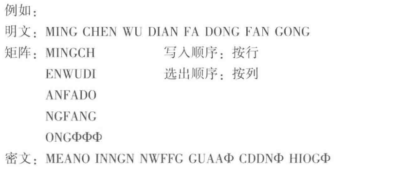


#### 2.2.2 代替密码

代替密码让明文字母映射到别的字母或符号。

==单表映射==

!!! note
	可以把它看成有限字母表上的单表映射

最典型的入门例子是 Caesar 加法密码。若把英文字母表编码为 $0,1,\dots,25$，取密钥 $k=3$，就可以写成

$$
c \equiv m+k \pmod{26}.
$$

例如明文 `HELLO` 对应数值 `7,4,11,11,14`，加 3 以后得到 `10,7,14,14,17`，也就是 `KHOOR`。这个例子很适合看清“加密规则”和“密钥”的区别。规则对应“模 26 加法”，密钥对应“具体加几”。规则公开通常不会直接破坏安全，保密对象落在密钥上。

**乘法密码**、**仿射密码** 和 **密钥词组** 代替密码，都是在这个思路上的变化。它们试图增大密钥空间，减弱简单平移带来的明显痕迹，但仍然无法摆脱自然语言统计特征会透过密文泄露这一根本问题。

!!! note
    乘法密码：$f(a_i)=b_i=a_j$,其中 $j=ik \mod n$,且 $(k,n)$ 互质

仿射密码：$f(a_i)=b_i=a_j$，其中 $j=ik_1+k_0\mod n$ ,且 $(k_1, n)=1,0\le k_0 < n$

密钥词组：

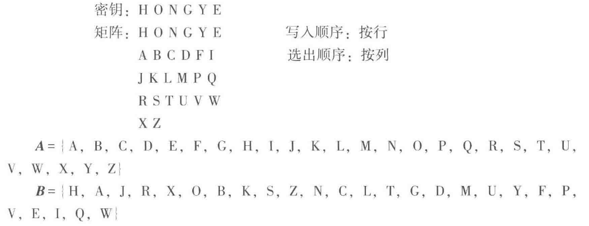

Caesar 密码尤其适合拿来做第一个完整攻击例子。攻击者只要枚举 26 种位移，就能很快看到哪一种结果更像自然语言；即使不枚举，直接统计高频字母，也能判断密文里最常出现的字母很可能对应 `E` 或 `T`。这就是古典密码里最早的“结构泄露压倒密钥空间”的例子：密钥再短，暴露也很快；密钥稍长，统计规律照样会接着工作。

!!! Example

	下面这个例子适合第一次自己手推一遍：
	
	```
	字母编号:  A B C D E F G H I J K L M N O P Q R S T U V W X Y Z
	          0 1 2 3 4 5 6 7 8 9 10 ...
	
	明文:  H  E  L  L  O
	       7  4 11 11 14
	
	密钥:  k = 3
	
	密文:  K  H  O  O  R
	      10  7 14 14 17
	```


==多表代替密码==

介绍了 [Vigenre密码(维吉尼亚密码)](https://www.metools.info/code/c71.html)：

它将凯撒密码的所有26种排列放到一个表中，形成26行26列的加密字母表。维吉尼亚密码必须有一个由字母组成的密钥，至少有一个字母，最长与明文字母有相同数量的字母。

要生成密码，需要使用表格方法，此表(如图所示)包含26行字母表，每一行从上一行到左行被一位偏移。加密时使用哪一行字母表是基于密钥的，在加密过程中密钥会不断变化。

> 加密时由明文字母所在列和密钥字母所在行共同决定密文字母


==多名代替密码==

为了解决明文字母的频率痕迹，设法将密文字母的频率分布拉平

设置一个对应表，用的少的字母可以有多个数字对应它，用的多的字母只有单个数字对应它


#### 2.2.3 代数密码

Vernam 密码是从古典密码过渡到现代序列密码的重要桥梁。若 **明文、密钥和密文都写成比特串，则加密和解密都通过按位异或完成**：

$$
c_i = m_i \oplus k_i,\qquad m_i = c_i \oplus k_i.
$$

它的教学价值极高，因为它第一次把“简单的加密运算”和“困难的密钥产生”明确拆开。异或本身复杂度极低，安全性几乎全部落在密钥序列上。这正是后面序列密码章节的核心思路。

如果密钥序列是真随机、长度不少于明文且每次只用一次，就得到一次一密。教材借这个极端例子说明：理论上最安全的方案，往往在密钥管理上最难落地。现代密码设计大量工作，都在试图用现实可管理的方式逼近一次一密的效果。


### 2.3 古典密码的统计分析

古典密码的失败，往往来自密文里保留了太多明文统计痕迹。教材在这里先讲语言统计特性，再讲具体破译过程，顺序很合理，因为攻击总要抓住可利用的规律。


#### 2.3.1 语言的统计特性

自然语言有明显的统计偏向。英文字母里 `E`、`T`、`A`、`O` 的出现频率明显高于其他字母，双字母和三字母组合也有稳定模式，例如 `TH`、`HE`、`THE`、`ING`。只要密文中保留了这些分布结构，攻击者就能把“高频密文字母”与“高频明文字母”逐步对齐。

这里更该把频率表当成例子，用来理解统计规律为何会成为攻击入口。密码若采用固定替换，明文里的高频字母会变成密文里的另一个高频字母。字母换了，分布形状仍会保留下来。


#### 2.3.2 古典密码分析

本质上就是把“频率信息”“语言常识”和“局部猜测”反复交叉验证。先统计单字母频率，猜测高频字母；再利用双字母、三字母组合验证；最后把已知映射不断扩展，直到整段密文恢复。

这一步对后面现代密码的影响非常深。现代密码设计强调混淆与扩散，目标之一就是让这种统计痕迹在密文里尽量消散。Shannon 的设计原则正是对古典密码破译经验的系统总结。

### 2.4 SuperBase 密码的破译

> 微软的一个古早文件加密系统，写这本书的人破译了这个加密系统，所以花了一节的篇幅去吹他的功绩

SuperBase 同时用了密码保护和编辑保护，看起来像是双层防护，但只要密码本身结构太弱，攻击者完全可以绕开系统表象，直接做选择明文分析。

攻击者观察明文和密文的对应关系，发现加密是局部的、与位置无关、某些字节不加密，于是逐步把规律抽象出来，最终还原出加解密算法。这里暴露出来的是结构泄露。至于详细的破译步骤，这里不展开叙述了，这里不是重点考试内容

攻击未必总是从大规模数学定理开始，很多时候它先从输入输出行为开始：哪些字节会变，哪些字节不变，变化是否依赖位置，局部修改会不会只引起局部密文变化。只要这些现象稳定可测，攻击者就能直接逼近密码结构本身。

>  “系统有加密功能”很难直接推出“系统具备足够安全性”。如果算法过弱、模式固定、实现可预测，那么安全功能本身就会变成攻击入口。这也是为什么现代密码学会把攻击模型和安全证明放在定义附近，并在应用前就交代清楚。


## 第3章 分组密码

> 古典密码让我们看到了统计痕迹为什么危险。第 3 章开始进入现代对称密码，通过多轮结构、非线性部件和扩散机制，把明文与密钥的影响在整个分组里打散。


### 3.1 数据加密标准（DES）


#### 3.1.1 DES 的加密过程

DES 是典型的分组密码。它一次处理 64 位明文，在 56 位有效密钥控制下进行 16 轮迭代。教材把 DES 放在分组密码的开头，是因为它几乎把现代分组密码的基本思想都展示出来了：分组、轮函数、子密钥、置换、代替、可逆结构和安全分析。

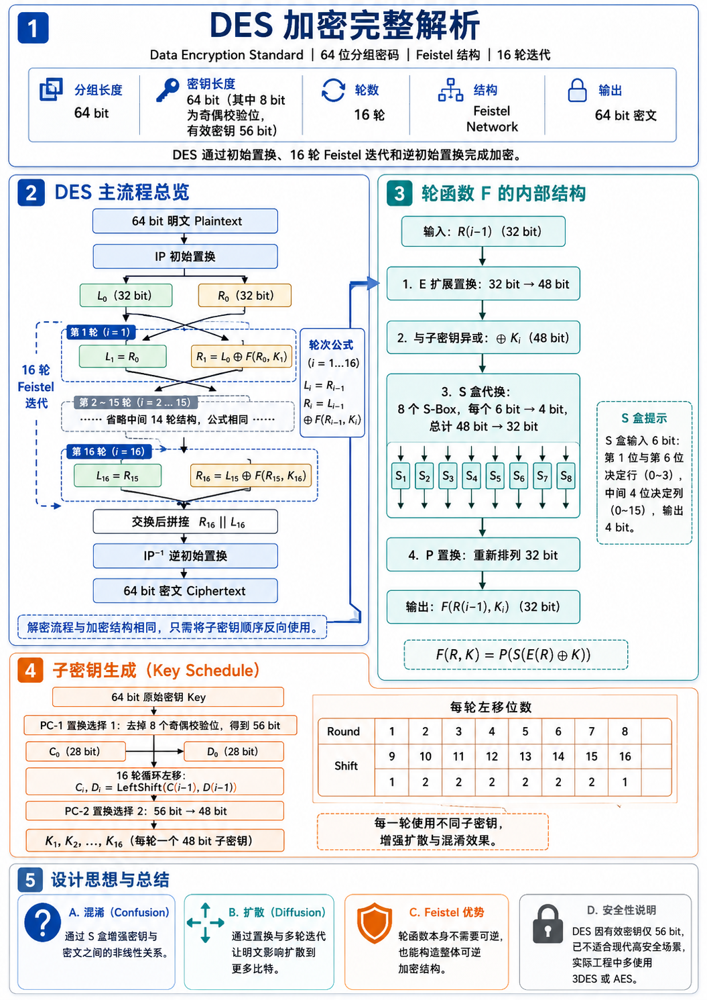

DES 使用的是 Feistel 结构。把 64 位输入分成左右两半 $L_i,R_i$ 后，每一轮执行

$$
L_{i+1}=R_i,\qquad R_{i+1}=L_i\oplus f(R_i,K_i).
$$

这里 $K_i$ 是第 $i$ 轮子密钥，$f$ 是轮函数。

> 1. 64位密钥经子密钥产生算法产生出16个子密钥：$K_1，K_2，…，K_{16}$，分别供第一次、第二次、…、第十六次加密迭代使用。
> 2. 64位明文首先经过初始置换 IP（Initial Permutation），将数据打乱重新排列并分成左右两半。左边32位构成 $L_0$，右边32位构成 $R_0$。
> 3. 由加密函数 f 实现子密钥 $K_1$ 对 $R_0$ 的加密，结果为32位的数据组 $f(R_0, K_1)$。$f(R_0, K_1)$ 再与 $L_0$ 模2相加，又得到一个32位的数据组 $L_0 \oplus f(R_0, K_1)$。以 $L_0 \oplus f(R_0, K_1)$ 作为第二次加密迭代的 $R_1$，以 $R_0$ 作为第二次加密迭代的 $L_1$。至此，第一次加密迭代结束。
> 4. 第二次加密迭代至第十六次加密迭代分别用子密钥 $K_2,\dots,K_{16}$ 进行，其过程与第一次加密迭代相同。
> 5. 第十六次加密迭代结束后，产生一个64位的数据组。以其左边32位作为 $R_{16}$，以其右边32位作为 $L_{16}$，两者合并再经过逆初始置换 $IP^{-1}$，将数据重新排列，便得到64位密文。至此加密过程全部结束。

Feistel 结构的关键在于把一半数据送入轮函数，再用异或把结果回灌到另一半。正因为这种结构天生可逆，解密时只需把子密钥顺序倒过来，整个流程就能反向恢复。

`insight：` Feistel 结构的一个深刻之处在于，轮函数 $f$ 本身不必可逆，整个密码依然可逆。可逆性落在“交换 + 异或回灌”的轮结构整体上。这一点对后面理解 SM4 和许多现代分组结构都很关键。

!!! Example

	可以先把轮函数当成黑盒，不去管它里面有什么，只看两轮数据怎样流动：
	
	```
	初始输入: (L0, R0)
	
	第1轮:
	L1 = R0
	R1 = L0 xor f(R0, K1)
	
	第2轮:
	L2 = R1
	R2 = L1 xor f(R1, K2)
	   = R0 xor f(R1, K2)
	```

只看这两轮就能发现一个趋势：最初只落在半个分组里的影响，会在轮次推进中逐步扩散到整个分组。


#### 3.1.2 DES 的算法细节

DES 的轮函数包含扩展置换 $E$、与子密钥异或、8 个 S 盒代替和置换 $P$。其中承担主要安全压力的是 S 盒提供的非线性。若缺少 S 盒，整个结构几乎会退化为线性系统，攻击者就能把许多复杂步骤合并成可解的代数关系。

==子密钥的产生==

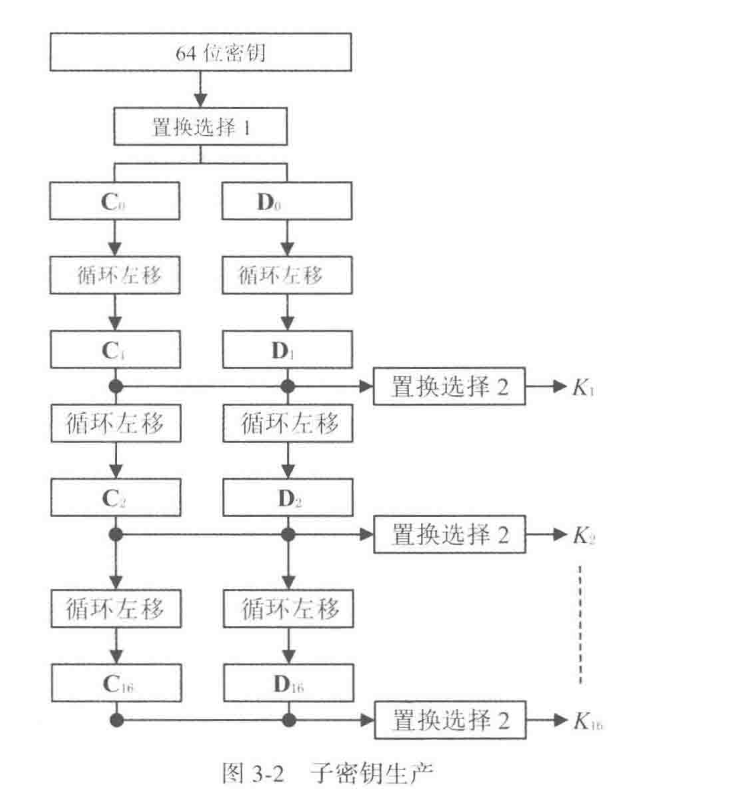

64位的密钥分为8个字节。每个字节的前7位是真正的密钥位，第8位是奇偶校验位，可以通过前7位计算出来。因此DES真正的密钥只有56位

图中置换选择1的作用就是去掉8个奇偶校验位，以及打乱其余56位密钥位

将 $C_i$ 和 $D_i$ 合成为一个56位的中间数据，置换选择2从中选择出一个48位的子密钥 $K_i$ ，如下，对于这个矩阵，子密钥 $K_i$ 中的第 $1,2,\cdots,48$ 位一次是这个 56 位中间数据中的第 $14,17,\cdots,5,3,\cdots,29,32$ 位

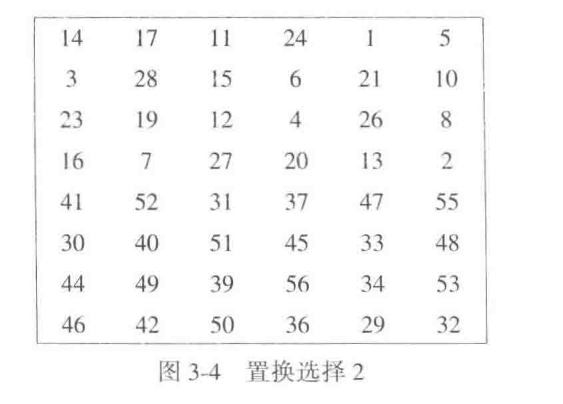

==初始置换IP==

初始置换的作用在于将64位明文打乱重排，并分成左右两半。左边32位作为 $L_0$,右边 32 位作为 $R_0$,供后面的加密迭代使用。

如下，对于这个置换矩阵，置换后64位数据的第 $1,2,\cdots,64$ 位依次是原明文数据的第 $58,50,\cdots,2,60,15,7$ 位

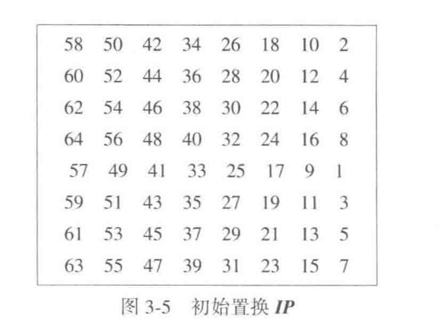

==加密函数==

它的作用是在第 $i$ 次加密迭代中用子密钥 $K_i$ 对 $R_{i-1}$ 进行加密

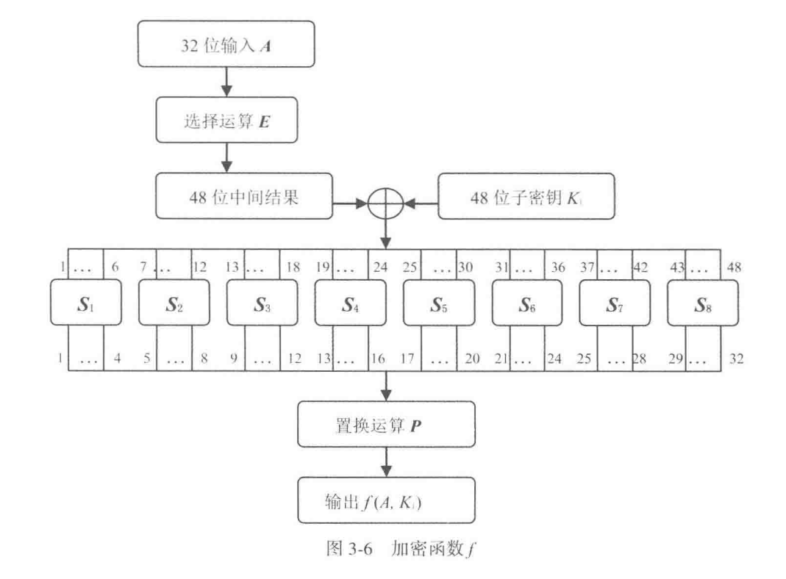

第 $i$ 次迭代加密中选择运算 $E$ 对 $32$ 位的 $R_{i-1}$ 的各位进行选择和排列，产生一个 48 位的结果。此结果与子密钥 $K_i$ 模2相加，然后送入代替函数组 $S$ 。代替函数组由8个代替函数组成，每个 $S$ 盒子有 6 位输入，产生 4 位输出。8个 $S$ 盒子的输出合并，结果得到一个 32 位的数据组。此数据组再次经过置换运算 $P$ ,将其各位打乱重拍。置换运算 $P$ 的输出便是加密函数的输出 $f(R_{i-1},K_i)$

**选择运算E**:

如下图，通过重复选择某些数据位来达到数据扩展的目的，从而将32位数组扩展到48位，以满足代替函数组 $S$ 对数据长度的要求

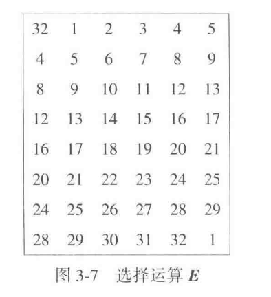

**代替函数族S**：

代替函数组由8个代替函数($S$ 盒子）组成，每个 $S$ 盒有一个代替矩阵。代替矩阵有4行16列，每行为0-15，但数字排列都不同。每个 $S$ 盒有6位输入，产生 4 位输出。由于 $S$ 盒运算结果是用输出数据代替了输入数据，所以称为代替函数

S盒的代替规则

S盒的代替规则是：S盒的6位输入 $b_1 b_2 b_3 b_4 b_5 b_6$ 中的第1位 $b_1$ 和第6位 $b_6$ 组成的二进制数 $b_1 b_6$ 代表选中的行号，其余4位数字 $b_2 b_3 b_4 b_5$ 所组成的二进制数代表选中的列号，而处在被选中的行号和列号交点处的数字便是 S 盒的输出（以二进制形式输出）。

以 $S_1$ 为例，设输入 $b_1 b_2 b_3 b_4 b_5 b_6 = 101011$，第1位和第6位数字组成的二进制数 $b_1 b_6 = 11 = (3)*{10}$，表示选中 $S_1$ 的行号为3的那一行，其余4位数字所组成的二进制数为 $b_2 b_3 b_4 b_5 = 0101 = (5)*{10}$，表示选中 $S_1$ 的列号为5的那一列。交点处的数字是9，则 $S_1$ 的输出为 $1001$

S盒满足的准则

1. 输出不属于输入的线性函数或仿射函数
2. 任意改变输入中的1位，输出至少有两位发生变化
3. 对于任何S盒和任何输入x，$S(x)$ 和 $S(\oplus 001100)$ 至少两位不同，这里 $x$ 是一个6位的二进制串
4. 对于任何 $S$ 盒和任何输入 $x$，以及 $y,z\in GF(2)，S(x)\ne S(x\oplus 11yz 00)$,这里 $x$ 是一个 6 位的二进制串
5. 保持输入中的1位不变，其余5位变化，输出中的0和1的个数接近相等

==逆初始置换 $IP^{-1}$==

逆初始置换 $IP^{-1}$ 是初始置换 $IP$ 的逆置换。它把第十六次加密迭代的结果打乱重排，形成64位密文。至此完成加密过程

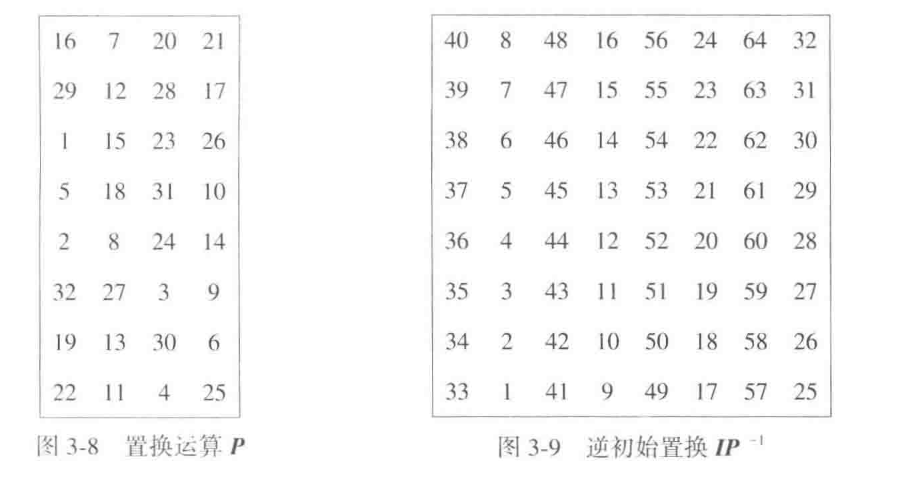

#### 3.1.3 DES 的解密过程

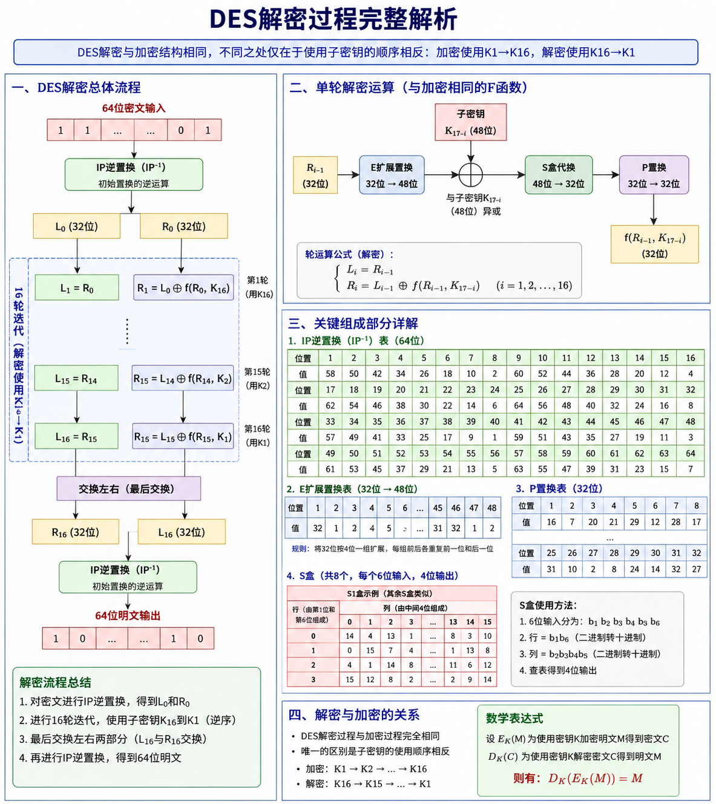

因为 Feistel 结构可逆，DES 的解密和加密共享同一套主体结构，只需把子密钥使用顺序反过来。这个设计在工程上非常重要。它降低了硬件和软件实现成本，也说明“加密算法的正确性”和“实现是否经济”在现代密码设计里始终要同时考虑。

$$
\begin{cases}
R_{i-1}=L_i \\
L_{i-1}=R_i\oplus f(L_i,K_i) \\
i=16,15,14,\cdots,1
\end{cases}
$$

这一点还可以配合轮结构再看一遍。假设第 16 轮输出是 $(L_{16},R_{16})$，若此时拿到相同的轮函数并按相反顺序使用子密钥，那么上一轮输入会一层层被恢复出来。也就是说，DES 的解密从工程视角看更像“同一台机器按相反的密钥时序再跑一遍”。这种结构统一性，是早期硬件标准能够大规模落地的重要原因。


#### 3.1.4 DES 的安全性

对它当年的设计目标来说，DES 是成功的：结构精巧，S 盒设计强，长期未出现比穷举明显更实用的普适攻击。致命短板落在只有 56 位的密钥长度上，这在并行计算条件下逐渐变得不够。

此外，DES 还有 **弱密钥、半弱密钥和互补性质** 等弱点。这里更该学到安全分析的方法：即使主体结构正确，也要检查参数空间里是否存在异常点、特殊对称性或工程上容易被利用的捷径。


#### 3.1.5 3DES

3DES 的思路很直接：DES 的主体结构已经成熟，短板集中在密钥太短，于是就把 DES 多次串联，用多个密钥把穷举成本抬高。它说明了一种常见改进方式：旧算法的主体结构仍然可靠时，可以通过组合提升安全性。

3DES 也清楚地展示了数学可行与工程合适之间常有距离。三次 DES 带来了更高的运算成本，软件速度明显下降，因此它更像过渡方案，较少被视为长期终点。

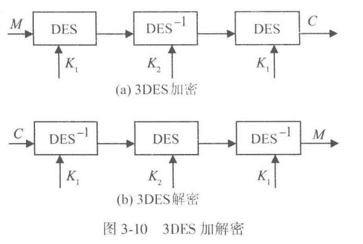


#### 3.1.6 DES的历史回顾

DES 的历史价值不只在于它曾经被广泛使用，更在于它把公开算法、公开分析和标准化应用这条路线明确固定了下来。后来的 AES 评选、SHA-3 征集，都延续了“公开征集、公开评测、长期分析”的方法论。


### 3.2 高级数据加密标准（AES）⭐⭐⭐

由于内容过多，这里放到了AES文章中进行详细介绍


#### 3.2.5 RIJNDAEL 的安全性

它在结构上吸收了现代密码设计经验，轮函数简单清晰，分析时间长，至今仍是主流标准之一。学习时更该知道它为什么被认为安全：当前未见能明显优于穷举的实用普适攻击，并且其部件设计、轮数和密钥长度都有较充分的分析支撑。


### 3.3 中国商用密码算法 SM4 ⭐⭐⭐

算法介绍板块


#### 3.3.1 SM4 算法描述


#### 3.3.2 SM4 的可逆性和对合性


#### 3.3.3 SM4 的安全性

SM4 的 S 盒和密钥扩展都经过了专门设计，公开后也接受了国内外分析。教材的态度很清楚：它在现阶段仍被广泛支持和使用，同时也持续面临新的分析。差分故障攻击之类的研究说明，实现层安全同样重要。


#### 3.3.4 示例


### 3.4 分组密码的应用技术

> 所以这里说的“分组密码的应用技术”，处理的是怎样把已经学过的分组密码放进真实系统里。真实消息往往是一段长文本、一个文件、一条数据库记录，长度通常超过一个分组，而且最后一段还经常凑不满一个完整分组。只会单块加密还不够，必须继续回答三个问题：相同明文块会不会暴露结构，很多个块怎样连起来加密，最后一个短块怎么处理。

前面学到的 DES、AES、SM4 都有一个共同边界：它们每次只能处理一个固定长度的数据块。设分组长度为 $n$ 位，加密算法记为 $E_K(\cdot)$，解密算法记为 $D_K(\cdot)$，密钥为 $K$。若明文消息被切成

$$
M=(m_1,m_2,\dots,m_t),
$$

其中前 $t-1$ 块都是 $n$ 位标准块，最后一块 $m_t$ 可能只有 $u$ 位，满足 $1\le u\le n$，那么真实系统会遇到三个问题。

第一，相同的明文块如果独立加密，会不会把数据模式直接暴露出来。第二，块与块之间要不要建立联系，建立怎样的联系才适合当前应用。第三，最后一个短块怎样进入分组密码，否则算法根本无法直接处理它。教材把这些问题集中放到“分组密码的应用技术”里讨论，意思就是：分组密码的安全性不只取决于底层算法，还取决于我们怎样组织这些算法。

这一节里会频繁出现几个记号：

- $m_i$：第 $i$ 个明文块。
- $c_i$：第 $i$ 个密文块。
- $Z$：初始化向量，也就是加密开始前给系统的一块初始数据。
- $\oplus$：按位异或。
- $\|$：比特串首尾拼接。
- $MSB_u(x)$：取比特串 $x$ 的高 $u$ 位。
- $LSB_s(x)$：取比特串 $x$ 的低 $s$ 位。

有了这些记号，再去看每一种工作模式，公式就会清楚很多。


#### 3.4.1 分组密码的工作模式

分组密码可以按不同模式工作，应用环境不同，工作模式也应不同。工作模式真正处理的是“怎样把一个只能处理单块的密码算法，组织成适合长消息、文件、数据库和通信流的系统”。这里有两个基础概念

- 一个是 **预处理**：若在加密前先用随机序列与明文做异或，就能把明文原有模式打散。
- 另一个是 **链接**。所谓链接，就是让当前块的加密结果不仅依赖当前输入和密钥，还依赖前面块的明文或密文。这样一来，即便两个明文块相同，只要前面环境不同，得到的密文也可能不同。（链接的代价则是错误传播：某一块出了错，后面的块可能被连带影响。）

`insight：` 工作模式处理的是同一个分组密码在长消息中的组织方式、反馈方式和错误传播方式

在接下来的叙述中，我们约定 $E_k(\cdot)$ 为加密函数，$D_k(\cdot)$ 为解密函数

**1. 电码本模式 ECB**

> 给数据分成指定大小的块，每一块独立加密、独立解密

这是分组密码最直接的工作方式。每一块明文独立进入分组密码：

$$
c_i=E_K(m_i),\qquad i=1,2,\dots,t.
$$

解密也同样独立：

$$
m_i=D_K(c_i),\qquad i=1,2,\dots,t.
$$

这里每个符号都很直白。第 $i$ 块明文 $m_i$ 只和密钥 $K$ 一起进入分组密码，得到第 $i$ 块密文 $c_i$。各块彼此独立。


```python
ECB 加密
for i = 1..t:
    c_i = E_K(m_i)
```

ECB 的优点是结构最简单，实现也最直接。它的缺点也同样直接。若两块明文相同，也就是 $m_i=m_j$，那么在同一把密钥下必然有 $c_i=c_j$。于是明文里的重复模式会原封不动地投射到密文里。教材特意强调，计算机程序、数据库记录、通信协议往往都带有固定格式和大量重复字段，所以 ECB 很容易暴露数据模式。

教材还指出，ECB 还要求数据长度是分组长度的整数倍。最后一块若是短块，ECB 自身无法处理，必须靠后面的短块技术补上。

**2. 明密文链接模式**

明密文链接模式：当前块的加密同时依赖前一块明文和前一块密文。把初始化向量记成 $Z$，则可以写成

$$
c_1=E_K(m_1\oplus Z),
$$

$$
c_i=E_K(m_i\oplus m_{i-1}\oplus c_{i-1}),\qquad i=2,3,\dots,t.
$$

解密时对应为

$$
m_1=D_K(c_1)\oplus Z,
$$

$$
m_i=D_K(c_i)\oplus m_{i-1}\oplus c_{i-1},\qquad i=2,3,\dots,t.
$$

这组公式里，最重要的是第 $i$ 块在进入加密之前先和前一块明文 $m_{i-1}$、前一块密文 $c_{i-1}$ 一起异或。于是即便 $m_i$ 自身重复，只要前面链条不同，进入分组密码的输入也会不同，数据模式就被掩盖了。

教材同时强调，这种模式的错误传播是无界的。加密时只要某一块明文或某一块密文出错，后面所有块都会受影响；解密时也有同样问题。它在认证和完整性检验方面有价值，但不适合磁盘文件一类希望局部出错、局部受影响的场景。

**3. 密文链接模式 CBC**

为了让解密时的错误传播控制在更小范围内，接着从明密文链接模式里拿掉“前一块明文”，只保留“前一块密文”参与链接，这就得到密文链接模式 CBC。令 $c_0=Z$，则加密公式是

$$
c_i=E_K(m_i\oplus c_{i-1}),\qquad i=1,2,\dots,t.
$$

解密公式是

$$
m_i=D_K(c_i)\oplus c_{i-1},\qquad i=1,2,\dots,t.
$$

加密前，先把当前明文块和前一块密文异或；解密后，再把结果与前一块密文异或回来。于是前一块密文起到“把链条接起来”的作用。


```python
CBC 加密
c_0 = Z
for i = 1..t:
    x_i = m_i XOR c_{i-1}
    c_i = E_K(x_i)
```


```python
CBC 解密
c_0 = Z
for i = 1..t:
    x_i = D_K(c_i)
    m_i = x_i XOR c_{i-1}
```

CBC 的直接好处是：**相同明文块由于前一块密文不同，通常会得到不同密文，从而掩盖模式**。

> 初始化向量 $Z$ 应当随机化，并且每次加密都换新的 $Z$，这样相同报文也会得到不同密文。

错误传播方面，CBC 的加密仍是无界传播，因为前一块密文参与了后一块加密。解密则是有界传播：若 $c_i$ 某一位出错，那么 $m_i$ 整块都会被破坏，而 $m_{i+1}$ 中与这一位对应的位置也会出错，之后的块恢复正常。这就是教材所说“解密错误传播有界”。

**4. 输出反馈模式 OFB**

接下来把视角从“链接明文或密文”转到“用分组密码产生密钥流”。

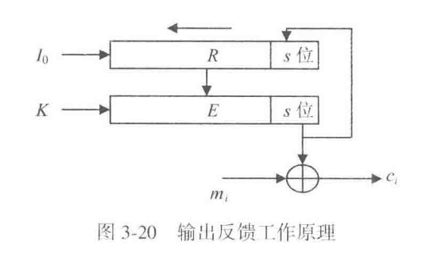

设 $R$ 是一个 $n$ 位移位寄存器，初始状态为 $R_0=Z$，$s$ 是每次输出的位数，满足 $1\le s\le n$。第 $i$ 轮先计算

$$
o\_i=E\_K(R\_{i-1}),
$$

再取 $o_i$ 的最低 $s$ 位作为密钥流

$$
z_i=LSB_s(o_i),
$$

并用它去加密当前 $s$ 位明文段 $m_i$：

$$
c_i=m_i\oplus z_i.
$$

随后把寄存器左移 $s$ 位，并把 $z_i$ 反馈回寄存器右端，得到新的状态 $R_i$,即

$$
R\_i=(R\_{i-1}左移s位)|z\_i
$$

解密时，寄存器和分组密码按完全相同方式运行，重新产生同样的密钥流，再与密文异或就能恢复明文。


```
OFB 一轮
o_i = E_K(R_{i-1})
z_i = LSB_s(o_i)
c_i = m_i XOR z_i
R_i = (R_{i-1} 左移 s 位) || z_i
```

OFB 本质上是把分组密码变成一个密钥序列产生器，也就是把分组密码当作序列密码来用。它的优点是无错误传播。某一位明文错了，只影响对应密文位；某一位密文错了，也只影响对应明文位。正因为如此，OFB 适合语音、图像这类冗余度较大的数据。它的短板同样来自“无错误传播”：密文若被篡改，系统不容易仅凭模式变化发现问题。

**5. 密文反馈模式 CFB**

CFB 和 OFB 的差别只落在“反馈回寄存器的到底是什么”。OFB 反馈的是 $E_K(R_{i-1})$ 的输出片段，CFB 反馈的是刚刚生成的密文片段。前半步仍然一样：

$$
o_i=E_K(R_{i-1}),\qquad z_i=LSB_s(o_i),
$$

然后用

$$
c_i=m_i\oplus z_i
$$

得到当前密文段，但寄存器更新改成

$$
R_i=(R_{i-1}\text{ 左移 }s\text{ 位})\|c_i.
$$

解密时仍然先算 $E_K(R_{i-1})$ 得到密钥流，再与当前密文段异或恢复明文，同时把当前密文段反馈回寄存器。


```
CFB 一轮
o_i = E_K(R_{i-1})
z_i = LSB_s(o_i)
c_i = m_i XOR z_i
R_i = (R_{i-1} 左移 s 位) || c_i
```

CFB 和 OFB 在错误传播上的表现完全不同。若加密时某一位明文出错，这个错误会先影响当前密文，再通过反馈影响后续密钥流，导致后面的密文继续出错；解密时某一位密文出错，也会先影响当前明文，再通过反馈继续影响后续明文。

CFB 的加解密都为错误传播无界。正因为错误会沿链条扩散，CFB 更适合放在数据完整性认证这类需要“改一处就牵动后续”的场景。

**6. XCBC 模式**

CBC 有一个明显限制：它要求最后一个数据块必须是标准块。XCBC 正是围绕这个限制提出的扩展。XCBC 使用三个密钥 $K_1,K_2,K_3$，前面的标准块按链接方式处理，最后一个块则单独处理：若最后一块本来就是标准块，就走一种终结方式；若最后一块是短块，就先通过 $Pad(X)$ 填充成标准块，再用另一种终结方式处理。

它想让“最后一块既可以是标准块，也可以是短块”，从而支持任意长度的数据。它的主要优点有两个：一是可以处理任意长数据，二是适合用来计算消息认证码 $MAC$。它的主要缺点也有两个：一是短块填充仍然需要让收发双方知道填充长度，二是要同时管理三个密钥，控制起来更复杂。

若明文总长度与分组长度不整除，那么填充位数为

$$
pad_{len}=n-(|M|\bmod n).
$$

其中 $|M|$ 表示明文总长度。这个式子非常朴素：总差多少位到下一个整块，就补多少位。

**7. CTR 模式**

它和 OFB、CFB 一样，也把分组密码变成序列密码来用，不过它改为依赖一个事先给定的计数序列 $T_1,T_2,\dots,T_t$。对标准块，加密公式是

$$
c_i=m_i\oplus E_K(T_i).
$$

若最后一块是 $u$ 位短块，则只取 $E_K(T_t)$ 的高 $u$ 位参与异或：

$$
c_t=m_t\oplus MSB_u(E_K(T_t)).
$$

解密公式完全一样，因为异或是对合运算：

$$
m_i=c_i\oplus E_K(T_i).
$$


```python
CTR 加密/解密
for i = 1..t:
    keystream_i = E_K(T_i)
    若 m_i 是标准块:
        c_i = m_i XOR keystream_i
    若 m_i 是 u 位短块:
        c_i = m_i XOR MSB_u(keystream_i)
```

这里最关键的条件，是同一把密钥 $K$ 下绝不能复用同一计数序列。教材专门强调，计数序列必须时变。原因很简单：若两段消息在同一密钥下用了同一个 $T_i$ 序列，那么它们实际上就用了同一条密钥流，保密性会立刻下降。

CTR 的优点：

- 可并行
- 效率高
- 密钥流可预处理
- 适合任意长度数据。适合随机存取数据的加解密随机文件和数据库加密尤其喜欢这一点，因为它们要求“想取哪一块就能直接处理哪一块”。
- 无错误传播；相应地，它也不适合单独承担数据完整性认证任务。

把这一节所有模式放在一起：

| 模式 | 当前块依赖什么 | 错误传播 | 教材强调的适用点 |
| --- | --- | --- | --- |
| $ECB$ | 只依赖当前明文块和密钥 | 无链式传播 | 结构最简单，适于对密钥加密 |
| 明密文链接 | 当前明文、前一明文、前一密文 | 加解密都无界 | 真实性、完整性分析 |
| $CBC$ | 当前明文、前一密文 | 加密无界，解密有界 | 字符文件加密 |
| $OFB$ | 寄存器状态和分组密码输出反馈 | 无错误传播 | 语音、图像等冗余数据 |
| $CFB$ | 寄存器状态和密文反馈 | 加解密都无界 | 数据完整性认证 |
| $XCBC$ | 前面链接处理 + 最后一块特殊处理 | 依赖底层链接方式 | 任意长数据、$MAC$ |
| $CTR$ | 计数器序列 | 无错误传播 | 并行处理、随机存取、数据库 |


#### 3.4.2 分组密码的短块加密

分组密码一次只能处理一个固定长度的标准块。长度小于分组长度的数据块，就称为短块。若明文长度大于分组长度但与分组长度不整除，短块总出现在最后一块；若明文本身就短于一个分组，那么整个明文本身就是短块。网络通信、文件加密、数据库加密都会遇到它，所以短块处理属于实际系统里的常见问题。

**1. 填充法**

最直接的办法，是先往短块里补数据，把它补成一个标准块，然后再用普通分组密码加密。若最后一块长度是 $u$ 位，则需要补上 $n-u$ 位。教材给出的长度计算仍然用

$$
pad_{len}=n-(|M|\bmod n).
$$

收方解密以后，还得知道哪些位是后来补上的。课本给出两种做法：一种是在密文中附加填充指示信息，常见做法是用最后几位或最后一个字节记录补了多少位；另一种是收发双方事先知道原始明文总长度，由此反推出填充长度。

填充法的优点是概念最简单。它的缺点也很容易理解：一旦补位，数据长度就扩张了。这种扩张对通信加密通常问题不大，但对文件加密和数据库加密就可能带来麻烦，因为文件长度、记录长度、字段长度一旦被改写，存储结构就可能被破坏。

> 举一个最小例子。若分组长度是 16 字节，最后一块只有 5 字节，那么还差 11 字节。填充法就是先补满这 11 字节，再把整个 16 字节块送进分组密码。收方解密后，依据填充指示或原始长度，再把这 11 字节去掉。

**2. 序列密码加密法**

教材接着提出第二种办法：对前面的标准块仍然用分组密码处理，只对最后短块改用“分组密码产生密钥流，再与短块异或”的方式。设前一标准块对应的数据为 $x$，最后短块为 $m_t$，长度为 $u$ 位，则可以取

$$
z_t=MSB_u(E_K(x)),
$$

再计算

$$
c_t=m_t\oplus z_t.
$$

这里的 $x$ 在不同场景里含义略有不同。若前面已经有标准块，$x$ 可以取最后一个相关标准块的密文；若整条消息本身就是短块，教材指出可以用初始化向量 $Z$ 代替 $x$。这条公式表达的是：先让分组密码输出一整块数据，再从中截出够长的 $u$ 位，拿去保护短块。

这项技术的优点，是不会带来数据扩张。短块有多长，密文就有多长。缺点是安全性相对弱一些。若短块很短，攻击者可能更容易通过穷举去猜测它。

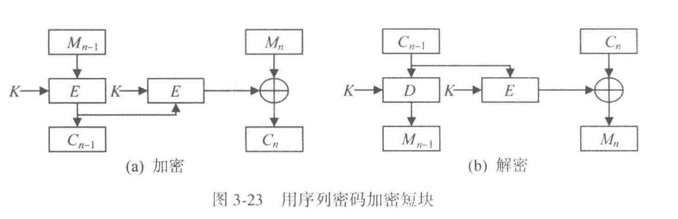

**3. 密文挪用技术**

它的核心想法，是从前一块密文里“借”出恰好够填充的若干位，先把短块补成标准块，再重新组织最后两块密文。这样做的结果是：最后两块密文的总长度，恰好等于最后两块明文的总长度，因此不会产生数据扩张。

设倒数第二块是标准块 $m_{t-1}$，最后一块是 $u$ 位短块 $m_t$。

1. 先按原来的链接模式计算出与 $m_{t-1}$ 对应的一块密文。
2. 从这块密文里挪出刚好 $n-u$ 位，填到 $m_t$ 后面，把 $m_t$ 补成一个标准块。
3. 对补成标准块后的最后一块再做一次分组加密，得到新的完整密文块。
4. 前一块则因为“借出”了若干位，长度缩成 $u$ 位短块。

于是，最后得到的是“一块短密文 + 一块标准密文”，但两者总长度和原来的“一块标准明文 + 一块短明文”完全相同。解密时要反过来先解开最后一块，恢复出被挪用的数据，再把这些位放回去，最后继续还原前一块。


```
密文挪用的核心动作
1. 倒数第二块先正常加密
2. 从这块密文中挪出 n-u 位
3. 把这 n-u 位补到最后短块后面
4. 再加密补齐后的最后一块
5. 重新组织最后两块密文，总长度保持不变
```

密文挪用和填充法一样，也需要让接收方知道挪用了多少位，否则无法正确还原。这个位数仍然可以用前面的填充长度公式算出来。

它的优点是不引起数据扩张，安全性也高于序列密码加密短块的方法；它的缺点是控制过程更复杂，解密时要先解最后一块、还原挪用数据，再继续解前一块。

- 填充法概念最简单，适于通信加密；
- 序列密码加密短块不扩张数据，但安全性偏弱；
- 密文挪用不扩张数据，而且安全性更高，所以在实际系统中更常用


## 第4章 序列密码

> 如果说分组密码试图把一个数据块彻底搅乱，序列密码则更像在逼近“一次一密”的工作方式：先生成高质量密钥流，再逐位与明文组合。这里从随机序列讲起，是因为序列密码的核心始终落在密钥流质量上。


### 4.1 序列密码的概念

序列密码通常使用一个较短的种子密钥，驱动密钥序列产生算法，得到一个足够长的伪随机密钥流，再按位与明文异或：

$$
c_i=m_i\oplus z_i.
$$

这里更重要的是 $z_i$ 如何产生。若密钥流可预测、周期太短或统计特性不好，那么异或再简单也无法阻止攻击。

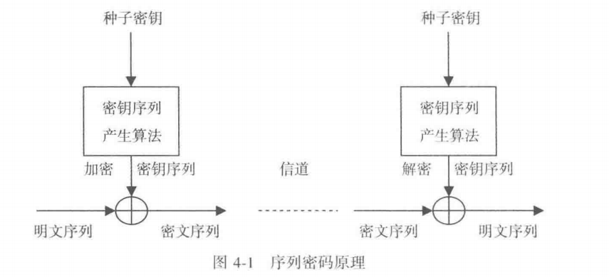

如图，两端只要持有同样的种子密钥和同样的状态更新规则，就能产生一致的密钥流。也正因为如此，同步是序列密码能否正确工作的前提之一。


### 4.2 随机序列的安全性

教材把随机序列的要求概括为长周期、非线性、统计预期性、可伸缩性和不可预测性。这些要求分别回答不同问题。长周期防止密钥流过早重复，非线性防止被线性方程恢复，统计预期性用来压低明显偏差，可伸缩性保证局部抽取后仍像随机，不可预测性则直接面向攻击者。

这里还要分清真随机与伪随机。真随机适合生成密钥、口令、时变量和种子，但不能直接拿来做通信双方同步的长密钥流，因为它本来就不可重复。序列密码所需要的，是在攻击者看来不可预测、在合法双方看来可重复生成的伪随机序列。

这组区别也解释了为什么序列密码总是包含“种子”或“初始状态”这类对象。发送方和接收方共享的是足以生成长密钥流的短状态。于是安全性的焦点也就转移了：攻击者能否从已经观察到的输出，预测后续输出，或者反推出内部状态。只要这个问题答不稳，序列密码就算看起来随机，安全性也会很快坍塌。

!!! note

    序列密码真正想逼近的是 一次一密的使用效果，同时保持可重复生成、可同步部署和可工程实现。
    
    因此读这一章时，注意力要始终放在 **密钥流能否预测、会不会重复、状态能否回推** 这三个问题上。


### 4.3 *线性移位寄存器序列

#### 移位寄存器的基本结构

移位寄存器由一排寄存器组成，记为

$$
s_0,s_1,\cdots,s_{n-1}。
$$

每个寄存器保存一个域元素。在二元情形下，每个寄存器保存 0 或 1。每来一个移位脉冲，寄存器整体移动一格，同时根据当前状态计算一个新值并反馈到寄存器末端。我们可以将当前寄存器取值

$$
(s_0,s_1,\cdots,s_{n-1})
$$

称为一个状态。随着脉冲不断加入，状态连续变化，输出端依次给出一个数字序列。

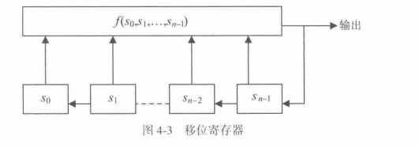

图 4-3 表达的是一般移位寄存器。上方的

$$
f(s_0,s_1,\cdots,s_{n-1})
$$

是反馈函数。它读取当前所有寄存器的值，计算输出，并把输出反馈进移位链。反馈函数的性质决定整个移位寄存器的性质。当反馈函数是这些状态变量的一次函数时，得到线性移位寄存器；反馈函数含有乘积项、高次项等结构时，得到非线性移位寄存器。

#### $GF(2)$ 上的线性移位寄存器

在二元域 $GF(2)$ 中，线性反馈函数写成

$$
f(s_0,s_1,\cdots,s_{n-1})=g_0s_0+g_1s_1+\cdots+g_{n-1}s_{n-1}。
$$

这里的加法是模 2 加法，也就是异或；乘法是普通二进制乘法。每个系数

$$
g_i\in\{0,1\}
$$

控制一条反馈支路。$g_i=1$ 时，对应寄存器 $s_i$ 参与反馈异或；$g_i=0$ 时，对应支路断开。图 4-4 中的开关符号正是这个含义。

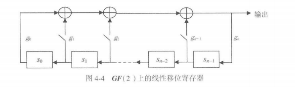

为了把电路结构转化为代数对象，我们可以引入连接多项式

$$
g(x)=g_0+g_1x+\cdots+g_{n-1}x^{n-1}+g_nx^n。
$$

通常取

$$
g_0=g_n=1。
$$

$g_n=1$ 保证多项式次数为 $n$，$g_0=1$ 使反馈链首端参与约束。连接多项式和线性移位寄存器一一对应：给定多项式，就能确定哪些寄存器接入异或反馈；给定反馈连线，也能写出对应多项式。

#### 周期、最大周期与 m 序列

**线性移位寄存器输出序列的性质由连接多项式决定。**

一个 $n$ 级二元线性移位寄存器共有 $2^n$ 种状态。全零状态会保持为全零状态，所以有意义的循环主要来自其余 $2^n-1$ 个非零状态。由此，二元 $n$ 级线性移位寄存器的有效最大周期是

$$
2^n-1。
$$

当输出序列达到这个最大周期时，称为 m 序列，即最大长度序列。

==m 序列具有三类典型随机性。==

**第一类是均衡性**。在一个周期内，1 的个数为

$$
2^{n-1},
$$

0 的个数为

$$
2^{n-1}-1。
$$

由于周期长度是奇数 $2^n-1$，**所以 0 和 1 的数量接近相等**。

**第二类是游程分布**。把连续出现的若干个 0 或若干个 1 称为一个游程。一个周期中，游程总数为 $2^{n-1}$。长度为 $i$ 的 0 游程和 1 游程各有

$$
2^{n-i-2}\quad(1\le i\le n-2)
$$

个，另外还有一个长度为 $n-1$ 的 0 游程和一个长度为 $n$ 的 1 游程。这个分布说明短游程多、长游程少，符合随机序列的常见统计规律。

**第三类是自相关性**。周期序列与自身平移 $\tau$ 位后作比较，归一化自相关函数达到两值形式：

$$
C(\tau)=
\begin{cases}
1, & \tau=0,\\
-\dfrac{1}{2^n-1}, & 0<\tau\le 2^n-2。
\end{cases}
$$

这表示零位移时完全重合，其他位移时相关性接近 0。对通信、雷达和扩频场景而言，这种性质很有价值。

#### 本原多项式与 m 序列的关系

接下来我们把“怎样选连接多项式”转化为“怎样选本原多项式”。设 $f(x)$ 是 $GF(2)$ 上的 $n$ 次多项式。使

$$
f(x)\mid x^p-1
$$

成立的最小正整数 $p$ 称为 $f(x)$ 的周期。$GF(2)$ 中加法按模 2 计算，所以 $x^p-1$ 与 $x^p+1$ 在运算中等价。

当 $f(x)$ 的次数为 $n$，并且周期

$$
p=2^n-1
$$

时，称 $f(x)$ 为本原多项式。核心定理是：当且仅当二元线性移位寄存器的连接多项式是 GF(2) 上的本原多项式时，它的非零输出序列是 m 序列。

> 这个定理把电路设计问题转化成多项式选择问题。设计者先找一个 $n$ 次本原多项式，再按多项式的系数接好反馈支路，就能得到最大周期序列。

#### 例 4-2：$g(x)=x^4+x+1$

例 4-2 选取

$$
g(x)=x^4+x+1。
$$

这是 $GF(2)$ 上的 4 次多项式。下面我们将通过检验它整除 $x^{15}-1$，并且对 $x^i-1\ (i=1,2,\cdots,14)$ 均达成周期条件筛查，说明它的周期为

$$
p=15=2^4-1。
$$

所以 $g(x)$ 是本原多项式。以它作为连接多项式构造 4 级线性移位寄存器，并取初始状态

$$
(s_0,s_1,s_2,s_3)=(0,0,0,1)，
$$

输出序列为

$$
001101011110001。
$$

第 16 个时刻状态恢复到初始状态，说明周期为 15。由于 15 已经达到 $2^4-1$，这段输出就是 m 序列的一个周期。

#### 线性移位寄存器作为序列密码的安全问题

m 序列有良好的统计随机性，直接用单个线性移位寄存器生成密钥流仍然会产生安全风险。原因在于它的状态更新是线性的，线性结构可由足够长的已知密钥流恢复。

设状态向量为

$$
S=(s_0,s_1,\cdots,s_{n-1})^T。
$$

教材采用如下状态转移形式：

$$
\begin{cases}
s'_0=s_1,\\
s'_1=s_2,\\
\cdots\\
s'_{n-2}=s_{n-1},\\
s'_{n-1}=g_0s_0+g_1s_1+\cdots+g_{n-1}s_{n-1}。
\end{cases}
$$

写成矩阵形式就是

$$
S'=HS\pmod 2，
$$

其中

$$
H=
\begin{pmatrix}
0&1&0&\cdots&0\\
0&0&1&\cdots&0\\
0&0&0&\cdots&0\\
\vdots&\vdots&\vdots&\ddots&\vdots\\
0&0&0&\cdots&1\\
g_0&g_1&g_2&\cdots&g_{n-1}
\end{pmatrix}。
$$

矩阵 $H$ 称为连接多项式 $g(x)$ 的伴随矩阵。它完全刻画线性移位寄存器的状态转移。

在序列密码中，明文、密文、密钥流满足

$$
c_i=m_i\oplus k_i。
$$

掌握连续 $2n$ 位明文和密文时，可以得到连续 $2n$ 位密钥流

$$
k_i=m_i\oplus c_i。
$$

再构造长度为 $n$ 的连续状态窗口：

$$
S_1=(k_1,k_2,\cdots,k_n)^T,
$$

一直到

$$
S_{n+1}=(k_{n+1},k_{n+2},\cdots,k_{2n})^T。
$$

把前 $n$ 个状态组成矩阵

$$
X=[S_1,S_2,\cdots,S_n],
$$

把后移一位的状态组成矩阵

$$
Y=[S_2,S_3,\cdots,S_{n+1}]。
$$

由状态转移方程可得

$$
Y=HX\pmod 2。
$$

当 $X$ 可逆时，直接求出

$$
H=YX^{-1}\pmod 2。
$$

矩阵 $H$ 一旦恢复，反馈系数 $g_0,g_1,\cdots,g_{n-1}$ 也随之恢复，连接多项式和寄存器结构就被确定。求逆复杂度为 $O(n^3)$，教材指出这属于多项式复杂度；即使 $n=1000$，在普通计算条件下也可完成。

这说明 m 序列的统计随机性和密码安全性属于两个层面的性质。m 序列在分布、游程、自相关上表现良好，同时线性递推结构也会暴露可恢复的代数关系。因此实际序列密码通常会组合多个 LFSR、加入非线性函数，或采用更复杂的状态更新机制。

#### 推广到 $GF(q)$

> 最后，我们把二元域 $GF(2)$ 的理论推广到 $GF(q)$，其中 $q$ 是某个素数的正整数幂。

此时每个寄存器保存 $GF(q)$ 中的元素，反馈函数是 $GF(q)$ 上的线性函数，连接多项式也定义在 $GF(q)$ 上。

设 $f(x)$ 是 GF(q) 上的 $n$ 次多项式。其中，可以使

$$
f(x)\mid x^p-1
$$

成立的最小正整数 $p$ 仍称为 $f(x)$ 的周期。当

$$
p=q^n-1
$$

时，$f(x)$ 称为 GF(q) 上的 **本原多项式**。相应地，当线性移位寄存器的连接多项式是 GF(q) 上的本原多项式时，它输出的非零序列就是 GF(q) 上的 m 序列，周期达到

$$
q^n-1。
$$

!!! example

	例 4-3 使用
	
	$$
	q=2^{31}-1。
	$$
	
	由于 $2^{31}-1$ 是素数，GF($2^{31}-1$) 是一个有限域。教材给出的 16 次多项式
	
	$$
	p(x)=x^{16}-2^{15}x^{15}-2^{17}x^{13}-2^{21}x^{10}-2^{20}x^4-(2^8+1)
	$$
	
	是 GF($2^{31}-1$) 上的本原多项式。它对应的 LFSR 周期为
	
	$$
	(2^{31}-1)^{16}-1\approx 2^{496}。
	$$
	
	这正是祖冲之密码 ZUC 中使用的本原多项式背景。


### 4.4 非线性序列

既然线性是 LFSR 的根本弱点，改进方向自然就是非线性化。教材这里列出了三条常见路线：

- 使用非线性移位寄存器
- 对一个或多个 LFSR 输出做非线性组合
- 以及借助强分组密码生成密钥流。

> 这三条路线的考虑差不多，都是保留“长周期、易实现”的优点，同时用非线性打断攻击者建立线性方程组的能力。现代序列密码设计基本都离不开这一思路。

这里可以把“非线性”理解成对攻击者建立简单方程模型的一次阻断。若多个寄存器输出先经过非线性组合函数，再进入最终密钥流，攻击者即使知道大量明密文，也很难直接列出可求解的线性方程组。


### 4.5 祖冲之密码


#### 4.5.1 祖冲之密码的算法结构


#### 4.5.2 基于祖冲之密码的机密性算法 128-EEA3


#### 4.5.3 基于祖冲之密码的完整性算法 128-EIA3


#### 4.5.4 示例


## 第5章 密码学 Hash 函数

> 前面几章主要解决机密性问题，第 5 章开始把视线转向完整性、认证和摘要。Hash 函数不负责解密，它负责把任意长输入压缩成固定长度摘要，并让这种压缩尽可能难以被反向伪造。


### 5.1 密码学 Hash 函数的概念

密码学 Hash 函数把 **任意长消息 $M$ 映射成定长摘要 $h$**：

$$
h = H(M).
$$

> 因为Hash码是所有数据位的函数，所以 Hash 码也称为数据指纹和数据摘要，我感觉这个说法挺形象的。

!!! important


	**Hash 的输出长度固定，输入空间通常远大于输出空间，因此碰撞一定存在。**
	
	密码学要求的是，攻击者很难把这种“数学上一定存在”转成“工程上可利用”。

Hash 函数最先要解决的是完整性检测：只要消息哪怕改动一位，摘要就会显著变化。后面数字签名、消息认证码、口令存储、区块链 Merkle 树，都会把这个性质拿去做更复杂的构件。


### 5.2 *密码学 Hash 函数的安全性

本节讨论的是密码学 Hash 函数在安全协议中应具备的基本性质。Hash 函数把任意长度消息压缩成固定长度摘要，安全性主要体现在四个方面：从摘要反推原文困难，围绕指定消息伪造同摘要消息困难，任意构造一对同摘要消息困难，输出结果接近随机分布。

==1. 单向性==

> $y=f(x)$，已知y的时候很难算出来x是几

设 $h=H(x)$。单向性要求：给定摘要 $h$，求出某个 $x$ 使 $H(x)=h$，在计算上应当极其困难。这样的 $x$ 称为 $h$ 的原像；通过 $h$ 反求 $x$ 的行为称为原像攻击。

教材用 A、B 共享秘密 $S$ 的通信说明这一点：

$$
A\rightarrow B: \langle M \| H(M\|S)\rangle
$$

B 收到 $M$ 后，用 $M$ 和自己保存的 $S$ 重新计算 $H(M\|S)$，再与收到的摘要比较。二者一致时，B 认为 $M$ 具有真实性和完整性。

安全的关键在于攻击者看到 $M$ 和 $H(M\|S)$ 后，仍然难以从这些信息中反推出 $M\|S$，也就难以得到秘密 $S$。单向性失效时，攻击者可以由 $H(M\|S)$ 反推出 $M\|S$，进而获得 $S$，随后伪造带有合法摘要的数据。

当 Hash 输出长度为 $n$ 位且近似均匀分布时，暴力寻找原像的平均工作量约为 $2^n$ 量级。$n$ 足够大时，原像攻击的成功概率会被压低到可接受范围。

==2. 弱抗碰撞性==

> $y=f(x)$，已知y的时候很难试出来x是几

弱抗碰撞性又称第二原像抗性。给定一个具体数据 $x$，寻找另一个数据 $y$，使 $y\neq x$ 且 $H(y)=H(x)$，在计算上应当极其困难。这里的 $y$ 称为 $x$ 的第二原像；这种攻击称为第二原像攻击。

教材中的通信形式为：

$$
A\rightarrow B: \langle M \| E(H(M),K)\rangle
$$

A 与 B 共享密钥 $K$，A 发送消息 $M$ 以及用密钥加密后的摘要。B 解密得到 $H(M)$，再对收到的 $M$ 重新计算摘要，并进行比较。

弱抗碰撞性保护的是“指定消息替换”场景。攻击者拿到合法消息 $M$ 及其加密摘要后，若能找到 $M'$ 满足 $H(M')=H(M)$，就可以用 $M'$ 替换 $M$。接收方解密得到的仍是 $H(M)$，重新计算得到的也是 $H(M')$，二者相等，伪造消息会通过检查。

从穷举角度看，针对一个固定 $x$ 找第二原像，复杂度通常也是 $2^n$ 量级。

==3. 强抗碰撞性与生日攻击==

强抗碰撞性要求：找到任意一组 $(x,y)$，满足 $x\neq y$ 且 $H(x)=H(y)$，在计算上应当极其困难。它关注的是任意两条数据之间产生同一摘要的情况，也就是碰撞构造能力。

这里会引出生日攻击的思想。先看生日问题：固定某一天作为你的生日，要使屋子里至少有一个人与该生日相同，概率超过 $1/2$ 时大约需要 $253$ 人。原因是每个人都要撞上同一个固定日期，成功空间较小。

接着看另一种问题：屋子里任意两个人生日相同的概率超过 $1/2$ 时，约需 $23$ 人。原因是比较对象变成了人群内部的两两组合。人数为 $N$ 时，比较次数约为 $N(N-1)/2$，增长速度明显高于人数本身。

对 $n$ 位 Hash 输出，摘要空间大小为 $2^n$。设摘要空间大小为 $N$，尝试 $k$ 个输入后，各次摘要均互异的概率近似为：

$$
\Pr(X>k)\approx e^{-\frac{k(k-1)}{2N}}
$$

因此，出现至少一次碰撞的概率约为：

$$
1-e^{-\frac{k(k-1)}{2N}}
$$

当该概率接近 $1/2$ 时，所需尝试次数约为 $1.177\sqrt{N}$。代入 $N=2^n$，得到强碰撞攻击所需数量级约为：

$$
2^{n/2}
$$

这说明 $n$ 位 Hash 的强碰撞安全强度约为 $n/2$ 位。为了达到约 $128$ 位碰撞安全强度，工程中常采用 $256$ 位摘要长度。教材也提到 SM3 输出为 $256$ 位，SHA-3 支持 $224$、$256$、$384$、$512$ 位等不同摘要长度。

==4. 随机性==

随着 Hash 函数在密钥生成和随机数生成中的应用增多，仅考虑前三类抗攻击性质还显得有限，因此还需要关注随机性。

随机性要求 Hash 输出具备统计上的均匀性和难预测性。理想状态下，输出中的 $0$ 和 $1$ 频率应接近，游程长度、比特分布等统计指标也应接近随机序列。实践中可以通过国家密码管理局发布的随机性测试规范进行检验，也可以参考 NIST 的随机性测试标准。


### 5.3 *密码学 Hash 函数的一般结构

密码学 Hash 函数要把任意长度的数据变成固定长度的 Hash 码。由于输入长度可以很长，输出长度却固定，算法结构中通常会设置一个压缩函数，把长消息拆成分组，再通过多轮迭代逐步压缩成最终摘要。

==Merkle 提出的迭代型总体结构==

设输入消息为 $M$，先把它划分为 $L$ 个分组：

$$
M_0,M_1,\ldots,M_{L-1}
$$

每个分组长度为 $b$ 位。最后一个分组长度未满 $b$ 位时，先补齐到 $b$ 位，再追加一个表示原始输入总长度的分组。长度信息进入输入后，攻击者若想构造同摘要消息，就要同时处理消息内容和长度条件，攻击难度会提高。

整个迭代过程可以写成：

$$
\begin{cases}
CV_0=IV \\
CV_i=f(CV_{i-1},M_{i-1}),\quad 1\le i\le L \\
H(M)=CV_L
\end{cases}
$$

其中，$IV$ 是初始值，$CV_i$ 是第 $i$ 轮之后得到的链接变量，$f$ 是压缩函数，$M_{i-1}$ 是当前输入分组。压缩函数每次接收上一轮的 $n$ 位中间结果和当前 $b$ 位消息分组，输出新的 $n$ 位中间结果。通常 $b>n$，所以它完成的是压缩操作。

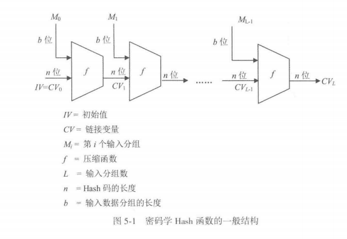

从图 5-1 可以看出，消息分组依次进入同一个压缩函数。第一轮输入 $IV$ 和 $M_0$，得到 $CV_1$；第二轮输入 $CV_1$ 和 $M_1$，得到 $CV_2$；如此推进到最后一轮，最终的 $CV_L$ 就是消息 $M$ 的 Hash 值。

这一结构可以理解为两层迭代。外层按分组顺序处理整条消息，内层由压缩函数对每个分组进行运算。Hash 函数的整体安全性在很大程度上依赖压缩函数。研究表明，压缩函数具备抗碰撞能力时，基于该结构构造出的 Hash 函数通常也能获得抗碰撞能力。这个方向上的安全性传递，使压缩函数的抗碰撞设计成为整个结构的核心。

==压缩函数迭代型 Hash 函数==

第一类是直接围绕压缩函数构造的 Hash 函数。压缩函数由若干线性函数和非线性函数组成。由于单个压缩函数结构相对简单，为获得安全性，算法会对一个消息分组进行多轮处理，再把处理结果传递到下一分组。

这类结构的突出优势是处理速度较快，在实际应用中使用广泛。我国 SM3 和美国 NIST 标准中的 SHA-1、SHA-2 都属于这一类。

==基于对称密码的 Hash 函数==

第二类是借助对称密码算法构造 Hash 函数。由于分组密码和其他对称密码算法发展较成熟，研究者可以把对称密码中的加密结构改造成 Hash 函数中的压缩函数。

这类方法的代表包括基于分组密码的 Whirlpool，以及基于俄罗斯标准分组密码设计的 GOST R34.11-94。ANSI 和 ISO 也给出过基于分组密码的 Hash 函数标准。

这种类型的安全性和处理速度取决于所采用的对称密码。实际使用中，它的数据处理速度通常低于基本压缩函数迭代型方案，并且分组密码的分组长度和目标 Hash 码长度之间可能存在适配问题。

==基于数学困难问题的 Hash 函数==

第三类是基于数学困难问题构造的 Hash 函数。密码学中常见的困难问题包括大整数分解、离散对数、背包问题、纠错码解码、多变量二次方程组求解等。这些问题已经被用于设计 RSA、ElGamal、背包密码、McEliece 密码、MQ 密码等公钥密码体制，也可以进一步用于 Hash 函数设计。

这类 Hash 函数通常把困难问题对应的运算构造成压缩函数。输入数据分组进入算法后，经迭代压缩，最后得到 Hash 码。例如，基于矩阵生成 $66$ 中基于多变量二次方程组求解问题的设计，就是此类思路的一种体现。

它的主要优势是安全性基础较明确，Hash 码长度也比较容易调整；主要代价是处理效率较低，工程实现相对复杂。因此，这类方案目前仍以研究为主，实际应用较少。


### 5.4 中国商用密码杂凑算法 SM3


### 5.5 美国密码 Hash 函数算法 SHA-3


#### 5.5.1 海绵结构


#### 5.5.2 SHA-3


## 第6章 公开密钥密码

> 前面对称密码已经足够擅长保护数据本身，但它始终绕不过一个老问题：双方怎样先安全地共享密钥。第 6 章正是在这个矛盾点上进入公开密钥密码。


### 6.1 公开密钥密码的基本概念


#### 6.1.1 公开密钥密码的基本思想

传统密码要求通信双方预先共享同一把密钥，用户数一旦增大，密钥的产生、存储、分配、管理和频繁更换都会变得极其复杂。正是在这个背景下引出公开密钥密码：

把传统密码的密钥 $K$ 一分为二，分成公开的加密钥 $K_e$ 和保密的解密钥 $K_d$，用 $K_e$ 控制加密，用 $K_d$ 控制解密，并且依靠计算复杂性保证由 $K_e$ 在计算上难以推出 $K_d$。这样一来，$K_e$ 可以公开，$K_d$ 只由用户自己掌握，传统密码在密钥分配上的主要障碍就被显著缓解了。

一个公开密钥密码至少要满足三个条件。

**第一，解密算法 $D$ 与加密算法 $E$ 互逆，** 也就是对任意明文 $M$ 都有

$$
D(E(M,K_e),K_d)=M.
$$

**第二，在计算上难以由公开的 $K_e$ 推出保密的 $K_d$**。

**第三，$E$ 和 $D$ 都应当是高效算法**。

> 第一个条件保证密码体制成立，第二个条件提供安全基础，第三个条件保证密码能够实际使用。

接着又加入 **第四个条件，用来处理数据真实性**。若对任意明文 $M$ 都有

$$
E(D(M,K_d),K_e)=M,
$$

那么公开密钥密码还可以确保数据真实性。若前面三个条件和这一条件同时成立，就能够同时确保数据的秘密性和真实性。

利用公开密钥密码进行保密通信，需要建立密钥管理中心 KMC（Key Management Center），并把各用户的姓名、地址和公开加密钥登记到共享的公钥数据库 PKDB（Public Key Database）中。KMC 负责密钥管理，并且对用户可信。这样一来，用户查询他人公钥就像查询电话号码一样方便，公开密钥密码也因此特别适合计算机网络应用。


#### 6.1.2 公开密钥密码的基本工作方式

本节中，我们约定：$M$ 为明文，$C$ 为密文，$E$ 为加密算法，$D$ 为解密算法，$K_e$ 为公开加密钥，$K_d$ 为保密解密钥，每个用户都拥有一对密钥，所有用户的公开加密钥都存入共享的 PKDB。

接下来我们围绕“A 把消息安全传给 B”给出三种基本通信协议。

**第一种协议只处理秘密性**。

A 先查 PKDB 得到 B 的公开加密钥，再计算

$$
C=E(M,K_{eB}),
$$

然后把密文 $C$ 发给 B。B 收到后，用自己的保密解密钥恢复明文：

$$
M=D(C,K_{dB}).
$$

> 这个协议能保证秘密性，因为只有 B 掌握 $K_{dB}$。不过，任何人都能查到 $K_{eB}$ 并构造一段密文发给 B，因此这一协议还不能保证数据真实性。

**第二种协议只处理真实性**。

A 用自己的保密解密钥对消息作变换，得到密文

$$
C=D(M,K_{dA}),
$$

再把 $C$ 发给 B。B 查到 A 的公开加密钥以后，计算

$$
M=E(C,K_{eA}).
$$

>  只有 A 掌握 $K_{dA}$，因此只有 A 才能正确完成发方操作，B 据此可以确认消息确实出自 A。不过，由于 A 的公开加密钥同样存放在共享的 PKDB 中，其他人也能恢复消息，所以这个协议只保证真实性。

**第三种协议把前两种协议结合起来，同时处理秘密性和真实性**。

A 先用自己的保密解密钥处理明文，得到中间密文

$$
S=D(M,K_{dA}),
$$

再查到 B 的公开加密钥，计算最终密文

$$
C=E(S,K_{eB}).
$$

B 收到 $C$ 后，先用自己的保密解密钥求出中间密文

$$
S=D(C,K_{dB}),
$$

再用 A 的公开加密钥恢复明文

$$
M=E(S,K_{eA}).
$$

> 真实性来自 A 对 $S$ 的生成，秘密性来自 B 对 $C$ 的解开。只要把每一步所依赖的密钥归属分清，这三种工作方式就会非常清楚。

!!! note


```
1. 只保证秘密性
   A: C = E(M, K_eB)
   B: M = D(C, K_dB)

2. 只保证真实性
   A: C = D(M, K_dA)
   B: M = E(C, K_eA)

3. 同时保证秘密性和真实性
   A: S = D(M, K_dA)
      C = E(S, K_eB)
   B: S = D(C, K_dB)
      M = E(S, K_eA)
```


### 6.2 RSA 密码


#### 6.2.1 RSA 加解密算法


#### 6.2.2 RSA密码的安全性

课本把 RSA 的安全性直接压回到大整数因子分解困难性上。攻击者若截获密文 $C$，并想从

$$
C \equiv M^e \pmod n
$$

求出明文 $M$，就需要先得到私钥指数 $d$。而为了求 $d$，又要先知道 $\varphi(n)$，因为

$$
ed \equiv 1 \pmod{\varphi(n)}.
$$

接着，若想得到 $\varphi(n)$，又必须先求出 $p$ 和 $q$，因为

$$
\varphi(n)=(p-1)(q-1),\qquad n=pq.
$$

这样一来，攻击路径就被教材明确写成一条链：


```
截获密文 C
-> 想求明文 M
-> 先要求私钥指数 d
-> 先要求 φ(n)
-> 先要求 p, q
-> 先分解 n
```

课本据此得出一个非常重要的判断：只要能够对 $n$ 做因子分解，就可以攻破 RSA，因此破译 RSA 的困难性小于或等于对 $n$ 进行因子分解的困难性。教材同时也保持了严格表述：目前还不能证明这两者精确相等，因为现有知识无法排除其他更简捷的破译途径。

课本随后用大整数分解进展提醒读者，RSA 的安全裕度会随着计算能力和分解算法进展而变化。教材列举了 RSA-129、RSA-140、RSA-240 和 RSA-250 等一系列被成功分解的实例，并据此给出参数建议：一般应用中 $n$ 至少取 1024 位，重要应用中最好取 2048 位。教材把这一段放在安全性分析后面，是为了让读者真正意识到，RSA 的安全讨论始终和世界范围内的大整数分解能力绑定在一起。

`insight：` 这一小节最核心的学习动作，是把“公式正确”与“参数足够大”同时放在眼前。RSA 的数论结构解释了算法为何可逆，大整数分解的现实进展则决定这套结构还能支撑多高的安全等级。


#### 6.2.3 RSA 的应用

RSA 广泛用于传输会话密钥、数字签名和证书体系。教材还特意讲了硬件实现，是为了说明公钥密码一旦进入真实系统，瓶颈往往不在公式定义，而在大数运算速度、随机素数产生和抗侧信道实现。

现实系统里，RSA 更常见的角色是“保护短秘密”，例如会话密钥、证书请求或签名摘要，而很少直接承担大文件加密。原因很直接：模幂运算代价高，且对消息格式有严格约束。于是教材后面把它和证书、签名、混合加密一起讲，顺序就很自然了。


### 6.3 ElGamal 密码


#### 6.3.1 离散对数问题

ElGamal 建立在有限域离散对数困难性上。若给定素数 $p$、本原元 $\alpha$ 和 $y\equiv \alpha^x\pmod p$，从 $x$ 算 $y$ 很容易，但从 $y$ 反推 $x$ 很难。这种“正向易算、逆向困难”的单向性，正是公钥密码最需要的资源。


#### 6.3.2 ElGamal 密码

ElGamal 的密钥生成很清楚：用户选私钥 $d$，公开

$$
y \equiv \alpha^d \pmod p.
$$

加密时再随机选一个一次性随机数 $k$，输出两部分密文

$$
c_1=\alpha^k \bmod p,\qquad c_2=M\cdot y^k \bmod p.
$$

解密者利用自己的私钥把随机掩码去掉，恢复明文。这里最该注意的是随机数 $k$。若它复用或泄露，系统会迅速失去安全性。教材反复提这一点，是因为很多公开密钥方案的安全都依赖“一次性随机量”。


#### 6.3.3 实现技术

ElGamal 的实现难点和 RSA 很像，都集中在大数模乘、模幂以及高质量随机数产生上。对学习者而言，这一节的作用是提醒：公开密钥密码真正落地时，最花资源的部分往往落在支撑公式高效可靠执行的基础运算上。


#### 6.3.4 ElGamal 密码的应用

ElGamal 除了能做加密，也自然导向了后面的数字签名体制。许多签名算法都围绕已有公开密钥结构展开，通过改造让私钥在消息上留下可验证痕迹。


### 6.4 椭圆曲线密码


#### 6.4.1 椭圆曲线

本节围绕椭圆曲线密码体制展开。前面的 ElGamal 建立在有限域乘法群上的离散对数难题之上，椭圆曲线密码体制则把底层群换成椭圆曲线点集上的加法群。密码安全性来自椭圆曲线离散对数问题：给定曲线上的点 $G$ 和 $Q=nG$，从 $G,Q$ 反推出整数 $n$ 在计算上十分困难。

==椭圆曲线的基本对象==

本节讨论的椭圆曲线定义在有限域上，主要分为两类：

- 定义在素域 $GF(p)$ 上的椭圆曲线，

- 定义在二进制扩域 $GF(2^m)$ 上的椭圆曲线。

> 再次回顾一下，$GF(p)$ 中的元素可以理解为模素数 $p$ 的剩余类；$GF(2^m)$ 中的元素通常用 $m$ 位二进制向量、多项式形式或生成元幂形式表示。

椭圆曲线密码关注的核心对象是曲线上的解点。一个点通常写作 $P=(x,y)$，其中 $x,y$ 都来自相应有限域。把所有解点连同一个特殊点 $O$ 放在一起，并给它们定义加法运算，便得到一个加法交换群。

> 密码算法中的“乘法” $nG$ 实际上指点 $G$ 连续相加 $n$ 次。

==$GF(p)$ 上的椭圆曲线==

当 $p$ 是大于 3 的素数，且

$$
4a^3+27b^2 \neq 0 \pmod p,
$$

曲线

$$
y^2=x^3+ax+b,\quad a,b\in GF(p)
$$

称为 $GF(p)$ 上的椭圆曲线。条件 $4a^3+27b^2\neq 0\pmod p$ 用来保证曲线具有良好的代数结构，点加法运算可以稳定构成群。

在有限域中，解点来自同余方程

$$
y^2\equiv x^3+ax+b\pmod p.
$$

求点时可以枚举每个 $x\in GF(p)$，计算右侧值 $r=x^3+ax+b\pmod p$，再查找满足 $y^2\equiv r\pmod p$ 的 $y$。当 $r$ 是模 $p$ 的平方剩余时，对应两个 $y$；当 $r=0$ 时，对应一个 $y=0$；其余情形对应该 $x$ 下的解集合为空。

---

> 这一段实际在回答三个问题：曲线方程长什么样，为什么要加上判别条件，以及怎样在有限域里找出曲线上的点。

从符号开始。$GF(p)$ 表示含有 $p$ 个元素的有限域。这里的 $p$ 是大于 3 的素数，$GF(p)$ 可以直接理解成模 $p$ 运算下的集合

$$
GF(p)=\{0,1,2,\ldots,p-1\}.
$$

在这个集合里，加法、减法、乘法都要对 $p$ 取模。除法也在这个体系内完成，$\frac{u}{v}$ 的含义是 $u\cdot v^{-1}\pmod p$，其中 $v^{-1}$ 是 $v$ 在模 $p$ 意义下的乘法逆元。

在 $GF(p)$ 上讨论椭圆曲线时，常用的曲线方程是

$$
y^2=x^3+ax+b,
\quad a,b\in GF(p).
$$

这条式子在有限域里表示一个同余方程，点集呈离散形式：

$$
y^2\equiv x^3+ax+b\pmod p.
$$

曲线上的点就是所有满足这个同余方程的有序对 $(x,y)$。

> 这里 $x$ 和 $y$ 都取自 $GF(p)$，也就是都可以写成 $0$ 到 $p-1$ 之间的一个数。

接着看条件

$$
4a^3+27b^2\neq 0\pmod p.
$$

这个条件的作用，是保证方程右侧的三次多项式

$$
f(x)=x^3+ax+b
$$

具有良好的根结构，使曲线成为一条适合定义点加法的椭圆曲线。更精确地说，曲线要具备光滑性。光滑性可以从代数条件理解：曲线上任一点处都能形成明确的切线结构，点加法中的“过两点作直线”“在一点作切线”才有明确含义。

**接下来对条件做一下分析**。我们把方程写成

$$
F(x,y)=y^2-x^3-ax-b=0.
$$

某个点成为奇异点时，要同时满足

$$
F(x,y)=0,
\quad
\frac{\partial F}{\partial x}=0,
\quad
\frac{\partial F}{\partial y}=0.
$$

其中

$$
\frac{\partial F}{\partial x}=-3x^2-a,
\quad
\frac{\partial F}{\partial y}=2y.
$$

由于 $p>3$，$2$ 和 $3$ 在 $GF(p)$ 中都有乘法逆元（下面会对这里做介绍）。

于是

$$
\begin{align}
\frac{\partial F}{\partial y}=0&\Rightarrow y=0\\
\frac{\partial F}{\partial x}=0&\Rightarrow 3x^2+a=0
\end{align}
$$

再带入原方程

$$
y^2=x^3+ax+b,
$$

可以得到如下：

$$
x^3+ax+b=0.
$$

这表明，奇异点出现时，三次多项式 $x^3+ax+b$ 会与它的导数 $3x^2+a$ 共享同一个根。

然后呢，三次多项式一旦与导数共享根，就说明它存在重根。对于 $x^3+ax+b$ 这种形式，重根出现的判别条件正好对应

$$
4a^3+27b^2\equiv 0\pmod p.
$$

所以教材为了排除重根的情形，提出此要求

$$
4a^3+27b^2\neq 0\pmod p.
$$

这条要求排除了重根情形，使曲线点集具备构造加法交换群所需的代数基础。后面定义的点加、倍点、逆元、无穷远点，都建立在这一点之上。

**再看怎样求曲线上的点**。由于 $GF(p)$ 只有 $p$ 个元素，可以把每个 $x$ 逐一代入。对某个固定的 $x$，先计算

$$
r=x^3+ax+b\pmod p.
$$

于是方程变成了

$$
y^2\equiv r\pmod p.
$$

此时问题转化为：在 $GF(p)$ 中找平方等于 $r$ 的 $y$。这里要用到“模 $p$ 平方剩余”。

> 把 $GF(p)$ 中每个元素平方后取模，能够得到的那些数称为模 $p$ 的平方剩余。

!!! example

	例如在 $GF(11)$ 中，逐一平方得到
	
	$$
	0^2\equiv0,
	1^2\equiv1,
	2^2\equiv4,
	3^2\equiv9,
	4^2\equiv5,
	5^2\equiv3,
	6^2\equiv3,
	7^2\equiv5,
	8^2\equiv9,
	9^2\equiv4,
	10^2\equiv1
	\pmod{11}.
	$$
	
	由此得到模 11 的平方剩余集合
	
	$$
	\{0,1,3,4,5,9\}.
	$$

于是对固定 $x$ 计算出的 $r$，会出现三种情况。

- 当 $r=0$ 时，方程 $y^2\equiv0\pmod p$ 的解为 $y=0$，该 $x$ 对应一个曲线点。

- 当 $r$ 是非零平方剩余时，方程 $y^2\equiv r\pmod p$ 有两个解。原因是若 $y^2\equiv r\pmod p$，则 $(p-y)^2\equiv y^2\equiv r\pmod p$。这两个纵坐标互为加法逆元，对应曲线上同一横坐标下的两个点。

- 当 $r$ 属于剩余集合之外的元素时，方程 $y^2\equiv r\pmod p$ 在 $GF(p)$ 中无解，该 $x$ 贡献零个曲线点。

!!! note

	**由于 $p>3$，$2$ 和 $3$ 在 $GF(p)$ 中都有乘法逆元**
	
	这里的关键在于：当 $p$ 是素数时，$GF(p)$ 可以看成模 $p$ 运算下的集合
	
	$$
	\{0,1,2,\ldots,p-1\}.
	$$
	
	在这个集合里，一个元素 $a$ 能做除数，等价于存在某个元素 $a^{-1}$，使得
	
	$$
	a\cdot a^{-1}\equiv 1\pmod p.
	$$
	
	这就是乘法逆元的定义。
	
	为什么 $2$ 和 $3$ 一定有逆元，要看它们和 $p$ 的最大公约数。整数模 $p$ 中，元素 $a$ 有乘法逆元的充要条件是
	
	$$
	\gcd(a,p)=1.
	$$
	
	由于 $p>3$ 且 $p$ 是素数，$p$ 的可能取值从 $5,7,11,13,\ldots$ 开始。因此 $p$ 与 $2$ 的最大公约数为 $1$，与 $3$ 的最大公约数也为 $1$：
	
	$$
	\gcd(2,p)=1,
	\qquad
	\gcd(3,p)=1.
	$$
	
	根据贝祖定理，若 $\gcd(a,p)=1$，则存在整数 $u,v$，使得
	
	$$
	au+pv=1.
	$$
	
	把这个式子放到模 $p$ 意义下，含有 $p$ 的那一项会变成 $0$：
	
	$$
	au+pv\equiv au\equiv 1\pmod p.
	$$
	
	**于是 $u$ 就是 $a$ 在 $GF(p)$ 中的乘法逆元。**
	
	把 $a=2$ 代入，可知存在 $u$ 使得
	
	$$
	2u\equiv 1\pmod p,
	$$
	
	所以 $2^{-1}$ 存在。把 $a=3$ 代入，可知存在 $u$ 使得
	
	$$
	3u\equiv 1\pmod p,
	$$
	
	所以 $3^{-1}$ 也存在。
	
	---
	
	用一个具体例子看会更直接。取 $p=11$，在 $GF(11)$ 中有
	
	$$
	2\cdot6=12\equiv1\pmod{11},
	$$
	
	所以
	
	$$
	2^{-1}\equiv6\pmod{11}.
	$$
	
	同时
	
	$$
	3\cdot4=12\equiv1\pmod{11},
	$$
	
	所以
	
	$$
	3^{-1}\equiv4\pmod{11}.
	$$
	
	这就是教材中强调 $p>3$ 的原因。后面求偏导时会出现 $2y$ 和 $3x^2$，进一步推导时可能需要除以 $2$ 或 $3$。只有 $2$ 和 $3$ 在域中有乘法逆元，这些除法运算才有明确含义。


==$GF(p)$ 上的点加法==

为了让曲线点形成群，需要加入无穷远点 $O$。它是加法单位元，满足

$$
O+O=O,\qquad P+O=O+P=P.
$$

点 $P=(x,y)$ 的逆元是

$$
-P=(x,-y\bmod p).
$$

因此 **同一横坐标下纵坐标互为加法逆元的两个点相加得到 $O$。**

当 $P=(x_1,y_1)$、$Q=(x_2,y_2)$，且 $P\neq Q$ 时，点加结果 $R=P+Q=(x_3,y_3)$ 由下式计算：

$$
\begin{align}
\lambda&=\frac{y_2-y_1}{x_2-x_1},\\
x_3&=\lambda^2−x_1−x_2,\\
y_3&=\lambda(x_1−x_3)−y_1.
\end{align}
$$

这些式子全部在 $GF(p)$ 中计算。分式表示乘以模逆元，例如 $(x_2-x_1)^{-1}\pmod p$。

当 $P=Q$ 时，计算的是倍点 $2P$，斜率改为切线斜率：

$$
\begin{align}
\lambda&=\frac{3x_1^2+a}{2y_1},\\
x_3&=\lambda^2+\lambda+a=x_1^2+\dfrac{b}{x_1^2},\\
y_3&=x_1^2+\lambda x_3+x_3.
\end{align}
$$

> 从几何意义看，在实数曲线上，$P+Q$ 可以理解为连接 $P,Q$ 的直线与曲线交于第三点，再对横轴取对称点；倍点 $2P$ 使用曲线在 $P$ 处的切线。有限域上的点分布是离散的，实际计算完全依靠上面的代数公式。
>
> 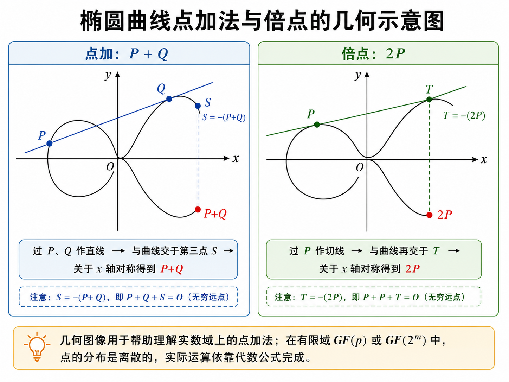

!!! example

	教材例 6-4：$GF(11)$ 上的曲线
	
	教材取
	
	$$
	y^2=x^3+x+6\pmod {11}.
	$$
	
	通过枚举 $x=0,1,\ldots,10$，检查 $x^3+x+6\pmod{11}$ 是否为平方剩余，可以得到全部普通解点：
	
	$$
	\{(2,4),(2,7),(3,5),(3,6),(5,2),(5,9),(7,2),(7,9),(8,3),(8,8),(10,2),(10,9)\}.
	$$
	
	再加入无穷远点 $O$，共 13 个点。13 是素数，所以该点群是循环群，任取除 $O$ 外的点都可以作为生成元。教材取
	
	$$
	G=(2,7).
	$$
	
	例如计算 $2G=(2,7)+(2,7)$ 时，使用倍点公式：
	
	$$
	\lambda=(3\cdot 2^2+1)(2\cdot 7)^{-1}\pmod{11}
	=2\cdot 3^{-1}\pmod{11}=2\cdot4=8.
	$$
	
	于是
	
	$$
	x_3=8^2-2-2\equiv5\pmod{11},
	y_3=8(2−5)−7\equiv2\pmod{11},
	$$
	
	所以
	
	$$
	2G=(5,2).
	$$
	
	继续相加得到 $G,2G,3G,\ldots,12G$，正好遍历全部普通点，并且
	
	$$
	13G=O.
	$$
	
	这说明该例中的点群可以由 $G$ 生成，群阶为 13。

==$GF(2^m)$ 上的椭圆曲线==

二进制扩域上的椭圆曲线采用另一种标准形式。设 $m$ 为正整数，$b\neq0$，曲线为

$$
y^2+xy=x^3+ax^2+b,\quad a,b\in GF(2^m).
$$

与素域情形相同，全部解点加上无穷远点 $O$ 构成加法交换群。二进制域的特殊之处在于特征为 2，加法等价于按位异或，多项式乘法还要对构造扩域的既约多项式取模。

在 $GF(2^m)$ 上，单位元仍为 $O$，满足

$$
O+O=O,\qquad P+O=O+P=P.
$$

点 $R=(x,y)$ 的逆元变成

$$
-R=(x,x+y).
$$

因此 $(x,y)$ 与 $(x,x+y)$ 相加得到 $O$。

当 $P=(x_1,y_1)$、$Q=(x_2,y_2)$，且 $P\neq Q$ 时，点加公式为

$$
\lambda=\frac{y_1+y_2}{x_1+x_2},\\
x_3=\lambda^2+\lambda+x_1+x_2+a,\\
y_3=\lambda(x_1+x_3)+x_3+y_1.
$$

当计算倍点 $2P$ 时，公式为

$$
\lambda=x_1+\frac{y_1}{x_1},\\
x_3=\lambda^2+\lambda+a=x_1^2+\frac{b}{x_1^2},\\
y_3=x_1^2+\lambda x_3+x_3.
$$

这些式子同样全部在 $GF(2^m)$ 内完成。

!!! example

	教材例 6-6：$GF(2^4)$ 上的曲线
	
	教材使用既约多项式
	
	$$
	g(x)=x^4+x+1
	$$
	
	构造 $GF(2^4)$。设生成元为 $\alpha$，每个元素既可以写成 4 位向量，也可以写成多项式形式，还可以写成 $\alpha^i$ 的形式。表 6-6 给出了三种表示之间的对应关系。
	
	例中取
	
	$$
	a=\alpha^3,
	\qquad
	b=\alpha^{14},
	$$
	
	对应曲线
	
	$$
	y^2+xy=x^3+\alpha^3x^2+\alpha^{14}.
	$$
	
	通过枚举得到 21 个普通解点，再加入 $O$，点群共有 22 个元素。教材验证了点 $P_5=(0010,1111)$ 的连续倍点序列：
	
	$$
	P_5,2P_5,3P_5,\ldots,21P_5,22P_5=O.
	$$
	
	这表明 $P_5$ 的阶为 22，所以它是整个点群的生成元。教材同时指出，除 $O$ 外的点中也会出现阶小于群阶的元素，例如 $P_{12}=(1000,0001)$ 的阶为 11。

==点数估计与曲线选择==

小规模有限域可以通过枚举求出曲线上的全部点。实际密码系统中的参数规模很大，直接枚举代价极高，因此需要专门算法计算点数。对于 $GF(p)$ 上的椭圆曲线，若点数为 $N$，教材给出 Hasse 范围：

$$
p+1-2\sqrt p\le N\le p+1+2\sqrt p.
$$

这个范围说明，曲线点数大致围绕 $p+1$ 波动，偏差受 $2\sqrt p$ 控制。曲线点数会影响群阶、生成元阶以及离散对数问题的安全性，所以选曲线时要关注点数结构。

安全的椭圆曲线密码方案需要选取合适曲线。所谓合适，指该曲线构成的密码系统具有足够的安全强度，同时点运算效率较高。教材提到 NIST 推荐过 15 条椭圆曲线，其中包括 5 条素域 $GF(p)$ 上随机选取的曲线、5 条二进制域 $GF(2^m)$ 上随机选取的曲线，以及 5 条二进制域上的 Koblitz 曲线。


#### 6.4.2 椭圆曲线密码

上一节已经说明，曲线上的解点加上无穷远点 $O$ 后，可以形成一个加法交换群。密码算法正是把这个群当作运算空间：选一个基点 $G$，反复做点加得到 $dG$，再把从 $G$ 和 $dG$ 推回 $d$ 的计算难度作为安全基础。

==椭圆曲线解点群上的离散对数问题==

普通 ElGamal 依赖有限域乘法群中的离散对数难题。椭圆曲线密码把群换成椭圆曲线解点群，安全基础随之变成椭圆曲线离散对数问题，记为 ECDLP。

设 $P,Q$ 是椭圆曲线解点群中的点，$t$ 是整数，并满足

$$
Q=tP.
$$

给定 $P$ 和 $t$，计算 $Q=tP$ 很容易；给定 $P$ 和 $Q$，反推出 $t$ 极为困难。这个方向差异构成 ECC 的基础。

在实际密码体制中，常取一个循环子群 $E_1$。当 $E_1$ 的阶是足够大的素数时，ECDLP 的求解成本很高，适合承载公钥密码。ElGamal、Diffie-Hellman 密钥交换、DSA 类签名算法都可以迁移到这个循环子群上，形成相应的椭圆曲线密码方案。

==椭圆曲线密码的公开参数==

SEC 1 标准草案中，一个椭圆曲线密码系统可以用六元组表示：

$$
T=\langle p,a,b,G,n,h\rangle.
$$

- $p$ 确定有限域 $GF(p)$；
- $a,b\in GF(p)$ 确定椭圆曲线 $y^2=x^3+ax+b.$，
- $G$ 是循环子群 $E_1$ 的生成元，也称基点；
- $n$ 是生成元 $G$ 的阶，并且通常取素数；
- $h=|E|/n$ 称为余因子，用来联系整条曲线的点群 $E$ 与所选循环子群 $E_1$。

这组参数属于系统公开信息。用户的安全性来自私钥标量，公开参数本身承担统一运算环境的作用。

==密钥生成==

用户先随机选择一个整数作为私钥：

$$
d\in\{1,2,\ldots,n-1\}.
$$

随后计算公钥点：

$$
Q=dG.
$$

这里 $d$ 是私钥，$Q$ 是公钥。外部人员看到 $G$ 和 $Q$，要恢复 $d$，就会遇到 ECDLP。用户本人掌握 $d$，可以参与解密、签名或共享密钥计算。

==ElGamal 型椭圆曲线密码流程==

教材讨论的是 ElGamal 型 ECC。设接收方 B 的私钥为 $d_B$，公钥为

$$
Q_B=d_BG.
$$

发送方 A 要把明文整数 $m$ 加密发送给 B，其中

$$
0\le m<n.
$$

加密时，A 先随机选择一次性整数

$$
k\in\{1,2,\ldots,n-1\}.
$$

然后计算第一个点

$$
X_1=kG.
$$

这个点会随密文一起发送，用于让 B 还原本次加密产生的共享点。接着 A 用 B 的公钥计算

$$
X_2=kQ_B=(x_2,y_2).
$$

若分量 $x_2$ 的取值导致加密退化，则重新选择 $k$。随后用 $x_2$ 掩蔽明文：

$$
C=m x_2\bmod n.
$$

最终密文为

$$
(X_1,C).
$$

解密时，B 使用自己的私钥 $d_B$ 和密文中的 $X_1$，计算

$$
d_BX_1=d_B(kG)=k(d_BG)=kQ_B=X_2=(x_2,y_2).
$$

A 和 B 得到同一个共享点 $X_2$。B 得到 $x_2$，计算模 $n$ 逆元 $x_2^{-1}$，再恢复明文：

$$
m=Cx_2^{-1}\bmod n.
$$

又因为加密端有

$$
C=mx_2\bmod n,
$$

所以解密端乘以 $x_2^{-1}$ 后，得到

$$
Cx_2^{-1}\equiv mx_2x_2^{-1}\equiv m\pmod n.
$$

这个正确性依赖同一个共享点 $X_2$。A 通过 $kQ_B$ 得到它，B 通过 $d_BX_1$ 得到它，两条计算路径在代数上相等。

==*随机数与参数选择中的安全要求==

加密中的 $k$ 要按次独立随机产生。若多次加密复用同一个 $k$，相同的 $X_1=kG$ 会暴露本次掩蔽因子来自同一个共享点 $X_2$。攻击者一旦通过已知明文求出 $x_2$，就可以解开同一 $k$ 下的其他密文。

私钥 $d$ 和随机数 $k$ 的取值也要位于合理范围内。取值过小会降低枚举成本，取值过大时也可能被有方向地尝试。

> 随机数 $k$ 的选择要保证 $X_2$ 的分量满足加密需求；当 $x_2\bmod n=1$ 时，密文满足 $C=m$，明文会直接暴露。

==*椭圆曲线密码的实现技术==

椭圆曲线密码的数学原理清楚，但工程实现涉及两类工作：一类是安全曲线生成，一类是高效点运算。

安全曲线生成要求曲线满足密码安全准则。NIST 曾推荐 15 条椭圆曲线，包括素域 $GF(p)$ 上的随机曲线、二进制域 $GF(2^m)$ 上的随机曲线，以及二进制域上的 Koblitz 曲线。教材还提到，国内研究中也关注适合本地应用需求的曲线生成方法。

高效实现的重点在点加、倍点、标量乘等运算。ECC 的点运算比普通模加、模乘复杂，软件实现会受到处理器资源制约，硬件实现能显著提高速度。教材以 J3210 芯片为例，说明商用密码芯片可以集成 RSA 引擎、ECC 引擎、SM2 引擎、SMS4 引擎、SM3 引擎、SHA-1 引擎和真随机数发生器，并通过嵌入式操作系统提供密码模块管理。

J3210 中的 ECC 宏命令覆盖了基础运算和点运算：MODADD 计算 $x+y\bmod p$，MODSUB 计算 $x-y\bmod p$，MODDIV 计算 $y/x\bmod p$，MODMULT 计算 $xy\bmod p$。在点层面，POINT_ADD 完成点加，POINT_DOUBLE 完成倍点，POINT_MULTIPLY 完成标量乘，POINT_VERIFY 用于验证点 $Q(x,y)$ 是否位于曲线 $y^2=x^3+ax+b$ 上。

==*椭圆曲线密码的安全性==

ECC 的安全性建立在 ECDLP 上。教材提到，当前针对该问题的较优方法常把 Pohlig-Hellman 算法与 Pollard’s rho 算法结合使用，其复杂度与群阶最大素因子的平方根相关。由此可见，所选子群的阶要含有足够大的素因子；理想情形下，子群阶本身就是大素数。

曲线本身也要经过安全筛选。弱曲线会降低 ECDLP 的难度，教材列出奇异曲线、异常曲线和超奇异曲线都属于要排除的对象。安全曲线选择、基点阶、余因子、私钥随机性、临时随机数质量，共同决定 ECC 的实际安全水平。

教材给出的经验比较是：160 位椭圆曲线密码的安全性大致相当于 1024 位 RSA。ECC 的点运算在公式层面更复杂，但密钥长度更短，存储和通信开销更小，硬件电路规模和功耗也更容易控制，所以适合智能卡、嵌入式系统、移动终端、航空航天等资源受限场景。

量子计算环境下，Shor 算法可以在多项式时间内求解整数分解问题和离散对数问题，因此 RSA 和 ElGamal 型 ECC 都会受到量子算法威胁。教材中提到的分析认为，1448 个量子位的量子计算机可以攻击 256 位 ECC。这部分内容说明，ECC 在经典计算模型下具有较高安全性，在量子计算模型下需要后量子密码方案提供长期支撑。


#### 6.4.3 中国商用密码 SM2 椭圆曲线公钥密码加密算法


## 第7章 数字签名

> 到这里教材开始系统处理“真实性”和“不可否认性”。前面第 6 章已经表明，公钥密码不只会加密，还能让私钥对消息留下公开可验证的痕迹。数字签名正是把这件事发展成正式机制。


### 7.1 数字签名的概念

数字签名问题进一步拆成四个具体问题：

- A 如何对文件 $M$ 签名，

- B 如何验证签名真伪，

- B 如何阻止 A 事后抵赖，

- 当 A、B 发生纠纷时如何公开解决。

为了解决这些问题，教材引入产生签名的算法 `SIG` 和验证签名的算法 `VER`。技术上，产生签名应使用签名者保密的解密钥，因为它只掌握在签名者手中；验证签名则应使用公开的加密钥，因为验证往往需要公开进行。

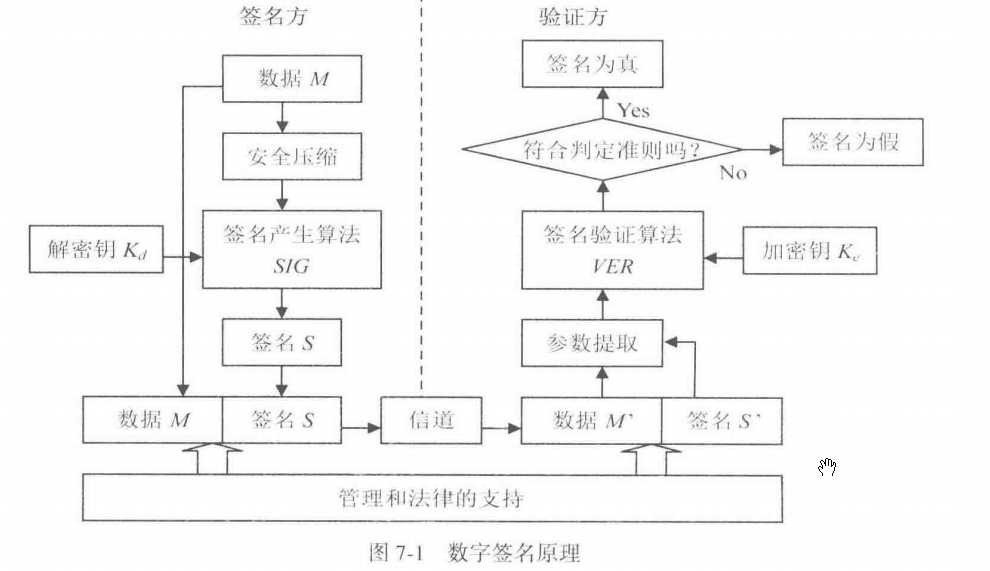


### 7.2 利用公开密钥密码实现数字签名

这一节把前面已经学过的公开密钥密码转到“数字签名”场景中。公开密钥密码原本可以用于加密，也可以反向用于签名：发送方用自己的私钥产生签名，接收方用发送方的公钥验证签名。这样一来，接收方能够确认消息确实由对应私钥持有者产生，同时还能检查消息内容在传输过程中是否被改动。

数字签名的基本目标可以概括为三点。第一，接收方要能确认签名者身份，这对应真实性。第二，接收方要能检查消息内容，这对应完整性。第三，签名者事后很难否认自己生成过该签名，这对应抗抵赖性。RSA、ElGamal 和椭圆曲线密码都能构造签名方案，本节依次讨论三种思路。

#### RSA 数字签名

RSA 的加密和解密满足一个核心关系。设公开指数为 $e$，私钥指数为 $d$，模数为 $n$，则

$$
D(E(M))=(M^e)^d\equiv M \pmod n,
$$

同时也有

$$
E(D(M))=(M^d)^e\equiv M \pmod n.
$$

这说明 RSA 的两个运算方向在数学上可以互相还原。加密时通常用接收方公钥；签名时使用发送方私钥。教材把 RSA 的解密算法 $D$ 看作签名算法 $SIG$，把 RSA 的加密算法 $E$ 看作验证算法 $VER$。

设 $M$ 为明文消息，A 的公钥为

$$
K_{eA}=\langle e,n\rangle,
$$

A 的私钥为

$$
K_{dA}=\langle d,p,q,\varphi(n)\rangle.
$$

A 对消息 $M$ 生成签名：

$$
S_A=D(M,K_{dA})=M^d\bmod n.
$$

接收方拿到签名 $S_A$ 后，用 A 的公钥验证：

$$
E(S_A,K_{eA})=(M^d)^e\equiv M\pmod n.
$$

验证结果恢复出 $M$，说明该签名与 A 的公钥相匹配。这里的关键逻辑是：只有掌握 A 的私钥 $d$ 的人，才能生成一个经过 A 公钥 $e$ 运算后回到 $M$ 的签名值。

---

若还想同时保护消息机密性，可以采用“先签名，后加密”的流程。A 先计算

$$
S_A=D(M,K_{dA}),
$$

再用 B 的公钥加密签名：

$$
C=E(S_A,K_{eB}).
$$

B 收到 $C$ 后，用自己的私钥解密得到

$$
D(C,K_{dB})=S_A,
$$

再用 A 的公钥验证

$$
E(S_A,K_{eA})=M.
$$

这个流程中，B 只有用自己的私钥才能取得签名值 $S_A$，又只有用 A 的公钥才能把 $S_A$ 验证回消息 $M$，于是同时得到机密性和签名验证能力。

#### ElGamal 数字签名

ElGamal 签名建立在有限域 $GF(p)$ 的离散对数问题上。

==系统参数==

系统选取素数 $p$，并选取模 $p$ 的本原元 $\alpha$。

用户选择私钥

$$
x,\quad 1<x<p-1,
$$

计算公钥

$$
y=\alpha^x\bmod p.
$$

公开参数为 $p,\alpha$，公钥为 $y$，私钥为 $x$。

==产生签名==

设用户 A 要对消息 $m$ 签名，其中

$$
0\le m<p-1.
$$

签名时，A 随机选择整数 $k$，要求

$$
1<k<p-1,\qquad \gcd(k,p-1)=1.
$$

这个条件保证 $k$ 在模 $p-1$ 意义下有乘法逆元 $k^{-1}$。随后计算

$$
r=\alpha^k\bmod p,
$$

再计算

$$
s=(m-xr)k^{-1}\bmod (p-1).
$$

于是 $(r,s)$ 就是消息 $m$ 的签名。发送时通常传输

$$
\langle m,r,s\rangle.
$$

==验证签名==

验证时，接收方检查下面的同余式是否成立：

$$
\alpha^m\equiv y^r r^s \pmod p.
$$

这个验证式来自签名公式。由

$$
s=(m-xr)k^{-1}\bmod (p-1)
$$

可推出

$$
m\equiv xr+ks\pmod {p-1}.
$$

两边作为 $\alpha$ 的指数时，根据模 $p$ 乘法群的阶为 $p-1$，得到

$$
\alpha^m\equiv \alpha^{xr+ks}
=\alpha^{xr}\alpha^{ks}
=(\alpha^x)^r(\alpha^k)^s
=y^r r^s
\pmod p.
$$

因此验证式成立时，签名通过。

!!! example

	教材例 7-1 给出了一组小参数。取
	
	$$
	p=11,\quad \alpha=2,\quad x=8.
	$$
	
	公钥为
	
	$$
	y=\alpha^x\bmod p=2^8\bmod 11=3.
	$$
	
	对消息
	
	$$
	m=5
	$$
	
	签名，取随机数
	
	$$
	k=9.
	$$
	
	由于
	
	$$
	\gcd(9,10)=1,
	$$
	
	所以 $k$ 合法。计算
	
	$$
	r=2^9\bmod 11=6.
	$$
	
	又由于
	
	$$
	9^{-1}\equiv 9\pmod {10},
	$$
	
	所以
	
	$$
	s=(5-8\cdot 6)\cdot 9\bmod 10=3.
	$$
	
	签名为
	
	$$
	(r,s)=(6,3).
	$$
	
	验证时计算左边：
	
	$$
	\alpha^m=2^5\bmod 11=10.
	$$
	
	再计算右边：
	
	$$
	y^r r^s=3^6\cdot 6^3\bmod 11=10.
	$$
	
	左右相等，签名通过。

ElGamal 签名中的随机数 $k$ 必须每次独立产生。若同一个 $k$ 被重复使用，就会带来私钥泄露风险。由签名方程

$$
m\equiv xr+ks\pmod {p-1}
$$

可以看出，一旦攻击者掌握同一 $k$ 关联的多个签名关系，就可能先恢复 $k$，再恢复私钥 $x$。若某次 $k$ 直接泄露，也可以由

$$
x\equiv (m-ks)r^{-1}\pmod {p-1}
$$

求出私钥。实际应用中应使用高质量随机数发生器，并通常对消息摘要签名，减少运算量和签名输入长度。

ElGamal 签名的签名值包含两个分量 $r,s$，所以签名数据长度通常接近消息所在模数长度的两倍。美国数字签名标准 DSS 中的 DSA 可以看作 ElGamal 签名思想的一种变形，它引入一个模参数 $q$，使签名长度和运算规模更适合工程使用。

#### 椭圆曲线数字签名

椭圆曲线签名把 ElGamal 签名思想迁移到椭圆曲线点群上。公开参数写作

$$
T=\langle p,a,b,G,n,h\rangle.
$$

其中，$p,a,b$ 确定素域 $GF(p)$ 上的椭圆曲线，$G$ 是循环子群的生成元，$n$ 是 $G$ 的阶，$h$ 是余因子。

==参数选择==

用户选择私钥

$$
d,\quad 1<d<n,
$$

计算公钥

$$
Q=dG.
$$

这里的 $dG$ 是椭圆曲线标量乘。公开 $G,Q$ 后，攻击者要反推出 $d$，会遇到椭圆曲线离散对数问题。

==产生签名==

设 $m$ 是待签名消息，令

$$
e=Hash(m).
$$

签名过程如下，签名者随机选择

$$
k\in\{1,2,\ldots,n-1\},
$$

计算椭圆曲线点

$$
R=kG=(x_R,y_R),
$$

取

$$
r=x_R.
$$

然后计算

$$
s=(e-dr)k^{-1}\bmod n.
$$

得到签名

$$
(r,s).
$$

==验证签名==

验证时，接收方先计算

$$
s^{-1}\bmod n,
$$

再计算椭圆曲线点

$$
U=(x_U,y_U)=s^{-1}(eG-rQ).
$$

若

$$
x_U=r,
$$

则签名通过。

这个验证式的正确性来自代数推导。由

$$
s=(e-dr)k^{-1}\bmod n
$$

可得

$$
s^{-1}\equiv (e-dr)^{-1}k\pmod n.
$$

代入验证式：

$$
U=s^{-1}(eG-rQ).
$$

又因为

$$
Q=dG,
$$

所以

$$
eG-rQ=eG-rdG=(e-dr)G.
$$

继续得到

$$
U=(e-dr)^{-1}k(e-dr)G=kG=R.
$$

因此

$$
x_U=x_R=r,
$$

验证成立。

椭圆曲线签名方案与 ElGamal 签名的主线相同：私钥参与签名，公钥参与验证，随机数 $k$ 必须一次一用。差异在于底层群从模 $p$ 乘法群换成椭圆曲线点群，指数运算换成点标量乘，安全基础从普通离散对数问题转为椭圆曲线离散对数问题。椭圆曲线方案在相近安全强度下参数长度较短，因此更适合资源受限设备和高频签名场景。

本节采用的是椭圆曲线上的 ElGamal 型签名思想。实际标准中的 ECDSA、SM2 签名都继承了“随机数 $k$、消息摘要、私钥标量、公钥点验证”的总体框架，同时在具体公式和编码规则上做了标准化设计。


### 7.3 中国商用密码 SM2 椭圆曲线公钥密码数字签名算法

SM2 签名流程里的变量可以分成五层来看。第一层是椭圆曲线公共参数，第二层是用户身份与公钥绑定信息，第三层是签名者长期密钥，第四层是每次签名临时产生的数据，第五层是验证阶段重新计算的数据。把这五层分清，公式里的每个符号就能对应到具体含义。

#### 椭圆曲线公共参数

| 符号      | 含义                      | 作用                                                         |
| --------- | ------------------------- | ------------------------------------------------------------ |
| $p$       | 素数模数                  | 确定有限域 $GF(p)$，曲线坐标和模运算都在这个域中完成。       |
| $GF(p)$   | 含有 $p$ 个元素的有限域   | 可以理解为 $0,1,\ldots,p-1$ 这些数在模 $p$ 意义下做加、减、乘、除。 |
| $a,b$     | 椭圆曲线方程系数          | 确定曲线 $y^2=x^3+ax+b$。                                    |
| $G$       | 基点                      | 曲线上的固定点，写成 $G=(x_G,y_G)$。所有用户公钥都由这个点做标量乘得到。 |
| $x_G,y_G$ | 基点 $G$ 的横坐标和纵坐标 | 参与用户杂凑值 $Z_A$ 的计算。                                |
| $n$       | 基点 $G$ 的阶             | 满足 $nG=O$。私钥、随机数、签名分量都围绕模 $n$ 运算展开。   |
| $h$       | 余因子                    | 描述整条曲线点群和基点生成子群之间的规模关系。               |
| $O$       | 无穷远点                  | 椭圆曲线点加法中的单位元，满足 $P+O=P$。                     |

这些参数合在一起写作

$$
T=\langle p,a,b,G,n,h\rangle.
$$

它们属于公共参数，签名者和验证者使用同一套参数完成计算。

#### 签名者身份与公钥相关变量

| 符号      | 含义                  | 作用                                                 |
| --------- | --------------------- | ---------------------------------------------------- |
| $A$       | 签名者                | 教材中用用户 A 表示产生签名的一方。                  |
| $ID_A$    | 签名者 A 的身份标识   | 例如用户编号、邮箱、设备身份等，本质是一段比特串。   |
| $ENTL_A$  | $ID_A$ 的比特长度编码 | 教材中把 $ID_A$ 的长度转换成两个字节，用来参与杂凑。 |
| $d_A$     | A 的私钥              | 一个随机整数，满足 $d_A\in[1,n-1]$。签名生成时使用。 |
| $P_A$     | A 的公钥              | 由私钥计算得到，$P_A=d_AG$。验证签名时使用。         |
| $x_A,y_A$ | 公钥 $P_A$ 的坐标     | 若 $P_A=(x_A,y_A)$，这两个坐标参与 $Z_A$ 的计算。    |

SM2 签名有一个很重要的身份绑定步骤。签名者和验证者会根据用户身份、曲线参数和公钥计算

$$
Z_A=H_{256}(ENTL_A\parallel ID_A\parallel a\parallel b\parallel x_G\parallel y_G\parallel x_A\parallel y_A).
$$

这里 $\parallel$ 表示比特串连接，$H_{256}$ 通常采用 SM3 输出 256 位摘要。$Z_A$ 的作用是把用户身份 $ID_A$、系统参数和公钥 $P_A$ 绑定到后续签名计算中。这样，签名验证处理的内容就包含“谁的身份、哪条曲线、哪个公钥、哪条消息”。

#### 消息与摘要变量

| 符号           | 含义                          | 作用                                                         |
| -------------- | ----------------------------- | ------------------------------------------------------------ |
| $M$            | 签名者要签名的消息            | 可以是文件内容、交易数据、协议报文等。                       |
| $\overline{M}$ | 拼接后的待杂凑数据            | 定义为 $\overline{M}=Z_A\parallel M$。                       |
| $H_v(\cdot)$   | 输出长度为 $v$ 比特的杂凑函数 | 在 SM2 中通常对应 SM3。                                      |
| $e$            | 消息摘要对应的整数            | 由 $e=H_v(\overline{M})$ 得到，再转换为整数参与模 $n$ 运算。 |

这里要注意，签名算法处理的摘要来自 $Z_A\parallel M$​，所以 SM2 签名和用户身份、公钥、曲线参数都有联系。教材写作

$$
\overline{M}=Z_A\parallel M,\\
e=H_v(\overline{M}).
$$

#### 签名生成阶段的临时变量

| 符号      | 含义                   | 作用                                               |
| --------- | ---------------------- | -------------------------------------------------- |
| $k$       | 每次签名新产生的随机数 | 满足 $k\in[1,n-1]$，用于生成本次签名的临时曲线点。 |
| $G_1$     | 临时曲线点             | 由 $G_1=kG=(x_1,y_1)$ 得到。                       |
| $x_1,y_1$ | 临时点 $G_1$ 的坐标    | $x_1$ 参与 $r$ 的计算。                            |
| $r$       | 签名第一分量           | $r=(e+x_1)\bmod n$。                               |
| $s$       | 签名第二分量           | $s=((1+d_A)^{-1}(k-rd_A))\bmod n$。                |
| $(r,s)$   | 最终数字签名           | 随消息一起发送或存储。                             |

签名生成的计算顺序是：

$$
G_1=kG=(x_1,y_1),\\
r=(e+x_1)\bmod n,\\
s=((1+d_A)^{-1}(k-rd_A))\bmod n.
$$

其中 $(1+d_A)^{-1}$ 表示 $1+d_A$ 在模 $n$ 意义下的乘法逆元。由于整个签名分量在模 $n$ 意义下计算，$r$ 和 $s$ 都是 $[0,n-1]$ 范围内的整数。算法要求最终的 $r$ 与 $s$ 落入有效范围，因此当 $r=0$、$r+k=n$、$s=0$ 这些情形出现时，重新产生随机数 $k$ 再计算。

#### 验证阶段的变量

| 符号            | 含义                 | 作用                                                    |
| --------------- | -------------------- | ------------------------------------------------------- |
| $M'$            | 验证者收到的消息     | 用来重新计算摘要。                                      |
| $(r',s')$       | 验证者收到的签名     | 撇号表示“收到的值”，用于和签名生成阶段的 $(r,s)$ 区分。 |
| $Z_A$           | 重新计算的用户杂凑值 | 验证者使用同一身份标识、曲线参数和公钥计算。            |
| $\overline{M}'$ | 验证阶段拼接数据     | $\overline{M}'=Z_A\parallel M'$。                       |
| $e'$            | 验证阶段摘要整数     | $e'=H_v(\overline{M}')$。                               |
| $t$             | 验证辅助变量         | $t=(r'+s')\bmod n$。                                    |
| $G_1'$          | 验证阶段重构的曲线点 | $G_1'=s'G+tP_A=(x_1',y_1')$。                           |
| $x_1',y_1'$     | 重构点 $G_1'$ 的坐标 | $x_1'$ 用于计算 $R$。                                   |
| $R$             | 验证判定值           | $R=(e'+x_1')\bmod n$。                                  |

验证阶段的主要计算是

$$
t=(r'+s')\bmod n,\\
G_1'=s'G+tP_A=(x_1',y_1'),\\
R=(e'+x_1')\bmod n.
$$

最后检查

$$
R=r'
$$

是否成立。成立时，签名通过。

#### 为什么验证者能用公钥重构签名点

这一点是 SM2 签名里最关键的变量关系。签名阶段有

$$
s=((1+d_A)^{-1}(k-rd_A))\bmod n.
$$

把它移项，可以得到

$$
s(1+d_A)=k-rd_A.
$$

继续整理：

$$
s+sd_A+rd_A=k.
$$

把含有 $d_A$ 的项合并：

$$
s+(r+s)d_A=k.
$$

验证阶段定义

$$
t=(r+s)\bmod n.
$$

于是

$$
sG+tP_A=sG+(r+s)d_AG.
$$

又因为

$$
P_A=d_AG,
$$

所以

$$
sG+tP_A=sG+(r+s)d_AG=[s+(r+s)d_A]G=kG.
$$

这说明验证者虽然掌握的是公钥 $P_A$，仍然可以通过 $sG+tP_A$ 重构出签名阶段的临时点 $kG$。签名阶段的临时点横坐标是 $x_1$，验证阶段重构点的横坐标是 $x_1'$，有效签名会使

$$
x_1'=x_1.
$$

签名阶段有

$$
r=(e+x_1)\bmod n,
$$

验证阶段计算

$$
R=(e'+x_1')\bmod n.
$$

当消息、身份、参数和签名值一致时，$e'=e$，$x_1'=x_1$，于是

$$
R=r.
$$

这就是验证公式成立的原因。

### 7.4 美国数字签名标准（DSS）

DSS 是美国政府在 1994 年公布的数字签名标准，核心签名算法是 DSA。教材这一节主要讲 DSA 的参数、签名生成、签名验证和正确性说明。它服务于数字签名场景，目标是让接收方确认消息来源、消息完整性以及签名者对该消息的签署关系。

==DSS 的基本思想==

DSA 建立在离散对数问题上。系统先构造一组公开参数 $p,q,g$，用户再选择私钥 $x$，并由私钥计算公钥 $y$。签名时，签名者用私钥 $x$、消息摘要 $SHA(M)$ 和一次性随机数 $k$ 生成两个整数 $(r,s)$。验证时，接收方用公开参数、公钥 $y$、收到的消息和签名 $(r,s)$ 重新计算一个值 $v$，通过比较 $v$ 与 $r$ 判断签名是否通过。

这套结构的核心是：私钥参与签名，公钥参与验证；随机数 $k$ 只在本次签名中使用；验证端通过指数运算重构出与签名端相关的值。

==算法参数==

DSA 使用以下参数：

$$
p
$$

$p$ 是素数，满足

$$
2^{L-1}<p<2^L.
$$

教材给出的范围是 $512\le L\le1024$，并且 $L$ 是 64 的倍数，即

$$
L=512+64j,\quad j=0,1,\ldots,8.
$$

---

$$
q
$$


$q$ 是素数，并且是 $p-1$ 的因子。教材给出

$$
2^{159}<q<2^{160}.
$$

也就是说，$q$ 大约是 160 位素数。它决定签名分量 $r,s$ 的模数范围。

---

$$
g
$$

$g$ 由下面的方式得到：

$$
g=h^{(p-1)/q}\bmod p.
$$

其中 $h$ 是小于 $p$ 的正整数，并选择到使

$$
g>1.
$$

这个 $g$ 是模 $p$ 乘法群中阶为 $q$ 的元素，也就是后续指数运算的基。

---

$$
x
$$

$x$ 是用户私钥，满足

$$
0<x<q.
$$

---

$$
y
$$


$y$ 是用户公钥，由私钥计算得到：

$$
y=g^x\bmod p.
$$

---

$$
k
$$


$k$ 是签名时产生的一次性随机数，满足

$$
0<k<q.
$$

$k$ 必须保密，并且每次签名都要重新产生。教材强调，$p,q,g,y$ 可以公开，$x$ 和 $k$ 必须保密。

==签名生成过程==

对消息 $M$ 签名时，先计算消息摘要：

$$
SHA(M).
$$

然后使用一次性随机数 $k$ 生成签名分量。

第一步计算

$$
r=(g^k\bmod p)\bmod q.
$$

这里先在模 $p$ 下做指数运算，再对结果模 $q$。$r$ 可以理解为由本次随机数 $k$ 导出的签名第一分量。

第二步计算

$$
s=k^{-1}(SHA(M)+xr)\bmod q.
$$

其中 $k^{-1}$ 是 $k$ 在模 $q$ 意义下的乘法逆元，满足

$$
k\cdot k^{-1}\equiv1\pmod q.
$$

若 $r=0$ 或 $s=0$，重新选择 $k$ 并重新计算。最终签名为

$$
(r,s).
$$

发送时通常把消息和签名一起发送：

$$
(M,r,s).
$$

==签名验证过程==

接收方收到消息 $MP$ 和签名 $(r_P,s_P)$ 后，使用公开参数 $p,q,g$ 和签名者公钥 $y$ 验证。

第一步检查签名分量范围：

$$
0<r_P<q,
\quad
0<s_P<q.
$$

范围检查失败时，验签失败。

第二步计算

$$
w=(s_P)^{-1}\bmod q.
$$

第三步计算

$$
u_1=(SHA(MP)w)\bmod q,\\
u_2=(r_Pw)\bmod q.
$$

第四步计算

$$
v=((g^{u_1}y^{u_2})\bmod p)\bmod q.
$$

最后比较

$$
v=r_P.
$$

相等时签名验证通过；差异时签名验证失败或数据被改动。

==正确性说明==

正确性来自签名公式与验证公式之间的对应关系。真实签名满足

$$
s=k^{-1}(SHA(M)+xr)\bmod q.
$$

因此有

$$
s^{-1}\equiv k(SHA(M)+xr)^{-1}\pmod q.
$$

验证阶段计算

$$
w=s^{-1}\bmod q,\\
u_1=SHA(M)w\bmod q, \quad u_2=rw\bmod q.
$$

又因为公钥

$$
y=g^x\bmod p,
$$

所以

$$
g^{u_1}y^{u_2}
=g^{SHA(M)w}(g^x)^{rw}
=g^{(SHA(M)+xr)w}.
$$

由 $w=s^{-1}$ 和 $s=k^{-1}(SHA(M)+xr)$ 可知

$$
(SHA(M)+xr)w\equiv k\pmod q.
$$

由于 $g$ 的阶为 $q$，指数在模 $q$ 意义下相同会得到同一个模 $p$ 运算结果，因此

$$
g^{(SHA(M)+xr)w}\equiv g^k\pmod p.
$$

验证端得到的

$$
v=((g^{u_1}y^{u_2})\bmod p)\bmod q
$$

就等于签名端计算的

$$
r=(g^k\bmod p)\bmod q.
$$

所以真实签名会满足

$$
v=r.
$$


### 7.5 俄罗斯数字签名标准（GOST）

这一节介绍的是俄罗斯在 1994 年公布的数字签名标准 GOST R 34.10-94。它同样属于基于离散对数问题的签名方案，整体结构和 ElGamal、DSS 有相近之处：先构造公开参数，用户用私钥生成公钥，签名时引入一次性随机数，验签时用公钥和签名分量重构出一个判定值。

==算法参数==

GOST 签名算法先选取两个素数。第一个是大素数 $p$，长度为 509～512 位，或 1020～1024 位。第二个是素数 $q$，它是 $p-1$ 的因子，长度为 254～256 位。也就是说，

$$
q\mid(p-1)
$$

后续签名分量和许多模运算都围绕 $q$ 展开。

接着选取参数 $\alpha$。它是小于 $p-1$ 的正整数，并满足

$$
\alpha^q\equiv 1\pmod p.
$$

这说明 $\alpha$ 位于模 $p$ 乘法群中由 $q$ 控制的子群内，用来生成签名中的指数运算结果。

用户私钥记为 $x$，它是小于 $q$ 的正整数。用户公钥记为 $Y$，由私钥计算得到：

$$
Y=\alpha^x\bmod p.
$$

其中 $p,q,\alpha$ 可以公开，并可由网络中的用户共享；$x$ 必须保密，$Y$ 作为公钥公开。GOST 签名还使用 Hash 函数 $H(x)$，教材中说明它基于俄罗斯分组密码标准算法 GOST 28147-89 构造。

==签名过程==

设待签名数据为 $M$。签名者先计算消息摘要 $H(M)$。当

$$
H(M)\equiv0\pmod q
$$

时，把 $H(M)$ 置为 1。这样处理是为了后续验签阶段能够计算 $H(M)$ 在模 $q$ 意义下的逆元。

随后签名者随机选择一个小于 $q$ 的随机数 $k$。这个 $k$ 是本次签名的临时秘密量，每次签名都要重新产生。

签名第一分量为

$$
R=(\alpha^k\bmod p)\bmod q.
$$

当 $R=0$ 时，重新选择 $k$ 并重新计算。

签名第二分量为

$$
S=(xR+kH(M))\bmod q.
$$

当 $S=0$ 时，也重新选择 $k$ 并重新计算。最终得到签名

$$
(R,S).
$$

发送时通常把消息 $M$ 与签名二元组 $(R,S)$ 一起发送给接收方。

==验证过程==

接收方收到消息和签名后，先检查 $R$ 与 $S$ 的范围，要求二者都大于 0 且小于 $q$。范围检查通过后，计算

$$
V=H(M)^{q-2}\bmod q.
$$

因为 $q$ 是素数，根据费马小定理，$H(M)^{q-2}\bmod q$ 就是 $H(M)$ 在模 $q$ 意义下的乘法逆元。

接着计算两个中间量：

$$
z_1=SV\bmod q,
$$

然后利用公开参数 $\alpha$ 和公钥 $Y$ 计算

$$
u=((\alpha^{z_1}Y^{z_2})\bmod p)\bmod q.
$$

接着比较

$$
u=R.
$$

两者相等时，签名通过验证；两者相差时，签名验证失败。

==验签公式为什么成立==

设

$$
h=H(M).
$$

签名公式给出

$$
S=xR+kh\pmod q.
$$

验签阶段计算的

$$
V=h^{-1}\pmod q.
$$

于是

$$
z_1=SV=(xR+kh)h^{-1}\equiv xRh^{-1}+k\pmod q,\\
z_2=(q-R)V\equiv -Rh^{-1}\pmod q.
$$

又因为

$$
Y=\alpha^x\bmod p,
$$

所以

$$
\alpha^{z_1}Y^{z_2}
=\alpha^{xRh^{-1}+k}(\alpha^x)^{-Rh^{-1}}
=\alpha^k\pmod p.
$$

再对 $q$ 取模，得到

$$
u=(\alpha^k\bmod p)\bmod q=R.
$$

因此，合法签名会通过验签公式。


## 第8&9章 抗量子计算密码&密码分析(选修)


## 第10章 密钥管理

> 到这里教材从“算法”转向“系统”。算法再强，也要先回答密钥从哪来、放在哪、如何分发、多久更换、出了事故怎么恢复。密钥管理处理的正是这些工程上无法回避的问题。


### 10.1 密钥管理的原则

密钥管理要同时满足安全性和可用性。密钥要能被合法方及时、安全地生成、分发、存储、更新和销毁；又要让攻击者在这些环节中的每一步都难以插手。教材把它单独成章，就是因为现实系统里的大量事故都出在密钥环节。

若把这一章压成一个总问题，它讨论的其实是“密钥生命周期”。密钥从产生那一刻起，就会经历发放、使用、备份、轮换、失效和销毁等阶段。任何一个阶段出问题，前面再强的算法也会被拖下来。把生命周期意识建立起来以后，读者就能更自然地理解为什么教材把许多看似运维细节的内容也纳入密码课程。


### 10.2 传统密码体制的密钥管理


#### 10.2.1 密钥组织

教材在这一节先把传统密码体制中的密钥按层次组织起来，后文反复出现的高级密钥、中级密钥和初级密钥，就是在这里先建立起来的。这样安排以后，存储、备份、更新和销毁都可以沿着同一套层次展开。


#### 10.2.2 随机数和随机序列的产生

这一节处理的是传统密码密钥产生的基础条件。传统密码的密钥本质上是随机数或随机序列，因此随机源质量会直接影响后面的密钥产生和使用安全。


#### 10.2.3 密钥产生

教材在这里进入传统密码体制的密钥产生。顺着后文的分层结构去看，密钥产生已经超出单纯生成一个比特串的范围，后续安排会分别面向高级密钥、中级密钥和初级密钥的使用范围展开。


#### 10.2.4 密钥分配

教材把传统密码体制的密钥分配单列出来，是因为这一环节正是对称密码在网络环境中的主要困难之一。后面的公开密钥密码体制，正是围绕这一困难提出的新方案。


#### 10.2.5 密钥的存储与备份

教材先把密钥安全存储定义为：确保密钥在存储状态下的秘密性、完整性和可用性。安全可靠的存储介质是物质条件，严密的访问控制是管理条件，两者同时具备，才能真正保证密钥安全存储。课本随后把密钥存储形态分成明文形态、密文形态和分量形态三类，并强调不同级别的密钥应采用不同形态和不同存储方式。

按教材的层级划分，高级密钥是系统中最高级的密钥，主要保护中级密钥和初级密钥，因此它只能以明文形态存储，而且存储器在物理和逻辑上都必须高度安全，通常放在专用密码装置中；中级密钥既可以明文存储，也可以以高级密钥加密后的密文形态存储；初级文件密钥生命周期较长，一般采用密文形态存储，而初级会话密钥生命周期很短，通常在工作存储器中动态产生并使用后销毁。

在备份方面，教材把密钥备份视为一种有备无患的措施，目的在于密钥损坏时能够恢复原密钥和被加密数据。课本列出几项很具体的原则：备份应当异设备，重要数据甚至要异地备份；备份密钥应受到与原密钥相同的物理和逻辑保护；为了减少明文密钥数量，应当尽量采用高等级密钥保护低等级密钥的密文备份；高级密钥不宜用密文形态备份，而更适合采用密钥分量、密钥托管或门限分享的方式分散备份；此外，备份与恢复都应当记录日志并接受审计。


#### 10.2.6 密钥更新

课本把密钥更新称为密钥管理中非常麻烦的一个环节，并明确指出：当密钥使用期限到期，或者怀疑密钥泄露时，密钥必须更新。教材同时强调，密钥更新越频繁就越安全，但也越麻烦，因此必须周密计划、谨慎实施。

教材按层次分别讨论了更新。高级密钥一旦更新，会连带其保护的中级密钥和初级密钥都要更新，因此代价最高；中级密钥更新时，也会进一步牵连其保护的初级密钥；初级会话密钥因为本来就按一次一密方式工作，更新相对容易，而初级文件密钥一旦更新，就要把原密文文件解密，再用新密钥重新加密，这正是文件密钥更新麻烦的原因。


#### 10.2.7 密钥的终止和销毁

课本指出，密钥的终止和销毁同样是密钥管理中的重要环节，但这一环节在实践中又很容易被忽视。教材先说明，密钥到期后必须终止使用并更换新密钥，终止使用的密钥通常会再保留一段时间，以便妥善处理其所保护的其他密钥和数据。只要密钥仍处在保留阶段，就必须继续严格保护。

真正的密钥销毁，要求彻底清除密钥的一切存储形态和相关信息，包括产生、分配、存储、工作状态以及备份状态下的全部相关信息。课本还特别提醒，对磁记录存储器来说，简单删除、清 0 或写 1 都不安全，因此必须采用更妥善的清除方法。


#### 10.2.8 专用密码装置

教材把专用密码装置定义为一种专用的高安全性、高可靠性的密码硬件设备。其主要功能包括产生密钥、存储密钥、加密、解密、数字签名、验证签名和产生随机数等。课本强调，如果网络系统各站点都配置了专用密码装置，那么密钥产生、分配、存储以及各类密码操作都会变得更加方便和安全。

教材随后把专用密码装置应具备的特征逐条写开。它本质上是一台专门用于密码处理的高安全性计算机系统，因此 CPU、各类存储器、I/O 接口、操作系统和控制软件都是基本资源；它必须内置传统密码和公钥密码能力，而且一般采用硬件密码系统以保证速度和安全；支持从外部注入密钥，但密钥只能输入、不能明文输出；内部应配置真随机序列产生器；操作命令要经过认真设计和形式化验证；装置还必须能抵御硬件攻击、软件攻击、逻辑攻击，并具备周密的自我安全防护机制，必要时甚至支持自毁。


### 10.3 公开密钥密码体制的密钥管理


#### 10.3.1 公开密钥密码的密钥产生

教材先把传统密码和公开密钥密码的差别重新讲清楚。传统密码的密钥本质上是随机数或随机序列，因此密钥产生的核心，是得到具有良好密码学特性的随机数。公开密钥密码则建立在单向陷门函数和某种数学难题之上，因此密钥产生已经从“取一个随机数”扩展成根据具体密码体制生成一组满足安全性和效率要求的数学参数。

课本随后举了两个典型例子。对 RSA 来说，秘密钥是 $\langle p,q,\varphi(n),d\rangle$，公开钥是 $\langle n,e\rangle$，因此密钥产生要围绕这些参数展开：$p$ 和 $q$ 要足够大、随机产生、差值要大、$(p-1)$ 和 $(q-1)$ 的最大公因子要小，$e$ 和 $d$ 也不能太小。对椭圆曲线密码来说，用户私钥 $d$ 和公钥 $Q=dG$ 的生成本身不困难，真正困难的是系统参数 $\langle p,a,b,G,n,h\rangle$ 的选取，因为椭圆曲线参数既要满足安全要求，也要兼顾效率。教材把这一节安排在这里，是为了让读者接受一个事实：公开密钥的“密钥产生”本质上是一套参数生成问题。


#### 10.3.2 公开密钥的分配

课本在这一节里把最关键的一点写得很明确：公开密钥可以公开，因此在分配时无须保护其秘密性；但是，公开密钥的完整性必须严格保护，绝对不允许攻击者替换或篡改用户的公钥。也正因为这一点，公开密钥的分配和传统密码的密钥分配有本质差别。

教材随后给出攻击者篡改 PKDB 的例子。若攻击者 C 把公钥库中 A 的公钥换成自己的公钥，那么他就可以用自己的私钥签名消息冒充 A 发给 B，而 B 在验证时会误以为签名真实；此后 B 若再用“以为属于 A 的公钥”去加密消息，实际上加密的就是 C 的公钥，结果只有 C 能解开。课本借这个例子说明两件事：其一，公钥分配绝不像在电话簿上公布电话号码那样简单；其二，真正需要保护的是“公钥本身不被替换”和“公钥与所有者标识之间的绑定关系不被破坏”。

正因为如此，教材才把公钥证书和 PKI 引出来。数字签名能够保护公钥库中的数据真实性和完整性，于是围绕“用数字签名保护公钥分配”的一整套技术，就构成了公开密钥基础设施 PKI。


#### 10.3.3 公开密钥基础设施 PKI

教材对 PKI 的定义是：公钥证书、证书管理机构、证书管理系统、围绕证书服务的各种软硬件设备以及相应的法律基础，共同组成公开密钥基础设施 PKI。它为公钥密码应用提供支持加密、解密、签名和验证签名的密钥基础服务，本质上是一种标准的公钥密码密钥管理平台。

课本先从证书讲起。公钥证书是一种包含持证主体标识、公钥等信息，并由可信签证机构 CA 签名的信息集合。任何知道 CA 公钥的用户，都可以验证证书上的签名，从而确认其中携带的公钥是真实的，而且它确实属于证书标识的那个主体。教材用驾驶执照类比公钥证书，就是为了说明“权威机构签发 + 主体标识绑定”这两件事为什么要同时具备。

随后教材把 PKI 的几个关键角色依次写开。CA 负责签发、管理和撤销证书，并且自身也会给自己签发证书；RA 负责受理注册申请、审核申请人合法性、决定是否批准申请；证书目录负责集中存储和发布证书。课本还把证书签发过程、密钥由谁产生、密钥备份与恢复、证书有效期和密钥更新这些问题都纳入 PKI 讨论，目的是说明 PKI 指向的是一整套围绕公钥证书运行的制度化基础设施，单个证书文件只是其中一个组成部分。


## 第11章 密码协议

> 算法告诉我们“单个盒子怎么工作”，协议则处理“多个主体如何按步骤交互”。只要安全目标涉及多方通信，例如密钥协商、认证和电子商务，问题就会从算法结构上升到消息流程。


### 11.1 密码协议的基本概念

课本先给出协议的定义：协议是两个或两个以上参与者为了完成某一特定任务而采取的一系列执行步骤。教材随后把这个定义拆成三层含义。第一，协议是一个有序执行过程，每一步都必须依序进行，随意增删步骤或改变顺序都属于对协议的篡改或攻击。第二，协议至少要有两个参与者。第三，协议执行之后必须能够完成某种任务。

教材紧接着把协议和算法比较。算法是求解问题的一组有穷运算规则，强调有穷性、确定性、输入、输出和能行性。协议与算法相似之处在于两者都要求有穷、确定、可行；不同之处在于协议强调多方参与和通信交互，强调完成某种处理任务，而算法更多强调单方完成某种计算。课本甚至明确指出：算法属于较低层次概念，协议属于较高层次概念，协议建立在算法基础之上。

在这个基础上，教材再把“安全协议”和“密码协议”接进来。安全协议是具有安全功能的协议，而密码技术是确保通信安全最有效的技术，所以安全协议通常又称为密码协议。课本给出的典型功能包括数据保密传输、密钥交换、身份认证、站点认证、报文认证以及电子商务交易等。

教材还按功能把密码协议分成四类：密钥建立协议、认证协议、身份认证和密钥建立协议、电子商务协议。随后又补充了多方安全计算、门限密码、属性加密、代理签名和零知识证明等新类型，目的是让读者看到密码协议已经从传统网络认证继续扩展到更广泛的多方协作环境中。


### 11.2 密码协议的设计与分析

教材先从协议可能存在安全缺陷讲起。第 6 章中只加密、不签名的通信方式，在仅从原理层面观察时可以保证秘密性，但无法保证真实性；即使是“先签名后加密”或“先加密后签名”，如果消息中缺少主体标识和时间信息，协议仍可能被重播或被转发到其他主体。课本用例 11-2、例 11-3 和例 11-4 连续说明：协议的安全缺陷很多时候来自消息结构和协议流程本身，底层密码算法此时仍保持数学正确性。

在攻击分类上，教材把协议面临的攻击分成四类：对协议中密码算法的攻击、对密码算法技术实现的攻击、对协议本身的攻击，以及对协议技术实现的攻击。课本随后又把这些攻击进一步分成被动攻击和主动攻击。被动攻击主要是窃听和分析消息，主动攻击则会篡改、插入、重播消息，甚至改变协议执行过程。教材还特意用 OpenSSL “心脏滴血”事件提醒读者：协议标准本身和协议实现的安全性属于两个层面，二者都可能成为攻击入口。

在设计原则部分，课本采用了 Abadi 和 Needham 的一组原则。教材逐条解释了消息独立完整性原则、消息前提准确原则、主体身份标识原则、加密目的原则、签名原则、随机数使用原则、时间戳使用原则、编码原则以及最少安全假设原则。把这些原则压成更直接的理解，就是：每条消息应当只靠自身内容表达含义，和身份、时间、用途有关的关键条件都要显式写入并受到保护，而且协议一开始所依赖的安全假设越少越好。

在分析方法上，教材又把协议安全分析分成攻击检测和形式化分析两大方向。攻击检测依靠已知攻击方式来穿透性检测协议，优点是直观，缺点是只能发现已知漏洞；形式化分析则把协议描述形式化，再借助逻辑推理、模型检测或定理证明判断协议是否安全。课本进一步列出三类常见形式化分析方法：BAN 逻辑一类的形式逻辑方法、模型检测方法和定理证明方法。教材在这里的核心态度很清楚：协议设计本来就很困难，只有把设计原则和分析方法一起引入，才能尽量在设计阶段发现缺陷。


### 11.3 密码协议分析举例

教材把 Diffie-Hellman 密钥协商协议作为例子，是因为它原理正确、历史重要，而且安全缺陷也很具有代表性。课本先给出公共参数：选择大素数 $p$ 和有限域 $\mathrm{GF}(p)$ 的本原元 $\alpha$，供系统所有用户共享。随后 A、B 分别选择随机整数作为私钥，计算各自公钥并交换，然后双方分别计算共享值，最终得到同一个共享密钥。

教材对其理论安全性的说明分成两层。第一层是离散对数问题的困难性：攻击者从公钥反推私钥在计算上很困难。第二层是 Diffie-Hellman 假设：攻击者即使截获双方公钥，也难以直接求出共享密钥。在这两个前提下，协议在理论上是安全的。

但是，课本接着马上指出，这只是原理层面的安全。一旦考虑协议攻击，Diffie-Hellman 协议就存在明显缺陷。教材给出的经典攻击是中间人攻击：攻击者 T 分别与 A、B 建立两把不同的共享密钥，并让 A 误以为自己在和 B 协商，让 B 误以为自己在和 A 协商。这样一来，A 与 T 共享一把密钥，B 与 T 共享另一把密钥，A 和 B 的后续保密通信对 T 来说就完全可以解开和篡改。


```
中间人攻击的教材骨架
A -> T(B): A 的公钥
T -> B   : T 伪造的公钥

B -> T(A): B 的公钥
T -> A   : T 伪造的另一公钥

结果:
A 与 T 共享密钥
B 与 T 共享另一把密钥
```

课本对攻击成功原因的分析非常直接：原始协议里缺少对通信人的身份认证，也缺少时间标识，因此既容易遭受中间人攻击，也容易遭受重播攻击。教材因此得出一个重要结论：Diffie-Hellman 协议的原理是正确的，但它缺少严格协议设计，不能直接用于实际系统；只有在结合身份认证和协议设计原则改进以后，才适合真实应用。

Example


```
A -> M(B): g^a
M(A) -> B: g^m1

B -> M(A): g^b
M(B) -> A: g^m2

A 计算: K_AM = (g^m2)^a
B 计算: K_MB = (g^m1)^b
M 同时知道两把共享密钥
```

一旦协议缺少 **临时公钥和主体身份** 的绑定，攻击者就能把一场协商拆成两场独立协商。


## 第12章 认证

> 到这一章，教材把“真实性”问题拆得更细：谁在证明自己是谁，谁在证明站点是真的，谁在证明消息内容保持原状，哪些目标只需要认证，哪些目标会上升到数字签名。


### 12.1 认证的概念

课本先给出定义：认证（authentication）又称鉴别、确认，它是证实某人或某事是否名副其实、是否有效的一个过程。教材紧接着就把认证和加密区分开。加密用来确保数据的保密性，抵抗的是窃取、窃听等被动攻击；认证用来确保数据发送者和接收者的真实性，以及数据内容的真实性与完整性，抵抗的是冒充、篡改、重播等主动攻击。课本把认证称为信息系统安全保护的第一道设防，正是因为系统一开始就要先回答“对方是谁、东西是真是假”。

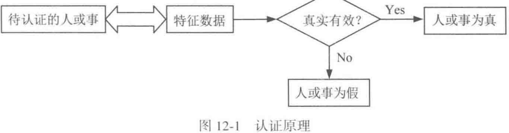

这张图对应的就是教材给出的基本思想：通过验证被认证对象一个或多个特征数据的真实性和有效性，来判断该对象是否名副其实。于是，特征数据与被认证对象之间就必须存在严格的对应关系，理想情况下这种对应关系还应当是唯一的。课本随后列出的典型特征参数包括口令、标识符、密钥、信物、智能卡、USB-Key、指纹、声纹、视网膜纹和人脸等。对于长时间保持稳定的非时变参数，可以预先产生并保存认证位模式；对于经常变化的参数，则要在认证时适时产生。

教材还特别把认证系统的前提条件点明：认证者与被认证者双方需要共享某种保密的认证数据，很多场合里这种保密数据就是密钥。后面无论是口令认证、挑战响应，还是消息认证码，本质上都围绕这类共享秘密展开。

课本在这一节最后把认证与数字签名并排比较。认证依赖的是当事双方共享的保密数据，用于验证的数据不能公开给第三方，因此第三方也就无法验证；数字签名中用于验证签名的数据是公开的，因此双方和第三方都可以验证。进一步说，数字签名能够支持“签名者不能抵赖、他人不能伪造、发生争议时第三方可以仲裁”，而认证通常缺少这些性质。教材甚至把原因说得很直接：若收发双方共享同一份保密认证数据，一旦其中一方不诚实，他就有能力伪造或抵赖，第三方也很难裁决。

因此，课本最后自然引出一个结论：认证总要涉及认证方与被认证方的有序通信过程，所以认证一定依照认证协议进行。第 11 章的密码协议知识，到这里就和认证真正接上了。

!!! note
    继续往下读之前，先把四个问题写出来：
    **谁在证明自己、向谁证明、证明的对象是什么、验证结果由谁接受。**
    这四个问题一旦混在一起，身份认证、站点认证、报文认证和数字签名就会很容易串线。


### 12.2 身份认证


#### 12.2.1 口令

口令认证验证的是“用户知道什么”。最朴素的做法是服务器存明文口令并比较输入，这当然风险极高。更合理的做法是只存经过单向函数处理后的结果，例如存储 $H(\text{password})$。这样即使数据库泄露，攻击者也难以直接读出明文口令。

不过，Hash 存储也无法消灭风险，风险会转成字典攻击和穷举攻击。于是教材继续引入盐值、双向验证和一次性口令。这里的学习重点是，口令安全对应一整套从存储、传输、重放防护到用户行为约束的体系。


#### 12.2.2 智能卡和 USB-Key

这类方案验证的是“用户拥有什么”。它们把密钥和认证逻辑放进便携硬件中，减少秘密暴露到普通终端环境的机会。为了防止“捡到设备就能冒充”，实际部署中通常还要叠加 PIN，形成双因素认证。

这类机制的教学价值，在于把“秘密存放位置”显式变成认证设计的一部分。若秘密长期待在通用终端内存里，恶意软件更容易直接窃取；若秘密被限制在智能卡或 USB-Key 的受控边界中，攻击者就必须继续突破硬件接口、PIN 保护和设备管理策略。于是身份认证会和密钥托管方式紧密联动。


#### 12.2.3 生理特征识别

生物识别验证的是“用户是什么”。它利用指纹、人脸、声纹等长期稳定特征进行比对。这里还要提醒读者：生物特征识别更适合用来在便利性和安全性之间建立新的平衡。模板泄露、误识率和活体检测都是现实问题。


#### 12.2.4 零知识证明

零知识证明解决的是一个很深的问题：证明者如何让验证者相信“我知道某个秘密”，同时又不把秘密本身交出去。教材用洞穴故事引入这个概念，目的是先建立交互证明的直观结构。读这一节时，要抓住它如何把“会证明”与“会泄露”拆开。


### 12.3 站点认证

教材把站点认证定义为：在正式传送报文之前，先确认通信确实发生在意定站点之间。它处理的是通信对端是否就是预期中的那个站点，因此它先于后面的报文认证出现。


#### 12.3.1 单向认证

单向认证只要求通信一方认证另一方。教材先给出传统密码体制下的做法：A 产生随机数，发给 B；B 用双方共享的会话密钥对其处理后返回；A 再检查返回结果是否与自己预期一致。这里真正承担认证作用的是“只有意定站点才能对随机挑战作出正确响应”。


```
传统密码下的单向认证:
A -> B : Enc_K(R_A)
B -> A : Enc_K(f(R_A))
A      : 解密并比较 f(R_A)
```

教材随后给出公钥密码体制下的对应思路。A 把随机数发给 B，B 用自己的私钥对该随机数进行签名后返回，A 再用 B 的公钥验证签名是否成立。两种写法虽然所用密码不同，但教材希望读者抓住同一个核心：**认证成立的依据是对端掌握了只有意定站点才掌握的秘密能力。**


#### 12.3.2 双向认证

双向认证要求通信双方互相确认对方身份。教材在传统密码体制下给出的流程，是 A 先发出自己的随机数，B 返回“对 A 的随机数作出的响应”和“B 自己的新随机数”，A 再对 B 的随机数作出响应。这样双方都能确认对方确实掌握共享密钥。


```
传统密码下的双向认证:
A -> B : Enc_K(R_A)
B -> A : Enc_K(R_A || R_B)
A -> B : Enc_K(R_B)
```

在公钥密码体制下，教材仍沿用这一挑战-应答骨架，只是把“共享密钥上的加解密”换成“私钥签名、公钥验证”。因此双向认证的重点不在多了一条消息，而在于双方都各自发出挑战、各自检查响应，最终把“对方是谁”这件事在当前会话里双向确认下来。


### 12.4 报文认证


#### 12.4.1 报文源的认证

这一步关注的是“消息是谁发的”。如果无法确认消息来源，后面讨论消息是否被改、时间是否新鲜都失去意义。

在协议里，这个问题通常会具体成“这条消息是 A 发来的，还是攻击者冒充 A 发来的”。因此源认证不仅关心内容，也关心发送者是否掌握某个共享秘密、私钥或一次性挑战值。只要来源不稳，后续的完整性检查也会失去基础。


#### 12.4.2 报文宿的认证

这一小节讨论接收方身份的确认。它的核心意义在于防止把消息送给错误对象，或者被中间人诱导到伪造接收方。

这在双向认证和支付、控制类协议里尤其重要。若发送方确认不了接收方是谁，就可能把敏感数据、控制指令或会话密钥交给错误对象。于是“报文发给谁”本身也成为需要认证的安全属性。


#### 12.4.3 报文内容的认证与消息认证码

课本在这一小节里要解决的问题很明确：接收方拿到报文以后，怎样确认报文内容在传输途中保持真实和完整。最常见的办法，就是给报文附加一个认证码。消息认证码（message authentication code, MAC）就是在共享密钥 $K$ 的条件下，为消息 $M$ 计算出的认证标签：

$$
\mathrm{tag}=\mathrm{MAC}_K(M).
$$

接收方收到消息后，用同一密钥重新计算标签并比较。若两者一致，就可以确认内容未被篡改，同时也可以相信发送方掌握共享密钥。课本在这里依然保持前面那条界线：MAC 适用于共享秘密场景下的内容认证，它对应的是对称认证机制，验证能力停留在共享密钥的当事双方之间。

教材随后专门介绍 HMAC。原因很直接，若只传送 $M$ 和 $H(M)$，攻击者完全可以同时替换消息和摘要，接收方无法分辨。HMAC 把密钥真正引入 Hash 过程。课本先给出参数：消息输入 $M$、分组长度 $b$、Hash 码长度 $n$、密钥 $K$、补零后的标准块 $K^+$、内填充 `ipad` 和外填充 `opad`。随后按七个步骤组织计算：先把密钥扩展成标准块，再与 `ipad` 异或；把消息分组附在后面做第一次 Hash；再把结果与 `opad` 路线结合，完成第二次 Hash，最终得到 `HMAC(K,M)`。


```
HMAC 的课本流程
1. 由 K 形成标准块 K+
2. K+ XOR ipad
3. 拼接消息 M
4. 做第一次 Hash
5. K+ XOR opad
6. 拼接第一次 Hash 的结果
7. 做第二次 Hash，输出 HMAC(K, M)
```

教材对 HMAC 的评价有两点。第一，密钥在整个计算中参与两次，因此只要密钥安全，伪造 HMAC 就很困难。第二，虽然执行了两次 Hash，HMAC 的计算速度仍然很快，而且还可以通过预计算方式继续提高效率。课本进一步把 HMAC 的安全性与底层 Hash 函数的强度联系起来，并指出在更重视速度时，128 位 Hash 用于 HMAC 在许多场景下也具有可接受的安全性；若希望安全裕度更高，则应选用更长的 SM3 或 SHA-3。

这节内容在课本里还继续推进到 HMAC 之外的报文加密。教材进一步讨论“以整个报文的密文作为认证码”的做法，也就是报文加密。若 A 和 B 共享密钥 $K$，A 可以直接发送

$$
A\to B:E(M,K).
$$

课本指出，这样的报文加密同时带来报文秘密性、报文源认证、报文宿认证和一定程度的报文内容认证。不过，接收方还需要有能力判断解密所得明文是否合法。于是教材继续给出更稳妥的办法：把报文的 Hash 码附在报文之后，再整体加密发送

$$
A\to B:E(M\Vert H(M),K).
$$

B 解密后重新计算 $H(M)$ 并比较，两者一致时，就能确认报文真实且完整。课本还进一步写出公钥体制下的对应做法：先对 `M || H(M)` 做签名，再对结果加密发送，这样可以同时得到保密性和认证性。于是，这一小节的重点落在沿着“共享密钥认证码 -> HMAC -> 整体报文加密 -> 结合签名的公钥方案”这条线，把报文内容认证的主要技术路线完整串起来。


#### 12.4.4 报文时间性的认证

如果系统只验证“消息内容没变”，同时又缺少对“消息是否属于当前会话”的确认，那么重放攻击就会成功。时间戳、随机数、计数器和挑战-应答，都是在解决消息新鲜性问题。它们是认证协议的重要组成部分。

可以把新鲜性想成“这条消息和当前这次交互是否同属于一个时间窗口”。时间戳依赖双方时钟，随机数依赖交互挑战，计数器依赖状态同步，挑战-应答则把“先出题、再回答”写进流程。教材把这些机制单列出来，是为了说明完整性和新鲜性是两层不同属性：消息没被改过，也未必代表它就是现在这次会话新产生的。


## 第13章 密码在区块链中的应用（选修）


## 第14章 密码在可信计算中的应用（选修）

## 各章节习题

