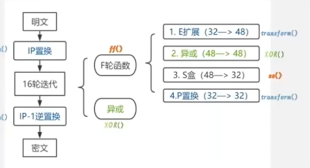
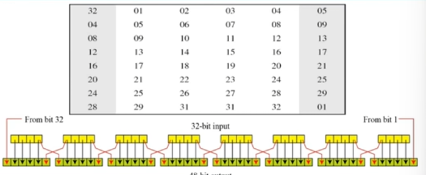
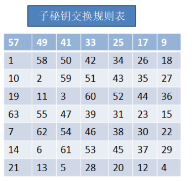
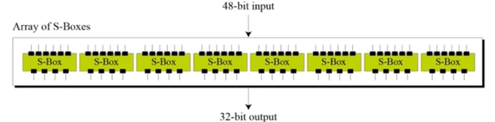
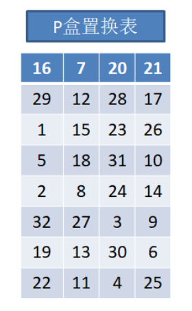
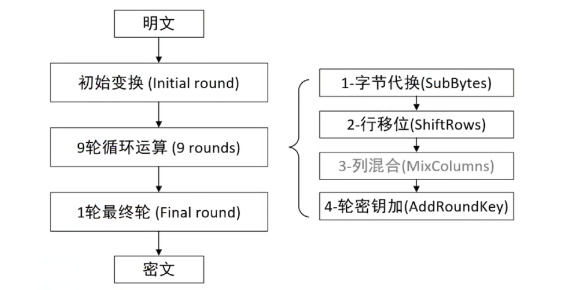
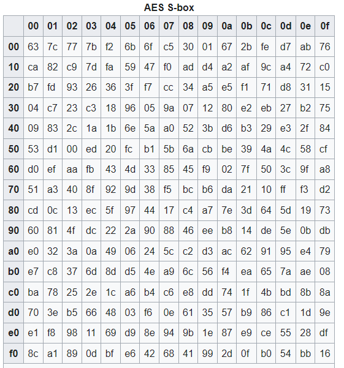
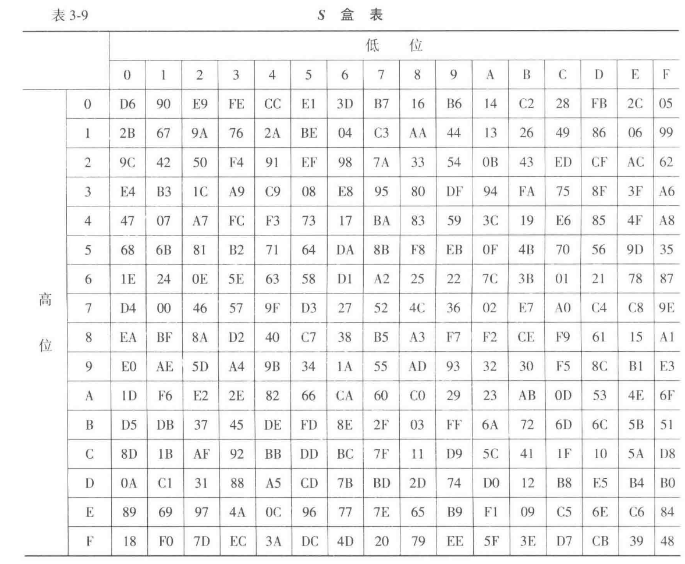
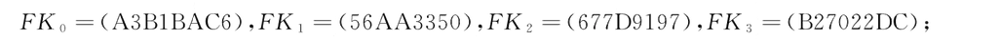
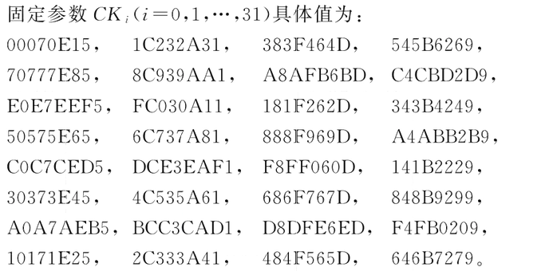

# 算法介绍-里


## DES

[演示](../des_demo.html)

分组密码，将多个数组组成一组进行加密，密钥长度为64位，其中56位参与运算，8位作为校验位




### 初始置换IP盒逆初始置换 $IP^{-1}$

这个就是查表计算，没有什么很高深的原理，只需要将明文数据相应位置的数据移动到该数据所在的位置即可

初始置换：


逆置换：


### 迭代计算

将64位数据拆为左32位和右32位，右32位与 **子密钥** 经过函数f得到一个新值

- 这个新值就是新的左32位
- 新值和原本的左32位异或，可以得到新的右32位


#### 函数f

- E扩展，将32位扩展为 48 位
- 异或子密钥
- S-box，将48位压缩为 32 位
- P置换

E扩展

4个一组，两边重复写一次



子密钥

子密钥的产生过程如下：


去掉奇偶校验位，64位初始密钥变为56位，经过如下交换规则表做出变换，然后拆出C0、D0：



接下来对C0、D0左移,每一轮的左移位数也不一样，见此表


合并之后再次压缩置换，得到真正的子密钥


S-box映射

48位输入等分为8块，每块6位输入压缩为4位输出



我们将第一位和最后一位作为行坐标，中间四位作为列坐标进行查表

> 假设输入为 `101001` ，则S1盒中对应了(11,0100)，即 （3，4）对应 4，二进制为 0100


P盒置换




### 解密

- 对密文做IP置换
- 十六轮完全相同的迭代方式，只不过将子密钥从K16反过来用
- 十六轮结束后交换左右两边，进行逆IP置换


## AES

[过程展示](../aes_demo.html)

我们首先明确，AES属于是分组加密算法，明文（数据块）长度固定为 128 位，密钥长度可以为128、192、256位。然后根据密钥长度，会有不同的加密轮次，128/192/256分别对应了10/12/14。

接下来我们的介绍将按照128位密钥，**同时数学原理之类的会在后面介绍，前面是梳理思路**


### 数据处理

128位明文即16字节，按照存储会一字排开,如下：
$$
\begin{array}{|\*{16}{c|}}
\hline
1 & 2 & 3 & 4 & 5 & 6 & 7 & 8 & 9 & 10 & 11 & 12 & 13 & 14 & 15 & 16 \
\hline
\end{array}
$$

然后竖着排列成为 $4\times 4$ 矩阵

$$
\begin{array}{|c|c|c|c|}
\hline
1 & 5 & 9  & 13 \\
\hline
2 & 6 & 10 & 14 \\
\hline
3 & 7 & 11 & 15 \\
\hline
4 & 8 & 12 & 16 \\
\hline
\end{array}
$$

对于128位密文，我们也是采用一样的方法，将16字节排列为 $4\times 4$ 的矩阵

至此，我们完成了前期的处理阶段，接下来开始正式进入加密过程


### 加密



整体加密过程如上，最终轮没有列混合这一步操作，其余和其它9轮一样


#### 初始变换

在数据处理阶段，我们分别得到了明文和密文的 $4\times 4$ 矩阵，而初始变换就是将两个矩阵1对1的进行异或操作，如下,P为明文矩阵，K为密文矩阵：
$$
P= \begin{pmatrix} p\_1 & p\_5 & p\_9 & p\_{13}\ p\_2 & p\_6 & p\_{10} & p\_{14}\ p\_3 & p\_7 & p\_{11} & p\_{15}\ p\_4 & p\_8 & p\_{12} & p\_{16} \end{pmatrix}, \qquad K= \begin{pmatrix} k\_1 & k\_5 & k\_9 & k\_{13}\ k\_2 & k\_6 & k\_{10} & k\_{14}\ k\_3 & k\_7 & k\_{11} & k\_{15}\ k\_4 & k\_8 & k\_{12} & k\_{16} \end{pmatrix}
$$

$$
P \oplus K = \begin{pmatrix} p_1 \oplus k_1 & p_5 \oplus k_5 & p_9 \oplus k_9 & p_{13} \oplus k_{13}\\ p_2 \oplus k_2 & p_6 \oplus k_6 & p_{10} \oplus k_{10} & p_{14} \oplus k_{14}\\ p_3 \oplus k_3 & p_7 \oplus k_7 & p_{11} \oplus k_{11} & p_{15} \oplus k_{15}\\ p_4 \oplus k_4 & p_8 \oplus k_8 & p_{12} \oplus k_{12} & p_{16} \oplus k_{16} \end{pmatrix}
$$


#### 字节代换

这个在课本中的介绍很麻烦，但其实是一个对表过程。将 4 \* 4 格子中的数据，映射到一个 16 \* 16 的 [Rijndael S-box](https://en.wikipedia.org/wiki/Rijndael_S-box) 中

> S-box见下面数学原理介绍部分



> 例如有个字节，其数据是 `19`，那么我们找一下S盒对应，可以找到 `10` 行 `09` 列，即 `d4`，于是我们就将 `19` 替换为 `d4`


#### 行移位

这个就是向左移动，将数据块的第 i 行向左移动 i-1 格


#### 列混合

将输入的 4 \* 4 矩阵左乘一个给定的 4 \* 4 矩阵，且给定的 4 \* 4 矩阵是固定的

> 这个乘法和我们已知的不太一样，详细见下面数学原理

$$
\begin{bmatrix}
\text{0x02} & \text{0x03} & \text{0x01} & \text{0x01} \\
\text{0x01} & \text{0x02} & \text{0x03} & \text{0x01} \\
\text{0x01} & \text{0x01} & \text{0x02} & \text{0x03} \\
\text{0x03} & \text{0x01} & \text{0x01} & \text{0x02}
\end{bmatrix}
\;\otimes\;
\begin{bmatrix}
p_1 & p_5 & p_9 & p_{13} \\
p_2 & p_6 & p_{10} & p_{14} \\
p_3 & p_7 & p_{11} & p_{15} \\
p_4 & p_8 & p_{12} & p_{16}
\end{bmatrix}
$$


#### 轮密钥加

上一个列混合结束后我们得到了一个新的矩阵，轮密钥加就是将得到的新矩阵和本轮子密钥进行 **异或** 得到结果，得到的结果将再次输入，进行新一轮计算。

> 每一轮子密钥的获得参看下面的数学原理

至此，我们走完了AES的全流程，接下来介绍之前按下不表的数学原理


### 数学原理


#### 有限域乘法

只需要记得这个就可以了，详细的理由可以看表层的数学原理介绍
$$
(00000010)\cdot(a\_7 a\_6 a\_5 a\_4 a\_3 a\_2 a\_1 a\_0)
=
\begin{cases}
(a\_6 a\_5 a\_4 a\_3 a\_2 a\_1 a\_0\,0), & a\_7 = 0, \[6pt]
(a\_6 a\_5 a\_4 a\_3 a\_2 a\_1 a\_0\,0)\oplus(00011011), & a\_7 = 1.
\end{cases}
$$
其它乘法可以这样变化并计算：
$$
\begin{align}
(00000011)\cdot(a\_7 a\_6 a\_5 a\_4 a\_3 a\_2 a\_1 a\_0)&=
\bigl[(00000010)\oplus(00000001)\bigr]\cdot(a\_7 a\_6 a\_5 a\_4 a\_3 a\_2 a\_1 a\_0)\
&=\bigl[(00000010)\cdot(a\_7 a\_6 a\_5 a\_4 a\_3 a\_2 a\_1 a\_0)\bigr]
\oplus
(a\_7 a\_6 a\_5 a\_4 a\_3 a\_2 a\_1 a\_0)
\end{align}
$$

$$
(00000100)\cdot(a_7 a_6 a_5 a_4 a_3 a_2 a_1 a_0)
=
(00000010)\cdot(00000010)\cdot(a_7 a_6 a_5 a_4 a_3 a_2 a_1 a_0)
$$


#### S-box

S-box只是一个普通的输入输出系统，输入一个值 c，得到一个新的值，对应的映射矩阵这个样子：
$$
\begin{bmatrix}
s\_0 \ s\_1 \ s\_2 \ s\_3 \ s\_4 \ s\_5 \ s\_6 \ s\_7
\end{bmatrix}
=
\begin{bmatrix}
1 & 0 & 0 & 0 & 1 & 1 & 1 & 1 \
1 & 1 & 0 & 0 & 0 & 1 & 1 & 1 \
1 & 1 & 1 & 0 & 0 & 0 & 1 & 1 \
1 & 1 & 1 & 1 & 0 & 0 & 0 & 1 \
1 & 1 & 1 & 1 & 1 & 0 & 0 & 0 \
0 & 1 & 1 & 1 & 1 & 1 & 0 & 0 \
0 & 0 & 1 & 1 & 1 & 1 & 1 & 0 \
0 & 0 & 0 & 1 & 1 & 1 & 1 & 1
\end{bmatrix}
\begin{bmatrix}
b\_0 \ b\_1 \ b\_2 \ b\_3 \ b\_4 \ b\_5 \ b\_6 \ b\_7
\end{bmatrix}
\oplus
\begin{bmatrix}
1 \ 1 \ 0 \ 0 \ 0 \ 1 \ 1 \ 0
\end{bmatrix}
$$
其中，$[s_7,\cdots,s_0]$ 对应于 S-box 的输出，$[b_7,\cdots,b_0]$ 对应于 c 作为输入

如果我们将它拆开的话，是这样的：
$$
\begin{aligned} s\_0 &= b\_0 \oplus b\_4 \oplus b\_5 \oplus b\_6 \oplus b\_7 \oplus 1 \ s\_1 &= b\_0 \oplus b\_1 \oplus b\_5 \oplus b\_6 \oplus b\_7 \oplus 1 \ s\_2 &= b\_0 \oplus b\_1 \oplus b\_2 \oplus b\_6 \oplus b\_7 \ s\_3 &= b\_0 \oplus b\_1 \oplus b\_2 \oplus b\_3 \oplus b\_7 \ s\_4 &= b\_0 \oplus b\_1 \oplus b\_2 \oplus b\_3 \oplus b\_4 \ s\_5 &= b\_1 \oplus b\_2 \oplus b\_3 \oplus b\_4 \oplus b\_5 \oplus 1 \ s\_6 &= b\_2 \oplus b\_3 \oplus b\_4 \oplus b\_5 \oplus b\_6 \oplus 1 \ s\_7 &= b\_3 \oplus b\_4 \oplus b\_5 \oplus b\_6 \oplus b\_7 \end{aligned}
$$

$$

$$


#### 轮密钥扩展

$$
\begin{array}{c|c|c|c|c|c|c|c|c|}
 & w_0 & w_1 & w_2 & w_3 & w_4 & w_5 & \cdots & w_n \\
\hline
 & \text{2b} & \text{28} & \text{ab} & \text{09} & \cdot & \cdot & \cdots & \cdot \\
\hline
 & \text{7e} & \text{ae} & \text{f7} & \text{cf} & \cdot & \cdot & \cdots & \cdot \\
\hline
 & \text{15} & \text{d2} & \text{15} & \text{4f} & \cdot & \cdot & \cdots & \cdot \\
\hline
 & \text{16} & \text{a6} & \text{88} & \text{3c} & \cdot & \cdot & \cdots & \cdot \\
\hline
\end{array}
$$

$w_0,w_1,w_2,w_3$ 为 16 字节的子密钥，后面是扩展过程

我们假设要求的那一列为 $w_i$，对于 $w_i$ 的计算如下：
$$
w\_i=
\begin{cases}
w\_{i-4} \oplus w\_{i-1}\quad i不是4的倍数\
w\_{i-4} \oplus T(w\_{i-1})\quad i是4的倍数
\end{cases}
$$


##### T函数

- 字循环：将1个字中的4个字节循环左移一个字节，即 `[b0,b1,b2,b3]` 换为 `[b1,b2,b3,b0]`

> 例如计算 $w_4$，对 $w_3$ 进行变换，从 `[09,cf,4f,3c]` 换为了 `[cf,4f,3c,09]`

- 字节代换：用S盒做一个映射

> $w_3$ 做完映射之后变为 `[8a,84,eb,01]`

- 轮常量异或：将前两步的结果同轮常量 `Rcon[j]` 进行异或（给定的），`j` 表示轮数


### 解密

逆S盒如下：


- 轮密钥加
- 逆列混淆（第一次不做，左乘数组改变）
- 逆行位移（向右移动）
- 逆字节代换（用逆S盒）


### 算法实现


```

s_box

=

[


[
0x63
,

0x7c
,

0x77
,

0x7b
,

0xf2
,

0x6b
,

0x6f
,

0xc5
,

0x30
,

0x01
,

0x67
,

0x2b
,

0xfe
,

0xd7
,

0xab
,

0x76
],


[
0xca
,

0x82
,

0xc9
,

0x7d
,

0xfa
,

0x59
,

0x47
,

0xf0
,

0xad
,

0xd4
,

0xa2
,

0xaf
,

0x9c
,

0xa4
,

0x72
,

0xc0
],


[
0xb7
,

0xfd
,

0x93
,

0x26
,

0x36
,

0x3f
,

0xf7
,

0xcc
,

0x34
,

0xa5
,

0xe5
,

0xf1
,

0x71
,

0xd8
,

0x31
,

0x15
],


[
0x04
,

0xc7
,

0x23
,

0xc3
,

0x18
,

0x96
,

0x05
,

0x9a
,

0x07
,

0x12
,

0x80
,

0xe2
,

0xeb
,

0x27
,

0xb2
,

0x75
],


[
0x09
,

0x83
,

0x2c
,

0x1a
,

0x1b
,

0x6e
,

0x5a
,

0xa0
,

0x52
,

0x3b
,

0xd6
,

0xb3
,

0x29
,

0xe3
,

0x2f
,

0x84
],


[
0x53
,

0xd1
,

0x00
,

0xed
,

0x20
,

0xfc
,

0xb1
,

0x5b
,

0x6a
,

0xcb
,

0xbe
,

0x39
,

0x4a
,

0x4c
,

0x58
,

0xcf
],


[
0xd0
,

0xef
,

0xaa
,

0xfb
,

0x43
,

0x4d
,

0x33
,

0x85
,

0x45
,

0xf9
,

0x02
,

0x7f
,

0x50
,

0x3c
,

0x9f
,

0xa8
],


[
0x51
,

0xa3
,

0x40
,

0x8f
,

0x92
,

0x9d
,

0x38
,

0xf5
,

0xbc
,

0xb6
,

0xda
,

0x21
,

0x10
,

0xff
,

0xf3
,

0xd2
],


[
0xcd
,

0x0c
,

0x13
,

0xec
,

0x5f
,

0x97
,

0x44
,

0x17
,

0xc4
,

0xa7
,

0x7e
,

0x3d
,

0x64
,

0x5d
,

0x19
,

0x73
],


[
0x60
,

0x81
,

0x4f
,

0xdc
,

0x22
,

0x2a
,

0x90
,

0x88
,

0x46
,

0xee
,

0xb8
,

0x14
,

0xde
,

0x5e
,

0x0b
,

0xdb
],


[
0xe0
,

0x32
,

0x3a
,

0x0a
,

0x49
,

0x06
,

0x24
,

0x5c
,

0xc2
,

0xd3
,

0xac
,

0x62
,

0x91
,

0x95
,

0xe4
,

0x79
],


[
0xe7
,

0xc8
,

0x37
,

0x6d
,

0x8d
,

0xd5
,

0x4e
,

0xa9
,

0x6c
,

0x56
,

0xf4
,

0xea
,

0x65
,

0x7a
,

0xae
,

0x08
],


[
0xba
,

0x78
,

0x25
,

0x2e
,

0x1c
,

0xa6
,

0xb4
,

0xc6
,

0xe8
,

0xdd
,

0x74
,

0x1f
,

0x4b
,

0xbd
,

0x8b
,

0x8a
],


[
0x70
,

0x3e
,

0xb5
,

0x66
,

0x48
,

0x03
,

0xf6
,

0x0e
,

0x61
,

0x35
,

0x57
,

0xb9
,

0x86
,

0xc1
,

0x1d
,

0x9e
],


[
0xe1
,

0xf8
,

0x98
,

0x11
,

0x69
,

0xd9
,

0x8e
,

0x94
,

0x9b
,

0x1e
,

0x87
,

0xe9
,

0xce
,

0x55
,

0x28
,

0xdf
],


[
0x8c
,

0xa1
,

0x89
,

0x0d
,

0xbf
,

0xe6
,

0x42
,

0x68
,

0x41
,

0x99
,

0x2d
,

0x0f
,

0xb0
,

0x54
,

0xbb
,

0x16
]

]

s_box_inv

=

[


[
0x52
,

0x09
,

0x6a
,

0xd5
,

0x30
,

0x36
,

0xa5
,

0x38
,

0xbf
,

0x40
,

0xa3
,

0x9e
,

0x81
,

0xf3
,

0xd7
,

0xfb
],


[
0x7c
,

0xe3
,

0x39
,

0x82
,

0x9b
,

0x2f
,

0xff
,

0x87
,

0x34
,

0x8e
,

0x43
,

0x44
,

0xc4
,

0xde
,

0xe9
,

0xcb
],


[
0x54
,

0x7b
,

0x94
,

0x32
,

0xa6
,

0xc2
,

0x23
,

0x3d
,

0xee
,

0x4c
,

0x95
,

0x0b
,

0x42
,

0xfa
,

0xc3
,

0x4e
],


[
0x08
,

0x2e
,

0xa1
,

0x66
,

0x28
,

0xd9
,

0x24
,

0xb2
,

0x76
,

0x5b
,

0xa2
,

0x49
,

0x6d
,

0x8b
,

0xd1
,

0x25
],


[
0x72
,

0xf8
,

0xf6
,

0x64
,

0x86
,

0x68
,

0x98
,

0x16
,

0xd4
,

0xa4
,

0x5c
,

0xcc
,

0x5d
,

0x65
,

0xb6
,

0x92
],


[
0x6c
,

0x70
,

0x48
,

0x50
,

0xfd
,

0xed
,

0xb9
,

0xda
,

0x5e
,

0x15
,

0x46
,

0x57
,

0xa7
,

0x8d
,

0x9d
,

0x84
],


[
0x90
,

0xd8
,

0xab
,

0x00
,

0x8c
,

0xbc
,

0xd3
,

0x0a
,

0xf7
,

0xe4
,

0x58
,

0x05
,

0xb8
,

0xb3
,

0x45
,

0x06
],


[
0xd0
,

0x2c
,

0x1e
,

0x8f
,

0xca
,

0x3f
,

0x0f
,

0x02
,

0xc1
,

0xaf
,

0xbd
,

0x03
,

0x01
,

0x13
,

0x8a
,

0x6b
],


[
0x3a
,

0x91
,

0x11
,

0x41
,

0x4f
,

0x67
,

0xdc
,

0xea
,

0x97
,

0xf2
,

0xcf
,

0xce
,

0xf0
,

0xb4
,

0xe6
,

0x73
],


[
0x96
,

0xac
,

0x74
,

0x22
,

0xe7
,

0xad
,

0x35
,

0x85
,

0xe2
,

0xf9
,

0x37
,

0xe8
,

0x1c
,

0x75
,

0xdf
,

0x6e
],


[
0x47
,

0xf1
,

0x1a
,

0x71
,

0x1d
,

0x29
,

0xc5
,

0x89
,

0x6f
,

0xb7
,

0x62
,

0x0e
,

0xaa
,

0x18
,

0xbe
,

0x1b
],


[
0xfc
,

0x56
,

0x3e
,

0x4b
,

0xc6
,

0xd2
,

0x79
,

0x20
,

0x9a
,

0xdb
,

0xc0
,

0xfe
,

0x78
,

0xcd
,

0x5a
,

0xf4
],


[
0x1f
,

0xdd
,

0xa8
,

0x33
,

0x88
,

0x07
,

0xc7
,

0x31
,

0xb1
,

0x12
,

0x10
,

0x59
,

0x27
,

0x80
,

0xec
,

0x5f
],


[
0x60
,

0x51
,

0x7f
,

0xa9
,

0x19
,

0xb5
,

0x4a
,

0x0d
,

0x2d
,

0xe5
,

0x7a
,

0x9f
,

0x93
,

0xc9
,

0x9c
,

0xef
],


[
0xa0
,

0xe0
,

0x3b
,

0x4d
,

0xae
,

0x2a
,

0xf5
,

0xb0
,

0xc8
,

0xeb
,

0xbb
,

0x3c
,

0x83
,

0x53
,

0x99
,

0x61
],


[
0x17
,

0x2b
,

0x04
,

0x7e
,

0xba
,

0x77
,

0xd6
,

0x26
,

0xe1
,

0x69
,

0x14
,

0x63
,

0x55
,

0x21
,

0x0c
,

0x7d
]

]

rc

=

[
0x01
,

0x02
,

0x04
,

0x08
,

0x10
,

0x20
,

0x40
,

0x80
,

0x1b
,

0x36
,

0x6c
,

0xd8
,

0xab
,

0x4d
]

def

sub_bytes
(
grid
,

inv
=
False
):


for

i
,

v

in

enumerate
(
grid
):


if

inv
:


# for decryption


grid
[
i
]

=

s_box_inv
[
v

>>

4
][
v

&

0xf
]


else
:


grid
[
i
]

=

s_box
[
v

>>

4
][
v

&

0xf
]

def

shift_rows
(
grid
,

inv
=
False
):


for

i

in

range
(
4
):


if

inv
:


# for decryption


grid
[
i
::
4
]

=

grid
[
i
::
4
][
-
i
:]

+

grid
[
i
::
4
][:
-
i
]


else
:


grid
[
i
::
4
]

=

grid
[
i
::
4
][
i
:]

+

grid
[
i
::
4
][:
i
]

def

mix_columns
(
grid
):


def

mul_by_2
(
n
):


s

=

(
n

<<

1
)

&

0xff


if

n

&

128
:


s

^=

0x1b


return

s


def

mul_by_3
(
n
):


return

n

^

mul_by_2
(
n
)


def

mix_column
(
c
):


return

[


mul_by_2
(
c
[
0
])

^

mul_by_3
(
c
[
1
])

^

c
[
2
]

^

c
[
3
],


# [2 3 1 1]


c
[
0
]

^

mul_by_2
(
c
[
1
])

^

mul_by_3
(
c
[
2
])

^

c
[
3
],


# [1 2 3 1]


c
[
0
]

^

c
[
1
]

^

mul_by_2
(
c
[
2
])

^

mul_by_3
(
c
[
3
]),


# [1 1 2 3]


mul_by_3
(
c
[
0
])

^

c
[
1
]

^

c
[
2
]

^

mul_by_2
(
c
[
3
]),


# [3 1 1 2]


]


for

i

in

range
(
0
,

16
,

4
):


grid
[
i
:
i

+

4
]

=

mix_column
(
grid
[
i
:
i

+

4
])

def

key_expansion
(
grid
):


for

i

in

range
(
10

*

4
):


r

=

grid
[
-
4
:]


if

i

%

4

==

0
:


# 对上一轮最后4字节自循环、S-box置换、轮常数异或，从而计算出当前新一轮最前4字节


for

j
,

v

in

enumerate
(
r
[
1
:]

+

r
[:
1
]):


r
[
j
]

=

s_box
[
v

>>

4
][
v

&

0xf
]

^

(
rc
[
i

//

4
]

if

j

==

0

else

0
)


for

j

in

range
(
4
):


grid
.
append
(
grid
[
-
16
]

^

r
[
j
])


return

grid

def

add_round_key
(
grid
,

round_key
):


for

i

in

range
(
16
):


grid
[
i
]

^=

round_key
[
i
]

def

encrypt
(
b
,

expanded_key
):


# First round


add_round_key
(
b
,

expanded_key
)


for

i

in

range
(
1
,

10
):


sub_bytes
(
b
)


shift_rows
(
b
)


mix_columns
(
b
)


add_round_key
(
b
,

expanded_key
[
i

*

16
:])


# Final round


sub_bytes
(
b
)


shift_rows
(
b
)


add_round_key
(
b
,

expanded_key
[
-
16
:])


return

b

def

decrypt
(
b
,

expanded_key
):


# First round


add_round_key
(
b
,

expanded_key
[
-
16
:])


for

i

in

range
(
9
,

0
,

-
1
):


shift_rows
(
b
,

True
)


sub_bytes
(
b
,

True
)


add_round_key
(
b
,

expanded_key
[
i

*

16
:])


for

_

in

range
(
3
):

mix_columns
(
b
)


# Final round


shift_rows
(
b
,

True
)


sub_bytes
(
b
,

True
)


add_round_key
(
b
,

expanded_key
)


return

b

def

aes
(
typ
,

key
,

msg
):


expanded

=

key_expansion
(
bytearray
(
key
))


# Pad the message to a multiple of 16 bytes


b

=

bytearray
(
msg
)


if

typ

==

0
:


# only for encryption


b

=

bytearray
(
msg

+

b
'
\x00
'

*

(
16

-

len
(
msg
)

%

16
))


# Encrypt/decrypt the message


for

i

in

range
(
0
,

len
(
b
),

16
):


if

typ

==

0
:


b
[
i
:
i

+

16
]

=

encrypt
(
b
[
i
:
i

+

16
],

expanded
)


else
:


b
[
i
:
i

+

16
]

=

decrypt
(
b
[
i
:
i

+

16
],

expanded
)


return

bytes
(
b
)

```


## SM4

[展示](../sm4_demo.html)

SM4是分组算法，数据块为128位，密钥长度也是128位，运算论数为32次

- $MK=(MK_0,MK_1,MK_2,MK_3)$ 表示密钥，其中 $MK_i$ 为字
- $(rk_0,rk_1,\cdots,rk_{31})$ 表示轮密钥，由密钥生成，$rk_i$ 为 32 比特字
- $FK=(FK_0,FK_1,FK_2,FK_3)$ 为系统参数，$CK=(CK_0,CK_1,\cdots,CK_{31})$ 为固定参数，均为字


### 加密算法

加密算法由 **32次迭代运算** 和 **1次反序变换 $R$ 组成**

我们约定明文输入表示为 $(X_0,X_1,X_2,X_3)\in(Z_2^{32})^4$ ，密文输出为 $(Y_0,Y_1,Y_2,Y_3)\in(Z_2^{32})^4$，轮密钥为 $rk_i\in Z_2^{32}$ 。运算过程如下

**32次迭代：**
$$
X\_{i+4}=F(X\_i,X\_{i+1},X\_{i+2},X\_{i+3},rk\_i)\quad i=0,1,\cdots,31
$$

> 函数F下面介绍

**反序变换：**
$$
(Y\_0,Y\_1,Y\_2,Y\_3)=R(X\_{32},X\_{33},X\_{34},X\_{35})=(X\_{35},X\_{34},X\_{33},X\_{32})
$$


### 函数F

$$
F(X_0,X_1,X_2,X_3,rk)=X_0\oplus T(X_1\oplus X_2\oplus X_3 \oplus rk)
$$


#### 函数T

函数T为合成置换，由非线性变换 $\tau(\cdot)$ 和 $L(\cdot)$ 复合，即 $T(\cdot)=L(\tau(\cdot))$

变换 $\tau(\cdot)$

由4个并行的 S 盒构成，我们假设输入为 $A=(a_0,a_1,a_2,a_3)\in (Z_2^8)^4$，输出为 $B=(b_0,b_1,b_2,b_3)\in(Z_2^8)^4$
$$
(b\_0,b\_1,b\_2,b\_3)=\tau(A)=(Sbox(a\_0),Sbox(a\_1),Sbox(a\_2),Sbox(a\_3))
$$


线性变换L

设输入为 $B\in Z_2^{32}$，输出为 $C\in Z_2^{32}$，变换如下
$$
C=L(B)=B\oplus(B<<<2)\oplus(B<<<10)\oplus(B<<<18)\oplus(B<<<24)
$$

> 其中 `<<<` 表示循环左移


### 密钥扩展算法

$$
(K_0,K_1,K_2,K_3)=(MK_0\oplus FK_0,MK_1\oplus FK_1,MK_2\oplus FK_2,MK_3\oplus FK_3)
$$

$$
rk_i=K_{i+4}=K_i\oplus T'(K_{i+1}\oplus K_{i+2}\oplus K_{i+3}\oplus CK_i)
$$


#### T’函数

将刚刚我们提到的线性变换 L 替换为 $L’$ 其它不变

$$
L'(B)=B\oplus (B<<<13)\oplus(B<<<23)
$$


#### 系统参数取值




#### 固定参数CK取值

设 $ck_{i,j}$ 为 $CK_i$ 的第 $j$ 字节，即 $CK_i=(ck_{i,0},ck_{i,1},ck_{i,2},ck_{i,3})\in(Z_2^8)^4$

有 $ck_{i,j}=(4i+j)\times 7(mod 256)$




### 解密

和加密的算法结构相同，解密轮密钥改为逆序加密轮密钥


## 参考链接

<https://www.cnblogs.com/luogi/p/15508933.html>

<https://www.bilibili.com/video/BV1KQ4y127AT/?spm_id_from=333.1387.upload.video_card.click&vd_source=e79f3e305122492fb7aa16eb4d646834>

<https://openstd.samr.gov.cn/bzgk/gb/newGbInfo?hcno=7803DE42D3BC5E80B0C3E5D8E873D56A>
