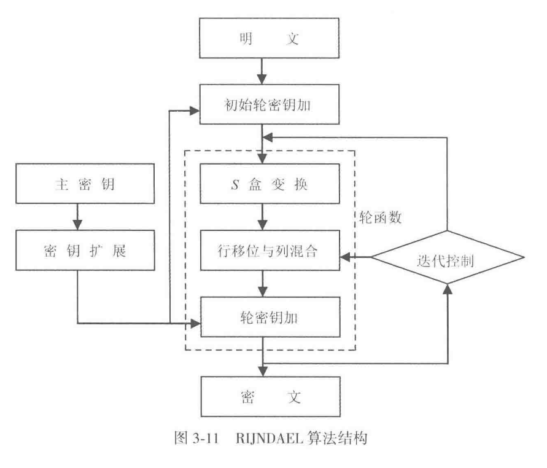
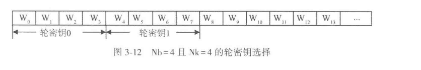
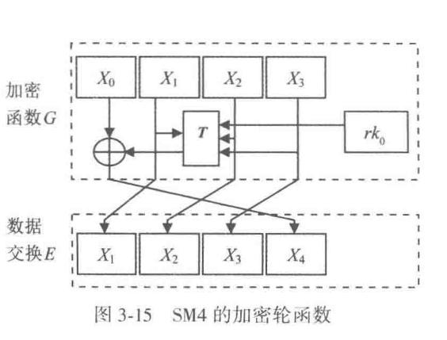

# 算法介绍-表


## AES


### 3.2.1 数学基础

这里是当年投稿的原论文：[这篇](https://www.researchgate.net/publication/220962914_The_Block_Cipher_Rijndael)。这个是最终出版的标准描述：[这篇](https://nvlpubs.nist.gov/nistpubs/FIPS/NIST.FIPS.197-upd1.pdf)

AES 的设计思路和 DES 不同。它采用代换-置换网络（substitution-permutation network, SPN）。AES 把分组写成一个状态矩阵，在有限域 $\mathrm{GF}(2^8)$ 上对字节做代数运算。教材先讲有限域和字节多项式表示，是为了给后面的字节代换、列混合和轮密钥扩展提供统一语言。

有限域 $GF(2^8)$ 上的元素有几种不同的表示方法，当然不同的表示方法的实现效率不同。RIJNDAEL 算法采用了多项式表示法。

接下来我们规定，把一个字节看成是在有限域 $GF(2^8)$ 上的一个元素，把一个 4 字节的字看成是系数取自 $GF(2^8)$，并且次数小于4次的多项式，下面是一些 **人工定义计算方式**

**定义 3-1** 一个由比特位 $b_7 b_6 b_5 b_4 b_3 b_2 b_1 b_0$ 组成的字节 $B$ 可表示成系数为 0、1 的二进制多项式：
$$
b\_7 x^7 + b\_6 x^6 + b\_5 x^5 + b\_4 x^4 + b\_3 x^3 + b\_2 x^2 + b\_1 x^1 + b\_0
$$

> 定义 3-1 在一个字节与一个次数低于 8 次的多项式之间建立了一种对应关系。给出一个字节，取出其各位作为系数便得到对应的次数低于 8 次的多项式。反之，对于一个次数低于 8 次的多项式，取出其系数便得到对应的字节。
>
> 例如，设字节 $B = 10011011$，则对应的多项式为：$x^7 + x^4 + x^3 + x + 1$。又例如，设多项式为：$x^7 + x^5 + x^2 + x + 1$，则对应的字节为 $B = 10100111$。

**定义 3-2** 在 $GF(2^8)$ 上的加法定义为二进制多项式的加法，其系数模 2 相加。

> 例如，$(x^7 + x^4 + x^3 + x + 1) + (x^6 + x^5 + x^3 + x^2 + x + 1) = (x^7 + x^6 + x^5 + x^4 + x^2)$，对应的二进制字节加为：$(10011011) \oplus (01101111) = (11110100)$。

**定义 3-3** 在 $GF(2^8)$ 上的乘法（用符号 $\cdot$ 表示，乘号常可省略）定义为二进制多项式的乘积，再模一个次数为 8 的不可约二进制多项式。

> 在 RIJNDAEL 中此不可约多项式建议为：
> $$
> m(x) = x^8 + x^4 + x^3 + x + 1
> $$
> 其系数的十六进制表示为 ‘11B’。
>
> 例如，
> $$
> (x^6 + x^4 + x^2 + x + 1) \cdot (x^7 + x + 1) = x^{13} + x^{11} + x^9 + x^8 + x^6 + x^5 + x^4 + x^3 + 1
> $$
> 而
> $$
> x^{13} + x^{11} + x^9 + x^8 + x^6 + x^5 + x^4 + x^3 + 1 \mod (x^8 + x^4 + x^3 + x + 1) = x^7 + x^6 + 1
> $$

**定义 3-4** 在 $GF(2^8)$ 中，二进制多项式 $b(x)$ 的乘法逆为满足式（3-4）的二进制多项式 $a(x)$，并记为 $a(x) = b^{-1}(x)$：
$$
a(x)b(x) \mod m(x) = 1
$$
**定义 3-5** 在 $GF(2^8)$ 中，倍乘函数 $\text{xtime}(b(x))$ 定义为 $x \cdot b(x) \mod m(x)$。

> 具体运算时可如下得到：把字节 $B$ 左移一位（最右位补 0），若 $b_7 = 1$，则左移后变成 8 次多项式，需要取模 $m(x)$，即异或 ‘11B’。
>
> 函数 $\text{xtime}(x)$ 也被称为 $x$ 乘或 $x$ 倍乘。例如，
>
>
$$
\begin{align}
\text{xtime}(57) &= x(x^6 + x^4 + x^2 + x + 1) \\
&= (x^7 + x^5 + x^3 + x^2 + x) \mod (x^8 + x^4 + x^3 + x + 1) \\
&= x^7 + x^5 + x^3 + x^2 + x \\
&= \text{‘AE’}\\
\end{align}
$$

>
> 又例如
>
>
$$
\begin{align}
\text{xtime}(\text{AE}) &= x(x^7 + x^5 + x^3 + x^2 + x) \\
&= x^8 + x^6 + x^4 + x^3 + x^2 \mod (x^8 + x^4 + x^3 + x + 1) \\
&= 47\\
\end{align}
$$

**定义 3-6** 有限域 $GF(2^8)$ 上的多项式是系数取自 $GF(2^8)$ 域元素的多项式。

> 这样，一个 4 字节的字与一个次数小于 4 次的 $GF(2^8)$ 上的多项式相对应。例如，字 $c = \text{‘03010102’}$ 与多项式 $c(x) = \text{‘03’}x^3 + \text{‘01’}x^2 + \text{‘01’}x + \text{‘02’}$ 相对应。知道了字 $c$，取出各字节作为系数便得到多项式 $c(x)$。反之，知道了多项式 $c(x)$，取出其各系数便得到字 $c$。

**定义 3-7** $GF(2^8)$ 上的多项式的加法定义为相应项系数相加。因为在域 $GF(2^8)$ 上的加是简单的按位异或，所以在域 $GF(2^8)$ 上的两个 4 字节的字的加也就是简单的按位异或。

**定义 3-8** $GF(2^8)$ 上的多项式 $a(x) = a_3 x^3 + a_2 x^2 + a_1 x + a_0$ 和 $b(x) = b_3 x^3 + b_2 x^2 + b_1 x + b_0$ 相乘模 $x^4 + 1$ 的积（表示为 $c(x) = a(x) \cdot b(x)$）为 $c(x) = c_3 x^3 + c_2 x^2 + c_1 x + c_0$，其系数由下面四个式子得到：

$$
\begin{cases}
c_0 = a_0 \cdot b_0 \oplus a_3 \cdot b_1 \oplus a_2 \cdot b_2 \oplus a_1 \cdot b_3\\
c_1 = a_1 \cdot b_0 \oplus a_0 \cdot b_1 \oplus a_3 \cdot b_2 \oplus a_2 \cdot b_3\\
c_2 = a_2 \cdot b_0 \oplus a_1 \cdot b_1 \oplus a_0 \cdot b_2 \oplus a_3 \cdot b_3\\
c_3 = a_3 \cdot b_0 \oplus a_2 \cdot b_1 \oplus a_1 \cdot b_2 \oplus a_0 \cdot b_3
\end{cases}
$$

利用定义 3-8 有：$x \cdot b(x) = b_2 x^3 + b_1 x^2 + b_0 x^1 + b_3 \mod (x^4 + 1)$。


### 3.2.2 RIJNDAEL 加密算法



接着课本说明它采用的是对轮函数实施迭代的结构。这里采用的是代替/置换网络结构，也就是 SP 结构；课本同时把它和 DES 使用的 Feistel 结构区分开来。图 3-11 表示的流程可以直接按信号流来理解：明文先进入“初始轮密钥加”，之后反复经过轮函数，轮函数内部依次经过 S 盒变换、行移位与列混合、轮密钥加；主密钥先经过密钥扩展，生成每一轮要使用的轮密钥；经过迭代控制以后，最后输出密文。课本把轮函数分成三层：

① 非线性层：进行非线性 S 盒变换 ByteSub，由 16 个 S 盒并置而成，起混淆作用；
② 线性混合层：进行行移位变换 ShiftRow 和列混合变换 MixColumn，以确保多轮之上的高度扩散；
③ 密钥加层：进行轮密钥加变换 AddRoundKey，把轮密钥简单异或到中间状态上，实现密钥的加密控制作用。

这样一来，“加密过程”就落实为围绕“状态”的连续变换。课本下一步先定义状态。


#### 状态的表示

在 Rijndael 算法中，加解密要经过多次数据变换操作，每一次变换操作产生一个中间结果，这个中间结果叫做“状态”。各种不同的密码变换都是对状态进行的。

状态表示为二维字节数组，每个元素是一个字节。它有 4 行，$Nb$ 列，其中 $Nb$ 等于数据块长度除以 32。

- 当数据块长度为 128 时，$Nb=4$。
- 当数据块长度为 192 时，$Nb=6$。
- 当数据块长度为 256 时，$Nb=8$。

因为状态数组有 4 行，所以从列的角度看，每一列都是 4 个字节，也就是一个字。有些密码变换是对字节进行的，有些密码变换是对字进行的。

课本给出了 128 位数据块时的状态表。它是一个 $4\times 4$ 的二维字节数组：

$$
\begin{array}{|c|c|c|c|}
\hline
a_{0,0} & a_{0,1} & a_{0,2} & a_{0,3} \\
\hline
a_{1,0} & a_{1,1} & a_{1,2} & a_{1,3} \\
\hline
a_{2,0} & a_{2,1} & a_{2,2} & a_{2,3} \\
\hline
a_{3,0} & a_{3,1} & a_{3,2} & a_{3,3} \\
\hline
\end{array}
$$

写入状态时采用“列优先”的顺序。对 128 位数据块，字节进入状态的顺序是：

$$
a_{0,0},\ a_{1,0},\ a_{2,0},\ a_{3,0},\ a_{0,1},\ a_{1,1},\ a_{2,1},\ a_{3,1},\ a_{0,2},\ a_{1,2},\ a_{2,2},\ a_{3,2},\ a_{0,3},\ a_{1,3},\ a_{2,3},\ a_{3,3}
$$

密钥也用二维字节数组表示，每个元素同样是一个字节，有 4 行，$Nk$ 列，其中 $Nk$ 等于密钥长度除以 32。对 128 位密钥，它对应的二维字节数组是：

$$
\begin{array}{|c|c|c|c|}
\hline
k_{0,0} & k_{0,1} & k_{0,2} & k_{0,3} \\
\hline
k_{1,0} & k_{1,1} & k_{1,2} & k_{1,3} \\
\hline
k_{2,0} & k_{2,1} & k_{2,2} & k_{2,3} \\
\hline
k_{3,0} & k_{3,1} & k_{3,2} & k_{3,3} \\
\hline
\end{array}
$$

密钥的存储顺序同样是列优先，也就是：

$$
k_{0,0},\ k_{1,0},\ k_{2,0},\ k_{3,0},\ k_{0,1},\ k_{1,1},\ k_{2,1},\ k_{3,1},\ k_{0,2},\ k_{1,2},\ k_{2,2},\ k_{3,2},\ k_{0,3},\ k_{1,3},\ k_{2,3},\ k_{3,3}
$$

有了 $Nb$ 和 $Nk$，课本再给出轮数 $Nr$ 的取值。$Nr$ 由 $Nb$ 和 $Nk$ 共同决定，表 3-5 写成下面这个形式：

$$
\begin{array}{|c|c|c|c|}
\hline
Nr & Nb=4 & Nb=6 & Nb=8 \\
\hline
Nk=4 & 10 & 12 & 14 \\
\hline
Nk=6 & 12 & 12 & 14 \\
\hline
Nk=8 & 14 & 14 & 14 \\
\hline
\end{array}
$$

到这里，课本实际上把后面所有过程的输入对象都准备好了：状态的大小由 $Nb$ 决定，密钥数组的大小由 $Nk$ 决定，轮数由 $Nb$ 和 $Nk$ 联合决定。


#### 轮函数

课本把 Rijndael 加密算法的轮函数写成标准伪代码：


```

Round
(
State
,

RoundKey
)

{


ByteSub
(
State
);


ShiftRow
(
State
);


MixColumn
(
State
);


AddRoundKey
(
State
,

RoundKey
);

}

```

这里顺序很重要。状态先经过字节代替，再做行移位，再做列混合，最后和本轮轮密钥异或。

然后课本专门把最后一轮单独写出来：


```

FinalRound
(
State
,

RoundKey
)

{


ByteSub
(
State
);


ShiftRow
(
State
);


AddRoundKey
(
State
,

RoundKey
);

}

```

最后一轮和标准轮函数相比，少了列混合变换 $MixColumn(State)$。这一点课本也直接指出了。

接下来课本把这四个变换逐个展开。


##### S 盒变换 ByteSub

ByteSub 是按字节进行的代替变换，也叫 S 盒变换。它作用在状态中的每个字节上。这个变换按两步进行。

第一步，把字节的值用它的乘法逆代替。乘法逆根据前文公式（3-4）求得，其中 $00$ 的逆元是它自己。

第二步，对经过第一步处理后的字节再进行仿射变换。课本给出的公式（3-6）是：

$$
\begin{pmatrix} y_0 \\ y_1 \\ y_2 \\ y_3 \\ y_4 \\ y_5 \\ y_6 \\ y_7 \end{pmatrix}
=
\begin{pmatrix}
1 & 0 & 0 & 0 & 1 & 1 & 1 & 1 \\
1 & 1 & 0 & 0 & 0 & 1 & 1 & 1 \\
1 & 1 & 1 & 0 & 0 & 0 & 1 & 1 \\
1 & 1 & 1 & 1 & 0 & 0 & 0 & 1 \\
1 & 1 & 1 & 1 & 1 & 0 & 0 & 0 \\
0 & 1 & 1 & 1 & 1 & 1 & 0 & 0 \\
0 & 0 & 1 & 1 & 1 & 1 & 1 & 0 \\
0 & 0 & 0 & 1 & 1 & 1 & 1 & 1
\end{pmatrix}
\begin{pmatrix}
x_0 \\
x_1 \\
x_2 \\
x_3 \\
x_4 \\
x_5 \\
x_6 \\
x_7
\end{pmatrix}
\oplus
\begin{pmatrix}
1 \\
1 \\
0 \\
0 \\
0 \\
1 \\
1 \\
0
\end{pmatrix}
$$

> 例：设输入字节
>
>
$$
X=[x_7,x_6,x_5,x_4,x_3,x_2,x_1,x_0]=[95]=[10010101]
$$

>
> 它的乘法逆为
>
>
$$
[8A]=[10001010]
$$

>
> 根据公式（3-15）计算以后，得到
>
>
$$
Y=[y_7,y_6,y_5,y_4,y_3,y_2,y_1,y_0]=[2A]=[00101010]
$$

值得注意的是

① 公式（3-6）的第一步，也就是字节的乘法逆代替，是一种非线性变换。
② 由于公式（3-6）的系数矩阵中每列都有 5 个 1，这说明变换输入中的任意一位会影响输出中的 5 位。
③ 由于公式（3-6）的系数矩阵中每行都有 5 个 1，这说明输出中的每一位都与输入中的 5 位相关。
④ ByteSub 变换在作用层次上对应 DES 中的 S 盒子。它为加密算法提供非线性，是决定加密算法安全性的关键。它是一个 8 位输入、8 位输出的非线性变换。

接着课本还指出了一个实现层面的要求：为了确保解密算法可逆，由上式定义的 ByteSub 变换必须是可逆的。

Note

可以直接按“每一位输出都由若干位输入异或得到”来理解


##### 行移位变换 ShiftRow

ShiftRow 变换是对状态的行进行循环移位。

课本给出的规则是：在 ShiftRow 变换中，状态的第 0 行不移位，第 1 行循环左移 $C_1$ 个字节，第 2 行循环左移 $C_2$ 个字节，第 3 行循环左移 $C_3$ 个字节。

移位值 $C_1$、$C_2$、$C_3$ 与 $Nb$ 有关，表 3-6 写成：

$$
\begin{array}{|c|c|c|c|}
\hline
Nb & C_1 & C_2 & C_3 \\
\hline
4 & 1 & 2 & 3 \\
\hline
6 & 1 & 2 & 3 \\
\hline
8 & 1 & 3 & 4 \\
\hline
\end{array}
$$

ByteSub 改变的是每个字节本身，ShiftRow 开始打破“同一列内部”的原有对齐关系，把不同列的字节交错起来，为下一步列混合创造条件。


##### 列混合变换 MixColumn

MixColumn 变换是对状态的列进行混合变换。课本的表述是：在 MixColumn 变换中，把状态中的每一列看做 $GF(2^8)$ 上的多项式，并与一个固定多项式 $c(x)$ 相乘，然后模多项式 $x^4+1$。

其中

$$
c(x)={03}x^3+{01}x^2+{01}x+{02}
\tag{3-7}
$$

因为 $c(x)$ 与 $x^4+1$ 是互素的，从而保证 $c(x)$ 存在逆多项式 $d(x)$，使

$$
c(x)d(x)=1 \pmod{x^4+1}
$$

只有逆多项式 $d(x)$ 存在，才能正确进行解密。也就是说，列混合在设计时已经同时考虑了扩散能力和可逆性。


##### 密钥加变换 AddRoundKey

AddRoundKey 变换是利用轮密钥对状态进行模 2 相加的变换。模 2 相加在字节层面就是 **异或**。

课本这里强调了两个点。第一，轮密钥长度等于数据块长度。第二，在这个操作中，轮密钥被简单地异或到状态中去。轮密钥根据轮密钥产生算法，通过主密钥扩展和选择得到。

到这里，轮函数内部的四步已经完整了。课本随后给出一个几何化理解：可以把 Rijndael 加密算法的数据状态看成玩具魔方的一个侧面，行移位 ShiftRow 对应对魔方的行做循环移位，列混合 MixColumn 对应对魔方的列做操作。由于是从横和竖两个方向共同处理数据状态，所以增强了加密的扩散效果。


#### 轮密钥产生算法

接下来还要把每一轮使用的轮密钥来源接进来，因为状态变换和轮密钥生成共同构成完整的加密过程。课本明确说，轮密钥由主密钥产生，轮密钥产生分两步：密钥扩展和密钥选择，并且遵循下面的原则。

① 轮密钥的比特总数为 **数据块长度与轮数加 1 的积**。例如，对于 128 位的分组长度和 10 轮迭代，轮密钥总长度为

$$
128\times(10+1)=1408\text{ 位}
$$
② 首先将用户密钥扩展为一个扩展密钥。
③ 再从扩展密钥中选出轮密钥：第一个轮密钥由扩展密钥中的前 $Nb$ 个字组成，第二个轮密钥由接下来的 $Nb$ 个字组成，以此类推。


##### 密钥扩展

课本使用一个字为元素的一维数组

$$
W[Nb\times(Nr+1)]
$$
来存储扩展密钥。把主密钥放在数组 $W$ 最开始的 $Nk$ 个字中，其它字由它前面的字经过处理后得到。之后课本根据 $Nk\le 6$ 和 $Nk>6$ 分成两种扩展策略。

当 $Nk\le 6$ 时，课本给出的伪代码是：


```

KeyExpansion
(
CipherKey
,

W
)

{


For
(
I
=
0
;

I
<
Nk
;

I
++
)

W
[
I
]
=
CipherKey
[
I
];


For
(
I
=
Nk
;

I
<
Nb
*
(
Nr
+
1
);

I
++
)


{


Temp
=
W
[
I
-1
];


IF
(
I
%
Nk
==
0
)


Temp
=
SubByte
(
Rotl
(
Temp
))

⊕

Rcon
[
I
/
Nk
];


W
[
I
]
=
W
[
I
-
Nk
]

⊕

Temp
;


}

}

```

> 最前面的 $Nk$ 个字由主密钥直接填充。之后的每一个字 $W[I]$ 都等于前面一个字 $W[I-1]$ 与前面第 $Nk$ 个位置的字 $W[I-Nk]$ 的异或。只有当 $I$ 是 $Nk$ 的整数倍时，才先对 $W[I-1]$ 进行额外变换，再参与异或。

这个额外变换由两部分组成。

第一部分是 $Rotl$ 变换。$Rotl$ 是对一个字的 4 个字节按字节单位进行循环移位的函数。设

$$
W=(A,B,C,D)
$$
则

$$
Rotl(W)=(B,C,D,A)
$$
第二部分是 $SubByte$ 变换，也就是对字中的每个字节逐个做前面定义过的 ByteSub。

然后再异或一个轮常数 $Rcon$。课本给出的定义是：

$$
Rcon[i]=(RC[i],\ \texttt{'00'},\ \texttt{'00'},\ \texttt{'00'})
$$

$$
RC[0]=\texttt{'01'}
$$

$$
RC[i]=xtime(RC[i-1])
$$

课本接着说明，使用轮常数 $Rcon$ 的目的，是防止不同轮的轮密钥存在相似性。由于轮常数 $Rcon$ 是变化的，所以不同轮的轮密钥明显不同。

当 $Nk>6$ 时，伪代码是：


```

KeyExpansion
(
CipherKey
,

W
)

{


For
(
I
=
0
;

I
<
Nk
;

I
++
)

W
[
I
]
=
CipherKey
[
I
];


For
(
I
=
Nk
;

I
<
Nb
*
(
Nr
+
1
);

I
++
)


{


Temp
=
W
[
I
-1
];


IF
(
I
%
Nk
==
0
)


Temp
=
SubByte
(
Rotl
(
Temp
))

⊕

Rcon
[
I
/
Nk
];


ELSE

IF
(
I
%
Nk
==
4
)


Temp
=
SubByte
(
Temp
);


W
[
I
]
=
W
[
I
-
Nk
]

⊕

Temp
;


}

}

```

这里和前一种策略相比，多出来的分支是 $I\%Nk=4$ 时还要执行一次 $Temp=SubByte(Temp)$

> 因为，当 $Nk>6$ 时，密钥更长。若仍然只在 $I$ 是 $Nk$ 的整数倍时对字进行 ByteSub，那么 ByteSub 变换的密度较稀，安全程度不够强。现在在 $I\bmod Nk=4$ 的位置增加一部分字的 ByteSub 变换，就提高了扩展密钥的安全性。


##### 轮密钥选择

轮密钥 $I$ 由轮密钥缓冲区 $W[Nb\times I]\ \text{到}\ W[Nb\times(I+1)-1]$ 中的字组成。



以 $Nb=4$ 且 $Nk=4$ 为例，图 3-12 表示的选择顺序就是：

- 轮密钥 0：$W_0,W_1,W_2,W_3$
- 轮密钥 1：$W_4,W_5,W_6,W_7$
- 轮密钥 2：$W_8,W_9,W_{10},W_{11}$
- 轮密钥 3：$W_{12},W_{13},\dots$

于是，扩展密钥形成一条连续的一维字数组，每一轮轮密钥都从其中按 $Nb$ 个字为一组顺次切出。


#### 加密算法的整体过程

前面的状态、轮函数和轮密钥现在可以合到一起。课本明确写出，Rijndael 加密算法由以下三部分组成：

① 一个初始轮密钥加。
② $Nr-1$ 轮标准轮函数。
③ 最后一轮的非标准轮函数。

然后给出总伪代码：


```

Rijndael
(
State
,

CipherKey
)

{


KeyExpansion
(
CipherKey
,

RoundKey
)


AddRoundKey
(
State
,

ExpandedKey
)


For
(
I
=
1
;

I
<
Nr
;

I
++
)


Round
(
State
,

ExpandedKey
+
Nb
*
I
)


{


ByteSub
(
State
);


ShiftRow
(
State
);


MixColumn
(
State
);


AddRoundKey
(
State
,

ExpandedKey
+
Nb
*
I
);


}


FinalRound
(
State
,

ExpandedKey
+
Nb
*
Nr
)


{


ByteSub
(
State
);


ShiftRow
(
State
);


AddRoundKey
(
State
,

ExpandedKey
+
Nb
*
Nr
);


}

}

```

课本随后解释，这里的 $ExpandedKey$ 就是前面存储扩展密钥的数组 $W[Nb\times(Nr+1)]$

把整段内容顺下来，加密过程就形成了课本中的完整链条：

先把明文按列优先写入状态，把主密钥按列优先写成密钥数组；由 $Nb$ 和 $Nk$ 决定轮数 $Nr$；再由主密钥做扩展，得到扩展密钥数组 $W[Nb\times(Nr+1)]$；先执行一次初始轮密钥加；之后执行 $Nr-1$ 轮标准轮函数，每一轮都依次做 ByteSub、ShiftRow、MixColumn、AddRoundKey；最后执行一轮省去 MixColumn 的 FinalRound；输出状态，此时它就是密文。

可以，下面把上一条改成行内公式统一用 `$...$` 包裹的版本。

课本这一节先从一个事实开始：Rijndael 的解密流程无法直接照搬加密流程。原因在于，这个算法属于非对合运算；同一套操作连续作用两次，结果不会自动回到原文。沿着“解密就是把加密所做的事逐步还原”这个思路，最直接的写法当然是把加密过程倒着执行。课本接着指出，这样写虽然概念上直接，工程实现的结构却较散。Rijndael 设计得很巧，通过稍微调整轮密钥的扩展方式，可以把解密改写成一种等价形式。这样一来，解密也能组织成“初始轮密钥加 + 多轮迭代 + 最后一轮”的框架，整体结构就和加密算法靠得很近，利于实现和复用。

要把这件事讲清楚，先要把每个基本变换的逆变换交代完整，因为整个解密算法就是由这些逆变换拼起来的。


### 3.2.3 解密


#### 1. 逆变换

课本先讨论行移位的逆。加密时，$\mathrm{ShiftRow}$ 把状态矩阵的第 $1,2,3$ 行依次循环左移 $C_1,C_2,C_3$ 个字节。于是解密时就要把这三行依次移回去。课本写成：$\mathrm{ShiftRow}$ 的逆是状态的后三行依次移动 $Nb-C_1$、$Nb-C_2$ 和 $Nb-C_3$ 个字节。因为状态一行一共有 $Nb$ 个字节，向左移 $C_i$ 个字节和向右移 $Nb-C_i$ 个字节在循环意义下是同一件事，所以这个逆操作正好能把行内字节恢复到加密前的位置。

接着是列混合的逆。加密阶段中，每一列状态都被看成 $GF(2^8)$ 上的一个三次以下多项式，并与固定多项式 $c(x)$ 相乘。解密时就要乘上它的逆多项式。课本把逆变换写成：

$$
d(x)=\texttt{'0B'}x^3+\texttt{'0D'}x^2+\texttt{'09'}x+\texttt{'0E'}
\tag{3-8}
$$

随后课本说明，式 $(3\text{-}7)$ 中的 $c(x)$ 与式 $(3\text{-}8)$ 中的 $d(x)$ 的积等于单位元 $\texttt{'01'}$，所以 $d(x)$ 正是 $c(x)$ 的逆多项式。这里的意思很直接：加密时对列做过一次“乘 $c(x)$”的混合，解密时再做一次“乘 $d(x)$”，两次作用合在一起就把这一列带回原状。

然后是轮密钥加。$\mathrm{AddRoundKey}$ 的运算本质是按位异或。异或有一个很关键的性质：同一个值异或两次就会回到原值。因此课本直接给出结论，$\mathrm{AddRoundKey}$ 的逆就是它自己。设状态为 $S$，轮密钥为 $K$，那么

$$
(S\oplus K)\oplus K=S
$$

这也是解密中最容易理解的一步。

接下来最值得仔细解释的是 $\mathrm{ByteSub}$ 的逆，也就是 $\mathrm{InvByteSub}$。课本写道：$\mathrm{ByteSub}$ 的逆是把 $S_box$ 的逆作用到状态的每个字节上。构造方法分成两步，顺序和加密时相反。加密时先做有限域上的乘法逆，再做仿射变换；于是解密时先把仿射变换反过来，再对结果取 $GF(2^8)$ 上的乘法逆。课本把仿射逆变换写成式 $(3\text{-}9)$

$$
\begin{pmatrix} x_0 \ x_1 \ x_2 \ x_3 \ x_4 \ x_5 \ x_6 \ x_7 \end{pmatrix}
\begin{pmatrix}
0 & 0 & 1 & 0 & 0 & 1 & 0 & 1 \\
1 & 0 & 0 & 1 & 0 & 0 & 1 & 0 \\
0 & 1 & 0 & 0 & 1 & 0 & 0 & 1 \\
1 & 0 & 1 & 0 & 0 & 1 & 0 & 0 \\
0 & 1 & 0 & 1 & 0 & 0 & 1 & 0 \\
0 & 0 & 1 & 0 & 1 & 0 & 0 & 1 \\
1 & 0 & 0 & 1 & 0 & 1 & 0 & 0 \\
0 & 1 & 0 & 0 & 1 & 0 & 1 & 0
\end{pmatrix}
\begin{pmatrix}
y_0 \\
y_1 \\
y_2 \\
y_3 \\
y_4 \\
y_5 \\
y_6 \\
y_7
\end{pmatrix}
\oplus
\begin{pmatrix}
1 \\
0 \\
1 \\
0 \\
0 \\
0 \\
0 \\
0
\end{pmatrix}
\tag{3-9}
$$

课本紧接着说明，式 $(3\text{-}9)$ 是根据前面的式 $(3\text{-}6)$ 推导出来的，两式中的矩阵互为逆矩阵，所以这一步确实会把加密时做过的仿射变换抵消掉。

这一段还给了一个和前文相衔接的例子。前面在 $\mathrm{ByteSub}$ 中举过例子，输入

$$
X=[x_7,x_6,x_5,x_4,x_3,x_2,x_1,x_0]=[95]=[10010101]
$$

经过 $\mathrm{ByteSub}$ 得到

$$
Y=[y_7,y_6,y_5,y_4,y_3,y_2,y_1,y_0]=[2A]=[00101010]
$$

现在把这个 $Y$ 代入式 $(3\text{-}9)$，可得

$$
[8A]=[10001010]
$$

再对它求乘法逆，得到

$$
[95]=[10010101]
$$

恰好回到式 $(3\text{-}6)$ 中举例时的输入 $X$。这个例子把 $\mathrm{InvByteSub}$ 的两步顺序表现得很清楚：先逆仿射，再取乘法逆，原字节就回来了。

把四个基本逆变换放在一起看，逻辑很统一。加密时，$\mathrm{ByteSub}$ 负责在字节层面引入非线性，$\mathrm{ShiftRow}$ 负责打散行内位置，$\mathrm{MixColumn}$ 负责在列内扩散，$\mathrm{AddRoundKey}$ 负责把密钥注入状态；解密时，每一步都按相反方向把这些作用一层层消掉。


#### 2. 逆轮函数的定义

在基本逆变换已经齐全以后，课本把它们组织成一个逆轮函数。标准逆轮函数定义为：


```

Inv_Round
(
State
,

Inv_RoundKey
)

{


InvByteSub
(
State
);


InvShiftRow
(
State
);


InvMixColumn
(
State
);


AddRoundKey
(
State
,

Inv_RoundKey
);

}

```

最后一轮的非标准逆轮函数定义为：


```

Inv_FinalRound
(
State
,

Inv_RoundKey
)

{


InvByteSub
(
State
);


InvShiftRow
(
State
);


AddRoundKey
(
State
,

Inv_RoundKey
);

}

```

这里最值得注意的是顺序。直接从“把加密过程倒过来”的角度去想，很多人会自然想到先处理轮密钥，再处理字节和行列变换。课本这一节给出的写法属于“等价解密算法”的组织方式，它提前把中间各轮的轮密钥做了一个额外处理，于是逆轮函数也能排成和加密轮函数很接近的样子：先做字节代替，再做行移位，再做列混合，最后做轮密钥加。这样写的价值主要体现在工程上。加密和解密两边都保留了相似的轮结构，硬件流水和软件代码都更容易统一设计。

你可以把这件事理解成一次“把麻烦挪到密钥预处理阶段”。原本应当出现在轮函数内部的某些逆向调整，被吸收到 $\mathrm{Inv_KeyExpansion}$ 里了。这样轮函数主体就更整齐。


#### 3. 解密算法

接着课本把整个解密流程写出来。伪 C 代码如下：


```

Inv_Rijndael
(
State
,

CipherKey
)

{


Inv_KeyExpansion
(
CipherKey
,

Inv_ExpandedKey
);


AddRoundKey
(
State
,

Inv_ExpandedKey
+
Nb
*
Nr
);


For
(
I
=
Nr
-1
;

I
>
0
;

I
--
)


Inv_Round
(
State
,

Inv_ExpandedKey
+
Nb
*
I
);


Inv_FinalRound
(
State
,

Inv_ExpandedKey
)

}

```

如果把其中各个轮函数的内容一并展开，课本给出的结构等价于：


```

Inv_Rijndael
(
State
,

CipherKey
)

{


Inv_KeyExpansion
(
CipherKey
,

Inv_ExpandedKey
);


AddRoundKey
(
State
,

Inv_ExpandedKey
+
Nb
*
Nr
);


For
(
I
=
Nr
-1
;

I
>
0
;

I
--
)


Inv_Round
(
State
,

Inv_ExpandedKey
+
Nb
*
I
);


{


InvByteSub
(
State
);


InvShiftRow
(
State
);


InvMixColumn
(
State
);


AddRoundKey
(
State
,

Inv_ExpandedKey
+
Nb
*
I
);


}


Inv_FinalRound
(
State
,

Inv_ExpandedKey
)


{


InvByteSub
(
State
);


InvShiftRow
(
State
);


AddRoundKey
(
State
,

Inv_ExpandedKey
);


}

}

```

这段代码要按“密文是怎样一步步被还原成明文”的顺序去理解。

首先，输入状态此时装的是密文。然后先做 $\mathrm{Inv_KeyExpansion}$，把用户主密钥扩展成解密用的轮密钥序列。这个扩展序列在排列顺序上和加密共用同一批轮号，中间各轮的内容已经经过 $\mathrm{InvMixColumn}$ 预处理。

$AddRoundKey(State, Inv_ExpandedKey+Nb*Nr)$ 使用的是最后一轮轮密钥。这里和加密正好对应。加密时，一开始先用第 $0$ 轮轮密钥；解密时，一开始先用第 $Nr$ 轮轮密钥，因为当前状态来自加密的最后输出，恢复过程自然要先抵消最后一次轮密钥加。

接着进入循环：$For(I=Nr-1; I>0; I--)$。这说明解密时轮号是倒着走的，从 $Nr-1$ 一直走到 $1$。每一轮都做四件事：$\mathrm{InvByteSub}$、$\mathrm{InvShiftRow}$、$\mathrm{InvMixColumn}$、$\mathrm{AddRoundKey}$。循环结束后，状态中还剩最开头那一轮留下的影响，于是最后再执行一次最后一轮逆轮函数，并使用第 $0$ 轮轮密钥，也就是 $Inv_ExpandedKey$ 指向的那一组字。

如果把 AES 常见的 128 位分组情形代进去，也就是 $Nb=4$、$Nk=4$、$Nr=10$，那么解密流程就会变得很直观：密文进入状态后，先和第 $10$ 轮轮密钥异或；然后依次执行第 $9,8,7,6,5,4,3,2,1$ 轮的逆轮函数；最后执行一次使用第 $0$ 轮轮密钥的逆末轮，输出明文。轮密钥的使用方向和加密正好相反，这也是课本在后面单独提醒的一点。

1. 解密密钥扩展为什么要单独定义

课本在伪代码后面专门写了一句提醒：解密算法与加密算法使用轮密钥的顺序相反。紧接着又说明，解密算法的密钥扩展定义包含两步。

第一步，先执行加密算法的密钥扩展。

第二步，把 $\mathrm{InvMixColumn}$ 应用到除第一个轮密钥和最后一个轮密钥之外的所有轮密钥上。

课本给出的伪 C 代码是：


```

Inv_KeyExpansion
(
CipherKey
,

Inv_ExpandedKey
)

{


Key_Expansion
(
CipherKey
,

Inv_ExpandedKey
);


For
(
I
=
1
;

I
<
Nr
;

I
++
)


InvMixColumn
(
Inv_ExpandedKey
+
Nb
*
I
);

}

```

这一段是整节内容中最关键的工程技巧。它解决的问题是：怎样让解密也写成和加密近似的轮结构。

可以把它拆成三层来看。

第一层，普通的 $\mathrm{Key_Expansion}$ 先生成加密时那套完整的扩展密钥序列。此时共有 $Nr+1$ 组轮密钥，从第 $0$ 轮到第 $Nr$ 轮。

第二层，对中间各轮，也就是 $I=1,2,\dots,Nr-1$ 这些轮密钥，逐组施加 $\mathrm{InvMixColumn}$。第一个轮密钥和最后一个轮密钥保持原状。课本之所以单独把这两组排除出去，是因为解密算法的首尾两轮本来就和标准轮不同，它们内部本来就缺少 $\mathrm{InvMixColumn}$ 这一步；既然轮函数里缺少这一步，轮密钥也就不再为它做配套预处理。

第三层，这样处理之后，轮函数中的 $\mathrm{AddRoundKey}$ 可以被放到 $\mathrm{InvMixColumn}$ 的后面，同时仍与直接逆运算得到的结果等价。于是解密轮函数在外形上就和加密轮函数非常接近了。

从代数上看，这一步利用的是列混合作为线性变换与异或运算之间的相容性。把状态记为 $S$，轮密钥记为 $K$，线性变换记为 $L$，则有

$$
L(S\oplus K)=L(S)\oplus L(K)
$$

$\mathrm{InvMixColumn}$ 恰好属于这样的线性变换，所以它既可以作用在状态上，也可以预先作用到轮密钥上。正是这个性质，使“等价解密算法”成立。


## 3.3 中国商用密码算法 SM4

2006 年我国国家密码管理局公布了无线局域网产品使用的 SM4 密码算法。这是我国第一次公布自己的商用密码算法，意义重大。这一举措标志着我国商用密码管理更加科学化。这必将促进我国商用密码的科学研究和产业发展。

SM4 密码算法设计简洁，算法结构有特色，安全高效。它的公开颁布向世界展示了我国在商用密码方面的研究成果。


### 3.3.1 SM4 算法描述

SM4 密码算法是一个分组算法，数据分组长度为 128 比特，密钥长度为 128 比特。加密算法与密钥扩展算法都采用 32 轮迭代结构。SM4 密码算法以字节（8 位）和字（32 位）为单位进行加解密数据处理。SM4 密码算法是对合运算，因此解密算法与加密算法相同，轮密钥的使用顺序相反。


#### 1. 基本运算

SM4 密码算法使用模 2 加和循环移位作为基本运算。

① 模 2 加：$\oplus$，32 位异或运算。

② 循环移位：$\lll i$，把 32 位字循环左移 $i$ 位。


#### 2. 基本密码部件

SM4 密码算法使用了以下基本密码部件。

1）S 盒

SM4 的 S 盒是一种以字节为单位的非线性代替变换，其密码学的作用是起混淆作用，使明文、密钥、密文之间的关系错综复杂，提高安全性。S 盒的输入和输出都是 8 位的字节。它本质上是 8 位的非线性置换，设输入字节为 $a$，输出字节为 $b$，则 S 盒的运算可表示为：
$$
b=S\_{box}(a)
\tag{3-22}
$$
S 盒的代替规则如表 3-9 所示。例如，设 S 盒的输入为 EF，则 S 盒的输出为表 3-9 中第 E 行与第 F 列交点处的值 84。即，$S_{box}(\mathrm{EF})=84$。

表 3-9 的 S 盒表如下：

| 高位\低位 | 0 | 1 | 2 | 3 | 4 | 5 | 6 | 7 | 8 | 9 | A | B | C | D | E | F |
| --- | --- | --- | --- | --- | --- | --- | --- | --- | --- | --- | --- | --- | --- | --- | --- | --- |
| 0 | D6 | 90 | E9 | FE | CC | E1 | 3D | B7 | 16 | B6 | 14 | C2 | 28 | FB | 2C | 05 |
| 1 | 2B | 67 | 9A | 76 | 2A | BE | 04 | C3 | AA | 44 | 13 | 26 | 49 | 86 | 06 | 99 |
| 2 | 9C | 42 | 50 | F4 | 91 | EF | 98 | 7A | 33 | 54 | 0B | 43 | ED | CF | AC | 62 |
| 3 | E4 | B3 | 1C | A9 | C9 | 08 | E8 | 95 | 80 | DF | 94 | FA | 75 | 8F | 3F | A6 |
| 4 | 47 | 07 | A7 | FC | F3 | 73 | 17 | BA | 83 | 59 | 3C | 19 | E6 | 85 | 4F | A8 |
| 5 | 68 | 6B | 81 | B2 | 71 | 64 | DA | 8B | F8 | EB | 0F | 4B | 70 | 56 | 9D | 35 |
| 6 | 1E | 24 | 0E | 5E | 63 | 58 | D1 | A2 | 25 | 22 | 7C | 3B | 01 | 21 | 78 | 87 |
| 7 | D4 | 00 | 46 | 57 | 9F | D3 | 27 | 52 | 4C | 36 | 02 | E7 | A0 | C4 | C8 | 9E |
| 8 | EA | BF | 8A | D2 | 40 | C7 | 38 | B5 | A3 | F7 | F2 | CE | F9 | 61 | 15 | A1 |
| 9 | E0 | AE | 5D | A4 | 9B | 34 | 1A | 55 | AD | 93 | 32 | 30 | F5 | 8C | B1 | E3 |
| A | 1D | F6 | E2 | 2E | 82 | 66 | CA | 60 | C0 | 29 | 23 | AB | 0D | 53 | 4E | 6F |
| B | D5 | DB | 37 | 45 | DE | FD | 8E | 2F | 03 | FF | 6A | 72 | 6D | 6C | 5B | 51 |
| C | 8D | 1B | AF | 92 | BB | DD | BC | 7F | 11 | D9 | 5C | 41 | 1F | 10 | 5A | D8 |
| D | 0A | C1 | 31 | 88 | A5 | CD | 7B | BD | 2D | 74 | D0 | 12 | B8 | E5 | B4 | B0 |
| E | 89 | 69 | 97 | 4A | 0C | 96 | 77 | 7E | 65 | B9 | F1 | 09 | C5 | 6E | C6 | 84 |
| F | 18 | F0 | 7D | EC | 3A | DC | 4D | 20 | 79 | EE | 5F | 3E | D7 | CB | 39 | 48 |

2）非线性变换 $\tau$

SM4 的非线性变换是一种以字为单位的非线性代替变换。它由 4 个 S 盒并行构成。本质上它是 S 盒的一种并行应用。

设输入字为 $A=(a_0,a_1,a_2,a_3)$，输出字为 $B=(b_0,b_1,b_2,b_3)$，则
$$
B=\tau(A)=\bigl(S\_{box}(a\_0), S\_{box}(a\_1), S\_{box}(a\_2), S\_{box}(a\_3)\bigr)
\tag{3-23}
$$
3）线性变换部件 $L$

线性变换部件 $L$ 是以字为处理单位的线性变换部件，其输入输出都是 32 位的字。其密码学的作用是起扩散的作用，把 S 盒的混淆作用尽可能地扩散到更大范围。

设 $L$ 的输入为字 $B$，输出为字 $C$，则
$$
\begin{aligned}
C=L(B)
&=B\oplus(B\lll 2)\oplus(B\lll 10)\oplus(B\lll 18)\oplus(B\lll 24)
\end{aligned}
\tag{3-24}
$$
4）合成变换 $T$

合成变换 $T$ 由非线性变换 $\tau$ 和线性变换 $L$ 复合而成，数据处理的单位是字。设输入为字 $X$，则对 $X$ 进行非线性 $\tau$ 变换，再进行线性 $L$ 变换。记为
$$
T(X)=L(\tau(X))
\tag{3-25}
$$
由于合成变换 $T$ 是非线性变换 $\tau$ 和线性变换 $L$ 的复合，所以它综合起到混淆和扩散的作用，从而提高密码的安全性。


#### 3. 轮函数

SM4 密码算法采用基本轮函数进行迭代的结构，利用上述基本密码部件，便可构成轮函数。SM4 密码算法的轮函数是一种以字为处理单位的密码函数。

设轮函数 $F$ 的输入为 $(X_0,X_1,X_2,X_3)$，四个 32 位字，共 128 位。轮密钥为 $rk$，$rk$ 也是一个 32 位的字。轮函数 $F$ 的输出也是一个 32 位的字。轮函数 $F$ 的运算由式（3-26）给出：
$$
F(X\_0,X\_1,X\_2,X\_3,rk)=X\_0\oplus T(X\_1\oplus X\_2\oplus X\_3\oplus rk)
\tag{3-26}
$$
根据式（3-25），有
$$
F(X\_0,X\_1,X\_2,X\_3,rk)=X\_0\oplus L\bigl(\tau(X\_1\oplus X\_2\oplus X\_3\oplus rk)\bigr)
$$
简记 $B=(X_1\oplus X_2\oplus X_3\oplus rk)$，根据式（3-22）和式（3-23），有
$$
\begin{aligned}
F(X\_0,X\_1,X\_2,X\_3,rk)= &X\_0\oplus \bigl[S\_{box}(B)\bigr]\oplus \bigl[S\_{box}(B)\lll 2\bigr]\
&\oplus \bigl[S\_{box}(B)\lll 10\bigr]\oplus \bigl[S\_{box}(B)\lll 18\bigr]\oplus \bigl[S\_{box}(B)\lll 24\bigr]
\end{aligned}
\tag{3-27}
$$
根据式（3-27）可以得到图 3-13 的轮函数结构图，其中 $B=(X_1\oplus X_2\oplus X_3\oplus rk)$，$S$ 表示 $S_{box}$ 变换，$T$ 变换框表示由式（3-25）的 $T$ 变换。


#### 4. 加密算法

SM4 密码算法是一个分组算法。数据分组长度为 128 比特，密钥长度为 128 比特。加密算法采用 32 轮迭代结构，每轮使用一个轮密钥。

设输入明文为 $(X_0,X_1,X_2,X_3)$，四个字，共 128 位。输入轮密钥为 $rk_i$，$i=0,1,\cdots,31$，共 32 个字。输出密文为 $(Y_0,Y_1,Y_2,Y_3)$，四个字，128 位。则加密算法可描述如下。

加密算法：
$$
\begin{aligned}
X\_{i+4}&=F(X\_i,X\_{i+1},X\_{i+2},X\_{i+3},rk\_i)\
&=X\_i\oplus T(X\_{i+1}\oplus X\_{i+2}\oplus X\_{i+3}\oplus rk\_i),\ i=0,1,\cdots,31
\end{aligned}
\tag{3-28}
$$
为了与解密算法需要的顺序一致，在加密算法之后还需要增加一个反序处理 $R$：
$$
R(Y\_0,Y\_1,Y\_2,Y\_3)=(X\_{35},X\_{34},X\_{33},X\_{32})
\tag{3-29}
$$
原文紧接着说明，SM4 的加密迭代处理有自己的特点：一次处理四个字，产生一个字的中间密文，这个中间密文再与前三个字拼接，作为下一轮输入，共迭代 32 轮。整个过程可以看成一个宽度为四个字的窗口向前滑动，每轮滑动一个字，总共滑动 32 次。


#### 5. 解密算法

SM4 密码算法是对合运算，因此解密算法与加密算法相同，轮密钥的使用顺序反过来，解轮密钥就是加密轮密钥的逆序。

设输入密文为 $(Y_0,Y_1,Y_2,Y_3)$，输入轮密钥为 $rk_i$，$i=31,30,\cdots,1,0$，输出明文为 $(M_0,M_1,M_2,M_3)$。根据式（3-29）应有 $(Y_0,Y_1,Y_2,Y_3)=(X_{35},X_{34},X_{33},X_{32})$。因为加密算法结束后加了一个反序变换 $R$，反序后的密文数据刚好符合这一要求。于是，在解密算法中直接采用 $(X_{35},X_{34},X_{33},X_{32})$ 表示初始的待解密密文，用 $X_i$ 表示解密过程中的中间数据。于是可得到如下解密算法。

解密算法：
$$
\begin{aligned}
X\_i&=F(X\_{i+4},X\_{i+3},X\_{i+2},X\_{i+1},rk\_i)\
&=X\_{i+4}\oplus T(X\_{i+3}\oplus X\_{i+2}\oplus X\_{i+1}\oplus rk\_i),\ i=31,30,\cdots,1,0
\end{aligned}
\tag{3-30}
$$
与加密算法后需要一个反序处理一样，解密算法之后也需要一个反序处理 $R$：
$$
R(M\_0,M\_1,M\_2,M\_3)=(X\_3,X\_2,X\_1,X\_0)
\tag{3-31}
$$


#### 6. 密钥扩展算法

SM4 密码算法使用 128 位的加密密钥，并采用 32 轮迭代加密结构，每一轮加密使用一个 32 位的轮密钥，共使用 32 个轮密钥。因此需要使用密钥扩展算法，从加密密钥产生出 32 个轮密钥。

（1）常数 $FK$

在密钥扩展中使用如下常数：
$$
FK\_0=(\mathrm{A3B1BAC6}),\quad FK\_1=(\mathrm{56AA3350}),\quad FK\_2=(\mathrm{677D9197}),\quad FK\_3=(\mathrm{B27022DC})
$$
（2）固定参数 $CK$

其使用 32 个固定参数 $CK_i$，$CK_i$ 是一个字，其产生规则如下：

设 $ck_{i,j}$ 为 $CK_i$ 的第 $j$ 字节（$i=0,1,\cdots,31；j=0,1,2,3$），即 $CK_i=(ck_{i,0},ck_{i,1},ck_{i,2},ck_{i,3})$，则
$$
ck\_{i,j}=(4i+j)\times 7 (\bmod 256)
\tag{3-32}
$$
这 32 个固定参数如下（16 进制）：
$$
\begin{aligned}
&00070e15,\quad 1c232a31,\quad 383f464d,\quad 545b6269,\
&70777e85,\quad 8c939aa1,\quad a8afb6bd,\quad c4cbd2d9,\
&e0e7eef5,\quad fc030a11,\quad 181f262d,\quad 343b4249,\
&50575e65,\quad 6c737a81,\quad 888f969d,\quad a4abb2b9,\
&c0c7ced5,\quad dce3eaf1,\quad f8ff060d,\quad 141b2229,\
&30373e45,\quad 4c535a61,\quad 686f767d,\quad 848b9299,\
&a0a7aeb5,\quad bcc3cad1,\quad d8dfe6ed,\quad f4fb0209,\
&10171e25,\quad 2c333a41,\quad 484f565d,\quad 646b7279
\end{aligned}
$$
（3）密钥扩展算法

设输入加密密钥为 $MK=(MK_0,MK_1,MK_2,MK_3)$，输出轮密钥为 $rk_i$，$i=0,1,\cdots,30,31$，中间数据为 $K_i$，$i=0,1,\cdots,34,35$。则密钥扩展算法可描述如下。

密钥扩展算法：

① $(K_0,K_1,K_2,K_3)=(MK_0\oplus FK_0,\ MK_1\oplus FK_1,\ MK_2\oplus FK_2,\ MK_3\oplus FK_3)$

② for $i=0,1,\cdots,30,31$ do
$$
rk\_i=K\_{i+4}=K\_i\oplus T'(K\_{i+1}\oplus K\_{i+2}\oplus K\_{i+3}\oplus CK\_i)
$$
原文这里专门说明：式中的 $T'$ 变换与加密算法轮函数中的 $T$ 基本相同，只将其中的线性变换 $L$ 修改为以下的 $L'$：
$$
L'(B)=B\oplus(B\lll 13)\oplus(B\lll 23)
$$
分析密钥扩展算法可以看出，在算法结构方面密钥扩展算法与加密算法类似，也是采用了 32 轮类似的迭代处理。这里还要特别注意，密钥扩展算法中采用了非线性变换 $\tau$，这会加强密钥扩展的安全性。这一点与 AES 密码类似。


### 3.3.2 SM4 的可逆性和对合性

可逆性是对密码算法的基本要求，对合性可使密码算法实现的工作量减半。原文接下来开始证明 SM4 的逆性和对合性。

为了便于分析理解，书中把图 3-13 中的轮函数稍微改画，画成图 3-15 的简洁形式。从图 3-15 可以看出，SM4 的加密轮函数由两个运算组成，它们分别是加密函数 $G_i$ 和数据交换 $E_i$。



首先，根据图 3-15 的轮函数，把其中的加密函数 $G_i$ 的运算写成：
$$
\begin{aligned}
G\_i&=G\_i(X\_i,X\_{i+1},X\_{i+2},X\_{i+3},rk\_i)\
&=\bigl(X\_i\oplus T(X\_{i+1},X\_{i+2},X\_{i+3},rk\_i), X\_{i+1}, X\_{i+2}, X\_{i+3}\bigr)
\end{aligned}
\tag{3-33}
$$

> 把 4 个数据字 $X_i,X_{i+1},X_{i+2},X_{i+3}$ 和 1 个轮密钥 $rk_i$ 送入 $G_i$ 加密函数进行加密，输出结果仍为 4 个字，其中最左边的字为 $X_i\oplus T(X_{i+1},X_{i+2},X_{i+3},rk_i)$，后面依次是 $X_{i+1},X_{i+2},X_{i+3}$。

加密函数 $G_i$ 是对合运算，这是因为：
$$
\begin{aligned}
(G\_i)^2&=G\_i(G\_i)\
&=G\_i\bigl(X\_i\oplus T(X\_{i+1},X\_{i+2},X\_{i+3},rk\_i), X\_{i+1}, X\_{i+2}, X\_{i+3}, rk\_i\bigr)\
&=\bigl(X\_i\oplus T(X\_{i+1},X\_{i+2},X\_{i+3},rk\_i)\oplus T(X\_{i+1},X\_{i+2},X\_{i+3},rk\_i), X\_{i+1}, \X\_{i+2}, X\_{i+3}\bigr)\
&=(X\_i,X\_{i+1},X\_{i+2},X\_{i+3})\
&=I
\end{aligned}
\tag{3-34}
$$
其中 $I$ 是恒等变换。这说明 $G_i=G_i^{-1}$，因此 $G_i$ 是对合运算。

其次，把图 3-15 的轮函数中的数据在右边按逆序作一轮交换 $E$ 写成：
$$
E(X\_{i+4},(X\_{i+1},X\_{i+2},X\_{i+3}))=((X\_{i+1},X\_{i+2},X\_{i+3}),X\_{i+4})
\tag{3-35}
$$
它表示把最左边的数据字 $X_{i+4}$ 放到最右边；把右边的 3 个数据字 $(X_{i+1},X_{i+2},X_{i+3})$ 作为一个整体放到左边。这里需要注意，数据交换是把 $(X_{i+1},X_{i+2},X_{i+3})$ 看成一个整体，与 $X_{i+4}$ 进行交换。

于是，根据式（3-35）可得：
$$
\begin{aligned}
E^2&=E\bigl[E(X\_{i+4},(X\_{i+1},X\_{i+2},X\_{i+3}))\bigr]\
&=E\bigl[((X\_{i+1},X\_{i+2},X\_{i+3}),X\_{i+4})\bigr]\
&=(X\_{i+4},(X\_{i+1},X\_{i+2},X\_{i+3}))\
&=I
\end{aligned}
\tag{3-36}
$$
即，$E^2=I$，$E=E^{-1}$。所以 $E$ 是对合运算。

根据式（3-34）和式（3-36），$G_i$ 和 $E$ 都是对合的，因此图 3-15 的轮函数是对合的。

接着，原文指出，SM4 每一轮参与交换的两个数据块长度存在差异：一个数据块是一个字，另一个数据块是 3 个字组成的整体。由此，密码学界称 DES 的密码结构是均衡型 Feistel 结构，而 SM4 的密码结构是不均衡型 Feistel 结构。

根据图 3-15，利用式（3-33）和式（3-35），可以把 SM4 的轮函数写成：
$$
F\_i=F(X\_i,X\_{i+1},X\_{i+2},X\_{i+3},rk\_i)=G\_iE
\tag{3-37}
$$
进一步，根据图 3-16，利用式（3-37），可以把 SM4 的加密过程和反序处理 $R$ 写成：
$$
SM4=G\_0E G\_1E \cdots G\_{30}E G\_{31}R
\tag{3-38}
$$
类似地，根据图 3-17，利用式（3-37），可以把 SM4 的解密过程和反序处理 $R$ 写成：
$$
SM4^{-1}=G\_{31}E G\_{30}E \cdots G\_1E G\_0R
\tag{3-39}
$$
式（3-38）和式（3-39）中的下标表示轮密钥的序号。比较这两个式子，可以看出，SM4 的加密过程（含反序）与解密过程（含反序）的运算相同，轮密钥的使用顺序反过来。这就说明，SM4 的加密算法是对合运算。

最后，原文还直接用数据变化过程证明可逆性。

根据图 3-16，把明文 $(X_0,X_1,X_2,X_3)$ 加密过程中数据变化写成：
$$
(X\_0,X\_1,X\_2,X\_3)\to (X\_1,X\_2,X\_3,X\_4)\to (X\_2,X\_3,X\_4,X\_5)\to \cdots \to (X\_{32},X\_{33},X\_{34},X\_{35})\to (X\_{35},X\_{34},X\_{33},X\_{32})=(Y\_0,Y\_1,Y\_2,Y\_3)
\tag{3-40}
$$
其中最后一步是反序变换。

同样，根据图 3-17，把密文 $(Y_0,Y_1,Y_2,Y_3)$ 解密过程中数据的变化写成：
$$
(X\_{35},X\_{34},X\_{33},X\_{32})\to (X\_{34},X\_{33},X\_{32},X\_{31})\to (X\_{33},X\_{32},X\_{31},X\_{30})\to \cdots \to (X\_3,X\_2,X\_1,X\_0)\to (X\_0,X\_1,X\_2,X\_3)
\tag{3-41}
$$
其中最后一步是反序变换。

比较式（3-40）和式（3-41）中的加解密数据变化，可以得出：
$$
SM4^{-1}(SM4(X\_0,X\_1,X\_2,X\_3))=(X\_0,X\_1,X\_2,X\_3)
\tag{3-42}
$$
式（3-42）说明，SM4 加密算法是可逆的。
