# 从0开始的计算机设计实验

计算机设计实践课程群中有如下文件，大家比较头疼的点应该在于不知道怎么下手，笔者将对这方面做详细介绍，我们慢慢来，如果有耐心看完应该会明白了

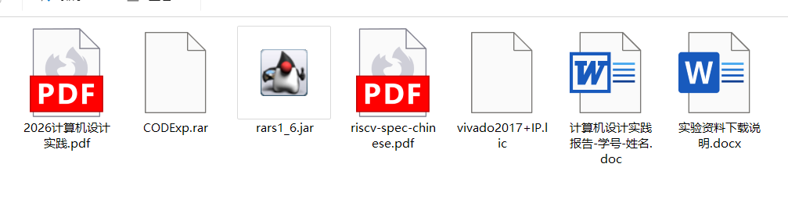

> 以上是课程群中的所有文件，记得将CODExp.rar解压缩，里面有 `demo` 和 `testcode` 两个部分，下面首先介绍


### ⭐⭐⭐文件结构介绍

我们解压缩 `CODExp.rar` 并进入，会发现有 `testcode` 和 `demo` 两个部分,文件结构和各个文件在做什么如下：


```

./
├── demo/           # CPU 实现（仿真 + FPGA）
│   ├── plcpu_sim/  # 流水线 CPU 仿真
│   ├── sccpu_sim/  # 单周期 CPU 仿真
│   └── sccpu_fpga/ # FPGA 综合版本，考录到板子上会用
└── testcode/       # 汇编测试程序
    ├── demo/       # 演示程序
    └── task/       # 任务测试

```


## 让我们搞清楚实验整体流程

本课程实验本分为了 **单周期CPU** 和 **流水线CPU** 两个部分。每个部分都有自己的 **实验内容** 和 **验收要求**。这边笔者会对课程ppt做出解读


### 单周期CPU

---

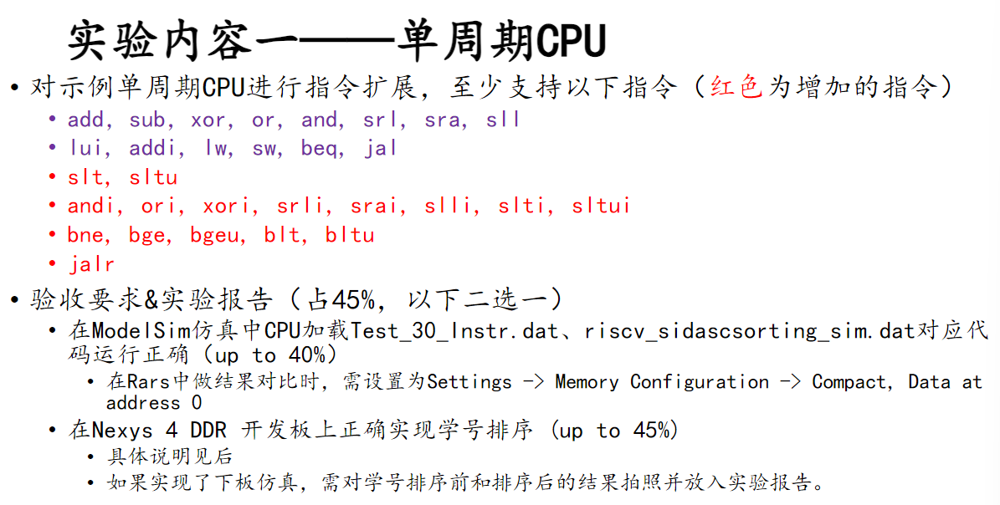

---

我们先不管实验内容部分（也就是增加指令那里，笔者会在ModelSim部分介绍），先看一下 **验收要求&实验报告** 部分，这里比较容易让人迷茫：

`在ModelSim仿真中CPU加载Test_30_Instr.dat、riscv_sidascsorting_sim.dat对应代码运行正确(up to 40%)`

**简单来说**，这两个文件是验证我们写的对不对的文件。就是：

- 我们写好 CPU 之后（假设现在已经在ModelSim中写好了，先不要在意其形式）
- 在 ModelSim 软件中可以运行控制程序部分，进行仿真
- 从而把这两个 .dat 加载进来
- 然后将我们运行的结果与正确答案做对比，如果达到了40%就算合格
- 而正确答案就来自于 `Test_30_Instr.asm、riscv_sidascsorting_sim.asm` 在 Rars1\_6.jar 中运行的结果，也就对应了那一句 *在Rars中做结果对比时*

而 `在Nexys 4 DDR 开发板上正确实现学号排序` 则是 Vivado 软件的内容，笔者后续更新


### 流水线CPU

---

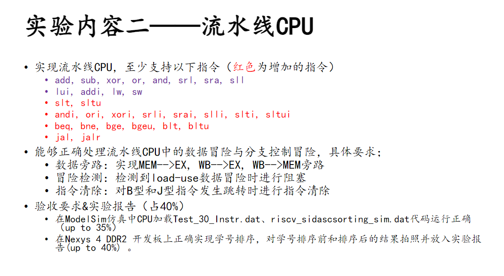

---

这里就不加赘述了，一样的道理


## 软件使用


### ModelSim

这里建议在 [官网下载](https://www.altera.com/downloads/simulation-tools/modelsim-fpgas-standard-edition-software-version-20-1-1) 下载好之后的界面是这样的：

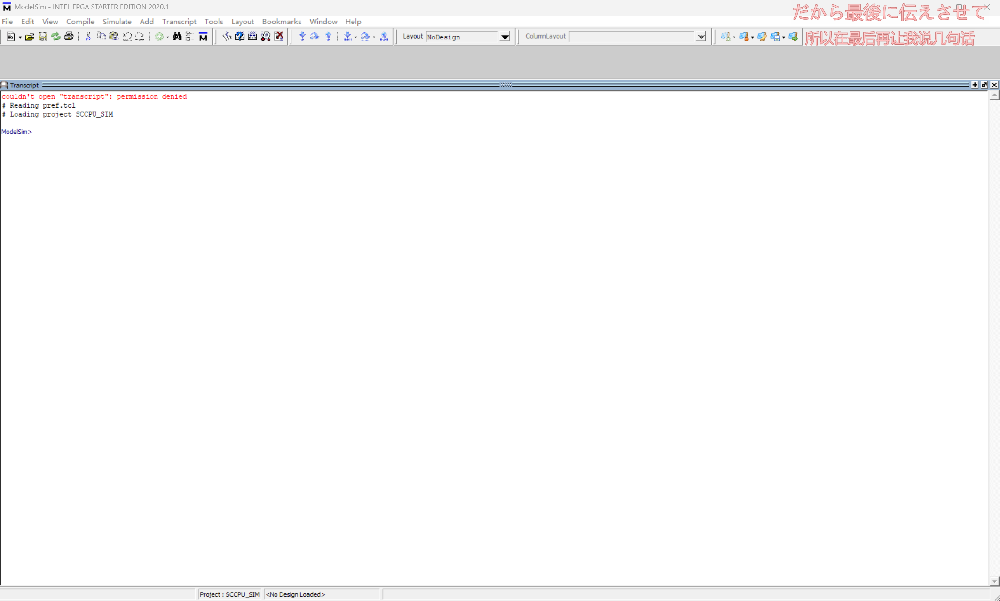


#### 新建项目并打开

什么都不要管，听我的，点击左上角的 `File -> New -> Project`,会出现一个弹窗

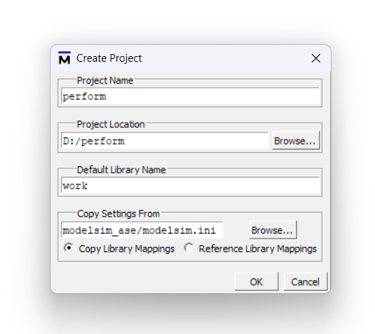

第一行是你的项目名称，第二行是你项目的位置，第三行、第四行不需要管，填写好之后点击 `OK`,会出现新的弹窗，如下

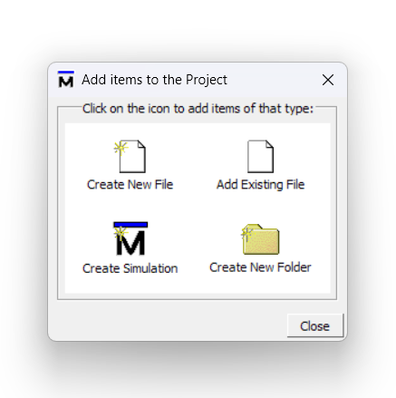

我们点击右上角的 `Add Existing File`，又会出现一个弹窗

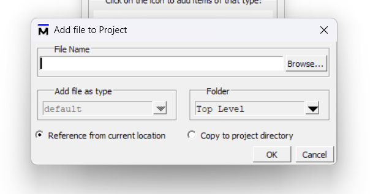

这里有两步要做

\*\*第一步：\*\*点击第一行的 `Browse`，找到你刚刚解压的 `CODExp` 文件夹，选择你需要的CPU资源文件（这里用单周期CPU为例，即 `CODExp -> demo -> sccpu_sim -> source`)，然后全选，点击 `打开` ，如下图所示

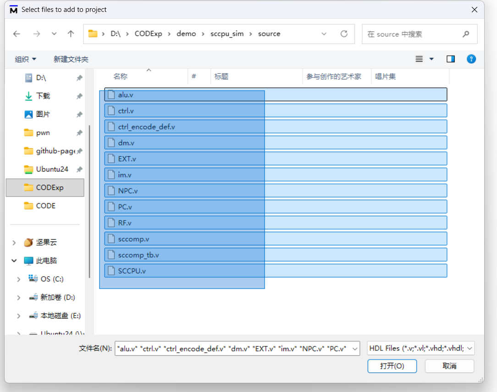

**第二步**：将下面的选择，从 `相对位置` 改为 `粘贴到项目文件`,最终效果应该这样：

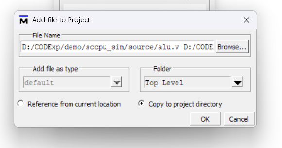

点击OK即可

点击OK后应该是空空的，像下图一样

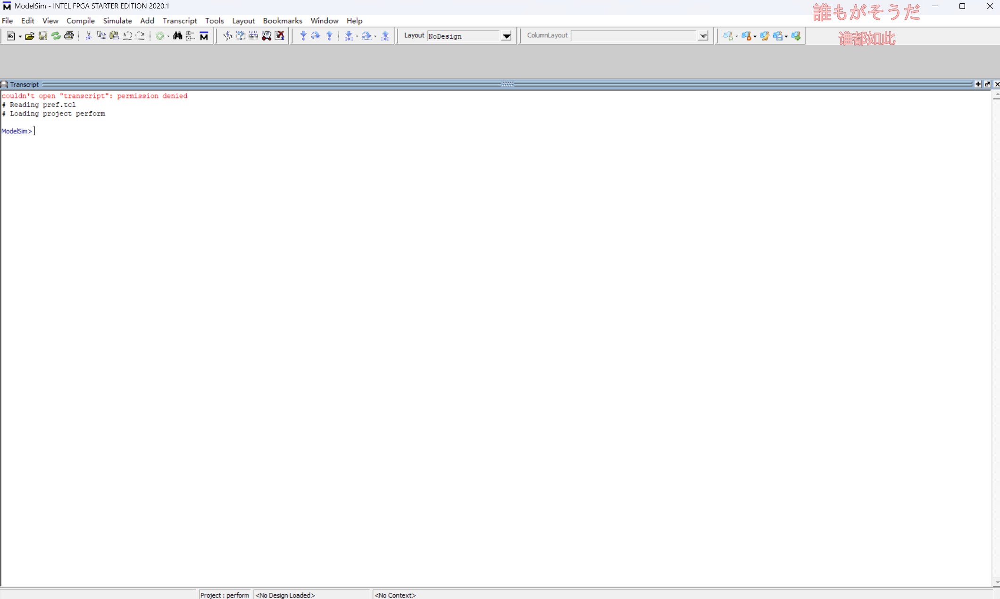

我们依次点击 `File->Open` 此时应该出现了一个弹窗，按照红框指示，我们找一下 `.mpf` 文件并打开

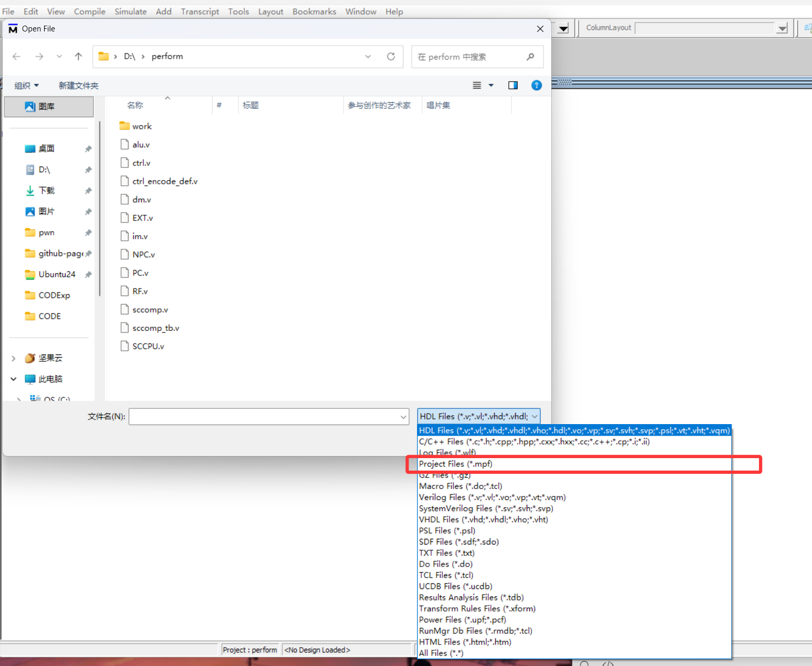

此时界面应该变成了类似下面这样，如果没有的话就把项目删了再来一次/或者说你的命令行界面太高了，可以尝试把transcript部分给拉下来：

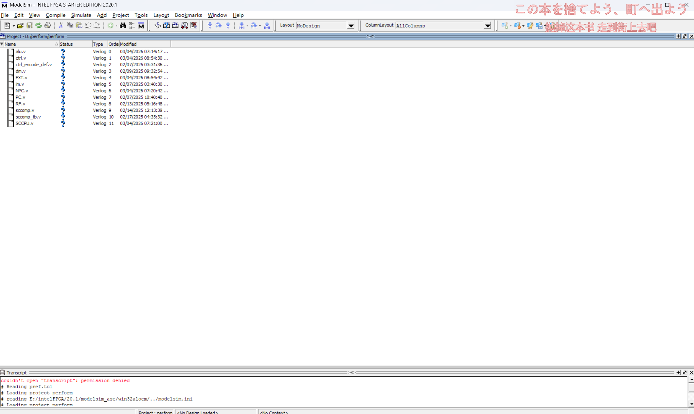

至此，我们完成了新建项目并打开的任务


#### 写代码

我们看到的这些文件都可以通过鼠标双击直接打开，然后就出现了代码界面，如下图：

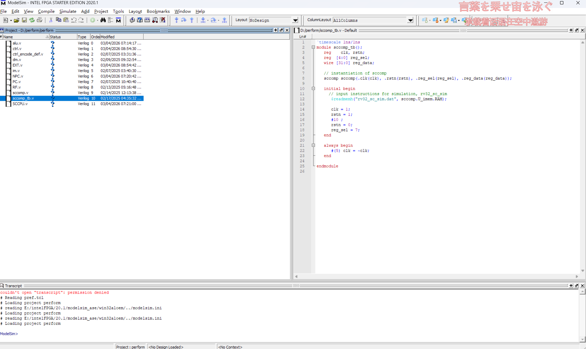

一般来说就可以写代码了，不过有些同学或许默认文件是 `Read Only`，下面是解决方法。

我们在代码界面 `右键`，出现的选项框中会有一个 `√ Read Only`,点一下就可以，如下图所示，关掉就好

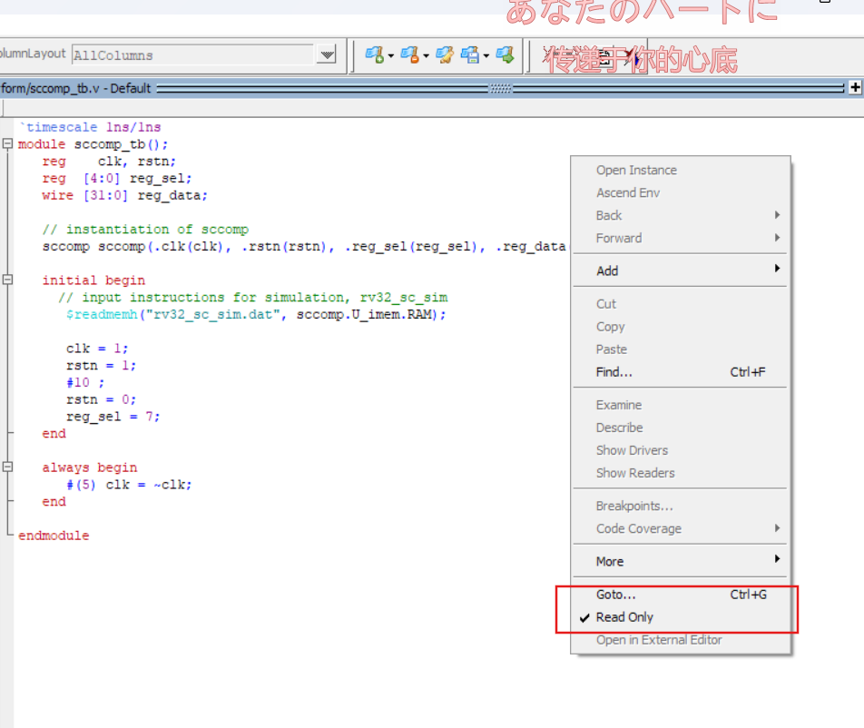

至此，我们就可以自行写代码了，接下来是编译运行


#### 编译运行

我们在左侧的部分 `右键`,选择 `Compile -> Compile All` 即可完成编译，如下图

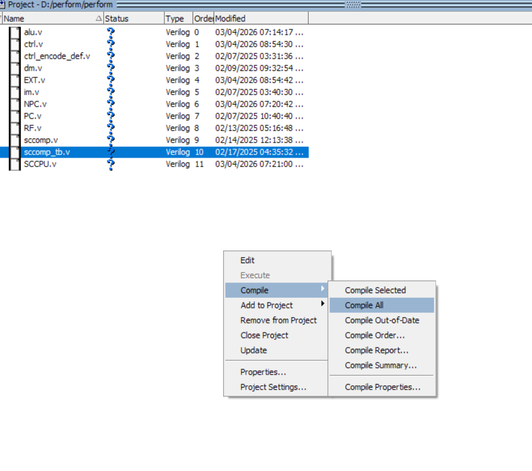

编译完成后的❓会变为 **√** ，表示文件已经被编译，于是我们完成了编译的操作

> 每次修改完代码记得都编译一下，不然运行的时候不保存

在ModelSim中的运行其实应该叫做仿真，详细过程如下：

在窗口的上面一行中（`File` 那一行），有一个 `Simulate` 选项，我们依次选择 `Simulate->Start Simulate` 会出现一个弹窗，我们找一下一个叫做 `work` 的东西，如下图

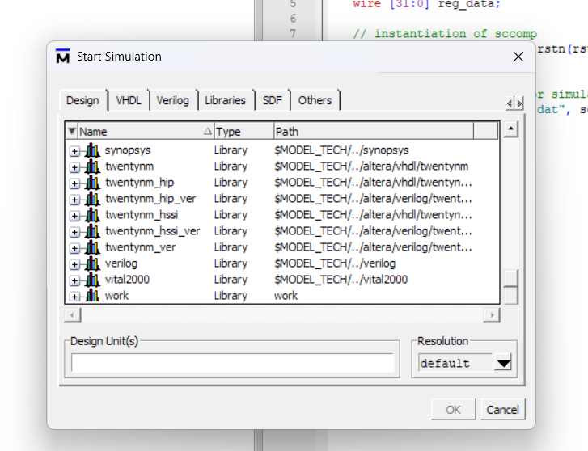

点击 `work` 左边的 `+` ，展开就是我们的项目全部文件，在里面找一个有 `_tb` 后缀的文件，它就是控制文件，如下图

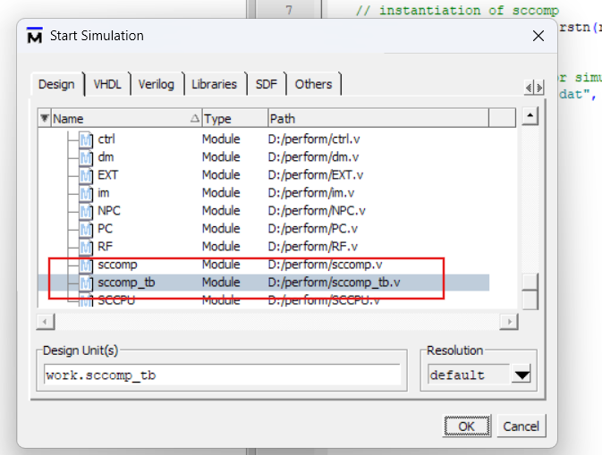

然后我们就得到了仿真界面，如下图所示

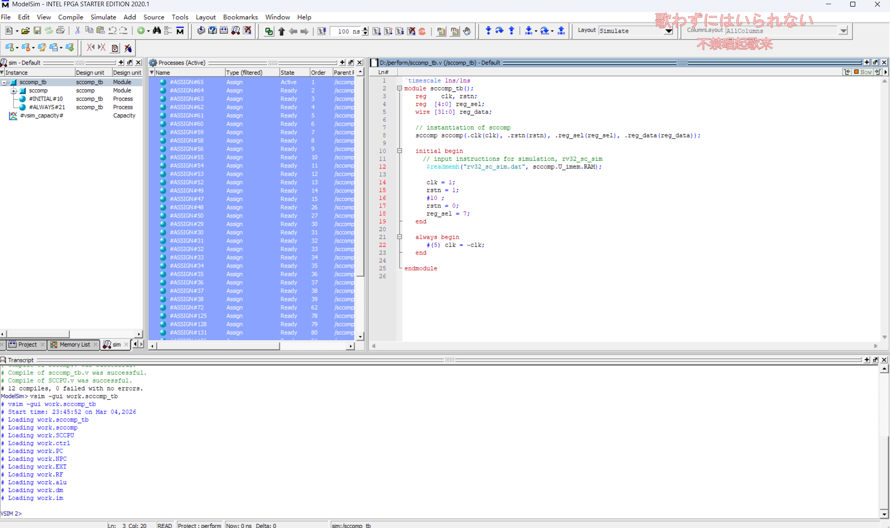

**接下来是加载锚点到波形图（笔者的个人说法）。**

我们 `右键` 左侧的那个 `sccomp_tb` 会有一个 `Add Wave`，点击它，会在整个窗口的右侧得到波形图，如下图所示

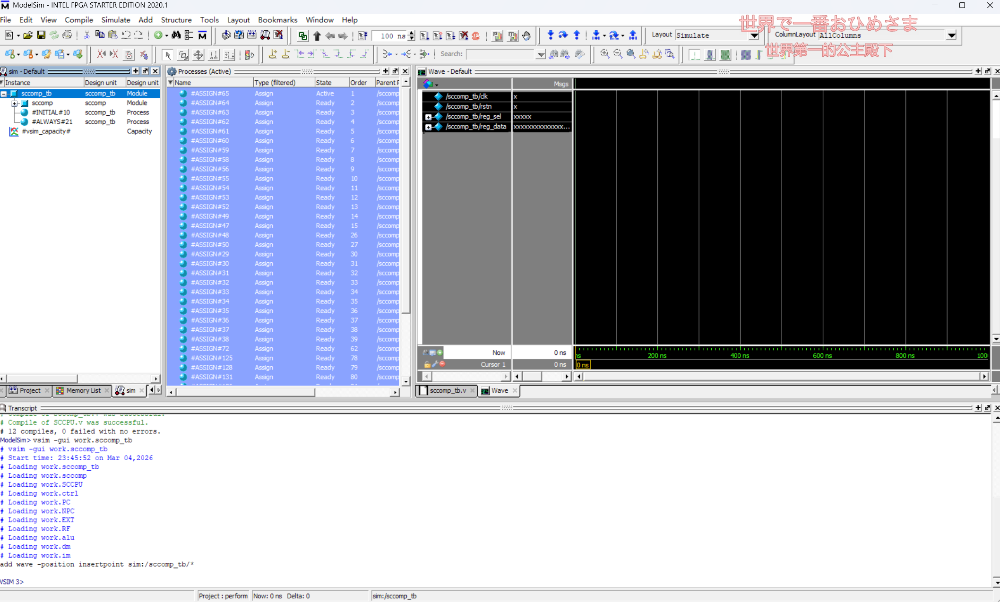

**然后就是运行仿真**

有两种方法，一个是 **命令行**：

也就是直接在下面的 `VSIM 3>` 那里输入 `run 2000ns`（这里数字自行调整，注意小一些，不然要跑好久），如下图所示

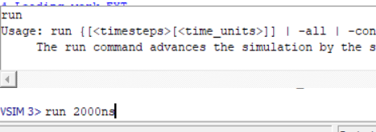

我们就可以得到波形仿真了

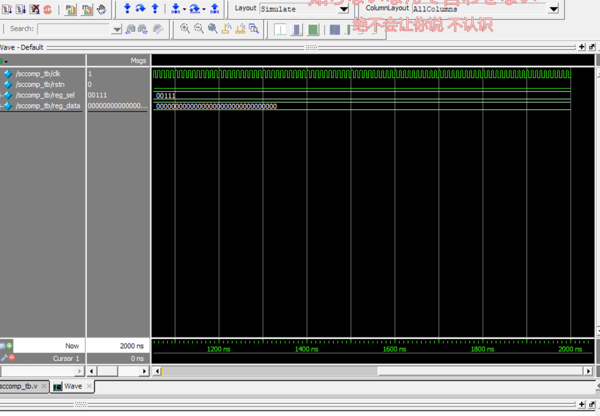

第二种方法就是直接点点点：

我们选择窗口上面的 `Simulate->Run->Run 100/Run -All` 就可以手动让它运行了，就不截图展示了

> 注意如果使用了 `Run -All` 或者说在第一种方法里时间选的太长，一直停不下来，我们需要手动stop，位置在红框框起来的地方：
>
> 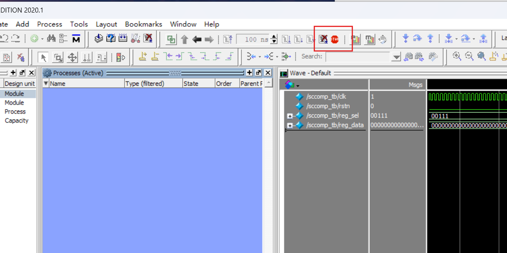


#### 加载.dat验证自己的CPU

> .dat 是数据文件，用来给仿真程序读写数据的外部文件，我们这里的是指令文件

我们把 `xx.dat` 复制到项目文件夹下面就可以，不过需要注意的是，`sccomp_tb.v` 文件只会加载名称为 `rv32_sc_sim.dat` 的文件，所以要么我们把复制来的文件改名，要么把代码改改

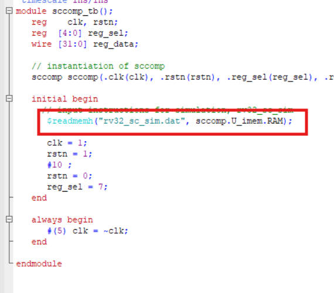


#### 查看结果

笔者不知道老师们打算怎么看结果，反正笔者只会看寄存器：待运行仿真结束后，我们在命令行中输入下面的指令，即可获得结束时的寄存器值


```

for

{
set

i

0
}

{
$i

<

32
}

{
incr

i
}

{


echo

[
format

"x%0d = %s"

$i

[
examine

-hex

/sccomp_tb/sccomp/U_SCCPU/U_RF/rf
(
$i
)]]

}

```

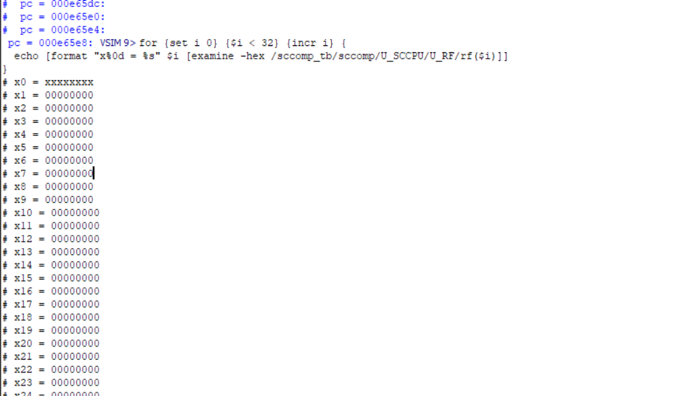

也可以用下面这个指令把寄存器加到波形图里面


```

for

{
set

i

0
}

{
$i

<

32
}

{
incr

i
}

{


add

wave

-hex

/sccomp_tb/sccomp/U_SCCPU/U_RF/rf
(
$i
)

}

```

Debug环节

笔者的室友在运行这个指令的时候出现了如下报错：


```

for

{
set

i

0
}

{
$i

<

32
}

{
incr

i
}

{


echo

[
format

"x%0d = %s"

$i

[
examine

-hex

/sccomp_tb/sccomp/U_SCCPU/U_RF/rf
(
$i
)]]

}


# evaluating expression "rf(0)"


# No object found matching "rf".


# ** Error: (vish-4014) No objects found matching '/sccomp_tb/sccomp/U_SCCPU/U_RF/rf(0)'.

```

这个是由于仿真优化把内部 memory 隐藏了，按顺序执行下面的指令就可以了


```


# 先重新启动，保留内部对象可见性

vsim

-voptargs
=
+acc

work.sccomp_tb


# 确认路径下有哪些信号

find

signals

/sccomp_tb/sccomp/U_SCCPU/U_RF/*


# 再读寄存器数组进行测试

examine

-hex

/sccomp_tb/sccomp/U_SCCPU/U_RF/rf
(
5
)

```

至此，ModelSim所需要的操作都结束了，接下来我们介绍 Rars.jar


### Rars.jar

> Rars.jar 用来运行 .asm 文件，也就是用我们电脑上正常的cpu运行这个程序，将最后的结果和我们自己设计的CPU进行对比

这个软件就是我们在群里下载下来的 `rars1_6.jar` 文件，不过需要Java环境，有些同学的电脑上可能没有，这边也介绍一下


#### JDK的安装（JAVA环境的安装）

网上不少教程都是直接下载安装，笔者认为这个方法非常的不优雅，这边建议所有同学都使用命令行安装

首先打开powershell或者cmd（这个不会开的上网搜吧），检查一下JDK的有无或者版本


```

java

-version

```

笔者这里先把java卸载了，显示如下：

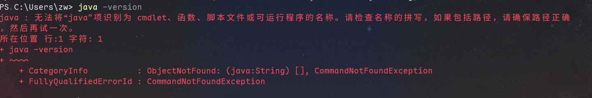

如果有java环境的同学应该显示如下，不过版本可能会不太一样，如果你的版本是17多的话，建议跟随指导顺便更新一下，因为笔者之前17版本的JDK在打开 rars 的时候有些bug，不太清楚什么原因

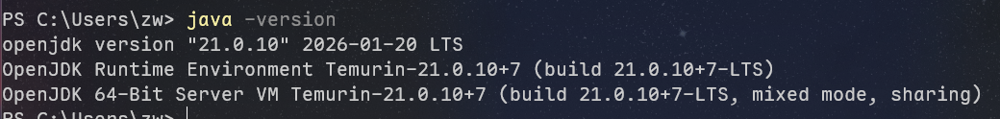

我们运行下面的命令，看看可以安装哪些jdk（本步可忽略）：


```

winget

search

OpenJDK
winget

search

Temurin

```

> 结果挺多的，笔者就不截图了，大家自己看看就行

笔者安装的是 `Temurin 21`，版本相对比较新，也比较稳定，各位看自己需要安装，命令如下


```

winget

install

-e

--id

EclipseAdoptium.Temurin.21.JDK

```

然后等待即可，什么都不用管了

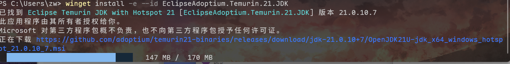


#### Rars使用

安装好环境之后就可以双击使用 Rars1\_6.jar 了，打开后界面长这样

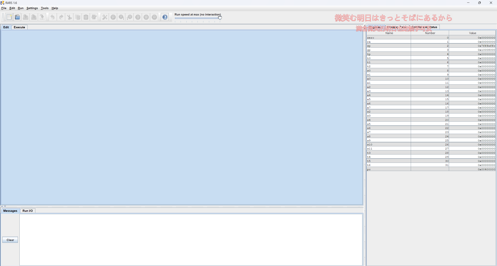

依旧左上角 `File->Open` 这里找一下CODExp的 `task` 或者 `demo` 部分（`CODExp->testcode->demo/task`)

> 笔者这里展示下 `task` 的 `Test_30_Instr.asm`，各位自己操作的时候看自己的情况，一定要选择 `.asm` 文件

出现这样的界面

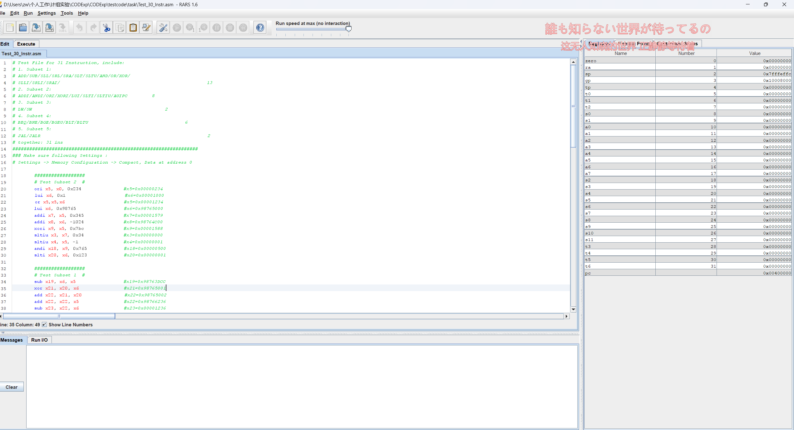

可以看到上面有个 `螺丝刀和扳手`，点它一下,界面就变了

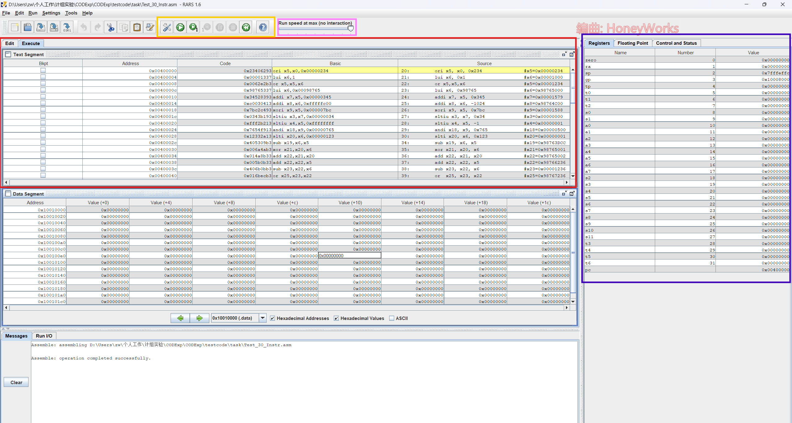

- **红色部分**：汇编运行部分
- **紫色部分**：寄存器的值和编号的对应，如果和笔者的不一样的话，看一下标签卡选对没有
- **黄色部分**：绿的那个就是开始运行，常识之类的不介绍了
- **粉色部分**：这个控制速率，个人不建议拉满，最好次高档(30 inst/sec)，方便看清寄存器的变化

我们运行看看

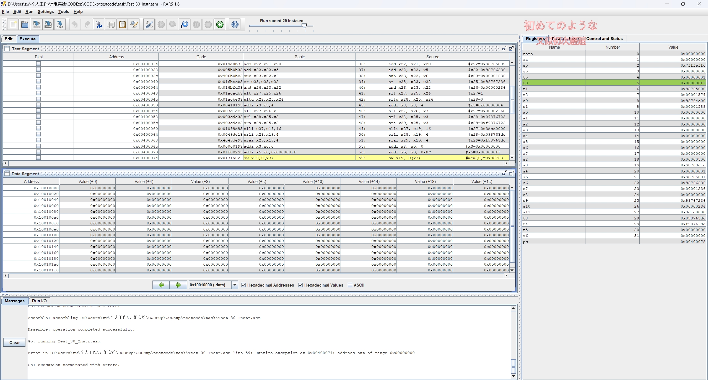

不错，跑起来了。**但还有一点需要注意的，我们之前留下的一个引子**

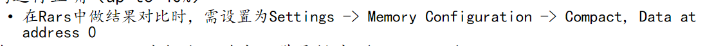

按照要求，我们一步步来

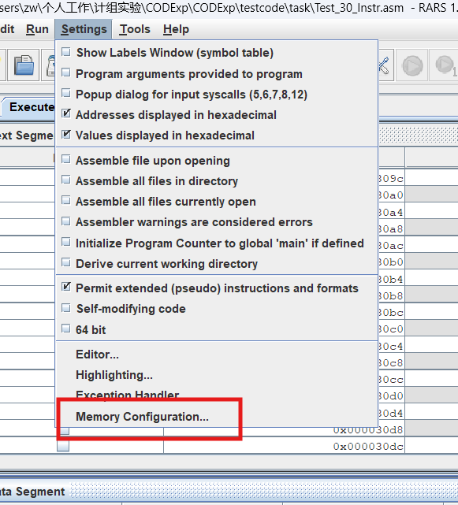

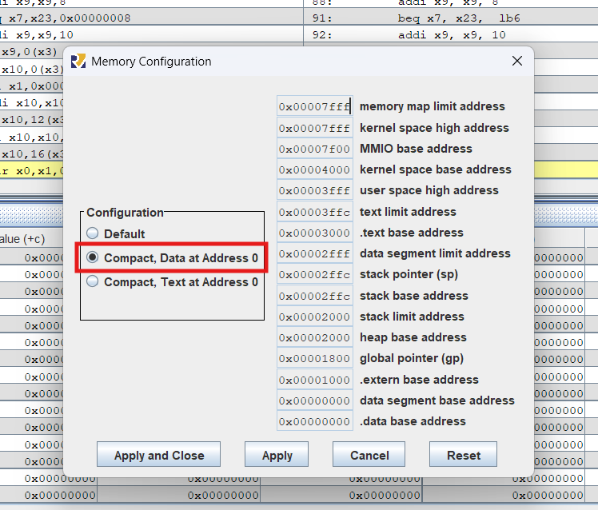

然后 **再次运行**

会发现数值发生了些许变化，如下：

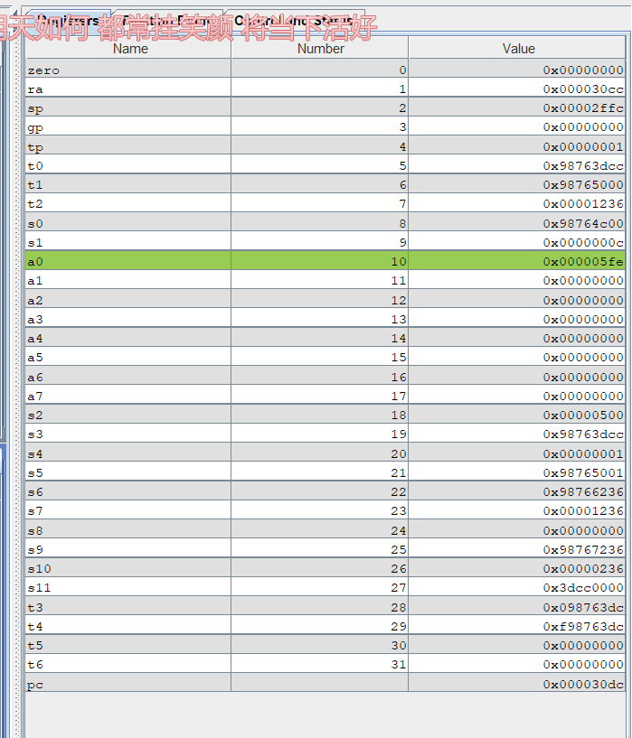

那么我们和自己的对比一下看看？

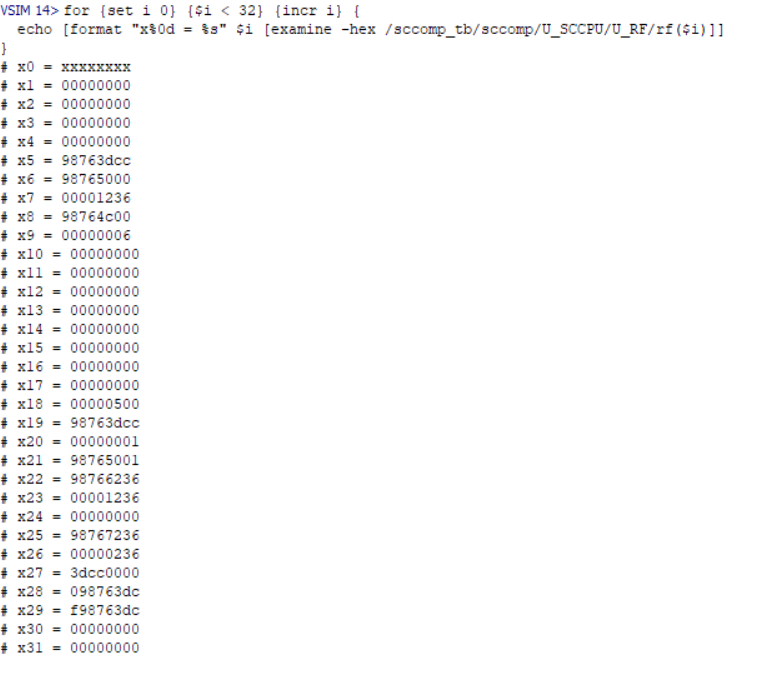

不错，数值都对上了，说明我们的单周期CPU设计完全胜利!教程也先到这里，等笔者鼓捣到流水线和fpga的时候再更新
