# 笔记


## 第1章 绪论

Note

第 1 章的任务，是先把数据库课程中的基本对象、抽象层次、系统结构和设计流程摆正。学习顺序适合按这条线展开：先分清 `数据`、`数据库`、`DBMS`、`DBS`；再理解 `数据模型` 和 `概念模型`；然后进入 `三级模式 / 两级映像`；最后把 `DBMS` 的功能和 `数据库设计流程` 接起来。


### 1.1 引言


#### 1.1.1 数据、数据库、数据库管理系统、数据库系统

这一小节先把数据库课程里最容易混在一起的几个对象拆开。后面讲关系模型、SQL、事务和数据库设计时，都会默认这些概念已经站稳。

数据是什么

- `数据（data）` 的范围很广，数字属于其中一种表现形式，文字、图形、图像、声音、档案记录、运输记录都属于数据。
- 数据的本质，是对客观事物的符号化描述。现实世界里的对象进入计算机处理范围之前，要把真正关心的特征抽出来，组织成可存储、可处理的记录。
- 教材强调“数据与其语义不可分”。同一串符号在字段含义明确之后，才能被正确理解。
- 例如记录“（李明，男，2002，江苏，计算机系，2020）”当前看到的还是一组符号。知道这些位置分别表示姓名、性别、出生年份、籍贯、系别和入学时间之后，这条记录才有明确语义。

数据库是什么

- `数据库（database, DB）` 是长期存储在计算机内、有组织、可共享的数据集合。
- “长期存储”说明数据要稳定保存，不服务于一次性计算任务。
- “有组织”说明数据经过统一安排，并且按照某种模型组织起来。
- “可共享”说明多用户和多应用要围绕同一组数据工作。
- “集合”说明数据库面对的是整体数据资源，强调的是统一管理下的数据整体。
- 教材还补充了几个特征：数据按一定数据模型组织、描述和存储，冗余度较小，数据独立性较高，容易扩展，并且能够为不同用户共享。

DBMS 是什么

- `数据库管理系统（database management system, DBMS）` 是位于用户与操作系统之间的一层数据管理软件。
- DBMS 的工作分成两面。一面是定义和操纵数据，另一面是统一管理和统一控制。
- “定义和操纵数据”主要落在模式定义、约束定义和查询、插入、删除、修改等操作上。
- “统一管理和统一控制”主要落在安全性、完整性、并发控制、恢复这些系统级能力上。

数据库系统是什么

- `数据库系统（database system, DBS）` 是在计算机系统中引入数据库后的整体构成。
- 它通常包括数据库、DBMS、应用系统、应用开发工具、数据库管理员和最终用户。
- 这里最容易混淆的是三个缩写的层次：`DB` 指数据集合，`DBMS` 指管理软件，`DBS` 指把数据、软件、硬件、应用和人员一起纳入的运行整体。

DBA 的位置

- `数据库管理员（database administrator, DBA）` 在第一章已经出现，说明数据库系统从一开始就属于需要持续建立、使用和维护的对象。
- 教材明确指出，数据库的建立、使用和维护离不开 DBMS，也离不开专门人员负责。

这一组概念怎么区分

- 日常语境中，人们有时把数据库系统简称为数据库。考试和笔记中要按教材里的概念层次区分使用。
- 复习时可以按“数据对象、管理软件、运行系统”这三层去记：数据落在 DB，软件落在 DBMS，运行整体落在 DBS。

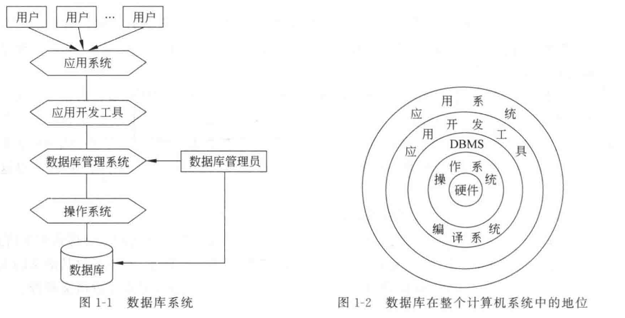


#### 1.1.2 数据库技术的产生与发展

这一小节处理的是数据库技术为什么会出现，以及它是怎样从早期数据处理方式一步步发展过来的。学习时除了记住三个阶段的名字，还要抓住每个阶段如何回答“谁来管理数据、数据能否共享、结构是否稳定”这些问题。

数据管理的含义

- `数据管理` 指的是对数据进行分类、组织、编码、存储、检索和维护。
- 教材把它看作数据处理的中心问题，因为系统的难点落在长期把数据管理好。

三个发展阶段

随着计算机硬件、软件和应用背景的发展，数据管理经历了人工管理阶段、文件系统阶段、数据库系统阶段。

| 比较项 | 人工管理阶段 | 文件系统阶段 | 数据库系统阶段 |
| --- | --- | --- | --- |
| 应用背景 | 科学计算 | 科学计算、管理 | 大规模管理 |
| 硬件背景 | 无直接存取存储设备 | 磁盘、磁鼓 | 大容量磁盘 |
| 软件背景 | 无操作系统 | 有文件系统 | 有 DBMS |
| 处理方式 | 批处理 | 联机实时处理、批处理 | 联机实时处理、分布式处理、批处理 |
| 数据管理者 | 人 | 文件系统 | DBMS |
| 数据面向对象 | 某一应用程序 | 某一应用程序 | 现实世界 |
| 共享程度 | 无共享，冗余极大 | 共享性差，冗余大 | 共享性高，冗余小 |
| 数据独立性 | 完全依赖程序 | 独立性差 | 具有较高物理独立性和一定逻辑独立性 |
| 数据结构化 | 无结构 | 记录内有结构，整体无结构 | 整体结构化 |
| 数据控制能力 | 程序自己控制 | 程序自己控制 | 由 DBMS 提供统一控制 |

人工管理阶段

人工管理阶段的应用背景以科学计算为主。硬件上缺少直接存取存储设备，软件上缺少操作系统和专门管理数据的软件，处理方式以批处理为主。这个阶段的特点如下：

- `数据不保存`。数据往往随着某次计算任务临时输入、临时使用、用后撤走。
- `数据由应用程序自己管理`。程序既要规定逻辑结构，又要设计物理结构、存取方式和输入方式，因此程序员负担很重。
- `数据不共享`。数据面向单个程序，多程序即使涉及同类数据，也要各自定义、各自维护，因此冗余很大。
- `数据不具有独立性`。逻辑结构或物理结构一改，程序就得跟着改。

文件系统阶段

文件系统阶段出现在 20 世纪 50 年代后期到 60 年代中期。应用开始从科学计算扩展到管理，硬件上已经有磁盘、磁鼓，软件上已经有文件系统，处理方式也开始支持联机实时处理。这一阶段的进步如下

- 数据可以长期保存在外存上，支持反复查询、插入、删除和修改。
- 出现了专门的数据管理软件。程序和数据之间由文件系统提供存取方法做转换，程序员可以把大量物理细节交给文件系统处理。

它的局限：

- 一个文件通常还是面向某一应用程序，多个应用之间很难真正共享同一份数据。这种组织方式直接带来两个后果：冗余度大，不一致性容易出现。

> `记录内部有结构，整体无结构`。单个文件内部已经有字段结构，不同文件之间仍是孤立的，很难反映现实世界中对象之间的内在联系。

数据库系统阶段

数据库系统阶段出现在 20 世纪 60 年代后期之后。此时应用规模更大、数据量急剧增长、多用户多应用共享数据的要求越来越强烈，文件系统已经不足以支撑，有如下特征：

- `数据结构化`。数据库不仅描述单个记录内部结构，还描述整体数据结构以及数据之间的联系。

> “数据结构化”为数据库系统和文件系统的根本区别。

- `共享性高，冗余度低`。数据从整体角度组织，服务于多个应用，因此重复存储减少，不一致风险也下降。
- `数据独立性高`。教材在这里已经提前引出逻辑独立性和物理独立性，这两项独立性依赖后面要讲的映像机制。
- `由 DBMS 统一管理和控制`。统一管理不只意味着查询和修改方便，也意味着系统级控制能力被真正建立起来。

DBMS 的四项控制能力

- `安全性（security）` 负责保护数据，防止不合法使用导致泄密和破坏。
- `完整性（integrity）` 负责保证数据正确、有效、相容。
- `并发控制（concurrency control）` 负责协调多用户同时存取和修改数据库时的相互干扰。
- `恢复（recovery）` 负责在硬件故障、软件故障、操作失误或恶意破坏之后，把数据库从错误状态带回已知正确状态。

代际发展的线索

- 20 世纪 60 年代末出现第一代数据库，即层次数据库和网状数据库。
- 20 世纪 70 年代出现第二代数据库，即关系数据库。
- 后面又出现面向对象数据库和更多新方向。
- 第一章末尾提到数据库与网络通信、面向对象、并行分布、云计算、人工智能、新硬件技术的结合，这些内容会在第 8 章重新展开。


### 1.2 数据模型

这一节要解决“现实世界中的对象怎样转换成数据库里可处理的结构”这个问题。现实世界里的事物要先经过抽象，才能进入数据库处理范围。

`数据模型` 是对现实世界数据和信息的抽象、表示和处理工具，教材把它概括为“现实世界的模拟”。数据模型要同时满足三项要求：

- 较真实地模拟现实世界
- 容易为人理解
- 便于在计算机上实现

教材把模型分成两类。

- `概念模型` 按用户观点对数据和信息建模
- `数据模型` 按计算机系统观点对数据建模。

这两类模型分属不同层次。概念模型更接近现实世界和业务语义，数据模型更接近机器世界和 DBMS 实现。


#### 1.2.1 数据模型的组成要素

数据结构

任何一种数据模型，都是严格定义的概念集合，这些概念首先要能描述系统的静态特性。`数据结构` 用于描述系统的静态特性。

数据结构可以表述为对象类型的集合。这里的对象分成两类：

- 一类和数据类型、内容、性质有关，例如关系模型中的域、属性、关系；
- 另一类和数据之间的联系有关，例如网状模型中的系型。

教材特别强调，数据结构是刻画模型性质最重要的方面，所以数据库系统往往直接按数据结构类型命名模型，例如层次模型、网状模型、关系模型。

数据操作

`数据操作` 用于描述系统的动态特性。它指的是对数据库中各种对象实例允许执行的操作集合，至少包括查询和更新。

- 更新又细分为插入、删除、修改。
- 数据模型不仅要说明“能做哪些操作”，还要说明这些操作的确切含义、操作符号、操作规则和实现这些操作的语言。

约束条件

`数据的约束条件` 是完整性规则的集合。这些规则用于限定符合数据模型的数据库状态和状态变化，从而保证数据正确、有效、相容。

约束条件有两层来源。

- 一层是模型本身的通用约束，例如关系模型中的实体完整性和参照完整性；
- 另一层是具体应用中的语义约束，例如年龄上限、累计不及格门数限制等。


#### 1.2.2 概念模型

为什么需要概念模型

数据库系统从现实世界到机器世界之间，需要经过“信息世界”这一层中介。现实世界先被抽象成不依赖具体 DBMS 的信息结构，这一层就是概念级模型；

之后概念模型再转换成某个 DBMS 支持的数据模型。因而概念模型是现实世界到机器世界的中间层次，也是用户与数据库设计人员交流的语言。

教材对概念模型提出两项要求：

- 语义表达能力强
- 形式简单、清晰，便于用户理解。

信息世界中的基本概念

- `实体（entity）` 是客观存在并可相互区别的事物。实体可以是具体的人、事、物，也可以是抽象概念或联系。例如一个职工、一个学生、一个部门、一门课、学生的一次选课、部门的一次订货，都可以看作实体。
- `属性（attribute）` 是实体具有的某一特性。一个实体通常由若干属性共同刻画。
- `码（key）` 是唯一标识实体的属性集。这里要抓住“属性集”三个字，码既可能是单属性，也可能是多属性组合。
- `域（domain）` 是属性的取值范围，它给出的是属性允许取值的集合边界。
- `实体型（entity type）` 是同类实体的抽象描述，用“实体名 + 属性名集合”来定义。
- `实体集（entity set）` 是同一实体型的全部实例集合。

联系的类型

- `联系（relationship）` 既包括实体内部属性之间的联系，也包括实体型之间的联系。课程里更常考实体型之间的联系。两个实体型之间的联系分成三类：**一对一联系、一对多联系、多对多联系。**
  - 一对一联系表示 A 中每个实体在 B 中至多对应一个实体，同时 B 中每个实体在 A 中也至多对应一个实体。
  - 一对多联系表示 A 中每个实体在 B 中可对应多个实体，B 中每个实体在 A 中至多对应一个实体。
  - 多对多联系表示 A 和 B 两侧都允许一个实体对应对方多个实体。

> 一对一联系是一对多联系的特例，一对多联系又是多对多联系的特例。
>
> 联系不限于两个实体型之间，三个或更多实体型之间同样可以形成联系。
>
> 同一个实体集内部也可以存在联系，例如学生之间的领导与被领导关系，这类联系在做 E-R 图时容易漏掉。

E-R 方法

概念模型最常用的表示方法是 `实体-联系方法（E-R 方法）`。

E-R 图中，实体型用矩形表示，属性用椭圆表示，联系用菱形表示，联系边上标出 `1:1`、`1:n`、`m:n` 等联系类型。

- 联系本身也可以有属性。这是一个很容易被忽略的小点。联系具有独立业务含义时，就要给联系加属性，例如“选修”联系上的成绩。
- 当实体和属性很多时，为了图面清楚，可以把“实体及其属性”和“实体及其联系”分成两张 E-R 图表达。
- E-R 图独立于具体 DBMS，是各种数据模型的共同基础，它比具体数据模型更抽象，也更接近现实世界。

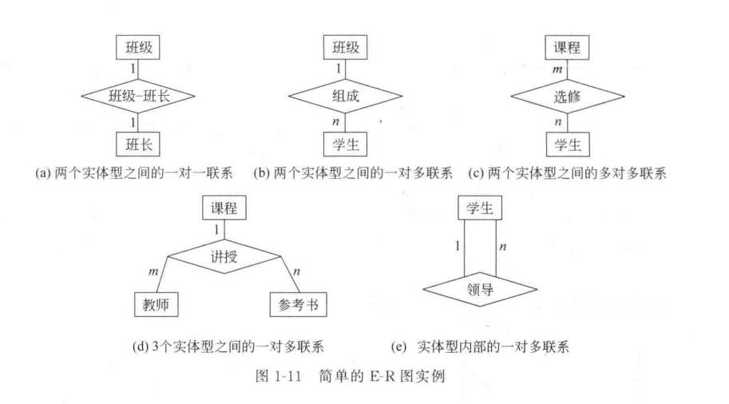


#### 1.2.3 常用的数据模型

格式化模型的共同起点

教材在这里区分 `格式化模型` 和 `关系模型`。**层次模型、网状模型统称格式化模型。**

- 格式化模型中，实体用记录表示，实体间联系转换成记录之间的两两联系。
- 格式化模型数据结构的基本单位是 `基本层次联系`，也就是两个记录以及它们之间的一对多联系。
- 在基本层次联系中，始点记录叫 `双亲结点（parent）`，终点记录叫 `子女结点（child）`。

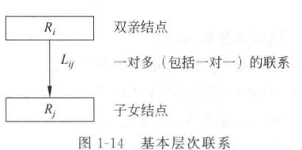

层次模型

层次模型是数据库系统中最早出现的数据模型，它用 **树形结构** 表示各类实体以及实体间联系。它适合表达本身带有自然层次关系的对象，例如行政机构、家族关系。

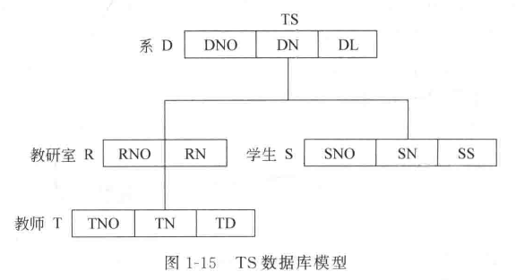

层次模型存在两个结构限制，这两个限制直接决定了它只能直接处理一对多联系。：

- 根结点是唯一缺少双亲的结点
- 根之外其他结点各自对应一个双亲。

在层次模型中，每个结点表示一个记录类型，连线表示记录类型之间的父子联系，字段描述记录类型的属性。

- 各记录类型和字段都要命名，同一记录类型中的字段名不得重复。
- 记录类型可以定义排序字段，也叫 `码段`。码段值唯一时，就能唯一标识记录值。

层次模型还有一个关键语义特征：任何给定记录值都要沿着路径来看，才能显示完整意义，**子女记录要依附双亲记录存在。**

**多对多联系怎样处理**

多对多联系在层次模型中无法直接表示，要先分解成一对多联系。教材给出两种方法：

- `冗余结点法` ：增设两个冗余节点将多对多转为多个一对多。优点是结构清楚，允许结点改变存储位置；缺点是占用额外存储空间，并可能带来潜在不一致。
- `虚拟结点法`：将冗余节点转换为虚拟节点，虚拟节点就是一个指向代替节点的指针。优点是节省空间，减少潜在不一致；缺点是原结点位置变化后，虚拟结点中的指针也要跟着修改。

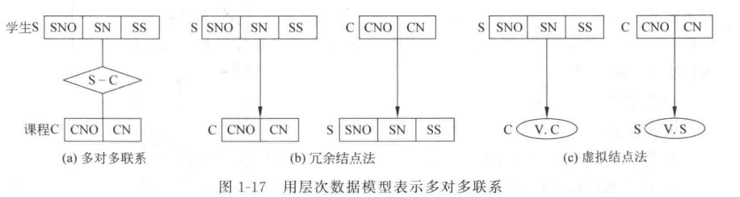

**操纵与存储特点**

层次模型的操纵：

- 查询
- 插入：插入时，缺少双亲结点值就无法插入子女结点值
- 删除：删除双亲结点值时，相应子女结点值会被同时删除
- 更新：更新时，如果同一对象以冗余方式保存，就要同步更新所有相关记录，才能保持一致性

常见的存储方法有两类：

- `邻接法`：邻接法靠物理位置相邻表示层次顺序，按照层次树前序穿越的顺序把所有记录值依次邻接存放
- `链接法`：链接法靠指针表示层次联系，用指针反应数据之间的层次关系

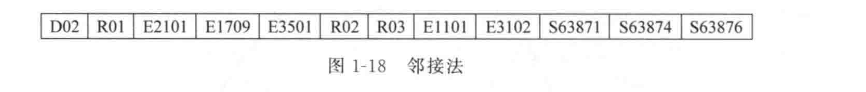

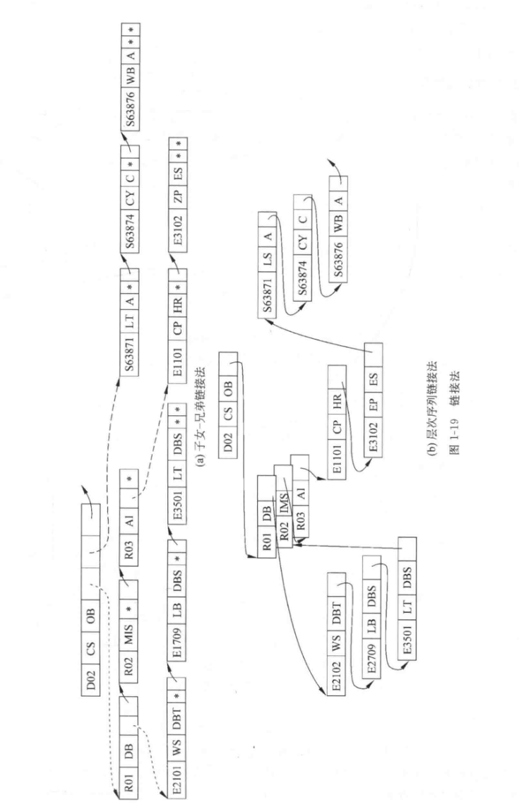

**优点与局限**

优点主要有三个：

- 模型本身较简单
- 对固定层次联系的应用性能较好
- 完整性支持较强。

局限也很明显：

- 表达多对多和多双亲联系笨拙
- 插入删除限制较多
- 查询子女常常要先经过双亲
- 命令形式趋于程序化。

网状模型

网状模型放宽了层次模型的两个限制，允许多个结点缺少双亲，也允许结点有多个双亲。它还允许两个结点之间存在多种联系，也就是复合联系。

因而网状模型能更直接地描述现实世界中的非树形结构。

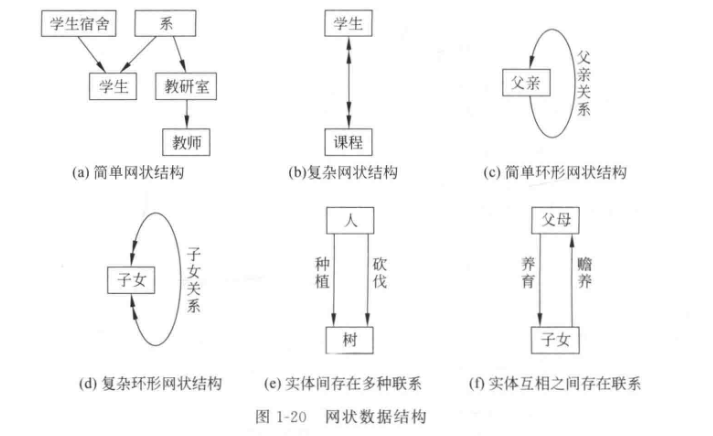

> 层次模型实际上是网状模型的一个特例。

在网状模型中，结点仍表示记录类型，字段仍表示属性，连线仍表示记录类型之间的联系。它可以表示简单网状结构、复杂网状结构、环形结构以及多种联系并存的结构。

**操纵特点**

网状模型同样支持查询、插入、删除和更新。

它和层次模型的关键差别在于：*网状模型允许插入尚未确定双亲的子女记录，也允许只删除双亲记录而保留子女记录。*

由于网状模型能直接表达非树形结构，无须像层次模型那样引入冗余结点，因此更新时通常只需修改指定记录。

**存储与优缺点**

网状模型常见的存储方式仍以链接法为主，包括单向链接、双向链接、环状链接、向首链接等，也有指针阵列法、索引法等实现方式。

- 优点：描述现实世界更直接，特别适合多对多和多双亲场景；性能和存取效率较高。
- 局限：是 DDL(数据定义语言) 较复杂；数据独立性较差，访问数据时常常需要指明存取路径。

关系模型

关系模型由 Codd 在 1970 年系统提出，后来成为数据库系统中最重要、最流行的数据模型。

在用户看来，关系模型的逻辑结构是一张二维表，由行和列组成。这里涉及几个基础概念：

- 关系对应表
- 元组对应行
- 属性对应列
- 主码：图中某个属性组，可以唯一确定元组
- 域：属性取值范围。
- 分量：元组中的一个属性值

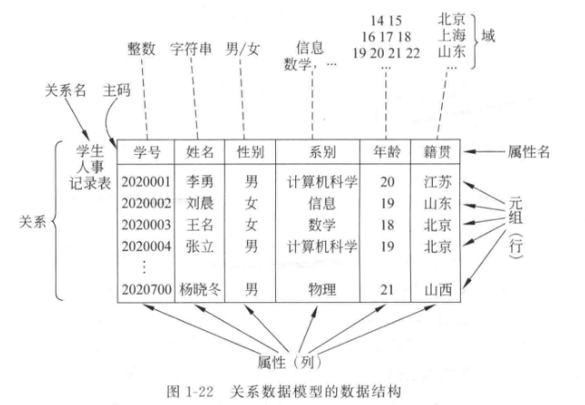

关系模型的重要优势，在于用统一结构表示实体和联系，降低了用户面对数据结构时的复杂度。关系模型的优点如下：

- 结构统一
- 操作有严格数学基础
- 用户按内容存取数据时，沿物理路径逐步导航的负担显著减轻。

第一章对关系模型只做轮廓介绍，更详细的结构、完整性、关系代数、关系演算和 SQL 会在第 2 章以后系统展开。


### 1.3 数据库系统结构

这一节讨论的是数据库系统怎样分层。教材把这里分成两块来看，一块是模式结构，一块是体系结构。前者偏向逻辑抽象，后者偏向系统组织。


#### 1.3.1 数据库系统的模式结构

型、值、模式、实例

- 型描述某类数据的结构和属性
- 值是型的具体赋值。
- `模式（schema）` 是数据库中全体数据的逻辑结构和特征描述，它只涉及型，不涉及具体值。
- 模式的一个具体值叫 `实例（instance）`。模式相对稳定，实例相对变动。

这一区分很重要，因为后面讨论外模式、模式、内模式时，主要处理的是结构层次，对象落在某一时刻的具体数据值之上的抽象层。

三级模式

数据库系统通常采用三级模式结构，并提供两级映像功能。

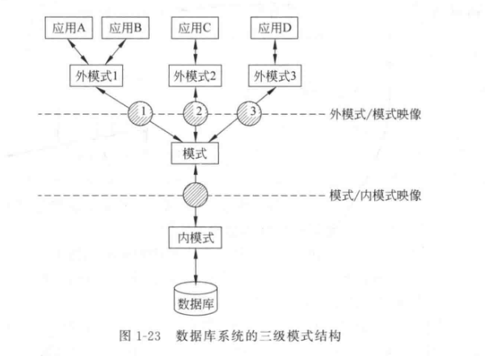

`模式` 又称逻辑模式，它是数据库全体数据的逻辑结构和特征描述，是所有用户的公共数据视图。一个数据库对应一个模式。定义模式时，除了数据项和联系，还要定义安全性和完整性要求。

`外模式` 又称子模式或用户模式，它是某个用户或某类应用所见局部数据的逻辑结构和特征描述。

> 一个数据库可以有多个外模式。不同用户对同一全局数据，在外模式中的结构、类型、长度甚至保密级别都可能不同。
>
> 同一外模式可以为同一用户的多个应用系统使用，一个应用程序对应一个外模式。
>
> 外模式还是数据库安全性的一个重要措施，因为用户只能看见自己外模式中的数据。

`内模式` 又称存储模式，它描述数据的物理结构和存储结构，例如顺序存储、B 树、hash、索引组织、压缩、加密、记录格式等。

> 一个数据库对应一个内模式。

两级映像与数据独立性

`外模式/模式映像` 定义局部逻辑结构与全局逻辑结构之间的对应关系。当模式改变时，通过修改外模式/模式映像，就能让外模式保持稳定，这形成了 `逻辑数据独立性`。

- `模式/内模式映像` 定义全局逻辑结构与物理存储结构之间的对应关系。
- 当存储结构改变时，通过修改模式/内模式映像，就能让模式保持稳定，这形成了 `物理数据独立性`

三个层次之间的依赖关系：模式是中心，内模式依赖模式而独立于外模式，外模式定义在模式之上而独立于内模式。

- 应用程序编制在外模式之上，因此二级映像最终保证的是应用程序的稳定性。


#### 1.3.2 数据库系统的体系结构

体系结构关注什么

模式结构讨论的是逻辑抽象层次，体系结构讨论的是系统从最终用户角度看到的组织方式。

教材在这一节列出五种结构：单用户结构、主从式结构、分布式结构、客户-服务器结构、云结构。

单用户结构

单用户结构是早期最简单的数据库系统。应用程序、DBMS 和数据都装在一台机器上，由一个用户独占。

它的直接问题，是数据共享能力不存在，因此不同部门会重复保存相同基础信息。

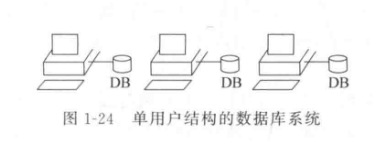

主从式结构

主从式结构是一个主机带多个终端的多用户结构。数据库系统集中在主机上，所有处理任务由主机完成，用户通过终端并发访问。

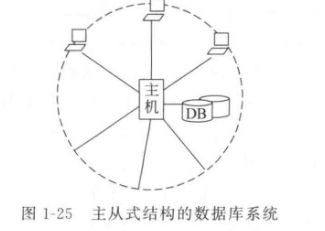

- 它的优点是简单，数据易于管理和维护。
- 它的局限也很清楚：终端用户多时主机会成为性能瓶颈，主机发生故障时，整个系统都无法使用。

分布式结构

分布式结构指数据库逻辑上是一个整体，物理上分布在网络不同结点。

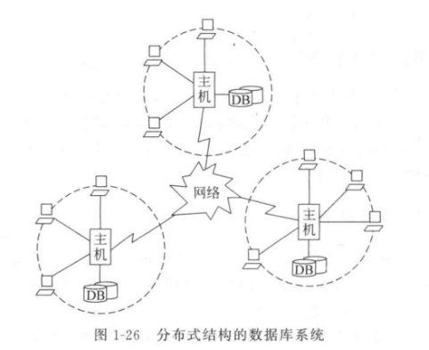

- 在这种结构中，每个结点既能处理本地数据库，也能参与全局数据库处理。
- 它适应地理分散组织的需求，代价是处理、管理、维护更复杂，远程访问效率也会受到网络交通影响。

客户-服务器结构

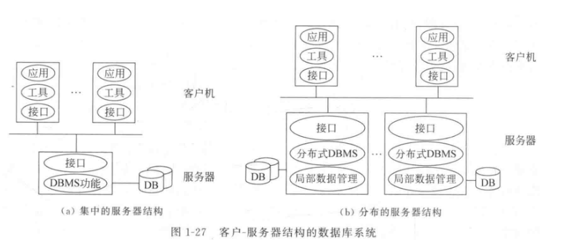

客户-服务器结构把 DBMS 功能和应用程序功能分开。服务器专门执行 DBMS，客户机负责外围应用和用户交互。优点如下：

- 把结果返回给客户机，网络中传递的是结果数据，因此网络传输量显著下降。
- 开放性较强，软硬件平台组合更灵活，应用程序可移植性更强。
- 还可以分成集中的服务器结构和分布的服务器结构。前者容易形成单点瓶颈，后者又会引入分布式管理难题。

云结构

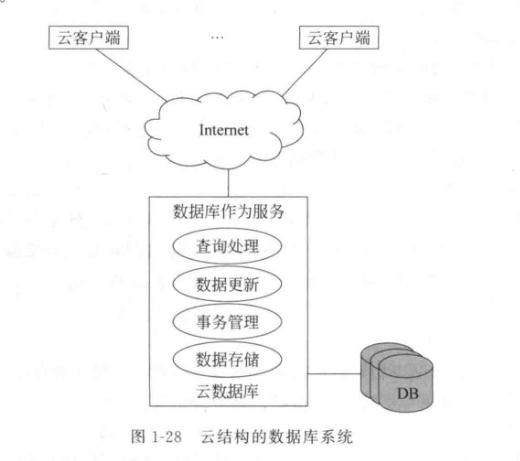

云结构是应对数据量激增、并发波峰波谷明显、企业自建运维成本上升而发展的结构。云结构把数据库能力作为服务提供，覆盖数据存储、事务管理、数据更新和查询处理。

云数据库早期多运行在单节点高配置机器上，后来的云数据库更多运行在机群上的并行数据库系统中，强调动态伸缩和按需分配资源。


### 1.4 数据库管理系统

这一节要把 `DBMS` 这个名字真正拆开。前面已经知道 DBMS 是数据库系统的核心软件，这里进一步看它具体负责什么、内部怎样工作。


#### 1.4.1 数据库管理系统的功能与组成

DBMS 的六项功能

- `数据定义` 包括定义模式、内模式、外模式、两级映像以及各类约束条件。
- `数据操纵` 包括查询、插入、修改、删除等基本操作。
- `数据库运行管理` 是运行时核心，覆盖并发控制、安全性检查、完整性检查、内部维护等工作。
- `数据组织、存储和管理` 要求 DBMS 组织和管理数据字典、用户数据、存取路径等多类数据，并决定文件结构和存取方式。
- `数据库的建立和维护` 包括初始数据输入与转换、转储、恢复、重组织、重构造、性能监视与分析。
- `数据通信接口` 负责与其他 DBMS 或文件系统通信，并完成数据转换。

DBMS 的内部组成

- `数据定义语言及其翻译处理程序`。DDL 负责定义各级模式和约束，翻译后形成目标外模式、目标模式、目标内模式，并存入数据字典。

> 数据字典又叫系统目录，是 DBMS 存取和管理数据的基本依据。

- `数据操纵语言及其编译或解释程序`。DML 用于执行查询和更新。

> DML 还区分为 `宿主型 DML` 和 `自主型 DML`。宿主型 DML 要嵌入高级语言中使用，自主型 DML 能独立交互执行。

- `数据库运行控制程序`。它包括系统初启、文件读写、存取路径管理、缓冲区管理、安全控制、完整性检查、并发控制、事务管理、日志管理等程序。
- `实用程序`。教材列出数据装入、转储、恢复、性能监测、再组织、数据转换、通信等实用程序。

怎样评价一个 DBMS

一个设计良好的 DBMS 应当具备友好界面、较完备功能、较高效率、清晰系统结构和开放性。

这里的 `开放性` 指数据库设计人员能够方便地把外部工具模块加入 DBMS，并让它们与 DBMS 紧密配合运行。


#### 1.4.2 数据库管理系统的工作过程

读取一条数据时会发生什么

“读取一条数据”时的十个步骤，这一串流程最能说明 DBMS 是怎样站在用户和操作系统之间工作的。

- 应用程序先向 DBMS 发出读数据命令。
- DBMS 先做语法检查和语义检查，调用对应外模式，检查存取权限，再决定是否执行。
- 接着调用模式，根据外模式/模式映像，确定需要读取哪些逻辑记录。
- 然后调用内模式，根据模式/内模式映像，确定从哪个文件、用什么存取方式、读取哪些物理记录。
- DBMS 再向操作系统发出读物理记录命令。
- 操作系统执行具体读操作。
- 数据从数据库存储区送到系统缓冲区。
- DBMS 再依据外模式/模式映像，把数据组织成应用程序所需的记录格式。
- 记录随后从系统缓冲区送到用户工作区。
- 最后由 DBMS 返回执行状态信息。

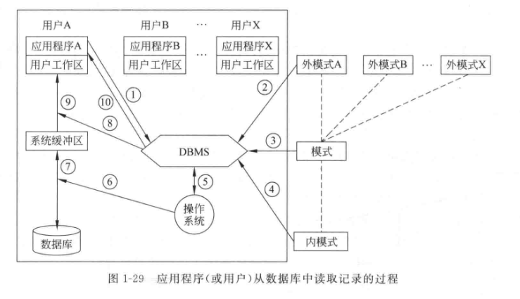


### 1.5 数据库工程与应用


#### 1.5.1 数据库设计的目标与特点

数据库设计要完成什么

数据库设计的任务，是在 DBMS 支持下，按照应用要求，为某个部门或组织设计结构合理、使用方便、效率较高的数据库及其应用系统。

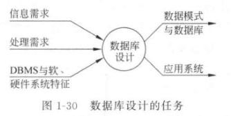

结构设计与行为设计

数据库设计包含两方面内容：`结构设计` 和 `行为设计`。

- 结构设计面向数据库框架，行为设计面向应用程序和事务处理。

传统软件工程方法偏重处理过程，常把数据结构设计推后，这种思路不适合数据库应用系统。原因在于文件系统里的文件多半属于单个应用，数据库系统里的模式则是共享的、稳定的、长期存在的结构。

数据库结构设计是否合理，会直接影响后续各个处理过程的性能和质量。结构特性和行为特性还要放在一起设计。静态结构和动态处理分离后，数据和程序难以结合，数据库设计复杂性会上升。


#### 1.5.2 数据库设计方法

规范设计法

数据库设计复杂性的来源为现实世界本身的复杂性。

- 常用数据库设计方法总体上都属于 `规范设计法`，也就是运用软件工程思想和数据库设计理论来制定设计准则和设计规程。在规范设计法中，`逻辑数据库设计` 和 `物理数据库设计` 是核心与关键。
  - 逻辑数据库设计负责设计全局逻辑结构和各用户局部逻辑结构。
  - 物理数据库设计负责在逻辑结构确定后设计存储结构和实现细节。

常见划分与实现技术

- 教材还列了几种代表性划分方法，例如新奥尔良方法、Yao 方法、Palmer 的逐步方法。
- 这一小节同时提到不同阶段的具体实现技术，例如基于 E-R 模型、基于第三范式、基于 UML 的设计方法。
- 规范设计法在实施时还可分成 `手工设计` 和 `计算机辅助数据库设计`。后者依赖设计工具，能够减轻工作量、提高速度和质量。


#### 1.5.3 数据库设计步骤

六个阶段

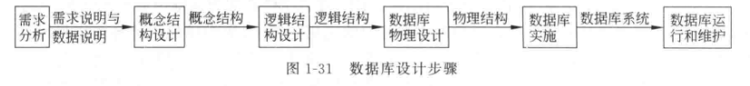

分为需求分析、概念结构设计、逻辑结构设计、物理设计、数据库实施、数据库运行和维护。

- `需求分析` 是基础，也是最困难、最费时的一步。它同时分析数据需求和处理需求，结果质量会直接影响后续全部阶段。
- `概念结构设计` 的任务，是在独立于具体 DBMS 的层次上描述数据库逻辑结构，形成概念模型。
- 教材把概念结构设计称为整个数据库设计的关键，因为它承担着综合、归纳和抽象用户需求的任务。
- `逻辑结构设计` 把概念结构转换成所选 DBMS 支持的数据模型，并进一步优化。
- `数据库物理设计` 为逻辑数据模型选择最适合应用环境的物理结构，包括存储结构和存取方法。
- `数据库实施` 阶段要真正建库、编写和调试应用程序、组织数据入库并试运行。
- `数据库运行和维护` 阶段则是在正式投入运行后，对系统持续评价、调整和修改。

设计过程的三个补充要求

一个完善的数据库应用系统往往不会沿着单次线性路径完成，设计过程会在这六个阶段之间不断往返。

- 要充分调动用户积极性。用户最了解业务和需求，积极参与能缩短需求分析时间，提高抽象准确度，减少返工。
- 充分考虑系统可扩充性。应用环境和技术条件会变化，好的设计应允许在原基础上做扩展。
- 要考虑旧系统向新系统的平稳迁移，包括旧数据迁移、用户界面风格延续和再培训成本控制。


#### 1.5.4 数据库系统的组成

系统中的人员与层次

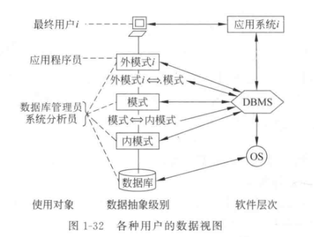

一个具体 DBMS 安装在某个操作系统之上，再配合具体应用系统，才形成完整数据库系统。数据库系统中存在多种用户，他们看到的数据库抽象层次各不相同。

- `最终用户` 通过应用系统界面完成业务活动，数据库模式结构对他们是透明的。
- `应用程序员` 以外模式为基础编写应用程序。数据库映像机制让他们可以把底层存储细节交给系统内部实现。
- `系统分析员` 负责需求分析与规范说明，因此要从整体上理解系统，参与软硬件配置和各级模式的概要设计。

DBA 的职责

`数据库管理员（DBA）` 是数据库系统中最重要的角色之一，职责如下

- 设计与定义数据库系统，参与从概念模式到内模式的全部设计。
- 帮助最终用户使用数据库系统，包括培训和答疑。
- 监督与控制数据库系统使用和运行，包括权限控制、问题处理和审计信息收集。
- 改进和重组数据库系统、调优性能。DBA 要监测空间利用率和处理效率，并根据实际运行情况修改参数、改善设计、定期重组织数据库。
- 转储与恢复数据库。DBA 要定义并实施后援和恢复策略，保证故障发生后能尽快恢复到正确状态。
- 重构数据库。当应用需求增大或变化时，DBA 要负责较大规模的模式和内模式调整。


## 第2章 关系数据模型


### 2.1 关系数据库概述

这一章正式进入关系数据库的核心内容。前面第一章已经给出数据库系统的整体框架，这一章开始把关系模型本身拆开，依次讨论它的数据结构、关系操作和完整性约束。

关系模型的三部分

- `关系数据结构` 负责回答数据在逻辑上怎样组织。关系模型在这一层的特点很鲜明，用户看到的是扁平的二维表。
- `关系操作` 负责回答怎样查询和更新这些表。关系模型采用集合操作方式，也就是“一次一集合（set-at-a-time）”。
- `完整性约束` 负责回答哪些关系状态是合法的。课程里最重要的是实体完整性、参照完整性和用户定义完整性。

关系模型为什么重要

- 关系数据库系统是支持关系模型的数据库系统。
- 关系数据库目前仍然是最重要、最流行的一类数据库。20 世纪 80 年代以来，新推出的数据库管理系统产品几乎都以关系数据库为主，许多非关系系统也会提供关系接口。
- 这门课后面关于 SQL、数据库编程和关系数据理论的主体内容，都是沿着关系模型展开。

关系操作的特点

- 关系模型的数据结构看上去很简单，实际表达能力很强，能够描述实体以及实体间的多种联系。
- 关系操作采用集合操作方式，操作对象和操作结果都是集合，这一点和“一次一记录（record-at-a-time）”的处理方式有明显差别。
- 常用操作包括选择、投影、连接、除、并、交、差等查询操作，以及增加、删除、修改等更新操作。

关系数据语言的三类形式

- `关系代数` 用对关系的运算来表达查询要求。
- `关系演算` 用谓词来表达查询要求，按谓词变元的不同又分成元组关系演算和域关系演算。
- `SQL` 介于代数方式和演算方式之间，既有丰富的查询能力，也有数据定义和数据控制能力。
- 这些语言共同的特点是表达能力完整、面向集合、非过程化，并且能够嵌入高级语言中使用。


### 2.2 关系数据结构

这一节要把“关系”这个对象真正说清楚。关系模型虽然以二维表呈现，底层定义却建立在集合论之上，因此这一节先从域、笛卡儿积和关系的形式化定义开始。

域

- `域（domain）` 是一组具有相同数据类型的值的集合。
- 非负整数、整数、实数、长度小于 25 字节的字符串集合、取值范围在 0 到 100 之间的正整数集合，都可以作为域。
- 关系中的属性值都来自某个域，理解域之后，后面“同一列值来自同一域”这一条性质才真正站得住。

笛卡儿积

- 给定一组域，这些域可以完全不同，也可以部分或全部相同，它们的笛卡儿积由所有可能的有序组合构成。
- 笛卡儿积中的每个元素叫作一个 $n$ 元组，也简称元组；元组中的每个值叫作一个分量。
- 若各域都是有限集，则笛卡儿积的基数等于各域基数的乘积。
- 笛卡儿积可以表示成一张二维表，每一行对应一个元组，每一列对应一个域。

关系的形式化定义

- 在给定域上的笛卡儿积中，任意一个子集都可以称作这些域上的一个 `关系（relation）`。
- 关系中的每个元素就是该关系的元组，通常记作 $t$。
- 当关系的目为 1 时，称为单元关系；目为 2 时，称为二元关系。
- 关系也是一个二维表，它已经从笛卡儿积中筛出了真正有语义的元组。

属性、码与主码

- 由于多个列可能来自相同的域，因此每一列都要取一个名字，这个名字就是 `属性（attribute）`。
- 若关系中某一属性组的值能够唯一标识一个元组，同时它的任何真子集都做不到这一点，这个属性组就叫 `候选码（candidate key）`。
- 一个关系可能有多个候选码，其中选定的那个叫 `主码（primary key）`。
- 候选码中的属性叫 `主属性（prime attribute）`。
- 不包含在任何候选码中的属性叫 `非码属性（non-key attribute）`。
- 当关系模式的所有属性一起构成候选码时，这个模式属于 `全码（all-key）` 的情形。

关系的一个简单例子

设有三个域：

- 导师集合 $SUPERVISOR=\{\text{张清玫，刘逸}\}$
- 专业集合 $SPECIALITY=\{\text{计算机专业，信息专业}\}$
- 研究生集合 $POSTGRADUATE=\{\text{李勇，刘晨，王名}\}$

这三个域的笛卡儿积一共有 $2\times 2\times 3=12$ 个元组。若从中取出有实际意义的元组，就可以构成关系

$$
SAP(SUPERVISOR, SPECIALITY, POSTGRADUATE)
$$

在“一个研究生对应一个导师和一个专业”这一假设下，表中保留下来的元组才具有业务含义。若再附加“研究生姓名不重名”的假设，则 `POSTGRADUATE` 可以作为这个关系的主码。

基本关系的六条性质

教材把基本关系的性质归纳为六条，这六条是把“表”看成“关系”时需要额外注意的地方。

- 列是同质的，也就是每列中的分量来自同一个域。
- 不同列可以出自同一个域，此时要给这些列取不同的属性名。
- 列的顺序无关紧要，交换列次序不改变关系语义。
- 任意两个元组都要保持可区分状态，关系中不会出现完全相同的两行。
- 行的顺序无关紧要，交换元组次序不改变关系语义。
- 每个分量都要取原子值，也就是每个分量都对应不可再分的数据项。

**为什么强调原子值**

- 关系模型要求关系保持规范化，其中最基础的一条，就是每个分量都要是原子值。
- 例如一个导师对应多个研究生时，若把多个研究生姓名直接塞进同一格，就形成了非规范化关系，这种写法在关系数据库中不会直接采用。

关系模式

- 关系模式是对关系的描述，它不只说明“有哪些列”，还要说明这些列来自哪些域，以及属性和域之间的对应关系。
- 进一步说，一个关系还带有元组语义和完整性约束，因此关系模式需要能够把这些内容一起描述出来。
- 教材给出的形式化表示为

$$
R(U,D,DOM,F)
$$

其中：

- $R$ 表示关系名；
- $U$ 表示属性名集合；
- $D$ 表示属性组 $U$ 中属性所来自的域；
- $DOM$ 表示属性到域的映像集合；
- $F$ 表示属性间数据依赖关系集合。

**关系模式与关系的区别**

- 关系模式属于“型”，关系属于“值”。
- 关系模式是静态、稳定的，关系是动态、随时间变化的。
- 实际讨论中常常把二者统称为关系，具体含义需要结合上下文判断。

关系数据库

- 在关系模型中，实体以及实体间的联系都用关系表示，因此一个现实世界领域中的全部相关关系集合，就构成了 `关系数据库`。
- 关系数据库也分成型和值。型通常叫关系数据库模式，值则是这些关系模式在某一时刻对应的关系集合。
- 日常语境中常把关系数据库模式和关系数据库统称为关系数据库。


### 2.3 关系的完整性

这一节讨论关系模型中哪些约束是系统要守住的。关系模型的完整性规则，用来规定关系的合法状态。

三类完整性

- 关系模型中有三类完整性约束：实体完整性、参照完整性和用户定义完整性。
- 其中实体完整性和参照完整性是关系模型要满足的约束，教材把它们称为关系的两个不变性。
- 用户定义完整性来自具体业务场景，内容随应用而变化。

实体完整性

- 一个基本关系通常对应现实世界中的一个实体集。
- 现实世界中的实体能够区分开来，关系模型中承担这项作用的是主码。
- 主码中的属性，也就是主属性，需要保持非空。空值表示“不知道”或“无意义”，主属性一旦出现空值，实体的唯一标识就失效了。
- 教材把这一条写成规则 2.1：若属性 $A$ 是基本关系 $R$ 的主属性，则属性 $A$ 需要保持非空。
- 若主码由多个属性组成，则这些主属性都要保持非空。比如选修关系 `选修（学号，课程号，成绩）` 中，`学号` 和 `课程号` 都要保持非空。

参照完整性

- 现实世界中的实体之间存在联系，在关系模型中，这些联系表现为关系与关系之间的引用。
- 例如：
- `学生（学号，姓名，性别，专业号，年龄）` 引用了 `专业（专业号，专业名）` 中的 `专业号`；
- `选修（学号，课程号，成绩）` 同时引用了学生关系的 `学号` 和课程关系的 `课程号`；
- `学生2（学号，姓名，性别，专业号，年龄，班长）` 中的 `班长` 还会引用本关系中的 `学号`。

外码、参照关系、被参照关系

- 设 $F$ 是基本关系 $R$ 的一个或一组属性，$F$ 本身不构成 $R$ 的码。
- 若 $F$ 与基本关系 $S$ 的主码 $K$ 相对应，则 $F$ 称为基本关系 $R$ 的 `外码（foreign key）`。
- 这里的 $R$ 称为 `参照关系（referencing relation）`。
- 这里的 $S$ 称为 `被参照关系（referenced relation）` 或 `目标关系（target relation）`。
- $R$ 和 $S$ 可以是同一个关系。
- 外码和对应主码要定义在同一个域，或者定义在同一组域上。

参照完整性规则

- 教材把这一条写成规则 2.2：若属性组 $F$ 是基本关系 $R$ 的外码，并且与基本关系 $S$ 的主码 $K$ 相对应，则对于 $R$ 中每个元组在 $F$ 上的值，有两种合法情况。
- 第一种情况是 $F$ 取空值，也就是 $F$ 中每个属性都为空。
- 第二种情况是 $F$ 的值等于 $S$ 中某个元组的主码值。

**怎样理解“可以为空”**

- 对学生关系中的 `专业号` 来说，空值表示这个学生尚未被分配专业。
- 对选修关系中的 `学号` 和 `课程号` 来说，虽然参照完整性允许外码为空，实体完整性又要求主属性非空，因此这里实际只能取被参照关系中已经存在的主码值。
- 对 `学生2` 关系中的 `班长` 来说，空值表示这个班尚未选出班长；非空值则要对应本关系中某个真实存在的学号。

用户定义完整性

- 用户定义完整性针对的是某个具体关系数据库的语义要求。
- 常见形式包括：某个属性保持唯一取值，某个非主属性保持非空，某个属性的值落在固定范围内。
- 例如成绩限定在 0 到 100 之间、年龄保持在退休年龄以下，这些都属于用户定义完整性。
- 教材强调，关系模型应当提供定义和检验这类完整性的机制，这样系统可以统一处理这些规则。


### 2.4 关系代数

关系代数是一种抽象的查询语言，它用“对关系做运算”的方式表达查询要求。后面学习 SQL 时，很多查询结构都可以回到这一层来理解。

关系代数的三大要素

- 任何一种运算都离不开运算对象、运算符和运算结果。
- 在关系代数里，运算对象是关系，运算结果仍然是关系。
- 教材把关系代数中的运算符分成四类：集合运算符、专门的关系运算符、算术比较符和逻辑运算符。

常用记号

- 设关系模式为 $R(U)$，关系实例记作 $R$，元组记作 $t$。
- 若 $A$ 是属性列，则 $t[A]$ 表示元组 $t$ 在属性列 $A$ 上的分量集合。
- 若有关系 $R(X,Z)$，当 $t[X]=x$ 时，$x$ 在 $R$ 中关于 $Z$ 的象集表示为“所有满足 $X=x$ 的元组在 $Z$ 上的分量集合”。
- 这个象集概念在理解除法时非常关键。


#### 2.4.1 传统的集合运算

这一部分把关系看成元组的集合，运算主要从“行”的角度展开。

并、差、交

- 传统集合运算包括并、差、交和广义笛卡儿积。
- 对并、差、交来说，参与运算的两个关系要满足相同的目，并且对应属性来自同一个域。
- 并运算写作

$$
R\cup S=\{\,t\mid t\in R \lor t\in S\,\}
$$

- 差运算写作

$$
R-S=\{\,t\mid t\in R \land t\notin S\,\}
$$

- 交运算写作

$$
R\cap S=\{\,t\mid t\in R \land t\in S\,\}
$$

广义笛卡儿积

- 若 $R$ 是 $n$ 目关系，$S$ 是 $m$ 目关系，则 $R\times S$ 的结果是一个 $(n+m)$ 列元组的集合。
- 新元组的前 $n$ 个分量来自 $R$ 的一个元组，后 $m$ 个分量来自 $S$ 的一个元组。
- 若 $R$ 有 $r$ 个元组，$S$ 有 $s$ 个元组，则 $R\times S$ 有 $r\times s$ 个元组。
- 广义笛卡儿积常常作为连接运算的中间基础。


#### 2.4.2 专门的关系运算

专门的关系运算同时涉及行和列，是真正把关系模型查询能力展开的部分。

**选择**

- `选择（selection）` 也叫限制，它从关系 $R$ 中选出满足给定条件 $F$ 的元组。
- 记作 $ \sigma\_F(R) $。
- 其中 $F$ 是逻辑表达式，可以由比较运算符和逻辑运算符构成。
- 选择运算主要从“行”的角度过滤关系。

教材中的典型例子有：

- 查询信息系全体学生：$ \sigma\_{Sdept='IS'}(Student) $
- 查询年龄小于 20 岁的学生：$ \sigma\_{Sage<20}(Student) $

**投影**

- `投影（projection）` 从关系 $R$ 中选出若干属性列组成新的关系。
- 记作 $ \pi\_A(R) $，其中 $A$ 是属性列集合。
- 投影主要从“列”的角度做运算。
- 投影之后还要消去重复元组，因此投影的结果元组数可能少于原关系。

教材中的典型例子有：

- 查询学生姓名和所在系：$ \pi\_{Sname,Sdept}(Student) $
- 查询学生关系中有哪些系：$ \pi\_{Sdept}(Student) $

第二个例子之所以重要，是因为它提醒读者：投影除了删列，还会消去重复行。

**连接**

- `连接（join）` 从两个关系的笛卡儿积中，选出属性间满足给定条件的元组。
- 一般连接写作

$$
R \bowtie_{A\theta B} S
$$

其中 $A$ 和 $B$ 分别是 $R$ 和 $S$ 上度数相等且可比的属性组，$\theta$ 是比较运算符。

- 当 $\theta$ 取等号时，得到 `等值连接（equi-join）`。
- 当连接的属性组本身就是相同属性，并且结果中删除重复列时，得到 `自然连接（natural join）`。
- 一般连接主要从行的角度选元组，自然连接还要进一步处理重复列，因此它同时涉及行和列。

**除**

- `除（division）` 是关系代数里最难直观把握的运算。
- 给定关系 $R(X,Y)$ 和 $S(Y)$，$R\div S$ 的结果是一个新的关系 $P(X)$。
- $P$ 中保留的是这样一些 $X$ 值：对于 $S$ 中出现的每个 $Y$ 值，都能在 $R$ 中找到与该 $X$ 配对的元组。

**为什么除法重要**

- 除法对应的是“对所有”这类全称条件。
- 例如“选修了全部课程的学生”“至少选修了 1 号课程和 3 号课程的学生”，都可以借助除法表达。

教材中的典型思路包括：

- 查询至少选修了 1 号课程和 3 号课程的学生学号，可以先构造临时关系 $K=\{1,3\}$，再在选修关系上做除运算。
- 查询选修了全部课程的学生学号和姓名，可以先求 $ \pi\_{Sno,Cno}(SC)\div \pi\_{Cno}(Course) $，再和学生关系连接取姓名。

关系代数中的八种运算

- 这一节一共介绍了 8 种关系代数运算。
- 其中并、差、笛卡儿积、投影、选择属于基本运算。
- 交、连接、除都可以用前面的基本运算表达出来。
- 引入这些扩展运算不会增加表达能力，作用在于让表达式更简洁。


### 2.5 关系演算

这一节从另一条路去表达查询。关系代数强调“通过哪些运算得到结果”，关系演算强调“结果应当满足什么条件”。

关系演算的基本想法

- 关系演算以数理逻辑中的谓词演算为基础。
- 按谓词变元的不同，关系演算可分为元组关系演算和域关系演算。
- 课程通过 ALPHA 和 QBE 两种语言介绍这两条思路。


#### 2.5.1 元组关系演算语言 ALPHA

ALPHA 的基本格式

- 元组关系演算以元组变量作为谓词变元的基本对象。
- ALPHA 是 E. F. Codd 提出的元组关系演算语言，课程里主要借它来理解元组关系演算的表达方式，后来相关思路进入了 QUEL 等语言。
- ALPHA 的主要语句有 `GET`、`PUT`、`HOLD`、`UPDATE`、`DELETE`、`DROP`。
- 教材给出的基本格式是：

$$
\text{操作语句}\ \text{工作空间名}(\text{表达式}) : \text{操作条件}
$$

- 表达式说明操作对象，可以是关系名，也可以是属性名。
- 操作条件是逻辑表达式，也可以为空。

检索操作

- `GET` 用来实现检索。
- 简单检索可以直接对关系或属性取值，例如查询所有被选修课程的课程号：`GET W(SC.Cno)`。
- 带条件的检索可以在冒号后加逻辑表达式，例如查询信息系中年龄小于 20 岁的学生学号和年龄：


```

GET W(Student.Sno, Student.Sage): Student.Sdept='IS' ∧ Student.Sage<20

```

- ALPHA 还支持排序和定额，例如按年龄降序取出前 3 个信息系学生。

元组变量与量词

- 元组变量也叫范围变量，它在某个关系范围内变化。
- 元组变量有两项常见作用：一是简化关系名，二是配合存在量词和全称量词表达条件。
- 例如设 `RANGE Student X`，就可以用 `X` 代替 `Student`。
- 查询选修 2 号课程的学生姓名、查询至少选修一门其先修课为 6 号课程的学生姓名，都要借助存在量词来写。
- 查询选修全部课程的学生姓名，则要用到全称量词。

集函数与更新操作

- ALPHA 中还提供 `COUNT`、`TOTAL`、`MAX`、`MIN`、`AVG` 等集函数。
- 例如查询学生所在系的数目，可以用 `COUNT(Student.Sdept)`。
- 更新操作分成修改、插入、删除三类。
- 修改时先用 `HOLD` 把元组读到工作空间，再修改，再用 `UPDATE` 写回。
- 插入时先在工作空间中构造新元组，再用 `PUT` 插入指定关系。
- 删除时先 `HOLD` 目标元组，再用 `DELETE` 删除。
- 教材明确指出：主码值的修改一般通过“先删后插”间接完成。


#### 2.5.2 域关系演算语言 QBE

QBE 的特点

- 域关系演算以域变量作为谓词变元的基本对象。
- QBE 是 `query by example` 的缩写，它的最大特点是通过表格式界面构造查询。
- 用户在屏幕表格中填写示例元素和条件，系统再把这些填写内容解释成查询要求。
- 这种方式直观、易学，能够把域关系演算的思想直接呈现在界面上。

QBE 中的基本记号

- 示例如素可以看作域变量。
- `P.` 表示打印，也就是把该列输出到结果中。
- 比较条件直接写在对应属性列上，等号通常可以省略。
- 相同的示例如素写在不同关系中时，会形成连接条件。

典型查询方式

- 查询信息系全体学生姓名时，可以在 `Student` 表中让 `Sdept` 列等于 `IS`，让 `Sname` 列前加 `P.`。
- 查询全体学生的全部数据时，可以直接把 `P.` 作用在关系名上。
- 条件查询中，若多个条件写在同一行，表示逻辑“与”；若写在不同行并使用不同示例如素，表示逻辑“或”。
- 查询既选修 1 号课程又选修 2 号课程的学生学号时，要写两行，并让两行中的学号示例如素保持相同。
- 查询选修 1 号课程的学生姓名时，可以在 `SC` 和 `Student` 两个关系中使用相同的连接属性值完成连接。
- 查询未选修 1 号课程的学生姓名时，可以在关系名前加负号表示逻辑非。

集函数、排序与更新

- QBE 也提供 `CNT`、`SUM`、`AVG`、`MAX`、`MIN` 等集函数。
- 例如查询信息系学生平均年龄，可以在 `Sage` 列上使用 `P.AVG.ALL.`。
- 对结果排序时，升序写 `AO.`，降序写 `DO.`；多列排序时用 `AO(i).` 或 `DO(i).` 标明优先级。
- 更新操作中，`U.` 表示修改，`I.` 表示插入，`D.` 表示删除。
- 教材同样强调：关系的主码不允许直接修改，需要通过删除旧元组、插入新元组的方式实现。


### 2.6 关系数据库管理系统

这一节回到系统层面，讨论什么样的系统才能称为关系系统。教材在这里给的是“最低要求”和“支持程度分类”。

关系系统的最低要求

- 关系数据库管理系统简称关系系统，是支持关系模型的系统。
- 教材对实际系统给出的判断标准，落在两个最低要求上。
- 第一，系统要支持关系数据结构。也就是说，从用户观点看，数据库由表构成，并且系统中以表为核心结构。
- 第二，系统要支持选择、投影和自然连接这三类最主要的运算，而且这些运算不要求用户定义物理存取路径。

哪些系统还达不到关系系统要求

- 只支持表式数据结构而缺少集合级操作的系统，还达不到关系系统要求。
- 只支持表结构，同时缺少选择、投影和连接能力的系统，用户生产率不会真正提高。
- 提供选择、投影和连接，同时仍要求用户显式依赖物理存取路径的系统，也会破坏数据的物理独立性。

关系系统的四类划分

- 按照对关系模型支持程度的不同，教材把关系系统分成四类。
- `表式系统`：支持表结构，缺少集合级操作，这一类系统还不算真正的关系系统。
- `最小关系系统`：支持关系数据结构，同时支持选择、投影和连接。
- `关系完备系统`：支持关系数据结构和全部关系代数操作，功能上与关系代数等价。
- `全关系系统`：支持关系模型的全部特征，特别是域的概念、实体完整性和参照完整性。

关系系统与三级模式结构

- 不同关系系统对关系模型支持程度不同，体系结构仍然符合三级模式结构。
- 表是关系系统的模式。
- 视图对应关系系统的外模式。
- 实际存储在磁盘或磁带上的文件对应内模式。
- 模式与外模式之间的映像、模式与内模式之间的映像由关系系统自动提供和维护。


## 第3章 关系数据库标准语言 SQL

Note

SQL 这一章建议沿着两条线复习：一条线看 定义 / 查询 / 更新 / 视图，另一条线看 `SELECT` 怎样把关系代数里的选择、投影、连接和集合操作落成语句。


### 3.1 SQL 概述

这一节要解决“为什么 SQL 能成为关系数据库通用语言”这个问题。教材把 SQL 放在关系模型之后，是因为 SQL 正是把关系模型中的结构、查询、更新和控制变成工程语言的关键一层。


#### 3.1.1 SQL 的特点

SQL 是一种 高度非过程化 的语言。用户主要描述“要什么结果”，至于具体怎样选路径、怎样做连接、怎样利用索引，通常交给 DBMS 内部的优化器和执行器处理。

SQL 还有几个很重要的课程特征。

- 综合统一：DDL、DML、DCL 和查询能力放在同一种语言里。
- 面向集合：一条语句往往面向一组元组，处理粒度落在集合层面。
- 两种使用方式：既能交互式执行，也能嵌入程序或通过接口调用。
- 语法相对稳定：各家产品有方言差异，主干结构仍然高度相似。


#### 3.1.2 SQL 的基本概念

SQL 标准经过多次演进，早期有 SQL-86、SQL-89、SQL-92，之后又逐步扩展对象、递归、分析和 XML 等能力。复习时更重要的是抓住它的功能分层。

| 功能 | 常见命令 |
| --- | --- |
| 数据定义 DDL | `CREATE` `ALTER` `DROP` |
| 数据操纵 DML | `INSERT` `UPDATE` `DELETE` |
| 数据查询 DQL | `SELECT` |
| 数据控制 DCL | `GRANT` `REVOKE` |

SQL 书写上通常采用关键字大写、子句分行、缩进对齐的格式。语义判断依赖关键字和子句结构，排版主要负责提高可读性。


### 3.2 数据定义

这一节要解决“怎样把关系模式真正定义成数据库对象”这个问题。第 2 章里的模式还是理论对象，到第 3 章才开始落成数据库里的表、索引和模式。


#### 3.2.1 创建、修改与删除基本表

基本表是实际存储数据的核心对象。定义表时需要给出列名、数据类型以及约束。典型语法如下：


```

CREATE

TABLE

Student

(


sno

CHAR
(
8
)

PRIMARY

KEY
,


sname

VARCHAR
(
20
)

NOT

NULL
,


sex

CHAR
(
2
),


age

SMALLINT

CHECK

(
age

>

0
),


dept

VARCHAR
(
20
)

);

```

如果要修改表结构，常用语句是 `ALTER TABLE`；如果要删除表，则使用 `DROP TABLE`。例如：


```

ALTER

TABLE

Student

ADD

entrance_year

SMALLINT
;

```

复习时要顺带记住一个工程事实：`ALTER` 影响现有数据和应用代码的范围通常比新建表大得多，所以模式设计阶段的质量很重要。

教材还把模式、目录、数据库环境放在一起说明。简单理解就是：表总归属于某个模式，而模式又归属于更大的数据库管理环境。


#### 3.2.2 创建与删除索引

索引的作用是改善访问路径。逻辑上用户仍然按内容检索数据，物理上 DBMS 可以借助索引减少扫描范围。


```

CREATE

INDEX

idx_sc_cno

ON

SC
(
C

#
);

```

索引适合放在高频查询条件、连接属性和排序分组属性上。索引带来更快的检索速度，也会带来额外的维护开销，因为插入、删除和更新时系统还要同步调整索引结构。


### 3.3 查询

这一节要解决“怎样用一条 `SELECT` 语句表达从简单到复杂的查询需求”这个问题。教材把查询部分拆成单表查询、连接查询、嵌套查询和集合查询，顺序本身就是一条由浅入深的依赖链。


#### 3.3.1 单表查询

单表查询先处理一张表内部的投影、选择、排序和简单计算。`SELECT` 的基本框架是：


```

SELECT

[
ALL

|

DISTINCT
]

目标列表达式

FROM

表名或视图名

WHERE

条件表达式

GROUP

BY

分组列

HAVING

分组条件

ORDER

BY

排序列
;

```

教材和 UNIT 6 都强调“概念性执行步骤”。从理解角度看，可以按下面顺序把语句拆开：

1. 先确定 `FROM` 对应的数据来源。
2. 再按 `WHERE` 做行过滤。
3. 如果存在 `GROUP BY`，则把结果按分组列划成若干组。
4. 如果存在 `HAVING`，则对组再做一次筛选。
5. 最后由 `SELECT` 决定结果列，并按 `ORDER BY` 输出。

Tip

`FROM -> WHERE -> GROUP BY -> HAVING -> SELECT -> ORDER BY`

这条顺序更适合做题和调试。语句写出来时 `SELECT` 在前，理解执行逻辑时先从数据源和过滤条件开始。

> 看到复杂 SQL 时，先从 `FROM` 和 `WHERE` 下手，往往最容易把整条语句拆开。

**例**


```

SELECT

sno
,

sname
,

age

FROM

Student

WHERE

dept

=

'CS'

ORDER

BY

age

DESC
;

```

这条语句先在 `Student` 表中找出 `dept='CS'` 的元组，再投影出 `sno`、`sname`、`age` 三列，最后按年龄降序排列。

当查询结果中可能出现重复行时，可以使用 `DISTINCT`。课程里通常提醒一句：`DISTINCT` 会增加处理代价，所以只有在业务语义确实要求去重时才使用。


#### 3.3.2 连接查询

连接查询解决的是“结果列来自多张表”这一类问题。逻辑上它对应关系代数中的连接，语法上常见两种写法：旧式的逗号加 `WHERE`，以及标准的 `JOIN ... ON ...`。


```

SELECT

S
.
sno
,

S
.
sname
,

C
.
cname
,

SC
.
grade

FROM

S

JOIN

SC

ON

S
.
sno

=

SC
.
sno

JOIN

C

ON

SC
.
cno

=

C
.
cno
;

```

连接的关键是先找到连接条件。若连接条件缺失，系统会先形成笛卡儿积，再投影出大量无意义组合。课程里经常把这一点作为 SQL 初学者最容易出现的错误之一。

除了普通等值连接，还要掌握自然连接、自身连接和多表连接。自身连接的典型用途是“同一张表内部的关联”，例如一门课程的直接先修课和间接先修课查询。


#### 3.3.3 嵌套查询

嵌套查询解决的是“一个查询的条件依赖另一个查询结果”这一类问题。内层查询先返回一个集合、一个标量，或者按相关方式逐行求值，外层查询再使用这个结果。

常见谓词包括 `IN`、`EXISTS`、`ANY`、`ALL`。其中：

- `IN` 适合判断某值是否属于内层结果集。
- `EXISTS` 关心的是内层是否至少返回一行。
- `ANY` 和 `ALL` 用在量化比较中。

**例**


```

SELECT

sno

FROM

SC

WHERE

cno

=

'C2'


AND

sno

IN

(


SELECT

sno


FROM

SC


WHERE

cno

=

'C3'


);

```

这条语句查找同时选修 `C2` 和 `C3` 的学生。外层先选修 `C2`，内层给出选修 `C3` 的学生集合，再用 `IN` 求交。


#### 3.3.4 集合查询

集合查询这一部分既包括聚集函数与分组，也包括若干结果集之间的并、交、差思想在 SQL 中的体现。

聚集函数常见的有 `COUNT`、`SUM`、`AVG`、`MAX`、`MIN`。当查询里同时出现分组列和聚集函数时，`GROUP BY` 决定统计口径，`HAVING` 负责在组层面加条件。


```

SELECT

dept
,

AVG
(
age
)

AS

avg_age

FROM

Student

GROUP

BY

dept

HAVING

AVG
(
age
)

>=

20
;

```

在更高一级的集合运算里，SQL 常通过 `UNION` 组织并集思想，部分系统还支持 `INTERSECT` 与 `EXCEPT`。课程里还会用 `NOT EXISTS` 的嵌套结构来模拟关系代数的除法。


#### 3.3.5 小结

查询部分最关键的复习方法，是把每条 SQL 语句重新翻译成五个问题：数据源、过滤条件、结果列、分组方式和排序方式。这条链理顺后，复杂查询也能拆成稳定的逻辑步骤。


### 3.4 数据更新

这一节要解决“怎样把数据库从一个合法状态更新到另一个合法状态”这个问题。更新语句结构相对清楚，难点在于它们会直接改变数据库状态，因此后面会和完整性、事务、恢复连在一起。


#### 3.4.1 插入数据

插入分成“插入单个元组”和“插入查询结果”两类。


```

INSERT

INTO

SC
(
sno
,

cno
,

grade
)

VALUES

(
'95020'
,

'C1'
,

80
);

```

如果 `INTO` 后面显式列出属性名，则值按列名顺序对应，未出现的列取默认值或空值；如果省略列名，则值需与表定义中的列顺序一致。

把查询结果插入新表时，常用于生成中间统计表或派生数据集。


#### 3.4.2 修改数据

`UPDATE` 用来修改满足条件的元组，可以同时修改一列或多列，也可以通过子查询构造条件。


```

UPDATE

S

SET

SA

=

SA

+

1

WHERE

SD

=

'CS'
;

```

这里的关键落在更新范围的界定。`WHERE` 缺失时，整张表都会被改写。


#### 3.4.3 删除数据

`DELETE` 删除的是整行元组，不能只删除某一列中的一个值。


```

DELETE

FROM

SC

WHERE

sno

=

'95001'
;

```

删除最容易和参照完整性冲突。例如父表删除元组后，子表可能出现悬空外键。这个问题在事务一章里会再次出现，因为多个语句的执行顺序和原子性会直接影响一致性。


### 3.5 视图

这一节要解决“怎样为不同用户提供不同的数据观察窗口”这个问题。视图是 SQL 中非常重要的抽象工具，它兼顾了简化查询、增强安全和屏蔽逻辑复杂度这几件事。


#### 3.5.1 定义视图

视图是从一个或多个基本表导出的虚表。定义视图时，系统保存的是视图定义，结果集在访问时再按定义求出。


```

CREATE

VIEW

CS_Student

AS

SELECT

sno
,

sname
,

dept

FROM

Student

WHERE

dept

=

'CS'
;

```


#### 3.5.2 查询视图

查询视图时，用户可以把它当成普通表使用。DBMS 会把对视图的访问改写回基本表上的操作。对使用者而言，这一步通常是透明的。

视图特别适合封装高频的连接逻辑和条件过滤逻辑。这样应用层拿到的是相对稳定的接口，底层表结构调整时也更容易集中处理。


#### 3.5.3 更新视图

可更新视图只覆盖一部分场景。若视图包含分组、聚集、去重、复杂连接或派生列，系统往往很难把更新唯一地映射回某个基本表元组。

复习这部分时，重点把握一个判断原则：系统得能明确知道“这次更新最终要改动哪个基本表中的哪些元组”。这个映射越不唯一，视图越难更新。


#### 3.5.4 视图的用途

视图最常见的用途有三类。

- 简化查询，把复杂连接和条件封装起来。
- 控制权限，只暴露用户需要看到的列和行。
- 提供逻辑独立性，让应用程序通过视图接触数据，降低对底层表的直接依赖。

**小结**

第 3 章把关系模型的理论表达，变成了数据库里真正可执行的语言。定义、查询、更新和视图共同构成 SQL 的主干，后续的安全、完整性、事务和编程接口都建立在这一层之上。


## 第4章 数据库编程


### 4.1 PL/SQL

这一节要解决“当单条 SQL 语句不足以表达完整业务流程时，数据库端怎样组织程序逻辑”这个问题。教材第 4 章以数据库编程为主题，PPT 的 UNIT 10 则从嵌入式 SQL 与 API 的角度对这一章作了课堂展开。


#### 4.1.1 PL/SQL 的块结构

PL/SQL 是在 SQL 基础上加入过程控制能力的程序设计语言。它把 SQL 的集合操作能力和过程语言的变量、分支、循环组织到同一段程序里。

PL/SQL 的基本结构是块：


```

DECLARE


v_count

NUMBER

:
=

0
;

BEGIN


SELECT

COUNT
(
*
)

INTO

v_count


FROM

SC


WHERE

cno

=

'C1'
;


DBMS_OUTPUT
.
PUT_LINE
(
v_count
);

EXCEPTION


WHEN

OTHERS

THEN


ROLLBACK
;

END
;

/

```

块结构使程序自然分成声明区、执行区和异常处理区。这样做的意义在于：数据访问、流程控制和错误处理被放进同一逻辑单元里。


#### 4.1.2 变量和常量的定义

变量负责在 SQL 与程序逻辑之间传递数据。定义变量时通常要给出名字、类型和可选初值，常量则额外用 `CONSTANT` 指出其值在运行过程中保持稳定。

这里要特别注意“数据库类型”和“程序变量类型”的对应关系。数据库编程最常见的问题之一，就是值已经查出来了，但宿主变量的类型、长度或空值语义和列定义不匹配。


#### 4.1.3 流程控制

数据库编程引入流程控制，是为了解决纯 SQL 难以独立完成的控制逻辑，例如条件分支、重复处理、错误分支跳转和事务边界控制。

常见结构包括 `IF...THEN...ELSE`、`LOOP`、`WHILE`、`FOR`。它们负责把若干 SQL 操作按业务顺序组织起来。


#### 4.1.4 游标

SQL 天然面向集合，过程语言经常面向一条条记录。游标就是协调这两种处理方式的桥梁。它先打开查询结果集，再逐行取出记录，最后关闭游标。

`insight：` 游标的意义落在“把集合结果接到逐行处理逻辑上”。当任务本来就适合整集合完成时，直接用单条 SQL 语句往往更自然；当后续逻辑得逐条判断时，游标才真正发挥作用。


### 4.2 存储过程和函数

这一节要解决“怎样把数据库端逻辑封装成可重用模块”这个问题。把 SQL 语句散落在应用代码里，维护成本很高；把它们集中为存储过程和函数后，复用和控制会更加稳定。


#### 4.2.1 存储过程

存储过程是一组保存在数据库中的预编译程序单元，可以带输入输出参数，用来封装一段可重复调用的数据库操作。


```

CREATE

OR

REPLACE

PROCEDURE

update_grade
(


p_sno

IN

CHAR
,


p_cno

IN

CHAR
,


p_grade

IN

NUMBER

)

AS

BEGIN


UPDATE

SC


SET

grade

=

p_grade


WHERE

sno

=

p_sno

AND

cno

=

p_cno
;

END
;

/

```

存储过程的好处在于逻辑集中、网络交互更少、权限控制更方便。很多系统也把它作为事务边界控制和批量业务处理的重要工具。


#### 4.2.2 函数

函数与存储过程类似，差别在于函数更强调“返回一个值”，因此更适合封装计算逻辑或派生结果。

在设计上，过程偏向执行动作，函数偏向产生结果。复习时把这两个角色区分开后，很多题目就容易判断。


### 4.3 ODBC 编程

这一节要解决“应用程序怎样通过统一接口访问不同数据库”这个问题。教材第 4 章按 ODBC 和 JDBC 展开，PPT 的 UNIT 10 则强调了编程接口与嵌入式 SQL 的关系。


#### 4.3.1 开放式数据库互连概述

ODBC（Open Database Connectivity）是一套数据库访问接口标准。应用程序通过统一函数调用驱动程序，再由驱动程序和目标数据库通信。

这种做法最重要的价值是“接口统一”。程序员面对的是统一 API，底层具体连接 SQL Server、MySQL 还是 KingbaseES，由驱动和数据源配置承担差异。


#### 4.3.2 ODBC 工作原理

ODBC 的核心链路是：应用程序 -> ODBC API -> 驱动管理器 -> 驱动程序 -> DBMS。应用发出的连接、执行、取数和提交请求，都沿着这条链传递。

工作原理里要抓住两个点。第一，驱动管理器负责在多个驱动之间做协调。第二，具体数据库相关细节由驱动程序吸收，因此应用程序得到的是相对稳定的编程接口。


#### 4.3.3 ODBC 编程

ODBC 编程通常包括环境句柄、连接句柄和语句句柄三个层次。典型流程是：

1. 分配环境和连接句柄。
2. 建立连接。
3. 分配语句句柄并执行 SQL。
4. 绑定结果列或参数。
5. 逐行提取结果。
6. 释放句柄并断开连接。

教材和代码页里反复出现 `SQLAllocHandle`、`SQLConnect`、`SQLExecDirect`、`SQLFetch` 这类函数。复习时不必死记每个函数的参数细节，更重要的是理解整条调用链。


#### 4.3.4 ODBC 的工作流程

ODBC 的工作流程与事务和错误处理紧密相关。连接建立后，程序可以设置自动提交方式，也可以显式控制提交和回滚。查询型语句通常走“执行 -> 取数 -> 关闭”的流程，更新型语句则更关注返回码、事务边界和异常处理。


### 4.4 JDBC 编程

这一节要解决“在 Java 环境里怎样访问数据库”这个问题。JDBC 是 Java 世界最常用的数据库接口，与 ODBC 一样强调接口统一，但它直接面向 Java 对象体系。


#### 4.4.1 概念

JDBC 的核心对象包括 `DriverManager` 或 `DataSource`、`Connection`、`Statement` 或 `PreparedStatement`、`ResultSet`。连接对象负责会话和事务，语句对象负责发送 SQL，请求结果由结果集对象逐行读取。

相比直接拼接 SQL 字符串，`PreparedStatement` 更适合正式开发，因为它能把参数绑定和语句结构分开，便于复用，也有利于减少注入风险。


#### 4.4.2 实用例子


```

Connection

conn

=

DriverManager
.
getConnection
(
url
,

user
,

password
);

PreparedStatement

ps

=

conn
.
prepareStatement
(


"select sno, sname from Student where dept = ?"

);

ps
.
setString
(
1
,

"CS"
);

ResultSet

rs

=

ps
.
executeQuery
();

while

(
rs
.
next
())

{


System
.
out
.
println
(
rs
.
getString
(
"sno"
)

+

" "

+

rs
.
getString
(
"sname"
));

}

rs
.
close
();

ps
.
close
();

conn
.
close
();

```

这段程序的逻辑和 ODBC 十分接近：先建立连接，再准备语句，随后绑定参数、执行、读取结果，最后释放资源。数据库编程接口看起来形式很多，底层思路保持高度一致。


#### 4.4.3 主要接口分类

教材把 JDBC 的主要接口按职责拆成几组来看，这样比逐个背类名更容易形成结构感。

- `连接管理接口`：`DriverManager` 和 `DataSource` 用来获取连接。前者直接，后者更适合连接池和容器环境。
- `会话接口`：`Connection` 代表一次数据库会话，负责事务提交、回滚、自动提交开关等控制。
- `语句接口`：`Statement` 适合直接执行静态 SQL，`PreparedStatement` 适合带参数语句，`CallableStatement` 适合调用存储过程。
- `结果接口`：`ResultSet` 用来逐行读取查询结果，并负责列值到 Java 类型的转换。

`insight：` JDBC 的类很多，真正的主线相当清楚。先拿到 `Connection`，再创建语句对象，执行后读取 `ResultSet`，最后在连接层提交或回滚事务。这条链稳定后，换具体驱动时思路也会保持一致。

**小结**

第 4 章把“写 SQL”推进到“组织数据库应用逻辑”。PL/SQL、存储过程、ODBC 和 JDBC 共同说明了一件事：数据库语言总要和程序控制流、错误处理和事务边界结合起来，才能变成真正可运行的系统。


## 第5章 数据库保护

Important

- `安全性` 管谁能访问数据。
- `完整性` 管什么数据能进入系统。
- `并发控制` 管多人同时操作时怎样保持正确。
- `恢复` 管故障发生后怎样回到一致状态。


### 5.1 安全性

这一节要解决“谁能访问数据库、能访问到什么程度、系统怎样防止非法使用”这个问题。教材把安全性放在数据库保护的最前面，因为数据共享越强，安全控制越要前置。


#### 5.1.1 安全性控制的一般方法

数据库安全性是对数据库进行控制，防止数据泄露、篡改和破坏。课程材料强调“层层设防”的思路，常见安全控制手段包括：

- 用户标识与认证。
- 存取控制。
- 视图限制。
- 审计追踪。
- 数据加密。

存取控制是安全性的中心。按策略不同，常见方法有 `自主存取控制（DAC）` 和 `强制存取控制（MAC）`。DAC 的特点是灵活，用户拥有的权限在一定条件下还能继续授予别人；MAC 更强调强制标签和系统级统一控制。

PPT 里还提到“最小特权策略”。它的含义很直接：主体只拥有完成当前工作所必需的权限。这样做可以缩小权限扩散面，也方便审计和故障追踪。


#### 5.1.2 SQL 中的安全性控制

SQL 层面最常见的安全控制语句是 `GRANT` 和 `REVOKE`。


```

GRANT

SELECT
,

UPDATE

ON

Student

TO

U1
;

REVOKE

UPDATE

ON

Student

FROM

U1
;

```

授权的对象可以是表、视图、属性列，授权主体可以是具体用户、角色或 `PUBLIC`。如果使用 `WITH GRANT OPTION`，获得权限的用户还可以继续传播该权限；当上游权限被收回时，这条传播链上的派生权限也会随之级联回收。

SQL 层面的安全性控制还有三类常见配套手段。

- `基于视图的存取控制`：先把允许暴露的数据定义成视图，再把视图权限授给用户。
- `审计`：记录谁在什么时间执行了哪些操作，便于追踪和问责。
- `触发器`：把特殊安全规则写成事件驱动逻辑，由系统自动执行。

角色机制的好处在于：权限先授给角色，再把角色分配给用户，管理规模增大时比逐个用户授权更清楚。


### 5.2 完整性

这一节要解决“怎样在数据库层面防止语义错误进入系统”这个问题。安全性回答“谁可以做”，完整性回答“做成什么样才算合法”。


#### 5.2.1 完整性约束条件

完整性约束可以看成施加在数据库状态和状态变化上的语义规则。前面第 2 章已经接触过实体完整性、参照完整性和用户定义完整性，这里把它们放回 DBMS 控制机制中再看一遍。

从对象粒度分，约束可以落在列、元组和关系上；从状态角度分，约束可以描述静态状态，也可以描述新旧状态变化。这个分类很有用，因为它解释了为什么某些检查只看单行，某些检查得跨表或跨事务完成。


#### 5.2.2 完整性控制

DBMS 的完整性子系统通常有三项职责：定义约束、检查约束、在违反约束时采取动作。动作类型除了“拒绝更新”，参照完整性场景里还可能有级联删除、级联更新、置空等策略。

完整性检查的时机同样关键。有些约束可以在单条语句结束时判断，有些约束需要放到事务结束时整体判断。这个差别会直接影响事务设计和恢复行为。


#### 5.2.3 SQL 中的完整性控制

SQL 里最常见的完整性定义方式包括 `NOT NULL`、`UNIQUE`、`PRIMARY KEY`、`FOREIGN KEY` 和 `CHECK`。


```

CREATE

TABLE

SC

(


sno

CHAR
(
8
),


cno

CHAR
(
8
),


grade

SMALLINT

CHECK

(
grade

BETWEEN

0

AND

100
),


PRIMARY

KEY

(
sno
,

cno
),


FOREIGN

KEY

(
sno
)

REFERENCES

S
(
sno
),


FOREIGN

KEY

(
cno
)

REFERENCES

C
(
cno
)

);

```

这里主键保证实体完整性，外键保证参照完整性，`CHECK` 则表达用户定义完整性。把这些规则放进表定义中，含义是“约束从应用代码里上移到数据库模式中统一维护”。


### 5.3 并发控制

这一节要解决“多个事务同时访问数据库时，怎样既保持隔离性，又维持尽量高的并发度”这个问题。教材先讲事务，再讲调度、封锁和恢复，是一条非常自然的依赖链。


#### 5.3.1 并发控制概述

事务是数据库的逻辑工作单位。一个事务由若干数据库操作组成，这些操作作为一个整体执行，要么全部完成，要么整体回滚。

事务的四个基本性质常写成 `ACID`：

- `Atomicity` 原子性：事务中的操作作为整体完成。
- `Consistency` 一致性：事务执行前后数据库都处于一致状态。
- `Isolation` 隔离性：并发事务之间互不干扰。
- `Durability` 持久性：事务提交后的结果能够长期保留。

多个事务并发时，最容易出现四类不一致现象：丢失修改、不可重复读、脏读和幻像。它们的共同根源是：不同事务对同一数据对象的冲突操作发生了无序交错。

Note

做题时先看两个事务是否同时读写同一对象，再看读到的是未提交值、重复读取值，还是同一条件下结果集发生变化。沿着这个顺序判断，更容易区分 脏读、不可重复读、幻像。

> 并发控制题通常适合先画时间线，再标出每一步读的是旧值、当前值还是未提交值。


#### 5.3.2 并发操作的调度

调度描述的是多个事务操作在时间上的穿插次序。最稳妥的方式是串行调度，也就是一个事务做完再做下一个；真正的系统通常采用并发调度，以换取更高吞吐量。

并发调度的正确性准则是 `可串行化`。如果一个并发调度的执行结果等价于某个串行调度的结果，就称这个并发调度是可串行化的。

`insight：` 可串行化看起来像在谈“执行顺序”，真正约束的是“结果等价”。系统未必真的逐个事务串行执行，当最终效果能对应到某个串行次序时，这个调度仍然正确。


#### 5.3.3 封锁

封锁是最常见的并发控制方法之一。事务在访问数据对象前先申请锁，系统依据锁类型和相容性决定是否允许其他事务继续访问。

常见锁有：

- `X 锁`：排它锁，也叫写锁。
- `S 锁`：共享锁，也叫读锁。

教材和 UNIT 16 给出了一、二、三级封锁协议：

- 一级封锁协议：写前加 `X` 锁，直到事务结束才释放，可防止丢失修改。
- 二级封锁协议：在一级基础上，读前加 `S` 锁，读完后释放，可进一步防止脏读。
- 三级封锁协议：读前加 `S` 锁并保持到事务结束，可进一步防止不可重复读。

两段锁协议（2PL）则从更一般的调度角度出发：事务先进入加锁扩展阶段，开始释放锁后就进入收缩阶段，此后不再申请新锁。两段锁协议是可串行化的充分条件。

PPT 还把隔离级别作为课程重点放在这里补充。SQL-92 常见四级隔离性如下：

| 隔离级别 | 脏读 | 不可重复读 | 幻像 |
| --- | --- | --- | --- |
| `READ UNCOMMITTED` | 可能出现 | 可能出现 | 可能出现 |
| `READ COMMITTED` | 被抑制 | 可能出现 | 可能出现 |
| `REPEATABLE READ` | 被抑制 | 被抑制 | 可能出现 |
| `SERIALIZABLE` | 被抑制 | 被抑制 | 被抑制 |


#### 5.3.4 活锁和死锁

封锁带来正确性，也会带来等待问题。活锁指事务长期等待却总轮不到自己执行；死锁指若干事务彼此等待、形成循环依赖。

活锁常通过先来先服务等调度策略缓解。死锁则常通过两类办法处理：

- 预防：从资源申请顺序等规则上降低死锁出现概率。
- 诊断与解除：通过超时法或等待图法发现死锁，再撤销代价较小的事务。


### 5.4 恢复

这一节要解决“故障发生后怎样把数据库带回一致状态”这个问题。事务的原子性和持久性最终都要依赖恢复机制落地。


#### 5.4.1 恢复的原理

数据库恢复的目标，是把数据库从错误状态恢复到某个已知的正确状态。当系统出现硬件故障、软件错误、事务异常终止或介质损坏时，恢复就有必要。

恢复的基本思想是利用冗余数据修复错误状态。最常见的冗余手段有两类：数据转储和日志文件。前者提供某一时刻的后备副本，后者记录事务更新历史。

日志中通常至少包含事务开始标志、提交或回滚标志，以及每次更新操作的对象、旧值和新值。这样故障发生后，系统才能判断哪些事务需要撤销，哪些事务需要重做。


#### 5.4.2 恢复的实现技术

系统故障后，恢复往往要同时执行 `UNDO` 和 `REDO`。

- `UNDO`：撤销未完成事务留下的影响。
- `REDO`：重做已提交事务中尚未真正写入数据库的数据。

UNIT 16 给出的标准流程是：先正向扫描日志建立 `UNDO` 和 `REDO` 队列，再反向扫描执行撤销，最后正向扫描执行重做。

检查点技术的作用，是把高速缓存中的已修改页同步回磁盘，从而缩短恢复时需要重做的日志范围。检查点和日志配合工作，共同减少恢复成本。


### 5.5 数据库复制与数据库镜像

这一节要解决“怎样通过冗余副本提升可用性和容灾能力”这个问题。教材把复制与镜像放在恢复之后，是因为它们同样属于可用性保障体系的一部分。


#### 5.5.1 数据库复制

数据库复制是把数据库副本保存在多个站点，用来支撑分布式环境下的访问和容错。教材页面里给出的复制方式包括对等复制、主从复制和级联复制。

- 对等复制：各节点地位接近，适合多点共享访问。
- 主从复制：主库负责更新，从库负责同步和读取扩展。
- 级联复制：复制链可以继续向下扩展，适合更大范围分发。

复制的核心问题是副本一致性。同步越及时，一致性越强，系统开销通常也越高。


#### 5.5.2 数据库镜像

数据库镜像可以看作实时性更强的一类冗余副本。主数据库更新时，系统把最新结果同步到镜像数据库。这样主库出现介质故障后，镜像库可以较快接替服务。

镜像强调“快速切换”，复制强调“多点保留和分发”。二者都在提升可用性，关注重心有所不同。

**小结**

第 5 章把“数据库能不能长期稳定运行”这个问题拆成四块：安全性负责阻止非法访问，完整性负责阻止错误数据进入系统，并发控制负责在共享环境中维持正确性，恢复与复制机制负责在故障出现后重建可用状态。


## 第6章 关系数据库设计理论


### 6.1 数据依赖

这一节要解决“为什么某些表结构会带来冗余和更新异常，以及怎样用形式化工具描述这些问题”这个问题。第 6 章是规范化理论的基础章，概念比 SQL 更抽象，复习时先把符号约定立住会更顺手。

设关系模式记为 $R(U, F)$。其中 $U$ 是属性全集，$F$ 是属性间的数据依赖集合；$X$、$Y$、$Z$ 都表示 $U$ 的子集。


#### 6.1.1 关系模式中的数据依赖

课程里最重要的数据依赖是 `函数依赖（functional dependency）`。若对关系模式 $R(U)$ 的任一合法关系 $r$，都不存在两个元组在 $X$ 上取值相同而在 $Y$ 上取值不同，则称 $Y$ 函数依赖于 $X$，记作：

$$
X \to Y
$$

函数依赖表达的是“确定关系”。例如学号确定姓名，可写成 `S# -> SN`；课程号确定课程名，可写成 `C# -> CN`。

在类型上，函数依赖常分成：

- 平凡函数依赖：$Y \subseteq X$，例如 $AB \to A$。
- 非平凡函数依赖：$Y \nsubseteq X$。
- 完全函数依赖、部分函数依赖、传递函数依赖：它们对应后面 2NF、3NF、BCNF 的判断基础。


#### 6.1.2 数据依赖对关系模式的影响

不良设计中的插入异常、删除异常、冗余和修改复杂，根源通常都在属性之间存在不合适的数据依赖，却又被塞进同一个关系模式中。

例如关系

$$
Borrow(S\#, SN, SD, PHONE, B\#, BN, DATE)
$$

如果主键取为 `(S#, B#, DATE)`，那么学生姓名、院系、电话会随每次借书记录重复出现。一个学生转系，可能要改多行；一个新生尚未借书，其信息也难以单独插入。这些现象都说明数据依赖和模式组织方式之间出现了错位。


#### 6.1.3 有关概念

候选键、主属性和非主属性是规范化里的三个基础概念。

- `候选键`：能够唯一标识元组的最小属性集。
- `主属性`：出现在某个候选键中的属性。
- `非主属性`：不属于任何候选键的属性。

判断候选键时，课堂上常把 `Armstrong` 公理和属性闭包一起作为工具使用。三条基本公理是：

- 自反律：若 $Y \subseteq X$，则 $X \to Y$。
- 增广律：若 $X \to Y$，则 $XZ \to YZ$。
- 传递律：若 $X \to Y$ 且 $Y \to Z$，则 $X \to Z$。

属性集 $X$ 关于 $F$ 的闭包记为 $X^+$，定义为：

$$
X^+ = \{ A \in U \mid X \to A \in F^+ \}
$$

它的用途很直接。

- 若 $X^+ = U$，则 $X$ 是超键。
- 若再满足任一真子集 $X' \subset X$ 都有 $X'^+ \neq U$，则 $X$ 是候选键。
- 若要判断 $X \to Y$ 是否成立，只需看 $Y \subseteq X^+$ 是否成立。


### 6.2 范式

这一节要解决“怎样按依赖类型逐层改进关系模式”这个问题。范式是一条从低到高不断消除冗余来源的路线。

| 范式 | 核心要求 | 主要消除的问题 |
| --- | --- | --- |
| `1NF` | 每个分量都是原子值 | 复合字段、多值字段 |
| `2NF` | 非主属性完全依赖候选键 | 对组合键的部分依赖 |
| `3NF` | 非主属性不经其他非主属性传递依赖候选键 | 传递依赖 |
| `BCNF` | 每个决定因素都是超键 | 非键决定主属性等更隐蔽冗余 |
| `4NF` | 消除不合适的多值依赖 | 多组独立多值事实混放 |


#### 6.2.1 第一范式（1NF）

第一范式要求关系的每个分量都取原子值。表中每个单元格都应当是不可再分的单值。

如果一张表里某列直接放入“主要家庭成员列表”“一组爱好”这类复合或多值内容，就违背了 1NF。第 1 步通常是先把这类内容拆开，让关系结构真正回到原子属性层面。


#### 6.2.2 第二范式（2NF）

第二范式建立在 1NF 之上，要求所有非主属性完全函数依赖于每个候选键。它要消除的是“非主属性对主键的部分函数依赖”。

例如关系 `SC(S#, C#, SN, CN, G)` 中，若键为 `(S#, C#)`，则 `SN` 只依赖 `S#`，`CN` 只依赖 `C#`，依赖范围都落在键的一部分属性上，因此模式不满足 2NF。

拆分后可得到：

$$
S(S\#, SN),\quad C(C\#, CN),\quad SC(S\#, C\#, G)
$$

这样非主属性才回到与完整键对应的位置。


#### 6.2.3 第三范式（3NF）

第三范式建立在 2NF 之上，要求非主属性不经由其他非主属性传递依赖于候选键。它要消除的是“主键 -> 非主属性 -> 另一非主属性”这类链式依赖。

例如关系 `S_L(S#, SD, SL)` 中，若有 `S# -> SD` 且 `SD -> SL`，则 `SL` 经由 `SD` 传递依赖于 `S#`。此时可以把模式分解为：

$$
S\_D(S\#, SD),\quad D\_L(SD, SL)
$$

`insight：` 区分部分依赖和传递依赖时，先看决定因素与整个候选键的关系，再看中间是否经过其他非主属性。前者对应 2NF，后者对应 3NF。


#### 6.2.4 BC 范式（BCNF）

BCNF 比 3NF 更严格。它要求对关系模式中每一个非平凡函数依赖 `X -> Y`，决定因素 `X` 都要是超键。

3NF 允许某些“右部是主属性”的依赖继续保留，BCNF 则继续往前收紧。教材中的典型情形是：一个模式已经消除了部分依赖和传递依赖，模式里仍保留“非键决定主属性”的情况，这时 3NF 仍停留在过渡层级。

从判断角度看，若模式中每个决定因素都是超键，则模式属于 BCNF。


#### 6.2.5 多值依赖与第四范式（4NF）

第四范式建立在 BCNF 之上，处理的是 `多值依赖（multi-valued dependency）`。当一个主键同时独立决定两组互不相关的多值属性时，就容易出现组合爆炸式冗余。

若在关系 `R` 中存在非平凡多值依赖 `X ->> Y`，且 `X` 未达到超键条件，则模式不满足 4NF。此时需要继续分解，让互不相关的多值事实分开保存。


### 6.3 关系模式的规范化

这一节要解决“怎样从依赖分析真正走到模式分解”这个问题。规范化对应持续分解和验证的过程，范式是这个过程里的阶段标记。


#### 6.3.1 关系模式规范化的步骤

教材把规范化理解为一系列从低范式向高范式推进的分解步骤。通常可以按下面的顺序理解：

1. 先确认满足 1NF。
2. 消除非主属性对候选键的部分依赖，得到 2NF。
3. 消除传递依赖，得到 3NF。
4. 若仍有决定因素未达到超键条件的函数依赖，则继续分解到 BCNF。
5. 若存在不合适的多值依赖，则继续处理到 4NF。

课堂里还会把 $F^+$、属性闭包、最小函数依赖集带进这一步，原因是分解时得先明确有哪些依赖真正成立，哪些依赖属于表面现象。

最小函数依赖集的目标，是把依赖集合化到更便于计算的形式：

- 每条依赖右部只保留单属性。
- 左部不含多余属性。
- 集合内无冗余依赖。


#### 6.3.2 关系模式的分解

模式分解时，至少要关心三个问题：属性是否完整、连接是否无损、依赖能否保持。

设关系模式 $R(U, F)$ 被分解成 $R_1(U_1)$ 和 $R_2(U_2)$。二元分解无损连接的常见判定条件是：

$$
(U_1 \cap U_2) \to (U_1 - U_2)
\quad \text{或} \quad
(U_1 \cap U_2) \to (U_2 - U_1)
$$

在 $F^+$ 中成立。

这条式子的含义是：两个子模式的公共属性足以确定其中一边独有的属性，于是连接回去时不会平白生成新的伪元组。

依赖保持则要求：原来的约束能够在各子模式局部检查后仍被整体保证。工程上常希望得到“无损连接且依赖保持”的 3NF 分解；若继续追求 BCNF，有时会遇到依赖保持和更高范式之间的权衡。

Tip

先看 `属性是否完整`，再看 `连接是否无损`，最后看 `依赖是否保持`。前两步决定结果能否拼回原关系，最后一步决定约束还能否在子模式上继续检查。

**小结**

第 6 章的核心不在于背出几条范式定义，而在于形成一条稳定判断链：先找依赖，再算键和闭包，再识别异常来源，最后用分解把不合适的依赖拆开。规范化的目标始终是减少冗余、降低异常和提升模式清晰度。


## 第7章 数据库设计

Tip

- `需求分析`：业务规则、数据字典、处理需求。
- `概念设计`：E-R / EER 模型。
- `逻辑设计`：关系模式、键、约束、用户子模式。
- `物理设计`：索引、存储结构、访问路径。


### 7.1 数据库设计的步骤

这一节要解决“数据库设计为什么需要分阶段进行”这个问题。教材把第 7 章作为独立章节，是因为数据库开发要先经过逐层抽象，再落到表结构。

数据库设计通常按下面顺序推进：

1. 需求分析。
2. 概念结构设计。
3. 逻辑结构设计。
4. 物理结构设计。
5. 数据库实施。
6. 数据库运行与维护。

这个顺序体现的是知识依赖关系。需求不清，概念结构就站不稳；概念模型不清，逻辑模型转换就容易失真；逻辑模型不清，物理优化也失去依据。


### 7.2 需求分析

这一节要解决“数据库到底要支持什么对象、什么业务、什么约束和什么性能”这个问题。设计阶段最怕需求理解偏掉，模型复杂属于次一级问题。


#### 7.2.1 需求分析的任务

需求分析的任务，是通过调查现实系统，明确新系统的信息需求、处理需求、安全需求、完整性需求和性能需求，并据此划定系统边界。

教材和 UNIT 11 都强调“前瞻性和用户参与”。原因在于数据库进入运行阶段后，会牵动多个部门和多个应用，需求分析阶段如果只记录当前表面流程，后续修改代价通常很高。


#### 7.2.2 需求分析的方法

常见方法包括跟班作业、开调查会、询问、查阅业务记录、设计调查表以及请业务骨干集中介绍。方法的取舍要看场景，关键在于交叉验证。

需求分析常采用自顶向下的方法。先看组织整体业务，再逐步分解到部门、岗位和数据项，最后回到全局收口。


#### 7.2.3 数据字典

数据字典（DD）是需求分析的重要产物，用来记录数据项、数据结构、数据流、处理过程和数据存储等对象的含义、组成和约束。

它的价值体现在后续概念设计、逻辑设计和实现阶段都引用同一套术语和定义。数据字典发生混乱时，E-R 图和表结构很容易前后失配。


### 7.3 概念结构设计

这一节要解决“怎样把需求转成独立于具体 DBMS 的概念模型”这个问题。概念结构设计是数据库设计的关键，因为它决定后面所有关系模式的语义边界。


#### 7.3.1 概念结构设计的方法与步骤

概念结构设计的结果通常是概念模型，最常见的表达工具就是 E-R 图。E-R 模型由 `实体`、`属性` 和 `联系` 三个基本因素构成。

- 实体类型：一组具有相同属性、能独立存在的对象。
- 属性：实体或联系的特征。
- 联系：实体之间有意义的关联。

属性还可以继续细分为简单属性、复合属性、单值属性、多值属性和导出属性；关键字属性里又有候选键、主键和复合键。UNIT 12 对这一层讲得很细，复习时适合把这些术语和图形表示对应起来。


#### 7.3.2 抽象数据并设计局部视图

在局部应用层面做概念设计时，常常先围绕某个业务主题画出局部 E-R 图。这里要特别注意弱实体、结构化约束和 EER 扩展。

`弱实体` 依赖强实体存在，仅靠自身属性无法唯一标识实例。例如“学生家庭成员”相对“学生”就是典型弱实体。弱实体的主键往往由自身部分键和强实体主键共同组成。

结构化约束描述实体参与联系时的数量范围，重点落在基数和参与约束。二元联系里最常见的三类是 `1:1`、`1:N` 和 `M:N`。

当简单 E-R 模型表达力不够时，可以引入 EER 中的特殊化、概化、聚合和组合。特殊化与概化解决“超类/子类”问题，聚合与组合解决“整体/部分”问题。


#### 7.3.3 集成局部视图

多个局部视图最终要集成为全局概念结构。集成时常见冲突包括：

- 命名冲突：同名异义或异名同义。
- 属性冲突：取值范围、单位、精度或含义不一致。
- 结构冲突：某处画成属性，另一处画成实体或联系。

集成阶段要把冗余、冲突和语义重叠统一整理。只有全局概念结构收敛，逻辑设计阶段的模式转换才不会大面积返工。


#### 7.3.4 UML

教材把 UML 放在概念结构设计末尾，是因为某些应用场景里，面向对象分析和数据库设计需要共享同一套概念描述。类图、关联、多重性等概念和 E-R 模型有相通之处。

课程主线仍然是 E-R/EER，UML 则帮助数据库设计与更大的软件系统分析过程衔接。


### 7.4 逻辑结构设计

这一节要解决“怎样把概念模型转换成 DBMS 能实现的逻辑模式”这个问题。第 7 章前半在信息世界里工作，这一节开始进入计算机世界里的具体数据模型。


#### 7.4.1 E-R 图向数据模型的转换

E-R 图向关系模型转换时，可以抓住几条稳定规则。

- 强实体转换成表，简单单值属性转换成列，主键转换成表主键。
- 复合属性拆成若干简单属性列。
- 多值属性单独转换成表，并用外键连回属主实体。
- `1:1` 联系可根据参与约束决定把外键放在哪一方，或直接合并成一张表。
- `1:N` 联系通常把“一”方主键作为“多”方外键。
- `M:N` 和一般 `n` 元联系通常转换成独立联系表。

教材和 UNIT 13 还给出了弱实体转换规则。若弱实体只依赖一个强实体并参与 `1:N` 联系，转换后的表主键通常由“强实体主键 + 弱实体部分键”共同组成。


#### 7.4.2 数据模型的优化

概念模型转换成关系模式后，逻辑设计还要继续结合规范化理论、业务查询特征和 DBMS 限制，对模式作进一步优化。

这一步里常见工作包括：

- 消除明显冗余和更新异常。
- 在查询代价和更新代价之间权衡是否反规范化。
- 结合系统特性调整属性组织方式。

UNIT 11 明确提醒过：逻辑设计除了完成 E-R 图到表的转换，还要考虑性能问题。规范化理论提供结构清晰度，业务负载则提供现实约束。


#### 7.4.3 设计用户子模式

用户子模式是面向具体应用和用户群体的数据视图。它来自全局逻辑模式，但只保留某一类用户需要接触的部分。

子模式的价值主要有两点：一是让应用接口更简洁；二是配合视图和权限控制，减少用户暴露在复杂全局结构前的范围。


### 7.5 数据库物理设计

这一节要解决“逻辑模式确定后，数据在存储设备上怎样组织才能满足性能要求”这个问题。逻辑设计回答“存什么”，物理设计回答“怎样存得更合适”。

物理设计的核心任务包括确定数据库的物理结构，再对时间效率、空间效率和维护代价进行评价。教材和 UNIT 11 都强调物理设计需要从事务出发，也就是要先知道哪些事务最频繁、访问哪些关系、对响应时间有什么要求。

物理设计通常围绕四类决策展开。

- `确定数据的存储结构`：决定表、索引、日志等对象怎样落到物理设备上。
- `设计数据的存取路径`：决定是否建立索引、建立单列索引还是组合索引、是否采用聚簇。
- `确定数据的存放位置`：考虑表和索引是否分盘放置，日志是否单独放置，冷热数据是否分开。
- `调整系统配置`：根据并发量、缓冲区、数据库大小、锁数量等参数做初步优化。

教材对 `聚簇（cluster）` 讲得比较细，它适合在“按同一聚簇码访问是主要负载、每个聚簇码对应元组数适中、聚簇码相对稳定”这类场景中使用。聚簇能够减少相关元组分散在多个物理块上的情况，从而降低 I/O 次数；代价是建立和维护聚簇本身也会带来明显开销。


### 7.6 数据库实施

这一节要解决“设计结果怎样真正变成可运行数据库”这个问题。数据库实施一般包括定义数据库结构、装载数据、编制与调试应用程序以及试运行。

实施阶段最容易低估的工作是数据装载和联调。教材把这一节拆成四项工作，每一项都直接影响后面的试运行质量。

- `定义数据库结构`：用 DDL 把逻辑结构和物理结构真正写成表、视图、索引等数据库对象。
- `数据装载`：筛选原始数据、转换格式、校验正确性，再把数据组织入库。中大型系统通常需要专门的数据输入子系统。
- `编制与调试应用程序`：应用程序设计和数据设计并行推进，常常需要先用模拟数据联调。
- `数据库试运行`：先做功能测试，再做性能测试，根据结果回调物理结构甚至逻辑结构。

`insight：` 教材将试运行放在实施阶段，原因很直接。试运行的任务是验证设计结果是否能够实现。性能或一致性目标不满足时，就得及时回到前面的设计环节调整，问题也要在正式运行前处理完。


### 7.7 数据库运行与维护

这一节要解决“系统上线以后，数据库工作是否结束”这个问题。数据库上线以后，运行维护阶段才真正展开，而且这一阶段往往持续时间最长，也最考验 DBA 和系统管理员的能力。

教材和 PPT 总结的维护重点包括：

- 数据库转储和恢复。
- 安全性和完整性控制。
- 性能监督、分析与改进。
- 数据库重组织和重构。

其中最后一项最容易混淆。`重组织` 指在原有逻辑结构和物理结构不变的前提下，重新安排存储位置、回收空间、改善访问效率；`重构造` 指应用环境变化已经推动模式、内模式、索引或约束本身发生调整。前者更接近整理和优化，后者已经进入结构调整层面。

数据库设计属于持续演化的工作。业务变化、负载变化和数据规模变化都会逼着系统继续调整。


### 7.8 小结

第 7 章把数据库设计过程完整串了起来。需求分析负责把问题说清楚，概念设计负责把语义理顺，逻辑设计把语义转成模式，物理设计把模式落到存储，实施与维护则把数据库真正送入长期运行状态。


## 第8章 数据库技术新进展


### 8.1 数据库技术发展概述

这一节要解决“数据库技术为什么会不断演化，以及今天的新技术是从哪里生长出来的”这个问题。教材和 UNIT 17 都从历史线索切入：层次和网状数据库、关系数据库，再到新一代多模型系统。

数据库技术的演进背后，始终有三股力量同时推动：

- 数据规模扩大。
- 数据类型从结构化走向半结构化与非结构化。
- 应用从单机事务处理走向网络化、分布式、智能化场景。


### 8.2 数据模型及数据库系统的发展

这一节要解决“数据库系统按代际划分时，各代系统分别解决了什么问题”这个问题。教材目录在这里保持了非常清楚的时间顺序。


#### 8.2.1 第一代数据库系统

第一代数据库系统主要是层次数据库和网状数据库。它们支持三级模式结构，也有独立的数据定义语言，但联系表达依赖存储路径，操作方式带有较强导航色彩。

这一代系统在大型主机时代发挥过重要作用，代价是用户常常要沿着预先设计好的路径访问数据，数据独立性和灵活性都受到限制。


#### 8.2.2 第二代数据库系统

第二代数据库系统以关系数据库系统为代表。关系模型引入后，数据结构统一为关系，数据共享性提高，冗余下降，数据独立性增强，DBMS 对数据的统一管理能力也更完整。

从课程全书的组织方式也能看出这一代系统的重要性：关系模型、SQL、事务、规范化和数据库设计理论都以关系数据库为中心展开。


#### 8.2.3 新一代数据库系统

新一代数据库系统会同时围绕对象模型、XML、文档模型、RDF、键值模型、图模型等多种数据组织方式展开。教材在这里强调的重点落在数据库开始面向更加复杂的数据对象、更加丰富的语义和更加多样的系统结构。

课程材料把新一代系统概括为三条主线。

- `支持数据管理、对象管理和知识管理`：系统要能处理复杂对象和规则，同时覆盖传统表记录。
- `继承第二代数据库系统的成熟技术`：非过程化访问方式、事务、恢复、优化等能力仍然保留。
- `对其他系统开放`：标准接口、网络协议、可移植性和互操作能力都变得更重要。


### 8.3 数据库系统发展的特点

这一节要解决“数据库技术近几十年的主要变化落在什么方向”这个问题。相比只记住产品名称，更值得记的是变化轨迹本身。


#### 8.3.1 数据模型的发展

数据模型的发展大致经历了格式化模型、关系模型，再到多模型与非传统模型的扩展。教材在这一段列出的重点模型，适合按“表达对象是什么、为什么会出现”来理解。

- `对象数据模型`：把对象、类、继承、封装这些面向对象概念引入数据建模，目标是提高复杂语义表达能力。
- `XML 数据模型`：面向半结构化数据，用结点标记树表达层次和顺序，适合网络数据交换。
- `RDF 数据模型`：用主语、谓词、宾语三元组表达对象及关系，是语义网和知识库的重要基础。
- `K-V 数据模型`：用键到值的映射表达数据，结构简单，读写性能和可扩展性突出。
- `NoSQL / NewSQL`：前者强调突破传统关系模型在大规模分布式场景下的限制，后者希望在保持 SQL 和事务能力的同时获得更强扩展性。

关系模型仍然是主干，新的模型更多是在原有主干外扩展新的适用边界。很多现代数据库依然保留关系模型，同时把关系能力和对象、文档、图或时序能力放进同一系统中。


#### 8.3.2 数据库技术与相关计算机技术相结合

数据库系统越来越深地和并行计算、分布式系统、云平台、内存计算、移动环境、人工智能、Web 技术相结合。教材在第 8 章后半段反复强调这一点，因为现代数据管理问题已经很难只在单机关系数据库内部解决。

这一类结合在教材里有比较清楚的对应关系。

- 数据库技术和并行分布式处理技术结合，形成并行数据库与分布式数据库。
- 数据库技术和云计算技术结合，形成云数据库。
- 数据库技术和新硬件技术结合，形成内存数据库与数据库一体机。
- 数据库技术和 Web、移动、人工智能技术结合，形成 Web 数据库、嵌入移动数据库、AI 数据库等方向。

从工程角度看，这意味着数据库学习不能只停留在模式设计和 SQL 语法，还要理解数据管理在更大系统中的位置。


#### 8.3.3 小结

数据库系统的发展呈现明显的分工趋势。关系数据库继续承担强事务和结构化数据主线任务，其他模型则在大数据、图关系、文档和半结构化场景中扩展能力边界。


### 8.4 数据仓库与数据分析

这一节要解决“为什么业务数据库和分析系统不能简单混为一谈”这个问题。教材先讲数据库，再讲数据仓库，正是在区分操作型处理和分析型处理。

| 维度 | `OLTP` | `OLAP` |
| --- | --- | --- |
| 目标 | 支撑日常事务处理 | 支撑分析、统计、决策 |
| 数据特征 | 当前数据多、更新频繁 | 历史数据多、更新批量化 |
| 查询形态 | 短事务、点查、写操作多 | 复杂聚合、统计、钻取 |
| 关注点 | 响应时间、一致性、并发 | 汇总能力、主题组织、分析效率 |


#### 8.4.1 从数据库到数据仓库

数据库主要服务日常业务处理，数据仓库则面向分析、报表和决策支持。数据仓库通常从多个业务数据库中抽取、清洗、集成数据，形成围绕主题组织的历史数据环境。

PPT 在这里给出的区分很直接：数据库关注 `OLTP`，数据仓库关注 `OLAP`。前者强调联机事务处理，后者强调联机分析处理。


#### 8.4.2 数据仓库的基本特征

教材和 UNIT 17 都把数据仓库的典型特征概括为：

- 面向主题。
- 集成性。
- 稳定性。
- 时变性。

这些特征说明数据仓库会围绕分析主题组织数据，会保留较长时间跨度，也会稳定地支撑统计分析和决策任务。


#### 8.4.3 分析工具

分析工具主要包括 `OLAP` 和 `数据挖掘（DM）`。

- `OLAP` 强调多维分析、快速汇总和交互式切片钻取。
- 数据挖掘强调从大量数据中发现隐藏模式、规则和趋势。

它们共同构成了从“存数据”走向“用数据”的关键环节。


#### 8.4.4 基于数据库技术的数据仓库系统

课程里把基于数据库技术的数据仓库系统写成：

$$
DWS = DW + OLAP + DM
$$

其中 `DW` 负责数据存储和组织，`OLAP` 负责多维分析，`DM` 负责知识发现。这个式子本身就很好地概括了现代分析平台的基本构成。


### 8.5 开源数据库

这一节要解决“为什么开源数据库会成为现代数据基础设施中的重要力量”这个问题。教材从定义、许可和分类三个层面来整理开源数据库。


#### 8.5.1 开源数据库的特色

开源数据库的基本特征是源代码开放、社区协作、使用门槛较低、可按需要扩展。它在教学、创业、互联网业务和基础设施国产化场景里都占有很高比重。

许可协议会影响开源数据库的传播和商业使用方式。Copyleft 类协议强调衍生代码继续开放，宽松协议则给商业封装保留更大空间。


#### 8.5.2 三类开源数据库

结合教材和 PPT 的组织，可以把开源数据库粗略分成三类。

- 开源关系数据库，例如 PostgreSQL、MySQL 等。
- 开源 NoSQL 数据库，例如 Redis、MongoDB、Cassandra、Neo4j 等。
- 开源 NewSQL 数据库，例如 TiDB 等。

这三类系统分别对应不同的数据组织方式和扩展目标。复习时不要把 “NoSQL” 和 “NewSQL” 误当成具体数据模型，它们更像一类系统路线的统称。


### 8.6 数据管理技术的发展趋势

这一节要解决“未来数据管理面临什么变化、什么挑战，以及可能沿什么方向继续演进”这个问题。教材把这一章收在趋势展望上，是为了把全书内容重新放回真实世界的技术演化里。


#### 8.6.1 数据管理与应用所面临的巨大变化

数据量持续增长，数据来源越来越异构，实时性要求不断提高，用户也越来越希望系统同时具备事务能力、分析能力和智能处理能力。

这意味着数据库系统既要保持传统的可靠性和一致性，又要面对分布式、半结构化数据、跨平台集成和大规模分析的新要求。


#### 8.6.2 数据管理技术面临的挑战

主要挑战可以概括为：

- 多模型数据统一管理。
- 海量数据下的可扩展性与高可用。
- 安全、隐私与合规要求增强。
- 事务处理与分析处理的协同。
- 云环境与智能应用带来的新接口和新负载。

这些挑战让“事务、恢复、设计理论、约束控制”这些基础知识变得更重要，因为它们是复杂系统继续稳定演化的底座。


#### 8.6.3 数据管理技术的发展与展望

从课程给出的材料来看，未来数据库技术会沿着几个方向继续推进：更强的分布式能力、更灵活的多模型支持、更深入地与云平台和 AI 协同、更完善的开源生态，以及更细致的安全与治理机制。

对这门课来说，更适合抓住一条稳定主线：无论技术形态怎样变化，数据结构、约束、查询、事务、恢复和设计方法始终是数据管理技术的核心。

Important

对象 -> 模型 -> SQL -> 编程 -> 保护 -> 设计理论 -> 设计流程 -> 新技术

顺着这条线回看，很多章节间的依赖关系会自然连起来。

**总小结**

这份笔记按照教材八章顺序把整门课串成了一条连续的知识链。第 1 章给出对象和结构框架，第 2 章建立关系模型基础，第 3 章把模型落成 SQL，第 4 章把 SQL 接入程序逻辑，第 5 章讨论安全、完整性、事务与恢复，第 6 章解释规范化与模式分解，第 7 章把需求一路走到设计实施，第 8 章再把这些内容放回数据库技术的历史和趋势中重新理解。复习时沿着这条链回看，知识点之间的依赖关系会比单独背定义清楚得多。
