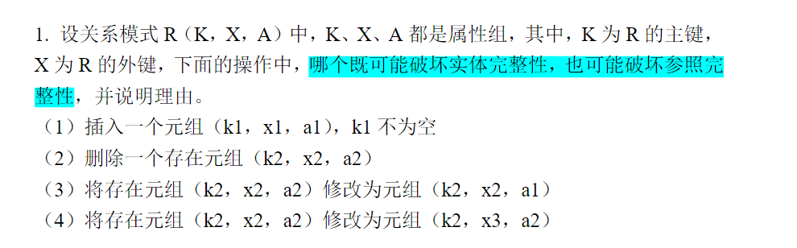
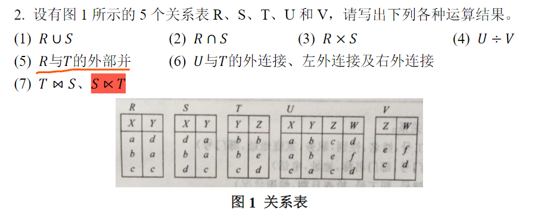
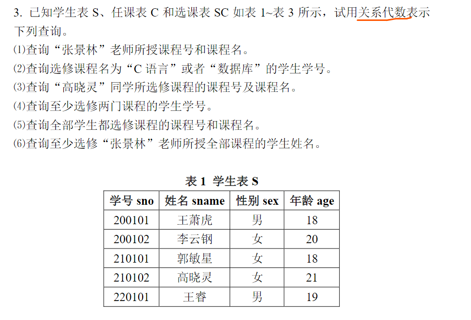
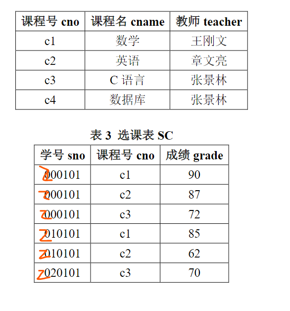
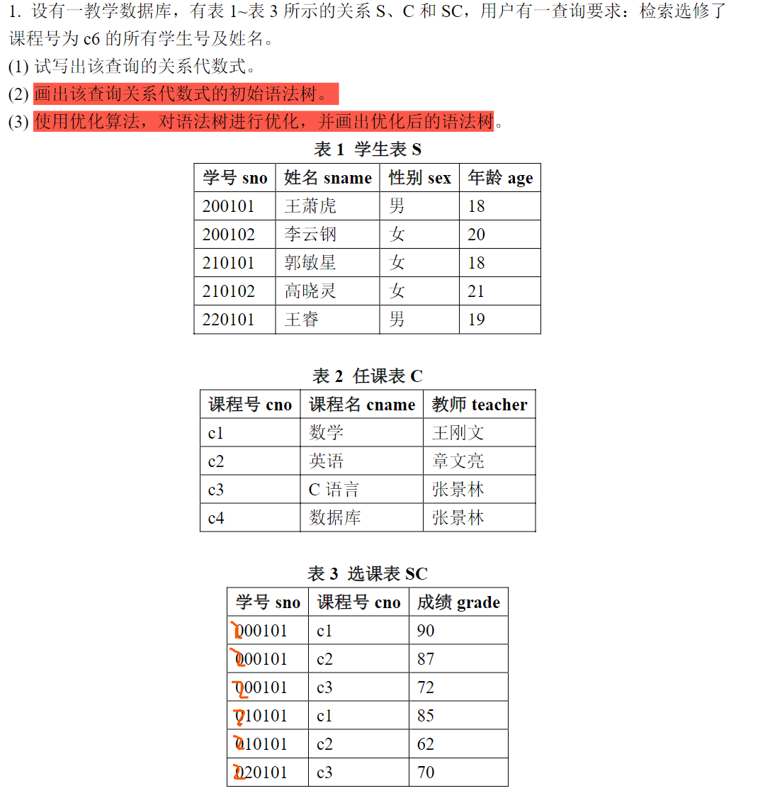

# 作业

## 第一次作业

（1）题目只说明了k1不为空，若k1与关系R中某个已有主键值重复，就会触发主键冲突，于是 **实体完整性被破坏**；此外，若x1在它所参照的关系中找不到对应主键值，就会触发外键失配，导致 **参照完整性被破坏**

（2）删除操作将导致元组直接消失，自身的主键约束也退出讨论范围，所以实体完整性问题无法讨论；对于参照完整性，只有在别的元组或别的关系把k1当作被参照键时，删除它才可能造成悬空引用

（3）把 $(k2, x2, a2)$ 改成 $(k2, x2, a1)$，改动发生在普通属性 $A$ 上，主键 $K$ 和外键 $X$ 都保持原值，因此这两类完整性约束都处于原来的状态。

（4）把 $(k2, x2, a2)$改成 $(k2, x3, a2)$，主键 $K$ 维持为 $k2$，实体完整性这一侧保持原状；外键从 $x2$ 改成了 $x3$，若 $x3$ 在被参照关系中找不到对应主键值，就会破坏参照完整性。

**综上**，发生改变的只有（1）

---

将图中关系写为标准形式：
$$
\begin{align}
R(X,Y) &= {(a,d),(b,a),(c,c)}\
S(X,Y)&={(d,a),(b,a),(d,c)}\
T(Y,Z)&={(b,b),(b,e),(c,d)}\
U(X,Y,Z,W)&={(a,b,c,d),(a,b,e,f),(c,a,c,d)}\
V(Z,W)&={(e,f),(c,d)}
\end{align}
$$
(1)
$$
R∪S={(a,d),(b,a),(c,c),(d,a),(d,c)}
$$
(2)
$$
R∩S={(b,a)}
$$
(3)将属性结果写为 $(R.X,R.Y,S.X,S.Y)$
$$
R×S=\left {
\begin{align}
&(a,d,d,a),(a,d,b,a),(a,d,d,c),(b,a,d,a),(b,a,b,a)\
&(b,a,d,c),(c,c,d,a),(c,c,b,a),(c,c,d,c)
\end{align}
\right }
$$
(4)在 $U$ 里，$(a,b)$ 同时对应了 $V$ 中的两组 $(Z,W)$，也就是 $(c,d)$ 和 $(e,f)$。于是
$$
U÷V={(a,b)}
$$
(5)外部并后按属性 $(X,Y,Z)$ 书写，空缺位置记为 $\text{NULL}$：
$$
R外部并T={(a,d,NULL),(b,a,NULL),(c,c,NULL),(NULL,b,b),(NULL,b,e),(NULL,c,d)}
$$
(6)先写全连接，结果属性记为 $(X,Y,Z,W)$
$$
U⟗T={(a,b,e,f),(a,b,c,d),(c,a,c,d),(NULL,b,b,NULL),(NULL,c,d,NULL)}
$$
再写左外连接：
$$
U⟕T={(a,b,c,d),(a,b,e,f),(c,a,c,d)}
$$
然后是右外连接：
$$
U⟖T={(a,b,e,f),(NULL,b,b,NULL),(NULL,c,d,NULL)}
$$
(7)
$$
T⋈S={(d,c,d)}
$$

$$
S×T=\left\{
\begin{align}
&(d,a,b,b),(d,a,b,e),(d,a,c,d),(b,a,b,b),(b,a,b,e)\\
&(b,a,c,d),(d,c,b,b),(d,c,b,e),(d,c,c,d)
\end{align}
\right\}
$$

---

取
$$
S(sno,sname,sex,age),C(cno,cname,teacher),SC(sno,cno,grade)
$$
分别表示学生表、任课表和选课表

（1）直接从课程表中筛出教师为“张景林”的元组，再投影出课程号和课程名
$$
π\_{cno,cname}(σ\_{teacher=′张景林′}(C))
$$
(2)先在课程表中选出课程名为“C语言”或“数据库”的课程，再和选课表按 $cno$ 连接，最后投影出学生学号。
$$
π\_{sno}(SC⋈σ\_{cname=′C语言′∨cname=′数据库′}(C))
$$
(3)先从学生表里找出“高晓灵”，再接到她的选课记录，最后和课程表连接，于是能得到她所选课程的课程号和课程名。
$$
π\_{cno,cname}((σ\_{sname=′高晓灵′}(S)⋈SC)⋈C)
$$
(4)设
$$
A=ρ\_A​(SC),B=ρ\_B​(SC)
$$
其中，$\rho$ 表示重命名，则
$$
π\_{A.sno}(σ\_{A.sno=B.sno∧A.cno\ne B.cno}(A×B))
$$
(5)先把“全部学生的学号集合”取出来，再让选课关系对它做除法：
$$
π\_{cno,cname}(C⋈(π\_{cno,sno}(SC)÷π\_{sno}(S)))
$$
(6)先取出“张景林”授课的课程号集合，再用选课表去除：
$$
π\_{sname}(S⋈(π\_{sno,cno}(SC)÷π\_{cno}(σ\_{teacher=′张景林′}(C))))
$$

## 第二次作业

（1）关系代数式
$$
π\_{S.sno,S.sname}(σ\_{S.sno=SC.sno∧SC.cno=′c6′}(S×SC))
$$
